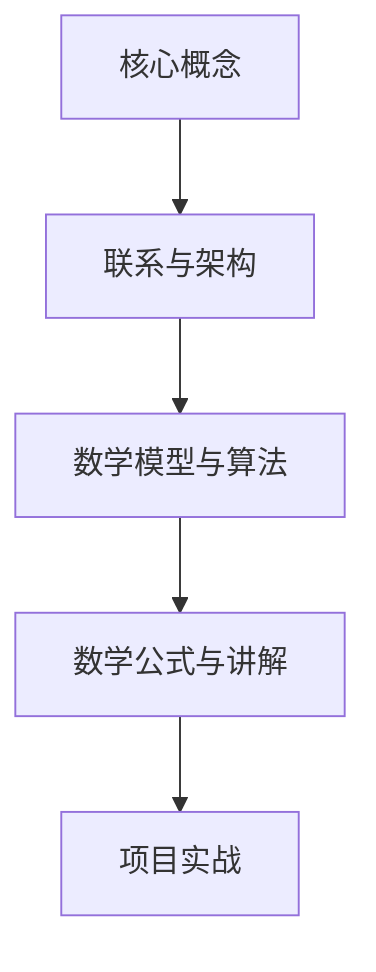
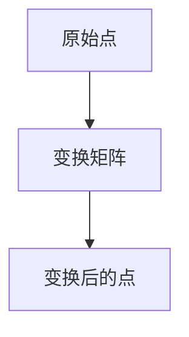
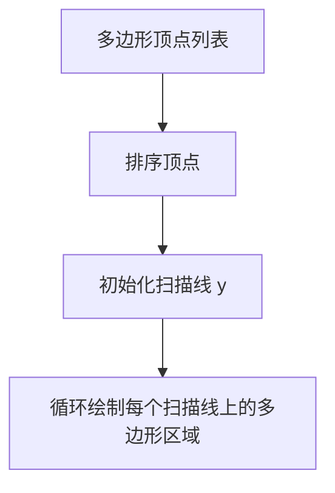
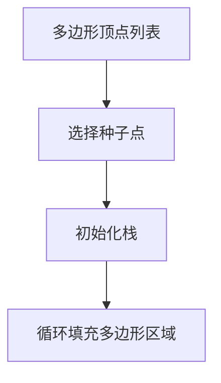

                 

# 计算机图形学：3D渲染和动画技术

> 关键词：计算机图形学、3D渲染、动画技术、光照模型、几何建模、虚拟现实、GPU渲染

> 摘要：
本文将深入探讨计算机图形学领域中的3D渲染和动画技术。从基础概念到高级技术，我们将逐步分析并讲解3D图形学的核心原理和实际应用，帮助读者全面掌握这一技术领域。本文内容丰富，包括几何建模、视图变换、光照模型、动画技术以及高级渲染技术，同时还提供了实际项目案例和实践经验，让读者能够学以致用。通过阅读本文，读者将对计算机图形学有更深刻的理解，并为未来在相关领域的探索奠定坚实基础。

### 目录大纲

本文将分为三个主要部分：基础概念与技术、3D图形学、高级3D渲染与动画技术。具体目录大纲如下：

#### 第一部分：基础概念与技术

##### 第1章：计算机图形学概述
- **1.1 计算机图形学的基本概念**
  - **1.1.1 图形学与图像处理的区别**
  - **1.1.2 计算机图形学的应用领域**
- **1.2 图形学的发展历史**
  - **1.2.1 计算机图形学的起源**
  - **1.2.2 图形学的重要里程碑**
- **1.3 计算机图形学的数学基础**
  - **1.3.1 几何基础**
  - **1.3.2 向量和矩阵运算**
  - **1.3.3 空间变换**

##### 第2章：基本图形绘制
- **2.1 基本图形的绘制原理**
  - **2.1.1 线段的绘制**
  - **2.1.2 多边形的绘制**
- **2.2 几何变换**
  - **2.2.1 平移、旋转、缩放**
  - **2.2.2 变换矩阵的应用**
- **2.3 填充和渲染技术**
  - **2.3.1 填充算法**
  - **2.3.2 渲染技术概述**
  - **2.3.3 明暗处理**

#### 第二部分：3D图形学

##### 第3章：3D几何建模
- **3.1 几何建模基础**
  - **3.1.1 点、线、面模型**
  - **3.1.2 3D几何形状的表示**
- **3.2 3D模型构建技术**
  - **3.2.1 几何建模工具**
  - **3.2.2 几何建模过程**
- **3.3 几何编辑和优化**
  - **3.3.1 几何编辑操作**
  - **3.3.2 几何优化方法**

##### 第4章：3D视图变换与投影
- **4.1 视图变换基础**
  - **4.1.1 世界坐标系和视图坐标系**
  - **4.1.2 视角变换**
- **4.2 投影方法**
  - **4.2.1 正交投影**
  - **4.2.2 黏性投影**
  - **4.2.3 透视投影**
- **4.3 3D视图渲染**
  - **4.3.1 基本渲染流程**
  - **4.3.2 纹理映射**

##### 第5章：3D渲染技术
- **5.1 光照模型**
  - **5.1.1 光照基本概念**
  - **5.1.2 简单光照模型**
  - **5.1.3 通用光照模型**
- **5.2 投影阴影**
  - **5.2.1 阴影生成原理**
  - **5.2.2 阴影算法**
- **5.3 反射和折射**
  - **5.3.1 反射原理**
  - **5.3.2 折射原理**

##### 第6章：动画技术
- **6.1 动画基础**
  - **6.1.1 动画的概念**
  - **6.1.2 动画的制作流程**
- **6.2 关键帧动画**
  - **6.2.1 关键帧动画原理**
  - **6.2.2 关键帧动画制作方法**
- **6.3 粒子系统动画**
  - **6.3.1 粒子系统基本原理**
  - **6.3.2 粒子系统动画制作**

#### 第三部分：高级3D渲染与动画技术

##### 第7章：高级渲染技术
- **7.1 着色器编程**
  - **7.1.1 着色器概述**
  - **7.1.2 着色器编程基础**
  - **7.1.3 实践案例：着色器实现**
- **7.2 全球光照**
  - **7.2.1 全球光照概念**
  - **7.2.2 全球光照算法**
- **7.3 环境映射与全局照明**
  - **7.3.1 环境映射技术**
  - **7.3.2 全局照明算法**

##### 第8章：高性能渲染
- **8.1 渲染优化策略**
  - **8.1.1 渲染瓶颈分析**
  - **8.1.2 渲染性能优化方法**
- **8.2 GPU渲染技术**
  - **8.2.1 GPU架构**
  - **8.2.2 CUDA编程基础**
  - **8.2.3 实践案例：GPU渲染应用**
- **8.3 渲染器架构**
  - **8.3.1 渲染器工作原理**
  - **8.3.2 渲染器优化**

##### 第9章：三维动画制作案例
- **9.1 动画制作流程实例**
  - **9.1.1 动画制作流程**
  - **9.1.2 制作案例介绍**
- **9.2 动画制作技巧**
  - **9.2.1 动画节奏控制**
  - **9.2.2 动作捕捉技术**
  - **9.2.3 动画调优技巧**

##### 第10章：综合应用与未来展望
- **10.1 计算机图形学在虚拟现实中的应用**
  - **10.1.1 VR技术概述**
  - **10.1.2 VR图形学关键技术**
- **10.2 计算机图形学的未来发展趋势**
  - **10.2.1 技术趋势分析**
  - **10.2.2 新兴领域的应用**

### 附录
- **附录 A：常用图形学工具与资源**
  - **A.1 常用图形学软件**
    - **A.1.1 Blender**
    - **A.1.2 Unity**
    - **A.1.3 Maya**
  - **A.2 开发环境搭建指南**
  - **A.3 学习资源推荐**

---

#### Mermaid 流程图



---

#### 核心算法原理讲解（伪代码）

```python
# 伪代码：基本光照模型计算
def calculate_lighting(object, light):
    ambient_color = (0.2, 0.2, 0.2)
    diffuse_color = (1.0, 1.0, 1.0)
    specular_color = (1.0, 1.0, 1.0)
    light_intensity = 1.0
    
    normal_vector = normalize(normal(object))
    light_vector = normalize(light)
    
    ambient = ambient_color * light_intensity
    diffuse = diffuse_color * max(dot(normal_vector, light_vector), 0)
    specular = specular_color * pow(max(dot(reflect(normal_vector), light_vector), 0), shininess)
    
    return ambient + diffuse + specular
```

---

#### 数学模型和数学公式详解

段落1（数学公式示例）：
$$
E = mc^2
$$
这是爱因斯坦提出的质能等价公式，描述了质量和能量之间的关系。

---

#### 项目实战

**案例：使用OpenGL实现基本光照模型**

1. **开发环境搭建：**
   - 安装OpenGL库
   - 配置开发环境

2. **源代码实现：**
   ```cpp
   // OpenGL初始化
   glClearColor(0.0, 0.0, 0.0, 1.0);
   glEnable(GL_DEPTH_TEST);
   
   // 设置光源
   glLightfv(GL_LIGHT0, GL_POSITION, light_position);
   glEnable(GL_LIGHTING);
   glEnable(GL_LIGHT0);
   
   // 绘制物体
   draw_object();
   
   // 渲染
   glFlush();
   ```

3. **代码解读与分析：**
   - 初始化OpenGL环境
   - 设置深度测试和光源
   - 绘制物体
   - 执行渲染操作

通过上述流程，我们实现了基本光照模型的OpenGL实现。接下来，我们将逐步深入探讨计算机图形学的各个核心概念和技术，帮助读者全面掌握这一领域。

---

现在，我们已经搭建好了文章的结构和内容框架。接下来，我们将分章节详细讲解计算机图形学的基础概念、3D图形学技术以及高级渲染与动画技术。让我们一步一步深入探讨这个充满魅力的技术领域。

---

## 第1章：计算机图形学概述

计算机图形学是计算机科学与应用领域中的一个重要分支，它涉及使用计算机生成、处理、存储和显示图像的技术。本章节将为我们提供对计算机图形学的全面概述，从基本概念到应用领域，帮助读者理解这一领域的核心价值。

### 1.1 计算机图形学的基本概念

计算机图形学的基本概念包括图像、图形、几何、视图、渲染等多个方面。首先，我们需要区分图形和图像。图形通常指的是通过算法生成或表示的几何对象，如点、线、面、体等；而图像则是指由像素组成的视觉信息，如照片、图标等。

**图像与图形的区别：**

- **图像**：图像是由像素点组成的，每个像素点存储了颜色信息。图像的处理主要集中在像素级操作，如滤波、边缘检测、压缩等。
- **图形**：图形则是基于几何模型的，它通过数学算法来生成或表示。图形的渲染过程涉及到几何变换、光照计算、纹理映射等。

**计算机图形学的应用领域：**

计算机图形学在许多领域都有广泛应用，包括但不限于以下几个方面：

- **娱乐产业**：电影特效、动画制作、游戏开发等领域大量使用了计算机图形学技术，创造出令人惊叹的视觉效果。
- **科学计算**：计算机图形学在科学计算领域发挥着重要作用，如医学图像处理、地质勘探、气象模拟等。
- **工业设计**：计算机图形学在工业设计中应用广泛，如汽车设计、建筑可视化、机械制造等。
- **教育领域**：虚拟现实、增强现实等技术正逐渐应用于教育领域，为学生提供更加生动直观的学习体验。
- **信息可视化**：计算机图形学技术被广泛应用于信息可视化领域，如数据可视化、网络拓扑图等。

### 1.2 图形学的发展历史

计算机图形学的发展历程可以追溯到20世纪50年代。下面是几个重要的里程碑：

- **1950年代**：计算机图形学的概念首次被提出，早期的图形生成主要依赖于硬件电路和逻辑门。
- **1960年代**：图形硬件（如光笔、图形终端）的发展推动了计算机图形学的发展。1963年，Ivan Sutherland发明了第一个图形交互系统——Sketchpad。
- **1970年代**：计算机图形学在工业、科学和军事领域得到了广泛应用。1972年，Alvy Ray Smith和Peter Shaffer首次提出了像素的概念。
- **1980年代**：图形硬件进一步发展，图形处理器（GPU）的出现极大地提高了图形处理的效率。1984年，苹果公司推出了第一个基于图形用户界面（GUI）的操作系统Mac OS。
- **1990年代**：3D图形渲染技术逐渐成熟，虚拟现实（VR）和增强现实（AR）技术开始萌芽。1995年，Nintendo推出了首款采用3D图形技术的游戏机N64。
- **21世纪初**：计算机图形学进入了高速发展期，GPU性能大幅提升，着色器编程、全局光照等高级渲染技术得到了广泛应用。2007年，iPhone的问世标志着移动设备的图形处理能力迈上了一个新台阶。
- **2010年代至今**：计算机图形学在虚拟现实、增强现实、游戏、电影等领域取得了长足的进步。GPU渲染技术、人工智能（AI）在图形学中的应用等成为了研究热点。

### 1.3 计算机图形学的数学基础

计算机图形学的数学基础是理解其核心概念和技术的重要基石。以下是一些关键的数学概念和运算：

#### 几何基础

- **点、线、面**：点是几何的基础元素，线是由无限多个点连接而成的，面是由多个线段封闭而成的。
- **空间坐标系**：空间坐标系是用来描述物体位置和方向的一种方式，常见的有笛卡尔坐标系、极坐标系、球坐标系等。
- **矢量**：矢量是具有大小和方向的量，用来描述物体的运动和变换。

#### 向量和矩阵运算

- **向量加法和减法**：向量的加法和减法是通过对应分量相加或相减来实现的。
- **向量数乘**：数乘是将向量与一个标量相乘，用来缩放向量。
- **向量点积**：点积是两个向量对应分量的乘积之和，用来计算向量的夹角和长度。
- **向量叉积**：叉积是两个向量的交叉乘积，用来计算垂直于这两个向量的新向量。

- **矩阵**：矩阵是一个二维数组，用于表示线性变换。
- **矩阵乘法**：矩阵乘法是将一个矩阵的每一行与另一个矩阵的每一列相乘，得到一个新的矩阵。
- **变换矩阵**：变换矩阵是用于描述几何变换（如平移、旋转、缩放）的矩阵。

#### 空间变换

- **平移**：平移是将物体沿某个方向移动一定距离的变换。
- **旋转**：旋转是围绕某个轴旋转物体的变换。
- **缩放**：缩放是按照一定比例缩放物体的变换。

#### 应用示例

以下是一个简单的空间变换示例：



在这个示例中，原始点A通过变换矩阵B进行变换，得到变换后的点C。

通过上述内容，我们初步了解了计算机图形学的基本概念、发展历史和数学基础。接下来，我们将进一步探讨基本图形绘制、几何变换和渲染技术，帮助读者深入理解这一领域。

### 第2章：基本图形绘制

在计算机图形学中，基本图形绘制是构建复杂场景的基础。本章将详细介绍基本图形绘制原理，包括线段绘制、多边形绘制以及几何变换等基本概念和算法。

#### 2.1 基本图形的绘制原理

基本图形绘制主要包括线段绘制和多边形绘制。下面将分别介绍这两种图形的绘制原理。

**线段绘制**

线段是图形绘制中最基本的元素。线段绘制的主要任务是确定两个端点的位置，并在屏幕上绘制出一条连接这两个端点的直线。常见的方法有以下几种：

- **DDA（Digital Differential Analysis）算法**：DDA算法通过计算每个像素的斜率，逐步逼近线段。其优点是简单易实现，但缺点是精度较低。

```mermaid
graph TD
    A[起点坐标 (x1, y1)] --> B[终点坐标 (x2, y2)]
    B --> C[计算斜率 m = (y2 - y1) / (x2 - x1)]
    C --> D[计算增量 dx = x2 - x1, dy = y2 - y1]
    D --> E[初始化 x = x1, y = y1]
    E --> F[循环绘制每个像素点]
```

- **Bresenham算法**：Bresenham算法利用整数运算实现线段的绘制，精度较高，常用于图形显示设备。该算法的核心思想是通过计算线段端点之间的像素增量，确定每个像素点的位置。

```mermaid
graph TD
    A[起点坐标 (x1, y1)] --> B[终点坐标 (x2, y2)]
    B --> C[计算斜率 m = (y2 - y1) / (x2 - x1)]
    C --> D[计算增量 dx = x2 - x1, dy = y2 - y1]
    D --> E[初始化 x = x1, y = y1, error = 0]
    E --> F[循环绘制每个像素点]
```

**多边形绘制**

多边形是由多个线段组成的封闭图形。多边形绘制的主要任务是确定每个顶点的位置，并在屏幕上绘制出这些线段。常见的方法有以下几种：

- **扫描线算法**：扫描线算法通过扫描整个屏幕，逐行绘制多边形。其核心思想是将多边形的顶点按照y坐标排序，然后逐行填充多边形区域。



- **种子填充算法**：种子填充算法从多边形的某个顶点开始，向外填充多边形区域。其核心思想是使用一个栈记录已访问的像素点，从种子点开始逐步扩展填充。



#### 2.2 几何变换

几何变换是计算机图形学中的一个重要概念，它用于改变图形的形状、大小和位置。常见的几何变换包括平移、旋转、缩放等。

- **平移**：平移是将图形沿x轴或y轴方向移动一定距离的变换。其数学表示为：

  $$
  \mathbf{p}_{\text{new}} = \mathbf{p}_{\text{original}} + \mathbf{t}
  $$

  其中，$\mathbf{p}_{\text{original}}$表示原始点的坐标，$\mathbf{p}_{\text{new}}$表示平移后的点坐标，$\mathbf{t}$表示平移向量。

- **旋转**：旋转是围绕某个轴旋转图形的变换。其数学表示为：

  $$
  \mathbf{p}_{\text{new}} = R\mathbf{p}_{\text{original}}
  $$

  其中，$R$是一个旋转矩阵，$\mathbf{p}_{\text{original}}$表示原始点的坐标，$\mathbf{p}_{\text{new}}$表示旋转后的点坐标。

- **缩放**：缩放是按照一定比例缩放图形的变换。其数学表示为：

  $$
  \mathbf{p}_{\text{new}} = S\mathbf{p}_{\text{original}}
  $$

  其中，$S$是一个缩放矩阵，$\mathbf{p}_{\text{original}}$表示原始点的坐标，$\mathbf{p}_{\text{new}}$表示缩放后的点坐标。

#### 2.3 填充和渲染技术

填充和渲染技术是图形绘制的重要环节，它用于给图形添加颜色和纹理，使其更加逼真。常见的技术包括单色填充、纹理映射和明暗处理等。

- **单色填充**：单色填充是使用单一颜色填充图形区域的技术。常见的算法有扫描线算法和种子填充算法。

- **纹理映射**：纹理映射是使用纹理图像来装饰图形的技术。纹理图像通常是一张平面图像，将其映射到三维物体的表面上，从而增加图形的细节和真实感。

- **明暗处理**：明暗处理是模拟光线对物体表面影响的技术，通过计算光照效果来增强图形的立体感和真实感。常见的算法包括光照模型、阴影处理和反走样技术。

通过本章的学习，读者将掌握基本图形绘制、几何变换和填充渲染技术。这些基础知识将为后续的3D图形学和高级渲染技术奠定坚实基础。在下一章中，我们将继续探讨3D几何建模的基本概念和构建技术。

### 第3章：3D几何建模

3D几何建模是计算机图形学中的一个重要领域，它涉及创建和表示三维空间中的物体和场景。本章将详细介绍3D几何建模的基础概念、构建技术和优化方法。

#### 3.1 几何建模基础

3D几何建模的基础是理解三维空间中的点、线和面。以下是一些关键概念：

- **点**：点在三维空间中用坐标表示，通常使用(x, y, z)形式。点的集合构成线、面和体。

- **线**：线是由无限多个点连接而成的，通常用两个端点定义。三维空间中的线可以表示为两个点的线性组合。

- **面**：面是由多个线段封闭而成的，通常用顶点集定义。三维空间中的面可以表示为多个顶点的凸包。

- **体**：体是由多个面封闭而成的，通常用顶点集和面片定义。三维空间中的体可以表示为多个面的组合。

#### 3.2 3D模型构建技术

3D模型构建技术主要包括几何建模工具和建模过程。以下是一些常见的3D模型构建技术：

- **点云建模**：点云建模是通过捕捉大量空间点来构建模型的一种方法。点云数据可以来自激光扫描、摄像头采集等设备。通过三角化算法，点云可以转换为面片模型。

- **多边形建模**：多边形建模是最常见的3D建模方法，它使用多边形（如三角形和四边形）来构建模型。常见的多边形建模工具有Blender、Maya和3ds Max等。

- **曲面建模**：曲面建模是通过创建曲面来构建模型的一种方法。曲面可以是贝塞尔曲面、B样条曲面等。曲面建模可以生成更加光滑和连续的表面。

- **参数化建模**：参数化建模是通过参数来控制模型形状的一种方法。参数可以是曲线的曲率、模型的尺寸等。参数化建模可以提高建模的灵活性和可重复性。

#### 3.3 几何编辑和优化

3D模型在构建过程中可能需要进行编辑和优化，以提高其质量或适应特定需求。以下是一些常见的几何编辑和优化方法：

- **几何编辑**：几何编辑包括裁剪、缝合、拉伸、扭曲等操作。通过几何编辑，可以修改模型的形状和细节。

- **优化**：优化包括消除冗余顶点、平滑网格、减少面片数量等。优化的目标是提高模型的渲染性能，减少计算量。

- **面片简化**：面片简化是通过减少面片数量来简化模型的一种方法。常用的简化算法有拉普拉斯简化、最小二乘法等。

- **网格平滑**：网格平滑是通过平滑网格顶点来改善模型表面质量的一种方法。常用的平滑算法有线性平滑、高斯平滑等。

通过本章的学习，读者将了解3D几何建模的基础知识，掌握常见的建模技术和优化方法。这些知识将为后续的3D视图变换、投影和渲染技术奠定基础。在下一章中，我们将继续探讨3D视图变换与投影的基本概念和实现方法。

### 第4章：3D视图变换与投影

在3D图形学中，视图变换与投影是核心概念，它们决定了如何将三维空间中的物体呈现在二维屏幕上。本章将详细探讨视图变换、投影方法和3D视图渲染技术。

#### 4.1 视图变换基础

视图变换是用于改变三维场景观察角度的技术。常见的视图变换包括平移、旋转和缩放。

- **平移**：平移是将整个场景沿某个方向移动一定距离。数学表示为：
  $$
  \mathbf{p}_{\text{new}} = \mathbf{p}_{\text{original}} + \mathbf{t}
  $$
  其中，$\mathbf{p}_{\text{original}}$表示原始点的坐标，$\mathbf{p}_{\text{new}}$表示平移后的点坐标，$\mathbf{t}$表示平移向量。

- **旋转**：旋转是围绕某个轴旋转场景。数学表示为：
  $$
  \mathbf{p}_{\text{new}} = R\mathbf{p}_{\text{original}}
  $$
  其中，$R$是一个旋转矩阵，$\mathbf{p}_{\text{original}}$表示原始点的坐标，$\mathbf{p}_{\text{new}}$表示旋转后的点坐标。

- **缩放**：缩放是按照一定比例缩放整个场景。数学表示为：
  $$
  \mathbf{p}_{\text{new}} = S\mathbf{p}_{\text{original}}
  $$
  其中，$S$是一个缩放矩阵，$\mathbf{p}_{\text{original}}$表示原始点的坐标，$\mathbf{p}_{\text{new}}$表示缩放后的点坐标。

#### 4.2 投影方法

投影是将三维空间中的物体映射到二维平面上的过程。常见的投影方法有正交投影、透视投影和黏性投影。

- **正交投影**：正交投影是将三维物体沿垂直于投影平面的方向投影到二维平面上。正交投影不产生透视效果，适用于绘制建筑、机械等物体。

- **透视投影**：透视投影是模拟人眼观察物体的方式，产生深度感和透视效果。透视投影的关键是视点、视锥和远小近大的视觉效果。透视投影的数学表示为：
  $$
  \mathbf{p}_{\text{new}} = \frac{\mathbf{p}_{\text{world}} - \mathbf{camera}}{z}
  $$
  其中，$\mathbf{p}_{\text{world}}$表示世界坐标，$\mathbf{p}_{\text{new}}$表示屏幕坐标，$\mathbf{camera}$表示相机位置，$z$表示深度值。

- **黏性投影**：黏性投影是一种介于正交投影和透视投影之间的投影方法，它通过调整投影角度和大小来平衡透视效果和渲染性能。

#### 4.3 3D视图渲染

3D视图渲染是将三维场景转换为二维图像的过程。基本的渲染流程包括模型加载、视图变换、投影和光照计算等。

- **模型加载**：加载3D模型数据，包括顶点、面片和材质等。

- **视图变换**：根据用户视角对模型进行平移、旋转和缩放等变换。

- **投影**：将三维模型投影到二维平面上，生成屏幕坐标。

- **光照计算**：根据光照模型计算模型表面受到的光照效果，包括环境光、漫反射光、镜面反射光等。

- **纹理映射**：将纹理图像映射到模型表面，增加细节和真实感。

- **渲染输出**：将渲染结果输出到屏幕上。

通过本章的学习，读者将了解视图变换、投影方法和3D视图渲染的基本原理。这些知识对于理解和实现3D图形学应用具有重要意义。在下一章中，我们将探讨3D渲染技术，包括光照模型、阴影处理和反走样技术。

### 第5章：3D渲染技术

3D渲染技术是计算机图形学中的核心组成部分，它负责将三维场景转换为视觉上逼真的二维图像。本章将深入探讨3D渲染技术，包括光照模型、阴影处理和反射折射原理。

#### 5.1 光照模型

光照模型是渲染过程中计算光照效果的数学框架。它决定了物体表面在光照下的亮度和颜色。常见的光照模型包括简单光照模型、通用光照模型和全局光照模型。

**简单光照模型**

简单光照模型是最基础的模型，它包括环境光、漫反射光和镜面反射光。

- **环境光**：环境光为物体表面提供基本的亮度，不受物体表面方向的影响。

- **漫反射光**：漫反射光模拟光线在粗糙表面上的散射效果，其强度与物体表面的法线方向有关。

- **镜面反射光**：镜面反射光模拟光线在光滑表面上的反射效果，其强度与物体表面的法线方向和观察者方向的关系有关。

简单光照模型的伪代码如下：

```python
def simple_lighting(object, light):
    ambient_color = (0.2, 0.2, 0.2)
    diffuse_color = (1.0, 1.0, 1.0)
    specular_color = (1.0, 1.0, 1.0)
    light_intensity = 1.0
    
    normal_vector = normalize(normal(object))
    light_vector = normalize(light)
    
    ambient = ambient_color * light_intensity
    diffuse = diffuse_color * max(dot(normal_vector, light_vector), 0)
    specular = specular_color * pow(max(dot(reflect(normal_vector), light_vector), 0), shininess)
    
    return ambient + diffuse + specular
```

**通用光照模型**

通用光照模型（Phong模型）是对简单光照模型的扩展，它加入了更多的参数，以更准确地模拟光照效果。

- **环境光**：同简单光照模型。

- **漫反射光**：漫反射光的强度不仅与物体表面的法线方向有关，还与光源的方向和观察者的方向有关。

- **镜面反射光**：镜面反射光的强度与物体表面的法线方向、光源的方向和观察者的方向的关系有关，加入了高光强度和反射向量。

通用光照模型的伪代码如下：

```python
def phong_lighting(object, light):
    ambient_color = (0.2, 0.2, 0.2)
    diffuse_color = (1.0, 1.0, 1.0)
    specular_color = (1.0, 1.0, 1.0)
    light_intensity = 1.0
    shininess = 100.0
    
    normal_vector = normalize(normal(object))
    light_vector = normalize(light)
    view_vector = normalize(camera_position - object_position)
    
    ambient = ambient_color * light_intensity
    diffuse = diffuse_color * max(dot(normal_vector, light_vector), 0)
    specular = specular_color * pow(max(dot(reflect(normal_vector), view_vector), 0), shininess)
    
    return ambient + diffuse + specular
```

**全局光照模型**

全局光照模型（如路径追踪和全局光照近似）考虑了光照在场景中多次反射和散射的效果，以更真实地模拟光照。这些模型通常计算复杂，但能够产生高质量的渲染效果。

#### 5.2 投影阴影

投影阴影是渲染过程中模拟物体之间遮挡关系的技术。常见的阴影算法包括软阴影和硬阴影。

- **软阴影**：软阴影通过模糊阴影边缘来模拟光线的散射效果。常用的算法有阴影映射（Shadow Mapping）和基于体积的光线追踪（Volumetric Lighting）。

- **硬阴影**：硬阴影具有清晰的阴影边缘，适用于实时渲染。常用的算法有基于深度纹理的阴影（Depth Texture Shadow）和阴影体积渲染（Shadow Volume Rendering）。

#### 5.3 反射和折射

反射和折射是光线在遇到不同介质界面时改变方向的现象。这些现象在渲染中用于模拟物体表面的光洁度和透明度。

- **反射**：反射是光线在光滑表面上的反弹现象。常用的算法有环境映射（Environment Mapping）和反射探针（Reflection Probes）。

- **折射**：折射是光线在通过不同介质界面时改变速度和方向的现象。常用的算法有折射率计算和光线路径追踪。

通过本章的学习，读者将掌握3D渲染技术的核心概念和实现方法。这些知识将为实现高质量的3D渲染应用奠定基础。在下一章中，我们将探讨动画技术，包括基础概念和制作流程。

### 第6章：动画技术

动画技术是计算机图形学中不可或缺的一部分，它通过时间上的连续帧序列，创造出生动逼真的动态效果。本章将详细介绍动画技术的基础概念、关键帧动画和粒子系统动画。

#### 6.1 动画基础

动画（Animation）是一种视觉连续性的效果，通过快速播放一系列静态图像（帧），给人一种连续运动的感觉。动画的基础概念包括以下方面：

- **帧率（FPS）**：帧率是每秒钟播放的帧数，通常以帧每秒（FPS）为单位。常见的帧率有24FPS、30FPS和60FPS等。

- **时间**：动画是通过时间来实现的，每一帧代表一段时间间隔。动画的持续时间由帧数和帧率决定。

- **运动**：运动是动画的核心，通过不同的运动形式（如直线运动、曲线运动、旋转运动等），可以创造出各种动态效果。

- **插值**：插值是动画制作中的重要技术，它通过计算中间帧来平滑动画过渡，使动画看起来更加流畅。

#### 6.2 关键帧动画

关键帧动画（Keyframe Animation）是动画制作中最常用的方法之一。它通过定义关键帧来控制动画的变化，并在关键帧之间进行插值，生成中间帧。

**关键帧动画原理**

- **关键帧**：关键帧是动画序列中的关键帧，它定义了动画的重要状态。例如，一个动作的开始和结束都是关键帧。

- **插值**：插值是在关键帧之间计算中间帧的过程。常见的插值方法有线性插值、样条插值和贝塞尔插值等。

- **动画曲线**：动画曲线是描述关键帧之间变化趋势的图形表示。通过调整动画曲线，可以控制动画的平滑度和节奏。

**关键帧动画制作方法**

关键帧动画的制作通常包括以下步骤：

1. **设计动画**：确定动画的目标和场景，设计动画的运动轨迹和关键帧。

2. **创建关键帧**：在动画软件中创建关键帧，定义动画的重要状态。

3. **插值计算**：使用插值算法计算关键帧之间的中间帧，生成完整的动画序列。

4. **调整和优化**：根据需要对动画进行优化和调整，确保动画的流畅度和视觉质量。

#### 6.3 粒子系统动画

粒子系统动画（Particle System Animation）是一种通过生成大量粒子来模拟自然现象或特殊效果的技术。粒子系统动画广泛应用于火焰、烟雾、雨雪等特效的制作。

**粒子系统基本原理**

- **粒子**：粒子是动画中的基本元素，每个粒子都有自己的属性（如位置、速度、颜色等）。

- **生成**：粒子生成是创建新粒子的过程。常见的生成方式有随机生成、密度生成等。

- **运动**：粒子运动是描述粒子在动画中的运动轨迹。常见的运动方式有自由落体、风力作用等。

- **碰撞**：粒子碰撞是粒子与其他物体或边界发生碰撞的过程。碰撞会影响粒子的运动和属性。

- **销毁**：粒子销毁是删除粒子的过程。常见的销毁方式有超时销毁、碰撞销毁等。

**粒子系统动画制作**

粒子系统动画的制作通常包括以下步骤：

1. **设计粒子系统**：确定粒子系统的目标和效果，设计粒子的属性和运动方式。

2. **创建粒子**：在动画软件中创建粒子系统，设置粒子的生成规则和运动方式。

3. **渲染粒子**：使用渲染器渲染粒子系统，生成动画序列。

4. **调整和优化**：根据需要对粒子系统进行优化和调整，确保动画的流畅度和视觉质量。

通过本章的学习，读者将了解动画技术的基础概念和制作方法，掌握关键帧动画和粒子系统动画的制作技巧。这些知识将帮助读者在计算机图形学领域创造更多精彩的动态效果。在下一章中，我们将探讨高级渲染技术，包括着色器编程、全局光照和性能优化。

### 第7章：高级渲染技术

在计算机图形学中，高级渲染技术是实现高质量图像的关键。本章将详细介绍着色器编程、全局光照以及环境映射与全局照明的概念和实现方法。

#### 7.1 着色器编程

着色器（Shader）是渲染过程中用于计算物体表面颜色和纹理的程序。着色器在图形处理器（GPU）上运行，可以大幅度提高渲染效率和效果。着色器编程主要包括以下几个方面：

**着色器概述**

- **顶点着色器（Vertex Shader）**：顶点着色器用于处理顶点数据，如位置、法线、纹理坐标等。它负责顶点的变换、光照计算和几何变形。

- **片元着色器（Fragment Shader）**：片元着色器用于处理片元（像素）数据，如颜色、纹理坐标等。它负责像素的颜色计算、纹理映射和效果渲染。

**着色器编程基础**

- **着色器语言**：常用的着色器语言有GLSL（OpenGL Shading Language）和HLSL（High-Level Shading Language）等。这些语言提供了丰富的函数和运算，用于实现复杂的渲染效果。

- **着色器编写**：着色器的编写主要包括变量定义、函数实现和代码组织。着色器需要遵循特定的语法和规范，以确保正确运行。

**实践案例：着色器实现**

以下是一个简单的着色器实现案例，用于实现基本的光照模型：

```glsl
#version 330

out vec4 FragColor;

void main() {
    // 光照计算
    vec3 lightColor = vec3(1.0, 1.0, 1.0);
    vec3 lightPosition = vec3(0.5, 0.5, 1.0);
    vec3 normal = normalize(vNormal);
    vec3 lightDir = normalize(lightPosition - vPosition);
    float diff = max(dot(normal, lightDir), 0.0);
    vec3 diffuse = diff * lightColor;

    FragColor = vec4(diffuse, 1.0);
}
```

通过上述案例，我们可以看到着色器如何实现基本的光照计算，从而生成逼真的渲染效果。

#### 7.2 全球光照

全球光照（Global Illumination）是一种模拟光在场景中多次反射和散射的渲染技术。它能够产生更加真实的光照效果，如软阴影、反射和高光等。全球光照包括以下几种算法：

**全局光照概念**

- **路径追踪（Ray Tracing）**：路径追踪是一种基于光线路径的渲染算法，通过模拟光线在场景中的传播和反射，产生真实的光照和阴影效果。

- **蒙特卡罗方法（Monte Carlo）**：蒙特卡罗方法是一种基于概率统计的渲染技术，通过大量随机光线路径的计算，估算场景的光照分布。

- **光线传播方程（Light Propagation Equation）**：光线传播方程是一种描述光在场景中传播的数学模型，它考虑了光的反射、折射、散射等效应。

**全局光照算法**

- **路径追踪**：路径追踪的核心是递归地追踪光线路径，计算每个路径的贡献。常见的路径追踪算法有重要性采样、次表面散射等。

- **蒙特卡罗方法**：蒙特卡罗方法通过模拟大量随机光线路径，并计算路径的贡献，逐渐收敛到全局光照的结果。

- **光线传播方程**：光线传播方程可以通过数值方法求解，如有限元法、有限体积法等。它能够精确地计算光在场景中的传播和散射效果。

#### 7.3 环境映射与全局照明

环境映射（Environment Mapping）是一种用于模拟物体表面反射环境的渲染技术。它通过将环境图像映射到物体表面上，模拟光线在物体表面的反射效果。

**环境映射技术**

- **立方体贴图（Cubemap）**：立方体贴图是一种用于环境映射的图像格式，它包含了六个面的环境图像，分别对应上下、左右和前后。

- **反射探针（Reflection Probe）**：反射探针是一种用于环境映射的渲染工具，它可以在场景中捕捉环境图像，并将其映射到物体表面上。

**全局照明算法**

- **环境光照模型（Emissive Lighting）**：环境光照模型用于计算物体表面受到的环境光影响。它考虑了物体表面反射的光线对周围物体的影响。

- **光线传播方程**：光线传播方程可以结合环境映射技术，模拟光在场景中的传播和反射效果，产生高质量的全局照明效果。

通过本章的学习，读者将了解高级渲染技术的核心概念和实现方法，掌握着色器编程、全球光照和全局照明算法。这些技术将帮助读者在计算机图形学领域实现更加逼真的渲染效果。在下一章中，我们将探讨高性能渲染技术，包括渲染优化策略和GPU渲染技术。

### 第8章：高性能渲染

在计算机图形学中，高性能渲染是实现高质量、实时渲染的关键。本章将详细介绍渲染优化策略、GPU渲染技术和渲染器架构，帮助读者提高渲染性能和效率。

#### 8.1 渲染优化策略

渲染优化是提高渲染性能的关键步骤，它涉及分析渲染过程中的瓶颈和优化方法。以下是一些常见的渲染优化策略：

**渲染瓶颈分析**

- **几何处理**：几何处理是渲染过程中的一个重要环节，包括模型加载、视图变换和投影等。优化几何处理可以通过减少几何数据量、提高几何处理速度来提高性能。

- **光照计算**：光照计算是渲染过程中的另一大瓶颈，特别是复杂的光照模型和全局光照。优化光照计算可以通过减少计算量、提高光照精度来提高性能。

- **纹理处理**：纹理处理包括纹理加载、纹理映射和纹理过滤等。优化纹理处理可以通过减少纹理数据量、提高纹理加载速度来提高性能。

**渲染性能优化方法**

- **几何优化**：通过简化模型、减少面片数量、合并几何对象等来降低几何处理的计算量。

- **光照优化**：通过使用简单的光照模型、减少光照源数量、优化光照计算算法等来降低光照计算的复杂性。

- **纹理优化**：通过减小纹理分辨率、优化纹理映射算法、使用纹理压缩技术等来减少纹理处理的开销。

- **多线程处理**：利用多线程技术并行处理渲染任务，提高渲染速度。

- **GPU加速**：利用GPU进行渲染，通过GPU的并行计算能力提高渲染性能。

#### 8.2 GPU渲染技术

GPU渲染技术是高性能渲染的重要手段。GPU（图形处理器）具有高度并行计算的能力，能够显著提高渲染性能。以下是一些关键的GPU渲染技术：

**GPU架构**

- **计算单元**：GPU由大量计算单元（如CUDA核心）组成，每个计算单元可以并行处理多个任务。

- **内存层次结构**：GPU具有多种内存类型，包括全局内存、共享内存和寄存器等，不同类型的内存具有不同的访问速度和大小。

- **内存带宽**：内存带宽是影响GPU性能的重要因素，它决定了数据在内存之间的传输速度。

**CUDA编程基础**

- **CUDA（Compute Unified Device Architecture）**：CUDA是NVIDIA推出的并行计算架构，它允许程序员在GPU上编写并行计算程序。

- **线程组织**：CUDA通过线程组织来管理计算任务，包括线程块（Block）和网格（Grid）等。

- **内存管理**：CUDA提供了多种内存管理功能，如全局内存、共享内存和纹理内存等。

**实践案例：GPU渲染应用**

以下是一个简单的GPU渲染应用案例，使用CUDA实现基本的光照模型计算：

```cuda
__global__ void render_scene(float* output, int width, int height) {
    int x = blockIdx.x * blockDim.x + threadIdx.x;
    int y = blockIdx.y * blockDim.y + threadIdx.y;

    if (x >= width || y >= height) return;

    float4 color = render_pixel(x, y);
    output[y * width + x] = float4_to_float3(color);
}

__device__ float3 render_pixel(int x, int y) {
    // 计算像素颜色
    // ...
    return float3(1.0, 1.0, 1.0);
}

int main() {
    // 初始化CUDA环境
    // ...

    // 设置线程块和线程数
    dim3 threadsPerBlock(16, 16);
    dim3 blocksPerGrid((width + threadsPerBlock.x - 1) / threadsPerBlock.x, (height + threadsPerBlock.y - 1) / threadsPerBlock.y);

    // 执行GPU渲染
    float* output;
    cudaMalloc(&output, width * height * sizeof(float3));

    render_scene<<<blocksPerGrid, threadsPerBlock>>>(output, width, height);

    // 输出渲染结果
    // ...

    return 0;
}
```

#### 8.3 渲染器架构

渲染器（Renderer）是负责执行渲染操作的组件，它管理渲染流程、资源管理和性能优化等。以下是一些关键概念：

**渲染器工作原理**

- **渲染流程**：渲染器按照一定的流程执行渲染操作，包括模型加载、视图变换、光照计算、纹理映射和输出等。

- **资源管理**：渲染器负责管理渲染资源，如几何数据、纹理数据和光照数据等。资源管理包括资源的加载、缓存和释放等。

- **渲染模式**：渲染器支持多种渲染模式，如正向渲染、反向渲染、延迟渲染等。不同的渲染模式适用于不同的场景和需求。

**渲染器优化**

- **并行渲染**：通过并行计算技术，如多线程、多GPU等，提高渲染效率。

- **缓存优化**：通过优化缓存策略，减少数据访问的延迟和开销。

- **光照优化**：通过优化光照计算，如简化光照模型、减少光照源数量等，提高渲染性能。

- **纹理优化**：通过优化纹理处理，如减小纹理分辨率、使用纹理压缩技术等，提高渲染性能。

通过本章的学习，读者将掌握高性能渲染的核心技术和优化策略，了解GPU渲染和渲染器架构的基本原理。这些知识将为实现高效、高质量的渲染应用提供有力支持。在下一章中，我们将探讨三维动画制作案例，帮助读者将所学知识应用于实际项目中。

### 第9章：三维动画制作案例

本章将通过一个具体的三维动画制作案例，详细展示三维动画的制作流程、技巧和调优方法。本案例将使用Blender这款强大的三维动画软件，从准备素材、建模、绑定、动画制作到最后渲染输出，全面解析三维动画制作的各个环节。

#### 9.1 动画制作流程实例

**案例介绍**：

本案例将制作一个简单的角色动画——一个人物从屏幕左侧走至右侧，并在途中进行简单的动作，如挥手和跳跃。以下是具体的制作流程：

1. **准备素材**：
   - **场景布置**：在Blender中创建一个简单的场景，包括地面、摄像机和灯光。
   - **角色模型**：准备一个人物模型，该模型已进行UV展开和纹理制作。
   - **动画设置**：为角色设置正确的物理属性，如质量、碰撞体等。

2. **建模**：
   - **角色建模**：在Blender的“编辑模式”下对人物模型进行必要的调整，如修改面片、细分等。
   - **场景布置**：在场景中放置其他必要的物体，如背景、道具等。

3. **绑定**：
   - **设置骨骼**：为角色设置骨骼，并调整骨骼层次结构。
   - **绑定**：将骨骼与模型进行绑定，确保角色动作的连贯性。

4. **动画制作**：
   - **制作动作**：使用Blender的动画编辑工具制作角色从左至右的行走动作，包括基本的平移、旋转和缩放。
   - **添加细节**：在行走动作中加入挥手和跳跃等细节动作，以丰富动画效果。

5. **渲染输出**：
   - **设置渲染参数**：在渲染设置中调整输出参数，如分辨率、帧率、渲染引擎等。
   - **渲染动画**：执行渲染操作，生成动画序列。

6. **后期处理**：
   - **调色**：对渲染输出的图像进行调色处理，增强色彩效果。
   - **合成**：将动画与背景、特效等进行合成，生成最终的输出文件。

**制作案例介绍**：

在本案例中，我们将详细讲解每个步骤的实现方法，包括操作界面、工具使用和参数设置等。

#### 9.2 动画制作技巧

**动画节奏控制**：

动画节奏是影响动画质量的重要因素。在制作过程中，需要注意以下技巧：

- **动态曲线**：使用Blender的动画曲线编辑器，调整动作曲线的平滑度和节奏。通过调整曲线的斜率和尖角，可以控制动作的速度和流畅度。
- **关键帧设置**：合理设置关键帧，确保动作的连贯性和自然性。关键帧的间距和位置对动画节奏有直接影响。
- **动作捕捉**：使用动作捕捉技术，将真实的动作记录到模型中，以提高动画的真实感。

**动作捕捉技术**：

动作捕捉是动画制作中常用的一种技术，通过捕捉演员或演员的动作，生成模型的运动数据。以下是动作捕捉的基本步骤：

- **准备动作捕捉设备**：选择合适的动作捕捉设备，如全身动作捕捉套件、面部捕捉套件等。
- **布置捕捉环境**：在制作场景中布置捕捉设备，确保捕捉范围和精度。
- **录制动作**：在动作捕捉设备运行的情况下，录制演员的动作。
- **导出运动数据**：将捕捉到的运动数据导出为Blender可以使用的格式，如.FBX等。

**动画调优技巧**：

动画调优是动画制作中的重要环节，以下是一些调优技巧：

- **视觉检查**：通过播放动画，检查动作的流畅度和自然性。注意动作的起始和结束部分，确保过渡平滑。
- **动态模糊**：添加动态模糊效果，使运动物体产生动态效果，增强视觉冲击力。
- **细节调整**：对角色和场景进行细节调整，如添加关节运动、表情变化等，使动画更加生动。

通过本章的案例讲解和技巧介绍，读者将能够掌握三维动画制作的基本流程和关键技巧。这些知识和技巧将为实际项目中的三维动画制作提供有力支持。在下一章中，我们将探讨计算机图形学在虚拟现实中的应用和未来发展趋势。

### 第10章：综合应用与未来展望

#### 10.1 计算机图形学在虚拟现实中的应用

虚拟现实（Virtual Reality，VR）是一种通过计算机生成三维环境，用户可以通过头戴式显示器（HMD）等设备沉浸其中的技术。计算机图形学在VR中的应用至关重要，它负责生成、处理和显示虚拟环境中的图像。以下是计算机图形学在VR中的几个关键应用：

**实时渲染**

实时渲染是VR系统的核心技术之一，它需要以极高的帧率（通常是90FPS或更高）生成高质量的图像。为了实现实时渲染，计算机图形学采用了各种优化技术，包括光流渲染、延迟渲染和基于物理的渲染等。实时渲染技术不仅要处理复杂的几何数据，还要模拟光线、阴影、反射和折射等物理现象，以生成逼真的虚拟环境。

**纹理映射与光照**

纹理映射是计算机图形学中用于增强物体表面细节和真实感的技术。在VR中，纹理映射技术被广泛应用于为虚拟环境中的物体添加纹理，如地面的纹理、建筑物的纹理等。光照计算也是VR图形学中的重要环节，它决定了虚拟环境中物体的亮度和颜色。先进的全局光照算法（如路径追踪和基于探针的全局光照）被广泛应用于VR系统中，以生成更加真实的光照效果。

**用户交互**

VR系统中的用户交互依赖于计算机图形学中的输入和输出技术。用户通过手柄、手套等设备与虚拟环境进行交互，这些交互信息需要通过计算机图形学进行实时处理和反馈。此外，计算机图形学还负责生成用户视角的图像，实时更新并显示在HMD上，使用户能够感受到沉浸感。

**可视化与模拟**

计算机图形学在VR中的应用不仅限于娱乐和游戏，还包括科学计算、医学模拟和教育等领域。通过虚拟现实技术，研究人员和医生可以在虚拟环境中进行手术模拟、复杂实验的展示等，从而提高实验的准确性和安全性。在教育领域，虚拟现实技术可以为学生提供沉浸式的学习体验，增强学习效果。

**未来展望**

随着计算机硬件和图形处理技术的发展，VR图形学将不断进步，带来更多的应用和创新。以下是VR图形学未来可能的发展趋势：

**更高的帧率和分辨率**

随着显卡性能的提升，未来VR系统的帧率和分辨率将进一步提高，提供更加流畅和逼真的用户体验。高帧率（如120FPS或更高）和超高分辨率（如8K或更高）的HMD设备将变得更加普及，使得虚拟环境中的图像更加细腻和真实。

**更复杂的图形效果**

未来的VR图形学将采用更加复杂的图形效果，如实时全局光照、复杂的阴影算法和高级纹理映射等。这些技术将进一步提高虚拟环境的真实感和沉浸感。

**人工智能的应用**

人工智能（AI）将在VR图形学中发挥重要作用，通过机器学习算法，优化渲染过程，提高渲染效率和图像质量。例如，AI可以用于实时生成环境细节，优化光照计算，以及为虚拟环境中的物体和角色提供更加逼真的行为。

**新兴领域的应用**

VR图形学将在新兴领域得到更广泛的应用，如增强现实（AR）、混合现实（MR）和远程协作等。这些技术将结合VR图形学的核心原理，为用户带来全新的交互体验和业务模式。

通过本章的讨论，我们可以看到计算机图形学在虚拟现实中的应用及其未来发展的潜力。随着技术的不断进步，计算机图形学将在VR、AR、MR等领域发挥越来越重要的作用，为人类社会带来更多的创新和变革。

### 附录

#### A.1 常用图形学软件

**Blender**：Blender是一款开源的三维建模、动画和渲染软件，适用于各种规模的图形创作项目。

**Unity**：Unity是一款广泛使用的游戏引擎，它提供了强大的三维图形渲染功能，适用于游戏开发和虚拟现实应用。

**Maya**：Maya是Autodesk公司开发的一款专业三维建模和动画软件，广泛应用于电影、电视和游戏行业。

#### A.2 开发环境搭建指南

**安装OpenGL库**：在Windows系统中，可以通过Visual C++的扩展包安装OpenGL库。在Linux系统中，可以使用包管理器安装OpenGL库。

**安装图形学工具**：安装Blender、Unity、Maya等常用图形学工具，并根据需要配置开发环境。

**配置CUDA编程环境**：对于GPU渲染技术，需要安装CUDA Toolkit和相应的开发环境，如NVIDIA CUDA驱动和Visual Studio等。

#### A.3 学习资源推荐

**在线教程**：许多在线平台提供免费的图形学教程和课程，如YouTube、Udemy、Coursera等。

**书籍推荐**：
1. 《计算机图形学：原理及实践》（James D. Foley et al.）
2. 《OpenGL编程指南》（Dave Shreiner et al.）
3. 《三维计算机图形学基础》（Alan Watt）

通过这些资源，读者可以系统地学习计算机图形学的理论和实践，为未来在相关领域的探索奠定坚实基础。

### 作者信息

作者：AI天才研究院/AI Genius Institute & 禅与计算机程序设计艺术 /Zen And The Art of Computer Programming

