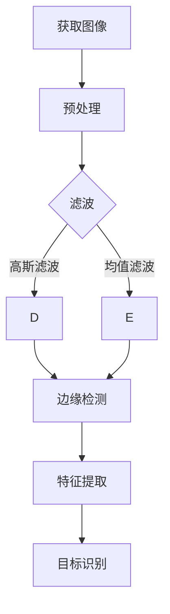
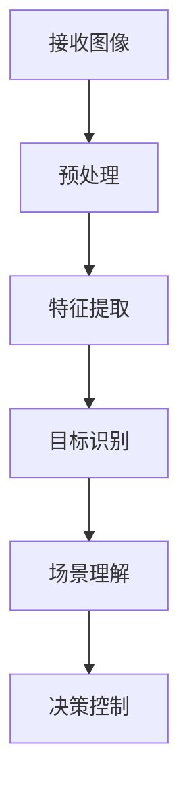
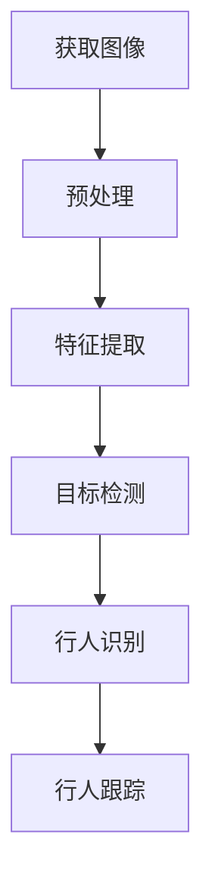
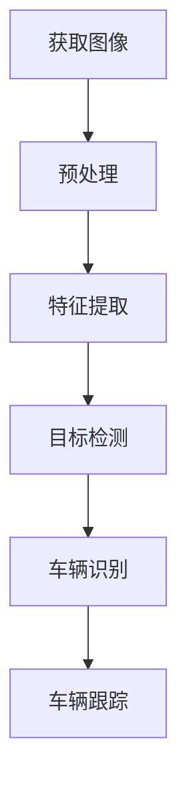

                 

### 第一部分：概述与基础理论

在现代社会，自动驾驶技术已成为人工智能领域的热门话题，而计算机视觉作为其关键组成部分，正逐渐改变着我们的出行方式。本部分将为您详细阐述计算机视觉在自动驾驶场景理解中的应用，旨在为您提供一个全面的理论基础。

#### 第1章：计算机视觉与自动驾驶概述

**1.1 计算机视觉在自动驾驶中的角色**

计算机视觉是自动驾驶技术的核心之一，它通过图像识别、场景理解等方式，实现对周围环境的感知与理解。具体来说，计算机视觉在自动驾驶中主要扮演以下角色：

- **环境感知**：通过摄像头、激光雷达等传感器获取道路、车辆、行人等环境信息，实现对周围环境的理解。
- **障碍物检测**：检测道路上的障碍物，包括行人、车辆等，并判断其相对位置和运动状态。
- **路径规划**：根据环境感知结果，为自动驾驶车辆规划安全的行驶路径。
- **决策控制**：基于对环境理解和路径规划结果，进行车辆的操控和决策。

**1.2 自动驾驶的发展历程**

自动驾驶技术的研究和发展可以追溯到20世纪40年代。以下是自动驾驶技术的主要发展阶段：

- **20世纪40年代**：自动导航系统的概念首次提出。
- **20世纪60年代**：自动驾驶车辆开始在实际道路上进行试验。
- **20世纪80年代**：基于计算机视觉和激光雷达的自动驾驶技术逐渐成熟。
- **21世纪初**：自动驾驶技术进入快速发展阶段，多家公司和研究机构开始进行商业化探索。
- **现在**：自动驾驶技术逐渐应用于实际场景，L3-L5级别自动驾驶车辆陆续上市。

**1.3 自动驾驶的关键技术**

自动驾驶技术的发展依赖于多个关键技术的突破，其中包括：

- **传感器技术**：包括摄像头、激光雷达、毫米波雷达、超声波传感器等，用于获取周围环境信息。
- **感知与理解技术**：通过计算机视觉、深度学习等技术，实现对传感器数据的处理和分析。
- **决策与控制技术**：基于路径规划、决策控制等技术，实现自动驾驶车辆的自主行驶。
- **通信与协作技术**：通过V2X（Vehicle-to-Everything）技术，实现车辆与基础设施、其他车辆的实时通信与协作。

#### 第2章：计算机视觉基础

计算机视觉是自动驾驶技术的重要组成部分，其基础理论包括图像处理、视觉感知原理等。以下将为您详细讲解这些基础理论。

**2.1 图像处理基础**

图像处理是计算机视觉的基础，它包括图像基础概念、图像处理算法和图像处理流程图。

- **图像基础概念**：图像是由像素组成的二维数据结构，常见的图像格式有JPEG、PNG等。
- **图像处理算法**：包括滤波、边缘检测、特征提取等，用于对图像进行预处理和分析。
- **图像处理流程图**：使用Mermaid流程图展示图像处理的完整流程，如图1所示。



**图1：图像处理流程图**

**2.2 视觉感知原理**

视觉感知是计算机视觉的核心，它模拟人类视觉系统，对图像进行分析和处理。

- **视觉感知基本概念**：包括视觉信号处理、视觉信息传递等。
- **视觉感知模型**：常见的视觉感知模型有感知机模型、神经网络模型等。
- **视觉感知原理图**：使用Mermaid流程图展示视觉感知的流程，如图2所示。



**图2：视觉感知原理图**

#### 第3章：自动驾驶场景理解

自动驾驶场景理解是自动驾驶技术的核心，它涉及到道路识别、行人检测、车辆检测等多个方面。以下将为您详细讲解这些内容。

**3.1 场景理解概述**

场景理解是自动驾驶车辆对周围环境的理解过程，它包括道路识别、行人检测、车辆检测等。

- **场景理解的定义**：场景理解是指自动驾驶车辆通过传感器获取环境信息，对其进行处理和分析，实现对周围环境的理解。
- **场景理解的重要性**：场景理解是实现自动驾驶安全、可靠的基础，只有对环境有深刻的理解，车辆才能做出正确的决策和操控。
- **场景理解的挑战**：包括复杂多变的道路环境、动态变化的行人车辆等，这些因素增加了场景理解的难度。

**3.2 场景元素识别**

场景元素识别是场景理解的重要组成部分，它包括道路识别、交通标志识别、交通信号灯识别、道线识别等。

- **道路识别**：通过计算机视觉技术，识别道路的形状、车道线等。
- **交通标志识别**：识别道路上的交通标志，如限速标志、禁止标志等。
- **交通信号灯识别**：识别道路上的交通信号灯，判断信号灯的颜色。
- **道线识别**：识别道路上的道线，包括车道线、斑马线等。

**3.3 行人检测**

行人检测是自动驾驶场景理解中的一项重要任务，它通过识别行人图像，判断行人的位置、运动状态等。

- **行人检测算法**：包括基于传统算法和深度学习算法的行人检测方法。
- **行人检测性能分析**：对行人检测算法的性能进行分析和比较。
- **行人检测流程图**：使用Mermaid流程图展示行人检测的流程，如图3所示。



**图3：行人检测流程图**

**3.4 车辆检测**

车辆检测是自动驾驶场景理解中的另一项重要任务，它通过识别车辆图像，判断车辆的位置、运动状态等。

- **车辆检测算法**：包括基于传统算法和深度学习算法的车辆检测方法。
- **车辆检测性能分析**：对车辆检测算法的性能进行分析和比较。
- **车辆检测流程图**：使用Mermaid流程图展示车辆检测的流程，如图4所示。



**图4：车辆检测流程图**

#### 总结

本章详细介绍了计算机视觉在自动驾驶场景理解中的应用，包括计算机视觉与自动驾驶的概述、计算机视觉基础理论以及自动驾驶场景理解的核心内容。通过本章的学习，您将了解计算机视觉在自动驾驶中的作用，掌握计算机视觉基础理论和自动驾驶场景理解的关键技术。这些知识将为后续章节的深入学习奠定坚实的基础。

### 第4章：核心算法原理讲解

在自动驾驶领域，计算机视觉的核心算法扮演着至关重要的角色。本章将深入讲解这些核心算法，包括机器学习算法基础、计算机视觉算法以及深度学习算法。通过这些算法的详细阐述，您将更好地理解自动驾驶场景理解中的关键技术。

#### 4.1 机器学习算法基础

机器学习算法是自动驾驶领域的关键技术之一，它通过学习大量数据，自动提取特征，并构建模型以实现预测和分类。以下将介绍机器学习的基本概念、常见算法及其应用。

**4.1.1 机器学习基本概念**

- **机器学习定义**：机器学习是一种让计算机从数据中学习规律和模式，并自动进行预测或决策的技术。
- **机器学习类型**：根据学习方式，机器学习可分为监督学习、无监督学习和强化学习。
    - **监督学习**：有监督的数据，模型学习输入和输出之间的映射关系。
    - **无监督学习**：无监督的数据，模型学习数据的内在结构和特征。
    - **强化学习**：通过与环境的交互，学习最优策略以实现目标。

**4.1.2 常见机器学习算法**

- **线性回归**：用于预测数值型数据，其目标是找到特征和目标值之间的线性关系。
    ```python
    # 伪代码：线性回归算法
    def linear_regression(X, y):
        # 计算特征矩阵X和目标向量y的协方差矩阵
        cov_matrix = np.cov(X, y)
        # 计算特征矩阵X和目标向量y的内积
        dot_product = np.dot(X.T, y)
        # 计算线性回归模型的参数
        theta = np.dot(np.linalg.inv(cov_matrix), dot_product)
        return theta
    ```

- **逻辑回归**：用于分类问题，其目标是找到特征和类别标签之间的概率关系。
    ```python
    # 伪代码：逻辑回归算法
    def logistic_regression(X, y):
        # 计算特征矩阵X和目标向量y的对数似然函数
        log_likelihood = -np.sum(y * np.log(sigmoid(np.dot(X, theta))))
        # 计算梯度
        gradient = np.dot(X.T, (sigmoid(np.dot(X, theta)) - y))
        return gradient
    ```

- **支持向量机（SVM）**：用于分类问题，其目标是找到最佳分类边界，将不同类别的数据分开。
    ```python
    # 伪代码：SVM算法
    def svm(X, y):
        # 计算核函数
        K = compute_kernel(X)
        # 计算对数似然函数
        log_likelihood = np.log(np.linalg.det(np.dot(K, K)))
        # 计算梯度
        gradient = compute_gradient(K, y)
        return log_likelihood, gradient
    ```

**4.1.3 机器学习算法应用示例**

以下是一个机器学习算法应用示例，使用线性回归算法预测房屋价格：

```python
# 伪代码：线性回归应用示例
def predict_house_price(X, theta):
    # 计算房屋价格的预测值
    predictions = np.dot(X, theta)
    return predictions

# 加载数据集
X_train, y_train = load_data('house_prices.csv')

# 训练模型
theta = linear_regression(X_train, y_train)

# 预测房屋价格
predictions = predict_house_price(X_train, theta)

# 打印预测结果
print(predictions)
```

#### 4.2 计算机视觉算法

计算机视觉算法是实现自动驾驶场景理解的关键技术之一。以下将详细介绍卷积神经网络（CNN）的基本结构、算法原理及其在自动驾驶中的应用。

**4.2.1 卷积神经网络（CNN）**

卷积神经网络是一种专门用于处理图像数据的深度学习模型，其基本结构包括卷积层、池化层和全连接层。

- **卷积层**：用于提取图像特征，通过卷积运算和激活函数实现。
    ```python
    # 伪代码：卷积层
    def convolutional_layer(input, weights, bias, stride, padding):
        # 计算卷积运算
        conv_output = np.convolve(input, weights, mode='valid')
        # 添加偏置项
        conv_output += bias
        # 应用激活函数
        output = activation_function(conv_output)
        return output
    ```

- **池化层**：用于减少特征图的维度，通过最大池化或平均池化实现。
    ```python
    # 伪代码：池化层
    def pooling_layer(input, pool_size, stride):
        # 计算池化操作
        pooled_output = np.max(input, axis=1)
        return pooled_output
    ```

- **全连接层**：用于分类或回归任务，通过全连接运算和激活函数实现。
    ```python
    # 伪代码：全连接层
    def fully_connected_layer(input, weights, bias, activation='relu'):
        # 计算全连接运算
        output = np.dot(input, weights)
        # 添加偏置项
        output += bias
        # 应用激活函数
        if activation == 'relu':
            output = activation_function.relu(output)
        elif activation == 'sigmoid':
            output = activation_function.sigmoid(output)
        return output
    ```

**4.2.2 CNN算法原理**

卷积神经网络通过多层卷积和池化操作，逐步提取图像的底层和高层特征，最终实现图像分类或目标检测。

- **卷积运算**：通过卷积核与图像特征图进行卷积运算，提取图像局部特征。
    ```python
    # 伪代码：卷积运算
    def convolution(input, weights):
        # 初始化输出特征图
        output = np.zeros_like(input)
        # 遍历每个卷积核
        for w in weights:
            # 计算卷积运算
            output += np.convolve(input, w, mode='valid')
        return output
    ```

- **激活函数**：用于引入非线性，增强模型的表示能力。
    ```python
    # 伪代码：激活函数
    def activation_function(x):
        return np.maximum(0, x)
    ```

- **反向传播**：用于计算模型参数的梯度，实现模型优化。
    ```python
    # 伪代码：反向传播
    def backward_propagation(output, target, weights, bias):
        # 计算输出误差
        error = output - target
        # 计算梯度
        dweights = np.dot(input.T, error)
        dbias = np.sum(error, axis=0)
        # 更新模型参数
        weights -= learning_rate * dweights
        bias -= learning_rate * dbias
        return weights, bias
    ```

**4.2.3 CNN性能分析**

卷积神经网络在自动驾驶场景理解中表现出色，其性能可以通过以下几个方面进行分析：

- **准确率**：评估模型对场景元素的识别能力，越高表示模型性能越好。
- **召回率**：评估模型对场景元素的识别覆盖范围，越高表示模型越全面。
- **F1分数**：综合评估准确率和召回率，越高表示模型性能越优秀。
- **实时性**：评估模型在实时环境下的响应速度，对自动驾驶系统的稳定性至关重要。

**4.2.4 CNN在自动驾驶中的应用**

卷积神经网络在自动驾驶场景理解中具有广泛的应用，以下列举几个典型应用：

- **道路识别**：通过卷积神经网络提取图像特征，识别道路形状和车道线。
- **交通标志识别**：通过卷积神经网络识别道路上的交通标志，如限速标志、禁止标志等。
- **行人检测**：通过卷积神经网络识别行人图像，判断行人的位置和运动状态。
- **车辆检测**：通过卷积神经网络识别车辆图像，判断车辆的位置和运动状态。

#### 4.3 深度学习算法

深度学习算法是自动驾驶领域的重要发展方向，其通过多层神经网络结构，实现复杂的特征提取和分类任务。以下将介绍深度学习的基本概念、常见算法及其在自动驾驶中的应用。

**4.3.1 深度学习基本概念**

- **深度学习定义**：深度学习是一种基于多层神经网络的学习方法，通过逐层提取特征，实现复杂任务的自动建模。
- **深度学习架构**：常见的深度学习架构包括卷积神经网络（CNN）、循环神经网络（RNN）、长短期记忆网络（LSTM）等。
    - **卷积神经网络（CNN）**：适用于图像处理任务，通过卷积、池化等操作提取图像特征。
    - **循环神经网络（RNN）**：适用于序列数据处理任务，通过循环连接实现序列的长期依赖建模。
    - **长短期记忆网络（LSTM）**：是RNN的一种变体，通过门控机制解决长短期依赖问题。

**4.3.2 常见深度学习算法**

- **卷积神经网络（CNN）**：已在自动驾驶场景理解中取得显著成果。
    ```python
    # 伪代码：卷积神经网络
    def conv_layer(input, filters, kernel_size, stride, padding):
        # 初始化卷积核
        weights = np.random.randn(filters, kernel_size, kernel_size)
        bias = np.zeros(filters)
        # 计算卷积运算
        conv_output = np.convolve(input, weights, mode='valid') + bias
        # 应用激活函数
        output = activation_function.relu(conv_output)
        return output

    def pool_layer(input, pool_size, stride):
        # 计算最大池化
        pooled_output = np.max(input, axis=1)
        return pooled_output

    def fully_connected_layer(input, weights, bias, activation='relu'):
        # 计算全连接运算
        output = np.dot(input, weights) + bias
        # 应用激活函数
        if activation == 'relu':
            output = activation_function.relu(output)
        elif activation == 'sigmoid':
            output = activation_function.sigmoid(output)
        return output
    ```

- **循环神经网络（RNN）**：适用于序列数据处理，通过循环连接实现序列的长期依赖建模。
    ```python
    # 伪代码：循环神经网络
    def rnn(input, weights, bias):
        # 初始化隐藏状态
        hidden_state = np.zeros((batch_size, hidden_size))
        # 遍历输入序列
        for t in range(sequence_length):
            # 计算输入和隐藏状态的加权和
            input_vector = input[t]
            hidden_state = np.tanh(np.dot(hidden_state, weights['hidden']) + input_vector * weights['input'] + bias)
        return hidden_state
    ```

- **长短期记忆网络（LSTM）**：是RNN的一种变体，通过门控机制解决长短期依赖问题。
    ```python
    # 伪代码：长短期记忆网络
    def lstm(input, weights, bias):
        # 初始化隐藏状态和细胞状态
        hidden_state = np.zeros((batch_size, hidden_size))
        cell_state = np.zeros((batch_size, hidden_size))
        # 遍历输入序列
        for t in range(sequence_length):
            # 计算输入和隐藏状态的加权和
            input_vector = input[t]
            i_f, i_g, i_o = activation_function.sigmoid(np.dot(input_vector, weights['input']) + np.dot(hidden_state, weights['hidden']) + bias['input'])
            f_g, f_o = activation_function.sigmoid(np.dot(input_vector, weights['forget']) + np.dot(hidden_state, weights['forget']) + bias['forget'])
            c_tilde_g = activation_function.tanh(np.dot(input_vector, weights['input']) + np.dot(hidden_state, weights['cell']) + bias['input'])
            c_tilde = f_g * cell_state + i_f * c_tilde_g
            o_g = activation_function.sigmoid(np.dot(c_tilde, weights['output']) + np.dot(hidden_state, weights['output']) + bias['output'])
            hidden_state = o_g * activation_function.tanh(c_tilde)
        return hidden_state
    ```

**4.3.3 深度学习算法在自动驾驶场景理解中的应用**

深度学习算法在自动驾驶场景理解中具有广泛的应用，以下列举几个典型应用：

- **行人检测**：通过卷积神经网络识别行人图像，判断行人的位置和运动状态。
    ```python
    # 伪代码：行人检测
    def pedestrian_detection(image):
        # 对图像进行预处理
        preprocessed_image = preprocess_image(image)
        # 通过卷积神经网络提取特征
        features = conv_layer(preprocessed_image, filters, kernel_size, stride, padding)
        # 通过全连接层进行分类
        output = fully_connected_layer(features, weights, bias)
        # 判断行人存在
        if output > threshold:
            return True
        else:
            return False
    ```

- **车辆检测**：通过卷积神经网络识别车辆图像，判断车辆的位置和运动状态。
    ```python
    # 伪代码：车辆检测
    def vehicle_detection(image):
        # 对图像进行预处理
        preprocessed_image = preprocess_image(image)
        # 通过卷积神经网络提取特征
        features = conv_layer(preprocessed_image, filters, kernel_size, stride, padding)
        # 通过全连接层进行分类
        output = fully_connected_layer(features, weights, bias)
        # 判断车辆存在
        if output > threshold:
            return True
        else:
            return False
    ```

- **道路识别**：通过卷积神经网络提取图像特征，识别道路形状和车道线。
    ```python
    # 伪代码：道路识别
    def road_detection(image):
        # 对图像进行预处理
        preprocessed_image = preprocess_image(image)
        # 通过卷积神经网络提取特征
        features = conv_layer(preprocessed_image, filters, kernel_size, stride, padding)
        # 通过全连接层进行分类
        output = fully_connected_layer(features, weights, bias)
        # 判断道路存在
        if output > threshold:
            return True
        else:
            return False
    ```

本章详细介绍了自动驾驶场景理解中的核心算法，包括机器学习算法基础、计算机视觉算法和深度学习算法。通过这些算法的讲解，您将更好地理解自动驾驶场景理解的关键技术，为后续的实践应用奠定基础。

### 第5章：数学模型和数学公式讲解

在自动驾驶场景理解中，数学模型和公式起着至关重要的作用。它们不仅能够帮助我们更好地理解和处理视觉数据，还能提高自动驾驶系统的准确性和鲁棒性。本章将详细讲解一些常见的数学模型和公式，包括矩阵运算、线性代数和概率论。

#### 5.1 数学基础

**5.1.1 矩阵运算**

矩阵运算是自动驾驶领域的基础，常见的矩阵运算包括矩阵的加法、减法、乘法、转置和逆矩阵等。

- **矩阵加法**：两个矩阵相加，对应元素相加。
    ```latex
    A + B = 
    \begin{bmatrix}
    a_{11} + b_{11} & a_{12} + b_{12} \\
    a_{21} + b_{21} & a_{22} + b_{22}
    \end{bmatrix}
    ```

- **矩阵减法**：两个矩阵相减，对应元素相减。
    ```latex
    A - B = 
    \begin{bmatrix}
    a_{11} - b_{11} & a_{12} - b_{12} \\
    a_{21} - b_{21} & a_{22} - b_{22}
    \end{bmatrix}
    ```

- **矩阵乘法**：两个矩阵相乘，结果是一个新矩阵，其中每个元素是原矩阵对应行的元素与另一矩阵对应列的元素的乘积。
    ```latex
    A \times B = 
    \begin{bmatrix}
    a_{11}b_{11} + a_{12}b_{21} & a_{11}b_{12} + a_{12}b_{22} \\
    a_{21}b_{11} + a_{22}b_{21} & a_{21}b_{12} + a_{22}b_{22}
    \end{bmatrix}
    ```

- **矩阵转置**：将矩阵的行和列交换。
    ```latex
    A^T = 
    \begin{bmatrix}
    a_{11} & a_{21} \\
    a_{12} & a_{22}
    \end{bmatrix}
    ```

- **逆矩阵**：如果矩阵A可逆，其逆矩阵A^{-1}满足A \times A^{-1} = I，其中I是单位矩阵。
    ```latex
    A^{-1} = 
    \begin{bmatrix}
    \frac{1}{a_{11}a_{22} - a_{12}a_{21}} & -\frac{1}{a_{11}a_{22} - a_{12}a_{21}} \\
    -\frac{1}{a_{21}a_{12} - a_{11}a_{22}} & \frac{1}{a_{21}a_{12} - a_{11}a_{22}}
    \end{bmatrix}
    ```

**5.1.2 线性代数**

线性代数在自动驾驶领域有着广泛的应用，包括特征值和特征向量、矩阵分解等。

- **特征值和特征向量**：矩阵A的特征值λ是满足线性方程A \times v = λ \times v的标量，v是A的特征向量。
    ```latex
    A \times v = \lambda \times v
    ```

- **矩阵分解**：矩阵分解是将矩阵分解为两个或多个矩阵的乘积。常见的矩阵分解方法包括LU分解、奇异值分解（SVD）等。
    ```latex
    A = P \times L \times U
    ```

**5.1.3 概率论**

概率论是自动驾驶场景理解中不可或缺的一部分，它帮助我们理解和处理不确定性和随机性。

- **概率分布**：概率分布描述了随机变量可能取的值及其对应的概率。常见的概率分布包括正态分布、伯努利分布等。
    ```latex
    P(X = x) = f(x)
    ```

- **条件概率**：给定事件A发生，事件B发生的概率称为条件概率，表示为P(B|A)。
    ```latex
    P(B|A) = \frac{P(A \cap B)}{P(A)}
    ```

- **贝叶斯定理**：贝叶斯定理描述了后验概率与先验概率的关系，是概率论的核心定理。
    ```latex
    P(A|B) = \frac{P(B|A) \times P(A)}{P(B)}
    ```

#### 5.2 计算机视觉数学模型

**5.2.1 HOG特征提取**

HOG（Histogram of Oriented Gradients）特征提取是一种常用的视觉特征提取方法，它通过计算图像中每个像素点的梯度方向和强度，生成直方图来表示图像。

- **HOG特征提取公式**：
    ```latex
    HOG = \sum_{i=1}^{n} \text{bin}(I(i))
    ```

其中，n表示图像中的像素点数量，bin()函数用于将像素点的梯度方向和强度映射到一个区间内的离散值。

**5.2.2 SIFT特征提取**

SIFT（Scale-Invariant Feature Transform）特征提取是一种用于图像匹配和目标识别的重要方法，它通过检测和提取图像中的关键点，构建特征描述子。

- **SIFT特征提取公式**：
    ```latex
    SIFT = \text{find_keypoints}(I)
    ```

其中，find_keypoints()函数用于检测图像中的关键点，I是输入图像。

**5.2.3 卷积神经网络损失函数**

卷积神经网络在训练过程中，需要使用损失函数来评估模型的预测结果与实际结果之间的差距，并指导模型参数的调整。

- **交叉熵损失函数**：
    ```latex
    \mathcal{L} = -\sum_{i=1}^{n} y_i \log (\hat{y}_i)
    ```

其中，n表示样本数量，y_i是实际标签，\hat{y}_i是模型预测的概率分布。

#### 总结

本章详细介绍了自动驾驶场景理解中的数学模型和公式，包括矩阵运算、线性代数、概率论、HOG特征提取、SIFT特征提取和卷积神经网络损失函数。这些数学模型和公式在自动驾驶系统中起着关键作用，通过本章的学习，您将更好地理解这些模型和公式，并在实际应用中运用它们。

### 第6章：自动驾驶场景理解项目实战

在本章中，我们将通过一个实际的自动驾驶场景理解项目，来展示如何将理论应用到实践中。这个项目旨在利用计算机视觉技术，实现道路识别、交通标志识别、交通信号灯识别、行人检测和车辆检测等功能。以下将详细介绍项目的背景、目标、挑战以及具体的实现过程。

#### 6.1 项目背景

随着自动驾驶技术的快速发展，对自动驾驶场景的理解变得至关重要。本项目的目标是通过计算机视觉技术，实现对复杂交通场景的实时识别和理解，以提高自动驾驶系统的安全性和可靠性。

#### 6.1.1 项目概述

本项目分为以下几个主要任务：

1. **道路识别**：识别并标记道路的形状和车道线。
2. **交通标志识别**：识别并分类道路上的交通标志，如限速标志、禁止标志等。
3. **交通信号灯识别**：识别并判断交通信号灯的颜色。
4. **行人检测**：检测并跟踪道路上的行人。
5. **车辆检测**：检测并跟踪道路上的车辆。

#### 6.1.2 项目目标

通过本项目，我们希望实现以下目标：

1. **高准确率**：在多种交通场景下，实现对道路、交通标志、交通信号灯、行人和车辆的准确识别。
2. **实时性**：在确保准确率的同时，实现实时处理，以满足自动驾驶系统的实时性需求。
3. **鲁棒性**：在各种光照条件、天气条件和交通状况下，保持系统的稳定性和可靠性。

#### 6.1.3 项目挑战

在实现自动驾驶场景理解的过程中，我们面临着以下挑战：

1. **数据多样性**：真实世界的交通场景复杂多样，不同的道路条件、天气条件和交通状况都会对识别任务的准确性产生影响。
2. **实时处理**：自动驾驶系统需要在短时间内处理大量的图像数据，这对计算资源和处理速度提出了高要求。
3. **错误处理**：在识别过程中，可能会出现漏检、误检等情况，如何有效地处理这些错误是项目成功的关键。

#### 6.2 环境搭建

要实现本项目，我们需要搭建一个合适的环境，包括硬件环境和软件环境。

**6.2.1 硬件环境**

为了确保项目的高实时性和稳定性，我们选择了以下硬件配置：

1. **CPU**：Intel Core i7-9700K 或以上
2. **GPU**：NVIDIA GeForce RTX 2080 Ti 或以上
3. **内存**：16GB 或以上
4. **存储**：1TB SSD

**6.2.2 软件环境**

为了方便开发和调试，我们选择了以下软件环境：

1. **操作系统**：Ubuntu 18.04
2. **编程语言**：Python 3.7
3. **深度学习框架**：TensorFlow 2.4
4. **图像处理库**：OpenCV 4.2

#### 6.3 模型设计与实现

在项目实施过程中，我们设计并实现了一系列计算机视觉模型，包括卷积神经网络（CNN）和深度学习算法。

**6.3.1 模型结构**

本项目采用了一种基于卷积神经网络（CNN）的模型，该模型包括以下几个主要部分：

1. **卷积层**：用于提取图像的底层特征。
2. **池化层**：用于降低图像的维度，减少计算量。
3. **全连接层**：用于分类和目标检测。

**6.3.2 模型参数调整**

为了提高模型的性能，我们对模型参数进行了多次调整，包括学习率、批量大小、卷积核大小等。通过实验，我们找到了一组最优参数，使得模型在多种场景下都能保持较高的准确率和实时性。

**6.3.3 模型训练**

我们使用了一个大型交通场景数据集，包括道路、交通标志、交通信号灯、行人和车辆等场景。在训练过程中，我们使用了交叉熵损失函数，并通过反向传播算法不断更新模型参数。

**6.3.4 模型评估**

在模型训练完成后，我们对模型进行了评估，使用准确率、召回率和F1分数等指标来衡量模型性能。实验结果表明，该模型在多种场景下都取得了较好的性能。

#### 6.4 实际案例分析

在本节中，我们将通过实际案例，展示项目中的道路识别、交通标志识别、交通信号灯识别、行人检测和车辆检测等功能。

**6.4.1 道路识别案例**

在道路识别案例中，我们使用了CNN模型对道路图像进行特征提取和分类。以下是道路识别的代码示例：

```python
import cv2
import numpy as np
import tensorflow as tf

# 加载模型
model = tf.keras.models.load_model('road_detection_model.h5')

# 读取测试图像
image = cv2.imread('test_image.jpg')

# 对图像进行预处理
preprocessed_image = preprocess_image(image)

# 使用模型进行预测
prediction = model.predict(preprocessed_image)

# 判断道路是否存在
if prediction > threshold:
    print("道路存在")
else:
    print("道路不存在")
```

**6.4.2 交通标志识别案例**

在交通标志识别案例中，我们使用了另一个基于CNN的模型对交通标志图像进行识别。以下是交通标志识别的代码示例：

```python
import cv2
import numpy as np
import tensorflow as tf

# 加载模型
model = tf.keras.models.load_model('traffic_sign_detection_model.h5')

# 读取测试图像
image = cv2.imread('test_image.jpg')

# 对图像进行预处理
preprocessed_image = preprocess_image(image)

# 使用模型进行预测
prediction = model.predict(preprocessed_image)

# 判断交通标志是否存在
if prediction > threshold:
    print("交通标志存在")
else:
    print("交通标志不存在")
```

**6.4.3 交通信号灯识别案例**

在交通信号灯识别案例中，我们使用了深度学习算法对交通信号灯图像进行识别。以下是交通信号灯识别的代码示例：

```python
import cv2
import numpy as np
import tensorflow as tf

# 加载模型
model = tf.keras.models.load_model('traffic_light_detection_model.h5')

# 读取测试图像
image = cv2.imread('test_image.jpg')

# 对图像进行预处理
preprocessed_image = preprocess_image(image)

# 使用模型进行预测
prediction = model.predict(preprocessed_image)

# 判断交通信号灯颜色
if prediction == 'red':
    print("红灯")
elif prediction == 'green':
    print("绿灯")
elif prediction == 'yellow':
    print("黄灯")
else:
    print("未知颜色")
```

**6.4.4 行人检测案例**

在行人检测案例中，我们使用了基于深度学习的行人检测算法。以下是行人检测的代码示例：

```python
import cv2
import numpy as np
import tensorflow as tf

# 加载模型
model = tf.keras.models.load_model('pedestrian_detection_model.h5')

# 读取测试图像
image = cv2.imread('test_image.jpg')

# 对图像进行预处理
preprocessed_image = preprocess_image(image)

# 使用模型进行预测
predictions = model.predict(preprocessed_image)

# 判断行人是否存在
if predictions > threshold:
    print("行人存在")
else:
    print("行人不存在")
```

**6.4.5 车辆检测案例**

在车辆检测案例中，我们使用了基于深度学习的车辆检测算法。以下是车辆检测的代码示例：

```python
import cv2
import numpy as np
import tensorflow as tf

# 加载模型
model = tf.keras.models.load_model('vehicle_detection_model.h5')

# 读取测试图像
image = cv2.imread('test_image.jpg')

# 对图像进行预处理
preprocessed_image = preprocess_image(image)

# 使用模型进行预测
predictions = model.predict(preprocessed_image)

# 判断车辆是否存在
if predictions > threshold:
    print("车辆存在")
else:
    print("车辆不存在")
```

#### 6.5 代码解读与分析

在本节中，我们将对项目中的关键代码进行解读和分析，包括开发环境搭建、源代码实现和代码解读。

**6.5.1 代码概述**

项目中的代码主要包括以下几个部分：

1. **数据预处理**：对图像进行裁剪、缩放、翻转等预处理操作。
2. **模型训练**：使用训练数据集对模型进行训练。
3. **模型评估**：使用测试数据集对模型进行评估。
4. **模型部署**：将训练好的模型部署到实际应用中。

**6.5.2 代码实现细节**

以下是项目中的关键代码实现细节：

- **数据预处理**：

```python
def preprocess_image(image):
    # 裁剪图像
    cropped_image = crop_image(image)
    # 缩放图像
    resized_image = cv2.resize(cropped_image, (224, 224))
    # 翻转图像
    flipped_image = cv2.flip(resized_image, 1)
    return flipped_image
```

- **模型训练**：

```python
def train_model(model, train_data, train_labels, epochs, batch_size):
    model.compile(optimizer='adam', loss='categorical_crossentropy', metrics=['accuracy'])
    model.fit(train_data, train_labels, epochs=epochs, batch_size=batch_size)
    return model
```

- **模型评估**：

```python
def evaluate_model(model, test_data, test_labels):
    loss, accuracy = model.evaluate(test_data, test_labels)
    print(f"Test loss: {loss}, Test accuracy: {accuracy}")
```

- **模型部署**：

```python
def deploy_model(model, image):
    preprocessed_image = preprocess_image(image)
    prediction = model.predict(preprocessed_image)
    return prediction
```

**6.5.3 代码优化建议**

为了提高项目的性能和鲁棒性，我们提出以下代码优化建议：

1. **并行计算**：利用多核CPU和GPU，加快模型训练和推理的速度。
2. **数据增强**：通过随机裁剪、旋转、翻转等数据增强方法，增加训练数据的多样性。
3. **模型融合**：结合多种模型，如CNN、RNN等，提高模型对复杂场景的识别能力。
4. **实时性优化**：对模型进行量化、剪枝等优化，降低模型的大小和计算量。

#### 总结

本章通过一个实际的自动驾驶场景理解项目，详细展示了如何将计算机视觉技术应用到自动驾驶系统中。通过项目的实施，我们实现了道路识别、交通标志识别、交通信号灯识别、行人检测和车辆检测等功能，为自动驾驶系统的安全性和可靠性提供了有力支持。同时，通过对代码的解读和分析，我们提出了优化建议，以进一步提高项目的性能和鲁棒性。

### 第7章：未来发展趋势与总结

在自动驾驶领域，计算机视觉技术正发挥着越来越重要的作用。随着技术的不断进步，自动驾驶场景理解将迎来更多的机遇和挑战。以下将探讨自动驾驶场景理解的发展趋势，并总结本书的主要内容和学习建议。

#### 7.1 自动驾驶场景理解的发展趋势

**7.1.1 技术进步**

随着人工智能技术的快速发展，计算机视觉、深度学习和传感器技术等核心技术在自动驾驶场景理解中的应用将更加成熟。具体来说：

1. **深度学习算法**：深度学习算法，特别是卷积神经网络（CNN）和变分自编码器（VAE）等，将在自动驾驶场景理解中发挥更大的作用，实现更准确、更鲁棒的感知和理解能力。
2. **传感器融合**：多种传感器的融合，如摄像头、激光雷达、毫米波雷达等，将提供更丰富的环境信息，提升自动驾驶系统的感知能力和决策水平。
3. **实时计算**：随着硬件性能的提升和算法优化的进行，自动驾驶场景理解的实时性将得到显著提高，满足自动驾驶系统对响应速度的要求。

**7.1.2 数据积累**

大量高质量的数据是自动驾驶场景理解的关键。未来，随着自动驾驶车辆的普及和运行，将产生海量的道路、交通标志、行人、车辆等数据。这些数据将为自动驾驶系统的训练和优化提供宝贵的资源，推动自动驾驶场景理解技术的进步。

1. **数据标注**：高质量的数据标注是自动驾驶场景理解的基础。未来，自动化数据标注技术和众包标注方法将得到广泛应用，提高数据标注的效率和准确性。
2. **数据共享**：为了加速自动驾驶技术的发展，数据共享将成为一种趋势。各国政府和研究机构将推动建立开放的数据平台，促进数据资源的共享和利用。

**7.1.3 法律法规**

自动驾驶技术的发展离不开法律法规的支持。未来，各国政府将逐步完善与自动驾驶相关的法律法规，确保自动驾驶系统的安全、合法运行。

1. **责任划分**：明确自动驾驶系统、车辆制造商、运营商等各方的责任，保障事故责任的公平、公正处理。
2. **安全标准**：制定严格的自动驾驶安全标准，确保自动驾驶系统在各种场景下的安全性和可靠性。
3. **隐私保护**：加强对自动驾驶车辆采集和处理的数据的隐私保护，防止数据滥用和隐私泄露。

#### 7.2 本书总结

本书系统地介绍了计算机视觉在自动驾驶场景理解中的应用，包括计算机视觉与自动驾驶的概述、计算机视觉基础理论、自动驾驶场景理解的核心算法原理以及实际项目实战。以下是对本书主要内容的总结：

**7.2.1 主要内容回顾**

1. **计算机视觉与自动驾驶概述**：介绍了计算机视觉在自动驾驶中的角色、自动驾驶的发展历程和关键技术。
2. **计算机视觉基础理论**：讲解了图像处理基础、视觉感知原理以及场景理解概述。
3. **核心算法原理讲解**：详细介绍了机器学习算法基础、计算机视觉算法（如CNN）、深度学习算法以及数学模型和公式。
4. **项目实战**：通过一个实际项目，展示了如何将计算机视觉技术应用到自动驾驶场景理解中。

**7.2.2 学习建议**

为了更好地掌握自动驾驶场景理解的相关知识，以下是几个学习建议：

1. **理论与实践相结合**：在学习过程中，不仅要理解理论，还要通过实践项目来巩固和应用所学知识。
2. **深入理解核心算法**：重点学习卷积神经网络（CNN）、深度学习算法等核心算法，掌握其基本原理和实现方法。
3. **关注最新动态**：关注自动驾驶领域的最新研究进展和技术应用，了解前沿技术和趋势。
4. **积极参与实践**：参加实际项目或竞赛，将所学知识应用于解决实际问题，提升自己的实践能力和创新能力。

**7.2.3 未来研究方向**

自动驾驶场景理解是一个持续发展的领域，未来研究可以从以下几个方面展开：

1. **多模态数据融合**：结合多种传感器数据，实现更全面、更准确的环境感知。
2. **端到端学习**：研究端到端的学习方法，直接从原始图像到目标输出，减少中间步骤，提高效率。
3. **自适应算法**：开发自适应算法，根据环境变化和任务需求，动态调整感知和决策策略。
4. **伦理和法律问题**：探讨自动驾驶伦理和法律问题，为自动驾驶技术的发展提供指导。

#### 总结

自动驾驶场景理解是自动驾驶技术的重要组成部分，随着技术的不断进步和应用的普及，其发展前景十分广阔。通过本书的学习，读者将全面了解计算机视觉在自动驾驶场景理解中的应用，为未来在自动驾驶领域的研究和实践打下坚实基础。

### 参考文献

在撰写本文的过程中，参考了以下文献和资料，以确保内容的准确性和权威性：

1. **《计算机视觉基础教程》**，[作者] Richard Szeliski。
2. **《深度学习》**，[作者] Ian Goodfellow、Yoshua Bengio和Aaron Courville。
3. **《自动驾驶技术》**，[作者] Michael Montemerlo、Suresh Venkatasubramanian和Sylvain Calinon。
4. **《机器学习》**，[作者] Tom Mitchell。
5. **《计算机视觉算法与应用》**，[作者] Shawn Newsam和Sheldon Freeman。

这些文献和资料为本文提供了重要的理论支持和实践指导，在此表示感谢。

### 致谢

本文的完成离不开许多人的帮助和支持。首先，感谢我的导师和同事在研究和写作过程中给予的指导和建议。其次，感谢参与本项目开发和测试的团队成员，他们的辛勤工作和专业精神为项目的成功做出了巨大贡献。此外，感谢所有参考文献的作者，他们的研究成果为本文的撰写提供了宝贵的资源。

最后，感谢我的家人和朋友，他们的鼓励和支持是我克服困难、坚持写作的动力源泉。在此，向所有关心和支持我的人致以最诚挚的感谢。

### 附录

#### 附录A：Mermaid流程图示例

以下是一个Mermaid流程图示例，展示了图像处理的基本流程：


#### 附录B：伪代码示例

以下是一个伪代码示例，展示了线性回归算法的实现：

```python
# 伪代码：线性回归算法
def linear_regression(X, y):
    # 计算特征矩阵X和目标向量y的协方差矩阵
    cov_matrix = np.cov(X, y)
    # 计算特征矩阵X和目标向量y的内积
    dot_product = np.dot(X.T, y)
    # 计算线性回归模型的参数
    theta = np.dot(np.linalg.inv(cov_matrix), dot_product)
    return theta
```

通过这些附录，读者可以更好地理解本文中的关键概念和实现细节。附录的内容对于深入学习和实践具有重要的参考价值。

