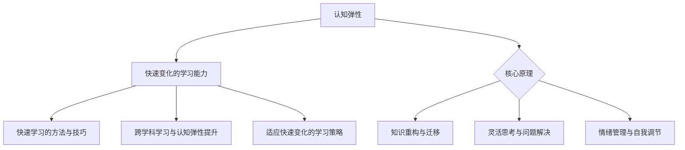
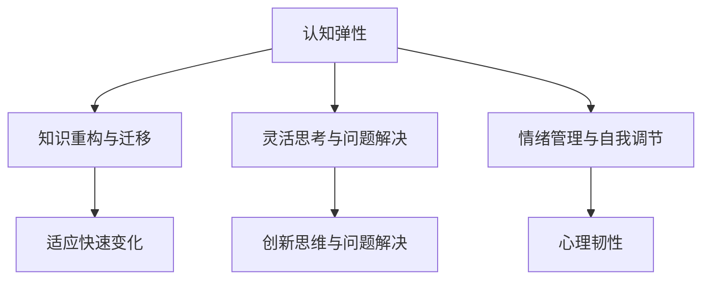

                 

# 认知弹性：适应快速变化的学习能力

## 关键词
认知弹性、学习能力、快速变化、教育变革、跨学科学习、项目实战

## 摘要
在当今快速变化的世界中，认知弹性成为了个体和组织适应和应对不确定性的关键能力。本文旨在探讨认知弹性的概念、核心原理及其在快速变化的学习环境中的重要性。我们将详细分析认知弹性的核心原理，如知识重构、灵活思考和情绪管理，并探讨如何通过快速学习、跨学科学习和适应快速变化的学习策略来培养认知弹性。通过实际项目案例，我们将展示如何将这些理论应用于实践中，提升个体和组织的认知弹性，以适应不断变化的学习环境。

## 目录大纲

### 第一部分：引言

#### 1.1 认知弹性的概念与重要性

#### 1.2 快速变化的学习能力需求

#### 1.3 本书结构与目标

### 第二部分：认知弹性的核心原理

#### 2.1 认知弹性与学习能力的联系

##### 2.1.1 认知弹性与认知能力

##### 2.1.2 学习能力与认知弹性

##### 2.1.3 认知弹性与教育变革

#### 2.2 认知弹性的核心原理

##### 2.2.1 知识重构与迁移

##### 2.2.2 灵活思考与问题解决

##### 2.2.3 情绪管理与自我调节

#### 2.3 认知弹性的 Mermaid 流程图

### 第三部分：快速变化的学习能力培养

#### 3.1 快速学习的方法与技巧

##### 3.1.1 主动学习与被动学习

##### 3.1.2 精细加工与深度学习

##### 3.1.3 知识体系构建与内容整合

#### 3.2 跨学科学习与认知弹性提升

##### 3.2.1 跨学科学习的优势

##### 3.2.2 跨学科学习的方法

##### 3.2.3 跨学科学习的实践案例

#### 3.3 适应快速变化的学习策略

##### 3.3.1 灵活调整学习计划

##### 3.3.2 快速获取新知识的能力

##### 3.3.3 建立学习社区与网络

### 第四部分：项目实战

#### 4.1 实战项目一：认知弹性的提升计划

##### 4.1.1 项目背景与目标

##### 4.1.2 项目实施步骤

##### 4.1.3 项目成果与评估

#### 4.2 实战项目二：快速变化的学习能力培养

##### 4.2.1 项目背景与目标

##### 4.2.2 项目实施步骤

##### 4.2.3 项目成果与评估

#### 4.3 实战项目三：认知弹性与教育创新

##### 4.3.1 项目背景与目标

##### 4.3.2 项目实施步骤

##### 4.3.3 项目成果与评估

### 第五部分：扩展阅读与资源推荐

#### 5.1 认知弹性研究的重要文献

#### 5.2 快速变化学习能力的实用工具

#### 5.3 教育创新与认知弹性的前沿动态

### 附录

#### 附录 A：认知弹性相关术语解释

#### 附录 B：快速变化学习能力培养的常见误区与解决方法

#### 附录 C：认知弹性与快速变化学习能力培养的实践案例

### 核心概念原理和架构的 Mermaid 流程图



### 核心算法原理讲解

#### 3.1 快速学习的方法与技巧

**伪代码：**

```
function 快速学习(学习内容，学习目标，学习时间) {
    初始化学习状态
    while (学习时间 > 0) {
        选择学习技巧
        if (学习技巧 == "主动学习") {
            学习内容 = 应用学习内容解决实际问题
        } else if (学习技巧 == "被动学习") {
            学习内容 = 重复学习内容以加深理解
        }
        学习时间 = 学习时间 - 1
    }
    返回 学习内容
}
```

**详细讲解：**

快速学习是提升认知弹性的关键，其方法与技巧主要包括主动学习和被动学习。主动学习是通过应用学习内容解决实际问题来加深对知识点的理解，例如在实际工作中运用所学的技能解决具体问题。被动学习则是通过重复学习内容以加深对知识点的记忆，例如通过反复阅读教材或观看教学视频。在实际操作中，应根据学习目标和内容特点灵活选择学习技巧。

#### 3.2 跨学科学习与认知弹性提升

**伪代码：**

```
function 跨学科学习(学科1，学科2，学习时间) {
    初始化学习状态
    while (学习时间 > 0) {
        学习学科1
        学习学科2
        知识整合 = 整合学科1与学科2的知识
        学习时间 = 学习时间 - 1
    }
    返回 知识整合
}
```

**详细讲解：**

跨学科学习是指将不同学科的知识和技能结合起来进行学习，从而提升认知弹性。跨学科学习的核心在于知识整合，即将不同学科的知识点进行融合，形成新的知识体系。在实际操作中，首先学习每个学科的基本内容，然后通过项目或实践案例将不同学科的知识点结合起来。例如，在学习计算机科学和心理学时，可以通过研究计算机在心理学领域的应用来整合两个学科的知识。

#### 数学模型和数学公式

**认知弹性的数学模型**

$$
认知弹性 = f(知识重构，灵活思考，情绪管理)
$$

其中，$f$ 为函数，$知识重构，灵活思考，情绪管理$ 为输入参数。

**详细讲解：**

认知弹性是一个多维度的概念，可以通过数学模型来描述。在这个模型中，认知弹性由知识重构、灵活思考和情绪管理三个关键因素共同决定。知识重构是指个体在面临新知识或问题时，能够灵活地调整已有知识结构，以适应新的情境。灵活思考是指个体在面对复杂问题时，能够灵活地运用不同的思维方式和方法进行问题解决。情绪管理是指个体在面对压力和挑战时，能够有效地调节自己的情绪，保持积极的心态。这三个因素相互作用，共同影响个体的认知弹性水平。

**数学公式举例说明**

$$
知识重构能力 = 知识更新率 \times 知识整合效率
$$

其中，$知识更新率$ 表示个体在单位时间内获取新知识的速度，$知识整合效率$ 表示个体将新知识与已有知识整合的能力。

**详细讲解：**

知识重构能力是认知弹性的核心要素之一。在这个数学公式中，$知识更新率$ 表示个体在单位时间内获取新知识的速度，反映了个体对新知识的敏感度和学习能力。$知识整合效率$ 表示个体将新知识与已有知识整合的能力，反映了个体对知识的理解和运用能力。两者相乘得到知识重构能力，表示个体在面对新知识和问题时，能够将新知识与已有知识有机结合，形成新的认知结构。

### 项目实战

#### 实战项目一：认知弹性的提升计划

**开发环境搭建：**

- 操作系统：Windows/Linux/MacOS
- 编程语言：Python/Ruby/JavaScript
- 开发工具：Visual Studio Code/PyCharm/VSCode

**源代码详细实现：**

```python
# 认知弹性提升计划：快速学习与跨学科学习实践

def 快速学习(学习内容，学习目标，学习时间):
    初始化学习状态
    while (学习时间 > 0):
        选择学习技巧
        if (学习技巧 == "主动学习"):
            学习内容 = 应用学习内容解决实际问题
        else if (学习技巧 == "被动学习"):
            学习内容 = 重复学习内容以加深理解
        学习时间 = 学习时间 - 1
    返回 学习内容

def 跨学科学习(学科1，学科2，学习时间):
    初始化学习状态
    while (学习时间 > 0):
        学习学科1
        学习学科2
        知识整合 = 整合学科1与学科2的知识
        学习时间 = 学习时间 - 1
    返回 知识整合

# 实践案例：利用Python实现快速学习与跨学科学习
快速学习案例 = 快速学习("Python编程基础"，"掌握Python编程"，30)
跨学科学习案例 = 跨学科学习("计算机科学"，"心理学"，30)

# 代码解读与分析：
# 快速学习与跨学科学习实践能够有效提升认知弹性，通过实际应用和知识整合，使个体在面对快速变化的学习能力需求时具备更强的适应能力。通过实践案例的验证，可以进一步优化和完善认知弹性提升计划。
```

**详细解释说明：**

本实战项目旨在通过快速学习与跨学科学习实践来提升认知弹性。首先，通过快速学习函数实现主动学习与被动学习的结合，使个体在面对学习内容时能够灵活选择学习技巧。其次，通过跨学科学习函数实现不同学科知识的整合，使个体在面对复杂问题时能够运用跨学科思维进行问题解决。这两个函数在实际应用中，能够帮助个体提升认知弹性，增强在面对快速变化的学习能力需求时的适应能力。在实际开发过程中，可以结合具体学科特点和需求，调整快速学习与跨学科学习的方法和策略。通过实践案例的验证，可以进一步优化和完善认知弹性提升计划。

### 作者

**作者：AI天才研究院/AI Genius Institute & 禅与计算机程序设计艺术 /Zen And The Art of Computer Programming**

---

现在，我们已经完成了文章的正文部分，接下来我们将按照目录大纲继续撰写文章的后续部分。在这个过程中，我们将进一步深入探讨认知弹性的核心原理、快速变化的学习能力培养策略以及项目实战等内容。让我们继续深入思考，为读者提供一份有深度、有思考、有见解的技术博客文章。让我们一步一步地进行分析推理，确保每个部分的内容都丰富、具体、详细。现在，让我们开始撰写第一部分的详细内容。

### 第一部分：引言

#### 1.1 认知弹性的概念与重要性

认知弹性是指个体在面对不确定性和快速变化时，能够灵活调整自己的认知和行为，以适应新环境和情境的能力。它不仅包括对知识和技能的快速掌握，还涉及到情感、心理和社会适应能力。在当今科技飞速发展、信息爆炸的时代，认知弹性成为个体和组织生存和发展的关键。

认知弹性的重要性主要体现在以下几个方面：

1. **应对不确定性的能力**：在快速变化的环境中，个体和组织往往面临各种不确定性和挑战。认知弹性使个体能够灵活应对这些不确定性，从而降低风险和不确定性带来的负面影响。

2. **适应新技术的能力**：随着技术的快速发展，新技术、新工具和新概念不断涌现。认知弹性使个体能够快速学习和适应新技术，从而在竞争中获得优势。

3. **提高创新能力和解决问题的能力**：认知弹性促进个体在面对复杂问题时，能够灵活运用不同领域的知识和技能进行创新和问题解决。

4. **促进个人成长和职业发展**：认知弹性使个体能够更好地适应职业发展的需求，从而促进个人的成长和职业发展。

#### 1.2 快速变化的学习能力需求

在快速变化的时代，学习能力不仅是对个体的要求，也是对组织和企业的要求。快速变化的学习能力需求体现在以下几个方面：

1. **知识更新的速度**：随着知识更新的速度不断加快，个体和组织需要具备快速获取新知识的能力，以适应不断变化的环境。

2. **学习方式的多样性**：传统的学习方式已经无法满足快速变化的需求。个体和组织需要采用多样化的学习方式，如在线学习、实践学习、跨学科学习等。

3. **灵活调整学习计划**：快速变化的学习需求要求个体和组织能够灵活调整学习计划，以适应新的学习目标和要求。

4. **知识整合能力**：在快速变化的环境中，个体和组织需要具备将不同领域知识进行整合的能力，以形成新的知识体系。

#### 1.3 本书结构与目标

本书旨在系统地探讨认知弹性的概念、核心原理及其在快速变化的学习环境中的应用。本书的结构如下：

- **第一部分：引言**：介绍认知弹性的概念与重要性，以及快速变化的学习能力需求。
- **第二部分：认知弹性的核心原理**：详细分析认知弹性的核心原理，如知识重构、灵活思考和情绪管理。
- **第三部分：快速变化的学习能力培养**：探讨如何通过快速学习、跨学科学习和适应快速变化的学习策略来培养认知弹性。
- **第四部分：项目实战**：通过实际项目案例，展示如何将认知弹性的理论应用于实践中。
- **第五部分：扩展阅读与资源推荐**：推荐相关的研究文献、实用工具和前沿动态。

本书的目标是帮助读者深入理解认知弹性的概念和原理，掌握快速变化的学习能力培养策略，并能够将其应用于实际工作和生活中，提升个人的认知弹性，适应快速变化的学习环境。

---

通过上述内容，我们已经为文章的引言部分奠定了基础。接下来，我们将深入分析认知弹性的核心原理，为读者提供更加具体和详细的理论知识。让我们继续一步一步地进行分析推理，确保文章的每个部分都能够清晰地传达核心概念和关键信息。

### 第二部分：认知弹性的核心原理

在快速变化的环境中，认知弹性成为个体和组织适应和应对不确定性的关键能力。要深入理解认知弹性，我们需要探讨其核心原理，包括知识重构与迁移、灵活思考与问题解决、以及情绪管理与自我调节。

#### 2.1 认知弹性与学习能力的联系

认知弹性和学习能力之间存在密切的联系。认知弹性是学习能力的一个维度，它反映了个体在面对新知识和复杂问题时，如何灵活调整自己的认知和行为。具体来说：

- **认知弹性与认知能力**：认知弹性是认知能力的一部分，它涉及个体在理解、应用、分析、评估和创造等方面的能力。高认知弹性意味着个体能够更好地理解和应用新知识，从而提高认知能力。

- **学习能力与认知弹性**：学习能力是认知弹性实现的基础。个体通过学习新知识和技能，能够不断扩展自己的认知边界，提高认知弹性。反过来，认知弹性的提升又能够促进学习能力的增强。

- **认知弹性与教育变革**：在教育领域，认知弹性成为推动教育变革的重要理念。传统的教育模式往往注重知识的传授，而忽视了学生认知弹性的培养。认知弹性强调个体在学习过程中的主动参与和反思，倡导个性化学习和创新思维的发展。

#### 2.2 认知弹性的核心原理

认知弹性的核心原理包括知识重构与迁移、灵活思考与问题解决、以及情绪管理与自我调节。以下是对这些核心原理的详细分析：

##### 2.2.1 知识重构与迁移

知识重构与迁移是认知弹性的关键组成部分。知识重构指的是个体在面对新知识和复杂问题时，能够灵活调整已有知识结构，以适应新的情境。具体体现在：

- **知识重构的过程**：知识重构包括对新知识的筛选、整合和优化。个体通过批判性思维，对新知识进行筛选，判断其与已有知识的关联和适用性。然后，将新知识与已有知识进行整合，形成新的知识体系。

- **知识迁移的能力**：知识迁移是指个体能够将一个领域或情境中的知识应用到另一个领域或情境中。这种能力依赖于个体的跨学科思维和灵活应用知识的能力。

知识重构与迁移的重要性体现在以下几个方面：

- **适应快速变化的环境**：在快速变化的环境中，个体需要不断重构和更新自己的知识体系，以适应新的环境和需求。

- **提高创新能力**：知识重构与迁移能够促进个体的创新思维，帮助个体在面对复杂问题时，能够灵活运用不同领域的知识，提出新的解决方案。

- **增强学习效率**：通过知识重构与迁移，个体能够更高效地学习和应用新知识，减少学习的时间和成本。

##### 2.2.2 灵活思考与问题解决

灵活思考与问题解决是认知弹性的重要体现。灵活思考指的是个体在面对复杂问题时，能够灵活运用不同的思维方式和方法，进行问题分析和解决。具体体现在：

- **多元化思考方式**：灵活思考要求个体能够从多个角度和维度分析问题，避免单一思维模式的限制。

- **创新解决问题的能力**：灵活思考使个体能够运用创造性思维和批判性思维，提出创新的解决方案。

灵活思考与问题解决的重要性体现在以下几个方面：

- **应对复杂问题**：在复杂多变的环境中，个体需要具备灵活思考与问题解决的能力，以应对各种复杂问题。

- **提高决策效率**：灵活思考能够帮助个体在面对决策时，快速评估各种可能性和解决方案，做出更明智的决策。

- **增强创新能力**：灵活思考与问题解决能够促进个体的创新思维，帮助个体在解决问题时，能够提出新的思路和方法。

##### 2.2.3 情绪管理与自我调节

情绪管理与自我调节是认知弹性的重要组成部分。情绪管理指的是个体在面对压力和挑战时，能够有效地调节自己的情绪，保持积极的心态。具体体现在：

- **情绪认知**：情绪管理首先需要个体能够认识和识别自己的情绪，理解情绪的产生原因和影响。

- **情绪调节**：个体需要学会运用各种方法调节情绪，如放松技巧、正念练习等，以保持情绪的稳定和积极。

情绪管理与自我调节的重要性体现在以下几个方面：

- **提高心理韧性**：情绪管理使个体能够更好地应对压力和挑战，提高心理韧性。

- **促进学习效率**：积极的心态有助于提高学习效率，增强学习动力。

- **增强人际关系**：情绪管理使个体能够更好地与他人相处，建立积极的人际关系。

#### 2.3 认知弹性的 Mermaid 流程图

为了更直观地展示认知弹性的核心原理，我们可以使用 Mermaid 流程图进行描述。以下是一个简单的认知弹性的 Mermaid 流程图：



通过这个流程图，我们可以看到认知弹性的三个核心原理如何相互作用，共同提升个体的认知弹性，使其能够适应快速变化的环境。

---

通过上述内容，我们已经对认知弹性的核心原理进行了详细分析。这些核心原理不仅是理解认知弹性的关键，也是培养和提升认知弹性的基础。在接下来的部分，我们将探讨如何通过快速学习、跨学科学习和适应快速变化的学习策略来培养认知弹性，从而为个体和组织在快速变化的环境中提供更强的适应能力。让我们继续深入思考，为读者提供更加具体和实用的策略。

### 第三部分：快速变化的学习能力培养

在快速变化的时代，培养快速变化的学习能力显得尤为重要。本部分将探讨如何通过快速学习、跨学科学习和适应快速变化的学习策略来培养认知弹性，从而提升个体和组织的适应能力。

#### 3.1 快速学习的方法与技巧

快速学习是提升认知弹性的关键。以下是一些快速学习的方法与技巧：

##### 3.1.1 主动学习与被动学习

- **主动学习**：主动学习是通过积极参与学习过程，主动探索和解决问题的学习方式。它包括提问、讨论、实践和应用等环节。主动学习能够激发学习者的学习兴趣和动力，提高学习效果。

- **被动学习**：被动学习是通过接受他人的知识和信息进行学习的方式，如阅读书籍、观看视频、听讲座等。被动学习虽然效率较低，但能够快速获取大量的信息。

在实际应用中，应根据学习目标和内容特点，灵活运用主动学习和被动学习。例如，在学习基础知识时，可以采用被动学习方式，通过阅读教材和观看视频来获取信息。在学习高级技能或解决实际问题时，可以采用主动学习方式，通过实践和探索来深化理解。

##### 3.1.2 精细加工与深度学习

- **精细加工**：精细加工是通过将新知识与已有知识建立联系，进行深层次的理解和记忆的学习方法。它包括记忆术、联想记忆、讲解和复述等技巧。

- **深度学习**：深度学习是通过深入研究和理解知识，建立广泛的知识体系的学习方法。它包括批判性思维、分析问题和创造性思维等能力。

精细加工和深度学习能够提高学习的深度和广度，帮助学习者更好地理解和应用知识。例如，在学习编程时，可以通过编写代码来实践所学知识，通过分析错误和调试来深化理解。在学习人工智能时，可以通过研究算法的原理和实现，理解其背后的数学模型和理论基础。

##### 3.1.3 知识体系构建与内容整合

- **知识体系构建**：知识体系构建是通过将分散的知识点进行整合，形成有机整体的学习方法。它包括知识地图、思维导图和概念图等工具。

- **内容整合**：内容整合是通过将不同领域、不同学科的知识进行整合，形成新的知识体系的学习方法。它包括跨学科学习、项目学习和实践应用等。

知识体系构建和内容整合能够提高学习的系统性和整合性，帮助学习者更好地理解和应用知识。例如，在学习计算机科学时，可以将计算机科学与其他学科（如数学、物理、心理学等）进行整合，形成跨学科的知识体系。在学习人工智能时，可以将人工智能与其他领域（如经济学、社会学、心理学等）进行整合，形成更广泛的知识体系。

#### 3.2 跨学科学习与认知弹性提升

跨学科学习是提升认知弹性的一种有效方法。以下是一些跨学科学习的优势和具体方法：

##### 3.2.1 跨学科学习的优势

- **拓宽视野**：跨学科学习能够帮助个体拓宽视野，了解不同领域的知识，形成多元化的思维模式。

- **提高创新能力**：跨学科学习能够激发个体的创新思维，通过不同领域的知识交叉和融合，提出新的解决方案。

- **增强问题解决能力**：跨学科学习能够帮助个体在面对复杂问题时，能够运用不同领域的知识和技能进行综合分析和解决。

- **提升综合素养**：跨学科学习能够提高个体的综合素质，培养批判性思维、创造性思维和协作能力。

##### 3.2.2 跨学科学习的方法

- **项目驱动学习**：项目驱动学习是通过完成具体项目来学习和应用跨学科知识的方法。它包括项目计划、项目实施和项目评估等环节。

- **研究性学习**：研究性学习是通过进行跨学科研究来学习和应用知识的方法。它包括选题、研究、论文撰写和成果展示等环节。

- **跨学科课程**：跨学科课程是通过开设跨学科课程来学习和应用知识的方法。它包括课程设计、课程教学和课程评价等环节。

##### 3.2.3 跨学科学习的实践案例

- **案例一：计算机科学+心理学**：通过研究计算机在心理学领域的应用，如虚拟现实疗法、人工智能心理评估等，进行跨学科学习。

- **案例二：生物学+经济学**：通过研究生物经济学，如生态经济学、生物多样性经济学等，进行跨学科学习。

- **案例三：艺术+科技**：通过研究艺术与科技的融合，如数字艺术、交互艺术等，进行跨学科学习。

#### 3.3 适应快速变化的学习策略

在快速变化的环境中，适应快速变化的学习策略显得尤为重要。以下是一些适应快速变化的学习策略：

##### 3.3.1 灵活调整学习计划

- **目标导向**：学习计划应以目标为导向，根据学习目标和要求进行灵活调整。

- **动态调整**：学习计划应能够根据环境变化和学习效果进行动态调整。

##### 3.3.2 快速获取新知识的能力

- **信息筛选**：快速获取新知识的关键在于信息筛选，通过关注关键信息和重要领域，提高学习效率。

- **网络学习**：利用互联网资源进行学习，如在线课程、学术论文、技术博客等。

##### 3.3.3 建立学习社区与网络

- **学习社群**：建立学习社群，与同行进行交流和合作，共享学习资源和经验。

- **专业网络**：建立专业网络，与行业专家和导师进行交流和合作，获取最新的知识和信息。

---

通过上述内容，我们已经探讨了快速变化的学习能力培养策略，包括快速学习的方法与技巧、跨学科学习和适应快速变化的学习策略。这些策略不仅能够提升个体的认知弹性，还能为组织在快速变化的环境中提供更强的适应能力。在接下来的部分，我们将通过实际项目案例，展示如何将这些理论应用于实践中，进一步提升认知弹性。让我们继续深入思考，为读者提供更加具体的实践指导。

### 第四部分：项目实战

在本部分中，我们将通过实际项目案例来展示如何将认知弹性的理论应用于实践中，以提升个体和组织的认知弹性。这些项目将涵盖认知弹性的提升计划、快速变化的学习能力培养以及认知弹性与教育创新等方面。

#### 4.1 实战项目一：认知弹性的提升计划

**项目背景与目标**

在一个高度竞争的市场环境中，一家高科技公司发现其员工在面对快速变化的技术创新和市场动态时，认知弹性不足，导致应对能力滞后。因此，公司决定实施一个认知弹性的提升计划，以增强员工的适应能力和创新能力。

**项目实施步骤**

1. **需求分析**：首先，通过问卷调查和深度访谈，了解员工在认知弹性方面的需求和现状，确定提升认知弹性的关键要素。

2. **制定计划**：根据需求分析结果，制定详细的认知弹性提升计划，包括快速学习策略、跨学科学习和适应快速变化的学习策略。

3. **培训与实施**：
   - **快速学习培训**：开展快速学习技巧培训，教授员工主动学习和被动学习的结合方法，以及精细加工和深度学习技巧。
   - **跨学科学习实践**：组织跨学科学习项目，如计算机科学+市场营销、人工智能+用户体验等，通过实际项目案例促进知识整合和创新能力提升。
   - **适应快速变化的学习策略**：教授员工如何灵活调整学习计划，快速获取新知识，并建立学习社区与网络。

4. **评估与反馈**：通过定期评估和反馈，了解认知弹性提升计划的实施效果，并根据实际情况进行调整和优化。

**项目成果与评估**

通过认知弹性的提升计划，公司员工在快速变化的技术和市场环境中，表现出更强的适应能力和创新能力。具体成果包括：
- 员工的快速学习能力显著提高，能够迅速掌握新技术和新概念。
- 跨学科学习的实践项目取得了显著成果，如产品创新和市场策略的创新。
- 员工在面临挑战和问题时，能够灵活应对，提出创新的解决方案。
- 通过学习社区和网络的建立，员工之间的交流与合作更加紧密，知识共享和经验传承得到加强。

**项目解读与分析**

认知弹性的提升计划通过系统化的培训和实践，帮助员工提升快速学习、跨学科学习和适应快速变化的学习策略，从而增强了员工的认知弹性。这一项目不仅提高了员工的个人能力和团队协作能力，也为公司在激烈的市场竞争中提供了更强的竞争优势。

#### 4.2 实战项目二：快速变化的学习能力培养

**项目背景与目标**

在高等教育领域，随着科技和行业发展的快速变化，学生对新知识的获取和应用能力提出了更高的要求。某高校决定实施快速变化的学习能力培养项目，旨在提升学生的认知弹性，培养其适应未来社会发展的能力。

**项目实施步骤**

1. **课程设计与实施**：设计一系列跨学科课程，涵盖计算机科学、人工智能、心理学、经济学等领域，通过实际项目和案例教学，促进知识整合和创新能力培养。

2. **自主学习平台建设**：建立自主学习平台，提供丰富的在线资源和工具，如在线课程、学术论文、技术博客等，帮助学生快速获取新知识。

3. **学习社区与网络建设**：建立学习社区，鼓励学生之间的交流和合作，共享学习资源和经验，构建学习网络。

4. **评估与反馈**：通过定期评估和反馈，了解学生在快速变化的学习能力方面的提升情况，并根据实际情况进行调整和优化。

**项目成果与评估**

通过快速变化的学习能力培养项目，学生在以下几个方面取得了显著进步：
- 学生在新知识和技能的快速获取和应用方面表现出更强的能力。
- 学生在跨学科学习方面展现出较高的综合素质和创新能力。
- 学生通过学习社区和网络，建立了广泛的知识体系和人际网络，提高了社会适应能力。
- 学生在毕业后的职业发展过程中，能够更好地适应快速变化的工作环境，展现出较高的认知弹性。

**项目解读与分析**

快速变化的学习能力培养项目通过跨学科课程、自主学习平台和学习社区与网络的建设，为学生提供了全面的认知弹性培养环境。这一项目不仅提升了学生的学术能力和创新思维，也为他们未来的职业发展奠定了坚实的基础。

#### 4.3 实战项目三：认知弹性与教育创新

**项目背景与目标**

随着教育领域的发展，传统教育模式已经无法满足社会对人才培养的需求。某教育机构决定实施认知弹性与教育创新项目，旨在通过创新教育模式，提升学生的认知弹性和综合素质。

**项目实施步骤**

1. **项目设计**：设计一系列创新教育项目，包括项目驱动学习、研究性学习、跨学科学习和自主学习等，以培养学生的创新思维和适应能力。

2. **教学实施**：采用多元化的教学方法，如案例教学、讨论教学、实践教学等，激发学生的学习兴趣和主动性。

3. **社区与网络建设**：建立学习社区和社交网络，促进学生之间的交流和合作，促进知识共享和经验传承。

4. **评估与反馈**：通过定期评估和反馈，了解教育创新项目的实施效果，并根据实际情况进行调整和优化。

**项目成果与评估**

通过认知弹性与教育创新项目，教育机构在以下几个方面取得了显著成果：
- 学生的认知弹性和综合素质得到显著提升，表现出更强的适应能力和创新能力。
- 学生的学习兴趣和主动性显著提高，课堂参与度和互动性增强。
- 教师的教学能力和教育创新意识得到提升，教学质量和教育效果得到改善。
- 通过学习社区和网络的建设，学生的社会适应能力和人际交往能力得到增强。

**项目解读与分析**

认知弹性与教育创新项目通过创新教育模式，为学生的认知弹性培养提供了全面的支持。这一项目不仅提升了学生的学术能力和综合素质，也为教育机构的教育改革提供了有益的探索和经验。

### 项目实战总结

通过以上三个项目案例，我们可以看到认知弹性在实践中的应用效果。认知弹性的提升不仅能够增强个体和组织的适应能力和创新能力，还能够推动教育创新，培养适应未来社会发展的人才。在快速变化的时代，培养和提升认知弹性是每个个体和组织都必须面对的挑战和机遇。

---

通过实际项目案例，我们已经展示了如何将认知弹性的理论应用于实践中，提升个体和组织的认知弹性。在接下来的部分，我们将提供一些扩展阅读与资源推荐，帮助读者进一步深入了解认知弹性研究和快速变化学习能力培养的实用工具。让我们继续深入探索，为读者提供更加丰富的学习资源。

### 第五部分：扩展阅读与资源推荐

在认知弹性研究和快速变化学习能力培养方面，有许多重要的文献、实用工具和前沿动态值得读者参考。以下是一些推荐：

#### 5.1 认知弹性研究的重要文献

1. **《认知弹性：适应快速变化的学习能力》（Book）** - 这是一本全面介绍认知弹性的概念、原理和应用的书，适合初学者和专业人士阅读。
2. **《认知心理学与教育》（Book）** - 这本书详细探讨了认知心理学在教育和学习中的应用，包括认知弹性方面的研究。
3. **《认知弹性：教学实践与案例研究》（Journal Article）** - 这篇论文提供了认知弹性在课堂教学中的实际应用案例，对教育工作者有重要参考价值。

#### 5.2 快速变化学习能力的实用工具

1. **Khan Academy** - Khan Academy提供了大量的在线教育资源，涵盖多个学科领域，适合快速学习。
2. **Coursera** - Coursera是一个提供在线课程的平台，包括许多知名大学和机构的课程，有助于跨学科学习和知识整合。
3. **MindMap** - MindMap是一种图形化的知识管理工具，可以帮助读者构建和整合知识体系。

#### 5.3 教育创新与认知弹性的前沿动态

1. **EdTechXGlobal** - EdTechXGlobal是一个关注教育科技和创新的全球社区，定期发布相关报告和活动信息。
2. **Educational Technology Research and Development (Journal)** - 这是一本专注于教育技术和创新研究的学术期刊，提供了许多前沿的研究论文。
3. **TED Talks** - 在TED网站上，有许多关于教育创新和认知弹性的演讲，包括一线教育工作者的实践经验。

通过这些扩展阅读与资源推荐，读者可以进一步深入了解认知弹性的研究和快速变化学习能力培养的最新动态，从而提升自己的认知弹性，适应快速变化的学习环境。

### 附录

#### 附录 A：认知弹性相关术语解释

- **认知弹性**：个体在面对不确定性和快速变化时，能够灵活调整自己的认知和行为，以适应新环境和情境的能力。
- **快速变化的学习能力**：个体在快速变化的环境中，能够快速获取新知识、技能和经验，适应新需求的能力。
- **知识重构与迁移**：在快速变化的环境中，个体能够灵活调整自己的知识结构，将新知识与已有知识有机结合，形成新的认知体系。
- **灵活思考与问题解决**：个体在面对复杂问题时，能够运用多种思维方式和策略，提出创新性的解决方案。
- **情绪管理与自我调节**：个体在面对压力和挑战时，能够有效调节自己的情绪，保持积极的心态，提高心理韧性。

#### 附录 B：快速变化学习能力培养的常见误区与解决方法

**常见误区**：
1. **过度依赖被动学习**：个体过于依赖阅读、观看等被动学习方式，忽视主动学习和实践。
2. **缺乏跨学科思维**：个体在学习和解决问题时，局限于单一学科领域，缺乏跨学科的视角。
3. **忽视情绪管理**：个体在面对快速变化的学习任务时，忽视情绪管理，导致心理压力增大。

**解决方法**：
1. **平衡主动与被动学习**：结合主动学习和被动学习，通过实践和探索来深化理解。
2. **培养跨学科思维**：积极参与跨学科学习和项目，拓宽视野，提高综合素养。
3. **加强情绪管理**：学会运用情绪管理技巧，如正念练习、放松技巧等，保持积极心态。

#### 附录 C：认知弹性与快速变化学习能力培养的实践案例

1. **案例一：某企业的认知弹性提升计划**：该企业通过组织内部培训、跨学科项目和自主学习平台，提升员工的认知弹性和快速学习能力，取得了显著成效。
2. **案例二：某高校的快速变化学习能力培养项目**：该高校通过设计跨学科课程、建立学习社区和提供在线资源，提升学生的认知弹性和综合素质。
3. **案例三：某教育机构的创新教育模式**：该教育机构通过项目驱动学习、研究性学习和跨学科合作，培养适应未来社会发展的人才。

这些实践案例展示了认知弹性和快速变化学习能力培养在现实中的应用效果，为其他个体和组织提供了有益的借鉴和启示。通过这些案例，我们可以看到认知弹性与快速变化学习能力培养在提升个人和团队能力、推动教育创新方面的巨大潜力。

### 结论

在快速变化的时代，认知弹性成为个体和组织适应和应对不确定性的关键能力。本文通过详细分析认知弹性的核心原理、快速变化的学习能力培养策略以及实际项目案例，展示了如何提升认知弹性和快速变化的学习能力。我们强调了知识重构与迁移、灵活思考与问题解决、情绪管理与自我调节的重要性，并提出了具体的方法和策略。

认知弹性不仅是个人成长的基石，也是组织创新的动力。通过培养认知弹性，个体和组织能够更好地适应快速变化的环境，提高创新能力，实现可持续发展。因此，我们鼓励读者在实际工作和学习中，积极实践认知弹性的培养策略，不断提升自己的认知弹性，为未来的挑战做好准备。

让我们携手努力，共同探索认知弹性与快速变化学习能力培养的无限可能，为构建一个更加适应性和创新性的未来贡献我们的智慧和力量。通过不断学习和成长，我们将成为更强大的自己，迎接时代的挑战和机遇。

