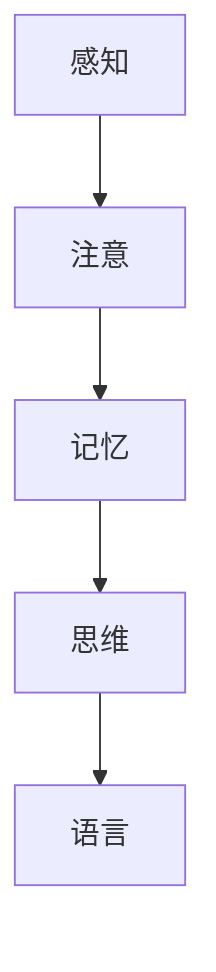
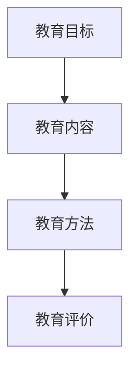
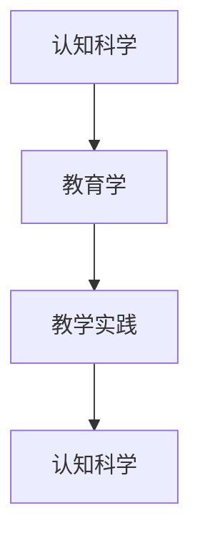

                 

### 认知科学与教育学交叉概述

认知科学与教育学是两个看似不同但实则紧密相关的领域。认知科学主要研究人类大脑如何处理信息、如何学习、记忆、思考等认知过程，而教育学则关注教育过程中的教学设计、学习策略、学生发展等。两者的交叉点在于，认知科学的发现和理论可以帮助教育者更好地理解学习者的认知机制，从而设计出更加有效的教学方法和策略，提升教育质量和学习效果。

#### 认知科学的基本概念

认知科学是一门跨学科领域，涉及心理学、神经科学、哲学、语言学、计算机科学等多个学科。其核心概念包括感知、注意、记忆、思维和语言等。感知是指接收外界信息的生理和心理过程，注意是选择关注某些信息而忽略其他信息的能力，记忆是储存和回忆信息的过程，思维是解决问题的过程，而语言则是人类表达思想和交流的工具。

**Mermaid 流程图：**



#### 教育学的核心概念

教育学是一门研究教育现象、教育问题和教育规律的学科。其核心概念包括教育目标、教育内容、教育方法和教育评价等。教育目标是教育的出发点和归宿，教育内容是教育过程中传递的知识和技能，教育方法是实现教育目标的过程，而教育评价则是衡量教育效果的重要手段。

**Mermaid 流程图：**



#### 认知科学与教育学的关系

认知科学与教育学在研究领域、方法和目标上有着密切的联系。认知科学为教育学提供了理论基础，帮助教育者理解学习者的认知机制，从而设计出更加有效的教学策略和方法。教育学则通过教学实践验证和丰富认知科学的理论，推动认知科学的不断发展。

**Mermaid 流程图：**



#### 认知科学与教育学交叉的意义

认知科学与教育学的交叉具有重要的实践意义。通过认知科学的指导，教育者可以更好地理解学习者的认知需求，设计出更加有效的教学方案，提高学生的学习效果。同时，认知科学也为教育创新提供了新的思路和方法，如个性化学习、智能教学系统和情感教育等。

**核心概念与联系**

认知科学与教育学的交叉涉及多个核心概念，如感知、注意、记忆、思维和语言等。这些概念相互联系，共同构成了人类的学习和理解过程。

**伪代码讲解**

```python
def learning_process(perception, attention, memory, thinking, language):
    # 感知阶段
    perception_data = perceive_environment()
    
    # 注意阶段
    important_data = filter_important_data(perception_data)
    
    # 记忆阶段
    memory_data = store_in_memory(important_data)
    
    # 思维阶段
    solution = think_about_problem(memory_data)
    
    # 语言阶段
    explanation = express_solution_with_language(solution)
    
    return explanation
```

**数学模型和公式**

认知科学与教育学的交叉还可以通过数学模型和公式来描述。例如，学习曲线模型可以用来描述学习者在学习过程中技能掌握的进度，认知负荷模型可以用来评估学习者在学习过程中的认知负担。

$$
f(t) = \frac{1}{1 + e^{-kt}}
$$

其中，$f(t)$ 表示学习者在时间 $t$ 时的技能掌握程度，$k$ 表示学习速率。

**项目实战**

在实际教育项目中，认知科学与教育学的交叉可以应用于个性化学习系统的设计。例如，通过学习分析技术，系统可以实时监测学生的学习行为和认知状态，并根据分析结果调整教学内容和教学策略，以提高学习效果。

**开发环境搭建**

为了搭建一个基于认知科学与教育学的个性化学习系统，我们需要准备以下开发环境：

1. Python（用于编写后端代码）
2. JavaScript（用于编写前端代码）
3. MongoDB（用于存储学习数据）
4. Redis（用于缓存数据）

**源代码实现**

以下是一个简单的Python代码示例，用于实现个性化学习系统中的学习分析功能。

```python
import pymongo
import redis

# 连接到MongoDB数据库
client = pymongo.MongoClient("mongodb://localhost:27017/")
db = client["learning_system"]

# 连接到Redis缓存服务器
cache = redis.Redis(host="localhost", port=6379, db=0)

def analyze_learning_progress(student_id):
    # 从MongoDB数据库中获取学生的学习数据
    data = db["learning_data"].find_one({"student_id": student_id})
    
    # 将学习数据存储到Redis缓存中
    cache.set(f"learning_data_{student_id}", json.dumps(data))
    
    # 分析学习数据
    progress = calculate_learning_progress(data)
    
    return progress

def calculate_learning_progress(data):
    # 假设学习进度与学习时长成正比
    time_spent = data["time_spent"]
    max_time = data["max_time"]
    progress = time_spent / max_time
    return progress
```

**代码解读与分析**

上述代码实现了一个简单的学习分析功能，用于计算学生在学习过程中的进度。具体来说，首先从MongoDB数据库中获取学生的学习数据，然后将其存储到Redis缓存中，以便快速访问。接下来，通过计算学习时间与最大学习时间的比值，得到学习进度。这个简单的示例展示了如何将认知科学与教育学原理应用于实际项目开发中。

**结论**

认知科学与教育学的交叉为优化人类学习和理解世界的方式提供了新的思路和方法。通过理解学习者的认知机制，教育者可以设计出更加有效的教学方案，提高教育质量和学习效果。同时，认知科学也为教育创新提供了新的方向，如个性化学习、智能教学系统和情感教育等。随着认知科学和人工智能技术的不断发展，我们可以期待在未来看到更多基于认知科学与教育学交叉的创新应用。|

