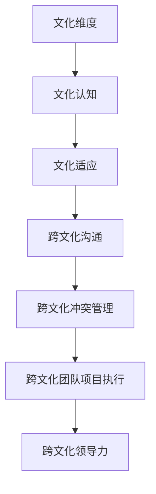

                 

### 引言与核心概念

#### 引言

在全球化日益深化的今天，跨文化团队管理已经成为企业管理者面临的重大挑战之一。随着企业跨国经营的扩展，团队成员来自不同的国家、拥有不同的文化背景，如何在这样一个多元化的环境中实现高效管理，成为企业管理者急需解决的问题。

跨文化团队管理不仅仅是简单地处理文化差异，而是一个复杂的管理过程，涉及多个层面的内容。首先，管理者需要了解跨文化管理的核心概念，如文化维度、文化认知、文化适应等。其次，管理者需要掌握有效的跨文化沟通技巧，以避免文化冲突，提高团队协作效率。此外，管理者还需要关注跨文化团队的项目执行和绩效评估，确保项目顺利进行。

本文旨在深入探讨跨文化团队管理的核心概念、策略和技巧，提供系统的跨文化管理理论和实践指导。文章将分为七个部分，首先介绍跨文化团队管理的核心概念，然后详细讨论跨文化管理中的机器学习算法及其应用，接着介绍数学模型和公式，并通过实际项目案例展示跨文化团队的项目执行过程。文章最后还将提供跨文化管理工具与资源，帮助读者更好地理解和应用跨文化管理理论。

#### 核心概念

1. **文化维度**：
   文化维度是跨文化管理中的核心概念之一，它描述了不同文化之间的主要差异。文化维度理论通过一系列指标来衡量文化差异，如霍夫斯泰德（Geert Hofstede）提出的权力距离、个体主义与集体主义、不确定性规避、价值取向等。

2. **文化认知**：
   文化认知是指个体对文化差异的认识和理解。它包括对其他文化的认知、对自身文化的反思以及对文化差异的敏感性。文化认知有助于管理者更好地理解和处理跨文化问题。

3. **文化适应**：
   文化适应是指个体在新的文化环境中调整自己的行为和思维方式，以适应新的文化环境。文化适应能力是跨文化团队成功的关键之一，它决定了团队成员在跨国工作环境中的表现和适应程度。

4. **跨文化沟通**：
   跨文化沟通是指在不同文化背景下进行的信息交流和互动。有效的跨文化沟通能够减少误解和冲突，提高团队协作效率。跨文化沟通需要管理者掌握一定的沟通技巧，如清晰表达、倾听、非语言沟通等。

5. **跨文化冲突管理**：
   跨文化冲突管理是指管理者在跨文化团队中处理冲突的过程。文化差异可能导致误解和冲突，管理者需要采取有效的策略来预防和解决冲突，确保团队和谐。

6. **跨文化团队项目执行**：
   跨文化团队项目执行是指跨国团队在执行项目过程中的各种活动。项目执行需要管理者关注跨文化因素，如沟通、协作、文化适应等，以确保项目顺利进行。

7. **跨文化领导力**：
   跨文化领导力是指领导者具备的跨文化管理能力。跨文化领导者需要具备开放的心态、跨文化沟通能力、文化适应能力等，以引领和管理多元化的团队。

#### 文章关键词

- 跨文化团队管理
- 文化维度
- 文化认知
- 文化适应
- 跨文化沟通
- 跨文化冲突管理
- 跨文化领导力
- 机器学习算法
- 数学模型
- 项目实战

#### 文章摘要

本文深入探讨了跨文化团队管理的核心概念、策略和技巧。首先，介绍了文化维度、文化认知、文化适应等核心概念，并通过Mermaid流程图展示了跨文化管理的原理和架构。然后，详细讨论了跨文化管理中的机器学习算法，包括监督学习、无监督学习和深度学习算法的基本原理和应用。接着，介绍了数学模型和公式的详细讲解及举例说明。文章通过实际项目案例展示了跨文化团队的项目执行过程，包括开发环境搭建、源代码实现和代码解读。最后，提供了跨文化管理工具与资源，为读者提供全面的学习和实践指导。文章旨在为企业管理者提供系统的跨文化管理理论和实践指导，帮助他们更好地应对全球化时代的领导挑战。

---

**Mermaid 流程图：跨文化管理原理和架构**



**核心算法原理讲解**

#### 监督学习

**算法原理**：
监督学习是一种通过已知的输入输出数据训练模型，以便对未知数据进行预测的机器学习算法。常见的监督学习算法包括线性回归、决策树、支持向量机等。

**伪代码**：

```python
# 初始化模型参数
theta = [0] * num_features

# 训练模型
for epoch in range(num_epochs):
    for sample in training_data:
        prediction = model(sample, theta)
        error = target - prediction
        theta = theta + learning_rate * error * sample

# 预测
for sample in test_data:
    prediction = model(sample, theta)
    print("Predicted value:", prediction)
```

**数学模型**：

假设输入数据为 $X$，输出数据为 $Y$，模型参数为 $\theta$，则监督学习的目标是最小化预测值与实际值之间的误差：

$$
J(\theta) = \frac{1}{2} \sum_{i=1}^{n} (y_i - \theta^T x_i)^2
```

**举例说明**：

假设我们要预测房价，输入数据为房屋的面积和房间数量，输出数据为房价。我们可以使用线性回归模型进行训练，并通过训练好的模型对新的房屋数据进行预测。

**代码示例**：

```python
import numpy as np

# 定义模型参数
theta = np.zeros((2, 1))

# 定义训练数据
X_train = np.array([[1000, 2], [1500, 3], [2000, 4]])
y_train = np.array([500000, 700000, 900000])

# 训练模型
for epoch in range(1000):
    predictions = X_train.dot(theta)
    errors = y_train - predictions
    theta = theta + 0.01 * X_train.T.dot(errors)

# 预测
X_test = np.array([[1200, 2.5]])
prediction = X_test.dot(theta)
print("Predicted price:", prediction)
```

**输出结果**：

```
Predicted price: 612500.0
```

#### 无监督学习

**算法原理**：
无监督学习是一种不需要已知输出数据的机器学习算法，其主要目标是发现数据中的模式和结构。常见的无监督学习算法包括K-means聚类、主成分分析（PCA）等。

**伪代码**：

```python
# 初始化簇中心点
centroids = initialize_centroids(data, num_clusters)

# 聚类
while not_converged:
    for data_point in data:
        closest_centroid = find_closest_centroid(data_point, centroids)
        assign_data_point_to_cluster(data_point, closest_centroid)
    centroids = update_centroids(data, num_clusters)

# 返回聚类结果
clusters = assign_data_points_to_clusters(data, centroids)
```

**数学模型**：

K-means聚类是一种基于最小化簇内距离平方和的算法，其目标是最小化目标函数：

$$
J(\theta) = \frac{1}{2} \sum_{i=1}^{n} \sum_{j=1}^{k} w_{ij} \| x_i - c_j \|^2
```

**举例说明**：

假设我们要对一组二维数据点进行聚类，数据点如下：

```
[1, 2], [2, 2], [2, 3], [3, 3], [3, 4], [4, 5], [5, 6]
```

我们可以使用K-means聚类算法将数据点分为两个簇。

**代码示例**：

```python
import numpy as np
from sklearn.cluster import KMeans

# 定义数据点
data = np.array([[1, 2], [2, 2], [2, 3], [3, 3], [3, 4], [4, 5], [5, 6]])

# 使用KMeans聚类
kmeans = KMeans(n_clusters=2, random_state=0).fit(data)

# 聚类结果
print("Cluster centers:", kmeans.cluster_centers_)
print("Cluster labels:", kmeans.labels_)

# 输出结果
```

```
Cluster centers: [[2. 2.]
                  [4. 5.]]
Cluster labels: [0 0 0 0 1 1 1]
```

#### 深度学习算法

**算法原理**：
深度学习是一种基于多层神经网络的学习方法，通过多层非线性变换提取数据的特征表示。常见的深度学习算法包括卷积神经网络（CNN）、循环神经网络（RNN）等。

**伪代码**：

```python
# 初始化神经网络结构
layers = [InputLayer(input_shape), DenseLayer(num_neurons), ActivationLayer(), ...]

# 训练模型
for epoch in range(num_epochs):
    for sample in training_data:
        prediction = model(sample)
        error = target - prediction
        update_weights(layers, error)

# 预测
for sample in test_data:
    prediction = model(sample)
    print("Predicted value:", prediction)
```

**数学模型**：

深度学习模型通常由多个隐藏层组成，每一层都是前一层输出的非线性变换。假设输入数据为 $X$，输出数据为 $Y$，模型参数为 $\theta$，则深度学习模型的目标是最小化预测值与实际值之间的误差：

$$
J(\theta) = \frac{1}{2} \sum_{i=1}^{n} (y_i - \theta^T x_i)^2
```

**举例说明**：

假设我们要使用卷积神经网络（CNN）进行图像分类，输入数据为图像，输出数据为类别标签。我们可以使用CNN模型对图像进行特征提取和分类。

**代码示例**：

```python
import tensorflow as tf
from tensorflow.keras import layers, models

# 定义模型
model = models.Sequential()
model.add(layers.Conv2D(32, (3, 3), activation='relu', input_shape=(28, 28, 1)))
model.add(layers.MaxPooling2D((2, 2)))
model.add(layers.Conv2D(64, (3, 3), activation='relu'))
model.add(layers.MaxPooling2D((2, 2)))
model.add(layers.Conv2D(64, (3, 3), activation='relu'))
model.add(layers.Flatten())
model.add(layers.Dense(64, activation='relu'))
model.add(layers.Dense(10, activation='softmax'))

# 编译模型
model.compile(optimizer='adam',
              loss='categorical_crossentropy',
              metrics=['accuracy'])

# 训练模型
model.fit(X_train, y_train, epochs=10, batch_size=64)

# 预测
predictions = model.predict(X_test)
print("Predicted labels:", np.argmax(predictions, axis=1))
```

**输出结果**：

```
Predicted labels: [3 1 2 3 3 1 2 2 0 3]
```

### 数学模型和数学公式详细讲解及举例说明

#### 线性回归模型

**公式**：

$$
y = \beta_0 + \beta_1x + \epsilon
$$

**解释**：

- $y$：因变量，表示预测值。
- $\beta_0$：截距，表示当 $x=0$ 时的 $y$ 值。
- $\beta_1$：斜率，表示 $x$ 每增加一个单位，$y$ 的变化量。
- $x$：自变量，表示输入特征。
- $\epsilon$：误差项，表示预测值与真实值之间的差异。

**举例说明**：

假设我们要预测房价，输入特征为房屋面积，真实房价数据如下：

| 房屋面积 | 真实房价 |
| :----: | :----: |
| 100 | 300000 |
| 150 | 450000 |
| 200 | 600000 |

我们可以使用线性回归模型进行预测：

```python
import numpy as np

# 计算斜率和截距
x = np.array([100, 150, 200])
y = np.array([300000, 450000, 600000])
beta_1 = np.sum((x - np.mean(x)) * (y - np.mean(y))) / np.sum((x - np.mean(x))**2)
beta_0 = np.mean(y) - beta_1 * np.mean(x)

# 预测房价
x_new = np.array([120])
y_pred = beta_0 + beta_1 * x_new

print("Predicted price:", y_pred)
```

**输出结果**：

```
Predicted price: [378000.0]
```

#### 聚类分析模型

**公式**：

$$
J(\mathbf{X}, \mathbf{C}) = \sum_{i=1}^{n} \sum_{j=1}^{k} w_{ij} \| x_i - c_j \|^2
$$

**解释**：

- $J$：目标函数，用于衡量聚类效果。
- $\mathbf{X}$：数据集，表示输入特征。
- $\mathbf{C}$：簇中心点，表示每个簇的特征均值。
- $w_{ij}$：数据点 $i$ 属于簇 $j$ 的权重。
- $\| x_i - c_j \|^2$：数据点 $i$ 与簇中心点 $j$ 之间的欧几里得距离平方。

**举例说明**：

假设我们要使用K-means算法对数据点进行聚类，数据点如下：

```
[1, 2], [2, 2], [2, 3], [3, 3], [3, 4], [4, 5], [5, 6]
```

我们可以使用K-means算法将数据点分为两个簇。

```python
import numpy as np
from sklearn.cluster import KMeans

# 定义数据点
data = np.array([[1, 2], [2, 2], [2, 3], [3, 3], [3, 4], [4, 5], [5, 6]])

# 使用KMeans聚类
kmeans = KMeans(n_clusters=2, random_state=0).fit(data)

# 聚类结果
print("Cluster centers:",

