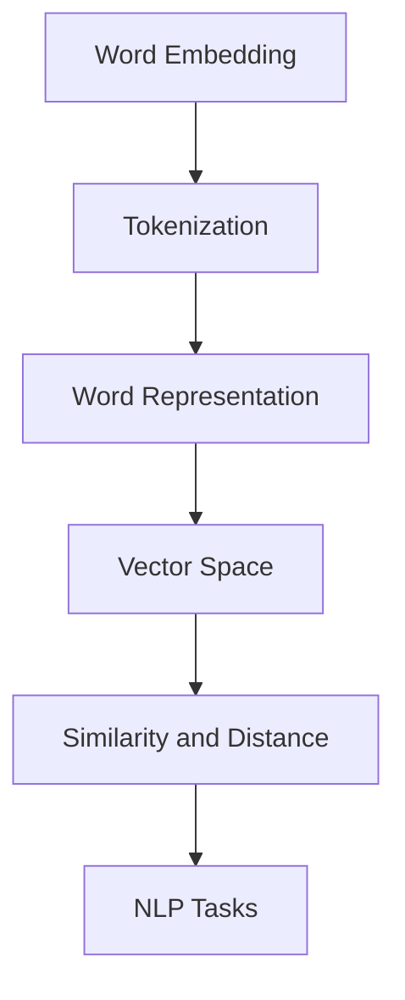
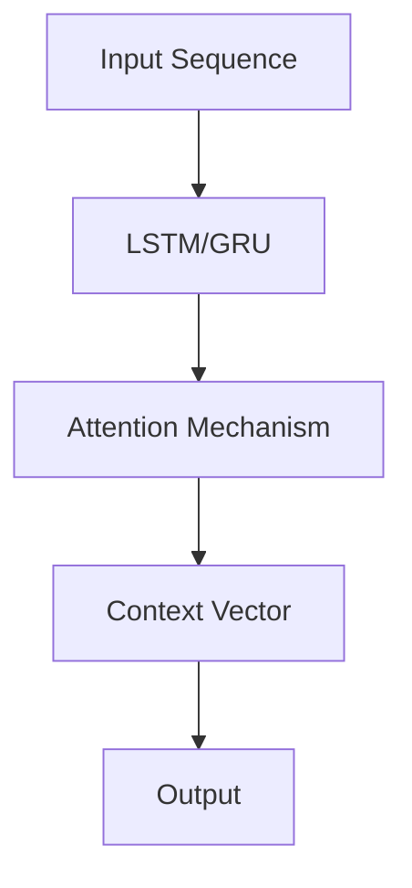

                 

# 跨语言AI模型：多语言支持的挑战

> **关键词**：跨语言AI、多语言支持、语义表示、迁移学习、依存句法分析、机器翻译、问答系统、发展趋势

> **摘要**：
本文深入探讨了跨语言AI模型在多语言支持方面的挑战和解决方案。首先，我们介绍了跨语言AI模型的基本概念和重要性。接着，我们详细分析了跨语言AI模型的技术基础，包括自然语言处理基础、跨语言语义表示、跨语言迁移学习以及多语言依存句法分析。然后，我们探讨了跨语言AI模型在实际应用中的挑战和解决方案，如跨语言机器翻译和跨语言问答系统。最后，我们展望了跨语言AI模型的未来发展趋势，并讨论了其在多个领域的潜在应用和伦理与隐私问题。

## 目录大纲

### 第一部分：跨语言AI模型概述
1. **第1章：跨语言AI模型引论**
2. **第2章：自然语言处理基础**
3. **第3章：跨语言语义表示**
4. **第4章：跨语言迁移学习**
5. **第5章：多语言依存句法分析**
6. **第6章：跨语言机器翻译**
7. **第7章：跨语言问答系统**
8. **第8章：跨语言AI模型的发展趋势**
9. **附录A：跨语言AI模型的开发工具与资源**

---

### 《跨语言AI模型：多语言支持的挑战》正文

#### 第一部分：跨语言AI模型概述

#### 第1章：跨语言AI模型引论

随着全球化的不断深入，跨语言交流的需求日益增长。这不仅体现在国际贸易、文化交流、全球教育等各个领域，也促使人工智能技术在多语言支持方面取得了显著的进展。跨语言AI模型作为一种新兴的技术，能够实现不同语言之间的智能交互，具有广泛的应用前景。

#### 1.1 跨语言AI模型的重要性

**1.1.1 全球多语言环境下的需求**

全球有超过7000种语言，然而，使用最广泛的语言仅有少数几种。例如，英语、汉语、西班牙语和法语等。这种语言分布的不平衡导致了跨语言交流的障碍。跨语言AI模型的出现，为解决这一难题提供了有效途径。

**1.1.2 跨语言AI的优势与应用场景**

跨语言AI模型在多个领域具有广泛应用：

- **机器翻译**：跨语言AI模型能够将一种语言的内容自动翻译成另一种语言，使得跨语言交流变得更加便捷。
- **多语言文本分类**：在社交媒体、新闻媒体等场景中，需要对大量多语言文本进行分类，跨语言AI模型能够有效处理这一任务。
- **跨语言问答系统**：用户可以使用不同语言提出问题，AI系统能够理解并回答。
- **多语言搜索引擎**：跨语言AI模型能够帮助用户在多种语言的环境中搜索信息。

#### 1.2 跨语言AI模型的基本概念

**1.2.1 跨语言语义表示**

跨语言语义表示是跨语言AI模型的核心。它旨在将不同语言的语义信息映射到统一的语义空间，使得不同语言之间的语义比较和分析成为可能。

**1.2.2 跨语言迁移学习**

跨语言迁移学习利用已在大规模单语言数据集上训练好的模型，通过少量跨语言数据进行迁移，以提升跨语言任务的性能。

**1.2.3 跨语言依存句法分析**

跨语言依存句法分析旨在理解不同语言之间的句法结构，从而更准确地解析语义。

#### 1.3 跨语言AI模型的现状与挑战

**1.3.1 跨语言AI模型的演进路径**

从最初的基于规则的方法，到基于统计的方法，再到基于深度学习的方法，跨语言AI模型在技术路径上不断演进。

**1.3.2 当前跨语言AI模型的性能限制**

尽管跨语言AI模型在多语言支持方面取得了显著进展，但仍面临一些性能限制，如：

- **语言理解**：不同语言的语义和句法差异导致AI模型在理解语言时存在一定困难。
- **数据稀缺性**：某些语言的训练数据较少，限制了模型的性能。
- **计算资源**：跨语言AI模型通常需要大量的计算资源，这在某些场景中可能难以实现。

#### 第2章：自然语言处理基础

在探讨跨语言AI模型之前，我们先了解自然语言处理（NLP）的基础知识，这是构建跨语言AI模型的重要基础。

##### 2.1 语言模型与词向量

**2.1.1 语言模型的原理**

语言模型是NLP的核心组成部分，它用于预测一个词语序列的概率。基于此，我们可以构建跨语言语言模型，用于预测不同语言的词语序列。

**2.1.2 词向量及其应用**

词向量是一种将词语映射到高维空间中的方法，使得词语之间可以根据其在空间中的距离来表示其相似性。在跨语言AI模型中，词向量有助于不同语言之间的语义表示。

**2.1.3 词嵌入技术（Mermaid流程图）**



##### 2.2 序列模型与注意力机制

**2.2.1 循环神经网络（RNN）**

循环神经网络（RNN）是一种用于处理序列数据的神经网络，其通过存储状态信息来捕捉序列中的时间依赖关系。

**2.2.2 长短期记忆网络（LSTM）**

LSTM是RNN的一种变体，它通过门控机制来避免长期依赖问题，使得模型在处理序列数据时更加有效。

**2.2.3 注意力机制（Mermaid流程图）**



##### 2.3 转换器架构

**2.3.1 转换器架构的基本原理**

转换器架构（Transformer）是近年来在NLP领域取得突破的一种神经网络架构，它通过自注意力机制来捕捉序列中的依赖关系。

**2.3.2 转换器架构的变体**

转换器架构的变体，如BERT、GPT等，通过预训练和微调来提升模型在多种NLP任务上的性能。

#### 第3章：跨语言语义表示

在跨语言AI模型中，跨语言语义表示是关键的一环。它涉及将不同语言的语义信息映射到统一的语义空间，以便于后续的语义处理和分析。

##### 3.1 跨语言语义对齐

**3.1.1 跨语言语义对齐的方法**

跨语言语义对齐是将不同语言的词语映射到同一语义空间的过程。常用的方法包括基于统计的方法、基于神经网络的方法和基于知识的方法。

**3.1.2 跨语言语义对齐的应用案例**

跨语言语义对齐在多语言文本分类、跨语言信息检索等任务中具有重要意义。

##### 3.2 跨语言嵌入模型

**3.2.1 跨语言嵌入模型的基本原理**

跨语言嵌入模型是一种将不同语言的词语映射到高维空间中的方法，使得词语之间的相似性和差异性可以通过距离来表示。

**3.2.2 跨语言嵌入模型的实现（伪代码）**

```python
# 假设我们有两个语言L1和L2，以及一个共享的语义空间V
# 初始化跨语言嵌入矩阵E，其中E1和E2分别表示L1和L2的嵌入向量
E1 = ... 
E2 = ...

# 对L1中的词语进行嵌入
word1_embedding = E1[word1]

# 对L2中的词语进行嵌入
word2_embedding = E2[word2]

# 计算L1和L2词语之间的相似度
similarity = cosine_similarity(word1_embedding, word2_embedding)
```

##### 3.3 多语言文本分类

**3.3.1 多语言文本分类的挑战**

多语言文本分类需要在不同的语言环境下进行，这带来了语言理解、模型适应性和数据稀缺性等挑战。

**3.3.2 多语言文本分类的方法**

常用的多语言文本分类方法包括基于传统机器学习的方法和基于深度学习的方法。其中，深度学习方法如BERT在多语言文本分类中取得了显著效果。

#### 第4章：跨语言迁移学习

跨语言迁移学习是跨语言AI模型中的一个重要研究方向。它通过利用已在大规模单语言数据集上训练好的模型，通过少量跨语言数据进行迁移，以提升跨语言任务的性能。

##### 4.1 迁移学习的概念

**4.1.1 迁移学习的定义**

迁移学习是指将已在一个任务上训练好的模型应用到另一个相关任务上的过程。

**4.1.2 迁移学习的分类**

迁移学习可以分为三种类型：无监督迁移学习、半监督迁移学习和有监督迁移学习。

##### 4.2 跨语言迁移学习的挑战

**4.2.1 语言差异**

不同语言之间的差异使得跨语言迁移学习面临挑战。这包括词汇、语法和语义等方面的差异。

**4.2.2 数据分布差异**

不同语言的数据分布可能存在显著差异，这也会影响跨语言迁移学习的性能。

##### 4.3 跨语言迁移学习方法

**4.3.1 无监督迁移学习**

无监督迁移学习是指在没有标签数据的情况下，利用已训练好的模型来提升跨语言任务的性能。常用的方法包括基于特征的方法和基于模型的方法。

**4.3.2 半监督迁移学习**

半监督迁移学习是指在有少量标签数据和大量无标签数据的情况下，利用已训练好的模型来提升跨语言任务的性能。常用的方法包括基于模型的方法和基于图的方法。

**4.3.3 有监督迁移学习**

有监督迁移学习是指在有标签数据的情况下，利用已训练好的模型来提升跨语言任务的性能。常用的方法包括基于模型的方法和基于优化的方法。

##### 4.4 迁移学习的优化策略

**4.4.1 数据增强**

数据增强是一种通过生成或修改数据来提升模型性能的方法。在跨语言迁移学习中，数据增强可以帮助缓解数据分布差异的问题。

**4.4.2 模型集成**

模型集成是指将多个模型进行融合，以提升整体性能。在跨语言迁移学习中，模型集成可以帮助缓解模型不稳定性的问题。

**4.4.3 模型蒸馏**

模型蒸馏是一种将复杂模型的知识传递给简单模型的方法。在跨语言迁移学习中，模型蒸馏可以帮助提升小样本情况下的性能。

#### 第5章：多语言依存句法分析

多语言依存句法分析是理解多语言语义的关键技术。它旨在建立不同语言之间的句法结构对应关系，从而更准确地解析语义。

##### 5.1 依存句法分析的基本概念

**5.1.1 依存句法树的定义**

依存句法树是一种表示句子中词语之间依存关系的树形结构。每个节点表示一个词语，边表示词语之间的依存关系。

**5.1.2 依存句法分析的挑战**

不同语言的句法结构可能存在显著差异，这使得依存句法分析面临挑战。例如，某些语言具有复杂的词序和丰富的语法结构。

##### 5.2 跨语言依存句法分析的方法

**5.2.1 基于规则的方法**

基于规则的方法通过定义一系列的句法规则来解析不同语言之间的句法结构。这种方法在处理简单的语言时较为有效，但在复杂语言中可能难以应用。

**5.2.2 基于统计的方法**

基于统计的方法通过统计不同语言之间的句法规则来解析句法结构。这种方法利用大规模语料库，可以处理复杂的语言。

**5.2.3 基于神经网络的方法**

基于神经网络的方法通过训练神经网络模型来自动学习不同语言之间的句法结构对应关系。这种方法在处理复杂语言时具有较好的性能。

##### 5.3 跨语言依存句法分析的实现（伪代码）

```python
# 假设我们有两个语言L1和L2，以及一个共享的句法分析模型
# 对L1中的句子进行依存句法分析
dependency_tree1 = parse_sentence_l1(sentence1)

# 对L2中的句子进行依存句法分析
dependency_tree2 = parse_sentence_l2(sentence2)

# 将L1和L2的句法分析结果进行对比
comparison_result = compare_dependency_trees(dependency_tree1, dependency_tree2)
```

#### 第6章：跨语言机器翻译

跨语言机器翻译是跨语言AI模型中最具挑战性的任务之一。它旨在将一种语言的文本自动翻译成另一种语言，以实现跨语言交流。

##### 6.1 机器翻译的基本概念

**6.1.1 机器翻译的定义**

机器翻译是一种利用计算机技术将一种语言的文本自动翻译成另一种语言的过程。

**6.1.2 机器翻译的发展历程**

机器翻译经历了从基于规则的方法到基于统计的方法，再到基于深度学习的方法的演变。近年来，基于深度学习的方法如基于转换器的机器翻译（如BERT、GPT等）取得了显著进展。

##### 6.2 跨语言机器翻译的挑战

**6.2.1 语言理解与生成的挑战**

不同语言之间的语义、语法和句法差异使得语言理解与生成成为机器翻译中的关键挑战。

**6.2.2 数据稀缺性问题**

某些语言的翻译数据较少，这限制了机器翻译模型的性能。

##### 6.3 跨语言机器翻译的方法

**6.3.1 神经网络机器翻译**

神经网络机器翻译是近年来在机器翻译领域取得突破的一种方法。它通过训练神经网络模型来自动学习翻译规律。

**6.3.2 基于转换器的机器翻译**

基于转换器的机器翻译（如BERT、GPT等）是一种先进的机器翻译方法，它通过自注意力机制和编码器-解码器架构来捕捉序列之间的依赖关系。

**6.3.3 多语言编码模型**

多语言编码模型（如XLM、mBERT等）是一种能够同时处理多种语言的机器翻译方法。它通过共享的编码器和解码器来处理不同语言之间的翻译任务。

##### 6.4 跨语言机器翻译的实际应用

跨语言机器翻译在多个领域具有广泛的应用，如：

- **国际商务**：跨语言机器翻译可以帮助企业与国际合作伙伴进行有效沟通。
- **全球教育**：跨语言机器翻译可以帮助学生和教师跨越语言障碍，提高学习效率。
- **国际旅游**：跨语言机器翻译可以帮助游客更好地了解当地文化和景点。

#### 第7章：跨语言问答系统

跨语言问答系统是一种能够理解并回答不同语言的问题的智能系统。它在多个领域具有广泛的应用，如国际商务、全球教育和跨文化交流等。

##### 7.1 跨语言问答系统概述

**7.1.1 跨语言问答系统的定义**

跨语言问答系统是一种能够处理不同语言的问题并给出恰当回答的智能系统。

**7.1.2 跨语言问答系统的应用场景**

跨语言问答系统的应用场景包括：

- **国际商务**：跨语言问答系统可以帮助企业与国际客户进行有效沟通。
- **全球教育**：跨语言问答系统可以帮助学生和教师跨越语言障碍，提高学习效率。
- **跨文化交流**：跨语言问答系统可以帮助人们更好地了解不同文化和习俗。

##### 7.2 跨语言问答系统的挑战

**7.2.1 语义理解**

不同语言的语义可能存在差异，这使得跨语言问答系统在语义理解方面面临挑战。

**7.2.2 语言理解**

跨语言问答系统需要理解不同语言的语法和句法结构，这也会带来一定的挑战。

**7.2.3 语言生成**

生成准确的回答是跨语言问答系统的重要挑战，不同语言之间的表达方式和习惯也需要考虑。

##### 7.3 跨语言问答系统的实现

**7.3.1 多语言嵌入模型**

多语言嵌入模型是将不同语言的词语映射到同一语义空间的方法，这有助于跨语言问答系统在语义理解方面取得进展。

**7.3.2 问答系统的架构**

跨语言问答系统通常包括问答模块、语义解析模块和回答生成模块。问答模块负责接收用户问题，语义解析模块负责理解问题，回答生成模块负责生成回答。

**7.3.3 实际问答案例**

通过实际问答案例，我们可以看到跨语言问答系统在不同语言环境中的表现。

#### 第8章：跨语言AI模型的发展趋势

随着技术的不断进步，跨语言AI模型在多语言支持方面具有广阔的发展前景。以下是一些主要的发展趋势：

##### 8.1 跨语言AI模型的未来发展方向

**8.1.1 语言无关性**

未来的跨语言AI模型将更加注重语言无关性，通过统一的语义表示和模型架构，实现跨语言任务的自动化处理。

**8.1.2 多语言协同学习**

多语言协同学习是一种将多种语言数据集成到同一模型中进行训练的方法，这有助于提升跨语言AI模型的性能。

**8.1.3 模型压缩与优化**

模型压缩与优化是跨语言AI模型发展的一个重要方向。通过减少模型参数和计算复杂度，可以实现更高效的跨语言任务处理。

##### 8.2 跨语言AI模型的潜在应用领域

**8.2.1 国际贸易**

跨语言AI模型可以帮助企业更好地了解国际市场的需求和趋势，提高贸易效率。

**8.2.2 全球教育**

跨语言AI模型可以帮助学生和教师跨越语言障碍，实现全球教育的普及和提升。

**8.2.3 跨文化交流**

跨语言AI模型可以帮助人们更好地了解不同文化和习俗，促进跨文化交流和理解。

##### 8.3 跨语言AI模型的伦理与隐私问题

**8.3.1 数据隐私保护**

在跨语言AI模型的应用过程中，数据隐私保护是一个重要问题。模型需要确保用户的隐私数据得到妥善保护。

**8.3.2 语言歧视问题**

跨语言AI模型需要避免语言歧视，确保不同语言的用户都能得到公平对待。

#### 附录A：跨语言AI模型的开发工具与资源

**A.1 开发工具对比**

- **语言模型开发工具**：包括TensorFlow、PyTorch、JAX等。
- **跨语言迁移学习工具**：包括OpenNMT、T5、XLM等。
- **跨语言机器翻译工具**：包括Apache MXNet、Transformers等。

**A.2 资源汇总**

- **数据集与库**：包括WMT、MTOP、FLORES等。
- **开源代码与框架**：包括Hugging Face、TensorFlow Addons等。
- **学术论文与文献**：包括ACL、EMNLP、ICML等国际会议和期刊。

---

### 作者信息

**作者：AI天才研究院/AI Genius Institute & 禅与计算机程序设计艺术 /Zen And The Art of Computer Programming**

