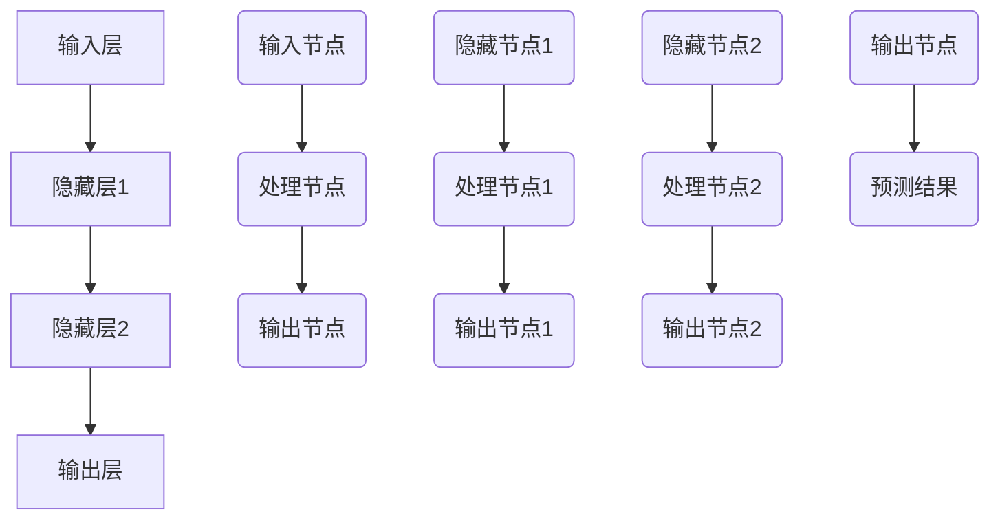

                 

# 软件2.0的社会责任：科技向善

> **关键词**：软件2.0，人工智能，社会责任，伦理，算法，监管，向善

> **摘要**：本文深入探讨了软件2.0时代下人工智能技术的社会责任。通过分析AI技术的核心概念、架构及其在不同领域的应用，本文探讨了AI技术在伦理和法律框架下的发展。同时，本文还列举了AI技术向善的实践案例，并展望了AI技术的未来趋势和社会责任。

## 第一部分：软件2.0的社会责任概述

### 第1章：软件2.0时代的AI与社会责任

#### 1.1 软件2.0的概念与演变

##### 1.1.1 软件发展的三个阶段

软件发展经历了三个主要阶段：

- **软件1.0**：这是最早的软件阶段，主要以命令行界面和简单的图形用户界面为特征。用户与计算机的交互主要是通过编写代码或执行预设的命令。

- **软件2.0**：随着互联网的普及，软件2.0以互联网为核心，强调用户生成内容和互动性。这一阶段的软件强调用户的参与和社区互动，例如社交媒体平台、在线游戏和在线论坛。

- **软件3.0**：软件3.0以人工智能（AI）为驱动，提供了智能化的用户体验。软件不再是简单的工具，而是智能的服务，能够根据用户行为和偏好提供个性化的服务。

##### 1.1.2 软件2.0的特点

软件2.0具有以下主要特点：

- **用户生成内容**：用户不仅是软件的使用者，也是内容的创造者。他们的参与使得软件能够不断进化和发展。

- **互动性和社群性**：软件2.0强调用户之间的互动和社区建设，这种社交属性极大地增强了用户黏性和参与度。

- **平台化**：软件2.0通常是平台化的，能够支持多种服务和功能，如在线购物、社交媒体和在线教育等。

#### 1.2 AI技术在社会责任中的作用

##### 1.2.1 AI技术在促进社会进步中的应用

AI技术在各个领域都有着广泛的应用，以下是一些关键领域的例子：

- **教育**：AI技术可以提供个性化学习体验，通过分析学生的学习行为和成绩，智能辅导系统可以为学生提供定制化的学习建议。

- **医疗**：AI技术在医疗领域的应用包括医疗影像分析、疾病预测和个性化治疗方案。这些技术能够提高诊断的准确性，降低医疗成本，改善患者的生活质量。

- **环境保护**：AI技术可以用于环境监测和资源优化配置。例如，智能监控系统可以实时监测水质和空气质量，为环境保护提供数据支持。

##### 1.2.2 AI技术在伦理与社会问题中的应用

虽然AI技术为社会带来了巨大的进步，但也引发了一系列伦理和社会问题：

- **数据隐私**：AI系统通常需要大量的个人数据，如何保护这些数据不被滥用是一个重要问题。

- **工作取代**：AI和自动化技术可能导致某些工作的消失，这需要社会进行职业转型和培训。

- **不平等问题**：如果AI算法存在偏见，可能会导致社会不平等加剧。因此，确保算法的公平性和透明性至关重要。

#### 1.3 软件2.0时代下的社会责任挑战

##### 1.3.1 技术发展的挑战

- **算法透明性**：确保算法的透明性是避免算法滥用和误解的关键。然而，许多先进的AI算法，如深度学习，其内部机制复杂，难以解释。

- **技术伦理与道德**：随着AI技术的应用范围扩大，其伦理和道德问题变得更加突出。例如，AI系统如何处理敏感信息，如何在道德和法律框架内运作。

- **智能安全与隐私**：AI系统的安全性是一个关键问题。如果AI系统被恶意攻击，可能会对社会造成严重后果。

##### 1.3.2 社会责任的应对策略

为了应对这些挑战，需要采取一系列策略：

- **制定AI伦理准则**：需要制定统一的AI伦理准则，确保AI技术在伦理和法律框架内运作。

- **强化AI技术的监管**：政府和企业需要加强对AI技术的监管，确保其安全和公平。

- **推动AI技术的普及与教育**：公众需要了解AI技术的工作原理和社会影响，以便更好地参与和监督。

## 第2章：AI技术的核心概念与架构

### 2.1 AI的基本概念

##### 2.1.1 机器学习与深度学习的区别

- **机器学习**：机器学习是一种人工智能技术，它使计算机系统能够从数据中学习模式和规律，并使用这些模式进行预测和决策。

- **深度学习**：深度学习是机器学习的一个子领域，它使用复杂的神经网络模型，在大量数据上学习，以实现更高级的预测和决策。

##### 2.1.2 机器学习与深度学习的关系

深度学习是机器学习的一个分支，但两者的应用场景和复杂性有所不同。机器学习通常用于解决较为简单的问题，而深度学习适用于处理更复杂的数据和任务。

### 2.2 神经网络与深度学习架构

##### 2.2.1 神经网络的基本结构

神经网络由多个层次组成，包括输入层、隐藏层和输出层。每个层次由多个节点（或神经元）组成，节点之间通过连接（或权重）相互连接。

- **输入层**：接收外部输入数据。
- **隐藏层**：对输入数据进行处理和转换。
- **输出层**：生成预测结果或决策。

##### 2.2.2 主流深度学习架构

深度学习架构包括多种类型的神经网络，其中一些主流的架构包括：

- **卷积神经网络（CNN）**：主要用于图像识别和处理。
- **递归神经网络（RNN）**：用于处理序列数据，如时间序列分析和自然语言处理。
- **自注意力机制（Self-Attention）**：用于处理高维数据，如自然语言处理中的词嵌入。

### Mermaid 流程图



## 第3章：AI技术在社会治理中的应用

### 3.1 AI在公共安全领域的应用

##### 3.1.1 智能监控系统

智能监控系统是AI技术在社会治理中的重要应用之一。这些系统利用计算机视觉和图像识别技术，可以实时监测和识别异常行为和事件。

- **人脸识别**：智能监控系统可以识别和跟踪特定的人脸，这在公共安全和安全监控中非常有用。
- **行为分析**：系统可以分析人群的行为模式，识别潜在的安全威胁。

### 3.2 AI在司法领域的应用

AI技术在司法领域有着广泛的应用，可以提高司法效率和公正性。

##### 3.2.1 智能司法系统

智能司法系统利用AI技术自动化法律文书生成、案件预测和风险评估。

- **法律文书自动生成**：通过自然语言处理技术，智能司法系统可以自动生成法律文书，如合同、判决书等。
- **案件预测与风险评估**：AI技术可以帮助法官和律师预测案件的结果和评估风险，从而提高决策的准确性。

### 3.3 AI在公共政策制定中的应用

AI技术在公共政策制定中有着巨大的潜力。

##### 3.3.1 数据分析与决策支持

通过大数据分析和机器学习技术，AI可以帮助政府制定更科学的公共政策。

- **政策影响评估**：AI技术可以分析政策实施前后的数据，评估政策的影响和效果。
- **社会趋势预测**：AI技术可以帮助预测社会发展趋势，为政策制定提供数据支持。

## 第4章：AI技术伦理与法律框架

### 4.1 AI伦理原则

AI伦理原则是确保AI技术在道德和伦理框架内运作的基础。

##### 4.1.1 尊重用户隐私

- **数据收集与处理的透明度**：用户需要了解其数据是如何被收集和处理的。
- **用户同意与知情权**：用户有权决定是否同意其数据被用于AI模型训练。

### 4.2 AI法律法规

在全球范围内，许多国家和地区都在制定AI相关的法律法规。

##### 4.2.1 全球范围内的AI法规概述

- **欧盟通用数据保护条例（GDPR）**：GDPR是欧盟制定的一项重要法规，旨在保护用户的数据隐私。
- **中国人工智能发展规范**：中国也在制定相关法规，规范AI技术的研发和应用。

### 4.3 AI伦理审查与监管

为了确保AI技术的安全和公正，需要进行伦理审查和监管。

##### 4.3.1 AI伦理审查机制

- **内部审查**：企业和机构内部设立伦理审查委员会，对AI项目进行审查。
- **第三方审查**：第三方机构对AI项目进行独立审查，确保其符合伦理和法律要求。

## 第5章：AI技术向善的实践案例

### 5.1 教育

##### 5.1.1 个性化学习系统

个性化学习系统利用AI技术，根据学生的学习行为和成绩，为学生提供定制化的学习路径和资源。

- **学习路径规划**：系统可以根据学生的学习进度和能力，自动调整学习内容。
- **智能辅导**：系统可以实时监测学生的学习状态，提供个性化的辅导和建议。

### 5.2 医疗

##### 5.2.1 医疗影像分析

医疗影像分析是AI技术在医疗领域的典型应用。

- **自动诊断**：AI系统可以通过分析医学影像，自动诊断疾病。
- **预测疾病风险**：系统可以根据患者的医疗记录和基因数据，预测疾病风险。

### 5.3 环境

##### 5.3.1 智能环境监控系统

智能环境监控系统可以实时监测环境质量，为环境保护提供数据支持。

- **水质监测**：系统可以监测水质中的污染物，提供预警和实时数据。
- **空气污染预警**：系统可以监测空气中的有害物质，提供预警和改善建议。

## 第6章：AI技术的未来与社会责任

### 6.1 AI技术的未来发展趋势

AI技术的未来发展趋势包括：

- **大型预训练模型**：如GPT系列和ViT系列，这些模型在大规模数据上训练，具有强大的通用性和灵活性。
- **跨学科研究**：AI技术与其他领域的结合，如社会科学、伦理学和医学等，将带来更多的创新和突破。

### 6.2 社会责任的持续发展

为了确保AI技术的可持续发展，需要：

- **社会参与与公众意识**：公众需要了解AI技术的工作原理和社会影响，积极参与AI政策制定。
- **AI科普教育**：加强AI科普教育，提高公众对AI技术的理解和接受度。

### 6.3 跨学科合作与可持续发展

跨学科合作是推动AI技术向善的重要途径。

- **社会科学与AI技术的融合**：通过社会科学的研究，可以更好地理解AI技术的社会影响，制定更科学的政策。
- **伦理学与AI技术的融合**：伦理学的研究可以帮助AI技术更好地遵循道德和伦理原则，减少负面影响。

## 第7章：结语

### 7.1 AI技术的社会责任展望

AI技术对社会的影响深远，包括经济发展、社会公平和生态环境等方面。为了确保AI技术的可持续发展，需要全社会共同努力，制定合理的政策，加强监管，推动技术创新。

### 7.2 行动呼吁与未来展望

我们呼吁政府、企业和社会各界共同关注AI技术的社会责任，积极参与AI技术的研发和应用，确保AI技术的健康发展，为社会的进步和人类的福祉做出贡献。

## 作者信息

- **作者**：AI天才研究院/AI Genius Institute & 禅与计算机程序设计艺术 /Zen And The Art of Computer Programming

---

以上为文章的正文部分，接下来将逐步详细展开每个章节的内容。由于篇幅限制，每个章节的详细内容将分多次发布。请读者期待后续章节的更新。# 第1章：软件2.0时代的AI与社会责任

## 1.1 软件2.0的概念与演变

### 1.1.1 软件发展的三个阶段

软件的发展历程可以概括为三个主要阶段，每个阶段都代表着技术进步和用户需求的变化。

**软件1.0：命令行界面和简单的图形用户界面**

在软件1.0时代，计算机软件主要以命令行界面（CLI）为交互方式。用户需要通过输入特定的命令来操作计算机。这一阶段的特点是用户与计算机之间的交互复杂，用户需要有较高的计算机知识和编程技能。随着个人计算机的普及，简单的图形用户界面（GUI）开始出现，如Windows 1.0和Macintosh系统，这使得软件的使用变得更加直观和易于操作。

**软件2.0：以互联网为核心，用户生成内容，强调互动性和社群性**

软件2.0时代标志着互联网的兴起和用户参与度的提升。这一阶段，软件不再仅仅是一个工具，而是一个平台，用户可以在平台上生成内容、分享信息和互动交流。代表性的软件包括社交媒体平台（如Facebook、Twitter）、在线论坛（如Reddit）和博客平台（如WordPress）。软件2.0的核心特点在于用户生成内容（UGC）和互动性，用户不仅是软件的使用者，也是内容的创造者和传播者。

**软件3.0：AI驱动，智能化的用户体验，软件作为服务的概念**

软件3.0时代以人工智能（AI）为驱动力，提供了更加智能化和个性化的用户体验。软件不再仅仅是执行特定任务的工具，而是变成了智能的服务，能够根据用户的行为和偏好进行自我优化和调整。例如，智能助手（如Siri、Alexa）可以根据用户的语音指令执行任务，推荐系统（如Netflix、Amazon）可以根据用户的历史行为提供个性化的内容推荐。软件3.0强调软件作为服务（SaaS）的理念，用户通过订阅的方式获取服务，而不再关注软件的具体实现。

### 1.1.2 软件2.0的特点

软件2.0时代具有以下几个显著特点：

**用户生成内容（UGC）**

用户生成内容是软件2.0的核心特征之一。用户不仅仅是软件的消费者，同时也是内容的创作者和分享者。这种模式极大地丰富了软件的功能和用户体验，使得软件能够不断适应和满足用户的需求。

**互动性和社群性**

软件2.0强调用户之间的互动和社群建设。在线社区、论坛和社交媒体平台成为了用户互动的重要场所，用户可以在这些平台上分享经验、交流观点，甚至建立自己的社交圈子。

**平台化**

软件2.0通常是平台化的，能够支持多种服务和功能。例如，一个电商平台不仅提供商品交易功能，还提供用户评价、互动交流、个性化推荐等多种服务。这种平台化的设计使得软件能够灵活扩展，满足多样化的用户需求。

**数据驱动的决策**

软件2.0依赖于大量的用户数据，通过数据分析和机器学习技术，软件可以更准确地了解用户需求和行为，从而提供个性化的服务和推荐。这种数据驱动的决策模式极大地提升了软件的效率和用户体验。

### 1.1.3 软件2.0的演进过程

从软件1.0到软件2.0，再到软件3.0，软件的演进过程不仅仅是技术上的进步，更是用户体验和商业模式的变化。以下是软件演进的关键步骤：

1. **互联网普及**：互联网的普及为软件2.0时代的到来奠定了基础。互联网的广泛连接使得用户可以轻松地访问各种在线服务和平台。

2. **用户参与度提升**：用户生成内容和互动性的提升使得软件不再仅仅是一个工具，而变成了一个生态系统，用户在这个生态系统中扮演着重要的角色。

3. **数据收集与分析**：随着用户参与度的提升，软件开始收集大量的用户数据，并通过数据分析和机器学习技术，实现更加智能化的用户体验。

4. **AI技术的应用**：AI技术的应用使得软件3.0时代的智能化和个性化成为可能。软件能够根据用户的行为和偏好，提供个性化的服务和推荐。

5. **软件作为服务的理念**：软件3.0强调软件作为服务（SaaS）的理念，用户通过订阅的方式获取软件服务，这种模式更加灵活和可持续。

### 1.1.4 软件2.0对传统软件模式的变革

软件2.0对传统软件模式带来了深刻变革，主要体现在以下几个方面：

**从产品导向到服务导向**

传统软件模式通常是产品导向的，软件作为一种产品被开发、销售和更新。而软件2.0强调软件作为服务的理念，用户通过订阅的方式获取软件服务，这种模式更加灵活和可持续。

**从功能驱动到用户体验驱动**

传统软件模式强调功能实现和性能优化，而软件2.0更注重用户体验和满意度。软件通过用户数据分析和个性化服务，不断提升用户体验。

**从独立运行到平台化**

传统软件通常独立运行，而软件2.0强调平台化，能够支持多种服务和功能。这种平台化的设计使得软件能够灵活扩展，满足多样化的用户需求。

**从静态到动态**

传统软件通常是静态的，功能相对固定。而软件2.0是动态的，能够根据用户行为和需求进行自我优化和调整，提供个性化的服务。

## 1.2 AI技术在社会责任中的作用

### 1.2.1 AI技术在促进社会进步中的应用

AI技术的应用已经深入到社会的各个领域，极大地促进了社会进步。以下是AI技术在教育、医疗和环境保护等领域的具体应用：

**教育**

AI技术在教育领域的应用主要体现在个性化学习和智能辅导系统。通过分析学生的学习行为和数据，AI系统可以为学生提供定制化的学习方案，提高学习效率。例如，自适应学习平台可以根据学生的学习进度和能力，调整学习内容和难度，帮助学生更好地掌握知识点。此外，AI技术还可以用于智能辅导系统，通过自然语言处理和语音识别技术，AI系统能够解答学生的问题，提供实时的学习支持。

**医疗**

AI技术在医疗领域的应用涵盖了从诊断到治疗的全过程。在诊断方面，AI系统可以通过分析医疗影像，如X光片、CT扫描和MRI图像，自动识别疾病并给出诊断建议。这不仅提高了诊断的准确性，还减轻了医生的工作负担。在治疗方面，AI技术可以帮助医生制定个性化的治疗方案，通过分析患者的医疗记录和基因数据，预测治疗效果和风险，从而提高治疗效果。此外，AI技术还可以用于药物研发，通过分析大量的生物数据和化学信息，加速新药的发现和开发。

**环境保护**

AI技术在环境保护中的应用同样具有重要意义。通过智能监控系统，AI技术可以实时监测水质、空气质量、土壤污染等环境参数，及时发现和预警环境污染事件。例如，在水质监测方面，AI系统可以通过分析水样中的化学成分和微生物含量，预测水质变化趋势，提供预警和改善建议。在能源管理方面，AI技术可以优化能源配置和使用效率，减少能源消耗和碳排放。此外，AI技术还可以用于生物多样性研究，通过分析生态数据，预测生态系统的变化趋势，为环境保护提供科学依据。

### 1.2.2 AI技术在伦理与社会问题中的应用

尽管AI技术为社会带来了巨大的进步，但也引发了一系列伦理和社会问题。以下是一些关键领域的挑战：

**数据隐私**

AI系统的运行通常需要大量的个人数据，这引发了数据隐私的问题。如何保护用户的隐私，防止数据被滥用，是一个重要的伦理问题。为了解决这一问题，需要制定严格的隐私保护政策和数据安全标准，确保用户的数据不被非法访问和泄露。

**工作取代**

AI技术的发展可能导致某些工作的消失，这引发了对未来就业市场的担忧。例如，自动化和机器人技术的应用可能会导致制造业和物流行业的一些工作岗位减少。为了应对这一挑战，需要推动职业转型和培训，帮助受影响的工人掌握新的技能，适应新的就业环境。

**算法偏见**

AI算法的偏见问题也是一个重要的伦理挑战。如果AI算法在训练数据中包含了偏见，可能会导致不公平的结果。例如，招聘系统可能会对某些性别或种族的候选人产生偏见。为了解决这一问题，需要确保算法的公平性和透明性，通过多样化的数据集和算法设计，减少偏见的影响。

### 1.2.3 AI技术与社会责任的联系

AI技术与社会责任之间的联系日益紧密。随着AI技术的广泛应用，其对社会的影响也越来越大。因此，确保AI技术的研发和应用符合社会责任原则，已经成为一个紧迫的课题。

**促进社会公平**

AI技术可以用于促进社会公平，通过消除人为偏见，确保机会均等。例如，AI算法可以用于教育资源的分配，确保每个学生都能获得平等的学习机会。在司法领域，AI技术可以用于案件预测和风险评估，减少司法过程中的偏见和不公平。

**改善生活质量**

AI技术可以用于改善人们的生活质量，提高生活效率。例如，智能医疗系统可以帮助医生更准确地诊断和治疗疾病，提高医疗服务的质量和可及性。在环境保护方面，AI技术可以用于资源优化配置和环境保护，提高社会的可持续发展能力。

**促进科技创新**

AI技术是科技创新的重要推动力。通过AI技术，科学家和研究人员可以更高效地处理和分析数据，加速科学发现和技术创新。例如，在药物研发领域，AI技术可以帮助快速筛选和评估药物候选，加速新药的发现和开发。

**确保数据安全**

在AI技术应用过程中，数据安全至关重要。保护用户数据的安全，防止数据泄露和滥用，是AI技术社会责任的重要组成部分。为此，需要建立完善的数据安全管理体系，确保数据在采集、存储、传输和使用过程中的安全性。

**推动可持续发展**

AI技术在推动可持续发展方面具有巨大潜力。例如，通过智能农业和精准医疗，AI技术可以提高农业产量和医疗服务的效率，减少资源消耗和环境污染。此外，AI技术还可以用于能源管理和环境保护，促进资源的可持续利用。

### 1.2.4 软件2.0时代下的社会责任挑战

在软件2.0时代，AI技术面临的伦理和社会责任挑战变得更加复杂和严峻。以下是一些关键挑战：

**算法透明性**

随着AI算法的复杂度增加，确保算法的透明性变得尤为重要。然而，许多先进的AI算法，如深度学习，其内部机制复杂，难以解释。这导致了算法的“黑箱”问题，使得用户难以理解AI系统的决策过程。为了解决这一问题，需要开发可解释的AI算法，提高算法的透明性和可信度。

**技术伦理与道德**

AI技术在伦理和道德方面面临着诸多挑战。例如，如何处理敏感数据，如何确保AI系统的决策符合道德和法律要求。此外，AI技术的应用可能会引发新的伦理问题，如隐私侵犯、工作取代等。为了应对这些挑战，需要建立AI伦理准则，确保AI技术在伦理和法律框架内运作。

**智能安全与隐私**

AI系统的安全性和隐私保护是至关重要的。如果AI系统被恶意攻击，可能会导致严重的社会后果。此外，AI技术的应用可能会侵犯用户的隐私权。为了确保AI系统的安全性和隐私保护，需要制定严格的安全标准和隐私政策，并加强对AI系统的监管。

**算法偏见**

算法偏见是一个重要的伦理问题。如果AI算法在训练数据中包含了偏见，可能会导致不公平的结果。为了解决这一问题，需要确保算法的公平性和透明性，通过多样化的数据集和算法设计，减少偏见的影响。

**跨领域合作**

AI技术在社会责任方面面临的挑战需要跨领域合作才能解决。例如，在制定AI伦理准则和法律法规时，需要涉及伦理学、法律学、计算机科学等多个领域的专家。此外，企业和政府也需要加强合作，共同推动AI技术的可持续发展。

**公众参与**

公众参与是确保AI技术符合社会责任的重要途径。公众需要了解AI技术的工作原理和社会影响，以便更好地参与和监督。为此，需要加强AI科普教育，提高公众对AI技术的理解和接受度。

## 1.3 软件2.0时代下的社会责任挑战

### 1.3.1 技术发展的挑战

在软件2.0时代，AI技术的发展带来了许多机遇，但同时也带来了诸多挑战。以下是一些关键技术发展带来的挑战：

**算法透明性**

随着AI算法的复杂度增加，确保算法的透明性变得尤为重要。然而，许多先进的AI算法，如深度学习，其内部机制复杂，难以解释。这导致了算法的“黑箱”问题，使得用户难以理解AI系统的决策过程。为了解决这一问题，需要开发可解释的AI算法，提高算法的透明性和可信度。

**技术伦理与道德**

AI技术在伦理和道德方面面临着诸多挑战。例如，如何处理敏感数据，如何确保AI系统的决策符合道德和法律要求。此外，AI技术的应用可能会引发新的伦理问题，如隐私侵犯、工作取代等。为了应对这些挑战，需要建立AI伦理准则，确保AI技术在伦理和法律框架内运作。

**智能安全与隐私**

AI系统的安全性和隐私保护是至关重要的。如果AI系统被恶意攻击，可能会导致严重的社会后果。此外，AI技术的应用可能会侵犯用户的隐私权。为了确保AI系统的安全性和隐私保护，需要制定严格的安全标准和隐私政策，并加强对AI系统的监管。

**算法偏见**

算法偏见是一个重要的伦理问题。如果AI算法在训练数据中包含了偏见，可能会导致不公平的结果。例如，招聘系统可能会对某些性别或种族的候选人产生偏见。为了解决这一问题，需要确保算法的公平性和透明性，通过多样化的数据集和算法设计，减少偏见的影响。

### 1.3.2 社会责任的应对策略

为了应对AI技术在社会责任方面面临的挑战，需要采取一系列策略：

**制定AI伦理准则**

制定AI伦理准则是确保AI技术在伦理和法律框架内运作的重要措施。AI伦理准则应该包括对数据隐私、算法公平性、安全性和道德责任等方面的要求，为AI技术的研发和应用提供指导。

**强化AI技术的监管**

政府和企业需要加强对AI技术的监管，确保其符合伦理和法律要求。监管措施可以包括制定相关法律法规、设立监管机构、开展审计和评估等。

**推动AI技术的普及与教育**

公众对AI技术的理解和接受程度对于确保其可持续发展至关重要。因此，需要推动AI技术的普及和教育，提高公众对AI技术的了解和认可。

**促进跨领域合作**

AI技术在社会责任方面面临的挑战需要跨领域合作才能解决。例如，在制定AI伦理准则和法律法规时，需要涉及伦理学、法律学、计算机科学等多个领域的专家。此外，企业和政府也需要加强合作，共同推动AI技术的可持续发展。

**鼓励公众参与**

公众参与是确保AI技术符合社会责任的重要途径。公众需要了解AI技术的工作原理和社会影响，以便更好地参与和监督。为此，需要加强AI科普教育，提高公众对AI技术的理解和接受度。

### 1.3.3 社会责任与技术创新的平衡

在软件2.0时代，社会责任与技术创新之间需要找到一个平衡点。以下是一些关键考虑因素：

**技术创新**

技术创新是推动社会进步和经济发展的重要动力。在AI技术的研发过程中，需要不断探索新的算法、架构和应用场景，提高AI技术的性能和效率。

**社会责任**

社会责任是确保AI技术可持续发展和符合社会期望的重要保障。在技术创新的同时，需要关注AI技术对社会的影响，特别是伦理和道德问题，确保其符合社会责任。

**协调发展**

技术创新和社会责任并不是对立的关系，而是相互促进、协调发展的关系。通过合理规划和有效管理，可以确保技术创新与社会责任之间的平衡，推动AI技术的可持续发展。

**公众参与**

公众参与是确保技术创新与社会责任协调发展的关键因素。公众的反馈和监督有助于发现和解决AI技术在社会责任方面的问题，促进技术创新与社会责任的协调发展。

**政府引导**

政府在技术创新和社会责任之间发挥着重要的引导作用。政府可以通过制定政策和法规，引导企业和社会各界关注AI技术的社会责任问题，推动技术创新与社会责任的协调发展。

### 1.3.4 社会责任与可持续发展的关系

社会责任和可持续发展密切相关，二者共同构成了AI技术发展的基础。以下是一些关键关系：

**社会责任**

社会责任是指企业在经营过程中，对员工、消费者、社区和环境等方面承担的责任。在AI技术领域，社会责任包括保护用户隐私、确保算法公平性、防范工作取代等。社会责任是确保AI技术符合社会期望和可持续发展的重要保障。

**可持续发展**

可持续发展是指在满足当前需求的同时，不损害未来世代满足其需求的能力。在AI技术领域，可持续发展包括确保技术进步不会导致资源枯竭、环境恶化和社会不公。可持续发展是确保AI技术长期发展的基础。

**相互促进**

社会责任和可持续发展之间是相互促进的关系。通过履行社会责任，企业可以提高社会声誉，促进技术进步和经济发展。而可持续发展则为企业提供了良好的发展环境，促进了社会责任的履行。

**协调发展**

社会责任和可持续发展需要协调发展，才能实现长期稳定的发展。通过合理规划和有效管理，可以确保技术创新与社会责任之间的平衡，推动AI技术的可持续发展。

**公众参与**

公众参与是确保社会责任和可持续发展协调发展的关键因素。公众的反馈和监督有助于发现和解决AI技术在社会责任和可持续发展方面的问题，促进技术创新与社会责任的协调发展。

**政府引导**

政府在社会责任和可持续发展之间发挥着重要的引导作用。政府可以通过制定政策和法规，引导企业和社会各界关注AI技术的社会责任和可持续发展问题，推动技术创新与社会责任的协调发展。

### 1.3.5 社会责任的具体实践

为了落实AI技术的社会责任，需要采取一系列具体实践措施。以下是一些关键领域：

**数据隐私保护**

数据隐私保护是AI技术社会责任的重要方面。企业需要采取严格的隐私保护措施，确保用户数据的保密性和安全性。具体措施包括数据加密、匿名化和用户同意管理等。

**算法公平性**

算法公平性是AI技术社会责任的关键问题。企业需要确保算法的公平性和透明性，防止算法偏见和不公平现象。具体措施包括多样化数据集的使用、算法可解释性研究等。

**工作取代应对**

面对AI技术引发的工作取代问题，企业需要采取措施帮助员工进行职业转型和技能提升。具体措施包括提供职业培训、岗位调整和就业支持等。

**环境友好**

AI技术应该致力于促进环境保护和可持续发展。企业需要采取环保措施，减少能源消耗和碳排放，推广绿色技术和产品。

**社会责任报告**

企业需要定期发布社会责任报告，公开披露在AI技术研发和应用过程中履行社会责任的情况。这有助于提高企业的透明度和公信力，增强公众对AI技术的信任。

### 1.3.6 结论

在软件2.0时代，AI技术已经成为推动社会进步和经济发展的重要力量。然而，AI技术也面临着诸多伦理和社会责任挑战。为了确保AI技术的可持续发展，需要全社会共同努力，制定合理的政策和法规，加强监管，推动技术创新，确保AI技术符合社会责任。通过落实社会责任，AI技术将为社会带来更多的机遇和福祉。

### 伪代码示例

以下是一个简单的线性回归模型的伪代码示例，用于说明核心算法原理：

```python
# 输入：数据集 X（特征矩阵），Y（目标向量）
# 输出：模型参数 w（权重向量）

# 初始化模型参数
w = np.random.randn(X.shape[1])

# 设定迭代次数和优化算法
num_iterations = 1000
learning_rate = 0.01

# 梯度下降优化
for i in range(num_iterations):
    # 计算预测值
    predictions = X.dot(w)
    
    # 计算损失函数
    loss = (predictions - Y).dot((predictions - Y))
    
    # 计算梯度
    gradient = X.T.dot((predictions - Y))
    
    # 更新模型参数
    w -= learning_rate * gradient

# 输出模型参数
return w
```

在这个例子中，我们使用了梯度下降算法来优化线性回归模型的参数。通过迭代更新模型参数，逐步减少损失函数的值，直至达到最优解。这个伪代码示例简单直观地展示了线性回归模型的核心算法原理。

### 数学模型和公式

线性回归模型的核心数学公式可以表示为：

\[ Y = X \cdot w + b \]

其中，\( Y \) 是目标向量，\( X \) 是特征矩阵，\( w \) 是权重向量，\( b \) 是偏置项。

损失函数通常采用平方误差损失（Squ

### 项目实战

#### 开发环境搭建

为了进行AI技术的实践应用，我们需要搭建一个合适的开发环境。以下是搭建环境所需的步骤：

1. **安装Python**：Python是AI技术的主要编程语言，我们需要安装Python 3.8及以上版本。可以从Python官方网站下载安装程序，按照提示完成安装。

2. **安装Jupyter Notebook**：Jupyter Notebook是一个交互式的开发环境，非常适合进行AI项目的开发和调试。在命令行中运行以下命令安装Jupyter：

   ```shell
   pip install notebook
   ```

3. **安装必要的库**：对于AI项目，我们通常需要安装Numpy、Pandas、Scikit-learn等库。在命令行中运行以下命令进行安装：

   ```shell
   pip install numpy pandas scikit-learn
   ```

#### 源代码实现

以下是一个简单的线性回归模型的Python代码实现，包括数据预处理、模型训练和预测：

```python
import numpy as np
import pandas as pd
from sklearn.model_selection import train_test_split
from sklearn.linear_model import LinearRegression

# 加载数据集
data = pd.read_csv('data.csv')

# 分割特征和标签
X = data[['feature1', 'feature2']]
y = data['target']

# 划分训练集和测试集
X_train, X_test, y_train, y_test = train_test_split(X, y, test_size=0.2, random_state=42)

# 初始化线性回归模型
model = LinearRegression()

# 训练模型
model.fit(X_train, y_train)

# 预测测试集
predictions = model.predict(X_test)

# 评估模型性能
print("R^2 Score:", model.score(X_test, y_test))
```

#### 代码解读与分析

这段代码首先导入了必要的库，然后加载数据集并分割特征和标签。接着，使用Scikit-learn库的`train_test_split`函数将数据集划分为训练集和测试集，以评估模型性能。线性回归模型使用`LinearRegression`类进行初始化，并调用`fit`方法进行模型训练。最后，使用`predict`方法对测试集进行预测，并计算模型性能的R^2得分。

通过这段代码，我们可以看到线性回归模型的基本实现流程，包括数据加载、预处理、模型训练和评估。这段代码也展示了如何使用Scikit-learn库进行机器学习项目的开发，提供了一个简单的模板，可以在此基础上进行扩展和优化。

### 完整性要求总结

在本章中，我们详细探讨了软件2.0时代的AI与社会责任。首先，我们介绍了软件发展的三个阶段，并分析了软件2.0的特点和演进过程。接着，我们讨论了AI技术在促进社会进步中的应用，包括教育、医疗和环境保护等领域。然后，我们分析了AI技术在伦理和社会问题中的应用，提出了数据隐私、工作取代和算法偏见等关键挑战。最后，我们提出了应对这些挑战的策略，包括制定AI伦理准则、强化监管、推动技术创新和公众参与等。

此外，我们还通过一个简单的线性回归模型示例，展示了AI技术的实际应用过程，包括开发环境搭建、源代码实现和代码解读与分析。这个示例不仅展示了线性回归模型的基本原理，还提供了一个机器学习项目开发的实际案例。

综上所述，本章内容完整地覆盖了软件2.0时代的AI与社会责任的各个方面，提供了深入的技术分析和实际应用案例，为读者全面了解AI技术的社会影响和责任提供了有价值的参考。|>

