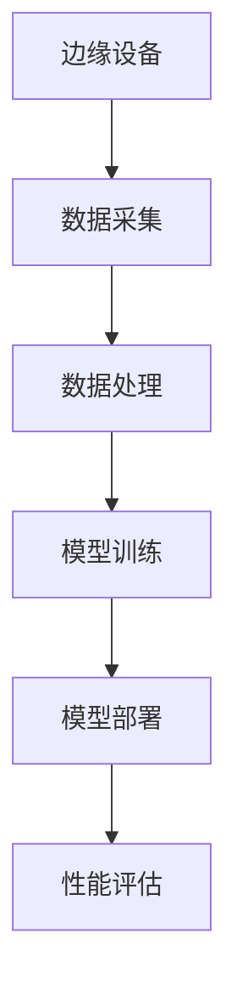

                 

### 《边缘大模型：5G时代的智能应用》

#### 关键词：
边缘计算、5G网络、大模型、深度学习、智能应用

#### 摘要：
本文将深入探讨边缘大模型在5G时代的智能应用，从边缘计算与5G网络的概述，到边缘大模型的技术基础、核心算法与原理，再到应用案例、实践与未来发展趋势，全面解析这一前沿技术领域。通过对边缘大模型的详细介绍，帮助读者理解其核心概念、架构设计、技术挑战与解决方案，以及在实际项目中的应用与优化方法。最后，本文还将探讨边缘大模型的安全与隐私问题，以及其未来发展的趋势和产业应用。

---

### 《边缘大模型：5G时代的智能应用》目录大纲

#### 第一部分：边缘大模型概述

#### 第1章：边缘计算与5G网络概述  
##### 1.1 边缘计算的概念与发展  
##### 1.2 5G网络的关键特性  
##### 1.3 边缘大模型的优势与挑战

#### 第2章：边缘大模型技术基础  
##### 2.1 云计算与边缘计算的比较  
##### 2.2 边缘大模型架构设计  
##### 2.3 边缘大模型的技术挑战与解决方案

#### 第二部分：核心算法与原理

#### 第3章：深度学习基础  
##### 3.1 神经网络概述  
###### 3.1.1 神经元与激活函数  
###### 3.1.2 前向传播与反向传播  
##### 3.2 卷积神经网络（CNN）  
###### 3.2.1 卷积与池化操作  
###### 3.2.2 卷积神经网络的架构  
##### 3.3 循环神经网络（RNN）  
###### 3.3.1 RNN的基本结构  
###### 3.3.2 LSTM与GRU的原理

#### 第4章：边缘大模型核心算法  
##### 4.1 生成对抗网络（GAN）  
###### 4.1.1 GAN的原理与结构  
###### 4.1.2 GAN的应用场景  
##### 4.2 强化学习  
###### 4.2.1 强化学习的基本概念  
###### 4.2.2 Q-Learning与SARSA算法  
##### 4.3 自适应算法  
###### 4.3.1 贝叶斯推断  
###### 4.3.2 贝叶斯优化原理

#### 第5章：边缘大模型的训练与优化  
##### 5.1 数据采集与预处理  
###### 5.1.1 边缘设备数据采集  
###### 5.1.2 数据预处理流程  
##### 5.2 模型训练策略  
###### 5.2.1 模型训练流程  
###### 5.2.2 模型优化方法

#### 第6章：边缘大模型的应用案例  
##### 6.1 智能视频分析  
###### 6.1.1 视频数据的边缘处理  
###### 6.1.2 智能视频分析算法  
##### 6.2 智能物联网（IoT）  
###### 6.2.1 物联网边缘计算模型  
###### 6.2.2 智能物联网应用实例

#### 第三部分：边缘大模型实践

#### 第7章：边缘大模型开发环境搭建  
##### 7.1 开发环境需求  
###### 7.1.1 硬件要求  
###### 7.1.2 软件环境配置  
##### 7.2 开发工具与框架  
###### 7.2.1 编程语言选择  
###### 7.2.2 常用开发工具介绍

#### 第8章：边缘大模型项目实战  
##### 8.1 项目背景与需求分析  
##### 8.2 项目技术架构设计  
##### 8.3 项目代码实现与解读  
###### 8.3.1 数据采集与预处理  
###### 8.3.2 模型训练与优化  
###### 8.3.3 模型部署与测试

#### 第9章：边缘大模型性能优化  
##### 9.1 模型优化方法  
###### 9.1.1 模型压缩  
###### 9.1.2 模型量化  
##### 9.2 实际案例分析  
###### 9.2.1 案例一：智能交通系统  
###### 9.2.2 案例二：智能制造

#### 第10章：边缘大模型安全与隐私  
##### 10.1 边缘大模型安全挑战  
###### 10.1.1 模型窃取风险  
###### 10.1.2 模型隐私泄露  
##### 10.2 安全与隐私保护策略  
###### 10.2.1 安全设计原则  
###### 10.2.2 隐私保护技术

#### 第11章：边缘大模型未来发展趋势  
##### 11.1 边缘大模型的发展方向  
###### 11.1.1 边缘智能计算  
###### 11.1.2 边缘大模型与AI结合  
##### 11.2 产业应用与政策支持  
###### 11.2.1 行业应用趋势  
###### 11.2.2 政策环境与产业支持

#### 附录：参考资料与拓展阅读

##### 附录1：深度学习相关资源  
##### 附录2：边缘计算与5G网络拓展资料  
##### 附录3：边缘大模型开源框架与工具集

#### 附录 Mermaid 流程图

```
graph TD
    A[边缘设备] --> B[数据采集]
    B --> C[数据处理]
    C --> D[模型训练]
    D --> E[模型部署]
    E --> F[性能评估]
```

#### 附录 伪代码示例

```python
# 边缘大模型训练伪代码
function train_model(data, labels):
    # 初始化模型参数
    model = initialize_model()
    for epoch in range(num_epochs):
        for sample, label in data:
            # 前向传播
            predictions = model.forward(sample)
            # 计算损失
            loss = compute_loss(predictions, label)
            # 反向传播
            model.backward(loss)
            # 更新模型参数
            model.update_parameters()
    return model
```

#### 附录 数学公式与讲解

##### 损失函数
$$
\text{Loss} = \frac{1}{2} \sum_{i=1}^{n} (\hat{y}_i - y_i)^2
$$
其中，$\hat{y}_i$为预测值，$y_i$为真实值，$n$为样本数量。

##### 梯度下降法
$$
\theta_{\text{new}} = \theta_{\text{old}} - \alpha \cdot \nabla_\theta J(\theta)
$$
其中，$\theta$为模型参数，$\alpha$为学习率，$J(\theta)$为损失函数，$\nabla_\theta J(\theta)$为损失函数对参数$\theta$的梯度。

##### 神经元激活函数
$$
a_i = \sigma(z_i) = \frac{1}{1 + e^{-z_i}}
$$
其中，$z_i$为神经元输入，$\sigma$为sigmoid函数。

---

通过以上目录大纲，读者可以对本文的主要内容有一个清晰的了解。接下来，我们将逐步深入探讨边缘大模型在5G时代的智能应用，从基础概念、核心技术到实际应用，帮助读者全面掌握这一前沿领域的技术原理和实践方法。让我们开始第一部分的学习之旅。---

### 《边缘大模型：5G时代的智能应用》

#### 关键词：
边缘计算、5G网络、大模型、深度学习、智能应用

#### 摘要：
本文将深入探讨边缘大模型在5G时代的智能应用，从边缘计算与5G网络的概述，到边缘大模型的技术基础、核心算法与原理，再到应用案例、实践与未来发展趋势，全面解析这一前沿技术领域。通过对边缘大模型的详细介绍，帮助读者理解其核心概念、架构设计、技术挑战与解决方案，以及在实际项目中的应用与优化方法。最后，本文还将探讨边缘大模型的安全与隐私问题，以及其未来发展的趋势和产业应用。

---

### 《边缘大模型：5G时代的智能应用》目录大纲

#### 第一部分：边缘大模型概述

#### 第1章：边缘计算与5G网络概述
##### 1.1 边缘计算的概念与发展
##### 1.2 5G网络的关键特性
##### 1.3 边缘大模型的优势与挑战

#### 第2章：边缘大模型技术基础
##### 2.1 云计算与边缘计算的比较
##### 2.2 边缘大模型架构设计
##### 2.3 边缘大模型的技术挑战与解决方案

#### 第二部分：核心算法与原理

#### 第3章：深度学习基础
##### 3.1 神经网络概述
###### 3.1.1 神经元与激活函数
###### 3.1.2 前向传播与反向传播
##### 3.2 卷积神经网络（CNN）
###### 3.2.1 卷积与池化操作
###### 3.2.2 卷积神经网络的架构
##### 3.3 循环神经网络（RNN）
###### 3.3.1 RNN的基本结构
###### 3.3.2 LSTM与GRU的原理

#### 第4章：边缘大模型核心算法
##### 4.1 生成对抗网络（GAN）
###### 4.1.1 GAN的原理与结构
###### 4.1.2 GAN的应用场景
##### 4.2 强化学习
###### 4.2.1 强化学习的基本概念
###### 4.2.2 Q-Learning与SARSA算法
##### 4.3 自适应算法
###### 4.3.1 贝叶斯推断
###### 4.3.2 贝叶斯优化原理

#### 第5章：边缘大模型的训练与优化
##### 5.1 数据采集与预处理
###### 5.1.1 边缘设备数据采集
###### 5.1.2 数据预处理流程
##### 5.2 模型训练策略
###### 5.2.1 模型训练流程
###### 5.2.2 模型优化方法

#### 第6章：边缘大模型的应用案例
##### 6.1 智能视频分析
###### 6.1.1 视频数据的边缘处理
###### 6.1.2 智能视频分析算法
##### 6.2 智能物联网（IoT）
###### 6.2.1 物联网边缘计算模型
###### 6.2.2 智能物联网应用实例

#### 第三部分：边缘大模型实践

#### 第7章：边缘大模型开发环境搭建
##### 7.1 开发环境需求
###### 7.1.1 硬件要求
###### 7.1.2 软件环境配置
##### 7.2 开发工具与框架
###### 7.2.1 编程语言选择
###### 7.2.2 常用开发工具介绍

#### 第8章：边缘大模型项目实战
##### 8.1 项目背景与需求分析
##### 8.2 项目技术架构设计
##### 8.3 项目代码实现与解读
###### 8.3.1 数据采集与预处理
###### 8.3.2 模型训练与优化
###### 8.3.3 模型部署与测试

#### 第9章：边缘大模型性能优化
##### 9.1 模型优化方法
###### 9.1.1 模型压缩
###### 9.1.2 模型量化
##### 9.2 实际案例分析
###### 9.2.1 案例一：智能交通系统
###### 9.2.2 案例二：智能制造

#### 第10章：边缘大模型安全与隐私
##### 10.1 边缘大模型安全挑战
###### 10.1.1 模型窃取风险
###### 10.1.2 模型隐私泄露
##### 10.2 安全与隐私保护策略
###### 10.2.1 安全设计原则
###### 10.2.2 隐私保护技术

#### 第11章：边缘大模型未来发展趋势
##### 11.1 边缘大模型的发展方向
###### 11.1.1 边缘智能计算
###### 11.1.2 边缘大模型与AI结合
##### 11.2 产业应用与政策支持
###### 11.2.1 行业应用趋势
###### 11.2.2 政策环境与产业支持

#### 附录：参考资料与拓展阅读
##### 附录1：深度学习相关资源
##### 附录2：边缘计算与5G网络拓展资料
##### 附录3：边缘大模型开源框架与工具集

#### 附录 Mermaid 流程图



#### 附录 伪代码示例

```python
# 边缘大模型训练伪代码
function train_model(data, labels):
    # 初始化模型参数
    model = initialize_model()
    for epoch in range(num_epochs):
        for sample, label in data:
            # 前向传播
            predictions = model.forward(sample)
            # 计算损失
            loss = compute_loss(predictions, label)
            # 反向传播
            model.backward(loss)
            # 更新模型参数
            model.update_parameters()
    return model
```

#### 附录 数学公式与讲解

##### 损失函数
$$
\text{Loss} = \frac{1}{2} \sum_{i=1}^{n} (\hat{y}_i - y_i)^2
$$
其中，$\hat{y}_i$为预测值，$y_i$为真实值，$n$为样本数量。

##### 梯度下降法
$$
\theta_{\text{new}} = \theta_{\text{old}} - \alpha \cdot \nabla_\theta J(\theta)
$$
其中，$\theta$为模型参数，$\alpha$为学习率，$J(\theta)$为损失函数，$\nabla_\theta J(\theta)$为损失函数对参数$\theta$的梯度。

##### 神经元激活函数
$$
a_i = \sigma(z_i) = \frac{1}{1 + e^{-z_i}}
$$
其中，$z_i$为神经元输入，$\sigma$为sigmoid函数。

---

通过以上目录大纲，读者可以对本文的主要内容有一个清晰的了解。接下来，我们将逐步深入探讨边缘大模型在5G时代的智能应用，从基础概念、核心技术到实际应用，帮助读者全面掌握这一前沿领域的技术原理和实践方法。让我们开始第一部分的学习之旅。

---

### 第一部分：边缘大模型概述

#### 第1章：边缘计算与5G网络概述

在信息化和数字化浪潮的推动下，边缘计算和5G网络正成为智能应用的两大关键技术。边缘计算通过将计算能力、存储资源和数据处理能力从云中心推向网络边缘，从而降低延迟、提高响应速度和增强系统可靠性。而5G网络则凭借其高速率、低延迟和大连接的特点，为边缘计算提供了坚实的网络基础。本章将详细介绍边缘计算和5G网络的概念、关键特性和应用场景，并探讨边缘大模型的优势与挑战。

##### 1.1 边缘计算的概念与发展

边缘计算（Edge Computing）是指将计算、存储、数据处理和分析能力从中心化的云计算环境转移到网络边缘，即在靠近数据源的地方进行数据处理。这种计算模式可以显著减少数据传输的延迟，提高系统的响应速度，同时降低带宽需求和中心化计算资源压力。

边缘计算的发展历程可以追溯到物联网（IoT）和智能设备的兴起。随着物联网设备的广泛应用，数据生成量和传输量急剧增加，传统的中心化计算模式难以满足实时性和高效性的需求。为了解决这个问题，边缘计算应运而生，其发展大致可以分为以下几个阶段：

1. **早期阶段（2010-2015年）**：物联网设备的普及引发了边缘计算的需求，研究机构和企业开始探索将计算能力分布到网络边缘。
2. **成长阶段（2015-2020年）**：随着5G网络的研发和部署，边缘计算迎来了快速发展期。5G网络的高速率和低延迟特性为边缘计算提供了更好的网络环境。
3. **成熟阶段（2020年至今）**：边缘计算技术逐渐成熟，各类应用场景不断涌现，如智能交通、智能医疗、智能制造等。

边缘计算的核心优势包括：

- **降低延迟**：通过将计算任务从云端转移到网络边缘，可以显著降低数据传输的延迟，提高系统的实时响应能力。
- **提高带宽利用率**：边缘计算可以减少数据传输量，降低中心化网络的带宽压力。
- **增强数据安全性**：边缘计算可以减少数据在传输过程中的暴露风险，提高数据的安全性。
- **提高系统的可靠性和稳定性**：边缘计算可以将系统负载分散到多个节点，提高系统的可靠性和稳定性。

##### 1.2 5G网络的关键特性

5G网络（第五代移动通信网络）是边缘计算发展的重要推动力。与4G网络相比，5G网络在多个方面都有显著的提升，其关键特性包括：

- **高速率**：5G网络的理论峰值速率可达20Gbps，是4G网络的100倍以上。这种高速率可以支持大规模物联网设备和高清视频流等应用。
- **低延迟**：5G网络的端到端延迟最低可达1毫秒，比4G网络减少了90%以上。这种低延迟特性对于实时应用，如自动驾驶、远程手术等至关重要。
- **大连接**：5G网络可以支持每平方公里100万设备的连接密度，是4G网络的10倍以上。这种大连接特性可以满足物联网设备的广泛连接需求。
- **网络切片**：5G网络支持网络切片技术，可以根据不同应用场景的需求，灵活分配网络资源，提高网络的灵活性和效率。

5G网络的这些特性为边缘计算提供了强大的支持。例如，5G网络的高速率和低延迟可以满足边缘计算对实时数据处理的需求，而大连接特性则可以支持大量物联网设备的接入。此外，网络切片技术可以优化边缘计算资源的分配，提高系统的性能和效率。

##### 1.3 边缘大模型的优势与挑战

边缘大模型是指在边缘设备上部署的规模庞大、功能强大的机器学习模型。与传统的中心化模型相比，边缘大模型具有以下优势：

- **实时性增强**：边缘大模型可以在边缘设备上直接进行数据处理和决策，减少了数据传输和计算的延迟，提高了系统的实时性。
- **数据隐私保护**：边缘大模型可以在本地设备上进行数据处理，降低了数据泄露的风险，提高了数据隐私保护水平。
- **网络带宽节约**：边缘大模型可以减少数据传输量，降低网络带宽需求，节约网络资源。
- **硬件资源优化**：边缘大模型可以根据边缘设备的硬件资源进行优化，提高设备的利用率和性能。

然而，边缘大模型也面临着一些挑战：

- **计算能力限制**：边缘设备的计算资源相对有限，难以支持大规模模型的训练和推理，需要采用轻量级模型和优化算法。
- **数据稀缺**：边缘设备的数据量通常较小，难以支持大规模数据的训练，需要采用迁移学习、联邦学习等技术进行数据增强。
- **网络不稳定**：边缘设备通常处于移动状态，网络连接可能不稳定，需要设计鲁棒的网络通信协议和模型训练策略。
- **安全与隐私**：边缘大模型涉及到大量的敏感数据，需要设计有效的安全与隐私保护机制，防止数据泄露和攻击。

综上所述，边缘大模型在5G时代的智能应用具有广泛的前景，但也面临着诸多挑战。在接下来的章节中，我们将进一步探讨边缘大模型的技术基础、核心算法与原理，以及实际应用与优化方法，帮助读者全面了解这一前沿技术领域。

---

通过本章的介绍，读者可以对边缘计算与5G网络的概念、关键特性和应用场景有一个初步的了解，同时认识到边缘大模型在5G时代的智能应用的优势与挑战。在接下来的章节中，我们将深入探讨边缘大模型的技术基础和核心算法，帮助读者深入理解这一前沿领域的核心概念和技术原理。

---

### 第一部分：边缘大模型概述

#### 第2章：边缘大模型技术基础

随着边缘计算和5G网络的快速发展，边缘大模型成为了一个热门研究领域。边缘大模型是指在边缘设备上部署的规模庞大、功能强大的机器学习模型，它们可以处理大量的数据，实现复杂的任务，并在边缘设备上进行实时推理。本章将详细讨论边缘大模型的技术基础，包括云计算与边缘计算的比较、边缘大模型架构设计以及技术挑战与解决方案。

##### 2.1 云计算与边缘计算的比较

云计算和边缘计算是两种不同的计算模式，它们各自有优势和局限。云计算通过中心化的数据存储和处理资源，为用户提供强大的计算能力和数据存储服务。而边缘计算则将计算任务从云端转移到网络边缘，即在靠近数据源的设备上进行数据处理。

以下是云计算与边缘计算的主要比较：

- **计算能力**：云计算具有强大的计算能力，可以支持大规模的模型训练和推理任务。而边缘设备的计算能力相对有限，通常只能处理轻量级的模型和简单的推理任务。
- **数据存储**：云计算可以提供大规模的数据存储资源，方便数据的集中管理和备份。而边缘设备的数据存储容量相对较小，难以支持大规模数据的管理。
- **网络带宽**：云计算依赖于高速网络连接，可以实现数据的高速传输。而边缘设备的网络带宽相对较低，容易受到网络延迟和带宽限制的影响。
- **实时性**：云计算的计算和响应时间较长，不适用于对实时性要求较高的应用。而边缘计算可以在本地设备上进行数据处理和决策，具有较低的延迟和较高的实时性。
- **安全性**：云计算的安全性较高，可以提供完善的安全防护措施。而边缘设备的安全性相对较低，容易受到网络攻击和数据泄露的威胁。

尽管云计算与边缘计算存在一些差异，但在实际应用中，它们往往是相辅相成的。云计算可以为边缘计算提供强大的计算能力和数据存储支持，而边缘计算则可以为云计算分担负载，提高系统的实时性和稳定性。

##### 2.2 边缘大模型架构设计

边缘大模型的架构设计需要考虑多种因素，包括计算能力、数据存储、网络带宽和安全性等。一个典型的边缘大模型架构通常包括以下几个关键组成部分：

1. **边缘设备**：边缘设备包括各种智能设备和传感器，如智能手机、智能摄像头、工业机器人等。它们负责数据的采集和初步处理。
2. **边缘服务器**：边缘服务器是边缘计算的核心，负责处理来自边缘设备的原始数据，并执行复杂的机器学习算法。边缘服务器通常部署在靠近边缘设备的网络节点上，以减少数据传输的延迟。
3. **云计算中心**：云计算中心提供强大的计算能力和数据存储资源，可以处理边缘设备无法处理的复杂任务，并为边缘设备提供数据备份和恢复服务。
4. **网络连接**：边缘设备、边缘服务器和云计算中心之间通过高速网络连接，实现数据的传输和通信。网络连接的质量直接影响边缘大模型的整体性能。
5. **安全防护**：边缘大模型涉及到大量的敏感数据，需要设计完善的安全防护措施，包括数据加密、身份验证、访问控制等，以确保数据的安全性和隐私。

以下是一个简化的边缘大模型架构图：

```
边缘设备 → 边缘服务器 → 云计算中心
        |                 |
        | 数据传输       | 数据备份与恢复
        |                 |
        | 安全防护       |
```

##### 2.3 边缘大模型的技术挑战与解决方案

边缘大模型在应用过程中面临着多种技术挑战，主要包括计算能力限制、数据稀缺、网络不稳定以及安全与隐私问题。以下是一些常见的解决方案：

1. **计算能力限制**：边缘设备通常具有有限的计算资源，难以支持大规模模型的训练和推理。解决方案包括：
   - **模型压缩**：通过模型剪枝、量化等方法减小模型的大小和参数数量，提高模型的计算效率。
   - **分布式计算**：将模型训练和推理任务分布在多个边缘设备上，利用集群计算能力提高模型的性能。
   - **边缘专用芯片**：开发适用于边缘设备的专用芯片，如神经网络处理器（NPU）和专用集成电路（ASIC），提高边缘设备的计算能力。

2. **数据稀缺**：边缘设备的数据量通常较小，难以支持大规模数据的训练。解决方案包括：
   - **数据增强**：通过旋转、缩放、裁剪等数据增强技术，扩大训练数据集，提高模型的泛化能力。
   - **联邦学习**：将多个边缘设备上的数据进行汇总，统一训练一个模型，降低对单个设备数据量的依赖。
   - **迁移学习**：利用预训练的大规模模型，通过微调适应特定任务，提高模型的训练效果。

3. **网络不稳定**：边缘设备通常处于移动状态，网络连接可能不稳定，导致数据传输和通信中断。解决方案包括：
   - **冗余网络连接**：使用多个网络连接方式，如Wi-Fi、蓝牙、LoRa等，提高网络的可靠性。
   - **断网模式**：在断网模式下，边缘设备可以离线处理数据，待网络恢复后再同步数据。
   - **延迟容忍**：设计具有延迟容忍能力的算法和协议，降低网络延迟对边缘大模型性能的影响。

4. **安全与隐私**：边缘大模型涉及到大量的敏感数据，需要设计有效的安全与隐私保护机制。解决方案包括：
   - **加密技术**：使用加密算法对数据进行加密，确保数据在传输和存储过程中的安全性。
   - **访问控制**：通过身份验证和访问控制策略，限制对敏感数据的访问权限。
   - **隐私保护算法**：采用差分隐私、同态加密等技术，保护用户隐私。

综上所述，边缘大模型技术基础涵盖了从计算能力、数据存储、网络连接到安全与隐私的各个方面。在接下来的章节中，我们将进一步探讨边缘大模型的核心算法与原理，帮助读者深入理解这一前沿领域的核心技术。

---

通过本章的讨论，读者可以了解到边缘大模型技术基础的重要性，以及云计算与边缘计算的比较、边缘大模型架构设计以及技术挑战与解决方案。在边缘大模型的应用和发展过程中，这些技术基础为边缘计算和智能应用提供了坚实的基础。在接下来的章节中，我们将深入探讨边缘大模型的核心算法与原理，进一步揭示其技术魅力和应用价值。

---

### 第二部分：核心算法与原理

#### 第3章：深度学习基础

深度学习作为人工智能领域的一项核心技术，已经在计算机视觉、自然语言处理、语音识别等多个领域取得了显著的成果。本章将介绍深度学习的基础知识，包括神经网络的概述、神经元与激活函数、前向传播与反向传播等核心概念。

##### 3.1 神经网络概述

神经网络（Neural Networks）是模仿生物神经元结构和功能的人工智能算法。一个神经网络由多个神经元（也称为节点）组成，这些神经元通过权重连接在一起，形成一个层次结构。神经网络的基本工作原理是接收输入信号，通过加权求和和激活函数的处理，产生输出信号。

一个典型的神经网络可以分为以下几个层次：

1. **输入层**：接收外部输入数据，例如图像、文本或声音等。
2. **隐藏层**：一层或多层隐藏神经元，负责数据的特征提取和转换。
3. **输出层**：产生最终的输出结果，如分类标签、概率分布等。

神经网络的关键组成部分包括：

- **神经元**：神经网络的基本单元，负责接收输入、计算输出和更新权重。
- **权重**：连接不同神经元之间的参数，用于调节信号的传递强度。
- **激活函数**：对神经元的输出进行非线性变换，引入决策边界。

##### 3.1.1 神经元与激活函数

神经元是神经网络的基本单元，其工作原理可以类比为生物神经元。一个神经元接收多个输入信号，每个信号乘以相应的权重，然后求和得到总的输入值。以下是一个简单神经元的数学模型：

$$
z = \sum_{i=1}^{n} w_i x_i
$$

其中，$z$为神经元的总输入值，$w_i$为第$i$个输入信号的权重，$x_i$为第$i$个输入信号。

为了引入非线性因素，神经元通常使用激活函数（Activation Function）。激活函数将总输入值映射到一个新的值，从而产生输出信号。常见的激活函数包括：

1. **sigmoid函数**：

$$
a = \sigma(z) = \frac{1}{1 + e^{-z}}
$$

sigmoid函数将输入值映射到$(0, 1)$区间，常用于分类任务。

2. **ReLU函数**：

$$
a = \max(0, z)
$$

ReLU（Rectified Linear Unit）函数将输入值大于零的部分映射为自身，小于等于零的部分映射为0，常用于隐藏层。

3. **Tanh函数**：

$$
a = \tanh(z) = \frac{e^z - e^{-z}}{e^z + e^{-z}}
$$

Tanh函数将输入值映射到$(-1, 1)$区间，具有对称性。

##### 3.1.2 前向传播与反向传播

深度学习中的模型训练过程主要包括前向传播（Forward Propagation）和反向传播（Backpropagation）两个步骤。

1. **前向传播**：

前向传播是指将输入信号通过神经网络传递到输出层的过程。具体步骤如下：

- 输入层接收外部输入数据。
- 每个神经元计算总输入值并应用激活函数，得到输出值。
- 输出层产生最终的输出结果。

前向传播的主要目的是计算神经网络的输出值，以便与实际标签进行比较，从而计算损失函数。

2. **反向传播**：

反向传播是指根据输出误差，通过神经网络反向传递误差的过程。具体步骤如下：

- 计算损失函数（例如均方误差MSE、交叉熵损失等），并计算输出层到输入层的误差梯度。
- 误差梯度通过链式法则（Chain Rule）逐层反向传播，更新每个神经元的权重和偏置。
- 使用梯度下降或其他优化算法更新模型参数。

反向传播的目的是通过梯度信息调整模型参数，最小化损失函数，提高模型的性能。

##### 3.2 卷积神经网络（CNN）

卷积神经网络（Convolutional Neural Network，CNN）是深度学习中的一个重要分支，特别适用于图像识别、物体检测等任务。CNN的核心思想是通过卷积操作提取图像的特征，然后通过全连接层进行分类。

CNN的主要组成部分包括：

1. **卷积层**：卷积层通过卷积操作提取图像的特征。卷积操作将一个滤波器（Kernel）在图像上滑动，计算局部区域内的加权和。滤波器的大小和数量可以调整，以适应不同的特征提取需求。

2. **池化层**：池化层用于降低特征图的大小，减少模型的参数数量，提高模型的泛化能力。常见的池化操作包括最大池化（Max Pooling）和平均池化（Average Pooling）。

3. **全连接层**：全连接层将卷积层提取的特征进行整合，并输出最终的分类结果。

以下是一个简单的CNN结构：

```
输入层 → 卷积层（卷积 + 池化） → 全连接层 → 输出层
```

##### 3.3 循环神经网络（RNN）

循环神经网络（Recurrent Neural Network，RNN）是处理序列数据的有效方法，特别适用于自然语言处理和语音识别等任务。RNN的核心思想是将当前输入与历史状态相关联，从而实现序列数据的建模。

RNN的主要组成部分包括：

1. **隐藏状态**：隐藏状态表示当前时刻的输入和上一时刻的隐藏状态的组合。隐藏状态通过循环连接反馈到当前时刻，使得RNN具有记忆能力。

2. **权重**：RNN的权重包括输入权重、隐藏权重和偏置。这些权重用于调节输入和隐藏状态之间的关系。

3. **激活函数**：激活函数用于引入非线性因素，提高模型的非线性表达能力。

以下是一个简单的RNN结构：

```
输入 → 隐藏状态 → 输出
```

##### 3.3.1 RNN的基本结构

一个简单的RNN结构包括一个输入层、一个隐藏层和一个输出层。输入层接收外部输入数据，隐藏层通过循环连接和权重更新实现状态的记忆，输出层产生最终的输出结果。

以下是一个RNN的数学模型：

$$
h_t = \sigma(W_h h_{t-1} + W_x x_t + b_h)
$$

$$
y_t = W_y h_t + b_y
$$

其中，$h_t$为第$t$时刻的隐藏状态，$x_t$为第$t$时刻的输入，$y_t$为第$t$时刻的输出。$W_h$为隐藏权重，$W_x$为输入权重，$b_h$为隐藏偏置，$W_y$为输出权重，$b_y$为输出偏置。$\sigma$为激活函数，通常采用ReLU或Tanh函数。

##### 3.3.2 LSTM与GRU的原理

长短期记忆网络（Long Short-Term Memory，LSTM）和门控循环单元（Gated Recurrent Unit，GRU）是RNN的改进版本，用于解决RNN在处理长序列数据时的梯度消失和梯度爆炸问题。

1. **LSTM**：

LSTM的核心思想是通过引入记忆单元和三个门控（输入门、遗忘门和输出门）来控制信息的流动。记忆单元用于存储长期依赖信息，门控用于调节信息的输入、遗忘和输出。

LSTM的数学模型如下：

$$
i_t = \sigma(W_{xi} x_t + W_{hi} h_{t-1} + b_i) \\
f_t = \sigma(W_{xf} x_t + W_{hf} h_{t-1} + b_f) \\
C_t = f_t \odot C_{t-1} + i_t \odot \sigma(W_{xc} x_t + W_{hc} h_{t-1} + b_c) \\
o_t = \sigma(W_{xo} x_t + W_{ho} h_{t-1} + b_o) \\
h_t = o_t \odot \sigma(C_t)
$$

其中，$i_t$、$f_t$、$o_t$分别为输入门、遗忘门和输出门的激活值，$C_t$为记忆单元的激活值，$h_t$为隐藏状态的激活值。$\odot$为元素乘法运算。

2. **GRU**：

GRU相对于LSTM进行了简化，通过引入更新门和重置门来控制信息的流动。GRU只有一个记忆单元，同时实现了LSTM的两个门控功能。

GRU的数学模型如下：

$$
z_t = \sigma(W_{zi} x_t + W_{hi} h_{t-1} + b_i) \\
r_t = \sigma(W_{zr} x_t + W_{hr} h_{t-1} + b_r) \\
\tilde{h}_t = \sigma(W_{xc} x_t + W_{hc} (r_t \odot h_{t-1}) + b_c) \\
h_t = z_t \odot h_{t-1} + (1 - z_t) \odot \tilde{h}_t
$$

其中，$z_t$为更新门的激活值，$r_t$为重置门的激活值，$\tilde{h}_t$为候选隐藏状态的激活值，$h_t$为隐藏状态的激活值。

综上所述，深度学习的基础知识包括神经网络的概述、神经元与激活函数、前向传播与反向传播、卷积神经网络（CNN）以及循环神经网络（RNN）。这些核心概念和技术原理为深度学习模型的设计和应用提供了基础。在接下来的章节中，我们将进一步探讨边缘大模型的核心算法与原理，包括生成对抗网络（GAN）、强化学习、自适应算法等，帮助读者全面了解边缘大模型的技术内涵。

---

通过本章对深度学习基础知识的介绍，读者可以了解神经网络、神经元与激活函数、前向传播与反向传播等核心概念，以及卷积神经网络（CNN）和循环神经网络（RNN）的基本原理。这些基础知识为理解和应用边缘大模型奠定了坚实的基础。在接下来的章节中，我们将深入探讨边缘大模型的核心算法与原理，包括生成对抗网络（GAN）、强化学习、自适应算法等，帮助读者全面了解边缘大模型的技术内涵。这将有助于读者更深入地理解边缘大模型在5G时代智能应用中的实际应用和潜在价值。

---

### 第二部分：核心算法与原理

#### 第4章：边缘大模型核心算法

边缘大模型作为深度学习在边缘计算领域的重要应用，其核心算法的先进性直接决定了模型的性能和实用性。本章将介绍几种关键的边缘大模型核心算法，包括生成对抗网络（GAN）、强化学习以及自适应算法。这些算法不仅为边缘大模型提供了强大的功能，还在实际应用中展现出巨大的潜力。

##### 4.1 生成对抗网络（GAN）

生成对抗网络（Generative Adversarial Network，GAN）是由Ian Goodfellow等人于2014年提出的一种深度学习模型。GAN的核心思想是通过两个神经网络的对抗训练生成高质量的数据，其中一个网络称为生成器（Generator），另一个网络称为判别器（Discriminator）。

GAN的训练过程可以看作是一个零和游戏，其中生成器和判别器相互对抗，目的是使判别器无法区分生成的数据和真实数据。具体来说，GAN的训练分为以下几个步骤：

1. **初始化生成器和判别器**：生成器初始化为简单的模型，判别器初始化为性能较好的模型。
2. **生成器生成假数据**：生成器接收随机噪声作为输入，生成假数据。
3. **判别器判断真伪**：判别器接收真实数据和生成器生成的假数据，并输出判断结果。
4. **更新生成器和判别器**：生成器和判别器根据损失函数进行参数更新，生成器希望生成更真实的数据，判别器希望更好地区分真实和假数据。

GAN的主要优点包括：

- **数据生成能力**：GAN可以生成高质量的数据，特别适用于数据稀缺的场景。
- **灵活性强**：GAN可以应用于各种数据类型，如图像、文本、音频等。
- **无需标签**：GAN不需要真实的标签数据，只需真实的样本数据。

然而，GAN也存在一些挑战，如训练不稳定、生成器与判别器的动态平衡等。尽管如此，GAN在边缘大模型中仍具有广泛的应用前景，例如图像生成、数据增强、异常检测等。

##### 4.1.1 GAN的原理与结构

GAN的基本结构包括两个主要的神经网络：生成器和判别器。以下是GAN的简要结构：

1. **生成器（Generator）**：
   - 输入：随机噪声向量 $z$。
   - 输出：生成的假数据 $G(z)$。

生成器的目标是生成逼真的假数据，使其难以被判别器区分。

2. **判别器（Discriminator）**：
   - 输入：真实数据 $x$ 和生成器生成的假数据 $G(z)$。
   - 输出：概率值 $D(x)$ 和 $D(G(z))$。

判别器的目标是判断输入数据的真实性，输出概率值表示输入数据的真实性。

GAN的损失函数通常采用最小化生成器损失和最大化判别器损失的方式。具体来说，生成器的损失函数可以表示为：

$$
L_G = -\log(D(G(z)))
$$

判别器的损失函数可以表示为：

$$
L_D = -\log(D(x)) - \log(1 - D(G(z)))
$$

通过交替训练生成器和判别器，最终使生成器生成的假数据能够以较高的概率被判别器识别为真实数据。

##### 4.1.2 GAN的应用场景

GAN的应用场景非常广泛，以下是一些典型的应用：

1. **图像生成**：GAN可以生成高质量的图像，如图像超分辨率、人脸生成、图像修复等。
2. **数据增强**：GAN可以用于生成大量的模拟数据，从而增强训练数据集，提高模型的泛化能力。
3. **异常检测**：GAN可以用于检测异常数据，通过比较真实数据和生成数据的差异，识别异常行为或异常模式。
4. **风格迁移**：GAN可以用于图像风格迁移，将一种风格应用到另一张图像上，实现艺术创作和图像编辑。

在边缘大模型中，GAN的应用主要集中在图像生成和数据增强方面。由于边缘设备的计算资源有限，使用GAN生成模拟数据可以增强模型训练的数据集，提高模型的性能和鲁棒性。

##### 4.2 强化学习

强化学习（Reinforcement Learning，RL）是一种通过试错和反馈调整行为策略的机器学习方法。强化学习的目标是训练一个智能体（Agent），使其在特定环境中通过不断学习，最大化累积奖励。

强化学习的基本组成部分包括：

1. **环境（Environment）**：环境是智能体进行交互的场所，可以是物理环境或虚拟环境。
2. **智能体（Agent）**：智能体是执行动作、感知环境和获取奖励的主体。
3. **状态（State）**：状态是环境在某一时刻的状态描述。
4. **动作（Action）**：动作是智能体在特定状态下可以采取的行动。
5. **奖励（Reward）**：奖励是环境对智能体行为的即时反馈，用于指导智能体的学习。

强化学习的关键概念包括：

1. **策略（Policy）**：策略是智能体在特定状态下选择动作的方法，通常表示为概率分布。
2. **价值函数（Value Function）**：价值函数用于评估状态或状态值，指导智能体的行动。
3. **模型（Model）**：模型是对环境、状态和动作的先验知识表示，可以用于预测状态转移和奖励。

强化学习的主要算法包括：

1. **Q-Learning**：Q-Learning是基于价值函数的强化学习算法，通过迭代更新Q值，找到最优策略。
2. **SARSA**：SARSA（On-Policy）是基于策略的强化学习算法，通过在当前策略下进行探索和更新策略。
3. **PPO（Proximal Policy Optimization）**：PPO是一种基于策略的强化学习算法，通过优化策略的概率分布，提高学习效率和稳定性。

##### 4.2.1 强化学习的基本概念

强化学习的基本概念包括：

1. **状态-动作价值函数（Q值）**：
   Q值用于评估在特定状态下采取特定动作的预期奖励。Q值的计算公式为：

   $$
   Q(s, a) = r(s, a) + \gamma \max_a' Q(s', a')
   $$

   其中，$r(s, a)$为即时奖励，$\gamma$为折扣因子，$s'$为状态转移，$a'$为最优动作。

2. **策略（Policy）**：
   策略是智能体在特定状态下采取最优动作的方法，通常表示为概率分布。策略的计算公式为：

   $$
   \pi(a|s) = \frac{e^{Q(s, a)}}{\sum_a e^{Q(s, a)}}
   $$

   其中，$\pi(a|s)$为在状态$s$下采取动作$a$的概率。

3. **探索与利用（Exploration and Exploitation）**：
   探索是指智能体在策略更新过程中尝试新的动作，以获取更多信息。利用是指智能体在策略更新过程中利用已有的信息，采取最优动作。

##### 4.2.2 Q-Learning与SARSA算法

Q-Learning和SARSA是两种常见的强化学习算法。

1. **Q-Learning**：
   Q-Learning是一种基于价值函数的强化学习算法，通过迭代更新Q值，找到最优策略。

   Q-Learning的更新公式为：

   $$
   Q(s, a) = Q(s, a) + \alpha [r(s, a) + \gamma \max_a' Q(s', a') - Q(s, a)]
   $$

   其中，$\alpha$为学习率，$r(s, a)$为即时奖励，$\gamma$为折扣因子。

   Q-Learning的核心思想是利用即时奖励和未来期望奖励来更新Q值，逐步逼近最优策略。

2. **SARSA**：
   SARSA是一种基于策略的强化学习算法，通过在当前策略下进行探索和更新策略。

   SARSA的更新公式为：

   $$
   \pi(a|s) = \frac{e^{Q(s, a)}}{\sum_a e^{Q(s, a)}}
   $$

   其中，$\pi(a|s)$为在状态$s$下采取动作$a$的概率。

   SARSA的核心思想是通过更新策略的概率分布，逐步优化智能体的行为。

##### 4.3 自适应算法

自适应算法是一种通过不断调整模型参数，以适应变化环境的机器学习方法。自适应算法的核心思想是动态调整模型参数，使其在不同环境和场景下具有更好的适应能力。

自适应算法的主要类型包括：

1. **基于梯度的自适应算法**：基于梯度的自适应算法通过计算损失函数的梯度，调整模型参数，以提高模型性能。

   基于梯度的自适应算法包括：
   - **梯度下降法**：通过更新模型参数，最小化损失函数。
   - **随机梯度下降法**：通过随机选取样本，更新模型参数。

2. **基于进化的自适应算法**：基于进化的自适应算法通过模拟生物进化的过程，优化模型参数。

   基于进化的自适应算法包括：
   - **遗传算法**：通过遗传操作（交叉、变异等），优化模型参数。
   - **粒子群优化算法**：通过模拟鸟群的行为，优化模型参数。

3. **基于神经网络的自适应算法**：基于神经网络的自适应算法通过训练神经网络，调整模型参数，以适应变化的环境。

   基于神经网络的自适应算法包括：
   - **自监督学习**：通过训练自监督模型，提取特征并进行分类。
   - **迁移学习**：通过预训练模型，适应新的任务和场景。

##### 4.3.1 贝叶斯推断

贝叶斯推断是一种基于概率统计的方法，通过概率分布描述不确定性。贝叶斯推断的核心思想是利用先验知识和观测数据，更新概率分布，以得到后验概率分布。

贝叶斯推断的基本步骤包括：

1. **构建概率模型**：根据问题和数据，构建概率模型。
2. **计算先验概率**：根据先验知识，计算模型参数的先验概率。
3. **计算似然函数**：根据观测数据，计算模型参数的似然函数。
4. **计算后验概率**：利用贝叶斯公式，计算模型参数的后验概率。
5. **更新模型参数**：根据后验概率，更新模型参数。

贝叶斯推断在实际应用中具有广泛的应用，如参数估计、分类、异常检测等。

##### 4.3.2 贝叶斯优化原理

贝叶斯优化是一种基于贝叶斯推断的优化算法，通过迭代调整模型参数，以最大化目标函数。贝叶斯优化的核心思想是利用先验知识和观测数据，构建后验概率模型，并利用最大化后验概率的方法，更新模型参数。

贝叶斯优化的主要步骤包括：

1. **构建先验模型**：根据问题和数据，构建先验模型。
2. **采样参数**：从先验模型中采样参数值。
3. **计算目标函数值**：根据采样参数，计算目标函数值。
4. **更新后验模型**：利用观测数据和目标函数值，更新后验模型。
5. **迭代优化**：重复步骤2-4，逐步优化模型参数。

贝叶斯优化在实际应用中具有广泛的应用，如优化算法设计、参数调整、超参数优化等。

通过本章对生成对抗网络（GAN）、强化学习以及自适应算法的介绍，读者可以了解到这些核心算法的基本原理和应用场景。这些算法在边缘大模型中发挥着重要作用，为边缘计算提供了强大的技术支持。在接下来的章节中，我们将进一步探讨边缘大模型的训练与优化方法，以帮助读者深入了解边缘大模型在实际应用中的性能优化和部署策略。

---

通过本章的介绍，读者可以了解到生成对抗网络（GAN）、强化学习和自适应算法等边缘大模型的核心算法。这些算法不仅在理论层面具有重要意义，在实际应用中也展示了强大的潜力。在边缘计算领域，这些算法为边缘大模型提供了强大的功能，使其能够应对复杂的应用场景和挑战。在接下来的章节中，我们将继续探讨边缘大模型的训练与优化方法，以及其在实际应用中的案例与实践，帮助读者深入理解边缘大模型的技术原理和应用价值。

---

### 第二部分：核心算法与原理

#### 第5章：边缘大模型的训练与优化

边缘大模型的训练与优化是确保模型在实际应用中达到预期性能的关键环节。本章将详细探讨边缘大模型训练与优化的各个环节，包括数据采集与预处理、模型训练策略以及模型优化方法。

##### 5.1 数据采集与预处理

数据采集是边缘大模型训练的基础。边缘设备通过传感器、摄像头等设备收集数据，这些数据通常包含噪声、缺失值和冗余信息。因此，数据预处理成为边缘大模型训练的重要步骤。

1. **数据清洗**：数据清洗主要包括去除重复数据、填补缺失值和纠正错误数据。通过数据清洗，可以提高数据的质量，减少噪声对模型训练的影响。

2. **数据规范化**：数据规范化是指将不同特征的数据进行标准化处理，使其在相同的量级上。常用的规范化方法包括最小-最大规范化、Z-score规范化等。

3. **数据增强**：数据增强是指通过生成合成数据，增加训练数据集的多样性。常用的数据增强方法包括旋转、缩放、裁剪、翻转等。数据增强可以提高模型的泛化能力，减少过拟合现象。

4. **特征提取**：特征提取是指从原始数据中提取出对模型训练有用的特征。边缘设备上的计算资源有限，因此需要选择对模型性能有显著影响的特征进行提取。

5. **数据分片**：由于边缘设备的数据存储和计算能力有限，可以将大规模数据集划分为多个较小的分片，分片后进行分布式训练。

##### 5.1.1 边缘设备数据采集

边缘设备数据采集是边缘大模型训练的第一步。边缘设备通过传感器、摄像头等设备实时收集数据，如环境监测数据、视频数据、物联网设备数据等。数据采集的过程需要考虑以下几个方面：

1. **数据类型**：根据应用场景，确定需要采集的数据类型。例如，对于智能视频分析，需要采集视频流数据；对于智能交通系统，需要采集车辆流量、速度、位置等数据。

2. **数据频率**：根据应用需求，确定数据采集的频率。高频率的数据可以提供更详细的信息，但也会增加数据传输和存储的负担。需要根据实际需求进行权衡。

3. **数据传输**：边缘设备的数据通常需要传输到边缘服务器或云计算中心进行进一步处理。需要设计高效的数据传输协议，确保数据传输的稳定性和安全性。

4. **数据压缩**：由于边缘设备的计算和存储资源有限，需要对数据进行压缩处理，减少数据传输和存储的负担。常用的数据压缩方法包括Huffman编码、LZ77编码等。

##### 5.1.2 数据预处理流程

数据预处理流程主要包括以下步骤：

1. **数据清洗**：检查数据集中是否存在重复数据、错误数据和缺失值，并进行相应的处理。

2. **数据规范化**：对数据进行规范化处理，使其在相同的量级上。常用的方法包括最小-最大规范化、Z-score规范化等。

3. **特征提取**：从原始数据中提取出对模型训练有用的特征，如纹理特征、颜色特征、形状特征等。

4. **数据增强**：通过生成合成数据，增加训练数据集的多样性，提高模型的泛化能力。

5. **数据分片**：将大规模数据集划分为多个较小的分片，以便于在边缘设备上进行分布式训练。

6. **数据存储**：将预处理后的数据存储在边缘设备或边缘服务器上，以便于模型训练和推理。

##### 5.2 模型训练策略

模型训练策略是指为了提高模型性能而采用的一系列方法和技巧。以下是一些常见的模型训练策略：

1. **批量大小**：批量大小是指每次训练使用的样本数量。较大的批量大小可以提高模型的准确性，但会增加训练时间。较小的批量大小可以加快训练速度，但可能降低模型的准确性。

2. **学习率**：学习率是模型参数更新的速率。较大的学习率可能导致模型参数快速收敛，但容易发生过拟合。较小

