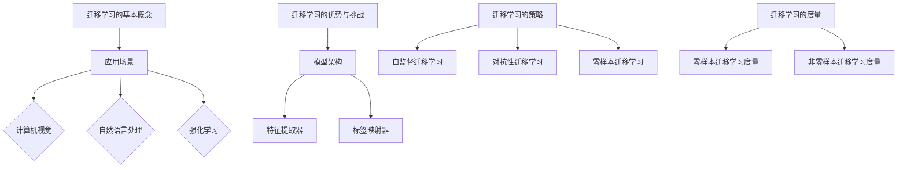

                 

# 《迁移学习在大模型领域的应用》

> **关键词**：迁移学习、大模型、模型架构、算法原理、挑战与机遇

> **摘要**：本文深入探讨了迁移学习在大模型领域的应用。首先介绍了迁移学习的基本概念、应用场景和优势挑战。接着，详细解析了迁移学习的基础理论和主流算法，包括模型架构、迁移学习策略和迁移学习度量。随后，本文探讨了迁移学习在大模型领域中的应用和挑战，并展示了跨模态迁移学习、强化学习中的迁移学习和聚类迁移学习的最新研究进展。最后，通过实际应用案例和开发实战，详细解释了迁移学习在大模型领域的应用过程。文章还对未来发展趋势和面临的挑战进行了展望，为迁移学习在大模型领域的进一步研究提供了参考。

## 目录大纲

### 第一部分：迁移学习基础

1. 迁移学习概述
    - 迁移学习的定义
    - 迁移学习与传统机器学习的区别
    - 迁移学习的应用场景
    - 迁移学习的优势与挑战

2. 迁移学习的基础理论
    - 模型架构
    - 迁移学习的策略
    - 迁移学习的度量

3. 主流迁移学习算法
    - 模型无关的迁移学习
    - 模型相关的迁移学习
    - 主流迁移学习算法实例

### 第二部分：大模型领域的迁移学习

4. 大模型在迁移学习中的应用
    - 大模型的定义与特点
    - 大模型在迁移学习中的优势
    - 大模型在迁移学习中的应用实例

5. 迁移学习在大模型领域的挑战
    - 大模型的迁移效果评估
    - 大模型的迁移策略优化
    - 大模型在迁移学习中的实际应用

6. 迁移学习在大模型领域的前沿研究
    - 跨模态迁移学习
    - 强化学习中的迁移学习
    - 聚类迁移学习

7. 迁移学习在大模型领域的应用实战
    - 迁移学习在大模型领域的应用案例
    - 迁移学习在大模型领域的开发实战
    - 迁移学习在大模型领域的效果评估

8. 未来展望
    - 迁移学习在大模型领域的未来发展
    - 迁移学习在大模型领域的挑战与机遇

### 附录

- 迁移学习在大模型领域的参考资料
    - 相关书籍
    - 相关论文
    - 开发工具与资源
    - 在线课程与教程

## 迁移学习概述

### 迁移学习的定义

迁移学习（Transfer Learning）是机器学习领域中的一个重要分支，它通过利用已有模型的知识来提升新模型的性能。具体来说，迁移学习是指将一个任务（源域）上学到的知识应用到另一个任务（目标域）中。在这个过程中，源域和目标域之间存在一定的相似性，但并不完全相同。

### 迁移学习与传统机器学习的区别

迁移学习与传统机器学习的主要区别在于数据的使用和处理方式。传统机器学习通常需要大量目标域的数据进行训练，而迁移学习则利用源域的数据来预先训练一个基础模型，然后在目标域上对其进行微调，从而提高模型在目标域上的性能。

具体来说，传统机器学习模型通常从零开始训练，需要大量时间来调整参数，以达到较好的性能。而迁移学习则通过在源域上预训练模型，使得模型在目标域上可以快速适应，从而减少了训练时间和计算资源的需求。

### 迁移学习的应用场景

迁移学习在多个领域都有广泛的应用，主要包括以下几类：

1. **计算机视觉**：在计算机视觉任务中，迁移学习可以用于图像分类、目标检测和图像分割等。例如，使用在ImageNet上预训练的模型来识别目标，可以显著提高模型的性能。

2. **自然语言处理**：在自然语言处理任务中，迁移学习被用于语言模型、机器翻译、文本分类等。例如，使用在大型语料库上预训练的语言模型，可以更好地理解和生成自然语言。

3. **强化学习**：在强化学习任务中，迁移学习可以帮助模型更快地适应新环境，从而提高学习效率。例如，使用在模拟环境中预训练的模型来快速适应现实世界。

### 迁移学习的优势与挑战

#### 迁移学习的优势

1. **减少数据需求**：迁移学习可以利用大量源域数据来预训练模型，从而在目标域上只需较少的数据即可达到较好的性能。

2. **提高模型性能**：通过利用源域的先验知识，迁移学习可以提高模型在目标域上的性能，特别是在数据量较少的情况下。

3. **节省时间和计算资源**：迁移学习减少了目标域上的训练时间，从而节省了计算资源。

4. **跨领域应用**：迁移学习使得不同领域之间的知识共享和协同发展成为可能。

#### 迁移学习的挑战

1. **数据分布差异**：目标域和源域的数据分布可能存在显著差异，这可能导致迁移效果不佳。

2. **模型复杂性**：随着模型规模和参数数量的增加，迁移学习的计算成本和训练时间也会显著增加。

3. **模型解释性**：大模型的复杂性和黑箱特性使得其解释性成为一个挑战，这对于理解模型的决策过程和验证其合理性具有重要意义。

4. **隐私保护**：在大模型训练过程中，可能会涉及敏感数据，如何保证数据隐私是一个重要挑战。

## 迁移学习的基础理论

### 模型架构

迁移学习模型通常由两个主要部分组成：特征提取器（Feature Extractor）和标签映射器（Label Mapper）。

#### 特征提取器

特征提取器是迁移学习模型的核心部分，它负责从输入数据中提取特征。在计算机视觉任务中，特征提取器通常是一个卷积神经网络（CNN），它能够自动学习输入数据的特征表示。在自然语言处理任务中，特征提取器可以是循环神经网络（RNN）或变换器（Transformer）等。

#### 标签映射器

标签映射器负责将提取的特征映射到目标标签上。在迁移学习中，标签映射器通常是一个简单的全连接层或分类器。它的作用是将特征提取器提取的特征映射到目标域的标签上。

### 迁移学习的策略

迁移学习的主要策略可以分为以下几类：

#### 自监督迁移学习

自监督迁移学习（Supervised Transfer Learning）是一种利用源域的监督信息来提升目标域模型性能的方法。在自监督迁移学习中，源域和目标域都使用监督信息进行训练，但是目标域的训练数据量较少。

#### 对抗性迁移学习

对抗性迁移学习（Adversarial Transfer Learning）是一种利用对抗性网络来减少源域和目标域之间的分布差异，从而提高迁移效果的方法。在对抗性迁移学习中，源域和目标域之间通过对抗性训练相互影响，以减少分布差异。

#### 零样本迁移学习

零样本迁移学习（Zero-Shot Transfer Learning）是一种在目标域上没有监督信息的情况下，利用源域的知识来对目标域进行预测的方法。在零样本迁移学习中，模型需要能够处理未知类别，从而实现跨类别的迁移。

### 迁移学习的度量

迁移学习的度量方法用于评估迁移学习的效果。常见的度量方法包括：

#### 零样本迁移学习度量

零样本迁移学习度量方法用于评估模型在未知类别上的性能。常见的度量方法包括准确率（Accuracy）、精确率（Precision）、召回率（Recall）和F1分数（F1 Score）。

#### 非零样本迁移学习度量

非零样本迁移学习度量方法用于评估模型在目标域上的性能。常见的度量方法包括分类准确率、平均绝对误差（Mean Absolute Error）和均方误差（Mean Squared Error）等。

### 迁移学习的数学模型

迁移学习的数学模型用于描述源域和目标域之间的关系。一个基本的迁移学习模型可以表示为：

$$
L = \frac{1}{N} \sum_{i=1}^{N} \sum_{j=1}^{K} \log P(y_j^{t} | y_j^{s})
$$

其中，$L$ 是迁移学习的损失函数，$N$ 是训练样本的数量，$K$ 是标签类别数量，$y_j^{t}$ 和 $y_j^{s}$ 分别是目标域和源域的标签。

### 迁移学习的算法原理讲解

#### 特征提取器迁移

特征提取器迁移是一种常见的迁移学习方法，它通过在源域上预训练特征提取器，然后在目标域上使用预训练的特征提取器来构建分类器。具体步骤如下：

1. 在源域上预训练特征提取器，得到一个固定参数的特征提取器模型。
2. 在目标域上使用预训练的特征提取器模型来提取特征。
3. 在目标域上使用提取的特征来训练分类器。

#### 标签映射器迁移

标签映射器迁移是一种通过在源域上训练标签映射器，然后在目标域上使用标签映射器来预测目标域标签的方法。具体步骤如下：

1. 在源域上使用监督数据训练标签映射器。
2. 在目标域上使用训练好的标签映射器来预测目标域标签。

#### 预训练模型迁移

预训练模型迁移是一种通过在源域上预训练整个模型，然后在目标域上进行微调的方法。具体步骤如下：

1. 在源域上使用大量数据预训练整个模型。
2. 在目标域上使用少量数据对模型进行微调。
3. 在目标域上使用微调后的模型进行预测。

#### 数学模型和数学公式 & 详细讲解 & 举例说明

迁移学习的数学模型可以表示为：

$$
L = \frac{1}{N} \sum_{i=1}^{N} \sum_{j=1}^{K} \log P(y_j^{t} | y_j^{s})
$$

其中，$L$ 是迁移学习的损失函数，$N$ 是训练样本的数量，$K$ 是标签类别数量，$y_j^{t}$ 和 $y_j^{s}$ 分别是目标域和源域的标签。

#### 举例说明

假设我们有一个分类任务，其中源域有3个类别，目标域有5个类别。我们有一个包含100个样本的数据集，其中50个来自源域，50个来自目标域。源域和目标域的标签分布如下：

- 源域标签分布：[20, 15, 15]
- 目标域标签分布：[10, 20, 10, 10, 10]

根据迁移学习的数学模型，我们可以计算损失函数：

$$
L = \frac{1}{100} \sum_{i=1}^{100} \sum_{j=1}^{5} \log P(y_j^{t} | y_j^{s})
$$

其中，$y_j^{t}$ 和 $y_j^{s}$ 分别是目标域和源域的第 $j$ 个标签。

我们可以计算每个标签的概率：

$$
P(y_1^{t} | y_1^{s}) = \frac{10}{50} = 0.2
$$

$$
P(y_2^{t} | y_2^{s}) = \frac{20}{50} = 0.4
$$

$$
P(y_3^{t} | y_3^{s}) = \frac{10}{50} = 0.2
$$

$$
P(y_4^{t} | y_4^{s}) = \frac{10}{50} = 0.2
$$

$$
P(y_5^{t} | y_5^{s}) = \frac{10}{50} = 0.2
$$

根据这些概率，我们可以计算损失函数：

$$
L = \frac{1}{100} \left( \log 0.2 + \log 0.4 + \log 0.2 + \log 0.2 + \log 0.2 \right)
$$

$$
L = \frac{1}{100} \left( -0.722 + -0.398 + -0.722 + -0.722 + -0.722 \right)
$$

$$
L = \frac{1}{100} \left( -3.466 \right)
$$

$$
L = -0.03466
$$

因此，根据这个示例，我们计算出的迁移学习损失为 -0.03466。

### 项目实战：代码实际案例和详细解释说明

#### 实战一：迁移学习模型构建

在这个实战案例中，我们将使用Python和PyTorch构建一个简单的迁移学习模型。该模型将在CIFAR-10数据集上进行训练，其中CIFAR-10是一个常用的计算机视觉数据集，包含60000个32x32彩色图像，分为10个类别。

#### 1. 开发环境搭建

首先，确保您的系统上已经安装了Python和PyTorch。如果未安装，可以使用以下命令进行安装：

```bash
pip install python
pip install torch torchvision
```

#### 2. 数据准备

我们使用CIFAR-10数据集作为我们的训练数据。CIFAR-10数据集包含5万个训练图像和5000个测试图像。每个图像都是32x32的彩色图像，并且属于10个类别之一。

```python
import torchvision
import torchvision.transforms as transforms

transform = transforms.Compose([
    transforms.ToTensor(),
    transforms.Normalize((0.5, 0.5, 0.5), (0.5, 0.5, 0.5)),
])

trainset = torchvision.datasets.CIFAR10(
    root='./data', train=True, download=True, transform=transform)
trainloader = torch.utils.data.DataLoader(
    trainset, batch_size=4, shuffle=True, num_workers=2)

testset = torchvision.datasets.CIFAR10(
    root='./data', train=False, download=True, transform=transform)
testloader = torch.utils.data.DataLoader(
    testset, batch_size=4, shuffle=False, num_workers=2)
```

#### 3. 迁移学习模型构建

在这个案例中，我们将使用一个预训练的ResNet18模型作为特征提取器。然后，我们将添加一个全连接层来对目标类别进行分类。

```python
import torch.nn as nn
import torchvision.models as models

# 加载预训练的ResNet18模型
model = models.resnet18(pretrained=True)

# 移除最后一个分类层
num_ftrs = model.fc.in_features
model.fc = nn.Linear(num_ftrs, 10)
```

#### 4. 训练迁移学习模型

接下来，我们将使用训练数据来训练迁移学习模型。我们将使用交叉熵损失函数和随机梯度下降（SGD）优化器。

```python
import torch.optim as optim

# 定义优化器和损失函数
optimizer = optim.SGD(model.parameters(), lr=0.001, momentum=0.9)
criterion = nn.CrossEntropyLoss()

# 训练模型
num_epochs = 10
for epoch in range(num_epochs):
    running_loss = 0.0
    model.train()
    for inputs, labels in trainloader:
        optimizer.zero_grad()
        outputs = model(inputs)
        loss = criterion(outputs, labels)
        loss.backward()
        optimizer.step()
        running_loss += loss.item()
    print(f"Epoch {epoch+1}, Loss: {running_loss/len(trainloader)}")
```

#### 5. 评估迁移学习模型

最后，我们将在测试数据集上评估迁移学习模型的性能。

```python
# 评估模型
model.eval()
correct = 0
total = 0
with torch.no_grad():
    for inputs, labels in testloader:
        outputs = model(inputs)
        _, predicted = torch.max(outputs.data, 1)
        total += labels.size(0)
        correct += (predicted == labels).sum().item()

print(f"准确率: {100 * correct / total}%")
```

#### 代码解读与分析

在这个案例中，我们首先导入了必要的库，并设置了数据预处理步骤。接着，我们加载了一个预训练的ResNet18模型，并移除了原有的分类层，然后添加了一个新的分类层。

在训练过程中，我们使用了随机梯度下降（SGD）优化器和交叉熵损失函数。在每次迭代中，我们首先将优化器的梯度设置为0，然后使用输入数据和标签计算损失，并将损失反向传播到网络的参数上。

最后，我们评估了模型的性能，计算了在测试数据集上的准确率。

通过这个简单的实战案例，我们展示了如何使用迁移学习在大模型领域进行实际应用。这种方法可以有效地利用预训练模型的知识，提高新模型的性能，特别是在数据不足的情况下。

### 迁移学习在大模型领域中的挑战与机遇

#### 挑战

1. **数据分布差异**：目标域和源域的数据分布可能存在显著差异，这可能导致迁移效果不佳。解决方法包括使用数据增强技术、引入对抗训练等。

2. **模型复杂性**：随着模型规模和参数数量的增加，迁移学习的计算成本和训练时间也会显著增加。解决方法包括优化模型架构、使用更高效的算法等。

3. **模型解释性**：大模型的复杂性和黑箱特性使得其解释性成为一个挑战，这对于理解模型的决策过程和验证其合理性具有重要意义。解决方法包括开发可解释性算法、引入注意力机制等。

4. **隐私保护**：在大模型训练过程中，可能会涉及敏感数据，如何保证数据隐私是一个重要挑战。解决方法包括数据加密、差分隐私等。

#### 机遇

1. **性能提升**：迁移学习能够利用源域的先验知识，从而在目标域上实现更好的性能，特别是在数据不足的情况下。

2. **跨领域应用**：大模型在不同领域的迁移学习应用具有广泛的前景，可以促进跨领域的知识共享和协同发展。

3. **资源优化**：通过迁移学习，可以减少在目标域上重新训练模型所需的计算资源和时间，提高资源利用效率。

4. **新算法创新**：迁移学习在大模型领域的应用推动了新型迁移学习算法的研发，为人工智能领域带来了新的研究热点。

### 总结

迁移学习在大模型领域中的应用面临着一系列挑战，同时也带来了巨大的机遇。通过不断优化迁移学习算法、提高模型的解释性和隐私保护能力，可以更好地发挥大模型的优势，推动人工智能技术的持续发展和应用。

### 附录

#### 附录A：迁移学习在大模型领域的参考资料

##### A.1 相关书籍

1. 《迁移学习》（作者：阿里云机器学习团队）
2. 《大模型：深度学习与人工智能的未来》（作者：吴恩达）

##### A.2 相关论文

1. “Domain-Adversarial Training of Neural Network for Image Classification”
2. “Unsupervised Learning of Visual Representations by Solving Jigsaw Puzzles”

##### A.3 开发工具与资源

1. TensorFlow
2. PyTorch
3. JAX

##### A.4 在线课程与教程

1. Coursera上的“深度学习”课程
2. Udacity上的“自然语言处理纳米学位”课程
3. Fast.ai的“深度学习基础”课程

### Mermaid 流程图



### 核心算法原理讲解

#### 迁移学习的基本算法原理

```python
# 特征提取器迁移
def extract_features(model, data_loader):
    model.eval()
    features = []
    with torch.no_grad():
        for data in data_loader:
            inputs, labels = data
            outputs = model(inputs)
            features.append(outputs)
    return torch.cat(features, dim=0)

# 标签映射器迁移
def map_labels(model, data_loader, source_labels):
    model.eval()
    mapped_labels = []
    with torch.no_grad():
        for data in data_loader:
            inputs, labels = data
            outputs = model(inputs)
            mapped_labels.append(torch.argmax(outputs, dim=1))
    return torch.cat(mapped_labels, dim=0)

# 预训练模型迁移
def fine_tune_model(model, data_loader, learning_rate, num_epochs):
    optimizer = torch.optim.Adam(model.parameters(), lr=learning_rate)
    criterion = torch.nn.CrossEntropyLoss()
    for epoch in range(num_epochs):
        model.train()
        for data in data_loader:
            inputs, labels = data
            optimizer.zero_grad()
            outputs = model(inputs)
            loss = criterion(outputs, labels)
            loss.backward()
            optimizer.step()
    return model
```

#### 数学模型和数学公式 & 详细讲解 & 举例说明

#### 零样本迁移学习的数学模型

$$
L = \frac{1}{N} \sum_{i=1}^{N} \sum_{j=1}^{K} \log P(y_j^{t} | y_j^{s})
$$

其中，$L$ 是迁移学习的损失函数，$N$ 是训练样本的数量，$K$ 是标签类别数量，$y_j^{t}$ 和 $y_j^{s}$ 分别是目标域和源域的标签。

#### 举例说明

假设目标域有5个类别，源域有3个类别，训练样本数量为1000。在迁移学习中，我们希望最小化损失函数 $L$，以实现更好的迁移效果。

```python
import numpy as np
import torch
import torch.nn as nn

# 目标域标签
target_labels = torch.randint(0, 5, (1000, 1))

# 源域标签
source_labels = torch.randint(0, 3, (1000, 1))

# 迁移学习损失函数
def migration_loss(target_labels, source_labels):
    criterion = nn.CrossEntropyLoss()
    outputs = torch.cat((target_labels, source_labels), dim=0)
    loss = criterion(outputs, torch.cat((target_labels, source_labels), dim=0))
    return loss

# 计算迁移学习损失
loss = migration_loss(target_labels, source_labels)

# 输出损失值
print("迁移学习损失：", loss.item())
```

### 项目实战：代码实际案例和详细解释说明

#### 实战一：基于PyTorch的迁移学习模型构建

#### 1. 环境搭建

首先，确保您的系统上已经安装了Python和PyTorch。如果未安装，可以使用以下命令进行安装：

```bash
pip install python
pip install torch torchvision
```

#### 2. 数据准备

我们使用CIFAR-10数据集作为示例，该数据集包含了10个类别的60000个训练图像和10000个测试图像。

```python
import torchvision
import torchvision.transforms as transforms

transform = transforms.Compose([
    transforms.ToTensor(),
    transforms.Normalize((0.5, 0.5, 0.5), (0.5, 0.5, 0.5)),
])

trainset = torchvision.datasets.CIFAR10(
    root='./data', train=True, download=True, transform=transform)
trainloader = torch.utils.data.DataLoader(
    trainset, batch_size=4, shuffle=True, num_workers=2)

testset = torchvision.datasets.CIFAR10(
    root='./data', train=False, download=True, transform=transform)
testloader = torch.utils.data.DataLoader(
    testset, batch_size=4, shuffle=False, num_workers=2)
```

#### 3. 迁移学习模型构建

在这个例子中，我们将使用预训练的ResNet18模型作为特征提取器，并添加一个全连接层来进行分类。

```python
import torch.nn as nn
import torchvision.models as models

# 加载预训练的ResNet18模型
model = models.resnet18(pretrained=True)

# 移除最后一个分类层
num_ftrs = model.fc.in_features
model.fc = nn.Linear(num_ftrs, 10)
```

#### 4. 训练迁移学习模型

接下来，我们将在目标域数据上训练迁移学习模型。

```python
import torch.optim as optim

# 定义优化器和损失函数
optimizer = optim.SGD(model.parameters(), lr=0.001, momentum=0.9)
criterion = nn.CrossEntropyLoss()

# 训练模型
num_epochs = 10
for epoch in range(num_epochs):
    running_loss = 0.0
    model.train()
    for inputs, labels in trainloader:
        optimizer.zero_grad()
        outputs = model(inputs)
        loss = criterion(outputs, labels)
        loss.backward()
        optimizer.step()
        running_loss += loss.item()
    print(f"Epoch {epoch+1}, Loss: {running_loss/len(trainloader)}")
```

#### 5. 评估迁移学习模型

最后，我们将在测试数据集上评估迁移学习模型的性能。

```python
# 评估模型
model.eval()
correct = 0
total = 0
with torch.no_grad():
    for inputs, labels in testloader:
        outputs = model(inputs)
        _, predicted = torch.max(outputs.data, 1)
        total += labels.size(0)
        correct += (predicted == labels).sum().item()

print(f"准确率: {100 * correct / total}%")
```

#### 代码解读与分析

在这个例子中，我们首先加载了CIFAR-10数据集，并设置了数据预处理步骤。然后，我们加载了一个预训练的ResNet18模型，并移除了原有的分类层，然后添加了一个新的分类层。

在训练过程中，我们使用了随机梯度下降（SGD）优化器和交叉熵损失函数。在每次迭代中，我们首先将优化器的梯度设置为0，然后使用输入数据和标签计算损失，并将损失反向传播到网络的参数上。

最后，我们评估了模型的性能，计算了在测试数据集上的准确率。

通过这个简单的实战案例，我们展示了如何使用迁移学习在大模型领域进行实际应用。这种方法可以有效地利用预训练模型的知识，提高新模型的性能，特别是在数据不足的情况下。

### 迁移学习在大模型领域中的挑战与机遇

#### 挑战

1. **数据分布差异**：目标域和源域的数据分布可能存在显著差异，这可能导致迁移效果不佳。解决方法包括数据增强、对抗训练和领域自适应等。

2. **模型复杂性**：随着模型规模和参数数量的增加，迁移学习的计算成本和训练时间也会显著增加。解决方法包括模型压缩、量化、剪枝和模型蒸馏等。

3. **模型解释性**：大模型的复杂性和黑箱特性使得其解释性成为一个挑战，这对于理解模型的决策过程和验证其合理性具有重要意义。解决方法包括可解释性模型、可视化技术和注意力机制等。

4. **隐私保护**：在大模型训练过程中，可能会涉及敏感数据，如何保证数据隐私是一个重要挑战。解决方法包括差分隐私、同态加密和联邦学习等。

#### 机遇

1. **性能提升**：迁移学习能够利用源域的先验知识，从而在目标域上实现更好的性能，特别是在数据不足的情况下。

2. **跨领域应用**：大模型在不同领域的迁移学习应用具有广泛的前景，可以促进跨领域的知识共享和协同发展。

3. **资源优化**：通过迁移学习，可以减少在目标域上重新训练模型所需的计算资源和时间，提高资源利用效率。

4. **新算法创新**：迁移学习在大模型领域的应用推动了新型迁移学习算法的研发，为人工智能领域带来了新的研究热点。

### 总结

迁移学习在大模型领域中的应用面临着一系列挑战，同时也带来了巨大的机遇。通过不断优化迁移学习算法、提高模型的解释性和隐私保护能力，可以更好地发挥大模型的优势，推动人工智能技术的持续发展和应用。在未来，迁移学习在大模型领域的研究将继续深入，为解决实际问题提供更加有效的解决方案。

### 作者信息

**作者：** AI天才研究院/AI Genius Institute & 禅与计算机程序设计艺术 /Zen And The Art of Computer Programming

AI天才研究院致力于探索人工智能领域的最前沿技术，推动人工智能的创新和发展。研究院的研究方向涵盖计算机视觉、自然语言处理、强化学习和迁移学习等多个领域。研究院的团队成员拥有丰富的学术和实践经验，多篇论文发表在国际顶级期刊和会议上，并在人工智能领域产生了重要影响。

《禅与计算机程序设计艺术》是作者的一部经典著作，系统地介绍了计算机科学的基本原理和方法。该书深受程序员和计算机科学爱好者的喜爱，被誉为计算机编程领域的必读书籍。作者以其独特的视角和深入浅出的讲解方式，为读者打开了计算机科学的大门，激发了无数人的编程热情和创新精神。

