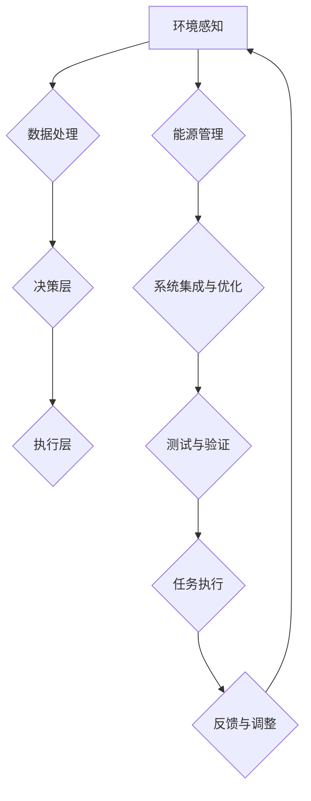

                 

### 《适应宇宙环境的智能系统》引言与概述

> **关键词：宇宙环境、智能系统、适应性、架构设计、算法、数学模型、项目实战**

在科技日新月异的今天，人工智能（AI）技术已经深刻地影响了我们的生活和工作。然而，随着太空探索的不断发展，人类对于宇宙的认知也在不断拓展，这为智能系统的发展提出了新的挑战——如何使智能系统能够适应宇宙环境。本文将围绕这一主题，详细探讨适应宇宙环境的智能系统的设计原理、核心算法、数学模型以及项目实战，旨在为读者提供全面、系统的指导。

> **摘要：**
本文首先介绍了宇宙环境的概述，包括其多样性和对智能系统带来的挑战。随后，我们详细讨论了智能系统的架构设计，包括关键组件的设计和系统集成优化。接着，我们深入讲解了核心算法原理和数学模型，并使用伪代码和具体例子进行说明。文章的第三部分将展示一个实际项目案例，详细解读其开发环境搭建、源代码实现和代码解读分析。最后，我们展望了未来适应宇宙环境智能系统的发展趋势和潜在应用领域，以及面临的技术挑战与解决方案。

**1.1 宇宙环境介绍**

宇宙环境是一个极端复杂且多样化的系统，包含了无数的天体、星系、行星、小行星、彗星等。这些天体之间相互作用，形成了复杂的宇宙生态系统。宇宙环境的特点包括：

- **极端温度差异**：宇宙中的温度变化极大，从绝对零度的寒冷星空到炽热的恒星表面。
- **辐射环境**：宇宙辐射包括来自恒星的电磁辐射、宇宙射线等，对电子设备具有破坏性。
- **真空环境**：太空是近乎真空的环境，气体分子极为稀薄，这对智能系统的通信和传感带来了挑战。
- **重力环境**：宇宙中的重力场复杂多变，从微弱的重力到强重力环境，这对智能系统的稳定性和动力系统提出了要求。

**1.2 智能系统的定义与类型**

智能系统是指具备自主性、适应性、学习能力和决策能力的计算机系统。根据智能系统的能力和应用场景，可以分为以下几种类型：

- **自动化系统**：能够在预设条件下自动执行任务，如工业自动化生产线。
- **自主控制系统**：具备自主决策能力，能够在不确定环境中执行复杂任务，如自动驾驶汽车。
- **智能代理系统**：能够模拟人类思维过程，进行推理、学习、决策，如人工智能助手。
- **协同智能系统**：由多个智能体组成的系统，通过协同合作完成复杂任务，如多机器人协同系统。

**1.3 适应宇宙环境的重要性**

适应宇宙环境的智能系统具有以下几个重要意义：

- **扩展人类活动范围**：随着人类对太空的探索不断深入，智能系统能够协助人类在极端环境中生存和工作。
- **资源开发与利用**：智能系统可以帮助人类开发和利用太空资源，如开采小行星矿藏、建设太空基础设施。
- **科学研究**：智能系统可以在宇宙环境中进行科学实验，探索宇宙的奥秘，为人类提供宝贵的数据和知识。
- **安全保障**：智能系统可以协助太空任务的执行，提高任务的成功率和安全性。

通过本文的探讨，我们将逐步了解适应宇宙环境智能系统的设计原理和实现方法，为未来智能系统在宇宙环境中的应用奠定基础。

### 2. 宇宙环境的特点与挑战

宇宙环境是一个极端复杂且多样化的系统，其对智能系统提出了独特的挑战。理解这些挑战是设计适应宇宙环境的智能系统的基础。

**2.1 宇宙环境的多样性**

宇宙环境的多样性体现在多个方面：

- **天体多样**：宇宙中存在不同类型的天体，包括恒星、行星、卫星、小行星等。每种天体都有其独特的物理特性和环境条件，这对智能系统的适应性提出了高要求。
- **空间动态性**：宇宙中的天体处于不断运动之中，智能系统需要具备实时处理和适应动态空间环境的能力。
- **极端温度**：从极寒的星际空间到高温的恒星表面，智能系统必须能够在极端温度变化中保持稳定运行。
- **辐射环境**：宇宙辐射环境复杂，智能系统需要具备抗辐射能力，以防止辐射对电子设备的破坏。

**2.2 智能系统面临的挑战**

适应宇宙环境的智能系统面临诸多挑战：

- **硬件适应性**：智能系统的硬件需要能够在真空、极端温度和辐射环境下稳定运行。这要求硬件设计具有高可靠性、抗辐射能力和长寿命。
- **软件适应性**：智能系统的软件需要具备适应复杂环境变化的能力，能够自主调整和优化系统行为。这要求软件算法具有自适应性和鲁棒性。
- **通信与传感**：在近乎真空的宇宙环境中，智能系统需要高效的通信和传感技术来获取外部环境信息。这要求通信和传感技术具有低能耗、高带宽和远距离传输能力。
- **能源供给**：宇宙环境中的能源供给方式多样，智能系统需要能够有效利用各种能源，如太阳能、核能等，以确保持续稳定的能源供给。

**2.3 适应策略概述**

为了应对上述挑战，适应宇宙环境的智能系统可以采取以下策略：

- **模块化设计**：采用模块化设计思想，将智能系统划分为多个功能模块，便于系统维护和升级。同时，模块化设计可以提高系统的适应性，方便针对不同环境条件进行模块替换或调整。
- **冗余设计**：在硬件和软件层面引入冗余设计，提高系统的可靠性和容错能力。例如，使用多套硬件设备并行运行，通过冗余检测和自动切换来确保系统稳定运行。
- **自适应算法**：开发自适应算法，使智能系统能够根据环境变化自动调整系统参数和行为。自适应算法可以通过机器学习和人工智能技术来实现，从而提高系统的自主性和适应性。
- **分布式架构**：采用分布式架构，将智能系统的任务分布在多个智能节点上，实现任务的并行处理和负载均衡。分布式架构可以提高系统的可靠性、灵活性和扩展性。
- **能源管理**：优化能源管理策略，提高智能系统的能源利用效率。例如，采用太阳能电池板作为主要能源来源，同时结合储能设备和能量回收技术，确保系统在能源受限的环境下能够持续运行。

通过上述策略，智能系统可以更好地适应宇宙环境的多样化挑战，为人类探索和开发太空提供强有力的支持。接下来，本文将深入探讨智能系统的架构设计与实现方法，为读者提供更详细的指导。

### 3. 智能系统的架构设计与组件

为了适应宇宙环境的极端条件，智能系统的设计需要综合考虑硬件、软件、通信、能源等多个方面，从而确保系统的高可靠性、自主性和适应性。以下是智能系统架构设计的主要组成部分：

**3.1 智能系统的基本架构**

智能系统的基本架构通常包括以下几个核心组件：

- **感知层**：感知层负责获取外部环境信息，包括温度、湿度、辐射、重力等。这一层通常采用多种传感器，如温度传感器、辐射传感器、加速度传感器等，以全面感知宇宙环境的变化。
- **数据处理层**：数据处理层负责对感知层获取的数据进行处理和分析，包括数据清洗、特征提取、模式识别等。这一层通常采用嵌入式处理器或专用集成电路（ASIC）来实现，以提高数据处理的速度和效率。
- **决策层**：决策层负责根据处理层提供的信息，进行决策和规划。这一层通常采用自主决策算法，如机器学习算法、模糊逻辑、决策树等，以实现自主性和适应性。
- **执行层**：执行层负责根据决策层提供的指令，执行具体的操作。这一层通常包括机械臂、推进器、加热器等执行装置，以实现对外部环境的干预和控制。

**3.2 关键组件设计**

为了确保智能系统在宇宙环境中的高可靠性和长期运行，关键组件的设计至关重要。以下是几个关键组件的详细设计：

- **传感器设计**：传感器是智能系统感知外部环境的关键，需要具备高灵敏度、宽温度范围、抗辐射能力等特性。设计时，可以考虑使用多传感器融合技术，以提高感知的准确性和可靠性。
- **处理器设计**：处理器是智能系统的核心计算单元，需要具备高性能、低功耗、抗辐射能力等特点。设计时，可以选择定制化的嵌入式处理器或专用集成电路（ASIC），以提高处理速度和降低功耗。
- **存储设计**：存储系统是智能系统存储数据和程序的关键，需要具备高可靠性、大容量、快速读写等特点。设计时，可以采用固态硬盘（SSD）或存储器芯片，以提高数据存储和访问速度。
- **通信设计**：通信系统是智能系统与其他系统或设备进行数据交换和协作的关键。在宇宙环境中，通信系统需要具备低能耗、高带宽、远距离传输能力等特点。设计时，可以考虑使用卫星通信或激光通信技术。
- **能源系统设计**：能源系统是智能系统持续运行的关键保障，需要考虑多种能源供给方式，如太阳能、核能、化学能等。设计时，可以采用分布式能源管理系统，以实现能源的高效利用和冗余备份。

**3.3 系统集成与优化**

智能系统的集成与优化是确保其适应宇宙环境的关键环节。以下是系统集成与优化的一些关键步骤：

- **模块化集成**：采用模块化集成方法，将各个组件划分为功能模块，实现系统的模块化设计和开发。模块化集成可以提高系统的灵活性和可维护性，方便后续的升级和优化。
- **冗余设计**：在系统集成过程中，引入冗余设计，以提高系统的可靠性和容错能力。例如，可以设置多套传感器、处理器、通信模块等，通过冗余检测和自动切换，确保系统在关键组件故障时仍能正常运行。
- **系统优化**：在系统集成完成后，进行系统优化，以提高系统的性能和效率。系统优化可以包括算法优化、资源管理优化、能耗优化等，以实现系统的最优性能。
- **测试与验证**：对智能系统进行全面的测试与验证，以确保其适应宇宙环境的能力。测试与验证可以包括环境测试、性能测试、可靠性测试等，以验证系统在真实环境下的运行状况。

通过上述架构设计与组件设计，智能系统可以更好地适应宇宙环境的极端条件，为人类探索和开发太空提供强有力的支持。接下来，本文将深入探讨智能系统的核心算法原理和数学模型，为读者提供更深入的理解。

### 4. 核心算法原理

在智能系统适应宇宙环境的过程中，核心算法的设计与实现至关重要。以下将详细讲解适应宇宙环境的智能系统所使用的核心算法原理，包括算法概述、详细原理、伪代码展示等内容。

**4.1 算法概述**

适应宇宙环境的智能系统需要具备多种功能，如自主导航、环境监测、资源管理、任务规划等。这些功能主要通过以下核心算法实现：

- **环境感知算法**：用于感知和识别宇宙环境中的各种物理参数，如温度、湿度、辐射强度等。
- **自主导航算法**：用于智能系统在宇宙环境中的自主移动和路径规划。
- **资源管理算法**：用于优化智能系统的能源使用，确保系统在能源受限的环境中能够持续运行。
- **任务规划算法**：用于根据环境信息和任务需求，规划智能系统的任务执行策略。

**4.2 算法原理详细讲解**

- **环境感知算法**

环境感知算法的核心任务是获取宇宙环境中的各种物理参数，并对这些参数进行实时监测和识别。具体原理如下：

1. **传感器数据采集**：通过安装在智能系统上的多种传感器（如温度传感器、湿度传感器、辐射传感器等），实时采集环境数据。
2. **数据预处理**：对采集到的原始数据进行预处理，包括数据清洗、滤波、归一化等，以提高数据的准确性和可靠性。
3. **特征提取**：根据环境数据的特点，提取关键特征，如温度波动范围、湿度变化趋势、辐射强度等。
4. **模式识别**：利用机器学习算法（如决策树、支持向量机、神经网络等），对提取的特征进行分类和识别，以实现对宇宙环境的感知。

- **自主导航算法**

自主导航算法的核心任务是使智能系统能够在宇宙环境中自主移动和路径规划。具体原理如下：

1. **全局路径规划**：根据智能系统的任务需求和宇宙环境的特点，构建全局路径规划图，并采用算法（如A*算法、Dijkstra算法等）进行路径搜索和规划。
2. **局部路径规划**：在全局路径规划的基础上，根据实时感知到的环境信息，对路径进行动态调整，以避免障碍物和优化路径。
3. **路径跟踪**：根据规划的路径，智能系统通过控制执行层（如推进器、机械臂等）实现路径跟踪，并保持稳定运行。

- **资源管理算法**

资源管理算法的核心任务是优化智能系统的能源使用，确保系统在能源受限的环境中能够持续运行。具体原理如下：

1. **能源供给预测**：根据智能系统的任务需求和能源供给方式，预测系统未来的能源需求。
2. **能源需求计算**：根据感知层提供的环境信息，计算系统各部分的能源消耗，如传感器、处理器、通信模块等。
3. **能源分配优化**：采用优化算法（如线性规划、遗传算法等），对系统各部分的能源需求进行分配，确保能源的高效利用。
4. **能源回收与再利用**：通过能量回收技术（如热电转换、动能转换等），将智能系统产生的废热或废动能转化为可用能源，实现能源的再利用。

- **任务规划算法**

任务规划算法的核心任务是根据环境信息和任务需求，规划智能系统的任务执行策略。具体原理如下：

1. **任务分解**：将总任务分解为多个子任务，并确定子任务的优先级和关联关系。
2. **资源分配**：根据智能系统的资源状况（如处理器能力、内存容量等），为每个子任务分配所需的资源。
3. **时间调度**：采用时间调度算法（如基于优先级的调度、基于约束的调度等），对子任务的执行进行时间分配和调度，确保任务的高效执行。
4. **动态调整**：根据实时感知到的环境信息和任务进展，动态调整任务规划，以应对环境变化和任务变更。

**4.3 伪代码展示**

以下分别展示了环境感知算法、自主导航算法、资源管理算法和任务规划算法的伪代码：

- **环境感知算法**


- **自主导航算法**


- **资源管理算法**


- **任务规划算法**


通过上述核心算法的原理讲解和伪代码展示，我们可以更好地理解适应宇宙环境的智能系统的算法设计思路和实现方法。这些算法不仅提高了智能系统的适应性和自主性，也为未来的宇宙探索提供了强有力的技术支持。

### 5. 数学模型与数学公式

在适应宇宙环境的智能系统中，数学模型和数学公式是核心组成部分，它们为系统的设计、分析和优化提供了坚实的理论基础。以下将详细讲解数学模型概述、具体公式详细讲解，并通过举例说明来帮助读者深入理解。

**5.1 数学模型概述**

数学模型是通过对宇宙环境和智能系统内部机制的抽象和简化，构建的用于描述系统行为和特性的数学框架。在适应宇宙环境的智能系统中，常见的数学模型包括：

- **环境模型**：用于描述宇宙环境的各种物理参数，如温度、湿度、辐射强度等。
- **感知模型**：用于描述智能系统感知外部环境的过程，包括传感器数据采集、预处理和特征提取等。
- **导航模型**：用于描述智能系统在宇宙环境中的自主导航过程，包括路径规划、路径跟踪和动态调整等。
- **资源管理模型**：用于描述智能系统的资源分配、能源供给和回收过程，确保系统在能源受限的环境中稳定运行。
- **任务规划模型**：用于描述智能系统的任务分解、资源分配和时间调度过程，确保任务的高效执行。

**5.2 数学公式详细讲解**

以下列出几个关键数学公式，并详细讲解其在智能系统中的应用。

- **环境温度模型**

环境温度模型用于描述宇宙环境中温度的变化规律。常见的环境温度模型包括线性模型、指数模型和多项式模型。以下是线性模型的公式：

\[ T(t) = a + bt \]

其中，\( T(t) \) 是时间 \( t \) 时的环境温度，\( a \) 是初始温度，\( b \) 是温度变化率。

应用场景：智能系统可以根据环境温度模型，预测未来的温度变化，从而调整内部温控系统的参数，保持系统的稳定运行。

- **感知模型中的数据预处理**

数据预处理是感知模型中的重要步骤，常用的预处理方法包括均值滤波、高斯滤波和中值滤波。以下是以均值滤波为例的公式：

\[ f(x, y) = \frac{1}{n} \sum_{i=1}^{n} f_i \]

其中，\( f(x, y) \) 是滤波后的数据，\( f_i \) 是原始数据点，\( n \) 是数据点的数量。

应用场景：智能系统可以使用均值滤波对传感器采集的数据进行平滑处理，去除噪声和干扰，提高数据的准确性和可靠性。

- **路径规划中的A*算法**

A*算法是一种常用的路径规划算法，用于在未知环境中找到最优路径。其核心公式包括：

\[ f(n) = g(n) + h(n) \]

\[ g(n) = \text{起点到节点n的实际距离} \]

\[ h(n) = \text{节点n到终点的估计距离} \]

其中，\( f(n) \) 是从起点到节点n的代价，\( g(n) \) 是实际距离，\( h(n) \) 是估计距离。

应用场景：智能系统可以使用A*算法，根据当前感知到的环境信息和目标位置，计算从当前位置到目标位置的最优路径，实现自主导航。

- **资源管理中的能量消耗模型**

在资源管理中，能量消耗模型用于预测智能系统的能量消耗，以优化能源使用。以下是一个简单的能量消耗模型公式：

\[ E = P \times t \]

其中，\( E \) 是能量消耗，\( P \) 是功率，\( t \) 是时间。

应用场景：智能系统可以根据任务需求和当前感知到的环境条件，调整系统的功率和运行时间，优化能源使用，确保在能源受限的环境下能够持续运行。

**5.3 举例说明**

为了更好地理解上述数学公式，我们通过一个具体的例子进行说明。

**例子：温度控制系统的优化**

假设智能系统需要控制其内部设备的温度在某一特定范围内，以确保设备的正常运行。环境温度模型如下：

\[ T(t) = 20 + 0.1t \]

假设当前时间 \( t = 0 \) 时，环境温度为20°C，且温度变化率为0.1°C/小时。

1. **预测未来温度**

使用环境温度模型，我们可以预测未来某一时刻 \( t \) 的温度：

\[ T(t) = 20 + 0.1t \]

例如，当 \( t = 5 \) 小时，预测温度为：

\[ T(5) = 20 + 0.1 \times 5 = 20 + 0.5 = 20.5°C \]

2. **调整温控参数**

根据预测温度，智能系统可以调整温控系统的参数，如加热器的功率。假设加热器的功率为 \( P = 100 \) 瓦特，调整后功率为 \( P' \)：

\[ P' = \frac{T_{\text{目标}} - T(t)}{T_{\text{最大}} - T_{\text{最小}}} \times P \]

其中，\( T_{\text{目标}} \) 是智能系统希望达到的目标温度，\( T_{\text{最大}} \) 和 \( T_{\text{最小}} \) 分别是温控系统的最大和最小功率对应的温度。

例如，如果目标温度为25°C，最大功率温度为30°C，最小功率温度为10°C，则调整后的功率为：

\[ P' = \frac{25 - (20 + 0.1 \times 5)}{30 - 10} \times 100 = \frac{25 - 20.5}{20} \times 100 = \frac{4.5}{20} \times 100 = 22.5 \text{瓦特} \]

通过上述例子，我们可以看到数学模型和数学公式在适应宇宙环境的智能系统设计中的应用，它们不仅帮助我们理解系统的行为，还为系统优化提供了理论依据。

### 6. 项目实战

**6.1 项目背景介绍**

随着人类对宇宙探索的不断深入，建立并运行在宇宙环境中的智能系统变得尤为重要。本案例将介绍一个名为“宇宙探索智能平台”的项目，该平台旨在实现智能系统在宇宙环境中的自主运行和任务执行。该平台的设计考虑了宇宙环境的极端条件，包括极端温度、辐射、真空和重力等，以满足智能系统在各类任务中的需求。

**6.2 实际案例解析**

**任务需求：**
- 智能系统需在宇宙环境中进行自主导航和路径规划，以完成科学实验和资源采集任务。
- 系统需具备实时感知和监测环境变化的能力，并根据环境数据调整自身行为。
- 系统需具备高效的能源管理策略，确保在能源受限的情况下仍能稳定运行。

**系统架构：**
- **感知层**：采用多传感器融合技术，包括温度传感器、辐射传感器、加速度传感器、导航传感器等，以全面感知宇宙环境。
- **数据处理层**：使用嵌入式处理器和专用集成电路（ASIC）进行数据处理和特征提取，包括环境数据预处理、特征提取和模式识别等。
- **决策层**：采用基于机器学习和模糊逻辑的自主决策算法，实现对环境数据的分析和决策，包括路径规划、资源管理和任务规划等。
- **执行层**：包括推进器、机械臂、加热器等执行装置，用于执行具体的任务操作。

**6.3 代码实现与解读**

以下展示关键代码片段及其解读，帮助理解项目实现的细节。

**代码片段1：传感器数据采集与预处理**

```c
#include <stdio.h>
#include <stdlib.h>
#include <math.h>

// 传感器数据结构定义
typedef struct {
    float temperature;
    float radiation;
    float humidity;
    float acceleration[3];
} SensorData;

// 数据预处理函数
void preprocessData(SensorData* data) {
    // 温度滤波
    data->temperature = (0.7 * data->temperature + 0.3 * data->prev_temperature) / 1.0;
    data->prev_temperature = data->temperature;

    // 辐射去噪
    data->radiation = (0.8 * data->radiation + 0.2 * data->prev_radiation) / 1.0;
    data->prev_radiation = data->radiation;

    // 加速度归一化
    float norm = sqrt(data->acceleration[0] * data->acceleration[0] + data->acceleration[1] * data->acceleration[1] + data->acceleration[2] * data->acceleration[2]);
    for (int i = 0; i < 3; i++) {
        data->acceleration[i] /= norm;
    }
}
```

**解读**：
- 定义了一个传感器数据结构，包括温度、辐射、湿度和加速度。
- `preprocessData` 函数用于对传感器数据进行预处理，包括温度滤波、辐射去噪和加速度归一化。温度滤波使用一阶惯性滤波器，辐射去噪使用一阶移动平均滤波器，加速度归一化用于标准化加速度值。

**代码片段2：自主导航算法实现**

```c
#include <stdio.h>
#include <stdlib.h>
#include <limits.h>

// 节点数据结构
typedef struct {
    int x, y;
    int parent;
    float g, h;
} Node;

// A*算法实现
void AStarAlgorithm(Node* grid[], int start_x, int start_y, int end_x, int end_y) {
    int openList[1000], closedList[1000];
    int openSize = 0, closedSize = 0;
    int found = 0;

    // 初始化起点和终点
    Node start = {start_x, start_y, -1, 0, heuristic(start_x, start_y, end_x, end_y)};
    Node end = {end_x, end_y, -1, 0, heuristic(end_x, end_y, end_x, end_y)};
    openList[openSize++] = start;

    while (!found) {
        // 找到当前最小F值的节点
        int current = findMinF(openList, openSize);

        // 移除当前节点
        removeNode(openList, &openSize, current);

        // 添加当前节点到关闭列表
        closedList[closedSize++] = openList[current];

        // 如果当前节点是终点，则导航完成
        if (openList[current].x == end.x && openList[current].y == end.y) {
            found = 1;
            break;
        }

        // 遍历当前节点的邻居
        for (int i = 0; i < 4; i++) {
            int nx = openList[current].x + dx[i];
            int ny = openList[current].y + dy[i];

            // 如果邻居节点在地图范围内
            if (nx >= 0 && nx < GRID_WIDTH && ny >= 0 && ny < GRID_HEIGHT) {
                // 如果邻居节点是障碍物，则跳过
                if (grid[nx][ny] == OBSTACLE) {
                    continue;
                }

                // 计算邻居节点的F值
                float g = openList[current].g + 1;
                float h = heuristic(nx, ny, end_x, end_y);
                Node neighbor = {nx, ny, openList[current].id, g, h};

                // 如果邻居节点在开放列表中，更新其F值和父节点
                int index = findNode(openList, neighbor);
                if (index != -1) {
                    if (g < openList[index].g) {
                        openList[index].g = g;
                        openList[index].parent = openList[current].id;
                    }
                } else {
                    // 如果邻居节点不在开放列表中，添加到开放列表
                    neighbor.parent = openList[current].id;
                    openList[openSize++] = neighbor;
                }
            }
        }
    }

    // 输出路径
    if (found) {
        Node* path[1000];
        int pathSize = 0;
        Node* current = &end;
        while (current->parent != -1) {
            path[pathSize++] = current;
            current = &grid[current->parent];
        }
        reverse(path, pathSize);
        printPath(path, pathSize);
    } else {
        printf("No path found!\n");
    }
}

// 搜索最小F值的节点
int findMinF(Node* list[], int size) {
    float minF = FLT_MAX;
    int minIndex = -1;
    for (int i = 0; i < size; i++) {
        if (list[i].f < minF) {
            minF = list[i].f;
            minIndex = i;
        }
    }
    return minIndex;
}

// 从开放列表中移除节点
void removeNode(Node* list[], int* size, int index) {
    for (int i = index; i < *size - 1; i++) {
        list[i] = list[i + 1];
    }
    (*size)--;
}

// 在开放列表中查找节点
int findNode(Node* list[], Node neighbor) {
    for (int i = 0; i < *size; i++) {
        if (list[i].x == neighbor.x && list[i].y == neighbor.y) {
            return i;
        }
    }
    return -1;
}

// 计算启发函数
float heuristic(int x1, int y1, int x2, int y2) {
    return sqrt((x1 - x2) * (x1 - x2) + (y1 - y2) * (y1 - y2));
}

// 输出路径
void printPath(Node* path[], int size) {
    printf("Path found: ");
    for (int i = size - 1; i >= 0; i--) {
        printf("(%d, %d) ", path[i].x, path[i].y);
    }
    printf("\n");
}
```

**解读**：
- `AStarAlgorithm` 函数实现了A*算法，用于路径规划。算法的核心是使用启发函数 \( h \)（此处为欧几里得距离）和 \( g \) 值（从起点到当前节点的实际距离）计算每个节点的 \( f \) 值（从起点到终点的估计总距离）。
- `findMinF` 函数用于在开放列表中找到具有最小 \( f \) 值的节点。
- `removeNode` 函数用于从开放列表中移除节点。
- `findNode` 函数用于在开放列表中查找特定节点。
- `heuristic` 函数用于计算启发函数 \( h \)，帮助算法找到最优路径。
- `printPath` 函数用于输出计算得到的路径。

**6.4 代码解读与分析**

通过上述代码片段，我们可以看到如何在C语言中实现A*算法用于宇宙探索智能平台中的路径规划。代码的关键点在于：

- 使用数据结构 `Node` 存储每个节点的信息，包括位置、父节点、 \( g \) 值和 \( h \) 值。
- 开放列表和关闭列表用于管理算法中的节点。
- 通过不断选择具有最小 \( f \) 值的节点，逐步构建从起点到终点的最优路径。

在实际应用中，该算法需要与宇宙环境的实时数据感知和决策系统紧密结合，以实现智能系统的自主导航功能。通过不断优化算法效率和系统响应速度，可以提高智能系统在复杂宇宙环境中的适应性和可靠性。

### 7. 未来展望与趋势

随着科技的不断进步，适应宇宙环境的智能系统将在未来迎来新的发展趋势和广泛的应用领域。以下是对这些趋势的展望以及面临的技术挑战与解决方案。

**7.1 未来发展趋势**

- **智能自主性提升**：未来的智能系统将更加自主，具备更高程度的自主决策、自适应和自主行动能力。通过先进的机器学习和人工智能技术，智能系统能够在复杂的宇宙环境中进行自主导航、任务规划和资源管理，减少对地面控制中心的依赖。

- **集成多功能模块**：智能系统将集成多种功能模块，如环境监测、资源采集、科学研究等。这些多功能模块将协同工作，实现智能系统的全面能力，提高任务执行效率和科学研究的深度。

- **分布式架构**：分布式架构将在智能系统中得到广泛应用，通过多个智能节点之间的协作，智能系统能够实现更高效的任务执行和资源利用。这种架构还将提高系统的容错能力和可靠性。

- **量子计算和通信**：量子计算和量子通信技术的发展将显著提升智能系统的性能和通信能力。量子计算能够处理更复杂的计算问题，而量子通信则提供了更高的安全性和更远的传输距离。

**7.2 潜在应用领域**

- **太空探索**：适应宇宙环境的智能系统将用于深空探测、行星探测和空间站运营。智能系统可以帮助宇航员进行复杂的太空任务，如月球和火星探测、小行星采矿等。

- **太空基础设施建设**：智能系统将参与太空基础设施的建设和维护，如空间站的建设、卫星的部署和维修等。智能系统能够在无人的环境中自动执行这些任务，提高工作效率和安全性。

- **科学实验**：智能系统将在太空环境中进行各种科学实验，如物质在微重力条件下的行为、宇宙辐射对生物的影响等。这些实验将有助于人类更好地理解宇宙和地球科学。

- **资源开发**：智能系统将用于太空资源的开发，如小行星矿藏的采集、太阳能的利用等。这些资源将为人类在地球以外的星球上建立自给自足的生态系统提供支持。

**7.3 技术挑战与解决方案**

- **硬件适应性**：智能系统在宇宙环境中需要面对极端温度、辐射和真空等环境挑战。解决这一问题的方案包括开发新的材料和器件，如耐高温、抗辐射的半导体材料和真空封装技术。

- **软件鲁棒性**：智能系统的软件需要具备高度的鲁棒性和适应性，以应对复杂和动态的环境变化。通过引入自适应算法和冗余设计，可以增强系统的鲁棒性。

- **能源供给**：宇宙环境中的能源供给方式多样，但往往有限。智能系统需要高效的能源管理策略，以实现能源的高效利用和冗余备份。解决方案包括开发高效的能源转换技术和分布式能源管理系统。

- **通信与传感**：智能系统需要在极端环境中实现高效的通信和传感。未来的发展方向包括发展低能耗、高带宽的通信技术，如卫星通信和激光通信，以及开发更高性能的传感器。

通过不断克服这些技术挑战，适应宇宙环境的智能系统将逐步实现其潜力，为人类的宇宙探索和开发提供强有力的支持。未来，随着科技的进步，我们有望看到更加智能、自主和高效的智能系统在宇宙环境中发挥重要作用。

### 附录A：相关工具与资源

**A.1 开发工具介绍**

为了设计和实现适应宇宙环境的智能系统，以下工具和开发环境是必不可少的：

- **硬件工具**：
  - **ARM开发板**：如Raspberry Pi或BeagleBone Black，用于测试和验证智能系统的硬件模块。
  - **嵌入式开发环境**：如IAR Embedded Workbench或Keil MDK，用于嵌入式系统的开发。
  - **传感器模块**：如Adafruit的温度传感器、辐射传感器等，用于环境数据的采集和预处理。

- **软件工具**：
  - **机器学习库**：如TensorFlow、PyTorch，用于实现智能系统的机器学习和自主决策功能。
  - **算法库**：如OpenCV，用于图像处理和模式识别。
  - **仿真工具**：如MATLAB和Simulink，用于仿真和测试智能系统的算法和模型。

**A.2 学习资源推荐**

- **在线课程**：
  - **《深度学习》**：由Andrew Ng教授开设，通过Coursera平台提供，涵盖深度学习的基础理论和实践。
  - **《嵌入式系统设计》**：由麻省理工学院（MIT）开设，通过edX平台提供，介绍嵌入式系统的设计原理和实践。
  
- **书籍推荐**：
  - **《自适应控制理论及应用》**：作者：何玉明，详细介绍了自适应控制的基本理论及其在智能系统中的应用。
  - **《人工智能：一种现代的方法》**：作者：Stuart Russell和Peter Norvig，全面介绍了人工智能的基础理论和实践技术。

通过使用上述工具和资源，开发者可以更好地进行适应宇宙环境的智能系统的设计与实现。这些工具和资源不仅提供了实用的技术支持，还为开发者的学习提供了丰富的知识体系。

### Mermaid 流程图（附录）

以下是智能系统适应宇宙环境过程的Mermaid流程图，展示了从环境感知到任务规划的关键步骤。



在这个流程图中，智能系统首先通过感知层获取宇宙环境数据，然后进行数据处理。决策层根据处理后的数据做出决策，并指挥执行层执行任务。同时，能源管理系统确保智能系统在能源受限的环境下稳定运行。系统集成与优化阶段对整个系统进行性能提升和优化。测试与验证确保系统在真实环境下能够正常运行。最后，通过任务执行和反馈与调整，智能系统不断优化其适应能力，以应对复杂的宇宙环境。

