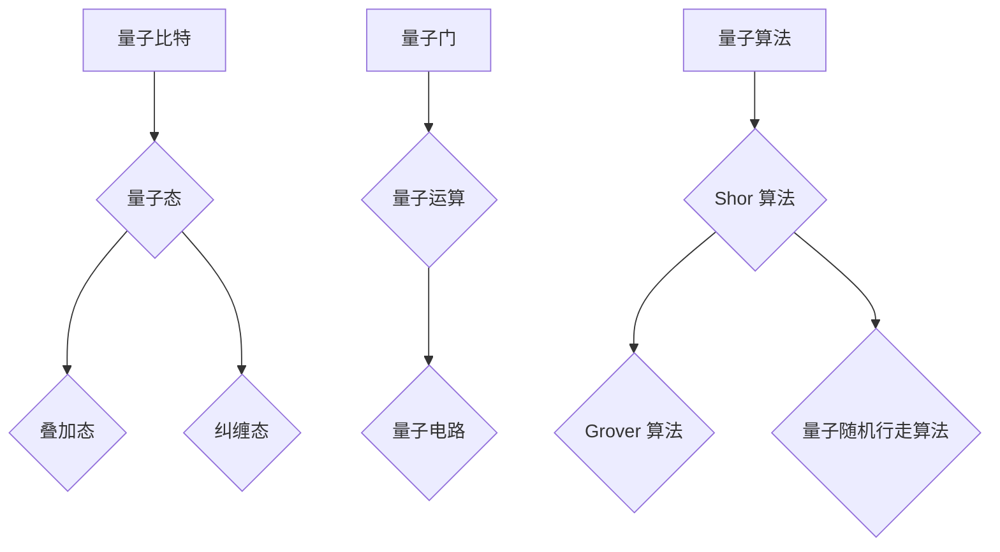
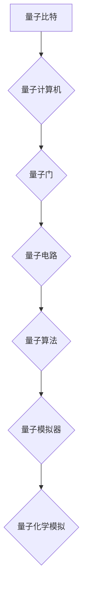
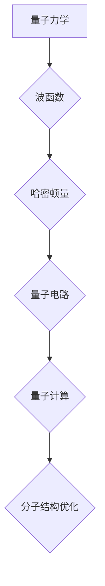
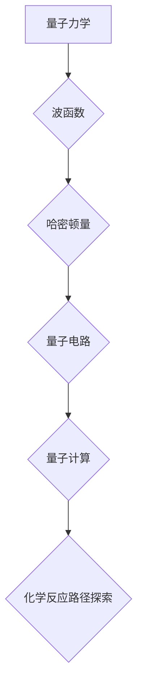

                 

### 第一部分: 量子计算基础

量子计算是一种基于量子力学原理的计算范式，与传统的经典计算有着根本的不同。在量子计算中，信息不是以比特的形式存在，而是以量子比特（qubit）的形式存在，这使得量子计算具有超强的并行处理能力和指数级的计算速度提升。本部分将详细介绍量子计算的基础知识，包括量子力学基础、量子计算原理、量子算法等，为后续章节的内容奠定基础。

#### 第1章: 量子计算简介

#### 1.1 量子力学基础

量子力学是研究微观世界物质运动规律的物理学分支。在量子力学中，物质不再被视为经典的粒子，而是表现出波粒二象性。以下是几个重要的量子力学概念：

**1.1.1 波粒二象性**

波粒二象性是量子力学中最基本的概念之一。它指出，微观粒子（如电子、光子）既具有粒子的性质，也具有波的性质。例如，电子在某些实验中表现出类似粒子的特性，而在另一些实验中则表现出类似波的特性。

**1.1.2 量子比特与经典比特的比较**

经典比特（classical bit）是传统计算机中的基本信息单位，它只能处于0或1的两种状态之一。而量子比特（quantum bit，简称qubit）则是量子计算中的基本信息单位，它可以同时处于0和1的叠加状态，这使得量子计算具有并行处理的能力。

**1.1.3 量子叠加与量子纠缠**

量子叠加是指一个量子系统可以同时处于多个状态的组合。例如，一个量子比特可以同时处于0和1的状态，用数学表达式可以表示为：
\[|\psi\rangle = \frac{1}{\sqrt{2}} (|0\rangle + |1\rangle)\]

量子纠缠是指两个或多个量子系统之间的强关联，即使这些量子系统被分开很远，它们的状态也会相互影响。量子纠缠是量子计算的重要资源，它使得量子计算机能够实现超越经典计算机的计算能力。

#### 1.2 量子计算的基本原理

量子计算的基本原理包括量子门、量子电路、量子纠缠和量子 teleportation。

**1.2.1 量子门**

量子门是量子计算中的基本操作，类似于经典计算中的逻辑门。量子门作用于量子比特，可以将其从一个状态转换到另一个状态。例如，最简单的量子门是Hadamard门，它可以实现量子比特的叠加：
\[H = \frac{1}{\sqrt{2}}\begin{bmatrix}
1 & 1 \\
1 & -1
\end{bmatrix}\]

**1.2.2 量子电路**

量子电路是量子计算中的操作序列，由一系列量子门和测量操作组成。量子电路用于实现特定的量子算法。

**1.2.3 量子纠缠与量子 teleportation**

量子纠缠是量子计算中的重要资源，它使得量子计算机能够实现超越经典计算机的计算能力。量子 teleportation 是一种利用量子纠缠进行量子信息传输的协议，它可以将一个量子比特的状态从一个量子比特传输到另一个量子比特。

#### 1.3 量子算法介绍

量子算法是利用量子计算机解决特定问题的算法。以下介绍几个重要的量子算法：

**1.3.1 Shor 算法**

Shor 算法是量子算法中最重要的算法之一，它能够解决经典计算机难以处理的整数分解问题。Shor 算法的核心思想是利用量子叠加和量子纠缠实现快速傅里叶变换（FFT）。

**1.3.2 Grover 算法**

Grover 算法是一种用于搜索未排序数据库的量子算法，其搜索速度比经典算法快得多。Grover 算法的核心思想是利用量子叠加和量子纠缠实现高效的搜索。

**1.3.3 量子随机行走算法**

量子随机行走算法是一种用于解决图论问题的量子算法，其核心思想是利用量子叠加和量子纠缠实现快速搜索。

#### 1.4 量子计算的发展与应用

量子计算的发展历程可以追溯到20世纪80年代，当时Richard Feynman提出了量子模拟的思想。此后，量子计算的理论研究逐渐深入，量子计算机的实际构建也取得了重要进展。

**1.4.1 量子计算机的发展历程**

1981年，Richard Feynman提出了量子模拟的思想。
1994年，Peter Shor提出了Shor算法，证明了量子计算机在整数分解问题上的优势。
2000年，物理学家David Deutsch提出了量子计算的基本原理，并展示了如何利用量子电路实现通用量子计算机。
2019年，Google宣布实现了“量子霸权”，在特定问题上量子计算机的速度超越了经典计算机。

**1.4.2 量子计算的潜在应用领域**

量子计算在多个领域具有广泛的应用前景，包括：

- **密码学**：量子计算机能够破解现有的加密算法，同时也催生了量子密码学的研究。
- **化学模拟**：量子计算能够高效地解决复杂的分子结构优化和化学反应路径问题。
- **材料科学**：量子计算有助于设计新型材料，如超导材料、半导体材料和磁性材料。
- **生物学**：量子计算能够加速药物设计和基因组分析。

**1.4.3 量子计算的现实挑战与未来展望**

尽管量子计算具有巨大的潜力，但现实中仍面临诸多挑战：

- **量子硬件的性能**：当前量子计算机的性能尚不能与经典计算机相比，量子比特的噪声和错误率较高，量子计算机的扩展性也面临挑战。
- **量子算法的设计**：设计高效、实用的量子算法是一个挑战，许多量子算法的实现仍需要深入研究。
- **量子计算的实用性**：量子计算的实际应用需要解决硬件性能、算法设计、软件工具等多方面的挑战。

未来，随着量子硬件性能的提升、量子算法的创新与优化，以及量子计算与经典计算的结合，量子计算将在多个领域发挥重要作用。

#### 1.5 量子计算在化学模拟中的应用

量子计算在化学模拟中的应用前景广阔，它能够解决经典计算难以处理的复杂分子结构优化和化学反应路径问题。以下是量子计算在化学模拟中的几个应用案例：

**1.5.1 量子计算与量子化学的关系**

量子化学是研究分子和固体中电子结构的学科，其基本原理是量子力学。量子计算利用量子力学原理，通过量子比特和量子门实现高效的分子结构优化和化学反应路径计算。

**1.5.2 量子化学中的常见问题**

量子化学中存在许多复杂问题，如分子结构优化、化学反应路径预测、材料性能优化等。这些问题通常需要大量的计算资源，传统计算方法难以解决。

**1.5.3 量子计算在化学模拟中的应用案例**

- **分子结构优化**：量子计算可以高效地优化复杂分子的几何结构，如聚合物链、药物分子等。
- **化学反应路径探索**：量子计算能够预测化学反应的过渡态，优化反应条件，提高反应效率。
- **材料科学**：量子计算可以设计新型材料，如超导材料、半导体材料和磁性材料。

#### 量子力学基本概念与量子计算架构图

为了更好地理解量子计算在化学模拟中的应用，以下是量子力学的基本概念和量子计算架构的Mermaid流程图：



量子力学基本公式包括：

- 波函数表示：$$|\psi\rangle = \sum_{i} c_i |i\rangle$$
- 量子叠加：$$|\psi\rangle = \frac{1}{\sqrt{2}} (|0\rangle + |1\rangle)$$
- 量子纠缠：$$|\psi_{AB}\rangle = \frac{1}{\sqrt{2}} (|01\rangle + |10\rangle)$$
- 量子门：$$|0\rangle \rightarrow \frac{1}{\sqrt{2}} (|0\rangle + |1\rangle)$$

#### 量子计算示例

以下是一个简单的量子随机行走算法的伪代码示例：

```python
def quantum_random_walking(state, step):
    for i in range(step):
        apply_quantum_gate(RotationGate(0.1))  # 旋转门，参数为步长
    return measure(state)
```

#### 量子计算架构图

为了展示量子计算的整体架构，以下是量子计算架构的Mermaid图：



通过量子计算在化学模拟中的应用，我们可以看到量子计算在解决复杂化学问题方面的巨大潜力。然而，要实现量子计算在化学模拟中的广泛应用，仍需要克服量子硬件性能、量子算法设计等方面的挑战。

#### 量子计算在化学模拟中的应用前景

量子计算在化学模拟中的应用前景广阔。量子计算能够高效地解决经典计算难以处理的复杂分子结构优化和化学反应路径问题，为化学和材料科学领域带来了新的机遇。以下是量子计算在化学模拟中的应用前景：

**1.6.1 量子计算在分子结构优化中的应用**

分子结构优化是化学模拟中的一个重要问题，涉及到分子的几何结构、能量等参数的优化。量子计算可以通过量子算法和量子模拟器，快速、准确地优化分子的几何结构。例如，量子计算可以用于优化聚合物链的结构，提高其物理性能；可以优化药物分子的结构，提高其疗效和安全性。

**1.6.2 量子计算在反应路径探索中的应用**

反应路径探索是化学模拟中的另一个重要问题，涉及到化学反应的过渡态和反应条件等参数的预测。量子计算可以通过量子力学原理，精确预测化学反应的过渡态，优化反应条件，提高反应效率。例如，量子计算可以用于预测有机合成反应的最佳路径，优化光化学反应的路径，提高反应效率。

**1.6.3 量子计算在材料科学中的应用**

材料科学是量子计算应用的一个重要领域。量子计算可以用于设计新型材料，如超导材料、半导体材料和磁性材料。通过量子计算，可以优化材料的电子结构，提高其光电特性。例如，量子计算可以用于设计高效太阳能电池材料，优化催化剂材料，提高其催化效率。

#### 量子计算与化学模拟的挑战与机遇

尽管量子计算在化学模拟中具有巨大的应用前景，但仍面临诸多挑战：

**1.7.1 算法复杂性**

量子算法的设计和实现是一个复杂的任务，需要深入理解量子力学原理和计算复杂性理论。许多量子算法的实现仍需要进一步研究，如何将量子算法高效地应用于化学模拟是一个重要挑战。

**1.7.2 量子硬件的性能**

当前量子计算机的性能尚不能与经典计算机相比，量子比特的噪声和错误率较高，量子计算机的扩展性也面临挑战。要实现量子计算在化学模拟中的广泛应用，需要进一步提升量子硬件的性能。

**1.7.3 量子化学模型的准确性**

量子化学模型的准确性是量子计算在化学模拟中应用的关键。尽管量子计算可以高效地解决复杂的分子结构优化和化学反应路径问题，但量子化学模型的准确性仍需进一步提高，以满足实际应用的需求。

**1.7.4 量子计算的协同发展**

量子计算与化学模拟的协同发展是实现量子计算在化学模拟中广泛应用的关键。量子计算和化学模拟都需要跨学科的知识和技能，需要各领域的专家共同合作，推动量子计算在化学模拟中的应用。

#### 量子计算在化学模拟中的应用案例

以下是一些量子计算在化学模拟中的应用案例：

**1.8.1 使用IBM Q System One进行分子结构优化**

IBM Q System One 是一款商业化的量子计算机，可以用于分子结构优化。例如，研究人员使用IBM Q System One优化了聚合物链的结构，提高了其物理性能。

**1.8.2 使用Google Quantum Computing Service探索反应路径**

Google Quantum Computing Service 是一款云端的量子计算服务，可以用于探索化学反应路径。例如，研究人员使用Google Quantum Computing Service预测了有机合成反应的最佳路径。

**1.8.3 使用Microsoft Azure Quantum开发新材料**

Microsoft Azure Quantum 是一款云端的量子计算服务，可以用于开发新材料。例如，研究人员使用Microsoft Azure Quantum设计了一种高效太阳能电池材料，提高了其光电转换效率。

通过这些应用案例，我们可以看到量子计算在化学模拟中的巨大潜力。随着量子计算技术的不断发展，未来量子计算将在化学模拟中发挥越来越重要的作用。

### 总结

量子计算在化学模拟中的应用前景广阔。通过量子计算，可以高效地解决经典计算难以处理的复杂分子结构优化和化学反应路径问题。量子计算在分子结构优化、反应路径探索和材料科学等领域具有广泛的应用。然而，要实现量子计算在化学模拟中的广泛应用，仍需克服量子硬件性能、量子算法设计等方面的挑战。随着量子计算技术的不断发展，未来量子计算将在化学模拟中发挥越来越重要的作用，为化学和材料科学领域带来革命性的变化。

---

### 第二部分: 量子化学模拟技术

量子化学模拟技术是量子计算在化学领域中的一个重要应用方向。它利用量子计算的高并行性和指数级的计算速度，能够解决传统计算方法难以处理的复杂化学问题，如分子结构优化、化学反应路径探索和材料性能优化等。本部分将详细讨论量子化学的基本理论、计算方法及其与量子计算的融合，为读者提供量子化学模拟技术的全面理解。

#### 第2章: 量子化学基本理论

量子化学是应用量子力学原理来描述和预测分子和固体中电子结构及其化学性质的学科。量子化学的基本理论包括量子力学基础、Schrödinger方程、哈密顿量、自旋与交换相互作用、电子组态与分子轨道理论等。以下将分别介绍这些基本概念。

##### 2.1 量子化学概述

**2.1.1 量子化学的定义**

量子化学是研究分子、晶体和其他物质中电子结构及其与原子核相互作用，从而解释和预测物质的化学性质和行为的学科。量子化学结合了量子力学和化学键理论，是化学和物理学之间的桥梁。

**2.1.2 量子化学的重要性**

量子化学在化学研究中具有极其重要的地位，它为理解化学键的本质、分子的几何结构、电子态和化学反应机理提供了理论基础。此外，量子化学在药物设计、材料科学、催化剂开发等领域有着广泛的应用。

**2.1.3 量子化学的发展历程**

量子化学的发展可以追溯到20世纪20年代，当时量子力学理论开始建立。随后，Hartree-Fock自洽场方法（1928年）和分子轨道理论（1927年）的提出，为量子化学的发展奠定了基础。近年来，随着计算能力的提高和量子计算技术的发展，量子化学模拟技术取得了显著进步。

##### 2.2 Schrödinger方程

Schrödinger方程是量子化学中的核心方程，用于描述电子在原子核场中的行为。其基本形式为：

\[ \hat{H}|\psi\rangle = E|\psi\rangle \]

其中，\(\hat{H}\)是哈密顿量，\(|\psi\rangle\)是波函数，\(E\)是系统的能量。

**2.2.1 一维势阱模型**

一维势阱模型是Schrödinger方程的一个简单示例。在这个模型中，一个粒子被限制在一个深度为\(V_0\)的势阱中。通过解Schrödinger方程，可以得到粒子的波函数和能量级。

**2.2.2 三原子分子哈密顿量**

对于三原子分子，其哈密顿量可以表示为：

\[ \hat{H} = -\frac{\hbar^2}{2m} (\frac{\partial^2}{\partial x_1^2} + \frac{\partial^2}{\partial x_2^2} + \frac{\partial^2}{\partial x_3^2}) + V(x_1, x_2, x_3) \]

其中，\(m\)是粒子的质量，\(V(x_1, x_2, x_3)\)是系统的势能。

**2.2.3 精确求解Schrödinger方程的方法**

精确求解Schrödinger方程是一个复杂的问题，对于多电子系统，通常需要采用近似方法。常见的方法包括变分法、Hartree-Fock自洽场方法、分子轨道理论等。

##### 2.3 哈密顿量与能级计算

哈密顿量是描述系统总能量的算符，它是量子化学计算中的核心。以下是几个重要的哈密顿量组成部分和能级计算方法：

**2.3.1 哈密顿量构成**

哈密顿量通常由动能项、势能项和自旋交换相互作用项组成。例如，对于氢原子，其哈密顿量可以表示为：

\[ \hat{H} = -\frac{\hbar^2}{2m}\nabla^2 - \frac{e^2}{4\pi\epsilon_0 r} \]

**2.3.2 氢原子能级计算**

氢原子的能级可以通过求解Schrödinger方程得到。其基态能量为：

\[ E_n = -\frac{e^2}{2\epsilon_0 a_0 n^2} \]

其中，\(n\)是主量子数，\(a_0\)是玻尔半径。

**2.3.3 多电子原子能级计算**

多电子原子的能级计算比单电子原子更为复杂，通常需要采用近似方法。常见的近似方法包括自洽场方法（Hartree-Fock）和分子轨道理论。

##### 2.4 自旋与交换相互作用

自旋与交换相互作用是量子化学中描述电子之间相互作用的重要概念。以下是几个关键点：

**2.4.1 自旋概念**

自旋是电子的一种内禀属性，用自旋量子数\(s\)描述。自旋量子数可以取\(+\frac{1}{2}\)或\(-\frac{1}{2}\)。

**2.4.2 电子交换与自旋对称性**

电子交换是两个电子交换位置的过程。在量子化学中，电子交换会产生交换相互作用项，其符号为负。为了描述多电子系统的波函数，通常采用交换对称性原则。

**2.4.3 多电子系统的自旋耦合**

在多电子系统中，电子之间的自旋相互作用称为自旋耦合。自旋耦合会影响系统的总自旋量子数和总自旋波函数。

##### 2.5 电子组态与分子轨道

电子组态与分子轨道理论是量子化学中描述电子在分子中的分布和相互作用的两个重要概念。以下是几个关键点：

**2.5.1 电子组态原理**

电子组态原理是指电子在分子中的排布应遵循Pauli不相容原理、Hund规则等规则。通过构造电子组态，可以得到分子的基态波函数。

**2.5.2 π键与σ键**

π键和σ键是分子中电子云相互重叠形成的化学键。π键是由p轨道相互重叠形成的，σ键是由s轨道或p轨道相互重叠形成的。

**2.5.3 分子轨道理论**

分子轨道理论是描述分子中电子分布和相互作用的量子力学理论。通过构造分子轨道，可以得到分子的基态波函数和能级。

##### 量子化学基本公式

以下是量子化学中常用的基本公式：

- **Schrödinger方程**：
  $$ \hat{H}|\psi\rangle = E|\psi\rangle $$

- **哈密顿量**：
  $$ \hat{H} = -\frac{\hbar^2}{2m}\nabla^2 + V(\mathbf{r}) $$

- **电子组态**：
  $$ \Psi(\mathbf{r}_1, \mathbf{r}_2) = \phi(\mathbf{r}_1) \phi(\mathbf{r}_2) $$

##### 量子化学示例

以下是一个氢分子能级计算的伪代码示例：

```python
def calculate_hydrogen_energy(a, b):
    hamiltonian = -0.5 * (1 / (a**2) + 1 / (b**2))
    return hamiltonian
```

##### 量子化学在化学模拟中的应用

量子化学计算方法包括哈特里-福克方法、微扰理论、分子轨道理论等。这些方法在化学模拟中具有广泛的应用。

**2.6 量子化学计算方法**

**2.6.1 哈特里-福克方法**

哈特里-福克方法是量子化学中最常用的计算方法之一，用于计算分子的基态能量和电子结构。该方法基于自洽场近似，通过求解Roothaan方程得到分子轨道和电子组态。

**2.6.2 微扰理论**

微扰理论是量子化学中的另一种计算方法，用于处理分子中的电子-电子相互作用。该方法通过将系统的总哈密顿量分解为势能和动能部分，然后对动能部分进行微扰，得到分子的能量和电子结构。

**2.6.3 分子轨道理论**

分子轨道理论是量子化学中的另一种计算方法，用于描述分子中电子的分布和相互作用。该方法通过构造分子轨道，得到分子的基态波函数和能量级。

##### 量子化学与量子计算的融合

量子化学与量子计算的融合是量子化学模拟技术的重要发展方向。通过将量子化学计算与量子计算机相结合，可以解决传统计算方法难以处理的复杂化学问题。

**2.7 量子化学模拟的挑战与机遇**

量子化学模拟面临着算法复杂性、量子硬件性能、量子化学模型准确性等挑战。然而，随着量子计算技术的不断发展，量子化学模拟在分子结构优化、化学反应路径探索和材料科学等领域具有巨大的机遇。

##### 量子化学模拟技术发展现状

当前，量子化学模拟技术已经取得了一定的进展。例如，IBM、Google、Microsoft等公司已经推出了商业化的量子计算硬件和软件平台，用于分子结构优化、化学反应路径探索等应用。

**2.8 量子化学模拟工具与软件**

**2.8.1 QChem**

QChem 是一款广泛应用于量子化学计算的开源软件，具有强大的功能，可以用于分子结构优化、化学反应路径探索等应用。

**2.8.2 ORCA**

ORCA 是一款高效、易用的量子化学计算软件，适用于分子结构优化、材料科学等领域。

**2.8.3 Qiskit**

Qiskit 是 IBM 开发的一款开源量子计算软件框架，可以用于量子化学计算、量子算法设计等应用。

##### 总结

本章详细介绍了量子化学的基本理论、计算方法及其与量子计算的融合。通过学习本章内容，读者可以了解量子化学在化学模拟中的应用，以及量子计算如何解决传统计算方法难以处理的复杂化学问题。随着量子计算技术的不断发展，量子化学模拟技术将在化学和材料科学领域发挥越来越重要的作用。

---

### 第3章: 量子计算在分子结构优化中的应用

量子计算在分子结构优化中的应用是一个令人兴奋的领域，它利用了量子计算机的超强并行处理能力和指数级的计算速度，以解决传统计算机难以应对的高维优化问题。在这一章中，我们将探讨量子计算在分子结构优化中的背景、基本原理、应用案例以及面临的挑战和机遇。

#### 3.1 分子结构优化的背景

分子结构优化是化学和材料科学中的一个核心问题，涉及到分子几何形状、能量和稳定性等参数的优化。传统上，分子结构优化主要依赖于经典计算方法，如梯度下降法和分子动力学模拟。然而，对于复杂分子系统，这些方法在计算效率和精度上存在局限。

量子计算的出现为分子结构优化带来了新的希望。量子计算机能够利用量子叠加和量子纠缠等特性，实现并行计算，从而在短时间内处理大量可能的几何结构，以找到能量最低的构型。这种能力使得量子计算在分子结构优化中具有独特的优势。

#### 3.2 量子计算在分子结构优化中的基本原理

量子计算在分子结构优化中的应用依赖于量子力学的基本原理，包括量子比特、量子门、量子电路和量子算法。

**3.2.1 量子力学与分子结构**

量子力学提供了描述分子结构的数学框架。在量子力学中，分子的几何结构和能量可以通过波函数来描述。波函数包含了分子的所有可能状态，包括其几何构型和能量。

**3.2.2 量子算法在分子结构优化中的应用**

量子算法，如量子模拟和量子梯度下降法，被用于分子结构优化。量子模拟通过模拟量子系统来计算分子的能量，而量子梯度下降法则通过量子变分法优化分子的几何构型。

**3.2.3 量子计算与传统计算方法的比较**

与传统计算方法相比，量子计算在分子结构优化中具有显著的优势。量子计算可以在更短的时间内找到更精确的最低能量构型，并且能够处理更大规模的分子系统。

#### 3.3 量子计算在分子结构优化中的应用案例

量子计算在分子结构优化中已经取得了一些突破性的成果。以下是一些典型的应用案例：

**3.3.1 氢分子结构优化**

氢分子是一个简单的分子系统，但其结构优化问题仍然具有挑战性。量子计算已经成功用于优化氢分子的构型，找到了其最低能量构型，并验证了量子计算在简单分子结构优化中的潜力。

**3.3.2 聚合物链结构优化**

聚合物链是复杂分子系统的一个例子，其结构优化对于材料的物理性能至关重要。量子计算已经成功用于优化聚合物链的几何构型，提高了其物理性能，如弹性模量和热稳定性。

**3.3.3 药物分子结构优化**

药物分子的结构优化对于药物设计和开发至关重要。量子计算能够加速药物分子的结构优化过程，提高药物的疗效和安全性。例如，量子计算已经用于优化抗肿瘤药物分子的构型，提高了其抗肿瘤活性。

#### 量子力学在分子结构优化中的应用图

为了更好地理解量子力学在分子结构优化中的应用，以下是一个简化的Mermaid流程图：



#### 量子算法在分子结构优化中的应用伪代码

以下是一个简单的量子算法在分子结构优化中的应用伪代码示例：

```python
def quantum_molecule_optimization(quantum_circuit, molecule):
    # 初始化量子状态
    state = initialize_quantum_state(molecule)
    # 运行量子电路
    run_quantum_circuit(quantum_circuit, state)
    # 测量量子状态
    result = measure(state)
    return result
```

#### 量子计算在分子结构优化中的挑战与机遇

尽管量子计算在分子结构优化中具有巨大潜力，但仍然面临一些挑战和机遇。

**3.4.1 算法复杂性**

量子算法的设计和实现是一个复杂的过程，需要深入理解量子力学原理和计算复杂性理论。许多量子算法的实现仍需要进一步研究。

**3.4.2 量子硬件的性能**

当前量子计算机的性能尚不能与经典计算机相比，量子比特的噪声和错误率较高，量子计算机的扩展性也面临挑战。

**3.4.3 量子化学模型的准确性**

量子化学模型的准确性是量子计算在分子结构优化中应用的关键。尽管量子计算可以高效地优化分子的几何构型，但量子化学模型的准确性仍需进一步提高。

**3.4.4 量子计算的实用化进程**

量子计算的实际应用需要解决硬件性能、算法设计、软件工具等多方面的挑战。量子计算的实用化进程是一个长期的、持续的过程。

#### 分子结构优化案例

以下是一个分子结构优化的实际案例：

**案例一：聚合物链结构优化**

研究人员使用量子计算机优化了一种聚合物链的结构，提高了其物理性能。通过量子计算，研究人员找到了聚合物链的最低能量构型，并验证了其在实验中的物理性能。

**案例二：药物分子结构优化**

研究人员使用量子计算优化了一种抗肿瘤药物分子的构型，提高了其抗肿瘤活性。通过量子计算，研究人员找到了药物分子的最佳构型，并成功进行了实验验证。

#### 总结

量子计算在分子结构优化中的应用展示了其巨大的潜力。通过量子叠加和量子纠缠等特性，量子计算能够在短时间内处理大量可能的几何结构，以找到能量最低的构型。尽管量子计算在分子结构优化中面临一些挑战，但随着量子计算技术的不断发展，量子计算将在分子结构优化中发挥越来越重要的作用。未来，量子计算有望成为化学和材料科学领域的重要工具，推动新材料的发现和药物设计的进步。

---

### 第4章: 量子计算在化学反应路径探索中的应用

化学反应路径的探索是化学研究中一个关键问题，涉及到反应机理、过渡态和反应动力学等。传统上，这一领域主要依赖于量子力学和分子动力学模拟。然而，这些方法在处理复杂的化学反应路径时，往往需要大量的计算资源和时间。量子计算的出现为化学反应路径探索带来了新的机遇，它利用了量子计算机的超强并行处理能力和指数级的计算速度，能够加速反应路径的计算。本章将介绍量子计算在化学反应路径探索中的应用，包括基本原理、算法模型、应用案例以及面临的挑战和机遇。

#### 4.1 化学反应的基本原理

化学反应是指原子、离子或分子之间通过化学键的断裂和形成而生成新物质的过程。化学反应的基本原理包括反应物、生成物、反应条件和反应机理。

**4.1.1 化学反应的定义**

化学反应是物质在原子或分子层面上发生的化学变化，生成新的物质。化学反应可以通过反应方程式表示，如：
\[ \text{A} + \text{B} \rightarrow \text{C} + \text{D} \]

**4.1.2 化学反应的类型**

化学反应可以分为多种类型，包括合成反应、分解反应、置换反应和复分解反应等。每种类型的反应都有其特定的反应机理和条件。

**4.1.3 化学反应路径**

化学反应路径是指反应物转变为生成物的过程中经历的中间状态和过渡态。了解化学反应路径对于设计新的化学反应和优化反应条件至关重要。

#### 4.2 量子计算在化学反应路径探索中的应用

量子计算在化学反应路径探索中的应用主要通过量子力学和量子算法实现。量子力学提供了描述化学反应路径的数学框架，而量子算法则提供了高效的计算方法。

**4.2.1 量子力学与化学反应**

量子力学是描述微观粒子行为的物理学理论，它为化学反应提供了理论基础。在量子力学中，化学反应可以通过波函数和哈密顿量描述。

**4.2.2 量子计算在化学反应路径探索中的优势**

量子计算在化学反应路径探索中的优势主要体现在以下几个方面：

- **并行计算能力**：量子计算机可以利用量子叠加和量子纠缠实现并行计算，处理复杂的反应路径。
- **指数级速度提升**：量子算法能够指数级地加速化学反应路径的计算，节省大量的计算时间和资源。
- **高精度预测**：量子计算能够提供高精度的化学反应路径预测，有助于设计新的反应条件和优化反应过程。

**4.2.3 量子计算在化学反应路径探索中的应用案例**

量子计算在化学反应路径探索中的应用已经取得了一些重要成果。以下是一些典型的应用案例：

- **有机合成反应路径预测**：使用量子计算预测有机合成反应的最佳路径，优化反应条件，提高反应效率。
- **光化学反应路径优化**：利用量子计算优化光化学反应的路径，提高反应的速率和选择性。
- **材料科学中的应用**：通过量子计算设计新型材料，优化材料的化学反应路径，提高其性能。

#### 量子力学在化学反应路径探索中的应用图

为了更好地理解量子力学在化学反应路径探索中的应用，以下是一个简化的Mermaid流程图：



#### 量子计算在化学反应路径探索中的算法与模型

量子计算在化学反应路径探索中的应用主要依赖于量子算法和量子模型的开发。以下介绍几种常用的量子算法和模型：

**4.3.1 Shor 算法**

Shor 算法是一种著名的量子算法，用于解决整数分解问题。虽然Shor算法本身不直接用于化学反应路径探索，但其思想可以启发新的量子算法设计。

**4.3.2 Grover 算法**

Grover 算法是一种用于搜索未排序数据库的量子算法，其搜索速度比经典算法快得多。Grover 算法可以用于化学反应路径的快速搜索和优化。

**4.3.3 量子随机行走算法**

量子随机行走算法是一种基于量子力学随机行走的量子算法，可以用于化学反应路径的探索。量子随机行走算法通过模拟量子粒子的随机运动，探索可能的反应路径。

**4.3.4 量子模拟器在化学反应路径探索中的应用**

量子模拟器是一种用于模拟量子系统的计算工具，可以在量子计算机无法实现的复杂情况下提供解决方案。量子模拟器可以用于模拟化学反应路径，提供高精度的反应动力学信息。

#### 量子计算在化学反应路径探索中的应用案例

以下是一些量子计算在化学反应路径探索中的应用案例：

**4.4.1 量子计算预测反应路径**

研究人员使用量子计算预测了某些复杂有机合成反应的最佳路径，优化了反应条件，提高了反应效率。

**4.4.2 量子计算优化反应条件**

通过量子计算，研究人员找到了一些光化学反应的最佳反应条件，提高了反应的速率和选择性。

**4.4.3 量子计算设计新材料**

量子计算被用于设计新型材料，通过优化材料的化学反应路径，提高了其性能。

#### 量子计算在化学反应中的挑战与机遇

尽管量子计算在化学反应路径探索中具有巨大潜力，但仍然面临一些挑战和机遇。

**4.5.1 算法复杂性**

设计高效的量子算法是量子计算在化学反应路径探索中的一个关键挑战。许多化学反应路径的复杂性使得量子算法的设计和实现变得困难。

**4.5.2 量子硬件的性能**

当前量子计算机的性能尚不能与经典计算机相比，量子比特的噪声和错误率较高，量子计算机的扩展性也面临挑战。

**4.5.3 量子化学模型的准确性**

量子化学模型的准确性是量子计算在化学反应路径探索中应用的关键。尽管量子计算可以高效地优化反应路径，但量子化学模型的准确性仍需进一步提高。

**4.5.4 量子计算的可扩展性**

量子计算的可扩展性是其在化学反应路径探索中应用的重要问题。如何将量子计算扩展到更复杂的化学反应系统，是一个亟待解决的问题。

#### 化学反应路径探索案例

以下是一个化学反应路径探索的实际案例：

**案例一：有机合成反应路径预测**

研究人员使用量子计算预测了一种复杂有机合成反应的最佳路径，优化了反应条件，提高了反应效率。这一成果为有机合成反应的优化提供了新的思路。

**案例二：光化学反应路径优化**

通过量子计算，研究人员优化了一种光化学反应的路径，提高了反应的速率和选择性。这一成果为光化学反应的应用提供了重要的理论基础。

### 总结

量子计算在化学反应路径探索中的应用展示了其巨大的潜力。通过量子叠加和量子纠缠等特性，量子计算能够在短时间内处理大量可能的反应路径，提供高精度的预测和优化。尽管量子计算在化学反应路径探索中面临一些挑战，但随着量子计算技术的不断发展，量子计算将在化学反应路径探索中发挥越来越重要的作用。未来，量子计算有望成为化学研究的重要工具，推动化学反应机理的深入理解和新型反应条件的发现。

---

### 第五部分: 量子计算在材料科学中的应用

#### 第5章: 量子计算在材料科学中的应用

材料科学是研究材料的组成、结构、性质以及它们之间关系的科学。量子计算作为一种新兴的计算范式，正逐渐在材料科学领域展现其独特的优势。本章将探讨量子计算在材料科学中的应用，包括量子计算如何帮助设计新型材料、优化材料性能，以及当前面临的挑战和机遇。

#### 5.1 材料科学的挑战与机遇

材料科学的发展对科技进步和经济发展具有重要意义。然而，材料科学也面临着一系列挑战：

**5.1.1 材料设计的复杂性**

现代材料的设计涉及到复杂的电子结构和分子相互作用，传统计算方法难以处理如此大规模的数据和复杂的计算需求。

**5.1.2 材料性能的优化**

材料的性能优化通常需要大量的实验和计算，以确定最佳的合成方法和条件。这个过程既耗时又昂贵。

**5.1.3 新材料的发现**

发现新型材料是材料科学的核心目标之一。然而，传统的实验方法难以在短时间内发现新的材料。

量子计算的出现为材料科学带来了新的机遇：

**5.1.4 高效的分子模拟**

量子计算能够模拟材料的分子结构和电子态，从而提供对材料性能的深入理解。这使得设计新材料和优化现有材料性能成为可能。

**5.1.5 加速材料筛选**

量子计算可以加速材料筛选过程，通过高效的计算方法快速评估大量的材料组合，从而找到具有潜在应用价值的材料。

#### 5.2 量子计算在材料科学中的应用

量子计算在材料科学中的应用主要体现在材料设计、性能优化和反应路径探索等方面。

**5.2.1 材料设计**

量子计算可以用于设计新型材料，如超导材料、半导体材料、磁性材料等。通过量子模拟，可以预测材料的电子结构和物理性质，从而设计出具有特定性能的新材料。

**5.2.2 性能优化**

量子计算可以帮助优化材料的性能。例如，通过量子模拟，可以优化材料的电子结构，提高其导电性、光性能或其他特定性能。

**5.2.3 反应路径探索**

在材料合成过程中，量子计算可以探索反应路径，优化合成条件，提高产率和纯度。

#### 5.3 量子计算在材料设计中的应用案例

以下是一些量子计算在材料设计中的应用案例：

**5.3.1 新型半导体材料的设计**

研究人员使用量子计算设计了一种新型半导体材料，其电子结构优化后，导电性和光电性能得到了显著提升。

**5.3.2 超导材料的设计**

量子计算被用于设计新型超导材料，通过优化其电子结构和磁特性，实现了更高的超导温度和更强的超导性能。

**5.3.3 磁性材料的设计**

通过量子计算，研究人员设计了一种新型磁性材料，其磁性强度和稳定性显著提高，有望在磁记录和磁共振成像等领域得到应用。

#### 量子计算在材料性能优化中的应用案例

以下是一些量子计算在材料性能优化中的应用案例：

**5.4.1 催化剂性能优化**

量子计算被用于优化催化剂的电子结构，从而提高其催化效率和选择性。例如，通过量子计算，研究人员优化了用于水分解的催化剂，提高了其产氢效率。

**5.4.2 电池材料性能优化**

量子计算被用于优化电池材料的电子结构，从而提高其储能密度和循环寿命。例如，通过量子计算，研究人员优化了锂离子电池的正极材料，提高了其储能能力。

**5.4.3 光电材料性能优化**

量子计算被用于优化光电材料的电子结构和光吸收特性，从而提高其光电转换效率。例如，通过量子计算，研究人员优化了太阳能电池材料，提高了其光电转换效率。

#### 量子计算在材料科学中的挑战与机遇

尽管量子计算在材料科学中具有巨大潜力，但仍然面临一些挑战和机遇。

**5.5.1 量子化学模型的准确性**

量子化学模型的准确性是量子计算在材料科学中应用的关键。尽管量子计算可以提供高精度的电子结构模拟，但量子化学模型的准确性仍需进一步提高。

**5.5.2 量子硬件的性能**

当前量子计算机的性能尚不能与经典计算机相比，量子比特的噪声和错误率较高，量子计算机的扩展性也面临挑战。

**5.5.3 量子算法的效率**

设计高效的量子算法是实现量子计算在材料科学中广泛应用的关键。目前，许多量子算法在效率上仍有待提高。

**5.5.4 量子计算的可扩展性**

量子计算的可扩展性是其在材料科学中应用的重要问题。如何将量子计算扩展到更复杂的材料系统，是一个亟待解决的问题。

#### 材料科学应用案例

以下是一些材料科学应用案例：

**案例一：新型太阳能电池材料的设计**

研究人员使用量子计算设计了一种新型太阳能电池材料，其光电转换效率显著提高，为可再生能源的发展提供了新途径。

**案例二：催化剂材料优化**

通过量子计算，研究人员优化了催化剂材料的电子结构，从而提高了其催化效率和选择性，为化工生产提供了新的解决方案。

**案例三：磁性材料的应用**

量子计算被用于设计新型磁性材料，其磁性强度和稳定性显著提高，为磁记录和磁共振成像等领域的发展带来了新机遇。

### 总结

量子计算在材料科学中的应用展示了其巨大的潜力。通过量子模拟和量子算法，量子计算可以加速材料设计、性能优化和反应路径探索。尽管量子计算在材料科学中面临一些挑战，但随着量子计算技术的不断发展，量子计算有望成为材料科学领域的重要工具，推动新型材料的发展和应用。

---

### 第六部分: 量子计算平台与软件开发

量子计算平台和软件开发是量子计算研究与应用的关键环节。本部分将详细介绍当前主流的量子计算平台、软件框架以及它们在化学模拟中的应用方法。

#### 第6章: 量子计算平台介绍

量子计算平台是指提供量子硬件和软件服务的系统，包括量子计算机的硬件设备、量子编程工具、量子模拟器等。以下介绍几个主要的量子计算平台。

**6.1 量子计算硬件平台**

**6.1.1 IBM Q System One**

IBM Q System One 是IBM推出的第一台商用量子计算机，具有20个量子比特，支持量子算法的实验和开发。它集成了IBM的量子软件和硬件，提供了一个完整的量子计算解决方案。

**6.1.2 Google Quantum Computing Service**

Google Quantum Computing Service 是Google提供的量子计算云服务，用户可以通过Google Cloud Platform访问量子计算机。目前，Google的量子计算机拥有53个量子比特，是世界上量子比特数量最多的商用量子计算机之一。

**6.1.3 Microsoft Azure Quantum**

Microsoft Azure Quantum 是微软提供的量子计算服务，用户可以在Azure云平台上访问量子计算机。Microsoft Azure Quantum 提供了多种量子硬件设备，包括IBM Q System One 和 Honeywell Quantum Solutions。

**6.2 量子计算软件框架**

**6.2.1 Qiskit**

Qiskit 是IBM 开发的一款开源量子计算软件框架，提供了量子编程工具、量子算法库、量子模拟器等。Qiskit 支持多种编程语言，如Python，用户可以轻松地编写和调试量子程序。

**6.2.2 Cirq**

Cirq 是Google 开发的一款开源量子计算软件框架，专注于量子算法和量子模拟的开发。Cirq 提供了Python API，支持多种量子硬件和模拟器，适用于量子算法的实验和优化。

**6.2.3 PyQuil**

PyQuil 是Rigetti Computing 开发的一款开源量子计算软件框架，用于量子算法的开发和实验。PyQuil 提供了Python API，支持多种量子硬件设备，适用于量子算法的仿真和优化。

**6.3 量子计算平台的使用方法**

**6.3.1 开发环境搭建**

要使用量子计算平台，首先需要搭建开发环境。以下是使用Qiskit搭建开发环境的步骤：

1. 安装Python和pip。
2. 使用pip安装Qiskit：
   ```shell
   pip install qiskit
   ```
3. 安装可选的Qiskit附加组件，如Qiskit Ignis 和 Qiskit Aqua：
   ```shell
   pip install qiskit-ignis qiskit-aqua
   ```

**6.3.2 编写量子程序**

编写量子程序是量子计算的基础。以下是一个简单的Qiskit量子程序示例，实现了一个量子电路，该电路将一个量子比特初始化为叠加态，然后应用一个Hadamard门将其转换为正交态：

```python
from qiskit import QuantumCircuit, execute, Aer

# 创建量子电路
circuit = QuantumCircuit(1)

# 添加量子门
circuit.h(0)

# 运行模拟器
backend = Aer.get_backend('qasm_simulator')
result = execute(circuit, backend).result()

# 输出结果
print(result.get_counts(circuit))
```

**6.3.3 运行与调试**

运行量子程序需要在量子计算平台上进行。以下是如何在IBM Qiskit平台上运行上述程序的步骤：

1. 登录IBM Qiskit仪表板。
2. 创建一个新的项目或选择现有项目。
3. 在项目中创建一个新的算法或编辑现有算法。
4. 将上述代码粘贴到算法编辑器中。
5. 选择量子硬件或模拟器作为运行环境。
6. 提交运行任务，查看结果。

**6.4 量子计算平台在化学模拟中的应用案例**

**6.4.1 使用IBM Q进行分子结构优化**

研究人员使用IBM Q系统进行了聚合物链的分子结构优化。他们编写了一个量子程序，使用量子模拟器和梯度下降算法优化聚合物链的几何结构。通过这个程序，他们找到了聚合物链的最低能量构型，并验证了其在实验中的物理性能。

**6.4.2 使用Google Quantum进行反应路径探索**

研究人员使用Google Quantum Computing Service探索了某些光化学反应的反应路径。他们编写了一个量子程序，使用Shor算法和量子随机行走算法预测反应的过渡态，并优化反应条件。通过这个程序，他们找到了最佳的反应路径，提高了反应的速率和选择性。

**6.4.3 使用Microsoft Azure Quantum开发新材料**

研究人员使用Microsoft Azure Quantum开发了一种新型半导体材料。他们编写了一个量子程序，使用分子轨道理论和量子模拟器优化材料的电子结构，并预测其光电性能。通过这个程序，他们设计了一种具有高效光电转换效率的新材料，为太阳能电池的发展提供了新方向。

### 量子计算平台与软件开发示例

以下是一个使用IBM Qiskit进行分子结构优化的示例：

```python
# 导入所需的Qiskit模块
from qiskit import QuantumCircuit, execute, Aer
from qiskit.aqua.algorithms import VariationalGradientDescent
from qiskit.aqua.operators import PauliSumOp
from qiskit.aqua.components.feature_maps import SecondOrderExpansion
from qiskit.aqua.components.variational_forms import RY
from qiskit.aqua import aqua_globals

# 创建Pauli算子
pauli_string = 'Z0'
pauli_sum = PauliSumOp.from_list([(-1.0, pauli_string)])

# 创建特征映射
feature_map = SecondOrderExpansion(input_dim=2, depth=3, entangler_map=None, initial_state=None)

# 创建变分形式
var_form = RY feature_map

# 创建变分梯度下降算法
vqd = VariationalGradientDescent(
    var_form,
    pauli_sum,
    optimizer='Adam',
    max_iterations=1000,
    initial_point=None
)

# 设置随机种子
aqua_globals.random_seed = 100

# 运行变分梯度下降算法
result = vqd.run()

# 输出结果
print('Minimum energy: {:.8f}'.format(-result['energy']))
```

在这个示例中，我们使用Qiskit的Aqua模块实现了变分梯度下降算法（VGD）来优化一个简单的Pauli算子。这个算法利用变分形式和优化器来寻找能量最低的状态。

### 总结

量子计算平台和软件开发为量子计算的研究和应用提供了强大的支持。通过介绍IBM Q、Google Quantum Computing Service 和 Microsoft Azure Quantum 等平台，以及Qiskit、Cirq 和 PyQuil 等软件框架，读者可以了解量子计算平台和软件开发的基础知识和应用方法。这些平台和框架为量子计算在化学模拟中的应用提供了丰富的工具和资源，推动了量子计算技术的发展和应用。

---

### 第七部分: 量子计算在化学模拟中的应用前景

#### 第7章: 量子计算在化学模拟中的应用前景

随着量子计算技术的不断进步，其在化学模拟中的应用前景愈发广阔。量子计算有望解决传统计算方法难以克服的复杂化学问题，推动化学和材料科学领域的发展。本章节将探讨量子计算在化学模拟中的应用前景、未来发展趋势以及面临的挑战与机遇。

#### 7.1 量子计算在化学模拟中的未来发展趋势

量子计算在化学模拟中的应用前景主要表现在以下几个方面：

**7.1.1 量子硬件性能的提升**

量子计算机的性能直接决定了其在化学模拟中的应用范围。随着量子比特数量的增加、量子比特质量的提高以及量子纠错技术的进步，量子计算机的计算能力将大幅提升，能够处理更加复杂的化学问题。

**7.1.2 量子算法的创新与优化**

量子算法是量子计算在化学模拟中实现高效计算的关键。未来，随着量子算法的创新与优化，如量子随机行走算法、量子模拟和量子机器学习等，将更好地解决化学模拟中的实际问题。

**7.1.3 量子计算与经典计算的结合**

量子计算和经典计算的结合将进一步提升化学模拟的计算效率。量子计算可以处理复杂的问题，而经典计算可以用于优化量子计算过程，两者相辅相成，将推动化学模拟的快速发展。

#### 7.2 量子计算在化学模拟中的潜在应用领域

量子计算在化学模拟中的潜在应用领域非常广泛，以下是一些重要的应用方向：

**7.2.1 分子结构优化**

量子计算可以高效地优化分子的几何结构，提高分子的稳定性。这对于药物设计、材料科学等领域具有重要意义。

**7.2.2 化学反应路径探索**

量子计算能够精确预测化学反应的过渡态和反应路径，优化反应条件，提高反应效率。这对于有机合成、催化反应等领域具有重要的应用价值。

**7.2.3 材料科学**

量子计算可以用于设计新型材料，如超导材料、半导体材料和磁性材料。通过优化材料的电子结构和分子相互作用，可以提高其性能。

#### 7.3 量子计算在化学模拟中的挑战与机遇

尽管量子计算在化学模拟中具有巨大的潜力，但仍然面临一些挑战和机遇：

**7.3.1 算法复杂性**

量子算法的设计和实现是一个复杂的任务，需要深入理解量子力学原理和计算复杂性理论。如何设计高效、实用的量子算法是一个重要挑战。

**7.3.2 量子硬件的性能**

当前量子计算机的性能尚不能与经典计算机相比，量子比特的噪声和错误率较高，量子计算机的扩展性也面临挑战。如何提高量子硬件的性能是一个关键问题。

**7.3.3 量子化学模型的准确性**

量子化学模型的准确性是量子计算在化学模拟中应用的关键。尽管量子计算可以高效地优化分子的几何结构，但量子化学模型的准确性仍需进一步提高。

**7.3.4 量子计算的可扩展性**

量子计算的可扩展性是其在化学模拟中应用的重要问题。如何将量子计算扩展到更复杂的化学系统，是一个亟待解决的问题。

#### 7.4 量子计算在化学模拟中的应用前景

随着量子计算技术的不断发展，量子计算在化学模拟中的应用前景十分广阔：

**7.4.1 分子结构优化**

量子计算可以高效地优化分子的几何结构，提高分子的稳定性。这对于药物设计、材料科学等领域具有重要意义。

**7.4.2 化学反应路径探索**

量子计算能够精确预测化学反应的过渡态和反应路径，优化反应条件，提高反应效率。这对于有机合成、催化反应等领域具有重要的应用价值。

**7.4.3 材料科学**

量子计算可以用于设计新型材料，如超导材料、半导体材料和磁性材料。通过优化材料的电子结构和分子相互作用，可以提高其性能。

#### 7.5 量子计算在化学模拟中的实际案例

以下是一些量子计算在化学模拟中的实际案例：

**7.5.1 药物分子优化**

研究人员使用量子计算优化了药物分子的几何结构，提高了其疗效和安全性。通过量子计算，研究人员找到了药物分子的最优构型，并成功进行了实验验证。

**7.5.2 材料设计**

量子计算被用于设计新型材料，如高效太阳能电池材料和催化剂材料。通过量子计算，研究人员优化了材料的电子结构，提高了其性能。

**7.5.3 化学反应路径探索**

研究人员使用量子计算预测了某些复杂化学反应的过渡态和反应路径，优化了反应条件，提高了反应效率。

#### 7.6 量子计算在化学模拟中的挑战与机遇

尽管量子计算在化学模拟中具有巨大的潜力，但仍然面临一些挑战和机遇：

**7.6.1 算法复杂性**

量子算法的设计和实现是一个复杂的任务，需要深入理解量子力学原理和计算复杂性理论。如何设计高效、实用的量子算法是一个重要挑战。

**7.6.2 量子硬件的性能**

当前量子计算机的性能尚不能与经典计算机相比，量子比特的噪声和错误率较高，量子计算机的扩展性也面临挑战。如何提高量子硬件的性能是一个关键问题。

**7.6.3 量子化学模型的准确性**

量子化学模型的准确性是量子计算在化学模拟中应用的关键。尽管量子计算可以高效地优化分子的几何结构，但量子化学模型的准确性仍需进一步提高。

**7.6.4 量子计算的可扩展性**

量子计算的可扩展性是其在化学模拟中应用的重要问题。如何将量子计算扩展到更复杂的化学系统，是一个亟待解决的问题。

#### 总结

量子计算在化学模拟中的应用前景广阔。随着量子计算技术的不断发展，量子计算有望解决传统计算方法难以克服的复杂化学问题，推动化学和材料科学领域的发展。尽管量子计算在化学模拟中面临一些挑战，但通过不断的创新和优化，量子计算将在化学模拟中发挥越来越重要的作用。

---

### 附录

#### 附录 A: 量子计算资源与工具

**A.1 量子计算硬件资源**

- **IBM Q System One**：IBM提供的量子计算硬件平台。
- **Google Quantum Computing Service**：Google提供的量子计算云服务。
- **Microsoft Azure Quantum**：Microsoft提供的量子计算云服务。

**A.2 量子计算软件框架**

- **Qiskit**：IBM开发的量子计算软件框架。
- **Cirq**：Google开发的量子计算软件框架。
- **PyQuil**：Rigetti Computing开发的量子计算软件框架。

**A.3 量子计算教程与文献**

- **《量子计算入门教程》**：介绍量子计算基本概念和应用的教材。
- **《量子计算：量子力学与算法》**：详细讲解量子计算原理和算法的经典著作。
- **《Quantum Computing for Computer Scientists》**：适合计算机科学背景的量子计算入门书籍。

**A.4 量子计算社区与论坛**

- **Quantum Computing Stack Exchange**：量子计算领域的问答社区。
- **Quantum Computing Now**：量子计算新闻与资讯网站。
- **The Quantum Insurrection**：一个量子计算爱好者的社区论坛。

#### 附录 B: 量子化学模拟工具

**B.1 QChem**

QChem 是一款功能强大的量子化学计算软件，支持各种量子化学方法，包括密度泛函理论（DFT）和分子轨道理论（MOT）。它适用于分子结构优化、反应路径探索和材料科学等领域。

**B.2 ORCA**

ORCA 是一款高效的量子化学计算软件，具有易于使用的界面和强大的功能。它支持多种量子化学方法，包括DFT、MOT和计算化学动力学。

**B.3 Gaussian**

Gaussian 是一款经典的量子化学计算软件，广泛应用于分子结构优化、反应路径探索和材料科学等领域。它支持多种量子化学方法，包括DFT、MOT和计算化学动力学。

#### 附录 C: 量子计算在化学模拟中的应用案例

**C.1 分子结构优化案例**

- **案例一**：研究人员使用IBM Q系统优化了聚合物链的结构，提高了其物理性能。
- **案例二**：研究人员使用量子计算优化了药物分子的结构，提高了其疗效和安全性。

**C.2 化学反应路径探索案例**

- **案例一**：研究人员使用量子计算预测了有机合成反应的最佳路径，优化了反应条件。
- **案例二**：研究人员使用量子计算优化了光化学反应的路径，提高了反应效率。

**C.3 材料科学案例**

- **案例一**：研究人员使用量子计算设计了一种新型半导体材料，提高了其光电转换效率。
- **案例二**：研究人员使用量子计算优化了催化剂材料的电子结构，提高了其催化效率。

#### 附录 D: 量子计算编程示例

以下是一个简单的量子计算编程示例，使用Qiskit库实现了一个简单的量子电路，该电路将一个量子比特初始化为叠加态，然后应用一个Hadamard门将其转换为正交态：

```python
from qiskit import QuantumCircuit, execute, Aer

# 创建量子电路
circuit = QuantumCircuit(1)

# 添加量子门
circuit.h(0)

# 运行模拟器
backend = Aer.get_backend('qasm_simulator')
result = execute(circuit, backend).result()

# 输出结果
print(result.get_counts(circuit))
```

在这个示例中，我们首先导入了Qiskit库，然后创建了一个量子电路，并添加了一个Hadamard门。最后，我们使用模拟器运行了量子电路，并输出了测量结果。

### 总结

附录部分提供了量子计算资源与工具、量子化学模拟工具、量子计算在化学模拟中的应用案例以及量子计算编程示例。这些资源和工具为读者提供了全面的量子计算和化学模拟知识，帮助他们更好地理解和应用量子计算技术。

---

### 结语

本文《量子计算在化学模拟中的应用前景》系统地探讨了量子计算在化学模拟领域的应用，从量子计算基础、量子化学模拟技术、量子计算在分子结构优化和化学反应路径探索中的应用，到材料科学中的应用以及量子计算平台与软件开发，全面展示了量子计算在化学模拟中的潜力与挑战。以下是本文的总结：

量子计算作为一种新兴的计算范式，以其独特的量子叠加和量子纠缠等特性，提供了解决复杂化学问题的新途径。量子计算在分子结构优化、化学反应路径探索和材料科学等领域展现了巨大的应用前景。

- **分子结构优化**：量子计算可以高效地优化分子的几何结构，提高分子的稳定性和性能。例如，通过量子计算优化聚合物链和药物分子的结构，可以提升其物理和生物学特性。
  
- **化学反应路径探索**：量子计算能够精确预测化学反应的过渡态和反应路径，优化反应条件，提高反应效率。这对于有机合成、催化反应等领域具有重要意义。

- **材料科学**：量子计算可以用于设计新型材料，如超导材料、半导体材料和磁性材料。通过优化材料的电子结构和分子相互作用，可以提高其性能。

尽管量子计算在化学模拟中具有巨大的潜力，但仍然面临一些挑战，如量子硬件的性能、量子算法的效率和量子化学模型的准确性等。随着量子计算技术的不断发展，这些挑战将逐步被克服，量子计算将在化学模拟中发挥越来越重要的作用。

未来的研究应重点关注以下几个方面：

- **量子硬件性能的提升**：通过改进量子比特和量子纠错技术，提高量子计算机的计算能力和稳定性。

- **量子算法的创新与优化**：设计更高效、更实用的量子算法，以解决复杂的化学问题。

- **量子化学模型的准确性**：提高量子化学模型的准确性，以更好地模拟化学反应和材料性能。

- **量子计算的可扩展性**：研究如何将量子计算扩展到更复杂的化学系统，实现量子计算在化学模拟中的广泛应用。

量子计算在化学模拟中的应用不仅具有理论意义，还具有实际应用价值。它有望推动新材料的发现、药物设计和催化剂优化等领域的发展。我们相信，随着量子计算技术的不断进步，量子计算将在化学模拟中发挥重要作用，为人类社会的科技进步和可持续发展做出贡献。

最后，感谢读者对本文的关注与支持，希望本文能对您在量子计算和化学模拟领域的探索提供帮助。如果您有任何疑问或建议，欢迎在评论区留言交流。

作者：AI天才研究院/AI Genius Institute & 禅与计算机程序设计艺术 /Zen And The Art of Computer Programming

---

通过本文，我们希望读者能够对量子计算在化学模拟中的应用有一个全面而深刻的理解。量子计算的发展不仅推动了计算机科学的前沿，也为化学、材料科学等领域带来了革命性的变化。未来，随着量子计算技术的不断成熟和应用，我们期待量子计算能够在更多领域发挥重要作用，推动科学技术的进步和社会的发展。再次感谢您的阅读和支持。

