                 

# 领导力与冲突解决：化解矛盾的技巧

> **关键词：**领导力、冲突解决、组织管理、和谐工作环境、案例分析

> **摘要：**本文将深入探讨领导力与冲突解决之间的关系，从领导力的理论基础出发，详细分析冲突的本质与类型，探讨冲突的根源与原因，提供解决冲突的策略与方法。通过实际案例的解析，揭示领导力在冲突解决中的重要作用，旨在为读者提供一套实用的冲突解决技巧和策略。

---

## 引言

在当今快速变化和高度竞争的商业环境中，领导力和冲突解决能力已成为衡量一个领导者成功与否的关键因素。无论是企业组织还是政府机构，冲突都是无法避免的现象。而有效的冲突解决，不仅能提升组织的运行效率，还能促进团队成员之间的协作与发展。本文旨在通过系统的分析和实际案例的解析，帮助读者理解和掌握领导力与冲突解决的核心技巧，为构建和谐工作环境提供有力支持。

本文将从以下几个方面展开讨论：

1. 领导力的理论基础与框架
2. 冲突解决策略与方法
3. 冲突解决技巧与应用
4. 领导力与冲突解决的实践应用
5. 附录：冲突解决工具与资源、领导力与冲突解决实践指南

通过以上内容的层层剖析，本文旨在为读者提供一套系统、实用的冲突解决方法和策略，帮助领导者更好地应对组织中的冲突，提升领导力和团队效能。

---

### 第一部分：领导力的理论基础与框架

#### 第1章：领导力概述

**1.1 领导力的定义与重要性**

领导力是一种引导和激励他人共同实现目标的能力。它不仅涉及个人素质和技能，还涉及到对团队和组织的影响力。有效的领导力可以激发员工的潜能，提高团队的执行力，实现组织的目标。

领导力的重要性体现在以下几个方面：

- **提高组织绩效**：领导者的有效决策和领导能力能够促进组织内部的协调与合作，从而提高整体绩效。
- **促进员工发展**：领导者通过激励和支持员工，可以帮助他们实现个人和职业目标，提高员工的工作满意度和忠诚度。
- **增强团队凝聚力**：领导力可以培养团队精神，增强团队成员之间的信任和合作，提高团队的凝聚力。
- **推动组织变革**：领导力能够引领组织适应外部环境的变化，推动创新和变革，保持组织的竞争力。

**1.2 领导力的发展历史**

领导力的发展历程可以追溯到古代。在古代，领导理论主要基于君主权力和军事策略。随着社会的进步和科学管理理论的兴起，领导理论逐渐走向现代化。

- **古代领导理论**：古代领导理论强调君主权力和统治能力，认为领导者应该是强力和权威的象征。
- **近现代领导理论**：20世纪以来，领导理论开始关注领导者的个人素质和领导风格。行为领导理论、情境领导理论、领导生命周期理论等相继出现，丰富了领导理论的研究内容。
- **当代领导力趋势**：当前领导力研究更加关注领导者的创新能力、情商和全球视野。领导者需要具备跨文化沟通能力、灵活应变能力，以及应对复杂问题的能力。

**1.3 领导力模型**

领导力模型是描述领导者行为和风格的理论框架。以下是一些常见的领导力模型：

- **领导风格模型**：包括独裁型领导、民主型领导和放任型领导。不同领导风格适用于不同的情境和团队。
- **领导行为模型**：包括任务导向型和关系导向型领导。任务导向型领导强调目标实现，关系导向型领导强调团队关系和员工满意度。
- **权力与影响模型**：包括领导权力的来源和影响方式，如职位权力、奖励权力、专家权力等。

**图1-1：领导力模型图解**

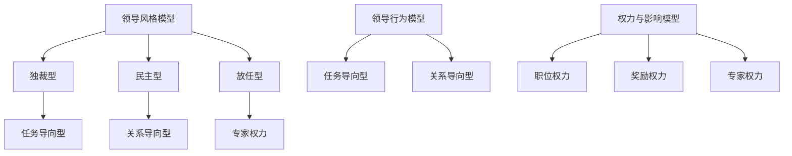

**图1-2：不同领导力模型之间的关系**

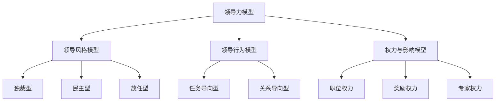

#### 第2章：领导力的核心要素

**2.1 个人素质**

领导者的个人素质是领导力的基础。以下是一些关键的领导素质：

- **品格与特质**：诚实、正直、自律等品格特质是领导者必备的素质。
- **能力与技能**：沟通能力、决策能力、问题解决能力等是领导者必须具备的能力。
- **情绪智力**：领导者需要具备高情商，能够理解和管理自己的情绪，以及有效地处理他人的情绪。

**2.2 领导行为**

领导行为是指领导者实际表现出的行为模式。以下是一些关键领导行为：

- **任务行为**：关注目标实现，分配任务，监控进度等。
- **关系行为**：建立和维护良好的人际关系，关心员工，鼓励团队合作。

**2.3 领导力的核心价值观**

领导力的核心价值观是领导者行为的指导原则。以下是一些核心价值：

- **社会责任与伦理**：领导者应具备高度的社会责任感，遵守道德规范，做出公正的决策。
- **激励与支持**：领导者应激励员工，提供必要的支持，帮助员工实现个人和职业目标。
- **团队合作与沟通**：领导者应促进团队合作，建立良好的沟通机制，确保信息流畅。

**图2-1：领导力的核心价值观**

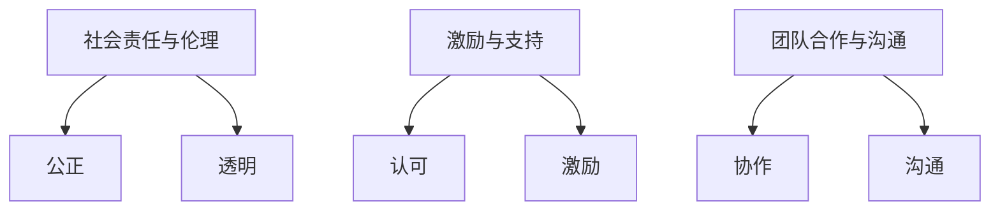

#### 第3章：领导力的发展与提升

**3.1 领导力发展模型**

领导力发展是一个持续的过程，可以通过以下模型来理解：

- **经验学习模型**：通过经验积累和反思，提升领导能力。
- **行为科学模型**：通过科学研究，识别有效的领导行为和策略。
- **个性化发展模型**：根据个人的特点和需求，制定个性化的领导力发展计划。

**3.2 领导力培训与培养**

有效的领导力培训与培养是提升领导者能力的关键。以下是一些常见的培训与培养方法：

- **领导力培训课程**：提供系统的领导知识和技能培训。
- **导师制度**：通过导师的指导，帮助领导者提升领导能力。
- **实践锻炼**：通过实际工作，积累领导经验。

**3.3 领导力评估与反馈**

领导力评估是衡量领导者能力的重要手段。以下是一些常见的评估方法：

- **360度评估**：通过多角度的反馈，评估领导者的表现。
- **行为事件访谈**：通过具体事件，评估领导者的行为和能力。
- **反馈与改进**：根据评估结果，制定改进计划，持续提升领导能力。

---

### 第二部分：冲突解决策略与方法

#### 第4章：冲突的本质与类型

**4.1 冲突的基本概念**

冲突是指个体或团体之间因为利益、目标、价值观等方面的差异而产生的对立和争斗。冲突的构成要素包括：

- **对抗性**：冲突双方存在对立和竞争关系。
- **主观性**：冲突是基于个体或团体的主观感受和认知。
- **互动性**：冲突双方通过语言、行为等方式进行互动和交流。

**4.2 冲突的类型**

冲突可以根据不同的标准进行分类，以下是几种常见的冲突类型：

- **功能性冲突与非功能性冲突**：功能性冲突是指有益于组织目标的冲突，如团队内部的讨论和辩论。非功能性冲突是指对组织目标没有直接贡献的冲突，如个人恩怨和情绪问题。
- **健康冲突与破坏性冲突**：健康冲突是指有益于团队和组织的冲突，如对工作流程的改进和创新。破坏性冲突是指对团队和组织有负面影响的冲突，如内斗和恶性竞争。
- **内部冲突与外部冲突**：内部冲突是指组织内部个体或团体之间的冲突，如员工之间的矛盾和部门之间的竞争。外部冲突是指组织与外部环境之间的冲突，如市场竞争和客户投诉。

**图4-1：冲突的类型与特征**

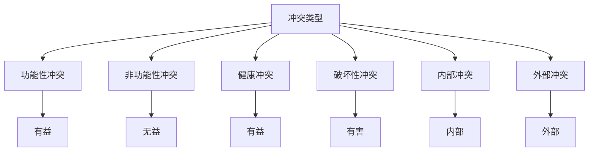

#### 第5章：冲突的根源与原因

**5.1 冲突的根源**

冲突的根源可以从以下几个方面进行分析：

- **目标不一致**：组织内部或个体之间的目标差异会导致冲突。例如，部门之间的目标可能存在冲突，员工个人目标与组织目标也可能不一致。
- **沟通不畅**：沟通是解决冲突的重要手段，但沟通不畅会导致误解和矛盾。例如，信息传递错误、沟通渠道不畅等都可能导致冲突。
- **权力争夺**：权力是冲突的一个重要根源。在组织内部，权力分配不均或权力争夺可能会导致冲突。
- **文化差异**：不同文化背景的个体在价值观、行为规范等方面可能存在差异，这可能导致冲突。例如，跨文化团队中的文化冲突就是一种常见的冲突类型。
- **资源分配不均**：资源的有限性和分配的不公平性可能导致个体或团体之间的冲突。例如，薪酬、晋升机会等资源的分配不公都可能引发冲突。

**图5-1：冲突根源分析图**

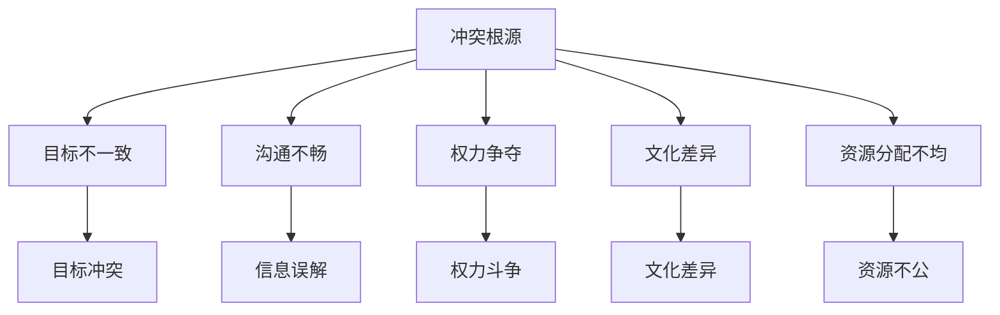

**5.2 冲突的原因**

冲突的原因可以从以下几个方面进行分析：

- **组织结构的缺陷**：不合理的组织结构可能导致部门职责不清、权力分散，从而引发冲突。
- **个人价值观的差异**：个体之间的价值观差异可能导致对同一问题的不同看法和决策，进而引发冲突。
- **资源分配不均**：资源的有限性和分配的不公平性可能导致个体或团体之间的冲突。
- **组织文化的制约**：组织文化对员工的行为和态度有重要影响，不良的文化氛围可能导致冲突的产生。

**图5-2：冲突原因分析图**

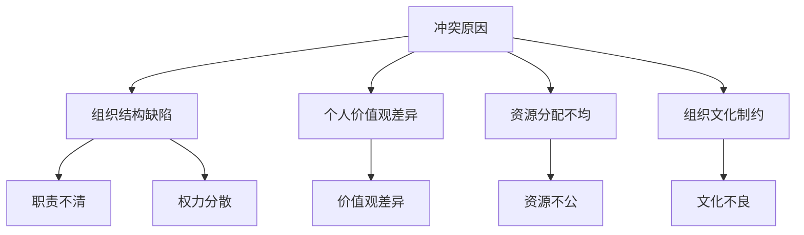

#### 第6章：冲突解决的策略与方法

**6.1 冲突解决的步骤**

解决冲突是一个系统性的过程，以下是一个典型的冲突解决步骤：

1. **确定冲突的性质**：了解冲突的原因和性质，判断是功能性冲突还是破坏性冲突。
2. **收集相关信息**：收集与冲突相关的信息，包括双方的观点、历史记录、背景信息等。
3. **制定解决方案**：根据冲突的性质和相关信息，制定合适的解决方案。
4. **实施与监控**：实施解决方案，并对实施过程进行监控，确保冲突得到有效解决。

**6.2 冲突解决的方法**

冲突解决的方法多种多样，根据冲突的性质和情境，可以选择不同的解决方法。以下是几种常见的冲突解决方法：

- **合作方法**：通过对话和沟通，寻求双方都能接受的解决方案。这种方法适用于功能性冲突。
  - **对话与沟通**：通过开放的对话，了解双方的观点和需求，寻求共识。
  - **调解与仲裁**：由第三方进行调解或仲裁，帮助双方达成协议。

- **竞争方法**：通过让步或回避，实现单方面的解决方案。这种方法适用于破坏性冲突。
  - **让步**：为了达成协议，单方面做出让步。
  - **回避**：避免直接冲突，通过转移话题或暂时搁置争议来缓解冲突。

- **融合方法**：通过妥协或整合，实现双方的利益。这种方法适用于内部冲突。
  - **整合**：将双方的需求和利益整合在一起，寻求双赢的解决方案。
  - **妥协**：双方都做出一定的让步，以达成共识。

- **转移方法**：通过暂缓或放弃，避免冲突。这种方法适用于外部冲突。
  - **暂缓**：将冲突推迟到将来解决，以争取更多的时间和资源。
  - **放弃**：在某些情况下，放弃某些利益以避免冲突。

**图6-1：冲突解决方法流程图**

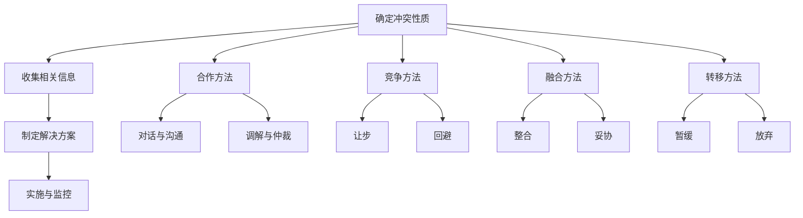

**图6-2：不同冲突解决方法的适用情况**

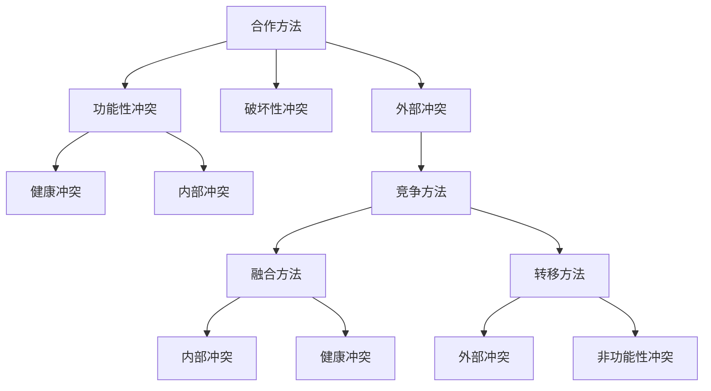

#### 第7章：构建和谐的工作环境

**7.1 和谐工作环境的定义与特点**

和谐工作环境是指一种有利于员工合作、沟通和共同发展的工作氛围。其特点包括：

- **包容性**：尊重个体差异，包容不同的意见和观点。
- **信任感**：建立互信，减少误解和猜疑。
- **开放性**：鼓励开放沟通，促进信息共享和知识传播。
- **协作性**：强调团队合作，共同实现组织目标。

**7.2 建立和谐工作环境的策略**

建立和谐工作环境需要从多个方面进行努力：

- **文化建设**：通过建立共同的价值观和使命，增强员工的归属感和认同感。
- **沟通机制**：建立有效的沟通渠道，确保信息的及时传递和反馈。
- **奖惩制度**：制定公正的奖惩制度，激励员工的积极行为，纠正不良行为。
- **员工关怀**：关心员工的工作和生活，提供必要的支持和帮助。

**图7-1：和谐工作环境构建策略图**

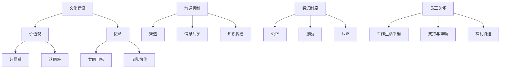

**7.3 和谐工作环境下的冲突管理**

在和谐工作环境中，冲突管理尤为重要。以下是一些冲突管理策略：

- **定期冲突评估**：定期对冲突进行评估，了解冲突的类型和原因，制定针对性的管理策略。
- **增强团队凝聚力**：通过团队建设活动和培训，增强团队成员之间的信任和合作。
- **提高员工满意度**：关注员工的需求和意见，提高员工的工作满意度和幸福感。

**图7-2：和谐工作环境下的冲突管理流程图**

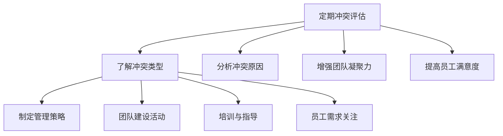

---

### 第三部分：冲突解决技巧与应用

#### 第8章：冲突解决技巧

**8.1 倾听与理解**

倾听是解决冲突的关键技巧之一。以下是一些倾听的技巧：

- **全神贯注**：在倾听时，保持专注，避免分心。
- **开放心态**：保持开放的心态，不要急于判断或反驳。
- **反馈与确认**：通过提问和反馈，确认自己对对方观点的理解。

**8.2 沟通与表达**

有效的沟通是解决冲突的重要手段。以下是一些沟通的技巧：

- **正面沟通**：使用积极的语言，避免使用攻击性或负面语言。
- **消极沟通的应对**：面对消极的沟通，学会倾听和理解，并寻找解决问题的方法。
- **非言语沟通的应用**：注意非言语沟通的细节，如肢体语言、面部表情等，这些都会影响沟通的效果。

**8.3 调解与协商**

调解与协商是解决冲突的有效方法。以下是一些调解与协商的技巧：

- **调解的步骤**：包括建立信任、了解双方观点、寻找共同点、提出解决方案等。
- **协商的策略**：包括谈判技巧、妥协艺术、寻找双赢方案等。
- **调解中的常见问题及解决**：包括情绪管理、信息不对称、利益冲突等问题，并介绍相应的解决方法。

**8.4 应对冲突的心理学技巧**

心理学技巧在冲突解决中起着重要作用。以下是一些应对冲突的心理学技巧：

- **情绪管理**：学会管理自己的情绪，避免情绪失控影响决策。
- **焦点解决**：将注意力集中在解决问题上，而不是争论对错。
- **冲突的应对策略**：根据不同类型的冲突，选择合适的应对策略，如回避、对抗、妥协、合作等。

**图8-1：冲突解决心理学技巧流程图**

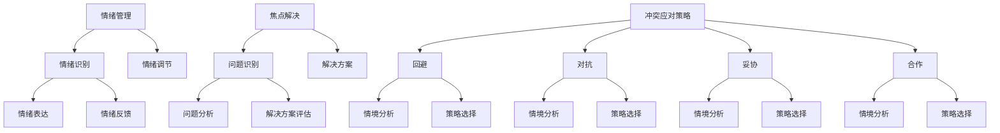

#### 第9章：冲突解决案例解析

**9.1 案例背景**

某科技公司由于市场压力，决定进行组织结构调整，以提高运营效率。然而，这一决定引发了部门之间的矛盾和冲突。特别是研发部和市场部，由于职责重叠和资源分配问题，产生了严重的冲突。

**9.2 案例分析**

1. **确定冲突的性质**：这是一个功能性冲突，涉及到组织目标和部门职责。
2. **收集相关信息**：通过调查问卷和面对面访谈，了解双方的诉求和意见。
3. **制定解决方案**：通过合作方法，制定一个双赢的解决方案，包括调整部门职责、优化资源分配，并设立跨部门沟通机制。
4. **实施与监控**：实施解决方案，并定期评估实施效果，确保冲突得到有效解决。

**9.3 案例启示**

- **冲突解决的要点总结**：在冲突解决过程中，要重视双方的需求和意见，采取合作方法，寻求双赢的解决方案。
- **经验与教训**：通过案例解析，我们可以得出一些经验教训，如加强沟通、明确职责、优化资源分配等。

**图9-1：冲突解决案例分析图**

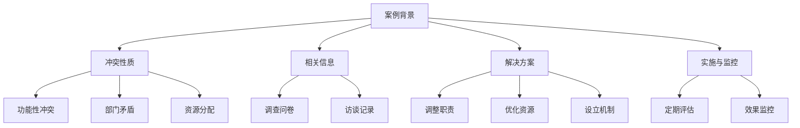

---

### 第四部分：领导力与冲突解决的实践应用

#### 第10章：领导力在冲突解决中的应用

**10.1 领导者在冲突解决中的角色**

领导者在冲突解决中扮演着多重角色：

- **冲突解决者**：领导者需要主动介入冲突，帮助双方找到解决问题的方法。
- **冲突管理者**：领导者需要制定冲突管理的策略，确保冲突不会对组织造成负面影响。
- **冲突协调者**：领导者需要协调不同部门或个体之间的利益，寻求共识和解决方案。

**10.2 领导力与冲突解决的结合**

领导力与冲突解决是相辅相成的。有效的领导力可以帮助领导者更好地解决冲突：

- **领导力在冲突解决中的体现**：领导者的沟通能力、决策能力、情绪智力等都在冲突解决中发挥着重要作用。
- **冲突解决对领导力的影响**：通过解决冲突，领导者可以提高团队协作能力，增强组织凝聚力，提升领导力水平。
- **领导力在冲突解决中的实践应用**：领导者可以通过有效的沟通、冲突管理和协商技巧，解决组织中的冲突。

**10.3 领导力提升与冲突解决的相互促进**

领导力提升和冲突解决是相互促进的。以下是一些相互促进的方面：

- **领导力提升对冲突解决的影响**：领导力的提升可以帮助领导者更好地识别和处理冲突，采取更有效的解决策略。
- **冲突解决对领导力提升的促进作用**：通过解决冲突，领导者可以积累经验，提高领导能力，为未来的领导工作打下坚实基础。

**图10-1：领导力提升与冲突解决的相互促进关系**

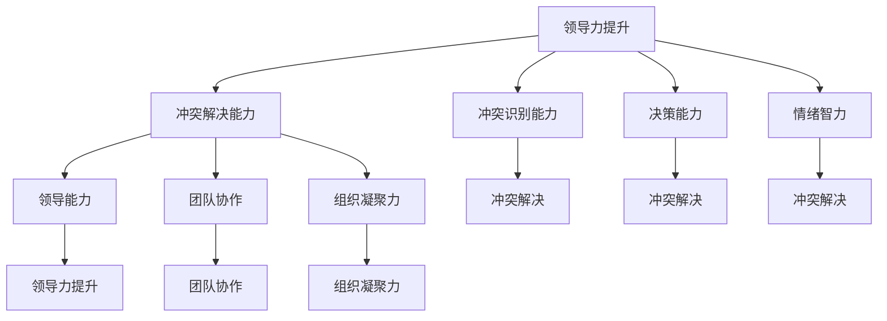

#### 第11章：冲突解决在企业组织中的应用

**11.1 企业组织冲突的特点**

企业组织冲突具有以下特点：

- **多样性**：企业组织冲突涉及多个方面，如利益冲突、文化冲突、沟通冲突等。
- **复杂性**：企业组织冲突往往涉及多个利益相关方，解决起来较为复杂。
- **高频性**：随着市场竞争的加剧，企业组织冲突的发生频率不断提高。

**11.2 冲突解决在企业组织中的应用策略**

解决企业组织冲突需要采取以下策略：

- **企业文化的影响**：建立积极向上的企业文化，促进团队协作，减少冲突。
- **管理层的作用**：管理层需要重视冲突管理，采取有效的冲突解决措施。
- **人力资源管理策略**：通过招聘、培训、激励等手段，提升员工的协作能力和沟通能力，减少冲突。

**11.3 冲突解决的案例分析**

**案例背景**：某大型跨国公司由于全球业务扩张，引发了部门之间的冲突。特别是欧洲区和北美区，由于文化差异和利益冲突，产生了严重的冲突。

**案例分析**：

1. **确定冲突的性质**：这是一个文化冲突和利益冲突。
2. **收集相关信息**：通过跨部门会议和问卷调查，了解双方的诉求和意见。
3. **制定解决方案**：通过融合方法，制定一个双赢的解决方案，包括调整部门职责、优化资源分配，并设立跨文化培训机制。
4. **实施与监控**：实施解决方案，并定期评估实施效果，确保冲突得到有效解决。

**11.4 冲突解决在企业组织中的实际应用效果**

冲突解决在企业组织中的实际应用效果体现在以下几个方面：

- **提高企业绩效**：通过解决冲突，提高团队协作效率，降低内部消耗，提高整体绩效。
- **加强团队合作**：通过有效的冲突解决，增强团队凝聚力，提高员工的工作满意度和忠诚度。
- **提升企业竞争力**：通过解决冲突，减少内部矛盾，提高企业的整体竞争力。

---

### 附录

#### 附录A：冲突解决工具与资源

**冲突解决工具介绍**

- **SWOT分析**：用于分析冲突的根源和影响因素。
- **鱼骨图**：用于分析冲突的原因和解决方案。
- **SMART目标设定**：用于设定具体的冲突解决目标。

**冲突解决资源推荐**

- **书籍推荐**：如《冲突管理：从冲突中创造价值》（Conflict Management: From Conflict to Value）等。
- **学术论文推荐**：如《组织冲突的类型与解决策略》（Types and Resolution Strategies of Organizational Conflict）等。
- **在线课程推荐**：如Coursera上的《冲突解决》（Conflict Resolution）等。

**冲突解决案例分析**

- **企业案例介绍**：如某科技公司通过SWOT分析和鱼骨图解决部门冲突的案例。
- **政府机构案例介绍**：如某市政府通过SMART目标设定解决社区纠纷的案例。
- **国际组织案例介绍**：如联合国通过多边谈判解决国际冲突的案例。

#### 附录B：领导力与冲突解决实践指南

**实践指南概述**

- **内容与目标**：提供领导力与冲突解决的实践方法和技巧。
- **适用范围**：适用于企业、政府机构、非营利组织等各类组织。

**实践指南的具体步骤**

- **领导力提升的具体步骤**：如如何制定个人发展计划、如何进行有效的沟通与表达等。
- **冲突解决的具体步骤**：如如何识别冲突、如何制定解决方案、如何实施与监控等。

**实践指南的应用案例**

- **领导力提升的应用案例**：如某企业通过领导力培训提升团队领导力的案例。
- **冲突解决的应用案例**：如某市政府通过有效的冲突解决机制解决社区纠纷的案例。

**实践指南的评价与反馈**

- **评估方法**：如定期评估、360度评估等。
- **改进建议**：根据评估结果，提出改进建议，持续优化领导力和冲突解决实践。

---

### 总结与展望

本文通过对领导力与冲突解决的理论基础、策略与方法、实践应用进行系统分析，为读者提供了一套完整的冲突解决框架。领导力与冲突解决是现代组织中不可或缺的技能，有效的领导力和冲突解决能力不仅有助于提高组织的运行效率，还能促进团队的协作与发展。

在未来的研究和实践中，我们可以进一步探讨以下方向：

1. **领导力与冲突解决在不同文化背景下的应用**：不同文化背景下的冲突解决策略和方法可能有所不同，需要进一步深入研究。
2. **领导力与冲突解决的技术工具开发**：利用现代信息技术，开发更有效的冲突解决工具和系统。
3. **领导力与冲突解决的持续改进**：通过持续评估和反馈，不断优化领导力和冲突解决实践。

通过不断探索和创新，我们有望进一步提升领导力和冲突解决能力，为组织的长远发展奠定坚实基础。

---

**作者：** AI天才研究院 / AI Genius Institute & 禅与计算机程序设计艺术 / Zen And The Art of Computer Programming

---

## 附录A：冲突解决工具与资源

在解决冲突的过程中，使用适当的工具和资源可以显著提高效率和效果。以下是一些常用的冲突解决工具和推荐资源，以及具体的案例分析。

### 冲突解决工具介绍

**SWOT分析**：SWOT分析是一种用于评估冲突因素的工具，它通过分析冲突的优势（Strengths）、劣势（Weaknesses）、机会（Opportunities）和威胁（Threats），帮助识别冲突的关键因素和潜在解决方案。

**鱼骨图**：鱼骨图（Ishikawa图）是一种用于分析问题原因和解决方案的工具。它通过将问题分解为不同的分支，帮助团队识别冲突的根本原因，并制定相应的解决方案。

**SMART目标设定**：SMART目标（具体、可衡量、可达成、相关、时间限制）是一种用于设定冲突解决目标的方法。它帮助确保目标设定明确、可实现，并且与组织的目标一致。

### 冲突解决资源推荐

**书籍推荐**：

- **《冲突管理：从冲突中创造价值》**（Conflict Management: From Conflict to Value） by Robert J. Thomas
- **《领导力的五个层次》**（The Five Levels of Leadership） by John C. Maxwell
- **《谈判力》**（Getting to Yes: Negotiating Agreement Without Giving In） by Roger Fisher and William Ury

**学术论文推荐**：

- **《组织冲突的类型与解决策略》**（Types and Resolution Strategies of Organizational Conflict） by Jane H. Galbraith and Linda Babcock
- **《跨文化冲突管理》**（Cross-Cultural Conflict Management） by Geert Hofstede

**在线课程推荐**：

- **Coursera上的《冲突解决》**（Conflict Resolution）课程，由乔治城大学提供。
- **edX上的《领导力与团队合作》**（Leadership and Teamwork）课程，由哈佛大学提供。

### 冲突解决案例分析

**企业案例介绍**：

某科技公司在新产品的研发过程中，研发部门和市场部门因目标不一致产生了冲突。通过SWOT分析和鱼骨图，团队识别出冲突的根本原因，并制定了具体的解决方案，包括重新设定项目目标、建立跨部门沟通机制等。经过几个月的努力，冲突得到了有效解决，产品顺利推出市场，取得了良好的市场反响。

**政府机构案例介绍**：

某市政府在社区管理中，因不同居民之间的利益冲突和沟通不畅，导致社区纠纷频繁。市政府通过开展社区调解员培训，建立居民沟通机制，以及实施SMART目标设定，逐步解决了社区纠纷，提升了社区和谐度。

**国际组织案例介绍**：

联合国在处理国际冲突时，通过多边谈判和外交手段，成功解决了多个地区的冲突。例如，在叙利亚和平谈判中，联合国通过持续的外交努力，促进了不同政治派别之间的对话和妥协，为和平解决冲突奠定了基础。

### 实践指南的具体步骤

**领导力提升的具体步骤**：

1. **自我评估**：识别自己的优势和劣势，了解自己的领导风格和需求。
2. **制定发展计划**：根据自我评估结果，制定个人发展计划，包括学习目标、行动步骤和时间表。
3. **学习与实践**：通过阅读书籍、参加培训课程、参与实践项目等，提升领导能力。
4. **定期评估与反馈**：定期评估领导力发展情况，获取反馈，不断调整和优化发展计划。

**冲突解决的具体步骤**：

1. **识别冲突**：及时发现和识别组织中的冲突，了解冲突的类型和原因。
2. **评估冲突**：对冲突进行评估，确定冲突的影响范围和严重程度。
3. **制定解决方案**：根据冲突的性质和情境，制定具体的解决方案。
4. **实施与监控**：实施解决方案，并对实施过程进行监控，确保冲突得到有效解决。
5. **反馈与改进**：收集反馈，评估解决方案的效果，不断优化冲突解决策略。

### 实践指南的应用案例

**领导力提升的应用案例**：

某公司通过实施领导力提升计划，对管理层进行了系统培训。通过定期的评估和反馈，公司领导层的沟通能力和决策能力得到了显著提升，员工的工作满意度和团队凝聚力也明显增强。

**冲突解决的应用案例**：

某市政府在处理社区纠纷时，通过建立居民沟通机制和实施SMART目标设定，成功解决了多起社区冲突。居民之间的信任感和社区和谐度得到了提升，市政府的公信力也得到了增强。

### 实践指南的评价与反馈

**评估方法**：

1. **定期评估**：定期对领导力和冲突解决效果进行评估，识别改进点。
2. **360度评估**：通过多方反馈，全面了解领导力和冲突解决能力的现状。
3. **关键绩效指标（KPI）**：使用关键绩效指标，评估领导力和冲突解决效果的具体表现。

**改进建议**：

1. **持续学习与培训**：鼓励领导者和员工持续学习和参加培训，不断提升领导力和冲突解决能力。
2. **建立反馈机制**：建立有效的反馈机制，确保员工和领导者的意见和建议得到重视和回应。
3. **优化实践方法**：根据评估结果和反馈，不断优化领导力和冲突解决的实践方法，提高效果。

通过以上实践指南，组织可以系统性地提升领导力和冲突解决能力，为组织的长远发展奠定坚实基础。同时，持续的评价与反馈机制也有助于不断改进实践，确保组织能够应对各种挑战，实现持续发展。

---

### 总结

本文从领导力的理论基础与框架、冲突解决策略与方法、冲突解决技巧与应用、领导力与冲突解决的实践应用等多个方面，系统地探讨了领导力与冲突解决的核心内容。通过详细的分析和实际案例的解析，我们了解了领导力在冲突解决中的关键作用，以及如何有效地应用冲突解决技巧，构建和谐的工作环境。

领导力不仅是领导者个人素质和能力的体现，更是组织运行和发展的核心驱动力。有效的领导力能够激发团队的潜力，提升组织的绩效，促进组织的创新与发展。而冲突解决则是领导力的重要组成部分，它关乎组织的稳定和员工的满意度，直接影响到组织的整体效能。

在当今快速变化和竞争激烈的环境中，领导力和冲突解决能力的重要性愈发凸显。领导者不仅需要具备深厚的理论知识和实践经验，还需要具备敏锐的洞察力和灵活应变的能力，以应对不断变化的外部环境和内部挑战。

展望未来，领导力和冲突解决领域将继续发展和深化。随着科技的发展和全球化进程的加快，领导者需要具备跨文化沟通能力、创新能力、以及处理复杂问题的能力。同时，冲突解决的方法和技巧也将不断创新，借助人工智能、大数据等新兴技术，将更加智能化、精准化。

本文旨在为读者提供一套实用的领导力和冲突解决指南，帮助领导者更好地应对组织中的挑战，提升领导力和团队效能。通过系统的学习和实践，领导者可以不断提升自身的领导力和冲突解决能力，为组织的长远发展奠定坚实基础。

我们相信，随着领导力和冲突解决能力的提升，组织将能够更好地应对外部环境的变化，实现持续的创新和发展。未来，我们将继续关注领导力和冲突解决领域的最新动态，分享更多的实践经验和研究成果，为领导者提供更有价值的参考和指导。

---

## 附录B：领导力与冲突解决实践指南

### 概述

本附录旨在为领导者和管理者提供一套全面的实践指南，以帮助他们在实际工作中应用领导力和冲突解决技巧。本指南包括领导力提升和冲突解决的具体步骤、应用案例以及评估与反馈方法，旨在帮助读者将理论知识转化为实际行动，提升组织的整体效能。

### 领导力提升的具体步骤

**步骤1：自我评估**

领导者需要首先进行自我评估，识别自身的优势和劣势。以下是一些关键问题，可以帮助领导者进行自我评估：

- 我的领导风格是什么？它如何影响团队和组织的运作？
- 我的沟通能力如何？是否能够清晰、有效地传达信息和意图？
- 我的决策能力如何？在面对复杂问题时，能否做出明智的决策？
- 我的情绪智力如何？是否能够有效地管理自己和团队的情绪？

**步骤2：制定个人发展计划**

根据自我评估的结果，领导者需要制定个人发展计划。这个计划应该包括以下内容：

- **学习目标**：确定具体的领导力提升目标，例如提高沟通技巧、增强决策能力等。
- **行动步骤**：列出实现这些目标的具体行动步骤，例如参加培训课程、阅读相关书籍等。
- **时间表**：为每个行动步骤设定具体的时间表，确保计划能够按时完成。

**步骤3：学习与实践**

领导者需要通过多种途径提升自己的领导能力，包括：

- **阅读**：阅读有关领导力和管理的书籍和论文，了解最新的理论和实践。
- **培训**：参加领导力培训课程，学习具体的领导技巧和策略。
- **实践**：将学到的知识和技巧应用到实际工作中，通过实践不断提升领导能力。

**步骤4：定期评估与反馈**

领导者需要定期评估自己的领导力提升情况，并根据反馈不断调整和优化发展计划。以下是一些评估方法：

- **自我评估**：定期回顾自己的领导行为，评估自己的进步和不足。
- **360度评估**：邀请团队成员、上级和下属对领导者的表现进行评估，获取全面的反馈。
- **关键绩效指标（KPI）**：使用关键绩效指标，评估领导力提升的具体表现，例如团队的绩效、员工满意度等。

### 冲突解决的具体步骤

**步骤1：识别冲突**

领导者需要能够及时识别组织中的冲突，包括：

- **观察和倾听**：通过观察团队成员的行为和倾听他们的意见，识别潜在的冲突。
- **定期沟通**：定期与团队成员进行沟通，了解他们的感受和想法，及时发现冲突的苗头。

**步骤2：评估冲突**

对识别出的冲突进行评估，确定冲突的类型、原因和影响范围。以下是一些关键问题：

- **冲突的类型**：是功能性冲突还是破坏性冲突？
- **冲突的原因**：是由于目标不一致、沟通不畅还是资源分配不均？
- **冲突的影响**：对组织、团队和个人产生的影响程度如何？

**步骤3：制定解决方案**

根据冲突的性质和评估结果，制定具体的解决方案。以下是一些常见的解决方案：

- **合作方法**：通过对话和沟通，寻求双方都能接受的解决方案。
- **竞争方法**：通过让步或回避，实现单方面的解决方案。
- **融合方法**：通过妥协或整合，实现双方的利益。
- **转移方法**：通过暂缓或放弃，避免冲突。

**步骤4：实施与监控**

实施解决方案，并对实施过程进行监控，确保冲突得到有效解决。以下是一些关键点：

- **沟通与协调**：确保解决方案的顺利实施，需要领导者与团队成员保持良好的沟通和协调。
- **定期评估**：定期评估解决方案的效果，根据反馈进行调整和优化。
- **反馈与改进**：根据评估结果，收集反馈，不断改进冲突解决策略。

### 应用案例

以下是一些实际应用案例，展示了领导力提升和冲突解决在实践中的具体应用。

**案例1：领导力提升**

某公司通过实施领导力提升计划，对管理层进行了系统培训。通过定期的评估和反馈，公司领导层的沟通能力和决策能力得到了显著提升，员工的工作满意度和团队凝聚力也明显增强。

**案例2：冲突解决**

某市政府在处理社区纠纷时，通过建立居民沟通机制和实施SMART目标设定，成功解决了多起社区冲突。居民之间的信任感和社区和谐度得到了提升，市政府的公信力也得到了增强。

### 评估与反馈

**评估方法**

- **定期评估**：领导者需要定期评估自己的领导力和冲突解决能力，了解自己的进步和不足。
- **360度评估**：通过邀请团队成员、上级和下属进行评估，获取全面的反馈。
- **关键绩效指标（KPI）**：使用关键绩效指标，评估领导力提升和冲突解决的具体表现，例如团队的绩效、员工满意度等。

**改进建议**

- **持续学习与培训**：领导者需要持续学习和参加培训，不断提升领导力和冲突解决能力。
- **建立反馈机制**：建立有效的反馈机制，确保员工的意见和建议得到重视和回应。
- **优化实践方法**：根据评估结果和反馈，不断优化领导力和冲突解决的实践方法，提高效果。

通过本附录的实践指南，领导者可以系统地提升自身的领导力和冲突解决能力，为组织的长远发展奠定坚实基础。同时，持续的评价与反馈机制也有助于不断改进实践，确保组织能够应对各种挑战，实现持续发展。

