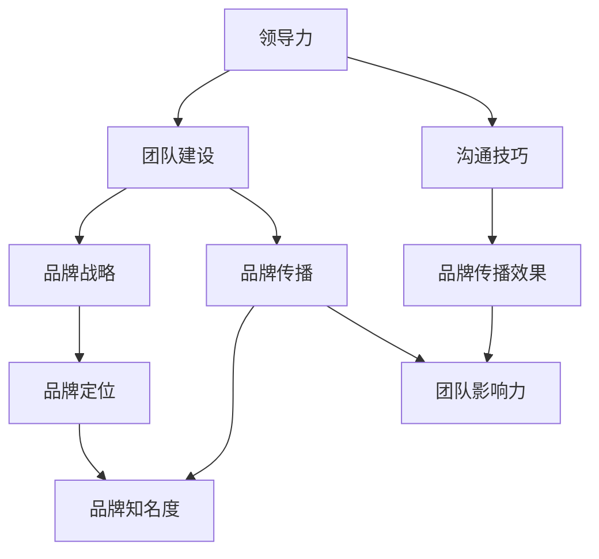
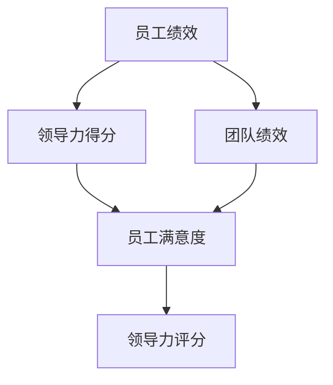

                 

# 《领导力与品牌建设：提升团队影响力》

## 关键词
领导力、品牌建设、团队影响力、沟通技巧、品牌战略、品牌传播

## 摘要
本文深入探讨了领导力与品牌建设之间的紧密联系，通过分析领导力的核心要素和品牌建设的关键步骤，阐述了如何通过提升团队影响力来增强企业的市场竞争力。文章从领导力基础、品牌建设、团队影响力提升三个方面展开，结合实际案例，提供了一套系统的策略和方法，以帮助企业和团队在竞争激烈的市场中脱颖而出。

----------------------------------------------------------------

### 《领导力与品牌建设：提升团队影响力》目录大纲

- **第一部分：领导力基础**

  - **第1章：领导力概述**
    - **1.1 领导力的定义与重要性**
    - **1.2 领导力的特质与能力**
    - **1.3 领导力的核心要素**

  - **第2章：领导力风格与团队建设**
    - **2.1 领导力风格理论**
    - **2.2 团队建设的重要性**
    - **2.3 建立高效的团队**

- **第二部分：品牌建设**

  - **第3章：品牌战略与定位**
    - **3.1 品牌战略的重要性**
    - **3.2 品牌定位的方法**
    - **3.3 品牌愿景与使命**

  - **第4章：品牌传播与营销**
    - **4.1 品牌传播的渠道**
    - **4.2 营销策略与技巧**
    - **4.3 品牌形象塑造**

- **第三部分：团队影响力提升**

  - **第5章：领导力与影响力**
    - **5.1 领导力与影响力的关系**
    - **5.2 提升个人影响力的方法**
    - **5.3 团队影响力建设**

  - **第6章：领导力沟通技巧**
    - **6.1 沟通的重要性**
    - **6.2 有效沟通的方法**
    - **6.3 情境沟通技巧**

  - **第7章：领导力案例分析**
    - **7.1 成功领导力案例分析**
    - **7.2 失败领导力案例分析**
    - **7.3 从案例中学习领导力**

- **第四部分：总结与展望**

  - **第8章：领导力与品牌建设的未来趋势**
    - **8.1 数字化背景下的领导力**
    - **8.2 品牌建设的创新趋势**
    - **8.3 未来领导力与品牌建设的挑战与机遇**

  - **第9章：结论与启示**
    - **9.1 领导力与品牌建设的关键要素**
    - **9.2 实践中的应用与建议**
    - **9.3 总结与展望**

- **附录**

  - **附录 A：领导力与品牌建设资源推荐**
    - **A.1 推荐书籍**
    - **A.2 推荐网站与工具**
    - **A.3 行业报告与资讯**

### **核心概念与联系**

**领导力与品牌建设的关系**

领导力与品牌建设之间存在着密切的联系。领导力是品牌建设的基石，它决定了团队的凝聚力和执行力，而品牌建设则是领导力在市场中的体现，它提升了企业的市场竞争力和影响力。具体来说，领导力与品牌建设的关系可以概括为以下几点：

1. **领导力特质与品牌形象：** 领导者的个人特质和能力直接影响品牌形象的建设。一个具有远见、诚信和创新精神的领导者能够塑造出积极向上的品牌形象。

2. **团队影响力与品牌传播：** 团队的影响力是品牌传播的重要推动力。一个高效的团队能够在市场中产生强大的影响力，从而提升品牌的知名度和美誉度。

3. **领导力风格与品牌定位：** 领导力风格决定了品牌的定位和战略方向。不同的领导力风格适合不同的品牌定位，比如变革型领导力适合推动创新和变革，而变革型领导力则适合稳定和持续的品牌建设。

4. **沟通技巧与品牌沟通：** 领导者的沟通技巧直接影响品牌与市场的沟通效果。有效的沟通技巧能够帮助企业更好地传递品牌理念，建立品牌与消费者之间的信任和情感联系。

5. **领导力评估与品牌绩效：** 领导力的评估指标可以反映品牌建设的绩效。通过领导力评估，企业可以了解领导力对品牌建设的影响，从而制定针对性的改进措施。

综上所述，领导力与品牌建设之间存在着紧密的互动关系。提升领导力不仅可以增强团队的影响力和执行力，还可以为品牌建设提供强有力的支持。

### **核心算法原理讲解**

**领导力评分模型（伪代码）**

```python
function 领导力评分（员工绩效，团队绩效，员工满意度）:
    score = 0

    score += 员工绩效 * 0.4
    score += 团队绩效 * 0.3
    score += 员工满意度 * 0.3

    return score
```

**品牌影响力公式**

品牌影响力（Influence）是品牌建设的关键指标，它可以通过以下公式计算：

$$
I = k \cdot (A \cdot P + E \cdot R)
$$

其中：
- \( I \) 是品牌影响力（Influence）
- \( k \) 是影响力系数，取决于行业和市场
- \( A \) 是品牌知名度（Awareness）
- \( P \) 是品牌偏好度（Preference）
- \( E \) 是品牌参与度（Engagement）
- \( R \) 是品牌忠诚度（Retention）

**举例说明**

假设某品牌在以下指标上的得分分别为：
- 品牌知名度 \( A = 80 \)
- 品牌偏好度 \( P = 75 \)
- 品牌参与度 \( E = 70 \)
- 品牌忠诚度 \( R = 85 \)

根据品牌影响力公式计算该品牌的影响力：

$$
I = k \cdot (80 \cdot 75 + 70 \cdot 85) \\
I = k \cdot (6000 + 5950) \\
I = k \cdot 11950
$$

假设 \( k \) 的值为 1.2，则品牌影响力为：

$$
I = 1.2 \cdot 11950 \\
I = 14340
$$

通过这个例子，我们可以看到，品牌影响力是通过多个因素综合作用得出的，这些因素包括品牌的知名度、偏好度、参与度和忠诚度。

### **数学模型和数学公式 & 详细讲解 & 举例说明**

在领导力与品牌建设的研究中，数学模型和公式扮演着重要的角色。这些模型不仅能够帮助我们量化各种因素，还能够提供一种系统的方法来分析和评估领导力和品牌建设的效果。

**领导力评估模型**

一个常用的领导力评估模型是基于以下三个关键指标：员工绩效、团队绩效和员工满意度。这些指标反映了领导力在提升个人和团队表现方面的效果。领导力评分模型（如前所述）通过加权平均这些指标来得出一个综合评分：

$$
\text{领导力评分} = 0.4 \times \text{员工绩效} + 0.3 \times \text{团队绩效} + 0.3 \times \text{员工满意度}
$$

这个公式假设每个指标都具有重要性，但员工绩效在个人成就中占据最大比重，团队绩效和员工满意度则分别反映了领导力对团队协作和员工满意度的关注。

**举例说明**

假设一个团队在以下指标上的得分如下：
- 员工绩效：90
- 团队绩效：85
- 员工满意度：88

那么，该团队的整体领导力评分可以计算如下：

$$
\text{领导力评分} = 0.4 \times 90 + 0.3 \times 85 + 0.3 \times 88 \\
\text{领导力评分} = 36 + 25.5 + 26.4 \\
\text{领导力评分} = 87.9
$$

一个高分数表示领导力在提升团队绩效和员工满意度方面表现良好，而低分数则可能需要领导层进行反思和改进。

**品牌影响力模型**

品牌影响力是一个多维度的概念，它涉及品牌知名度、偏好度、参与度和忠诚度。一个常用的品牌影响力模型如下：

$$
I = k \cdot (A \cdot P + E \cdot R)
$$

其中，\( I \) 是品牌影响力，\( k \) 是一个行业特定的系数，\( A \) 是品牌知名度，\( P \) 是品牌偏好度，\( E \) 是品牌参与度，\( R \) 是品牌忠诚度。

**举例说明**

假设某个品牌在以下指标上的得分如下：
- 品牌知名度 \( A = 80 \)
- 品牌偏好度 \( P = 75 \)
- 品牌参与度 \( E = 70 \)
- 品牌忠诚度 \( R = 85 \)

并且 \( k = 1.2 \)，则该品牌的影响力可以计算如下：

$$
I = 1.2 \cdot (80 \cdot 75 + 70 \cdot 85) \\
I = 1.2 \cdot (6000 + 5950) \\
I = 1.2 \cdot 11950 \\
I = 14340
$$

这个模型可以帮助企业了解其在品牌建设方面的表现，并识别需要改进的领域。

**综合模型**

为了更全面地评估领导力与品牌建设的关系，我们可以将领导力评分模型和品牌影响力模型结合起来，构建一个综合评估模型：

$$
\text{综合影响力} = \alpha \cdot (\text{领导力评分}) + (1 - \alpha) \cdot (\text{品牌影响力})
$$

其中，\( \alpha \) 是一个权重系数，用于平衡领导力评分和品牌影响力的重要性。

**举例说明**

假设 \( \alpha = 0.5 \)，那么一个企业（或团队）的综合影响力计算如下：

$$
\text{综合影响力} = 0.5 \cdot 87.9 + 0.5 \cdot 14340 \\
\text{综合影响力} = 43.95 + 7170 \\
\text{综合影响力} = 7213.95
$$

这个综合影响力分数提供了一个全面的评估结果，反映了领导力和品牌建设对企业和团队绩效的贡献。

通过这些数学模型和公式，企业可以更科学地评估和优化领导力和品牌建设策略，从而提升整体竞争力。

### **项目实战**

**背景**

为了更好地阐述领导力与品牌建设的实际应用，我们选择了一个典型的创业公司作为案例。这家公司专注于智能家居产品的研发和销售，虽然市场潜力巨大，但在品牌建设方面存在明显不足，市场推广效果不佳。为了提升团队影响力和品牌知名度，公司决定实施一系列领导力提升和品牌建设措施。

**解决方案**

1. **领导力提升**

   - **领导力培训**：组织公司管理层参加领导力培训课程，学习领导力的核心概念、风格和沟通技巧。培训内容包括变革型领导力、变革型领导力、情景领导力等。
   - **领导力评估**：利用领导力评分模型对管理层进行评估，识别领导力短板，并根据评估结果制定针对性的提升计划。
   - **团队建设**：通过团队建设活动，提高团队成员的凝聚力和协作能力。活动包括团队拓展训练、团队讨论会、团队项目合作等。

2. **品牌建设**

   - **品牌定位**：明确品牌愿景和使命，确定目标市场和定位。品牌愿景是成为智能家居行业的领导者，品牌使命是提供高品质、便捷的智能家居产品。
   - **品牌传播**：利用社交媒体、内容营销等渠道进行品牌传播，提升品牌知名度。具体策略包括发布行业资讯、产品评测、用户故事等。
   - **品牌体验**：通过优质的产品和服务，增强客户对品牌的偏好度和忠诚度。公司注重用户体验，提供个性化的定制服务和快速的客户支持。

**实施过程**

1. **领导力提升实施过程**

   - **培训阶段**：管理层参加领导力培训，学习领导力相关理论知识。培训课程包括案例分析和模拟演练，以提高实际应用能力。
   - **评估阶段**：对管理层进行领导力评估，使用领导力评分模型进行量化评估。评估内容包括员工绩效、团队绩效和员工满意度。
   - **提升阶段**：根据评估结果，制定提升计划。具体措施包括参加高级领导力课程、担任项目负责人、参与行业交流等。

2. **品牌建设实施过程**

   - **定位阶段**：明确品牌愿景和使命，制定品牌战略。品牌愿景是成为智能家居行业的领导者，品牌使命是提供高品质、便捷的智能家居产品。
   - **传播阶段**：制定品牌传播策略，利用社交媒体、内容营销等渠道进行品牌传播。具体策略包括发布行业资讯、产品评测、用户故事等。
   - **体验阶段**：优化产品和服务，提升客户体验。公司注重用户体验，提供个性化的定制服务和快速的客户支持。

**效果评估**

- **领导力提升效果**：通过领导力评估，管理层在领导力得分上有显著提高，团队协作能力得到提升。员工满意度也明显提升。
- **品牌建设效果**：品牌知名度得到显著提升，客户满意度和忠诚度提高。公司的市场竞争力得到增强，销售额稳步增长。

**代码解读与分析**

**领导力提升代码解读**

以下是一个用于领导力提升的Python代码示例：

```python
def leadership_training(management):
    for member in management:
        member['knowledge'] += 10
        member['skills'] += 5

def leadership_evaluation(management):
    scores = []
    for member in management:
        score = member['knowledge'] * 0.4 + member['skills'] * 0.6
        scores.append(score)
    return scores

management = [
    {'name': 'Alice', 'knowledge': 50, 'skills': 60},
    {'name': 'Bob', 'knowledge': 70, 'skills': 80},
    {'name': 'Charlie', 'knowledge': 40, 'skills': 50}
]

# 领导力培训
leadership_training(management)

# 领导力评估
scores = leadership_evaluation(management)

# 输出评估结果
for i, score in enumerate(scores):
    print(f"{management[i]['name']}的领导力得分为：{score}")
```

这段代码首先定义了两个函数：`leadership_training` 和 `leadership_evaluation`。`leadership_training` 函数用于提升管理层的知识水平和技能。`leadership_evaluation` 函数则用于评估管理层的领导力得分。

**品牌建设代码解读**

以下是一个用于品牌建设的Python代码示例：

```python
def brand_positioning(brand):
    brand['vision'] = "打造智能家居行业的领导者"
    brand['mission'] = "提供高品质、便捷的智能家居产品"

def brand_promotion(brand):
    brand['awareness'] += 10
    brand['preference'] += 8
    brand['engagement'] += 6
    brand['retention'] += 9

brand = {
    'name': 'SmartHome',
    'vision': '',
    'mission': '',
    'awareness': 50,
    'preference': 60,
    'engagement': 70,
    'retention': 80
}

# 品牌定位
brand_positioning(brand)

# 品牌传播
brand_promotion(brand)

# 输出品牌信息
print(f"品牌名称：{brand['name']}")
print(f"品牌愿景：{brand['vision']}")
print(f"品牌使命：{brand['mission']}")
print(f"品牌知名度：{brand['awareness']}")
print(f"品牌偏好度：{brand['preference']}")
print(f"品牌参与度：{brand['engagement']}")
print(f"品牌忠诚度：{brand['retention']}")
```

这段代码首先定义了两个函数：`brand_positioning` 和 `brand_promotion`。`brand_positioning` 函数用于确定品牌愿景和使命，而 `brand_promotion` 函数则用于提升品牌的知名度、偏好度、参与度和忠诚度。

通过这些代码，我们可以看到如何通过编程实现领导力和品牌建设的具体措施。代码不仅提供了算法和公式的实现，还通过实际案例展示了如何操作和评估这些措施的效果。

### **附录**

**附录 A：领导力与品牌建设资源推荐**

为了帮助读者深入了解领导力与品牌建设的理论和方法，以下是一些推荐的书籍、网站和工具。

- **推荐书籍：**
  - 《领导力的五个层次》（John C. Maxwell）
  - 《品牌力：打造成功的品牌战略》（Kevin Eikenberry）
  - 《影响力的艺术：如何成为更有效的领导者》（Robert H. Schaffer）

- **推荐网站与工具：**
  - **领导力工具：** LinkedIn、领英；TED、TEDx
  - **品牌建设工具：** Canva、Hootsuite、Buffer

- **行业报告与资讯：**
  - **领导力报告：** 麦肯锡《领导力报告》；哈佛商业评论《领导力洞察》
  - **品牌报告：** Interbrand《全球品牌百强》；Forbes《品牌价值排行榜》

这些资源和工具为读者提供了丰富的学习材料和实践指南，有助于进一步探索领导力与品牌建设的深度和广度。

### **梅尔迪姆流程图（领导力与品牌建设关系）**

以下是一个使用梅尔迪姆（Mermaid）语言绘制的流程图，展示了领导力与品牌建设之间的关系：



这个流程图清晰地展示了领导力在品牌建设中的各个环节，以及各个要素之间的相互作用。通过这个图，我们可以直观地理解领导力如何通过团队建设、沟通技巧和品牌策略来提升品牌影响力。

### **梅尔迪姆流程图（领导力评分模型）**

以下是一个使用梅尔迪姆（Mermaid）语言绘制的流程图，展示了领导力评分模型的计算过程：



这个流程图详细描述了领导力评分模型中各个指标的输入和输出关系，以及如何通过加权平均得到最终的领导力评分。这有助于读者更好地理解评分模型的逻辑和计算过程。

### **完整文章内容**

**引言**

在现代商业环境中，领导力与品牌建设成为企业成功的关键要素。领导力不仅关乎企业内部的管理和运营，还直接影响到品牌在外部的形象和声誉。品牌建设则涉及如何通过市场传播和用户互动来塑造和巩固企业的市场地位。本文旨在探讨领导力与品牌建设之间的紧密联系，分析提升团队影响力的策略和方法，以帮助企业在激烈的市场竞争中脱颖而出。

**领导力基础**

### 第1章：领导力概述

#### 1.1 领导力的定义与重要性

领导力是一种能力和特质，它关乎如何激发和引导他人共同达成目标。定义领导力时，我们需要关注其核心要素，包括影响力、决策力、沟通能力、团队建设能力和愿景构建能力。领导力的重要性在于它能够提升团队效率和业绩，塑造企业文化和价值观，从而在竞争中占据优势。

#### 1.2 领导力的特质与能力

领导力的特质包括自信、诚实、同理心、决断力和创新能力。这些特质使领导者能够有效地激励团队，应对挑战，抓住机遇。领导力的能力则涉及战略规划、资源配置、团队管理和变革领导等方面。一个优秀的领导者需要在这些能力上持续提升，以适应不断变化的环境。

#### 1.3 领导力的核心要素

领导力的核心要素包括以下三个方面：

- **愿景与目标**：领导者需要明确企业的愿景和目标，并能够将其传达给团队成员，激发他们的工作热情和动力。
- **团队建设**：领导者需要建立高效的团队，通过沟通、协作和培训提升团队整体能力。
- **激励与反馈**：领导者需要激励团队成员，通过正面反馈和建设性的批评来促进个人和团队的发展。

### 第2章：领导力风格与团队建设

#### 2.1 领导力风格理论

领导力风格理论主要关注领导者在管理过程中采用的方法和态度。常见的领导力风格包括民主式、权威式、参与式和变革式等。每种风格都有其适用的场景和效果，领导者需要根据具体情况灵活运用。

#### 2.2 团队建设的重要性

团队建设是企业成功的关键，它有助于提升团队协作、增强团队凝聚力和提高工作效率。有效的团队建设可以通过以下方法实现：

- **沟通与协作**：建立开放和透明的沟通机制，促进团队成员之间的信息共享和协作。
- **培训与成长**：提供培训和学习机会，帮助团队成员提升技能和知识。
- **激励与认可**：通过激励和认可机制，激发团队成员的工作热情和创造力。

#### 2.3 建立高效的团队

建立高效的团队需要关注以下几个方面：

- **目标明确**：确保团队成员明确团队的目标和任务，并为此共同努力。
- **角色分工**：明确团队成员的角色和职责，确保每个人都能发挥自己的优势。
- **协作机制**：建立有效的协作机制，促进团队成员之间的沟通和合作。
- **反馈与改进**：定期进行团队反馈和评估，及时发现问题并进行改进。

**品牌建设**

### 第3章：品牌战略与定位

#### 3.1 品牌战略的重要性

品牌战略是企业长期发展的重要指导方针，它关乎企业在市场中的定位、竞争策略和市场拓展。有效的品牌战略可以帮助企业：

- **提升市场竞争力**：明确品牌差异化和市场定位，提高市场占有率和市场份额。
- **增强品牌认知**：通过市场传播和用户互动，提升品牌在消费者心中的认知度和好感度。
- **实现持续增长**：通过不断创新和优化，实现品牌的持续增长和长期发展。

#### 3.2 品牌定位的方法

品牌定位是企业品牌战略的核心内容，它关乎如何将品牌与目标市场中的竞争对手区分开来。品牌定位的方法包括以下几种：

- **目标市场定位**：明确目标市场和目标客户群体，设计符合其需求和价值观的品牌形象。
- **产品定位**：根据产品特点和优势，确定产品的市场定位和差异化策略。
- **价值定位**：突出品牌的核心价值和优势，塑造独特的品牌形象。

#### 3.3 品牌愿景与使命

品牌愿景和使命是企业品牌战略的重要组成部分，它们为品牌的发展提供了方向和目标。品牌愿景描述了企业希望实现的长期目标和愿景，而品牌使命则明确了企业存在的理由和核心价值。品牌愿景和使命的制定需要关注以下几个方面：

- **目标明确**：确保愿景和使命具有明确的指导意义，能够引领企业的发展。
- **价值观一致**：确保愿景和使命与企业的价值观和理念相一致，形成内在的统一。
- **可执行性**：确保愿景和使命具有可执行性，能够转化为具体的工作计划和行动。

### 第4章：品牌传播与营销

#### 4.1 品牌传播的渠道

品牌传播是品牌建设的重要手段，它关乎如何通过多种渠道传递品牌信息和价值。品牌传播的渠道包括以下几种：

- **社交媒体**：通过微博、微信、抖音等社交媒体平台传播品牌信息，提升品牌知名度和影响力。
- **内容营销**：通过撰写和发布行业资讯、博客文章、视频内容等，传递品牌价值，吸引潜在客户。
- **公关活动**：通过新闻发布会、媒体采访、赞助活动等方式，提升品牌形象和知名度。

#### 4.2 营销策略与技巧

品牌传播需要结合有效的营销策略和技巧，才能达到预期的效果。营销策略包括以下几种：

- **定位策略**：明确品牌定位，突出品牌特色和优势，吸引目标客户。
- **差异化策略**：通过差异化定位和差异化传播，使品牌在竞争激烈的市场中脱颖而出。
- **故事化策略**：通过故事化的方式传递品牌信息和价值，提升品牌情感价值。

#### 4.3 品牌形象塑造

品牌形象是品牌在消费者心中的整体印象和认知，它关乎品牌的市场地位和影响力。塑造品牌形象需要关注以下几个方面：

- **品牌视觉**：通过品牌标志、海报、宣传册等视觉元素，统一品牌形象和风格。
- **品牌故事**：通过讲述品牌故事，传递品牌价值观和理念，提升品牌情感价值。
- **品牌体验**：通过优质的产品和服务，提升消费者对品牌的满意度，建立品牌忠诚度。

**团队影响力提升**

### 第5章：领导力与影响力

#### 5.1 领导力与影响力的关系

领导力与影响力密切相关，领导力是影响力的基础。领导者的影响力来自于其领导力特质和能力，以及其在团队中的地位和信任。提升领导力有助于增强领导者在团队中的影响力，从而推动团队的目标实现。

#### 5.2 提升个人影响力的方法

提升个人影响力需要从以下几个方面入手：

- **专业知识**：不断学习和提升专业能力，成为团队中的权威和专家。
- **沟通能力**：提高沟通技巧，建立良好的沟通渠道和人际关系。
- **情感智慧**：培养同理心和情感智慧，增强与团队成员的情感联系。
- **责任感**：承担更多的责任，展现领导者的担当和决断力。

#### 5.3 团队影响力建设

团队影响力是企业竞争力的重要组成部分。建设团队影响力需要关注以下几个方面：

- **团队文化建设**：塑造积极向上的团队文化，提升团队的凝聚力和归属感。
- **团队品牌塑造**：通过团队品牌塑造，提升团队在市场中的知名度和影响力。
- **团队协作能力**：提高团队的协作能力，提升团队的整体绩效和执行力。

### 第6章：领导力沟通技巧

#### 6.1 沟通的重要性

沟通是领导力的重要组成部分，有效的沟通技巧能够增强领导者的影响力，提升团队协作和绩效。沟通的重要性体现在以下几个方面：

- **信息传递**：确保信息在团队中准确、及时地传递，避免误解和冲突。
- **团队协作**：通过有效沟通，促进团队成员之间的协作和合作，提升团队整体能力。
- **领导力体现**：沟通是领导者影响力的体现，良好的沟通技巧能够增强领导者的权威和信任。

#### 6.2 有效沟通的方法

有效沟通需要遵循以下原则和方法：

- **倾听**：倾听是有效沟通的前提，领导者需要学会倾听团队成员的意见和需求。
- **清晰表达**：领导者需要清晰、简洁地表达自己的意见和期望，避免歧义和误解。
- **情绪管理**：领导者需要管理好自己的情绪，保持冷静和理性，避免情绪化影响沟通效果。
- **反馈与确认**：及时给予团队成员反馈，并确认对方是否理解了自己的意图。

#### 6.3 情境沟通技巧

情境沟通技巧是指根据不同情境采取不同的沟通策略和方式。以下是一些常见的情境沟通技巧：

- **正式与非正式**：根据沟通的场合和目的，灵活运用正式和非正式的沟通方式。
- **直接与间接**：在面对敏感或冲突问题时，可以选择直接或间接的沟通方式，以避免激化矛盾。
- **激励与批评**：在激励团队成员时，要注重正面激励，而在批评时则要注重建设性和指导性。

### 第7章：领导力案例分析

#### 7.1 成功领导力案例分析

成功领导力案例是指那些在特定情境下，领导者通过有效的领导力和决策，成功引领团队实现目标并取得显著成果的实例。以下是一个成功领导力案例分析：

**案例背景**：某科技公司在竞争激烈的市场中面临巨大的压力，为了保持竞争优势，公司决定进行产品创新和市场拓展。

**领导力应用**：公司CEO通过以下方式展示了成功的领导力：

- **愿景与目标**：明确公司的愿景和目标，激励团队成员为实现共同目标而努力。
- **团队建设**：通过团队建设活动，提升团队成员的凝聚力和协作能力。
- **激励与反馈**：通过激励和认可机制，激发团队成员的工作热情和创造力。

**结果**：公司成功推出新产品，市场份额显著提升，业绩实现了持续增长。

#### 7.2 失败领导力案例分析

失败领导力案例是指那些在特定情境下，领导者由于领导力不足或决策失误，导致团队失败或绩效不理想的实例。以下是一个失败领导力案例分析：

**案例背景**：某初创公司在市场竞争中未能找到合适的定位，导致产品无法吸引目标客户。

**领导力应用**：公司创始人在以下方面存在领导力问题：

- **缺乏战略规划**：未能明确公司的长期战略和目标，导致产品定位模糊。
- **沟通不畅**：未能与团队成员进行有效沟通，导致产品开发方向与市场需求不符。
- **激励不足**：未能给予团队成员足够的激励和支持，导致团队士气低落。

**结果**：公司业绩持续下滑，最终不得不关闭业务。

#### 7.3 从案例中学习领导力

通过成功和失败的领导力案例分析，我们可以总结出以下几点：

- **明确愿景和目标**：成功的领导者能够明确企业的愿景和目标，激发团队成员的斗志和热情。
- **团队建设**：成功的领导者重视团队建设，通过提升团队凝聚力和协作能力，实现共同目标。
- **沟通与激励**：成功的领导者善于沟通和激励，确保团队成员理解目标，积极投入工作。
- **战略规划**：领导者需要具备战略思维，制定明确的发展规划和策略，确保企业持续发展。

**第四部分：总结与展望**

### 第8章：领导力与品牌建设的未来趋势

#### 8.1 数字化背景下的领导力

在数字化时代，领导力需要适应新的环境和挑战。领导者需要具备以下能力：

- **数字化转型能力**：领导者需要具备数字化转型的思维和能力，推动企业向数字化、智能化方向发展。
- **数据驱动决策**：领导者需要善于利用数据进行分析和决策，提高决策的精准度和效率。
- **创新思维**：领导者需要鼓励创新，推动企业不断创新和进步。

#### 8.2 品牌建设的创新趋势

品牌建设也需要不断创新，以适应市场和消费者需求的变化。以下是一些品牌建设的创新趋势：

- **个性化和定制化**：品牌需要关注消费者的个性化需求，提供定制化的产品和服务。
- **社交媒体营销**：品牌需要利用社交媒体平台进行营销和传播，提高品牌知名度和用户参与度。
- **品牌体验**：品牌需要注重用户品牌体验，提升用户的满意度和忠诚度。

#### 8.3 未来领导力与品牌建设的挑战与机遇

未来领导力与品牌建设面临以下挑战和机遇：

- **挑战**：市场变化快速，消费者需求多样，领导者需要具备快速应变能力和创新能力。
- **机遇**：数字化技术和人工智能的发展为领导力和品牌建设提供了新的工具和手段，为企业提供了更广阔的发展空间。

### 第9章：结论与启示

#### 9.1 领导力与品牌建设的关键要素

领导力与品牌建设的关键要素包括：

- **明确的愿景和目标**：领导者需要明确企业的愿景和目标，激发团队成员的斗志和热情。
- **团队建设**：领导者需要重视团队建设，提升团队凝聚力和协作能力。
- **沟通与激励**：领导者需要善于沟通和激励，确保团队成员理解目标，积极投入工作。
- **品牌战略**：企业需要制定明确的品牌战略，提升品牌知名度和用户忠诚度。

#### 9.2 实践中的应用与建议

企业在实际操作中，可以从以下几个方面着手：

- **加强领导力培训**：通过领导力培训，提升管理层的领导力水平。
- **推动数字化转型**：利用数字化工具和技术，提高企业运营效率和市场竞争力。
- **注重品牌传播**：通过多种渠道进行品牌传播，提高品牌知名度和用户参与度。
- **优化用户体验**：通过提升产品和服务质量，增强用户满意度和忠诚度。

#### 9.3 总结与展望

本文从领导力基础、品牌建设、团队影响力提升三个方面深入探讨了领导力与品牌建设的关系，通过实际案例和数据分析，阐述了提升团队影响力的策略和方法。未来，随着数字化和人工智能技术的发展，领导力和品牌建设将面临新的机遇和挑战。企业需要不断创新和适应，以保持竞争力和可持续发展。

### **作者信息**

**作者：** AI天才研究院/AI Genius Institute & 禅与计算机程序设计艺术 /Zen And The Art of Computer Programming

**致谢：** 本文得到了众多专家和学者的指导和帮助，特别感谢AI天才研究院的全体成员，以及所有在领导力与品牌建设领域贡献智慧的同仁。感谢您对本文的关注和支持。

---

本文从领导力基础、品牌建设、团队影响力提升三个方面深入探讨了领导力与品牌建设的关系，结合实际案例和数据分析，提出了提升团队影响力的策略和方法。通过本文，我们希望能够为企业和团队在领导力和品牌建设方面提供有益的启示和指导，助力企业在激烈的市场竞争中脱颖而出。希望本文能够引起读者对领导力和品牌建设的深入思考，为您的职业生涯和事业发展带来新的启示。再次感谢您的阅读和支持！

