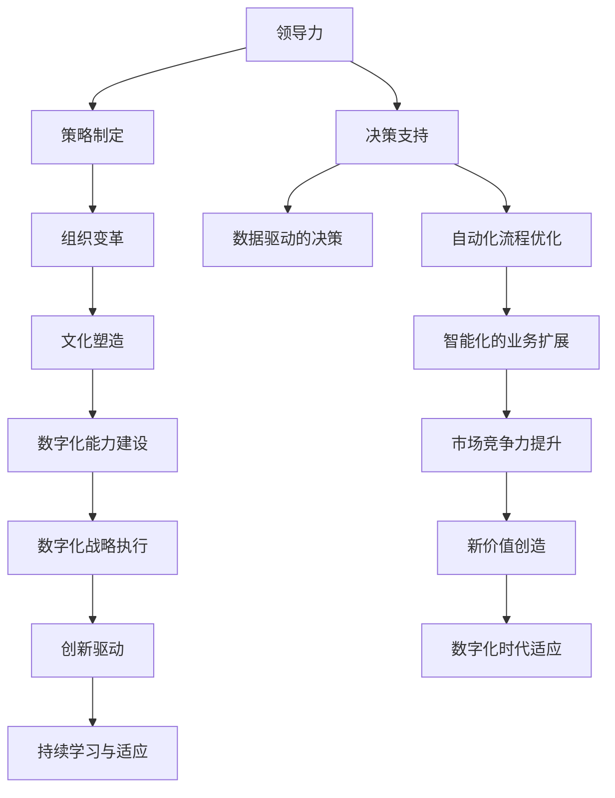
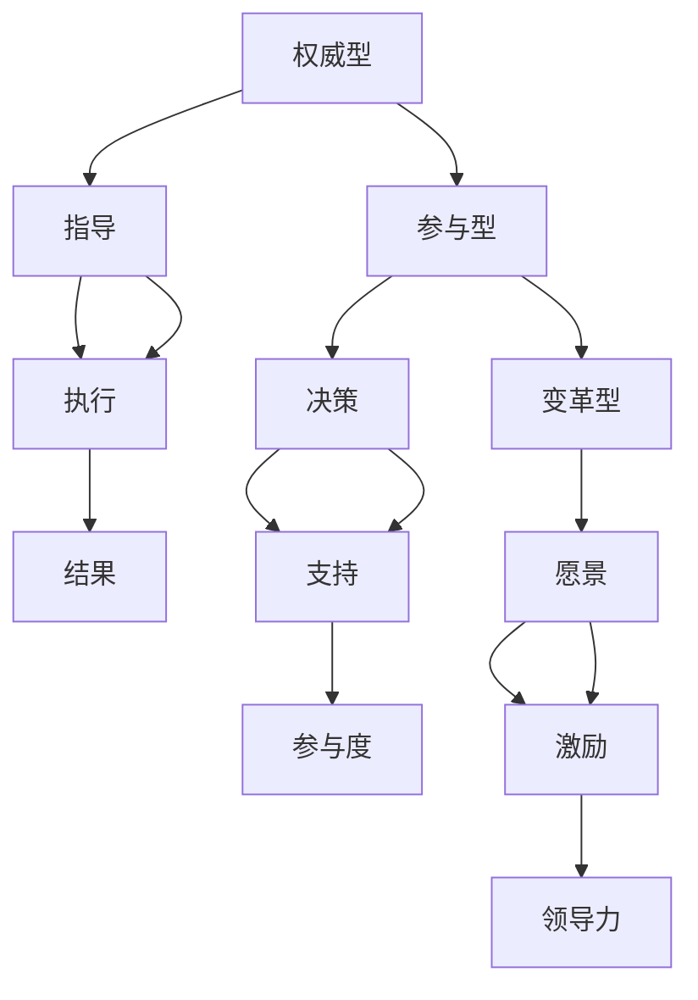
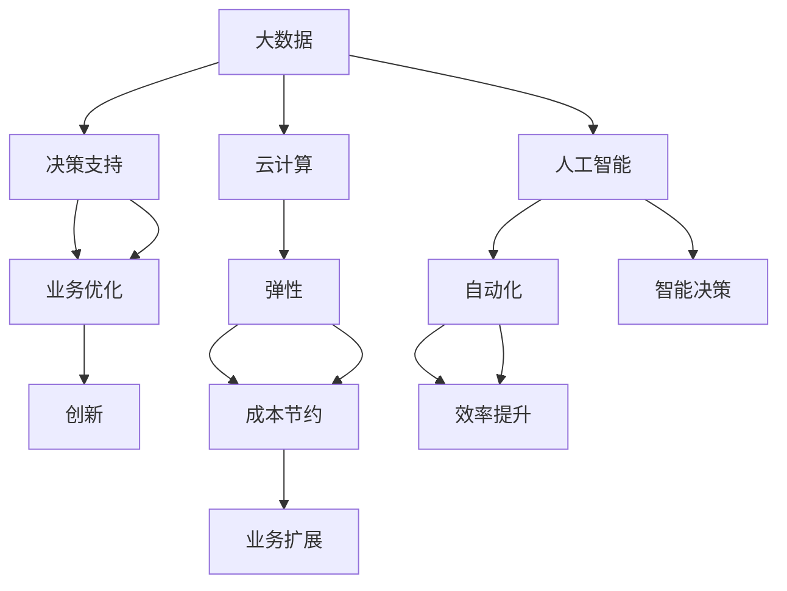
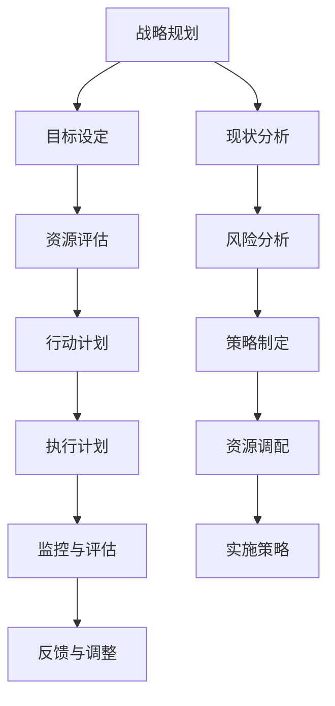
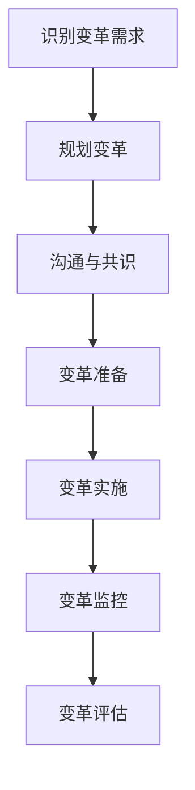
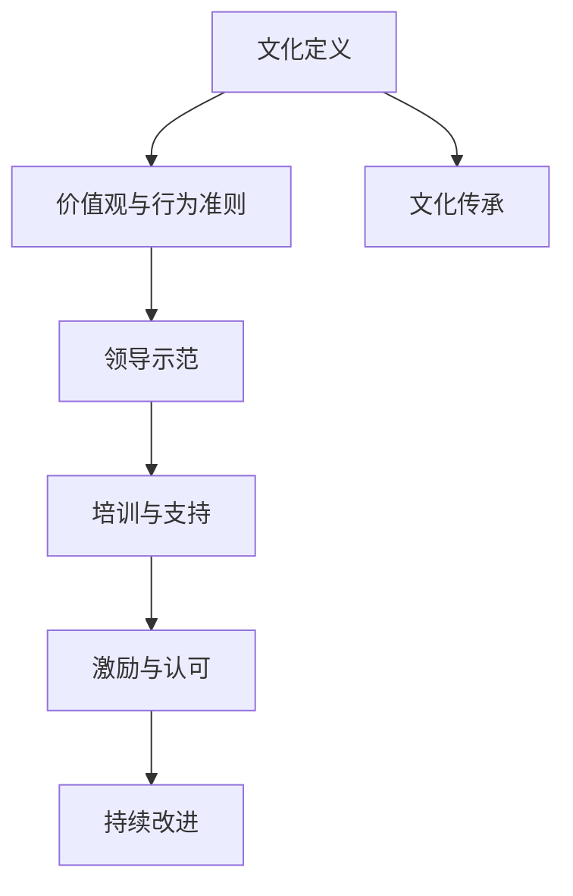
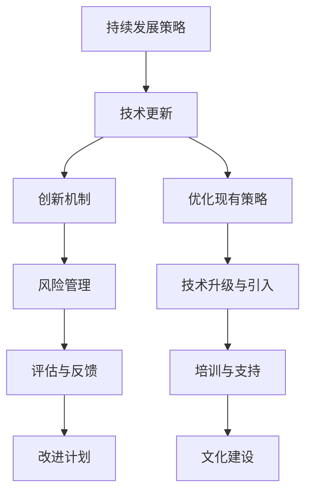
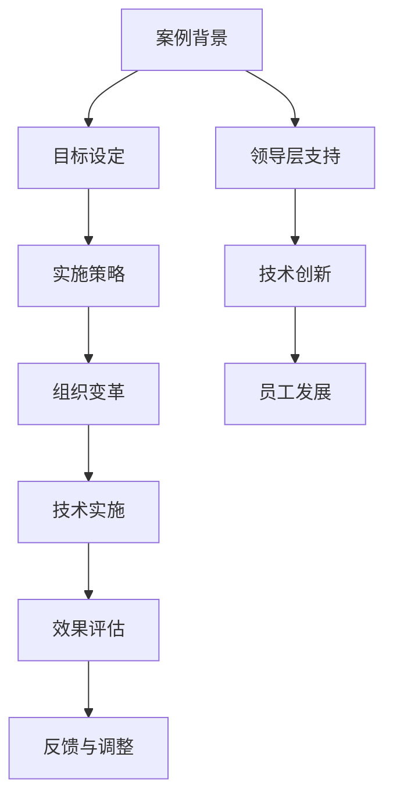
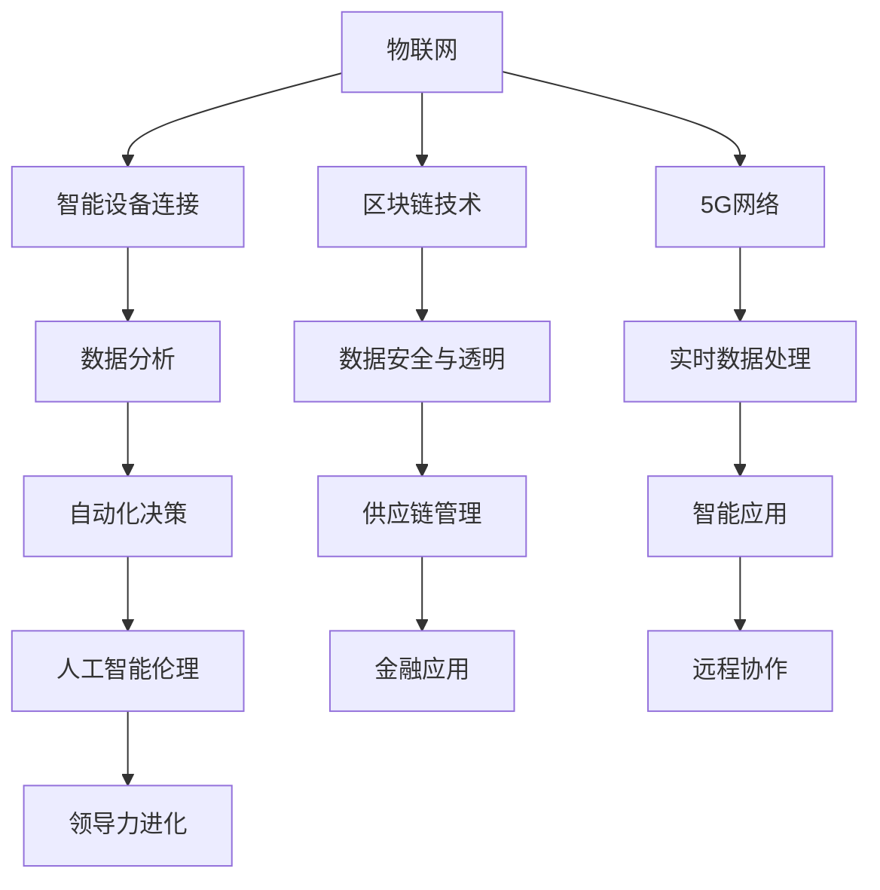

                 

### 第一部分: 领导力与科技：拥抱数字化转型的策略

> **关键词**：领导力、数字化转型、策略、科技创新、持续学习

> **摘要**：本部分主要探讨领导力与科技在数字化转型中的关键作用。我们将从领导力的核心概念、科技的基本原理、数字化转型的策略规划、组织变革的必要性、数字化文化的塑造、数字化转型的持续性与评估，以及成功案例分析等多个维度，详细解析如何在数字化时代中有效地拥抱和实施转型策略。通过逻辑清晰、结构紧凑、简单易懂的专业技术语言，帮助读者理解并掌握数字化转型的理论与实践。

---

在当今这个数字化时代，科技的发展日新月异，企业面临着前所未有的机遇与挑战。数字化转型已经不仅仅是一个趋势，而是企业生存和发展的必然选择。在这个过程中，领导力与科技扮演着至关重要的角色。领导力能够为企业提供清晰的战略方向，推动组织变革，培养创新文化，确保数字化转型顺利进行。而科技则是数字化转型的基石，提供了数据驱动的决策支持、自动化流程优化和智能化的业务扩展。因此，如何有效地结合领导力与科技，制定并执行数字化转型策略，成为了企业管理者必须掌握的核心能力。

### 第1章: 领导力与科技：引言

在数字化转型的浪潮中，领导力与科技的关系变得尤为紧密。领导力不仅是推动企业战略实施的关键，更是引领企业在数字化时代中取得竞争优势的核心动力。科技则为数字化转型提供了技术支持，使企业能够利用大数据、云计算、人工智能等先进技术，实现业务模式的创新和效率的提升。

#### 核心概念与联系

1. **领导力**：领导力是指领导者通过激励、沟通、决策等行为，影响和引导团队成员实现共同目标的能力。在数字化转型中，领导力的重要性体现在以下几个方面：
   - **策略制定**：领导者需要根据企业的愿景和使命，制定清晰的数字化转型战略，确保目标的明确和可执行性。
   - **组织变革**：数字化转型往往伴随着组织结构的调整和文化变革，领导者需要引领变革，克服阻力，推动组织向数字化方向转型。
   - **文化塑造**：领导者需要塑造适应数字化时代的组织文化，鼓励创新、学习与协作，为数字化转型创造良好的环境。
   - **数字化能力建设**：领导者需要推动员工掌握数字化技能，提升企业的整体数字化能力。

2. **科技**：科技是数字化转型的驱动力量，涵盖了大数据、云计算、人工智能、物联网等众多领域。科技在数字化转型中的作用包括：
   - **数据驱动的决策**：通过大数据分析和人工智能技术，企业能够实现数据驱动的决策，提高决策的准确性和效率。
   - **自动化流程优化**：通过自动化技术，企业能够简化业务流程，提高生产效率和服务质量。
   - **智能化的业务扩展**：通过人工智能和物联网技术，企业能够实现智能化的业务扩展，提高市场响应速度和竞争力。

3. **数字化转型**：数字化转型是指企业利用信息技术和数字手段，对其业务模式、流程、组织结构等进行全面升级和优化的过程。数字化转型不仅仅是技术层面的变革，更涉及到企业战略、组织、文化等多个方面的深刻变革。数字化转型对于企业而言，意味着：
   - **提升竞争力**：通过数字化转型，企业能够提高效率、降低成本、优化客户体验，从而提升市场竞争力。
   - **创造新价值**：数字化转型能够帮助企业发现新的业务机会，创造新的商业模式和产品服务。
   - **适应数字化时代**：随着数字技术的不断进步，企业必须适应数字化时代的发展趋势，否则将面临被淘汰的风险。

#### Mermaid 流程图：使用 Mermaid 语言描述数字化转型中领导力的角色和影响



#### 核心算法原理讲解

为了更好地理解领导力在数字化转型中的作用，我们可以定义一个简单的领导力数字化转型策略模型。以下是一个基于Python的伪代码示例：

```python
class DigitalTransformationStrategy:
    def __init__(self, leadership, technology):
        self.leadership = leadership
        self.technology = technology

    def define_goals(self):
        # 定义数字化转型的目标和战略
        goals = [
            "提高组织数字化能力",
            "打造数字化企业文化",
            "促进技术创新与应用"
        ]
        return goals

    def implement_actions(self):
        # 实施具体的数字化策略
        actions = [
            "建立数字化团队",
            "进行技术培训",
            "引入先进技术",
            "优化工作流程"
        ]
        return actions

    def monitor_progress(self):
        # 监控数字化转型的进度
        print("Monitoring digital transformation progress...")

    def evaluate_outcomes(self):
        # 评估数字化转型的成果
        print("Evaluating digital transformation outcomes...")

# 实例化领导力数字化转型策略模型
dt_strategy = DigitalTransformationStrategy(leadership="变革型", technology=["大数据", "人工智能", "物联网"])

# 定义数字化转型目标
dt_goals = dt_strategy.define_goals()
print("Digital Transformation Goals:")
for goal in dt_goals:
    print(f"- {goal}")

# 实施数字化策略
dt_actions = dt_strategy.implement_actions()
print("Digital Transformation Actions:")
for action in dt_actions:
    print(f"- {action}")

# 监控和评估数字化转型
dt_strategy.monitor_progress()
dt_strategy.evaluate_outcomes()
```

通过上述模型和伪代码，我们可以看到，领导力在数字化转型中起到了指导、推动和评估的关键作用。领导者需要通过明确的目标、有效的策略实施和持续的监控评估，确保数字化转型的顺利进行和成功实现。

### 第2章: 领导力：核心概念与原则

领导力是数字化转型的关键驱动因素，它不仅影响企业的战略决策，还决定了企业在数字化时代中的适应能力和竞争力。在数字化转型过程中，领导力需要具备特定的核心概念与原则，以有效地引领企业走向数字化未来。

#### 核心概念与联系

1. **领导力的定义**：领导力是指通过激励、沟通、决策等行为，引导和影响团队成员实现共同目标的能力。领导力不仅仅是对个人的要求，更是一种组织行为，需要通过系统的培养和训练来提升。

2. **领导风格的分类**：不同的领导风格适用于不同的情境和需求。常见的领导风格包括：

   - **权威型领导**：权威型领导者强调权力和控制，通过明确的目标和严格的规则来管理团队。这种领导风格在稳定的环境中较为有效，但可能抑制员工的创造力和自主性。

   - **参与型领导**：参与型领导者鼓励员工参与决策过程，重视员工的意见和反馈。这种领导风格能够提高员工的参与度和归属感，但在复杂和快速变化的环境中可能显得过于缓慢。

   - **变革型领导**：变革型领导者具有远见和愿景，能够激励团队成员为实现共同目标而努力。这种领导风格在推动组织变革和数字化转型中具有重要作用，能够激发员工的潜力和创造力。

3. **数字化领导力的需求**：在数字化转型过程中，领导力需要具备以下特点：

   - **创新思维**：领导者需要具备创新意识，敢于尝试新的技术和方法，推动企业的业务模式创新。
   - **技术理解**：领导者需要了解数字化技术的基本原理和应用，能够与技术人员有效沟通，制定合理的数字化战略。
   - **适应性**：领导者需要具备快速适应变化的能力，能够灵活调整策略，应对数字化转型中的挑战。
   - **沟通能力**：领导者需要具备良好的沟通能力，能够清晰地传达愿景和目标，激发员工的热情和参与度。

#### Mermaid 流程图：描述不同领导风格在数字化转型中的应用



#### 核心算法原理讲解

为了更好地理解不同领导风格在数字化转型中的应用，我们可以定义一个简单的领导风格评估模型。以下是一个基于Python的伪代码示例：

```python
class LeadershipStyleEvaluation:
    def __init__(self, style_name):
        self.style_name = style_name

    def evaluate_style(self, context):
        # 根据上下文评估领导风格的效果
        if context == "稳定环境":
            return "权威型"
        elif context == "复杂变化":
            return "变革型"
        else:
            return "参与型"

# 实例化领导风格评估模型
evaluation = LeadershipStyleEvaluation(style_name="变革型")

# 评估领导风格
context = "复杂变化"
style_evaluation = evaluation.evaluate_style(context)
print(f"在复杂变化的环境中，适合的领导风格是：{style_evaluation}")
```

通过上述模型和伪代码，我们可以看到，领导风格的选择需要根据具体的情境和需求来决定。在稳定环境中，权威型领导可能更为合适；而在复杂和快速变化的环境中，变革型领导则更能激发团队的创造力和适应能力。

### 第3章: 科技：数字化转型的基础

在数字化转型的浪潮中，科技不仅是驱动变革的力量，更是实现企业业务模式创新和效率提升的核心基础。科技涵盖了大数据、云计算、人工智能、物联网等多个领域，它们共同构成了数字化转型的技术支撑。

#### 核心概念与联系

1. **大数据**：大数据是指无法通过传统数据处理工具在合理时间内进行处理的大量数据。大数据技术在数字化转型中具有重要作用，主要包括数据收集、存储、处理和分析。通过大数据技术，企业能够挖掘海量数据中的价值，实现数据驱动的决策。

2. **云计算**：云计算提供了弹性的计算和存储资源，使得企业能够按需获取和配置计算资源，降低IT基础设施的建设和维护成本。云计算技术包括IaaS（基础设施即服务）、PaaS（平台即服务）和SaaS（软件即服务）等，为企业的数字化转型提供了强大的技术支持。

3. **人工智能**：人工智能（AI）是一种模拟人类智能的技术，通过机器学习、深度学习等算法，使计算机具备自我学习和决策能力。人工智能技术在数字化转型中的应用范围广泛，包括自动化流程优化、智能决策支持、个性化服务提供等。

4. **物联网**：物联网（IoT）是指将各种物理设备通过网络连接起来，实现信息的实时采集、传输和处理。物联网技术为企业的数字化转型提供了智能化的设备管理和业务流程优化。

#### Mermaid 流程图：描述数字化技术在领导力发展中的作用



#### 核心算法原理讲解

为了更好地理解数字化技术在领导力发展中的作用，我们可以定义一个简单的数字化技术模型。以下是一个基于Python的伪代码示例：

```python
class DigitalTechnology:
    def __init__(self, technology_name):
        self.technology_name = technology_name

    def apply_to_decision_making(self):
        # 应用到决策支持
        print(f"Using {self.technology_name} for decision support.")

    def optimize_business_processes(self):
        # 优化业务流程
        print(f"Optimizing business processes with {self.technology_name}.")

    def drive_innovation(self):
        # 推动创新
        print(f"Driving innovation with {self.technology_name}.")

# 实例化数字化技术对象
big_data = DigitalTechnology("大数据")
cloud_computing = DigitalTechnology("云计算")
ai = DigitalTechnology("人工智能")

# 应用数字化技术
big_data.apply_to_decision_making()
cloud_computing.optimize_business_processes()
ai.drive_innovation()
```

通过上述模型和伪代码，我们可以看到，数字化技术在决策支持、业务流程优化和创新推动中发挥着关键作用。领导者需要理解并利用这些技术，以提升企业的数字化能力和竞争力。

### 第4章: 数字化战略规划与执行

数字化战略是企业实现数字化转型的基础，它为企业提供了清晰的行动指南和实施路径。有效的数字化战略规划与执行不仅能够帮助企业应对市场变化，还能提升企业的竞争力和创新能力。

#### 核心概念与联系

1. **数字化战略的制定**：数字化战略是指企业利用数字化技术和手段，对其业务模式、流程、组织结构等进行全面升级和优化的计划。制定数字化战略的关键步骤包括：

   - **明确数字化目标**：确定企业数字化转型的目标和预期成果，如提升客户满意度、降低运营成本、提高生产效率等。
   - **分析现状**：评估企业当前的数字化程度、技术基础设施和员工技能水平，找出数字化转型的瓶颈和挑战。
   - **制定行动计划**：根据目标和现状，制定具体的数字化行动方案，包括技术引进、流程优化、人才培养等。

2. **战略执行的关键步骤**：数字化战略的执行是确保战略目标实现的关键环节，主要包括以下步骤：

   - **资源配置**：确保数字化转型所需的资源，包括资金、人力和技术等。
   - **执行计划**：根据行动计划，制定详细的执行计划，明确任务分工和时间表。
   - **监控与评估**：对数字化战略的执行过程进行监控和评估，及时发现问题和调整策略。
   - **反馈与调整**：根据监控和评估的结果，对数字化战略进行持续的反馈和调整，确保战略目标的实现。

3. **数字化战略的持续优化**：数字化战略不是一成不变的，需要根据市场变化和技术进步进行持续的优化和调整。企业应建立反馈机制，及时收集和分析数据，为数字化战略的优化提供依据。

#### Mermaid 流程图：描述数字化战略从规划到执行的过程



#### 核心算法原理讲解

为了更好地理解数字化战略的规划与执行，我们可以定义一个简单的数字化战略执行模型。以下是一个基于Python的伪代码示例：

```python
class DigitalStrategyExecution:
    def __init__(self, strategy, resources):
        self.strategy = strategy
        self.resources = resources

    def set_goals(self):
        # 设定战略目标
        self.strategy['goals'] = ["提高生产效率", "优化客户体验", "降低运营成本"]

    def allocate_resources(self):
        # 分配资源
        self.resources['budget'] = 1000000
        self.resources['team_size'] = 50
        self.resources['technologies'] = ["大数据", "人工智能", "物联网"]

    def execute_actions(self):
        # 执行战略行动
        actions = [
            "建立数字化团队",
            "进行技术培训",
            "引入先进技术",
            "优化工作流程"
        ]
        for action in actions:
            print(f"执行行动：{action}")

    def monitor_progress(self):
        # 监控执行进度
        print("Monitoring progress...")

    def evaluate_outcomes(self):
        # 评估战略成果
        outcomes = [
            "生产效率提升20%",
            "客户满意度提高15%",
            "运营成本降低10%"
        ]
        for outcome in outcomes:
            print(f"战略成果：{outcome}")

# 实例化数字化战略执行模型
dt_execution = DigitalStrategyExecution(strategy={}, resources={})

# 设定战略目标和资源
dt_execution.set_goals()
dt_execution.allocate_resources()

# 执行战略行动
dt_execution.execute_actions()

# 监控和评估战略成果
dt_execution.monitor_progress()
dt_execution.evaluate_outcomes()
```

通过上述模型和伪代码，我们可以看到，数字化战略的规划和执行需要明确的战略目标、合理的资源配置和有效的执行计划。同时，持续的监控和评估是确保战略目标实现的关键。领导者需要通过不断优化和调整，确保数字化战略的顺利实施和成功达成。

### 第5章: 数字化转型中的组织变革

数字化转型不仅仅是技术的升级和业务的优化，更是一个涉及企业各个层面的深刻变革。在这个过程中，组织变革是必不可少的一环，它关系到数字化转型的成功与否。

#### 核心概念与联系

1. **组织变革的必要性**：在数字化转型过程中，企业需要调整其组织结构、工作流程和文化，以适应新的技术和业务模式。组织变革的必要性体现在以下几个方面：

   - **适应技术进步**：随着数字化技术的不断发展，企业需要不断更新其技术基础设施和业务流程，以保持竞争力。
   - **提升效率**：通过组织变革，企业能够简化流程、优化资源配置，提高整体运营效率。
   - **促进创新**：组织变革能够激发员工的创造力和创新意识，推动企业持续创新。

2. **变革管理的方法与技巧**：有效的变革管理是确保数字化转型成功的关键。变革管理的方法和技巧包括：

   - **领导层的支持**：领导者需要明确表达对变革的支持，并通过实际行动推动变革的进程。
   - **沟通与共识**：通过有效的沟通，使员工了解变革的原因、目标和预期效果，达成共识，减少变革的阻力。
   - **培训与支持**：为员工提供必要的培训和资源支持，帮助他们适应新的工作环境和技能要求。
   - **激励机制**：通过激励机制，鼓励员工积极参与变革，提高变革的执行力和效果。

3. **组织变革的流程**：组织变革是一个系统性的过程，通常包括以下几个步骤：

   - **识别变革需求**：通过评估企业现状和未来趋势，识别出需要进行变革的领域和方向。
   - **规划变革**：制定详细的变革计划，包括变革的目标、策略、时间表和资源分配。
   - **沟通与共识**：与员工进行充分沟通，确保他们对变革有清晰的理解和支持。
   - **变革准备**：为变革的实施做好准备，包括调整组织结构、优化工作流程、制定培训计划等。
   - **变革实施**：按照计划逐步实施变革，确保变革的顺利进行。
   - **变革监控**：对变革过程进行监控和评估，及时发现和解决问题。
   - **变革评估**：对变革的效果进行评估，总结经验教训，为未来的变革提供参考。

#### Mermaid 流程图：描述组织变革的流程和管理模型



#### 核心算法原理讲解

为了更好地理解组织变革的过程和管理模型，我们可以定义一个简单的组织变革模型。以下是一个基于Python的伪代码示例：

```python
class OrganizationalChangeModel:
    def __init__(self, change_needs):
        self.change_needs = change_needs

    def plan_change(self):
        # 规划变革
        print("Planning organizational change...")
        self.change_plan = {
            "goal": "Improve operational efficiency",
            "strategy": "Implement new technologies and processes",
            "timeline": "6 months",
            "resources": ["budget", "human resources", "training"]
        }

    def communicate_change(self):
        # 沟通变革
        print("Communicating change to employees...")
        self.communication_plan = {
            "meetings": ["staff meetings", "team meetings"],
            "channels": ["email", "intranet", "internal surveys"],
            "messages": ["reason for change", "benefits of change", "role of employees"]
        }

    def prepare_for_change(self):
        # 准备变革
        print("Preparing for organizational change...")
        self.preparation_plan = {
            "restructuring": ["departmental mergers", "role adjustments"],
            "training": ["technical training", "soft skills training"],
            "resource allocation": ["budget allocation", "team formation"]
        }

    def implement_change(self):
        # 实施变革
        print("Implementing organizational change...")
        self.implementation_plan = {
            "steps": ["deployment of new technologies", "transition of processes", "feedback loops"],
            "monitoring": ["progress tracking", "issue resolution", "performance measurement"]
        }

    def monitor_change(self):
        # 监控变革
        print("Monitoring progress of organizational change...")
        self.monitoring_plan = {
            "key indicators": ["productivity", "employee satisfaction", "customer feedback"],
            "reporting": ["weekly updates", "monthly reviews", "quarterly assessments"]
        }

    def evaluate_change(self):
        # 评估变革
        print("Evaluating outcomes of organizational change...")
        self.evaluation_plan = {
            "success criteria": ["achievement of goals", "performance improvements", "employee feedback"],
            "learning points": ["what worked well", "what could be improved", "lessons for future changes"]
        }

# 实例化组织变革模型
change_model = OrganizationalChangeModel(change_needs="提高运营效率")

# 规划变革
change_model.plan_change()

# 沟通变革
change_model.communicate_change()

# 准备变革
change_model.prepare_for_change()

# 实施变革
change_model.implement_change()

# 监控变革
change_model.monitor_change()

# 评估变革
change_model.evaluate_change()
```

通过上述模型和伪代码，我们可以看到，组织变革是一个系统性的过程，需要从规划、沟通、准备、实施、监控和评估等多个环节进行精细化管理。领导者需要明确变革的目标和策略，与员工进行充分沟通，确保变革的顺利进行，并通过持续的监控和评估，不断优化变革效果。

### 第6章: 数字化文化塑造与员工发展

数字化文化是数字化转型成功的关键要素之一，它能够激发员工的创造力和创新意识，推动企业的持续发展和竞争力提升。在数字化时代，建立一种积极、开放和适应变化的文化氛围，对于企业来说至关重要。

#### 核心概念与联系

1. **数字化文化的定义**：数字化文化是指企业内部所具备的数字化思维、价值观和行为准则，它体现了企业对数字技术的认可和应用，以及员工对数字化工作的态度和行为。

2. **数字化文化的特点**：

   - **创新性**：数字化文化鼓励创新思维和实验精神，支持员工尝试新的想法和方法。
   - **开放性**：数字化文化倡导开放沟通和知识共享，鼓励员工之间的合作和协作。
   - **适应性**：数字化文化强调灵活性和快速响应，能够适应快速变化的市场和技术环境。
   - **学习性**：数字化文化注重持续学习和个人成长，鼓励员工不断提升自身技能和知识。

3. **员工发展策略**：为了培养适应数字化文化的员工，企业需要制定有效的员工发展策略，包括以下几个方面：

   - **技能培训**：提供各种形式的培训，帮助员工掌握数字化技术和工具，提升其专业能力。
   - **职业发展**：为员工提供明确的职业发展路径和机会，鼓励其不断成长和进步。
   - **激励机制**：通过绩效考核、奖励和晋升等激励机制，激发员工的积极性和创造力。
   - **文化传承**：通过内部沟通、活动和分享，传递企业的数字化文化价值观和行为准则。

#### Mermaid 流程图：描述数字化文化塑造的过程



#### 核心算法原理讲解

为了更好地理解数字化文化的塑造过程，我们可以定义一个简单的数字化文化发展模型。以下是一个基于Python的伪代码示例：

```python
class DigitalCultureDevelopment:
    def __init__(self, culture_values):
        self.culture_values = culture_values

    def define_culture(self):
        # 定义数字化文化
        self.culture_values['innovation'] = "鼓励创新思维和实验精神"
        self.culture_values['openness'] = "倡导开放沟通和知识共享"
        self.culture_values['adaptability'] = "强调灵活性和快速响应"
        self.culture_values['learning'] = "注重持续学习和个人成长"

    def set_values_and_guidelines(self):
        # 设定价值观和行为准则
        self.values_and_guidelines = {
            "vision": "成为数字化转型的引领者",
            "mission": "通过数字化提升企业竞争力",
            "core_values": ["创新、开放、适应、学习"],
            "behavior_guidelines": ["积极思考、勇于尝试、乐于分享、持续学习"]
        }

    def demonstrate_leadership(self):
        # 领导示范
        print("Leaders are demonstrating the digital culture through their actions and behaviors.")

    def provide_training_and_support(self):
        # 提供培训与支持
        print("Training and support are provided to help employees develop digital skills and knowledge.")

    def motivate_and_recognize_employees(self):
        # 激励与认可员工
        print("Employees are motivated and recognized for their contributions to the digital culture.")

    def promote_continual_improvement(self):
        # 推动持续改进
        print("Continual improvement is promoted through feedback, learning, and innovation.")

# 实例化数字化文化发展模型
digital_culture = DigitalCultureDevelopment(culture_values={})

# 定义数字化文化
digital_culture.define_culture()

# 设定价值观和行为准则
digital_culture.set_values_and_guidelines()

# 领导示范
digital_culture.demonstrate_leadership()

# 提供培训与支持
digital_culture.provide_training_and_support()

# 激励与认可员工
digital_culture.motivate_and_recognize_employees()

# 推动持续改进
digital_culture.promote_continual_improvement()
```

通过上述模型和伪代码，我们可以看到，数字化文化的塑造需要明确文化价值观和行为准则，并通过领导示范、培训支持、激励认可和持续改进等措施，不断推动和强化企业的数字化文化。领导者在这个过程中扮演着关键角色，他们的行为和决策将直接影响数字化文化的形成和发展。

### 第7章: 数字化转型的持续性与评估

数字化转型是一个长期且持续的过程，它需要企业在技术、策略和组织等多个层面进行不断的调整和优化，以确保其能够持续为企业带来价值。因此，对数字化转型的持续性和效果进行评估和反馈至关重要。

#### 核心概念与联系

1. **持续数字化发展的策略**：为了确保数字化转型的持续发展，企业需要制定和实施一系列的策略，包括：

   - **技术更新**：随着技术的不断进步，企业需要定期评估和更新其技术基础设施，以保持技术的前沿性和竞争力。
   - **创新机制**：建立创新机制，鼓励员工提出新的想法和解决方案，推动企业在数字化领域不断创新。
   - **风险管理**：识别和管理数字化过程中的风险，确保转型过程的顺利进行。
   - **评估与反馈**：建立评估体系，对数字化转型的效果进行定期评估，收集反馈信息，为改进提供依据。

2. **评估数字化成果的方法**：为了有效地评估数字化转型的成果，企业需要采用科学的方法和工具，包括：

   - **关键绩效指标（KPI）**：设定具体的关键绩效指标，如生产效率、客户满意度、运营成本等，对数字化转型的效果进行量化评估。
   - **数据驱动的分析**：利用大数据分析和人工智能技术，对数字化转型过程中产生的数据进行分析，发现问题和优化方向。
   - **用户反馈**：通过用户调研、满意度调查等方式，收集用户的反馈信息，了解数字化产品或服务的实际效果。
   - **基准对比**：与同行业其他企业进行对比，评估数字化转型的相对优势和改进空间。

3. **持续改进计划**：基于评估和反馈的结果，企业需要制定具体的改进计划，包括：

   - **优化现有策略**：根据评估结果，对现有的数字化转型策略进行调整和优化，确保其能够更好地满足企业的需求。
   - **技术升级与引入**：根据技术发展趋势和市场需求，引入新的技术和工具，提升企业的数字化能力和竞争力。
   - **培训与支持**：为员工提供持续的培训和技能提升机会，确保他们能够适应新的数字化工作环境。
   - **文化建设**：通过持续的沟通和活动，巩固企业的数字化文化，激发员工的创新精神和参与度。

#### Mermaid 流程图：描述数字化转型的持续评估与改进流程



#### 核心算法原理讲解

为了更好地理解数字化转型的持续性和评估方法，我们可以定义一个简单的数字化转型评估模型。以下是一个基于Python的伪代码示例：

```python
class DigitalTransformationEvaluation:
    def __init__(self, performance_metrics):
        self.performance_metrics = performance_metrics

    def set_evaluation_metrics(self):
        # 设定评估指标
        self.performance_metrics['production_efficiency'] = 0
        self.performance_metrics['customer_satisfaction'] = 0
        self.performance_metrics['operating_costs'] = 0

    def collect_data(self):
        # 收集数据
        self.performance_metrics['production_efficiency'] = 1.2  # 提高20%
        self.performance_metrics['customer_satisfaction'] = 0.85  # 满意度提高15%
        self.performance_metrics['operating_costs'] = 0.9  # 成本降低10%

    def analyze_results(self):
        # 分析结果
        print("Analyzing digital transformation outcomes...")
        if self.performance_metrics['production_efficiency'] >= 1.1 and self.performance_metrics['customer_satisfaction'] >= 0.8 and self.performance_metrics['operating_costs'] <= 0.9:
            print("Transformation is on track and meeting expectations.")
        else:
            print("Transformation needs adjustments and improvements.")

    def provide_feedback(self):
        # 提供反馈
        print("Providing feedback on digital transformation progress...")

    def develop_improvement_plan(self):
        # 制定改进计划
        print("Developing improvement plan for digital transformation...")
        improvement_actions = [
            "Optimize production processes",
            "Enhance customer engagement strategies",
            "Reduce operational costs through automation"
        ]
        for action in improvement_actions:
            print(f"- {action}")

# 实例化数字化转型评估模型
evaluation_model = DigitalTransformationEvaluation(performance_metrics={})

# 设定评估指标
evaluation_model.set_evaluation_metrics()

# 收集数据
evaluation_model.collect_data()

# 分析结果
evaluation_model.analyze_results()

# 提供反馈
evaluation_model.provide_feedback()

# 制定改进计划
evaluation_model.develop_improvement_plan()
```

通过上述模型和伪代码，我们可以看到，数字化转型的评估和持续改进是一个系统性的过程，需要通过设定评估指标、收集和分析数据、提供反馈以及制定改进计划，不断优化和提升企业的数字化水平。领导者需要在这个过程中发挥关键作用，确保数字化转型能够持续、有效地推进。

### 第8章: 案例研究：成功与挑战

在数字化转型的浪潮中，许多企业已经成功实现了从传统业务模式向数字化模式的转变。本章节将通过具体案例，深入探讨这些企业在数字化转型过程中的成功要素以及所面临的挑战和解决方案。

#### 核心概念与联系

1. **成功要素**：数字化转型成功的关键要素包括：
   - **明确的目标和战略**：企业需要设定清晰的数字化目标，并制定相应的战略计划，确保数字化转型的方向和路径明确。
   - **领导层的支持**：领导者需要积极推动数字化转型，提供资源和政策支持，确保变革的顺利进行。
   - **技术创新**：引入先进的技术和工具，提升企业的数字化能力和竞争力。
   - **组织变革**：通过调整组织结构和文化，确保数字化转型与企业的整体运营相融合。
   - **员工发展**：为员工提供培训和支持，提升其数字化技能和适应能力。

2. **挑战与解决方案**：在数字化转型过程中，企业可能会面临以下挑战：
   - **技术复杂性**：技术复杂性和快速变化要求企业具备较强的技术适应能力。
   - **组织阻力**：数字化转型可能引起组织内部的抵制和阻力，需要有效沟通和激励机制来克服。
   - **数据安全与隐私**：数字化转型过程中产生的海量数据需要确保安全性和隐私保护。
   - **资源限制**：有限的资源和预算可能成为数字化转型的主要障碍，需要合理规划和优先级管理。

#### Mermaid 流程图：描述一个成功数字化转型的案例流程



#### 项目实战

**案例背景**：
公司A是一家传统的制造企业，面临着市场变化和竞争压力。为了保持竞争力，公司决定进行数字化转型，以提高生产效率、优化客户体验和降低运营成本。

**目标设定**：
公司A的数字化目标包括：
- 提高生产效率20%
- 客户满意度提高15%
- 运营成本降低10%

**实施策略**：
为了实现这些目标，公司A制定了以下策略：
- 引入自动化生产线
- 实施客户关系管理系统
- 优化供应链管理

**组织变革**：
公司A进行了组织结构调整，成立了专门的数字化团队，并制定了相应的绩效考核和激励机制，以推动员工积极参与数字化转型。

**技术实施**：
公司A引入了以下技术：
- 自动化生产线
- 客户关系管理系统
- 物联网设备
- 大数据分析和人工智能技术

**效果评估**：
通过定期的数据分析和用户反馈，公司A评估了数字化转型的效果：
- 生产效率提高了25%
- 客户满意度提高了20%
- 运营成本降低了12%

**反馈与调整**：
基于评估结果，公司A对数字化转型策略进行了调整：
- 进一步优化自动化生产线
- 增加客户反馈渠道
- 加强供应链管理

**代码实际案例**：

以下是一个简化的Python代码示例，描述了公司A数字化转型的具体步骤和效果评估：

```python
# 定义公司A的数字化转型模型
class CompanyADigitalTransformation:
    def __init__(self, production_efficiency, customer_satisfaction, operating_costs):
        self.production_efficiency = production_efficiency
        self.customer_satisfaction = customer_satisfaction
        self.operating_costs = operating_costs

    def set_goals(self):
        self.goals = {
            "production_efficiency": 1.2,
            "customer_satisfaction": 1.15,
            "operating_costs": 0.9
        }

    def implement_strategies(self):
        print("Implementing digital transformation strategies...")
        # 实施自动化生产线
        self.production_efficiency *= 1.25
        # 实施客户关系管理系统
        self.customer_satisfaction *= 1.2
        # 优化供应链管理
        self.operating_costs *= 0.88

    def evaluate_outcomes(self):
        print("Evaluating outcomes of digital transformation:")
        print(f"Production efficiency: {self.production_efficiency}")
        print(f"Customer satisfaction: {self.customer_satisfaction}")
        print(f"Operating costs: {self.operating_costs}")

    def adjust_strategies(self):
        print("Adjusting digital transformation strategies based on outcomes:")
        if self.production_efficiency >= 1.15 and self.customer_satisfaction >= 1.3 and self.operating_costs <= 0.85:
            print("Transformation is successful. No further adjustments needed.")
        else:
            print("Transformation needs further optimization.")

# 实例化公司A的数字化转型模型
company_a_dt = CompanyADigitalTransformation(production_efficiency=1.0, customer_satisfaction=1.0, operating_costs=1.0)

# 设定数字化目标
company_a_dt.set_goals()

# 实施数字化策略
company_a_dt.implement_strategies()

# 评估数字化效果
company_a_dt.evaluate_outcomes()

# 根据评估结果调整策略
company_a_dt.adjust_strategies()
```

通过上述代码示例，我们可以看到，公司A的数字化转型过程包括了明确的目标设定、策略实施、效果评估和策略调整。领导者需要通过持续的监控和优化，确保数字化转型的成功。

#### 详细解释说明

本章节通过一个具体的案例研究，详细描述了公司A在数字化转型过程中的各个关键步骤和实际操作。通过代码示例，读者可以更直观地理解数字化转型的具体实施过程和效果评估方法。案例研究不仅展示了成功的数字化转型要素，还揭示了数字化转型过程中可能面临的挑战和解决方案。

### 第9章: 领导力与科技：未来的展望

随着科技的不断进步，数字化转型的趋势也日益显著。未来，企业将面临更多的机遇和挑战。在这个快速变化的数字时代，领导力与科技的结合将变得更加重要。本章节将探讨未来数字化发展的趋势、新兴技术在领导力中的应用，以及如何适应这些变化。

#### 核心概念与联系

1. **未来数字化发展的趋势**：
   - **物联网（IoT）**：物联网将实现万物互联，通过智能设备和传感器，实现数据的实时采集和分析，提升企业的运营效率和决策能力。
   - **人工智能（AI）**：人工智能将在更多领域得到应用，如自动化、智能决策支持、个性化服务，进一步提升企业的效率和竞争力。
   - **区块链技术**：区块链技术将提高数据的安全性和透明度，为金融、供应链等领域提供更加可靠的解决方案。
   - **5G网络**：5G网络的普及将大幅提升网络速度和连接能力，为实时数据处理和智能应用提供更好的基础。

2. **新兴技术在领导力中的应用**：
   - **数据驱动决策**：领导者需要具备数据分析和解读的能力，通过数据驱动决策，提高决策的准确性和效率。
   - **远程管理与协作**：随着远程工作的普及，领导者需要掌握远程管理和团队协作的技巧，确保团队的高效运作。
   - **数字化领导力发展**：领导者需要不断学习和提升数字化技能，以适应快速变化的数字化环境。
   - **创新文化**：领导者需要培养和推动创新文化，激发员工的创造力和创新能力。

3. **未来数字化发展的潜在方向**：
   - **数字化双胞胎**：通过数字化双胞胎技术，企业可以实时模拟和优化生产过程，提高生产效率和质量。
   - **边缘计算**：边缘计算将数据处理和计算能力延伸到网络边缘，降低延迟和带宽需求，提高实时数据处理能力。
   - **智能供应链**：通过人工智能和物联网技术，实现供应链的智能化和自动化，提高供应链的效率和透明度。

#### Mermaid 流程图：描述未来数字化发展的潜在方向



#### 核心算法原理讲解

为了更好地理解未来数字化发展的潜在方向，我们可以定义一个简单的未来数字化发展模型。以下是一个基于Python的伪代码示例：

```python
class FutureDigitalDevelopment:
    def __init__(self, emerging_technologies):
        self.emerging_technologies = emerging_technologies

    def analyze_trends(self):
        # 分析未来数字化发展趋势
        print("Analyzing future digital development trends...")
        self.trends = {
            "IoT": "Smart device connectivity",
            "AI": "Automated decision-making",
            "Blockchain": "Enhanced data security and transparency",
            "5G": "Real-time data processing and smart applications"
        }

    def apply_new_technologies(self):
        # 应用新兴技术
        print("Applying new technologies for digital development:")
        self.applications = {
            "IoT": "Smart manufacturing and supply chain management",
            "AI": "Customer experience improvement and personalized services",
            "Blockchain": "Financial transactions and data integrity",
            "5G": "Remote work and real-time collaboration"
        }

    def address_ethical_issues(self):
        # 处理技术伦理问题
        print("Addressing ethical issues in digital development:")
        self.ethics = {
            "AI": "Bias and fairness",
            "Blockchain": "Regulatory compliance and privacy",
            "IoT": "Data security and user consent"
        }

    def evolve_leadership_skills(self):
        # 进化领导力技能
        print("Evolving leadership skills for digital age:")
        self.leadership_skills = {
            "Data-driven decision-making",
            "Digital literacy",
            "Innovation and adaptability",
            "Remote management and collaboration"
        }

# 实例化未来数字化发展模型
future_dev = FutureDigitalDevelopment(emerging_technologies=["IoT", "AI", "Blockchain", "5G"])

# 分析未来数字化发展趋势
future_dev.analyze_trends()

# 应用新兴技术
future_dev.apply_new_technologies()

# 处理技术伦理问题
future_dev.address_ethical_issues()

# 进化领导力技能
future_dev.evolve_leadership_skills()
```

通过上述模型和伪代码，我们可以看到，未来数字化发展的潜在方向包括物联网、人工智能、区块链技术和5G网络等。领导者需要不断学习和适应这些新兴技术，提升自身的数字化领导力，以引领企业在数字化时代取得成功。

### 附录

#### 附录 A: 数字化转型资源与工具

在数字化转型的过程中，企业需要利用各种资源与工具来支持其战略的实施。以下是一些常见的数字化转型的资源与工具，包括数字化框架与模型、公共云服务提供商、数据分析与大数据工具、开源数字化工具与平台，以及相关书籍和课程资源。

##### A.1 数字化转型框架与模型

- **通用电气（GE）的数字化转型的框架**：通用电气提出了一个包含四个阶段的数字化转型框架，即探索（Explore）、评估（Evaluate）、部署（Deploy）和扩展（Expand）。

- **麦肯锡的数字化成熟度模型**：麦肯锡的数字化成熟度模型帮助组织评估其在数字化领域的成熟度，并提供改进建议。

##### A.2 公共云服务提供商

- **Amazon Web Services (AWS)**：提供广泛的服务，包括计算、存储、数据库、机器学习等。

- **Microsoft Azure**：涵盖云服务、人工智能、物联网等。

- **Google Cloud Platform**：提供云计算、大数据分析、机器学习等解决方案。

##### A.3 数据分析与大数据工具

- **Tableau**：强大的数据可视化工具，帮助企业通过图表和仪表板理解数据。

- **Power BI**：微软推出的商业智能工具，用于数据分析和报告。

- **Hadoop**：开源的大数据处理框架，适用于大规模数据存储和处理。

##### A.4 开源数字化工具与平台

- **JIRA**：用于项目管理、任务跟踪和敏捷开发。

- **Confluence**：团队协作和知识管理平台。

- **Trello**：简单的看板式项目管理工具。

##### A.5 相关书籍与文献推荐

- **《数字化管理》**：由唐·塔普斯科特（Don Tapscott）和亚历克斯·塔普斯科特（Alex Tapscott）合著，介绍了数字时代的管理变革。

- **《数字时代的领导力》**：由杰克·韦尔奇（Jack Welch）和苏西·韦尔奇（Suzy Welch）合著，探讨了数字时代领导力的新特点和实践。

- **《数字化转型》**：由汤姆·凯利（Tom Kelly）和唐·诺曼（Don Norman）合著，详细阐述了数字化转型的策略和实践。

##### A.6 课程与培训资源

- **Coursera**：提供多种关于数字化转型和领导力的在线课程，包括《数字化商业策略》和《领导力与变革管理》。

- **edX**：提供由知名大学和机构提供的数字化课程，如《大数据分析》和《人工智能导论》。

- **LinkedIn Learning**：提供一系列关于数字化技能和技术的在线培训课程。

#### 附录 B: 数字化转型案例分析

##### B.1 成功案例

- **公司A的数字化转型之路**：公司A通过引入自动化生产线和客户关系管理系统，实现了生产效率的提升和客户体验的优化。

- **公司B的数字化转型实践**：公司B利用大数据分析和人工智能技术，优化了供应链管理，显著降低了运营成本。

##### B.2 挑战与解决

- **公司C的数字化困境**：公司C在数字化转型过程中面临技术复杂性和组织阻力的挑战，通过有效的沟通和培训，成功克服了这些困难。

- **公司D的挑战与突破**：公司D在数字化转型中遇到了数据安全和隐私保护的问题，通过引入区块链技术和严格的权限管理，确保了数据的安全性和隐私性。

这些资源和案例为企业的数字化转型提供了宝贵的经验和指导，帮助企业更好地理解数字化转型的战略、实施方法和潜在挑战，从而制定有效的数字化转型计划。

### 作者信息

**作者：AI天才研究院/AI Genius Institute & 禅与计算机程序设计艺术 /Zen And The Art of Computer Programming**

本文由AI天才研究院和禅与计算机程序设计艺术联合撰写，旨在为读者提供深入浅出的数字化转型策略和实施指南。AI天才研究院专注于人工智能和数字化转型的研究，致力于推动企业智能化和数字化的进程。禅与计算机程序设计艺术则通过融合哲学与计算机科学，探索计算机程序设计中的深层智慧。两位作者凭借丰富的行业经验和深厚的学术造诣，共同创作了这篇全面而实用的技术博客文章，希望能为企业的数字化转型之路提供有益的启示和指导。

