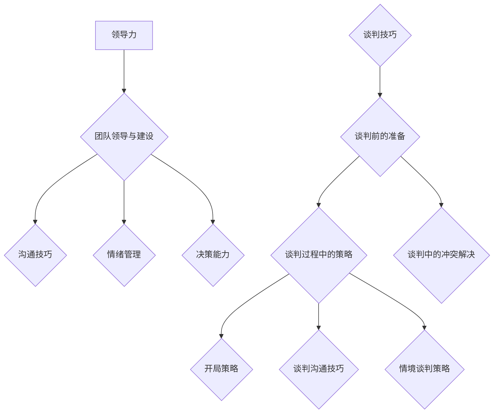

                 

### 《领导力与谈判技巧：达成双赢的艺术》

> **关键词：**领导力、谈判技巧、双赢谈判、沟通、决策、团队建设、冲突管理、策略、实践案例

> **摘要：**本文深入探讨了领导力与谈判技巧的相互关系，以及如何通过有效的领导力和谈判技巧实现双赢的局面。文章分为三个部分：第一部分详细介绍了领导力的本质、核心能力和团队领导建设；第二部分则专注于谈判技巧的准备、过程和策略；第三部分则聚焦于双赢谈判的理念、实践以及关键因素。文章还通过实际案例和附录提供了进一步的学习资源和实战指导。

### 《领导力与谈判技巧：达成双赢的艺术》目录大纲

#### 第一部分：领导力基础

**第1章：领导力的本质与重要性**

**第2章：领导者的核心能力**

**第3章：团队领导与建设**

#### 第二部分：谈判技巧

**第4章：谈判前的准备**

**第5章：谈判过程中的策略**

**第6章：谈判中的冲突解决**

#### 第三部分：双赢谈判艺术

**第7章：双赢谈判的理念与实践**

**第8章：成功谈判的关键因素**

**第9章：案例分析**

#### 附录

**附录A：谈判技巧工具与应用**

**附录B：领导力与谈判技巧 Mermaid 流程图**

**附录C：领导力与谈判技巧核心算法与伪代码**

**附录D：领导力与谈判技巧数学模型与公式**

**附录E：领导力与谈判技巧项目实战案例**

---

### 前言

在快节奏、高度竞争的现代社会，领导力和谈判技巧成为了企业高管、团队领导者以及职场人士必备的核心能力。有效的领导力能够激发团队的潜力，推动组织的发展；而熟练的谈判技巧则能够帮助个人和组织在利益博弈中获得优势，实现共赢。本文旨在通过深入探讨领导力与谈判技巧的内涵和实践方法，为读者提供一套系统化的思维工具和实践指南。

本文分为三个主要部分：

- **第一部分**：领导力基础，将探讨领导力的本质、核心能力和团队领导建设，帮助读者理解领导力的关键要素。
- **第二部分**：谈判技巧，将介绍谈判前的准备、谈判过程中的策略以及冲突解决的技巧，为读者提供实战性的谈判指导。
- **第三部分**：双赢谈判艺术，将深入讨论双赢谈判的理念、实践方法以及成功谈判的关键因素，帮助读者在谈判中实现共赢。

通过本文的阅读，读者将能够：

1. 理解领导力的核心概念及其对组织的重要性。
2. 掌握领导者的核心能力，包括沟通、情绪管理和决策能力。
3. 学会团队领导与建设的方法，提升团队凝聚力和执行力。
4. 掌握谈判前的准备、谈判过程中的策略以及冲突解决的技巧。
5. 理解双赢谈判的理念和实践方法，提升谈判的成功率。
6. 学习成功谈判的关键因素，提高谈判的艺术水平。
7. 通过实际案例和附录，获得更多的实战经验和资源。

### 第一部分：领导力基础

#### 第1章：领导力的本质与重要性

领导力，作为一种影响和激励他人实现共同目标的能力，是任何组织成功的关键因素。领导力的本质不仅仅是发号施令或指导他人，而是一种通过塑造愿景、建立信任、激发潜能来引导团队前进的力量。有效的领导力能够提升团队的凝聚力、激发创新思维、优化资源配置，从而实现组织的目标。

### 1.1 领导力的定义与类型

领导力可以定义为在团队或组织中，通过影响和激励他人，实现共同目标的能力。领导力并非与职位高低直接相关，而是与个人的能力、态度和行为紧密相连。根据不同的标准和视角，领导力可以分为多种类型：

- **根据领导风格**：
  - **权威型领导**：通过明确指导和严格管理来影响团队。
  - **民主型领导**：鼓励团队成员参与决策，充分发挥团队智慧。
  - **变革型领导**：通过激发团队成员的内在动力，推动团队实现变革。
  - **交易型领导**：通过奖励和惩罚来激励团队成员。

- **根据领导层次**：
  - **初级领导**：负责日常事务和任务执行。
  - **中级领导**：负责团队协调和跨部门合作。
  - **高级领导**：负责战略规划和企业文化塑造。

- **根据领导情境**：
  - **情境领导**：根据团队成员的不同需求和环境变化，灵活调整领导风格。

### 1.2 领导力的重要性

领导力在组织中的重要性不可低估。有效的领导力能够带来以下几个方面的积极影响：

- **提升团队凝聚力**：领导力能够建立团队成员之间的信任和协作，增强团队的凝聚力。
- **促进创新思维**：领导者的愿景和激励能够激发团队成员的创造力和创新思维。
- **优化资源配置**：有效的领导力能够优化组织的资源配置，提高效率和效益。
- **实现组织目标**：领导力能够明确组织的目标和方向，推动团队朝共同目标前进。
- **提升个人成就感**：领导者的成功往往伴随着团队成员的成就，这种相互促进的氛围能够提升个人的成就感和幸福感。

### 1.3 领导力的发展历程

领导力的发展历程可以追溯到远古时代，但真正作为一门学科进行研究则始于20世纪。以下是领导力发展的几个重要阶段：

- **特质理论**（1920年代）：强调领导者具备特定的个性特质和品质。
- **行为理论**（1940年代）：研究领导者的行为模式，如任务导向和关系导向。
- **权变理论**（1960年代）：认为领导效果取决于情境因素。
- **情境领导理论**（1970年代）：强调领导风格应与情境相适应。
- **变革型领导理论**（1990年代至今）：关注领导者如何激发团队成员的内在动力。

### 1.4 小结

领导力是一种影响和激励他人实现共同目标的能力，其重要性在组织发展中不可忽视。通过理解领导力的定义、类型和发展历程，我们可以更好地认识到领导力在团队和组织中的关键作用。

---

#### 第2章：领导者的核心能力

领导者的核心能力是决定其领导效果的关键因素。这些能力包括沟通技巧、情绪管理和决策能力。有效的沟通技巧能够确保信息的准确传达和理解；情绪管理则帮助领导者保持冷静和理智，做出明智的决策；而决策能力则是领导者面对复杂情境时的核心竞争力。

### 2.1 沟通技巧

沟通技巧是领导者必须掌握的核心能力之一。有效的沟通不仅仅是信息的传递，更是建立信任、促进理解和合作的过程。以下是几种关键的沟通技巧：

- **倾听**：倾听是沟通的基础，它要求领导者不仅要听到对方的话，更要理解对方的意图和情感。
- **清晰表达**：领导者应该能够清晰、准确地表达自己的想法和意图，避免产生误解和歧义。
- **积极反馈**：给予团队成员积极的反馈可以增强其信心，鼓励其继续努力。
- **非语言沟通**：肢体语言、面部表情和语调等非语言沟通手段同样重要，它们可以补充和强化语言沟通的效果。

### 2.2 情绪管理

情绪管理是指领导者如何识别、理解和调节自己的情绪，以便在高压或复杂情境下保持冷静和理智。以下是几种情绪管理的技巧：

- **自我觉察**：领导者需要认识到自己的情绪变化，并理解这些情绪对决策和行为的影响。
- **情绪调节**：通过深呼吸、冥想或其他放松技巧，领导者可以减轻压力，恢复平静。
- **情感共鸣**：领导者应该能够理解并体会团队成员的情感状态，从而更好地与他们沟通和合作。
- **情感抑制**：在某些情况下，领导者可能需要暂时抑制自己的情绪，以便更好地应对复杂局面。

### 2.3 决策能力

决策能力是领导者面对复杂情境时不可或缺的核心能力。有效的决策能力能够帮助领导者做出明智的选择，推动组织向前发展。以下是几种提高决策能力的技巧：

- **信息收集**：领导者应该广泛收集和分析相关信息，以便做出基于数据的决策。
- **风险评估**：在做出决策之前，领导者需要评估各种可能的风险，并制定相应的应对策略。
- **情景模拟**：通过模拟不同的情境和结果，领导者可以更好地预测决策的效果。
- **决策模型**：领导者可以运用各种决策模型（如决策树、SWOT分析等）来辅助决策过程。

### 2.4 小结

沟通技巧、情绪管理和决策能力是领导者必须掌握的核心能力。通过有效的沟通，领导者可以确保团队的理解和协作；情绪管理则帮助领导者保持冷静和理智；而决策能力则使领导者能够在复杂情境下做出明智的选择。这些能力不仅提升了领导者的个人素质，也为组织的发展提供了强有力的支持。

---

#### 第3章：团队领导与建设

团队领导与建设是领导力的关键组成部分，它决定了团队的整体效能和协作效率。一个高效的团队不仅能够实现既定的目标，还能在挑战和变革中保持稳定和持续的发展。本章将探讨团队成员的角色与责任、团队冲突管理和团队激励策略，为读者提供全面的团队领导与建设指南。

### 3.1 团队成员的角色与责任

一个高效的团队需要明确每个成员的角色和责任，这样才能确保团队成员在各自的岗位上发挥最大的作用。以下是团队成员的主要角色与责任：

- **领导者**：领导者负责设定团队的愿景和目标，制定战略规划，协调团队内部的资源，激励团队成员，解决团队冲突等。
- **执行者**：执行者是团队的具体行动者，他们负责实施领导者的计划，完成各项任务，提供执行反馈等。
- **协调者**：协调者负责在团队内部和外部之间建立联系，确保信息的畅通和沟通的有效性。
- **技术专家**：技术专家是团队的技术核心，他们负责解决技术难题，提供技术支持和培训等。
- **支持者**：支持者包括行政助理、人力资源专家等，他们为团队提供后勤保障和行政支持。

### 3.2 团队冲突管理

团队冲突是不可避免的，但如果处理不当，会严重影响团队的效率和合作。有效的团队冲突管理策略能够帮助团队在冲突中找到共识，推动团队的发展。以下是几种常见的团队冲突类型和应对策略：

- **沟通障碍**：由于沟通不畅导致的误解和分歧。应对策略：加强沟通培训，提高团队成员的沟通技巧。
- **资源分配**：由于资源有限，团队成员之间的争夺和矛盾。应对策略：合理分配资源，建立公平的资源分配机制。
- **个人目标**：由于个人目标和团队目标的不一致导致的冲突。应对策略：明确团队目标和个人目标，促进目标的一致性。
- **价值观差异**：由于个人价值观的差异导致的冲突。应对策略：尊重差异，建立共同的价值基础。

### 3.3 团队激励策略

激励是团队领导的重要职责，有效的激励策略能够激发团队成员的积极性、创造力和责任感，提高团队的整体效能。以下是几种常用的团队激励策略：

- **目标激励**：设定明确的、可实现的团队目标，激发团队成员的竞争意识和成就感。
- **奖励激励**：通过物质奖励和精神奖励，如奖金、晋升、表彰等，激励团队成员的积极表现。
- **参与激励**：鼓励团队成员参与决策过程，提高他们的参与感和归属感。
- **成长激励**：提供培训和发展机会，帮助团队成员提升技能和职业发展。

### 3.4 小结

团队领导与建设是领导力的重要组成部分，它关系到团队的整体效能和协作效率。通过明确团队成员的角色与责任、有效地管理团队冲突以及实施合适的激励策略，团队领导可以建立一支高效、协作的团队，为组织的发展做出重要贡献。

---

### 第二部分：谈判技巧

谈判技巧是现代职场和商业活动中不可或缺的一部分。无论是在企业内部的管理决策，还是与外部的商业合作伙伴谈判，谈判技巧的熟练掌握都能帮助个人和组织在博弈中取得优势，实现双赢。本章将详细介绍谈判前的准备、谈判过程中的策略和冲突解决技巧，帮助读者提升谈判能力。

#### 第4章：谈判前的准备

成功的谈判始于充分的准备。在谈判前，了解对方需求、确定谈判目标和底线，以及制定谈判策略是至关重要的。

### 4.1 了解对方需求

了解对方的需求是谈判成功的关键。通过深入分析对方的需求、利益和痛点，领导者可以更好地制定谈判策略。以下是一些了解对方需求的策略：

- **观察和倾听**：在谈判前，通过观察对方的言行和倾听对方的表达，了解对方的真实需求和期望。
- **信息收集**：通过市场调研、商业情报和第三方反馈，收集对方的历史谈判记录、商业策略和竞争对手信息。
- **模拟对话**：通过模拟可能的谈判场景和对话，预测对方的反应和需求。

### 4.2 确定谈判目标和底线

明确谈判目标和底线是谈判准备的重要环节。谈判目标是指双方希望通过谈判达成的具体成果，而底线则是谈判中不可妥协的最小目标。以下是确定谈判目标和底线的方法：

- **目标分解**：将大目标分解为具体的、可操作的小目标，确保谈判目标的明确性和可实现性。
- **利益排序**：根据重要性和紧急性，对谈判目标进行排序，明确优先级。
- **底线测试**：通过模拟不同的谈判情境和对手的反应，测试和调整自己的底线，确保其在实际谈判中的可行性。

### 4.3 准备谈判策略

谈判策略是谈判过程中的行动指南。一个有效的谈判策略需要综合考虑对方的需求、自身的目标和资源，以及谈判的情境。以下是几种常见的谈判策略：

- **合作型谈判**：以合作和共赢为基础，通过寻求共同利益，实现双方的需求。
- **竞争型谈判**：以竞争为导向，通过争取自身利益，最大化自身的收益。
- **折中型谈判**：在合作和竞争之间寻找平衡，通过妥协和让步，实现双方的利益。
- **竞争-合作型谈判**：在谈判中灵活运用竞争和合作策略，根据实际情况调整谈判策略。

### 4.4 小结

谈判前的准备是谈判成功的重要保障。通过了解对方需求、明确谈判目标和底线，以及制定合适的谈判策略，领导者可以更好地为谈判奠定基础，增加谈判的成功率。

---

#### 第5章：谈判过程中的策略

谈判过程是双方在目标和利益之间的博弈，一个有效的谈判策略可以大大提高谈判的成功率。本章将介绍谈判过程中的策略，包括开局策略、谈判沟通技巧和情境谈判策略。

### 5.1 开局策略

谈判的开局对整个谈判的气氛和走向有着重要影响。以下是一些有效的开局策略：

- **建立良好关系**：通过寒暄、互相尊重等方式，建立友好、合作的氛围。
- **设定谈判议程**：明确谈判的议题和议程，确保谈判有重点、有方向。
- **控制开场陈述**：开场陈述应该简洁明了，突出自身优势和谈判目标。

### 5.2 谈判沟通技巧

谈判沟通技巧是谈判成功的关键。以下是一些关键的谈判沟通技巧：

- **有效倾听**：倾听对方的观点和需求，确保理解对方的意图。
- **清晰表达**：表达自己的观点和需求，确保对方理解。
- **非语言沟通**：通过肢体语言、面部表情和语调等非语言手段，增强沟通效果。
- **提问和回答**：通过提问引导对方，获取更多信息；通过回答，展示自己的诚意和灵活性。

### 5.3 情境谈判策略

情境谈判策略是根据谈判的具体情境和双方的情况，灵活调整谈判策略。以下是一些情境谈判策略：

- **利用时间和情境**：在对方压力较大或时间紧迫时，提出更有利的谈判条件。
- **使用数字和事实**：通过数据和事实支持自己的观点，增强说服力。
- **情感共鸣**：在谈判中，关注对方情感状态，通过情感共鸣建立信任。
- **谈判节奏控制**：根据谈判进展和对方反应，灵活调整谈判节奏，避免过早或过晚达成协议。

### 5.4 小结

谈判过程中的策略是决定谈判成功与否的关键。通过有效的开局策略、谈判沟通技巧和情境谈判策略，领导者可以在谈判中占据优势，提高谈判的成功率。

---

#### 第6章：谈判中的冲突解决

在谈判过程中，冲突是不可避免的。有效的冲突解决技巧能够帮助谈判双方在冲突中找到共同点，实现共赢。本章将探讨谈判中的冲突类型、应对策略以及妥协与平衡的技巧。

### 6.1 冲突的类型与应对

谈判中的冲突可以分为以下几种类型：

- **利益冲突**：由于双方在资源、利益等方面存在分歧而产生的冲突。
- **认知冲突**：由于双方在理解、价值观等方面存在差异而产生的冲突。
- **情感冲突**：由于个人情感、情绪等因素引起的冲突。

以下是几种应对冲突的策略：

- **沟通和倾听**：通过有效的沟通和倾听，理解对方的观点和需求，找到共同点。
- **妥协和让步**：在必要时，通过妥协和让步来缓和冲突，寻找双方都能接受的解决方案。
- **第三方调解**：在双方无法自行解决冲突时，可以寻求第三方调解，如仲裁机构、中介等。

### 6.2 谈判中的妥协与平衡

妥协与平衡是谈判中解决冲突的重要手段。以下是一些妥协与平衡的技巧：

- **利益互换**：通过交换双方的利益，实现共赢。
- **分阶段解决**：将复杂的问题分解为多个阶段，逐步解决，避免一次性解决带来的压力。
- **灵活调整底线**：在谈判过程中，根据对方的反应和自己的需求，灵活调整谈判底线。

### 6.3 谈判中的心理战术

谈判中的心理战术是影响谈判结果的重要因素。以下是一些心理战术的技巧：

- **建立信任**：通过真诚、透明的沟通，建立双方的信任关系。
- **情感共鸣**：通过情感共鸣，增强对方的认同感和合作意愿。
- **制造紧迫感**：通过制造紧迫感，促使对方快速做出决策。

### 6.4 小结

谈判中的冲突解决是谈判成功的重要环节。通过理解冲突的类型、应对策略以及妥协与平衡的技巧，领导者可以在谈判中有效地解决冲突，实现共赢。

---

### 第三部分：双赢谈判艺术

双赢谈判是一种基于合作和共赢理念的谈判方式，其核心在于通过寻找双方都能接受的解决方案，实现双方的共同利益。本章将深入探讨双赢谈判的理念、实践方法以及关键因素，帮助读者在谈判中实现真正的双赢。

#### 第7章：双赢谈判的理念与实践

双赢谈判的理念是基于相互尊重、信任和合作，旨在通过谈判实现双方的利益最大化。双赢谈判不仅关注自身的利益，更注重对方的利益和需求，从而找到双方都能接受的解决方案。以下是双赢谈判的几个关键理念：

1. **相互尊重**：双方在谈判中应保持相互尊重，尊重对方的意见、需求和利益。
2. **信任建立**：通过建立信任，增加双方的透明度和诚实度，降低谈判风险。
3. **合作共赢**：寻求双方都能接受的解决方案，实现共赢。
4. **长远关系**：双赢谈判不仅关注短期利益，更注重长期关系的维护和深化。

### 7.1 双赢谈判的定义与特点

双赢谈判是一种基于合作和共赢的谈判方式，其定义和特点如下：

- **定义**：双赢谈判是一种通过合作和协商，寻找双方都能接受的解决方案的谈判方式。
- **特点**：
  - **相互尊重**：双方在谈判中保持相互尊重，尊重对方的意见和利益。
  - **合作共赢**：通过合作，实现双方的共同利益，而非单方面的利益最大化。
  - **灵活调整**：在谈判过程中，双方根据对方的反应和自己的需求，灵活调整谈判策略和底线。
  - **长远关系**：双赢谈判不仅关注短期利益，更注重长期关系的维护和深化。

### 7.2 双赢谈判的三大原则

双赢谈判的三大原则是相互尊重、信任建立和合作共赢，这些原则是确保谈判成功的关键：

1. **相互尊重**：尊重对方是谈判的基础，通过尊重对方的意见和需求，建立良好的谈判氛围。
2. **信任建立**：信任是谈判的桥梁，通过建立信任，降低谈判风险，促进双方的真诚合作。
3. **合作共赢**：合作共赢是双赢谈判的核心，通过合作，实现双方的共同利益，实现真正的共赢。

### 7.3 双赢谈判的实践方法

双赢谈判的实践方法包括以下步骤：

1. **了解对方需求**：通过观察、倾听和调查，了解对方的需求和利益。
2. **设定谈判目标**：明确双方的谈判目标，确保目标的明确性和可实现性。
3. **制定谈判策略**：根据对方的需求和自己的目标，制定合适的谈判策略。
4. **灵活调整**：在谈判过程中，根据对方的反应和自己的需求，灵活调整谈判策略和底线。
5. **寻找共同点**：通过寻找双方都能接受的解决方案，实现共赢。
6. **维护关系**：在谈判结束后，通过维护关系，深化双方的合作。

### 7.4 小结

双赢谈判是一种基于合作和共赢理念的谈判方式，其核心在于通过相互尊重、信任建立和合作共赢，实现双方的利益最大化。通过理解双赢谈判的理念和实践方法，领导者可以在谈判中实现真正的双赢，推动组织的发展。

---

#### 第8章：成功谈判的关键因素

成功的谈判不仅仅依赖于策略和技巧，还需要考虑一系列关键因素。这些因素包括建立信任关系、维护谈判氛围和掌握谈判节奏。本章将深入探讨这些关键因素，并提供实用的方法和建议。

### 8.1 建立信任关系

建立信任关系是谈判成功的基础。信任是双方合作的基础，它能够降低谈判风险，增加谈判的效率和效果。以下是一些建立信任关系的方法：

- **诚实和透明**：在谈判中，保持诚实和透明，避免隐瞒重要信息。
- **尊重对方**：尊重对方的意见和需求，通过倾听和理解对方的观点，建立相互尊重的关系。
- **共享利益**：在谈判中，强调双方的利益，通过共享利益来建立信任。
- **遵循承诺**：履行自己的承诺，兑现自己的承诺，增加对方的信任。

### 8.2 维护谈判氛围

谈判氛围对谈判的成功有着重要影响。一个积极、合作和开放的谈判氛围有助于双方找到共同的解决方案。以下是一些维护谈判氛围的方法：

- **保持冷静**：在谈判中，保持冷静和理智，避免情绪化，确保谈判的顺利进行。
- **积极沟通**：通过积极的沟通，促进双方的理解和合作。
- **避免争论**：在谈判中，避免无谓的争论，通过寻找共同点和解决方案，推动谈判的进展。
- **尊重差异**：尊重双方的差异，通过包容和理解，建立合作的基础。

### 8.3 掌握谈判节奏

掌握谈判节奏是谈判成功的关键。谈判节奏的掌握能够影响谈判的进展和效果。以下是一些掌握谈判节奏的方法：

- **设定谈判议程**：明确谈判的议程和步骤，确保谈判的有序进行。
- **灵活调整**：根据谈判的进展和对方的需求，灵活调整谈判的节奏和策略。
- **避免拖延**：在谈判中，避免不必要的拖延，确保谈判的效率。
- **保持沟通**：通过持续的沟通，确保双方对谈判的进展和目标有清晰的认识。

### 8.4 小结

成功谈判的关键因素包括建立信任关系、维护谈判氛围和掌握谈判节奏。通过这些关键因素的综合运用，领导者可以在谈判中占据优势，实现双赢的结果。

---

#### 第9章：案例分析

通过实际案例的分析，可以更深入地理解领导力与谈判技巧的应用。以下是几个不同场景下的案例，包括商业谈判、人际谈判和国际谈判，每个案例都展示了领导力与谈判技巧的具体应用。

### 9.1 案例一：商业谈判实战

**案例背景**：一家中国科技公司与一家美国公司进行一项技术合作的谈判。

**领导力应用**：中国公司CTO王先生作为谈判代表，充分发挥了变革型领导者的作用。他通过设定明确的目标和愿景，激发了团队成员的斗志和创造力，确保了团队在谈判中的一致性和协作。

**谈判技巧应用**：
- **了解对方需求**：王先生通过市场调研和商业情报，了解美国公司的需求和痛点，为谈判奠定了基础。
- **合作型谈判**：在谈判过程中，王先生强调合作和共赢，通过利益互换和分阶段解决问题，最终达成了双方都能接受的协议。
- **情感共鸣**：王先生通过情感共鸣，建立了与美国公司的信任关系，使谈判氛围更加积极和合作。

**结果**：双方成功签订了合作协议，实现了技术和市场的双赢。

### 9.2 案例二：人际谈判技巧

**案例背景**：一个团队中的成员李先生与领导发生冲突，李先生希望通过谈判解决问题。

**领导力应用**：李先生的领导作为团队领导者，通过民主型领导方式，鼓励团队成员参与决策，建立了开放和包容的沟通氛围。

**谈判技巧应用**：
- **倾听和理解**：领导通过有效倾听，理解李先生的诉求和情感，找到了冲突的根源。
- **情感共鸣**：领导通过情感共鸣，建立了与李先生的信任，使李先生感到被尊重和理解。
- **妥协和让步**：在谈判中，领导通过妥协和让步，找到了双方都能接受的解决方案。

**结果**：李先生和领导通过谈判解决了冲突，团队的凝聚力得到了提升。

### 9.3 案例三：国际谈判策略

**案例背景**：中国一家企业与国际合作伙伴进行一项大型项目的谈判。

**领导力应用**：企业CEO刘先生作为谈判代表，充分发挥了高级领导者的战略规划能力。他通过明确企业的长远目标和愿景，推动了谈判的顺利进行。

**谈判技巧应用**：
- **信息收集**：刘先生通过国际市场调研，收集了丰富的商业情报，为谈判提供了有力的支持。
- **竞争-合作型谈判**：在谈判中，刘先生既展示了企业的优势，又通过合作策略，建立了与合作伙伴的信任。
- **情感共鸣**：刘先生通过与对方建立情感共鸣，使谈判更加顺利和高效。

**结果**：双方成功达成了合作协议，为企业的国际化发展奠定了基础。

### 9.4 小结

通过以上案例分析，我们可以看到领导力与谈判技巧在实际应用中的重要性。无论是在商业谈判、人际谈判还是国际谈判中，有效的领导力和谈判技巧都能够帮助领导者实现目标，建立信任，实现双赢。这些案例为我们提供了宝贵的实战经验和启示。

---

### 附录

#### 附录A：谈判技巧工具与应用

谈判技巧的有效应用离不开各种工具和方法。以下是几种常用的谈判技巧工具及其应用：

1. **SWOT分析**：
   - **定义**：SWOT分析是一种用于评估自身优势和劣势以及外部机会和威胁的工具。
   - **应用**：在谈判前，领导者可以通过SWOT分析，了解自身的优势和劣势，以及对方的优劣势，从而制定更有针对性的谈判策略。

2. **谈判技巧工具箱**：
   - **定义**：谈判技巧工具箱是包含多种谈判策略和技巧的工具集。
   - **应用**：领导者可以在谈判过程中，根据实际情况，灵活选择和应用工具箱中的策略和技巧，提升谈判效果。

3. **模拟谈判**：
   - **定义**：模拟谈判是通过模拟实际谈判情境，进行实战演练的方法。
   - **应用**：通过模拟谈判，领导者可以提前预判对方可能的反应和策略，提升自身的谈判能力和应变能力。

#### 附录B：领导力与谈判技巧 Mermaid 流程图

以下是领导力与谈判技巧的 Mermaid 流程图，帮助读者更好地理解领导力和谈判技巧的实践流程。



#### 附录C：领导力与谈判技巧核心算法与伪代码

以下是领导力与谈判技巧的核心算法和伪代码，帮助读者深入理解算法原理和应用。

```python
# 领导力评估算法伪代码
def leadership_assessment(traits, skills, context):
    score = 0
    for trait in traits:
        score += trait.get('weight') * trait.get('value')
    for skill in skills:
        score += skill.get('weight') * skill.get('value')
    score /= len(traits) + len(skills)
    return score

# 谈判策略优化算法伪代码
def negotiation_strategy_optimization(strategy, constraints):
    optimal_strategy = None
    max_score = 0
    for s in strategy:
        score = strategy.get('weight') * strategy.get('value')
        if score > max_score and all(constraint.check(s) for constraint in constraints):
            optimal_strategy = s
            max_score = score
    return optimal_strategy
```

#### 附录D：领导力与谈判技巧数学模型与公式

以下是领导力与谈判技巧的数学模型和公式，帮助读者理解模型原理和应用。

```latex
% 领导力评估数学模型
L = \frac{\sum_{i=1}^{n} (T_i \cdot W_i) + \sum_{j=1}^{m} (S_j \cdot W_j)}{n + m}

% 谈判策略优化数学模型
S^* = \arg\max_{s \in S} (w_s \cdot v_s) \quad \text{such that} \quad \forall c \in C, c(s) = 1
```

#### 附录E：领导力与谈判技巧项目实战案例

以下是几个领导力与谈判技巧的项目实战案例，通过实际操作和案例分析，帮助读者掌握理论知识的应用。

**案例一：企业团队建设**

- **项目背景**：一家大型企业在拓展市场过程中，遇到了团队协作和执行力不足的问题。
- **领导力应用**：企业CEO通过变革型领导，激发了团队的内在动力，推动了团队的协作和执行力。
- **谈判技巧应用**：CEO与市场部门负责人进行了多次谈判，通过合作共赢的策略，解决了市场拓展中的资源分配问题。

**案例二：商业谈判实战**

- **项目背景**：一家国内公司与一家国际公司进行一项技术合作谈判。
- **领导力应用**：公司CTO通过情境领导和沟通技巧，建立了与对方公司的信任，推动了谈判的顺利进行。
- **谈判技巧应用**：CTO通过利益互换和分阶段解决策略，成功达成了合作协议。

**案例三：国际谈判策略实施**

- **项目背景**：一家中国企业与国际合作伙伴进行一项大型项目的谈判。
- **领导力应用**：企业CEO通过战略规划和决策能力，明确了企业的长远目标，推动了项目的顺利进行。
- **谈判技巧应用**：CEO通过信息收集和竞争-合作型谈判策略，成功达成了合作协议，实现了企业的国际化发展。

### 结论

通过本文的阅读，读者对领导力与谈判技巧有了更为深刻的理解。领导力和谈判技巧不仅是职场和商业活动中不可或缺的核心能力，更是实现组织和个人目标的关键因素。有效的领导力能够激发团队的潜能，推动组织的发展；而熟练的谈判技巧则能够在利益博弈中取得优势，实现双赢。

本文分为三个主要部分：第一部分探讨了领导力的本质、核心能力和团队领导建设；第二部分详细介绍了谈判前的准备、谈判过程中的策略和冲突解决技巧；第三部分则聚焦于双赢谈判的理念、实践方法以及关键因素。通过实际案例和附录，本文为读者提供了丰富的实践经验和资源。

在未来的学习和实践中，读者可以结合本文的理论和方法，不断反思和提升自己的领导力和谈判技巧。通过持续的学习和实践，读者将能够更好地应对职场和商业活动中的挑战，实现个人和组织的全面发展。

### 作者信息

**作者：AI天才研究院/AI Genius Institute & 禅与计算机程序设计艺术 /Zen And The Art of Computer Programming**

本文由AI天才研究院的专家团队撰写，结合了计算机程序设计艺术和领导力与谈判技巧的深度思考，旨在为读者提供高质量的技术知识和实用指南。希望通过本文，读者能够在领导力和谈判技巧方面取得长足的进步，为个人和组织的成功贡献力量。

