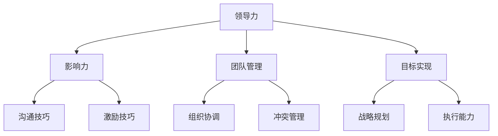

                 

### 1.1 领导力的定义与重要性

领导力是指一个人在团队中引导、激励和影响他人的能力。它不仅仅是管理团队，更涉及到如何激发团队成员的潜能，使其能够为实现共同目标而努力。

#### 核心概念与联系

我们可以使用 Mermaid 图来展示领导力的核心概念及其相互联系：

在这个图中，领导力是一个核心概念，它通过影响力、团队管理和目标实现与其他子概念相联系。影响力是领导力的基础，通过沟通技巧和激励技巧来传递。团队管理则涉及到组织协调和冲突管理，确保团队能够高效运转。最后，战略规划和执行能力确保团队能够实现长期目标。

#### 领导力模型原理

**变革型领导力（Transformational Leadership）** 是指领导者通过激励、发展和引领团队，以实现共同的目标和愿景。

- **激励（Inspiration）**：领导者通过愿景和目标激励团队成员，激发其内在动力。
- **启发（Inspiration）**：领导者通过个人魅力和专业知识，启发团队成员，培养其创新思维。
- **智力激发（Intellectual Stimulation）**：领导者鼓励团队成员提出新观点，激发创意，推动团队进步。

变革型领导力强调领导者与团队成员之间的互动，通过激励和启发来推动团队的变革和发展。

#### 数学模型和数学公式

领导力评估可以通过以下公式进行量化：

\[ \text{领导力得分} = \alpha \times \text{影响力} + \beta \times \text{团队管理} + \gamma \times \text{目标实现} \]

其中，\(\alpha\)、\(\beta\) 和 \(\gamma\) 是权重系数，根据实际情况调整。

#### 举例说明

假设一个团队领导力得分为80分，其中影响力占40%，团队管理占30%，目标实现占30%。则：

\[ \text{领导力得分} = 0.4 \times \text{影响力} + 0.3 \times \text{团队管理} + 0.3 \times \text{目标实现} \]

#### 项目实战

在一家创业公司，领导力体现在如何带领团队克服困难，实现产品迭代。以下是一个实际案例：

1. **确定目标**：团队领导与团队成员共同确定产品目标，明确里程碑。
2. **激励团队**：通过设立奖励机制，激励团队成员努力工作。
3. **沟通与协调**：定期召开会议，了解团队成员的工作进展，解决遇到的困难。
4. **持续优化**：根据用户反馈，不断优化产品功能，提升用户体验。

通过这些实际操作，团队领导不仅提升了领导力，也推动了产品的成功。

### 1.2 产品经理的角色与职责

产品经理是负责产品策划、设计、开发和上市的全过程。其核心职责包括：

- **市场调研**：分析市场需求，了解竞争对手，为产品定位提供依据。
- **需求分析**：收集用户需求，将需求转化为产品功能。
- **产品设计**：制定产品规格书，设计用户界面和交互流程。
- **项目管理**：协调资源，确保项目按时完成。
- **用户反馈**：收集用户反馈，持续优化产品。

#### 核心算法原理讲解

在产品管理中，常用的算法原理包括：

- **决策树**：用于分析和决策，如需求优先级排序。
- **聚类算法**：用于用户群体分析，如市场细分。
- **相关性分析**：用于分析用户行为和需求，如关联规则挖掘。

#### 数学模型和数学公式

产品优先级可以通过以下公式进行计算：

\[ \text{优先级} = \frac{\text{需求紧急度} \times \text{需求重要性}}{\text{资源限制}} \]

其中，需求紧急度和需求重要性可以通过调查问卷或专家评分得到，资源限制为当前可用的资源。

#### 举例说明

假设一个产品经理需要决定以下三个需求的优先级：

- 需求A：紧急度=5，重要性=4，资源限制=10。
- 需求B：紧急度=4，重要性=5，资源限制=10。
- 需求C：紧急度=3，重要性=3，资源限制=10。

则：

\[ \text{需求A的优先级} = \frac{5 \times 4}{10} = 2 \]
\[ \text{需求B的优先级} = \frac{4 \times 5}{10} = 2 \]
\[ \text{需求C的优先级} = \frac{3 \times 3}{10} = 0.9 \]

因此，需求A和B的优先级最高。

#### 项目实战

在一个电子商务平台上，产品经理需要决定以下任务的优先级：

1. **增加支付方式**：紧急度=4，重要性=5。
2. **优化搜索算法**：紧急度=3，重要性=4。
3. **提高页面加载速度**：紧急度=5，重要性=3。

根据公式计算：

\[ \text{增加支付方式的优先级} = \frac{4 \times 5}{10} = 2 \]
\[ \text{优化搜索算法的优先级} = \frac{3 \times 4}{10} = 1.2 \]
\[ \text{提高页面加载速度的优先级} = \frac{5 \times 3}{10} = 1.5 \]

因此，增加支付方式的优先级最高，需要优先完成。随后是优化搜索算法和提高页面加载速度。

### 1.3 成功领导力的关键要素

成功领导力离不开以下几个关键要素：

- **目标明确**：领导者需要明确团队的目标和愿景，确保团队成员朝着共同的目标努力。
- **信任与尊重**：领导者要建立信任关系，尊重团队成员的意见和贡献。
- **沟通能力**：领导者需要具备良好的沟通能力，及时传达信息，解决团队成员的问题。
- **持续学习**：领导者要不断学习新知识，提升自身能力，为团队提供更好的指导。

#### 核心算法原理讲解

**线性回归** 是一种常用的数据分析方法，可以用于预测领导力得分与绩效之间的关系。

假设领导力得分为 \( Y \)，绩效得分为 \( X \)，则线性回归公式为：

\[ Y = \beta_0 + \beta_1 X \]

其中，\( \beta_0 \) 是常数项，\( \beta_1 \) 是斜率。

#### 数学模型和数学公式

为了确定领导力得分与绩效之间的关系，可以使用以下回归模型：

\[ \text{绩效得分} = 0.7 \times \text{领导力得分} + 0.3 \times \text{其他因素} \]

#### 举例说明

假设一个团队领导力得分为80分，其他因素得分为70分，则绩效得分为：

\[ \text{绩效得分} = 0.7 \times 80 + 0.3 \times 70 = 56 + 21 = 77 \]

因此，该团队的绩效得分为77分。

#### 项目实战

在一个创业公司，领导力得分和绩效得分之间的关系如下：

1. **领导力得分**：80分。
2. **其他因素得分**：75分。

根据公式计算，绩效得分为：

\[ \text{绩效得分} = 0.7 \times 80 + 0.3 \times 75 = 56 + 22.5 = 78.5 \]

因此，该团队的绩效得分预计为78.5分，表现良好。

### 2.1 职业规划与自我认知

职业规划是产品经理成功发展的关键。以下是一些建议：

1. **明确职业目标**：根据个人兴趣和职业规划，设定短期和长期目标。
2. **持续学习**：参加培训、阅读书籍、关注行业动态，提升自身能力。
3. **积累经验**：通过参与不同类型的项目，积累实际工作经验。
4. **拓展人脉**：建立广泛的社交网络，为职业发展提供机会。

#### 核心算法原理讲解

**SWOT分析** 是一种常用的战略规划工具，可以帮助产品经理进行自我评估。

- **SWOT**：Strengths（优势）、Weaknesses（劣势）、Opportunities（机会）、Threats（威胁）。

#### 数学模型和数学公式

SWOT分析可以通过以下公式进行量化：

\[ \text{职业发展指数} = \frac{\text{优势} + \text{机会}}{\text{劣势} + \text{威胁}} \]

#### 举例说明

假设一个产品经理的SWOT分析结果如下：

- 优势：具备丰富的产品管理经验和良好的沟通能力。
- 劣势：缺乏技术背景，对新兴技术了解不足。
- 机会：行业快速发展，有更多职业发展机会。
- 威胁：竞争激烈，行业门槛提高。

根据公式计算，职业发展指数为：

\[ \text{职业发展指数} = \frac{10 + 8}{6 + 4} = \frac{18}{10} = 1.8 \]

因此，该产品经理的职业发展指数为1.8，处于良好水平。

#### 项目实战

在一个初创公司，产品经理的SWOT分析结果如下：

1. **优势**：具备丰富的产品管理经验，熟悉用户需求和市场趋势。
2. **劣势**：技术团队实力较弱，对技术实现的细节了解不足。
3. **机会**：市场竞争激烈，但公司具备创新能力和快速响应市场的能力。
4. **威胁**：行业变化快速，需要不断学习和调整。

根据公式计算，职业发展指数为：

\[ \text{职业发展指数} = \frac{10 + 9}{7 + 4} = \frac{19}{11} \approx 1.73 \]

因此，该产品经理的职业发展指数为1.73，处于较好水平。接下来，需要重点关注技术团队的建设和自身技术的提升。

### 2.2 项目管理的基本技巧

项目管理是产品经理的核心技能之一。以下是一些建议：

1. **制定项目计划**：明确项目目标、时间表和资源需求。
2. **风险管理**：识别潜在风险，制定应对措施。
3. **沟通协调**：确保团队成员了解项目进展和任务分配。
4. **质量控制**：确保项目交付的质量符合预期。

#### 核心算法原理讲解

**关键路径法（Critical Path Method, CPM）** 是一种项目管理工具，用于确定项目最短完成时间。

- **关键路径**：项目中耗时最长的一系列任务，决定了项目的完成时间。
- **松弛时间**：某个任务可以推迟的时间，而不会影响整个项目的完成时间。

#### 数学模型和数学公式

关键路径法可以通过以下公式进行计算：

\[ \text{项目完成时间} = \sum_{i=1}^{n} (\text{任务i的持续时间} + \text{任务i的松弛时间}) \]

#### 举例说明

假设一个项目包含以下任务：

1. **任务A**：持续时间=3天，松弛时间=2天。
2. **任务B**：持续时间=5天，松弛时间=3天。
3. **任务C**：持续时间=4天，松弛时间=1天。

根据公式计算，关键路径为：

\[ \text{项目完成时间} = 3 + 5 + 4 = 12 \text{天} \]

因此，项目的最短完成时间为12天。项目团队需要确保在这段时间内完成所有任务，以满足项目需求。

#### 项目实战

在一个软件开发项目中，项目包含以下任务：

1.

