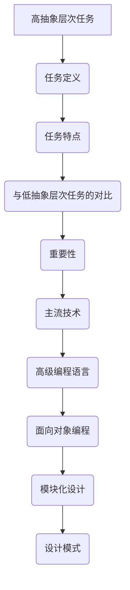

                 

# 高抽象层次任务的重要性

## 关键词
高抽象层次任务，软件开发，抽象层次，效率，创新，维护成本，高级编程语言，面向对象编程，模块化设计，设计模式，人工智能，机器学习，深度学习，自然语言处理，计算机视觉，开发工具，资源汇总。

## 摘要
高抽象层次任务在软件工程和人工智能领域具有重要意义。本文通过深入剖析高抽象层次任务的定义、特点、重要性以及核心概念，展示了其在软件开发和人工智能中的应用。本文还探讨了高抽象层次任务在具体项目中的实战案例，以及相关的开发工具和资源，为读者提供了全面的技术指南。

### 第一部分: 高抽象层次任务的重要性

#### 第1章: 高抽象层次任务概述

##### 1.1 高抽象层次任务的定义与特点

**高抽象层次任务**是指将复杂问题分解为一系列简单步骤，通过抽象的方式组织和处理数据的任务。它强调将具体的实现细节隐藏起来，专注于核心逻辑和功能。

高抽象层次任务具有以下特点：

1. **通用性**：高抽象层次任务适用于各种不同类型的应用场景，可以灵活地应用于不同的业务领域。
2. **可维护性**：通过将复杂逻辑封装在抽象层次上，使得代码更加模块化，易于维护和更新。
3. **可扩展性**：高抽象层次任务使得系统可以方便地添加新功能，而不需要对现有代码进行大量修改。
4. **复用性**：抽象层次上的代码可以方便地复用，减少重复开发的工作量。

与低抽象层次任务相比，高抽象层次任务具有更高的抽象级别，可以更好地应对复杂问题，提高软件开发效率，降低维护成本。

##### 1.2 高抽象层次任务的重要性

1. **提高软件开发效率**：通过高抽象层次任务，开发者可以专注于核心功能实现，减少对底层细节的关注，从而提高开发效率。
2. **促进软件创新**：高抽象层次任务提供了更灵活的开发模式，使得开发者可以更快地实现新功能，推动软件创新。
3. **降低软件维护成本**：高抽象层次任务使得代码更加模块化，易于维护和更新，降低了软件维护成本。

##### 1.3 主流高抽象层次任务技术

1. **高级编程语言**：高级编程语言如Python、Java和C++提供了丰富的抽象层次，使得开发者可以更加高效地编写代码。
2. **面向对象编程**：面向对象编程是一种高抽象层次任务技术，通过封装、继承和多态等概念，使得代码更加模块化和可复用。
3. **模块化设计**：模块化设计将系统划分为多个模块，每个模块负责一个特定的功能，提高了代码的可维护性和可扩展性。
4. **设计模式**：设计模式是一系列解决常见问题的抽象方案，可以提高代码的结构和可复用性。

#### 第2章: 高抽象层次任务的核心概念与联系

##### 2.1 高抽象层次任务的Mermaid流程图



##### 2.2 高抽象层次任务的核心算法原理讲解

**递归**是一种高抽象层次任务的核心算法，用于解决许多复杂问题。

```python
# 递归实现阶乘函数
def factorial(n):
    if n == 0:
        return 1
    else:
        return n * factorial(n-1)

# 计算阶乘示例
print(factorial(5))  # 输出120
```

递归的核心思想是将复杂问题分解为更简单的子问题，通过递归调用解决每个子问题，最终得到原始问题的解。

##### 2.3 数学模型和数学公式

$$
f(x) = x^2 + 2x + 1
$$

这是一个二次函数，描述了当输入x时，函数f的输出值。在这个例子中，f(x)的导数是2x+2。

详细讲解：这是一个二次函数，描述了当输入x时，函数f的输出值。在这个例子中，f(x)的导数是2x+2。

##### 2.4 数学模型和数学公式举例说明

输入x=2，计算二次函数f(x)的值：

$$
f(2) = 2^2 + 2*2 + 1 = 9
$$

### 第二部分: 高抽象层次任务的应用与实践

#### 第3章: 高抽象层次任务在软件开发中的应用

##### 3.1 高抽象层次任务在软件开发中的应用场景

高抽象层次任务在软件开发中具有广泛的应用场景，包括但不限于：

1. **软件需求分析**：通过高抽象层次任务，可以更加清晰地理解用户需求，并将其转化为可实现的软件功能。
2. **软件设计**：高抽象层次任务有助于设计师更好地组织系统架构，提高系统的可维护性和可扩展性。
3. **软件测试**：高抽象层次任务使得测试人员可以更加专注于测试核心功能，提高测试覆盖率。
4. **软件维护**：高抽象层次任务使得代码更加模块化，降低维护成本。

##### 3.2 高抽象层次任务的应用案例分析

1. **代码复用**：通过抽象层次，可以将通用功能封装为可复用的模块，提高代码复用率，减少重复工作。
2. **模块化设计**：将系统划分为多个模块，每个模块负责一个特定的功能，提高代码的可维护性和可扩展性。
3. **面向对象编程**：面向对象编程通过封装、继承和多态等概念，提高代码的结构和可复用性。
4. **设计模式**：设计模式提供了一系列解决常见问题的抽象方案，可以提高代码的结构和可复用性。

#### 第4章: 高抽象层次任务在人工智能中的应用

##### 4.1 高抽象层次任务在人工智能中的应用场景

高抽象层次任务在人工智能领域中具有重要意义，包括但不限于：

1. **机器学习**：通过高抽象层次任务，可以更加高效地处理大规模数据，提高模型训练速度和准确度。
2. **深度学习**：深度学习模型通常具有多个层次，通过高抽象层次任务，可以更好地组织和管理模型结构。
3. **自然语言处理**：自然语言处理任务通常涉及大量复杂操作，通过高抽象层次任务，可以简化处理过程，提高性能。
4. **计算机视觉**：计算机视觉任务通常需要处理大量图像数据，通过高抽象层次任务，可以更好地组织和分析图像特征。

##### 4.2 高抽象层次任务的应用案例分析

1. **人工智能算法设计**：通过高抽象层次任务，可以更加清晰地定义和实现人工智能算法，提高算法的可维护性和可扩展性。
2. **数据预处理**：通过高抽象层次任务，可以高效地处理和清洗大量数据，提高数据质量和模型性能。
3. **模型优化**：通过高抽象层次任务，可以更好地调整模型参数，提高模型性能和准确度。
4. **模型部署**：通过高抽象层次任务，可以方便地部署和管理人工智能模型，提高系统的可扩展性和可维护性。

### 第三部分: 高抽象层次任务的开发工具与资源

#### 第5章: 高抽象层次任务的开发工具与资源

##### 5.1 高级编程语言

高级编程语言如Python、Java和C++提供了丰富的抽象层次，使得开发者可以更加高效地编写代码。

1. **Python**：Python是一种动态类型、解释型编程语言，具有简洁的语法和强大的抽象能力，广泛应用于数据科学、机器学习和Web开发等领域。
2. **Java**：Java是一种静态类型、面向对象的编程语言，具有良好的跨平台性和可扩展性，广泛应用于企业级应用和移动开发等领域。
3. **C++**：C++是一种高性能、多范式编程语言，具有丰富的抽象机制和强大的底层控制能力，广泛应用于操作系统、游戏开发和嵌入式系统等领域。

##### 5.2 开发工具

开发工具是支持高抽象层次任务开发的重要工具，包括Integrated Development Environment (IDE)和Version Control System (VCS)。

1. **Integrated Development Environment (IDE)**：IDE是一种集成开发环境，提供了代码编辑、编译、调试等功能，提高了开发效率。常见的IDE包括Eclipse、IntelliJ IDEA、Visual Studio等。
2. **Version Control System (VCS)**：VCS是一种版本控制系统，用于管理和跟踪代码的修改和更新，提高了代码的可维护性和协作效率。常见的VCS包括Git、SVN、Mercurial等。

##### 5.3 资源

高抽象层次任务开发所需的资源包括在线文档、社区支持和培训材料。

1. **Online Documentation**：在线文档提供了编程语言、框架和工具的详细文档，帮助开发者快速掌握相关技术。
2. **Community Support**：社区支持为开发者提供了一个交流和学习的平台，可以帮助开发者解决问题、获取灵感和最佳实践。
3. **Training Materials**：培训材料包括在线课程、书籍和视频教程，为开发者提供了丰富的学习资源，提高了技术水平和开发能力。

### 第6章: 高抽象层次任务的资源汇总

##### 6.1 开发资源汇总

为了帮助读者更好地掌握高抽象层次任务的相关技术，以下汇总了一些常用的开发资源：

1. **开发工具推荐**：包括Python的PyCharm、Java的IntelliJ IDEA、C++的Visual Studio Code等。
2. **教程与指南**：包括Python官方文档、Java官方文档、C++教程等。
3. **社区与论坛**：包括Python官方论坛、Java社区、C++论坛等。
4. **开源项目**：包括GitHub、GitLab等平台上的开源项目，提供了丰富的代码示例和最佳实践。

##### 6.2 学习资源

以下是一些推荐的学习资源，帮助读者深入了解高抽象层次任务的相关技术：

1. **在线课程**：包括Coursera、edX等平台上的相关课程，如《Python编程基础》、《Java编程基础》、《C++编程基础》等。
2. **书籍推荐**：包括《Python编程：从入门到实践》、《Java核心技术》、《C++ Primer》等。
3. **博客与文章**：包括技术博客、论文和公众号文章等，提供了丰富的技术分享和案例分析。

### 附录

#### 附录 A: 高抽象层次任务开发工具与资源详细介绍

##### A.1 高级编程语言详细介绍

1. **Python**
   - 特点：简洁易懂，丰富的库和框架，广泛应用于数据科学、机器学习和Web开发等领域。
   - 资源：Python官方文档、PyCharm IDE、PyTorch框架、Scikit-learn库等。
   
2. **Java**
   - 特点：跨平台性，强大的标准库和生态系统，广泛应用于企业级应用和移动开发等领域。
   - 资源：Java官方文档、IntelliJ IDEA IDE、Spring框架、Hibernate库等。

3. **C++**
   - 特点：高性能，底层控制能力强，广泛应用于操作系统、游戏开发和嵌入式系统等领域。
   - 资源：C++官方文档、Visual Studio Code IDE、Boost库、Qt框架等。

##### A.2 开发工具详细介绍

1. **Integrated Development Environment (IDE)**
   - 功能：代码编辑、编译、调试、版本控制等，提高了开发效率。
   - 常见IDE：Eclipse、IntelliJ IDEA、Visual Studio、PyCharm等。

2. **Version Control System (VCS)**
   - 功能：版本控制、协同开发、代码管理，提高了代码的可维护性和协作效率。
   - 常见VCS：Git、SVN、Mercurial等。

##### A.3 资源详细介绍

1. **Online Documentation**
   - 内容：编程语言、框架和工具的详细文档，帮助开发者快速掌握相关技术。
   - 资源：Python官方文档、Java官方文档、C++官方文档等。

2. **Community Support**
   - 内容：技术交流、问题解答、最佳实践分享，为开发者提供了丰富的学习资源。
   - 资源：Python官方论坛、Java社区、C++论坛等。

3. **Training Materials**
   - 内容：在线课程、书籍、视频教程等，为开发者提供了丰富的学习资源。
   - 资源：Coursera、edX、Udemy等在线课程平台，技术书籍如《Python编程：从入门到实践》、《Java核心技术》、《C++ Primer》等。

##### B.1 常用算法与伪代码

**冒泡排序**

```python
# 伪代码示例：冒泡排序
def bubble_sort(arr):
    n = len(arr)
    for i in range(n):
        for j in range(0, n-i-1):
            if arr[j] > arr[j+1]:
                temp = arr[j]
                arr[j] = arr[j+1]
                arr[j+1] = temp

# 示例：使用冒泡排序对数组[5, 2, 8, 12, 7]进行排序
arr = [5, 2, 8, 12, 7]
bubble_sort(arr)
print(arr)  # 输出排序后的数组[2, 5, 7, 8, 12]
```

**二分搜索**

```python
# 伪代码示例：二分搜索
def binary_search(arr, target):
    low = 0
    high = len(arr) - 1
    while low <= high:
        mid = (low + high) // 2
        if arr[mid] == target:
            return mid
        elif arr[mid] < target:
            low = mid + 1
        else:
            high = mid - 1
    return -1

# 示例：在数组[1, 3, 5, 7, 9, 11]中查找目标值6
arr = [1, 3, 5, 7, 9, 11]
target = 6
index = binary_search(arr, target)
if index != -1:
    print(f"目标值{target}在数组中的索引为：{index}")
else:
    print(f"目标值{target}不在数组中")
```

**链表**

```python
# 伪代码示例：链表
class Node:
    def __init__(self, data):
        self.data = data
        self.next = None

class LinkedList:
    def __init__(self):
        self.head = None

    def append(self, data):
        new_node = Node(data)
        if self.head is None:
            self.head = new_node
        else:
            current = self.head
            while current.next:
                current = current.next
            current.next = new_node

    def display(self):
        current = self.head
        while current:
            print(current.data, end=" ")
            current = current.next
        print()

# 示例：创建链表并添加元素
ll = LinkedList()
ll.append(1)
ll.append(2)
ll.append(3)
ll.display()  # 输出1 2 3
```

**栈**

```python
# 伪代码示例：栈
class Stack:
    def __init__(self):
        self.items = []

    def is_empty(self):
        return len(self.items) == 0

    def push(self, item):
        self.items.append(item)

    def pop(self):
        if not self.is_empty():
            return self.items.pop()
        else:
            return None

    def peek(self):
        if not self.is_empty():
            return self.items[-1]
        else:
            return None

    def size(self):
        return len(self.items)

# 示例：使用栈实现后入先出（LIFO）操作
s = Stack()
s.push(1)
s.push(2)
s.push(3)
print(s.pop())  # 输出3
print(s.peek())  # 输出2
print(s.size())  # 输出2
```

**队列**

```python
# 伪代码示例：队列
class Queue:
    def __init__(self):
        self.items = []

    def is_empty(self):
        return len(self.items) == 0

    def enqueue(self, item):
        self.items.append(item)

    def dequeue(self):
        if not self.is_empty():
            return self.items.pop(0)
        else:
            return None

    def front(self):
        if not self.is_empty():
            return self.items[0]
        else:
            return None

    def size(self):
        return len(self.items)

# 示例：使用队列实现先进先出（FIFO）操作
q = Queue()
q.enqueue(1)
q.enqueue(2)
q.enqueue(3)
print(q.dequeue())  # 输出1
print(q.front())    # 输出2
print(q.size())     # 输出2
```

这些伪代码示例展示了常用的算法和数据结构，包括排序算法（冒泡排序）、搜索算法（二分搜索）、以及常见的数据结构（链表、栈、队列）的实现。通过这些示例，读者可以更好地理解这些算法和数据结构的工作原理，并能够在实际编程中使用它们。

---

**附录 B: 高抽象层次任务开发工具与资源详细介绍**

**A.1 高级编程语言详细介绍**

1. **Python**
   - **特点**：Python 是一种高级编程语言，以其简洁、易读的语法和强大的标准库而闻名。它适用于各种应用场景，包括数据分析、机器学习、Web开发、自动化脚本等。
   - **资源**：
     - **官方文档**：[Python官方文档](https://docs.python.org/3/)
     - **IDE**：PyCharm、Visual Studio Code
     - **框架和库**：Django、Flask（Web开发），NumPy、Pandas（数据处理），TensorFlow、PyTorch（机器学习和深度学习）

2. **Java**
   - **特点**：Java 是一种跨平台的面向对象编程语言，以其稳定性和可移植性而著称。它被广泛应用于企业级应用、Android开发、大数据处理等。
   - **资源**：
     - **官方文档**：[Java官方文档](https://docs.oracle.com/en/java/)
     - **IDE**：IntelliJ IDEA、Eclipse
     - **框架和库**：Spring、Hibernate（企业级应用），JavaFX（图形界面），Apache Kafka（大数据处理）

3. **C++**
   - **特点**：C++ 是一种高性能的编程语言，提供了对硬件操作的直接控制。它被广泛应用于操作系统开发、游戏开发、嵌入式系统等。
   - **资源**：
     - **官方文档**：[C++官方文档](https://en.cppreference.com/w/)
     - **IDE**：Visual Studio Code、CLion
     - **库和框架**：Boost、Qt（图形界面），OpenGL（图形编程）

**A.2 开发工具详细介绍**

1. **Integrated Development Environment (IDE)**
   - **功能**：IDE 提供了一个集成的开发环境，包括代码编辑器、编译器、调试器和版本控制系统等。
   - **常见IDE**：
     - **PyCharm**：适用于Python开发，具有强大的调试功能和丰富的插件。
     - **Visual Studio Code**：轻量级、可扩展的代码编辑器，适用于多种编程语言。
     - **IntelliJ IDEA**：适用于Java和多种其他编程语言，具有高效的代码补全和重构功能。

2. **Version Control System (VCS)**
   - **功能**：VCS 用于管理代码的版本和控制代码的变更。
   - **常见VCS**：
     - **Git**：分布式版本控制系统，广泛应用于开源项目和团队协作。
     - **SVN**：集中式版本控制系统，适用于大型项目和中央化管理。
     - **Mercurial**：分布式版本控制系统，类似于Git，但操作更简单。

**A.3 资源详细介绍**

1. **Online Documentation**
   - **内容**：提供了编程语言、框架和工具的详细文档，帮助开发者快速查找和使用相关功能。
   - **资源**：
     - **Python官方文档**：[Python官方文档](https://docs.python.org/3/)
     - **Java官方文档**：[Java官方文档](https://docs.oracle.com/en/java/)
     - **C++官方文档**：[C++官方文档](https://en.cppreference.com/w/)

2. **Community Support**
   - **内容**：开发者可以在社区中提问、解答问题、分享最佳实践，获得即时的帮助和反馈。
   - **资源**：
     - **Stack Overflow**：[Stack Overflow](https://stackoverflow.com/)
     - **Reddit**：[Reddit编程社区](https://www.reddit.com/r/learnprogramming/)
     - **GitHub**：[GitHub社区](https://github.community/)

3. **Training Materials**
   - **内容**：提供了在线课程、书籍和视频教程，帮助开发者系统学习编程语言和工具。
   - **资源**：
     - **Coursera**：[Coursera在线课程](https://www.coursera.org/)
     - **edX**：[edX在线课程](https://www.edx.org/)
     - **Udemy**：[Udemy在线课程](https://www.udemy.com/)

通过这些详细的附录内容，开发者可以更好地理解高级编程语言、开发工具和资源，从而更有效地进行高抽象层次任务的开发和实践。这些资源不仅提供了基础知识，还涵盖了实际应用和高级技巧，为开发者提供了全面的支持。

