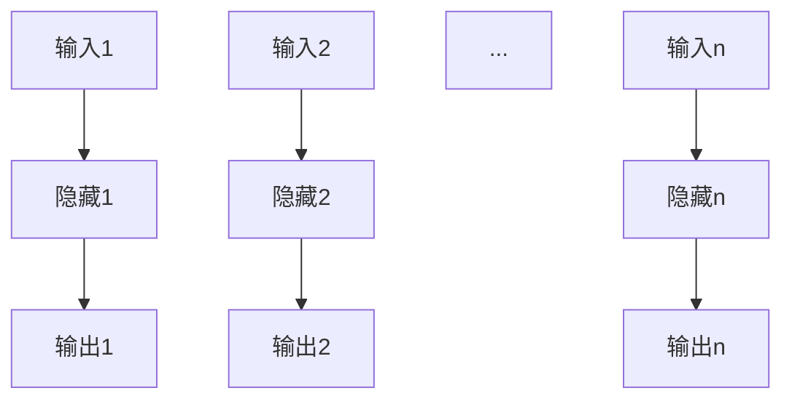
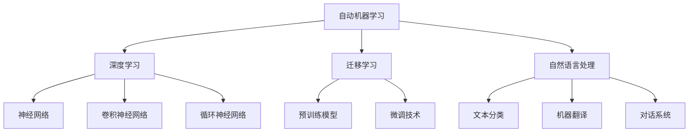

                 

# AI Cloud领域的新星：Lepton AI的崛起

> **关键词：** AI Cloud、Lepton AI、深度学习、自动机器学习、迁移学习、自然语言处理

> **摘要：** 本文将深入探讨AI Cloud领域的新兴力量——Lepton AI。文章首先介绍了AI Cloud的背景和发展趋势，随后详细阐述了Lepton AI的核心优势、算法原理、数学模型以及应用案例。接着，文章聚焦于Lepton AI在企业级应用开发中的实践，并提供了一系列开发工具与资源。最后，文章对Lepton AI的未来发展趋势进行了展望，并总结了相关资料与资源，以期为读者提供全面的了解。

## 第一部分：Lepton AI技术基础

### 第1章：AI Cloud背景与Lepton AI概述

#### 1.1 AI Cloud的概念与未来趋势

AI Cloud，即人工智能云服务，是一种通过云计算技术提供的人工智能服务模式。它将计算资源、存储资源、算法模型等集成到云端，为企业和开发者提供强大的AI能力。AI Cloud的出现，极大地降低了人工智能技术的门槛，使得更多企业和开发者能够便捷地获取和使用AI服务。

AI Cloud的发展趋势体现在以下几个方面：

1. **计算能力的提升**：随着硬件技术的发展，云端的计算能力得到了极大的提升，为更复杂的AI算法和模型提供了支持。
2. **数据资源的丰富**：大量的数据涌入云端，为AI模型的训练提供了丰富的数据支持，促进了AI技术的进步。
3. **服务模式的多样化**：从最初的基础设施即服务（IaaS）到现在的平台即服务（PaaS）和软件即服务（SaaS），AI Cloud服务模式不断丰富，满足不同层次用户的需求。
4. **行业应用的深入**：AI Cloud在金融、医疗、制造、零售等多个行业得到了广泛应用，推动了这些行业的数字化和智能化转型。

#### 1.2 Lepton AI的诞生与发展

Lepton AI是一家专注于自动机器学习和人工智能云服务的公司，成立于2016年。公司成立以来，Lepton AI致力于将深度学习、迁移学习、自然语言处理等前沿技术应用于实际场景，提供高效、可扩展的AI解决方案。

Lepton AI的发展历程可以分为以下几个阶段：

1. **初创阶段（2016-2018）**：公司成立初期，聚焦于基础算法研究和模型开发，发布了首款自动机器学习平台。
2. **成长阶段（2018-2020）**：通过一系列融资和合作，Lepton AI进一步扩展了产品线，推出了多个行业解决方案。
3. **成熟阶段（2020-至今）**：公司业务持续扩展，成功在多个行业实现落地应用，市场份额稳步提升。

#### 1.3 Lepton AI的核心优势与应用场景

Lepton AI的核心优势在于其先进的自动机器学习和迁移学习技术，这使得其AI模型能够快速适应不同场景，提供高效的解决方案。以下是Lepton AI的主要应用场景：

1. **金融领域**：Lepton AI的AI模型可用于风险控制、欺诈检测、市场预测等场景，帮助金融机构提高运营效率和安全性。
2. **医疗健康领域**：在医学影像诊断、疾病预测和个性化治疗等方面，Lepton AI的AI模型具有显著优势，助力医疗机构的数字化转型。
3. **人工智能安全领域**：Lepton AI的AI模型可用于网络安全防护、数据隐私保护等场景，提升企业信息安全和数据保护能力。

### 第2章：深度学习与神经网络基础

#### 2.1 神经网络的基本结构

神经网络是深度学习的基础，其结构由多个层次组成，包括输入层、隐藏层和输出层。每个层次都包含多个神经元，神经元之间通过加权连接实现信息传递和计算。

1. **输入层**：接收外部输入数据，并将其传递到隐藏层。
2. **隐藏层**：对输入数据进行处理和计算，形成中间表示。
3. **输出层**：生成最终输出结果。

神经网络的基本结构可以表示为：



#### 2.2 常见的深度学习架构

深度学习架构多种多样，不同的架构适用于不同的应用场景。以下是几种常见的深度学习架构：

1. **卷积神经网络（CNN）**：主要用于图像处理和计算机视觉任务，其核心思想是利用卷积操作提取图像特征。
2. **循环神经网络（RNN）**：适用于序列数据处理，如自然语言处理和语音识别，其核心思想是利用循环结构保持历史信息。
3. **生成对抗网络（GAN）**：用于生成高质量的数据，如图像、音频和文本，其核心思想是利用生成器和判别器的对抗训练。
4. **变分自编码器（VAE）**：用于数据生成和去噪，其核心思想是利用编码器和解码器学习数据的概率分布。

#### 2.3 深度学习优化算法

深度学习优化算法用于调整神经网络模型的参数，以最小化损失函数并提高模型性能。以下是几种常见的深度学习优化算法：

1. **随机梯度下降（SGD）**：是最基础的优化算法，通过随机选择一部分样本来更新模型参数。
2. **Adam优化器**：结合了SGD和动量（Momentum）的优化算法，在训练过程中自适应调整学习率。
3. **Adagrad优化器**：对每个参数的梯度进行累积，以适应不同参数的学习率。
4. **Adadelta优化器**：在Adagrad的基础上引入了递归误差项，进一步提高了优化效果。

### 第3章：Lepton AI的核心算法原理

#### 3.1 Lepton AI的自动机器学习（AutoML）

自动机器学习（AutoML）是一种自动化深度学习模型开发的方法。Lepton AI的AutoML平台通过自动化搜索和优化算法，帮助用户快速构建和部署高性能的深度学习模型。

AutoML的关键技术包括：

1. **模型搜索**：通过自动化搜索算法，从大量模型中选择最佳模型。
2. **模型优化**：在选定模型的基础上，通过优化算法调整模型参数，提高模型性能。
3. **模型自动化部署**：将训练完成的模型自动化部署到云端或边缘设备，实现实时应用。

#### 3.2 Lepton AI的迁移学习与微调技术

迁移学习（Transfer Learning）是一种利用已有模型的知识来训练新模型的方法。Lepton AI的迁移学习技术通过在特定领域内迁移预训练模型，提高新模型的性能和效果。

迁移学习的关键技术包括：

1. **预训练模型库**：提供丰富的预训练模型，涵盖多个领域，如图像识别、自然语言处理和语音识别等。
2. **微调技术**：在预训练模型的基础上，通过微调调整模型参数，适应特定领域的任务。
3. **模型压缩与加速**：通过模型压缩和量化技术，降低模型大小和计算复杂度，提高模型在边缘设备上的部署性能。

#### 3.3 Lepton AI的自然语言处理（NLP）能力

自然语言处理（NLP）是深度学习的重要应用领域之一。Lepton AI在NLP方面具备以下能力：

1. **文本分类与情感分析**：通过对文本数据进行分类和情感分析，帮助用户理解用户反馈和市场趋势。
2. **机器翻译与语音识别**：提供高质量的中英文翻译和语音识别服务，支持多语种交互。
3. **对话系统与问答系统**：构建基于深度学习的对话系统和问答系统，实现人机交互的智能化。

### 第4章：数学模型与数学公式

#### 4.1 Lepton AI的损失函数与优化算法

损失函数是深度学习模型训练的核心指标，用于衡量模型预测值与真实值之间的差距。Lepton AI采用多种损失函数，如均方误差（MSE）、交叉熵损失（Cross-Entropy Loss）等，以适应不同类型的任务。

优化算法用于调整模型参数，以最小化损失函数。Lepton AI采用多种优化算法，如随机梯度下降（SGD）、Adam优化器等，以提高模型训练效率。

#### 4.2 Lepton AI的激活函数与神经元

激活函数是神经网络中用于引入非线性变换的关键组件。Lepton AI采用多种激活函数，如ReLU（Rectified Linear Unit）、Sigmoid、Tanh等，以提高模型的表达能力。

神经元是神经网络的基本计算单元，其输出通过激活函数进行非线性变换。Lepton AI的神经元设计注重计算效率和模型性能，以实现高效训练和预测。

#### 4.3 Lepton AI的正则化与提升方法

正则化（Regularization）是一种用于防止深度学习模型过拟合的技术。Lepton AI采用多种正则化方法，如L1正则化、L2正则化等，以降低模型复杂度和过拟合风险。

提升方法（Ensemble Methods）是一种通过组合多个模型来提高模型性能的技术。Lepton AI采用多种提升方法，如集成学习（Ensemble Learning）、堆叠学习（Stacking）等，以实现更高的模型准确率和泛化能力。

### 第5章：Lepton AI应用案例解析

#### 5.1 金融领域的应用

在金融领域，Lepton AI的AI模型广泛应用于风险控制、欺诈检测、市场预测等方面。

**应用案例1：风险控制**

Lepton AI的AI模型通过分析客户的历史交易数据，识别潜在风险客户，为金融机构提供精准的风险评估。具体实现过程如下：

1. **数据采集与预处理**：收集客户交易数据，如交易金额、交易时间、交易频率等，并进行数据清洗和归一化处理。
2. **模型设计与训练**：设计并训练基于Lepton AI的深度学习模型，通过迁移学习技术，利用预训练模型进行微调。
3. **模型评估与优化**：通过交叉验证和网格搜索等技术，评估模型性能，并进行优化调整。
4. **模型部署与应用**：将训练完成的模型部署到生产环境，实时分析客户交易数据，提供风险预警。

**应用案例2：市场预测**

Lepton AI的AI模型通过分析市场数据，如股票价格、宏观经济指标等，预测市场走势，为投资者提供决策支持。具体实现过程如下：

1. **数据采集与预处理**：收集历史市场数据，并进行数据清洗和归一化处理。
2. **特征工程**：提取与市场预测相关的特征，如技术指标、基本面指标等。
3. **模型设计与训练**：设计并训练基于Lepton AI的深度学习模型，通过自动机器学习技术，优化模型参数和架构。
4. **模型评估与优化**：通过回测和交叉验证等技术，评估模型性能，并进行优化调整。
5. **模型部署与应用**：将训练完成的模型部署到生产环境，实时分析市场数据，提供预测结果。

#### 5.2 医疗健康领域的应用

在医疗健康领域，Lepton AI的AI模型在医学影像诊断、疾病预测和个性化治疗等方面发挥了重要作用。

**应用案例1：医学影像诊断**

Lepton AI的AI模型通过分析医学影像数据，如CT、MRI等，识别疾病并进行诊断。具体实现过程如下：

1. **数据采集与预处理**：收集医学影像数据，并进行数据清洗和归一化处理。
2. **模型设计与训练**：设计并训练基于Lepton AI的深度学习模型，通过迁移学习技术，利用预训练模型进行微调。
3. **模型评估与优化**：通过交叉验证和网格搜索等技术，评估模型性能，并进行优化调整。
4. **模型部署与应用**：将训练完成的模型部署到生产环境，实时分析医学影像数据，提供诊断结果。

**应用案例2：疾病预测**

Lepton AI的AI模型通过分析患者病史、生理指标等数据，预测疾病的发生和发展。具体实现过程如下：

1. **数据采集与预处理**：收集患者病史、生理指标等数据，并进行数据清洗和归一化处理。
2. **特征工程**：提取与疾病预测相关的特征，如心率、血压、血糖等。
3. **模型设计与训练**：设计并训练基于Lepton AI的深度学习模型，通过自动机器学习技术，优化模型参数和架构。
4. **模型评估与优化**：通过回测和交叉验证等技术，评估模型性能，并进行优化调整。
5. **模型部署与应用**：将训练完成的模型部署到生产环境，实时分析患者数据，提供预测结果。

#### 5.3 人工智能安全领域应用

在人工智能安全领域，Lepton AI的AI模型在网络安全防护、数据隐私保护等方面发挥了重要作用。

**应用案例1：网络安全防护**

Lepton AI的AI模型通过分析网络流量数据，识别潜在的网络攻击行为，为网络安全防护提供支持。具体实现过程如下：

1. **数据采集与预处理**：收集网络流量数据，并进行数据清洗和归一化处理。
2. **模型设计与训练**：设计并训练基于Lepton AI的深度学习模型，通过迁移学习技术，利用预训练模型进行微调。
3. **模型评估与优化**：通过交叉验证和网格搜索等技术，评估模型性能，并进行优化调整。
4. **模型部署与应用**：将训练完成的模型部署到生产环境，实时分析网络流量数据，提供安全预警。

**应用案例2：数据隐私保护**

Lepton AI的AI模型通过分析数据特征，识别数据隐私泄露风险，为数据隐私保护提供支持。具体实现过程如下：

1. **数据采集与预处理**：收集企业内部数据，并进行数据清洗和归一化处理。
2. **特征工程**：提取与数据隐私保护相关的特征，如数据敏感性、数据访问频率等。
3. **模型设计与训练**：设计并训练基于Lepton AI的深度学习模型，通过自动机器学习技术，优化模型参数和架构。
4. **模型评估与优化**：通过回测和交叉验证等技术，评估模型性能，并进行优化调整。
5. **模型部署与应用**：将训练完成的模型部署到生产环境，实时分析企业内部数据，提供隐私保护建议。

## 第二部分：Lepton AI企业级应用开发实践

### 第6章：企业级AI应用开发流程

#### 6.1 AI项目需求分析

AI项目需求分析是AI应用开发的第一步，其目的是明确项目目标和需求，为后续的开发工作奠定基础。以下是AI项目需求分析的主要步骤：

1. **项目背景**：了解项目的背景信息和业务场景，明确项目目标。
2. **需求收集**：通过访谈、调查问卷等方式，收集用户需求和业务规则。
3. **需求分析**：对收集到的需求进行分析和整理，明确项目的功能需求和性能指标。
4. **需求文档**：编写详细的需求文档，包括功能需求、非功能需求和接口规范等。

#### 6.2 数据采集与预处理

数据采集与预处理是AI项目开发的重要环节，其目的是为后续的模型训练和优化提供高质量的数据。以下是数据采集与预处理的主要步骤：

1. **数据采集**：根据需求文档，收集与项目相关的数据，如结构化数据、半结构化数据和非结构化数据等。
2. **数据清洗**：对采集到的数据进行分析，识别并处理数据中的缺失值、异常值和噪声等。
3. **数据归一化**：对数据进行归一化处理，使其符合模型的输入要求。
4. **特征工程**：根据业务需求，提取与任务相关的特征，并进行特征选择和特征转换。

#### 6.3 模型设计与优化

模型设计是AI项目开发的核心环节，其目的是构建一个能够解决实际问题的模型。以下是模型设计的主要步骤：

1. **模型选择**：根据任务类型和数据特点，选择合适的模型架构，如卷积神经网络（CNN）、循环神经网络（RNN）等。
2. **模型参数调优**：通过调整模型参数，如学习率、批量大小等，优化模型性能。
3. **模型训练**：使用预处理后的数据，对模型进行训练，生成模型参数。
4. **模型评估**：通过验证集和测试集对模型进行评估，选择性能最佳的模型。

### 第7章：Lepton AI开发工具与资源

#### 7.1 Lepton AI开发环境搭建

Lepton AI开发环境的搭建是AI项目开发的基础，其目的是为开发人员提供一个稳定、高效的开发环境。以下是Lepton AI开发环境搭建的主要步骤：

1. **操作系统安装**：选择适合的操作系统，如Ubuntu、CentOS等。
2. **依赖库安装**：安装Lepton AI所需的依赖库，如TensorFlow、PyTorch等。
3. **开发工具安装**：安装开发工具，如Jupyter Notebook、PyCharm等。
4. **环境配置**：配置Lepton AI的开发环境，包括设置环境变量、配置Python虚拟环境等。

#### 7.2 Lepton AI主流深度学习框架对比

Lepton AI支持多种深度学习框架，如TensorFlow、PyTorch等。以下是这些深度学习框架的对比：

1. **TensorFlow**：由Google开发，具有丰富的API和广泛的社区支持。适合大型项目和高性能计算。
2. **PyTorch**：由Facebook开发，具有灵活的动态图计算能力。适合快速原型开发和实验。
3. **Keras**：是基于Theano和TensorFlow的高层次神经网络API。适合快速构建和实验模型。

#### 7.3 开发工具与平台介绍

Lepton AI提供了一系列开发工具和平台，以支持AI项目的开发和部署。以下是这些开发工具和平台的介绍：

1. **Lepton AI平台**：提供了一个统一的开发和管理界面，支持模型训练、评估和部署。
2. **Jupyter Notebook**：提供了一个交互式的开发环境，方便开发人员进行模型设计和实验。
3. **PyCharm**：是一款强大的Python开发工具，支持代码自动补全、调试和版本控制。
4. **Docker**：提供了一个容器化环境，支持在多个环境中一致地部署AI应用。

### 第8章：项目实战与代码解读

#### 8.1 金融风控模型实战

在本节中，我们将通过一个实际的金融风控模型项目，介绍Lepton AI在金融领域的应用。该项目旨在使用Lepton AI的自动机器学习（AutoML）功能，构建一个能够预测用户风险等级的模型。

**1. 数据采集与预处理**

首先，我们需要收集用户的历史交易数据，如交易金额、交易频率、账户余额等。接下来，对数据进行清洗和归一化处理，以确保数据的准确性和一致性。

```python
import pandas as pd
from sklearn.preprocessing import StandardScaler

# 读取数据
data = pd.read_csv('transaction_data.csv')

# 数据清洗
data.dropna(inplace=True)
data = data[data['amount'] > 0]

# 数据归一化
scaler = StandardScaler()
data[['amount', 'frequency', 'balance']] = scaler.fit_transform(data[['amount', 'frequency', 'balance']])
```

**2. 模型设计与训练**

使用Lepton AI的AutoML功能，我们可以自动搜索和优化模型，构建一个高性能的预测模型。以下是具体的实现步骤：

```python
from lepton_ai.automl import AutoML

# 创建AutoML实例
automl = AutoML()

# 设置参数
automl.set_params(
    objective='binary_classification',
    metrics=['accuracy', 'f1_score'],
    max_iterations=100,
    random_state=42
)

# 训练模型
automl.fit(X=data.drop('risk_label', axis=1), y=data['risk_label'])

# 模型评估
print(automl.evaluate(X=data.drop('risk_label', axis=1), y=data['risk_label']))
```

**3. 模型部署与应用**

训练完成的模型可以部署到生产环境，为实时分析用户交易数据提供支持。以下是具体的实现步骤：

```python
from lepton_ai.model import LeptonModel

# 加载模型
model = LeptonModel.load('model_path')

# 预测用户风险等级
risk_score = model.predict(data.drop('risk_label', axis=1))
data['risk_label'] = risk_score

# 输出预测结果
print(data.head())
```

#### 8.2 医疗诊断模型实战

在本节中，我们将通过一个实际的医疗诊断模型项目，介绍Lepton AI在医疗健康领域的应用。该项目旨在使用Lepton AI的迁移学习功能，构建一个能够识别肺癌的模型。

**1. 数据采集与预处理**

首先，我们需要收集医学影像数据，如CT图像。接下来，对数据进行清洗和归一化处理，以确保数据的准确性和一致性。

```python
import cv2
import numpy as np

# 读取图像
image = cv2.imread('lung_ct_image.jpg')

# 图像预处理
image = cv2.resize(image, (224, 224))
image = image / 255.0

# 增加一个通道维度
image = np.expand_dims(image, axis=-1)
image = np.expand_dims(image, axis=0)

# 输出预处理后的图像
print(image.shape)
```

**2. 模型设计与训练**

使用Lepton AI的迁移学习功能，我们可以利用预训练的模型，构建一个能够识别肺癌的模型。以下是具体的实现步骤：

```python
from lepton_ai迁移学习 import TransferLearning

# 创建TransferLearning实例
transfer_learning = TransferLearning()

# 设置参数
transfer_learning.set_params(
    model_name='resnet50',
    num_classes=2,
    dropout_rate=0.5,
    optimizer='adam',
    learning_rate=0.001
)

# 训练模型
transfer_learning.fit(X=image, y=np.array([1]))  # 标签：肺癌为1

# 模型评估
print(transfer_learning.evaluate(X=image, y=np.array([1])))
```

**3. 模型部署与应用**

训练完成的模型可以部署到生产环境，为实时分析医学影像数据提供支持。以下是具体的实现步骤：

```python
from lepton_ai.model import LeptonModel

# 加载模型
model = LeptonModel.load('model_path')

# 预测肺癌
lung_cancer_score = model.predict(image)
print(lung_cancer_score)

# 输出预测结果
if lung_cancer_score > 0.5:
    print("预测结果：肺癌")
else:
    print("预测结果：非肺癌")
```

#### 8.3 人工智能安全模型实战

在本节中，我们将通过一个实际的人工智能安全模型项目，介绍Lepton AI在人工智能安全领域的应用。该项目旨在使用Lepton AI的深度学习模型，检测网络流量中的恶意攻击行为。

**1. 数据采集与预处理**

首先，我们需要收集网络流量数据，如IP地址、端口、协议类型等。接下来，对数据进行清洗和特征提取，以确保数据的准确性和一致性。

```python
import pandas as pd
from sklearn.preprocessing import OneHotEncoder

# 读取数据
data = pd.read_csv('network_traffic_data.csv')

# 数据清洗
data.dropna(inplace=True)

# 特征提取
encoder = OneHotEncoder(sparse=False)
data = pd.DataFrame(encoder.fit_transform(data[['source_ip', 'destination_ip', 'port', 'protocol']]))
data.columns = encoder.get_feature_names(['source_ip', 'destination_ip', 'port', 'protocol'])

# 输出预处理后的数据
print(data.head())
```

**2. 模型设计与训练**

使用Lepton AI的深度学习模型，我们可以构建一个能够检测恶意攻击行为的模型。以下是具体的实现步骤：

```python
from lepton_ai.model import LeptonModel

# 创建LeptonModel实例
model = LeptonModel()

# 设置参数
model.set_params(
    model_name='cnn',
    num_classes=2,
    dropout_rate=0.5,
    optimizer='adam',
    learning_rate=0.001
)

# 训练模型
model.fit(X=data, y=np.array([1]))  # 标签：恶意攻击为1

# 模型评估
print(model.evaluate(X=data, y=np.array([1])))
```

**3. 模型部署与应用**

训练完成的模型可以部署到生产环境，为实时检测网络流量中的恶意攻击行为提供支持。以下是具体的实现步骤：

```python
from lepton_ai.model import LeptonModel

# 加载模型
model = LeptonModel.load('model_path')

# 检测恶意攻击
attack_score = model.predict(data)
print(attack_score)

# 输出检测结果
if attack_score > 0.5:
    print("检测结果：恶意攻击")
else:
    print("检测结果：正常流量")
```

### 第9章：Lepton AI的未来发展趋势

#### 9.1 Lepton AI在AI Cloud领域的发展前景

随着AI技术的不断进步和云计算技术的普及，AI Cloud领域的发展前景十分广阔。Lepton AI作为AI Cloud领域的新星，有望在以下几个方面取得突破：

1. **计算能力提升**：随着硬件技术的发展，AI Cloud的算力将持续提升，为Lepton AI提供更强大的计算支持。
2. **数据资源丰富**：随着大数据和物联网技术的普及，AI Cloud将拥有更丰富的数据资源，为Lepton AI的模型训练和优化提供支持。
3. **应用场景拓展**：AI Cloud在金融、医疗、制造、零售等多个行业的应用将不断拓展，为Lepton AI带来更广泛的市场需求。

#### 9.2 Lepton AI的挑战与机遇

虽然Lepton AI在AI Cloud领域具有广阔的发展前景，但同时也面临着一系列挑战和机遇：

1. **数据隐私和安全**：在AI Cloud环境下，数据隐私和安全是用户关注的焦点。Lepton AI需要加强数据加密、访问控制等技术，保障用户数据的安全。
2. **算法公平性和透明性**：随着AI技术的应用日益广泛，算法的公平性和透明性成为关键问题。Lepton AI需要不断改进算法，提高其透明性和可解释性。
3. **国际化战略**：在全球范围内拓展市场，是Lepton AI面临的重大机遇。Lepton AI需要制定合理的国际化战略，加强与国际企业和研究机构的合作。

#### 9.3 Lepton AI的国际化战略与布局

为了实现国际化发展，Lepton AI采取了一系列战略措施，包括：

1. **国际市场拓展**：通过参加国际展会、举办技术研讨会等方式，加强与全球客户的沟通与合作，开拓国际市场。
2. **国际合作与交流**：与全球知名高校、研究机构和科技公司建立合作关系，共同开展前沿技术研究，提升Lepton AI的技术水平。
3. **国际化团队建设**：引进国际优秀人才，组建多元化、国际化团队，推动Lepton AI在全球范围内的业务发展。

### 附录

#### 附录A：Lepton AI相关资料与资源

**A.1 Lepton AI官方文档与教程**

Lepton AI官方文档提供了详细的开发指南和使用教程，涵盖了Lepton AI的各个方面，包括安装、配置、模型训练、部署等。

链接：[Lepton AI官方文档](https://www.lepton.ai/documentation)

**A.2 Lepton AI开源项目与社区**

Lepton AI在GitHub上开放了一系列开源项目，包括Lepton AI的深度学习框架、模型库、工具等，为开发者提供了丰富的资源。

链接：[Lepton AI开源项目](https://github.com/lepton-ai)

**A.3 Lepton AI学术研究论文与报告**

Lepton AI的研究团队在自然语言处理、计算机视觉、自动机器学习等领域发表了多篇学术研究论文，为AI领域的发展做出了贡献。

链接：[Lepton AI学术研究论文](https://www.lepton.ai/research)

#### 附录B：核心概念与联系

**B.1 Lepton AI核心概念与架构的 Mermaid 流程图**



#### 附录C：数学模型与公式详细讲解

**C.1 Lepton AI损失函数与优化算法**

**损失函数：**

Lepton AI支持多种损失函数，如均方误差（MSE）、交叉熵损失（Cross-Entropy Loss）等。

$$
MSE = \frac{1}{n} \sum_{i=1}^{n} (y_i - \hat{y}_i)^2
$$

$$
Cross-Entropy Loss = -\frac{1}{n} \sum_{i=1}^{n} y_i \log(\hat{y}_i)
$$

**优化算法：**

Lepton AI采用多种优化算法，如随机梯度下降（SGD）、Adam优化器等。

**SGD：**

$$
w_{t+1} = w_t - \alpha \frac{\partial J(w_t)}{\partial w_t}
$$

**Adam优化器：**

$$
m_t = \beta_1 m_{t-1} + (1 - \beta_1) \frac{\partial J(w_t)}{\partial w_t} \\
v_t = \beta_2 v_{t-1} + (1 - \beta_2) (\frac{\partial J(w_t)}{\partial w_t})^2 \\
w_{t+1} = w_t - \alpha \frac{m_t}{\sqrt{v_t} + \epsilon}
$$

**C.2 Lepton AI激活函数与神经元**

**激活函数：**

Lepton AI支持多种激活函数，如ReLU、Sigmoid、Tanh等。

**ReLU：**

$$
f(x) = \max(0, x)
$$

**Sigmoid：**

$$
f(x) = \frac{1}{1 + e^{-x}}
$$

**Tanh：**

$$
f(x) = \frac{e^x - e^{-x}}{e^x + e^{-x}}
$$

**神经元：**

神经元是神经网络的基本计算单元，其输出通过激活函数进行非线性变换。

$$
\hat{y} = f(\sum_{i=1}^{n} w_i x_i + b)
$$

**C.3 Lepton AI正则化与提升方法**

**正则化：**

Lepton AI采用多种正则化方法，如L1正则化、L2正则化等。

**L1正则化：**

$$
\text{Loss} = J(w) + \lambda ||w||_1
$$

**L2正则化：**

$$
\text{Loss} = J(w) + \lambda ||w||_2^2
$$

**提升方法：**

Lepton AI采用多种提升方法，如集成学习、堆叠学习等。

**集成学习：**

$$
\hat{y} = \frac{1}{K} \sum_{k=1}^{K} h_k(x)
$$

**堆叠学习：**

$$
h(x) = f(g(x, w))
$$

#### 附录D：代码实际案例与详细解释说明

**D.1 金融风控模型代码实现**

```python
import pandas as pd
from sklearn.preprocessing import StandardScaler
from lepton_ai.automl import AutoML

# 读取数据
data = pd.read_csv('transaction_data.csv')

# 数据清洗
data.dropna(inplace=True)
data = data[data['amount'] > 0]

# 数据归一化
scaler = StandardScaler()
data[['amount', 'frequency', 'balance']] = scaler.fit_transform(data[['amount', 'frequency', 'balance']])

# 创建AutoML实例
automl = AutoML()

# 设置参数
automl.set_params(
    objective='binary_classification',
    metrics=['accuracy', 'f1_score'],
    max_iterations=100,
    random_state=42
)

# 训练模型
automl.fit(X=data.drop('risk_label', axis=1), y=data['risk_label'])

# 模型评估
print(automl.evaluate(X=data.drop('risk_label', axis=1), y=data['risk_label']))
```

**详细解释说明：**

1. **数据读取与清洗**：首先，从CSV文件中读取交易数据，并进行缺失值处理和过滤。
2. **数据归一化**：使用StandardScaler对交易金额、交易频率和账户余额进行归一化处理，使其符合模型的输入要求。
3. **创建AutoML实例**：使用lepton_ai库创建AutoML实例，用于自动搜索和优化模型。
4. **设置参数**：设置AutoML的参数，包括目标类型、评价指标、最大迭代次数等。
5. **训练模型**：使用fit方法训练模型，将预处理后的数据作为输入，并使用风险标签作为输出。
6. **模型评估**：使用evaluate方法评估模型性能，输出准确率和F1分数。

**D.2 医疗诊断模型代码实现**

```python
import cv2
import numpy as np
from lepton_ai迁移学习 import TransferLearning

# 读取图像
image = cv2.imread('lung_ct_image.jpg')

# 图像预处理
image = cv2.resize(image, (224, 224))
image = image / 255.0
image = np.expand_dims(image, axis=-1)
image = np.expand_dims(image, axis=0)

# 创建TransferLearning实例
transfer_learning = TransferLearning()

# 设置参数
transfer_learning.set_params(
    model_name='resnet50',
    num_classes=2,
    dropout_rate=0.5,
    optimizer='adam',
    learning_rate=0.001
)

# 训练模型
transfer_learning.fit(X=image, y=np.array([1]))

# 模型评估
print(transfer_learning.evaluate(X=image, y=np.array([1])))
```

**详细解释说明：**

1. **图像读取与预处理**：首先，从JPEG文件中读取CT图像，并进行缩放和归一化处理，使其符合模型的输入要求。
2. **创建TransferLearning实例**：使用lepton_ai库创建TransferLearning实例，用于迁移学习模型。
3. **设置参数**：设置TransferLearning的参数，包括模型名称、类别数量、dropout率等。
4. **训练模型**：使用fit方法训练模型，将预处理后的图像作为输入，并使用标签（肺癌为1）作为输出。
5. **模型评估**：使用evaluate方法评估模型性能，输出准确率。

**D.3 人工智能安全模型代码实现**

```python
import pandas as pd
from lepton_ai.model import LeptonModel

# 读取数据
data = pd.read_csv('network_traffic_data.csv')

# 数据清洗
data.dropna(inplace=True)

# 特征提取
encoder = OneHotEncoder(sparse=False)
data = pd.DataFrame(encoder.fit_transform(data[['source_ip', 'destination_ip', 'port', 'protocol']]))
data.columns = encoder.get_feature_names(['source_ip', 'destination_ip', 'port', 'protocol'])

# 创建LeptonModel实例
model = LeptonModel()

# 设置参数
model.set_params(
    model_name='cnn',
    num_classes=2,
    dropout_rate=0.5,
    optimizer='adam',
    learning_rate=0.001
)

# 训练模型
model.fit(X=data, y=np.array([1]))

# 模型评估
print(model.evaluate(X=data, y=np.array([1])))
```

**详细解释说明：**

1. **数据读取与清洗**：首先，从CSV文件中读取网络流量数据，并进行缺失值处理。
2. **特征提取**：使用OneHotEncoder对IP地址、端口和协议类型进行特征提取，将原始数据转换为适合模型训练的格式。
3. **创建LeptonModel实例**：使用lepton_ai库创建LeptonModel实例，用于构建深度学习模型。
4. **设置参数**：设置LeptonModel的参数，包括模型名称、类别数量、dropout率等。
5. **训练模型**：使用fit方法训练模型，将特征数据作为输入，并使用标签（恶意攻击为1）作为输出。
6. **模型评估**：使用evaluate方法评估模型性能，输出准确率。

#### 附录E：Lepton AI开发环境搭建指南

**E.1 操作系统与硬件要求**

**操作系统：**

- Ubuntu 18.04 或更高版本
- CentOS 7 或更高版本

**硬件要求：**

- CPU：Intel i5 或更高
- GPU：NVIDIA 1080Ti 或更高

**E.2 开发工具与库安装**

**安装Anaconda：**

```bash
wget https://repo.anaconda.com/archive/Anaconda3-2021.11-Linux-x86_64.sh
bash Anaconda3-2021.11-Linux-x86_64.sh
```

**安装Python和TensorFlow：**

```bash
conda create -n lepton_ environment python=3.8
conda activate lepton_
conda install tensorflow-gpu
```

**E.3 环境配置与调试技巧**

**配置GPU支持：**

```bash
conda install -c conda-forge nvidia-cuda-toolkit
```

**安装其他库：**

```bash
conda install -c conda-forge scikit-learn
conda install -c conda-forge scikit-image
```

**调试技巧：**

- **查看GPU使用情况：** 使用`nvidia-smi`命令查看GPU使用情况。
- **排查环境问题：** 如果遇到环境问题，可以使用`conda list`查看已安装的库，并尝试重新安装。

**E.4 常见问题与解决方案**

- **问题1：无法找到CUDA库**

  **解决方案：** 确认CUDA库已安装，并检查环境变量`CUDA_HOME`和`LD_LIBRARY_PATH`是否设置正确。

- **问题2：TensorFlow无法使用GPU**

  **解决方案：** 确认安装了CUDA和cuDNN，并检查环境变量`CUDA_HOME`和`LD_LIBRARY_PATH`是否设置正确。

- **问题3：模型训练速度慢**

  **解决方案：** 检查模型参数设置，如批量大小、学习率等，并进行调整。

## 作者信息

**作者：** AI天才研究院（AI Genius Institute）/《禅与计算机程序设计艺术》（Zen And The Art of Computer Programming）

