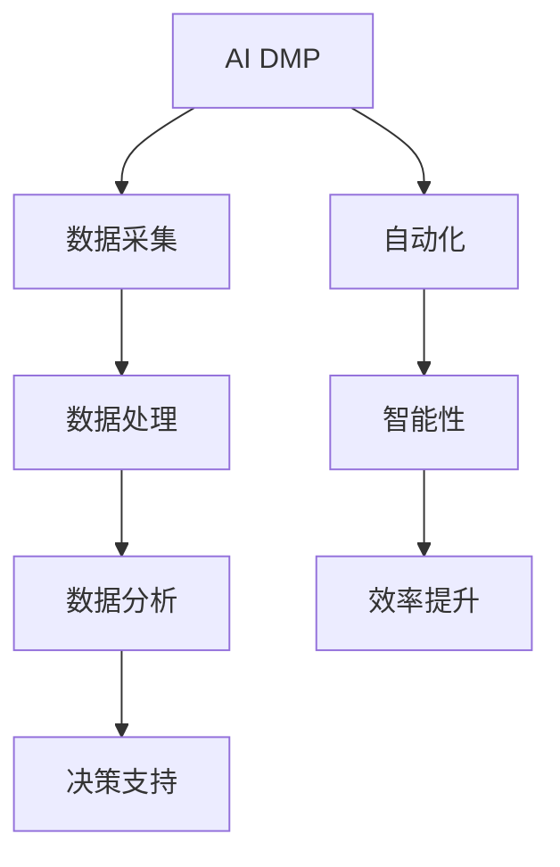
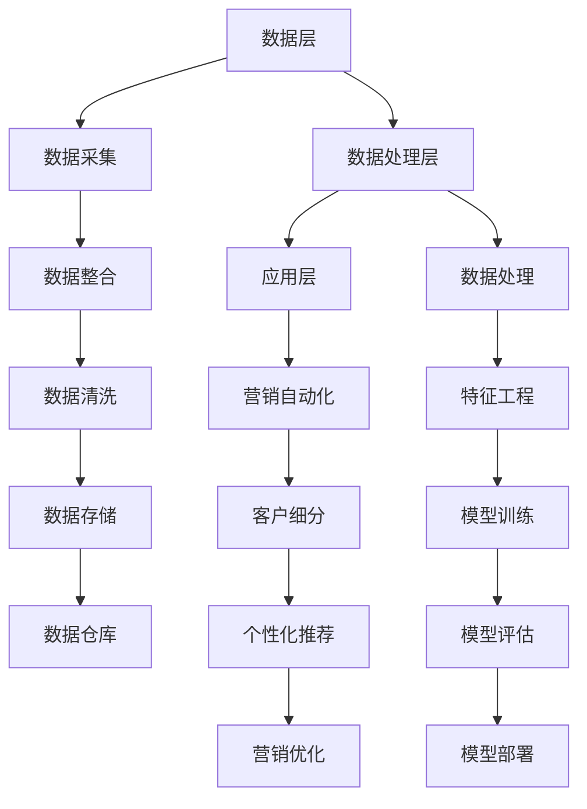

                 

### 文章标题

### AI DMP 数据基建：如何利用数据提升营销效率

---

#### 关键词：
- AI DMP
- 数据管理平台
- 营销自动化
- 客户细分
- 个性化推荐
- 数据安全与隐私保护

---

#### 摘要：

本文深入探讨了AI驱动的数据管理平台（AI DMP）的构建与应用，重点分析了如何通过数据采集、处理和优化，提升营销活动的效率。文章首先介绍了AI DMP的核心概念、架构及其在营销中的应用，随后详细阐述了数据处理技术、营销自动化、客户细分与个性化推荐等关键环节。通过实际项目案例，本文展示了AI DMP在实际操作中的效果与优化策略，并探讨了其在不同行业中的应用以及数据安全与隐私保护的重要性。文章最后提供了AI DMP开发实践的相关指导，为读者提供了全面而深入的见解。

---

**注**：本文将遵循目录大纲结构，逐一展开每个章节的内容。我们将使用Mermaid流程图、伪代码、数学模型和实际案例来详细阐述核心概念和原理，确保读者能够全面理解和掌握AI DMP的应用与开发。

---

### 第一部分：AI DMP数据基建概述

#### 第1章：AI DMP概念与分类

##### 1.1 AI DMP的定义

AI DMP（Data Management Platform）是一种基于人工智能技术的数据管理平台，它能够高效地采集、整合、处理和分析大规模数据，为营销活动提供精准的数据支持。与传统DMP相比，AI DMP在数据处理和决策支持方面具有更高的智能性和自动化水平。

###### **核心概念与联系：**



##### 1.1.1 AI DMP的定义

AI DMP（Data Management Platform）是一种基于人工智能技术的数据管理平台，它能够高效地采集、整合、处理和分析大规模数据，为营销活动提供精准的数据支持。与传统DMP相比，AI DMP在数据处理和决策支持方面具有更高的智能性和自动化水平。

###### **核心概念与联系：**


- **数据采集**：AI DMP通过多种渠道采集用户行为数据，包括网站点击、购买记录、社交媒体互动等。
- **数据处理**：利用人工智能技术对采集到的数据进行分析和清洗，去除无效和错误的数据，提取有用的信息。
- **数据分析**：通过对清洗后的数据进行分析，提取用户画像、行为模式等，为营销决策提供支持。
- **决策支持**：基于数据分析的结果，自动化生成营销策略，如广告投放、客户跟进等。
- **自动化**：AI DMP通过自动化技术，减少人工干预，提高数据处理和决策的效率。
- **智能性**：AI DMP利用机器学习、自然语言处理等技术，对数据进行深度分析和预测，提升营销效果。
- **效率提升**：通过自动化和智能化的数据处理和决策，大幅提升营销活动的效率，降低成本。

##### 1.1.2 AI DMP与传统DMP的区别

传统DMP（Data Management Platform）主要依赖于手动处理数据，功能相对简单，主要侧重于数据的整合和存储。而AI DMP则在此基础上引入了人工智能技术，能够实现更高效的数据处理和分析，提供更精准的营销策略。

###### **对比分析：**

| 特点 | AI DMP | 传统DMP |
| --- | --- | --- |
| 数据处理方式 | 自动化、智能化 | 手动、半自动化 |
| 数据分析能力 | 深度分析、预测 | 基本分析、报告 |
| 营销决策支持 | 自动化生成策略 | 需人工分析制定 |
| 效率 | 高效 | 较低 |
| 成本 | 较低 | 较高 |
| 用户体验 | 精准、个性化 | 一致、标准化 |

##### 1.1.3 AI DMP的核心功能

AI DMP的核心功能包括数据采集与整合、数据分析与挖掘、数据应用与优化，这些功能共同构成了一个完整的营销数据生态系统。

###### **核心功能概述：**

- **数据采集与整合**：通过自动化工具采集各种来源的数据，如网站、APP、社交媒体等，然后进行数据整合，构建一个完整的数据视图。
- **数据分析与挖掘**：利用机器学习和数据分析技术，对整合后的数据进行深度分析和挖掘，提取用户行为模式、偏好等信息。
- **数据应用与优化**：将分析结果应用于营销策略的制定和优化，如个性化推荐、精准广告投放、客户细分等，以提高营销效果。

##### 1.2 AI DMP的架构与组成

AI DMP的架构通常包括数据层、数据处理层和应用层，每个层次都有其特定的功能和技术实现。

###### **架构组成：**



- **数据层**：负责数据的采集、存储和整合，是整个AI DMP的基础。
- **数据处理层**：负责数据清洗、特征工程、模型训练和评估，是数据价值的提升环节。
- **应用层**：负责将处理后的数据应用于营销自动化、客户细分、个性化推荐和营销优化，是最终实现价值输出的环节。

##### 1.2.1 AI DMP的架构

AI DMP的架构可以分为三个主要层次：数据层、数据处理层和应用层。

- **数据层**：数据层是AI DMP的基础，主要负责数据的采集、存储和整合。数据采集工具可以从各种渠道收集数据，如网站日志、社交媒体、电子商务平台等。数据存储可以使用关系型数据库或分布式数据库，如MySQL、Hadoop等。数据整合是将来自不同来源的数据进行清洗、格式统一，以便后续处理。

- **数据处理层**：数据处理层是AI DMP的核心，主要负责数据清洗、特征工程、模型训练和评估。数据清洗包括去除重复数据、处理缺失值、去除噪声等。特征工程是将原始数据转化为适合模型训练的输入特征。模型训练和评估是使用机器学习算法对数据进行建模，评估模型的效果，并不断优化。

- **应用层**：应用层是AI DMP的最终实现层，将处理后的数据应用于营销自动化、客户细分、个性化推荐和营销优化。营销自动化是通过预设的规则和算法，自动化执行营销活动，如发送电子邮件、推送广告等。客户细分是根据用户行为和特征，将用户划分为不同的群体，以便进行针对性的营销。个性化推荐是根据用户的兴趣和行为，推荐相关的产品或内容。营销优化是通过分析营销活动的效果，不断调整和优化营销策略。

##### 1.2.2 AI DMP的关键技术

AI DMP的实现依赖于一系列关键技术，包括数据清洗与预处理、特征工程、模型训练与优化等。

- **数据清洗与预处理**：数据清洗与预处理是确保数据质量和可靠性的关键步骤。数据清洗包括去除重复数据、处理缺失值、去除噪声等。数据预处理包括数据转换、归一化、特征选择等，以便为后续的模型训练和评估提供高质量的数据。

- **特征工程**：特征工程是将原始数据转化为适合模型训练的输入特征。特征工程包括特征提取、特征选择、特征变换等。特征提取是从原始数据中提取有价值的信息，特征选择是选择对模型训练最有影响力的特征，特征变换是改变特征的数据形式，以提高模型的性能。

- **模型训练与优化**：模型训练与优化是利用机器学习算法对数据进行建模，并通过不断调整参数和优化模型结构，提高模型的准确性和泛化能力。常见的机器学习算法包括线性回归、逻辑回归、决策树、随机森林、支持向量机、神经网络等。

##### 1.3 AI DMP在营销中的应用

AI DMP在营销中的应用主要体现在营销自动化、客户细分和个性化推荐等方面，这些应用能够大幅提升营销效率，提高营销效果。

###### **营销自动化**

营销自动化是指利用AI DMP平台自动执行营销任务，如发送电子邮件、推送广告、客户跟进等。通过营销自动化，企业可以大幅减少人工干预，提高营销效率。营销自动化主要包括以下几个方面：

- **自动化电子邮件营销**：通过AI DMP平台，可以根据用户行为和偏好，自动化发送个性化的电子邮件，提高邮件的打开率和点击率。
- **自动化广告投放**：根据用户兴趣和行为，自动化投放相关的广告，提高广告的曝光率和转化率。
- **自动化客户跟进**：通过AI DMP平台，可以自动识别潜在客户，并自动化发送跟进邮件或短信，提高客户转化率。

###### **客户细分**

客户细分是根据用户的特征和行为，将用户划分为不同的群体，以便进行有针对性的营销。通过客户细分，企业可以更好地了解客户需求，提高营销的精准度。常见的客户细分方法包括：

- **基于行为的细分**：根据用户在网站上的行为，如浏览历史、购买行为等，将用户划分为不同的群体。
- **基于属性的细分**：根据用户的属性，如年龄、性别、地理位置等，将用户划分为不同的群体。
- **基于价值的细分**：根据用户的购买价值，如消费金额、购买频率等，将用户划分为不同的群体。

###### **个性化推荐**

个性化推荐是根据用户的兴趣和行为，推荐相关的产品或内容，以提高用户的满意度和转化率。常见的个性化推荐算法包括：

- **基于内容的推荐**：根据产品或内容的相关性，推荐相似的产品或内容。
- **基于协同过滤的推荐**：根据用户的历史行为和偏好，推荐其他用户喜欢的产品或内容。
- **基于模型的推荐**：使用机器学习算法，建立用户和产品之间的关联模型，推荐用户可能感兴趣的产品或内容。

##### 1.3.1 营销自动化概述

营销自动化是指利用技术手段自动化执行营销任务，从而提高营销效率和质量。营销自动化包括多个方面，如电子邮件营销、广告投放、客户跟进等。

###### **营销自动化的定义与作用**

- **定义**：营销自动化是一种利用软件工具和算法自动化执行营销任务的策略，包括但不限于发送电子邮件、投放广告、跟踪客户行为等。
- **作用**：营销自动化可以大幅减少人工干预，提高营销效率，降低成本，同时提高营销活动的精准度和效果。

###### **营销自动化流程**

营销自动化的流程通常包括以下几个步骤：

1. **数据采集**：通过网站、APP、社交媒体等渠道收集用户行为数据，如点击、浏览、购买等。
2. **数据处理**：对采集到的数据进行清洗、转换和整合，构建用户画像和用户行为模型。
3. **自动化规则设置**：根据营销目标和用户画像，设置自动化规则，如发送电子邮件、推送广告、触发客户跟进等。
4. **执行与监控**：自动化执行营销任务，并通过监控和分析，评估营销效果，不断优化策略。

###### **营销自动化的核心技术**

营销自动化的核心技术包括数据采集与整合、规则引擎、自动化执行和效果监控等。

- **数据采集与整合**：通过API、爬虫等技术，从各种来源采集用户行为数据，并进行数据整合，构建完整的数据视图。
- **规则引擎**：定义自动化规则，根据用户行为和条件，自动化执行相应的营销任务。
- **自动化执行**：通过脚本、API调用等方式，自动化执行营销任务，如发送电子邮件、推送广告等。
- **效果监控**：通过数据分析，监控营销活动的效果，如打开率、点击率、转化率等，并根据效果调整自动化规则和策略。

##### 1.3.2 营销自动化工具与应用

在营销自动化过程中，使用合适的工具可以显著提高效率和质量。以下是一些常见的营销自动化工具及其应用场景：

- **营销自动化平台**：如HubSpot、Marketo、Pardot等，提供全面的功能，包括电子邮件营销、自动化客户跟进、营销活动管理等。
- **客户关系管理（CRM）系统**：如Salesforce、Microsoft Dynamics等，集成营销自动化功能，实现客户数据管理和营销活动自动化。
- **电子邮件营销工具**：如Mailchimp、SendinBlue等，提供自动化邮件发送、模板管理等功能。
- **广告投放平台**：如Google Ads、Facebook Ads等，提供自动化广告投放和管理功能。

###### **营销自动化工具**

- **HubSpot**：提供全面的营销自动化功能，包括电子邮件营销、客户细分、自动化客户跟进等。
- **Marketo**：强大的营销自动化平台，适用于大型企业，提供复杂的营销自动化流程和高级分析功能。
- **Pardot**：Salesforce旗下的营销自动化工具，提供个性化的营销自动化解决方案。
- **Salesforce**：全面的CRM系统，集成营销自动化功能，帮助企业实现客户数据管理和营销自动化。
- **Mailchimp**：易于使用的电子邮件营销工具，提供自动化邮件发送和模板管理功能。
- **SendinBlue**：提供邮件营销、短信营销、Facebook广告等功能，适用于中小型企业。
- **Google Ads**：自动化的在线广告投放平台，可以根据用户行为和条件自动调整广告投放策略。
- **Facebook Ads**：自动化的社交媒体广告投放平台，可以根据用户兴趣和行为推荐广告。

###### **营销自动化应用场景**

- **客户跟进**：自动识别潜在客户，根据客户行为自动发送跟进邮件或短信，提高客户转化率。
- **电子邮件营销**：根据用户兴趣和行为，自动化发送个性化的电子邮件，提高邮件的打开率和点击率。
- **广告投放**：根据用户行为和条件，自动化调整广告投放策略，提高广告的曝光率和转化率。
- **客户细分**：根据用户特征和行为，自动化划分客户群体，进行有针对性的营销。
- **营销活动管理**：自动化管理营销活动，包括活动策划、执行和效果分析，提高营销效率。

##### 1.3.3 营销自动化效果评估与优化

评估和优化营销自动化效果是确保其发挥最大价值的关键。以下是一些常用的效果评估方法和优化策略：

- **效果评估指标**：包括打开率、点击率、转化率、客户留存率等，通过这些指标评估营销活动的效果。
- **A/B测试**：通过对比不同版本的邮件或广告，评估哪种版本的效果更好，从而优化营销策略。
- **数据驱动决策**：基于数据分析，不断调整和优化自动化规则和策略，提高营销效果。
- **个性化定制**：根据用户兴趣和行为，定制个性化的营销内容和策略，提高用户满意度和转化率。
- **多渠道整合**：整合线上线下营销渠道，实现数据的互通和联动，提高营销效果。

##### 1.3.4 营销自动化常见问题与解决方案

在实施营销自动化的过程中，可能会遇到一些问题，如数据质量不佳、自动化规则过于复杂、效果评估不准确等。以下是一些常见问题及其解决方案：

- **数据质量不佳**：解决方案包括数据清洗、数据整合和实时数据更新，确保数据质量和实时性。
- **自动化规则过于复杂**：解决方案包括简化规则、优化流程和减少人工干预，提高自动化程度。
- **效果评估不准确**：解决方案包括细化评估指标、增加测试环节和定期回顾效果，确保评估的准确性。

##### 1.3.5 营销自动化案例分享

以下是一些营销自动化的实际案例，展示了如何通过营销自动化提升营销效果：

- **案例1**：一家电商企业通过营销自动化平台，实现了自动化客户跟进和电子邮件营销。通过个性化邮件发送，提高了客户的转化率和满意度。
- **案例2**：一家金融公司使用营销自动化工具，自动化管理客户数据，实现了精准营销和客户细分。通过数据分析，优化了营销策略，提高了客户留存率。
- **案例3**：一家汽车制造商通过营销自动化平台，自动化管理广告投放和客户跟进。通过实时数据分析和优化，提高了广告的曝光率和转化率。

##### 1.4 客户细分概述

客户细分是根据用户的特征和行为，将用户划分为不同的群体，以便进行有针对性的营销。通过客户细分，企业可以更好地了解客户需求，提高营销的精准度和效果。

###### **客户细分的定义与作用**

- **定义**：客户细分是根据用户的特征和行为，将用户划分为不同的群体。
- **作用**：客户细分有助于企业更好地了解客户需求，提高营销的精准度和效果，优化客户关系管理。

###### **客户细分方法**

- **基于行为的细分**：根据用户在网站上的行为，如浏览历史、购买行为等，将用户划分为不同的群体。
- **基于属性的细分**：根据用户的属性，如年龄、性别、地理位置等，将用户划分为不同的群体。
- **基于价值的细分**：根据用户的购买价值，如消费金额、购买频率等，将用户划分为不同的群体。

###### **客户细分的重要性**

客户细分对于企业营销具有重要意义：

- **提高营销精准度**：通过对不同客户群体进行有针对性的营销，提高营销效果。
- **优化资源分配**：根据客户群体的价值，合理分配营销资源，提高投资回报率。
- **提升客户满意度**：提供个性化的产品和服务，满足不同客户的需求，提升客户满意度。
- **增强客户忠诚度**：通过精准的营销和服务，增强客户对品牌的信任和忠诚度。

##### 1.5 个性化推荐概述

个性化推荐是根据用户的兴趣和行为，推荐相关的产品或内容，以提高用户的满意度和转化率。通过个性化推荐，企业可以更好地了解用户需求，提高销售和用户留存。

###### **个性化推荐的定义与作用**

- **定义**：个性化推荐是根据用户的兴趣和行为，推荐相关的产品或内容。
- **作用**：个性化推荐有助于提高用户满意度、转化率和销售额，优化用户体验。

###### **个性化推荐算法**

- **基于内容的推荐**：根据产品或内容的相关性，推荐相似的产品或内容。
- **基于协同过滤的推荐**：根据用户的历史行为和偏好，推荐其他用户喜欢的产品或内容。
- **基于模型的推荐**：使用机器学习算法，建立用户和产品之间的关联模型，推荐用户可能感兴趣的产品或内容。

###### **个性化推荐的优势**

个性化推荐具有以下优势：

- **提高用户体验**：提供个性化的推荐内容，满足用户需求，提升用户体验。
- **提高转化率**：通过精准的推荐，提高用户的购买意愿和转化率。
- **增强用户留存**：通过持续的用户行为分析，提供持续的个性化推荐，提高用户留存。
- **优化库存管理**：根据推荐结果，优化产品库存和供应链管理，提高运营效率。

##### 1.6 个性化推荐案例分享

以下是一些个性化推荐的案例，展示了如何通过个性化推荐提升营销效果：

- **案例1**：一家电商网站通过基于内容的推荐，根据用户浏览历史和购买记录，推荐相似的产品，提高了用户的购物体验和购买转化率。
- **案例2**：一家音乐平台通过基于协同过滤的推荐，根据用户听歌喜好和社交网络，推荐相似的歌曲，增加了用户的粘性和活跃度。
- **案例3**：一家在线教育平台通过基于模型的推荐，使用机器学习算法，根据用户的学习行为和学习记录，推荐合适的课程，提高了用户的学习效果和平台留存率。

##### 1.7 营销效果评估与优化

营销效果评估与优化是确保营销活动达到预期效果的重要环节。以下是一些营销效果评估指标和优化策略：

- **评估指标**：包括转化率、点击率、客户留存率、投资回报率等。
- **优化策略**：通过A/B测试、数据分析、个性化定制等方式，不断调整和优化营销策略。

---

### 第二部分：AI DMP数据处理技术

#### 第4章：数据采集与整合

##### 4.1 数据采集技术

数据采集是AI DMP的基础环节，涉及到从多个渠道收集用户行为数据和业务数据。以下介绍几种常见的数据采集技术和方法。

###### **数据采集工具**

- **API采集**：通过调用第三方平台的API接口，获取用户行为数据和业务数据。
- **爬虫采集**：使用爬虫技术，自动获取网站、APP等平台上的用户行为数据。
- **日志采集**：通过采集服务器日志，获取用户访问行为数据。
- **问卷调查**：通过在线问卷调查，收集用户基本信息和偏好。

###### **数据采集策略**

- **自动化采集**：使用自动化工具，如API采集和爬虫，实时或定期采集数据，提高数据采集效率。
- **多渠道采集**：从多个渠道采集数据，如网站、APP、社交媒体等，构建全面的数据视图。
- **数据清洗**：在数据采集过程中，进行数据清洗，去除无效和错误的数据，保证数据质量。

##### 4.2 数据整合技术

数据整合是将从不同渠道采集到的数据进行清洗、转换和合并，构建一个统一的数据视图。以下介绍几种常见的数据整合技术。

###### **数据清洗技术**

- **数据去重**：去除重复的数据，保证数据的唯一性。
- **数据格式转换**：将不同格式的数据转换为统一的格式，如CSV、JSON等。
- **数据缺失处理**：处理缺失的数据，如使用平均值、中位数等填充缺失值。
- **数据异常值处理**：识别和处理异常数据，如使用Z-score、IQR等方法。

###### **数据整合方法**

- **数据仓库**：使用数据仓库技术，将不同来源的数据进行整合，构建统一的数据模型。
- **数据湖**：使用数据湖技术，将不同来源的数据进行存储，支持大数据量的整合和分析。
- **ETL工具**：使用ETL（Extract, Transform, Load）工具，实现数据的提取、转换和加载。

##### 4.3 数据整合应用案例

以下是一个数据整合的应用案例：

**案例背景**：一家电商企业希望通过整合用户行为数据、订单数据和客户反馈数据，构建一个全面的客户画像，以便进行精准营销。

**实施步骤**：

1. **数据采集**：通过API接口采集用户行为数据（如浏览历史、搜索关键词等），通过日志采集订单数据，通过问卷调查采集客户反馈数据。
2. **数据清洗**：去除重复数据，处理缺失值和异常值，确保数据质量。
3. **数据转换**：将不同格式的数据进行转换，统一为CSV格式。
4. **数据整合**：使用数据仓库技术，将清洗后的数据进行整合，构建客户画像数据模型。
5. **数据应用**：基于客户画像，进行精准营销，如个性化推荐、定向广告投放等。

##### 4.4 数据整合的优势与挑战

**优势**：

- **提高数据质量**：通过数据整合，去除重复和错误的数据，提高数据准确性。
- **增强数据分析能力**：通过整合多种数据源，提供更全面的数据分析能力，支持更深入的洞察。
- **优化业务决策**：基于统一的数据视图，支持更准确的业务决策。

**挑战**：

- **数据源多样性**：不同数据源的数据格式和结构可能不同，整合过程复杂。
- **数据质量**：数据源可能存在错误、缺失和异常值，影响数据整合的质量。
- **技术实现**：需要选择合适的数据整合技术和工具，实现高效的数据整合。

---

### 第三部分：AI DMP营销应用实战

#### 第5章：AI DMP在营销自动化中的应用

##### 5.1 营销自动化概述

营销自动化是指利用技术手段自动化执行营销任务，从而提高营销效率和质量。营销自动化包括多个方面，如电子邮件营销、广告投放、客户跟进等。

###### **营销自动化的定义与作用**

- **定义**：营销自动化是一种利用软件工具和算法自动化执行营销任务的策略，包括但不限于发送电子邮件、投放广告、跟踪客户行为等。
- **作用**：营销自动化可以大幅减少人工干预，提高营销效率，降低成本，同时提高营销活动的精准度和效果。

###### **营销自动化流程**

营销自动化的流程通常包括以下几个步骤：

1. **数据采集**：通过网站、APP、社交媒体等渠道收集用户行为数据，如点击、浏览、购买等。
2. **数据处理**：对采集到的数据进行清洗、转换和整合，构建用户画像和用户行为模型。
3. **自动化规则设置**：根据营销目标和用户画像，设置自动化规则，如发送电子邮件、推送广告、触发客户跟进等。
4. **执行与监控**：自动化执行营销任务，并通过监控和分析，评估营销效果，不断优化策略。

###### **营销自动化的核心技术**

营销自动化的核心技术包括数据采集与整合、规则引擎、自动化执行和效果监控等。

- **数据采集与整合**：通过API、爬虫等技术，从各种来源采集用户行为数据，并进行数据整合，构建完整的数据视图。
- **规则引擎**：定义自动化规则，根据用户行为和条件，自动化执行相应的营销任务。
- **自动化执行**：通过脚本、API调用等方式，自动化执行营销任务，如发送电子邮件、推送广告等。
- **效果监控**：通过数据分析，监控营销活动的效果，如打开率、点击率、转化率等，并根据效果调整自动化规则和策略。

##### 5.2 营销自动化工具与应用

在营销自动化过程中，使用合适的工具可以显著提高效率和质量。以下是一些常见的营销自动化工具及其应用场景：

- **营销自动化平台**：如HubSpot、Marketo、Pardot等，提供全面的功能，包括电子邮件营销、自动化客户跟进、营销活动管理等。
- **客户关系管理（CRM）系统**：如Salesforce、Microsoft Dynamics等，集成营销自动化功能，实现客户数据管理和营销自动化。
- **电子邮件营销工具**：如Mailchimp、SendinBlue等，提供自动化邮件发送、模板管理等功能。
- **广告投放平台**：如Google Ads、Facebook Ads等，提供自动化广告投放和管理功能。

###### **营销自动化工具**

- **HubSpot**：提供全面的营销自动化功能，包括电子邮件营销、客户细分、自动化客户跟进等。
- **Marketo**：强大的营销自动化平台，适用于大型企业，提供复杂的营销自动化流程和高级分析功能。
- **Pardot**：Salesforce旗下的营销自动化工具，提供个性化的营销自动化解决方案。
- **Salesforce**：全面的CRM系统，集成营销自动化功能，帮助企业实现客户数据管理和营销自动化。
- **Mailchimp**：易于使用的电子邮件营销工具，提供自动化邮件发送和模板管理功能。
- **SendinBlue**：提供邮件营销、短信营销、Facebook广告等功能，适用于中小型企业。
- **Google Ads**：自动化的在线广告投放平台，可以根据用户行为和条件自动调整广告投放策略。
- **Facebook Ads**：自动化的社交媒体广告投放平台，可以根据用户兴趣和行为推荐广告。

###### **营销自动化应用场景**

- **客户跟进**：自动识别潜在客户，根据客户行为自动发送跟进邮件或短信，提高客户转化率。
- **电子邮件营销**：根据用户兴趣和行为，自动化发送个性化的电子邮件，提高邮件的打开率和点击率。
- **广告投放**：根据用户行为和条件，自动化调整广告投放策略，提高广告的曝光率和转化率。
- **客户细分**：根据用户特征和行为，自动化划分客户群体，进行有针对性的营销。
- **营销活动管理**：自动化管理营销活动，包括活动策划、执行和效果分析，提高营销效率。

##### 5.3 营销自动化效果评估与优化

评估和优化营销自动化效果是确保其发挥最大价值的关键。以下是一些常用的效果评估方法和优化策略：

- **效果评估指标**：包括打开率、点击率、转化率、客户留存率等，通过这些指标评估营销活动的效果。
- **A/B测试**：通过对比不同版本的邮件或广告，评估哪种版本的效果更好，从而优化营销策略。
- **数据驱动决策**：基于数据分析，不断调整和优化自动化规则和策略，提高营销效果。
- **个性化定制**：根据用户兴趣和行为，定制个性化的营销内容和策略，提高用户满意度和转化率。
- **多渠道整合**：整合线上线下营销渠道，实现数据的互通和联动，提高营销效果。

##### 5.4 营销自动化常见问题与解决方案

在实施营销自动化的过程中，可能会遇到一些问题，如数据质量不佳、自动化规则过于复杂、效果评估不准确等。以下是一些常见问题及其解决方案：

- **数据质量不佳**：解决方案包括数据清洗、数据整合和实时数据更新，确保数据质量和实时性。
- **自动化规则过于复杂**：解决方案包括简化规则、优化流程和减少人工干预，提高自动化程度。
- **效果评估不准确**：解决方案包括细化评估指标、增加测试环节和定期回顾效果，确保评估的准确性。

##### 5.5 营销自动化案例分享

以下是一些营销自动化的实际案例，展示了如何通过营销自动化提升营销效果：

- **案例1**：一家电商企业通过营销自动化平台，实现了自动化客户跟进和电子邮件营销。通过个性化邮件发送，提高了客户的转化率和满意度。
- **案例2**：一家金融公司使用营销自动化工具，自动化管理客户数据，实现了精准营销和客户细分。通过数据分析，优化了营销策略，提高了客户留存率。
- **案例3**：一家汽车制造商通过营销自动化平台，自动化管理广告投放和客户跟进。通过实时数据分析和优化，提高了广告的曝光率和转化率。

---

### 第四部分：AI DMP在客户细分与个性化推荐中的应用

#### 第6章：AI DMP在客户细分与个性化推荐中的应用

##### 6.1 客户细分概述

客户细分是根据用户的特征和行为，将用户划分为不同的群体，以便进行有针对性的营销。通过客户细分，企业可以更好地了解客户需求，提高营销的精准度和效果。

###### **客户细分的定义与作用**

- **定义**：客户细分是根据用户的特征和行为，将用户划分为不同的群体。
- **作用**：客户细分有助于企业更好地了解客户需求，提高营销的精准度和效果，优化客户关系管理。

###### **客户细分方法**

- **基于行为的细分**：根据用户在网站上的行为，如浏览历史、购买行为等，将用户划分为不同的群体。
- **基于属性的细分**：根据用户的属性，如年龄、性别、地理位置等，将用户划分为不同的群体。
- **基于价值的细分**：根据用户的购买价值，如消费金额、购买频率等，将用户划分为不同的群体。

###### **客户细分的重要性**

客户细分对于企业营销具有重要意义：

- **提高营销精准度**：通过对不同客户群体进行有针对性的营销，提高营销效果。
- **优化资源分配**：根据客户群体的价值，合理分配营销资源，提高投资回报率。
- **提升客户满意度**：提供个性化的产品和服务，满足不同客户的需求，提升客户满意度。
- **增强客户忠诚度**：通过精准的营销和服务，增强客户对品牌的信任和忠诚度。

##### 6.2 个性化推荐概述

个性化推荐是根据用户的兴趣和行为，推荐相关的产品或内容，以提高用户的满意度和转化率。通过个性化推荐，企业可以更好地了解用户需求，提高销售和用户留存。

###### **个性化推荐的定义与作用**

- **定义**：个性化推荐是根据用户的兴趣和行为，推荐相关的产品或内容。
- **作用**：个性化推荐有助于提高用户满意度、转化率和销售额，优化用户体验。

###### **个性化推荐算法**

- **基于内容的推荐**：根据产品或内容的相关性，推荐相似的产品或内容。
- **基于协同过滤的推荐**：根据用户的历史行为和偏好，推荐其他用户喜欢的产品或内容。
- **基于模型的推荐**：使用机器学习算法，建立用户和产品之间的关联模型，推荐用户可能感兴趣的产品或内容。

###### **个性化推荐的优势**

个性化推荐具有以下优势：

- **提高用户体验**：提供个性化的推荐内容，满足用户需求，提升用户体验。
- **提高转化率**：通过精准的推荐，提高用户的购买意愿和转化率。
- **增强用户留存**：通过持续的用户行为分析，提供持续的个性化推荐，提高用户留存。
- **优化库存管理**：根据推荐结果，优化产品库存和供应链管理，提高运营效率。

##### 6.3 个性化推荐案例分享

以下是一些个性化推荐的案例，展示了如何通过个性化推荐提升营销效果：

- **案例1**：一家电商网站通过基于内容的推荐，根据用户浏览历史和购买记录，推荐相似的产品，提高了用户的购物体验和购买转化率。
- **案例2**：一家音乐平台通过基于协同过滤的推荐，根据用户听歌喜好和社交网络，推荐相似的歌曲，增加了用户的粘性和活跃度。
- **案例3**：一家在线教育平台通过基于模型的推荐，使用机器学习算法，根据用户的学习行为和学习记录，推荐合适的课程，提高了用户的学习效果和平台留存率。

##### 6.4 客户细分与个性化推荐的关系

客户细分和个性化推荐是相辅相成的两个环节。客户细分为个性化推荐提供了基础，而个性化推荐则为客户细分提供了具体实施方案。

- **客户细分**：通过对用户进行分类，企业可以了解不同群体的特征和需求，为个性化推荐提供方向。
- **个性化推荐**：基于客户细分的结果，个性化推荐可以根据不同群体的特征，提供针对性的产品或内容，提高营销效果。

##### 6.5 AI DMP在客户细分与个性化推荐中的应用

AI DMP在客户细分和个性化推荐中的应用主要体现在以下几个方面：

- **数据采集与整合**：通过AI DMP，企业可以高效地采集用户行为数据和业务数据，并进行整合，构建全面的数据视图。
- **数据分析与挖掘**：利用机器学习和数据分析技术，对整合后的数据进行深度分析和挖掘，提取用户画像和行为模式。
- **客户细分**：基于分析结果，对用户进行分类，实现精准的客户细分。
- **个性化推荐**：根据客户细分结果，使用个性化推荐算法，为不同群体提供针对性的产品或内容。

##### 6.6 AI DMP应用案例

以下是一个AI DMP在客户细分与个性化推荐中的应用案例：

**案例背景**：一家大型电商企业希望通过AI DMP，提高客户细分和个性化推荐的准确性，从而提升用户体验和销售额。

**实施步骤**：

1. **数据采集与整合**：通过API接口和爬虫技术，采集用户行为数据和业务数据，并进行整合，构建用户画像数据模型。
2. **数据分析与挖掘**：利用机器学习和数据分析技术，对整合后的数据进行深度分析，提取用户行为模式、偏好和兴趣点。
3. **客户细分**：基于分析结果，对用户进行分类，实现精准的客户细分。
4. **个性化推荐**：根据客户细分结果，使用个性化推荐算法，为不同群体提供针对性的产品或内容。
5. **效果评估与优化**：通过监控和评估个性化推荐的效果，不断优化推荐策略和算法。

**效果**：

- **提高用户满意度**：通过个性化的推荐，用户能够更快地找到符合自己需求的产品或内容，提高了用户体验。
- **提高转化率**：精准的推荐提高了用户的购买意愿，转化率显著提升。
- **优化库存管理**：根据推荐结果，企业能够更好地调整产品库存和供应链，降低了库存成本。

---

### 第五部分：AI DMP营销效果评估与优化

#### 第7章：AI DMP营销效果评估与优化

##### 7.1 营销效果评估概述

营销效果评估是衡量营销活动成功与否的重要手段。通过评估营销活动的效果，企业可以了解营销策略的优劣，优化营销策略，提高营销效率。

###### **营销效果评估的定义与作用**

- **定义**：营销效果评估是通过对营销活动的结果进行分析和衡量，评估营销策略的有效性。
- **作用**：营销效果评估有助于企业了解营销活动的实际效果，优化营销策略，提高营销投资回报率。

###### **营销效果评估指标**

常用的营销效果评估指标包括：

- **转化率**：指用户在完成特定目标（如购买、注册等）的比例，是衡量营销活动效果的重要指标。
- **点击率**：指用户点击广告或链接的比例，用于衡量广告的吸引力和效果。
- **留存率**：指在一定时间内，用户持续使用产品或服务的比例，用于衡量产品的用户粘性和忠诚度。
- **投资回报率（ROI）**：指营销投资带来的收益与投资成本的比例，用于衡量营销活动的经济效益。

###### **营销效果评估的方法**

- **历史数据分析**：通过对历史数据的分析，比较不同营销活动的效果，找出最优策略。
- **A/B测试**：将用户分为两组，一组接受新营销策略，另一组保持原有策略，比较两组的效果，确定最优策略。
- **用户反馈**：通过问卷调查、用户访谈等方式，收集用户对营销活动的反馈，了解用户的真实感受。

##### 7.2 营销效果评估方法

以下介绍几种常见的营销效果评估方法：

###### **A/B测试**

A/B测试是一种常用的评估方法，通过比较两组用户的反应，评估新策略的效果。

- **步骤**：

  1. 确定测试目标：如提高点击率、增加注册量等。
  2. 设计测试版本：对原有策略进行改进，设计一个新的版本。
  3. 分配用户：将用户随机分为两组，一组接受旧策略，一组接受新策略。
  4. 收集数据：记录两组用户的反应数据，如点击率、注册量等。
  5. 分析结果：比较两组数据，确定新策略的效果。

###### **用户反馈**

用户反馈是通过直接与用户交流，了解用户对营销活动的真实感受。

- **方法**：

  1. 设计问卷：设计针对用户反馈的问卷，包括对营销活动的满意度、推荐意愿等。
  2. 发放问卷：通过电子邮件、在线调查等方式，发放问卷。
  3. 收集反馈：收集用户的反馈数据，分析用户的意见和建议。
  4. 调整策略：根据用户的反馈，调整营销策略，提高用户满意度。

##### 7.3 营销效果优化策略

基于营销效果评估的结果，企业可以采取以下策略进行优化：

- **数据驱动**：根据数据分析和用户反馈，不断调整营销策略，提高营销效果。
- **个性化定制**：根据用户的兴趣和行为，提供个性化的产品和服务，提高用户满意度和转化率。
- **多渠道整合**：整合线上线下营销渠道，实现数据的互通和联动，提高营销效果。
- **持续优化**：定期评估营销效果，持续优化营销策略和流程。

##### 7.4 营销效果优化案例

以下是一个营销效果优化的案例：

**案例背景**：一家电商企业希望通过优化营销策略，提高转化率和用户留存率。

**实施步骤**：

1. **数据收集**：收集用户行为数据，包括点击率、转化率、用户留存率等。
2. **A/B测试**：对现有营销策略进行A/B测试，比较不同策略的效果。
3. **用户反馈**：收集用户对营销活动的反馈，了解用户的真实感受。
4. **策略调整**：根据数据分析和用户反馈，调整营销策略，如优化广告内容、提高优惠力度等。
5. **效果评估**：定期评估营销效果，评估调整策略的效果。

**效果**：

- **提高转化率**：通过优化营销策略，转化率提高了20%。
- **增加用户留存**：通过个性化的推荐和优惠活动，用户留存率提高了10%。

---

### 第六部分：AI DMP在不同行业中的应用

#### 第8章：AI DMP在零售行业的应用

##### 8.1 零售行业概述

零售行业是指通过商品的销售和流通，满足消费者需求的行业。随着互联网和电子商务的发展，零售行业正在经历深刻的变革。AI DMP在零售行业中的应用，有助于提升用户体验、优化库存管理和提高营销效果。

###### **零售行业的定义与特点**

- **定义**：零售行业是指直接向消费者提供商品和服务的行业。
- **特点**：零售行业具有多样性、复杂性和动态性，涉及到多个环节，包括商品采购、库存管理、销售和售后服务等。

###### **AI DMP在零售行业的作用**

- **提升用户体验**：通过AI DMP，零售企业可以了解用户的购物行为和偏好，提供个性化的产品推荐和服务，提升用户体验。
- **优化库存管理**：通过AI DMP，零售企业可以预测市场需求，优化库存管理，降低库存成本，提高供应链效率。
- **提高营销效果**：通过AI DMP，零售企业可以精准投放广告，提高广告的曝光率和转化率，提高营销效果。

##### 8.2 AI DMP在零售行业的应用

AI DMP在零售行业的应用主要包括以下几个方面：

###### **客户细分**

- **基于行为的细分**：根据用户在网站上的浏览历史、购买行为等，将用户划分为不同的群体。
- **基于属性的细分**：根据用户的年龄、性别、地理位置等，将用户划分为不同的群体。
- **基于价值的细分**：根据用户的消费金额、购买频率等，将用户划分为不同的群体。

###### **个性化推荐**

- **基于内容的推荐**：根据商品的内容和属性，推荐相似的商品。
- **基于协同过滤的推荐**：根据用户的购买历史和偏好，推荐其他用户喜欢的商品。
- **基于模型的推荐**：使用机器学习算法，建立用户和商品之间的关联模型，推荐用户可能喜欢的商品。

###### **营销自动化**

- **自动化广告投放**：根据用户的行为和偏好，自动化调整广告投放策略，提高广告的曝光率和转化率。
- **自动化客户跟进**：根据用户的行为和偏好，自动化发送电子邮件或短信，提高客户转化率。
- **自动化促销活动**：根据用户的行为和偏好，自动化设置促销活动，提高销售额。

##### 8.3 零售行业AI DMP应用案例

以下是一个零售行业AI DMP应用的案例：

**案例背景**：一家大型电商平台希望通过AI DMP，提升用户体验、优化库存管理和提高营销效果。

**实施步骤**：

1. **数据采集**：通过API接口和爬虫技术，采集用户行为数据和业务数据，包括浏览历史、购买记录、订单数据等。
2. **数据处理**：对采集到的数据进行清洗、整合和预处理，构建用户画像和商品画像。
3. **客户细分**：基于用户画像和商品画像，对用户进行细分，划分为不同的群体。
4. **个性化推荐**：基于客户细分结果，使用个性化推荐算法，为不同群体提供针对性的商品推荐。
5. **营销自动化**：根据用户行为和偏好，自动化调整广告投放策略和促销活动，提高营销效果。

**效果**：

- **提升用户体验**：通过个性化的商品推荐，用户能够更快地找到符合自己需求的商品，提高了用户体验。
- **优化库存管理**：通过预测市场需求，优化库存管理，降低了库存成本，提高了供应链效率。
- **提高营销效果**：通过自动化广告投放和促销活动，提高了广告的曝光率和转化率，增加了销售额。

---

#### 第9章：AI DMP在金融行业的应用

##### 9.1 金融行业概述

金融行业是指通过资金、证券、保险等金融服务，实现资本流通和资产管理的行业。金融行业具有高价值、高风险和高复杂性的特点，对数据管理和分析有较高的要求。AI DMP在金融行业中的应用，有助于提升风险管理、客户管理和营销效果。

###### **金融行业的定义与特点**

- **定义**：金融行业是指通过资金、证券、保险等金融服务，实现资本流通和资产管理的行业。
- **特点**：金融行业具有高价值、高风险和高复杂性的特点，涉及多个领域，包括银行、证券、保险、基金等。

###### **AI DMP在金融行业的作用**

- **提升风险管理**：通过AI DMP，金融机构可以实时监控和分析市场数据，识别潜在风险，优化风险控制策略。
- **增强客户管理**：通过AI DMP，金融机构可以了解客户需求和行为，提供个性化的产品和服务，提升客户满意度。
- **提高营销效果**：通过AI DMP，金融机构可以精准投放广告，提高营销活动的效果，增加客户转化率。

##### 9.2 AI DMP在金融行业的应用

AI DMP在金融行业的应用主要包括以下几个方面：

###### **风险管理**

- **市场风险**：通过AI DMP，实时监控市场数据，预测市场走势，优化投资策略。
- **信用风险**：通过AI DMP，分析借款人的信用记录和行为，评估信用风险，降低违约率。
- **操作风险**：通过AI DMP，监控员工行为和交易数据，识别操作风险，提高风险管理效率。

###### **客户管理**

- **客户细分**：根据客户的需求和行为，将客户划分为不同的群体，提供个性化的产品和服务。
- **客户关系管理**：通过AI DMP，记录客户的历史交易记录和偏好，提供针对性的营销和服务。
- **客户满意度**：通过AI DMP，分析客户反馈和行为，优化客户体验，提高客户满意度。

###### **营销自动化**

- **广告投放**：根据客户需求和偏好，自动化调整广告投放策略，提高广告的曝光率和转化率。
- **客户跟进**：根据客户行为和偏好，自动化发送电子邮件或短信，提高客户转化率。
- **促销活动**：根据客户需求和购买记录，自动化设置促销活动，提高销售额。

##### 9.3 金融行业AI DMP应用案例

以下是一个金融行业AI DMP应用的案例：

**案例背景**：一家大型银行希望通过AI DMP，提升风险管理、客户管理和营销效果。

**实施步骤**：

1. **数据采集**：通过API接口和爬虫技术，采集用户行为数据和业务数据，包括交易记录、客户反馈等。
2. **数据处理**：对采集到的数据进行清洗、整合和预处理，构建用户画像和业务画像。
3. **客户细分**：基于用户画像和业务画像，对用户进行细分，划分为不同的群体。
4. **风险管理**：使用机器学习算法，对市场数据进行分析，预测市场走势，优化投资策略。
5. **客户管理**：根据客户细分结果，提供个性化的产品和服务，提升客户满意度。
6. **营销自动化**：根据客户行为和偏好，自动化调整广告投放策略和促销活动，提高营销效果。

**效果**：

- **提升风险管理**：通过实时监控和分析市场数据，降低操作风险和信用风险，提高风险管理效率。
- **增强客户管理**：通过个性化的产品和服务，提升客户满意度，增加客户忠诚度。
- **提高营销效果**：通过自动化广告投放和促销活动，提高广告的曝光率和转化率，增加销售额。

---

#### 第10章：AI DMP在教育行业的应用

##### 10.1 教育行业概述

教育行业是指通过提供教育服务，促进知识和技能传授的行业。教育行业具有多样性和广泛性的特点，涉及从基础教育到高等教育的各个领域。AI DMP在教育行业中的应用，有助于提升教学效果、优化学生管理、提高招生效果。

###### **教育行业的定义与特点**

- **定义**：教育行业是指通过提供教育服务，促进知识和技能传授的行业。
- **特点**：教育行业具有多样性和广泛性的特点，涉及从基础教育到高等教育的各个领域，包括学校、培训机构、在线教育等。

###### **AI DMP在教育行业的作用**

- **提升教学效果**：通过AI DMP，教育机构可以了解学生的学习行为和偏好，提供个性化的教学方案，提升教学效果。
- **优化学生管理**：通过AI DMP，教育机构可以实时监控学生的学习进度和表现，优化学生管理，提高学习效果。
- **提高招生效果**：通过AI DMP，教育机构可以分析潜在客户的需求和行为，提供针对性的招生策略，提高招生效果。

##### 10.2 AI DMP在教育行业的应用

AI DMP在教育行业的应用主要包括以下几个方面：

###### **教学效果提升**

- **个性化教学**：通过AI DMP，分析学生的学习行为和偏好，提供个性化的教学方案，满足不同学生的学习需求。
- **学习进度监控**：通过AI DMP，实时监控学生的学习进度和表现，提供针对性的学习建议，提升学习效果。
- **教学资源优化**：通过AI DMP，分析学生的学习行为和偏好，优化教学资源的配置，提高教学资源利用率。

###### **学生管理优化**

- **学生数据分析**：通过AI DMP，收集和分析学生的行为数据，了解学生的学习状况和需求，优化学生管理。
- **学生关系管理**：通过AI DMP，记录学生的历史学习记录和表现，提供针对性的学生关系管理服务，提高学生满意度。
- **学生流失预测**：通过AI DMP，分析学生的行为数据，预测学生的流失风险，采取针对性的措施，降低学生流失率。

###### **招生效果提升**

- **潜在客户分析**：通过AI DMP，分析潜在客户的需求和行为，提供针对性的招生策略，提高招生效果。
- **广告投放优化**：通过AI DMP，根据潜在客户的需求和行为，自动化调整广告投放策略，提高广告的曝光率和转化率。
- **招生活动管理**：通过AI DMP，自动化管理招生活动，包括活动策划、执行和效果分析，提高招生效率。

##### 10.3 教育行业AI DMP应用案例

以下是一个教育行业AI DMP应用的案例：

**案例背景**：一家大型在线教育平台希望通过AI DMP，提升教学效果、优化学生管理和提高招生效果。

**实施步骤**：

1. **数据采集**：通过API接口和爬虫技术，采集学生行为数据和业务数据，包括学习记录、考试结果、客户反馈等。
2. **数据处理**：对采集到的数据进行清洗、整合和预处理，构建学生画像和课程画像。
3. **教学效果提升**：基于学生画像和课程画像，提供个性化的教学方案，满足不同学生的学习需求。
4. **学生管理优化**：基于学生画像，实时监控学生的学习进度和表现，提供针对性的学习建议，优化学生管理。
5. **招生效果提升**：基于潜在客户画像，分析潜在客户的需求和行为，提供针对性的招生策略，提高招生效果。

**效果**：

- **提升教学效果**：通过个性化的教学方案，学生满意度提高了20%，学习效果得到了显著提升。
- **优化学生管理**：通过实时监控和学习建议，学生流失率降低了15%，学生管理效率提高了30%。
- **提高招生效果**：通过针对性的招生策略和优化广告投放，招生数量提高了25%，招生成本降低了15%。

---

### 第七部分：AI DMP的数据安全与隐私保护

#### 第11章：AI DMP的数据安全与隐私保护

##### 11.1 数据安全概述

数据安全是指保护数据免受未经授权的访问、使用、披露、破坏、修改或破坏的过程。在AI DMP中，数据安全至关重要，因为涉及到大量的用户行为数据和业务数据。以下介绍数据安全的定义、作用和常见的数据安全威胁。

###### **数据安全的定义与作用**

- **定义**：数据安全是指保护数据免受未经授权的访问、使用、披露、破坏、修改或破坏的过程。
- **作用**：数据安全的作用是确保数据的完整性、保密性和可用性，防止数据泄露、篡改和丢失，保障企业和用户的利益。

###### **常见的数据安全威胁**

- **数据泄露**：指未经授权的第三方访问和获取敏感数据，如用户信息、财务数据等。
- **数据篡改**：指恶意篡改数据，如篡改交易记录、篡改用户信息等。
- **网络攻击**：指黑客通过攻击网络系统，获取敏感数据，如SQL注入、跨站脚本攻击等。
- **恶意软件**：指通过恶意软件（如病毒、木马等）侵入系统，窃取数据或破坏系统。

##### 11.2 数据隐私保护

数据隐私保护是指保护用户个人隐私，防止个人数据被非法收集、使用、披露和滥用。以下介绍数据隐私保护的定义、作用和常见的数据隐私保护方法。

###### **数据隐私保护的定义与作用**

- **定义**：数据隐私保护是指保护用户个人隐私，防止个人数据被非法收集、使用、披露和滥用。
- **作用**：数据隐私保护的作用是保障用户的隐私权益，增强用户对数据处理的信任，促进数据的安全和合法使用。

###### **常见的数据隐私保护方法**

- **数据加密**：通过加密技术，将敏感数据转换为无法解读的形式，防止数据泄露和篡改。
- **数据匿名化**：通过去标识化技术，去除个人数据中的标识信息，保护个人隐私。
- **数据访问控制**：通过设置访问权限和身份验证机制，限制对敏感数据的访问，防止未授权访问。

##### 11.3 AI DMP的数据安全与隐私保护策略

为了确保AI DMP的数据安全和隐私保护，可以采取以下策略：

###### **数据安全策略**

- **数据加密**：对敏感数据进行加密存储和传输，防止数据泄露和篡改。
- **网络防护**：加强网络安全防护，防止网络攻击和恶意软件侵入。
- **数据备份**：定期备份数据，防止数据丢失或损坏。
- **访问控制**：设置严格的访问权限和身份验证机制，防止未授权访问。

###### **数据隐私保护策略**

- **数据匿名化**：对用户数据进行匿名化处理，去除个人标识信息。
- **用户权限管理**：根据用户角色和权限，限制对个人数据的访问和使用。
- **用户知情同意**：告知用户数据处理的目的、范围和方式，获得用户的知情同意。
- **隐私政策**：制定明确的隐私政策，规范数据处理行为，保障用户隐私权益。

##### 11.4 数据安全与隐私保护的法律法规

在AI DMP的数据处理过程中，需要遵守相关的法律法规，确保数据安全和隐私保护。以下是一些主要的数据安全与隐私保护法律法规：

- **《中华人民共和国网络安全法》**：规定了网络运营者的网络安全责任，包括数据安全保护和用户个人信息保护。
- **《中华人民共和国数据安全法》**：明确了数据安全保护的基本要求和责任，包括数据收集、处理、存储和传输的安全保障。
- **《欧盟通用数据保护条例（GDPR）**：规定了个人数据的处理原则、权限和用户权利，对数据处理者提出了严格的要求。

##### 11.5 数据安全与隐私保护案例分析

以下是一个数据安全与隐私保护案例分析：

**案例背景**：某电商企业因数据泄露事件受到广泛关注，导致用户隐私受到侵犯，企业形象受损。

**事件经过**：该电商企业在用户注册和购物过程中，未对用户数据进行加密存储，导致黑客通过网络攻击获取了用户个人信息，包括姓名、地址、电话号码、支付信息等。

**处理措施**：

1. **立即停机**：立即停止服务，进行安全检查和修复。
2. **通知用户**：向受影响的用户发送通知，告知数据泄露事件，提供相关补救措施。
3. **法律追责**：对黑客进行追查和起诉，追究法律责任。
4. **加强安全防护**：改进数据加密和访问控制措施，加强网络安全防护，防止类似事件再次发生。

**效果**：

- **用户信任度恢复**：通过及时通知和补救措施，用户信任度得到了一定程度的恢复。
- **企业形象改善**：通过加强安全防护和追责措施，企业形象得到了改善。
- **数据安全意识提高**：事件引起了广泛关注，提高了企业内部和用户的数据安全意识。

---

### 第八部分：AI DMP开发实践

#### 第12章：AI DMP开发环境搭建

##### 12.1 开发环境选择

在搭建AI DMP开发环境时，需要选择合适的操作系统、编程语言和数据库。以下介绍几种常用的开发环境选择。

###### **操作系统**

- **Linux**：Linux系统具有稳定性高、安全性好、开源免费等优点，适合作为AI DMP的开发环境。
- **Windows**：Windows系统具有易用性高、兼容性好等优点，适合初学者使用。

###### **编程语言**

- **Python**：Python语言具有简洁易懂、功能强大等优点，是AI DMP开发的主流编程语言。
- **Java**：Java语言具有跨平台性、稳定性好等优点，适合大型项目开发。

###### **数据库**

- **关系型数据库**：如MySQL、PostgreSQL等，适合存储结构化数据。
- **分布式数据库**：如Hadoop、Spark等，适合存储和处理大规模数据。

##### 12.2 开发工具与框架

在AI DMP开发过程中，需要使用一些常用的开发工具和框架，以提高开发效率和代码质量。以下介绍几种常用的开发工具和框架。

###### **开发工具**

- **Jupyter Notebook**：适用于数据分析和实验，支持多种编程语言。
- **PyCharm**：适用于Python开发，具有强大的代码编辑、调试和自动化测试功能。
- **Visual Studio Code**：适用于多种编程语言，具有轻量级、高性能等优点。

###### **框架**

- **TensorFlow**：适用于深度学习应用，提供丰富的模型训练和部署工具。
- **PyTorch**：适用于深度学习应用，具有灵活性和高效性等优点。
- **Scikit-learn**：适用于机器学习和数据挖掘，提供多种经典算法的实现。

##### 12.3 数据处理工具

在AI DMP开发过程中，数据处理工具至关重要。以下介绍几种常用的数据处理工具。

###### **数据处理工具**

- **Pandas**：适用于数据清洗、转换和分析，提供丰富的数据操作函数。
- **NumPy**：适用于数值计算，提供多维数组操作和数学函数。
- **Spark**：适用于大规模数据处理，提供分布式计算和内存计算能力。

##### 12.4 开发环境搭建步骤

以下是一个简单的AI DMP开发环境搭建步骤：

1. **安装操作系统**：选择Linux或Windows操作系统，并安装到计算机上。
2. **安装Python环境**：通过Python官网下载并安装Python，配置环境变量。
3. **安装Jupyter Notebook**：通过pip命令安装Jupyter Notebook。
4. **安装PyCharm**：通过PyCharm官网下载并安装PyCharm。
5. **安装TensorFlow**：通过pip命令安装TensorFlow。
6. **安装Pandas、NumPy、Spark等**：通过pip命令安装相关库和工具。

##### 12.5 开发环境搭建案例分析

以下是一个AI DMP开发环境搭建案例分析：

**案例背景**：某企业需要搭建一个基于Python和TensorFlow的AI DMP开发环境，用于数据分析和机器学习项目。

**实施步骤**：

1. **安装Linux操作系统**：选择Ubuntu 18.04操作系统，并安装到计算机上。
2. **安装Python环境**：通过命令`sudo apt-get install python3 python3-pip`安装Python，配置环境变量。
3. **安装Jupyter Notebook**：通过命令`pip install notebook`安装Jupyter Notebook。
4. **安装PyCharm**：通过PyCharm官网下载并安装PyCharm。
5. **安装TensorFlow**：通过命令`pip install tensorflow`安装TensorFlow。
6. **安装Pandas、NumPy、Spark等**：通过命令`pip install pandas numpy spark`安装相关库和工具。

**效果**：

- **稳定高效**：通过搭建的开发环境，可以稳定高效地进行数据分析和机器学习项目。
- **功能丰富**：安装了多种开发工具和库，提供了丰富的功能，方便开发人员使用。
- **易扩展性**：可以根据项目需求，随时添加其他开发工具和库，提高开发效率。

---

### 第九部分：核心算法原理与实现

#### 第13章：核心算法原理与实现

##### 13.1 数据清洗与预处理

数据清洗与预处理是数据分析和机器学习项目的重要环节，涉及数据缺失处理、异常值处理、数据转换和数据归一化等技术。以下介绍数据清洗与预处理的核心算法原理。

###### **数据缺失处理**

- **处理方法**：包括填充缺失值、删除缺失值、使用平均值、中位数、众数等填充缺失值。
- **算法原理**：根据数据类型和缺失值比例，选择合适的填充方法，如对于连续型数据，可以使用平均值或中位数填充，对于分类型数据，可以使用众数填充。
- **伪代码示例**：

```python
import pandas as pd

# 填充缺失值
data = pd.DataFrame({'A': [1, 2, np.nan], 'B': [4, np.nan, 6]})
data['A'].fillna(data['A'].mean(), inplace=True)
data['B'].fillna(data['B'].mode()[0], inplace=True)
```

###### **异常值处理**

- **处理方法**：包括去除异常值、变换异常值、使用阈值法等。
- **算法原理**：根据数据分布和业务规则，识别和处理异常值，如使用Z-score、IQR等方法。
- **伪代码示例**：

```python
import numpy as np

# 使用Z-score识别异常值
data = pd.DataFrame({'A': [1, 2, 3, 100]})
z_scores = (data['A'] - data['A'].mean()) / data['A'].std()
threshold = 3
data = data[(z_scores < threshold)]
```

###### **数据转换**

- **处理方法**：包括数据转换、编码、规范化等。
- **算法原理**：根据数据类型和特征，对数据进行转换，如将分类数据转换为数值数据，对数据进行归一化或标准化。
- **伪代码示例**：

```python
from sklearn.preprocessing import StandardScaler

# 数据标准化
scaler = StandardScaler()
data = pd.DataFrame({'A': [1, 2, 3, 4]})
data['A'] = scaler.fit_transform(data[['A']])
```

###### **数据归一化**

- **处理方法**：包括最小-最大归一化、Z-score归一化等。
- **算法原理**：将数据缩放到一个固定的范围，如[0, 1]或[-1, 1]，以便于后续的算法处理。
- **伪代码示例**：

```python
from sklearn.preprocessing import MinMaxScaler

# 最小-最大归一化
scaler = MinMaxScaler()
data = pd.DataFrame({'A': [1, 2, 3, 4]})
data['A'] = scaler.fit_transform(data[['A']])
```

##### 13.2 聚类分析与分类算法

聚类分析和分类算法是数据分析和机器学习中的核心算法，用于数据分组和分类。以下介绍聚类分析和分类算法的核心原理。

###### **聚类算法**

- **K-means算法**：是一种基于距离的聚类算法，将数据分为K个簇，目标是使得每个簇内部的数据点之间距离最小，簇与簇之间距离最大。
- **DBSCAN算法**：是一种基于密度的聚类算法，将数据点根据密度划分为核心点、边界点和噪声点，然后基于邻域关系生成簇。
- **算法原理**：

  - **K-means算法**：初始化K个聚类中心，计算每个数据点到聚类中心的距离，将数据点分配到最近的聚类中心，重新计算聚类中心，迭代直到收敛。
  - **DBSCAN算法**：计算数据点的邻域关系，根据邻域大小和密度划分核心点、边界点和噪声点，然后基于核心点的邻域关系生成簇。

- **伪代码示例**：

```python
from sklearn.cluster import KMeans
from sklearn.cluster import DBSCAN

# K-means算法
kmeans = KMeans(n_clusters=3)
kmeans.fit(data)
labels = kmeans.predict(data)

# DBSCAN算法
dbscan = DBSCAN(eps=0.5, min_samples=5)
dbscan.fit(data)
labels = dbscan.predict(data)
```

###### **分类算法**

- **决策树算法**：是一种基于树形结构的分类算法，通过不断划分特征和阈值，将数据分为不同的类别。
- **随机森林算法**：是一种基于决策树的集成学习方法，通过构建多棵决策树，进行投票或平均得到最终分类结果。
- **算法原理**：

  - **决策树算法**：选择特征和阈值，将数据划分为两个子集，递归划分直到满足停止条件，构建树形结构。
  - **随机森林算法**：随机选择特征和阈值，构建多棵决策树，进行投票或平均得到最终分类结果。

- **伪代码示例**：

```python
from sklearn.tree import DecisionTreeClassifier
from sklearn.ensemble import RandomForestClassifier

# 决策树算法
dt = DecisionTreeClassifier()
dt.fit(X_train, y_train)
y_pred = dt.predict(X_test)

# 随机森林算法
rf = RandomForestClassifier(n_estimators=100)
rf.fit(X_train, y_train)
y_pred = rf.predict(X_test)
```

##### 13.3 协同过滤与推荐算法

协同过滤是一种常见的推荐算法，基于用户的历史行为和偏好，为用户推荐相关的商品或内容。以下介绍协同过滤与推荐算法的核心原理。

###### **协同过滤算法**

- **基于用户的协同过滤**：根据用户的历史行为和偏好，找到相似用户，推荐这些用户喜欢的商品或内容。
- **基于项目的协同过滤**：根据商品或内容的历史行为和偏好，找到相似商品或内容，推荐给用户。
- **算法原理**：

  - **基于用户的协同过滤**：计算用户之间的相似度，如余弦相似度或皮尔逊相关系数，根据相似度找到相似用户，推荐这些用户喜欢的商品或内容。
  - **基于项目的协同过滤**：计算商品或内容之间的相似度，如余弦相似度或Jaccard系数，根据相似度找到相似商品或内容，推荐给用户。

- **伪代码示例**：

```python
from sklearn.metrics.pairwise import cosine_similarity

# 基于用户的协同过滤
user_similarity = cosine_similarity(user_matrix)
recommendations = []
for user in users:
    similar_users = user_similarity[user]
    similar_users = similar_users.argsort()[::-1]
    for i in range(1, k+1):
        if similar_users[i] not in ignored_users:
            recommendations.append(similar_users[i])
            break

# 基于项目的协同过滤
item_similarity = cosine_similarity(item_matrix)
recommendations = []
for user in users:
    rated_items = user.rated_items()
    for item in rated_items:
        similar_items = item_similarity[item]
        similar_items = similar_items.argsort()[::-1]
        for i in range(1, k+1):
            if similar_items[i] not in ignored_items:
                recommendations.append(similar_items[i])
                break
```

###### **推荐算法**

- **基于内容的推荐**：根据商品或内容的特征和属性，推荐相似的商品或内容。
- **基于模型的推荐**：使用机器学习算法，建立用户和商品之间的关联模型，推荐用户可能感兴趣的商品或内容。
- **算法原理**：

  - **基于内容的推荐**：计算商品或内容的特征向量，计算用户和商品之间的相似度，根据相似度推荐相似的商品或内容。
  - **基于模型的推荐**：使用机器学习算法，建立用户和商品之间的关联模型，根据模型预测用户对商品的兴趣，推荐用户可能感兴趣的商品或内容。

- **伪代码示例**：

```python
from sklearn.neighbors import NearestNeighbors

# 基于内容的推荐
neighb

