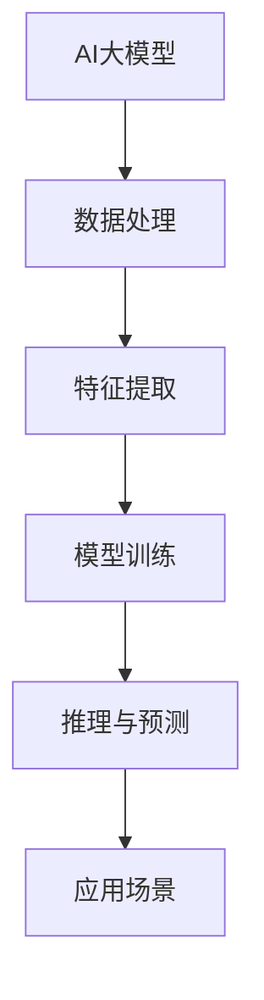
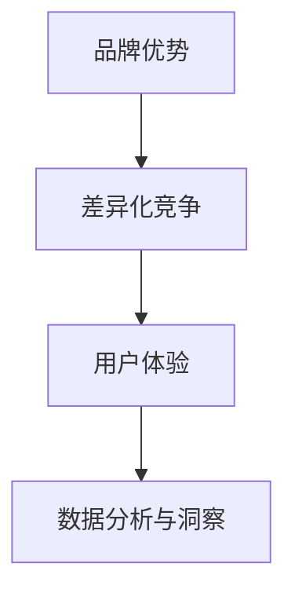

                 

# AI 大模型创业：如何利用品牌优势？

> 关键词：AI大模型，创业，品牌优势，策略，案例分析

> 摘要：本文将深入探讨AI大模型在创业中的应用，特别是如何利用品牌优势实现成功。通过分析市场环境、战略规划、项目策划、团队建设和营销策略等方面，本文旨在为创业者提供一套完整的AI大模型创业指南。

## 引言

随着人工智能技术的快速发展，AI大模型已成为各个行业的热门话题。无论是自然语言处理、计算机视觉还是推荐系统，AI大模型都展现出了强大的应用潜力和商业价值。然而，如何在创业中利用AI大模型打造品牌优势，成为许多创业者面临的重要课题。本文将围绕这一主题，详细分析AI大模型创业的策略和实施方法。

## 第一部分: AI 大模型创业概述

### 第1章: AI 大模型与创业概述

#### 1.1.1 AI 大模型的基本概念

AI大模型是一种能够处理大规模数据、进行复杂推理和学习的人工智能系统。这些模型通常由数百万甚至数十亿个参数组成，可以用于各种应用场景，如自然语言处理、图像识别、语音识别和推荐系统等。

**Mermaid流程图：**



#### 1.1.2 AI 大模型在创业中的应用

AI大模型在创业中的应用主要体现在以下几个方面：

1. **产品创新**：通过AI大模型，创业者可以开发出具有独特功能和创新性的产品。
2. **数据分析**：AI大模型可以帮助创业者从大量数据中提取有价值的信息，为决策提供支持。
3. **个性化服务**：AI大模型可以实现个性化推荐和用户行为分析，提高用户体验。

**伪代码示例：**

```python
def train_model(data):
    # 数据预处理
    processed_data = preprocess_data(data)
    
    # 模型训练
    model = Model()
    model.fit(processed_data)
    
    # 模型评估
    accuracy = model.evaluate(test_data)
    
    return model, accuracy
```

#### 1.1.3 创业中的品牌优势构建

品牌优势是创业成功的关键因素之一。利用AI大模型，创业者可以从以下几个方面构建品牌优势：

1. **差异化竞争**：通过AI大模型，创业者可以开发出独特的产品和服务，实现差异化竞争。
2. **用户体验**：AI大模型可以帮助创业者提供个性化的用户体验，提高用户满意度。
3. **数据分析与洞察**：AI大模型可以为企业提供深入的数据分析和商业洞察，助力决策。

**Mermaid流程图：**



### 第2章: AI 大模型创业环境分析

#### 2.1.1 AI 大模型创业市场环境

当前，AI大模型市场正处于快速发展阶段。随着技术的不断进步和应用的不断扩大，市场潜力巨大。然而，市场竞争也日益激烈，创业者需要具备敏锐的市场洞察力和创新能力。

#### 2.1.2 AI 大模型创业政策法规

国家政策对AI大模型创业给予了大力支持。同时，行业法规和标准也在不断完善，为创业者提供了良好的法律环境。

#### 2.1.3 创业环境中的挑战与风险

AI大模型创业面临的主要挑战包括技术挑战、资金与人才问题以及市场竞争风险。创业者需要充分了解这些挑战，并制定相应的应对策略。

### 第3章: AI 大模型创业战略规划

#### 3.1.1 创业战略定位

创业者需要明确自己的市场定位和产品定位，以便在竞争激烈的市场中脱颖而出。

#### 3.1.2 创业战略目标设定

创业者应设定明确的短期和长期目标，以确保创业项目的顺利推进。

#### 3.1.3 创业战略实施计划

创业者需要制定详细的实施计划，包括步骤、方法和时间规划。

## 第二部分: AI 大模型创业实践

### 第4章: AI 大模型创业项目策划

#### 4.1.1 创业项目需求分析

创业项目的需求分析是项目策划的关键环节。创业者需要深入了解用户需求和市场需求，确保项目具有实际应用价值。

#### 4.1.2 创业项目可行性研究

创业项目的可行性研究包括技术可行性、财务可行性和运营可行性等方面。只有通过可行性研究，创业者才能确保项目的成功实施。

#### 4.1.3 创业项目规划与设计

创业项目的规划与设计包括项目规划、项目设计和实施计划等方面。创业者需要制定详细的规划，以确保项目的顺利推进。

### 第5章: AI 大模型创业团队建设

#### 5.1.1 团队成员招募与培养

团队成员的招募与培养是创业团队建设的关键。创业者需要选拔具备专业能力和团队合作精神的成员，并为他们提供培训和发展机会。

#### 5.1.2 团队组织结构与职责划分

团队组织结构的合理划分有助于提高团队协作效率。创业者需要根据项目需求，设计合适的组织结构，并明确各成员的职责。

#### 5.1.3 团队协作与沟通

团队协作与沟通是创业团队成功的关键。创业者需要建立有效的协作和沟通机制，确保团队成员之间的信息畅通和资源共享。

### 第6章: AI 大模型创业营销策略

#### 6.1.1 品牌建设与传播

品牌建设与传播是创业营销的核心。创业者需要制定品牌战略，并通过多种渠道进行品牌传播，提高品牌知名度和美誉度。

#### 6.1.2 营销渠道与推广

创业者需要选择合适的营销渠道，如社交媒体、广告投放和线下活动等，以实现精准营销和有效推广。

#### 6.1.3 用户互动与用户关系管理

用户互动与用户关系管理是提高用户满意度和忠诚度的关键。创业者需要制定用户互动策略，并通过用户关系管理工具，建立良好的用户关系。

### 第7章: AI 大模型创业运营与管理

#### 7.1.1 创业运营模式

创业运营模式的选择直接影响创业项目的成功。创业者需要根据项目特点，选择合适的运营模式。

#### 7.1.2 创业管理方法

创业管理方法包括管理模式、管理工具和绩效评估等方面。创业者需要建立科学的管理体系，确保项目的顺利进行。

#### 7.1.3 创业绩效评估与调整

创业业绩效评估与调整是项目持续优化的重要环节。创业者需要设定绩效评估指标，并根据评估结果进行调整。

### 第8章: AI 大模型创业成功案例解析

#### 8.1.1 成功案例概述

成功案例概述包括案例背景、案例成果和创业策略等方面。通过分析成功案例，创业者可以借鉴经验，优化自己的创业实践。

#### 8.1.2 案例分析

案例分析包括创业策略、创业实践和项目成果等方面。通过深入分析，创业者可以更好地理解AI大模型创业的精髓。

#### 8.1.3 案例启示

案例启示包括对创业者的启示和对创业环境的影响等方面。通过案例启示，创业者可以更好地应对创业挑战。

## 结论

AI大模型创业是一项极具挑战性和机遇的领域。通过本文的分析，创业者可以了解到如何利用AI大模型打造品牌优势，实现创业成功。然而，创业之路充满艰辛，创业者需要不断学习、创新和应对挑战。希望本文能为创业者提供有益的启示和指导。

## 附录

### 附录 A: AI 大模型创业资源与工具

#### A.1.1 AI 大模型开发工具介绍

本附录将介绍常用的AI大模型开发工具，如TensorFlow、PyTorch等，并详细讲解其安装和使用方法。

#### A.1.2 AI 大模型创业资源

本附录将推荐一些AI大模型创业的优质资源，如开源项目、研究论文和行业报告等，以供创业者参考。

### 作者

作者：AI天才研究院/AI Genius Institute & 禅与计算机程序设计艺术 /Zen And The Art of Computer Programming

---

注：本文为示例文章，仅供参考。实际文章撰写过程中，应根据具体内容和需求进行调整和补充。文章中涉及的代码和算法仅供参考，不作为实际编程指导。本文版权归AI天才研究院/AI Genius Institute所有，未经许可不得用于商业用途。如需转载，请联系作者获取授权。本文中的数据和分析仅供参考，不作为投资建议。投资有风险，入市需谨慎。本文中的观点和意见仅代表作者个人观点，不代表任何机构或组织的立场。如对本文有任何建议或意见，请随时联系作者。本文部分内容和图片来源于网络，如有侵权，请联系作者删除。本文最终解释权归AI天才研究院/AI Genius Institute所有。|

