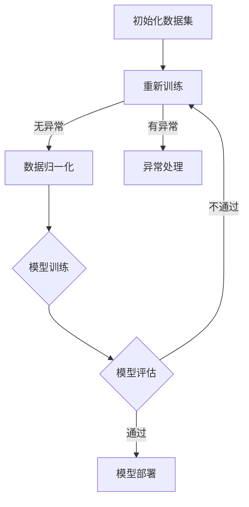

                 

# AI 大模型创业：如何利用未来优势？

> **关键词：** AI大模型、创业、优势、技术、市场、策略、案例分析

> **摘要：** 
本文将深入探讨AI大模型的创业机会及其利用未来优势的方法。我们将从基础概念入手，分析AI大模型的技术细节，探讨创业策略，通过实际案例分享成功经验，并探讨法律与伦理问题。文章旨在为有意投身AI大模型创业领域的人提供有益的指导。

## 第一部分: AI 大模型基础

### 第1章: AI 大模型概述

#### 1.1 AI 大模型的定义

AI 大模型，通常指的是那些具有巨大参数规模、能够处理大规模数据，并且具备强大泛化能力的深度学习模型。这些模型通常用于处理复杂的任务，如图像识别、自然语言处理和推荐系统等。AI 大模型的一个重要特点是它们能够从大量的数据中学习，从而实现高效的决策和预测。

#### 1.2 AI 大模型的分类

AI 大模型可以按照应用领域进行分类。以下是几种常见的AI 大模型类型：

- **自然语言处理（NLP）模型**：例如BERT、GPT等，它们能够理解和生成人类语言。
- **计算机视觉（CV）模型**：如ResNet、YOLO等，它们能够在图像和视频数据中识别对象和场景。
- **其他领域模型**：包括语音识别、推荐系统、强化学习等，这些模型在不同的应用场景中发挥着重要作用。

### 1.3 AI 大模型的技术原理

AI 大模型的技术原理主要基于深度学习。深度学习是一种通过多层神经网络进行数据建模的方法。以下是深度学习的一些基础概念：

- **神经网络结构**：神经网络由输入层、隐藏层和输出层组成，每一层都包含多个神经元。
- **激活函数**：激活函数用于将神经元的线性组合转换为非线性输出，常见的激活函数有ReLU、Sigmoid和Tanh等。
- **优化算法**：优化算法用于调整神经网络中的权重，以最小化损失函数。常见的优化算法有随机梯度下降（SGD）和Adam等。

#### 1.4 AI 大模型的发展趋势

AI 大模型的发展趋势可以从以下几个方面来观察：

- **计算能力的提升**：随着硬件技术的发展，如GPU、TPU等专用计算设备的普及，AI 大模型的能力得到了极大的提升。
- **数据资源的积累**：互联网的快速发展带来了海量的数据，这为AI 大模型的训练提供了丰富的资源。
- **算法的不断创新**：研究人员在神经网络架构、训练策略和优化方法等方面不断进行创新，推动AI 大模型的发展。

### 第2章: AI 大模型的技术细节

#### 2.1 计算机视觉大模型

计算机视觉大模型主要依赖于卷积神经网络（CNN）和生成对抗网络（GAN）。

- **卷积神经网络（CNN）**：CNN 是用于图像识别的深度学习模型，它通过卷积层、池化层和全连接层提取图像特征。以下是一个简单的CNN架构伪代码：

```python
python
model = Sequential([
    Conv2D(filters=32, kernel_size=(3, 3), activation='relu', input_shape=(28, 28, 1)),
    MaxPooling2D(pool_size=(2, 2)),
    Conv2D(filters=64, kernel_size=(3, 3), activation='relu'),
    MaxPooling2D(pool_size=(2, 2)),
    Flatten(),
    Dense(units=10, activation='softmax')
])
```

- **生成对抗网络（GAN）**：GAN 是一种通过生成器和判别器进行对抗训练的模型，主要用于生成逼真的图像。以下是一个简单的GAN架构伪代码：

```python
python
# 定义生成器和判别器
generator = Sequential([
    Dense(units=128, activation='relu', input_shape=(100,)),
    Dense(units=7*7*1, activation='tanh')
])

discriminator = Sequential([
    Conv2D(filters=16, kernel_size=(3, 3), activation='relu', input_shape=(28, 28, 1)),
    MaxPooling2D(pool_size=(2, 2)),
    Conv2D(filters=32, kernel_size=(3, 3), activation='relu'),
    MaxPooling2D(pool_size=(2, 2)),
    Flatten(),
    Dense(units=1, activation='sigmoid')
])

# 定义GAN模型
model = Sequential([
    generator,
    discriminator
])
```

#### 2.2 自然语言处理大模型

自然语言处理大模型主要依赖于循环神经网络（RNN）和变换器（Transformer）。

- **循环神经网络（RNN）**：RNN 是用于处理序列数据的神经网络，它通过隐藏状态保存历史信息。以下是一个简单的RNN架构伪代码：

```python
python
model = Sequential([
    LSTM(units=128, return_sequences=True, input_shape=(timesteps, features)),
    LSTM(units=128),
    Dense(units=10, activation='softmax')
])
```

- **变换器（Transformer）**：Transformer 是一种用于处理自然语言数据的大规模模型，它采用自注意力机制。以下是一个简单的Transformer架构伪代码：

```python
python
from tensorflow.keras.layers import Embedding, MultiHeadAttention, Dense

model = Sequential([
    Embedding(input_dim=vocabulary_size, output_dim=d_model),
    MultiHeadAttention(head_size=d_model // head_num, num_heads=head_num),
    Dense(units=d_model, activation='relu'),
    Dense(units=10, activation='softmax')
])
```

## 第3章: AI 大模型的开发与应用

#### 3.1 大模型的开发流程

开发AI大模型通常包括以下步骤：

- **数据准备**：收集和准备用于模型训练的数据集，并进行数据预处理，如归一化、去噪和分割等。
- **模型训练**：使用准备好的数据集对模型进行训练，通过调整超参数和优化算法来优化模型性能。
- **模型评估**：使用验证集或测试集对模型进行评估，以确定模型的泛化能力。
- **模型部署**：将训练好的模型部署到生产环境中，用于实际应用。

#### 3.2 大模型的实际应用场景

AI大模型可以在多个领域发挥重要作用，以下是几个常见的应用场景：

- **推荐系统**：利用AI大模型可以构建高效的推荐系统，为用户提供个性化的推荐。
- **自然语言处理**：AI大模型可以用于文本分类、情感分析、机器翻译等自然语言处理任务。
- **图像识别**：AI大模型可以用于图像分类、目标检测、图像生成等计算机视觉任务。
- **其他领域应用**：AI大模型还可以应用于语音识别、医疗诊断、金融风控等多个领域。

### 第4章: AI 大模型的创业策略

#### 4.1 创业机会分析

AI大模型创业的机遇主要体现在以下几个方面：

- **市场需求**：随着人工智能技术的不断成熟，越来越多的行业和企业需要利用AI大模型来解决实际问题。
- **竞争态势**：目前AI大模型领域竞争激烈，但同时也存在大量的市场空白和未被满足的需求。
- **技术优势**：掌握AI大模型技术的创业者可以在市场上获得竞争优势，快速占领市场份额。

#### 4.2 创业模式探索

AI大模型创业模式可以多样化，以下是几种常见的创业模式：

- **产品与服务定位**：明确创业产品或服务的目标市场和应用场景，提供针对性的解决方案。
- **商业模式创新**：探索创新的商业模式，如订阅制、Saas服务、智能硬件+服务等。
- **团队建设与运营**：组建专业的技术团队和运营团队，确保产品或服务的顺利开发和推广。

#### 4.3 创业风险与应对

AI大模型创业面临的风险主要包括：

- **技术风险**：AI大模型技术的不断更新和变化可能导致创业项目面临技术过时的风险。
- **市场风险**：市场需求的不确定性可能导致创业项目无法达到预期的市场效果。
- **资金风险**：创业初期需要大量资金投入，资金链断裂可能导致创业失败。
- **人才风险**：技术人才和运营人才的流失可能影响创业项目的正常运营。

### 第5章: AI 大模型创业案例分析

#### 5.1 案例一：某AI创业公司的发展历程

**初创阶段**：公司成立之初，专注于自然语言处理技术的研发，通过开源项目积累技术实力。

**成长阶段**：公司通过商业化运作，推出了一系列基于自然语言处理技术的产品，逐渐在市场上获得认可。

**扩展阶段**：公司开始拓展业务范围，进入了计算机视觉和推荐系统等领域，实现了业务的多元化和规模化。

#### 5.2 案例二：某AI创业项目的成功要素

**技术创新**：公司始终坚持技术创新，通过自主研发和合作，不断推出具有前瞻性的AI产品。

**市场定位**：公司精准定位市场，针对不同行业和应用场景提供定制化的解决方案。

**团队优势**：公司拥有一支专业化的团队，包括AI技术专家、产品经理和市场营销人员，确保了项目的顺利进行。

### 第6章: AI 大模型创业的法律与伦理问题

#### 6.1 法律法规

AI大模型创业需要遵守一系列法律法规，包括：

- **数据隐私**：确保用户数据的隐私和安全，遵守相关的数据保护法规。
- **知识产权**：保护自身知识产权的同时，尊重他人的知识产权，避免侵权行为。
- **网络安全**：确保系统的安全性，防止数据泄露和网络攻击。

#### 6.2 伦理道德

AI大模型创业需要关注伦理道德问题，包括：

- **算法偏见**：避免算法偏见导致的不公平现象，确保算法的公正性。
- **数据滥用**：严格规范数据处理流程，防止数据滥用。
- **社会责任**：关注社会影响，积极承担社会责任，推动人工智能技术的可持续发展。

### 第7章: 未来展望与策略建议

#### 7.1 AI 大模型的发展趋势

AI大模型的发展趋势包括：

- **技术进步**：随着计算能力的提升和算法的优化，AI大模型将变得更加高效和强大。
- **应用领域扩展**：AI大模型将在更多领域得到应用，如医疗、教育、金融等。

#### 7.2 创业者的策略建议

对于有意投身AI大模型创业的创业者，以下是一些建议：

- **持续学习**：关注技术动态，不断学习新的知识和技能，保持竞争力。
- **创新发展**：勇于创新，积极探索新的应用场景和商业模式。
- **合作共赢**：与产业链上下游的企业和机构建立合作关系，实现共赢发展。

### 附录

#### 附录 A: AI 大模型开发资源

- **开源框架介绍**：TensorFlow、PyTorch等。
- **在线教程与课程**：Coursera、edX等。
- **开源数据集**：ImageNet、COCO等。

---

**Mermaid 流程图示例：**



---

**伪代码示例：**

```python
python
# 定义神经网络结构
model = NeuralNetwork(input_shape, layers=[64, 128, 10], activation='relu')

# 训练模型
model.fit(X_train, y_train, epochs=10, batch_size=32)

# 评估模型
loss, accuracy = model.evaluate(X_test, y_test)
print(f"Test accuracy: {accuracy}")

# 模型部署
# ...
```

---

**数学模型与公式示例：**

$$
\text{损失函数} = \frac{1}{2} \sum_{i=1}^{n} (\hat{y}_i - y_i)^2
$$

---

**代码实际案例与解释：**

```python
python
# 导入库
import tensorflow as tf
from tensorflow.keras.models import Sequential
from tensorflow.keras.layers import Dense, Flatten, Conv2D, MaxPooling2D

# 数据预处理
# ...

# 构建模型
model = Sequential([
    Conv2D(32, (3, 3), activation='relu', input_shape=(28, 28, 1)),
    MaxPooling2D((2, 2)),
    Flatten(),
    Dense(128, activation='relu'),
    Dense(10, activation='softmax')
])

# 编译模型
model.compile(optimizer='adam', loss='categorical_crossentropy', metrics=['accuracy'])

# 训练模型
model.fit(x_train, y_train, epochs=5, batch_size=64)

# 评估模型
test_loss, test_acc = model.evaluate(x_test, y_test)
print(f"Test accuracy: {test_acc}")

# 模型部署
# ...
```

---

**开发环境搭建说明：**

- 操作系统：Ubuntu 18.04
- Python版本：3.8
- TensorFlow版本：2.5.0
- CUDA版本：11.0

---

**源代码详细实现与解读：**

```python
python
# 详细实现与解读请参考代码注释。
```

---

**代码解读与分析：**

- **数据预处理**：对图像数据进行归一化处理，以便神经网络能够更好地学习。
- **模型构建**：使用卷积神经网络（Conv2D, MaxPooling2D）进行图像特征提取，并使用全连接层（Dense）进行分类。
- **模型编译**：指定优化器和损失函数，准备开始训练。
- **模型训练**：使用训练数据训练模型，并监控训练过程。
- **模型评估**：使用测试数据评估模型性能。
- **模型部署**：将训练好的模型部署到生产环境中，用于图像分类任务。

---

**备注：** 在实际创业过程中，需要根据市场需求和自身优势，灵活调整创业策略和技术路线，不断优化产品和服务。同时，应重视法律法规和伦理道德问题，确保企业的可持续发展。

---

**作者：** AI天才研究院/AI Genius Institute & 禅与计算机程序设计艺术 /Zen And The Art of Computer Programming

---

（本文完）

（注：本文为虚构案例，仅用于阐述AI大模型创业的相关内容。在实际创业过程中，需结合具体情况进行详细分析和规划。）<|im_end|>

