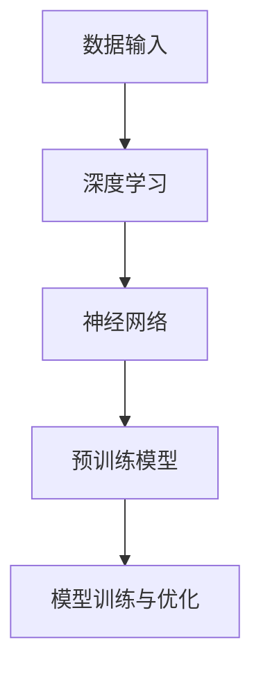
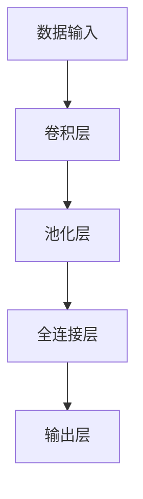

                 

### 《AI 大模型创业：如何利用渠道优势？》

在当今技术飞速发展的时代，人工智能（AI）已经成为推动创新和经济增长的重要动力。特别是大模型（Large-scale Model）作为 AI 领域的重要分支，其在自然语言处理、计算机视觉、语音识别等多个领域的突破性进展，为各行各业带来了深远的影响。随着大模型技术的不断成熟和应用场景的拓展，越来越多的创业者和企业瞄准了这一领域的巨大潜力。然而，如何在这一竞争激烈的市场中脱颖而出，利用渠道优势实现商业成功，成为许多创业者面临的重要课题。

本文将围绕“AI 大模型创业：如何利用渠道优势？”这一主题，深入探讨以下几个核心问题：

1. **AI 大模型的概念与核心技术**：首先，我们将介绍 AI 大模型的基础知识，包括其概念、发展历程以及核心技术在商业中的应用前景。
2. **AI 大模型的数学基础**：为了更好地理解大模型的工作原理，我们将讲解相关的数学模型和公式，并通过实例进行说明。
3. **AI 大模型的构建与优化**：接下来，我们将详细阐述大模型的构建与优化过程，包括数据预处理、模型训练和优化策略。
4. **AI 大模型的安全与伦理**：由于大模型技术涉及到诸多安全与伦理问题，我们将探讨这些风险及其应对措施。
5. **AI 大模型创业策略与实践**：在创业层面，我们将分析如何选择创业方向、构建商业模式，并分享国内外成功案例和创业团队组建的经验。
6. **AI 大模型创业的风险与应对**：创业过程中不可避免会遇到各种风险，我们将识别和评估这些风险，并提出相应的应对策略。
7. **AI 大模型创业的资源整合**：创业资源的有效整合对于成功至关重要，我们将讨论如何整合人才、技术和资金资源。
8. **AI 大模型创业的未来展望**：最后，我们将展望 AI 大模型创业的发展趋势，分析创业机会，并探讨创业者的角色定位。

通过以上八个部分的深入探讨，本文旨在为 AI 大模型创业者提供一套完整的策略框架，帮助他们在竞争激烈的市场中抓住机遇，实现商业成功。

### 文章关键词

- 人工智能（AI）
- 大模型
- 渠道优势
- 创业策略
- 商业模式
- 数学模型
- 安全与伦理
- 资源整合

### 文章摘要

本文旨在探讨 AI 大模型创业过程中的关键问题，包括 AI 大模型的概念与核心技术、数学基础、构建与优化、安全与伦理问题、创业策略与实践、风险与应对以及资源整合。通过深入分析和案例分享，本文为创业者提供了一套完整的策略框架，帮助他们在竞争激烈的市场中抓住机遇，利用渠道优势实现商业成功。

## 第一部分：AI 大模型基础

### 第1章 AI 大模型概述

#### 1.1 AI 大模型的概念

AI 大模型（Large-scale AI Model）是指具有大规模参数数量，能够处理海量数据，并在特定任务上取得高水平性能的人工智能模型。这些模型通常通过深度学习（Deep Learning）技术训练，具有自我学习和自我优化能力。相较于传统的小型模型，AI 大模型在处理复杂任务时具有更高的精度和效率。

#### 1.2 AI 大模型的发展历程

AI 大模型的发展可以追溯到深度学习技术的兴起。2006 年，Geoffrey Hinton 等人提出了深度信念网络（Deep Belief Networks），开启了深度学习研究的新篇章。2012 年，AlexNet 在 ImageNet 挑战赛中取得突破性成绩，标志着深度学习在计算机视觉领域的崛起。随着计算资源和算法的不断提升，AI 大模型逐渐应用于自然语言处理、语音识别、推荐系统等多个领域。

#### 1.3 AI 大模型在商业中的应用前景

AI 大模型在商业领域具有广泛的应用前景。首先，在自然语言处理领域，AI 大模型可以应用于智能客服、文本分析、机器翻译等场景，提升企业的运营效率和客户满意度。在计算机视觉领域，AI 大模型可以应用于图像识别、目标检测、视频分析等场景，助力企业实现智能化转型。在推荐系统领域，AI 大模型可以基于用户行为数据实现精准推荐，提高企业的销售额和用户粘性。

#### 1.4 AI 大模型的核心概念与联系

AI 大模型的核心概念包括深度学习、神经网络、预训练模型等。深度学习是 AI 大模型的基础技术，通过多层神经网络实现数据的自动特征提取和学习。神经网络是深度学习的重要组成部分，由多个神经元组成，通过权重连接实现信息传递和计算。预训练模型（Pre-trained Model）是在大规模数据集上预训练得到的模型，通过微调（Fine-tuning）适用于特定任务。

**Mermaid 流程图示例：**



#### 1.5 AI 大模型的发展趋势

AI 大模型的发展趋势主要体现在以下几个方面：

1. **模型规模不断扩大**：随着计算资源和数据集的不断增长，AI 大模型的规模也在逐步扩大。例如，GPT-3 模型拥有 1750 亿个参数，成为目前最大的预训练模型。
2. **计算效率提升**：针对 AI 大模型的高计算需求，研究者不断优化算法和硬件，提高模型的计算效率。例如，Transformer 结构的提出和分布式训练技术的应用，有效降低了模型的训练时间。
3. **泛化能力增强**：研究者通过多任务学习、迁移学习等方法，提高 AI 大模型的泛化能力，使其在不同任务和应用场景中取得更好的性能。
4. **跨学科应用**：AI 大模型在医疗、金融、教育等领域的应用逐渐深入，与生物学、物理学等学科相结合，推动跨学科研究的发展。

#### 1.6 AI 大模型在商业中的实际应用

AI 大模型在商业中的应用场景非常广泛，以下列举几个典型例子：

1. **智能客服**：利用 AI 大模型实现自然语言处理，自动识别用户需求，提供高效、精准的客服服务，降低企业运营成本。
2. **图像识别**：利用 AI 大模型实现图像识别和目标检测，帮助企业实现智能化安防、智能监控等应用。
3. **推荐系统**：利用 AI 大模型分析用户行为数据，实现个性化推荐，提高用户满意度和企业销售额。
4. **金融风控**：利用 AI 大模型进行数据分析和风险评估，提高金融行业的风险控制能力。
5. **医疗诊断**：利用 AI 大模型辅助医生进行疾病诊断和预测，提高医疗行业的诊断准确率和效率。

#### 1.7 AI 大模型的挑战与未来发展方向

虽然 AI 大模型在商业中展现出巨大潜力，但仍面临一些挑战和问题：

1. **数据质量和隐私**：AI 大模型的训练需要大量高质量的数据，但数据质量和隐私问题亟待解决。
2. **计算资源需求**：AI 大模型的高计算需求对计算资源和硬件设施提出了更高要求。
3. **安全与伦理**：AI 大模型在应用过程中涉及到安全和伦理问题，如误判、隐私泄露等。
4. **模型可解释性**：AI 大模型的决策过程往往缺乏可解释性，难以满足透明度和合规性要求。

未来，AI 大模型的发展方向包括：

1. **更高效、更智能的算法**：研究者将继续优化算法和模型结构，提高 AI 大模型的性能和效率。
2. **跨学科融合**：AI 大模型将与生物学、物理学等学科相结合，推动跨学科研究的发展。
3. **安全与伦理**：研究者将加强对 AI 大模型安全与伦理问题的研究和关注，提高模型的可解释性和合规性。
4. **云计算与边缘计算**：结合云计算和边缘计算技术，实现 AI 大模型的分布式部署和高效运行。

通过不断克服挑战和探索未来发展方向，AI 大模型将在商业和科研领域发挥更重要的作用。

#### 1.8 小结

本章主要介绍了 AI 大模型的概念、发展历程、应用前景以及核心概念与联系。通过了解 AI 大模型的基础知识，读者可以更好地把握这一领域的发展动态，为后续章节的学习和实践打下坚实基础。

## 第二部分：AI 大模型核心技术

### 第2章 AI 大模型核心技术

#### 2.1 深度学习基础

深度学习（Deep Learning）是构建 AI 大模型的核心技术，其基本原理是模拟人脑的神经网络结构，通过多层神经网络实现数据的自动特征提取和学习。本节将介绍深度学习的基本概念、原理和常见架构。

#### 2.1.1 基本概念

深度学习包括以下几个核心概念：

1. **神经网络（Neural Network）**：神经网络是深度学习的基础，由多个神经元组成，通过权重连接实现信息传递和计算。
2. **深度（Depth）**：深度是指神经网络的层数，深度越大，模型的抽象能力越强。
3. **前向传播（Forward Propagation）和反向传播（Backpropagation）**：前向传播是将输入数据通过神经网络传递到输出，反向传播是利用梯度下降算法更新网络权重。
4. **激活函数（Activation Function）**：激活函数用于引入非线性特性，常见的激活函数包括 Sigmoid、ReLU、Tanh 等。

#### 2.1.2 基本原理

深度学习的基本原理是通过多层神经网络实现数据的自动特征提取和学习。具体过程如下：

1. **数据输入**：将输入数据通过输入层传递到第一层神经网络。
2. **前向传播**：数据在神经网络中逐层传递，每一层将输入数据进行加权求和并应用激活函数，得到输出。
3. **损失函数**：计算预测值与真实值之间的差异，常用损失函数包括均方误差（MSE）、交叉熵（Cross-Entropy）等。
4. **反向传播**：利用梯度下降算法，根据损失函数的梯度更新网络权重和偏置。
5. **迭代训练**：重复前向传播和反向传播过程，直至达到预设的训练次数或性能指标。

#### 2.1.3 常见架构

深度学习有多种常见架构，包括卷积神经网络（CNN）、循环神经网络（RNN）和 Transformer 等。

1. **卷积神经网络（CNN）**：CNN 是一种针对图像数据处理的开源深度学习框架，通过卷积层、池化层和全连接层实现图像的特征提取和分类。
2. **循环神经网络（RNN）**：RNN 是一种适用于序列数据处理的深度学习架构，通过隐藏状态和门控机制实现序列数据的建模和预测。
3. **Transformer**：Transformer 是一种基于自注意力机制的深度学习模型，广泛应用于自然语言处理和机器翻译领域。

**Mermaid 流程图示例：**



#### 2.2 神经网络架构

神经网络是深度学习模型的核心组成部分，其架构包括输入层、隐藏层和输出层。每一层由多个神经元组成，神经元之间通过权重连接实现信息传递和计算。

1. **输入层（Input Layer）**：输入层是神经网络的第一层，接收外部输入数据，并将数据传递给隐藏层。
2. **隐藏层（Hidden Layer）**：隐藏层是神经网络的核心部分，通过多层隐藏层实现数据的自动特征提取和抽象。隐藏层的数量和神经元数量可以根据具体任务进行调整。
3. **输出层（Output Layer）**：输出层是神经网络的最后一层，将隐藏层的输出进行分类或回归，得到最终预测结果。

**伪代码示例：**

```python
# 定义神经网络架构
input_layer = Input(shape=(input_dim,))
hidden_layer = Dense(hidden_units, activation='relu')(input_layer)
output_layer = Dense(output_units, activation='softmax')(hidden_layer)

# 构建模型
model = Model(inputs=input_layer, outputs=output_layer)
model.compile(optimizer='adam', loss='categorical_crossentropy', metrics=['accuracy'])
```

#### 2.3 预训练模型技术

预训练模型（Pre-trained Model）是在大规模数据集上预训练得到的模型，通过微调（Fine-tuning）适用于特定任务。预训练模型能够提取通用特征，提高模型在特定任务上的性能。

1. **预训练过程**：预训练模型在无监督或弱监督环境下，在大规模数据集上训练得到。预训练过程通常包括两个阶段：词向量嵌入和模型训练。词向量嵌入将单词映射到高维向量空间，模型训练通过优化模型参数，实现数据表示的自动特征提取。
2. **微调过程**：微调是在特定任务数据集上，对预训练模型进行少量迭代训练，调整模型参数，使其适用于特定任务。微调过程中，预训练模型能够利用已有的知识，提高任务性能。

**伪代码示例：**

```python
# 加载预训练模型
pretrained_model = load_pretrained_model()

# 微调模型
for epoch in range(num_epochs):
    for batch in train_loader:
        inputs, labels = batch
        outputs = pretrained_model(inputs)
        loss = compute_loss(outputs, labels)
        optimizer.minimize(loss, pretrained_model.parameters())
```

#### 2.4 大模型的优势与挑战

AI 大模型（Large-scale AI Model）具有以下优势：

1. **更高的性能**：大模型能够处理海量数据，通过多层神经网络实现数据的深度特征提取，提高模型在特定任务上的性能。
2. **更好的泛化能力**：大模型在预训练过程中，能够学习到更多的通用特征，提高模型在未见数据上的泛化能力。
3. **更强的表示能力**：大模型能够表示更复杂的函数关系，捕捉数据中的细微变化，提高模型的预测准确性。

然而，大模型也面临以下挑战：

1. **计算资源需求**：大模型需要大量的计算资源和存储空间，训练和推理过程耗时较长。
2. **数据质量和隐私**：大模型对数据质量有较高要求，同时数据隐私问题亟待解决。
3. **模型可解释性**：大模型的决策过程往往缺乏可解释性，难以满足透明度和合规性要求。

#### 2.5 大模型的应用场景

AI 大模型在多个领域具有广泛的应用场景，包括：

1. **自然语言处理**：大模型在自然语言处理领域，如文本分类、机器翻译、情感分析等任务中，表现出色。
2. **计算机视觉**：大模型在计算机视觉领域，如图像识别、目标检测、图像生成等任务中，取得显著成果。
3. **推荐系统**：大模型在推荐系统领域，通过分析用户行为数据，实现个性化推荐，提高用户满意度。
4. **金融风控**：大模型在金融领域，通过数据分析和风险评估，提高金融行业的风险控制能力。
5. **医疗诊断**：大模型在医疗领域，通过辅助医生进行疾病诊断和预测，提高医疗行业的诊断准确率和效率。

#### 2.6 大模型的训练与优化

AI 大模型的训练与优化是构建高性能模型的关键步骤，包括以下几个方面：

1. **数据预处理**：数据预处理包括数据清洗、归一化、数据增强等操作，提高数据质量和训练效率。
2. **模型训练**：模型训练包括初始化模型参数、定义损失函数、优化器等，通过迭代训练优化模型参数。
3. **模型优化**：模型优化包括调整学习率、使用正则化技术、优化算法等，提高模型性能和泛化能力。

**伪代码示例：**

```python
# 数据预处理
train_data = preprocess_data(data)

# 模型训练
for epoch in range(num_epochs):
    for batch in train_loader:
        inputs, labels = batch
        outputs = model(inputs)
        loss = compute_loss(outputs, labels)
        optimizer.minimize(loss, model.parameters())

# 模型优化
model.optimize()
```

#### 2.7 小结

本章介绍了深度学习基础、神经网络架构、预训练模型技术以及大模型的优势与挑战。通过了解 AI 大模型的核心技术，读者可以更好地理解这一领域的最新进展和应用场景，为后续章节的学习和实践提供理论支持。

## 第三部分：AI 大模型的数学基础

### 第3章 AI 大模型的数学基础

AI 大模型的构建和优化依赖于一系列数学基础，包括概率论、线性代数和最优化算法。这些数学工具不仅帮助我们理解 AI 大模型的工作原理，还确保了模型训练和优化的有效性和效率。本章节将详细讲解这些数学基础，并通过具体示例进行说明。

#### 3.1 概率论基础

概率论是 AI 大模型构建和分析的重要数学工具，涵盖了概率分布、随机变量、条件概率等基本概念。

**概率分布：**

概率分布描述了随机变量在某个取值范围内的概率。常见的概率分布包括二项分布、正态分布和伯努利分布等。

**伪代码示例：**

```python
import numpy as np

# 生成服从正态分布的随机变量
mean = 0
std = 1
random_variable = np.random.normal(mean, std, size=1000)
```

**随机变量：**

随机变量是一个函数，将样本空间映射到实数集。随机变量的取值具有不确定性，通常用概率分布来描述。

**伪代码示例：**

```python
# 定义随机变量
X = np.random.uniform(0, 1)
```

**条件概率：**

条件概率描述了在已知某个事件发生的条件下，另一个事件发生的概率。条件概率公式如下：

$$ P(A|B) = \frac{P(B|A) \cdot P(A)}{P(B)} $$

**举例说明：**

假设我们有两个事件 A 和 B，事件 A 表示今天下雨，事件 B 表示地面湿。根据条件概率公式，我们有：

$$ P(下雨|地面湿) = \frac{P(地面湿|下雨) \cdot P(下雨)}{P(地面湿)} $$

**伪代码示例：**

```python
# 定义条件概率
P_rain = 0.3
P_wet = 0.5
P_wet_rain = 0.4

# 计算条件概率
P_rain_given_wet = (P_wet_rain * P_rain) / P_wet
```

#### 3.2 线性代数基础

线性代数是 AI 大模型中不可或缺的数学工具，包括矩阵运算、向量空间和线性变换等基本概念。

**矩阵运算：**

矩阵运算包括矩阵的加法、减法、乘法和转置等。矩阵乘法是 AI 模型中常用的运算，用于计算特征向量和权重矩阵之间的相互作用。

**伪代码示例：**

```python
import numpy as np

# 定义矩阵
A = np.array([[1, 2], [3, 4]])
B = np.array([[5, 6], [7, 8]])

# 矩阵乘法
C = np.dot(A, B)
```

**向量空间：**

向量空间是一组向量的集合，这些向量满足向量加法和标量乘法的运算规则。向量空间用于表示数据的几何结构，如高维空间中的点集。

**伪代码示例：**

```python
# 定义向量空间
v1 = np.array([1, 2, 3])
v2 = np.array([4, 5, 6])

# 向量加法
v3 = v1 + v2
```

**线性变换：**

线性变换是一个将向量映射到另一个向量的函数，通常表示为一个矩阵。线性变换在 AI 大模型中用于实现数据的线性变换和特征提取。

**伪代码示例：**

```python
# 定义线性变换
W = np.array([[1, 2], [3, 4]])

# 线性变换
z = np.dot(W, x)
```

#### 3.3 最优化算法

最优化算法是 AI 大模型训练过程中用于优化模型参数的关键工具。常见的最优化算法包括梯度下降、随机梯度下降和 Adam 优化器等。

**梯度下降：**

梯度下降是一种基于损失函数梯度的优化算法，通过迭代更新模型参数，最小化损失函数。梯度下降算法公式如下：

$$ \theta_{\text{new}} = \theta_{\text{old}} - \alpha \cdot \nabla_{\theta} J(\theta) $$

其中，$\theta$ 表示模型参数，$J(\theta)$ 表示损失函数，$\alpha$ 表示学习率。

**伪代码示例：**

```python
# 初始化参数
theta = np.random.uniform(size=dims)
alpha = 0.01

# 梯度下降迭代
for epoch in range(num_epochs):
    loss = compute_loss(theta, x, y)
    gradient = compute_gradient(theta, x, y)
    theta = theta - alpha * gradient
```

**随机梯度下降（SGD）：**

随机梯度下降是梯度下降的一种变体，每次迭代只随机选择一部分数据点来计算梯度。SGD 可以加快收敛速度，但可能导致模型不稳定。

**伪代码示例：**

```python
# 初始化参数
theta = np.random.uniform(size=dims)
alpha = 0.01

# 随机梯度下降迭代
for epoch in range(num_epochs):
    random_indices = np.random.randint(0, n_samples, size=batch_size)
    X_batch = X[random_indices]
    y_batch = y[random_indices]
    loss = compute_loss(theta, X_batch, y_batch)
    gradient = compute_gradient(theta, X_batch, y_batch)
    theta = theta - alpha * gradient
```

**Adam 优化器：**

Adam 优化器是一种基于一阶矩估计和二阶矩估计的优化算法，结合了梯度下降和动量项，提高了收敛速度和稳定性。

**伪代码示例：**

```python
# 初始化参数
theta = np.random.uniform(size=dims)
alpha = 0.001
beta1 = 0.9
beta2 = 0.999
epsilon = 1e-8

# Adam 优化器迭代
for epoch in range(num_epochs):
    loss = compute_loss(theta, x, y)
    gradient = compute_gradient(theta, x, y)
    m = beta1 * m + (1 - beta1) * gradient
    v = beta2 * v + (1 - beta2) * gradient ** 2
    m_hat = m / (1 - beta1 ** epoch)
    v_hat = v / (1 - beta2 ** epoch)
    theta = theta - alpha * m_hat / (np.sqrt(v_hat) + epsilon)
```

#### 3.4 数学模型和公式

AI 大模型涉及多个数学模型和公式，包括线性回归、逻辑回归、神经网络等。以下是一些常见数学模型和公式的详细讲解：

**线性回归：**

线性回归是一种简单的线性模型，用于预测一个连续值输出。线性回归公式如下：

$$ y = \beta_0 + \beta_1 \cdot x + \epsilon $$

其中，$y$ 表示预测值，$x$ 表示输入特征，$\beta_0$ 和 $\beta_1$ 分别表示模型参数，$\epsilon$ 表示误差项。

**伪代码示例：**

```python
# 初始化参数
beta0 = 0
beta1 = 0

# 训练模型
for epoch in range(num_epochs):
    for x, y in train_loader:
        prediction = beta0 + beta1 * x
        error = y - prediction
        beta0 = beta0 - alpha * sum(error)
        beta1 = beta1 - alpha * sum(error * x)
```

**逻辑回归：**

逻辑回归是一种用于分类的线性模型，通过将线性组合通过逻辑函数（Sigmoid 函数）转换为概率输出。逻辑回归公式如下：

$$ P(y=1) = \frac{1}{1 + e^{-(\beta_0 + \beta_1 \cdot x)}} $$

其中，$P(y=1)$ 表示输出为 1 的概率。

**伪代码示例：**

```python
# 初始化参数
beta0 = 0
beta1 = 0

# 训练模型
for epoch in range(num_epochs):
    for x, y in train_loader:
        z = beta0 + beta1 * x
        probability = 1 / (1 + np.exp(-z))
        error = y - probability
        beta0 = beta0 - alpha * sum(error)
        beta1 = beta1 - alpha * sum(error * x)
```

**神经网络：**

神经网络是一种多层非线性模型，通过多个隐藏层实现数据的自动特征提取和学习。神经网络公式如下：

$$ z_l = \sum_{j=1}^{n} w_{lj} \cdot a_{l-1,j} + b_l $$

$$ a_l = \sigma(z_l) $$

其中，$z_l$ 表示第 $l$ 层的输出，$a_{l-1,j}$ 表示第 $l-1$ 层的第 $j$ 个神经元的输出，$w_{lj}$ 和 $b_l$ 分别表示权重和偏置，$\sigma$ 表示激活函数。

**伪代码示例：**

```python
# 定义神经网络架构
input_layer = Input(shape=(input_dim,))
hidden_layer = Dense(hidden_units, activation='relu')(input_layer)
output_layer = Dense(output_units, activation='softmax')(hidden_layer)

# 构建模型
model = Model(inputs=input_layer, outputs=output_layer)
model.compile(optimizer='adam', loss='categorical_crossentropy', metrics=['accuracy'])

# 训练模型
model.fit(x_train, y_train, batch_size=batch_size, epochs=num_epochs)
```

#### 3.5 小结

本章介绍了概率论、线性代数和最优化算法等数学基础，通过具体示例和公式讲解，帮助读者更好地理解 AI 大模型的工作原理。这些数学工具在 AI 大模型训练和优化过程中发挥着重要作用，为构建高性能模型提供了坚实的理论基础。

## 第四部分：AI 大模型的构建与优化

### 第4章 AI 大模型的构建与优化

#### 4.1 数据预处理

数据预处理是 AI 大模型构建过程中至关重要的一步，其目的是提高模型训练的效率和性能。数据预处理包括数据清洗、数据归一化、数据增强等多个步骤。

**4.1.1 数据清洗**

数据清洗是指去除数据中的噪声、错误和不一致的数据。数据清洗的过程通常包括以下几个步骤：

1. **缺失值处理**：缺失值可以通过删除或插值的方式处理。删除缺失值适用于缺失值较少的情况，而插值适用于缺失值较多的情况。
2. **异常值处理**：异常值是指与大多数数据点相比明显偏离的数据点。异常值可以通过统计方法、聚类方法等处理。
3. **重复值处理**：重复值是指数据集中的重复记录。重复值可以通过去重操作去除。

**伪代码示例：**

```python
import pandas as pd

# 加载数据
data = pd.read_csv('data.csv')

# 去除缺失值
data = data.dropna()

# 去除重复值
data = data.drop_duplicates()

# 处理异常值
data = data[(data < data.mean() + 3 * data.std()) & (data > data.mean() - 3 * data.std())]
```

**4.1.2 数据归一化**

数据归一化是指将不同特征的数据映射到同一尺度，以消除特征之间的差异。常用的归一化方法包括最小-最大缩放和标准缩放。

1. **最小-最大缩放**：将数据映射到 [0, 1] 区间，公式如下：

   $$ x_{\text{new}} = \frac{x - x_{\text{min}}}{x_{\text{max}} - x_{\text{min}}} $$

2. **标准缩放**：将数据映射到标准正态分布，公式如下：

   $$ x_{\text{new}} = \frac{x - \mu}{\sigma} $$

**伪代码示例：**

```python
from sklearn.preprocessing import MinMaxScaler

# 初始化缩放器
scaler = MinMaxScaler()

# 数据归一化
data_normalized = scaler.fit_transform(data)
```

**4.1.3 数据增强**

数据增强是指通过增加数据的多样性来提高模型泛化能力。常用的数据增强方法包括随机旋转、缩放、裁剪、噪声添加等。

**伪代码示例：**

```python
from tensorflow.keras.preprocessing.image import ImageDataGenerator

# 初始化数据增强器
datagen = ImageDataGenerator(rotation_range=20, zoom_range=0.2, width_shift_range=0.2, height_shift_range=0.2)

# 数据增强
data_augmented = datagen.flow(data, batch_size=batch_size)
```

**4.2 模型训练**

模型训练是构建 AI 大模型的核心步骤，其目的是通过优化模型参数，使模型在训练数据上取得较高的性能。模型训练通常包括以下几个步骤：

1. **初始化模型参数**：初始化模型参数是模型训练的第一步，常用的初始化方法包括随机初始化、高斯初始化等。
2. **定义损失函数**：损失函数用于衡量模型预测值与真实值之间的差异，常用的损失函数包括均方误差（MSE）、交叉熵（Cross-Entropy）等。
3. **选择优化器**：优化器用于更新模型参数，以最小化损失函数。常用的优化器包括随机梯度下降（SGD）、Adam 优化器等。
4. **迭代训练**：通过迭代训练过程，模型参数逐步优化，直至达到预设的训练次数或性能指标。

**伪代码示例：**

```python
from tensorflow.keras.models import Sequential
from tensorflow.keras.layers import Dense
from tensorflow.keras.optimizers import Adam

# 初始化模型
model = Sequential()
model.add(Dense(hidden_units, activation='relu', input_shape=(input_dim,)))
model.add(Dense(output_units, activation='softmax'))

# 编译模型
model.compile(optimizer=Adam(learning_rate=0.001), loss='categorical_crossentropy', metrics=['accuracy'])

# 训练模型
model.fit(x_train, y_train, batch_size=batch_size, epochs=num_epochs)
```

**4.3 模型优化策略

模型优化策略是指通过调整模型参数和训练过程，提高模型性能和泛化能力。常见的模型优化策略包括以下几种：

1. **学习率调整**：学习率是优化过程中重要的参数，调整学习率可以影响模型训练的收敛速度和稳定性。常用的学习率调整策略包括固定学习率、学习率衰减、自适应学习率等。
2. **正则化技术**：正则化技术用于防止模型过拟合，提高模型泛化能力。常见的正则化技术包括 L1 正则化、L2 正则化、Dropout 等。
3. **批量大小调整**：批量大小是模型训练过程中重要的参数，调整批量大小可以影响模型训练的效率和稳定性。常用的批量大小调整策略包括固定批量大小、动态批量大小等。

**伪代码示例：**

```python
from tensorflow.keras.optimizers import Adam
from tensorflow.keras.regularizers import l2

# 初始化优化器和正则化器
optimizer = Adam(learning_rate=0.001)
regularizer = l2(0.001)

# 编译模型
model = Sequential()
model.add(Dense(hidden_units, activation='relu', input_shape=(input_dim,), kernel_regularizer=regularizer))
model.add(Dense(output_units, activation='softmax'))
model.compile(optimizer=optimizer, loss='categorical_crossentropy', metrics=['accuracy'])

# 训练模型
model.fit(x_train, y_train, batch_size=batch_size, epochs=num_epochs)
```

**4.4 模型评估与调优**

模型评估与调优是确保模型性能和泛化能力的重要步骤。模型评估通常包括以下几个步骤：

1. **评估指标**：评估指标用于衡量模型在训练集和测试集上的性能，常用的评估指标包括准确率（Accuracy）、精确率（Precision）、召回率（Recall）等。
2. **交叉验证**：交叉验证是一种评估模型性能的方法，通过将数据集划分为多个子集，重复训练和验证模型，以提高评估结果的可靠性。
3. **模型调优**：模型调优是通过调整模型参数和训练过程，优化模型性能和泛化能力。常用的模型调优方法包括网格搜索、随机搜索、贝叶斯优化等。

**伪代码示例：**

```python
from sklearn.model_selection import train_test_split
from sklearn.metrics import accuracy_score

# 划分训练集和测试集
x_train, x_test, y_train, y_test = train_test_split(x, y, test_size=0.2, random_state=42)

# 训练模型
model.fit(x_train, y_train, batch_size=batch_size, epochs=num_epochs)

# 评估模型
predictions = model.predict(x_test)
accuracy = accuracy_score(y_test, predictions)
print(f"Model accuracy: {accuracy}")
```

**4.5 小结**

本章介绍了 AI 大模型构建与优化过程中的关键步骤，包括数据预处理、模型训练、模型优化策略和模型评估与调优。通过这些步骤，我们可以构建高性能、泛化能力强的 AI 大模型，为实际应用提供有力支持。

### 第5章 AI 大模型的安全与伦理

#### 5.1 AI 大模型的安全问题

AI 大模型在应用过程中可能会遇到一系列安全问题，这些安全问题涉及到模型本身、数据以及用户隐私等多个方面。以下是一些主要的安全问题及其潜在风险：

**1. 模型泄漏**：AI 大模型可能会将训练数据或内部参数泄露，导致敏感信息被恶意利用。模型泄漏的风险主要来源于模型参数的不当存储和传输。

**2. 模型篡改**：攻击者可以通过对抗性攻击（Adversarial Attack）篡改模型输入，使得模型输出产生错误，进而影响决策的准确性。例如，在图像识别任务中，攻击者可以在图片中添加微小的噪声或修改，使得模型无法正确分类。

**3. 数据隐私泄露**：AI 大模型通常需要处理大量用户数据，这些数据可能包含用户的敏感信息。如果数据隐私保护措施不当，可能会导致用户隐私泄露，引发法律和伦理问题。

**4. 模型滥用**：AI 大模型可能会被恶意用户滥用，用于制造虚假信息、进行诈骗等活动。例如，在自然语言处理领域，攻击者可以通过生成虚假评论或新闻报道来误导公众。

#### 5.2 AI 大模型的伦理问题

AI 大模型在应用过程中不仅面临安全问题，还涉及一系列伦理问题。以下是一些主要的伦理问题及其影响：

**1. 零和博弈**：AI 大模型在某些应用场景中可能导致零和博弈，即一方受益必导致另一方受损。例如，在自动驾驶领域，如果 AI 模型在紧急情况下做出错误决策，可能导致交通事故和人员伤亡。

**2. 不公平性**：AI 大模型可能因为训练数据的不公平性，导致模型在处理某些群体时产生歧视性结果。例如，在招聘或贷款审批中，如果模型基于历史数据训练，可能会对某些性别、种族或社会地位较低的人群产生不公平待遇。

**3. 模型透明度**：AI 大模型通常具有高度复杂性，使得其决策过程难以解释和理解。这可能导致用户对模型决策的不信任，影响模型的应用和推广。

#### 5.3 AI 大模型的安全措施

为了应对 AI 大模型的安全和伦理问题，研究者提出了多种解决方案。以下是一些常见的安全措施：

**1. 加密和认证**：通过加密技术保护模型参数和数据的传输和存储，确保数据在传输过程中不被窃取或篡改。认证技术可以验证模型的合法性和完整性。

**2. 对抗性攻击防御**：研究者开发了多种防御对抗性攻击的技术，例如鲁棒性训练、防御网络和对抗性样本生成等。通过这些技术，可以提高模型对对抗性攻击的抵抗力。

**3. 数据隐私保护**：通过差分隐私（Differential Privacy）等技术，可以在保护用户隐私的同时，确保模型训练效果。差分隐私通过在数据集中添加噪声，防止攻击者推断出单个用户的隐私信息。

**4. 模型可解释性**：研究者致力于提高模型的可解释性，通过解释模型决策过程，增强用户对模型决策的信任。常见的方法包括可视化、模型分解和解释性模型等。

**5. 法律和伦理规范**：制定相应的法律和伦理规范，规范 AI 大模型的应用和行为。例如，欧盟制定的《通用数据保护条例》（GDPR）对用户数据隐私进行了严格规定。

#### 5.4 AI 大模型的安全实践案例

以下是一些 AI 大模型安全实践案例，展示了如何在实际应用中应对安全挑战：

**案例 1：自动驾驶安全**

自动驾驶系统需要处理大量实时数据，包括图像、传感器数据和 GPS 信号。为了确保自动驾驶系统的安全性，研究者采取了以下措施：

1. **数据加密**：对车辆收集的数据进行加密，确保数据在传输过程中不被窃取或篡改。
2. **对抗性攻击防御**：在自动驾驶系统训练过程中，引入对抗性样本进行训练，提高模型对对抗性攻击的抵抗力。
3. **模型可解释性**：通过可视化技术和模型分解，提高自动驾驶系统决策过程的可解释性，增强用户信任。

**案例 2：金融风控**

金融风控系统通过分析用户行为数据，识别潜在的欺诈行为。为了确保金融风控系统的安全性，研究者采取了以下措施：

1. **数据隐私保护**：使用差分隐私技术，在保护用户隐私的同时，确保模型训练效果。
2. **模型透明度**：通过解释性模型和可视化技术，提高金融风控系统决策过程的透明度，增强用户信任。
3. **法律和伦理规范**：遵守相关法律法规，确保金融风控系统的应用符合伦理和道德标准。

#### 5.5 小结

本章讨论了 AI 大模型的安全和伦理问题，包括模型泄漏、模型篡改、数据隐私泄露和模型滥用等安全问题，以及零和博弈、不公平性和模型透明度等伦理问题。同时，介绍了加密和认证、对抗性攻击防御、数据隐私保护、模型可解释性和法律和伦理规范等安全措施。通过这些措施，我们可以更好地保障 AI 大模型的安全和伦理，促进其在实际应用中的健康发展。

### 第6章 AI 大模型创业策略

#### 6.1 创业方向选择

选择合适的创业方向是 AI 大模型创业成功的关键。以下是一些重要的考虑因素和策略：

**1. 市场需求分析**：首先，创业者需要分析市场，了解 AI 大模型在不同领域的需求。例如，自然语言处理、计算机视觉和推荐系统等领域，市场需求较为旺盛。创业者可以通过市场调研、用户访谈等方式，获取市场需求的详细数据。

**2. 竞争格局**：分析竞争对手的优劣势，找到市场空白点或差异化竞争优势。例如，在自然语言处理领域，开源预训练模型如 GPT-3 已占据主导地位，但针对特定垂直领域的定制化模型仍有较大发展空间。

**3. 技术储备与创新能力**：评估自身的技术储备和创新能力，选择与自己技术实力相匹配的创业方向。例如，如果团队在计算机视觉领域有深厚的积累，可以考虑开发基于图像识别技术的应用。

**4. 资源整合能力**：选择创业方向时，还需考虑团队在资源整合方面的能力。例如，如果团队具备较强的数据获取和处理能力，可以选择数据驱动的创业方向。

**5. 风险与挑战**：评估所选方向面临的风险与挑战，如技术实现难度、市场需求变化等，并制定相应的应对策略。

#### 6.2 渠道优势分析

在 AI 大模型创业中，渠道优势是提高市场占有率和品牌影响力的重要手段。以下是一些关键渠道及其优势分析：

**1. 线上渠道**：包括官方网站、社交媒体、博客和在线论坛等。线上渠道具有覆盖面广、成本低、互动性强等优点。创业者可以通过内容营销、社交媒体运营等方式，提升品牌知名度和用户粘性。

**2. 线下渠道**：包括行业展会、技术论坛、线下培训等。线下渠道具有面对面的交流机会，有利于建立合作关系和提升品牌形象。创业者可以选择与行业会议合作，举办技术讲座或产品演示，吸引潜在客户。

**3. 合作伙伴渠道**：与行业内的龙头企业、专业机构或科研院所建立合作关系，通过合作伙伴的渠道资源，拓展市场。合作伙伴渠道具有可信度高、合作深度强等优点。

**4. 自有渠道**：包括直销团队、代理商和加盟商等。自有渠道具有直接控制权和较高的利润率，但需要较大的投入和运营管理。

**5. 多渠道整合**：将线上和线下渠道、合作伙伴渠道和自有渠道整合，形成多渠道营销体系。多渠道整合可以发挥各渠道的优势，提高市场覆盖率和用户满意度。

#### 6.3 商业模式构建

构建可持续的商业模式是 AI 大模型创业成功的关键。以下是一些常见的商业模式及其优缺点：

**1. 产品销售模式**：通过销售 AI 大模型软件产品或服务，获得收入。这种模式的优点是收入稳定，但需要较大的市场推广投入。

**2. 服务订阅模式**：通过提供按需订阅的服务，如 API 接口、云服务、SaaS 等，获得持续收入。这种模式的优点是客户黏性强，收入可持续，但需要持续的技术支持和维护。

**3. 咨询与培训模式**：为企业和个人提供 AI 大模型相关的咨询和培训服务，获得收入。这种模式的优点是服务附加值高，客户满意度高，但需要专业的咨询和培训团队。

**4. 合作开发模式**：与客户共同开发 AI 大模型产品或项目，获得分成收入。这种模式的优点是风险共担、利益共享，有利于建立长期合作关系。

**5. 广告与推广模式**：通过为其他企业提供广告推广服务，获得收入。这种模式的优点是收入来源多样化，但需要具备一定的用户基础和流量。

#### 6.4 创业团队组建

创业团队是 AI 大模型创业成功的关键。以下是一些建议和策略：

**1. 核心团队成员**：核心团队成员应包括技术专家、产品经理、市场营销专家和财务人员。技术专家负责技术实现和研发，产品经理负责产品规划和设计，市场营销专家负责市场推广和用户获取，财务人员负责财务管理和资金运作。

**2. 技术能力**：技术专家应具备深厚的 AI 大模型技术背景和研发能力，能够应对技术挑战和实现创新。

**3. 团队协作**：创业团队应具备良好的协作精神和沟通能力，确保团队成员之间的信息共享和协同工作。

**4. 管理经验**：团队中应包括具备项目管理经验的人员，负责项目的规划、执行和监控，确保项目按计划推进。

**5. 培训与激励**：为团队成员提供培训和激励措施，提升团队整体素质和凝聚力，激励团队成员发挥最大潜力。

#### 6.5 创业案例分享

以下是一些国内外 AI 大模型创业成功的案例，供创业者参考：

**案例 1：OpenAI**

OpenAI 是一家专注于 AI 研发的创业公司，其核心产品是 GPT-3 预训练模型。OpenAI 通过开放平台和合作伙伴渠道，将 GPT-3 模型应用于自然语言处理、机器翻译、文本生成等多个领域，取得了显著的市场影响力。

**案例 2：百度飞桨**

百度飞桨（PaddlePaddle）是一款开源的深度学习平台，提供预训练模型和开发工具。百度飞桨通过官方网站、社区和线下培训等多渠道推广，吸引了大量开发者和使用者，成为国内 AI 大模型领域的重要力量。

**案例 3：Hugging Face**

Hugging Face 是一家提供 AI 大模型工具和服务的创业公司，其核心产品是 Transformers 模型。Hugging Face 通过官方网站、GitHub 和社交媒体等渠道，建立了强大的开发者社区，推动了 AI 大模型技术的普及和应用。

#### 6.6 小结

本章介绍了 AI 大模型创业方向选择、渠道优势分析、商业模式构建、创业团队组建和创业案例分享等内容。通过这些策略和案例，创业者可以更好地把握 AI 大模型创业的机遇，制定科学的创业计划，实现商业成功。

### 第7章 AI 大模型创业案例

#### 7.1 国内外成功案例

AI 大模型在国内外创业领域取得了显著成果，以下是一些具有代表性的成功案例：

**1. OpenAI**

OpenAI 是一家总部位于美国的人工智能研究公司，其核心产品是 GPT-3 预训练模型。GPT-3 拥有 1750 亿个参数，是当前最大的预训练模型之一。OpenAI 通过开放平台和合作伙伴渠道，将 GPT-3 模型应用于自然语言处理、机器翻译、文本生成等多个领域，取得了显著的市场影响力。

**案例解析：**

- **创业方向**：自然语言处理
- **商业模式**：开放平台+API 接口
- **成功因素**：技术领先、开放合作、市场需求大
- **挑战与应对**：计算资源需求大、数据质量和隐私问题

**2. 百度飞桨**

百度飞桨（PaddlePaddle）是一款开源的深度学习平台，提供预训练模型和开发工具。百度飞桨通过官方网站、社区和线下培训等多渠道推广，吸引了大量开发者和使用者，成为国内 AI 大模型领域的重要力量。

**案例解析：**

- **创业方向**：计算机视觉、自然语言处理、推荐系统等
- **商业模式**：开源+云服务+SaaS
- **成功因素**：技术积累、市场推广、社区建设
- **挑战与应对**：人才竞争、技术迭代、市场认可度提升

**3. Hugging Face**

Hugging Face 是一家提供 AI 大模型工具和服务的创业公司，其核心产品是 Transformers 模型。Hugging Face 通过官方网站、GitHub 和社交媒体等渠道，建立了强大的开发者社区，推动了 AI 大模型技术的普及和应用。

**案例解析：**

- **创业方向**：自然语言处理、机器学习工具
- **商业模式**：工具+API 接口+社区服务
- **成功因素**：社区驱动、技术普及、用户需求
- **挑战与应对**：产品迭代、市场拓展、品牌建设

**4. DeepMind**

DeepMind 是一家总部位于英国的人工智能研究公司，其核心产品是 AlphaGo 和 AlphaFold。AlphaGo 在围棋领域取得了突破性成果，AlphaFold 则在蛋白质结构预测领域取得了显著进展。DeepMind 通过合作研发、开放平台等方式，推动了 AI 大模型在科学领域的应用。

**案例解析：**

- **创业方向**：科学计算、游戏、生物信息学等
- **商业模式**：合作研发+API 接口
- **成功因素**：技术创新、跨界应用、科学影响力
- **挑战与应对**：高计算需求、数据隐私、科研伦理

**5. 谷歌 Brain**

谷歌 Brain 是谷歌公司的人工智能研究部门，其核心产品包括 GPT-3、BERT 等。谷歌 Brain 通过开源项目和学术合作，推动了 AI 大模型在自然语言处理、计算机视觉等领域的应用。

**案例解析：**

- **创业方向**：自然语言处理、计算机视觉、机器学习等
- **商业模式**：开源+合作研发
- **成功因素**：技术积累、学术合作、市场影响力
- **挑战与应对**：技术迭代、人才竞争、合规风险

#### 7.2 创业团队组建

创业团队是 AI 大模型创业成功的关键。以下是一些建议和策略：

**1. 核心团队成员**：核心团队成员应包括技术专家、产品经理、市场营销专家和财务人员。技术专家负责技术实现和研发，产品经理负责产品规划和设计，市场营销专家负责市场推广和用户获取，财务人员负责财务管理和资金运作。

**2. 技术能力**：技术专家应具备深厚的 AI 大模型技术背景和研发能力，能够应对技术挑战和实现创新。

**3. 团队协作**：创业团队应具备良好的协作精神和沟通能力，确保团队成员之间的信息共享和协同工作。

**4. 管理经验**：团队中应包括具备项目管理经验的人员，负责项目的规划、执行和监控，确保项目按计划推进。

**5. 培训与激励**：为团队成员提供培训和激励措施，提升团队整体素质和凝聚力，激励团队成员发挥最大潜力。

#### 7.3 项目管理

项目管理是 AI 大模型创业过程中至关重要的一环。以下是一些项目管理的关键要素和策略：

**1. 项目规划**：明确项目目标、范围、时间进度和资源需求，制定详细的项目计划。项目规划应充分考虑技术实现难度、市场环境和团队能力。

**2. 风险管理**：识别项目风险，制定风险应对策略，确保项目在风险发生时能够迅速响应和调整。常见风险包括技术风险、市场风险和财务风险。

**3. 质量管理**：确保项目交付的产品或服务符合质量标准，通过质量检查、测试和反馈机制，不断提高项目质量。

**4. 成本控制**：合理控制项目成本，确保项目在预算范围内完成。成本控制应考虑资源分配、采购和费用管理等方面。

**5. 沟通协作**：建立有效的沟通协作机制，确保团队成员之间的信息共享和协同工作。沟通协作可以通过会议、邮件、即时通讯工具等方式实现。

**6. 持续改进**：通过项目总结和评估，发现项目中的不足和改进空间，不断优化项目管理流程和团队协作方式。

#### 7.4 小结

本章介绍了国内外 AI 大模型创业成功案例，包括 OpenAI、百度飞桨、Hugging Face、DeepMind 和谷歌 Brain 等。同时，讨论了创业团队组建和项目管理的关键要素和策略。通过分析这些案例和策略，创业者可以更好地把握 AI 大模型创业的机遇，制定科学的创业计划，实现商业成功。

### 第8章 AI 大模型创业风险与应对

#### 8.1 风险识别

在 AI 大模型创业过程中，识别和评估潜在风险是确保项目顺利进行的重要步骤。以下是一些常见风险及其识别方法：

**1. 技术风险**：技术风险包括算法实现难度、技术迭代速度快、人才竞争激烈等。识别技术风险可以通过对技术路线的研究、技术专家咨询、项目可行性分析等方法。

**2. 市场风险**：市场风险包括市场需求变化、竞争对手激烈、市场推广难度等。识别市场风险可以通过市场调研、用户访谈、竞争对手分析等方法。

**3. 财务风险**：财务风险包括资金不足、成本控制困难、收益不稳定等。识别财务风险可以通过财务审计、成本预算分析、收益预测等方法。

**4. 法规风险**：法规风险包括政策法规变化、合规要求严格等。识别法规风险可以通过法律法规研究、政策咨询、合规审查等方法。

**5. 人才风险**：人才风险包括人才流失、团队建设困难等。识别人才风险可以通过人才盘点、团队评估、员工满意度调查等方法。

#### 8.2 风险评估

风险评估是评估风险的可能性和影响程度，以便采取相应的应对措施。以下是一些常用的风险评估方法：

**1. 定性评估**：定性评估是通过专家意见、历史数据、案例研究等方法，对风险的可能性和影响程度进行主观判断。定性评估方法包括专家评估法、历史数据法、案例研究法等。

**2. 定量评估**：定量评估是通过数学模型和统计方法，对风险的可能性和影响程度进行量化分析。定量评估方法包括概率分布法、期望值法、敏感性分析法等。

**3. 敏感性分析**：敏感性分析是通过改变某个参数或假设，观察对结果的影响程度，以评估风险的影响范围。敏感性分析可以帮助识别关键风险因素，为决策提供依据。

**4. 模拟分析**：模拟分析是通过计算机模拟和仿真，模拟不同情景下的风险影响，以评估风险的可能性和影响程度。模拟分析可以提供更直观的风险评估结果。

#### 8.3 应对策略

针对识别和评估的风险，创业者需要制定相应的应对策略，以降低风险的影响。以下是一些常见的应对策略：

**1. 风险规避**：风险规避是通过改变项目计划或策略，避免风险的发生。例如，通过调整技术路线、选择替代方案等，规避技术风险。

**2. 风险转移**：风险转移是通过合同、保险等手段，将风险转移给第三方。例如，通过购买保险、签订风险转移协议等，将财务风险转移给保险公司。

**3. 风险减轻**：风险减轻是通过采取措施降低风险的可能性和影响程度。例如，通过改进技术方案、加强市场调研等，减轻市场风险。

**4. 风险接受**：风险接受是在无法规避、转移或减轻风险的情况下，接受风险并制定相应的应对措施。例如，在技术风险不可避免时，制定技术风险管理计划。

**5. 风险监控**：风险监控是通过实时监测风险的变化和影响，及时调整应对策略。例如，通过定期风险评估、风险报告等，监控项目风险的变化。

#### 8.4 风险管理与决策

风险管理与决策是确保项目顺利实施的重要环节。以下是一些建议：

**1. 风险管理策略制定**：根据风险评估结果，制定相应的风险管理策略。风险管理策略应包括风险识别、风险评估、风险应对、风险监控等方面。

**2. 风险管理决策**：在风险发生时，根据风险管理策略，及时做出决策。风险管理决策应考虑风险的可能性、影响程度、成本效益等因素。

**3. 风险管理培训**：为团队成员提供风险管理培训，提高团队的风险识别、评估和应对能力。

**4. 风险管理文档**：建立完善的风险管理文档，记录风险识别、评估、应对措施和监控结果，为项目管理和决策提供参考。

**5. 持续改进**：通过项目总结和评估，发现风险管理中的不足和改进空间，不断优化风险管理流程和团队协作方式。

#### 8.5 小结

本章介绍了 AI 大模型创业过程中的风险识别、评估和应对策略。通过识别和评估风险，创业者可以提前预见并采取措施，降低风险的影响，确保项目的顺利实施和成功。

### 第9章 AI 大模型创业资源整合

#### 9.1 人才资源整合

人才是 AI 大模型创业成功的关键因素。整合优质人才资源，为创业团队提供有力的技术支持，是创业过程中的重要任务。以下是一些人才资源整合的策略：

**1. 招聘与选拔**：通过多种渠道，如招聘网站、社交媒体、校园招聘等，广泛吸引人才。在选拔过程中，注重候选人的技术能力、团队协作精神和创新能力。

**2. 培训与发展**：为员工提供系统性的培训，提升其技术水平和业务能力。通过内部培训、外部培训和职业发展规划，激发员工的潜力，提高团队整体素质。

**3. 激励与留才**：建立合理的激励机制，如绩效奖金、股权激励等，激发员工的工作热情和创造力。同时，关注员工的工作环境和职业发展，提高员工满意度，降低流失率。

**4. 人才引进与外包**：在项目需要时，可以引进外部专家或通过外包合作，获取特定领域的专业人才支持。这有助于解决创业团队在特定领域的人才短缺问题。

**5. 社区与合作伙伴**：积极参与 AI 领域的社区活动，与行业内的专家学者和同行建立联系，拓展人才资源网络。与高校、研究机构合作，建立人才培养和产学研一体化的合作关系。

#### 9.2 技术资源整合

技术资源是 AI 大模型创业的核心竞争力。以下是一些技术资源整合的策略：

**1. 开源技术与工具**：利用开源技术和工具，如深度学习框架、大数据处理平台等，降低研发成本，提高开发效率。开源技术可以方便地获取和定制，适合创业团队快速迭代和试错。

**2. 合作研发**：与高校、研究机构和行业内的领先企业合作，共同研发新技术和解决方案。合作研发有助于整合各方优势，提高技术创新能力，降低研发风险。

**3. 知识产权保护**：加强对技术创新的知识产权保护，申请专利、著作权等，确保技术成果的合法权益。知识产权保护有助于提升企业竞争力，防止技术外流。

**4. 技术储备与升级**：建立完善的技术储备体系，关注行业前沿技术动态，持续进行技术升级和迭代。技术储备和升级有助于保持技术领先地位，满足市场需求变化。

**5. 技术共享与开放平台**：搭建技术共享和开放平台，促进技术成果的共享和推广。开放平台可以吸引更多的开发者和使用者，提高技术的应用价值和影响力。

#### 9.3 资金资源整合

资金是 AI 大模型创业的重要保障。以下是一些资金资源整合的策略：

**1. 种子融资与天使投资**：在创业初期，通过种子融资和天使投资，获取启动资金。种子融资和天使投资有助于缓解创业初期的资金压力，支持团队进行技术研发和市场推广。

**2. 风险投资与股权融资**：在项目取得一定进展后，可以通过风险投资和股权融资，获取更多的资金支持。风险投资和股权融资有助于企业快速扩张，提高市场占有率。

**3. 政府补贴与税收优惠**：积极申请政府补贴和税收优惠，降低企业运营成本。政府补贴和税收优惠有助于提高企业的资金使用效率，支持企业可持续发展。

**4. 融资渠道多样化**：探索多种融资渠道，如银行贷款、股权众筹、私募融资等，提高融资灵活性。多样化的融资渠道可以降低融资风险，提高资金获取效率。

**5. 成本控制与财务管理**：建立严格的成本控制体系，优化财务管理，提高资金使用效率。通过成本控制和财务管理，确保企业资金链条的健康运行。

#### 9.4 小结

本章介绍了 AI 大模型创业中的人才资源整合、技术资源整合和资金资源整合的策略。通过整合优质资源，创业者可以提升企业竞争力，降低创业风险，实现商业成功。

### 第10章 AI 大模型创业未来展望

#### 10.1 行业发展趋势

AI 大模型在各个领域都展现出强大的应用潜力，未来发展趋势主要包括以下几个方面：

**1. 模型规模持续扩大**：随着计算资源和数据集的不断增长，AI 大模型的规模将持续扩大。未来的 AI 大模型将具有更高的参数数量，更强的学习能力和更高的预测准确性。

**2. 跨学科融合**：AI 大模型将与生物学、物理学、化学等学科相结合，推动跨学科研究的发展。跨学科融合将带来更多创新应用，如医疗诊断、药物研发、环境监测等。

**3. 云计算与边缘计算**：结合云计算和边缘计算技术，AI 大模型将实现分布式部署和高效运行。云计算提供了强大的计算能力和存储资源，边缘计算则实现了数据处理的实时性和灵活性。

**4. 自适应与智能化**：未来的 AI 大模型将具备更强的自适应和智能化能力，能够根据环境变化和用户需求，自动调整模型参数和算法策略。

**5. 安全与伦理**：随着 AI 大模型应用场景的扩大，安全与伦理问题将受到更多关注。未来将出台更多相关政策，确保 AI 大模型的安全和合规运行。

#### 10.2 创业机会分析

AI 大模型创业领域蕴藏着丰富的创业机会，以下是一些具有潜力的创业方向：

**1. 模型定制服务**：针对特定行业和企业的需求，提供定制化的 AI 大模型服务。例如，在医疗领域，可以开发针对疾病诊断和预测的定制化模型。

**2. 模型优化与加速**：针对现有 AI 大模型的优化与加速，提供技术解决方案。例如，通过算法优化、硬件加速等技术，提高模型训练和推理的效率。

**3. 模型应用开发**：开发基于 AI 大模型的应用程序，解决实际问题。例如，在智能制造领域，可以开发基于图像识别技术的智能质检系统。

**4. 模型安全与合规**：针对 AI 大模型的安全和伦理问题，提供解决方案。例如，开发对抗性攻击防御技术、隐私保护技术等。

**5. 模型培训与教育**：为企业和个人提供 AI 大模型培训和教育服务，培养 AI 人才。例如，开发在线课程、工作坊等。

#### 10.3 创业者的角色定位

在 AI 大模型创业领域，创业者的角色定位至关重要。以下是一些建议：

**1. 技术领袖**：创业者应具备深厚的技术背景和创新能力，引领团队在技术领域取得突破。

**2. 商业策划者**：创业者应具备商业策划能力，明确创业方向，制定可持续的商业模式。

**3. 团队建设者**：创业者应注重团队建设，打造一支高效、协作的团队，提升整体竞争力。

**4. 风险管理者**：创业者应具备风险管理能力，识别和应对创业过程中的各种风险。

**5. 持续学习者**：创业者应保持持续学习的心态，关注行业动态，不断提升自身能力和知识水平。

#### 10.4 小结

本章从行业发展趋势、创业机会分析和创业者角色定位三个方面，探讨了 AI 大模型创业的未来前景。通过了解这些内容，创业者可以更好地把握 AI 大模型创业的机遇，制定科学的创业计划，实现商业成功。

### 附录

#### 11.1 常用 AI 开发工具

以下是一些常用的 AI 开发工具，涵盖深度学习框架、数据预处理工具、可视化工具等：

**1. 深度学习框架：**
   - TensorFlow
   - PyTorch
   - Keras
   - Theano

**2. 数据预处理工具：**
   - Pandas
   - NumPy
   - SciPy

**3. 可视化工具：**
   - Matplotlib
   - Seaborn
   - Plotly

**4. 机器学习库：**
   - Scikit-learn
   - Scrapy

**5. 自然语言处理库：**
   - NLTK
   - SpaCy
   - gensim

**6. 计算机视觉库：**
   - OpenCV
   - PIL
   - Pillow

**7. 交互式环境：**
   - Jupyter Notebook
   - RStudio

#### 11.2 AI 相关书籍推荐

以下是一些推荐的 AI 相关书籍，涵盖深度学习、机器学习、自然语言处理等多个领域：

**1. 《深度学习》（Deep Learning）**  
作者：Ian Goodfellow、Yoshua Bengio、Aaron Courville

**2. 《Python机器学习》（Python Machine Learning）**  
作者：Sebastian Raschka、Vahid Mirhoseini

**3. 《自然语言处理综合教程》（Speech and Language Processing）**  
作者：Daniel Jurafsky、James H. Martin

**4. 《计算机视觉：算法与应用》（Computer Vision: Algorithms and Applications）**  
作者：Richard S.zeliski

**5. 《统计学习方法》（Statistical Learning Methods）**  
作者：李航

#### 11.3 AI 创业社区与资源

以下是一些 AI 创业社区和资源，创业者可以通过这些平台获取最新技术动态、交流经验和寻找合作伙伴：

**1. AI 科技大本营**  
链接：https://www.ai-techpark.com/

**2. 知乎 AI 话题**  
链接：https://www.zhihu.com/topic/19558228

**3. AI 科技论坛**  
链接：https://www.ai-forum.cn/

**4. AI 大模型社区**  
链接：https://www.ai-large-model.com/

**5. Medium AI 频道**  
链接：https://medium.com/topic/artificial-intelligence

通过以上附录内容，读者可以更好地了解 AI 领域的开发工具、书籍资源以及社区平台，为 AI 大模型创业提供有益的参考和支持。

