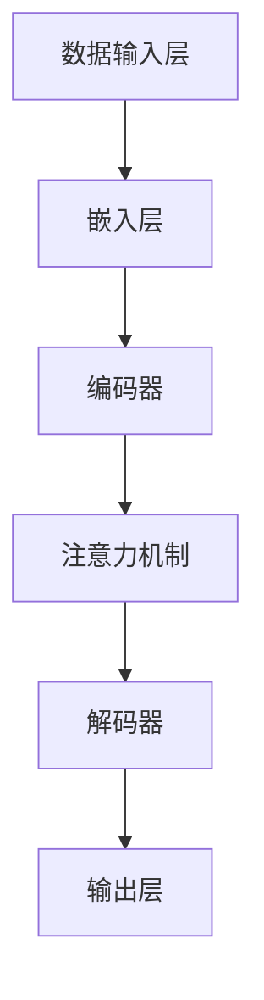

                 

### 引言

人工智能（AI）领域正在经历一场前所未有的变革，特别是大型模型（Large Models）的发展，如GPT-3、BERT等，已经在自然语言处理、计算机视觉、语音识别等领域取得了显著的成果。这些大型模型具有强大的学习能力，能够处理海量数据，提取特征，并实现高度复杂的任务。然而，随着模型规模的不断增大，开发和应用这些模型所面临的挑战也日益严峻。

在当前的技术浪潮中，AI大模型创业成为一个热门话题。对于创业者而言，如何利用AI大模型的技术优势，打造具有市场竞争力、可持续发展的产品或服务，成为关键问题。本文旨在探讨AI大模型创业的核心问题，帮助创业者明确方向，优化策略。

**关键词：** AI大模型、创业、社会优势、技术分析、商业策略

**摘要：** 本文将从AI大模型的基础知识、核心算法、数学模型、创业策略、案例分析、资源整合与风险管理等多个角度，系统性地分析AI大模型创业的各个方面。通过本文的阅读，创业者可以更好地理解AI大模型的本质，掌握创业实战的技巧，提高项目成功的概率。

在接下来的部分，我们将首先介绍AI大模型的基本概念和分类，然后深入探讨其核心算法原理，最后分析创业者在实际操作中可能面临的挑战和机遇。通过这些分析，我们希望为AI大模型创业提供一些有价值的参考和指导。

### AI大模型概述

#### 1.1 AI大模型的概念与分类

人工智能大模型（Large Models）是指具有数亿甚至数十亿参数的深度学习模型。这些模型通过大规模数据训练，能够实现高度复杂的任务，如自然语言处理、图像识别、语音识别等。AI大模型的概念起源于深度学习的发展，随着计算能力和数据资源的不断提升，大型模型逐渐成为人工智能研究的重要方向。

根据应用场景和模型结构的不同，AI大模型可以分为以下几类：

1. **自然语言处理（NLP）模型：** 这类模型主要用于处理文本数据，如生成文本、翻译、问答系统等。代表性模型包括GPT-3、BERT、T5等。

2. **计算机视觉（CV）模型：** 这类模型主要用于处理图像和视频数据，如图像分类、目标检测、人脸识别等。代表性模型包括ResNet、YOLO、SSD等。

3. **语音识别（ASR）模型：** 这类模型主要用于处理语音数据，如语音识别、语音合成等。代表性模型包括DeepSpeech、WaveNet等。

4. **多模态模型：** 这类模型能够同时处理多种类型的数据，如图像和文本、语音和文本等，实现跨模态信息处理。代表性模型包括Multimodal Transformer、ViT等。

#### 1.2 AI大模型的架构与核心组件

AI大模型的架构通常包括以下几个核心组件：

1. **数据输入层（Input Layer）：** 负责接收外部数据，如文本、图像、音频等。

2. **嵌入层（Embedding Layer）：** 将输入数据转换为稠密向量表示，为后续的深度学习处理提供基础。

3. **编码器（Encoder）：** 用于对输入数据进行编码，提取出高层次的语义特征。

4. **解码器（Decoder）：** 用于解码编码后的特征，生成输出结果，如文本、图像等。

5. **注意力机制（Attention Mechanism）：** 在处理序列数据时，用于关注序列中的关键信息，提高模型的准确性。

6. **输出层（Output Layer）：** 根据模型的任务类型，生成相应的输出结果。

以下是一个简化的AI大模型架构图，使用Mermaid语法表示：



#### 1.3 AI大模型的发展历史与趋势

AI大模型的发展历程可以分为以下几个阶段：

1. **早期探索阶段（2000年以前）：** 主要是基于传统机器学习方法的尝试，如支持向量机、决策树等。

2. **深度学习兴起阶段（2006-2012年）：** 神经网络特别是深度神经网络的提出和改进，使得模型的能力得到显著提升。

3. **AI大模型发展阶段（2012年至今）：** 随着计算资源和数据资源的增长，AI大模型逐渐成为人工智能研究的主流方向。

当前，AI大模型的发展趋势包括：

1. **模型规模增大：** 模型参数数量从数十万到数百万，再到数千万、数亿，甚至数十亿的参数。

2. **计算能力提升：** GPU、TPU等专用硬件的普及，使得大模型的训练速度显著提高。

3. **数据质量提高：** 高质量、多样化的数据集为模型的训练提供了有力支持。

4. **多模态处理：** 跨模态信息处理成为新的研究热点，如图像和文本、语音和文本的联合处理。

5. **预训练与微调：** 预训练大模型再微调到特定任务，成为提升模型性能的有效方法。

#### 1.4 AI大模型在各行业的应用案例

AI大模型在各个行业的应用日益广泛，以下是一些典型案例：

1. **自然语言处理：** 在文本生成、机器翻译、问答系统等领域，AI大模型显著提升了系统的性能。例如，GPT-3在文本生成和翻译方面表现出色，广泛应用于内容创作和翻译服务。

2. **计算机视觉：** 在图像分类、目标检测、人脸识别等领域，AI大模型使得计算机视觉系统具备了更高的准确性和鲁棒性。例如，ResNet在图像分类任务中取得了突破性成果，YOLO在目标检测领域具有广泛应用。

3. **语音识别：** 在语音识别和语音合成领域，AI大模型通过深度学习技术实现了更高的识别准确率和自然度。例如，DeepSpeech在语音识别领域取得了显著进展，WaveNet在语音合成方面表现出色。

4. **金融行业：** AI大模型在金融风控、量化交易、智能投顾等领域发挥了重要作用。例如，通过大规模数据分析和模型预测，金融机构能够更准确地评估风险，提高交易效率。

5. **医疗健康：** AI大模型在医学影像分析、疾病预测、药物研发等领域展现出巨大潜力。例如，通过深度学习技术，医疗影像系统能够更准确地诊断疾病，加速药物研发进程。

6. **智能制造：** AI大模型在智能制造领域的应用包括设备预测维护、生产优化、质量控制等。例如，通过实时数据分析，智能制造系统能够优化生产流程，提高生产效率。

以上案例表明，AI大模型在各行业的应用前景广阔，但也面临一些挑战，如数据隐私、模型解释性、计算资源需求等。创业者需要充分了解这些应用场景和挑战，以制定有效的创业策略。

在接下来的章节中，我们将进一步探讨AI大模型的核心算法原理，帮助读者深入理解其技术本质，为后续的创业实践打下坚实基础。

### AI大模型的核心算法原理

#### 2.1 人工神经网络与深度学习

人工神经网络（Artificial Neural Networks，ANN）是模拟人脑神经元结构和功能的一种计算模型。它通过大量人工神经元（即节点）及其之间的连接（即边）来处理信息和数据。每个神经元接受多个输入，通过加权求和后加上偏置，再通过激活函数输出结果。

人工神经网络的核心组成部分包括：

1. **神经元（Neurons）：** 模拟生物神经元的计算单元，负责接收和处理输入信息。
2. **权重（Weights）：** 控制神经元输入信号的强度。
3. **偏置（Bias）：** 改变神经元的阈值，影响其激活状态。
4. **激活函数（Activation Functions）：** 引入非线性特性，使神经网络能够处理复杂问题。

常见的激活函数包括：

- **线性激活函数（Linear Activation Function）：** $$ f(x) = x $$
- **sigmoid函数：** $$ f(x) = \frac{1}{1 + e^{-x}} $$
- **ReLU函数（Rectified Linear Unit）：** $$ f(x) = \max(0, x) $$
- **Tanh函数：** $$ f(x) = \frac{e^x - e^{-x}}{e^x + e^{-x}} $$

人工神经网络的工作原理可以概括为以下几个步骤：

1. **前向传播（Forward Propagation）：** 输入数据通过神经网络，每个神经元根据其权重和输入计算输出。
2. **反向传播（Backpropagation）：** 计算输出结果与实际结果之间的误差，通过误差梯度反向更新神经元的权重和偏置。
3. **优化目标函数（Objective Function）：** 通常使用均方误差（Mean Squared Error，MSE）或其他损失函数来衡量模型预测误差。

人工神经网络是一种简单而有效的计算模型，但由于其参数数量有限，难以解决复杂问题。为了克服这一限制，研究人员提出了深度学习（Deep Learning）。

#### 2.2 深度学习的基本概念

深度学习是一种基于人工神经网络的深度结构，其核心思想是通过多层神经网络对数据进行特征提取和抽象。深度学习的模型结构通常包括输入层、隐藏层和输出层。

- **输入层（Input Layer）：** 接收原始数据，如图像、文本等。
- **隐藏层（Hidden Layers）：** 通过非线性变换逐层提取数据特征，隐藏层的数量和每个层的节点数可以根据任务需求进行调整。
- **输出层（Output Layer）：** 根据任务类型生成预测结果，如分类标签、回归值等。

深度学习的特点包括：

1. **多层结构：** 能够捕捉数据中的复杂特征和模式。
2. **非线性变换：** 利用非线性激活函数增强模型的表示能力。
3. **自动特征提取：** 通过多层神经网络自动提取高层次的抽象特征，减少人工特征工程的需求。

常见的深度学习模型包括：

- **卷积神经网络（Convolutional Neural Networks，CNN）：** 主要用于图像处理任务，通过卷积操作提取图像特征。
- **循环神经网络（Recurrent Neural Networks，RNN）：** 主要用于序列数据处理任务，如自然语言处理和时间序列预测。
- **长短时记忆网络（Long Short-Term Memory，LSTM）：** RNN的一种变体，解决了RNN的梯度消失和梯度爆炸问题。

深度学习的工作流程与人工神经网络类似，包括前向传播和反向传播。然而，深度学习通过多层网络结构，使得模型能够自动提取更加复杂的特征，从而在许多任务中取得了显著的性能提升。

#### 2.3 神经网络优化算法

深度学习的性能依赖于模型的参数设置和训练过程。优化算法是训练深度学习模型的重要工具，用于调整模型参数以最小化损失函数。以下介绍几种常用的神经网络优化算法：

##### 2.3.1 反向传播算法（Backpropagation Algorithm）

反向传播算法是深度学习训练的核心算法，用于计算模型参数的梯度，并更新参数以最小化损失函数。以下是反向传播算法的基本步骤：

1. **前向传播（Forward Propagation）：** 输入数据通过神经网络，每个神经元根据其权重和输入计算输出。
2. **计算损失（Compute Loss）：** 计算模型输出结果与实际结果之间的损失，常用的损失函数包括均方误差（MSE）和交叉熵（Cross-Entropy）。
3. **反向传播（Backward Propagation）：** 从输出层开始，逐层计算每个神经元的误差梯度。
4. **参数更新（Parameter Update）：** 使用梯度下降（Gradient Descent）或其他优化算法更新模型参数。

以下是反向传播算法的伪代码表示：

```python
# 输入数据 x，标签 y，学习率 alpha
# 前向传播得到输出 y_pred
# 计算损失 loss
# 反向传播计算梯度
gradients = compute_gradients(y_pred, y)

# 更新参数
theta -= alpha * gradients
```

##### 2.3.2 随机梯度下降（Stochastic Gradient Descent，SGD）

随机梯度下降是一种常用的优化算法，通过随机选取一部分数据进行参数更新。以下是随机梯度下降的基本步骤：

1. **随机选择数据点：** 从训练数据集中随机选择一个数据点。
2. **计算梯度：** 对所选数据点计算损失函数的梯度。
3. **更新参数：** 根据梯度更新模型参数。

随机梯度下降的优点是计算简单，但可能需要多次迭代才能收敛。以下是随机梯度下降的伪代码表示：

```python
# 输入数据集 D，迭代次数 num_iterations，学习率 alpha
for i in range(num_iterations):
    # 随机选择一个数据点 (x, y)
    x, y = random_choice(D)
    
    # 计算梯度
    gradient = compute_gradient(x, y)
    
    # 更新参数
    theta -= alpha * gradient
```

##### 2.3.3 小批量梯度下降（Mini-batch Gradient Descent）

小批量梯度下降是对随机梯度下降的一种改进，通过将数据集分成小批量进行参数更新。以下是小批量梯度下降的基本步骤：

1. **划分数据集：** 将数据集划分为多个小批量。
2. **计算梯度：** 对每个小批量数据计算损失函数的梯度。
3. **更新参数：** 根据小批量梯度的平均值更新模型参数。

小批量梯度下降在计算效率和收敛速度上优于随机梯度下降，以下是小批量梯度下降的伪代码表示：

```python
# 输入数据集 D，批量大小 batch_size，迭代次数 num_iterations，学习率 alpha
for i in range(num_iterations):
    # 遍历所有小批量
    for batch in batch(D, batch_size):
        # 计算梯度
        gradient = compute_gradient(batch)
        
        # 更新参数
        theta -= alpha * gradient.mean()
```

通过以上几种优化算法，深度学习模型能够在大量数据上高效地训练，从而实现良好的性能。

在接下来的章节中，我们将进一步探讨AI大模型中的自然语言处理技术，帮助读者深入了解这一重要领域。

#### 2.4 自然语言处理技术

自然语言处理（Natural Language Processing，NLP）是人工智能的一个重要分支，旨在使计算机能够理解、生成和处理人类自然语言。AI大模型在NLP领域取得了显著的成果，以下介绍几种关键的自然语言处理技术。

##### 2.4.1 词嵌入技术

词嵌入（Word Embedding）是将词汇映射为高维向量表示的技术，使得计算机能够处理文本数据。词嵌入技术通过将单词映射到低维空间中的点，捕捉单词之间的语义关系。以下介绍几种常见的词嵌入方法：

1. **Word2Vec：** Word2Vec是一种基于神经网络的方法，通过训练大规模语料库来生成词向量。Word2Vec包括两个变种：连续词袋（Continuous Bag of Words，CBOW）和Skip-Gram。
   - **CBOW：** 通过上下文词的均值来预测中心词。
   - **Skip-Gram：** 通过中心词的邻域词来预测中心词。

2. **GloVe：** GloVe（Global Vectors for Word Representation）是一种基于共现概率的词嵌入方法，通过矩阵分解模型生成词向量。GloVe通过计算词与词之间的共现概率矩阵，然后使用奇异值分解（SVD）得到词向量。

词嵌入技术使得计算机能够更好地理解和处理文本数据，例如，词向量可以用于文本分类、文本相似度计算和机器翻译等任务。

##### 2.4.2 序列模型与注意力机制

在NLP任务中，序列数据（如文本和语音）的处理是一个重要问题。序列模型（Sequential Models）是一类专门用于处理序列数据的神经网络模型，包括循环神经网络（Recurrent Neural Networks，RNN）和其变体。

1. **RNN（循环神经网络）：** RNN通过记忆单元（Memory Unit）保存前一时间步的信息，使得模型能够处理序列数据。然而，RNN存在梯度消失和梯度爆炸的问题，限制了其在长序列数据上的表现。

2. **LSTM（长短时记忆网络）：** LSTM是RNN的一种变体，通过引入门控机制（Gate Mechanism）解决了梯度消失问题。LSTM通过遗忘门（Forget Gate）、输入门（Input Gate）和输出门（Output Gate）控制信息的存储和输出。

3. **GRU（门控循环单元）：** GRU是LSTM的简化版本，通过更新门（Update Gate）和重置门（Reset Gate）实现了信息的存储和更新。GRU在计算效率和性能上优于LSTM。

注意力机制（Attention Mechanism）是另一种用于处理序列数据的技术，通过关注序列中的关键信息，提高模型的性能。注意力机制可以动态地调整模型对序列中每个元素的权重，使得模型能够聚焦于最重要的信息。以下是一个简单的注意力机制实现：

```python
# 输入序列 X，权重 W
# 计算注意力权重
attention_weights = softmax(W @ X)

# 计算注意力得分
attention_scores = attention_weights * X

# 计算最终输出
output = sum(attention_scores, axis=1)
```

注意力机制在机器翻译、文本生成和问答系统等领域取得了显著的效果，例如，Transformer模型通过多头注意力机制（Multi-Head Attention）实现了优越的NLP性能。

##### 2.4.3 编码器-解码器模型

编码器-解码器（Encoder-Decoder）模型是一种用于序列到序列学习的神经网络模型，常用于机器翻译、问答系统和文本生成等任务。编码器（Encoder）负责对输入序列进行编码，提取出高层次的语义特征；解码器（Decoder）负责解码编码后的特征，生成输出序列。

编码器-解码器模型结合了注意力机制，使得模型能够更好地处理长序列数据。以下是一个简单的编码器-解码器模型实现：

```python
# 输入序列 X，目标序列 Y，编码器 W_enc，解码器 W_dec
# 编码器处理输入序列
encoded_sequence = W_enc @ X

# 解码器处理编码后的特征
output_sequence = W_dec @ encoded_sequence

# 应用注意力机制
output_sequence = apply_attention(output_sequence, Y)

# 生成输出序列
generated_sequence = softmax(output_sequence)
```

通过以上技术，AI大模型在NLP领域取得了显著的进展，使得计算机能够更好地理解和处理人类自然语言。在接下来的章节中，我们将继续探讨AI大模型的数学模型与公式，帮助读者深入了解其理论基础。

#### 3.1 概率论基础

在深度学习和AI大模型中，概率论是不可或缺的基础工具。概率论中的许多概念和原理被广泛应用于模型的构建、参数估计和推理过程中。以下介绍概率论中一些核心的基础概念和原理。

##### 3.1.1 概率分布函数

概率分布函数（Probability Distribution Function，PDF）描述了一个随机变量在各个可能取值上的概率分布。对于连续随机变量，概率分布通常用概率密度函数（Probability Density Function，PDF）来表示。概率密度函数$f(x)$满足以下条件：

1. **非负性：** 对于所有$x$，有$f(x) \geq 0$。
2. **归一性：** 整个定义域上的概率密度函数积分等于1，即$$ \int_{-\infty}^{+\infty} f(x) \, dx = 1 $$。

常见的概率密度函数包括正态分布、均匀分布和泊松分布等。

- **正态分布（Normal Distribution）：** 正态分布的概率密度函数为$$ f(x|\mu,\sigma^2) = \frac{1}{\sqrt{2\pi\sigma^2}} e^{-\frac{(x-\mu)^2}{2\sigma^2}} $$，其中$\mu$是均值，$\sigma^2$是方差。
- **均匀分布（Uniform Distribution）：** 均匀分布的概率密度函数为$$ f(x|[a,b]) = \begin{cases} 
\frac{1}{b-a} & \text{if } a \leq x \leq b \\
0 & \text{otherwise} 
\end{cases} $$，其中$a$和$b$是均匀分布的上下限。
- **泊松分布（Poisson Distribution）：** 泊松分布的概率密度函数为$$ f(x|\lambda) = \frac{e^{-\lambda} \lambda^x}{x!} $$，其中$\lambda$是事件发生的平均频率。

##### 3.1.2 最大似然估计

最大似然估计（Maximum Likelihood Estimation，MLE）是一种用于估计模型参数的方法。在给定一组观测数据的情况下，最大似然估计找到使观测数据出现的概率最大的参数值。具体步骤如下：

1. **构建似然函数：** 似然函数是参数的函数，表示给定参数值下观测数据出现的概率。对于离散数据，似然函数为$$ L(\theta|x) = \prod_{i=1}^{n} p(x_i|\theta) $$，其中$\theta$是参数向量，$x_i$是第$i$个观测值，$n$是观测值的数量。对于连续数据，似然函数为$$ L(\theta|x) = \int p(x|\theta) \, dx $$。

2. **求导并设置导数为零：** 对似然函数关于参数求导，并设置导数为零，解出参数值。对于离散数据，求导过程为$$ \frac{dL(\theta|x)}{d\theta} = 0 $$，对于连续数据，求导过程为$$ \frac{dL(\theta|x)}{d\theta} = 0 $$。

3. **解方程：** 解出参数值，得到最大似然估计。在实际应用中，由于导数求解可能非常复杂，常常使用数值方法进行优化。

##### 3.1.3 贝叶斯推断

贝叶斯推断（Bayesian Inference）是一种基于贝叶斯定理的统计推断方法。贝叶斯推断通过结合先验知识和观测数据，更新对参数的概率分布，从而获得后验概率分布。贝叶斯推断的基本公式为：

$$ P(\theta|x) = \frac{P(x|\theta)P(\theta)}{P(x)} $$

其中，$P(\theta|x)$是后验概率分布，$P(x|\theta)$是似然函数，$P(\theta)$是先验概率分布，$P(x)$是证据（Evidence）。

1. **先验概率分布：** 先验概率分布是基于专家知识和经验的初始概率分布。常见的先验分布包括正态分布、均匀分布和高斯过程等。

2. **似然函数：** 似然函数是观测数据在给定参数值下的概率分布。在深度学习和AI大模型中，似然函数通常通过模型预测和实际观测值之间的差异来计算。

3. **后验概率分布：** 后验概率分布是结合先验概率和似然函数计算得到的，反映了参数在给定观测数据下的最佳估计。

贝叶斯推断在深度学习和AI大模型中具有重要的应用，例如，用于模型选择、超参数调优和不确定性估计等。

##### 3.1.4 贝叶斯网络

贝叶斯网络（Bayesian Network）是一种用于表示变量之间依赖关系的概率模型。贝叶斯网络由一组随机变量及其条件概率分布组成，其中每个随机变量表示为一个节点，节点之间的边表示变量之间的条件依赖关系。

贝叶斯网络的定义可以用图结构表示，其中每个节点表示一个随机变量，边表示变量之间的条件依赖。给定一个完整的贝叶斯网络，可以通过推理算法计算变量之间的条件概率，从而实现不确定性推理。

贝叶斯网络在深度学习和AI大模型中的应用包括：

1. **变量关系建模：** 通过构建贝叶斯网络，可以直观地表示变量之间的依赖关系，为模型设计提供指导。
2. **不确定性估计：** 贝叶斯网络可以用于不确定性推理，为模型的预测提供概率分布，从而提供更加可靠的结果。
3. **模型评估：** 贝叶斯网络可以用于评估模型的性能和可靠性，通过计算模型的预测概率分布，比较不同模型之间的差异。

在接下来的章节中，我们将继续探讨深度学习模型中的损失函数和优化算法，帮助读者深入了解模型的训练过程。

#### 3.2 损失函数与优化算法

在深度学习和AI大模型中，损失函数和优化算法是模型训练的核心组成部分。损失函数用于衡量模型预测结果与真实结果之间的差异，而优化算法则通过调整模型参数，使损失函数最小化。以下介绍几种常见的损失函数和优化算法。

##### 3.2.1 损失函数

损失函数（Loss Function）是一种用于量化模型预测误差的函数。常见的损失函数包括：

1. **均方误差（Mean Squared Error，MSE）：** 均方误差是回归任务中最常用的损失函数，用于计算预测值与真实值之间的平均平方误差。MSE的公式为：

   $$ J(\theta) = \frac{1}{m} \sum_{i=1}^{m} (h_{\theta}(x^{(i)}) - y^{(i)})^2 $$

   其中，$h_{\theta}(x)$是模型预测值，$y^{(i)}$是真实值，$m$是样本数量。

2. **交叉熵（Cross-Entropy）：** 交叉熵是分类任务中最常用的损失函数，用于衡量模型预测概率分布与真实概率分布之间的差异。交叉熵的公式为：

   $$ J(\theta) = -\frac{1}{m} \sum_{i=1}^{m} \sum_{k=1}^{K} y^{(i)}_k \log(h_{\theta}(x^{(i)})_k) $$

   其中，$K$是类别数量，$y^{(i)}_k$是第$i$个样本在第$k$个类别上的真实概率。

3. **对数损失（Log Loss）：** 对数损失是交叉熵的一种变形，通常用于二分类问题。对数损失的公式为：

   $$ J(\theta) = -\frac{1}{m} \sum_{i=1}^{m} y^{(i)} \log(h_{\theta}(x^{(i)})) + (1 - y^{(i)}) \log(1 - h_{\theta}(x^{(i)})) $$

##### 3.2.2 优化算法

优化算法（Optimization Algorithm）用于调整模型参数，使损失函数最小化。以下介绍几种常见的优化算法：

1. **梯度下降（Gradient Descent）：** 梯度下降是一种基本的优化算法，通过迭代更新模型参数，使损失函数逐渐减小。梯度下降的基本步骤如下：

   - 初始参数$\theta_0$。
   - 计算损失函数关于参数的梯度$\nabla_{\theta} J(\theta)$。
   - 更新参数$\theta_{t+1} = \theta_t - \alpha \nabla_{\theta} J(\theta_t)$，其中$\alpha$是学习率。

   梯度下降分为以下几种变种：

   - **批量梯度下降（Batch Gradient Descent）：** 每次迭代使用所有样本的梯度更新参数。
   - **随机梯度下降（Stochastic Gradient Descent，SGD）：** 每次迭代随机选择一个样本的梯度更新参数。
   - **小批量梯度下降（Mini-batch Gradient Descent）：** 每次迭代使用一个小批量样本的梯度更新参数。

2. **动量法（Momentum）：** 动量法是一种改进的梯度下降算法，通过引入动量项，加速参数的更新。动量法的公式为：

   $$ \theta_{t+1} = \theta_t - \alpha \nabla_{\theta} J(\theta_t) + \beta (\theta_{t} - \theta_{t-1}) $$

   其中，$\beta$是动量系数。

3. **Adam优化器（Adam Optimizer）：** Adam优化器是一种结合了动量法和自适应学习率的优化算法。Adam优化器的公式为：

   $$ \theta_{t+1} = \theta_t - \alpha \frac{m_t}{1 - \beta_1^t} \nabla_{\theta} J(\theta_t) + \beta_2 \theta_t - \beta_1 \theta_{t-1} $$

   其中，$m_t$和$v_t$分别是累积一阶矩估计和累积二阶矩估计，$\beta_1$和$\beta_2$是超参数。

在深度学习和AI大模型中，选择合适的损失函数和优化算法对模型的性能和训练效率至关重要。通过合理选择和调整这些参数，可以有效地优化模型，提高预测精度和泛化能力。

在接下来的章节中，我们将探讨AI大模型创业中的挑战与机遇，帮助创业者更好地理解市场环境和竞争优势。

### 4.1 创业者面临的挑战与机遇

在AI大模型创业的过程中，创业者不仅需要具备扎实的技术能力，还需面对多种挑战和机遇。以下从技术、市场、资金和团队建设四个方面进行分析。

#### 4.1.1 技术挑战

1. **技术门槛高：** AI大模型需要强大的计算能力和丰富的数据资源，对技术团队的要求较高。创业者需具备深度学习、分布式计算、大数据处理等方面的专业知识。
2. **数据需求大：** 大模型训练需要大量高质量的数据，数据获取和清洗是关键难题。此外，数据隐私和安全问题也需要特别注意。
3. **模型优化难：** 大模型训练过程复杂，参数调整和优化需要大量实验和计算资源。创业者需具备强大的模型调优能力和数据处理能力。

#### 4.1.2 市场机遇

1. **行业需求增长：** 随着AI技术的普及，各行各业对AI大模型的需求不断增加。从自然语言处理到计算机视觉，再到医疗健康和金融领域，AI大模型的应用前景广阔。
2. **创新空间大：** AI大模型在各个行业中的应用仍处于探索阶段，创业者有机会发掘新的应用场景，推动行业创新。
3. **技术红利：** 随着AI技术的不断突破，大模型在性能和功能上持续提升，为创业者提供了更多的技术红利。

#### 4.1.3 资金需求

1. **前期投入大：** AI大模型开发需要大量的资金支持，包括硬件设备、数据采购和人才引进等。
2. **持续资金投入：** 大模型训练和优化是一个持续的过程，需要不断的资金投入来支持技术升级和业务拓展。
3. **融资难度：** AI大模型创业面临较大的融资难度，投资者对技术风险和市场需求持谨慎态度。创业者需具备良好的商业计划和市场前景，以吸引投资。

#### 4.1.4 团队建设

1. **技术团队：** 创业者需要组建一支强大的技术团队，包括深度学习、数据科学、软件工程等专业人才。团队协作和知识共享对项目成功至关重要。
2. **市场团队：** 创业者需组建一支专业的市场团队，负责市场调研、产品推广和客户关系维护。了解市场需求，提高客户满意度是关键。
3. **运营团队：** 创业者需建立高效的运营团队，负责项目管理、业务运营和售后服务。良好的运营管理能够提升企业的核心竞争力。

通过分析挑战与机遇，创业者可以更加清晰地规划创业方向，制定有效的应对策略。在接下来的章节中，我们将探讨AI大模型创业方向的选择，帮助创业者找到合适的突破口。

### 4.2 AI大模型创业方向选择

在确定了AI大模型创业的总体方向后，创业者需要进一步细化具体的应用场景和市场需求，以便选择最具潜力的创业方向。以下从市场需求分析、创业方向建议以及实施步骤等方面进行探讨。

#### 4.2.1 市场需求分析

1. **自然语言处理（NLP）：** NLP技术在文本生成、机器翻译、问答系统等方面具有广泛的应用。随着互联网内容的爆炸式增长，对于高质量自然语言处理服务的需求不断上升。例如，内容审核、智能客服、个性化推荐等应用场景都具有巨大的市场潜力。
2. **计算机视觉（CV）：** CV技术在图像识别、目标检测、人脸识别等领域表现出色。随着物联网和智能制造的快速发展，CV技术在安防监控、自动驾驶、智能监控等领域的应用需求不断增加。
3. **语音识别（ASR）：** 语音识别技术在智能语音助手、智能客服、实时语音翻译等方面具有重要应用。随着智能家居和智能汽车的普及，对于高效稳定的语音识别解决方案的需求日益增长。
4. **医疗健康：** AI大模型在医疗健康领域具有广泛的应用潜力，如疾病预测、医学影像分析、药物研发等。随着人口老龄化和医疗技术的进步，医疗健康领域的市场需求将持续增长。
5. **金融科技：** AI大模型在金融领域的应用包括智能投顾、风险控制、量化交易等。随着金融科技的不断发展，对于高效智能的金融解决方案的需求越来越强烈。

#### 4.2.2 创业方向建议

1. **垂直领域应用：** 选择一个特定的垂直领域，如医疗健康、金融科技、智能制造等，专注于该领域内的AI大模型应用，提高解决方案的专业性和针对性。
2. **跨行业融合：** 考虑将AI大模型技术应用于多个行业，实现跨行业的融合创新。例如，将自然语言处理与计算机视觉技术结合，开发智能客服系统，提高客户服务体验。
3. **行业解决方案：** 针对特定行业的需求，提供完整的行业解决方案。例如，为医疗机构提供疾病预测和医学影像分析系统，为金融机构提供智能投顾和风险控制系统。
4. **技术平台建设：** 构建一个开放的平台，提供AI大模型训练、部署和管理的服务，吸引开发者和使用者，形成生态圈。
5. **应用场景探索：** 不断探索新的应用场景，开拓市场空间。例如，在无人驾驶、智慧城市、数字营销等领域寻找机会，推动AI大模型技术的广泛应用。

#### 4.2.3 实施步骤

1. **市场调研：** 对目标市场进行深入调研，了解用户需求、市场规模和竞争对手情况，为创业方向选择提供数据支持。
2. **技术评估：** 对所选创业方向进行技术评估，确定所需的技术储备和开发资源，确保项目可行性。
3. **团队组建：** 组建一支专业化的团队，包括AI大模型研发、产品管理、市场推广等关键岗位，确保项目顺利推进。
4. **项目立项：** 明确项目目标、任务分工和时间计划，确保项目按照预期进度进行。
5. **技术研发：** 开发AI大模型的核心算法和应用，确保技术方案的先进性和稳定性。
6. **产品发布：** 推出产品原型，进行市场测试和用户反馈，不断优化和改进产品。
7. **市场推广：** 开展市场推广活动，吸引潜在用户，提高产品知名度和市场份额。
8. **持续迭代：** 根据用户反馈和市场需求，不断优化产品功能，提升用户体验，保持产品竞争力。

通过以上步骤，创业者可以系统地推进AI大模型创业项目，逐步实现技术突破和市场拓展，提高项目成功率。

在接下来的章节中，我们将探讨AI大模型创业中的资源整合与利用策略，帮助创业者充分利用外部资源，提升项目竞争力。

### 4.3 创业项目策划与实施

在确定了AI大模型创业的方向后，创业者需要制定详细的项目策划和实施计划，以确保项目顺利推进并达到预期目标。以下从项目策划、实施步骤、团队管理和风险管理等方面进行探讨。

#### 4.3.1 项目策划

1. **目标设定：** 明确项目的长期和短期目标，包括技术目标、市场目标和财务目标等。目标应具体、可衡量、可实现、相关性强和时限性。
2. **市场分析：** 深入分析目标市场，了解用户需求、市场规模、竞争对手和行业趋势，为产品定位和市场推广提供依据。
3. **技术路线图：** 制定详细的技术路线图，包括技术架构、核心算法、关键技术点等，确保技术实现的可行性和先进性。
4. **资源评估：** 评估项目所需的资源，包括资金、人力、设备和数据等，制定资源获取和分配计划。
5. **风险评估：** 识别项目可能面临的风险，制定风险应对策略，降低项目风险。

#### 4.3.2 实施步骤

1. **团队组建：** 根据项目需求，组建一支专业的团队，包括AI大模型研发、产品管理、市场推广、运营维护等关键岗位。团队成员应具备相关领域的专业知识和经验。
2. **技术研发：** 开展AI大模型核心算法和应用的研发，确保技术方案的先进性和稳定性。具体步骤包括：
   - **算法设计：** 根据市场需求，设计合适的AI大模型算法，包括数据预处理、模型训练、模型评估和优化等。
   - **实验验证：** 通过实验验证模型性能，调整模型参数和架构，提高模型准确率和稳定性。
   - **代码实现：** 根据算法设计，编写代码实现模型，确保代码的可读性、可维护性和可扩展性。
3. **产品开发：** 开发AI大模型产品原型，包括前端界面、后端服务、API接口等。具体步骤包括：
   - **需求分析：** 分析用户需求，制定产品功能清单和界面设计。
   - **原型设计：** 设计产品原型，包括界面布局、交互设计和用户流程。
   - **功能实现：** 根据原型设计，实现产品功能，确保产品符合设计要求。
4. **测试与优化：** 进行产品测试和优化，包括功能测试、性能测试和用户测试等。具体步骤包括：
   - **功能测试：** 确保产品功能正确、完整和稳定。
   - **性能测试：** 评估产品性能，包括响应时间、吞吐量和稳定性等。
   - **用户测试：** 收集用户反馈，优化产品界面和功能，提升用户体验。
5. **市场推广：** 制定市场推广策略，包括产品发布、营销活动、渠道拓展等。具体步骤包括：
   - **产品发布：** 通过官方网站、社交媒体、行业会议等渠道发布产品。
   - **营销活动：** 开展线上线下营销活动，吸引潜在用户和合作伙伴。
   - **渠道拓展：** 与相关行业的企业、机构建立合作关系，拓展市场渠道。

#### 4.3.3 团队管理

1. **角色分工：** 明确团队成员的角色和职责，确保每个人知道自己的工作内容和目标。
2. **协作沟通：** 建立有效的协作沟通机制，包括定期的团队会议、邮件沟通和即时通讯等。
3. **激励与成长：** 制定激励机制，鼓励团队成员的工作积极性，提供培训和晋升机会，促进团队成长。
4. **风险管理：** 识别团队内部可能面临的风险，制定风险应对策略，确保项目顺利进行。

#### 4.3.4 风险管理

1. **技术风险：** 评估技术实现的可行性和稳定性，确保技术方案符合项目要求。具体措施包括技术调研、实验验证和代码审查等。
2. **市场风险：** 分析市场需求和竞争态势，确保项目的市场前景。具体措施包括市场调研、竞争分析和用户反馈等。
3. **资金风险：** 评估项目所需的资金需求，确保资金充足。具体措施包括预算编制、资金筹措和资金管理。
4. **法律风险：** 识别项目可能涉及的法律风险，包括知识产权、数据隐私和合同等，确保项目合规。具体措施包括法律咨询、合同审查和合规管理等。

通过详细的项目策划和实施，创业者可以有效地推进AI大模型创业项目，提高项目成功率和市场竞争力。

### 5.1 成功案例分析

在AI大模型创业领域，有许多成功的案例展示了创业者如何通过技术创新和商业策略取得市场认可。以下我们分析几个具有代表性的成功案例，探讨其成功原因和经验教训。

#### 5.1.1 案例一：OpenAI

**公司简介：** OpenAI是一家成立于2015年的美国人工智能研究公司，致力于通过研究、开发和推广人工智能，造福全人类。OpenAI的创始团队包括著名人工智能科学家伊尔亚·苏茨克维（Ilya Sutskever）等人。

**成功原因：**
1. **技术创新：** OpenAI在人工智能研究方面取得了显著成果，推出了许多领先的AI大模型，如GPT-3、Dall-E等。这些模型在自然语言处理、图像生成等领域表现出色，为OpenAI赢得了广泛的关注。
2. **开源合作：** OpenAI秉持开源精神，发布了大量高质量的开源项目，吸引了全球开发者参与和贡献。这种开放的合作模式不仅提高了公司的技术影响力，还促进了社区的共同进步。
3. **商业应用：** OpenAI积极探索AI大模型在商业领域的应用，与多家企业合作，提供定制化的AI解决方案。例如，与微软合作推出OpenAI API，使企业能够利用OpenAI的技术优势。
4. **人才优势：** OpenAI吸引了全球顶级的人工智能专家加入，形成了一支强大的技术团队。这种人才优势为公司的技术创新和商业发展提供了有力支持。

**经验教训：**
- **技术创新：** 创业者应注重技术创新，不断突破技术瓶颈，提升产品竞争力。
- **开放合作：** 开源合作有助于提高技术影响力，吸引人才和资源。
- **商业应用：** 创业者应积极寻找AI大模型在商业领域的应用场景，实现技术的商业价值。

#### 5.1.2 案例二：TensorFlow

**公司简介：** TensorFlow是谷歌开发的一款开源机器学习框架，广泛应用于AI大模型的训练和应用。TensorFlow不仅是一款技术工具，还成为了AI大模型创业的重要基础设施。

**成功原因：**
1. **技术优势：** TensorFlow提供了丰富的API和工具，支持多种类型的机器学习任务，包括深度学习、强化学习等。这种技术优势吸引了大量开发者使用TensorFlow进行研究和开发。
2. **社区支持：** TensorFlow拥有庞大的社区支持，包括技术论坛、开发者教程和全球会议等。这种社区支持促进了TensorFlow的普及和应用。
3. **企业合作：** TensorFlow与多家企业合作，提供定制化的解决方案，帮助企业实现人工智能应用。例如，谷歌、Uber、Airbnb等知名企业都在使用TensorFlow进行AI研发。
4. **持续更新：** TensorFlow不断更新和优化，推出新的版本和功能，保持技术领先地位。

**经验教训：**
- **技术优势：** 创业者应注重技术积累，提供高质量的技术工具和服务。
- **社区支持：** 建立强大的社区支持，提高产品的用户基础和影响力。
- **企业合作：** 与企业合作，探索技术应用的商业价值，实现可持续发展。

#### 5.1.3 案例三：DeepMind

**公司简介：** DeepMind是一家成立于2010年的英国人工智能公司，专注于机器学习和深度学习的研究和应用。DeepMind在AI大模型领域取得了多项突破性成果，如AlphaGo和AlphaZero。

**成功原因：**
1. **技术创新：** DeepMind在人工智能研究领域取得了多项突破，推出了许多领先的AI大模型。这些模型在棋类游戏、强化学习等领域表现出色，为DeepMind赢得了广泛的声誉。
2. **跨界合作：** DeepMind与多家企业合作，将AI大模型技术应用于实际业务场景，如医疗健康、能源管理、游戏等。这种跨界合作拓展了公司的业务领域，实现了技术应用的多元化。
3. **人才培养：** DeepMind注重人才培养，建立了一支高水平的研究团队，吸引了全球顶尖的AI人才加入。这种人才优势为公司的技术创新和商业发展提供了有力支持。
4. **持续投资：** DeepMind在研发和技术创新方面持续投资，保持技术领先地位。

**经验教训：**
- **技术创新：** 创业者应注重技术创新，不断推动技术进步。
- **跨界合作：** 跨界合作有助于拓展业务领域，实现技术应用的多元化。
- **人才培养：** 注重人才培养，建立高水平的研究团队。
- **持续投资：** 持续投资于研发和技术创新，保持技术领先地位。

通过分析这些成功案例，创业者可以借鉴其经验教训，优化自己的创业策略，提高项目成功率。

### 5.2 失败案例分析

在AI大模型创业领域，虽然有许多成功的案例，但也存在不少失败的项目。以下分析几个具有代表性的失败案例，探讨其失败原因和教训。

#### 5.2.1 案例一：DeepStack

**公司简介：** DeepStack是一家成立于2014年的AI公司，专注于开发用于扑克游戏的AI大模型。DeepStack曾因其AI算法在扑克游戏中取得突破性成果而受到广泛关注。

**失败原因：**
1. **市场需求不足：** DeepStack最初的市场定位是高端游戏玩家，但这一市场相对较小，需求有限。公司未能找到更大的应用场景，导致市场推广效果不佳。
2. **技术成熟度不足：** DeepStack在推出产品时，AI技术尚未完全成熟，导致产品在性能和稳定性方面存在不足。用户对产品的满意度不高，影响了公司的市场竞争力。
3. **资金链断裂：** 公司在早期扩张过程中，过度依赖风险投资，资金使用效率低下。随着市场表现不佳，公司未能及时获得新的资金支持，最终导致资金链断裂。

**教训：**
- **市场调研：** 创业者应进行充分的市场调研，确保目标市场有足够的需求和潜力。
- **技术成熟度：** 技术产品应在推出前达到较高的成熟度，确保性能和稳定性。
- **资金管理：** 创业者应合理规划资金使用，避免过度依赖风险投资。

#### 5.2.2 案例二：SenseTime

**公司简介：** 深智科技有限公司（SenseTime）是一家成立于2014年的中国人工智能公司，专注于计算机视觉和深度学习技术的研发和应用。

**失败原因：**
1. **业务模式不清晰：** SenseTime在发展过程中，业务模式频繁变化，缺乏明确的战略方向。公司在业务拓展过程中，没有充分考虑市场需求和自身技术优势，导致业务布局混乱。
2. **过度扩张：** 公司在扩张过程中，过度依赖外部融资，导致负债率过高。随着市场环境变化和竞争加剧，公司难以维持稳定的盈利模式。
3. **人才流失：** 公司在快速发展过程中，未能有效留住核心人才。人才流失导致公司技术实力和创新能力下降，影响了公司的长期发展。

**教训：**
- **战略规划：** 创业者应制定明确的战略规划，确保业务模式的可持续性。
- **谨慎扩张：** 创业者应谨慎扩张，避免过度依赖外部融资。
- **人才管理：** 创业者应重视人才管理和培养，建立稳定的研发团队。

#### 5.2.3 案例三：Zola

**公司简介：** Zola是一家成立于2013年的在线婚礼用品和礼品销售公司，曾获得多家知名投资机构的融资。

**失败原因：**
1. **市场定位模糊：** Zola在发展过程中，未能明确自身市场定位，导致产品和服务缺乏差异化优势。公司在多个细分市场同时布局，分散了资源，难以形成核心竞争力。
2. **用户体验不佳：** 公司在产品设计和用户体验方面存在明显不足，用户满意度不高。用户流失导致公司市场份额不断下降。
3. **成本控制不力：** 公司在运营过程中，未能有效控制成本，导致盈利能力不足。随着市场竞争加剧，公司难以维持稳定的运营。

**教训：**
- **市场定位：** 创业者应明确自身市场定位，确保产品和服务具有差异化优势。
- **用户体验：** 创业者应重视用户体验，提升产品和服务质量。
- **成本控制：** 创业者应加强成本控制，确保盈利能力。

通过分析这些失败案例，创业者可以从中吸取教训，避免重蹈覆辙，提高项目成功率。

### 5.3 AI大模型创业资源整合与利用

在AI大模型创业过程中，资源整合与利用是成功的关键因素之一。以下从技术资源整合、融资与投资策略、合作与生态构建三个方面进行探讨。

#### 5.3.1 技术资源整合

1. **开源技术框架：** 开源技术框架为创业者提供了丰富的工具和资源，如TensorFlow、PyTorch等。通过使用这些框架，创业者可以快速搭建和训练AI大模型，降低开发难度。
2. **数据资源：** 高质量的数据资源是AI大模型训练的基础。创业者可以通过公开数据集、合作获取数据等方式，积累丰富的数据资源。此外，还可以利用数据清洗和标注工具，提升数据的可用性。
3. **云计算平台：** 云计算平台提供了强大的计算能力和存储资源，支持大规模AI模型的训练和部署。创业者可以利用云平台提供的AI服务，降低硬件投入和运维成本。

#### 5.3.2 融资与投资策略

1. **种子轮融资：** 创业者在种子轮阶段，可以通过个人资金、天使投资和政府补助等方式筹集初始资金。种子轮融资主要用于团队组建、产品原型开发和市场调研。
2. **风险投资：** 风险投资是AI大模型创业的主要资金来源。创业者应制定详细的商业计划，展示项目的市场前景、技术优势和商业模式，以吸引风险投资机构的关注。
3. **股权众筹：** 股权众筹是一种面向大众投资者的融资方式，可以通过互联网平台筹集资金。股权众筹有助于提高项目的知名度和市场认可度，但需要确保众筹过程的合规性和透明度。

#### 5.3.3 合作与生态构建

1. **产学研合作：** 创业者可以与高校、研究机构和行业企业建立合作关系，共享技术资源和研究成果。产学研合作有助于提升技术实力和市场竞争力。
2. **产业链整合：** 创业者可以通过与上下游企业合作，构建完整的产业链。例如，与硬件厂商合作，提供AI大模型解决方案；与行业企业合作，推动AI技术在各领域的应用。
3. **生态圈建设：** 创业者可以构建开放的生态圈，吸引开发者、用户和合作伙伴加入。通过生态圈建设，创业者可以扩大市场影响力，提升产品竞争力。

通过技术资源整合、融资与投资策略以及合作与生态构建，创业者可以充分利用外部资源，提升项目成功率。

### 5.4 AI大模型创业风险分析

在AI大模型创业过程中，风险是不可避免的，创业者需要全面识别并有效应对这些风险，以确保项目的稳定发展。以下从技术风险、市场风险和法律风险三个方面进行详细分析。

#### 5.4.1 技术风险

1. **技术不成熟：** AI大模型技术仍处于快速发展阶段，部分算法和模型尚未达到成熟水平。创业者需确保所使用的技术方案具有可行性和稳定性，避免技术风险导致项目失败。
2. **计算资源需求高：** AI大模型训练和推理需要大量的计算资源，包括GPU、TPU等。创业者需合理评估计算资源需求，确保项目有足够的硬件支持，避免因资源不足导致项目延期或性能下降。
3. **数据隐私和安全：** AI大模型训练和部署过程中，涉及到大量的数据收集和处理，数据隐私和安全问题至关重要。创业者需采取有效的数据加密、访问控制和安全审计措施，防止数据泄露和滥用。

#### 5.4.2 市场风险

1. **市场需求不足：** 创业者需要对目标市场进行深入调研，确保市场需求真实且持续。若市场需求不足，项目可能面临市场推广困难，导致项目无法实现预期收益。
2. **竞争激烈：** AI大模型市场存在激烈的竞争，创业者需确保自身技术优势和产品差异化，以在市场中脱颖而出。创业者需密切关注竞争对手的动态，及时调整战略，提高市场竞争力。
3. **技术更新迅速：** AI大模型技术更新迅速，创业者需保持技术敏感性，及时跟进技术发展趋势，避免因技术落后导致市场份额丧失。

#### 5.4.3 法律风险

1. **知识产权保护：** AI大模型创业过程中，需注意知识产权的保护，包括专利、商标和版权等。创业者需提前进行知识产权布局，防止技术被侵权或盗用。
2. **数据隐私合规：** 创业者需遵守相关法律法规，确保数据处理符合数据隐私保护要求。例如，需遵循《通用数据保护条例》（GDPR）和《加州消费者隐私法案》（CCPA）等法规。
3. **法律纠纷：** AI大模型在应用过程中，可能涉及法律纠纷，如合同纠纷、侵权纠纷等。创业者需建立完善的法律风险防控体系，及时应对法律纠纷，避免对项目造成严重影响。

通过全面识别和分析技术风险、市场风险和法律风险，创业者可以提前制定应对策略，降低风险对项目的负面影响，提高项目成功率。

### 5.5 AI大模型创业优化策略

在AI大模型创业过程中，为了提高项目的成功率，创业者需要采取一系列优化策略，确保项目在技术、用户体验和成本控制等方面达到最佳状态。以下从用户体验优化、成本控制与效益分析两个方面进行详细探讨。

#### 5.5.1 用户体验优化

1. **用户调研与反馈：** 创业者需进行全面的用户调研，了解用户需求、偏好和行为习惯。通过用户反馈，不断优化产品设计和功能，提升用户满意度。创业者可以采用问卷调查、用户访谈和用户测试等手段，收集用户反馈，及时调整产品方向。
2. **界面与交互设计：** 创业者需注重产品的界面和交互设计，确保用户界面直观、易用。使用简洁的布局和清晰的指示，帮助用户快速了解和操作产品。此外，还可以通过动画、图标和提示等方式，提高用户的操作体验。
3. **个性化服务：** 创业者可以基于用户数据，提供个性化的服务推荐和定制化解决方案。通过分析用户行为和偏好，为用户提供个性化的内容和服务，提高用户粘性和忠诚度。

#### 5.5.2 成本控制与效益分析

1. **成本控制：** 创业者需制定详细的成本预算和管控措施，确保项目在预算范围内完成。具体措施包括：
   - **资源优化：** 合理配置计算资源、人力资源和资金资源，避免资源浪费。例如，通过使用云计算服务，优化计算资源的使用效率。
   - **精益管理：** 实施精益管理，降低运营成本。例如，通过精细化管理，提高生产效率，降低库存成本。
   - **合理定价：** 根据市场需求和竞争态势，合理定价产品或服务，确保项目有稳定的盈利模式。

2. **效益分析：** 创业者需定期进行效益分析，评估项目的经济效益和社会效益。具体措施包括：
   - **财务分析：** 通过财务报表，评估项目的盈利能力、现金流状况和投资回报率等关键指标。
   - **市场反馈：** 收集用户反馈和市场数据，分析项目的市场表现和用户满意度。
   - **项目评估：** 定期对项目进行评估，检查项目进度和目标达成情况，及时调整项目计划和策略。

通过用户体验优化和成本控制与效益分析，创业者可以提高项目的成功率，确保项目在技术和商业上取得双赢。

### 附录A：AI大模型创业工具与资源指南

在AI大模型创业过程中，合理利用工具和资源能够极大地提升项目的效率和质量。以下介绍一些常用的AI大模型开发工具、数据集和资源整合平台。

#### A.1 开发工具与框架

1. **TensorFlow：** TensorFlow是谷歌开发的一款开源机器学习框架，支持多种类型的机器学习任务，包括深度学习、强化学习等。它提供了丰富的API和工具，适用于AI大模型开发和部署。
2. **PyTorch：** PyTorch是Facebook开发的一款开源机器学习框架，以其灵活性和动态计算图而闻名。PyTorch广泛应用于深度学习和自然语言处理领域，是AI大模型开发的另一个重要工具。
3. **Keras：** Keras是一个高层次的神经网络API，构建在TensorFlow和Theano之上，提供了简洁的接口和易于使用的工具。Keras适用于快速构建和实验AI大模型。

#### A.2 数据集与资源

1. **OpenAI Gym：** OpenAI Gym是一个开源的环境库，提供了多种基准任务和模拟环境，用于测试和比较不同算法的性能。Gym广泛应用于机器学习和深度学习领域的实验和研究。
2. **Kaggle：** Kaggle是一个数据科学竞赛平台，提供了丰富的公开数据集和比赛项目。创业者可以在Kaggle上找到各种领域的数据集，用于AI大模型训练和优化。
3. **ImageNet：** ImageNet是一个大规模的视觉识别数据库，包含了数百万个标注图像。它广泛应用于计算机视觉领域，是许多深度学习模型的训练数据来源。

#### A.3 创业资源整合平台

1. **GitHub：** GitHub是一个全球领先的代码托管和协作平台，创业者可以在GitHub上找到各种开源项目和代码示例，学习AI大模型开发的技术细节。
2. **AngelList：** AngelList是一个创业者和投资者之间的连接平台，提供了丰富的创业资源和投资机会。创业者可以通过AngelList寻找合作伙伴、投资者和资源支持。
3. **TechCrunch：** TechCrunch是一个科技新闻网站，提供了全球最新的科技创业新闻、分析和趋势报告。创业者可以通过TechCrunch了解行业动态和竞争态势，把握市场机会。

通过合理利用这些工具和资源，创业者可以加快AI大模型项目的开发进程，提高项目的成功概率。

### 附录 B: AI 大模型创业参考资料与推荐阅读

在AI大模型创业的道路上，获取专业的知识、实用的经验和最新的技术动态是至关重要的。以下推荐了一些经典书籍、在线资源和相关的会议和活动，供创业者参考和学习。

#### B.1 AI 大模型创业书籍推荐

1. **《深度学习：全面解释卷积神经网络与循环神经网络》**
   - 作者：伊恩·古德费洛
   - 简介：这本书详细介绍了深度学习的基本原理、卷积神经网络和循环神经网络，对于理解AI大模型的核心技术非常有帮助。

2. **《强化学习：原理与实践》**
   - 作者：理查德·S. 塞勒、阿米尔·帕特尔
   - 简介：强化学习是AI大模型中重要的分支，这本书系统介绍了强化学习的基本概念、算法和实际应用。

3. **《AI大模型：深度学习的技术与应用》**
   - 作者：周志华
   - 简介：本书深入探讨了AI大模型在各个领域的应用，包括自然语言处理、计算机视觉和语音识别等，对于创业者了解AI大模型的应用场景和前景具有指导意义。

4. **《AI创业实战：如何从零开始创建成功的人工智能企业》**
   - 作者：宋涛
   - 简介：这本书详细介绍了AI创业的实战经验，从团队组建、产品开发到市场推广，为创业者提供了全面的理论指导和实际案例。

#### B.2 AI 大模型创业在线资源

1. **[AI创业社区](https://www.ai-venture.com/)**：这个社区提供了AI创业相关的新闻、案例分析、研讨会等信息，是创业者获取行业动态和交流经验的平台。

2. **[AI Handbook](https://aihandbook.org/)**：这是一个开源的AI创业指南，涵盖了AI创业的各个方面，包括技术、市场、资金等，是创业者必备的资源。

3. **[ArXiv](https://arxiv.org/)**：这是一个免费的科学研究论文预印本平台，包含了大量的AI研究论文，创业者可以通过阅读最新的研究进展，了解AI大模型的最新技术动态。

#### B.3 AI 大模型创业相关会议和活动

1. **[NeurIPS](https://neurips.cc/)**：神经信息处理系统会议（NeurIPS）是AI领域最重要的学术会议之一，涵盖了深度学习、机器学习、自然语言处理等众多领域，是创业者了解前沿技术和趋势的重要渠道。

2. **[ICML](https://icml.cc/)**：国际机器学习会议（ICML）是另一个备受瞩目的AI学术会议，提供了丰富的学术论文和研讨会，覆盖了从基础研究到实际应用的广泛主题。

3. **[AI Summit](https://aisummit.ai/)**：AI峰会是一个汇集全球AI领域专家的盛会，涵盖了AI的应用、技术、创业等多个方面，为创业者提供了一个交流和学习的平台。

通过阅读这些书籍、访问在线资源和参与相关的会议和活动，创业者可以不断学习和提升自己的专业知识和创业能力，为AI大模型创业奠定坚实的基础。

### 结论

综上所述，AI大模型创业是一个充满机遇和挑战的过程。通过本文的探讨，我们系统地分析了AI大模型的基础知识、核心算法、数学模型、创业策略、案例分析、资源整合与风险管理等多个方面。从AI大模型的基础概念和分类，到核心算法原理和自然语言处理技术，再到创业挑战与机遇、项目策划与实施，以及资源整合与优化策略，我们提供了全面的技术分析和实战指导。

创业者需在明确市场需求的基础上，选择具有潜力的创业方向，并通过技术创新、资源整合和风险管理，提高项目的成功率。同时，创业者还应密切关注行业动态，积极拓展合作与生态构建，以实现AI大模型技术的商业价值。

在AI大模型创业的道路上，技术创新是核心，市场需求是导向，资源整合是保障，风险管理是关键。希望本文能为创业者提供有价值的参考和启示，助力他们在AI大模型创业中取得成功。

**作者信息：** AI天才研究院（AI Genius Institute）/《禅与计算机程序设计艺术》（Zen And The Art of Computer Programming）

**结语：** AI大模型创业，不仅是对技术的探索，更是对人类智慧和未来生活的重塑。让我们携手共进，共同推动AI大模型的创新与发展，创造更加美好的未来。

