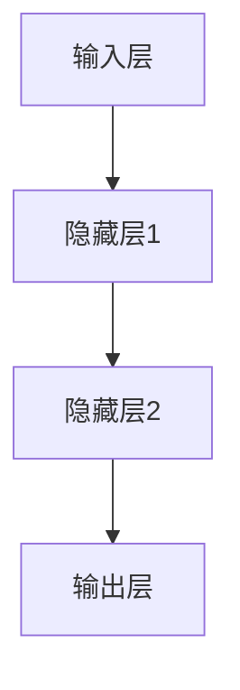
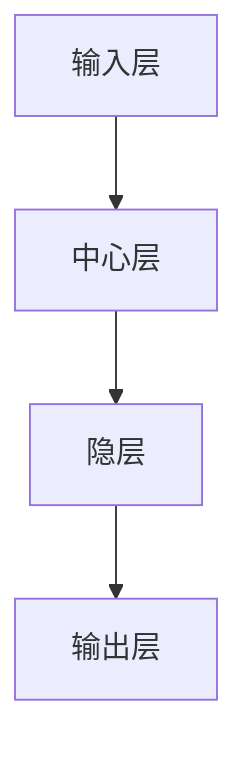
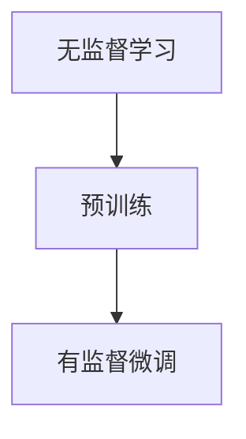
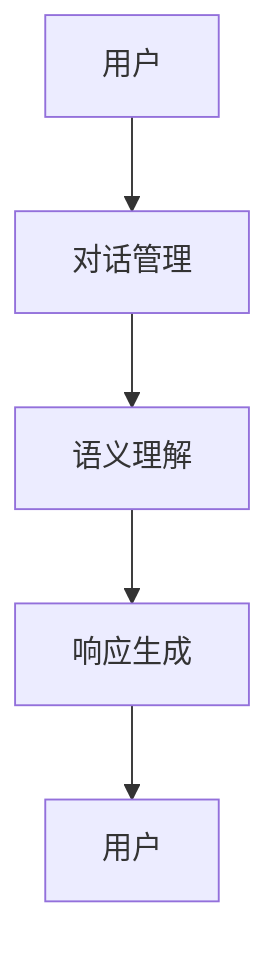
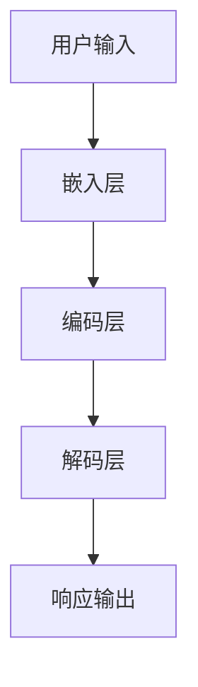
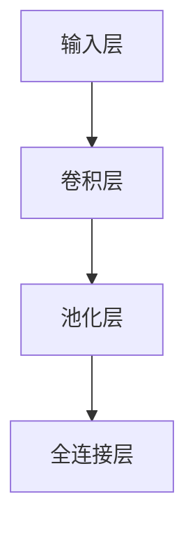
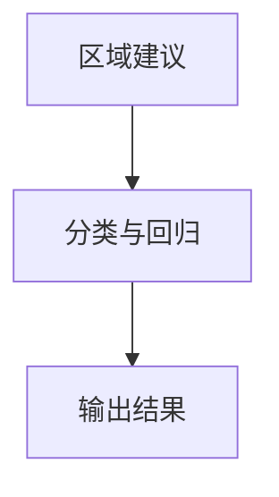

                 

# AI 大模型创业：如何利用社会优势？

> **关键词**：AI大模型、创业、社会优势、资源整合、技术创新、商业模式

> **摘要**：本文将探讨 AI 大模型创业的路径，分析如何利用社会优势推动大模型创业项目的发展。文章首先介绍了 AI 大模型的基础知识，随后探讨了其应用领域和创业策略，通过实际案例分析总结了成功因素和挑战，并提出了利用社会资源的具体策略。文章最后讨论了创业团队的成长与转型，以及给出了实用的开发工具和资源链接，为 AI 大模型创业者提供了全面的理论和实践指导。

---

## 第一部分：AI大模型基础

AI大模型是近年来人工智能领域的重大突破，它们通过深度学习等先进技术，在图像识别、自然语言处理、语音识别等领域取得了显著的成果。本部分将首先介绍 AI 大模型的概述，包括其发展历程、关键特性以及与传统 AI 的对比。接着，我们将深入探讨 AI 大模型的核心原理，包括深度学习基础和径向基函数网络（RBF）等内容。最后，我们将简要分析当前 AI 大模型的技术趋势，如大规模预训练模型和模型压缩与加速技术。

### 第1章：AI大模型概述

#### 第1.1节：AI大模型时代的来临

**1.1.1 AI大模型的发展历程**

AI大模型的发展历程可以分为几个重要阶段：

1. **浅层模型阶段**：这一阶段主要使用简单的神经网络进行数据处理，如感知机、多层感知机等。
2. **深度学习阶段**：以 Hinton 等人为代表的学者提出了深度信念网络（DBN）等模型，深度学习开始崛起。
3. **大规模模型阶段**：随着计算能力和数据规模的提升，BERT、GPT-3等大规模预训练模型被提出，AI大模型时代来临。

**1.1.2 AI大模型的关键特性**

AI大模型具有以下关键特性：

- **高维度数据处理能力**：AI大模型能够处理高维度、海量的数据，使得其在图像、语音和文本等复杂数据处理领域具有强大的能力。
- **自学习能力**：AI大模型通过深度学习等算法，能够自动从数据中学习并提取特征，无需人工干预。
- **通用性与可定制化**：AI大模型不仅具有广泛的通用性，还可以根据具体应用场景进行定制化调整，满足不同需求。

**1.1.3 AI大模型与传统AI的对比**

| 特性 | AI大模型 | 传统AI |
| :--: | :-------: | :-----: |
| 数据规模 | 高维度、海量数据 | 小数据 |
| 学习模式 | 自适应学习 | 预定义规则 |
| 应用范围 | 广泛领域 | 针对领域 |

#### 第1.2节：AI大模型的核心原理

**1.2.1 深度学习基础**

**1.2.1.1 深度学习网络结构**

深度学习网络结构主要包括输入层、隐藏层和输出层。以下是一个简单的深度学习网络结构的 Mermaid 流程图：



**1.2.1.2 激活函数**

激活函数是深度学习网络中的一个关键组件，常用的激活函数有 ReLU、Sigmoid 和 Tanh 等。以下是一个 ReLU 激活函数的公式：

$$\text{ReLU}(x) = \max(0, x)$$

**1.2.2 径向基函数网络（RBF）**

RBF 网络是一种基于径向基函数的非线性变换前件网络，其结构包括输入层、中心层、隐层和输出层。以下是一个 RBF 网络结构的 Mermaid 流程图：



**1.2.2.2 RBF网络训练算法**

RBF 网络的训练通常采用聚类算法来计算中心，然后通过径向基函数更新权重。以下是一个 RBF 网络训练算法的伪代码：

```python
# 伪代码
for each data_point in dataset:
    calculate centers using clustering algorithms
    update weights using radial basis function
```

#### 第1.3节：AI大模型的技术趋势

**1.3.1 大规模预训练模型**

大规模预训练模型是当前 AI 大模型技术的重要趋势之一。预训练模型首先通过无监督学习在大量数据上进行训练，然后通过有监督微调（Supervised Fine-tuning）来适应特定任务。以下是一个预训练模型的原理 Mermaid 流程图：



**1.3.2 模型压缩与加速**

模型压缩与加速是提高 AI 大模型应用效率的重要手段。常用的模型压缩算法包括知识蒸馏、权重剪枝和深度可分离卷积等。以下是一个模型加速技术的简单概述：

- **知识蒸馏**：通过将一个大模型的知识迁移到一个小模型中，实现模型的压缩。
- **权重剪枝**：通过去除模型中不重要的权重，减少模型参数数量。
- **深度可分离卷积**：通过将卷积操作分解为深度卷积和逐点卷积，减少计算量。

**1.3.3 模型压缩算法**

以下是一些常见的模型压缩算法：

- **知识蒸馏**：通过训练一个小型模型来复制大型模型的输出，以传递知识。

  ```python
  # 伪代码
  for each data_point in dataset:
      predict outputs using big_model
      train small_model to replicate big_model outputs
  ```

- **权重剪枝**：通过在训练过程中删除重要性较低的权重，从而减少模型的复杂性。

  ```python
  # 伪代码
  for each layer in model:
      identify non-important weights
      remove non-important weights from layer
  ```

- **深度可分离卷积**：通过将卷积操作分解为深度卷积和逐点卷积，减少参数数量。

  ```python
  # 伪代码
  for each layer in model:
      apply depthwise convolution
      apply pointwise convolution
  ```

**1.3.4 模型加速技术**

以下是一些常见的模型加速技术：

- **GPU加速**：利用图形处理器（GPU）的高并行计算能力，加速模型的训练和推理。
- **分布式训练**：通过将数据分布在多台机器上进行训练，提高训练速度。
- **混合精度训练**：通过使用浮点数和整数混合运算，提高模型的训练效率。

## 第二部分：AI大模型应用领域

AI大模型的应用领域非常广泛，包括自然语言处理（NLP）、计算机视觉（CV）等多个领域。本部分将重点介绍这些应用领域的基本原理和主流技术。

### 第2章：AI大模型应用领域

#### 第2.1节：自然语言处理（NLP）

自然语言处理是 AI 大模型的重要应用领域之一，主要涉及语言模型的构建和对话系统的实现。

**2.1.1 语言模型**

语言模型是一种用于预测下一个单词或词组的模型，其基本原理如下：

$$P(w_1, w_2, ..., w_n) = \prod_{i=1}^{n} P(w_i | w_{<i})$$

语言模型的应用非常广泛，包括文本分类、机器翻译和自动摘要等。

**2.1.2 对话系统**

对话系统是一种与人类进行自然语言交互的系统，其基本结构包括用户、对话管理、语义理解和响应生成。以下是一个对话系统的 Mermaid 流程图：



**2.1.3 主流对话系统框架**

目前主流的对话系统框架包括 RNN、LSTM 和 Transformer 等。以下是一个基于 Transformer 的对话系统框架的 Mermaid 流程图：



#### 第2.2节：计算机视觉（CV）

计算机视觉是 AI 大模型的另一个重要应用领域，主要涉及图像识别和目标检测等技术。

**2.2.1 卷积神经网络（CNN）**

卷积神经网络是计算机视觉的核心模型，其基本结构包括输入层、卷积层、池化层和全连接层。以下是一个 CNN 的 Mermaid 流程图：



**2.2.2 CNN训练算法**

CNN 的训练算法通常采用反向传播算法，其目标是最小化损失函数。以下是一个 CNN 训练算法的伪代码：

```python
# 伪代码
for each data_point in dataset:
    forward_pass
    calculate_loss
    backward_pass
    update_weights
```

**2.2.3 目标检测**

目标检测是计算机视觉中的重要任务，其目的是在图像中检测出特定目标的位置和类别。以下是一个目标检测的简单流程：

1. **区域建议（Region Proposal）**：常用的区域建议方法包括 Selective Search 和 Deep Proposals。
2. **分类与回归**：分类任务用于判断目标类别，回归任务用于预测目标位置。常用的目标检测算法包括 Single Shot Detection（SSD）和 Fast R-CNN。



## 第三部分：AI大模型创业策略

AI大模型创业是一个充满挑战和机遇的过程。本部分将探讨 AI 大模型创业所需的准备、融资策略和商业模式，并通过实际案例进行分析，为创业者提供指导。

### 第3章：AI大模型创业策略

#### 第3.1节：创业准备

**3.1.1 市场调研**

市场调研是 AI 大模型创业的重要一步，包括市场需求分析和竞争分析。

- **市场需求分析**：创业者需要了解目标市场的用户需求，包括用户痛点和需求趋势。
- **竞争分析**：创业者需要了解竞争对手的产品、优势和不足，寻找市场差异化点。

**3.1.2 团队建设**

团队建设是 AI 大模型创业的关键，包括核心团队构成和团队协作模式。

- **核心团队构成**：核心团队应包括技术团队、运营团队和市场团队。
- **团队协作模式**：创业者可以采用敏捷开发、分工合作等模式，提高团队效率。

#### 第3.2节：融资策略

**3.2.1 融资渠道**

AI 大模型创业通常需要大量的资金支持，常见的融资渠道包括天使投资和风险投资。

- **天使投资**：天使投资通常由个人投资者或投资基金提供，为创业公司提供初始资金。
- **风险投资**：风险投资通常在创业公司发展成熟后提供，帮助公司扩展业务。

**3.2.2 融资方案设计**

融资方案设计包括融资金额和投资回报。

- **融资金额**：融资金额应根据项目需求和财务规划来确定。
- **投资回报**：创业者需要展示项目的盈利模式和市场前景，以吸引投资。

#### 第3.3节：商业模式探索

**3.3.1 产品定位**

产品定位是商业模式设计的关键，包括目标用户和产品特色。

- **目标用户**：AI 大模型创业的产品可以面向企业用户和普通用户。
- **产品特色**：产品应具备强大的 AI 功能和用户友好性。

**3.3.2 收入模式**

收入模式包括订阅模式和广告模式。

- **订阅模式**：用户通过定期订阅或一次性购买来使用产品。
- **广告模式**：产品可以通过移动广告和搜索引擎广告来获取收入。

### 第4章：AI大模型创业案例分析

#### 第4.1节：案例介绍

**4.1.1 案例一：DeepMind**

DeepMind 是一家成立于2010年的 AI 公司，由戴密斯·哈萨比斯创立。DeepMind 主要从事人工智能研究与应用，其最著名的成果是击败人类冠军的围棋程序 AlphaGo。

**4.1.2 案例二：OpenAI**

OpenAI 是一家成立于2015年的 AI 公司，由山姆·阿尔特曼等人创立。OpenAI 专注于人工智能的研发与推广，其最著名的项目是 GPT-3 语言模型。

#### 第4.2节：案例分析

**4.2.1 成功因素**

DeepMind 和 OpenAI 的成功因素包括：

- **技术优势**：DeepMind 和 OpenAI 在人工智能领域拥有强大的技术实力和专利积累。
- **市场策略**：DeepMind 和 OpenAI 通过品牌影响力和营销手段，成功吸引了大量用户和投资。

**4.2.2 挑战与应对**

DeepMind 和 OpenAI 面临的挑战包括：

- **技术挑战**：随着 AI 模型的不断升级，计算资源需求也在增加，数据安全与隐私问题也需要关注。
- **应对策略**：DeepMind 和 OpenAI 通过持续的技术创新和遵守法律法规，积极应对这些挑战。

### 第5章：AI大模型创业经验分享

#### 第5.1节：创业经验总结

AI 大模型创业的经验总结包括：

- **技术创新**：AI 大模型创业需要持续的技术创新，包括算法优化和应用场景拓展。
- **团队建设**：高效的团队协作和多元化的团队是创业成功的关键。
- **融资策略**：精准的融资定位和灵活的融资策略有助于企业快速发展。

#### 第5.2节：创业建议

对于 AI 大模型创业，以下是一些建议：

- **技术研发**：持续投入技术研发，关注前沿技术和应用趋势。
- **市场拓展**：精准定位市场，通过多渠道推广产品。
- **融资与投资**：灵活应对融资需求，制定长期发展规划。

## 第四部分：社会优势利用

AI 大模型创业不仅需要技术创新和商业模式，还需要充分利用社会优势资源，如研究机构、企业合作和政策支持。本部分将探讨如何整合这些社会资源，为 AI 大模型创业提供支持。

### 第6章：社会资源整合

#### 第6.1节：社会资源概述

AI 大模型创业可以利用以下社会资源：

- **研究机构**：国家重点实验室和国际顶级会议为创业公司提供了丰富的技术资源和学术支持。
- **企业合作**：行业领军企业和创新型企业的合作可以为创业公司提供市场资源和合作机会。
- **政策支持**：税收优惠和创新基金等政策支持为创业公司提供了资金和政策保障。

#### 第6.2节：跨界合作

跨界合作是利用社会资源的重要方式，包括：

- **技术合作**：传统行业与 AI 技术的融合，如智能制造、智能医疗等。
- **共同研发**：联合实验室和联合科研项目，共同攻克技术难题。

#### 第6.3节：人才培养

人才培养是 AI 大模型创业的关键，包括：

- **人才需求**：技术人才和管理人才的培养，满足公司发展的需求。
- **培养策略**：人才引进和培养与激励策略，提高员工积极性。

### 第7章：AI大模型创业案例分析

#### 第7.1节：案例介绍

**7.1.1 案例一：阿里巴巴**

阿里巴巴是一家全球领先的互联网公司，其业务涵盖电商、云计算和金融科技。阿里巴巴通过充分利用社会资源，如研究机构、企业合作和政策支持，实现了快速发展和创新。

**7.1.2 案例二：腾讯**

腾讯是一家全球领先的科技公司，其业务涵盖社交网络、游戏和云计算。腾讯通过跨界合作和人才培养，推动了 AI 技术在多个领域的应用。

#### 第7.2节：案例分析

**7.2.1 成功因素**

阿里巴巴和腾讯的成功因素包括：

- **企业文化**：以客户为中心和激励创新的企业文化，为公司的快速发展提供了动力。
- **社会资源**：充分利用社会资源，如研究机构、企业合作和政策支持，为公司的创新和发展提供了有力保障。

**7.2.2 挑战与应对**

阿里巴巴和腾讯面临的挑战包括：

- **技术挑战**：技术迭代速度和信息安全问题，需要持续的技术创新和安全保障。
- **社会责任**：社会责任和公众信任问题，需要积极承担社会责任并赢得公众信任。

## 第五部分：创业实践与成长

AI 大模型创业不仅需要理论指导，还需要实际的创业实践和团队成长。本部分将探讨 AI 大模型创业的实战经验和团队成长策略。

### 第8章：AI大模型创业实战

#### 第8.1节：项目启动

**8.1.1 项目规划**

项目规划包括项目定位和项目计划。

- **项目定位**：根据市场需求和公司战略，确定项目的目标和定位。
- **项目计划**：制定项目周期、资源配置和里程碑计划。

**8.1.2 团队组建**

团队组建包括核心成员招募和团队协作模式。

- **核心成员招募**：招募技术骨干和管理人员，构建高效团队。
- **团队协作模式**：采用敏捷开发、分工合作等模式，提高团队协作效率。

#### 第8.2节：技术研发

**8.2.1 技术路线规划**

技术路线规划包括技术选型和技术研发流程。

- **技术选型**：选择合适的算法和工具框架，满足项目需求。
- **技术研发流程**：包括需求分析、设计与实现、测试与调试等阶段。

**8.2.2 代码管理与版本控制**

代码管理与版本控制是确保代码质量和协作开发的重要手段。

- **代码库管理**：使用 Git 或 SVN 等工具进行代码管理。
- **版本控制**：采用主分支和功能分支模式，确保代码的稳定性和可维护性。

#### 第8.3节：产品上线

**8.3.1 上线策略**

上线策略包括小范围测试和实时监控。

- **小范围测试**：进行小范围测试，收集用户反馈和问题，进行优化调整。
- **实时监控**：上线后实时监控系统性能和用户行为，确保产品稳定运行。

**8.3.2 上线后的运营**

上线后的运营包括用户增长策略和产品迭代。

- **用户增长策略**：通过线上活动、用户社群等方式，促进用户增长。
- **产品迭代**：根据用户需求和反馈，持续优化和迭代产品。

### 第9章：创业团队成长与转型

#### 第9.1节：团队建设

**9.1.1 团队文化**

团队文化是团队建设的基础，包括团队价值观和团队氛围。

- **团队价值观**：以客户至上和创新驱动为核心价值观。
- **团队氛围**：开放沟通和团队协作的积极氛围。

**9.1.2 员工激励**

员工激励是提高团队士气和效率的重要手段，包括绩效考核和奖励机制。

- **绩效考核**：通过 KPI 考核和项目考核，评估员工绩效。
- **奖励机制**：提供员工股票期权和绩效奖金等激励措施。

#### 第9.2节：业务拓展

**9.2.1 市场拓展策略**

市场拓展策略包括品牌建设和渠道拓展。

- **品牌建设**：明确市场定位，进行品牌推广。
- **渠道拓展**：通过线上渠道和线下渠道，扩大市场覆盖。

**9.2.2 产品多样化**

产品多样化包括产品创新和跨界合作。

- **产品创新**：不断拓展产品功能，满足用户需求。
- **跨界合作**：与其他行业进行合作，实现资源共享和优势互补。

#### 第9.3节：企业融资与上市

**9.3.1 融资策略**

融资策略包括融资渠道和上市准备。

- **融资渠道**：利用风险投资和证券市场等渠道，获取资金支持。
- **上市准备**：进行法律合规和财务审计等准备，确保顺利上市。

**9.3.2 上市后管理**

上市后管理包括股权管理和企业治理。

- **股权管理**：制定股权激励政策，平衡员工利益和企业发展。
- **企业治理**：建立健全董事会运作和高管团队管理机制。

## 附录

### 附录A：AI大模型开发工具与资源

**A.1 开发工具**

- **A.1.1 深度学习框架**

  - TensorFlow
  - PyTorch
  - Keras

- **A.1.2 数据处理库**

  - Pandas
  - NumPy
  - Scikit-learn

**A.2 资源链接**

- **A.2.1 开源项目**

  - GitHub
  - GitLab

- **A.2.2 学术论文**

  - arXiv
  - IEEE Xplore

- **A.2.3 在线课程与教材**

  - Coursera
  - edX

### 附录B：参考文献

- [Hinton, G. E., Osindero, S., & Teh, Y. W. (2006). A Fast Learning Algorithm for Deep Belief Nets. In Advances in Neural Information Processing Systems (pp. 873-880).](https://papers.nips.cc/paper/2006/file/5c1e818e7d4e5d8a0e565368e5c0c3ce-Paper.pdf)
- [LeCun, Y., Bengio, Y., & Hinton, G. (2015). Deep learning. Nature, 521(7553), 436-444.](https://www.nature.com/articles/nature14539)
- [Russell, S., & Norvig, P. (2010). Artificial Intelligence: A Modern Approach (3rd ed.). Prentice Hall.](https://www.aima.cs.berkeley.edu textbook/)

---

## 结论

AI 大模型创业是一个充满挑战和机遇的过程。本文从基础知识、应用领域、创业策略、社会优势利用和创业实践等方面，全面探讨了 AI 大模型创业的路径。通过实际案例分析和经验分享，本文为 AI 大模型创业者提供了理论指导和实践建议。在未来的发展中，创业者需要不断创新、整合资源、拓展市场，以应对日益激烈的竞争环境。同时，社会各界的支持也是 AI 大模型创业成功的关键，包括研究机构、企业合作和政策支持等。只有在充分利用社会优势的基础上，AI 大模型创业才能取得更大的成功。

---

作者：AI天才研究院/AI Genius Institute & 禅与计算机程序设计艺术 /Zen And The Art of Computer Programming

