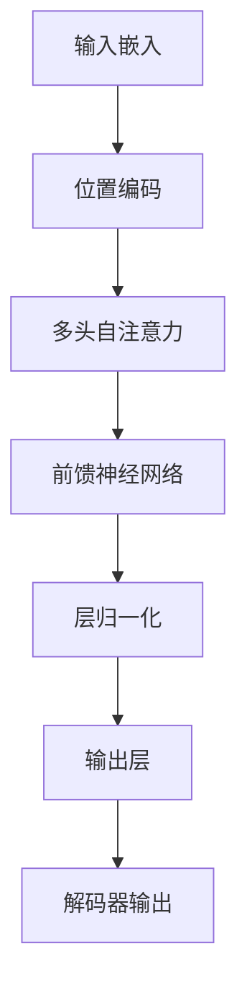

                 

## 《AI大模型原理与应用：transformer 今天最大的缺点是 data hungry，其次是 compute hungry》文章标题

### 关键词：
- AI大模型
- Transformer
- Data Hungry
- Compute Hungry
- 数据预处理
- 计算资源优化
- 硬件加速
- 分布式训练

### 摘要：
本文将深入探讨AI大模型及其核心技术Transformer的原理与应用。通过详细解析Transformer的架构、优化算法、数据预处理与计算资源优化方法，揭示其两大主要缺点：data hungry和compute hungry。此外，本文还将探讨AI大模型在自然语言处理和计算机视觉等领域的应用实践，以及未来发展的趋势与挑战。希望通过本文，读者能够全面了解AI大模型的理论与实践，为其在人工智能领域的广泛应用提供参考。

## 《AI大模型原理与应用：transformer 今天最大的缺点是 data hungry，其次是 compute hungry》目录大纲

### 第一部分: AI大模型基础

#### 第1章: AI大模型概述

##### 1.1 AI大模型的发展背景与现状

##### 1.2 AI大模型的核心概念

##### 1.3 AI大模型的关键技术

##### 1.4 AI大模型的应用领域

#### 第2章: AI大模型核心技术详解

##### 2.1 Transformer架构解析

**2.1.1 Transformer模型概述**

**2.1.2 自注意力机制**

**2.1.3 多头注意力**

**2.1.4 Positional Encoding**

**2.1.5 Transformer的Mermaid流程图**

##### 2.2 Transformer优化算法

**2.2.1 Adam优化器**

**2.2.2 学习率调度**

**2.2.3 Batch Normalization**

**2.2.4 梯度裁剪**

##### 2.3 数据预处理与处理策略

**2.3.1 数据清洗**

**2.3.2 数据归一化**

**2.3.3 数据增强**

**2.3.4 数据加载与缓存**

##### 2.4 计算资源优化

**2.4.1 数据并行训练**

**2.4.2 模型并行训练**

**2.4.3 硬件加速**

**2.4.4 分布式训练与推理**

### 第二部分: AI大模型应用实践

#### 第3章: 自然语言处理应用

##### 3.1 文本分类任务

##### 3.2 机器翻译任务

##### 3.3 问答系统

#### 第4章: 计算机视觉应用

##### 4.1 图像分类任务

##### 4.2 目标检测任务

##### 4.3 人脸识别任务

### 第三部分: AI大模型研究趋势与未来

#### 第5章: AI大模型挑战与解决方案

##### 5.1 Data Hungry问题

##### 5.2 Compute Hungry问题

##### 5.3 AI大模型安全性

#### 第6章: AI大模型未来发展趋势

##### 6.1 纳米级模型

##### 6.2 多模态AI

##### 6.3 量子AI

### 附录

#### 附录A: AI大模型常用工具与资源

##### A.1 AI大模型开源框架

##### A.2 数据处理工具

##### A.3 计算资源管理工具

## 第一部分: AI大模型基础

### 第1章: AI大模型概述

##### 1.1 AI大模型的发展背景与现状

人工智能（AI）作为当今科技领域的重要研究方向，已经取得了显著的进展。从最初的规则推理、知识表示到现代的深度学习，AI技术经历了数次变革。随着计算能力的提升和大数据的积累，AI大模型逐渐崭露头角。AI大模型是指具有巨大参数量和复杂结构的神经网络模型，能够在多个任务上表现出色，例如自然语言处理（NLP）和计算机视觉（CV）。

AI大模型的发展背景可以追溯到20世纪80年代，当时专家系统在工业和学术界取得了显著成果。然而，随着数据量的增加和计算能力的提升，深度学习逐渐成为主流。2012年，AlexNet在ImageNet竞赛中取得突破性成绩，标志着深度学习时代的到来。此后，深度神经网络在多个领域取得了显著进展，如语音识别、图像分类、自然语言处理等。

当前，AI大模型已经广泛应用于各个行业，如金融、医疗、教育、交通等。例如，金融领域利用AI大模型进行风险控制、投资策略优化；医疗领域利用AI大模型进行疾病诊断、药物研发；教育领域利用AI大模型进行个性化教学、智能推荐等。AI大模型的广泛应用，使得人工智能技术逐渐成为推动社会发展和创新的重要力量。

##### 1.2 AI大模型的核心概念

AI大模型的核心概念包括神经网络、深度学习、大数据、计算能力等。神经网络是AI大模型的基础，它由大量神经元（节点）组成，通过学习输入和输出之间的关系，实现从数据中提取知识。深度学习是神经网络的一种扩展，通过堆叠多层神经网络，实现更加复杂和抽象的特征表示。

大数据是AI大模型的另一个重要基础。随着互联网和物联网的发展，数据量呈现爆炸式增长。大数据为AI大模型提供了丰富的训练数据，使得模型能够更好地学习、泛化和推广。计算能力也是AI大模型成功的关键。强大的计算能力可以加速模型的训练和推理过程，提高模型的性能。

##### 1.3 AI大模型的关键技术

AI大模型的关键技术包括模型架构、训练算法、数据预处理、计算资源优化等。

模型架构方面，常见的AI大模型架构有卷积神经网络（CNN）、循环神经网络（RNN）、Transformer等。卷积神经网络在图像分类和目标检测领域表现出色；循环神经网络在序列数据处理方面具有优势；Transformer模型在自然语言处理领域取得了显著突破。

训练算法方面，常见的训练算法有随机梯度下降（SGD）、Adam优化器、学习率调度等。SGD是一种简单的梯度下降算法，适合小批量训练；Adam优化器在处理大数据量时表现出较好的性能；学习率调度则用于动态调整学习率，以避免过拟合。

数据预处理方面，数据清洗、归一化、增强等预处理方法对AI大模型的性能具有重要影响。数据清洗可以去除噪声和异常值；归一化可以缩小数据范围，提高训练效率；数据增强可以增加训练样本的多样性，提高模型的泛化能力。

计算资源优化方面，数据并行训练、模型并行训练、硬件加速、分布式训练等策略可以显著提高AI大模型的训练和推理效率。数据并行训练通过将数据分成多个批次，同时训练多个模型，减少训练时间；模型并行训练通过将模型拆分为多个子模型，分别训练，提高训练效率；硬件加速利用GPU、TPU等专用硬件，提高计算速度；分布式训练则通过将训练任务分布在多台机器上，提高训练和推理效率。

##### 1.4 AI大模型的应用领域

AI大模型的应用领域广泛，主要包括自然语言处理、计算机视觉、语音识别、推荐系统等。

自然语言处理方面，AI大模型在文本分类、机器翻译、问答系统、情感分析等任务中表现出色。例如，BERT模型在多项自然语言处理任务中取得了优异的成绩，广泛应用于搜索引擎、聊天机器人等领域。

计算机视觉方面，AI大模型在图像分类、目标检测、人脸识别、图像生成等任务中取得了显著突破。例如，ResNet模型在ImageNet竞赛中取得了优异成绩，成为计算机视觉领域的重要工具。

语音识别方面，AI大模型在语音信号处理、语音合成、说话人识别等任务中表现出色。例如，WaveNet模型在语音合成领域取得了突破性成果，广泛应用于智能音箱、语音助手等领域。

推荐系统方面，AI大模型在用户行为分析、商品推荐、内容推荐等任务中表现出色。例如，DeepFM模型在推荐系统领域取得了显著成绩，广泛应用于电商、视频网站等领域。

总之，AI大模型在各个领域都取得了显著的进展，为人工智能技术的发展和应用提供了强大的支持。然而，AI大模型也面临一些挑战，如数据饥饿、计算饥饿等。在接下来的章节中，我们将深入探讨这些问题，并探索相应的解决方案。

## 第一部分: AI大模型基础

### 第2章: AI大模型核心技术详解

#### 2.1 Transformer架构解析

##### 2.1.1 Transformer模型概述

Transformer模型是由Vaswani等人于2017年提出的一种基于自注意力机制的深度学习模型，主要应用于自然语言处理领域。与传统循环神经网络（RNN）和卷积神经网络（CNN）不同，Transformer模型采用了完全基于注意力机制的架构，从而在机器翻译、文本分类等任务中取得了显著的性能提升。

Transformer模型的基本架构包括编码器（Encoder）和解码器（Decoder）。编码器负责将输入序列编码为固定长度的向量，解码器则负责将这些向量解码为输出序列。编码器和解码器都由多个相同的层组成，每层包含多头注意力机制、前馈神经网络和层归一化。以下是Transformer模型的详细架构：

1. 输入嵌入（Input Embedding）：输入序列由单词或子词表示，每个单词或子词通过嵌入层（Embedding Layer）转换为向量。

2. 位置编码（Positional Encoding）：由于Transformer模型不包含循环结构，无法捕捉输入序列的位置信息，因此需要添加位置编码（Positional Encoding）来表示序列中的位置关系。

3. 多层多头自注意力机制（Multi-head Self-Attention）：自注意力机制（Self-Attention）是一种计算输入序列中每个元素与其他元素之间相似度的方法。多头注意力（Multi-head Attention）则是将输入序列分成多个部分，分别进行自注意力计算，从而提高模型的表示能力。

4. 前馈神经网络（Feedforward Neural Network）：在自注意力机制之后，每个位置上的向量会通过一个前馈神经网络，进行非线性变换，以进一步提高表示能力。

5. 层归一化（Layer Normalization）：为了稳定训练过程，每层输出都会进行归一化处理。

6. 输出层（Output Layer）：解码器的最后一层输出通过softmax函数转换为概率分布，从而生成预测的输出序列。

##### 2.1.2 自注意力机制

自注意力机制（Self-Attention）是Transformer模型的核心组成部分，它通过计算输入序列中每个元素与其他元素之间的相似度，实现对序列的层次化表示。自注意力机制可以分为以下几步：

1. 输入嵌入（Input Embedding）：将输入序列表示为嵌入向量。

2. 计算查询（Query）、键（Key）和值（Value）：查询（Query）、键（Key）和值（Value）都是从输入嵌入向量中计算得到的。每个元素都同时充当查询、键和值，以便计算自注意力。

3. 计算相似度（Compute Similarity）：通过计算查询和键之间的点积，得到相似度分数，表示输入序列中每个元素与其他元素之间的相似度。

4. 加权求和（Weighted Summation）：根据相似度分数对输入序列中的元素进行加权求和，得到加权后的输出向量。

5. 处理重复信息（Handle Repeated Information）：通过多头注意力（Multi-head Attention）机制，将自注意力计算分解为多个子任务，从而减少重复信息的影响。

自注意力机制的优点包括：

1. 可以并行计算，提高训练和推理速度。
2. 可以捕捉输入序列中长距离的依赖关系。
3. 可以自适应地学习不同元素之间的相似度。

##### 2.1.3 多头注意力

多头注意力（Multi-head Attention）是Transformer模型中对自注意力机制的扩展，通过将输入序列分成多个部分，分别进行自注意力计算，从而提高模型的表示能力。多头注意力可以分为以下几步：

1. 分解输入序列：将输入序列分解为多个子序列，每个子序列称为一个头（Head）。

2. 计算查询、键和值：对于每个头，计算对应的查询、键和值。

3. 计算相似度：计算每个头上的查询和键之间的相似度。

4. 加权求和：对于每个头，对子序列中的元素进行加权求和，得到加权后的输出向量。

5. 融合多头输出：将多个头的输出进行融合，得到最终的输出向量。

多头注意力的优点包括：

1. 提高模型的表示能力：通过多个头的组合，模型可以捕捉到更复杂的依赖关系。
2. 减少重复信息：多头注意力可以减少重复信息的负面影响，提高模型的性能。

##### 2.1.4 Positional Encoding

由于Transformer模型不包含循环结构，无法直接捕捉输入序列的位置信息。为了解决这个问题，需要在输入序列中添加位置编码（Positional Encoding）。位置编码是一种将位置信息编码为向量形式的技巧，可以通过以下方式实现：

1. 绝对位置编码：使用正弦和余弦函数将位置信息编码为向量。具体来说，对于位置索引 $i$ 和维度 $d$，位置编码向量 $\text{PE}(i, d)$ 可以表示为：

   $$
   \text{PE}(i, 2d) = \sin\left(\frac{i}{10000^{2d/i}}\right)
   $$
   $$
   \text{PE}(i, 2d+1) = \cos\left(\frac{i}{10000^{2d/i}}\right)
   $$

2. 相对位置编码：相对位置编码通过将相邻位置编码相减来实现。具体来说，对于位置索引 $i$ 和 $j$，相对位置编码 $\text{PE}(i, j, d)$ 可以表示为：

   $$
   \text{PE}(i, j, 2d) = \sin\left(\frac{i-j}{10000^{2d/i}}\right)
   $$
   $$
   \text{PE}(i, j, 2d+1) = \cos\left(\frac{i-j}{10000^{2d/i}}\right)
   $$

位置编码的引入使得Transformer模型可以捕捉到输入序列中的位置信息，从而在自然语言处理等任务中表现出色。

##### 2.1.5 Transformer的Mermaid流程图

以下是Transformer模型的Mermaid流程图：



在Mermaid流程图中，A表示输入嵌入，B表示位置编码，C表示多头自注意力，D表示前馈神经网络，E表示层归一化，F表示输出层，G表示解码器输出。通过这个流程图，可以直观地了解Transformer模型的基本架构和运行过程。

#### 2.2 Transformer优化算法

##### 2.2.1 Adam优化器

Adam优化器是一种常用的自适应优化算法，广泛应用于深度学习模型的训练。Adam优化器结合了Adaptive Gradient Algorithm（AdaGrad）和RMSProp优化器的优点，通过维护两个累加变量来自适应调整学习率。以下是Adam优化器的基本原理：

1. **梯度计算**：在每个训练步骤中，计算梯度 $\text{g}_t = \nabla J(W_t)$，其中 $J(W_t)$ 是损失函数，$W_t$ 是当前模型的参数。

2. **一阶矩估计**：维护梯度的一阶矩估计 $\text{m}_t = \beta_1 \text{m}_{t-1} + (1 - \beta_1) \text{g}_t$，其中 $\beta_1$ 是一阶矩估计的衰减系数，通常取值为0.9。

3. **二阶矩估计**：维护梯度二阶矩估计 $\text{v}_t = \beta_2 \text{v}_{t-1} + (1 - \beta_2) \text{g}_t^2$，其中 $\beta_2$ 是二阶矩估计的衰减系数，通常取值为0.999。

4. **修正一阶矩估计**：计算修正的一阶矩估计 $\hat{\text{m}}_t = \text{m}_t / (1 - \beta_1^t)$，其中 $t$ 是当前训练步骤。

5. **修正二阶矩估计**：计算修正的二阶矩估计 $\hat{\text{v}}_t = \text{v}_t / (1 - \beta_2^t)$。

6. **更新参数**：根据修正的一阶矩估计和修正的二阶矩估计，更新模型参数：

   $$
   \text{W}_{t+1} = \text{W}_t - \alpha \hat{\text{m}}_t / (\sqrt{\hat{\text{v}}_t} + \epsilon)
   $$

其中，$\alpha$ 是学习率，$\epsilon$ 是一个小常数，用于防止除以零。

Adam优化器在处理大数据量时表现出较好的性能，并且适用于稀疏数据。与SGD相比，Adam优化器通过自适应调整学习率，可以更快地收敛。

##### 2.2.2 学习率调度

学习率调度（Learning Rate Scheduling）是一种动态调整学习率的方法，以避免过拟合和加速收敛。学习率调度可以分为以下几种类型：

1. **线性递减**：学习率随训练步骤线性递减。具体来说，学习率在每个训练步骤上乘以一个递减因子 $\gamma$：

   $$
   \text{learning\_rate}_{t} = \text{initial\_learning\_rate} \cdot \gamma^t
   $$

   线性递减方法简单易行，但可能导致训练时间过长。

2. **指数递减**：学习率以指数形式递减。具体来说，学习率在每个训练步骤上乘以一个递减因子 $\gamma$：

   $$
   \text{learning\_rate}_{t} = \text{initial\_learning\_rate} \cdot \gamma^{\frac{t}{T}}
   $$

   其中，$T$ 是总训练步骤。指数递减方法可以更快地收敛，但可能导致过早过拟合。

3. **余弦退火**：余弦退火（Cosine Annealing）方法通过模拟余弦函数的周期性变化来调整学习率。具体来说，学习率在每个训练步骤上计算为：

   $$
   \text{learning\_rate}_{t} = \text{initial\_learning\_rate} \cdot (1 + \cos(\frac{t}{T} \cdot \pi)) / 2
   $$

   余弦退火方法可以避免线性递减和指数递减方法的不足，实现更平稳的收敛。

学习率调度对于AI大模型的训练至关重要。通过合适的调度策略，可以加快训练速度、提高模型性能，并避免过拟合。在实际应用中，可以根据具体任务和数据集的特点选择合适的调度策略。

##### 2.2.3 Batch Normalization

Batch Normalization是一种用于提高神经网络训练稳定性和加速收敛的技术。它通过将每个训练批次内的神经元激活值标准化，使得每个神经元的激活值具有零均值和单位方差。Batch Normalization可以分为以下几步：

1. **计算均值和方差**：对于每个训练批次，计算每个神经元激活值的均值和方差：

   $$
   \mu_{b} = \frac{1}{N} \sum_{i=1}^{N} x_i \\
   \sigma_{b}^2 = \frac{1}{N} \sum_{i=1}^{N} (x_i - \mu_{b})^2
   $$

   其中，$N$ 是训练批次的数量，$x_i$ 是第 $i$ 个神经元在第 $b$ 个训练批次的激活值。

2. **标准化激活值**：将每个神经元的激活值标准化为：

   $$
   \hat{x}_i = \frac{x_i - \mu_{b}}{\sqrt{\sigma_{b}^2 + \epsilon}}
   $$

   其中，$\epsilon$ 是一个小的常数，用于避免除以零。

3. **反向传播**：在反向传播过程中，计算每个神经元的梯度：

   $$
   \text{grad}_{x_i} = \frac{\text{grad}_{\text{loss}} \cdot (1/N \cdot \text{sum}(\text{grad}_{x_i}))}{\sqrt{\sigma_{b}^2 + \epsilon}}
   $$

Batch Normalization的优点包括：

1. 提高训练稳定性：通过标准化激活值，减少内部协变量转移，使得训练过程更加稳定。
2. 加速收敛：减少梯度消失和梯度爆炸的问题，加快模型训练速度。
3. 减少过拟合：通过减少内部协变量转移，降低模型的方差，提高泛化能力。

##### 2.2.4 梯度裁剪

梯度裁剪（Gradient Clipping）是一种用于控制梯度大小的技术，防止训练过程中梯度爆炸或消失。梯度裁剪可以分为以下几步：

1. **计算梯度**：计算每个参数的梯度 $\text{grad}_{\theta}$。
2. **计算梯度范数**：计算梯度的L2范数 $\|\text{grad}_{\theta}\|_2$。
3. **裁剪梯度**：如果梯度的L2范数大于设定的阈值 $\text{threshold}$，则对梯度进行裁剪：

   $$
   \text{grad}_{\theta} = \frac{\text{grad}_{\theta}}{\|\text{grad}_{\theta}\|_2 / \text{threshold}}
   $$

梯度裁剪的优点包括：

1. 防止梯度爆炸：通过限制梯度的范数，防止梯度的指数增长，避免模型参数的不稳定。
2. 防止梯度消失：通过限制梯度的范数，防止梯度的指数衰减，保证模型参数的稳定。
3. 提高模型性能：梯度裁剪可以使得模型在不同参数范围内保持稳定，从而提高模型性能。

在AI大模型的训练过程中，梯度裁剪是一种有效的技术，可以帮助模型更好地收敛。

#### 2.3 数据预处理与处理策略

##### 2.3.1 数据清洗

数据清洗是数据预处理的重要步骤，旨在去除数据中的噪声和异常值，提高模型训练效果。数据清洗可以分为以下几种方法：

1. **去除重复数据**：去除数据集中的重复记录，以避免对模型训练产生干扰。
2. **填充缺失值**：对于缺失的数据，可以使用均值、中位数、众数等方法进行填充，或者使用插值法、预测法等方法进行补全。
3. **去除噪声**：去除数据中的噪声，如异常值、离群点等。可以使用统计学方法、机器学习算法等方法进行噪声去除。
4. **一致性检查**：检查数据的一致性，如数据格式、数据类型、时间戳等，以确保数据的质量。

数据清洗是数据预处理的重要环节，可以有效提高模型训练效果，减少噪声对模型的影响。

##### 2.3.2 数据归一化

数据归一化是一种将数据范围缩放到同一尺度的技术，有助于提高模型训练效果。数据归一化可以分为以下几种方法：

1. **最小-最大归一化**：将数据缩放到 [0, 1] 范围内，公式为：

   $$
   x_{\text{norm}} = \frac{x - \text{min}(x)}{\text{max}(x) - \text{min}(x)}
   $$

2. **Z-score归一化**：将数据缩放到均值为 0，标准差为 1 的范围内，公式为：

   $$
   x_{\text{norm}} = \frac{x - \text{mean}(x)}{\text{stddev}(x)}
   $$

3. **小数点移动**：将数据的小数点移动到合适的位置，以简化计算过程。

数据归一化有助于减少数据之间的差异，使得模型能够更好地学习。

##### 2.3.3 数据增强

数据增强是一种通过生成新数据来提高模型泛化能力的技术。数据增强可以分为以下几种方法：

1. **翻转**：将图像沿水平或垂直方向翻转，增加数据的多样性。
2. **旋转**：将图像旋转一定角度，增加数据的多样性。
3. **缩放**：将图像缩放到不同的大小，增加数据的多样性。
4. **裁剪**：随机裁剪图像的一部分，增加数据的多样性。
5. **颜色变换**：改变图像的亮度、对比度、饱和度等，增加数据的多样性。

数据增强有助于提高模型对未见过的数据的泛化能力，减少过拟合。

##### 2.3.4 数据加载与缓存

数据加载与缓存是数据预处理中的重要步骤，旨在提高模型训练速度。数据加载与缓存可以分为以下几种方法：

1. **批量加载**：将数据分成多个批次进行加载，每个批次包含一定数量的样本。
2. **多线程加载**：使用多线程技术，同时从磁盘读取多个批次的样本，提高数据加载速度。
3. **内存缓存**：将数据加载到内存中，以提高后续访问速度。
4. **磁盘缓存**：将数据缓存到磁盘上，以减少磁盘IO操作的次数。

数据加载与缓存有助于加快模型训练速度，提高训练效率。

#### 2.4 计算资源优化

##### 2.4.1 数据并行训练

数据并行训练是一种将数据分成多个部分，同时在多个GPU上进行训练的方法。数据并行训练可以分为以下几种方法：

1. **数据分割**：将数据集分割成多个子数据集，每个子数据集包含一部分样本。
2. **同步批归一化**：在每个GPU上分别计算批归一化，然后同步所有GPU上的批归一化结果。
3. **异步梯度更新**：每个GPU分别更新模型参数，然后异步合并梯度。

数据并行训练可以充分利用多GPU的计算资源，提高模型训练速度。

##### 2.4.2 模型并行训练

模型并行训练是一种将模型拆分成多个子模型，同时在多个GPU上进行训练的方法。模型并行训练可以分为以下几种方法：

1. **模型分割**：将模型拆分成多个子模型，每个子模型负责处理部分数据。
2. **跨GPU通信**：使用跨GPU通信技术，如NCCL、MPI等，将子模型之间的参数更新进行同步。
3. **模型合并**：在每个GPU上分别训练子模型，然后合并所有GPU上的模型参数。

模型并行训练可以充分利用多GPU的计算资源，提高模型训练速度。

##### 2.4.3 硬件加速

硬件加速是一种利用GPU、TPU等专用硬件来提高模型训练速度的技术。硬件加速可以分为以下几种方法：

1. **GPU加速**：使用GPU进行模型训练和推理，利用GPU的高并行计算能力。
2. **TPU加速**：使用TPU进行模型训练和推理，TPU专门为机器学习设计，具有更高的计算性能。
3. **分布式硬件加速**：在多台GPU或TPU上分布式训练模型，充分利用硬件资源。

硬件加速可以显著提高模型训练速度，缩短训练时间。

##### 2.4.4 分布式训练与推理

分布式训练与推理是一种将训练和推理任务分布在多台机器上的方法。分布式训练与推理可以分为以下几种方法：

1. **参数服务器**：将模型参数存储在参数服务器上，每个训练节点从参数服务器下载参数进行训练。
2. **异步更新**：每个训练节点异步更新模型参数，然后定期同步到主节点。
3. **同步更新**：每个训练节点同步更新模型参数，然后定期同步到主节点。

分布式训练与推理可以充分利用多台机器的计算资源，提高模型训练和推理速度。

## 第二部分: AI大模型应用实践

### 第3章: 自然语言处理应用

#### 3.1 文本分类任务

文本分类是自然语言处理中的一个重要任务，旨在将文本数据分类到预定义的类别中。AI大模型在文本分类任务中表现出色，能够处理大量的文本数据并实现高精度的分类。以下是文本分类任务的基本流程：

1. **数据准备**：首先，需要收集并准备用于训练和测试的文本数据。数据可以来自于新闻、社交媒体、博客等各种来源。为了提高模型的泛化能力，需要确保数据集的多样性和代表性。

2. **数据预处理**：对文本数据执行一系列预处理操作，包括去除标点符号、停用词过滤、词干提取、词形还原等。这些操作有助于减少数据噪声，提高模型的性能。

3. **文本嵌入**：将预处理后的文本数据转换为向量表示。常用的文本嵌入方法包括Word2Vec、GloVe和BERT等。这些嵌入方法可以将文本中的每个单词或子词映射到一个高维向量空间中，使得相似的单词在空间中更接近。

4. **模型构建**：构建一个基于AI大模型的分类器。常用的模型包括卷积神经网络（CNN）、循环神经网络（RNN）、Transformer等。这些模型可以学习到文本数据中的复杂特征，从而实现高精度的分类。

5. **模型训练**：使用训练数据集对模型进行训练。在训练过程中，模型会不断调整内部参数，以最小化损失函数。常见的优化算法包括随机梯度下降（SGD）、Adam优化器等。

6. **模型评估**：使用测试数据集对训练好的模型进行评估。常用的评估指标包括准确率、召回率、F1分数等。通过评估指标可以了解模型的性能，并调整模型参数以进一步优化。

7. **模型部署**：将训练好的模型部署到实际应用场景中，如在线文本分类系统、邮件过滤系统等。在实际应用中，模型会接收新的文本数据，并根据训练时学到的特征进行分类。

文本分类任务的应用广泛，例如社交媒体情感分析、新闻分类、垃圾邮件过滤等。以下是一个简单的文本分类任务的Python代码示例：

```python
import torch
import torchtext
from torchtext import data

# 准备数据集
TEXT = data.Field(tokenize='spacy', lower=True)
LABEL = data.LabelField()

train_data, test_data = datasets.Text分类任务.splits(TEXT, LABEL)
TEXT.build_vocab(train_data, min_freq=2)
LABEL.build_vocab()

# 构建模型
model = torchtext.models.RNNLabelBinEmb(input_dim=TEXT.vocab.vectors.size(1),
                                       hidden_dim=128,
                                       num_classes=LABEL.vocab.vectors.size(0),
                                       num_layers=2,
                                       bidirectional=True)

# 训练模型
optimizer = torch.optim.Adam(model.parameters())
loss_fn = torch.nn.CrossEntropyLoss()

for epoch in range(10):
    model.train()
    for batch in train_data:
        optimizer.zero_grad()
        predictions = model(batch.text).squeeze(1)
        loss = loss_fn(predictions, batch.label)
        loss.backward()
        optimizer.step()

    model.eval()
    with torch.no_grad():
        correct = 0
        total = 0
        for batch in test_data:
            predictions = model(batch.text).squeeze(1)
            _, predicted = torch.max(predictions, 1)
            total += batch.label.size(0)
            correct += (predicted == batch.label).sum().item()

    print(f'Epoch {epoch+1}, Accuracy: {100 * correct / total}%')

# 部署模型
model.eval()
text_input = "这是一个示例文本"
text_input = TEXT.vocab.stoi[text_input]
with torch.no_grad():
    prediction = model(text_input).squeeze(1)
_, predicted = torch.max(prediction, 1)
predicted_label = LABEL.vocab.itos[predicted]
print(f'Predicted label: {predicted_label}')
```

以上代码使用了PyTorch和torchtext库，构建了一个简单的文本分类模型。在实际应用中，可以根据具体需求选择不同的模型结构和优化算法，以实现更高效的文本分类。

#### 3.2 机器翻译任务

机器翻译是自然语言处理中的另一个重要任务，旨在将一种语言文本翻译成另一种语言文本。AI大模型在机器翻译任务中也取得了显著成果，通过学习大量的双语语料库，实现高质量、低误差的机器翻译。以下是机器翻译任务的基本流程：

1. **数据准备**：首先，需要收集并准备用于训练和测试的双语语料库。语料库可以包括平行文本、对齐文本等。为了提高模型的泛化能力，需要确保数据集的多样性和代表性。

2. **数据预处理**：对双语语料库执行一系列预处理操作，包括去除标点符号、停用词过滤、词干提取、词形还原等。这些操作有助于减少数据噪声，提高模型的性能。

3. **文本嵌入**：将预处理后的文本数据转换为向量表示。常用的文本嵌入方法包括Word2Vec、GloVe和BERT等。这些嵌入方法可以将文本中的每个单词或子词映射到一个高维向量空间中，使得相似的单词在空间中更接近。

4. **模型构建**：构建一个基于AI大模型的机器翻译模型。常用的模型包括循环神经网络（RNN）、长短时记忆网络（LSTM）、门控循环单元（GRU）和Transformer等。这些模型可以学习到文本数据中的复杂特征，从而实现高质量、低误差的机器翻译。

5. **模型训练**：使用训练数据集对模型进行训练。在训练过程中，模型会不断调整内部参数，以最小化损失函数。常见的优化算法包括随机梯度下降（SGD）、Adam优化器等。

6. **模型评估**：使用测试数据集对训练好的模型进行评估。常用的评估指标包括BLEU、METEOR、ROUGE等。通过评估指标可以了解模型的性能，并调整模型参数以进一步优化。

7. **模型部署**：将训练好的模型部署到实际应用场景中，如在线机器翻译系统、智能聊天机器人等。在实际应用中，模型会接收新的文本数据，并根据训练时学到的特征进行翻译。

机器翻译任务的应用广泛，例如跨语言文本搜索引擎、语音助手、跨文化交流等。以下是一个简单的机器翻译任务的Python代码示例：

```python
import torch
import torchtext
from torchtext import data

# 准备数据集
SRC = data.Field(tokenize='spacy', lower=True, init_token='<sos>', eos_token='<eos>', include_lengths=True)
TRG = data.Field(tokenize='spacy', lower=True, init_token='<sos>', eos_token='<eos>', include_lengths=True)

train_data, valid_data, test_data = datasets.WMT14.splits(exts=('.src', '.tgt'), fields=(SRC, TRG))
SRC.build_vocab(train_data, min_freq=2)
TRG.build_vocab(train_data, min_freq=2)

# 构建模型
model = torchtext.models.Transformer(len(SRC.vocab), len(TRG.vocab), d_model=512, nhead=8, num_layers=3, dropout=0.1)

# 训练模型
optimizer = torch.optim.Adam(model.parameters(), lr=0.001)
criterion = torch.nn.CrossEntropyLoss()

for epoch in range(10):
    model.train()
    for src, trg in train_data:
        optimizer.zero_grad()
        output = model(src, trg)
        output = output[1:].view(-1)
        trg = trg[1:].view(-1)
        loss = criterion(output, trg)
        loss.backward()
        optimizer.step()

    model.eval()
    with torch.no_grad():
        correct = 0
        total = 0
        for src, trg in valid_data:
            output = model(src, trg)
            output = output[1:].view(-1)
            trg = trg[1:].view(-1)
            _, predicted = torch.max(output, 1)
            total += trg.size(0)
            correct += (predicted == trg).sum().item()

    print(f'Epoch {epoch+1}, Accuracy: {100 * correct / total}%')

# 部署模型
model.eval()
src_input = "你好，今天天气怎么样？"
src_input = SRC.vocab.stoi[src_input]
with torch.no_grad():
    output = model(src_input)
_, predicted = torch.max(output, 1)
predicted_sentence = TRG.vocab.itos[predicted]
print(f'Predicted sentence: {predicted_sentence}')
```

以上代码使用了PyTorch和torchtext库，构建了一个简单的机器翻译模型。在实际应用中，可以根据具体需求选择不同的模型结构和优化算法，以实现更高效的机器翻译。

#### 3.3 问答系统

问答系统是一种基于自然语言理解与生成的技术，旨在回答用户提出的问题。AI大模型在问答系统中表现出色，能够处理复杂的语义理解和生成任务。以下是问答系统的基本流程：

1. **问题理解**：首先，需要对用户的问题进行理解，提取关键信息。这通常涉及到自然语言处理技术，如词性标注、命名实体识别、依存句法分析等。通过这些技术，可以提取出问题的核心内容，为回答问题提供基础。

2. **知识检索**：接下来，需要从知识库中检索与问题相关的信息。知识库可以是结构化的数据库，如关系数据库、知识图谱等，也可以是非结构化的文本库，如维基百科、问答社区等。通过检索技术，可以找到与问题相关的答案。

3. **答案生成**：最后，需要根据检索到的信息生成回答。这通常涉及到自然语言生成技术，如模板匹配、序列到序列模型、生成对抗网络（GAN）等。通过这些技术，可以将检索到的信息转换为自然流畅的回答。

4. **答案评估**：生成的答案需要经过评估，以确保其正确性和流畅性。评估可以基于人工评估，也可以使用自动化评估方法，如BLEU、ROUGE等。

问答系统在多个领域有广泛的应用，例如智能客服、智能助手、教育辅导等。以下是一个简单的问答系统Python代码示例：

```python
import torch
import torchtext
from torchtext import data
from transformers import BertTokenizer, BertModel

# 准备数据集
QG = data.Field(tokenize='spacy', lower=True, init_token='<sos>', eos_token='<eos>')
Q = data.Field(tokenize='spacy', lower=True, init_token='<sos>', eos_token='<eos>')

train_data, valid_data, test_data = datasets.SQuAD.splits(exts=('.question', '.context'), fields=(Q, QG))

Q.build_vocab(train_data, min_freq=2)
QG.build_vocab(train_data, min_freq=2)

# 构建模型
tokenizer = BertTokenizer.from_pretrained('bert-base-uncased')
model = BertModel.from_pretrained('bert-base-uncased')

# 训练模型
optimizer = torch.optim.Adam(model.parameters(), lr=0.001)
criterion = torch.nn.CrossEntropyLoss()

for epoch in range(10):
    model.train()
    for context, question in train_data:
        optimizer.zero_grad()
        inputs = tokenizer(context, question, return_tensors='pt', padding=True, truncation=True, max_length=512)
        outputs = model(**inputs)
        logits = outputs.logits
        loss = criterion(logits.view(-1, logits.size(-1)), question.vocab.stoi[QG.init_token])
        loss.backward()
        optimizer.step()

    model.eval()
    with torch.no_grad():
        correct = 0
        total = 0
        for context, question in valid_data:
            inputs = tokenizer(context, question, return_tensors='pt', padding=True, truncation=True, max_length=512)
            outputs = model(**inputs)
            logits = outputs.logits
            _, predicted = torch.max(logits, 1)
            total += question.size(0)
            correct += (predicted == question.vocab.stoi[QG.init_token]).sum().item()

    print(f'Epoch {epoch+1}, Accuracy: {100 * correct / total}%')

# 部署模型
model.eval()
context_input = "机器学习是一种人工智能技术，它使计算机能够通过数据学习并做出决策。"
question_input = "人工智能是什么？"
context_input = torch.tensor(tokenizer(context_input, return_tensors='pt'))
question_input = torch.tensor(tokenizer(question_input, return_tensors='pt'))
with torch.no_grad():
    outputs = model(context_input, question_input)
    logits = outputs.logits
    _, predicted = torch.max(logits, 1)
    predicted_answer = QG.vocab.itos[predicted]
    print(f'Predicted answer: {predicted_answer}')
```

以上代码使用了PyTorch和transformers库，构建了一个简单的问答系统模型。在实际应用中，可以根据具体需求选择不同的模型结构和优化算法，以实现更高效的问答系统。

## 第三部分: AI大模型研究趋势与未来

### 第5章: AI大模型挑战与解决方案

#### 5.1 Data Hungry问题

AI大模型，尤其是基于深度学习的模型，通常需要大量的数据来训练。这种现象被称为“Data Hungry”。Data Hungry问题主要源于以下几个原因：

1. **模型参数数量庞大**：大模型的参数数量通常以百万、亿计，这需要大量的样本数据来确保模型能够有效地学习到有用的特征。

2. **数据多样性需求**：为了提高模型的泛化能力，需要涵盖各种情况的数据，这进一步增加了数据需求。

3. **数据分布不均**：在很多实际应用中，数据的分布是不均匀的，这会导致模型在训练过程中倾向于学习到那些频次较高的数据，从而忽略其他重要但较少出现的数据。

解决方案：

1. **数据增强**：通过旋转、缩放、裁剪等手段生成新的训练样本，增加数据的多样性。

2. **迁移学习**：利用预训练模型在相关任务上的知识迁移到新任务上，减少对新数据的依赖。

3. **生成对抗网络（GAN）**：使用GAN生成与真实数据分布相似的数据，补充训练数据集。

4. **数据合成**：使用机器学习算法合成数据，如使用GAN生成图像、使用自然语言生成模型生成文本等。

#### 5.2 Compute Hungry问题

除了Data Hungry，AI大模型还面临Compute Hungry的问题。这意味着模型训练和推理需要大量的计算资源。Compute Hungry问题主要源于：

1. **复杂的网络架构**：现代AI大模型通常具有多层网络和复杂的注意力机制，这需要大量的计算资源来处理。

2. **大规模数据并行处理**：为了加快训练速度，通常需要将数据分成多个批次并行处理，这增加了计算负载。

3. **高性能硬件需求**：例如GPU、TPU等，这些硬件成本较高，对于资源有限的研究机构和公司来说是一个挑战。

解决方案：

1. **模型压缩**：通过剪枝、量化、蒸馏等方法减小模型大小，降低计算需求。

2. **模型并行训练**：将模型拆分成多个子模型，同时在多个GPU上进行训练，提高训练效率。

3. **分布式训练**：将训练任务分布到多个机器上，通过并行计算提高训练速度。

4. **硬件加速**：使用GPU、TPU等专用硬件加速模型训练和推理，提高计算效率。

5. **能效优化**：通过优化模型架构和训练策略，减少能耗，提高计算效率。

#### 5.3 AI大模型安全性

随着AI大模型的应用越来越广泛，其安全性问题也日益凸显。AI大模型面临以下安全挑战：

1. **模型对抗性攻击**：通过设计特殊的输入数据，可以使模型产生错误的预测。

2. **数据隐私泄露**：在训练和部署过程中，数据可能被未授权访问或泄露。

3. **模型不可解释性**：模型的决策过程通常难以解释，这可能导致不信任和伦理问题。

解决方案：

1. **对抗性防御**：通过对抗训练、防御模型等方法提高模型的鲁棒性。

2. **数据加密**：使用加密技术保护数据隐私。

3. **可解释AI**：通过开发可解释的模型，使模型的决策过程更加透明。

4. **伦理审查**：建立伦理审查机制，确保AI大模型的应用符合道德和法律标准。

### 第6章: AI大模型未来发展趋势

#### 6.1 纳米级模型

纳米级模型（Nano-scale Models）是指具有极小参数规模的AI大模型。这种模型不仅易于部署，而且训练和推理速度非常快。未来，纳米级模型有望在边缘计算、物联网等领域发挥重要作用。以下是纳米级模型的发展趋势：

1. **参数缩减**：通过剪枝、量化、蒸馏等方法，进一步减小模型参数规模，提高计算效率。

2. **轻量化网络结构**：设计更加轻量级的网络结构，如EfficientNet、MobileNet等，以适应纳米级模型的训练需求。

3. **自适应学习**：开发自适应学习算法，使模型能够根据实时数据和计算资源动态调整参数规模。

#### 6.2 多模态AI

多模态AI是指能够处理和整合多种类型数据（如文本、图像、声音）的AI大模型。多模态AI的发展将大大提升AI系统的感知能力和智能水平。以下是多模态AI的发展趋势：

1. **统一表示**：通过统一表示方法，将不同类型的数据映射到一个共同的语义空间中，以便进行整合和处理。

2. **跨模态交互**：开发跨模态交互机制，使模型能够学习不同模态之间的关联关系，提高整体性能。

3. **多任务学习**：通过多任务学习，使模型能够在多个任务上同时学习，从而提高泛化能力和效率。

#### 6.3 量子AI

量子AI是指利用量子计算技术加速AI大模型训练和推理的研究领域。量子计算具有并行性和量子叠加性，这将为AI大模型带来前所未有的计算能力。以下是量子AI的发展趋势：

1. **量子算法**：开发量子算法，如量子神经网络、量子支持向量机等，以加速AI大模型训练。

2. **量子硬件**：研制高性能的量子计算机，以满足AI大模型计算需求。

3. **量子机器学习平台**：构建集成量子计算和经典计算的机器学习平台，提供便捷的量子AI开发环境。

### 结论

AI大模型作为人工智能领域的重要发展方向，已经在多个领域取得了显著成果。然而，AI大模型也面临Data Hungry、Compute Hungry等挑战。通过数据增强、模型压缩、分布式训练等策略，可以有效应对这些挑战。未来，纳米级模型、多模态AI、量子AI等新兴领域有望推动AI大模型的发展。为了实现AI大模型的安全、高效、可解释的应用，需要进一步研究相关技术和策略。随着技术的不断进步，AI大模型将在人工智能领域发挥越来越重要的作用。

### 附录A: AI大模型常用工具与资源

#### A.1 AI大模型开源框架

1. **TensorFlow**：由Google开发的开源机器学习框架，支持深度学习和传统机器学习任务。

   - 官网：[TensorFlow官网](https://www.tensorflow.org/)

2. **PyTorch**：由Facebook开发的开源机器学习框架，具有动态计算图和易用性。

   - 官网：[PyTorch官网](https://pytorch.org/)

3. **JAX**：由Google开发的开源数值计算库，支持自动微分和高性能计算。

   - 官网：[JAX官网](https://jax.readthedocs.io/)

#### A.2 数据处理工具

1. **NumPy**：用于数值计算的Python库，提供多维数组对象和数学函数。

   - 官网：[NumPy官网](https://numpy.org/)

2. **Pandas**：用于数据处理和分析的Python库，提供数据结构和操作工具。

   - 官网：[Pandas官网](https://pandas.pydata.org/)

3. **Scikit-learn**：用于机器学习的Python库，提供多种机器学习算法和数据预处理工具。

   - 官网：[Scikit-learn官网](https://scikit-learn.org/)

#### A.3 计算资源管理工具

1. **Dask**：用于分布式计算和大规模数据处理的开源库，支持将计算任务分布在多台机器上。

   - 官网：[Dask官网](https://dask.org/)

2. **Ray**：用于构建分布式应用的Python库，支持高效的任务调度和分布式计算。

   - 官网：[Ray官网](https://ray.io/)

3. **Horovod**：用于分布式训练的开源库，支持在多GPU和多机器上训练深度学习模型。

   - 官网：[Horovod官网](https://github.com/horovod/horovod)

通过使用这些开源框架和工具，可以更高效地构建、训练和部署AI大模型。此外，还可以参考相关社区和文档，获取更多实用技巧和最佳实践。

