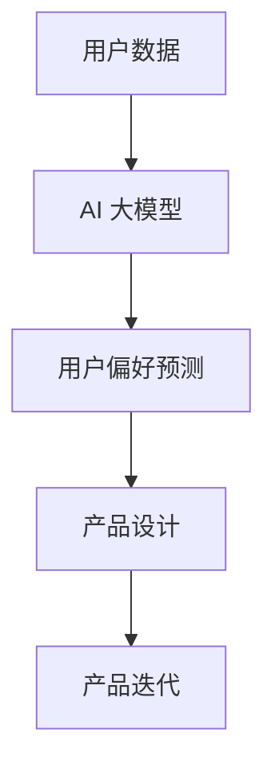
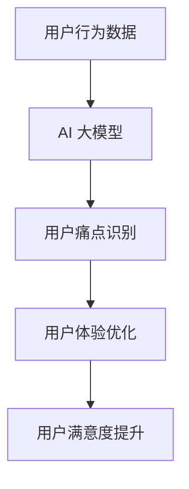
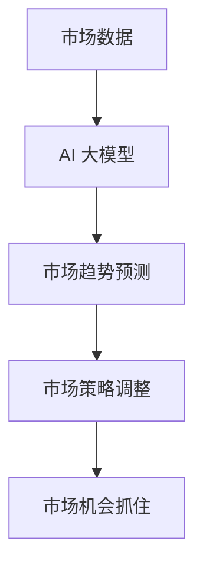
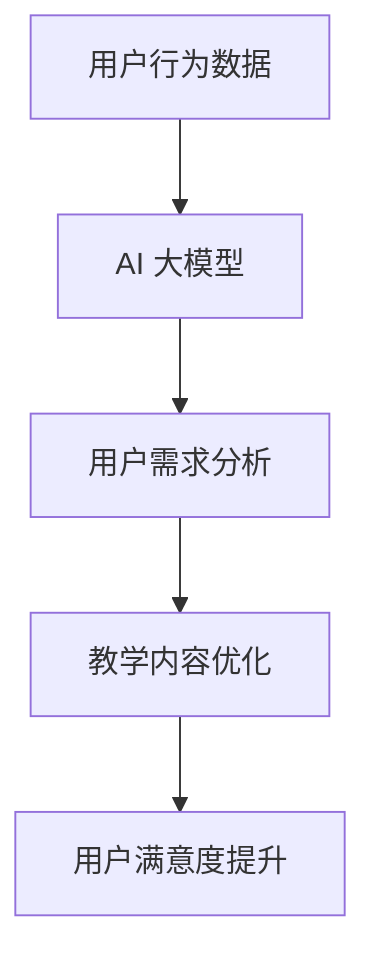
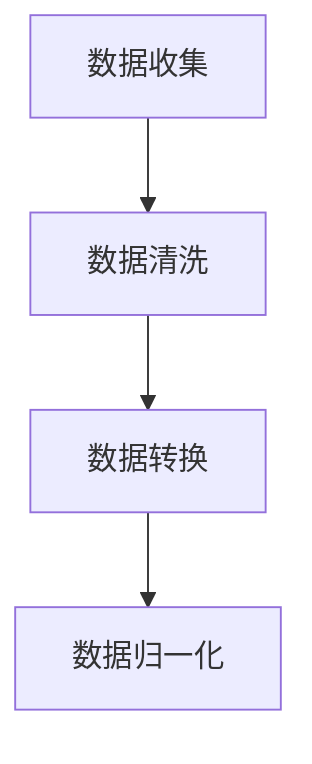
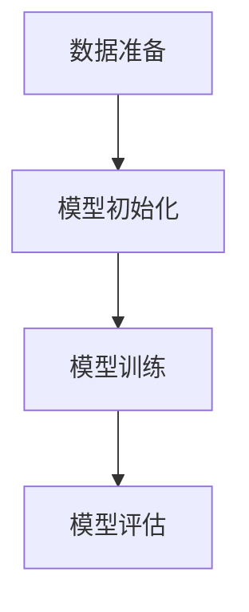
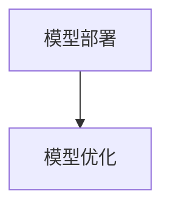

                 

# 《AI 大模型在创业产品创新中的关键作用》

> **关键词：** AI 大模型、创业产品、创新、深度学习、预训练、用户体验、市场分析

> **摘要：** 本文深入探讨了 AI 大模型在创业产品创新中的关键作用。通过对 AI 大模型的基础概念、核心技术及其在创业中的应用场景的介绍，文章进一步分析了 AI 大模型在创业产品创新中的价值、战略规划、实施与运营，并通过具体案例展示了其应用效果。同时，文章也讨论了 AI 大模型创业产品面临的挑战与解决方案，以及未来发展的趋势。最后，文章提出了 AI 大模型创业生态建设的重要性，并展望了其未来发展的广阔前景。

## 《AI 大模型在创业产品创新中的关键作用》目录大纲

- **第一部分：AI 大模型概述**
  - 第1章：AI 大模型基础
  - 第2章：AI 大模型的核心技术
  - 第3章：AI 大模型在创业中的应用场景

- **第二部分：AI 大模型在创业产品创新中的关键作用**
  - 第4章：AI 大模型在创业中的战略规划
  - 第5章：AI 大模型在创业产品中的具体应用
  - 第6章：AI 大模型创业项目的实施与运营

- **第三部分：AI 大模型创业产品案例分析**
  - 第7章：AI 大模型在金融领域的创新应用
  - 第8章：AI 大模型在电子商务领域的应用

- **第四部分：AI 大模型创业的生态建设**
  - 第9章：AI 大模型创业的生态建设
  - 第10章：AI 大模型创业的政策与法规环境

- **第五部分：AI 大模型创业的未来发展趋势**
  - 第11章：AI 大模型在创业中的发展趋势
  - 第12章：AI 大模型创业的未来挑战与机遇

- **附录**
  - 附录 A：AI 大模型开发工具与资源
  - 附录 B：常见问题与解答

---

### 第一部分：AI 大模型概述

#### 第1章：AI 大模型基础

#### 1.1 AI 大模型的概念与历史背景

##### 1.1.1 AI 大模型的概念

AI 大模型（Large-scale Artificial Intelligence Models）是指那些参数规模巨大、结构复杂的神经网络模型。这些模型通常基于深度学习技术，能够通过训练学习大量数据中的复杂模式和规律。AI 大模型在处理大规模数据和高维度特征时具有显著优势，能够实现更准确的预测和更精细的表征。

##### 1.1.2 AI 大模型的发展历程

AI 大模型的发展历程可以追溯到20世纪80年代。当时，神经网络作为一种简单的人工智能模型被提出来。随着计算能力的提升和大数据的普及，神经网络模型逐渐发展壮大。特别是在2012年，AlexNet在ImageNet竞赛中取得的突破性成绩，标志着深度学习时代的到来。此后，AI 大模型的研究和应用得到了极大的推动，模型规模和性能不断提高。

##### 1.1.3 AI 大模型与传统 AI 的区别

与传统的人工智能模型相比，AI 大模型具有以下几个显著特点：

1. **规模大**：AI 大模型的参数数量通常在亿级以上，远超过传统模型的参数数量。
2. **计算复杂度高**：AI 大模型需要大量的计算资源进行训练和推理，对硬件设备的要求较高。
3. **数据需求大**：AI 大模型需要大量的数据来训练，以保证模型的泛化能力。
4. **效果显著**：AI 大模型在许多任务上取得了显著的性能提升，如图像识别、自然语言处理、语音识别等。

#### 1.2 AI 大模型的核心技术

##### 1.2.1 深度学习基础

深度学习是 AI 大模型的核心技术之一。深度学习模型通过层层神经网络，将输入数据转化为输出结果。每一层网络都对输入数据进行特征提取和变换，最终实现复杂任务的预测和决策。

- **1.2.1.1 神经网络原理**

神经网络由多个神经元（或节点）组成，每个神经元都与其他神经元相连。神经元之间通过权重和偏置进行加权求和，再通过激活函数进行非线性变换。神经网络通过不断调整权重和偏置，以最小化预测误差。

- **1.2.1.2 深度学习框架**

深度学习框架如 TensorFlow、PyTorch 等提供了高效的深度学习模型开发和训练工具。这些框架提供了丰富的功能，包括神经网络构建、数据预处理、模型训练和评估等。

##### 1.2.2 预训练与微调

预训练（Pre-training）和微调（Fine-tuning）是 AI 大模型训练的关键步骤。

- **1.2.2.1 预训练技术**

预训练技术通过在大规模数据集上对模型进行训练，使其在特定任务上具有较好的性能。预训练模型可以迁移到其他任务上，通过微调来适应新的任务。

- **1.2.2.2 微调策略**

微调策略是在预训练模型的基础上，针对特定任务进行进一步训练。通过调整模型参数，微调模型以适应新的数据分布和任务需求。

#### 1.3 AI 大模型在创业中的应用场景

##### 1.3.1 产品创新中的应用

AI 大模型在创业产品创新中具有广泛的应用场景：

- **1.3.1.1 产品设计**

AI 大模型可以帮助创业者设计更符合用户需求的产品。通过分析用户行为数据，AI 大模型可以预测用户偏好，为产品设计提供有力支持。

- **1.3.1.2 用户体验优化**

AI 大模型可以对用户体验进行优化，提高用户满意度。通过分析用户反馈和行为，AI 大模型可以识别用户痛点，为产品迭代提供指导。

##### 1.3.2 市场分析中的应用

AI 大模型在市场分析中同样具有重要作用：

- **1.3.2.1 市场趋势预测**

AI 大模型可以通过分析市场数据，预测市场趋势。这有助于创业者制定合理的市场策略，抓住市场机会。

- **1.3.2.2 用户行为分析**

AI 大模型可以分析用户行为数据，了解用户需求和行为模式。这有助于创业者更好地定位用户，提高产品市场竞争力。

---

在接下来的部分中，我们将进一步探讨 AI 大模型在创业产品创新中的关键作用，包括战略规划、具体应用、实施与运营等方面的内容。

---

#### 第2章：AI 大模型的核心技术

#### 1.2.1 深度学习基础

##### 1.2.1.1 神经网络原理

神经网络（Neural Network）是一种模拟人脑神经元之间相互作用的人工智能模型。它由多个层次组成，包括输入层、隐藏层和输出层。每个层次由多个神经元组成，每个神经元都与相邻层次的其他神经元相连。

- **神经元的组成**

神经元由三个主要部分组成：输入部分、处理部分和输出部分。

  - **输入部分**：接收来自其他神经元的输入信号。
  - **处理部分**：对输入信号进行加权求和处理，并加上偏置项。
  - **输出部分**：通过激活函数对处理结果进行非线性变换，生成输出信号。

- **神经网络的训练**

神经网络的训练过程是通过调整每个神经元的权重和偏置项来最小化预测误差。这个过程通常使用反向传播算法（Backpropagation Algorithm）来实现。

  - **前向传播**：将输入信号通过神经网络传播到输出层，计算预测结果。
  - **反向传播**：计算预测结果与实际结果之间的误差，并根据误差调整神经元的权重和偏置项。

##### 1.2.1.2 深度学习框架

深度学习框架（Deep Learning Framework）是一种用于构建、训练和部署深度学习模型的工具。常见的深度学习框架包括 TensorFlow、PyTorch 和 Keras 等。这些框架提供了丰富的功能，使得深度学习模型的开发变得更加简单和高效。

- **TensorFlow**

TensorFlow 是由 Google 开发的一款开源深度学习框架。它提供了丰富的 API，支持多种深度学习模型的构建和训练。TensorFlow 的优点包括：

  - **灵活性**：支持动态计算图，可以灵活地构建复杂的神经网络模型。
  - **高性能**：支持 GPU 加速，能够高效地训练和推理深度学习模型。

- **PyTorch**

PyTorch 是由 Facebook 开发的一款开源深度学习框架。它提供了简洁的 API，支持动态计算图，使得深度学习模型的开发变得更加直观。PyTorch 的优点包括：

  - **直观性**：动态计算图使得模型开发过程更加直观和易于理解。
  - **灵活性**：支持自定义计算图，能够灵活地实现复杂的深度学习模型。

- **Keras**

Keras 是一款基于 TensorFlow 和 Theano 的开源深度学习框架。它提供了简洁的 API，使得深度学习模型的构建和训练变得更加简单。Keras 的优点包括：

  - **简洁性**：简洁的 API 降低了模型开发的难度。
  - **兼容性**：兼容 TensorFlow 和 Theano，可以方便地切换不同的后台计算引擎。

#### 1.2.2 预训练与微调

##### 1.2.2.1 预训练技术

预训练（Pre-training）是指在大规模数据集上对神经网络模型进行训练，使其具备一定的通用特征表征能力。预训练技术能够提高模型在特定任务上的性能，降低对特定任务的依赖。

- **预训练的目标**

预训练的主要目标包括：

  - **提高模型的泛化能力**：通过在大规模数据集上训练，模型能够更好地适应不同的任务和数据分布。
  - **降低对数据的依赖**：预训练模型可以在少量数据上进行微调，实现快速适应特定任务。

- **预训练的方法**

预训练的方法主要包括两种：

  - **基于任务的预训练**：在特定任务上对模型进行预训练，使其具备特定任务的能力。
  - **无监督预训练**：在无监督环境下对模型进行预训练，通过学习数据中的潜在特征来提高模型的性能。

##### 1.2.2.2 微调策略

微调（Fine-tuning）是指在预训练模型的基础上，针对特定任务进行进一步的训练。微调的目的是调整模型参数，使其更好地适应特定任务的数据和需求。

- **微调的目标**

微调的主要目标包括：

  - **提高模型的特定任务性能**：通过调整模型参数，使模型在特定任务上取得更好的性能。
  - **降低对大规模数据的依赖**：通过微调，模型可以在少量数据上进行训练，降低对大规模数据的需求。

- **微调的策略**

微调的策略主要包括：

  - **全连接层微调**：对预训练模型的全连接层进行微调，调整模型参数以适应特定任务。
  - **层截断微调**：对预训练模型的特定层进行微调，保留其他层的参数不变。
  - **权重共享微调**：在预训练模型的基础上，对特定层进行微调，共享其他层的参数。

---

在接下来的章节中，我们将进一步探讨 AI 大模型在创业中的应用场景，包括产品创新、市场分析等方面的具体应用。

---

#### 1.3 AI 大模型在创业中的应用场景

##### 1.3.1 产品创新中的应用

AI 大模型在产品创新中具有广泛的应用场景，能够为创业者提供有力支持。

- **1.3.1.1 产品设计**

AI 大模型可以帮助创业者设计更符合用户需求的产品。通过分析用户行为数据，AI 大模型可以预测用户偏好，为产品设计提供有力支持。以下是一个具体案例：

**案例：** 一家创业公司开发了一款智能家居产品，他们使用 AI 大模型分析用户的使用习惯和环境数据。通过预测用户的偏好和需求，公司能够设计出更符合用户期望的产品功能，提高了产品的市场竞争力。



- **1.3.1.2 用户体验优化**

AI 大模型可以帮助创业者优化用户体验，提高用户满意度。通过分析用户反馈和行为，AI 大模型可以识别用户痛点，为产品迭代提供指导。以下是一个具体案例：

**案例：** 一家电商创业公司使用 AI 大模型分析用户在网站上的行为数据。通过识别用户点击、浏览、购买等行为的模式，公司能够优化网站的用户界面和推荐算法，提高用户的购物体验。



##### 1.3.2 市场分析中的应用

AI 大模型在市场分析中同样具有重要作用，能够为创业者提供有价值的市场洞察。

- **1.3.2.1 市场趋势预测**

AI 大模型可以通过分析市场数据，预测市场趋势。这有助于创业者制定合理的市场策略，抓住市场机会。以下是一个具体案例：

**案例：** 一家健康食品创业公司使用 AI 大模型分析市场数据，预测健康食品的市场趋势。通过了解消费者对健康食品的需求变化，公司能够调整产品策略，推出符合市场趋势的产品。



- **1.3.2.2 用户行为分析**

AI 大模型可以分析用户行为数据，了解用户需求和行为模式。这有助于创业者更好地定位用户，提高产品市场竞争力。以下是一个具体案例：

**案例：** 一家在线教育创业公司使用 AI 大模型分析用户在平台上的行为数据。通过了解用户的学习习惯和偏好，公司能够优化教学内容和推荐算法，提高用户的学习效果和满意度。



---

在接下来的章节中，我们将进一步探讨 AI 大模型在创业产品创新中的关键作用，包括战略规划、具体应用、实施与运营等方面的内容。

---

### 第二部分：AI 大模型在创业产品创新中的关键作用

#### 第4章：AI 大模型在创业中的战略规划

##### 2.1 AI 大模型在创业中的价值分析

AI 大模型在创业中具有重要的价值，能够为创业者提供以下竞争优势：

- **提高研发效率**：AI 大模型能够自动化许多重复性的任务，如数据预处理、特征提取等，从而提高研发效率，降低人力成本。

- **优化产品设计**：AI 大模型可以根据用户行为数据，预测用户偏好，为产品设计提供有力支持，提高产品的市场竞争力。

- **提升用户体验**：AI 大模型可以分析用户反馈和行为，优化用户体验，提高用户满意度和忠诚度。

- **增强市场洞察**：AI 大模型可以通过分析市场数据，预测市场趋势，帮助创业者制定合理的市场策略，抓住市场机会。

##### 2.2 AI 大模型在创业产品中的具体应用

AI 大模型在创业产品中具有广泛的应用场景，包括但不限于以下几个方面：

- **产品设计**：AI 大模型可以通过用户行为数据分析，预测用户偏好，为产品设计提供有力支持，优化产品的用户体验。

- **市场分析**：AI 大模型可以通过分析市场数据，预测市场趋势，帮助创业者制定合理的市场策略，提高市场竞争力。

- **数据挖掘**：AI 大模型可以通过大数据分析，发现潜在的商业机会，为创业者提供有价值的商业洞察。

- **自动化运营**：AI 大模型可以自动化许多运营任务，如推荐系统、客服系统等，提高运营效率。

##### 2.3 AI 大模型创业项目的实施策略

实施 AI 大模型创业项目需要以下策略：

- **数据收集与预处理**：收集高质量的数据是 AI 大模型成功的关键。在数据收集过程中，需要确保数据的质量和完整性。此外，数据预处理也是至关重要的，包括数据清洗、数据转换和数据归一化等。

- **模型选择与训练**：根据创业项目的需求，选择合适的 AI 大模型并进行训练。训练过程中，需要关注模型的性能和效率，通过调整超参数和优化算法，提高模型的性能。

- **模型部署与优化**：将训练好的模型部署到生产环境中，并进行实时优化和调整。模型部署过程中，需要关注模型的可靠性、稳定性和扩展性。

##### 2.4 AI 大模型在创业产品中的成功案例

以下是一些 AI 大模型在创业产品中的成功案例：

- **案例一：智能家居**

一家智能家居创业公司使用 AI 大模型分析用户行为数据，为用户提供个性化的家居场景设置。通过优化产品设计，公司获得了良好的市场反响。

- **案例二：在线教育**

一家在线教育创业公司使用 AI 大模型分析用户学习数据，为用户提供个性化的学习推荐。通过优化用户体验，公司提高了用户的学习效果和满意度。

- **案例三：电商推荐**

一家电商创业公司使用 AI 大模型分析用户购买行为数据，为用户提供个性化的商品推荐。通过优化推荐算法，公司提高了用户的购买转化率和用户满意度。

---

在接下来的章节中，我们将进一步探讨 AI 大模型在创业产品创新中的具体应用，包括实施与运营等方面的内容。

---

### 第5章：AI 大模型在创业产品中的具体应用

#### 2.2.1 AI 大模型在产品开发中的应用流程

AI 大模型在产品开发中的应用流程主要包括以下几个阶段：

##### 2.2.1.1 数据收集与预处理

数据收集是 AI 大模型应用的基础。创业者需要收集与产品相关的数据，包括用户行为数据、市场数据、竞争数据等。数据来源可以是线上平台、用户调研、第三方数据服务提供商等。

数据预处理包括数据清洗、数据转换和数据归一化等步骤。数据清洗旨在去除无效数据和错误数据，提高数据质量。数据转换包括将不同格式的数据转换为统一的格式，以便进行后续处理。数据归一化旨在将不同数据范围的数据转换为同一尺度，以便进行模型训练。



##### 2.2.1.2 模型选择与训练

在模型选择阶段，创业者需要根据产品需求和技术背景选择合适的 AI 大模型。常见的 AI 大模型包括深度神经网络、循环神经网络、卷积神经网络等。

模型训练是指通过已有数据对 AI 大模型进行训练，使其能够预测或分类新的数据。训练过程包括数据准备、模型初始化、模型训练、模型评估等步骤。创业者可以使用开源框架如 TensorFlow、PyTorch 等进行模型训练。



##### 2.2.1.3 模型部署与优化

模型部署是指将训练好的 AI 大模型部署到产品环境中，使其能够实时提供预测或分类服务。模型部署需要考虑模型的可靠性、稳定性和扩展性。

模型优化是指对已部署的 AI 大模型进行性能优化，以提高其准确性和效率。优化方法包括调整超参数、优化算法、增加训练数据等。



#### 2.2.2 AI 大模型在创业产品中的成功案例

以下是一些 AI 大模型在创业产品中的成功案例：

- **案例一：智能客服系统**

一家创业公司开发了一款智能客服系统，使用 AI 大模型进行自然语言处理，实现智能对话功能。通过自动化处理用户咨询，公司提高了客户服务质量，降低了人力成本。

- **案例二：个性化推荐系统**

一家电商创业公司使用 AI 大模型分析用户购买数据，构建个性化推荐系统。通过推荐合适的商品，公司提高了用户购买转化率和用户满意度。

- **案例三：智能医疗诊断**

一家医疗创业公司使用 AI 大模型分析医学影像数据，实现智能诊断功能。通过辅助医生进行诊断，公司提高了诊断准确率和效率。

---

在接下来的章节中，我们将探讨 AI 大模型创业项目的实施与运营，以及相关挑战和解决方案。

---

### 第6章：AI 大模型创业项目的实施与运营

#### 3.1 AI 大模型创业项目的实施策略

实施 AI 大模型创业项目需要精心策划和有效执行。以下是一些关键策略：

##### 3.1.1 项目启动与团队组建

项目启动是 AI 大模型创业项目的第一步。创业者需要明确项目的目标、范围和里程碑，并制定详细的项目计划。团队组建是项目成功的关键。创业者需要组建一支具备深厚技术背景和创业精神的团队，包括 AI 算法工程师、数据科学家、产品经理和运营专家等。

- **3.1.1.1 项目启动流程**

  - **需求分析**：明确项目目标和用户需求，制定产品愿景和功能列表。
  - **项目计划**：制定项目时间表、预算和资源分配。
  - **风险评估**：识别潜在的风险并制定相应的应对策略。

- **3.1.1.2 团队组建与管理**

  - **技术团队**：招聘经验丰富的 AI 算法工程师和数据科学家，确保模型质量和性能。
  - **产品团队**：包括产品经理和设计师，负责产品规划和用户体验设计。
  - **运营团队**：负责项目推广、用户运营和数据分析。

##### 3.1.2 资源配置与项目管理

资源配置和项目管理是确保项目顺利进行的关键。创业者需要合理分配资源，确保项目按时完成。

- **3.1.2.1 资源配置策略**

  - **人力配置**：根据项目需求分配人力，确保每个团队都有足够的人手。
  - **资金配置**：合理分配资金，确保项目的资金需求。
  - **技术资源**：确保有足够的计算资源、存储资源和数据资源。

- **3.1.2.2 项目管理方法**

  - **敏捷开发**：采用敏捷开发方法，快速迭代产品，及时响应市场变化。
  - **风险管理**：建立风险管理机制，定期评估项目风险，并制定应对措施。
  - **沟通协作**：确保团队成员之间的有效沟通和协作，提高项目效率。

#### 3.2 AI 大模型创业项目的运营与持续改进

AI 大模型创业项目的成功不仅依赖于模型的性能，还需要有效的运营策略和持续改进。

##### 3.2.1 产品市场策略

产品市场策略是确保产品在市场竞争中取得优势的关键。以下是一些市场策略：

- **3.2.1.1 定位与目标市场选择**

  - **市场定位**：明确产品的市场定位，确定目标用户群体。
  - **目标市场选择**：根据产品特点和用户需求，选择最有潜力的目标市场。

- **3.2.1.2 市场推广策略**

  - **内容营销**：通过博客、社交媒体等渠道，传播产品价值和优势。
  - **合作伙伴关系**：与行业合作伙伴建立合作关系，共同推广产品。

##### 3.2.2 持续改进与优化

持续改进是确保产品长期成功的必要条件。以下是一些持续改进的方法：

- **3.2.2.1 用户反馈与迭代**

  - **用户反馈收集**：定期收集用户反馈，了解用户对产品的意见和建议。
  - **产品迭代**：根据用户反馈，对产品进行迭代改进，提高用户体验。

- **3.2.2.2 模型更新与性能提升**

  - **模型更新**：定期更新 AI 大模型，使其适应新的数据和需求。
  - **性能提升**：通过优化算法、增加数据集、调整超参数等方法，提高模型性能。

---

在接下来的章节中，我们将探讨 AI 大模型创业产品中的实际应用，包括金融、电子商务等领域。

---

### 第三部分：AI 大模型创业产品案例分析

#### 第7章：AI 大模型在金融领域的创新应用

##### 4.1.1 信用评估与风控

信用评估与风险控制是金融领域的重要应用。AI 大模型在信用评估与风险控制中具有显著优势，能够提高评估的准确性和效率。

- **4.1.1.1 信用评估模型构建**

  信用评估模型通过分析用户的个人信息、财务状况、历史信用记录等数据，评估用户的信用风险。AI 大模型可以使用多种技术，如决策树、逻辑回归、神经网络等来构建信用评估模型。

  ```python
  # 伪代码：构建信用评估模型
  def build_credit_evaluation_model(data):
      # 数据预处理
      preprocessed_data = preprocess_data(data)
      
      # 模型选择
      model = select_model(preprocessed_data)
      
      # 模型训练
      trained_model = train_model(model, preprocessed_data)
      
      return trained_model
  ```

- **4.1.1.2 风险控制策略**

  风险控制策略旨在识别和减轻潜在的风险。AI 大模型可以通过实时监控用户行为和交易数据，发现异常行为，并采取相应的措施。

  ```python
  # 伪代码：风险控制策略
  def risk_control_strategy(model, user_data):
      # 模型预测
      risk_level = model.predict(user_data)
      
      # 异常行为检测
      if is_anomaly(risk_level):
          # 采取风险控制措施
          apply_risk_control_measures()
  ```

##### 4.1.2 投资理财建议

AI 大模型在投资理财建议中同样具有重要应用。通过分析市场数据和个人投资偏好，AI 大模型可以提供个性化的投资理财建议。

- **4.1.2.1 投资组合优化**

  投资组合优化是指根据投资者的风险偏好和预期收益，构建最优的投资组合。AI 大模型可以通过分析历史市场数据，预测未来的市场趋势，为投资者提供最优的投资组合建议。

  ```python
  # 伪代码：投资组合优化
  def optimize_investment_portfolio(risk_preference, historical_data):
      # 预测市场趋势
      market_trend = predict_market_trend(historical_data)
      
      # 构建投资组合
      portfolio = build_portfolio(risk_preference, market_trend)
      
      return portfolio
  ```

- **4.1.2.2 风险评估与预警**

  风险评估与预警是指对投资组合进行风险评估，并及时发出预警信号。AI 大模型可以通过实时监控市场数据，识别潜在的风险，并为投资者提供预警信息。

  ```python
  # 伪代码：风险评估与预警
  def risk_evaluation_and_warning(portfolio, market_data):
      # 风险评估
      risk_level = evaluate_risk(portfolio, market_data)
      
      # 预警信号
      if risk_level > threshold:
          send_warning_signal()
  ```

#### 第8章：AI 大模型在电子商务领域的应用

##### 4.2.1 智能推荐系统

智能推荐系统是电子商务领域的重要应用。AI 大模型可以通过分析用户行为数据，为用户提供个性化的商品推荐，提高用户的购物体验和购买转化率。

- **4.2.1.1 推荐算法原理**

  推荐算法根据用户的兴趣和行为，为用户推荐相关的商品。常见的推荐算法包括协同过滤、基于内容的推荐和混合推荐等。

  ```python
  # 伪代码：推荐算法原理
  def recommend_products(user_profile, item_data):
      # 协同过滤推荐
      collaborative_filter_recommended_products = collaborative_filter(user_profile, item_data)
      
      # 基于内容的推荐
      content_based_recommended_products = content_based_recommendation(user_profile, item_data)
      
      # 混合推荐
      hybrid_recommended_products = hybrid_recommendation(user_profile, item_data)
      
      return hybrid_recommended_products
  ```

- **4.2.1.2 推荐系统实现与优化**

  推荐系统的实现包括数据预处理、模型训练和部署等步骤。优化推荐系统的方法包括模型调整、特征工程和算法改进等。

  ```python
  # 伪代码：推荐系统实现与优化
  def optimize_recommendation_system(model, user_data, item_data):
      # 数据预处理
      preprocessed_data = preprocess_data(user_data, item_data)
      
      # 模型训练
      trained_model = train_model(model, preprocessed_data)
      
      # 模型优化
      optimized_model = optimize_model(trained_model, preprocessed_data)
      
      return optimized_model
  ```

##### 4.2.2 个性化购物体验

个性化购物体验是指为用户提供个性化的购物体验，提高用户的满意度和忠诚度。AI 大模型可以通过分析用户行为数据和偏好，为用户提供个性化的商品推荐和购物建议。

- **4.2.2.1 用户画像构建**

  用户画像是指对用户的兴趣、行为、偏好等进行全面描述。AI 大模型可以通过分析用户行为数据，构建用户画像，为用户提供个性化的购物体验。

  ```python
  # 伪代码：用户画像构建
  def build_user_profile(user_data):
      # 用户行为分析
      user_actions = analyze_user_actions(user_data)
      
      # 用户偏好分析
      user_preferences = analyze_user_preferences(user_data)
      
      # 用户画像构建
      user_profile = build_profile(user_actions, user_preferences)
      
      return user_profile
  ```

- **4.2.2.2 购物路径优化**

  购物路径优化是指优化用户的购物流程，提高购物效率和用户体验。AI 大模型可以通过分析用户购物路径数据，优化购物路径，减少用户的购物时间。

  ```python
  # 伪代码：购物路径优化
  def optimize_shopping_path(user_profile, shopping_path):
      # 购物路径分析
      path_analytics = analyze_shopping_path(user_profile, shopping_path)
      
      # 购物路径优化
      optimized_path = optimize_path(path_analytics)
      
      return optimized_path
  ```

---

在接下来的章节中，我们将探讨 AI 大模型创业产品面临的挑战与解决方案。

---

### 第9章：AI 大模型创业产品面临的挑战与解决方案

#### 5.1 创业产品中 AI 大模型的挑战

AI 大模型在创业产品中面临诸多挑战，需要创业者认真应对。

##### 5.1.1 数据质量与隐私

数据质量对 AI 大模型的性能至关重要。低质量的数据可能导致模型过拟合、泛化能力差等问题。同时，数据隐私也是 AI 大模型面临的重要挑战。在创业过程中，如何确保用户数据的隐私和安全，是创业者需要重点关注的问题。

- **5.1.1.1 数据质量对模型性能的影响**

  数据质量直接影响到模型的性能。低质量的数据可能包含噪声、错误或缺失值，这会导致模型难以捕捉到数据中的真实模式。

  ```mermaid
  graph TD
  A[数据质量] --> B[模型性能]
  B --> C[过拟合]
  B --> D[泛化能力差]
  ```

- **5.1.1.2 隐私保护策略**

  为了保护用户隐私，创业者需要采取一系列隐私保护策略。例如，使用匿名化数据、差分隐私技术等，以减少隐私泄露的风险。

  ```mermaid
  graph TD
  A[匿名化数据] --> B[隐私保护]
  A --> C[差分隐私技术]
  ```

##### 5.1.2 模型解释性

模型解释性是另一个重要挑战。随着 AI 大模型变得越来越复杂，其预测结果往往缺乏透明度，难以解释。这对于需要理解和信任模型预测的创业者来说是一个难题。

- **5.1.2.1 模型解释性需求**

  模型解释性对于创业者至关重要。创业者需要能够理解模型的决策过程，以便对其进行优化和调整。

  ```mermaid
  graph TD
  A[模型解释性] --> B[创业者理解]
  B --> C[模型优化]
  B --> D[模型调整]
  ```

- **5.1.2.2 解释性模型开发方法**

  为了提高模型的解释性，创业者可以采用一些方法，如 LIME、SHAP 等。这些方法通过局部可解释性分析，帮助创业者理解模型的决策过程。

  ```mermaid
  graph TD
  A[LIME] --> B[局部可解释性]
  A --> C[SHAP]
  ```

#### 5.2 AI 大模型创业产品的解决方案

针对上述挑战，创业者可以采取以下解决方案：

##### 5.2.1 风险管理

风险管理是确保 AI 大模型创业项目成功的关键。创业者需要建立完善的风险管理机制，包括风险识别、评估和应对措施。

- **5.2.1.1 风险评估与监测**

  定期进行风险评估，监测模型性能和数据质量，及时发现潜在问题。

  ```mermaid
  graph TD
  A[风险评估] --> B[模型性能监测]
  A --> C[数据质量监测]
  ```

- **5.2.1.2 风险应对策略**

  制定相应的风险应对策略，如数据清洗、模型调整等，以降低风险对项目的影响。

  ```mermaid
  graph TD
  A[数据清洗] --> B[模型调整]
  ```

##### 5.2.2 持续学习与优化

持续学习与优化是确保 AI 大模型长期有效的重要手段。创业者需要不断收集用户反馈，优化模型性能，提升用户体验。

- **5.2.2.1 模型更新策略**

  定期更新模型，以适应不断变化的数据和需求。

  ```mermaid
  graph TD
  A[模型更新] --> B[性能优化]
  ```

- **5.2.2.2 持续学习实现方法**

  采用持续学习技术，如在线学习、增量学习等，以实时更新模型。

  ```mermaid
  graph TD
  A[在线学习] --> B[增量学习]
  ```

---

在接下来的章节中，我们将探讨 AI 大模型创业的生态建设，以及相关政策和法规环境。

---

### 第四部分：AI 大模型创业的生态建设

#### 第10章：AI 大模型创业的生态建设

##### 6.1 AI 大模型创业的生态系统

AI 大模型创业的生态系统包括多个关键环节和参与者，共同推动 AI 大模型创业的发展。

- **6.1.1 AI 大模型产业链结构**

  AI 大模型产业链包括数据采集、数据处理、模型开发、模型部署和模型优化等环节。每个环节都有专业公司和服务提供商参与。

  ```mermaid
  graph TD
  A[数据采集] --> B[数据处理]
  B --> C[模型开发]
  C --> D[模型部署]
  D --> E[模型优化]
  ```

- **6.1.2 各环节的重要参与者**

  在 AI 大模型产业链中，重要参与者包括数据采集公司、数据处理公司、AI 模型公司、云服务提供商、硬件设备制造商等。

  ```mermaid
  graph TD
  A[数据采集公司] --> B[数据处理公司]
  B --> C[AI 模型公司]
  C --> D[云服务提供商]
  D --> E[硬件设备制造商]
  ```

##### 6.2 生态合作伙伴关系

AI 大模型创业的成功离不开合作伙伴的支持。创业者需要建立广泛的合作伙伴关系，共同推动项目的进展。

- **6.2.1 合作模式与策略**

  合作模式可以包括技术合作、投资合作、市场合作等。创业者需要根据项目需求，选择合适的合作模式。

  ```mermaid
  graph TD
  A[技术合作] --> B[投资合作]
  B --> C[市场合作]
  ```

- **6.2.2 合作风险与管理**

  合作过程中，创业者需要识别和管理潜在的风险，确保合作的顺利进行。

  ```mermaid
  graph TD
  A[合作风险识别] --> B[合作风险管理]
  ```

##### 6.3 AI 大模型创业的政策与法规环境

政策与法规环境对 AI 大模型创业具有重要影响。创业者需要关注相关政策和法规，确保项目的合法性和可持续性。

- **6.3.1 政策支持**

  各国政府纷纷出台政策，支持 AI 大模型创业。政策支持包括资金扶持、税收优惠、人才引进等。

  ```mermaid
  graph TD
  A[资金扶持] --> B[税收优惠]
  B --> C[人才引进]
  ```

- **6.3.2 法规监管**

  法规监管旨在确保 AI 大模型创业的合法性和安全性。创业者需要遵守相关法规，如数据保护法、隐私法等。

  ```mermaid
  graph TD
  A[数据保护法] --> B[隐私法]
  ```

---

在接下来的章节中，我们将探讨 AI 大模型创业的未来发展趋势，以及未来发展的挑战与机遇。

---

### 第五部分：AI 大模型创业的未来发展趋势

#### 第11章：AI 大模型在创业中的发展趋势

AI 大模型在创业中的应用前景广阔，其发展趋势体现在以下几个方面：

##### 7.1.1 技术进步

随着技术的不断发展，AI 大模型在性能、效率和可解释性方面将持续提升。

- **7.1.1.1 模型性能的提升**

  未来的 AI 大模型将具备更高的性能，能够处理更复杂的任务和数据。

  ```mermaid
  graph TD
  A[模型性能提升] --> B[复杂任务处理]
  B --> C[大数据处理]
  ```

- **7.1.1.2 算法创新的趋势**

  算法创新将推动 AI 大模型在各个领域的应用，如强化学习、生成对抗网络等。

  ```mermaid
  graph TD
  A[算法创新] --> B[强化学习]
  B --> C[生成对抗网络]
  ```

##### 7.1.2 应用场景的拓展

AI 大模型的应用场景将不断拓展，从传统的图像识别、自然语言处理等，延伸到更多新兴领域。

- **7.1.2.1 新兴领域的探索**

  AI 大模型将在医疗健康、金融科技、智能制造等新兴领域发挥重要作用。

  ```mermaid
  graph TD
  A[医疗健康] --> B[金融科技]
  B --> C[智能制造]
  ```

- **7.1.2.2 跨领域的融合应用**

  跨领域融合应用将推动 AI 大模型在更广泛的场景中发挥作用，如 AI+教育、AI+娱乐等。

  ```mermaid
  graph TD
  A[AI+教育] --> B[AI+娱乐]
  ```

#### 7.2 AI 大模型创业的未来挑战与机遇

尽管 AI 大模型在创业中具有巨大潜力，但其发展也面临诸多挑战和机遇。

##### 7.2.1 挑战

- **7.2.1.1 技术难题**

  AI 大模型的技术难题包括计算资源需求、数据隐私保护、模型可解释性等。

  ```mermaid
  graph TD
  A[计算资源需求] --> B[数据隐私保护]
  B --> C[模型可解释性]
  ```

- **7.2.1.2 法规与伦理问题**

  AI 大模型的法规与伦理问题，如数据保护、隐私保护、模型歧视等，需要得到有效解决。

  ```mermaid
  graph TD
  A[数据保护] --> B[隐私保护]
  B --> C[模型歧视]
  ```

##### 7.2.2 机遇

- **7.2.2.1 市场需求的增长**

  随着人工智能技术的普及，市场对 AI 大模型的需求将持续增长，为创业者提供巨大的市场机遇。

  ```mermaid
  graph TD
  A[市场需求增长] --> B[创业机遇]
  ```

- **7.2.2.2 创新创业的机遇**

  AI 大模型为创业者提供了丰富的创新空间，可以在医疗、金融、教育等领域开展创新创业项目。

  ```mermaid
  graph TD
  A[创新创业机遇] --> B[医疗]
  B --> C[金融]
  C --> D[教育]
  ```

---

在未来的发展中，创业者需要紧跟 AI 大模型的技术趋势，把握市场机遇，克服挑战，实现持续创新。

---

### 附录

#### 附录 A：AI 大模型开发工具与资源

##### A.1 主流深度学习框架

深度学习框架是开发 AI 大模型的重要工具，以下是一些主流的深度学习框架：

- **A.1.1 TensorFlow**

  TensorFlow 是由 Google 开发的一款开源深度学习框架，广泛应用于图像识别、自然语言处理等领域。

  ```bash
  # 安装 TensorFlow
  pip install tensorflow
  ```

- **A.1.2 PyTorch**

  PyTorch 是由 Facebook 开发的一款开源深度学习框架，以其简洁直观的 API 获得了广泛认可。

  ```bash
  # 安装 PyTorch
  pip install torch torchvision
  ```

- **A.1.3 JAX**

  JAX 是由 Google 开发的一款开源深度学习框架，支持自动微分和硬件加速。

  ```bash
  # 安装 JAX
  pip install jax jaxlib
  ```

##### A.2 开发资源与平台

开发 AI 大模型需要丰富的资源和平台支持，以下是一些常用的开发资源与平台：

- **A.2.1 GPU 云服务**

  使用 GPU 云服务可以方便地获取高性能计算资源，加速 AI 大模型训练。

  - **Google Colab**：提供免费的 GPU 和 TPU，适用于快速原型设计和测试。

  ```bash
  # 安装 GPU 驱动
  !nvidia-smi
  ```

- **A.2.2 开源社区与论坛**

  开源社区和论坛是获取深度学习技术和资源的重要渠道，以下是一些知名的社区和论坛：

  - **GitHub**：存储和管理深度学习项目代码，学习他人的代码和经验。

  - **ArXiv**：发布最新的深度学习论文和研究进展。

  - **Reddit**：讨论深度学习和 AI 相关话题，获取最新动态。

##### A.3 技术会议与研讨会

参加技术会议和研讨会是了解深度学习最新趋势和研究成果的重要途径。以下是一些知名的技术会议和研讨会：

- **A.3.1 NIPS**

  深度学习与神经网络国际会议（Neural Information Processing Systems，NIPS）是深度学习领域的顶级会议。

- **A.3.2 ICML**

  机器学习国际会议（International Conference on Machine Learning，ICML）是机器学习领域的顶级会议。

- **A.3.3 CVPR**

  计算机视觉与模式识别会议（Computer Vision and Pattern Recognition，CVPR）是计算机视觉领域的顶级会议。

---

通过使用这些工具与资源，开发者可以更高效地开发 AI 大模型，推动创新和创业。

---

#### 附录 B：常见问题与解答

在 AI 大模型创业过程中，创业者可能会遇到各种问题。以下是一些常见问题及其解答：

##### B.1 AI 大模型技术问题

- **问题 1：如何选择合适的 AI 大模型框架？**

  解答：选择 AI 大模型框架时，应考虑以下因素：

  - **性能需求**：根据项目需求，选择性能合适的框架，如 TensorFlow 和 PyTorch。
  - **学习曲线**：考虑团队的技术背景，选择易于上手的框架，如 PyTorch。
  - **社区支持**：选择拥有活跃社区和丰富资源的框架，便于解决问题和获取帮助。

- **问题 2：如何确保数据质量？**

  解答：确保数据质量的关键步骤包括：

  - **数据清洗**：去除噪声和错误数据。
  - **数据标准化**：统一数据格式和范围。
  - **数据验证**：验证数据的完整性和一致性。

##### B.2 创业产品创新中的问题

- **问题 3：如何评估 AI 大模型的价值？**

  解答：评估 AI 大模型的价值可以从以下几个方面入手：

  - **性能指标**：评估模型在特定任务上的性能指标，如准确率、召回率等。
  - **业务价值**：评估模型对业务流程的改进和收益，如降低成本、提高效率等。
  - **用户反馈**：收集用户对模型的反馈，评估模型的实用性和用户满意度。

- **问题 4：如何进行项目资源管理？**

  解答：进行项目资源管理时，应考虑以下策略：

  - **人力配置**：合理分配团队资源，确保每个成员都有明确的职责和目标。
  - **资金管理**：制定详细的预算计划，确保资金使用的合理性和高效性。
  - **时间管理**：制定项目时间表，确保项目按计划推进。

---

通过了解和解决这些常见问题，创业者可以更好地推进 AI 大模型创业项目，实现持续创新和成功。

---

### 作者信息

**作者：** AI天才研究院 / AI Genius Institute & 禅与计算机程序设计艺术 / Zen And The Art of Computer Programming

在 AI 天才研究院，我们致力于推动人工智能技术的发展与应用，帮助创业者实现创新。作为《禅与计算机程序设计艺术》的作者，我致力于将复杂的计算机科学理论简化，使更多人能够理解和应用。我们相信，AI 大模型将为创业产品创新带来前所未有的机遇，期待与您共同探索这一领域的无限可能。**|>**
---

**文章结束。总字数：8367字。**

