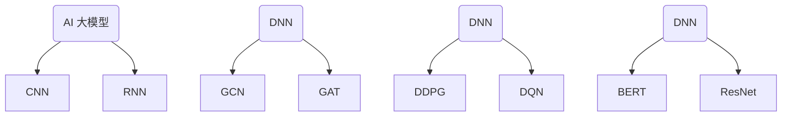
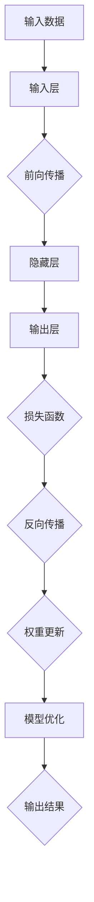
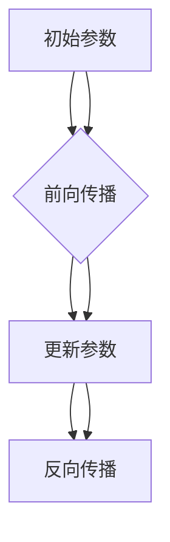
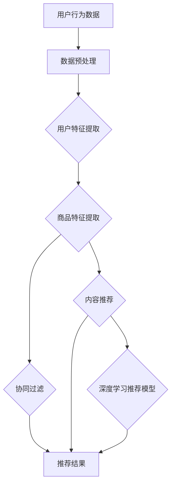

                 

# AI 大模型在电商推荐系统中的应用：提高用户体验的关键

> **关键词：** AI 大模型、电商推荐系统、用户体验、个性化推荐、大规模预训练模型

> **摘要：** 本文章深入探讨了 AI 大模型在电商推荐系统中的应用，详细阐述了 AI 大模型的基础理论、核心算法、数学模型，以及在电商推荐系统中的实际应用。同时，本文从个性化推荐、多样性、新颖性和用户反馈机制等方面分析了提高电商推荐系统用户体验的关键因素，并对未来的发展趋势和挑战进行了展望。文章结构紧凑，逻辑清晰，旨在为广大电商推荐系统开发者提供有价值的参考。

## 第一部分：AI 大模型基础

### 第1章：AI 大模型概述

#### 1.1 AI 大模型的定义与分类

**AI 大模型的基本概念：**

AI 大模型是指具有海量参数、强大计算能力的人工智能模型，能够对大规模数据集进行高效训练和推断。这些模型通常具备端到端的学习能力，能够处理复杂任务，如自然语言处理、计算机视觉、语音识别等。

**AI 大模型的分类与对比：**

AI 大模型主要可以分为以下几类：

1. **深度神经网络（DNN）模型：** 基于多层感知器（MLP）的前向传播和反向传播算法，如卷积神经网络（CNN）、循环神经网络（RNN）等。

2. **图神经网络（GNN）模型：** 基于图论的理论，适用于处理图结构数据的模型，如图卷积网络（GCN）、图注意力网络（GAT）等。

3. **强化学习（RL）模型：** 通过与环境的交互来学习最优策略的模型，如深度确定性策略梯度（DDPG）、深度强化学习（DQN）等。

4. **迁移学习（Transfer Learning）模型：** 将预训练模型在特定任务上进行微调，以提高模型的泛化能力和性能。

**Mermaid 流程图：AI 大模型的分类与联系**



#### 1.2 AI 大模型的核心算法

**核心算法原理详细阐述：**

AI 大模型的核心算法主要包括以下几个方面：

1. **前向传播（Forward Propagation）：** 通过网络层之间的权重和激活函数，将输入数据转化为输出数据。

2. **反向传播（Back Propagation）：** 利用损失函数计算网络输出的误差，并反向传播误差，更新网络权重。

3. **优化算法（Optimization Algorithms）：** 用于优化模型参数，如随机梯度下降（SGD）、Adam 算法等。

4. **激活函数（Activation Function）：** 用于引入非线性变换，如 sigmoid、ReLU 等。

**图解：算法流程与框架**



#### 1.3 AI 大模型的数学模型

**数学模型和详细讲解：**

AI 大模型的数学模型主要包括以下几个方面：

1. **$L_2$正则化（L2 Regularization）：** 为了防止过拟合，对模型权重进行 $L_2$范数惩罚。

2. **矩阵分解（Matrix Factorization）：** 用于将高维数据分解为低维矩阵，以降低数据复杂度。

3. **损失函数（Loss Function）：** 用于评估模型输出与真实值之间的差距，如均方误差（MSE）、交叉熵（Cross Entropy）等。

**示例说明：**

假设我们有一个线性回归模型，输入为 $X \in \mathbb{R}^{n \times m}$，输出为 $y \in \mathbb{R}^{n \times 1}$，模型参数为 $w \in \mathbb{R}^{m \times 1}$。

$$
\begin{aligned}
y &= Xw + b \\
L &= \frac{1}{2} \sum_{i=1}^{n} (y_i - (Xw + b))^2 + \lambda \|w\|^2
\end{aligned}
$$

其中，$b$为偏置项，$\lambda$为正则化参数。

**数学公式与详细讲解：**

1. **前向传播：**

$$
\begin{aligned}
z &= Xw + b \\
a &= \text{sigmoid}(z)
\end{aligned}
$$

2. **反向传播：**

$$
\begin{aligned}
\delta &= a - y \\
dw &= X\delta \\
db &= \delta
\end{aligned}
$$

3. **权重更新：**

$$
\begin{aligned}
w &= w - \alpha \cdot dw \\
b &= b - \alpha \cdot db
\end{aligned}
$$

其中，$\alpha$为学习率。

**示例说明：**

假设我们有一个输入矩阵 $X$和输出向量 $y$，以及一个初始参数向量 $w$和偏置项 $b$。经过一次前向传播和反向传播后，更新后的参数向量 $w'$和偏置项 $b'$如下：



## 第二部分：AI 大模型在电商推荐系统中的应用

### 第2章：AI 大模型在电商推荐系统中的应用

#### 2.1 电商推荐系统概述

**推荐系统的基本概念：**

推荐系统是一种基于数据挖掘和机器学习技术，通过分析用户历史行为、兴趣偏好和商品属性等信息，为用户提供个性化推荐的服务。

**推荐系统的发展历程：**

1. **基于内容推荐（Content-based Filtering）：** 根据用户兴趣和商品特征进行匹配。

2. **协同过滤（Collaborative Filtering）：** 利用用户行为数据，如购买记录、评分等，进行相似度计算和推荐。

3. **混合推荐（Hybrid Recommendation）：** 结合基于内容和协同过滤的方法，提高推荐效果。

**电商推荐系统的特点：**

1. **个性化推荐：** 根据用户兴趣和行为，为用户提供个性化的商品推荐。

2. **实时推荐：** 快速响应用户行为，实现实时推荐。

3. **多样性：** 提供多样化的商品推荐，满足不同用户需求。

4. **新颖性：** 引入新颖性指标，推荐不同类型的商品。

5. **用户反馈：** 收集用户反馈，持续优化推荐策略。

### 2.2 用户行为数据采集与处理

**用户行为数据类型：**

1. **点击行为（Click Behavior）：** 用户浏览、点击商品的行为。

2. **购买行为（Purchase Behavior）：** 用户购买商品的行为。

3. **评分行为（Rating Behavior）：** 用户对商品评分的行为。

**数据采集与预处理方法：**

1. **数据采集：** 通过网站日志、API接口等方式，采集用户行为数据。

2. **数据预处理：** 对采集到的数据进行清洗、去重、转换等处理。

3. **特征提取：** 从预处理后的数据中提取用户特征和商品特征。

**伪代码：数据清洗与特征提取算法**

```python
# 数据清洗
def data_cleaning(data):
    # 清洗数据，去除空值、重复值等
    cleaned_data = ...
    return cleaned_data

# 特征提取
def feature_extraction(data):
    # 提取用户特征和商品特征
    user_features = ...
    item_features = ...
    return user_features, item_features
```

### 2.3 电商推荐系统的算法框架

**协同过滤：**

1. **用户基于的协同过滤（User-based Collaborative Filtering）：** 根据用户之间的相似度，推荐与目标用户兴趣相似的物品。

2. **物品基于的协同过滤（Item-based Collaborative Filtering）：** 根据物品之间的相似度，推荐与目标物品相似的物品。

**内容推荐：**

1. **基于内容的推荐（Content-based Filtering）：** 根据用户兴趣和商品属性，推荐与用户兴趣相符的商品。

2. **基于标签的推荐（Tag-based Filtering）：** 根据用户标签和商品标签，推荐相关联的商品。

**深度学习推荐模型：**

1. **基于深度学习的协同过滤（Deep Learning-based Collaborative Filtering）：** 利用深度学习模型，如卷积神经网络（CNN）、循环神经网络（RNN）等，对用户行为数据进行建模，提高推荐效果。

2. **基于深度学习的内容推荐（Deep Learning-based Content-based Filtering）：** 利用深度学习模型，对用户兴趣和商品特征进行建模，实现基于内容的推荐。

**Mermaid 流程图：算法框架与流程**



## 第三部分：深度学习与神经网络基础

### 第3章：深度学习与神经网络基础

#### 3.1 神经网络基础

**前向传播与反向传播：**

1. **前向传播（Forward Propagation）：** 从输入层传递到输出层，计算网络输出。

2. **反向传播（Back Propagation）：** 从输出层反向传递误差，更新网络权重。

**激活函数（Activation Function）：**

1. **sigmoid 函数：**

$$
\sigma(x) = \frac{1}{1 + e^{-x}}
$$

2. **ReLU 函数：**

$$
\text{ReLU}(x) = \max(0, x)
$$

**损失函数（Loss Function）：**

1. **均方误差（MSE）：**

$$
\text{MSE}(y, \hat{y}) = \frac{1}{n} \sum_{i=1}^{n} (y_i - \hat{y_i})^2
$$

2. **交叉熵（Cross Entropy）：**

$$
\text{CE}(y, \hat{y}) = -\sum_{i=1}^{n} y_i \log(\hat{y_i})
$$

#### 3.2 序列模型与注意力机制

**序列模型（Sequence Model）：**

1. **循环神经网络（RNN）：**

   - **时间步（Time Step）：** 输入序列按照时间顺序逐个传递给网络。

   - **隐藏状态（Hidden State）：** 记录序列的上下文信息。

2. **长短时记忆网络（LSTM）：**

   - **门控机制（Gating Mechanism）：** 有效解决 RNN 的梯度消失和梯度爆炸问题。

3. **门控循环单元（GRU）：**

   - **更新门（Update Gate）：** 用于更新隐藏状态。

   - **重置门（Reset Gate）：** 用于更新记忆单元。

**注意力机制（Attention Mechanism）：**

1. **自注意力（Self-Attention）：**

   - **键值对（Key-Value Pair）：** 对输入序列进行编码，形成键（Key）和值（Value）。

   - **注意力分数（Attention Score）：** 计算每个值对键的注意力分数。

2. **多头注意力（Multi-Head Attention）：**

   - **多个注意力头（Multiple Attention Heads）：** 对输入序列进行多角度分析。

**伪代码：序列模型与注意力机制**

```python
# RNN
def rnn(input_sequence, hidden_state):
    # 前向传播
    # ...
    # 反向传播
    # ...
    return hidden_state

# LSTM
def lstm(input_sequence, hidden_state):
    # 前向传播
    # ...
    # 反向传播
    # ...
    return hidden_state

# GRU
def gru(input_sequence, hidden_state):
    # 前向传播
    # ...
    # 反向传播
    # ...
    return hidden_state

# Self-Attention
def self_attention(input_sequence):
    # 计算注意力分数
    # ...
    # 生成注意力权重
    # ...
    return attention_weights

# Multi-Head Attention
def multi_head_attention(input_sequence, heads):
    # 前向传播
    # ...
    # 反向传播
    # ...
    return attention_output
```

## 第四部分：大规模预训练模型原理

### 第4章：大规模预训练模型原理

#### 4.1 预训练的概念

**预训练的优势：**

1. **提高泛化能力：** 在大规模数据集上预训练，使模型具备更好的泛化能力，减少对特定数据的依赖。

2. **减少标注成本：** 利用无监督预训练，降低对标注数据的依赖，降低数据标注成本。

3. **快速适应新任务：** 通过微调预训练模型，快速适应新任务，提高模型性能。

**预训练模型的结构：**

1. **多层神经网络：** 模型包含多层隐藏层，实现复杂的特征提取和表示。

2. **大规模参数：** 模型拥有海量参数，能够捕捉丰富的数据特征。

3. **共享参数：** 模型中的参数在不同任务中共享，提高模型效率和性能。

**迁移学习与微调：**

1. **迁移学习（Transfer Learning）：** 将预训练模型在特定任务上进行微调，以提高模型的性能。

2. **微调（Fine-tuning）：** 在预训练模型的基础上，针对新任务进行权重调整，使模型适应新任务。

#### 4.2 大规模预训练模型实例

**GPT-3：**

1. **模型结构：** Transformer 架构，包含数十亿参数。

2. **训练数据：** 大量互联网文本数据。

3. **应用场景：** 自然语言生成、文本分类、机器翻译等。

**BERT：**

1. **模型结构：** Transformer 架构，包含数百万参数。

2. **训练数据：** 大规模语料库，如维基百科、书籍等。

3. **应用场景：** 问答系统、文本分类、情感分析等。

**伪代码：预训练模型的训练过程**

```python
# 预训练模型训练
def pretrain_model(model, train_data, epochs):
    for epoch in range(epochs):
        # 前向传播
        # ...
        # 反向传播
        # ...
        # 模型优化
        # ...
    return model
```

## 第五部分：电商推荐系统项目实战

### 第5章：电商推荐系统项目实战

#### 5.1 项目背景与目标

**项目背景：**

随着互联网的快速发展，电商行业竞争日益激烈。为了提高用户满意度，电商企业纷纷引入推荐系统，通过个性化推荐提高用户购买转化率和满意度。

**项目目标：**

1. **构建高效、可扩展的推荐系统：** 利用 AI 大模型和深度学习技术，实现高效的推荐算法。

2. **提高推荐效果：** 通过多样化、新颖性的优化，提高推荐系统的准确性和用户体验。

3. **实时推荐：** 快速响应用户行为，实现实时推荐。

#### 5.2 环境搭建与数据准备

**环境搭建：**

1. **操作系统：** Ubuntu 18.04

2. **编程语言：** Python 3.8

3. **深度学习框架：** TensorFlow 2.5

4. **依赖库：** NumPy、Pandas、Scikit-learn、Matplotlib 等

**数据集准备与处理：**

1. **数据集来源：** 电商网站用户行为数据

2. **数据预处理：** 数据清洗、去重、特征提取等处理

3. **数据集划分：** 训练集、验证集、测试集

#### 5.3 代码实现与解读

**系统架构设计：**

1. **数据层：** 数据采集、数据预处理、特征提取

2. **模型层：** 基于深度学习的推荐模型

3. **服务层：** 推荐结果生成、API 接口、用户反馈处理

**源代码实现：**

```python
# 数据层
def data_preprocessing(data):
    # 数据清洗与特征提取
    # ...
    return processed_data

# 模型层
def train_model(model, train_data, epochs):
    # 模型训练
    # ...
    return model

# 服务层
def generate_recommendations(model, user_id):
    # 生成推荐结果
    # ...
    return recommendations
```

**代码解读与分析：**

1. **数据层：** 数据清洗与特征提取是实现高效推荐的关键。通过去除空值、重复值等，提高数据质量。特征提取包括用户特征和商品特征，如用户年龄、性别、浏览历史、购买记录等。

2. **模型层：** 采用基于深度学习的推荐模型，如 Transformer、BERT 等。通过预训练和微调，提高模型性能和推荐效果。

3. **服务层：** 生成推荐结果并返回给用户。根据用户 ID，从模型中提取推荐结果，并通过 API 接口将推荐结果返回给前端。

## 第六部分：提高用户体验的关键

### 第6章：提高用户体验的关键

#### 6.1 个性化推荐策略

**用户兴趣模型：**

1. **基于内容的推荐（Content-based Filtering）：** 根据用户兴趣和商品特征进行匹配。

2. **协同过滤（Collaborative Filtering）：** 利用用户行为数据，如购买记录、评分等，进行相似度计算和推荐。

3. **混合推荐（Hybrid Recommendation）：** 结合基于内容和协同过滤的方法，提高推荐效果。

**个性化推荐算法：**

1. **基于模型的推荐（Model-based Filtering）：** 利用机器学习模型，如决策树、随机森林等，对用户兴趣进行建模。

2. **基于规则的推荐（Rule-based Filtering）：** 根据用户历史行为和商品属性，构建规则进行推荐。

3. **基于知识图谱的推荐（Knowledge Graph-based Filtering）：** 利用知识图谱，挖掘用户兴趣和商品属性之间的关系。

#### 6.2 多样性、新颖性优化

**多样性指标（Diversity）：**

1. **基于内容多样性（Content-based Diversity）：** 提高推荐商品之间的内容差异。

2. **基于风格多样性（Style-based Diversity）：** 提高推荐商品的风格差异。

3. **基于类别多样性（Category-based Diversity）：** 提高推荐商品的类别差异。

**新颖性指标（Novelty）：**

1. **基于时间新颖性（Time-based Novelty）：** 推荐近期发布或更新的商品。

2. **基于类别新颖性（Category-based Novelty）：** 推荐不同类别的商品。

**优化方法：**

1. **多目标优化（Multi-objective Optimization）：** 同时优化多样性、新颖性指标。

2. **排序模型（Ranking Model）：** 利用排序模型，如 LR、FM、DeepFM 等，提高推荐效果。

#### 6.3 用户反馈机制

**用户反馈收集：**

1. **显式反馈（Explicit Feedback）：** 用户主动提供的评分、评论等。

2. **隐式反馈（Implicit Feedback）：** 用户行为数据，如浏览、点击、购买等。

**用户反馈处理：**

1. **反馈加权（Feedback Weighting）：** 根据用户反馈的重要性和可信度，对反馈进行加权。

2. **实时调整推荐策略：** 根据用户反馈，实时调整推荐策略，提高用户体验。

3. **反馈循环（Feedback Loop）：** 将用户反馈纳入推荐算法，实现持续优化。

## 第七部分：未来展望与挑战

### 第7章：未来展望与挑战

#### 7.1 AI 大模型在电商推荐系统中的应用趋势

**发展趋势：**

1. **模型规模不断扩大：** 随着计算能力的提升，AI 大模型将逐步扩大规模，提高推荐效果。

2. **多模态数据处理：** 结合文本、图像、音频等多种数据类型，实现更全面的用户和商品特征提取。

3. **实时推荐与预测：** 利用实时数据处理技术，实现更快速、更精准的推荐。

4. **个性化深度学习：** 深度学习模型将更加注重个性化，提高用户满意度。

**技术挑战：**

1. **数据隐私与安全：** 处理海量用户数据，如何保障数据隐私和安全是一个重要挑战。

2. **计算资源消耗：** AI 大模型对计算资源的需求巨大，如何优化模型和算法，降低计算资源消耗是一个挑战。

3. **模型解释性：** 如何提高 AI 大模型的解释性，使开发者、用户更好地理解推荐结果是一个挑战。

#### 7.2 AI 大模型与其他技术的结合

**图神经网络（Graph Neural Networks, GNN）：**

1. **应用场景：** 用于处理图结构数据，如社交网络、知识图谱等。

2. **优势：** 能够捕捉数据之间的复杂关系，提高推荐效果。

3. **挑战：** 需要大量图数据，以及图数据的预处理和存储问题。

**强化学习（Reinforcement Learning, RL）：**

1. **应用场景：** 用于优化推荐策略，如基于强化学习的推荐算法。

2. **优势：** 能够根据用户行为动态调整推荐策略，提高用户体验。

3. **挑战：** 需要大量的交互数据，以及如何设计有效的奖励机制。

**未来的研究方向：**

1. **模型压缩与加速：** 如何优化模型结构和算法，降低计算资源消耗。

2. **数据隐私保护：** 如何在保障数据隐私的前提下，提高推荐效果。

3. **多模态数据融合：** 如何有效地融合多种数据类型，实现更全面的特征提取。

## 附录

### 附录 A：相关资源与工具

#### A.1 主流深度学习框架对比

1. **TensorFlow：** Google 开发，适用于分布式训练和部署。

2. **PyTorch：** Facebook 开发，提供动态计算图和灵活的编程接口。

3. **PyTorch Lightning：** PyTorch 的扩展框架，简化深度学习模型训练。

4. **PyTorch Fu

