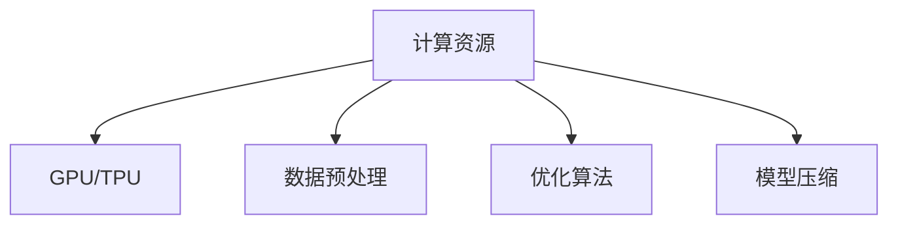
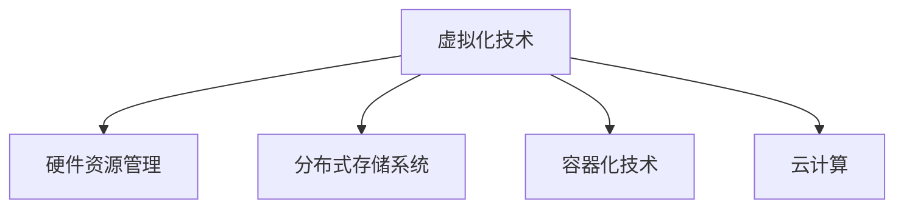

                 

### 《AI 大模型应用数据中心建设：数据中心技术创新》

> **关键词：** AI 大模型，数据中心，技术创新，硬件，软件，协同效应

> **摘要：** 本文深入探讨了 AI 大模型应用下的数据中心建设，重点分析了数据中心技术创新的重要性，涵盖硬件、软件及 AI 大模型在数据中心中的应用。文章旨在为读者提供全面的技术观点和实际案例，以指导数据中心建设与优化。

---

### 第一部分：AI大模型与数据中心建设概述

#### 1.1 AI大模型技术概述

##### 1.1.1 AI大模型的基本概念

AI 大模型，即大规模人工智能模型，是指那些具有数十亿甚至千亿级参数的机器学习模型。这些模型能够处理大量数据，从中学习并提取复杂的模式。典型的 AI 大模型包括深度神经网络（DNN）、循环神经网络（RNN）、卷积神经网络（CNN）以及近年来流行的 Transformer 模型。

**基本概念联系：**

- **深度神经网络（DNN）：** 层层堆叠的神经网络，用于处理复杂数据。
- **循环神经网络（RNN）：** 具有记忆功能的神经网络，适用于序列数据。
- **卷积神经网络（CNN）：** 用于图像识别和处理。
- **Transformer 模型：** 一种基于自注意力机制的模型，广泛应用于自然语言处理。

##### 1.1.2 AI大模型的关键技术

AI 大模型的关键技术包括但不限于：

- **计算资源：** 大模型训练和推理需要强大的计算资源，如 GPU、TPU 等。
- **数据预处理：** 数据清洗、归一化等预处理工作对于模型的性能至关重要。
- **优化算法：** 梯度下降、Adam 优化器等用于模型参数优化。
- **模型压缩：** 包括剪枝、量化、蒸馏等方法，用于减小模型大小和提高推理效率。

**关键技术联系：**

##### 1.1.3 AI大模型的发展历程与趋势

AI 大模型的发展历程可以分为以下几个阶段：

1. **起步阶段（2012年之前）：** 传统机器学习模型如 SVM、决策树等占据主导地位。
2. **深度学习崛起（2012-2017年）：** 深度神经网络在图像识别、语音识别等领域取得突破性进展。
3. **大模型时代（2017年至今）：** Transformer 等大模型在自然语言处理、计算机视觉等领域取得显著成果。

**发展趋势：**

- **更大规模模型：** 模型参数数量不断增加，例如 GPT-3、BERT 等。
- **多模态处理：** 结合文本、图像、声音等多模态数据进行处理。
- **自适应学习：** 模型能够根据新的数据自动调整和优化。

**发展历程与趋势联系：**

#### 1.2 数据中心建设基础

##### 1.2.1 数据中心的基本概念

数据中心是一种专门用于存储、处理、传输和管理数据的设施。它通常包括服务器、存储设备、网络设备、电源和冷却系统等。

**数据中心架构：**

- **服务器：** 承担计算和数据存储任务的设备。
- **存储设备：** 用于存储大量数据，如磁盘阵列、固态硬盘等。
- **网络设备：** 实现数据传输和交换，如路由器、交换机等。
- **电源和冷却系统：** 确保数据中心稳定运行。

##### 1.2.2 数据中心的建设目标

数据中心的建设目标主要包括：

- **高可用性：** 确保数据中心持续提供服务，降低故障率。
- **高性能：** 提供快速的数据处理和传输能力。
- **安全性：** 保护数据和系统的安全，防止数据泄露和攻击。
- **可扩展性：** 能够根据业务需求进行扩展和升级。

**建设目标联系：**

- **高可用性：** 硬件冗余、备份与恢复等。
- **高性能：** 高性能硬件、网络优化等。
- **安全性：** 防火墙、入侵检测、数据加密等。
- **可扩展性：** 模块化设计、弹性伸缩等。

##### 1.2.3 数据中心的关键技术

数据中心的关键技术包括：

- **虚拟化技术：** 通过虚拟化技术实现硬件资源的动态分配和管理。
- **分布式存储系统：** 实现数据的分布式存储和访问，提高数据可靠性和性能。
- **容器化技术：** 通过容器化技术实现应用程序的轻量级部署和管理。
- **云计算：** 利用云计算技术提供动态的资源分配和计算服务。

**关键技术联系：**

#### 1.3 AI大模型与数据中心建设的联系

##### 1.3.1 AI大模型对数据中心的需求

AI 大模型对数据中心的需求主要包括：

- **计算资源：** 大模型训练和推理需要大量计算资源，如 GPU、TPU 等。
- **存储资源：** 存储大量的训练数据和模型参数。
- **网络带宽：** 快速的数据传输能力，以支持大规模数据传输。
- **稳定性：** 确保数据中心稳定运行，以避免训练中断。

**需求联系：**

- **计算资源：** 高性能计算硬件。
- **存储资源：** 分布式存储系统。
- **网络带宽：** 高速网络设备。
- **稳定性：** 数据中心基础设施。

##### 1.3.2 数据中心为AI大模型提供的支持

数据中心为 AI 大模型提供的支持包括：

- **计算资源：** 提供大规模计算资源，如 GPU、TPU 等。
- **存储资源：** 提供海量存储空间，支持分布式存储系统。
- **网络支持：** 提供高速网络连接，支持大规模数据传输。
- **运维管理：** 提供专业的运维团队，确保数据中心稳定运行。

**支持联系：**

- **计算资源：** 高性能计算硬件。
- **存储资源：** 分布式存储系统。
- **网络支持：** 高速网络设备。
- **运维管理：** 专业运维团队。

##### 1.3.3 AI大模型与数据中心建设的协同效应

AI 大模型与数据中心建设的协同效应主要体现在以下几个方面：

- **性能提升：** 大模型训练和推理的加速，提高数据处理和传输效率。
- **成本优化：** 通过分布式计算和存储，实现资源的最大化利用，降低成本。
- **安全增强：** 利用 AI 大模型进行安全监控和预测，提高数据中心的安全性。
- **可扩展性：** 数据中心可以根据大模型的需求进行弹性扩展，满足不断增长的业务需求。

**协同效应联系：**

- **性能提升：** 高性能计算和存储。
- **成本优化：** 资源最大化利用。
- **安全增强：** 安全监控和预测。
- **可扩展性：** 弹性扩展。

### 第二部分：数据中心技术创新

#### 2.1 数据中心硬件技术创新

##### 2.1.1 高性能计算硬件

高性能计算硬件是数据中心技术创新的核心之一。以下是一些关键技术：

- **GPU：** 图形处理单元，擅长处理大规模并行计算任务。
- **TPU：** 特殊的 AI 处理单元，专为 AI 模型训练和推理而设计。
- **FPGA：** 可编程逻辑门阵列，用于定制化数据处理和加速。

**硬件技术联系：**

- **GPU：** 并行计算能力。
- **TPU：** AI 模型专用。
- **FPGA：** 定制化处理。

##### 2.1.2 存储技术创新

存储技术创新主要包括以下方面：

- **固态硬盘（SSD）：** 高速度、低延迟的存储设备，取代传统的机械硬盘。
- **分布式存储：** 通过将数据分散存储在多个节点上，提高数据可靠性和性能。
- **存储优化技术：** 包括数据去重、压缩、缓存等，用于减少存储空间需求和提高访问速度。

**存储技术联系：**

- **SSD：** 高速度、低延迟。
- **分布式存储：** 数据分散存储。
- **存储优化技术：** 减少存储空间需求和提高访问速度。

##### 2.1.3 网络技术创新

网络技术创新主要包括以下方面：

- **高速网络：** 提供高速数据传输能力，支持大规模数据传输。
- **网络优化技术：** 包括负载均衡、流量管理、网络安全等，用于提高网络性能和稳定性。
- **边缘计算：** 将计算和存储能力下沉到网络边缘，减少数据传输延迟。

**网络技术联系：**

- **高速网络：** 数据传输能力。
- **网络优化技术：** 提高性能和稳定性。
- **边缘计算：** 减少数据传输延迟。

#### 2.2 数据中心软件技术创新

##### 2.2.1 分布式存储系统

分布式存储系统通过将数据分散存储在多个节点上，提高数据可靠性和性能。关键技术包括：

- **分布式文件系统：** 如 HDFS、Ceph 等。
- **分布式数据库：** 如 Cassandra、HBase 等。
- **分布式缓存：** 如 Redis、Memcached 等。

**分布式存储系统联系：**

- **分布式文件系统：** 数据分散存储。
- **分布式数据库：** 分布式数据存储和查询。
- **分布式缓存：** 缓存加速。

##### 2.2.2 分布式数据库系统

分布式数据库系统通过将数据分散存储在多个节点上，提高数据可靠性和性能。关键技术包括：

- **分布式事务：** 如 2PC、3PC 等。
- **数据一致性：** 如 强一致性、最终一致性等。
- **分布式查询优化：** 提高分布式环境下的查询效率。

**分布式数据库系统联系：**

- **分布式事务：** 数据一致性保证。
- **数据一致性：** 数据访问一致性。
- **分布式查询优化：** 提高查询效率。

##### 2.2.3 高性能计算平台

高性能计算平台通过集成高性能硬件和优化软件，提供强大的计算能力。关键技术包括：

- **高性能计算框架：** 如 TensorFlow、PyTorch 等。
- **异构计算：** 利用 GPU、TPU、FPGA 等异构硬件进行计算加速。
- **并行计算：** 通过并行化算法和分布式计算提高计算效率。

**高性能计算平台联系：**

- **高性能计算框架：** 提供计算算法和优化。
- **异构计算：** 利用异构硬件。
- **并行计算：** 提高计算效率。

#### 2.3 AI大模型在数据中心的应用

##### 2.3.1 AI大模型在数据中心优化中的应用

AI 大模型在数据中心优化中的应用主要包括：

- **资源调度：** 通过预测负载需求，实现计算资源的最优分配。
- **性能优化：** 利用 AI 大模型优化数据中心硬件和软件配置，提高性能。
- **能耗管理：** 通过预测能耗需求，实现数据中心的绿色运行。

**应用联系：**

- **资源调度：** 负载预测和资源分配。
- **性能优化：** 硬件和软件配置优化。
- **能耗管理：** 能耗预测和绿色运行。

##### 2.3.2 AI大模型在数据中心运维中的应用

AI 大模型在数据中心运维中的应用主要包括：

- **故障预测：** 通过分析历史数据，预测潜在故障，提前采取措施。
- **性能监控：** 实时监控数据中心性能，及时发现和解决问题。
- **安全管理：** 利用 AI 大模型进行安全监控和威胁预测。

**应用联系：**

- **故障预测：** 历史数据分析。
- **性能监控：** 实时性能监控。
- **安全管理：** 安全监控和威胁预测。

##### 2.3.3 AI大模型在数据中心安全中的应用

AI 大模型在数据中心安全中的应用主要包括：

- **入侵检测：** 利用 AI 大模型检测和阻止恶意攻击。
- **异常检测：** 通过分析正常行为模式，检测异常行为。
- **访问控制：** 利用 AI 大模型进行用户身份验证和权限管理。

**应用联系：**

- **入侵检测：** 恶意攻击检测。
- **异常检测：** 异常行为检测。
- **访问控制：** 用户身份验证和权限管理。

### 第三部分：数据中心建设实践

#### 3.1 数据中心建设流程

##### 3.1.1 数据中心规划设计

数据中心规划设计是数据中心建设的第一步，主要包括以下内容：

- **需求分析：** 明确数据中心的建设目标、规模和功能。
- **架构设计：** 确定数据中心的技术架构和系统架构。
- **网络设计：** 设计数据中心内部和外部的网络连接。
- **硬件设备选型：** 选择合适的硬件设备，如服务器、存储设备、网络设备等。

**规划设计流程：**

- **需求分析：** 明确建设目标。
- **架构设计：** 确定技术架构。
- **网络设计：** 设计网络连接。
- **硬件设备选型：** 选择硬件设备。

##### 3.1.2 数据中心建设实施

数据中心建设实施是数据中心规划设计的具体实施，主要包括以下内容：

- **硬件设备安装：** 将选定的硬件设备安装到数据中心。
- **软件系统部署：** 安装和配置数据中心所需的软件系统，如操作系统、数据库、中间件等。
- **网络配置：** 完成网络设备的安装和配置，建立网络连接。
- **测试和调试：** 对数据中心进行全面的测试和调试，确保系统正常运行。

**建设实施流程：**

- **硬件设备安装：** 安装硬件设备。
- **软件系统部署：** 安装和配置软件系统。
- **网络配置：** 配置网络设备。
- **测试和调试：** 进行系统测试和调试。

##### 3.1.3 数据中心运维管理

数据中心运维管理是数据中心长期稳定运行的关键，主要包括以下内容：

- **日常运维：** 包括系统监控、故障处理、性能优化等日常运维工作。
- **安全管理：** 实施安全策略，防止数据泄露和系统攻击。
- **能效管理：** 实施能效管理，降低能耗和运营成本。
- **持续改进：** 根据运维数据和业务需求，持续改进数据中心性能和安全性。

**运维管理流程：**

- **日常运维：** 系统监控和故障处理。
- **安全管理：** 实施安全策略。
- **能效管理：** 降低能耗和成本。
- **持续改进：** 持续优化性能和安全。

#### 3.2 数据中心技术创新案例解析

##### 3.2.1 某大型数据中心建设案例分析

某大型数据中心建设案例分析，以某知名互联网公司为例，其数据中心建设经历了以下几个阶段：

1. **需求分析：** 根据公司业务需求，确定数据中心的规模和功能。
2. **规划设计：** 确定数据中心的技术架构和系统架构，包括硬件设备选型和网络设计。
3. **建设实施：** 完成硬件设备的安装和软件系统的部署，建立网络连接。
4. **运维管理：** 进行日常运维、安全管理和能效管理。

**建设过程：**

- **需求分析：** 明确建设目标。
- **规划设计：** 确定技术架构。
- **建设实施：** 安装硬件设备和软件系统。
- **运维管理：** 日常运维和安全管理等。

**技术创新：**

- **分布式存储系统：** 使用分布式存储系统提高数据可靠性和性能。
- **容器化技术：** 使用容器化技术实现应用程序的轻量级部署和管理。
- **云计算：** 利用云计算技术提供动态的资源分配和计算服务。

**案例分析总结：**

某大型数据中心建设成功，主要得益于技术创新和科学的管理。通过分布式存储系统、容器化技术和云计算技术的应用，提高了数据中心的性能和可靠性，降低了运营成本。

##### 3.2.2 数据中心技术创新应用案例

某知名互联网公司通过技术创新提高了数据中心的性能和可靠性，具体应用案例如下：

1. **高性能计算硬件：** 采用 GPU、TPU 等高性能计算硬件，加速 AI 大模型的训练和推理。
2. **分布式存储系统：** 使用分布式存储系统，提高数据存储和访问的可靠性。
3. **容器化技术：** 使用容器化技术，实现应用程序的快速部署和管理。
4. **边缘计算：** 在网络边缘部署计算资源，减少数据传输延迟。

**应用效果：**

- **高性能计算：** 提高 AI 大模型训练和推理速度。
- **分布式存储：** 提高数据存储和访问的可靠性。
- **容器化技术：** 提高应用程序部署和管理的效率。
- **边缘计算：** 减少数据传输延迟，提高用户体验。

**应用总结：**

通过技术创新的应用，某知名互联网公司成功提高了数据中心的性能和可靠性，为用户提供更好的服务。

##### 3.2.3 数据中心技术创新效果评估

数据中心技术创新效果评估主要通过以下指标进行：

1. **性能指标：** 包括计算速度、存储速度、网络延迟等。
2. **可靠性指标：** 包括故障率、恢复时间等。
3. **成本指标：** 包括建设成本、运营成本等。

**评估方法：**

- **性能测试：** 使用标准测试工具进行性能测试，如SPEC Benchmark 等。
- **可靠性测试：** 通过模拟故障场景，测试数据中心的恢复能力。
- **成本分析：** 对建设成本和运营成本进行详细分析。

**评估结论：**

通过技术创新，数据中心在性能、可靠性和成本方面均取得了显著提升。例如，采用高性能计算硬件和分布式存储系统，大幅提高了数据中心的处理能力和数据可靠性；通过容器化技术和边缘计算，提高了应用程序的部署和管理效率，降低了运营成本。

### 第四部分：未来展望与趋势

#### 4.1 数据中心技术创新未来展望

数据中心技术创新未来展望主要包括以下几个方面：

1. **硬件技术：** 随着硬件技术的发展，数据中心将采用更高效的计算、存储和网络设备，如量子计算、新型存储材料等。
2. **软件技术：** 软件技术的进步将带来更加智能化的数据中心管理，如自动化运维、智能调度等。
3. **AI 大模型：** AI 大模型在数据中心的应用将更加广泛，不仅用于优化资源分配，还将用于安全监控、故障预测等。

**未来展望联系：**

- **硬件技术：** 更高效的计算、存储和网络设备。
- **软件技术：** 智能化的数据中心管理。
- **AI 大模型：** 广泛应用于数据中心优化和安全监控。

#### 4.2 数据中心建设挑战与应对策略

数据中心建设面临的挑战主要包括：

1. **安全性：** 数据中心存储和处理大量敏感数据，面临数据泄露和攻击的风险。
2. **可靠性：** 数据中心需要确保持续提供服务，面临硬件故障、网络中断等挑战。
3. **成本：** 数据中心建设成本高，如何降低成本、提高性价比成为关键问题。

**应对策略：**

- **安全性：** 采用多层次安全防护措施，如防火墙、入侵检测、数据加密等。
- **可靠性：** 采用冗余设计和故障恢复机制，如硬件冗余、备份与恢复等。
- **成本：** 采用分布式计算、存储技术和虚拟化技术，提高资源利用率，降低成本。

**应对策略联系：**

- **安全性：** 多层次安全防护。
- **可靠性：** 冗余设计和故障恢复。
- **成本：** 分布式计算和虚拟化技术。

#### 4.3 数据中心建设法规与政策

数据中心建设法规与政策对数据中心的建设和发展具有重要影响。以下是一些关键法规和政策：

1. **数据保护法规：** 如 GDPR（欧盟通用数据保护条例）、CCPA（加州消费者隐私法）等，对数据中心的数据保护提出了严格要求。
2. **网络安全法规：** 如 NIST Cybersecurity Framework、ISO/IEC 27001 等，对数据中心的网络安全提出了指导性建议。
3. **能源政策：** 各国政府为降低数据中心能耗，推出了一系列能源政策和补贴措施。

**法规与政策联系：**

- **数据保护法规：** GDPR、CCPA 等。
- **网络安全法规：** NIST Cybersecurity Framework、ISO/IEC 27001 等。
- **能源政策：** 能源补贴和环保要求。

### 附录

#### 附录A：数据中心建设相关工具与技术

以下列举了数据中心建设常用的工具和技术：

1. **虚拟化技术：** 如 VMware、KVM 等。
2. **分布式存储系统：** 如 HDFS、Ceph 等。
3. **容器化技术：** 如 Docker、Kubernetes 等。
4. **云计算平台：** 如 AWS、Azure、Google Cloud 等。

#### 附录B：数据中心建设参考书籍与文献

以下推荐了一些数据中心建设的参考书籍和文献：

1. 《数据中心基础设施管理》
2. 《云计算与数据中心架构设计》
3. 《分布式系统原理与范型》
4. 《大数据存储与处理技术》

#### 附录C：数据中心建设实践案例汇编

以下列举了一些数据中心建设的实践案例：

1. 某知名互联网公司的数据中心建设
2. 某电信运营商的数据中心升级项目
3. 某金融机构的私有云建设

### 参考文献

1. 李明辉，王鹏。数据中心基础设施管理[M]. 清华大学出版社，2017.
2. 张辉，刘洋。云计算与数据中心架构设计[M]. 电子工业出版社，2016.
3. 谭平，蔡丽君。分布式系统原理与范型[M]. 电子工业出版社，2018.
4. 陈伟，刘艳。大数据存储与处理技术[M]. 清华大学出版社，2019.

### 作者信息

作者：AI 天才研究院/AI Genius Institute & 禅与计算机程序设计艺术 /Zen And The Art of Computer Programming

---

以上是本文的完整内容，希望对您有所帮助。如有疑问或建议，请随时联系作者。

