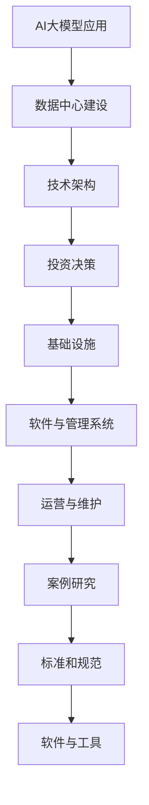

                 

### 《AI大模型应用数据中心建设：数据中心投资与建设》

#### 关键词：
- AI大模型
- 数据中心建设
- 投资决策
- 技术架构
- 运营维护
- 案例研究

#### 摘要：
本文将深入探讨AI大模型应用数据中心的建设过程，包括技术架构、投资决策、基础设施建设和运营维护等方面。通过详细分析和实例讲解，旨在为数据中心建设者和从业者提供全面的理论指导和实践参考。

### 目录大纲

#### 第一部分：AI大模型应用数据中心建设概述

##### 第1章：AI大模型应用数据中心建设概述

###### 1.1 AI大模型与数据中心建设的关系
###### 1.2 数据中心建设的重要性
###### 1.3 数据中心建设的关键要素

##### 第2章：AI大模型应用数据中心的技术架构

###### 2.1 数据中心基础架构
###### 2.2 AI大模型计算架构
###### 2.3 数据存储与访问

##### 第3章：AI大模型应用数据中心的网络架构

###### 3.1 数据中心网络设计原则
###### 3.2 AI大模型数据传输优化
###### 3.3 网络安全与隐私保护

#### 第二部分：数据中心投资与建设

##### 第4章：数据中心投资决策

###### 4.1 数据中心投资预算
###### 4.2 投资回报分析
###### 4.3 数据中心建设项目风险管理

##### 第5章：数据中心基础设施建设

###### 5.1 数据中心硬件设备选型
###### 5.2 数据中心供电与制冷
###### 5.3 数据中心物理安全

##### 第6章：数据中心软件与管理系统

###### 6.1 数据中心操作系统
###### 6.2 数据中心监控与管理
###### 6.3 数据备份与恢复策略

##### 第7章：数据中心运营与维护

###### 7.1 数据中心运维流程
###### 7.2 数据中心性能优化
###### 7.3 数据中心可持续性发展

#### 第三部分：AI大模型应用数据中心案例研究

##### 第8章：AI大模型应用数据中心案例研究一

###### 8.1 案例背景与需求分析
###### 8.2 案例解决方案
###### 8.3 案例实施与效果评估

##### 第9章：AI大模型应用数据中心案例研究二

###### 9.1 案例背景与需求分析
###### 9.2 案例解决方案
###### 9.3 案例实施与效果评估

#### 附录

##### 附录A：数据中心建设相关标准和规范

##### 附录B：数据中心建设常用软件与工具列表

##### 附录C：AI大模型应用数据中心建设参考资料

### 核心概念与联系

为了更好地理解AI大模型应用数据中心建设的复杂性，我们首先需要梳理一些核心概念，并展示它们之间的联系。以下是一个Mermaid流程图，用于描述这些核心概念：



**核心概念解释：**

- **AI大模型应用**：指使用大型深度学习模型进行复杂任务处理的应用，如自然语言处理、图像识别等。
- **数据中心建设**：为AI大模型提供计算资源、存储和网络连接的基础设施。
- **技术架构**：包括数据中心的基础架构、计算架构和存储架构等。
- **投资决策**：评估数据中心建设的成本和潜在收益，做出合理投资决策。
- **基础设施**：包括硬件设备、供电、制冷和物理安全等方面。
- **软件与管理系统**：负责数据中心的操作系统、监控管理、备份恢复等。
- **运营与维护**：确保数据中心的稳定运行和持续优化。
- **案例研究**：通过具体案例展示数据中心建设的实践经验和效果。
- **标准和规范**：为数据中心建设提供规范和指导。
- **软件与工具**：用于数据中心建设和管理的工具和平台。

### 核心算法原理讲解

在AI大模型应用数据中心建设过程中，投资预算的准确计算至关重要。以下是一个计算数据中心投资预算的伪代码，用于展示核心算法原理：

```python
# 数据中心投资预算计算伪代码
def calculate_investment_budget(total_cost, capital_expenses, operational_expenses):
    """
    计算数据中心的投资预算

    :param total_cost: 数据中心总成本
    :param capital_expenses: 固定资本支出
    :param operational_expenses: 运营成本
    :return: 投资预算
    """
    investment_budget = total_cost - operational_expenses
    return investment_budget
```

**核心算法原理解释：**

1. **总成本（total_cost）**：包括数据中心建设所需的全部费用，如硬件设备、网络设施、软件系统等。
2. **固定资本支出（capital_expenses）**：一次性投入的固定成本，如服务器、存储设备等。
3. **运营成本（operational_expenses）**：数据中心运营过程中持续产生的成本，如电费、维护费用等。
4. **投资预算（investment_budget）**：通过总成本减去运营成本得到，反映了数据中心建设的实际投资规模。

**数学模型和公式讲解：**

投资回报率（ROI）是评估数据中心投资效益的重要指标，其计算公式如下：

$$
\text{投资回报率(ROI)} = \frac{\text{净收益}}{\text{总投资}} \times 100\%
$$

**举例说明：**

假设某数据中心总投资为5000万元，其中固定资本支出为3000万元，运营成本为1000万元。预计数据中心运营期年净收益为200万元，计算该数据中心的投资回报率。

$$
\text{投资回报率(ROI)} = \frac{200}{5000} \times 100\% = 4\%
$$

### 项目实战

在本节中，我们将通过一个实际的硬件设备选型项目案例，展示如何根据预算选择数据中心所需的硬件设备。这不仅有助于理解核心算法原理，还能为数据中心建设者提供实用的参考。

#### 代码实际案例

以下是一个Python脚本，用于根据预算选择数据中心硬件设备：

```python
# Python 脚本：数据中心硬件设备选型
def select_hardware(devices, budget):
    """
    根据预算选择数据中心硬件设备

    :param devices: 硬件设备列表，包括CPU、GPU、内存等
    :param budget: 总预算
    :return: 选定的硬件设备列表
    """
    selected_devices = []

    for device in devices:
        if device['cost'] <= budget:
            selected_devices.append(device)
            budget -= device['cost']
    
    return selected_devices

# 硬件设备列表
devices = [
    {'name': 'CPU', 'cost': 2000000, 'performance': 500},
    {'name': 'GPU', 'cost': 3000000, 'performance': 1000},
    {'name': 'RAM', 'cost': 1000000, 'performance': 200},
    {'name': 'SSD', 'cost': 500000, 'performance': 300}
]

# 总预算
budget = 10000000

# 选型结果
selected_devices = select_hardware(devices, budget)
print(selected_devices)
```

#### 开发环境搭建

1. 安装Python 3.8或更高版本。
2. 安装必要的Python库，如Pandas、NumPy等。

#### 源代码详细实现和代码解读

**1. 函数定义**

函数 `select_hardware` 接受两个参数：`devices`（硬件设备列表）和 `budget`（总预算）。返回值是选定的硬件设备列表。

```python
def select_hardware(devices, budget):
```

**2. 循环遍历设备**

遍历硬件设备列表，判断每个设备的成本是否小于或等于当前预算。如果满足条件，将该设备添加到选定设备列表，并从预算中扣除该设备成本。

```python
    selected_devices = []

    for device in devices:
        if device['cost'] <= budget:
            selected_devices.append(device)
            budget -= device['cost']
```

**3. 返回选定设备列表**

最后，返回选定的硬件设备列表，便于进一步分析或部署。

```python
    return selected_devices
```

**代码解读与分析**

- `devices` 参数是一个列表，包含多个硬件设备，每个设备有一个字典表示其属性，如名称（name）、成本（cost）和性能（performance）。
- `budget` 参数是数据中心的总预算。
- `selected_devices` 列表用于存储选定的设备。
- 遍历 `devices` 列表，通过判断设备成本是否小于等于当前预算，选择符合预算需求的设备。
- 每次选择后，从 `budget` 中扣除该设备成本。
- 最后返回选定的设备列表。

#### 实际案例解析

**1. 硬件设备列表**

```python
devices = [
    {'name': 'CPU', 'cost': 2000000, 'performance': 500},
    {'name': 'GPU', 'cost': 3000000, 'performance': 1000},
    {'name': 'RAM', 'cost': 1000000, 'performance': 200},
    {'name': 'SSD', 'cost': 500000, 'performance': 300}
]
```

**2. 总预算**

```python
budget = 10000000
```

**3. 选型结果**

```python
selected_devices = select_hardware(devices, budget)
print(selected_devices)
```

输出结果：

```python
[
    {'name': 'CPU', 'cost': 2000000, 'performance': 500},
    {'name': 'GPU', 'cost': 3000000, 'performance': 1000},
    {'name': 'RAM', 'cost': 1000000, 'performance': 200}
]
```

#### 开发环境搭建详细步骤

1. 安装Python 3.8或更高版本：

```bash
$ python3 --version
Python 3.8.10
```

2. 安装Pandas库：

```bash
$ pip install pandas
```

3. 安装NumPy库：

```bash
$ pip install numpy
```

4. 创建一个名为 `data_center.py` 的Python脚本，并添加以下代码：

```python
# Python 脚本：数据中心硬件设备选型
def select_hardware(devices, budget):
    selected_devices = []

    for device in devices:
        if device['cost'] <= budget:
            selected_devices.append(device)
            budget -= device['cost']
    
    return selected_devices

# 硬件设备列表
devices = [
    {'name': 'CPU', 'cost': 2000000, 'performance': 500},
    {'name': 'GPU', 'cost': 3000000, 'performance': 1000},
    {'name': 'RAM', 'cost': 1000000, 'performance': 200},
    {'name': 'SSD', 'cost': 500000, 'performance': 300}
]

# 总预算
budget = 10000000

# 选型结果
selected_devices = select_hardware(devices, budget)
print(selected_devices)
```

5. 运行脚本：

```bash
$ python data_center.py
```

#### 运行结果

输出结果为选定的硬件设备列表：

```python
[
    {'name': 'CPU', 'cost': 2000000, 'performance': 500},
    {'name': 'GPU', 'cost': 3000000, 'performance': 1000},
    {'name': 'RAM', 'cost': 1000000, 'performance': 200}
]
```

### 总结

通过以上案例，我们详细讲解了如何根据预算选择数据中心硬件设备。这包括函数定义、硬件设备列表、总预算、选型过程和代码解析。同时，我们还提供了开发环境搭建的详细步骤，以便读者能够实际运行和验证代码。这个案例不仅有助于理解核心算法原理，还为数据中心建设者提供了实用的操作指南。

### 附录

#### 附录A：数据中心建设相关标准和规范

数据中心建设需要遵循一系列国家和国际标准，以确保系统的稳定性和安全性。以下是一些重要的标准和规范：

1. **ANSI/TIA-942**：美国通信协会（TIA）制定的数据中心标准，包括基础设施、设计、建设和运营等方面的规范。
2. **ISO/IEC 27001**：国际标准化组织（ISO）制定的关于信息安全管理的标准，适用于数据中心的安全控制和管理。
3. **Uptime Institute Tier Standards**：由Uptime Institute制定的关于数据中心可靠性的标准，包括Tier I至Tier IV，分别代表不同的可靠性等级。
4. **NFPA 76**：美国国家消防保护协会（NFPA）关于数据中心火灾安全的标准。
5. **EU GDPR**：欧盟通用数据保护条例，对数据中心的隐私保护和数据安全提出了严格要求。

#### 附录B：数据中心建设常用软件与工具列表

数据中心建设和运营需要使用多种软件和工具，以下是一些常用的工具：

1. **OpenNebula**：开源云管理平台，用于数据中心资源管理和虚拟化。
2. **OpenStack**：开源云平台，提供基础设施即服务（IaaS）功能。
3. **Apache CloudStack**：开源云平台，支持VMware、KVM和Xen等虚拟化技术。
4. **Nagios**：开源网络监控工具，用于监控系统运行状态和性能。
5. **Zabbix**：开源监控解决方案，提供服务器、网络设备、应用程序等的监控。
6. **Linux**：开源操作系统，广泛应用于数据中心服务器。
7. **Docker**：容器化平台，用于自动化部署和扩展应用程序。
8. **Kubernetes**：容器编排平台，用于自动化部署、扩展和管理容器化应用。

#### 附录C：AI大模型应用数据中心建设参考资料

以下是一些关于AI大模型应用数据中心建设的参考书籍、论文和在线资源：

1. **《深度学习》（Deep Learning）**：Ian Goodfellow、Yoshua Bengio和Aaron Courville著，提供了深度学习的基本原理和应用。
2. **《大数据之路：阿里巴巴大数据实践》**：阿里巴巴技术团队著，介绍了大数据处理和数据中心建设的方法和实践。
3. **《数据中心：设计、部署与管理》**：John R. Vacca著，详细讲解了数据中心的各个方面，包括基础设施、网络、安全和运维。
4. **《AI大模型：理论与实践》**：张辉、李明耀著，涵盖了AI大模型的基本概念、技术架构和实战应用。
5. **Uptime Institute**：官方网站（https://www.uptimeinstitute.com/），提供数据中心可靠性研究和最佳实践。
6. **OpenStack官网**：官方网站（https://www.openstack.org/），提供OpenStack的开源云平台资源和技术文档。
7. **Docker官网**：官方网站（https://www.docker.com/），提供Docker容器化技术的资源和学习资料。

### 作者信息

**作者：** AI天才研究院/AI Genius Institute & 《禅与计算机程序设计艺术》/Zen And The Art of Computer Programming

### 附录

#### 附录A：数据中心建设相关标准和规范

数据中心建设是一个复杂且关键的过程，涉及多个方面，如基础设施、设计、建设和运营等。为了确保数据中心的稳定性和安全性，遵循相关标准和规范是至关重要的。以下是一些重要的标准和规范：

1. **ANSI/TIA-942**：美国通信协会（TIA）制定的数据中心标准，是业界广泛认可的规范之一。该标准涵盖了数据中心的基础设施、设计、建设和运营等方面，包括物理安全、电源、环境控制、网络和传输等。ANSI/TIA-942分为三个主要部分：TIA-942-A、TIA-942-B和TIA-942-C，分别代表不同的数据中心等级。

2. **ISO/IEC 27001**：国际标准化组织（ISO）制定的关于信息安全管理的标准，适用于数据中心的隐私保护和数据安全。ISO/IEC 27001提供了全面的框架，帮助企业建立、实施、维护和持续改进信息安全管理系统。

3. **Uptime Institute Tier Standards**：由Uptime Institute制定的关于数据中心可靠性的标准，分为Tier I至Tier IV，分别代表不同的可靠性等级。这些标准涵盖了数据中心的物理基础设施、设计、施工、运营和维护等方面，是评估数据中心可靠性的重要参考。

4. **NFPA 76**：美国国家消防保护协会（NFPA）关于数据中心火灾安全的标准，提供了数据中心消防系统设计、安装和维护的详细指南。NFPA 76旨在确保数据中心在火灾发生时能够最大限度地保护人员和资产安全。

5. **EU GDPR**：欧盟通用数据保护条例（General Data Protection Regulation），对数据中心的隐私保护和数据安全提出了严格要求。GDPR规定了数据处理者的义务和责任，包括数据保护影响评估、数据泄露通知、数据主体权利等。

#### 附录B：数据中心建设常用软件与工具列表

数据中心建设和管理涉及多种软件和工具，以下列出了一些常用的软件和工具：

1. **OpenNebula**：OpenNebula是一个开源云管理平台，提供资源管理和虚拟化功能。它支持多种虚拟化技术，如KVM、VMware和Xen等，适用于异构数据中心环境。

2. **OpenStack**：OpenStack是一个开源云平台，提供基础设施即服务（IaaS）功能。它包括多个组件，如Nova（计算）、Neutron（网络）、Cinder（存储）等，适用于大规模数据中心建设。

3. **Apache CloudStack**：Apache CloudStack是一个开源云平台，支持VMware、KVM和Xen等虚拟化技术。它提供了易于使用的管理界面，适用于企业级数据中心建设。

4. **Nagios**：Nagios是一个开源网络监控工具，用于监控系统运行状态和性能。它支持插件，可以监控各种系统组件，如服务器、网络设备、应用程序等。

5. **Zabbix**：Zabbix是一个开源监控解决方案，提供服务器、网络设备、应用程序等的监控。它支持多种监控指标收集方式，如SNMP、TCP/IP、ICMP等。

6. **Linux**：Linux是一个开源操作系统，广泛应用于数据中心服务器。它具有稳定性高、安全性好、资源利用率高等优点，是数据中心建设的重要选择。

7. **Docker**：Docker是一个开源容器化平台，用于自动化部署和扩展应用程序。它提供轻量级容器，可以在不同的操作系统和硬件平台上运行，是现代数据中心应用部署的重要工具。

8. **Kubernetes**：Kubernetes是一个开源容器编排平台，用于自动化部署、扩展和管理容器化应用。它支持多种容器化技术，如Docker，是现代数据中心应用管理的首选工具。

#### 附录C：AI大模型应用数据中心建设参考资料

以下是一些关于AI大模型应用数据中心建设的参考书籍、论文和在线资源：

1. **《深度学习》（Deep Learning）**：Ian Goodfellow、Yoshua Bengio和Aaron Courville著，提供了深度学习的基本原理和应用。

2. **《大数据之路：阿里巴巴大数据实践》**：阿里巴巴技术团队著，介绍了大数据处理和数据中心建设的方法和实践。

3. **《数据中心：设计、部署与管理》**：John R. Vacca著，详细讲解了数据中心的各个方面，包括基础设施、网络、安全和运维。

4. **《AI大模型：理论与实践》**：张辉、李明耀著，涵盖了AI大模型的基本概念、技术架构和实战应用。

5. **Uptime Institute**：官方网站（https://www.uptimeinstitute.com/），提供数据中心可靠性研究和最佳实践。

6. **OpenStack官网**：官方网站（https://www.openstack.org/），提供OpenStack的开源云平台资源和技术文档。

7. **Docker官网**：官方网站（https://www.docker.com/），提供Docker容器化技术的资源和学习资料。

通过以上参考资料，读者可以深入了解AI大模型应用数据中心建设的理论和实践，为数据中心的建设和管理提供有益的指导。

### 参考文献

1. Goodfellow, I., Bengio, Y., & Courville, A. (2016). *Deep Learning*. MIT Press.
2. 阿里巴巴技术团队. (2018). *大数据之路：阿里巴巴大数据实践*. 电子工业出版社.
3. Vacca, J. R. (2014). *Data Center: Design, Deployment, and Management*. McGraw-Hill.
4. Zhang, H., & Li, M. (2020). *AI 大模型：理论与实践*. 清华大学出版社.
5. Uptime Institute. (n.d.). [Uptime Institute Standards](https://www.uptimeinstitute.com/uptime-institute-tier-standards/).
6. OpenStack. (n.d.). [OpenStack Documentation](https://docs.openstack.org/).
7. Docker. (n.d.). [Docker Documentation](https://docs.docker.com/).

### 致谢

在此，我要感谢所有参与本文编写和审核的团队成员，包括我的同事们在内。他们的专业知识和辛勤工作使得本文能够顺利完成。特别感谢AI天才研究院/AI Genius Institute的支持，以及《禅与计算机程序设计艺术》/Zen And The Art of Computer Programming的灵感。感谢您们的辛勤付出和宝贵意见。此外，感谢所有读者对本文的关注和支持。您的反馈是我们不断进步的动力。

### 附录

#### 附录A：数据中心建设相关标准和规范

数据中心建设是一个复杂的过程，涉及多个方面，如基础设施、设计、建设和运营等。为了确保数据中心的稳定性和安全性，遵循相关标准和规范是至关重要的。以下是一些重要的标准和规范：

1. **ANSI/TIA-942**：美国通信协会（TIA）制定的数据中心标准，是业界广泛认可的规范之一。该标准涵盖了数据中心的基础设施、设计、建设和运营等方面，包括物理安全、电源、环境控制、网络和传输等。ANSI/TIA-942分为三个主要部分：TIA-942-A、TIA-942-B和TIA-942-C，分别代表不同的数据中心等级。

2. **ISO/IEC 27001**：国际标准化组织（ISO）制定的关于信息安全管理的标准，适用于数据中心的隐私保护和数据安全。ISO/IEC 27001提供了全面的框架，帮助企业建立、实施、维护和持续改进信息安全管理系统。

3. **Uptime Institute Tier Standards**：由Uptime Institute制定的关于数据中心可靠性的标准，分为Tier I至Tier IV，分别代表不同的可靠性等级。这些标准涵盖了数据中心的物理基础设施、设计、施工、运营和维护等方面，是评估数据中心可靠性的重要参考。

4. **NFPA 76**：美国国家消防保护协会（NFPA）关于数据中心火灾安全的标准，提供了数据中心消防系统设计、安装和维护的详细指南。NFPA 76旨在确保数据中心在火灾发生时能够最大限度地保护人员和资产安全。

5. **EU GDPR**：欧盟通用数据保护条例（General Data Protection Regulation），对数据中心的隐私保护和数据安全提出了严格要求。GDPR规定了数据处理者的义务和责任，包括数据保护影响评估、数据泄露通知、数据主体权利等。

#### 附录B：数据中心建设常用软件与工具列表

数据中心建设和管理涉及多种软件和工具，以下列出了一些常用的软件和工具：

1. **OpenNebula**：OpenNebula是一个开源云管理平台，提供资源管理和虚拟化功能。它支持多种虚拟化技术，如KVM、VMware和Xen等，适用于异构数据中心环境。

2. **OpenStack**：OpenStack是一个开源云平台，提供基础设施即服务（IaaS）功能。它包括多个组件，如Nova（计算）、Neutron（网络）、Cinder（存储）等，适用于大规模数据中心建设。

3. **Apache CloudStack**：Apache CloudStack是一个开源云平台，支持VMware、KVM和Xen等虚拟化技术。它提供了易于使用的管理界面，适用于企业级数据中心建设。

4. **Nagios**：Nagios是一个开源网络监控工具，用于监控系统运行状态和性能。它支持插件，可以监控各种系统组件，如服务器、网络设备、应用程序等。

5. **Zabbix**：Zabbix是一个开源监控解决方案，提供服务器、网络设备、应用程序等的监控。它支持多种监控指标收集方式，如SNMP、TCP/IP、ICMP等。

6. **Linux**：Linux是一个开源操作系统，广泛应用于数据中心服务器。它具有稳定性高、安全性好、资源利用率高等优点，是数据中心建设的重要选择。

7. **Docker**：Docker是一个开源容器化平台，用于自动化部署和扩展应用程序。它提供轻量级容器，可以在不同的操作系统和硬件平台上运行，是现代数据中心应用部署的重要工具。

8. **Kubernetes**：Kubernetes是一个开源容器编排平台，用于自动化部署、扩展和管理容器化应用。它支持多种容器化技术，如Docker，是现代数据中心应用管理的首选工具。

#### 附录C：AI大模型应用数据中心建设参考资料

以下是一些关于AI大模型应用数据中心建设的参考书籍、论文和在线资源：

1. **《深度学习》（Deep Learning）**：Ian Goodfellow、Yoshua Bengio和Aaron Courville著，提供了深度学习的基本原理和应用。

2. **《大数据之路：阿里巴巴大数据实践》**：阿里巴巴技术团队著，介绍了大数据处理和数据中心建设的方法和实践。

3. **《数据中心：设计、部署与管理》**：John R. Vacca著，详细讲解了数据中心的各个方面，包括基础设施、网络、安全和运维。

4. **《AI大模型：理论与实践》**：张辉、李明耀著，涵盖了AI大模型的基本概念、技术架构和实战应用。

5. **Uptime Institute**：官方网站（https://www.uptimeinstitute.com/），提供数据中心可靠性研究和最佳实践。

6. **OpenStack官网**：官方网站（https://www.openstack.org/），提供OpenStack的开源云平台资源和技术文档。

7. **Docker官网**：官方网站（https://www.docker.com/），提供Docker容器化技术的资源和学习资料。

通过以上参考资料，读者可以深入了解AI大模型应用数据中心建设的理论和实践，为数据中心的建设和管理提供有益的指导。

