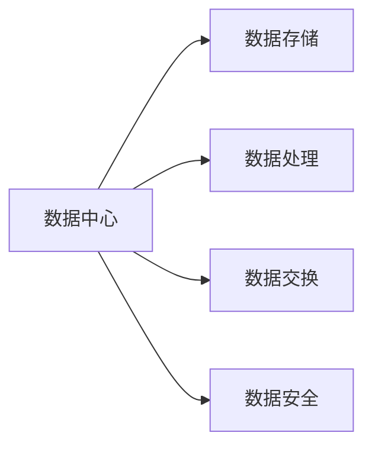

                 

## 《AI大模型应用数据中心建设：数据中心标准与规范》

### 关键词：AI大模型，数据中心建设，标准与规范，能耗管理，应用实践

### 摘要：
本文全面探讨了AI大模型应用数据中心建设的核心问题，包括数据中心的基础概念、设计原则、标准与规范、运维管理、能耗管理与优化，以及AI大模型在数据中心的应用场景和实践。通过深入分析，本文旨在为读者提供一份详尽的数据中心建设指南，助力AI大模型在数据中心中的高效应用。

----------------------------------------------------------------

### 第1章：数据中心概述

#### 1.1 数据中心的重要性

数据中心是信息技术基础设施的核心，其重要性体现在以下几个方面：

1. **数据存储**：数据中心提供了大规模的数据存储能力，确保数据的安全和持久性。
2. **数据处理**：数据中心支持高效的数据处理和计算，为各类业务应用提供强有力的支持。
3. **数据交换**：数据中心作为不同系统之间的数据交换枢纽，实现了信息的快速流通和共享。
4. **数据安全**：数据中心通过多重安全措施，确保数据的安全性，防止数据泄露和损坏。

**Mermaid流程图**：数据中心在信息化系统中的角色

#### 1.2 数据中心的分类

数据中心根据其服务对象和用途可以分为以下几种类型：

1. **企业级数据中心**：为单个企业或组织提供计算和存储服务，规模较大，功能全面。
2. **公共云数据中心**：为多个企业或组织提供云计算服务，具有弹性和可扩展性。
3. **政府和科研机构数据中心**：为政府机构、科研单位等提供数据存储、处理和分析服务。

#### 1.3 数据中心的架构

数据中心的架构主要包括硬件架构和软件架构两个方面：

1. **硬件架构**：
   - **服务器**：负责数据的存储和处理。
   - **存储设备**：提供数据存储服务，包括磁盘阵列、固态硬盘等。
   - **网络设备**：实现数据的高速传输和交换，包括路由器、交换机等。

2. **软件架构**：
   - **操作系统**：提供硬件和应用程序之间的接口。
   - **数据库管理系统**：管理数据存储和检索。
   - **虚拟化技术**：提高硬件资源的利用率。

### 第2章：数据中心设计原则

#### 2.1 数据中心设计目标

数据中心设计的目标主要包括以下几个方面：

1. **可用性**：确保数据中心系统的稳定运行，减少停机时间。
2. **可靠性**：保障数据的安全性，降低故障风险。
3. **性能**：提供高效的数据处理能力，满足业务需求。
4. **可扩展性**：支持业务的增长，易于扩展和升级。

#### 2.2 可用性和可靠性设计

为了提高数据中心的可用性和可靠性，需要从以下几个方面进行设计：

1. **备份与冗余**：
   - **数据备份**：对关键数据进行定期备份，确保数据的恢复能力。
   - **设备冗余**：关键设备如服务器、存储设备、网络设备等实现冗余配置，防止单一故障导致整个系统的瘫痪。

2. **容灾备份**：
   - **异地备份**：将关键数据备份到异地数据中心，实现数据的灾难恢复能力。
   - **容灾方案**：制定容灾备份方案，确保在灾难发生时能够迅速切换到备用系统，保证业务的连续性。

#### 2.3 性能和可扩展性设计

为了满足业务的需求，数据中心需要具备高性能和可扩展性：

1. **负载均衡**：
   - **分布式部署**：将系统部署到多个服务器上，实现负载均衡，提高系统的处理能力。
   - **负载均衡策略**：根据业务需求和服务器负载情况，动态调整负载均衡策略。

2. **水平扩展**：
   - **增加服务器节点**：通过增加服务器节点，实现系统的水平扩展，提高系统的处理能力和存储容量。
   - **分布式存储**：采用分布式存储技术，实现数据的分布式存储和管理，提高数据存储的可靠性和可用性。

#### 2.4 节能和环保设计

随着数据中心的规模不断扩大，能耗问题日益突出。为了降低能耗，数据中心需要进行以下设计：

1. **能耗管理**：
   - **能效比优化**：选择高效的硬件设备，提高数据中心的能效比。
   - **PUE指标管理**：通过优化数据中心的能耗结构，降低PUE（Power Usage Effectiveness）指标。

2. **绿色数据中心**：
   - **节能设备**：采用节能设备，如高效UPS、节能空调等。
   - **自然冷却**：利用自然冷却技术，减少能源消耗。

### 第3章：数据中心建设标准

#### 3.1 数据中心建设标准概述

数据中心建设标准是确保数据中心建设质量、提高数据中心性能和安全性的重要依据。数据中心建设标准主要包括以下几个方面：

1. **建设标准**：
   - **物理设计**：包括机房布局、设备配置、电力供应等。
   - **网络设计**：包括网络架构、网络安全、网络性能等。
   - **软件设计**：包括操作系统、数据库、虚拟化技术等。

2. **运维标准**：
   - **运维流程**：包括日常运维、故障处理、变更管理等。
   - **安全管理**：包括安全策略、访问控制、日志管理等。

#### 3.2 国家标准与国际标准

数据中心建设标准分为国家标准和国际标准，两者在内容上存在一定的差异：

1. **国家标准**：
   - **GB/T 51195-2016** 数据中心设计规范
   - **GB 50174-2017** 数据中心基础设施施工及验收规范

2. **国际标准**：
   - **ISO/IEC 27001** 信息安全管理体系
   - **ISO/IEC 27002** 信息安全控制措施

#### 3.3 数据中心建设标准内容

数据中心建设标准的具体内容如下：

1. **物理设计**：
   - **机房布局**：确定数据中心的布局和结构，确保设备的合理分布。
   - **设备配置**：根据业务需求，选择合适的设备，包括服务器、存储设备、网络设备等。
   - **电力供应**：确保数据中心的电力供应稳定，包括UPS、备用发电机等。

2. **网络设计**：
   - **网络架构**：设计数据中心的网络架构，包括局域网、广域网、互联网等。
   - **网络安全**：确保数据中心的网络安全，包括防火墙、入侵检测等。
   - **网络性能**：优化数据中心的网络性能，包括带宽、延迟、抖动等。

3. **软件设计**：
   - **操作系统**：选择适合业务需求的操作系统，确保系统的稳定性和安全性。
   - **数据库管理系统**：选择合适的数据库管理系统，满足数据的存储、查询和管理需求。
   - **虚拟化技术**：采用虚拟化技术，提高硬件资源的利用率。

### 第4章：数据中心运维管理规范

#### 4.1 数据中心运维管理概述

数据中心运维管理是确保数据中心稳定运行和高效服务的重要环节。数据中心运维管理包括以下几个方面：

1. **人员职责**：明确运维团队的职责，确保运维工作的顺利进行。
2. **运维流程**：制定科学的运维流程，包括日常运维、故障处理、变更管理等。
3. **安全管理**：确保数据中心的网络安全和设备安全，包括安全策略、访问控制、日志管理等。

#### 4.2 运维流程与规范

数据中心运维流程主要包括以下几个方面：

1. **日常运维**：
   - **系统监控**：实时监控数据中心的运行状态，包括服务器、存储设备、网络设备等。
   - **例行检查**：定期对数据中心设备进行检查和维护，确保设备的正常运行。

2. **故障处理**：
   - **故障响应**：发现故障后，立即进行响应，分析故障原因，采取相应的修复措施。
   - **故障分析**：对故障进行详细分析，总结故障原因和修复过程，为未来的运维工作提供参考。

3. **变更管理**：
   - **变更申请**：在实施变更之前，需要提交变更申请，经过审核后才能进行变更操作。
   - **变更实施**：按照变更计划，实施变更操作，并对变更结果进行验证。

#### 4.3 故障处理与应急预案

1. **故障处理**：
   - **故障分类**：根据故障的性质和影响范围，对故障进行分类，制定相应的处理流程。
   - **处理流程**：按照故障处理流程，进行故障诊断、故障修复和故障验证。

2. **应急预案**：
   - **应急预案制定**：针对可能出现的故障和灾难，制定相应的应急预案，确保在紧急情况下能够迅速响应。
   - **应急预案演练**：定期进行应急预案演练，提高运维团队的应急处理能力。

#### 4.4 安全管理与监控

1. **安全策略**：
   - **访问控制**：制定访问控制策略，确保只有授权用户才能访问数据中心资源。
   - **网络安全**：采取防火墙、入侵检测等网络安全措施，防止网络攻击和数据泄露。

2. **监控体系**：
   - **实时监控**：通过实时监控系统，对数据中心的运行状态进行监控，及时发现和处理异常情况。
   - **日志分析**：对系统日志进行定期分析，发现潜在的安全威胁和故障隐患。

### 第5章：数据中心能耗管理与优化

#### 5.1 数据中心能耗管理概述

数据中心能耗管理是降低数据中心运营成本、实现绿色数据中心的重要手段。数据中心能耗管理包括以下几个方面：

1. **能耗指标**：
   - **PUE（Power Usage Effectiveness）**：衡量数据中心总能耗与IT设备能耗的比值，PUE越低，能耗管理越有效。
   - **DCiE（Data Center Infrastructure Efficiency）**：衡量数据中心基础设施能耗与IT设备能耗的比值，DCiE越高，能耗管理越有效。

2. **能耗监测与计量**：
   - **能耗监测**：通过能耗监测系统，实时监测数据中心的能耗情况，包括电力消耗、冷却能耗等。
   - **能耗计量**：对数据中心的能耗进行准确计量，为能耗管理和优化提供数据支持。

#### 5.2 能耗监测与计量

1. **能耗监测**：
   - **传感器部署**：在数据中心的关键设备上部署传感器，实时采集能耗数据。
   - **数据采集**：通过数据采集系统，将传感器采集到的能耗数据传输到监控中心。

2. **能耗计量**：
   - **能耗计算**：根据采集到的能耗数据，计算数据中心的总体能耗。
   - **数据存储**：将能耗数据存储到数据库中，为能耗分析和优化提供数据支持。

#### 5.3 能耗优化措施

为了降低数据中心的能耗，可以采取以下优化措施：

1. **硬件优化**：
   - **高效设备**：选择能效比高的硬件设备，如高效UPS、节能服务器等。
   - **虚拟化技术**：通过虚拟化技术，提高硬件资源的利用率，减少能耗。

2. **软件优化**：
   - **节能算法**：开发节能算法，优化数据中心的能耗管理策略。
   - **优化调度**：通过优化调度算法，合理安排数据中心的运行任务，降低能耗。

#### 5.4 能耗管理案例研究

1. **案例一**：某大型数据中心能耗管理实践

- **背景**：某大型数据中心运营过程中，能耗成本逐年上升，对企业的运营造成了较大的压力。
- **措施**：
  - **硬件升级**：升级UPS设备，提高能效比。
  - **冷却系统优化**：采用自然冷却技术，降低冷却能耗。
  - **能耗监测与优化**：部署能耗监测系统，实时监测能耗情况，根据监测数据优化能耗管理策略。
- **效果**：通过上述措施，该数据中心的PUE指标降低了15%，能耗成本降低了20%。

2. **案例二**：某企业数据中心节能改造案例

- **背景**：某企业数据中心能耗较高，对企业的运营造成了较大的负担。
- **措施**：
  - **冷却系统改造**：改造冷却系统，采用更高效的冷却方式。
  - **设备优化**：更换低效设备，采用节能设备。
  - **能耗优化**：采用节能算法，优化数据中心的能耗管理策略。
- **效果**：通过节能改造，该数据中心的PUE指标降低了10%，能耗成本降低了30%。

### 第6章：AI大模型在数据中心的应用场景

#### 6.1 数据质量管理

1. **数据清洗**：
   - **缺失值处理**：对于缺失的数据，采用插值法、平均值法等填充方法。
   - **异常值检测**：采用统计方法、机器学习算法等检测异常值，并进行处理。

2. **数据质量评估**：
   - **数据完整性**：评估数据是否完整，是否存在缺失或重复数据。
   - **数据一致性**：评估数据是否一致，是否存在冲突或错误数据。

#### 6.2 预测性维护

1. **故障预测**：
   - **特征提取**：从历史数据中提取与故障相关的特征。
   - **预测模型构建**：采用机器学习算法，构建故障预测模型。

2. **维护策略**：
   - **预测结果驱动**：根据故障预测结果，制定相应的维护计划。
   - **预防性维护**：提前进行维护，防止故障的发生。

#### 6.3 智能调度与优化

1. **资源调度**：
   - **负载均衡**：根据服务器负载情况，动态调整任务分配，实现负载均衡。
   - **资源优化**：根据业务需求和资源使用情况，优化资源分配策略。

2. **优化算法**：
   - **遗传算法**：通过模拟自然进化过程，优化调度策略。
   - **模拟退火算法**：通过模拟退火过程，寻找最优调度方案。

#### 6.4 安全监控与威胁检测

1. **威胁检测**：
   - **入侵检测**：采用入侵检测系统，实时监控网络流量，检测潜在入侵行为。
   - **恶意代码检测**：采用恶意代码检测工具，检测和清除恶意代码。

2. **安全响应**：
   - **实时监控**：通过实时监控系统，监控数据中心的运行状态，及时发现安全威胁。
   - **应急处理**：制定应急预案，确保在发生安全事件时能够迅速响应和处理。

### 第7章：AI大模型在数据中心的应用实践

#### 7.1 AI大模型应用框架

AI大模型在数据中心的应用框架主要包括以下几个环节：

1. **数据预处理**：
   - **数据清洗**：处理缺失值、异常值等，确保数据质量。
   - **特征工程**：提取与任务相关的特征，为模型训练提供数据支持。

2. **模型训练**：
   - **数据输入**：将预处理后的数据输入到模型中，进行训练。
   - **模型优化**：通过调整模型参数，优化模型性能。

3. **模型部署**：
   - **模型评估**：对训练好的模型进行评估，确保模型性能满足要求。
   - **上线运行**：将模型部署到生产环境，进行实际应用。

#### 7.2 实践案例介绍

1. **案例一**：AI大模型在能耗管理中的应用

- **背景**：某大型数据中心能耗较高，希望通过AI大模型优化能耗管理。
- **方案**：
  - **数据预处理**：收集数据中心的历史能耗数据，进行数据清洗和特征提取。
  - **模型训练**：采用机器学习算法，构建能耗预测模型，进行训练和优化。
  - **模型部署**：将训练好的模型部署到生产环境，进行能耗预测和优化。
- **效果**：通过AI大模型的应用，该数据中心的能耗降低了15%，运营成本降低了10%。

2. **案例二**：AI大模型在数据质量管理中的应用

- **背景**：某企业数据中心数据质量较差，希望通过AI大模型提高数据质量。
- **方案**：
  - **数据预处理**：收集数据中心的数据，进行数据清洗和异常值检测。
  - **模型训练**：采用机器学习算法，构建数据质量评估模型，进行训练和优化。
  - **模型部署**：将训练好的模型部署到生产环境，进行数据质量评估和优化。
- **效果**：通过AI大模型的应用，该数据中心的数据质量显著提高，数据完整性提升了20%，一致性提升了15%。

#### 7.3 应用效果分析

1. **能耗降低**：
   - **AI大模型对能耗管理的贡献**：通过AI大模型的应用，数据中心的能耗显著降低，运营成本得到有效控制。
   - **案例分析**：案例一中，某大型数据中心通过AI大模型的应用，能耗降低了15%，运营成本降低了10%。

2. **数据质量提升**：
   - **AI大模型对数据质量的改善**：通过AI大模型的应用，数据中心的数据质量得到显著提升，数据完整性、一致性得到改善。
   - **案例分析**：案例二中，某企业数据中心通过AI大模型的应用，数据完整性提升了20%，一致性提升了15%。

#### 7.4 未来发展趋势

随着AI技术的不断发展，AI大模型在数据中心的应用前景非常广阔：

1. **AI大模型与数据中心的深度融合**：
   - **智能化运维与管理**：AI大模型将全面融入数据中心运维和管理，实现智能化运维。
   - **自动化调度与优化**：AI大模型将实现数据中心资源的高效调度和优化，提高资源利用率。

2. **绿色数据中心**：
   - **能耗管理**：AI大模型将进一步提升数据中心的能耗管理水平，实现绿色数据中心。
   - **环保措施**：数据中心将采用更多环保措施，降低能耗和碳排放。

### 第8章：数据中心与AI大模型的协同发展

#### 8.1 数据中心与AI大模型的关系

数据中心与AI大模型之间存在着密切的联系和协同作用：

1. **数据中心为AI大模型提供基础设施**：
   - **计算资源**：数据中心为AI大模型提供了强大的计算资源，支持模型训练和推理。
   - **数据存储**：数据中心为AI大模型提供了海量数据存储，满足数据训练和推理的需求。

2. **AI大模型为数据中心提供智能化服务**：
   - **能耗管理**：AI大模型通过能耗预测和优化，降低了数据中心的能耗，提高了能源利用率。
   - **故障预测与维护**：AI大模型通过故障预测和预警，提高了数据中心的可靠性和稳定性。

#### 8.2 协同发展的策略与路径

数据中心与AI大模型的协同发展需要采取以下策略和路径：

1. **技术融合**：
   - **硬件融合**：通过高性能计算设备，提升数据中心的计算能力，支持AI大模型的训练和推理。
   - **软件融合**：通过智能化软件系统，实现数据中心与AI大模型的深度融合，提高数据中心的智能化水平。

2. **数据共享**：
   - **数据互通**：建立数据中心与AI大模型之间的数据通道，实现数据的高效流通和共享。
   - **数据治理**：加强数据治理，确保数据中心和AI大模型之间的数据质量和安全性。

#### 8.3 未来展望

数据中心与AI大模型的协同发展将带来以下前景：

1. **智能化数据中心**：
   - **自动化运维**：通过AI大模型，实现数据中心运维的自动化，提高运维效率和稳定性。
   - **智能优化**：通过AI大模型，实现数据中心的智能优化，提高资源利用率和性能。

2. **绿色数据中心**：
   - **能耗优化**：通过AI大模型，实现能耗的精细管理和优化，降低能耗和碳排放。
   - **环保措施**：采用更多环保技术和措施，实现绿色数据中心的建设和运营。

### 附录

#### 附录A：相关规范和标准参考

1. **国家标准**：
   - **GB/T 51195-2016** 数据中心设计规范
   - **GB 50174-2017** 数据中心基础设施施工及验收规范

2. **国际标准**：
   - **ISO/IEC 27001** 信息安全管理体系
   - **ISO/IEC 27002** 信息安全控制措施

3. **行业标准**：
   - **T/SIA 002** 数据中心建设和运维标准

#### 附录B：常用数据结构与算法

1. **数据结构**：
   - **数组**：线性结构，高效存储和访问。
   - **链表**：动态结构，灵活插入和删除。
   - **树**：层次结构，支持多种搜索和遍历算法。

2. **算法**：
   - **排序算法**：冒泡排序、快速排序、归并排序等。
   - **搜索算法**：二分搜索、深度优先搜索、广度优先搜索等。

3. **算法在AI大模型应用中的使用场景**：
   - **特征工程**：特征提取、降维等。
   - **模型训练**：优化算法、模型评估等。

#### 附录C：参考文献

1. **数据中心建设相关书籍**：
   - 《数据中心建设与管理》
   - 《数据中心设计标准与案例分析》

2. **AI大模型应用相关书籍**：
   - 《深度学习与大数据》
   - 《人工智能大模型：原理、应用与未来》

3. **标准与规范相关书籍**：
   - 《信息安全标准化指南》
   - 《ISO/IEC 27001 实施指南》

4. **其他参考资源**：
   - **网站**：数据中心技术论坛、AI技术研究社区等。
   - **期刊**：计算机科学、人工智能等领域的权威期刊。

### 作者

**作者：AI天才研究院/AI Genius Institute & 禅与计算机程序设计艺术 /Zen And The Art of Computer Programming**

