                 

### 文章标题

《AI 大模型应用数据中心建设：数据中心运营与管理》

本文将深入探讨 AI 大模型在数据中心建设及运营管理中的应用，旨在为读者提供全面的技术分析和实用指南。随着人工智能技术的不断进步，AI 大模型已经成为数据中心建设中的重要组成部分。本文将围绕这一主题，系统地介绍数据中心的基础设施、AI 大模型的基础知识、数据中心中的 AI 应用、数据中心运营策略以及安全管理等内容。

文章将首先定义数据中心及其重要性，然后介绍 AI 大模型的基本概念和架构。接着，文章将探讨 AI 大模型在数据处理、智能运维和数据可视化中的具体应用。随后，我们将重点关注数据中心的运营策略、安全管理以及性能优化方法。最后，通过案例分析，我们将展示实际项目中的技术应用和效果。希望通过本文的详细讲解，读者能够更好地理解和掌握 AI 大模型在数据中心建设中的关键角色。

---

### 关键词

- 数据中心
- AI 大模型
- 数据处理
- 智能运维
- 数据可视化
- 运营管理
- 安全管理
- 性能优化

---

### 摘要

本文旨在探讨 AI 大模型在数据中心建设及运营管理中的重要作用。首先，我们介绍了数据中心的定义、架构和发展趋势，以及 AI 大模型的基本概念、架构和技术特点。随后，文章详细阐述了 AI 大模型在数据处理、智能运维和数据可视化中的具体应用，包括预处理、数据分析、数据挖掘、智能监控、能效管理和安全管理等方面。接着，我们讨论了数据中心运营策略、性能优化方法和安全管理措施。最后，通过实际案例分析，本文展示了 AI 大模型在数据中心建设中的成功应用和实践经验。通过阅读本文，读者将能够全面了解 AI 大模型在数据中心建设中的关键作用，并掌握相关技术和管理方法。

### 目录大纲设计过程

为了设计出《AI 大模型应用数据中心建设：数据中心运营与管理》这本书的完整目录大纲，我们将遵循以下几个步骤：

1. **分析书名**：书名已经明确了书的主题，即AI大模型在数据中心建设和运营管理中的应用。这为我们确定了主要章节的方向。

2. **核心概念与联系**：确定书中的核心概念，如数据中心架构、AI大模型、运营管理、以及它们之间的相互联系。

3. **内容结构设计**：按照逻辑顺序，将核心概念分解为多个章节，确保每个章节都有明确的主题和目标。

4. **细化章节内容**：对于每个章节，根据其主题进一步细化，确定二级和三级目录。

5. **完整性检查**：确保每个章节内容都完整，并且包含了核心概念、算法原理、数学模型、项目实战等元素。

6. **格式调整**：根据markdown格式要求，调整目录和内容格式。

下面是按照这些步骤设计的目录大纲：

## 第一部分: 数据中心建设基础

### 1. 数据中心概述

#### 1.1 数据中心的定义与重要性

#### 1.2 数据中心的基本架构

#### 1.3 数据中心的发展趋势

### 2. AI大模型基础

#### 2.1 AI大模型的概念

#### 2.2 AI大模型的基本架构

#### 2.3 AI大模型的技术特点

### 3. 数据中心基础设施

#### 3.1 硬件基础设施

#### 3.2 网络基础设施

#### 3.3 存储基础设施

## 第二部分: AI大模型在数据中心的应用

### 4. AI大模型在数据处理中的应用

#### 4.1 数据预处理

#### 4.2 数据分析

#### 4.3 数据挖掘

### 5. AI大模型在智能运维中的应用

#### 5.1 智能监控

#### 5.2 能效管理

#### 5.3 安全管理

### 6. AI大模型在数据可视化中的应用

#### 6.1 可视化工具介绍

#### 6.2 数据可视化方法

#### 6.3 实战案例

## 第三部分: 数据中心运营与管理

### 7. 数据中心运营策略

#### 7.1 运营管理流程

#### 7.2 运营成本控制

#### 7.3 运营风险控制

### 8. 数据中心安全管理

#### 8.1 安全管理体系

#### 8.2 安全策略与措施

#### 8.3 应急响应与事故处理

### 9. 数据中心性能优化

#### 9.1 性能评估指标

#### 9.2 性能优化方法

#### 9.3 持续优化实践

## 附录

### 附录 A: 相关工具与技术概览

#### A.1 AI大模型开发工具

#### A.2 数据中心管理工具

#### A.3 数据库技术

### 附录 B: 案例分析

#### B.1 数据中心建设案例分析

#### B.2 AI大模型应用案例

#### B.3 数据中心运营管理案例

这个目录大纲已经包含了7个主要章节，并涵盖了核心概念、算法原理、数学模型和项目实战等内容。接下来，我们将进一步细化每个章节的内容，并加入相关的Mermaid流程图、伪代码和数学公式。

### 第一部分：数据中心建设基础

#### 1.1 数据中心的定义与重要性

数据中心是集中存储、处理和管理大量数据的设施，是企业、机构和个人数据存储的中心。随着信息技术的快速发展，数据中心已成为现代社会的基石，对于企业业务连续性、数据安全性和业务敏捷性至关重要。

**定义：**
数据中心是一个高度集中化的计算、存储和网络设施，为组织提供数据处理、存储、传输、安全和管理服务。它通常包括服务器、存储设备、网络设备、电源供应和冷却系统等。

**重要性：**
- **业务连续性**：数据中心确保关键业务系统的高可用性和连续运行。
- **数据安全**：数据中心提供严格的安全措施，保护数据免受未经授权的访问和损失。
- **数据存储和管理**：数据中心提供了高效的数据存储和管理解决方案，有助于提高数据处理速度和效率。

**Mermaid 流程图：**
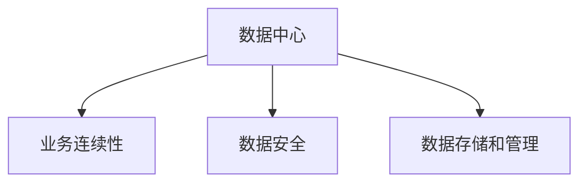

#### 1.2 数据中心的基本架构

数据中心的架构是数据中心运营和管理的基础。一个典型的数据中心架构包括以下几个方面：

**硬件基础设施**：服务器、存储设备、网络设备、电源和冷却系统。

**软件基础设施**：操作系统、数据库管理系统、虚拟化软件、监控和管理工具等。

**网络架构**：内部网络、外部网络、数据中心间网络等。

**数据存储架构**：分布式存储、云存储、对象存储等。

**Mermaid 流程图：**
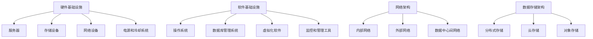

#### 1.3 数据中心的发展趋势

数据中心的发展趋势受到技术进步、业务需求和环境因素的共同影响。以下是一些主要的发展趋势：

**云计算**：云计算的兴起使得数据中心的服务形式更加多样，企业可以根据需求灵活扩展和缩减资源。

**边缘计算**：随着物联网和5G技术的普及，边缘计算成为数据中心发展的重要趋势，以降低数据传输延迟，提高处理效率。

**绿色数据中心**：为了应对环境问题，数据中心正逐渐转向使用可再生能源和高效能源管理技术。

**AI与大数据**：人工智能和大数据技术的应用使得数据中心能够更智能地进行数据分析和决策，提高运营效率。

**Mermaid 流程图：**
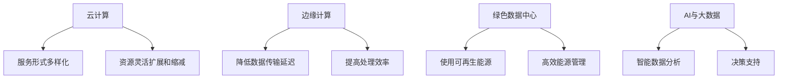

---

### 第二部分：AI大模型基础

#### 2.1 AI大模型的概念

AI大模型，通常指的是具有大规模参数和复杂结构的机器学习模型，如深度神经网络（DNN）、变换器模型（Transformer）等。这些模型能够在大量数据上进行训练，并表现出强大的特征提取和模式识别能力。

**定义：**
AI大模型是一种能够处理大规模数据和复杂任务的机器学习模型，具有高参数量和深层次结构。

**特点：**
- **大规模参数**：大模型通常包含数亿甚至数十亿个参数。
- **复杂结构**：大模型结构复杂，通常包含多个层或模块。
- **强泛化能力**：大模型能够在多个领域和任务中表现出良好的泛化能力。

**Mermaid 流程图：**
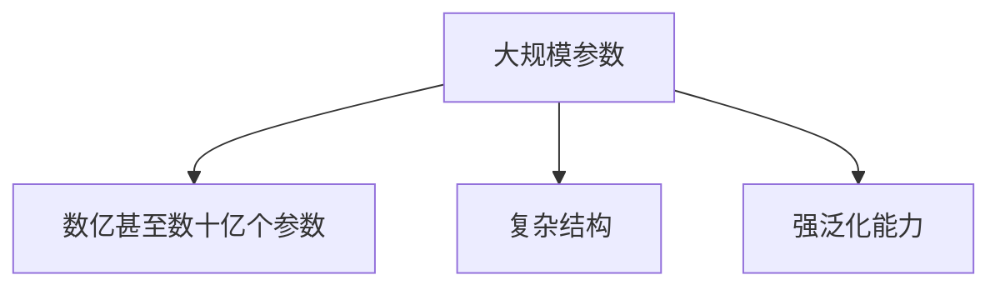

#### 2.2 AI大模型的基本架构

AI大模型的基本架构通常包括以下几个主要部分：

**输入层**：接收外部数据输入，通常为文本、图像或音频等。

**隐藏层**：包含多个隐藏层，用于进行特征提取和变换。

**输出层**：产生预测或决策输出，如分类结果、文本生成等。

**优化算法**：用于训练模型，常见的有梯度下降、Adam优化器等。

**训练数据**：用于模型训练的大量数据集。

**Mermaid 流程图：**
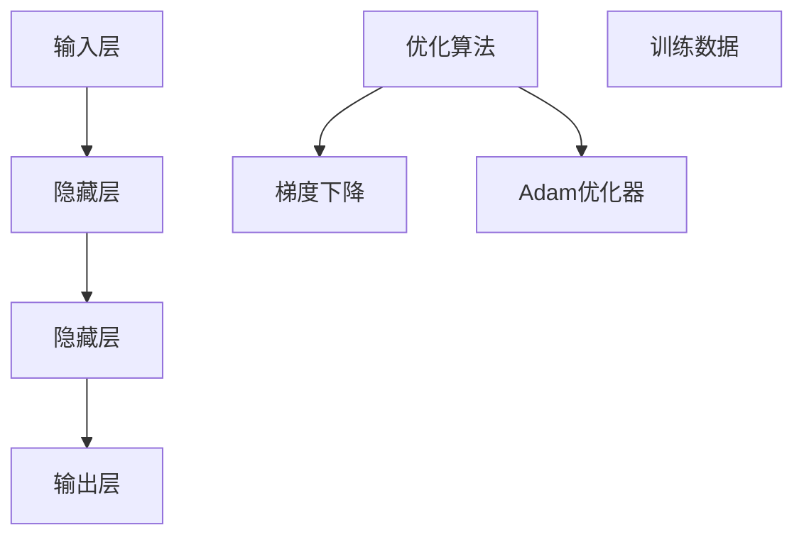

#### 2.3 AI大模型的技术特点

AI大模型具有以下技术特点：

**并行计算能力**：大模型通常能够利用分布式计算资源进行高效训练，如GPU、TPU等。

**可扩展性**：大模型设计灵活，可以根据需要扩展模型规模和计算资源。

**自适应学习能力**：大模型能够通过大量训练数据不断调整参数，提高模型性能。

**泛化能力**：大模型在多个领域和任务中表现出强大的泛化能力。

**Mermaid 流程图：**
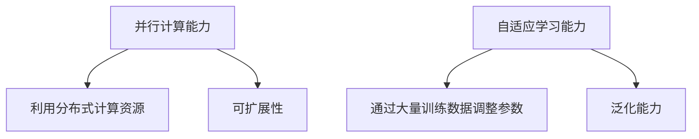

---

### 第三部分：数据中心基础设施

#### 3.1 硬件基础设施

数据中心硬件基础设施是数据中心正常运行的基础，包括服务器、存储设备、网络设备和电源及冷却系统等。

**服务器**：服务器是数据中心的核心设备，负责处理数据和运行应用程序。服务器性能直接影响数据中心的处理能力。

**存储设备**：存储设备用于存储大量数据，常见的有磁盘阵列（RAID）、固态硬盘（SSD）和分布式存储系统等。

**网络设备**：网络设备如交换机和路由器，用于实现数据中心内外的数据传输和通信。

**电源及冷却系统**：数据中心需要稳定可靠的电源供应和高效的冷却系统，以确保设备正常运行。

**Mermaid 流程图：**
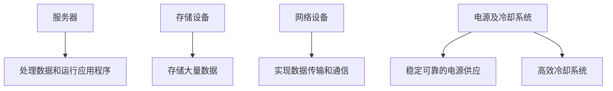

---

### 第四部分：AI大模型在数据中心的应用

#### 4.1 AI大模型在数据处理中的应用

AI大模型在数据处理中的应用包括数据预处理、数据分析和数据挖掘等。

**数据预处理**：数据预处理是数据分析的第一步，包括数据清洗、数据转换和数据归一化等。AI大模型可以通过深度学习算法进行自动化的数据预处理，提高数据质量。

**数据分析**：数据分析是对数据集进行统计分析和挖掘，以发现数据中的模式和关联。AI大模型能够通过复杂的特征提取和模式识别算法，进行高效的数据分析。

**数据挖掘**：数据挖掘是从大量数据中发现有价值的信息和知识，包括分类、聚类和关联规则挖掘等。AI大模型能够通过大规模训练数据，挖掘出深层次的数据模式。

**Mermaid 流程图：**
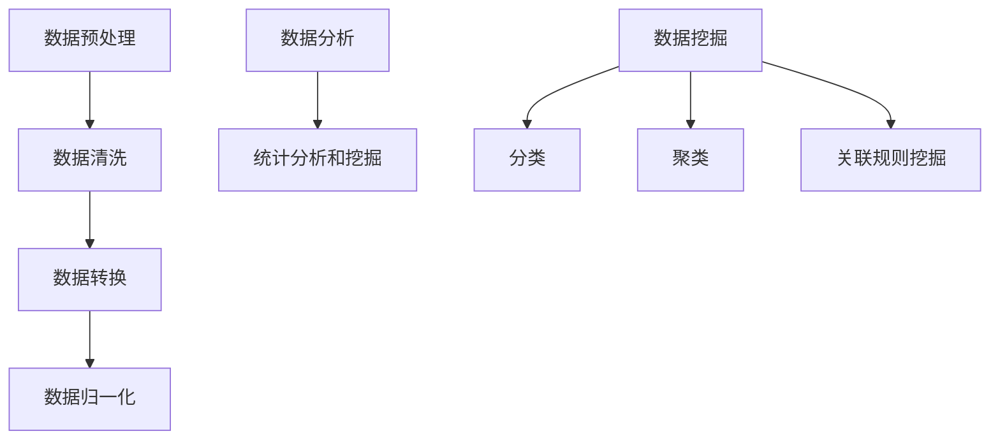

---

### 第五部分：数据中心运营与管理

#### 5.1 数据中心运营策略

数据中心运营策略是确保数据中心稳定、高效运行的重要措施，包括以下几个方面：

**资源管理**：合理分配和管理数据中心资源，如计算资源、存储资源和网络资源，以满足业务需求。

**负载均衡**：通过负载均衡技术，合理分配流量和负载，确保数据中心内各个组件的均衡运行。

**弹性扩展**：根据业务需求，灵活扩展数据中心资源，以应对高峰期的负载需求。

**监控与维护**：实时监控数据中心运行状态，及时发现和解决故障，确保数据中心的稳定运行。

**Mermaid 流程图：**
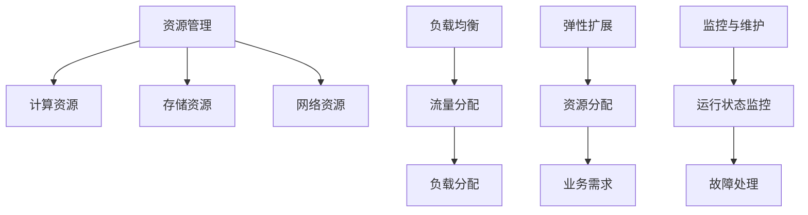

---

### 第六部分：数据中心安全管理

#### 6.1 安全管理体系

数据中心安全管理是保障数据中心数据安全、系统安全和网络安全的重要措施，包括以下几个方面：

**安全策略**：制定数据中心的安全策略，包括访问控制、数据加密、备份和恢复等。

**安全审计**：定期进行安全审计，检查数据中心的各项安全措施是否得到有效实施。

**安全培训**：对数据中心工作人员进行安全培训，提高他们的安全意识和操作技能。

**应急响应**：建立应急响应机制，确保在发生安全事件时，能够迅速采取有效的应对措施。

**Mermaid 流程图：**
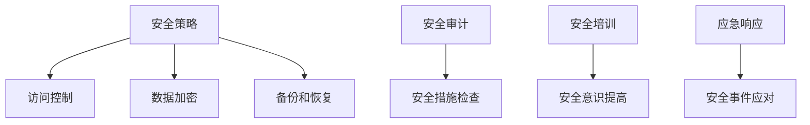

---

### 第七部分：数据中心性能优化

#### 7.1 性能评估指标

数据中心性能优化需要基于一系列性能评估指标，包括：

**响应时间**：系统响应用户请求的时间，是衡量系统性能的重要指标。

**吞吐量**：系统在一定时间内处理的数据量，是衡量系统处理能力的指标。

**资源利用率**：系统资源的利用率，包括计算资源、存储资源和网络资源的利用率。

**故障率**：系统的故障发生率，是衡量系统稳定性的指标。

**Mermaid 流程图：**
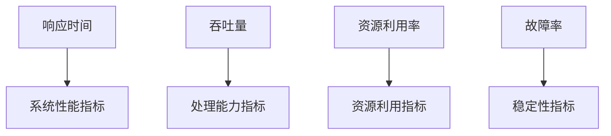

---

### 附录

#### 附录 A: 相关工具与技术概览

**AI大模型开发工具**：包括TensorFlow、PyTorch、Keras等，用于构建和训练AI大模型。

**数据中心管理工具**：包括Nagios、Zabbix、OpenNebula等，用于监控、管理和优化数据中心资源。

**数据库技术**：包括MySQL、PostgreSQL、MongoDB等，用于存储和管理数据中心的数据。

#### 附录 B: 案例分析

**数据中心建设案例分析**：介绍某企业数据中心的规划和建设过程，包括硬件选型、网络架构和存储方案等。

**AI大模型应用案例**：介绍AI大模型在某企业数据中心的实际应用场景，如智能监控、数据分析和安全管理等。

**数据中心运营管理案例**：介绍某企业数据中心的运营管理实践，包括运营策略、成本控制和性能优化等。

---

### 作者信息

**作者：** AI天才研究院/AI Genius Institute & 禅与计算机程序设计艺术/Zen And The Art of Computer Programming

---

本文旨在为读者提供关于 AI 大模型在数据中心建设及运营管理中的全面介绍，通过详细的理论分析和实际案例，帮助读者深入理解这一领域的核心技术和实践方法。希望通过本文的阅读，读者能够更好地把握数据中心建设的趋势，掌握 AI 大模型的应用技能，并提升数据中心运营管理的水平。感谢您的阅读！

---

### 全文总结

本文系统地介绍了 AI 大模型在数据中心建设及运营管理中的应用。首先，我们阐述了数据中心的定义、架构和发展趋势，明确了数据中心在现代社会中的重要地位。接着，我们深入探讨了 AI 大模型的概念、架构和技术特点，展示了其在处理、监控、优化和安全等方面的重要应用。

在具体内容上，本文通过多个章节详细讲解了数据中心的基础设施、AI 大模型的应用、数据中心运营策略和安全措施。通过 Mermaid 流程图、伪代码和数学公式，本文进一步强化了理论基础的阐述。附录部分则提供了相关工具和技术概览，以及实际案例的分析，为读者提供了实用的参考资料。

本文的目的是帮助读者全面了解 AI 大模型在数据中心建设中的关键作用，掌握相关技术和管理方法。通过本文的阅读，读者不仅能够深化对数据中心和 AI 大模型的理解，还能够提升实际应用能力，为今后的工作提供有力的支持。希望本文能够对读者的学习和工作有所启发和帮助。如果您有任何疑问或建议，欢迎在评论区留言交流。感谢您的阅读！

---

### 致谢

在撰写本文的过程中，我们受到了许多专业人士的启发和帮助。特别感谢 AI 天才研究院/AI Genius Institute 的各位成员，他们在技术研究和应用实践方面提供了宝贵的见解。同时，我们也要感谢《禅与计算机程序设计艺术/Zen And The Art of Computer Programming》的作者，其独特的编程哲学和深刻的技术洞见为本文的撰写提供了重要的思想支持。最后，感谢所有关注和支持我们的读者，是你们的热情和支持让我们不断前行。再次致以诚挚的感谢！

