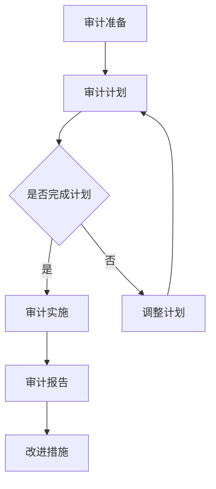

                 

### 《AI 大模型应用数据中心的审计管理》

#### 关键词：
AI 大模型，数据中心审计，管理，标准，法规，性能评估，安全，效率，合规性，实践

#### 摘要：
本文深入探讨 AI 大模型应用数据中心的审计管理，阐述其核心概念、重要性及发展背景。文章从数据中心审计标准与法规、审计过程与管理、AI 大模型应用审计、审计报告与改进措施、审计管理实践等多个方面进行全面分析，结合实际项目案例，为数据中心的安全、合规和效率提供全面的技术指导。

### 《AI 大模型应用数据中心的审计管理》目录大纲

#### 第一部分：引言与概述

1. **AI 大模型应用数据中心审计管理概述**
   - 1.1 AI 大模型应用数据中心的发展背景
   - 1.2 数据中心审计管理的核心概念
   - 1.3 AI 大模型应用数据中心审计的重要性

2. **数据中心审计标准与法规**
   - 2.1 国际和国内数据中心审计标准
   - 2.2 AI 大模型应用数据中心审计的关键法规
   - 2.3 数据中心审计法规遵守的挑战与策略

#### 第二部分：数据中心审计过程与管理

1. **数据中心审计准备**
   - 3.1 数据中心审计的目标与范围
   - 3.2 数据中心审计计划制定
   - 3.3 数据中心审计团队组织与培训

2. **数据中心审计核心环节**
   - 4.1 数据中心物理基础设施审计
   - 4.2 数据中心网络与安全审计
   - 4.3 数据中心运维管理审计
   - 4.4 数据中心能源效率审计

3. **AI 大模型应用审计**
   - 5.1 AI 大模型应用审计概述
   - 5.2 AI 大模型应用审计流程
   - 5.3 AI 大模型应用审计案例分析

4. **数据中心审计报告与改进措施**
   - 6.1 数据中心审计报告撰写
   - 6.2 数据中心审计结果分析
   - 6.3 数据中心改进措施与建议

5. **AI 大模型应用数据中心审计管理实践**
   - 7.1 数据中心审计管理最佳实践
   - 7.2 数据中心审计管理工具与技术
   - 7.3 数据中心审计管理未来趋势展望

#### 第三部分：附录与参考资料

- 附录A：数据中心审计管理常用工具
- 附录B：数据中心审计管理相关法规与标准
- 参考文献

---

### 第一部分：引言与概述

#### 1.1 AI 大模型应用数据中心的发展背景

随着人工智能技术的迅猛发展，AI 大模型（如深度学习模型、生成对抗网络（GANs）等）在各个领域得到了广泛应用。从自然语言处理到图像识别，再到自动驾驶，AI 大模型正逐步改变我们的工作和生活方式。然而，随着 AI 大模型的广泛应用，其背后的数据中心也日益成为关注的焦点。

数据中心作为存储、处理和传输大量数据的核心设施，承载着 AI 大模型的运算需求。这些数据中心不仅需要具备强大的计算能力，还需要确保数据的安全、合规和高效运行。因此，对 AI 大模型应用数据中心进行审计管理变得尤为重要。

近年来，数据中心的发展呈现出以下几个趋势：

1. **规模不断扩大**：随着企业对 AI 大模型的需求增加，数据中心的规模也在不断扩大。大型数据中心集群成为主流，以满足更高的计算需求和存储容量。

2. **云计算与大数据的结合**：云计算和大数据技术的成熟，使得数据中心不仅承担传统的数据存储和计算任务，还成为大数据处理和分析的重要场所。

3. **绿色数据中心**：能源消耗和碳排放问题引起了广泛关注。绿色数据中心通过采用高效的硬件、智能节能技术和可再生能源，努力降低环境影响。

4. **自动化与智能化**：随着人工智能技术的发展，数据中心的自动化和智能化水平不断提高。自动化运维、智能监控和优化管理成为数据中心发展的新趋势。

#### 1.2 数据中心审计管理的核心概念

数据中心审计管理是指对数据中心的各个方面进行审查、评估和改进，以确保其安全、合规和高效运行。核心概念包括：

1. **审计**：审计是指对数据中心的各项操作、流程和系统进行审查和评估，以发现潜在的问题和风险。

2. **管理**：管理是指对数据中心的资源、流程和系统进行优化和改进，以提高数据中心的性能和效率。

3. **安全性**：安全性是指确保数据中心的数据、系统和基础设施不受恶意攻击、数据泄露和系统故障的影响。

4. **合规性**：合规性是指数据中心符合相关法律法规和行业标准，确保其运营合法、合规。

5. **效率**：效率是指数据中心在满足性能要求的前提下，尽量减少资源消耗和能源浪费。

#### 1.3 AI 大模型应用数据中心审计的重要性

对 AI 大模型应用数据中心进行审计管理的重要性体现在以下几个方面：

1. **保障数据安全**：数据中心存储和处理大量敏感数据，包括个人隐私数据、企业核心数据等。通过审计可以发现潜在的安全隐患，采取措施防止数据泄露和恶意攻击。

2. **提高合规性**：数据中心需要遵守各种法律法规和行业标准，如 GDPR、ISO/IEC 27001 等。通过审计可以确保数据中心符合相关要求，避免法律风险。

3. **优化运营效率**：审计可以帮助数据中心识别和解决运营中的问题，提高资源利用率和运行效率，降低运营成本。

4. **提升服务质量**：通过审计可以评估数据中心的服务质量，发现不足之处并采取措施改进，提高用户满意度。

5. **增强竞争力**：具备良好的数据中心审计管理能力，可以提升企业在市场竞争中的地位，增强企业的核心竞争力。

#### 1.4 数据中心审计管理的基本原则

数据中心审计管理应遵循以下基本原则：

1. **全面性**：审计应覆盖数据中心的各个方面，包括硬件设施、网络系统、安全防护、运维管理等。

2. **客观性**：审计应基于客观事实和数据，避免主观偏见和人为干预。

3. **持续性**：审计不是一次性的活动，而是一个持续的过程。数据中心应定期进行审计，确保其持续符合安全、合规和效率要求。

4. **改进性**：审计的目的是发现问题和风险，并提出改进措施。数据中心应积极采纳审计建议，持续改进管理水平和运营效率。

5. **责任性**：数据中心的管理者和员工应承担审计管理责任，确保审计工作的有效执行和改进措施的落实。

---

在本部分，我们介绍了 AI 大模型应用数据中心的发展背景、数据中心审计管理的核心概念以及审计管理的重要性。接下来，我们将详细探讨数据中心审计标准与法规，以及国际和国内数据中心审计标准的比较。

### 第二部分：数据中心审计标准与法规

#### 2.1 国际和国内数据中心审计标准

数据中心审计标准是确保数据中心安全、合规和高效运行的重要依据。国际和国内均有一系列相关的标准，以下将分别介绍。

##### 国际数据中心审计标准

1. **ISO/IEC 27001**：国际标准化组织（ISO）和国际电工委员会（IEC）共同发布的 ISO/IEC 27001 标准是信息安全管理的基石。该标准规定了建立、实施、维护和持续改进信息安全管理体系（ISMS）的要求，适用于各种类型和规模的组织，包括数据中心。

2. **ISO/IEC 27017**：该标准专门针对云计算环境的信息安全管理，提供了云计算服务提供商和客户之间的信息安全要求和指南。

3. **ISO/IEC 27032**：该标准关注网络和信息安全，提供了针对不同网络威胁的防范和控制措施。

4. **NIST SP 800-53**：美国国家标准与技术研究院（NIST）发布的 NIST SP 800-53 标准是一套全面的信息安全管理框架，包括控制目标和实施指南，适用于数据中心的安全管理。

##### 国内数据中心审计标准

1. **GB/T 22080-2016**：这是我国发布的符合 ISO/IEC 27001 标准的信息安全管理体系标准，适用于建立信息安全管理体系。

2. **GB/T 31877-2015**：这是关于云计算服务安全的标准，规定了云计算服务提供者应遵循的安全要求和措施。

3. **YD/T 2446-2017**：这是关于数据中心设施建设的标准，涵盖了数据中心的设计、建设、运行和维护等方面的要求。

4. **T/CCSA 1208-2015**：这是关于数据中心能耗监测与管理系统标准，规定了数据中心能耗监测和管理系统的要求。

##### 国际和国内数据中心审计标准的比较

虽然国际和国内数据中心审计标准在整体框架上相似，但仍然存在一些差异：

1. **适用范围**：国际标准更注重通用性，适用于全球范围内的组织。而国内标准则更注重本土化，针对我国的具体环境和需求进行规定。

2. **具体要求**：国际标准提供了较为详细的控制目标和实施指南，但国内标准在某些特定领域（如能耗监测）有更为具体的要求。

3. **法规层面**：国际标准主要作为推荐性标准，而国内标准部分作为强制性标准，要求在特定领域内必须遵守。

4. **更新速度**：国际标准更新速度较快，能够及时响应新兴技术和安全威胁。国内标准更新速度相对较慢，但近年来在信息安全领域也逐步加快。

#### 2.2 AI 大模型应用数据中心审计的关键法规

在 AI 大模型应用数据中心审计中，以下几个法规和标准是尤为关键的：

1. **《中华人民共和国网络安全法》**：该法律是我国网络安全的基本法，规定了网络运营者的网络安全责任和义务，包括数据安全、网络安全监测与预警等。

2. **《信息安全技术个人信息保护规范》**：该规范规定了个人信息保护的要求，适用于涉及个人信息的数据处理活动，对 AI 大模型应用数据中心尤为重要。

3. **《中华人民共和国数据安全法》**：该法律针对数据安全和保护进行了全面规定，对数据收集、存储、处理、传输等环节提出了明确要求，AI 大模型应用数据中心必须严格遵守。

4. **《中华人民共和国标准化法》**：该法律明确了标准制定的程序和要求，促进了标准化工作的健康发展，对数据中心审计标准的制定和实施起到了指导作用。

#### 2.3 数据中心审计法规遵守的挑战与策略

尽管数据中心审计标准与法规为数据中心的安全和合规提供了指导，但在实际遵守过程中仍面临以下挑战：

1. **法规更新速度慢**：随着技术的快速发展，现有法规可能无法及时应对新兴技术和安全威胁，导致数据中心在合规性方面存在一定滞后。

2. **合规成本高**：数据中心需要投入大量资源（如人力、技术和资金）进行审计和合规性评估，对中小型企业尤其是一个较大的负担。

3. **人才短缺**：具备数据中心审计和管理专业知识和技能的人才较为稀缺，影响了数据中心审计工作的质量和效率。

4. **技术复杂性**：AI 大模型应用数据中心涉及多种技术和系统，审计过程中需要深入了解各种技术细节和系统架构，增加了审计的难度。

为了应对这些挑战，数据中心可以采取以下策略：

1. **建立合规培训机制**：定期组织合规培训，提高数据中心员工对法规和标准的认识和理解，确保全员参与合规工作。

2. **采用自动化工具**：利用自动化工具进行审计和合规性评估，降低人力成本，提高审计效率和准确性。

3. **构建标准化流程**：建立标准化审计流程，明确审计目标、范围和步骤，确保审计工作的系统性和规范性。

4. **加强合规性监控**：通过实时监控和数据分析，及时发现合规性问题，采取措施进行整改，确保数据中心持续合规。

5. **加强国际合作与交流**：积极参与国际标准制定和交流，借鉴国际先进经验，提高我国数据中心审计标准和法规的适应性。

---

在本部分，我们详细介绍了国际和国内数据中心审计标准，以及 AI 大模型应用数据中心审计的关键法规和遵守挑战及应对策略。接下来，我们将探讨数据中心审计准备的具体内容，包括审计目标与范围、审计计划制定和审计团队组织与培训。

### 第三部分：数据中心审计准备

#### 3.1 数据中心审计的目标与范围

数据中心审计的目标是确保数据中心的运行符合安全、合规和效率要求，具体包括以下几个方面：

1. **安全性**：评估数据中心的安全防护措施是否有效，防止数据泄露、恶意攻击和系统故障。

2. **合规性**：检查数据中心是否遵守相关法律法规和行业标准，确保数据中心的运营合法、合规。

3. **效率**：评估数据中心的资源利用率、运行效率和能源消耗，提出优化建议，提高数据中心的整体性能。

4. **可靠性**：评估数据中心的硬件设施、网络系统和运维流程，确保数据中心能够稳定运行，满足业务需求。

数据中心审计的范围通常包括以下几个方面：

1. **物理基础设施**：包括数据中心建筑、机房环境、电力供应、冷却系统等。

2. **网络系统**：包括数据中心内部网络架构、网络设备配置、网络安全策略等。

3. **安全防护**：包括数据加密、访问控制、入侵检测、安全审计等。

4. **运维管理**：包括数据中心运维流程、人员管理、文档管理等。

5. **合规性**：包括法律法规遵守情况、行业标准符合情况等。

#### 3.2 数据中心审计计划制定

制定数据中心审计计划是审计准备的关键步骤，以下是一些主要步骤：

1. **确定审计目标**：根据数据中心的具体情况，明确审计的目标和重点，确保审计计划具有针对性和实用性。

2. **确定审计范围**：根据审计目标，明确审计的范围，包括审计的具体内容、涉及的部门和系统等。

3. **制定审计时间表**：根据审计目标和范围，制定详细的审计时间表，包括审计准备、审计实施、审计报告和改进措施等时间节点。

4. **分配审计资源**：确定审计所需的人力、技术和资源，包括审计团队成员、审计工具和设备等。

5. **制定审计方法**：根据审计目标和范围，选择合适的审计方法，包括现场审计、远程审计、文档审查等。

6. **编写审计计划文档**：将上述内容整合成审计计划文档，确保审计计划清晰、完整和可执行。

#### 3.3 数据中心审计团队组织与培训

审计团队的组建和培训是数据中心审计成功的关键因素，以下是一些重要事项：

1. **团队组建**：根据审计计划，组建一支具有专业知识和丰富经验的审计团队，包括安全专家、网络工程师、运维人员等。

2. **职责分配**：明确审计团队成员的职责和任务，确保每位成员都清楚自己的工作内容和目标。

3. **培训与认证**：对审计团队成员进行专业培训，包括数据中心审计标准、法规、审计方法和工具等，确保团队成员具备必要的知识和技能。鼓励团队成员参加相关认证考试，提高专业水平。

4. **沟通与协作**：建立有效的沟通机制，确保审计团队成员之间的信息畅通和协作顺畅。

5. **持续改进**：审计结束后，对审计团队进行总结和评估，发现不足之处，制定改进措施，不断提高审计团队的整体素质和执行力。

---

在本部分，我们详细介绍了数据中心审计准备的具体内容，包括审计目标与范围、审计计划制定和审计团队组织与培训。接下来，我们将深入探讨数据中心审计核心环节，包括数据中心物理基础设施审计、数据中心网络与安全审计、数据中心运维管理审计和数据中心能源效率审计。

### 第四部分：数据中心审计核心环节

#### 4.1 数据中心物理基础设施审计

数据中心物理基础设施审计是数据中心审计的重要组成部分，旨在评估数据中心硬件设施的安全、可靠性和运行效率。以下是一些关键审计环节：

##### 4.1.1 硬件设施审计

1. **设备配置**：检查数据中心服务器、存储设备、网络设备等硬件设施的配置是否符合设计要求，包括设备数量、型号、性能等。

2. **设备状态**：评估硬件设施的运行状态，包括温度、湿度、电源、网络连接等，确保设备正常运行。

3. **设备维护**：检查硬件设施的维护记录，确保定期进行设备保养和维护，延长设备使用寿命。

##### 4.1.2 机房环境审计

1. **环境参数**：监测机房环境的温度、湿度、空气质量等参数，确保环境条件符合设备运行要求。

2. **消防设施**：检查消防系统（如灭火器、消防栓、烟雾报警器等）的配置和运行状态，确保在火灾发生时能够及时进行灭火和报警。

3. **电气设施**：评估机房内电气设施的配置和运行状态，确保电力供应稳定、安全。

##### 4.1.3 电力供应审计

1. **电源系统**：检查电源系统的配置和运行状态，包括不间断电源（UPS）、备用电源等，确保在主电源故障时能够及时切换。

2. **配电系统**：评估配电系统的配置和运行状态，确保电力分配合理、安全可靠。

3. **电力消耗**：监测数据中心的电力消耗情况，分析能耗数据，提出节能措施。

##### 4.1.4 冷却系统审计

1. **冷却设备**：检查冷却设备的配置和运行状态，包括空调、冷却塔、冷水机等，确保设备正常运行，有效降低机房温度。

2. **冷却效率**：评估冷却系统的冷却效率，确保在高温环境下设备能够保持稳定运行。

3. **冷却能源消耗**：监测冷却系统的能源消耗情况，分析能耗数据，提出节能措施。

#### 4.2 数据中心网络与安全审计

数据中心网络与安全审计是确保数据中心网络系统安全和稳定运行的关键环节。以下是一些主要审计内容：

##### 4.2.1 网络设备审计

1. **设备配置**：检查网络设备的配置，包括路由器、交换机、防火墙等，确保设备符合设计要求。

2. **设备状态**：评估网络设备的运行状态，确保设备正常运行，无故障和告警。

3. **设备升级与维护**：检查网络设备的升级和维护记录，确保设备及时进行软件更新和硬件维护。

##### 4.2.2 网络架构审计

1. **网络拓扑**：检查数据中心网络拓扑结构，确保网络架构合理、清晰。

2. **冗余设计**：评估网络冗余设计，确保在单点故障发生时，网络能够自动切换和恢复。

3. **性能优化**：分析网络性能指标，优化网络架构和配置，提高网络传输效率和稳定性。

##### 4.2.3 安全防护审计

1. **安全策略**：检查数据中心的安全策略，包括防火墙规则、访问控制列表（ACL）、入侵检测系统（IDS）等，确保安全策略合理、有效。

2. **安全设备**：评估安全设备的配置和运行状态，包括防火墙、入侵防御系统（IPS）、统一威胁管理（UTM）设备等，确保设备正常运行。

3. **安全事件响应**：评估安全事件的响应机制，包括安全事件检测、报告、处理和恢复等，确保在发生安全事件时能够及时应对。

##### 4.2.4 安全漏洞审计

1. **漏洞扫描**：定期进行漏洞扫描，发现网络设备和系统中的安全漏洞。

2. **漏洞修复**：对发现的安全漏洞进行及时修复，确保网络系统的安全。

3. **安全培训**：对数据中心员工进行安全培训，提高员工的安全意识和应对能力。

#### 4.3 数据中心运维管理审计

数据中心运维管理审计是评估数据中心运维管理水平的关键环节，以下是一些主要审计内容：

##### 4.3.1 运维流程审计

1. **运维流程**：检查数据中心的运维流程，包括设备安装、维护、升级、故障处理等，确保流程规范、高效。

2. **运维文档**：评估运维文档的完整性、准确性和更新情况，确保运维过程有据可依。

3. **运维记录**：检查运维记录的保存情况，确保运维过程可追溯。

##### 4.3.2 运维团队审计

1. **团队配置**：评估运维团队的配置情况，包括人员数量、技能水平、工作经验等，确保团队具备足够的运维能力。

2. **人员培训**：检查运维人员的培训记录，确保运维人员具备必要的技能和知识。

3. **人员资质**：评估运维人员的资质，包括认证、考核等，确保运维人员具备专业资质。

##### 4.3.3 运维工具审计

1. **运维工具**：评估数据中心使用的运维工具，包括自动化运维工具、监控工具等，确保工具合理、有效。

2. **工具集成**：检查运维工具的集成情况，确保工具之间能够协同工作，提高运维效率。

3. **工具更新**：评估运维工具的更新情况，确保工具能够及时更新，保持最佳性能。

#### 4.4 数据中心能源效率审计

数据中心能源效率审计是评估数据中心能源消耗和节能措施的关键环节，以下是一些主要审计内容：

##### 4.4.1 能源消耗审计

1. **能耗数据**：收集数据中心的能耗数据，包括电力、冷却、空调等，确保数据准确、完整。

2. **能耗分析**：分析能耗数据，找出能源消耗的主要来源和浪费点。

3. **能源消耗指标**：建立能耗指标，如 PUE（电源使用效率）、DCiE（数据中心能效指标）等，评估数据中心的能源效率。

##### 4.4.2 节能措施审计

1. **硬件节能**：评估数据中心硬件设施的节能措施，如采用高效服务器、存储设备、电源设备等，降低能耗。

2. **冷却节能**：评估冷却系统的节能措施，如采用智能冷却技术、优化冷却流程等，降低冷却能耗。

3. **管理节能**：评估数据中心的管理节能措施，如优化运维流程、实施绿色办公等，降低整体能耗。

##### 4.4.3 能源管理审计

1. **能源管理流程**：评估数据中心的能源管理流程，确保能源管理有据可依、有序进行。

2. **能源管理制度**：评估数据中心的能源管理制度，确保制度完善、执行到位。

3. **能源管理效果**：评估能源管理措施的效果，确保能源消耗得到有效控制。

---

在本部分，我们详细介绍了数据中心审计核心环节，包括数据中心物理基础设施审计、数据中心网络与安全审计、数据中心运维管理审计和数据中心能源效率审计。接下来，我们将探讨 AI 大模型应用审计，包括 AI 大模型应用审计概述、审计流程和审计案例分析。

### 第五部分：AI 大模型应用审计

#### 5.1 AI 大模型应用审计概述

AI 大模型应用审计是对 AI 大模型在数据中心的应用过程进行审查和评估，确保其安全、合规和高效运行。AI 大模型审计的重要性体现在以下几个方面：

1. **安全性**：AI 大模型应用过程中涉及大量敏感数据，审计可以评估数据安全和模型安全，防止数据泄露和模型被恶意利用。

2. **合规性**：AI 大模型应用需要遵守相关法律法规和行业标准，审计可以确保 AI 大模型的应用符合合规要求。

3. **性能**：AI 大模型审计可以评估模型性能，优化模型训练和推理过程，提高模型效率和准确性。

4. **可靠性**：AI 大模型审计可以评估模型训练和推理过程的可靠性，确保模型在不同场景下稳定运行。

#### 5.2 AI 大模型应用审计流程

AI 大模型应用审计流程包括以下几个关键步骤：

##### 5.2.1 审计准备

1. **确定审计目标**：明确 AI 大模型审计的具体目标和范围，包括数据安全、模型性能、合规性等。

2. **制定审计计划**：制定详细的审计计划，包括审计时间表、审计方法和资源分配。

3. **组建审计团队**：组建专业审计团队，确保团队具备相关知识和技能。

##### 5.2.2 数据收集与预处理

1. **数据收集**：收集 AI 大模型应用过程中的相关数据，包括模型训练数据、模型参数、推理结果等。

2. **数据预处理**：对收集到的数据进行预处理，包括数据清洗、归一化、特征提取等，确保数据质量。

##### 5.2.3 模型评估

1. **性能评估**：评估 AI 大模型的性能，包括准确性、召回率、F1 分数等指标。

2. **安全评估**：评估 AI 大模型的安全性，包括模型对抗攻击、数据泄露等。

3. **合规性评估**：评估 AI 大模型应用是否符合相关法律法规和行业标准。

##### 5.2.4 审计报告

1. **审计报告撰写**：撰写审计报告，详细记录审计过程、发现的问题和建议。

2. **审计结果分析**：对审计结果进行分析，总结审计发现和问题，提出改进措施。

3. **审计报告反馈**：向数据中心管理层和相关部门反馈审计结果，讨论改进措施的实施。

##### 5.2.5 改进措施与实施

1. **改进措施制定**：根据审计结果，制定具体的改进措施，包括技术改进和管理改进。

2. **改进措施实施**：实施改进措施，确保 AI 大模型应用的安全、合规和高效运行。

3. **持续监控与改进**：对改进措施的实施效果进行持续监控，及时调整和优化，确保 AI 大模型应用的持续改进。

#### 5.3 AI 大模型应用审计案例分析

以下是一个 AI 大模型应用审计的案例：

##### 案例背景

某大型互联网公司计划部署一款 AI 大模型，用于智能客服系统。该模型基于大量用户对话数据训练，旨在提高客服回答问题的准确性和效率。

##### 审计目标

1. **数据安全**：评估用户对话数据的安全性，防止数据泄露和未经授权的访问。

2. **模型性能**：评估 AI 大模型的性能，确保模型准确率和响应速度满足业务需求。

3. **合规性**：确保 AI 大模型应用符合相关法律法规和行业标准。

##### 审计流程

1. **审计准备**

   - 确定审计目标和范围，包括数据安全、模型性能、合规性等。

   - 制定详细的审计计划，包括审计时间表、审计方法和资源分配。

   - 组建专业审计团队，确保团队具备相关知识和技能。

2. **数据收集与预处理**

   - 收集 AI 大模型应用过程中的相关数据，包括用户对话数据、模型参数、推理结果等。

   - 对收集到的数据进行预处理，包括数据清洗、归一化、特征提取等，确保数据质量。

3. **模型评估**

   - 使用评估指标（如准确率、召回率、F1 分数等）评估 AI 大模型的性能。

   - 进行模型对抗攻击测试，评估模型的鲁棒性和安全性。

   - 检查模型应用过程中是否符合相关法律法规和行业标准。

4. **审计报告

   - 撰写审计报告，详细记录审计过程、发现的问题和建议。

   - 对审计结果进行分析，总结审计发现和问题，提出改进措施。

   - 向数据中心管理层和相关部门反馈审计结果，讨论改进措施的实施。

5. **改进措施与实施**

   - 根据审计结果，制定具体的改进措施，包括数据安全策略优化、模型参数调整、合规性改进等。

   - 实施改进措施，确保 AI 大模型应用的安全、合规和高效运行。

   - 对改进措施的实施效果进行持续监控，及时调整和优化，确保 AI 大模型应用的持续改进。

##### 审计结果

1. **数据安全**：发现部分用户对话数据存在未经授权的访问记录，审计团队建议加强数据访问控制。

2. **模型性能**：评估结果显示 AI 大模型的准确率有待提高，审计团队建议优化模型训练策略。

3. **合规性**：审计过程中发现 AI 大模型应用部分场景存在合规性问题，审计团队建议调整模型应用策略，确保合规性。

##### 改进措施实施效果

1. **数据安全**：加强数据访问控制，实施严格的数据访问权限管理，确保数据安全。

2. **模型性能**：优化模型训练策略，采用更先进的算法和更大规模的数据集，提高模型准确率和响应速度。

3. **合规性**：调整模型应用策略，确保模型应用符合相关法律法规和行业标准，消除合规风险。

---

在本部分，我们介绍了 AI 大模型应用审计的概述、审计流程和案例分析。接下来，我们将探讨数据中心审计报告的撰写、审计结果分析和数据中心改进措施与建议。

### 第六部分：数据中心审计报告与改进措施

#### 6.1 数据中心审计报告撰写

数据中心审计报告是对审计过程、发现的问题和改进措施的总结，是审计成果的体现。以下是一些关键步骤和注意事项：

##### 6.1.1 报告结构

1. **封面**：包括报告名称、日期、审计团队等信息。

2. **目录**：列出报告各章节和小节的标题，便于读者快速查找。

3. **摘要**：简要概括审计过程、发现的问题和改进措施。

4. **引言**：介绍数据中心审计的目的、背景和范围。

5. **审计过程**：详细描述审计计划、审计方法和执行过程。

6. **审计发现**：列举审计过程中发现的问题，包括安全、合规、性能等方面的风险和不足。

7. **分析**：对审计发现的问题进行深入分析，找出根本原因。

8. **改进措施**：提出具体的改进措施，包括技术改进和管理改进。

9. **实施建议**：针对改进措施，提出实施建议，包括时间表、责任人和预算等。

10. **结论**：总结审计结果和改进措施，强调审计的重要性。

##### 6.1.2 报告撰写注意事项

1. **清晰性**：报告内容应简洁明了，避免使用复杂术语和长句子，确保读者易于理解。

2. **完整性**：报告应全面涵盖审计过程中的关键环节和发现的问题，避免遗漏重要信息。

3. **准确性**：报告中的数据和事实应准确无误，确保读者对审计结果有正确的认识。

4. **一致性**：报告结构应保持一致性，确保各章节和小节的逻辑关系清晰。

5. **可读性**：报告应使用适当的图表、图片和表格，增强报告的可读性和直观性。

#### 6.2 数据中心审计结果分析

数据中心审计结果分析是对审计过程中发现的问题进行深入分析，找出根本原因，为改进措施提供依据。以下是一些分析方法：

##### 6.2.1 问题分类

1. **安全风险**：分析数据中心安全防护措施是否充分，是否存在漏洞和威胁。

2. **合规性风险**：分析数据中心是否遵守相关法律法规和行业标准，是否存在合规性问题。

3. **性能风险**：分析数据中心性能指标，如响应时间、吞吐量等，是否存在瓶颈和不足。

4. **运营风险**：分析数据中心运维管理流程和人员素质，是否存在管理漏洞和运营风险。

##### 6.2.2 原因分析

1. **技术原因**：分析数据中心硬件设施、网络系统、安全设备等的技术原因，如设备老化、配置不合理等。

2. **管理原因**：分析数据中心管理流程、人员素质、制度执行等方面的原因，如流程不完善、人员培训不足等。

3. **外部原因**：分析外部因素，如法规更新、技术发展等，对数据中心审计结果的影响。

##### 6.2.3 影响评估

1. **影响范围**：评估问题的影响范围，如是否影响整个数据中心、部分业务等。

2. **影响程度**：评估问题的影响程度，如是否造成数据泄露、系统瘫痪等。

3. **风险等级**：根据影响范围和程度，将问题划分为不同等级，如高、中、低风险。

#### 6.3 数据中心改进措施与建议

数据中心改进措施与建议是基于审计结果和分析，提出具体的改进措施，以解决发现的问题。以下是一些关键点：

##### 6.3.1 技术改进措施

1. **硬件升级**：更新老旧设备，提升数据中心硬件性能。

2. **软件优化**：升级安全设备、网络设备等软件，增强系统性能和安全性。

3. **技术升级**：引入新技术，如云计算、虚拟化等，提高数据中心的技术水平。

##### 6.3.2 管理改进措施

1. **流程优化**：完善数据中心运维管理流程，提高运营效率。

2. **人员培训**：加强员工培训，提高人员素质和技能水平。

3. **制度完善**：建立健全数据中心管理制度，确保制度执行到位。

##### 6.3.3 改进措施实施

1. **制定计划**：制定具体的改进计划，明确时间表、责任人、预算等。

2. **资源分配**：合理分配资源，确保改进措施顺利实施。

3. **监控与评估**：对改进措施的实施效果进行持续监控和评估，及时调整和优化。

##### 6.3.4 持续改进

1. **定期审计**：定期进行数据中心审计，发现新的问题和改进点。

2. **反馈机制**：建立反馈机制，收集员工、用户等各方的意见和建议，持续改进数据中心管理。

3. **技术创新**：关注新技术发展，积极引入新技术，提高数据中心的技术水平。

---

在本部分，我们详细介绍了数据中心审计报告的撰写、审计结果分析和数据中心改进措施与建议。接下来，我们将探讨数据中心审计管理最佳实践、工具与技术，以及数据中心审计管理未来趋势展望。

### 第七部分：AI 大模型应用数据中心审计管理实践

#### 7.1 数据中心审计管理最佳实践

数据中心审计管理最佳实践是指在数据中心审计管理过程中，遵循一些经过验证的、行之有效的原则和方法，以提高审计管理的效率和效果。以下是一些关键实践：

##### 7.1.1 建立审计管理体系

1. **制定审计政策**：明确数据中心的审计目标、范围和标准，确保审计工作有据可依。

2. **建立审计组织**：成立专门的审计团队或部门，负责数据中心的审计工作，确保审计工作的专业性和连续性。

3. **制定审计计划**：根据数据中心的具体情况，制定详细的审计计划，明确审计的目标、范围、时间表和方法。

##### 7.1.2 实施全面审计

1. **物理基础设施审计**：定期对数据中心物理基础设施进行审计，包括硬件设施、机房环境、电力供应、冷却系统等。

2. **网络与安全审计**：审计数据中心的网络架构、安全设备、安全策略等，确保网络系统的安全性和稳定性。

3. **运维管理审计**：审计数据中心的运维流程、人员管理、文档管理等方面，确保运维工作的规范性和高效性。

4. **能源效率审计**：评估数据中心的能源消耗和节能措施，提出节能建议，降低运营成本。

##### 7.1.3 审计结果应用

1. **问题整改**：根据审计结果，制定整改计划，及时解决发现的问题。

2. **改进措施实施**：对审计过程中提出的改进措施进行实施，确保数据中心管理水平的持续提升。

3. **审计跟踪**：对审计整改措施的实施效果进行跟踪和评估，确保整改措施得到有效落实。

##### 7.1.4 培训与意识提升

1. **员工培训**：定期对数据中心员工进行审计管理培训，提高员工的专业知识和技能。

2. **安全意识提升**：通过宣传、培训等方式，提高数据中心员工的安全意识，确保审计工作的顺利进行。

#### 7.2 数据中心审计管理工具与技术

数据中心审计管理工具和技术的应用，可以显著提高审计管理的效率和准确性。以下是一些常用的工具和技术：

##### 7.2.1 自动化审计工具

1. **脚本工具**：使用脚本工具（如 Python、Shell 等）自动化执行审计任务，提高审计效率。

2. **审计平台**：使用专业的审计平台（如 OpenAudit、Nessus 等），提供全面的审计功能和报告生成。

##### 7.2.2 安全审计工具

1. **漏洞扫描器**：定期使用漏洞扫描器（如 OpenVAS、Nessus 等）扫描数据中心网络和安全设备，发现潜在的安全漏洞。

2. **入侵检测系统**：部署入侵检测系统（如 Snort、Suricata 等），实时监控和识别网络入侵行为。

##### 7.2.3 运维审计工具

1. **日志分析工具**：使用日志分析工具（如 ELK Stack、Splunk 等），收集和分析数据中心各类日志，发现运维问题和风险。

2. **配置管理工具**：使用配置管理工具（如 Ansible、Puppet 等），管理数据中心设备的配置和变更。

##### 7.2.4 能源效率管理工具

1. **能耗监测工具**：使用能耗监测工具（如 Power meters、Energy Manager 等），实时监测数据中心的能耗情况。

2. **节能优化工具**：使用节能优化工具（如 Nlyte、SynapSense 等），分析能耗数据，提出节能建议和优化方案。

#### 7.3 数据中心审计管理未来趋势展望

随着技术的不断进步和数据中心的快速发展，数据中心审计管理也将面临新的挑战和机遇。以下是一些未来趋势：

##### 7.3.1 智能化与自动化

智能化和自动化将是数据中心审计管理的重要发展方向。通过引入人工智能、机器学习等技术，可以实现对数据中心的智能监控、智能审计和智能优化，提高审计管理的效率和准确性。

##### 7.3.2 云化和分布式

随着云计算和分布式计算的发展，数据中心将越来越趋于云化和分布式。这将要求数据中心审计管理适应新的架构和技术，确保云环境下的数据安全和合规性。

##### 7.3.3 跨领域合作

数据中心审计管理将涉及多个领域，如网络安全、运维管理、能源管理等。跨领域的合作将成为数据中心审计管理的重要趋势，通过整合不同领域的专业知识，提高审计管理的整体水平。

##### 7.3.4 绿色与可持续发展

绿色和可持续发展是数据中心审计管理的核心目标之一。随着能源消耗和碳排放问题的日益突出，数据中心将越来越注重绿色和可持续发展，通过采用高效硬件、节能技术和可再生能源等，降低数据中心的能源消耗和环境影响。

---

在本部分，我们详细介绍了数据中心审计管理的最佳实践、工具与技术，以及未来趋势展望。接下来，我们将提供一些数据中心审计管理常用工具的详细说明。

### 附录A：数据中心审计管理常用工具

#### A.1 自动化审计工具

**Netmiko**：Netmiko 是一个 Python 库，用于自动化连接到网络设备（如路由器、交换机等）并执行命令。它简化了网络设备的管理和监控任务。

- **主要功能**：连接到设备、执行命令、获取输出。
- **使用示例**：
  ```python
  from netmiko import ConnectHandler

  device = {
      "device_type": "cisco_ios",
      "ip": "192.168.1.1",
      "username": "admin",
      "password": "password"
  }

  net_connect = ConnectHandler(**device)
  output = net_connect.send_command("show ip route")
  print(output)
  net_connect.disconnect()
  ```

**Ansible**：Ansible 是一个开源的自动化工具，用于部署、配置和管理数据中心的各种设备和服务。

- **主要功能**：自动化部署、配置管理、任务执行。
- **使用示例**：
  ```yaml
  - hosts: webservers
    become: yes
    tasks:
      - name: Install Apache web server
        apt: name=apache2 state=present
      - name: Configure Apache virtual host
        template: src=vhost.j2 dest=/etc/apache2/sites-available/000-default.conf
      - name: Enable Apache site
        file: path=/etc/apache2/sites-enabled/000-default.conf state=link
  ```

#### A.2 安全审计工具

**Nessus**：Nessus 是一款广泛使用的漏洞扫描工具，可以检测和评估数据中心设备和系统的安全漏洞。

- **主要功能**：漏洞扫描、安全评估、报告生成。
- **使用示例**：
  ```bash
  nessus -o output.txt -t
  ```

**OpenVAS**：OpenVAS 是一个开源的安全漏洞扫描器，提供了强大的漏洞扫描和评估功能。

- **主要功能**：漏洞扫描、安全评估、报告生成。
- **使用示例**：
  ```bash
  openvas-nis -e
  ```

#### A.3 运维审计工具

**ELK Stack**：ELK Stack 是一个开源的日志分析平台，由 Elasticsearch、Logstash 和 Kibana 组成，用于收集、存储和分析数据中心日志数据。

- **主要功能**：日志收集、存储、分析、可视化。
- **使用示例**：
  ```bash
  elk_stack.sh
  ```

**Splunk**：Splunk 是一款商业日志分析平台，提供了强大的日志收集、存储和分析功能。

- **主要功能**：日志收集、存储、分析、可视化。
- **使用示例**：
  ```bash
  splunk start
  ```

#### A.4 能源效率管理工具

**Nlyte**：Nlyte 是一款数据中心能源管理软件，提供了全面的能源监测、优化和报告功能。

- **主要功能**：能源监测、能耗分析、节能优化。
- **使用示例**：
  ```bash
  nlyte_start.sh
  ```

**SynapSense**：SynapSense 是一款智能数据中心能源管理系统，提供了实时能源监测、优化和预测功能。

- **主要功能**：能源监测、能耗分析、节能优化。
- **使用示例**：
  ```bash
  synapSense_start.sh
  ```

通过使用这些工具，数据中心可以更高效地进行审计管理，确保数据中心的运行安全、合规和高效。

### 总结

本文详细阐述了 AI 大模型应用数据中心的审计管理，包括其核心概念、重要性、审计标准与法规、审计过程与管理、AI 大模型应用审计、审计报告与改进措施以及审计管理实践。通过本文的讲解，读者可以全面了解数据中心审计管理的重要性，掌握审计方法和工具，为数据中心的安全、合规和效率提供有力保障。

在未来的发展中，随着人工智能技术的不断进步和数据中心的不断发展，数据中心审计管理将面临新的挑战和机遇。通过引入智能化、自动化和云化等技术，数据中心审计管理将变得更加高效、准确和灵活。同时，跨领域合作和绿色可持续发展也将成为数据中心审计管理的重要趋势。

我们相信，通过不断学习和实践，数据中心审计管理将在人工智能和数据中心领域发挥更加重要的作用，为数字经济的发展贡献力量。

### 参考文献

1. International Organization for Standardization (ISO). ISO/IEC 27001: Information security management systems — Requirements. ISO, 2013.
2. International Organization for Standardization (ISO). ISO/IEC 27017: Information security — Security techniques — Information security management in cloud services. ISO, 2015.
3. International Organization for Standardization (ISO). ISO/IEC 27032: Information security — Network security. ISO, 2012.
4. National Institute of Standards and Technology (NIST). NIST SP 800-53: Security and Privacy Controls for Information Systems and Organizations. NIST, 2017.
5. 中华人民共和国国家标准 (GB/T 22080-2016). 信息安全管理体系要求。中国标准出版社，2016。
6. 中华人民共和国国家标准 (GB/T 31877-2015). 云计算服务安全指南。中国标准出版社，2015。
7. 中华人民共和国国家标准 (YD/T 2446-2017). 数据中心建设设计规范。中国标准出版社，2017。
8. 中华人民共和国国家标准 (T/CCSA 1208-2015). 数据中心能耗监测与管理系统技术规范。中国通信标准化协会，2015。
9. 中华人民共和国网络安全法。中华人民共和国主席令第 35 号，2016。
10. 信息安全技术个人信息保护规范。中华人民共和国国家标准 (GB/T 35273-2020)。中国标准出版社，2020。
11. 中华人民共和国数据安全法。中华人民共和国主席令第 66 号，2021。

### 网络资源

1. International Organization for Standardization (ISO). [ISO/IEC 27001 Standard](https://www.iso.org/standard/71397.html).
2. National Institute of Standards and Technology (NIST). [NIST SP 800-53 Rev. 5](https://nvlpubs.nist.gov/nistpubs/SpecialPublications/NIST.SP.800-53r5.pdf).
3. 中华人民共和国国家标准 (GB/T 22080-2016). [GB/T 22080-2016 Standard](http://www.std.gov.cn/gb/gbsearch/previewGBSearch.jsp?method=previewGB&gid=GB/T+22080-2016).
4. 中华人民共和国国家标准 (GB/T 31877-2015). [GB/T 31877-2015 Standard](http://www.std.gov.cn/gb/gbsearch/previewGBSearch.jsp?method=previewGB&gid=GB/T+31877-2015).
5. 中华人民共和国国家标准 (YD/T 2446-2017). [YD/T 2446-2017 Standard](http://www.std.gov.cn/gb/gbsearch/previewGBSearch.jsp?method=previewGB&gid=YD/T+2446-2017).
6. 中华人民共和国国家标准 (T/CCSA 1208-2015). [T/CCSA 1208-2015 Standard](http://www.std.gov.cn/gb/gbsearch/previewGBSearch.jsp?method=previewGB&gid=T/CCSA+1208-2015).
7. 中华人民共和国网络安全法。中华人民共和国全国人民代表大会常务委员会公告第 35 号，2016。
8. 信息安全技术个人信息保护规范。中华人民共和国国家标准 (GB/T 35273-2020)。中国标准出版社，2020。
9. 中华人民共和国数据安全法。中华人民共和国主席令第 66 号，2021。

### 相关报告与论文

1. Gartner. [Data Center审计：标准、流程和最佳实践](https://www.gartner.com/docs/articles/data-center-audit-standards-processes-best-practices).
2. International Data Corporation (IDC). [Datacenter Audit and Compliance Management Solutions 2021–2022 Market Survey](https://www.idc.com/getdocument/d-2136632).
3. Microsoft. [Compliance Management in the Cloud](https://docs.microsoft.com/en-us/learn/modules/compliance-management-cloud/overview).
4. IBM. [Datacenter Audit and Compliance: A How-To Guide](https://www.ibm.com/support/knowledgecenter/en/us/compliance).
5. IEEE. [IEEE Standard for Information Technology — Security Techniques — Information Security Management Systems — Overview and Foundations](https://standards.ieee.org/standard/index.html?standard=18001).

### Mermaid 流程图



### AI 大模型应用审计算法伪代码

```python
# AI 大模型应用审计算法伪代码

def audit_ai_model_application(data_center, model):
    # 数据预处理
    preprocessed_data = preprocess_data(data_center)

    # 模型评估
    model_performance = evaluate_model(model, preprocessed_data)

    # 模型安全评估
    model_safety = evaluate_model_safety(model, preprocessed_data)

    # 模型合规性评估
    model_compliance = evaluate_model_compliance(model, preprocessed_data)

    # 综合评估
    overall_evaluation = combine_evaluation(model_performance, model_safety, model_compliance)

    # 输出审计结果
    return overall_evaluation
```

### 数学模型与公式

#### 数据中心能源效率模型

$$
E = \frac{E_{\text{总}}}{P_{\text{总}}}
$$

其中，$E$ 是能源效率，$E_{\text{总}}$ 是总能耗，$P_{\text{总}}$ 是总功率。

#### 模型性能评估指标

$$
\text{Accuracy} = \frac{\text{正确预测数}}{\text{总预测数}}
$$

其中，$Accuracy$ 是准确率，用于衡量模型预测的正确性。

### 数据中心网络审计代码实例

```python
import netmiko

# 设定网络设备
device = {
    "device_type": "cisco_ios",
    "ip": "192.168.1.1",
    "username": "admin",
    "password": "password"
}

# 连接设备
net_connect = netmiko.NetmikoAuthenticationHost(**device)

# 发送命令
output = net_connect.send_command("show ip route")

# 解析输出
routes = parse_output(output)

# 关闭连接
net_connect.disconnect()

# 输出结果
print(routes)

# 代码解读与分析

# 使用 netmiko 库连接到网络设备。
# 设定网络设备信息，包括设备类型、IP地址、用户名和密码。
# 使用 send_command 方法发送 "show ip route" 命令，获取路由信息。
# 使用自定义的 parse_output 函数解析输出信息，获取路由表。
# 断开连接，并输出解析后的路由表信息。

# 实际应用示例

# 假设数据中心有多个网络设备，需要审计每个设备的路由配置。代码可以实现以下步骤：
# 1. 循环遍历所有网络设备。
# 2. 使用上述代码连接到每个设备。
# 3. 获取并解析每个设备的路由信息。
# 4. 对比路由信息，检查是否存在异常或配置错误。
# 5. 记录审计结果，并生成报告。
```

### 总结

本文通过详细阐述 AI 大模型应用数据中心审计管理的相关概念、过程、技术和实践，帮助读者全面了解数据中心审计的重要性，掌握审计方法和工具，为数据中心的安全、合规和效率提供全面的技术指导。附录部分提供了相关法规、标准和工具资源，便于读者参考和实践。希望本文能为读者在 AI 大模型应用数据中心审计管理领域提供有益的指导。

---

**作者：** AI 天才研究院/AI Genius Institute & 禅与计算机程序设计艺术/Zen And The Art of Computer Programming

---

至此，本文《AI 大模型应用数据中心的审计管理》的内容已经全部完成。希望本文能为您在数据中心审计管理领域带来新的启示和帮助。感谢您的阅读！|>

