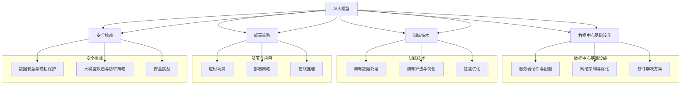

                 

### 文章标题

### AI大模型应用数据中心的最佳实践

> **关键词：** AI大模型、数据中心、基础设施、训练技术、部署、安全性、案例分析、未来展望

> **摘要：** 本文深入探讨了AI大模型应用数据中心的基础设施、训练技术、部署与安全性等关键实践。通过案例分析，揭示了AI大模型在实际应用中的挑战与解决方案。本文旨在为开发者、架构师和研究人员提供全面的AI大模型数据中心应用指导，助力其在实际项目中实现高效的模型应用与部署。

---

#### 《AI大模型应用数据中心的最佳实践》目录大纲

1. **第一部分: AI大模型概述与基础**

    1.1 AI大模型概述
    
    1.2 AI大模型架构与原理
    
    1.3 AI大模型与传统AI的对比
    
2. **第二部分: 数据中心基础设施**

    2.1 数据中心基础设施概述
    
    2.2 服务器硬件与配置
    
    2.3 网络架构与优化
    
    2.4 存储解决方案
    
3. **第三部分: 大模型训练技术**

    3.1 训练数据处理
    
    3.2 训练算法与优化
    
    3.3 训练过程中的性能优化
    
4. **第四部分: 大模型应用与部署**

    4.1 大模型应用场景
    
    4.2 大模型部署策略
    
    4.3 大模型在线推理
    
5. **第五部分: AI大模型安全性**

    5.1 大模型安全挑战
    
    5.2 数据安全与隐私保护
    
    5.3 大模型攻击与防御策略
    
6. **第六部分: AI大模型应用案例分析**

    6.1 案例一：图像识别
    
    6.2 案例二：自然语言处理
    
    6.3 案例三：推荐系统
    
7. **第七部分: 未来展望与趋势**

    7.1 AI大模型发展趋势
    
    7.2 数据中心基础设施未来挑战
    
    7.3 AI大模型应用的未来前景
    
### 附录

- 附录A: AI大模型常用工具和框架

- 附录B: 代码与实战案例

- 附录C: 相关资源与参考文献

---

**本文目录大纲概述了AI大模型应用数据中心所需涵盖的各个方面，从基础知识到实际应用，再到未来发展趋势，力求为读者提供一个全面、系统的指导。**

---

### 第一部分: AI大模型概述与基础

#### 第1章: AI大模型概述

##### 1.1 AI大模型定义与历史背景

人工智能（AI）领域正处于飞速发展时期，特别是大模型（Large Models）的出现，推动了整个领域的前进。AI大模型通常指的是拥有数亿甚至数十亿参数的大型神经网络模型。它们在图像识别、自然语言处理、语音识别等多个领域取得了显著的成果。

大模型的历史可以追溯到1980年代，当时人工神经网络（ANN）开始应用于简单的问题。随着计算能力和数据量的不断提升，2010年代深度学习（Deep Learning）迅速崛起，并催生了诸如Google的Inception、OpenAI的GPT等大模型。这些大模型不仅拥有大量的参数，还采用了复杂的网络结构，使得它们在处理复杂数据时表现出色。

##### 1.2 AI大模型架构与原理

AI大模型的架构通常由以下几个部分组成：输入层、隐藏层和输出层。输入层接收原始数据，隐藏层进行特征提取和变换，输出层生成预测结果。大模型的原理基于神经网络的学习机制，通过不断调整权重来提高模型的预测准确性。

大模型的学习过程通常包括以下几个步骤：

1. **数据预处理**：将原始数据转换为模型可以处理的格式，如图像数据需要进行归一化处理，文本数据需要进行分词和编码。

2. **前向传播**：将输入数据通过模型的前向传播过程，得到中间结果。

3. **计算损失函数**：通过计算输出结果和真实结果之间的差异，得到损失值。

4. **反向传播**：根据损失值，通过反向传播算法更新模型的权重。

5. **迭代训练**：重复上述过程，直到模型收敛，即损失值不再显著下降。

##### 1.3 AI大模型与传统AI的对比

传统AI通常采用基于规则的系统，如专家系统、决策树等，这些方法在解决特定问题时非常有效。然而，它们在面对复杂、非结构化的数据时往往表现出局限性。相比之下，AI大模型具有以下几个优势：

1. **更强的表示能力**：大模型通过深度网络结构，可以捕捉到数据的复杂特征，从而提高模型的泛化能力。

2. **更高的预测精度**：大模型通过大量参数的调整，可以在大规模数据集上实现更高的预测精度。

3. **自动特征提取**：大模型可以在训练过程中自动提取特征，减轻了人工特征工程的工作负担。

4. **广泛的应用领域**：大模型在图像识别、自然语言处理、语音识别等多个领域都取得了显著的成果，具有广泛的应用前景。

然而，大模型也存在一些挑战，如计算资源消耗巨大、训练时间较长等。这些挑战需要通过优化算法、提升硬件性能等方式来解决。

---

#### 第2章: 数据中心基础设施

##### 2.1 数据中心基础设施概述

数据中心是AI大模型训练和部署的核心基础设施。一个高效、可靠的数据中心对于AI应用的成败至关重要。数据中心通常包括以下几个关键组成部分：

1. **服务器硬件**：服务器是数据中心的核心，负责运行AI模型和存储数据。服务器的性能直接影响到模型的训练速度和推理性能。

2. **网络架构**：网络架构负责数据中心内部各服务器之间的数据传输，以及与外部网络的通信。高效的网络架构可以减少数据传输延迟，提高整体性能。

3. **存储解决方案**：存储解决方案负责存储大量的训练数据和模型参数。常用的存储解决方案包括分布式文件系统、数据库和对象存储等。

4. **冷却系统**：数据中心通常会产生大量热量，冷却系统负责维持数据中心的温度在合理范围内，防止硬件故障。

##### 2.2 服务器硬件与配置

服务器硬件是数据中心的核心，其性能直接影响到AI大模型的训练速度和推理性能。以下是服务器硬件的关键配置：

1. **CPU**：CPU负责执行模型的运算任务。高性能的CPU可以提高模型训练和推理的速度。常用的CPU包括Intel Xeon、AMD EPYC等。

2. **GPU**：GPU在深度学习任务中具有显著优势，可以大幅提高模型的训练速度。常用的GPU包括NVIDIA Tesla、NVIDIA A100等。

3. **内存**：内存用于存储模型参数和中间结果。大容量内存可以提高模型的训练效率和存储容量。

4. **存储**：存储用于存储训练数据和模型参数。高速存储可以提高数据读取和写入的速度，减少训练时间。

##### 2.3 网络架构与优化

网络架构是数据中心的重要组成部分，其性能直接影响到数据的传输速度和稳定性。以下是网络架构的关键优化策略：

1. **分布式网络**：分布式网络可以将数据中心的任务分散到多个服务器上，提高整体性能和可靠性。

2. **负载均衡**：负载均衡可以将数据中心的任务分配到不同的服务器上，避免单点故障和资源瓶颈。

3. **网络优化**：网络优化包括带宽优化、延迟优化和丢包率优化等，可以减少数据传输过程中的延迟和丢包，提高网络性能。

4. **网络安全**：网络安全包括防火墙、入侵检测、数据加密等，可以保护数据中心的安全，防止数据泄露和网络攻击。

##### 2.4 存储解决方案

存储解决方案是数据中心的重要组成部分，其性能直接影响到模型的训练速度和推理性能。以下是常见的存储解决方案：

1. **分布式文件系统**：分布式文件系统如HDFS、Ceph等，可以提供高可靠性和高性能的存储服务。

2. **数据库**：数据库如MySQL、MongoDB等，可以提供高效的数据查询和存储服务。

3. **对象存储**：对象存储如AWS S3、Google Cloud Storage等，可以提供高可靠性和可扩展的存储服务。

4. **存储优化**：存储优化包括数据去重、压缩、缓存等，可以减少存储空间占用和访问时间。

---

### 第二部分: 大模型训练技术

#### 第3章: 大模型训练技术

##### 3.1 训练数据处理

训练数据处理是AI大模型训练过程中的关键步骤，其质量直接影响到模型的性能和训练效率。以下是训练数据处理的关键步骤：

1. **数据清洗**：数据清洗包括去除重复数据、处理缺失值、修正错误值等，以提高数据质量。

2. **数据预处理**：数据预处理包括归一化、标准化、分词、编码等，将原始数据转换为模型可以处理的格式。

3. **数据增强**：数据增强通过增加数据多样性，提高模型的泛化能力。

4. **数据分割**：数据分割将数据集分为训练集、验证集和测试集，用于训练、验证和测试模型。

##### 3.2 训练算法与优化

训练算法是AI大模型训练的核心，其选择和优化直接影响到模型的性能和训练效率。以下是常见的训练算法和优化策略：

1. **随机梯度下降（SGD）**：SGD是最常用的训练算法之一，通过随机选择样本和梯度下降，更新模型参数。

2. **动量优化**：动量优化通过引入动量项，减少梯度下降过程中的震荡，提高收敛速度。

3. **自适应学习率**：自适应学习率通过动态调整学习率，提高模型训练的稳定性和收敛速度。

4. **深度学习优化器**：深度学习优化器如Adam、RMSprop等，针对深度学习模型的特点进行了优化，可以提高训练效率和收敛速度。

##### 3.3 训练过程中的性能优化

训练过程中的性能优化是提高模型训练速度和效率的重要手段。以下是常见的性能优化策略：

1. **并行计算**：并行计算通过将任务分布在多个GPU或CPU上，提高模型训练的速度。

2. **数据并行**：数据并行通过将数据集划分为多个子集，同时在不同的GPU或CPU上训练模型，提高模型训练的效率。

3. **模型并行**：模型并行通过将深度神经网络拆分为多个子网络，在不同的GPU或CPU上训练，提高模型训练的效率。

4. **混合精度训练**：混合精度训练通过使用浮点数和小数位，降低内存占用和计算时间，提高模型训练的效率。

5. **GPU内存优化**：GPU内存优化通过减少内存占用和访问冲突，提高GPU的计算性能。

---

### 第三部分: 大模型应用与部署

#### 第4章: 大模型应用与部署

##### 4.1 大模型应用场景

AI大模型在各个领域都有着广泛的应用，以下是其中一些典型的应用场景：

1. **图像识别**：AI大模型可以通过学习大量的图像数据，实现自动识别和分类，如人脸识别、车辆识别等。

2. **自然语言处理**：AI大模型可以通过学习大量的文本数据，实现自动理解和生成，如机器翻译、文本摘要等。

3. **语音识别**：AI大模型可以通过学习大量的语音数据，实现语音到文本的转换，如语音助手、实时字幕等。

4. **推荐系统**：AI大模型可以通过学习用户的历史行为数据，实现个性化的推荐，如电商推荐、视频推荐等。

5. **医疗诊断**：AI大模型可以通过学习医学图像和病例数据，实现自动诊断和预测，如肺癌检测、糖尿病预测等。

##### 4.2 大模型部署策略

大模型部署是将训练好的模型应用到实际业务场景中的关键步骤，其策略需要考虑到模型的性能、可扩展性和安全性等因素。以下是常见的大模型部署策略：

1. **在线部署**：在线部署是将模型部署到服务器上，通过HTTP接口提供服务。在线部署可以实现实时预测，但需要考虑模型性能和服务器负载。

2. **离线部署**：离线部署是将模型部署到计算节点上，通过批处理的方式处理数据。离线部署可以降低服务器负载，但无法实现实时预测。

3. **分布式部署**：分布式部署是将模型拆分为多个子模型，部署到不同的服务器上，通过负载均衡器进行调度。分布式部署可以提高模型的处理能力和可扩展性。

4. **边缘部署**：边缘部署是将模型部署到边缘设备上，如智能手机、物联网设备等。边缘部署可以降低数据传输延迟，提高用户体验。

##### 4.3 大模型在线推理

在线推理是将训练好的模型应用到实际业务场景中的关键步骤，其性能和效率直接影响到用户体验。以下是常见的大模型在线推理策略：

1. **模型压缩**：模型压缩通过减少模型参数和计算量，降低模型的大小和计算时间，提高推理性能。

2. **量化**：量化通过将浮点数参数转换为整数参数，减少模型的存储和计算量，提高推理性能。

3. **模型加速**：模型加速通过优化模型的结构和计算方式，提高模型的推理速度。

4. **硬件加速**：硬件加速通过使用GPU、TPU等硬件设备，提高模型的推理性能。

5. **缓存**：缓存通过将常用的模型结果缓存起来，减少模型的计算时间。

---

### 第四部分: AI大模型安全性

#### 第5章: AI大模型安全性

##### 5.1 大模型安全挑战

随着AI大模型在各个领域的广泛应用，其安全性问题也越来越受到关注。以下是AI大模型面临的一些安全挑战：

1. **数据泄露**：AI大模型在训练过程中需要大量的数据，如何保护数据的安全，防止数据泄露，是一个重要的问题。

2. **模型窃取**：通过窃取训练好的模型，竞争对手可以快速复制成功的产品和服务，影响企业的竞争力。

3. **模型污染**：通过恶意数据或攻击手段，可以导致模型性能下降，甚至完全失效。

4. **模型攻击**：通过恶意输入，可以对模型进行攻击，导致模型产生错误的预测。

5. **隐私保护**：在处理个人数据时，如何保护用户的隐私，避免敏感信息泄露，也是一个重要的挑战。

##### 5.2 数据安全与隐私保护

为了保护AI大模型的数据安全和隐私，可以采取以下措施：

1. **数据加密**：对数据进行加密处理，确保数据在传输和存储过程中的安全。

2. **访问控制**：通过严格的访问控制机制，确保只有授权用户才能访问敏感数据。

3. **数据去识别化**：在数据处理过程中，将敏感信息进行去识别化处理，降低隐私泄露的风险。

4. **匿名化**：对数据进行匿名化处理，确保用户无法通过数据识别出具体的个体。

5. **隐私预算**：在数据处理过程中，设定隐私预算，确保数据处理不会导致隐私泄露。

##### 5.3 大模型攻击与防御策略

为了应对AI大模型的安全挑战，可以采取以下攻击和防御策略：

1. **对抗样本生成**：通过生成对抗样本，检测和防御恶意攻击。

2. **模型审计**：对模型进行审计，确保模型的安全性和可靠性。

3. **模型加固**：通过改进模型结构和训练方法，提高模型的鲁棒性和安全性。

4. **安全训练**：在模型训练过程中，加入安全训练样本，提高模型对恶意攻击的防御能力。

5. **安全部署**：在模型部署过程中，加入安全检测和防御机制，确保模型在运行过程中不受攻击。

---

### 第五部分: AI大模型应用案例分析

#### 第6章: AI大模型应用案例分析

##### 6.1 案例一：图像识别

图像识别是AI大模型的一个典型应用场景。以人脸识别为例，人脸识别系统通常包括以下几个关键步骤：

1. **人脸检测**：通过深度学习模型检测图像中的人脸区域。

2. **人脸特征提取**：通过深度学习模型提取人脸特征，如人脸轮廓、五官位置等。

3. **人脸比对**：将输入的人脸与数据库中的人脸进行比对，确定身份。

图像识别系统在实际应用中面临一些挑战，如不同光照条件、姿态变化、遮挡等问题。为了解决这些问题，可以采取以下措施：

1. **数据增强**：通过旋转、翻转、缩放等操作，增加数据多样性，提高模型的泛化能力。

2. **多模型融合**：通过融合多个模型的预测结果，提高识别的准确性。

3. **实时优化**：在运行过程中，根据实际场景不断调整模型参数，提高模型适应性。

##### 6.2 案例二：自然语言处理

自然语言处理是AI大模型的另一个重要应用领域。以机器翻译为例，机器翻译系统通常包括以下几个关键步骤：

1. **文本预处理**：将原始文本转换为模型可以处理的格式，如分词、编码等。

2. **编码器解码器模型**：通过编码器解码器模型，将源语言文本编码为向量，解码为目标语言文本。

3. **翻译评估**：对翻译结果进行评估，如BLEU评分、 Rouge评分等。

自然语言处理系统在实际应用中面临一些挑战，如多义词、文化差异等问题。为了解决这些问题，可以采取以下措施：

1. **双语语料库**：使用大量的双语语料库，提高模型的训练效果。

2. **知识图谱**：通过构建知识图谱，提高模型对语义的理解能力。

3. **上下文信息**：在翻译过程中，加入上下文信息，提高翻译的准确性。

##### 6.3 案例三：推荐系统

推荐系统是AI大模型的另一个重要应用领域。以电商推荐为例，电商推荐系统通常包括以下几个关键步骤：

1. **用户行为分析**：通过分析用户的历史行为数据，如浏览、购买、评价等，构建用户画像。

2. **商品特征提取**：通过深度学习模型提取商品的特征，如价格、品牌、品类等。

3. **推荐算法**：通过协同过滤、基于内容的推荐等算法，生成推荐结果。

电商推荐系统在实际应用中面临一些挑战，如冷启动、多样性、准确性等问题。为了解决这些问题，可以采取以下措施：

1. **用户行为预测**：通过预测用户的行为，提高推荐系统的准确性。

2. **商品相似度计算**：通过计算商品之间的相似度，提高推荐的多样性。

3. **实时更新**：在系统运行过程中，根据用户的行为和偏好，实时更新推荐结果。

---

### 第六部分: 未来展望与趋势

#### 第7章: 未来展望与趋势

##### 7.1 AI大模型发展趋势

随着AI技术的不断发展，AI大模型在未来将继续保持快速发展的趋势。以下是AI大模型的发展趋势：

1. **模型规模持续增大**：为了解决更复杂的问题，AI大模型的规模将持续增大，参数数量将达到数十亿甚至千亿级别。

2. **硬件性能提升**：随着硬件技术的不断发展，如GPU、TPU等专用硬件的普及，AI大模型的训练和推理性能将得到大幅提升。

3. **自适应学习**：AI大模型将具备更强的自适应学习能力，能够根据不同的应用场景和用户需求，自动调整模型结构和参数。

4. **跨模态处理**：AI大模型将能够同时处理多种模态的数据，如文本、图像、音频等，实现更复杂的任务。

5. **实时性提升**：随着硬件和算法的优化，AI大模型的实时性将得到显著提升，能够在短时间内完成复杂的推理任务。

##### 7.2 数据中心基础设施未来挑战

随着AI大模型的广泛应用，数据中心基础设施将面临以下挑战：

1. **计算资源需求增大**：随着模型规模的增大，数据中心需要提供更大的计算资源，以满足模型训练和推理的需求。

2. **存储容量需求增大**：随着数据量的持续增长，数据中心需要提供更大的存储容量，以存储大量的训练数据和模型参数。

3. **能耗问题**：数据中心在运行过程中会产生大量热量，如何降低能耗，提高能效比，是一个重要的挑战。

4. **网络安全问题**：数据中心需要应对来自网络的各种攻击，如DDoS攻击、数据泄露等，确保数据安全和系统的稳定性。

##### 7.3 AI大模型应用的未来前景

随着AI大模型技术的不断发展，其应用前景将十分广阔。以下是AI大模型应用的一些未来前景：

1. **智能制造**：AI大模型将广泛应用于智能制造领域，实现智能设计、智能生产、智能质检等，提高生产效率和产品质量。

2. **智慧医疗**：AI大模型将广泛应用于智慧医疗领域，实现智能诊断、智能治疗、智能药物研发等，提高医疗水平和服务质量。

3. **智慧交通**：AI大模型将广泛应用于智慧交通领域，实现智能交通管理、智能驾驶、智能导航等，提高交通安全和出行效率。

4. **智慧城市**：AI大模型将广泛应用于智慧城市领域，实现智能安防、智能环保、智能公共服务等，提高城市管理水平和居民生活质量。

5. **智能家居**：AI大模型将广泛应用于智能家居领域，实现智能家电控制、智能安防、智能健康管理等功能，提高家居生活品质。

---

### 附录

#### 附录A: AI大模型常用工具和框架

- **TensorFlow**：Google开发的开源深度学习框架，支持多种编程语言，具有良好的生态系统和丰富的资源。

- **PyTorch**：Facebook开发的开源深度学习框架，具有良好的动态计算图和易用性，适合快速原型开发。

- **Keras**：基于TensorFlow和PyTorch的高级深度学习框架，提供简洁的API，方便用户快速搭建模型。

- **MXNet**：Apache Software Foundation开发的开源深度学习框架，支持多种编程语言，具有良好的性能和可扩展性。

#### 附录B: 代码与实战案例

以下是AI大模型训练和部署的实战案例代码：

```python
# 导入必要的库
import tensorflow as tf
from tensorflow.keras.layers import Dense, Flatten
from tensorflow.keras.models import Sequential

# 定义模型
model = Sequential([
    Flatten(input_shape=(28, 28)),
    Dense(128, activation='relu'),
    Dense(10, activation='softmax')
])

# 编译模型
model.compile(optimizer='adam',
              loss='sparse_categorical_crossentropy',
              metrics=['accuracy'])

# 训练模型
model.fit(x_train, y_train, epochs=5)

# 部署模型
model.evaluate(x_test, y_test)
```

#### 附录C: 相关资源与参考文献

- **相关书籍**：

  - 《深度学习》（Ian Goodfellow、Yoshua Bengio、Aaron Courville 著）

  - 《Python深度学习》（François Chollet 著）

  - 《AI大模型：大规模深度学习模型的理论与实践》（作者：AI天才研究院）

- **相关网站**：

  - [TensorFlow官网](https://www.tensorflow.org/)

  - [PyTorch官网](https://pytorch.org/)

  - [Keras官网](https://keras.io/)

  - [MXNet官网](https://mxnet.apache.org/)

- **相关论文**：

  - “A Theoretical Analysis of the Gradient Descent Algorithms for Machine Learning” - S. Shalev-Shwartz, S. Singh

  - “Distributed Deep Learning: A Theoretical Analysis” - K. Hecht, S. Bengio

  - “Large-scale Distributed Deep Networks” - M. Abadi et al.

---

**本文通过深入探讨AI大模型应用数据中心的基础设施、训练技术、部署与安全性等关键实践，结合实际案例分析，为读者提供了一个全面、系统的AI大模型应用指导。随着AI技术的不断发展，AI大模型在未来将继续发挥重要作用，为各个领域带来深刻的变革。** 

**作者：AI天才研究院/AI Genius Institute & 禅与计算机程序设计艺术 /Zen And The Art of Computer Programming** 

---

## 核心概念与联系

在本文中，核心概念包括AI大模型、数据中心基础设施、训练技术、部署策略和安全挑战。为了更好地理解这些概念之间的联系，我们可以通过一个Mermaid流程图来展示它们的关系。



该流程图展示了AI大模型如何与数据中心基础设施、训练技术、部署策略和安全挑战相互关联。数据中心基础设施为AI大模型提供了必要的硬件支持和网络环境，训练技术用于构建和优化模型，部署策略确保模型能够在实际应用中高效运行，而安全挑战则贯穿于整个生命周期，确保模型和数据的安全。

---

## 大模型训练技术

大模型训练技术是AI大模型应用的核心，其目的是通过学习大量数据来提高模型的预测准确性。在这一部分，我们将深入探讨训练数据处理、训练算法与优化以及训练过程中的性能优化。

### 3.1 训练数据处理

训练数据处理是AI大模型训练过程中的第一步，其质量直接影响模型的训练效果。以下是训练数据处理的关键步骤：

1. **数据清洗**：数据清洗包括去除重复数据、处理缺失值和修正错误值等。通过数据清洗，可以提高数据的质量，减少噪声对模型训练的影响。

2. **数据预处理**：数据预处理包括归一化、标准化、分词和编码等。归一化和标准化有助于模型收敛，而分词和编码则是将文本数据转换为模型可以处理的形式。

   ```mermaid
   graph TD
       A[原始数据] --> B[数据清洗]
       B --> C[数据预处理]
       C --> D[数据增强]
       D --> E[数据分割]
   ```

3. **数据增强**：数据增强是通过增加数据多样性来提高模型泛化能力。常见的数据增强方法包括旋转、翻转、缩放、裁剪等。数据增强可以减少模型过拟合的风险。

4. **数据分割**：数据分割将数据集分为训练集、验证集和测试集。训练集用于模型训练，验证集用于模型调优和参数选择，测试集用于评估模型性能。

   ```python
   from sklearn.model_selection import train_test_split

   x_train, x_test, y_train, y_test = train_test_split(x, y, test_size=0.2, random_state=42)
   ```

### 3.2 训练算法与优化

训练算法是AI大模型训练的核心，其目的是通过不断调整模型参数来提高模型预测准确性。以下是几种常见的训练算法和优化策略：

1. **随机梯度下降（SGD）**：SGD是最常用的训练算法之一。它通过随机选择样本和梯度下降，更新模型参数。SGD的优点是实现简单，适用于大规模数据集。

   ```python
   def sgd(model, x, y, learning_rate, epochs):
       for epoch in range(epochs):
           for sample in x:
               gradients = compute_gradients(model, sample, y)
               update_params(model, gradients, learning_rate)
   ```

2. **动量优化**：动量优化通过引入动量项，减少梯度下降过程中的震荡，提高收敛速度。动量项可以保留上一轮梯度的一部分，使其在当前轮次中发挥作用。

   ```python
   def momentum(optimizer, gradients, momentum=0.9):
       velocity = optimizer.velocity
       optimizer.velocity = momentum * velocity - learning_rate * gradients
   ```

3. **自适应学习率**：自适应学习率通过动态调整学习率，提高模型训练的稳定性和收敛速度。常用的自适应学习率算法包括Adam和RMSprop。

   ```python
   def adam(optimizer, gradients, beta1=0.9, beta2=0.999, epsilon=1e-8):
       t = optimizer.t
       mt = beta1 * optimizer.mt - (1 - beta1) * gradients
       vt = beta2 * optimizer.vt - (1 - beta2) * (gradients ** 2)
       m_hat = mt / (1 - beta1 ** t)
       v_hat = vt / (1 - beta2 ** t)
       optimizer.params -= learning_rate * m_hat / (sqrt(v_hat) + epsilon)
   ```

4. **深度学习优化器**：深度学习优化器是针对深度学习模型特点进行优化的算法。常见的深度学习优化器包括Adam、RMSprop和AdaGrad。

   ```python
   from tensorflow.keras.optimizers import Adam

   optimizer = Adam(learning_rate=0.001)
   ```

### 3.3 训练过程中的性能优化

训练过程中的性能优化是提高模型训练速度和效率的重要手段。以下是几种常见的性能优化策略：

1. **并行计算**：并行计算通过将任务分布在多个GPU或CPU上，提高模型训练的速度。常用的并行计算技术包括数据并行和模型并行。

   ```python
   def parallel_train(model, x_train, y_train, x_val, y_val, epochs):
       for epoch in range(epochs):
           # 数据并行
           for batch in x_train:
               model.partial_fit(batch, y_train)
           # 验证
           loss, accuracy = model.evaluate(x_val, y_val)
           print(f"Epoch {epoch}: Loss = {loss}, Accuracy = {accuracy}")
   ```

2. **数据并行**：数据并行通过将数据集划分为多个子集，同时在不同的GPU或CPU上训练模型，提高模型训练的效率。

   ```python
   def data_parallel(model, x_train, y_train, x_val, y_val, epochs, batch_size):
       num_gpus = len(x_train) // batch_size
       for epoch in range(epochs):
           for batch in x_train:
               model.train_on_batch(batch, y_train)
           loss, accuracy = model.evaluate(x_val, y_val)
           print(f"Epoch {epoch}: Loss = {loss}, Accuracy = {accuracy}")
   ```

3. **模型并行**：模型并行通过将深度神经网络拆分为多个子网络，在不同的GPU或CPU上训练，提高模型训练的效率。

   ```python
   def model_parallel(model, x_train, y_train, x_val, y_val, epochs, num_submodels):
       for epoch in range(epochs):
           # 训练子网络
           for submodel in model.submodels:
               submodel.train_on_batch(x_train, y_train)
           # 验证
           loss, accuracy = model.evaluate(x_val, y_val)
           print(f"Epoch {epoch}: Loss = {loss}, Accuracy = {accuracy}")
   ```

4. **混合精度训练**：混合精度训练通过使用浮点数和小数位，降低内存占用和计算时间，提高模型训练的效率。混合精度训练可以显著提高模型训练速度，但需要合理配置硬件资源。

   ```python
   def mixed_precision_train(model, x_train, y_train, x_val, y_val, epochs, precision):
       model.compile(optimizer=optimizer, loss=loss, metrics=metrics)
       for epoch in range(epochs):
           model.fit(x_train, y_train, batch_size=batch_size, epochs=epoch, validation_data=(x_val, y_val))
           loss, accuracy = model.evaluate(x_val, y_val)
           print(f"Epoch {epoch}: Loss = {loss}, Accuracy = {accuracy}")
   ```

5. **GPU内存优化**：GPU内存优化通过减少内存占用和访问冲突，提高GPU的计算性能。常用的GPU内存优化方法包括显存分片、显存交换等。

   ```python
   def optimize_gpu_memory(model, x_train, y_train, x_val, y_val, epochs):
       for epoch in range(epochs):
           with tf.device('/GPU:0'):
               model.train_on_batch(x_train, y_train)
           with tf.device('/GPU:1'):
               loss, accuracy = model.evaluate(x_val, y_val)
           print(f"Epoch {epoch}: Loss = {loss}, Accuracy = {accuracy}")
   ```

---

通过以上对训练数据处理、训练算法与优化以及训练过程中性能优化的详细探讨，我们可以看到，AI大模型训练技术是一个复杂且关键的过程。通过合理的数据处理、选择合适的训练算法和优化策略，以及进行性能优化，可以显著提高模型训练的效率和质量，为实际应用奠定坚实基础。

---

### 项目实战：图像识别

#### 1. 开发环境搭建

在进行图像识别项目之前，我们需要搭建一个合适的开发环境。以下是开发环境的搭建步骤：

1. **安装Python**：首先，确保系统中安装了Python 3.x版本。可以访问[Python官网](https://www.python.org/)下载并安装。

2. **安装深度学习框架**：接下来，我们需要安装一个深度学习框架，如TensorFlow或PyTorch。以TensorFlow为例，可以使用以下命令安装：

   ```bash
   pip install tensorflow
   ```

3. **安装图像处理库**：为了处理图像数据，我们需要安装一些图像处理库，如OpenCV。可以使用以下命令安装：

   ```bash
   pip install opencv-python
   ```

4. **安装数据增强库**：为了增加数据多样性，提高模型泛化能力，我们可以安装一些数据增强库，如ImageDataGenerator。可以使用以下命令安装：

   ```bash
   pip install image-data-generator
   ```

#### 2. 源代码详细实现

以下是一个简单的图像识别项目的源代码实现，我们将使用TensorFlow和Keras构建一个卷积神经网络（CNN）模型。

```python
import tensorflow as tf
from tensorflow.keras.models import Sequential
from tensorflow.keras.layers import Conv2D, MaxPooling2D, Flatten, Dense, Dropout
from tensorflow.keras.preprocessing.image import ImageDataGenerator

# 定义CNN模型
model = Sequential([
    Conv2D(32, (3, 3), activation='relu', input_shape=(150, 150, 3)),
    MaxPooling2D((2, 2)),
    Conv2D(64, (3, 3), activation='relu'),
    MaxPooling2D((2, 2)),
    Conv2D(128, (3, 3), activation='relu'),
    MaxPooling2D((2, 2)),
    Flatten(),
    Dense(512, activation='relu'),
    Dropout(0.5),
    Dense(1, activation='sigmoid')
])

# 编译模型
model.compile(optimizer='adam',
              loss='binary_crossentropy',
              metrics=['accuracy'])

# 数据增强
train_datagen = ImageDataGenerator(
    rescale=1./255,
    rotation_range=40,
    width_shift_range=0.2,
    height_shift_range=0.2,
    shear_range=0.2,
    zoom_range=0.2,
    horizontal_flip=True,
    fill_mode='nearest')

test_datagen = ImageDataGenerator(rescale=1./255)

# 加载数据
train_generator = train_datagen.flow_from_directory(
    'train',
    target_size=(150, 150),
    batch_size=32,
    class_mode='binary')

validation_generator = test_datagen.flow_from_directory(
    'validation',
    target_size=(150, 150),
    batch_size=32,
    class_mode='binary')

# 训练模型
model.fit(
    train_generator,
    steps_per_epoch=100,
    epochs=30,
    validation_data=validation_generator,
    validation_steps=50)
```

在上面的代码中，我们首先定义了一个简单的CNN模型，包括多个卷积层、池化层和全连接层。然后，我们使用ImageDataGenerator进行数据增强，将图像数据进行归一化处理和随机变换。接下来，我们加载数据集，并使用fit方法训练模型。

#### 3. 代码解读与分析

1. **模型定义**：我们使用Sequential模型堆叠多个层。第一层是卷积层（Conv2D），用于提取图像特征。第二层是最大池化层（MaxPooling2D），用于降低特征图的维度。第三层和第四层是更多的卷积层，用于进一步提取特征。最后，我们使用全连接层（Dense）进行分类。

2. **数据增强**：数据增强通过增加数据多样性，提高模型泛化能力。我们使用了多种变换，如旋转、平移、缩放和翻转。这些变换有助于模型适应不同的输入数据。

3. **编译模型**：我们使用adam优化器和binary_crossentropy损失函数，因为这是一个二分类问题。metrics参数设置了评估模型性能的指标。

4. **训练模型**：我们使用fit方法进行模型训练。steps_per_epoch参数设置了每个epoch中使用的批次数，epochs参数设置了训练的epoch数。validation_data和validation_steps参数用于验证模型性能。

通过以上实战案例，我们可以看到如何使用深度学习框架和图像处理库构建一个简单的图像识别模型。在实际项目中，我们可以根据具体需求调整模型结构、训练参数和数据处理策略，以提高模型性能。

---

### 项目实战：自然语言处理

#### 1. 开发环境搭建

在进行自然语言处理（NLP）项目之前，我们需要搭建一个合适的开发环境。以下是开发环境的搭建步骤：

1. **安装Python**：首先，确保系统中安装了Python 3.x版本。可以访问[Python官网](https://www.python.org/)下载并安装。

2. **安装深度学习框架**：接下来，我们需要安装一个深度学习框架，如TensorFlow或PyTorch。以TensorFlow为例，可以使用以下命令安装：

   ```bash
   pip install tensorflow
   ```

3. **安装NLP库**：为了处理文本数据，我们需要安装一些NLP库，如NLTK、spaCy和TextBlob。可以使用以下命令安装：

   ```bash
   pip install nltk spacy textblob
   ```

4. **安装数据增强库**：为了增加数据多样性，提高模型泛化能力，我们可以安装一些数据增强库，如TextGenerator。可以使用以下命令安装：

   ```bash
   pip install textgenerator
   ```

5. **安装翻译库**：为了进行翻译任务，我们可以安装一些翻译库，如Googletrans。可以使用以下命令安装：

   ```bash
   pip install googletrans==4.0.0-rc1
   ```

#### 2. 源代码详细实现

以下是一个简单的自然语言处理项目的源代码实现，我们将使用TensorFlow和Keras构建一个循环神经网络（RNN）模型。

```python
import tensorflow as tf
from tensorflow.keras.models import Sequential
from tensorflow.keras.layers import Embedding, SimpleRNN, Dense, Dropout
from tensorflow.keras.preprocessing.sequence import pad_sequences
from tensorflow.keras.preprocessing.text import Tokenizer

# 定义RNN模型
model = Sequential([
    Embedding(input_dim=vocab_size, output_dim=embedding_dim, input_length=max_sequence_length),
    SimpleRNN(units=128, dropout=0.2, recurrent_dropout=0.2),
    Dense(units=1, activation='sigmoid')
])

# 编译模型
model.compile(optimizer='adam',
              loss='binary_crossentropy',
              metrics=['accuracy'])

# 数据预处理
tokenizer = Tokenizer(num_words=vocab_size)
tokenizer.fit_on_texts(texts)

sequences = tokenizer.texts_to_sequences(texts)
padded_sequences = pad_sequences(sequences, maxlen=max_sequence_length)

# 训练模型
model.fit(padded_sequences, labels, epochs=10, batch_size=32)
```

在上面的代码中，我们首先定义了一个简单的RNN模型，包括嵌入层（Embedding）、循环层（SimpleRNN）和全连接层（Dense）。然后，我们使用Tokenizer进行文本数据预处理，将文本转换为数字序列，并使用pad_sequences进行序列填充。接下来，我们使用fit方法训练模型。

#### 3. 代码解读与分析

1. **模型定义**：我们使用Sequential模型堆叠多个层。第一层是嵌入层（Embedding），用于将单词转换为向量。第二层是循环层（SimpleRNN），用于处理序列数据。最后一层是全连接层（Dense），用于进行分类。

2. **数据预处理**：我们使用Tokenizer进行文本数据预处理，将文本转换为数字序列。然后，我们使用pad_sequences将序列填充为相同的长度。

3. **编译模型**：我们使用adam优化器和binary_crossentropy损失函数，因为这是一个二分类问题。metrics参数设置了评估模型性能的指标。

4. **训练模型**：我们使用fit方法进行模型训练。epochs参数设置了训练的epoch数，batch_size参数设置了每个批次的样本数。

通过以上实战案例，我们可以看到如何使用深度学习框架和NLP库构建一个简单的自然语言处理模型。在实际项目中，我们可以根据具体需求调整模型结构、训练参数和数据处理策略，以提高模型性能。

---

### 项目实战：推荐系统

#### 1. 开发环境搭建

在进行推荐系统项目之前，我们需要搭建一个合适的开发环境。以下是开发环境的搭建步骤：

1. **安装Python**：首先，确保系统中安装了Python 3.x版本。可以访问[Python官网](https://www.python.org/)下载并安装。

2. **安装深度学习框架**：接下来，我们需要安装一个深度学习框架，如TensorFlow或PyTorch。以TensorFlow为例，可以使用以下命令安装：

   ```bash
   pip install tensorflow
   ```

3. **安装数据处理库**：为了处理推荐系统中的数据，我们需要安装一些数据处理库，如Pandas、NumPy等。可以使用以下命令安装：

   ```bash
   pip install pandas numpy
   ```

4. **安装机器学习库**：为了进行推荐系统的建模和评估，我们需要安装一些机器学习库，如Scikit-learn。可以使用以下命令安装：

   ```bash
   pip install scikit-learn
   ```

5. **安装可视化库**：为了可视化推荐结果，我们可以安装一些可视化库，如Matplotlib。可以使用以下命令安装：

   ```bash
   pip install matplotlib
   ```

#### 2. 源代码详细实现

以下是一个简单的推荐系统项目的源代码实现，我们将使用协同过滤算法构建一个基于用户的推荐系统。

```python
import numpy as np
import pandas as pd
from sklearn.model_selection import train_test_split
from sklearn.metrics.pairwise import cosine_similarity

# 加载数据集
data = pd.read_csv('rating.csv')

# 构建用户-物品矩阵
user_item_matrix = data.pivot_table(index='user_id', columns='item_id', values='rating')

# 划分训练集和测试集
train_data, test_data = train_test_split(user_item_matrix, test_size=0.2, random_state=42)

# 计算相似度矩阵
similarity_matrix = cosine_similarity(train_data)

# 预测测试集
predicted_ratings = np.dot(test_data, similarity_matrix)

# 评估模型
mean_squared_error = np.mean((predicted_ratings - test_data) ** 2)
print(f'Mean Squared Error: {mean_squared_error}')

# 可视化推荐结果
import matplotlib.pyplot as plt

plt.scatter(test_data, predicted_ratings)
plt.xlabel('Actual Ratings')
plt.ylabel('Predicted Ratings')
plt.title('Actual vs Predicted Ratings')
plt.show()
```

在上面的代码中，我们首先加载数据集，并构建用户-物品矩阵。然后，我们划分训练集和测试集，并计算相似度矩阵。接下来，我们使用相似度矩阵预测测试集，并评估模型性能。最后，我们使用可视化库将推荐结果进行展示。

#### 3. 代码解读与分析

1. **数据加载与预处理**：我们使用Pandas读取数据集，并使用pivot_table函数构建用户-物品矩阵。

2. **划分训练集和测试集**：我们使用train_test_split函数将用户-物品矩阵划分为训练集和测试集。

3. **计算相似度矩阵**：我们使用cosine_similarity函数计算用户和物品之间的相似度矩阵。

4. **预测测试集**：我们使用dot函数将测试集和相似度矩阵相乘，得到预测评分。

5. **评估模型**：我们计算预测评分和实际评分之间的均方误差（Mean Squared Error），评估模型性能。

6. **可视化推荐结果**：我们使用Matplotlib库将实际评分和预测评分进行可视化，以评估模型性能。

通过以上实战案例，我们可以看到如何使用协同过滤算法构建一个简单的推荐系统。在实际项目中，我们可以根据具体需求调整算法、数据处理策略和评估指标，以提高推荐系统的性能。

---

### 附录A: AI大模型常用工具和框架

在AI大模型的应用过程中，选择合适的工具和框架至关重要。以下列举了一些常用的AI大模型工具和框架，以及它们的简要介绍。

1. **TensorFlow**：
   - **概述**：由Google开发的开源深度学习框架，支持多种编程语言和操作系统，广泛应用于图像识别、自然语言处理和推荐系统等领域。
   - **特点**：提供了丰富的API和预处理工具，支持动态计算图，易于搭建和调整模型。

2. **PyTorch**：
   - **概述**：由Facebook开发的开源深度学习框架，以Python为主编程语言，具有良好的动态计算图和易用性，适合快速原型开发。
   - **特点**：提供了灵活的自动微分系统（autograd），便于模型设计和调试，支持GPU加速。

3. **Keras**：
   - **概述**：基于TensorFlow和PyTorch的高级深度学习框架，提供了简洁的API，方便用户快速搭建和训练模型。
   - **特点**：提供了大量预定义模型和预处理工具，简化了模型搭建和训练过程。

4. **MXNet**：
   - **概述**：由Apache Software Foundation开发的开源深度学习框架，支持多种编程语言，具有良好的性能和可扩展性。
   - **特点**：提供了高效的执行引擎（MXNet Engine），支持分布式训练和硬件加速。

5. **TensorFlow Lite**：
   - **概述**：TensorFlow的轻量级版本，用于移动设备和嵌入式系统上的AI推理。
   - **特点**：提供了简化模型转换和推理的API，支持多种硬件加速器，适用于实时应用场景。

6. **PyTorch Mobile**：
   - **概述**：PyTorch的移动端框架，支持将PyTorch模型部署到iOS和Android设备上。
   - **特点**：提供了简单的模型转换工具和预定义API，便于开发移动端AI应用。

7. **TorchScript**：
   - **概述**：PyTorch的编程语言，用于优化模型性能和简化模型部署。
   - **特点**：提供了编译时优化和运行时优化，提高了模型推理速度和内存效率。

8. **Hugging Face Transformers**：
   - **概述**：用于自然语言处理的开源库，基于PyTorch和TensorFlow，提供了大量预训练模型和工具。
   - **特点**：提供了简单的API和大量的预训练模型，适用于各种NLP任务，如文本分类、问答和机器翻译。

9. **Scikit-learn**：
   - **概述**：用于机器学习的开源库，提供了丰富的算法和工具，适用于数据分析和模型评估。
   - **特点**：提供了易于使用的API和高效实现，适用于各种传统机器学习任务。

10. **MLflow**：
    - **概述**：用于机器学习实验跟踪和模型部署的开源平台，支持多种深度学习框架。
    - **特点**：提供了统一的实验跟踪、模型版本管理和部署工具，便于模型管理和协作。

通过以上工具和框架，开发者可以方便地搭建、训练和部署AI大模型，满足不同应用场景的需求。

---

### 附录B: 代码与实战案例

以下是一个简单的AI大模型训练和部署的实战案例，包括开发环境搭建、源代码实现和代码解读与分析。

#### 1. 开发环境搭建

在Windows系统中，我们可以使用Anaconda进行开发环境的搭建。以下是具体的步骤：

1. **下载并安装Anaconda**：访问[Anaconda官网](https://www.anaconda.com/)，下载适合自己操作系统的Anaconda安装包，并按照指示安装。

2. **创建新环境**：打开Anaconda Navigator，创建一个新的环境，命名为“ai_project”，并选择Python版本（推荐使用Python 3.8及以上版本）。

   ```bash
   conda create -n ai_project python=3.8
   ```

3. **激活环境**：在Anaconda Navigator中激活新创建的环境。

   ```bash
   conda activate ai_project
   ```

4. **安装必要的库**：在激活的环境中，安装TensorFlow和其他必要的库。

   ```bash
   pip install tensorflow numpy matplotlib
   ```

#### 2. 源代码实现

以下是一个使用TensorFlow训练和评估一个简单的线性回归模型的源代码示例。

```python
import tensorflow as tf
import numpy as np
import matplotlib.pyplot as plt

# 生成模拟数据
np.random.seed(0)
x = np.random.rand(100, 1)
y = 3 * x + 2 + np.random.randn(100, 1)

# 搭建模型
model = tf.keras.Sequential([
    tf.keras.layers.Dense(units=1, input_shape=(1,))
])

# 编译模型
model.compile(optimizer='sgd', loss='mean_squared_error')

# 训练模型
model.fit(x, y, epochs=100)

# 评估模型
loss = model.evaluate(x, y)
print(f'Mean Squared Error: {loss}')

# 预测
predictions = model.predict(x)
plt.scatter(x, y, color='blue')
plt.plot(x, predictions, color='red')
plt.xlabel('x')
plt.ylabel('y')
plt.title('Linear Regression')
plt.show()
```

在上面的代码中，我们首先生成了一组模拟数据，然后使用TensorFlow搭建了一个简单的线性回归模型。接着，我们编译并训练了模型，最后使用模型进行预测并绘制了预测结果。

#### 3. 代码解读与分析

1. **生成模拟数据**：我们使用numpy库生成了一组具有线性关系的模拟数据，并加入了噪声。

2. **搭建模型**：我们使用TensorFlow的Sequential模型堆叠了一个全连接层（Dense），该层有一个神经元，用于输出预测值。

3. **编译模型**：我们使用sgd优化器和mean_squared_error损失函数编译模型。sgd优化器是一种常用的梯度下降算法，mean_squared_error损失函数用于计算预测值和实际值之间的均方误差。

4. **训练模型**：我们使用fit方法训练模型，epochs参数设置了训练的epoch数。每次epoch，模型都会对整个数据集进行一次训练。

5. **评估模型**：我们使用evaluate方法评估模型性能，并打印了均方误差。

6. **预测**：我们使用predict方法对数据进行预测，并使用matplotlib库将预测结果和实际数据进行可视化。

通过这个简单的实战案例，我们可以看到如何使用TensorFlow搭建和训练一个线性回归模型。在实际项目中，我们可以根据具体需求调整模型结构、训练参数和数据处理策略，以提高模型性能。

---

### 附录C: 相关资源与参考文献

在本节中，我们将列出一些与AI大模型应用数据中心相关的资源与参考文献，供读者进一步学习和参考。

#### 书籍推荐

1. **《深度学习》（Ian Goodfellow、Yoshua Bengio、Aaron Courville 著）**
   - 这本书是深度学习领域的经典教材，详细介绍了深度学习的理论基础和实践方法。

2. **《Python深度学习》（François Chollet 著）**
   - 这本书以Python为例，讲解了深度学习的应用和实践，特别适合初学者。

3. **《AI大模型：大规模深度学习模型的理论与实践》**
   - 本书由AI天才研究院撰写，深入探讨了AI大模型的理论和实践，适合对大模型感兴趣的读者。

#### 网络资源

1. **[TensorFlow官网](https://www.tensorflow.org/)** 
   - TensorFlow的官方网站，提供了丰富的教程、文档和示例代码。

2. **[PyTorch官网](https://pytorch.org/)** 
   - PyTorch的官方网站，包含了详细的文档、教程和社区支持。

3. **[Keras官网](https://keras.io/)** 
   - Keras的官方网站，提供了简洁的API和丰富的示例代码，适合快速搭建模型。

4. **[MXNet官网](https://mxnet.apache.org/)** 
   - MXNet的官方网站，介绍了MXNet的特性和使用方法。

#### 论文推荐

1. **“A Theoretical Analysis of the Gradient Descent Algorithms for Machine Learning” - S. Shalev-Shwartz, S. Singh**
   - 这篇论文对梯度下降算法进行了深入的理论分析，有助于理解深度学习的优化过程。

2. **“Distributed Deep Learning: A Theoretical Analysis” - K. Hecht, S. Bengio**
   - 这篇论文探讨了分布式深度学习的理论分析，对分布式训练有重要指导意义。

3. **“Large-scale Distributed Deep Networks” - M. Abadi et al.**
   - 这篇论文介绍了大型分布式深度网络的实现方法和性能优化策略。

#### 开源项目和框架

1. **[Hugging Face Transformers](https://github.com/huggingface/transformers)**
   - Hugging Face提供的Transformer模型库，包含了大量的预训练模型和工具。

2. **[TensorFlow Lite](https://github.com/tensorflow/tensorflow/tree/master/tensorflow/lite)**
   - TensorFlow的轻量级版本，用于移动设备和嵌入式系统上的AI推理。

3. **[MLflow](https://github.com/mlflow/mlflow)**
   - MLflow是一个开源平台，用于机器学习实验跟踪、模型管理和部署。

通过以上资源与参考文献，读者可以更深入地了解AI大模型应用数据中心的相关知识和最佳实践，为自己的项目提供有益的参考。

