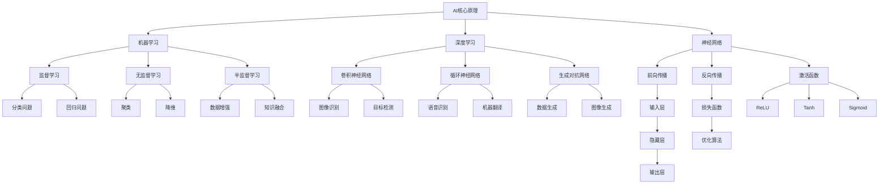

                 

# AI驱动人类文明进步：科技与人文融合

> 关键词：人工智能，科技与人文融合，人类文明进步，深度学习，神经网络，自然语言处理，计算机视觉

> 摘要：本文深入探讨了人工智能（AI）在驱动人类文明进步中的关键作用，分析了AI的核心原理与技术，探讨了科技与人文融合的重要性，以及AI对经济、社会和环境的影响。通过实际案例和未来展望，本文旨在为读者提供全面了解AI发展的深度见解。

----------------------------------------------------------------

## 第一部分：引言与概述

### 1.1 书籍背景与目的

《AI驱动人类文明进步：科技与人文融合》旨在探讨人工智能在现代社会中的关键作用，以及它如何推动人类文明的进步。本书的目标是：

1. 深入解读人工智能的核心原理与关键技术，包括机器学习、深度学习、自然语言处理和计算机视觉。
2. 分析人工智能与人文科学的融合，探讨人机交互、伦理和法律问题。
3. 展望人工智能对经济、社会和环境的影响，以及它如何推动人类文明的持续进步。

### 1.2 AI的定义与发展历程

人工智能（Artificial Intelligence，简称AI）是指计算机系统通过模拟人类智能行为，实现感知、理解、学习、推理和决策的能力。AI的发展历程可以追溯到20世纪50年代，当时科学家们首次提出了人工智能的概念。自那时以来，AI经历了多个阶段：

1. **初始阶段（1950-1969）**：人工智能的概念被提出，并开始进行初步的研究。
2. **繁荣阶段（1970-1989）**：AI的研究和应用得到快速发展，包括专家系统和逻辑推理系统。
3. **低谷阶段（1990-2000）**：由于技术限制和实际应用的困难，AI的研究受到挫折。
4. **复兴阶段（2000至今）**：随着计算能力的提升和大数据的兴起，深度学习和神经网络技术取得了突破性进展，AI再次受到广泛关注。

### 1.3 人类文明进步与AI的关系

AI的快速发展对人类文明的进步产生了深远影响。首先，AI在各个领域的应用大大提高了生产效率和质量，推动了经济的快速发展。其次，AI技术在医疗、教育、交通等领域的应用，改善了人们的生活质量，提高了社会整体的福祉。此外，AI还推动了科学研究的进步，通过模拟和预测，加速了科学发现和技术创新。总之，AI已经成为推动人类文明进步的重要力量。

### 1.4 科技与人文的融合

科技与人文的融合是现代社会的关键趋势。随着AI技术的不断进步，人机交互、虚拟现实、增强现实等技术正在重新定义人类的生活和工作方式。同时，AI的应用也带来了新的伦理和法律问题，需要人文科学的研究和指导。科技与人文的融合，不仅能够提升技术的应用价值，还能够引导技术发展的方向，确保技术对人类的积极影响。

## 第二部分：AI的核心原理与技术

### 2.1 AI的基本概念

AI的基本概念包括感知、理解、学习、推理和决策。感知是指计算机系统通过传感器获取外部信息；理解是指计算机系统能够理解并处理这些信息；学习是指计算机系统能够从数据中获取知识；推理是指计算机系统能够根据已知信息进行逻辑推断；决策是指计算机系统能够根据问题情境做出合理的决策。

### 2.1.1 机器学习

机器学习（Machine Learning）是AI的核心技术之一，它是指通过算法从数据中自动学习规律，并用于预测或决策。机器学习可以分为三种类型：

1. **监督学习（Supervised Learning）**：有明确的目标变量，通过训练数据学习模型，然后使用模型进行预测。
2. **无监督学习（Unsupervised Learning）**：没有明确的目标变量，通过数据特征学习规律，常用于数据聚类和降维。
3. **半监督学习（Semi-Supervised Learning）**：既有标记数据，又有未标记数据，通过两者的结合学习模型。

### 2.1.2 深度学习

深度学习（Deep Learning）是机器学习的一种方法，它使用多层神经网络来模拟人脑的处理方式。深度学习的关键技术包括：

1. **卷积神经网络（Convolutional Neural Network，CNN）**：主要用于图像识别和计算机视觉任务。
2. **循环神经网络（Recurrent Neural Network，RNN）**：主要用于序列数据，如语音识别和机器翻译。
3. **生成对抗网络（Generative Adversarial Network，GAN）**：用于生成新的数据，如图像生成和自然语言生成。

### 2.1.3 神经网络

神经网络（Neural Network）是AI的基础模型，它由多个神经元（或节点）组成，通过层状结构进行信息传递和处理。神经网络的核心组成部分包括：

1. **输入层（Input Layer）**：接收外部输入信息。
2. **隐藏层（Hidden Layer）**：对输入信息进行特征提取和变换。
3. **输出层（Output Layer）**：产生最终输出结果。

### 2.2 AI的关键技术

#### 2.2.1 自然语言处理

自然语言处理（Natural Language Processing，NLP）是AI的重要分支，它研究如何使计算机能够理解、生成和处理人类语言。NLP的关键技术包括：

1. **词向量表示（Word Embedding）**：将词语转化为向量，以便于计算机处理。
2. **序列标注（Sequence Labeling）**：对文本序列中的词语进行分类，如命名实体识别。
3. **机器翻译（Machine Translation）**：将一种语言的文本自动翻译成另一种语言。

#### 2.2.2 计算机视觉

计算机视觉（Computer Vision）是AI的另一个重要分支，它研究如何使计算机能够像人类一样理解和处理视觉信息。计算机视觉的关键技术包括：

1. **图像分类（Image Classification）**：将图像分为不同的类别。
2. **目标检测（Object Detection）**：识别图像中的多个目标，并定位其位置。
3. **图像生成（Image Generation）**：生成新的图像，如风格迁移和图像超分辨率。

#### 2.2.3 强化学习

强化学习（Reinforcement Learning）是一种通过与环境互动来学习策略的机器学习方法。强化学习的关键技术包括：

1. **值函数（Value Function）**：预测当前状态下的最佳行动。
2. **策略（Policy）**：直接根据当前状态选择行动。
3. **Q-Learning**：通过学习值函数来优化策略。
4. **深度强化学习（Deep Reinforcement Learning）**：结合深度学习技术，解决复杂环境中的决策问题。

### 2.3 AI的应用场景

AI在各个领域的应用场景如下：

#### 2.3.1 金融

AI在金融领域的应用包括风险控制、量化交易、信用评估和智能投顾等。通过机器学习和深度学习技术，AI能够快速分析大量金融数据，为金融机构提供智能决策支持。

#### 2.3.2 医疗

AI在医疗领域的应用包括疾病诊断、医学图像分析、药物研发和健康管理等。通过计算机视觉和自然语言处理技术，AI能够辅助医生提高诊断准确性和工作效率。

#### 2.3.3 教育

AI在教育领域的应用包括智能教学、个性化推荐和学业评估等。通过分析学生的学习行为和数据，AI能够提供个性化的学习方案，帮助学生提高学习效果。

## 第三部分：科技与人文的融合

### 3.1 人机交互与用户体验

人机交互（Human-Computer Interaction，HCI）是科技与人文融合的重要领域。HCI的目标是设计用户友好的系统，提高用户体验（User Experience，UX）。以下是人机交互与用户体验的关键原则：

#### 3.1.1 交互设计原则

1. **易用性（Usability）**：系统应易于使用，用户能够快速学会操作。
2. **可访问性（Accessibility）**：系统应考虑不同用户的需求，包括残障人士。
3. **一致性（Consistency）**：系统的界面和交互方式应保持一致，降低用户的学习成本。
4. **反馈（Feedback）**：系统应提供及时、明确的反馈，帮助用户理解系统的状态。

#### 3.1.2 可用性测试

可用性测试（Usability Testing）是评估系统易用性的重要方法。通过观察用户在测试环境中的操作，分析其行为和反馈，可以发现系统存在的问题，并提出改进建议。

#### 3.1.3 用户体验优化

用户体验优化（User Experience Optimization，UXO）是通过持续改进系统设计，提高用户体验的过程。UXO包括以下步骤：

1. **用户研究（User Research）**：了解目标用户的需求和行为。
2. **原型设计（Prototype Design）**：创建系统的原型，收集用户反馈。
3. **迭代改进（Iterative Improvement）**：根据用户反馈不断优化系统设计。

### 3.2 AI伦理与法律问题

随着AI技术的发展，伦理和法律问题日益凸显。以下是一些关键问题：

#### 3.2.1 AI伦理准则

AI伦理准则是指指导AI研发和应用的一组道德原则。以下是一些常见的AI伦理准则：

1. **透明性（Transparency）**：AI系统应易于理解，用户能够了解系统的决策过程。
2. **公平性（Fairness）**：AI系统应避免歧视和偏见，确保对所有用户的公平对待。
3. **隐私保护（Privacy Protection）**：AI系统应尊重用户的隐私，确保数据的保密性和安全性。
4. **责任承担（Accountability）**：AI系统的开发者、运营者应承担相应的责任。

#### 3.2.2 法律法规与政策

各国政府纷纷出台相关法律法规和政策，规范AI的研发和应用。以下是一些重要的法律法规和政策：

1. **欧盟通用数据保护条例（GDPR）**：加强对个人数据的保护，规范数据处理行为。
2. **美国人工智能法案（AI Act）**：促进AI的研发和应用，同时规范AI的监管。
3. **中国人工智能发展规划（2021-2030年）**：提出人工智能发展的目标、任务和政策措施。

#### 3.2.3 社会责任与道德考量

AI技术的发展不仅需要遵循法律法规，还需要承担社会责任和道德考量。以下是一些社会责任和道德考量：

1. **防止滥用（Preventing Misuse）**：AI技术不应被用于恶意目的，如网络攻击、歧视等。
2. **保护人权（Protecting Human Rights）**：AI技术应尊重和保护人权，避免侵犯用户的隐私和自由。
3. **促进可持续发展（Promoting Sustainable Development）**：AI技术应促进社会公平和可持续发展。

### 3.3 科技与人文的融合案例

#### 3.3.1 人工智能与艺术

人工智能在艺术领域的应用越来越广泛，如生成艺术作品、辅助音乐创作和动画制作等。这些应用不仅展示了AI的创造力，也为艺术家提供了新的创作工具和灵感。

#### 3.3.2 人工智能与哲学

人工智能与哲学的结合，探讨了人工智能是否能够拥有意识和自我意识，以及如何理解人工智能的伦理道德问题。这种跨学科的融合为AI研究提供了新的视角和思考。

#### 3.3.3 人工智能与文学

人工智能在文学领域的应用，如自动写作、文本生成和情感分析等，不仅改变了文学创作的形式，也引发了关于人工智能在文学中的地位和作用的讨论。

## 第四部分：AI对人类文明进步的推动

### 4.1 经济影响

AI对经济的推动作用主要体现在以下几个方面：

#### 4.1.1 创新与经济增长

AI技术推动了创新和经济增长，通过提高生产效率、降低成本和开拓新市场，为经济发展注入新的活力。例如，智能制造、智能物流和智能金融等领域的AI应用，大幅提升了产业竞争力。

#### 4.1.2 产业转型与升级

AI技术推动了传统产业的转型升级，如通过AI技术优化生产流程、提高产品质量和降低能源消耗。同时，AI也催生了新兴产业，如自动驾驶、智能医疗和智能家居等。

#### 4.1.3 全球竞争格局

AI技术的发展，改变了全球竞争格局。领先国家通过加强AI研发和应用，提升经济实力和国际竞争力。发展中国家则通过引进和应用AI技术，实现经济跨越式发展。

### 4.2 社会变革

AI技术对社会变革的影响深远，主要体现在以下几个方面：

#### 4.2.1 教育模式变革

AI技术推动了教育模式的变革，如在线教育、虚拟教室和智能辅导等。这些创新教育模式提高了教育质量和公平性，为更多人提供了优质教育资源。

#### 4.2.2 工作与就业影响

AI技术改变了劳动力市场，一方面提高了生产效率，另一方面也导致了一些工作岗位的消失。因此，需要加强职业培训和教育，帮助劳动者适应新的就业环境。

#### 4.2.3 社会公平与包容性

AI技术的应用，需要充分考虑社会公平和包容性。通过确保AI系统的透明性、公平性和可解释性，避免歧视和偏见，促进社会和谐发展。

### 4.3 环境与可持续发展

AI技术在环境保护和可持续发展方面发挥了重要作用，主要体现在以下几个方面：

#### 4.3.1 环境监测与治理

AI技术可以实时监测环境数据，如空气质量、水质和土壤质量等。通过数据分析和预测，有助于及时采取措施，改善环境质量。

#### 4.3.2 智能能源系统

AI技术在智能能源系统中的应用，如智能电网、智能空调和智能照明等，可以实现能源的节约和高效利用，降低能源消耗。

#### 4.3.3 气候变化应对策略

AI技术在气候变化应对策略中的应用，如气候预测、灾害预警和生态修复等，有助于减少气候变化带来的负面影响，实现可持续发展。

## 第五部分：案例分析与未来展望

### 5.1 AI成功案例解析

#### 5.1.1 阿里云的AI应用

阿里云是中国领先的人工智能服务提供商，其AI应用涵盖了多个领域，如智能推荐、智能客服和智能安全等。通过深度学习和大数据分析技术，阿里云为企业提供了高效、智能的解决方案。

#### 5.1.2 百度的自动驾驶

百度是全球领先的自动驾驶技术公司，其Apollo自动驾驶平台已与多家车企合作，实现了自动驾驶车辆的量产。通过深度学习和计算机视觉技术，百度的自动驾驶系统具有高精度地图、环境感知和决策规划等功能。

#### 5.1.3 谷歌的AI医疗

谷歌的AI医疗项目致力于通过人工智能技术改善医疗服务。其AI系统可以辅助医生进行疾病诊断、治疗方案推荐和药物研发等。通过大规模数据分析和深度学习技术，谷歌的AI医疗项目在多个领域取得了显著成果。

### 5.2 AI发展的挑战与机遇

#### 5.2.1 技术瓶颈与突破

尽管AI技术取得了显著进展，但仍面临一些技术瓶颈，如计算能力、算法效率和模型可解释性等。未来，需要不断突破这些瓶颈，提高AI技术的性能和应用价值。

#### 5.2.2 法律、伦理与政策挑战

AI技术的发展带来了新的法律、伦理和政策挑战。如何确保AI系统的透明性、公平性和可解释性，以及如何制定合理的政策和法规，都是未来需要关注的重要问题。

#### 5.2.3 创新与创业机会

AI技术的快速发展为创业者提供了巨大的创新和创业机会。未来，随着技术的不断突破和应用的拓展，AI领域将涌现出更多的创新产品和商业模式。

## 第六部分：结论与建议

### 6.1 结论

本文从多个角度探讨了人工智能（AI）在驱动人类文明进步中的作用。通过分析AI的核心原理与技术，探讨了科技与人文融合的重要性，以及AI对经济、社会和环境的影响。本文认为，AI已经成为推动人类文明进步的重要力量，它将在未来继续发挥关键作用。

### 6.2 建议与展望

为了充分发挥AI的潜力，本文提出以下建议和展望：

1. **加强AI技术研发**：持续投入研发资源，突破AI技术的瓶颈，提高AI技术的性能和应用价值。
2. **推动科技与人文融合**：加强AI与人文科学的融合，提高AI系统的可解释性、透明性和公平性。
3. **加强伦理和法律规制**：制定合理的政策和法规，确保AI技术的健康发展，避免潜在的社会风险。
4. **培养AI人才**：加大人才培养力度，培养具备跨学科知识和技能的AI人才。
5. **拓展AI应用场景**：鼓励创新，探索AI在各个领域的应用，推动AI技术的普及和应用。

通过以上建议和展望，我们希望为AI技术的发展和应用提供有益的参考，共同推动人类文明的进步。

### 附录

#### 附录A：参考文献

1. Goodfellow, I., Bengio, Y., & Courville, A. (2016). *Deep Learning*. MIT Press.
2. Russell, S., & Norvig, P. (2020). *Artificial Intelligence: A Modern Approach*. Pearson.
3. He, K., Zhang, X., Ren, S., & Sun, J. (2016). *Deep Residual Learning for Image Recognition*. IEEE Conference on Computer Vision and Pattern Recognition.
4. Hochreiter, S., & Schmidhuber, J. (1997). *Long Short-Term Memory*. Neural Computation.
5. LeCun, Y., Bengio, Y., & Hinton, G. (2015). *Deep Learning*. Nature.

#### 附录B：AI工具与资源推荐

1. TensorFlow：https://www.tensorflow.org/
2. PyTorch：https://pytorch.org/
3. Keras：https://keras.io/
4. JAX：https://jax.py
5. OpenCV：https://opencv.org/
6. GPT-3：https://openai.com/products/gpt-3/
7. Kaggle：https://www.kaggle.com/
8. AI论文集：https://arxiv.org/
9. Machine Learning Mastery：https://machinelearningmastery.com/
10. Analytics Vidhya：https://www.analyticsvidhya.com/

**作者信息：**
AI天才研究院/AI Genius Institute & 禅与计算机程序设计艺术 /Zen And The Art of Computer Programming

----------------------------------------------------------------

### Mermaid 流程图：AI核心原理与技术架构



### 机器学习与深度学习算法伪代码

#### 机器学习算法：线性回归

```python
def linear_regression(X, y):
    # 初始化权重和偏置
    weights = initialize_weights(X.shape[1])
    bias = initialize_bias()

    # 训练模型
    for epoch in range(num_epochs):
        # 前向传播
        predictions = X * weights + bias

        # 计算损失函数
        loss = (predictions - y) ** 2

        # 反向传播
        dweights = 2 * (predictions - y) * X
        dbias = 2 * (predictions - y)

        # 更新权重和偏置
        weights -= learning_rate * dweights
        bias -= learning_rate * dbias

    return weights, bias
```

#### 深度学习算法：卷积神经网络（CNN）

```python
def convolutional_neural_network(X, y):
    # 初始化网络参数
    conv_layer1 = initialize_conv_layer()
    pool_layer1 = initialize_pool_layer()
    conv_layer2 = initialize_conv_layer()
    pool_layer2 = initialize_pool_layer()
    fc_layer1 = initialize FullyConnectedLayer()

    # 前向传播
    conv1 = conv_layer1.forward(X)
    pool1 = pool_layer1.forward(conv1)
    conv2 = conv_layer2.forward(pool1)
    pool2 = pool_layer2.forward(conv2)
    fc1 = fc_layer1.forward(pool2)

    # 计算损失
    loss = compute_loss(fc1, y)

    # 反向传播
    dfc1 = compute_loss_derivative(fc1, y)
    dpool2 = fc_layer1.backward(dfc1)
    dconv2 = pool_layer2.backward(dpool2)
    dconv1 = pool_layer1.backward(dconv2)

    # 更新网络参数
    conv_layer1.update_weights(dconv1)
    pool_layer1.update_weights(dpool2)
    conv_layer2.update_weights(dconv2)
    pool_layer2.update_weights(dpool2)
    fc_layer1.update_weights(dfc1)

    return loss
```

### 数学模型和数学公式

#### 损失函数：均方误差（MSE）

$$
MSE = \frac{1}{n} \sum_{i=1}^{n} (y_i - \hat{y}_i)^2
$$

其中，\( y_i \) 是实际输出，\( \hat{y}_i \) 是预测输出，\( n \) 是样本数量。

#### 优化算法：梯度下降（Gradient Descent）

$$
\theta_{\text{new}} = \theta_{\text{current}} - \alpha \cdot \nabla_\theta J(\theta)
$$

其中，\( \theta \) 表示模型参数，\( \alpha \) 是学习率，\( \nabla_\theta J(\theta) \) 是损失函数 \( J(\theta) \) 关于参数 \( \theta \) 的梯度。

### 项目实战：基于TensorFlow的图像分类

#### 实现环境搭建

```bash
pip install tensorflow
```

#### 源代码实现

```python
import tensorflow as tf
from tensorflow.keras import datasets, layers, models

# 加载并预处理数据
(train_images, train_labels), (test_images, test_labels) = datasets.cifar10.load_data()
train_images, test_images = train_images / 255.0, test_images / 255.0

# 构建卷积神经网络模型
model = models.Sequential()
model.add(layers.Conv2D(32, (3, 3), activation='relu', input_shape=(32, 32, 3)))
model.add(layers.MaxPooling2D((2, 2)))
model.add(layers.Conv2D(64, (3, 3), activation='relu'))
model.add(layers.MaxPooling2D((2, 2)))
model.add(layers.Conv2D(64, (3, 3), activation='relu'))
model.add(layers.Flatten())
model.add(layers.Dense(64, activation='relu'))
model.add(layers.Dense(10))

# 编译模型
model.compile(optimizer='adam',
              loss=tf.keras.losses.SparseCategoricalCrossentropy(from_logits=True),
              metrics=['accuracy'])

# 训练模型
model.fit(train_images, train_labels, epochs=10, validation_data=(test_images, test_labels))

# 评估模型
test_loss, test_acc = model.evaluate(test_images,  test_labels, verbose=2)
print(f'测试准确率: {test_acc:.4f}')
```

#### 代码解读与分析

1. **数据预处理**：首先加载CIFAR-10数据集，并归一化图像数据。
2. **模型构建**：构建一个简单的卷积神经网络（CNN）模型，包括卷积层、池化层和全连接层。
3. **模型编译**：指定优化器、损失函数和评估指标。
4. **模型训练**：使用训练数据训练模型，并验证模型在测试数据上的表现。
5. **模型评估**：计算模型在测试数据上的准确率。

通过以上步骤，我们可以实现一个基本的图像分类模型，并对CIFAR-10数据集进行分类任务。这个项目实战展示了如何使用TensorFlow框架搭建和训练一个简单的CNN模型，以及如何进行模型评估。在实际应用中，可以根据具体需求调整模型结构和参数，以提升模型的性能。

