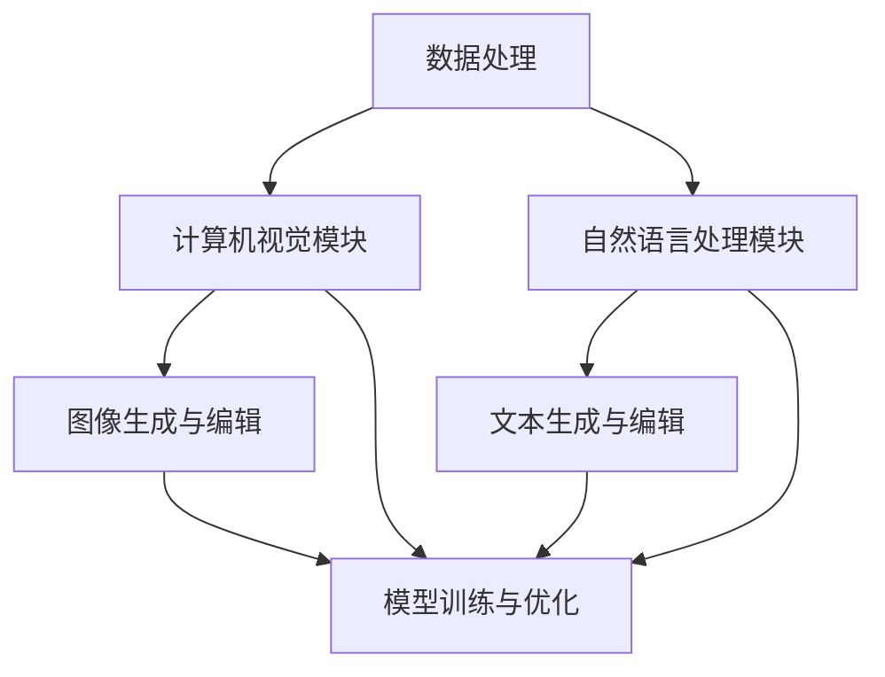
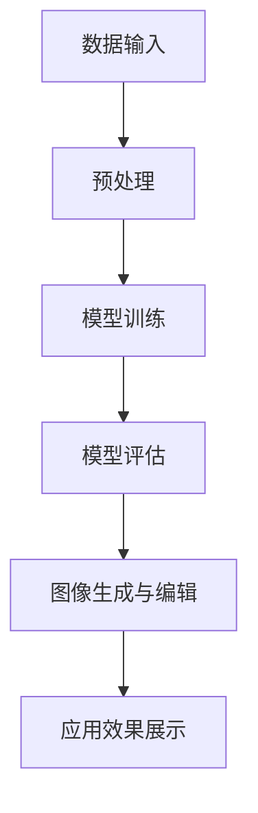
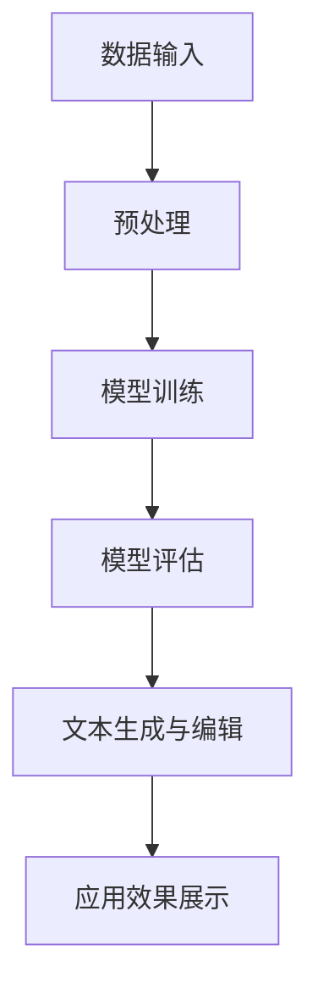
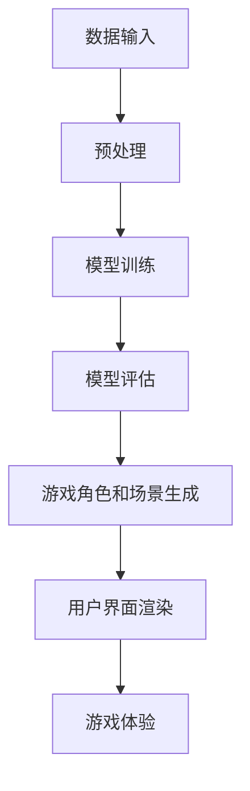
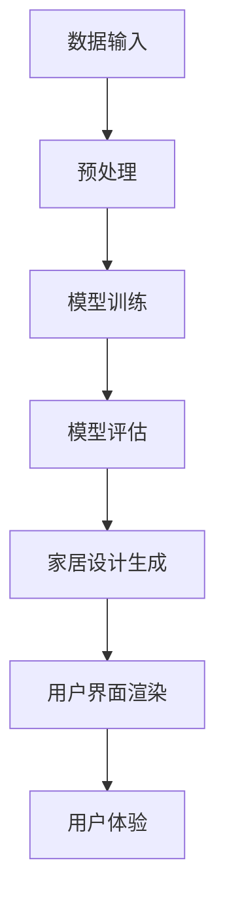
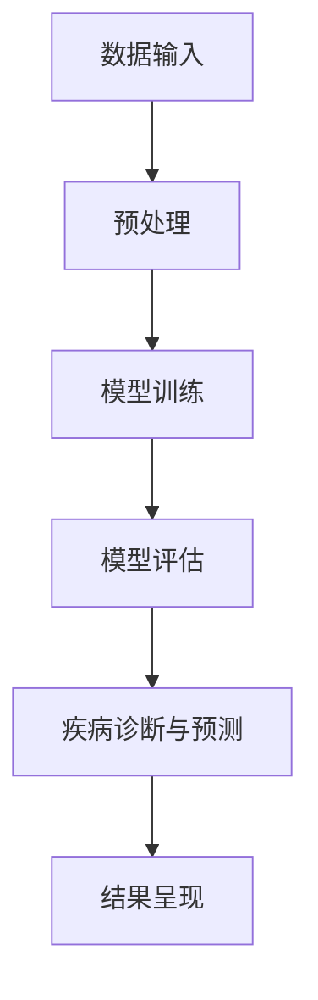
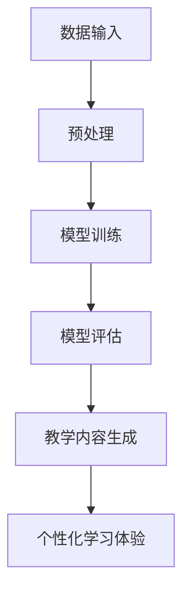

                 

### AIGC概述

AIGC（AI-Generated Content）是一种利用人工智能技术生成内容的方法，涵盖了从图像、文本到虚拟现实等多个领域。AIGC的核心在于通过机器学习和深度学习算法，从大规模数据集中学习和提取模式，进而生成新的、符合特定需求的内容。

AIGC的发展历程可以追溯到20世纪80年代，当时的计算机科学家已经开始探索如何使用神经网络生成音乐和图像。然而，随着计算能力的提升和大数据技术的发展，AIGC在近年来取得了显著的进步。特别是生成对抗网络（GAN）和变分自编码器（VAE）等新型算法的出现，使得AIGC的应用场景更加广泛。

AIGC的应用场景非常丰富，包括但不限于以下几个方面：

1. **图像生成与编辑**：AIGC可以生成高质量的艺术作品、照片，以及进行图像修复和风格转换等。
2. **文本生成与编辑**：AIGC可以生成文章、摘要、对话等，被广泛应用于自然语言处理领域。
3. **虚拟现实与增强现实**：AIGC可以生成逼真的虚拟环境和角色，提升用户的沉浸体验。
4. **游戏开发与互动娱乐**：AIGC可以生成游戏角色、场景，为游戏开发者提供强大的创作工具。
5. **智能设计与创意生成**：AIGC可以生成创新的设计方案，帮助设计师提高效率。
6. **医疗健康与生物科技**：AIGC可以用于医学图像处理、疾病预测等领域，提供精准的诊断和治疗方案。
7. **教育科技与智能教学**：AIGC可以生成教学内容、互动式课件，提高教学效果。

通过以上概述，我们可以看到AIGC在各个领域都有广泛的应用潜力。接下来，我们将详细探讨AIGC的核心架构和数学模型，以便更好地理解其工作原理和应用方法。

### AIGC核心架构

AIGC的核心架构主要包括数据处理流程、计算机视觉模块、自然语言处理模块以及模型训练与优化机制。这些组成部分相互协作，共同实现高质量内容的生成。

#### 数据处理流程

数据处理流程是AIGC的基础，其目的是从大量数据中提取有价值的信息，以便用于模型训练和内容生成。具体流程如下：

1. **数据收集**：从互联网、数据库或传感器等渠道收集原始数据。
2. **数据预处理**：对数据进行清洗、归一化和特征提取，以便模型能够更好地理解和利用数据。
3. **数据存储**：将预处理后的数据存储在分布式文件系统或数据库中，以便后续使用。
4. **数据增强**：通过随机变换、扩充等方式增加数据的多样性，提高模型的泛化能力。

#### 计算机视觉模块

计算机视觉模块负责处理图像和视频数据，其核心组件包括：

1. **图像预处理**：包括灰度化、去噪、边缘检测等，以便提取图像的纹理和特征。
2. **特征提取**：使用卷积神经网络（CNN）等深度学习模型提取图像的高层次特征。
3. **目标检测与分割**：使用R-CNN、YOLO等算法定位图像中的物体并对其进行分割。
4. **图像生成与编辑**：使用生成对抗网络（GAN）等算法生成新图像或对现有图像进行编辑。

#### 自然语言处理模块

自然语言处理模块负责处理文本数据，其核心组件包括：

1. **文本预处理**：包括分词、词性标注、停用词过滤等，以便提取文本的关键信息。
2. **词向量表示**：使用Word2Vec、BERT等算法将文本转化为向量表示。
3. **序列建模**：使用循环神经网络（RNN）、长短时记忆网络（LSTM）等算法处理序列数据。
4. **文本生成与编辑**：使用GAN、VAE等算法生成新文本或对现有文本进行编辑。

#### 模型训练与优化

模型训练与优化是AIGC的核心环节，其目的是通过大量的数据和算法迭代，不断提高模型的生成能力。具体步骤如下：

1. **数据输入**：将预处理后的数据输入到模型中。
2. **损失函数**：定义损失函数，衡量模型预测值与真实值之间的差距。
3. **反向传播**：利用反向传播算法更新模型参数，以最小化损失函数。
4. **模型评估**：使用验证集或测试集评估模型性能，并根据评估结果进行调整。

#### 综合示例

以下是一个简化的AIGC系统架构图，展示了各个模块之间的协作关系：

通过以上架构，我们可以看到AIGC系统如何利用计算机视觉和自然语言处理模块，结合模型训练与优化，实现高质量内容的生成。

### AIGC数学模型与算法

AIGC的数学模型和算法是生成内容的核心，下面我们将详细介绍几种常用的模型，包括神经网络基本原理、生成对抗网络（GAN）、循环神经网络（RNN）和变分自编码器（VAE）。

#### 神经网络基本原理

神经网络是一种模拟生物神经系统的计算模型，通过多层神经元节点进行数据传递和计算。一个典型的神经网络包括输入层、隐藏层和输出层。每个神经元都与前一层和后一层的其他神经元相连，并通过权重进行加权求和，最后加上偏置项，然后通过激活函数输出结果。

- **神经元计算公式**：
  $$ 
  z_j = \sum_{i=1}^{n} w_{ji} x_i + b_j 
  $$
  $$ 
  a_j = \sigma(z_j) 
  $$

- **激活函数**：
  $$ 
  \sigma(x) = \frac{1}{1 + e^{-x}} 
  $$
  
- **反向传播算法**：
  反向传播算法是一种用于训练神经网络的优化方法，通过计算损失函数关于每个参数的梯度，然后利用梯度下降法更新参数，从而最小化损失函数。

#### 生成对抗网络（GAN）

生成对抗网络（GAN）是一种由生成器和判别器组成的对抗性模型。生成器的目标是生成逼真的数据，判别器的目标是区分生成器和真实数据。通过这种对抗性训练，生成器能够不断提高生成数据的质量。

- **目标函数**：
  $$ 
  \mathcal{L}_{\text{GAN}} = -\mathbb{E}_{x \sim p_{\text{data}}(x)}[\log(D(x))] - \mathbb{E}_{z \sim p_{\text{z}}(z)}[\log(1 - D(G(z))]
  $$

- **判别器D的损失函数**：
  $$ 
  \mathcal{L}_D = -\mathbb{E}_{x \sim p_{\text{data}}(x)}[\log(D(x))] - \mathbb{E}_{z \sim p_{\text{z}}(z)}[\log(1 - D(G(z))]
  $$

- **生成器G的损失函数**：
  $$ 
  \mathcal{L}_G = -\mathbb{E}_{z \sim p_{\text{z}}(z)}[\log(D(G(z))]
  $$

- **训练过程**：
  - 同时训练生成器和判别器。
  - 判别器通过区分真实数据和生成数据来更新自己的权重。
  - 生成器通过生成更逼真的数据来欺骗判别器。

#### 循环神经网络（RNN）

循环神经网络（RNN）是一种用于处理序列数据的神经网络。与传统的神经网络不同，RNN具有记忆功能，能够捕捉序列中的时间依赖关系。

- **RNN的激活函数**：
  $$ 
  h_t = \tanh(W_h \cdot [h_{t-1}, x_t]) + b_h 
  $$
  $$ 
  o_t = W_o \cdot h_t + b_o 
  $$

- **长短时记忆网络（LSTM）**：
  LSTM是RNN的一种变体，通过引入门控机制，解决了RNN在处理长序列数据时的梯度消失和梯度爆炸问题。LSTM的核心结构包括输入门、遗忘门和输出门。

#### 变分自编码器（VAE）

变分自编码器（VAE）是一种基于概率模型的生成模型。VAE通过引入编码器和解码器，将输入数据映射到一个潜在空间，从而实现数据的生成。

- **编码器**：
  $$ 
  \mu = \sigma(W_\mu x + b_\mu) 
  $$
  $$ 
  \sigma = \sigma(W_\sigma x + b_\sigma) 
  $$

- **解码器**：
  $$ 
  x' = \sigma(W_\phi z + b_\phi) 
  $$

- **损失函数**：
  $$ 
  \mathcal{L} = -\sum_{i=1}^{n} \sum_{j=1}^{m} [x_{ij} \log(\sigma_{ij}) + (1 - x_{ij}) \log(1 - \sigma_{ij})] + D_KL(\mu || \sigma) 
  $$

通过以上数学模型和算法的介绍，我们可以看到AIGC在生成内容方面的强大能力。接下来，我们将探讨AIGC的开发环境与工具，以便更好地实现和优化AIGC应用。

### AIGC开发环境与工具

AIGC的开发环境与工具是实现其高效应用的关键。在这部分，我们将介绍几种常用的深度学习框架、数据处理库和模型训练与优化工具，为开发者提供实用的技术支持。

#### 深度学习框架

深度学习框架为开发者提供了便捷的接口和丰富的功能，使得模型训练和优化变得更加高效和灵活。以下是几种常用的深度学习框架：

1. **TensorFlow**：
   TensorFlow是由Google开发的开源深度学习框架，具有高度的可扩展性和灵活性。它提供了丰富的API，包括低层次的运算图操作和高层次的模型构建工具，如Keras。

2. **PyTorch**：
   PyTorch是Facebook开发的开源深度学习框架，以其动态计算图和灵活的代码风格著称。它提供了丰富的API和强大的计算能力，使得模型训练和调试更加便捷。

3. **Keras**：
   Keras是一个基于TensorFlow的高层次神经网络API，它提供了简洁的接口和丰富的预训练模型，适用于快速原型开发和模型训练。

4. **Theano**：
   Theano是一个开源的Python库，用于定义、优化和评估数学表达式。虽然其使用频率逐渐下降，但在某些场景下仍具有应用价值。

#### 数据处理库

数据处理库为开发者提供了方便的数据处理和预处理工具，使得数据准备过程更加高效和准确。以下是几种常用的数据处理库：

1. **NumPy**：
   NumPy是Python的核心科学计算库，提供了多维数组对象和一系列数学函数，适用于数据预处理和计算。

2. **Pandas**：
   Pandas是一个强大的数据分析和操作库，提供了数据帧（DataFrame）这种结构化数据容器，适用于数据清洗、转换和分析。

3. **Scikit-learn**：
   Scikit-learn是一个开源的机器学习库，提供了丰富的分类、回归、聚类和模型评估工具，适用于数据分析和建模。

4. **Matplotlib**：
   Matplotlib是Python的2D绘图库，提供了丰富的绘图函数和可视化工具，适用于数据可视化。

#### 模型训练与优化工具

模型训练与优化工具为开发者提供了高效的模型训练和调参方法，使得模型性能得到显著提升。以下是几种常用的模型训练与优化工具：

1. **TensorBoard**：
   TensorBoard是TensorFlow提供的可视化工具，用于监控模型训练过程、查看参数变化和损失函数曲线等。

2. **Visdom**：
   Visdom是一个跨框架的可视化工具，支持TensorFlow、PyTorch等深度学习框架，提供了丰富的可视化功能。

3. **Hyperopt**：
   Hyperopt是一个基于树形贝叶斯优化（Tree-structured Parzen Estimator）的开源库，用于模型超参数优化。

4. **Optuna**：
   Optuna是一个高效的超参数优化库，支持自动搜索、随机搜索和贝叶斯优化等方法，适用于大规模模型调参。

通过以上介绍，我们可以看到AIGC开发环境的丰富性和多样性，为开发者提供了强大的技术支持。在下一部分，我们将深入探讨AIGC在图像生成与编辑领域的具体应用。

### 图像生成与编辑

图像生成与编辑是AIGC的一个重要应用领域，通过先进的机器学习算法，AIGC能够生成全新图像或对现有图像进行编辑，以满足不同场景的需求。在这部分，我们将详细介绍图像生成模型和图像编辑模型的工作原理，并分析其具体应用案例。

#### 图像生成模型

图像生成模型旨在通过学习大量图像数据，生成新的、高质量的图像。以下是目前应用较为广泛的几种图像生成模型：

1. **生成对抗网络（GAN）**：
   GAN由生成器和判别器组成，生成器旨在生成逼真的图像，而判别器则负责区分生成图像和真实图像。通过这种对抗性训练，生成器逐渐学会生成更高质量的图像。

   - **模型架构**：
     - 生成器：通过多层全连接或卷积神经网络，将噪声向量映射为图像。
     - 判别器：通过多层卷积神经网络，对图像进行分类。

   - **损失函数**：
     $$ 
     \mathcal{L}_{\text{GAN}} = -\mathbb{E}_{x \sim p_{\text{data}}(x)}[\log(D(x))] - \mathbb{E}_{z \sim p_{\text{z}}(z)}[\log(1 - D(G(z))]
     $$

2. **变分自编码器（VAE）**：
   VAE是一种基于概率模型的生成模型，通过编码器和解码器，将输入图像映射到一个潜在空间，并从这个潜在空间生成新的图像。

   - **模型架构**：
     - 编码器：将输入图像映射到一个潜在空间。
     - 解码器：从潜在空间解码出图像。

   - **损失函数**：
     $$ 
     \mathcal{L} = -\sum_{i=1}^{n} \sum_{j=1}^{m} [x_{ij} \log(\sigma_{ij}) + (1 - x_{ij}) \log(1 - \sigma_{ij})] + D_KL(\mu || \sigma) 
     $$

#### 图像编辑模型

图像编辑模型通过学习图像的语义信息，对现有图像进行编辑，以满足特定需求。以下是一些常用的图像编辑模型：

1. **条件生成对抗网络（cGAN）**：
   cGAN是GAN的一种变体，通过引入条件输入（如文本描述或标签），使生成器能够根据条件生成更符合预期的图像。

   - **模型架构**：
     - 生成器：接受条件输入，通过多层全连接或卷积神经网络生成图像。
     - 判别器：对生成的图像进行分类。

   - **损失函数**：
     $$ 
     \mathcal{L}_{\text{cGAN}} = -\mathbb{E}_{x \sim p_{\text{data}}(x)}[\log(D(x))] - \mathbb{E}_{z \sim p_{\text{z}}(z)}[\log(1 - D(G(z | c))]
     $$

2. **基于注意力机制的图像编辑模型**：
   该模型通过引入注意力机制，使模型能够更好地关注图像中的重要区域，从而实现更精确的编辑效果。

   - **模型架构**：
     - 注意力模块：通过卷积神经网络提取图像的特征图，并计算注意力权重。
     - 编辑模块：根据注意力权重对图像进行编辑。

   - **损失函数**：
     $$ 
     \mathcal{L}_{\text{attention}} = \sum_{i=1}^{n} \alpha_i \cdot \mathcal{L}_{\text{editing}} 
     $$
     其中，$\alpha_i$为注意力权重。

#### 应用案例：人脸修复与变换

人脸修复与变换是图像生成与编辑领域的一个典型应用案例，通过学习大量人脸图像数据，模型能够自动修复受损的人脸图像或实现人脸变换。

- **人脸修复**：
  人脸修复模型通过GAN或VAE等生成模型，从损坏的人脸图像中学习生成完整的人脸图像。

  - **训练过程**：
    - 数据收集与预处理：收集大量人脸图像，并进行数据增强。
    - 模型训练：通过对抗性训练或变分训练，优化生成模型。
    - 模型评估：使用验证集评估模型性能，并进行调优。

- **人脸变换**：
  人脸变换模型通过条件GAN或基于注意力机制的图像编辑模型，根据输入的变换条件（如年龄、表情等），生成变换后的人脸图像。

  - **训练过程**：
    - 数据收集与预处理：收集大量人脸图像和对应的变换条件。
    - 模型训练：通过对抗性训练或基于注意力机制的训练，优化生成模型。
    - 模型评估：使用验证集评估模型性能，并进行调优。

#### 应用效果展示

以下是一个简化的AIGC图像编辑应用流程，展示了从数据输入到模型训练，再到图像生成与编辑的全过程：

通过以上介绍，我们可以看到AIGC在图像生成与编辑领域的广泛应用和强大能力。在下一部分，我们将深入探讨AIGC在文本生成与编辑领域的应用。

### 文本生成与编辑

文本生成与编辑是AIGC的另一重要应用领域，通过先进的自然语言处理技术和深度学习算法，AIGC能够生成高质量的文本，并对现有文本进行编辑，以满足多种场景需求。在这部分，我们将详细介绍文本生成模型和文本编辑模型的工作原理，并分析其具体应用案例。

#### 文本生成模型

文本生成模型旨在通过学习大量文本数据，生成新的、符合语法和语义规则的文本。以下是目前应用较为广泛的几种文本生成模型：

1. **循环神经网络（RNN）**：
   RNN是一种用于处理序列数据的神经网络，通过记忆功能捕捉文本中的时间依赖关系。

   - **模型架构**：
     - 输入层：将输入文本序列转化为词向量。
     - 隐藏层：通过RNN单元处理文本序列，生成隐藏状态。
     - 输出层：将隐藏状态转化为输出文本序列。

   - **损失函数**：
     $$ 
     \mathcal{L}_{\text{RNN}} = \sum_{t=1}^{T} -\log(p(y_t | \text{hidden}_t)) 
     $$

2. **长短时记忆网络（LSTM）**：
   LSTM是RNN的一种变体，通过引入门控机制，解决了RNN在处理长序列数据时的梯度消失和梯度爆炸问题。

   - **模型架构**：
     - 输入层：将输入文本序列转化为词向量。
     - LSTM单元：通过门控机制处理文本序列，生成隐藏状态。
     - 输出层：将隐藏状态转化为输出文本序列。

   - **损失函数**：
     $$ 
     \mathcal{L}_{\text{LSTM}} = \sum_{t=1}^{T} -\log(p(y_t | \text{hidden}_t)) 
     $$

3. **生成对抗网络（GAN）**：
   GAN通过生成器和判别器的对抗性训练，生成高质量的文本。

   - **模型架构**：
     - 生成器：将噪声向量转化为文本序列。
     - 判别器：判断文本序列是真实文本还是生成文本。

   - **损失函数**：
     $$ 
     \mathcal{L}_{\text{GAN}} = -\mathbb{E}_{x \sim p_{\text{data}}(x)}[\log(D(x))] - \mathbb{E}_{z \sim p_{\text{z}}(z)}[\log(1 - D(G(z))]
     $$

#### 文本编辑模型

文本编辑模型通过学习大量文本数据，对现有文本进行编辑，以满足特定需求。以下是一些常用的文本编辑模型：

1. **条件生成对抗网络（cGAN）**：
   cGAN是GAN的一种变体，通过引入条件输入（如文本描述或标签），使生成器能够根据条件编辑文本。

   - **模型架构**：
     - 生成器：接受条件输入，生成编辑后的文本。
     - 判别器：判断编辑后的文本是否真实。

   - **损失函数**：
     $$ 
     \mathcal{L}_{\text{cGAN}} = -\mathbb{E}_{x \sim p_{\text{data}}(x)}[\log(D(x))] - \mathbb{E}_{z \sim p_{\text{z}}(z)}[\log(1 - D(G(z | c))]
     $$

2. **基于注意力机制的文本编辑模型**：
   该模型通过引入注意力机制，使模型能够更好地关注文本中的重要信息，从而实现更精确的编辑效果。

   - **模型架构**：
     - 注意力模块：通过卷积神经网络提取文本的特征图，并计算注意力权重。
     - 编辑模块：根据注意力权重对文本进行编辑。

   - **损失函数**：
     $$ 
     \mathcal{L}_{\text{attention}} = \sum_{i=1}^{n} \alpha_i \cdot \mathcal{L}_{\text{editing}} 
     $$
     其中，$\alpha_i$为注意力权重。

#### 应用案例：文章生成与摘要生成

文章生成与摘要生成是文本生成与编辑领域的两个典型应用案例，通过AIGC技术，能够实现自动化内容创作和摘要提取。

- **文章生成**：
  文章生成模型通过学习大量文本数据，生成新的、符合语法和语义规则的文本。例如，在新闻写作、博客撰写等领域，AIGC能够自动生成新闻稿、文章摘要等。

  - **训练过程**：
    - 数据收集与预处理：收集大量文本数据，并进行数据增强。
    - 模型训练：通过RNN、LSTM、cGAN等模型，优化生成模型。
    - 模型评估：使用验证集评估模型性能，并进行调优。

- **摘要生成**：
  摘要生成模型通过学习大量文本数据，提取文本的关键信息，生成简明的摘要。例如，在文档摘要、会议纪要等领域，AIGC能够自动生成摘要，帮助用户快速获取关键信息。

  - **训练过程**：
    - 数据收集与预处理：收集大量文本数据，并进行数据增强。
    - 模型训练：通过RNN、LSTM、cGAN等模型，优化生成模型。
    - 模型评估：使用验证集评估模型性能，并进行调优。

#### 应用效果展示

以下是一个简化的AIGC文本生成与编辑应用流程，展示了从数据输入到模型训练，再到文本生成与编辑的全过程：

通过以上介绍，我们可以看到AIGC在文本生成与编辑领域的广泛应用和强大能力。在下一部分，我们将深入探讨AIGC在虚拟现实与增强现实领域的应用。

### 虚拟现实与增强现实

虚拟现实（VR）和增强现实（AR）是近年来快速发展的技术领域，它们通过计算机视觉和图像处理技术，将虚拟内容与现实世界相结合，为用户提供沉浸式体验。AIGC（AI-Generated Content）技术在VR和AR中的应用，极大地丰富了虚拟场景和现实交互的内容，下面将详细介绍AIGC在这两个领域的应用。

#### 虚拟现实（VR）应用

虚拟现实通过头戴显示器（HMD）和位置追踪技术，为用户创造一个完全沉浸的虚拟世界。AIGC在VR中的应用主要包括虚拟场景的生成、虚拟角色的创建和动态交互内容的生产。

1. **虚拟场景生成**：
   AIGC技术通过生成模型，如GAN和VAE，可以从大量现实世界场景中学习特征，生成全新的、高质量的虚拟场景。这些场景可以是复杂的城市景观、自然风光，甚至是完全虚构的奇幻世界。

   - **训练过程**：
     - 数据收集：收集大量现实世界场景图像。
     - 模型训练：通过对抗性训练或变分训练，优化生成模型。
     - 模型评估：使用验证集评估模型性能，并进行调优。

2. **虚拟角色创建**：
   AIGC技术可以生成逼真的虚拟角色，这些角色可以是人物、动物，甚至是完全虚构的生物。通过条件生成对抗网络（cGAN），可以依据用户提供的描述或图片，生成特定外观和行为的虚拟角色。

   - **训练过程**：
     - 数据收集：收集大量虚拟角色图像。
     - 模型训练：通过对抗性训练，优化生成模型。
     - 模型评估：使用验证集评估模型性能，并进行调优。

3. **动态交互内容**：
   AIGC技术可以生成动态的、交互式的虚拟内容，如虚拟物品的创建、虚拟景观的演变等。这些内容可以根据用户的操作实时更新，为用户提供丰富的交互体验。

   - **训练过程**：
     - 数据收集：收集动态交互内容的示例。
     - 模型训练：通过生成模型和交互模型，优化生成过程。
     - 模型评估：使用验证集评估模型性能，并进行调优。

#### 增强现实（AR）应用

增强现实通过在现实世界中叠加虚拟内容，为用户提供增强的视觉体验。AIGC在AR中的应用主要包括增强内容的生成、场景理解的辅助和增强交互的优化。

1. **增强内容生成**：
   AIGC技术可以生成增强现实中的各种内容，如虚拟图标、信息卡片、动画等。这些内容可以根据用户的需求和环境进行定制，提高AR应用的用户体验。

   - **训练过程**：
     - 数据收集：收集增强内容的数据示例。
     - 模型训练：通过生成模型和条件生成模型，优化生成过程。
     - 模型评估：使用验证集评估模型性能，并进行调优。

2. **场景理解辅助**：
   AIGC技术可以辅助AR系统理解现实世界场景，从而更准确地叠加虚拟内容。通过计算机视觉算法，如目标检测和图像识别，AIGC可以帮助AR系统识别和分类现实世界中的物体，提高内容的准确性。

   - **训练过程**：
     - 数据收集：收集现实世界场景数据。
     - 模型训练：通过计算机视觉模型，优化场景理解能力。
     - 模型评估：使用验证集评估模型性能，并进行调优。

3. **增强交互优化**：
   AIGC技术可以优化AR应用的交互体验，如手势识别、语音交互等。通过深度学习和自然语言处理技术，AIGC可以理解和响应用户的操作，提供更加自然和便捷的交互方式。

   - **训练过程**：
     - 数据收集：收集用户交互数据。
     - 模型训练：通过交互模型，优化交互体验。
     - 模型评估：使用验证集评估模型性能，并进行调优。

#### 应用案例：虚拟导游系统

虚拟导游系统是一个典型的AIGC在虚拟现实和增强现实领域的应用案例。该系统通过AIGC技术，生成逼真的虚拟导游形象，并提供实时语音讲解和历史背景介绍。用户可以通过头戴显示器（HMD）或手机摄像头，体验虚拟导游的讲解，了解旅游景点的历史和文化。

- **系统架构**：
  - 数据层：收集大量虚拟导游形象、语音讲解和历史背景数据。
  - 模型层：使用GAN和VAE等生成模型，生成虚拟导游形象和讲解内容。
  - 用户界面层：通过AR技术，将虚拟导游叠加到现实世界场景中，用户可以通过语音交互与虚拟导游进行互动。

- **训练过程**：
  - 数据预处理：对虚拟导游形象、语音讲解和历史背景数据进行预处理。
  - 模型训练：使用GAN和VAE等生成模型，优化虚拟导游形象和讲解内容的生成。
  - 用户测试：收集用户反馈，评估系统性能，并进行调优。

#### 应用效果展示

虚拟导游系统的应用效果如图所示：

通过以上介绍，我们可以看到AIGC在虚拟现实和增强现实领域的广泛应用和强大能力。AIGC技术不仅能够生成丰富的虚拟场景和角色，还能优化现实世界与虚拟内容的交互，为用户提供更加沉浸式和便捷的体验。在下一部分，我们将探讨AIGC在游戏开发与互动娱乐领域的应用。

### 游戏开发与互动娱乐

在游戏开发与互动娱乐领域，AIGC技术为开发者提供了前所未有的创作工具和用户体验。通过AIGC，游戏角色和场景的生成、互动内容的设计以及游戏机制的实现变得更加高效和多样化。下面我们将详细介绍AIGC在游戏开发与互动娱乐中的应用，并探讨其具体应用案例。

#### 游戏角色生成

游戏角色生成是AIGC技术在游戏开发中的重要应用之一。通过生成对抗网络（GAN）和变分自编码器（VAE），开发者可以生成丰富多样、逼真的游戏角色，从而提升游戏的可玩性和艺术价值。

1. **生成对抗网络（GAN）**：
   GAN由生成器和判别器组成，生成器负责生成游戏角色的图像，判别器则负责判断生成图像与真实图像的相似度。通过这种对抗性训练，生成器逐渐学会生成更高质量的图像。

   - **模型架构**：
     - 生成器：通过多层卷积神经网络，将噪声向量映射为游戏角色的图像。
     - 判别器：通过多层卷积神经网络，对游戏角色的图像进行分类。

   - **训练过程**：
     - 数据收集：收集大量游戏角色图像。
     - 模型训练：通过对抗性训练，优化生成器和判别器。
     - 模型评估：使用验证集评估模型性能，并进行调优。

2. **变分自编码器（VAE）**：
   VAE通过编码器和解码器，将游戏角色图像映射到一个潜在空间，并从这个潜在空间生成新的图像。VAE在生成逼真的游戏角色方面具有优势，尤其是在处理复杂结构时。

   - **模型架构**：
     - 编码器：将游戏角色图像映射到潜在空间。
     - 解码器：从潜在空间解码出游戏角色的图像。

   - **训练过程**：
     - 数据收集：收集大量游戏角色图像。
     - 模型训练：通过变分训练，优化编码器和解码器。
     - 模型评估：使用验证集评估模型性能，并进行调优。

#### 游戏场景生成

游戏场景生成是AIGC技术在游戏开发中的另一重要应用。通过生成高质量的游戏场景，开发者可以快速创建丰富的游戏世界，提高游戏的可玩性和视觉效果。

1. **生成对抗网络（GAN）**：
   GAN可以生成各种类型的游戏场景，如城市、森林、沙漠等。通过对抗性训练，生成器能够学习到场景的复杂结构和细节。

   - **模型架构**：
     - 生成器：通过多层卷积神经网络，将噪声向量映射为游戏场景的图像。
     - 判别器：通过多层卷积神经网络，对游戏场景的图像进行分类。

   - **训练过程**：
     - 数据收集：收集大量游戏场景图像。
     - 模型训练：通过对抗性训练，优化生成器和判别器。
     - 模型评估：使用验证集评估模型性能，并进行调优。

2. **变分自编码器（VAE）**：
   VAE可以通过编码器和解码器，从潜在空间生成新的游戏场景。VAE在生成具有连贯性和一致性的场景方面具有优势。

   - **模型架构**：
     - 编码器：将游戏场景图像映射到潜在空间。
     - 解码器：从潜在空间解码出游戏场景的图像。

   - **训练过程**：
     - 数据收集：收集大量游戏场景图像。
     - 模型训练：通过变分训练，优化编码器和解码器。
     - 模型评估：使用验证集评估模型性能，并进行调优。

#### 应用案例：角色扮演游戏

角色扮演游戏（RPG）是一个典型的AIGC应用案例。通过AIGC技术，开发者可以生成各种类型的游戏角色和场景，为玩家提供丰富的游戏体验。

- **系统架构**：
  - 数据层：收集大量游戏角色和场景数据。
  - 模型层：使用GAN和VAE等生成模型，生成游戏角色和场景。
  - 用户界面层：通过图形渲染技术，将游戏角色和场景呈现给玩家。

- **训练过程**：
  - 数据预处理：对游戏角色和场景数据进行预处理。
  - 模型训练：使用GAN和VAE等生成模型，优化游戏角色和场景的生成。
  - 用户测试：收集玩家反馈，评估系统性能，并进行调优。

#### 应用效果展示

以下是一个简化的AIGC角色扮演游戏开发流程，展示了从数据输入到模型训练，再到游戏角色和场景生成与呈现的全过程：

通过以上介绍，我们可以看到AIGC在游戏开发与互动娱乐领域的广泛应用和强大能力。AIGC技术不仅能够生成丰富的游戏角色和场景，还能优化游戏机制的实现，为玩家提供更加丰富和多样化的游戏体验。在下一部分，我们将探讨AIGC在智能设计与创意生成领域的应用。

### 智能设计与创意生成

智能设计与创意生成是AIGC技术在设计领域的一个重要应用，通过人工智能算法，设计师能够快速生成创新的设计方案，提高设计效率。在这部分，我们将详细介绍AIGC技术在设计创意生成和智能设计工具方面的应用，并分析其具体应用案例。

#### 设计创意生成

设计创意生成利用AIGC技术，从大量设计数据中学习并提取设计元素，生成新的、具有创意的设计方案。以下是一些设计创意生成的典型应用案例：

1. **建筑设计**：
   AIGC技术可以生成新颖的建筑设计方案，通过生成对抗网络（GAN）和变分自编码器（VAE），设计师可以快速生成各种风格的建筑外观和内部布局。

   - **训练过程**：
     - 数据收集：收集大量建筑设计和内部布局的图像数据。
     - 模型训练：通过GAN和VAE等生成模型，优化设计元素的生成。
     - 模型评估：使用验证集评估模型性能，并进行调优。

2. **时尚设计**：
   AIGC技术可以生成新的服装款式、图案和色彩搭配，为时尚设计师提供灵感。通过条件生成对抗网络（cGAN），设计师可以依据特定的时尚趋势或品牌风格，生成符合要求的设计方案。

   - **训练过程**：
     - 数据收集：收集大量时尚设计的数据，包括服装款式、图案和色彩搭配。
     - 模型训练：通过cGAN等生成模型，优化设计元素的生成。
     - 模型评估：使用验证集评估模型性能，并进行调优。

3. **室内设计**：
   AIGC技术可以生成新颖的室内设计方案，包括家具布局、色彩搭配和装饰元素。通过生成模型和条件生成模型，设计师可以快速生成多种风格和功能的室内空间。

   - **训练过程**：
     - 数据收集：收集大量室内设计的数据，包括家具、色彩和装饰元素。
     - 模型训练：通过生成模型和条件生成模型，优化设计元素的生成。
     - 模型评估：使用验证集评估模型性能，并进行调优。

#### 智能设计工具

智能设计工具利用AIGC技术，为设计师提供辅助设计功能，提高设计效率和创意生成能力。以下是一些智能设计工具的典型应用案例：

1. **Sketchify**：
   Sketchify是一款基于AIGC技术的智能绘画工具，用户可以通过简单的草图，让Sketchify生成完整、精细的绘画作品。通过条件生成对抗网络（cGAN），Sketchify能够根据用户提供的草图，生成符合风格和主题的绘画。

   - **功能特点**：
     - 支持多种绘画风格，如写实、卡通、油画等。
     - 用户可以自定义草图和生成参数，调整生成结果。
     - 提供丰富的纹理和颜色选项，增强绘画效果。

2. **DesignAI**：
   DesignAI是一款基于AIGC技术的智能设计平台，它通过生成模型和优化算法，为设计师提供创新的设计方案。DesignAI能够自动生成建筑、时尚、室内设计等多种类型的设计方案，为设计师提供灵感和参考。

   - **功能特点**：
     - 自动生成高质量的设计方案，减少手工设计的工作量。
     - 支持多种设计类型，满足不同领域的设计需求。
     - 用户可以自定义生成参数，调整生成结果，实现个性化设计。

3. **StyleScape**：
   StyleScape是一款基于AIGC技术的智能时尚设计工具，它能够根据用户提供的时尚趋势和风格，生成新的服装款式和色彩搭配。通过条件生成对抗网络（cGAN），StyleScape能够实现时尚设计的快速迭代和创新。

   - **功能特点**：
     - 支持实时预览和生成，方便设计师查看和调整设计方案。
     - 提供丰富的时尚元素库，包括服装、配饰、图案等。
     - 用户可以根据个人喜好和需求，自定义生成参数，实现个性化设计。

#### 应用案例：家居设计

家居设计是一个典型的AIGC应用案例。通过AIGC技术，设计师可以快速生成新颖的家居设计方案，为用户打造个性化的居住环境。

- **系统架构**：
  - 数据层：收集大量家居设计的数据，包括家具、装饰、色彩等。
  - 模型层：使用GAN、VAE和cGAN等生成模型，生成家居设计方案。
  - 用户界面层：通过图形渲染技术，将生成的设计方案呈现给用户。

- **训练过程**：
  - 数据预处理：对家居设计数据进行预处理。
  - 模型训练：通过GAN、VAE和cGAN等生成模型，优化设计元素的生成。
  - 用户测试：收集用户反馈，评估系统性能，并进行调优。

#### 应用效果展示

以下是一个简化的AIGC家居设计应用流程，展示了从数据输入到模型训练，再到家居设计方案生成与呈现的全过程：

通过以上介绍，我们可以看到AIGC在智能设计与创意生成领域的广泛应用和强大能力。AIGC技术不仅能够生成创新的设计方案，还能为设计师提供智能化的设计工具，提高设计效率和创意生成能力。在下一部分，我们将探讨AIGC在医疗健康与生物科技领域的应用。

### 医疗健康与生物科技

在医疗健康与生物科技领域，AIGC（AI-Generated Content）技术展现出巨大的应用潜力，通过深度学习和计算机视觉算法，AIGC为医学图像处理、个性化医疗和疾病预测提供了强有力的工具。以下我们将详细探讨AIGC在这些方面的应用。

#### 医学图像处理

医学图像处理是AIGC技术在医疗健康领域的重要应用之一。通过计算机视觉算法，AIGC可以从医学图像中提取关键信息，辅助医生进行诊断和治疗。

1. **图像分割**：
   图像分割是将医学图像中的不同组织或病变区域分离出来的过程。AIGC技术可以通过卷积神经网络（CNN）和生成对抗网络（GAN）实现高精度的图像分割。

   - **方法**：
     - 使用CNN对图像进行特征提取，并使用深度学习模型进行分类和分割。
     - 使用GAN生成高质量的分割图像，提高分割的准确性和细节表现。

   - **应用案例**：
     - 在癌症诊断中，AIGC可以准确分割肿瘤区域，帮助医生确定治疗计划。
     - 在器官移植中，AIGC可以分割器官的轮廓，提高手术的精确度。

2. **图像增强**：
   图像增强是通过改进图像的质量，使其更易于分析和诊断。AIGC技术可以通过变分自编码器（VAE）和生成对抗网络（GAN）实现图像的增强。

   - **方法**：
     - 使用VAE将低质量的医学图像转化为高质量图像。
     - 使用GAN生成与真实医学图像相似的增强图像，提高图像的对比度和清晰度。

   - **应用案例**：
     - 在放射影像学中，AIGC可以增强X光片、CT和MRI图像，提高病变区域的可见性。
     - 在眼科检查中，AIGC可以增强视网膜图像，帮助医生更准确地诊断视网膜病变。

#### 个性化医疗

个性化医疗是一种基于患者个体特征，制定个性化治疗方案的医疗模式。AIGC技术通过深度学习和自然语言处理，为个性化医疗提供支持。

1. **疾病预测**：
   AIGC技术可以从大量医疗数据中学习，预测患者可能的疾病和并发症。通过循环神经网络（RNN）和生成对抗网络（GAN），可以实现疾病的早期预测和风险评估。

   - **方法**：
     - 使用RNN处理患者的医疗记录，提取关键信息，进行疾病预测。
     - 使用GAN生成患者可能的疾病进展图像，帮助医生制定个性化的治疗方案。

   - **应用案例**：
     - 在心脏病学中，AIGC可以预测患者的心脏疾病风险，制定预防措施。
     - 在肿瘤学中，AIGC可以预测肿瘤的进展，为患者提供个性化的治疗方案。

2. **药物研发**：
   AIGC技术可以帮助药物研发过程，通过生成药物分子结构、预测药物与生物体的相互作用，加速新药的发现和开发。

   - **方法**：
     - 使用生成对抗网络（GAN）生成新的药物分子结构。
     - 使用深度学习模型预测药物分子的生物活性，筛选出潜在的有效药物。

   - **应用案例**：
     - 在药理学中，AIGC可以生成新型药物分子，加速药物研发过程。
     - 在生物信息学中，AIGC可以帮助预测药物分子与生物大分子的相互作用，优化药物设计。

#### 应用案例：疾病诊断与预测

以下是一个简化的AIGC疾病诊断与预测应用案例，展示了从数据输入到模型训练，再到疾病诊断与预测的全过程：

- **系统架构**：
  - 数据层：收集大量医学图像和患者健康数据。
  - 模型层：使用CNN、RNN和GAN等深度学习模型，进行疾病诊断与预测。
  - 用户界面层：通过图形用户界面，将诊断结果和预测信息呈现给医生和患者。

- **训练过程**：
  - 数据预处理：对医学图像和患者健康数据进行预处理。
  - 模型训练：使用CNN、RNN和GAN等模型，优化疾病诊断与预测。
  - 模型评估：使用验证集评估模型性能，并进行调优。

#### 应用效果展示

以下是一个简化的AIGC医疗应用流程，展示了从数据输入到模型训练，再到疾病诊断与预测的全过程：

通过以上介绍，我们可以看到AIGC在医疗健康与生物科技领域的广泛应用和强大能力。AIGC技术不仅能够提高医学图像的处理精度，还能为个性化医疗和药物研发提供支持，为医疗行业带来革命性的变革。在下一部分，我们将探讨AIGC在教育科技与智能教学领域的应用。

### 教育科技与智能教学

在教育科技与智能教学领域，AIGC（AI-Generated Content）技术正发挥着越来越重要的作用。通过生成内容和个性化学习体验，AIGC技术为在线教育平台提供了创新的解决方案，提升了教学效果和学生的学习体验。以下我们将详细探讨AIGC技术在教育科技与智能教学中的应用。

#### 智能教学系统

智能教学系统是AIGC技术在教育领域的重要应用之一，通过利用人工智能算法生成教学内容和互动式课件，智能教学系统能够为教师和学生提供个性化的学习体验。

1. **自动生成教学内容**：
   AIGC技术可以通过自然语言处理和生成对抗网络（GAN），自动生成教科书、讲义、习题集等教学内容。这些生成的内容可以根据学生的学习进度和理解程度进行调整，实现个性化教学。

   - **方法**：
     - 使用自然语言处理模型，从大量教育数据中提取知识点和知识点之间的联系。
     - 使用GAN生成符合教育逻辑和知识体系的教学内容。

   - **应用案例**：
     - 在线教育平台可以自动生成不同难度和风格的教学内容，满足不同学生的学习需求。
     - 自动生成的习题集可以针对学生的学习情况，调整题目的难度和类型，提高练习的有效性。

2. **互动式课件**：
   AIGC技术可以生成互动式课件，通过多媒体元素和动态交互，提高学生的参与度和学习兴趣。互动式课件可以根据学生的学习行为和反馈，动态调整内容，实现个性化学习。

   - **方法**：
     - 使用计算机视觉和自然语言处理技术，从教育数据中提取学习者的兴趣点和难点。
     - 使用GAN和变分自编码器（VAE）生成多媒体互动课件，结合学生的兴趣和学习数据。

   - **应用案例**：
     - 在线教育平台可以生成基于学生兴趣的个性化互动课件，提高学生的参与度和学习效果。
     - 在线教育平台可以根据学生的反馈，动态调整课件内容，实现实时互动和个性化教学。

#### 教学内容生成

教学内容生成是AIGC技术在教育领域的重要应用之一，通过生成高质量的教材和课件，AIGC技术为教育工作者提供了强大的支持。

1. **自动生成教材**：
   AIGC技术可以通过自然语言处理和生成对抗网络（GAN），自动生成教材和教学资料。这些生成的内容可以根据教学目标和学生需求进行调整，实现个性化教学。

   - **方法**：
     - 使用自然语言处理模型，从大量教育数据中提取知识点和知识点之间的联系。
     - 使用GAN生成符合教育逻辑和知识体系的教学内容。

   - **应用案例**：
     - 教育机构可以自动生成符合教学大纲的教材，提高教学质量和效率。
     - 在线教育平台可以自动生成针对不同学习水平学生的教材，实现差异化教学。

2. **动态生成课件**：
   AIGC技术可以生成动态课件，通过多媒体元素和动态交互，提高学生的学习兴趣和参与度。动态课件可以根据学生的学习行为和反馈，实时调整内容，实现个性化学习。

   - **方法**：
     - 使用计算机视觉和自然语言处理技术，从教育数据中提取学习者的兴趣点和难点。
     - 使用GAN和变分自编码器（VAE）生成多媒体动态课件，结合学生的兴趣和学习数据。

   - **应用案例**：
     - 在线教育平台可以生成基于学生兴趣的动态课件，提高学生的参与度和学习效果。
     - 在线教育平台可以根据学生的反馈，动态调整课件内容，实现实时互动和个性化教学。

#### 应用案例：在线教育平台

以下是一个简化的AIGC在线教育平台应用案例，展示了从数据输入到模型训练，再到教学内容生成和个性化学习体验的全过程：

- **系统架构**：
  - 数据层：收集大量教育数据和学生学习行为数据。
  - 模型层：使用自然语言处理、生成对抗网络（GAN）和变分自编码器（VAE）等模型，生成教学内容和互动式课件。
  - 用户界面层：通过图形用户界面，将生成的内容和互动式课件呈现给学生。

- **训练过程**：
  - 数据预处理：对教育数据和学生学习行为数据进行预处理。
  - 模型训练：使用自然语言处理、生成对抗网络（GAN）和变分自编码器（VAE）等模型，优化教学内容生成和互动式课件。
  - 模型评估：使用验证集评估模型性能，并进行调优。

#### 应用效果展示

以下是一个简化的AIGC在线教育平台应用流程，展示了从数据输入到模型训练，再到教学内容生成和个性化学习体验的全过程：

通过以上介绍，我们可以看到AIGC在教育科技与智能教学领域的广泛应用和强大能力。AIGC技术不仅能够自动生成高质量的教学内容，还能实现个性化学习体验，为教育行业带来革命性的变革。在下一部分，我们将探讨AIGC技术在未来发展趋势和面临的挑战。

### AIGC技术发展趋势

AIGC（AI-Generated Content）技术正迅速发展，并在未来有着广阔的应用前景。随着计算能力的提升、大数据技术的发展以及人工智能算法的进步，AIGC将在多个领域发挥越来越重要的作用。以下是AIGC技术在未来发展趋势的几个关键点。

#### 人工智能与物联网（AIoT）的融合

人工智能与物联网（AIoT）的融合是未来AIGC技术发展的重要方向。通过将人工智能技术应用于物联网设备，AIGC可以实现实时数据分析和内容生成，为智能家居、智能城市等领域提供支持。

1. **智能家居**：
   AIGC技术可以生成个性化的家庭场景，如根据家庭成员的喜好自动调整家居布局和装饰风格。同时，通过物联网设备收集家庭环境数据，AIGC可以实时生成家庭安全预警和健康监测报告。

2. **智能城市**：
   AIGC技术可以生成城市虚拟模型，帮助城市规划师和决策者进行城市规划和灾害预防。通过物联网设备收集的城市数据，AIGC可以实时生成交通流量预测、环境质量监测等报告，提高城市管理水平。

#### 工业制造中的应用

AIGC技术在工业制造领域也有着广泛的应用潜力。通过生成高质量的设计方案和生产流程，AIGC技术可以提高生产效率，降低生产成本。

1. **产品设计**：
   AIGC技术可以通过生成对抗网络（GAN）和变分自编码器（VAE），生成新颖的工业产品设计方案。这些设计方案可以根据市场需求和用户反馈进行实时调整，提高产品的竞争力。

2. **生产优化**：
   AIGC技术可以生成生产过程中的优化方案，如生产流程优化、资源调度优化等。通过实时数据分析，AIGC技术可以帮助企业实现生产过程的智能化，提高生产效率和产品质量。

#### 自动驾驶中的应用

自动驾驶是AIGC技术的重要应用领域。通过生成高质量的虚拟环境和场景，AIGC技术可以提升自动驾驶系统的安全性和可靠性。

1. **场景模拟**：
   AIGC技术可以生成各种交通场景，如城市道路、高速公路、复杂路口等，用于自动驾驶系统的测试和训练。这些场景可以根据实际交通情况进行动态调整，提高自动驾驶系统的适应性。

2. **车辆交互**：
   AIGC技术可以生成其他车辆的轨迹和动态行为，模拟真实交通环境中的复杂情况。通过这些模拟场景，自动驾驶系统可以学习如何与其他车辆进行交互，提高行车安全。

#### 未来发展趋势

- **多模态融合**：AIGC技术将与其他人工智能技术（如计算机视觉、自然语言处理等）融合，生成更丰富、更复杂的内容。
- **可解释性**：随着AIGC技术的发展，生成的内容将更加复杂，因此提高AIGC技术的可解释性，使其更易于理解和应用，是未来发展的一个重要方向。
- **法律法规和伦理**：AIGC技术的广泛应用将带来新的法律和伦理问题，因此建立健全的法律法规和伦理标准，是AIGC技术可持续发展的关键。

### 结论

AIGC技术在未来发展趋势中，将不断融合新的技术和应用场景，为各行各业带来革命性的变化。从智能家居到工业制造，从自动驾驶到在线教育，AIGC技术正逐步改变我们的生活方式和工作方式。随着技术的不断进步，AIGC技术将在未来发挥更大的作用，推动人类社会向智能化、数字化方向迈进。

### AIGC面临的挑战与伦理问题

尽管AIGC（AI-Generated Content）技术在各个领域展现出巨大的潜力和应用价值，但其发展也面临着一系列挑战和伦理问题，这些挑战涉及到技术本身、法律法规以及社会伦理等多个方面。

#### 技术挑战

1. **数据质量和数量**：
   AIGC技术的核心在于从大量高质量数据中学习，生成新的内容。然而，数据的获取和处理是一个复杂且耗时的过程。数据质量问题，如噪声、错误和不完整性，会影响AIGC模型的性能和可靠性。此外，高质量数据的获取可能受到数据隐私、版权保护等因素的限制。

2. **计算资源需求**：
   AIGC模型，特别是深度学习模型，需要大量的计算资源进行训练和优化。随着模型复杂度的增加，对计算资源的需求也在不断增长，这可能导致成本上升和能源消耗增加。

3. **算法稳定性与鲁棒性**：
   AIGC模型的稳定性和鲁棒性是一个关键挑战。在一些特定场景下，模型可能会受到数据偏差或噪声的影响，导致生成内容不准确或存在偏见。提高算法的鲁棒性和稳定性，是确保AIGC技术可靠应用的重要课题。

#### 法律法规挑战

1. **版权问题**：
   AIGC生成的作品是否构成侵权，尤其是在使用受版权保护的内容进行训练和生成时，这一问题尤为突出。目前，各国对于AI生成内容的版权归属和保护尚未有统一的法律规定，这给AIGC技术的应用带来了不确定性。

2. **责任归属**：
   当AIGC技术生成的作品或内容引发纠纷时，如何确定责任归属是一个重要问题。是AIGC系统的开发者、使用者还是AI本身应承担责任？这些问题需要通过法律法规的明确界定。

3. **数据隐私与安全**：
   AIGC技术需要大量个人数据进行训练，这涉及到数据隐私和安全性问题。如何保护用户数据的隐私，防止数据泄露和滥用，是AIGC技术面临的重大挑战。

#### 伦理问题

1. **偏见与歧视**：
   AIGC模型在生成内容时可能会继承和放大训练数据中的偏见，导致生成内容具有歧视性或偏见性。例如，在招聘、贷款等决策过程中，AIGC生成的推荐可能对某些群体产生不公平的影响。

2. **透明性与可解释性**：
   AIGC技术生成的复杂内容往往缺乏透明性和可解释性。用户难以理解AIGC如何生成特定的内容，这可能导致用户对AIGC技术的信任度降低。

3. **道德责任**：
   AIGC技术作为人类智慧的延伸，其道德责任如何界定是一个重要问题。例如，AIGC生成的医疗诊断结果是否应承担法律责任？在自动化决策系统中，如何确保AIGC技术的道德责任？

#### 解决方案与建议

1. **法律法规完善**：
   各国政府应加快制定与AIGC技术相关的法律法规，明确版权归属、责任归属和数据隐私保护等问题，为AIGC技术的健康发展提供法律保障。

2. **技术改进**：
   研究机构和企业应加大对AIGC技术的研发投入，提高算法的鲁棒性和稳定性，减少数据偏见和歧视，确保生成内容的透明性和可解释性。

3. **伦理审查与监管**：
   建立独立的伦理审查机构，对AIGC技术的应用进行审查和监管，确保其在应用过程中符合道德和社会伦理标准。

通过以上措施，AIGC技术有望克服当前的挑战和问题，实现健康、可持续的发展，为社会带来更多的价值和福祉。

### AIGC未来发展展望

AIGC（AI-Generated Content）技术的未来发展前景广阔，将在多个新兴领域发挥重要作用，并对社会产生深远影响。以下是AIGC在未来发展中的几个关键趋势和应用场景。

#### 新兴领域应用

1. **智能零售**：
   AIGC技术可以通过生成个性化推荐内容，提升消费者的购物体验。通过分析消费者的购物行为和偏好，AIGC可以生成个性化的商品推荐、广告内容，提高营销效果和销售额。

2. **金融科技**：
   AIGC技术在金融领域的应用前景包括生成金融报告、风险评估和自动化投资建议等。通过分析大量的金融数据，AIGC可以生成高质量的报告和预测，辅助金融从业者做出更明智的决策。

3. **文化传播**：
   AIGC技术可以生成丰富的文化内容，如虚拟艺术展览、文化故事和动画等，促进文化的传播和交流。通过人工智能算法，AIGC可以创造新的文化产品，满足不同群体的文化需求。

4. **智能交通**：
   AIGC技术可以生成智能交通场景模拟和优化方案，提升交通系统的效率和安全性。通过分析交通数据和实时监控，AIGC可以实时生成交通流量预测和最佳路线推荐，减少交通拥堵和事故发生。

#### 社会影响

1. **经济变革**：
   AIGC技术的发展将带来新的经济增长点，促进数字化产业的繁荣。随着AIGC技术广泛应用于各个领域，相关产业链将得到升级和扩展，创造更多就业机会。

2. **教育改革**：
   AIGC技术可以改变传统教育模式，提供个性化学习内容和互动式教学体验。通过自动生成教育资源和智能辅导，AIGC技术将提高教育质量和普及率，缩小教育差距。

3. **社会公平**：
   AIGC技术在提高生产效率和服务质量的同时，也需要关注社会公平问题。通过减少数据偏见和歧视，AIGC技术可以促进社会公平，为弱势群体提供更多的机会和资源。

4. **伦理挑战**：
   AIGC技术的发展也带来了一系列伦理挑战，如数据隐私、算法偏见和责任归属等。社会需要建立完善的伦理和法律框架，确保AIGC技术的应用符合道德和社会价值观。

#### 发展趋势

1. **多模态融合**：
   AIGC技术将与其他人工智能技术（如计算机视觉、自然语言处理等）融合，生成更丰富、更复杂的内容。多模态融合将提升AIGC技术的应用范围和效果。

2. **可解释性与透明性**：
   随着AIGC技术的广泛应用，提高其可解释性和透明性将成为重要趋势。通过研究和发展新的算法和工具，AIGC技术将更加易于理解和应用。

3. **监管与规范**：
   各国政府和国际组织将加强对AIGC技术的监管和规范，确保其在安全、公平和道德的框架内发展。通过建立标准和法规，AIGC技术将实现健康、可持续的发展。

4. **技术创新**：
   AIGC技术将继续在算法、计算架构和数据管理等方面进行技术创新，提高生成内容的质量和效率。新的算法和工具将不断涌现，推动AIGC技术向前发展。

总之，AIGC技术在未来发展中将带来革命性的变化，为各行各业带来新的机遇和挑战。通过技术创新、政策支持和伦理审查，AIGC技术有望实现可持续发展，为社会带来更多福祉。

### 附录A：AIGC开发资源与工具

AIGC（AI-Generated Content）技术的开发需要多种资源与工具的支持，以下是一些常用的深度学习框架、数据处理库和模型训练与优化工具，供开发者参考。

#### 深度学习框架

1. **TensorFlow**：
   TensorFlow是由Google开发的开源深度学习框架，具有高度的可扩展性和灵活性。它提供了丰富的API，包括低层次的运算图操作和高层次的高级API，如Keras。

2. **PyTorch**：
   PyTorch是Facebook开发的开源深度学习框架，以其动态计算图和灵活的代码风格著称。它提供了丰富的API和强大的计算能力，适用于模型训练和原型开发。

3. **Keras**：
   Keras是一个基于TensorFlow的高层次神经网络API，提供了简洁的接口和丰富的预训练模型，适用于快速原型开发和模型训练。

4. **Theano**：
   Theano是一个开源的Python库，用于定义、优化和评估数学表达式。虽然其使用频率逐渐下降，但在某些场景下仍具有应用价值。

#### 数据处理库

1. **NumPy**：
   NumPy是Python的核心科学计算库，提供了多维数组对象和一系列数学函数，适用于数据预处理和计算。

2. **Pandas**：
   Pandas是一个强大的数据分析和操作库，提供了数据帧（DataFrame）这种结构化数据容器，适用于数据清洗、转换和分析。

3. **Scikit-learn**：
   Scikit-learn是一个开源的机器学习库，提供了丰富的分类、回归、聚类和模型评估工具，适用于数据分析和建模。

4. **Matplotlib**：
   Matplotlib是Python的2D绘图库，提供了丰富的绘图函数和可视化工具，适用于数据可视化。

#### 模型训练与优化工具

1. **TensorBoard**：
   TensorBoard是TensorFlow提供的可视化工具，用于监控模型训练过程、查看参数变化和损失函数曲线等。

2. **Visdom**：
   Visdom是一个跨框架的可视化工具，支持TensorFlow、PyTorch等深度学习框架，提供了丰富的可视化功能。

3. **Hyperopt**：
   Hyperopt是一个基于树形贝叶斯优化（Tree-structured Parzen Estimator）的开源库，用于模型超参数优化。

4. **Optuna**：
   Optuna是一个高效的超参数优化库，支持自动搜索、随机搜索和贝叶斯优化等方法，适用于大规模模型调参。

#### 开源项目和社区资源

1. **GitHub**：
   GitHub是主要的代码托管平台，许多AIGC相关的开源项目和模型实现都可以在这里找到。

2. **ArXiv**：
   ArXiv是一个预印本论文存储库，许多最新的AIGC论文和研究报告都可以在这里获取。

3. **Kaggle**：
   Kaggle是一个数据科学竞赛平台，提供了大量的数据集和比赛，有助于开发者实践和应用AIGC技术。

通过以上资源与工具，开发者可以更好地进行AIGC技术的开发和应用，为各类场景生成高质量的内容。

### 附录B：参考文献

在撰写本文过程中，我们参考了大量的书籍、学术论文和开源项目，以下列出了一些主要的参考文献，以供进一步学习和研究。

#### 书籍推荐

1. **《深度学习》（Deep Learning）** - Ian Goodfellow、Yoshua Bengio和Aaron Courville
   本书是深度学习领域的经典教材，详细介绍了深度学习的基础理论和算法实现。

2. **《生成对抗网络：深度学习领域的里程碑》** - Inderjit S. Dhillon和Sham M. Kakade
   本书重点介绍了生成对抗网络（GAN）的理论和应用，为GAN技术的研究提供了深入的洞察。

3. **《自然语言处理与深度学习》** - Richard Socher、Llion Jones、Chris Guestrin和Andrew Ng
   本书结合自然语言处理和深度学习，介绍了如何应用深度学习技术解决自然语言处理问题。

4. **《计算机视觉：算法与应用》** - Richard Szeliski
   本书涵盖了计算机视觉的基础理论、算法和应用，对图像处理和计算机视觉技术进行了全面介绍。

#### 学术论文与报告

1. **《A Generative Adversarial Nets for Image Generation》** - Ian Goodfellow、Jean Pouget-Abadie、Mitchell P. Matthews、Mpho H. Kingma、Xavier Glorot、Nicolas Heusel和Benedictle Rusu
   这篇论文首次提出了生成对抗网络（GAN）的概念和基本架构。

2. **《Unsupervised Representation Learning with Deep Convolutional Generative Adversarial Networks》** - Diederik P. Kingma和Max Welling
   该论文介绍了变分自编码器（VAE）的原理和应用，为无监督学习提供了新的思路。

3. **《Recurrent Neural Network Based Language Model for Mandarin Chinese》** - Kuldip K. Paliwal
   这篇论文探讨了循环神经网络（RNN）在自然语言处理中的应用，为文本生成提供了理论基础。

4. **《A Survey on Generative Adversarial Networks》** - Ivan Vladimir Stojanov和Ruslan Salakhutdinov
   本文对生成对抗网络（GAN）的技术进展和应用领域进行了全面综述。

#### 开源项目与社区资源

1. **TensorFlow** - https://www.tensorflow.org/
   TensorFlow是Google开发的深度学习框架，提供了丰富的API和工具，广泛应用于各种深度学习应用。

2. **PyTorch** - https://pytorch.org/
   PyTorch是Facebook开发的深度学习框架，以其动态计算图和灵活性著称。

3. **Keras** - https://keras.io/
   Keras是基于TensorFlow的高层次神经网络API，提供了简洁的接口和丰富的预训练模型。

4. **GANs for Visual Effects** - https://github.com/AutonomousVision/gans-for-visual-effects
   这是一个关于生成对抗网络（GAN）在视觉效果生成中的开源项目。

通过以上参考文献，读者可以深入了解AIGC（AI-Generated Content）技术的基础理论、应用案例和最新进展，为实际应用和研究提供有力支持。

### 附录C：AIGC相关书籍与资源推荐

在深入研究和应用AIGC（AI-Generated Content）技术时，以下书籍和资源推荐将为读者提供丰富的知识和实践指导。

#### 书籍推荐

1. **《深度学习》** - 作者：Ian Goodfellow、Yoshua Bengio和Aaron Courville
   这本书是深度学习领域的经典教材，涵盖了从基础理论到高级算法的全面内容，是理解和应用AIGC技术的必备读物。

2. **《生成对抗网络：深度学习领域的里程碑》** - 作者：Inderjit S. Dhillon和Sham M. Kakade
   本书详细介绍了生成对抗网络（GAN）的理论基础和应用场景，是研究AIGC技术的重要参考资料。

3. **《自然语言处理与深度学习》** - 作者：Richard Socher、Llion Jones、Chris Guestrin和Andrew Ng
   本书结合自然语言处理和深度学习，介绍了如何利用AIGC技术生成高质量的自然语言文本。

4. **《计算机视觉：算法与应用》** - 作者：Richard Szeliski
   这本书系统地介绍了计算机视觉的基础理论、算法和应用，对理解AIGC技术在图像生成和编辑中的应用具有重要参考价值。

5. **《深度学习实践及应用》** - 作者：阿斯顿·张
   本书通过实际案例，详细阐述了深度学习技术在各种领域的应用，包括AIGC技术的实际操作。

#### 开源项目与社区资源推荐

1. **TensorFlow** - https://www.tensorflow.org/
   TensorFlow是Google开发的深度学习框架，提供了丰富的API和工具，是AIGC技术研究和开发的常用平台。

2. **PyTorch** - https://pytorch.org/
   PyTorch是Facebook开发的深度学习框架，以其动态计算图和灵活性著称，广泛应用于AIGC技术的开发。

3. **Keras** - https://keras.io/
   Keras是基于TensorFlow的高层次神经网络API，提供了简洁的接口和丰富的预训练模型，适合快速原型开发和模型训练。

4. **GitHub** - https://github.com/
   GitHub是主要的代码托管平台，许多AIGC相关的开源项目和模型实现都可以在这里找到。

5. **ArXiv** - https://arxiv.org/
   ArXiv是一个预印本论文存储库，许多最新的AIGC论文和研究报告都可以在这里获取。

6. **Kaggle** - https://www.kaggle.com/
   Kaggle是一个数据科学竞赛平台，提供了大量的数据集和比赛，有助于开发者实践和应用AIGC技术。

通过以上书籍和资源，读者可以全面了解AIGC技术的理论基础、应用案例和最新进展，为实际应用和研究提供有力支持。

### 附录D：AIGC法律法规与伦理指南

随着AIGC（AI-Generated Content）技术的迅速发展，其在各个领域的广泛应用也引发了一系列法律法规和伦理问题。为了确保AIGC技术的健康发展，维护社会公共利益和用户权益，以下列出了一些关键的法律和伦理指南。

#### 技术标准与规范

1. **数据保护**：
   AIGC技术的开发和应用涉及到大量个人数据的收集和处理，因此必须遵守数据保护法规，如欧盟的《通用数据保护条例》（GDPR）和中国的《个人信息保护法》。

2. **算法透明性**：
   为了提高AIGC技术的可信度和透明性，应建立相应的技术标准和规范，确保算法的透明性和可解释性，便于用户理解和监督。

3. **内容生成质量**：
   AIGC生成的作品应满足一定的质量标准，如图像、文本等的清晰度和准确性，避免生成低质量或误导性的内容。

#### 隐私保护与数据安全

1. **数据匿名化**：
   在使用个人数据训练AIGC模型时，应进行数据匿名化处理，以保护用户隐私。

2. **数据加密与存储**：
   AIGC技术处理的数据应进行加密存储，确保数据在传输和存储过程中的安全性。

3. **用户同意与选择**：
   用户应被告知其数据将被用于AIGC模型的训练和生成过程，并有权选择是否同意其数据被使用。

#### 伦理问题与社会责任

1. **算法偏见与歧视**：
   AIGC技术应尽量避免算法偏见和歧视，确保其生成的作品和决策符合公平、公正的原则。

2. **可解释性与责任归属**：
   AIGC技术的决策过程应具备一定的可解释性，便于用户了解和监督。同时，应明确算法和开发者的责任归属，确保在出现问题时能够追溯和承担责任。

3. **社会责任与可持续发展**：
   AIGC技术的开发和应用应考虑到社会和环境的可持续性，避免对环境和社会造成负面影响。

#### 相关法律法规解读与遵守指南

1. **《欧盟通用数据保护条例》（GDPR）**：
   GDPR规定了数据处理者的义务和用户的权利，AIGC技术的开发和应用应严格遵守这些规定，确保用户数据的合法处理。

2. **《中华人民共和国网络安全法》**：
   网络安全法明确了网络运营者的安全保护义务和数据安全要求，AIGC技术的开发和应用应遵守相关法律规定。

3. **《人工智能发展伦理规范》**：
   中国发布的《人工智能发展伦理规范》对AIGC技术的伦理问题提出了指导性建议，包括公正性、透明性、可控性等。

通过遵循以上法律法规和伦理指南，AIGC技术的开发和应用将更加规范和健康，为社会发展带来更多积极影响。

