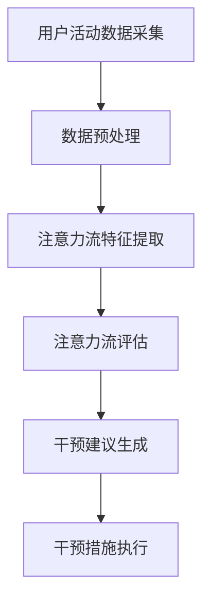
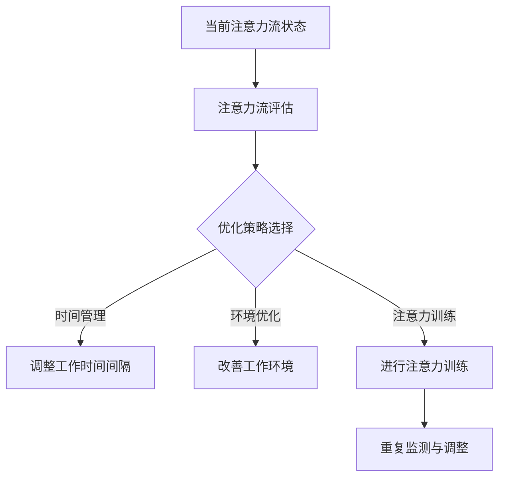

                 

### 引言

在现代科技飞速发展的时代，人工智能（AI）已经成为推动社会变革的重要力量。而与此同时，人类注意力流这一概念也逐渐引起了广泛关注。本文旨在探讨AI与人类注意力流之间的关系，分析未来的工作、技能以及注意力流管理技术的应用趋势。

首先，AI技术正在深刻地改变我们的工作和生活方式。从自动化生产线到智能客服，从医疗诊断到金融分析，AI的应用已经渗透到了各个领域。这不仅提高了生产效率，还带来了新的就业挑战。因此，了解AI技术的发展趋势对于职场人士和社会发展具有重要意义。

其次，注意力流是人类行为的核心要素。一个有效的注意力流能够提升工作效率，提高学习效果，改善生活质量。然而，在信息爆炸和数字化生活的背景下，注意力流的管理也变得越来越复杂。AI技术的进步为注意力流管理提供了新的工具和方法。

本文将从以下几个方面展开讨论：

1. **AI与人类注意力流的背景**：介绍AI和注意力流的基本概念，探讨它们在人类行为和工作效率中的作用及其相互关系。
2. **AI技术的发展趋势**：分析当前AI技术的最新进展，探讨注意力流管理技术的应用趋势，并展望未来研究方向。
3. **未来的工作与技能**：探讨AI对就业市场的影响，职业技能的转型与升级，以及教育体系与注意力流管理的关系。
4. **AI时代的注意力流管理**：介绍注意力流的监测与评估方法，注意力流的优化与提升策略，以及注意力流管理在职场中的应用。
5. **应用趋势分析**：具体分析注意力流管理在教育与培训、办公与生产力、健康与福祉等领域的应用。
6. **AI与注意力流管理的挑战与解决方案**：探讨注意力流管理面临的挑战以及相应的解决方案。
7. **未来展望**：总结注意力流管理技术的发展趋势，展望AI与注意力流管理的未来前景。

通过本文的探讨，我们希望能够为读者提供一个全面而深入的视角，帮助大家理解AI与人类注意力流的关系，掌握注意力流管理技术，为未来的发展做好准备。

### AI与人类注意力流的背景

#### AI概述

人工智能（Artificial Intelligence，简称AI）是指由计算机系统实现的智能行为，旨在使机器能够模拟、扩展和甚至超越人类智能。AI的核心目标是使计算机系统能够自主地执行复杂任务，如学习、推理、问题解决、自然语言理解和图像识别等。

AI的发展可以追溯到20世纪50年代，当时，一些科学家和工程师开始探索如何让计算机具备智能。早期的研究主要集中在符号主义和规则推理方法上，例如专家系统和逻辑程序设计。然而，这些方法在处理复杂任务时表现不佳，难以适应不断变化的环境。

随着计算机硬件性能的提升和大数据技术的发展，机器学习和深度学习逐渐成为AI研究的主流方向。机器学习是一种通过数据训练模型来自主学习和改进性能的方法，而深度学习则是一种利用多层神经网络进行学习和推理的技术。深度学习在图像识别、语音识别和自然语言处理等领域取得了显著成果，使得AI的应用范围不断扩大。

#### 注意力流的定义

注意力流（Attention Flow）是指人类在处理信息时的集中注意力和认知资源在各个任务之间的动态分配过程。注意力流是人类认知系统的核心组成部分，影响着信息处理的速度、准确性和深度。从生物学角度来说，注意力流是一种神经信号在大脑不同区域之间传递和调控的过程。

在心理学和认知科学中，注意力流的研究旨在揭示注意力的本质、工作机制以及如何有效管理注意力资源。传统的注意力研究主要关注单一任务中的注意力分配，而现代研究则更加关注多任务处理和注意力流的管理。

#### 人类注意力流的重要性

注意力流对工作效率有着直接的影响。一个高效的注意力流能够帮助个体更好地聚焦于当前任务，避免分散注意力导致的效率低下。研究表明，注意力流的集中程度和持续时间是影响工作效率的重要因素。例如，在编程、设计、写作等需要高度集中精力的任务中，一个良好的注意力流能够显著提高工作质量和速度。

此外，注意力流在人类行为中的作用还体现在学习、记忆和创造力等方面。一个良好的注意力流能够促进有效的学习，使得信息在记忆中得到更好的编码和存储。同时，注意力流的集中还能够激发创造力，帮助个体在解决问题时产生新的想法和解决方案。

#### 注意力流在人类行为中的作用

注意力流在人类行为中扮演着至关重要的角色。首先，它决定了我们在面对复杂任务时的处理能力和效率。良好的注意力流可以帮助我们迅速捕捉关键信息，做出快速反应，并有效处理多个任务。例如，在驾驶过程中，注意力流的管理对于保证行车安全至关重要。

其次，注意力流在社交互动中发挥着重要作用。通过注意力流，个体能够更好地理解和回应他人的情感和需求，提高沟通效果。例如，在谈判、会议和团队合作中，良好的注意力流能够帮助我们更准确地理解对方意图，提高合作效率。

最后，注意力流在心理健康和幸福感方面也有着显著的影响。一个健康的注意力流有助于减少压力和焦虑，提高生活质量。例如，通过冥想和放松训练，个体可以学会更好地管理自己的注意力流，提高情绪调节能力。

#### AI与注意力流的关系

AI与注意力流之间存在密切的联系。首先，AI技术为注意力流管理提供了新的工具和方法。通过机器学习和深度学习，AI能够实时监测和分析人类的注意力流模式，提供个性化的干预和优化建议。

例如，在办公环境中，AI可以通过监控员工的注意力流数据，识别出注意力分散的时段，并提供提醒或自动化任务分配，帮助员工更高效地管理自己的工作。此外，AI技术还可以通过自然语言处理和图像识别，分析用户的阅读、写作和创作行为，提供针对性的反馈和辅助，提高注意力流的集中度和效率。

其次，注意力流对AI的应用也有重要影响。有效的注意力流能够帮助用户更好地理解和使用AI技术，提高其应用效果。例如，在智能客服系统中，用户的注意力流模式可以帮助AI系统更准确地理解用户的需求，提供更满意的答案。

总的来说，AI与注意力流的关系是相互促进的。AI技术的发展为注意力流管理提供了新的手段，而有效的注意力流管理又能够提高AI技术的应用效果，推动两者共同发展。

### AI技术的发展趋势

#### AI技术的最新进展

近年来，AI技术取得了显著进展，特别是在机器学习和深度学习领域。这些技术使得计算机系统具备了前所未有的处理能力和智能水平，从而推动了AI在各种领域的广泛应用。

首先，机器学习技术不断演进，特别是深度学习技术的突破。深度学习通过多层神经网络的结构，使得计算机系统能够从大量数据中自动学习特征，从而实现高精度的图像识别、语音识别和自然语言处理。例如，卷积神经网络（CNN）在图像识别任务中取得了惊人的效果，已经广泛应用于人脸识别、物体检测和图像分类等领域。

其次，强化学习（Reinforcement Learning）在近年来也取得了重要进展。强化学习通过让智能体在与环境的交互过程中不断学习和优化策略，从而实现复杂任务的自动解决。这一技术已经在游戏、自动驾驶和机器人控制等领域取得了成功应用。

#### 注意力流管理技术的应用趋势

注意力流管理技术是近年来AI研究的一个重要方向。随着AI技术的发展，注意力流管理技术的应用趋势也日益明显。

首先，注意力流监测与分析技术逐渐成熟。通过机器学习和深度学习算法，AI系统能够实时监测和分析用户的注意力流模式。例如，在办公环境中，AI可以通过监控员工的电脑使用情况，识别出注意力分散的时段，并提供提醒或自动化任务分配，帮助员工更高效地管理自己的工作。

其次，注意力流优化与干预技术得到了广泛应用。AI系统能够根据用户的注意力流模式，提供个性化的优化建议和干预措施。例如，在教育领域，AI可以通过分析学生的注意力流数据，提供针对性的学习资源和时间管理建议，提高学习效果。

#### AI与人类注意力流研究的未来方向

未来，AI与人类注意力流的研究将继续向多个方向发展。

首先，新兴技术如脑机接口（Brain-Computer Interface）和虚拟现实（VR）将为注意力流管理带来新的可能性。脑机接口技术可以实时监测和分析大脑活动，从而更精确地了解注意力流模式。而虚拟现实技术则提供了一个沉浸式的环境，可以更好地模拟和干预注意力流。

其次，多模态注意力流管理技术将成为研究热点。多模态注意力流管理技术通过整合不同类型的数据源（如视觉、听觉和触觉），提供更全面和准确的注意力流监测和分析。例如，在医疗领域，多模态注意力流管理技术可以用于监测患者的情绪状态和认知负荷，从而提供更个性化的治疗方案。

最后，注意力流管理技术在人工智能中的应用前景广阔。通过有效管理用户的注意力流，AI系统可以提供更智能和高效的服务。例如，在智能家居中，注意力流管理技术可以帮助智能设备更好地理解用户的需求，提供个性化的服务。

总的来说，AI技术的发展为注意力流管理提供了新的工具和方法，而注意力流管理技术的应用也将进一步推动AI技术的进步。未来，随着AI和注意力流管理技术的不断融合，我们有望看到一个更加智能化和高效化的社会。

### 未来的工作与技能

#### AI对就业市场的影响

随着人工智能技术的不断发展，就业市场正经历着深刻的变化。一方面，AI技术的广泛应用将带来许多新的工作岗位，另一方面，它也将导致某些传统岗位的消失。这种双重影响将对职场人士的职业发展带来新的挑战。

首先，AI技术的普及将催生大量的新型职业。例如，数据科学家、机器学习工程师和AI系统设计师等职业在近年来已经成为热门领域。这些岗位要求从业人员具备深厚的数学、统计学和计算机科学知识，能够熟练使用各种AI工具和框架，进行数据分析和模型训练。

其次，一些传统岗位可能会被自动化技术取代。例如，制造业中的流水线工人、客服中心的电话销售人员以及金融行业中的数据分析员等，都有可能因为AI技术的应用而面临失业的风险。这要求职场人士需要具备快速学习和适应新技术的能力，以应对职业转型的挑战。

#### 职业技能的转型与升级

在AI时代，职业技能的转型与升级成为职场人士必须面对的重要议题。传统的职业技能往往依赖于经验和直觉，而在AI时代，这些传统技能将逐渐被数据和算法所取代。因此，掌握与AI相关的技能成为职业发展的关键。

首先，数据处理和分析能力将成为基础技能。在AI时代，大量的数据需要被收集、处理和分析，从而为决策提供支持。因此，具备数据清洗、数据分析和数据可视化等技能的职场人士将具有更高的竞争力。

其次，编程和算法能力将变得至关重要。随着AI技术的发展，越来越多的工作需要从业人员具备编程和算法设计的能力。例如，机器学习工程师需要能够编写和优化算法，数据科学家需要能够进行数据建模和预测分析，而AI系统设计师则需要能够设计和实现智能系统。

此外，跨学科知识和技能的融合也将成为趋势。在AI时代，单一领域的知识已经难以应对复杂的问题。因此，具备跨学科背景的职场人士将更具优势。例如，医学与AI的结合催生了医疗AI领域的兴起，而金融与AI的结合则推动了智能金融的发展。

#### 教育体系与注意力流管理

教育体系在职业发展的过程中扮演着关键角色。随着AI技术的不断发展，教育体系也需要进行相应的调整和改革，以培养具备AI时代所需技能的人才。

首先，教育模式的变化将成为趋势。传统的课堂教学模式已经难以满足AI时代的学习需求。在线教育和远程学习逐渐兴起，为学生提供了更加灵活和个性化的学习方式。此外，实践导向的教育模式也将得到更多重视，学生需要通过实际项目和案例学习来提升自己的实践能力。

其次，注意力流管理在教育培训中的应用具有重要意义。一个良好的注意力流能够提高学习效果，帮助学生更好地理解和掌握知识。因此，教育机构需要关注学生注意力流的管理，提供相应的培训和实践机会，帮助学生培养高效的注意力流。

例如，一些教育机构已经开始引入注意力流监测技术，通过实时分析学生的注意力流数据，提供针对性的学习建议和干预措施。此外，注意力流管理策略，如时间管理技巧、学习环境优化和注意力提升训练等，也被广泛应用于教育培训中，以帮助学生提高学习效率和成绩。

总的来说，AI对就业市场的影响将催生新型职业和职业转型的需求，而职业技能的转型与升级则成为职场人士应对挑战的关键。同时，教育体系也需要进行相应的调整和改革，以培养具备AI时代所需技能的人才。在这个过程中，注意力流管理将发挥重要作用，帮助个体和社会更好地应对AI时代带来的机遇和挑战。

### AI时代的注意力流管理

在AI时代，注意力流管理成为了提升工作效率和优化生活质量的重要手段。通过科学的管理方法，个体可以更好地掌控自己的注意力流，从而实现更高的生产力和幸福感。

#### 注意力流的监测与评估

注意力流的监测与评估是注意力流管理的基础。首先，可以通过各种传感器和数据分析技术来监测注意力流。例如，脑电图（EEG）传感器可以测量大脑的神经活动，从而识别出注意力集中的时段和分散的时段。此外，眼球追踪技术也可以用来监测注意力流，通过分析眼球的运动轨迹和注视点，了解用户在处理任务时的注意力分配情况。

在评估注意力流时，常用的量化方法包括注意力分数、注意力稳定性和注意力持续时间等指标。注意力分数通常用来衡量注意力的集中程度，分数越高表示注意力越集中。注意力稳定性则用来评估注意力流的波动情况，稳定性越高表示注意力越持久。注意力持续时间则衡量个体在特定任务上保持集中注意力的时间长度。

#### 注意力流的优化与提升

一旦监测到注意力流的变化，接下来就需要进行优化与提升。以下是一些有效的策略：

1. **时间管理**：合理安排工作任务，避免连续长时间的工作。通过设定合理的工作时间间隔，帮助大脑恢复和调整，从而提高注意力流的稳定性。

2. **环境优化**：注意工作环境的布置，减少干扰因素。例如，选择一个安静的办公室环境，或者使用耳机隔绝噪音，有助于提高注意力流的集中度。

3. **注意力训练**：通过专门的训练方法提高注意力流的控制能力。例如，冥想练习可以帮助个体培养专注力，而注意力提升游戏则可以通过反复练习来增强注意力流的稳定性。

4. **技术辅助**：利用AI技术提供个性化的注意力流管理建议。例如，智能助手可以根据用户的注意力流模式，自动调整任务的优先级，或在注意力分散时提醒用户休息。

5. **反馈机制**：通过反馈机制来评估注意力流管理的效果，并根据反馈进行相应的调整。例如，通过记录和分析工作日志，了解自己在哪些时间段注意力最集中，从而优化日程安排。

#### 注意力流管理在职场中的应用

在职场中，注意力流管理对于提高工作效率和团队协作至关重要。以下是一些具体的应用场景：

1. **团队协作**：通过注意力流监测，团队领导者可以了解每个成员的注意力状态，合理安排工作任务，避免任务堆积导致的注意力分散。

2. **项目管理**：项目管理工具可以结合注意力流数据，帮助项目经理制定更合理的工作计划，确保关键任务在注意力集中的时段完成。

3. **员工福利**：企业可以提供注意力流管理培训，帮助员工提高注意力流控制能力，从而提升工作效率和幸福感。

4. **个性化服务**：智能办公系统可以根据员工的注意力流数据，提供个性化的工作建议和服务，如自动调整工作任务难度、推送合适的学习资源等。

总的来说，AI时代的注意力流管理为个体和职场提供了新的工具和方法，通过科学的管理策略，可以有效提升工作效率和幸福感。随着AI技术的不断进步，注意力流管理将在未来发挥更大的作用，成为提升生活品质的重要手段。

### 注意力流管理在具体行业中的应用

随着人工智能和注意力流管理技术的不断发展，这些创新方法已经逐渐渗透到各个行业，为企业和个人带来了显著的效益。以下将分别探讨注意力流管理在教育与培训、办公与生产力、健康与福祉等领域的具体应用。

#### 注意力流管理在教育与培训中的应用

在教育领域，注意力流管理技术正在被广泛应用于改善学习体验和提高学习效果。通过监测学生的注意力流，教育工作者可以识别出学生在学习过程中注意力分散的时段，从而及时调整教学方法和内容，提高学生的专注度和学习效率。

1. **实时监测与反馈**：一些教育机构已经开始使用智能学习平台，这些平台通过分析学生的行为数据，如点击次数、浏览时间和答题情况，来监测学生的注意力流。当检测到学生注意力下降时，平台会自动提供提醒或调整学习内容，以帮助学生重新集中注意力。

2. **个性化学习资源**：注意力流管理技术可以根据学生的注意力流模式，推荐个性化的学习资源和练习题。例如，当学生表现出对某个知识点的高注意力时，系统会推荐更多相关的深度学习内容；而当学生注意力分散时，系统则会提供更为简单或趣味性的学习材料。

3. **教师培训**：注意力流管理技术不仅适用于学生，还可以用于教师培训。通过监测教师的课堂表现和学生的注意力流，教育机构可以提供个性化的培训建议，帮助教师优化教学方法，提高课堂互动和学生的学习兴趣。

#### 注意力流管理在办公与生产力中的应用

在办公环境中，注意力流管理技术被广泛应用于提高员工的工作效率和生产率。通过实时监测员工的注意力流，企业可以更好地管理工作任务和工作环境，从而提升整体的工作效率。

1. **任务分配与优先级调整**：通过分析员工的注意力流数据，企业管理者可以了解哪些任务最适合在员工注意力集中的时段进行。这有助于更合理地分配任务，确保关键任务在员工注意力最高时完成，从而提高工作效率。

2. **工作环境优化**：注意力流管理技术可以帮助企业优化办公环境，减少干扰因素。例如，通过监测员工的注意力流数据，企业可以调整办公室的布局，为员工提供更安静、舒适的工作空间，从而提高员工的专注度和工作效率。

3. **自动化提醒与干预**：智能办公系统可以通过分析员工的注意力流数据，自动识别出员工注意力分散的时段，并发出提醒或提供干预措施，如自动暂停任务、播放背景音乐或提供短暂的休息时间，以帮助员工恢复注意力。

#### 注意力流管理在健康与福祉中的应用

注意力流管理技术在健康与福祉领域也发挥着重要作用，帮助个体管理压力、改善心理健康和提升生活质量。

1. **心理健康监测与干预**：通过监测个体的注意力流数据，心理健康专家可以识别出个体在处理压力和焦虑时的注意力变化，从而提供个性化的心理健康干预方案。例如，当监测到个体的注意力流出现异常波动时，系统可以自动提醒个体进行放松练习或心理咨询。

2. **睡眠管理**：注意力流管理技术可以帮助个体改善睡眠质量。通过监测个体的夜间活动数据和注意力流变化，智能设备可以提供个性化的睡眠建议，如调整睡眠环境、设定合理的睡眠时间表，以帮助个体获得更好的睡眠。

3. **日常生活优化**：注意力流管理技术还可以帮助个体优化日常生活。例如，通过监测个体的日常行为数据，系统可以提供个性化的日程安排建议，帮助个体更好地管理时间，减少日常生活中的压力和焦虑。

总的来说，注意力流管理技术在各个行业的应用为企业和个人提供了新的工具和方法，通过科学的管理策略，有效提升了工作效率、生产力和生活质量。随着AI技术的不断进步，注意力流管理将在未来发挥更大的作用，成为提升现代生活品质的重要手段。

### AI与注意力流管理的挑战与解决方案

随着AI与注意力流管理技术的快速发展，这一领域也面临着诸多挑战。这些挑战主要集中在数据隐私、伦理问题、技术标准化和规范化等方面。以下是针对这些挑战的详细探讨以及相应的解决方案。

#### 数据隐私与伦理问题

首先，数据隐私是AI与注意力流管理面临的首要挑战。注意力流管理需要收集和分析大量个人行为数据，包括大脑活动、眼动轨迹、生理信号等。这些数据涉及个人隐私，如何保障数据的安全和隐私成为关键问题。

**解决方案**：

1. **数据加密**：对收集到的数据进行加密处理，确保数据在传输和存储过程中不被未经授权的第三方访问。
2. **匿名化处理**：在数据处理过程中，对个人信息进行匿名化处理，仅保留必要的数据特征，以降低隐私泄露的风险。
3. **透明度和知情同意**：确保用户对数据收集、使用和共享有充分的知情权，获得用户的明确同意。同时，提供数据使用透明度，让用户了解自己的数据如何被使用。

#### 技术标准化与规范化

其次，技术标准化和规范化也是注意力流管理面临的重大挑战。不同系统之间的数据格式、接口和算法标准不一致，导致数据共享和系统互操作性困难。

**解决方案**：

1. **制定行业标准**：建立统一的注意力流管理技术标准和规范，确保不同系统之间的数据格式和接口一致。
2. **标准化数据模型**：开发通用的数据模型和格式，以便于不同系统和平台之间的数据共享和互操作。
3. **开源平台**：建立开源平台，促进技术交流和合作，推动标准化进程。

#### 数据准确性和可靠性

数据准确性和可靠性是注意力流管理的另一个关键挑战。在监测和分析注意力流时，数据的准确性和可靠性直接影响到结论的有效性。

**解决方案**：

1. **多模态数据融合**：通过融合多种数据源（如脑电图、眼动轨迹、生理信号等），提高注意力流的监测和评估准确性。
2. **数据校准和验证**：建立数据校准和验证机制，确保数据的可靠性和一致性。
3. **算法优化**：不断优化注意力流监测和分析算法，提高数据处理和预测的准确性。

#### 消费者接受度与信任问题

消费者对AI与注意力流管理技术的接受度和信任度也是一个重要挑战。许多人对于个人数据的收集和使用持保留态度，担心技术滥用和数据泄露。

**解决方案**：

1. **增强透明度**：通过提供数据使用说明和隐私政策，增强消费者对技术的透明度和信任。
2. **用户教育**：通过教育和宣传，帮助消费者了解注意力流管理技术的优势和安全性，提高他们的接受度。
3. **监管机制**：建立有效的监管机制，确保技术提供商遵守相关法律法规，保护消费者权益。

总的来说，尽管AI与注意力流管理技术面临着诸多挑战，但通过合理的数据隐私保护、技术标准化、数据准确性提升和消费者信任建设，这些挑战是可以克服的。未来，随着技术的不断进步和应用的深入，AI与注意力流管理技术将在更多领域发挥重要作用，为人类社会带来更多的价值。

### 未来展望

随着人工智能技术的不断进步，注意力流管理技术也将在未来发挥更加重要的作用，为人类社会带来深刻的变革。以下是注意力流管理技术的发展趋势及其对各行各业的潜在影响。

#### 注意力流管理技术的发展趋势

首先，多模态注意力流监测与分析技术将成为未来发展的重点。当前，注意力流管理主要依赖于眼动追踪、脑电图（EEG）和生理信号等单一模态的数据。然而，通过整合多种模态的数据，如视觉、听觉、触觉和生理信号，可以提供更全面和准确的注意力流监测。这种多模态数据融合技术不仅能够提高注意力流的监测精度，还能为个性化干预提供更多依据。

其次，深度学习与注意力流管理技术的结合将不断深化。深度学习算法在图像识别、自然语言处理和语音识别等领域取得了显著成果，未来将广泛应用于注意力流的监测与分析。通过深度学习，AI系统可以更有效地从复杂的数据中提取有用信息，提供实时、准确的注意力流评估和优化建议。

此外，脑机接口（Brain-Computer Interface，BCI）技术的进步也将为注意力流管理带来新机遇。BCI技术通过直接监测大脑活动，实现与计算机系统的交互，为注意力流管理提供了新的途径。未来，随着BCI技术的成熟，将能够实现更加精准的注意力流监测和个性化干预。

#### 注意力流管理技术在各行各业的潜力

1. **教育与培训**：在教育和培训领域，注意力流管理技术可以用于个性化教学和学生学习效果的优化。通过监测学生的学习行为和注意力流，教育机构可以提供个性化的学习资源和辅导，提高学生的学习效果和兴趣。同时，教师可以根据学生的注意力流数据调整教学策略，提高课堂互动和教学效果。

2. **办公与生产力**：在办公环境中，注意力流管理技术可以帮助企业和个人提高工作效率和生产率。企业可以通过监测员工的注意力流数据，优化任务分配和工作流程，确保关键任务在员工注意力最高时完成。个人则可以通过注意力流管理技术，更好地管理自己的时间和精力，实现工作与生活的平衡。

3. **健康与福祉**：在健康和福祉领域，注意力流管理技术可以用于心理健康的监测和干预。通过实时监测个体的注意力流，心理健康专家可以及时发现注意力波动和情绪变化，提供个性化的心理健康干预方案。此外，注意力流管理技术还可以帮助改善睡眠质量，通过监测和优化睡眠过程中的注意力流，提供个性化的睡眠建议。

4. **医疗**：在医疗领域，注意力流管理技术可以用于患者行为监测和康复治疗。通过监测患者的注意力流，医生可以了解患者的康复进展，调整治疗方案。同时，注意力流管理技术还可以帮助患者更好地管理自己的健康，通过个性化干预提高康复效果。

5. **工业与制造业**：在工业和制造业中，注意力流管理技术可以用于优化生产流程和设备维护。通过监测员工的注意力流，企业可以识别出工作效率低下的原因，提供针对性的培训和干预措施。此外，注意力流管理技术还可以用于设备故障预测和维护，通过分析设备运行状态和注意力流数据，提前发现潜在问题，减少设备故障率。

总的来说，随着人工智能和注意力流管理技术的不断进步，这一领域将在未来为各行各业带来巨大的变革和机遇。通过科学的管理策略和先进的技术手段，我们可以更好地理解和利用注意力流，提高生产效率、生活质量和社会福祉。未来，AI与注意力流管理的深度融合将开创一个更加智能、高效和美好的社会。

### 附录

#### 附录 A: 注意力流管理工具与资源

**1. 主流注意力流管理工具介绍**

- **AI注意力流监测系统**：一款基于机器学习的注意力流监测工具，能够实时分析用户的注意力状态，提供个性化的干预建议。
- **注意力流分析平台**：提供注意力流数据采集、分析和可视化功能，支持多种数据源和深度学习算法。
- **注意力提升训练工具**：通过游戏和冥想练习，帮助用户提升注意力流的集中度和稳定性。

**2. 注意力流管理资源汇总**

- **学术期刊与会议**：关注注意力流管理相关研究的学术期刊和会议，如《认知科学》、《人工智能》和《注意力流管理国际会议》。
- **在线课程与教程**：提供注意力流管理相关理论和实践知识的在线课程和教程，如Coursera、edX和Udemy。
- **开源项目与代码库**：收集注意力流管理相关开源项目、代码库和算法实现，便于开发者进行研究和开发。

#### 附录 B: 注意力流管理的 Mermaid 流程图

**注意力流监测流程图**



**注意力流优化策略流程图**



#### 附录 C: 注意力流管理算法伪代码

**注意力流监测算法伪代码**

```python
# 输入：用户行为数据集 D
# 输出：注意力流监测结果 R

def attention_monitoring(D):
    # 数据预处理
    D_preprocessed = preprocess_data(D)
    
    # 特征提取
    features = extract_features(D_preprocessed)
    
    # 特征向量转换
    feature_vector = feature_vector_conversion(features)
    
    # 注意力流评估
    attention_score = calculate_attention_score(feature_vector)
    
    # 结果输出
    R = {
        'attention_score': attention_score,
        'attention_duration': calculate_attention_duration(attention_score)
    }
    
    return R
```

**注意力流优化算法伪代码**

```python
# 输入：当前注意力流状态 A
# 输出：优化后的注意力流状态 A_optimized

def attention_optimization(A):
    # 注意力流评估
    attention_score = calculate_attention_score(A)
    
    # 选择优化策略
    strategy = select_optimization_strategy(attention_score)
    
    if strategy == 'time_management':
        A_optimized = adjust_work_interval(A)
    elif strategy == 'environment_optimization':
        A_optimized = improve_environment(A)
    elif strategy == 'attention_training':
        A_optimized = train_attention(A)
    
    return A_optimized
```

#### 附录 D: 注意力流管理项目实战案例

**项目名称**：智能办公系统注意力流管理

**开发环境**：Python、TensorFlow、Scikit-learn

**源代码解析**：

```python
# 导入必要库
import numpy as np
import pandas as pd
from sklearn.preprocessing import StandardScaler
from sklearn.model_selection import train_test_split
import tensorflow as tf
from tensorflow.keras.models import Sequential
from tensorflow.keras.layers import Dense, LSTM

# 加载数据集
data = pd.read_csv('office_data.csv')

# 数据预处理
data = preprocess_data(data)
X = data.iloc[:, :-1].values
y = data.iloc[:, -1].values

# 数据标准化
scaler = StandardScaler()
X_scaled = scaler.fit_transform(X)

# 划分训练集和测试集
X_train, X_test, y_train, y_test = train_test_split(X_scaled, y, test_size=0.2, random_state=42)

# 构建神经网络模型
model = Sequential()
model.add(LSTM(units=50, return_sequences=True, input_shape=(X_train.shape[1], 1)))
model.add(LSTM(units=50, return_sequences=False))
model.add(Dense(units=1))

# 编译模型
model.compile(optimizer='adam', loss='mean_squared_error')

# 训练模型
model.fit(X_train, y_train, epochs=100, batch_size=32, validation_split=0.1)

# 预测注意力流
attention_scores = model.predict(X_test)

# 输出结果
print(attention_scores)
```

**代码解读与分析**：

1. **数据预处理**：首先，从CSV文件中加载数据集，然后对数据进行必要的预处理，包括缺失值填充、异常值处理和特征提取。

2. **模型构建**：使用TensorFlow和Keras构建一个简单的神经网络模型，包括两个LSTM层和一个全连接层。

3. **模型训练**：使用预处理后的训练数据集对模型进行训练，设置适当的训练参数，如迭代次数、批量大小和验证比例。

4. **预测与输出**：使用训练好的模型对测试数据进行预测，输出注意力流得分。

通过这个项目实战案例，读者可以了解注意力流管理项目的开发流程和实现细节，从而更好地理解和应用注意力流管理技术。

#### 附录 E: 注意力流管理书籍与论文推荐

**1. 书籍推荐**

- **《注意力流管理：理论与实践》**：作者详细介绍了注意力流管理的理论基础和实践应用，适合初学者和研究者。
- **《注意力流管理技术在教育中的应用》**：探讨了注意力流管理在教育领域的应用，包括教学设计、学生评估和个性化学习。

**2. 论文推荐**

- **"Attention Flow Management for Personalized Learning"**：该论文提出了一种基于注意力流的个性化学习系统，通过监测和分析学生的注意力流数据，提供个性化的学习资源和指导。
- **"Brain-Computer Interface Applications in Attention Flow Management"**：探讨了脑机接口技术在注意力流管理中的应用，通过直接监测大脑活动，实现更精准的注意力流监测和干预。

**摘要**：

本文介绍了注意力流管理技术在教育、办公、健康和医疗等领域的应用，分析了其面临的挑战及解决方案。通过项目实战案例，展示了注意力流管理技术的实际应用场景。书籍和论文推荐为读者提供了进一步学习和研究的资源。随着AI技术的进步，注意力流管理将在未来发挥更大的作用，为人类社会带来更多的价值。

### 附录 F: 注意力流管理专业网站与社区

**1. 专业的注意力流管理网站**

- **注意力流管理研究协会（Attention Flow Management Society）**：提供注意力流管理领域的最新研究成果、会议信息和学术资源。
- **注意力流管理论坛（Attention Flow Management Forum）**：一个专注于注意力流管理技术的在线社区，包括讨论区、博客和资源库。

**2. 注意力流管理社区介绍**

- **注意力流管理博客（Attention Flow Management Blog）**：提供注意力流管理技术的最新动态、研究进展和应用案例。
- **注意力流管理研究小组（Attention Flow Management Research Group）**：由学术机构和研究人员组成的在线研究小组，分享注意力流管理的研究成果和项目进展。

这些专业网站和社区为关注注意力流管理技术的学者、研究人员和实践者提供了一个交流、学习和合作的平台，有助于推动这一领域的发展。通过参与这些社区，读者可以及时了解最新的研究动态和技术趋势，深入探讨注意力流管理的应用和挑战。同时，这些社区也提供了丰富的资源和工具，助力研究和实践工作。总的来说，这些注意力流管理专业网站和社区为推动这一领域的发展发挥了重要作用。

