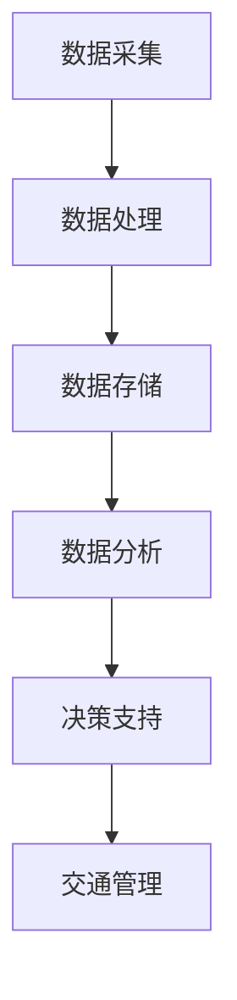

                 

# AI与人类计算：打造可持续发展的城市交通管理系统与基础设施

## 关键词
- AI与人类计算
- 城市交通管理系统
- 智能规划
- 基础设施智能化
- 可持续交通管理

## 摘要
本文探讨了AI与人类计算在打造可持续发展的城市交通管理系统与基础设施中的重要作用。首先，我们分析了当前城市交通管理系统的现状与挑战，然后介绍了AI在交通规划与设计、基础设施智能化等方面的应用案例。接着，我们深入探讨了人机交互与交通管理、AI驱动的城市交通数据分析，以及城市交通系统的可持续管理策略。最后，通过实际案例研究和未来展望，我们提出了AI与城市交通系统融合的发展趋势和解决方案。

## 目录大纲

## 第一部分: AI与人类计算概述

### 第1章: 城市交通管理系统与基础设施的可持续性

#### 1.1 AI在可持续城市交通中的作用
#### 1.2 城市交通管理系统的现状与挑战
#### 1.3 AI在交通管理中的应用案例

### 第2章: AI驱动的城市交通规划与设计

#### 2.1 交通需求预测
#### 2.2 交通流量分析与优化
#### 2.3 交通规划与设计原则

### 第3章: 城市交通基础设施智能化

#### 3.1 智能交通信号控制系统
#### 3.2 智能停车系统
#### 3.3 城市道路监测系统

## 第二部分: AI与人类计算的融合

### 第4章: 人机交互与交通管理

#### 4.1 基于AI的智能交通助手
#### 4.2 人机协作在城市交通中的应用
#### 4.3 人机交互与交通行为的改变

### 第5章: AI驱动的城市交通数据分析

#### 5.1 数据收集与预处理
#### 5.2 数据分析与可视化
#### 5.3 数据驱动的交通决策支持

### 第6章: 城市交通系统的可持续管理

#### 6.1 可持续交通管理策略
#### 6.2 AI与政策制定的结合
#### 6.3 持续改进与未来展望

## 第三部分: 实际案例与应用

### 第7章: 案例研究：智能城市交通管理系统

#### 7.1 案例背景与目标
#### 7.2 技术选型与实施
#### 7.3 项目成果与评估

### 第8章: AI与城市交通系统的未来

#### 8.1 AI技术的发展趋势
#### 8.2 未来城市交通系统的愿景
#### 8.3 挑战与解决方案

### 附录

#### 附录 A: AI交通管理相关工具与资源
#### 附录 B: AI交通管理系统开发实践案例
#### 附录 C: 术语解释与参考文献

## 附加说明

#### 附录 D: Mermaid 流程图
#### 附录 E: 伪代码示例
#### 附录 F: 数学模型与公式
#### 附录 G: 项目实战代码解读
#### 附录 H: AI与交通管理学术研究趋势

### 引言
城市交通系统是现代城市发展的核心基础设施之一。然而，随着城市规模的不断扩大和人口的增长，城市交通问题日益凸显。交通拥堵、环境污染、能源消耗等问题严重影响着城市居民的生活质量。为了解决这些问题，AI与人类计算的融合成为城市交通管理的新趋势。本文将从多个角度探讨AI与人类计算在打造可持续发展的城市交通管理系统与基础设施中的作用。

### 第一部分: AI与人类计算概述

## 第1章: 城市交通管理系统与基础设施的可持续性

在城市化进程中，城市交通管理系统与基础设施的可持续性成为关注的焦点。随着全球气候变化和能源危机的加剧，如何实现绿色、智能、可持续的交通系统成为各国政府和研究机构亟待解决的重要问题。

### 1.1 AI在可持续城市交通中的作用

AI技术在可持续城市交通中的应用主要体现在以下几个方面：

1. **交通需求预测与优化**：利用机器学习和大数据分析技术，对城市交通需求进行预测，优化交通资源的配置，减少交通拥堵。
2. **交通流量分析与优化**：通过实时交通数据采集与分析，对城市交通流量进行动态监控和优化，提高道路通行效率。
3. **智能交通信号控制**：利用AI技术优化交通信号控制策略，实现红绿灯时长的智能调节，减少交通事故和交通拥堵。
4. **智能停车管理**：通过AI技术优化停车资源分配，提高停车效率，减少停车难题。
5. **城市道路监测与维护**：利用传感器技术和物联网，实时监测城市道路状况，及时进行维护和修复，提高道路使用寿命。

### 1.2 城市交通管理系统的现状与挑战

当前，城市交通管理系统存在以下几大挑战：

1. **数据质量与处理能力**：城市交通数据量巨大，且存在噪声和缺失值，如何提高数据处理能力和数据质量是关键。
2. **技术集成与兼容性**：AI技术涉及多个领域，如何实现不同技术之间的集成和兼容，是当前面临的一大难题。
3. **政策支持与法规制定**：AI技术在交通管理中的应用需要政策支持和法规保障，如何制定合理的政策和法规，促进AI技术在交通管理中的应用。
4. **人机交互与安全**：在AI与人类计算的融合过程中，如何确保人机交互的便利性和安全性，避免因AI错误导致的安全事故。

### 1.3 AI在交通管理中的应用案例

AI在交通管理中的应用案例已在全球多个城市得以实践：

1. **伦敦的智能交通信号控制**：伦敦采用AI技术优化交通信号控制，实现了交通流量的实时监测和动态调整，有效减少了交通拥堵和交通事故。
2. **新加坡的智能停车管理**：新加坡利用AI技术优化停车资源分配，实现了停车位的智能调度和实时预订，提高了停车效率。
3. **北京的智能交通监控**：北京利用AI技术对城市交通进行实时监控和数据分析，实现了交通状况的动态评估和预警，提高了城市交通管理水平。

### 第2章: AI驱动的城市交通规划与设计

城市交通规划与设计是城市可持续发展的重要环节。AI技术的引入，为城市交通规划与设计提供了新的思路和工具。

### 2.1 交通需求预测

交通需求预测是城市交通规划的基础。通过收集和分析历史交通数据、人口数据、经济数据等，利用机器学习算法，可以预测未来交通需求。

#### 数据收集与预处理

数据收集是交通需求预测的关键步骤。数据来源包括交通监测系统、GPS数据、交通流量调查等。在收集数据后，需要对数据进行预处理，包括数据清洗、数据整合和数据归一化。

#### 机器学习模型选择

常见的机器学习模型包括线性回归、决策树、支持向量机、神经网络等。根据数据的特点和需求，选择合适的模型进行预测。

#### 模型训练与评估

利用历史数据对机器学习模型进行训练，并通过交叉验证等方法评估模型的性能。模型评估指标包括准确率、召回率、F1值等。

### 2.2 交通流量分析与优化

交通流量分析是城市交通管理的重要组成部分。通过实时交通数据采集和分析，可以了解城市交通状况，为交通管理提供决策支持。

#### 流量分析

利用大数据分析和机器学习技术，对实时交通数据进行处理和分析，识别交通拥堵、交通事故等异常情况。

#### 优化算法

常见的优化算法包括基于约束的优化算法、基于模拟的优化算法和基于智能优化算法。通过优化算法，可以实现交通流量的动态调整和资源优化。

### 2.3 交通规划与设计原则

交通规划与设计应遵循以下原则：

1. **可持续性**：交通规划与设计应注重环保、节能、减排，促进城市可持续发展。
2. **高效性**：交通规划与设计应提高交通运行效率，减少交通拥堵，提高道路通行能力。
3. **安全性**：交通规划与设计应确保交通安全，减少交通事故发生。
4. **便利性**：交通规划与设计应提高交通便捷性，满足居民出行需求。
5. **适应性**：交通规划与设计应具备灵活性，适应城市发展和交通需求的变化。

### 第3章: 城市交通基础设施智能化

城市交通基础设施智能化是AI技术在交通管理中的重要应用方向。通过智能化基础设施，可以提升城市交通系统的运行效率和安全性。

### 3.1 智能交通信号控制系统

智能交通信号控制系统通过实时交通数据采集和分析，优化交通信号控制策略，提高交通运行效率。

#### 系统架构

智能交通信号控制系统包括以下几个部分：

1. **数据采集**：通过交通监控摄像头、传感器等设备，实时采集交通数据。
2. **数据处理**：利用大数据分析和机器学习技术，对交通数据进行处理和分析。
3. **信号控制**：根据处理结果，动态调整交通信号灯时长，实现交通流量的优化。
4. **反馈机制**：通过反馈机制，不断优化信号控制策略，提高系统性能。

#### 算法实现

智能交通信号控制算法主要包括以下几种：

1. **基于交通流量预测的信号控制**：利用机器学习算法，预测未来交通流量，根据预测结果动态调整信号灯时长。
2. **基于交通状态反馈的信号控制**：根据实时交通数据，动态调整信号灯时长，实现交通流量的动态优化。
3. **混合信号控制算法**：结合多种信号控制算法，实现交通流量的最优控制。

### 3.2 智能停车系统

智能停车系统通过实时监测停车资源，优化停车资源配置，提高停车效率。

#### 系统设计

智能停车系统包括以下几个部分：

1. **车位监测**：通过传感器、摄像头等设备，实时监测停车位状态。
2. **数据采集**：通过数据采集系统，将车位监测数据上传至后台。
3. **数据分析**：利用大数据分析和机器学习技术，分析停车数据，预测停车需求。
4. **停车引导**：根据停车数据，实时发布停车信息，引导车辆前往空闲车位。
5. **停车收费**：利用智能收费系统，实现停车费的自动收取。

#### 优化策略

智能停车系统的优化策略包括：

1. **车位利用率优化**：通过数据分析，识别停车高峰期和低谷期，动态调整停车资源分配，提高车位利用率。
2. **停车需求预测**：利用机器学习算法，预测停车需求，提前做好停车资源准备。
3. **停车引导策略**：根据实时停车数据，动态调整停车引导策略，提高停车效率。

### 3.3 城市道路监测系统

城市道路监测系统通过实时监测道路状况，及时进行道路维护和修复，提高道路使用寿命。

#### 监测技术

城市道路监测系统采用以下几种监测技术：

1. **传感器技术**：通过传感器实时监测道路状况，如温度、湿度、路况等。
2. **摄像头技术**：通过摄像头实时监测道路状况，识别交通拥堵、交通事故等异常情况。
3. **物联网技术**：通过物联网技术，实现道路监测数据的实时传输和共享。

#### 数据分析

通过大数据分析和机器学习技术，对道路监测数据进行分析，识别道路状况变化趋势，预测道路损坏情况，为道路维护提供决策支持。

### 第4章: 人机交互与交通管理

人机交互在交通管理中发挥着重要作用。通过智能交通助手和人机协作，可以提高交通管理效率和安全性。

### 4.1 基于AI的智能交通助手

智能交通助手通过语音识别、自然语言处理等技术，为交通管理者提供实时交通信息、交通预测和决策支持。

#### 交互方式

智能交通助手采用以下几种交互方式：

1. **语音交互**：通过语音识别技术，实现人与智能交通助手的语音交互。
2. **图形交互**：通过图形用户界面，实现人与智能交通助手的人机交互。
3. **文本交互**：通过自然语言处理技术，实现人与智能交通助手的文本交互。

#### 功能实现

智能交通助手的主要功能包括：

1. **实时交通信息查询**：提供实时交通流量、路况、交通事故等信息。
2. **交通预测**：利用机器学习算法，预测未来交通状况，为交通管理提供决策支持。
3. **交通决策支持**：根据实时交通数据和交通预测，提供交通管理建议，如调整交通信号、优化交通流量等。

### 4.2 人机协作在城市交通中的应用

人机协作在城市交通管理中具有重要作用。通过将AI技术与人类专家的知识和经验相结合，可以提高交通管理的效率和准确性。

#### 协作模式

人机协作在城市交通管理中的应用模式包括：

1. **辅助决策**：AI技术为交通管理者提供决策支持，帮助其做出更科学的决策。
2. **自主决策**：AI技术在特定场景下，可以自主做出决策，如智能交通信号控制。
3. **人机混合决策**：AI技术与人类专家共同参与决策，实现人机协同工作。

#### 挑战与对策

人机协作在城市交通管理中面临以下挑战：

1. **数据质量**：AI技术对数据质量有较高要求，如何提高数据质量是关键。
2. **算法可靠性**：AI算法的可靠性和稳定性是保障交通管理效率和安全性的关键。
3. **人机交互**：如何设计合理的人机交互界面，提高人机交互的便利性和体验性。

对策包括：

1. **数据质量管理**：建立完善的数据质量管理体系，确保数据质量。
2. **算法优化**：不断优化AI算法，提高算法的可靠性和稳定性。
3. **人机交互设计**：注重人机交互界面设计，提高人机交互的便利性和体验性。

### 4.3 人机交互与交通行为的改变

人机交互对交通行为产生了一定的影响。通过智能交通助手和人机协作，可以改变交通参与者的行为习惯，提高交通管理水平。

#### 人机交互对交通行为的影响

人机交互对交通行为的影响主要体现在以下几个方面：

1. **交通信息获取**：通过智能交通助手，交通参与者可以更方便地获取交通信息，如路况、停车场等信息，从而做出更合理的出行决策。
2. **交通行为引导**：智能交通助手可以实时提供交通行为建议，如避开拥堵路段、选择最佳出行时间等，引导交通参与者改变交通行为。
3. **交通管理参与**：人机协作使交通管理者能够更好地了解交通参与者的需求和行为，从而制定更科学、更有效的交通管理策略。

#### 改变的趋势与展望

随着AI技术的不断发展，人机交互在交通管理中的应用将更加广泛。未来，人机交互将朝着以下方向发展：

1. **智能化**：智能交通助手将具备更高的智能化水平，能够更准确地预测交通状况，为交通参与者提供更精准的服务。
2. **个性化**：智能交通助手将根据交通参与者的出行习惯和偏好，提供个性化的交通服务，提高交通参与者的满意度。
3. **协同化**：人机协作将更加紧密，交通管理者、交通参与者和AI技术将实现更紧密的协同，共同提升交通管理水平。

### 第5章: AI驱动的城市交通数据分析

城市交通数据是城市交通管理的重要资源。通过AI技术对城市交通数据进行分析和处理，可以提升城市交通管理的效率和准确性。

### 5.1 数据收集与预处理

数据收集是城市交通数据分析的基础。数据来源包括交通监控摄像头、传感器、GPS设备等。在数据收集过程中，需要注意以下几点：

1. **数据完整性**：确保收集到的数据完整，无缺失值。
2. **数据准确性**：确保收集到的数据准确，减少误差。
3. **数据多样性**：收集多种类型的数据，如交通流量、车辆速度、道路状况等，以提高数据分析的全面性。

#### 数据预处理

数据预处理是确保数据质量和数据可用性的关键步骤。数据预处理包括以下内容：

1. **数据清洗**：去除重复数据、噪声数据和异常数据。
2. **数据归一化**：将不同量纲的数据进行归一化处理，使其具有相同的量纲。
3. **数据转换**：将数据转换为适合分析的形式，如将时间序列数据转换为矩阵形式。

### 5.2 数据分析与可视化

数据分析是对城市交通数据进行处理和分析，提取有价值的信息。数据分析包括以下几种方法：

1. **描述性分析**：对交通数据的基本特征进行统计分析，如平均速度、平均流量等。
2. **相关性分析**：分析交通数据之间的相关性，如交通流量与道路状况的关系。
3. **聚类分析**：将交通数据按照一定的规则进行分类，如将交通流量分为高峰期和非高峰期。
4. **分类与预测**：利用机器学习算法，对交通数据进行分类和预测，如预测交通流量、交通事故等。

#### 数据可视化

数据可视化是将分析结果以图形、图像等形式展示出来，使交通管理者更直观地了解交通状况。数据可视化包括以下几种工具：

1. **图表**：使用柱状图、折线图、饼图等，展示交通数据的基本特征和趋势。
2. **地图**：使用地图，展示交通流量、交通事故等空间分布情况。
3. **热力图**：使用热力图，展示交通流量、道路状况等数据的热点区域。

### 5.3 数据驱动的交通决策支持

数据驱动的交通决策支持是基于数据分析结果，为交通管理者提供决策依据。数据驱动的交通决策支持包括以下内容：

1. **交通流量预测**：利用机器学习算法，预测未来交通流量，为交通管理者提供交通资源配置和交通信号控制的依据。
2. **交通状况预警**：通过实时交通数据分析，识别交通拥堵、交通事故等异常情况，为交通管理者提供预警信息。
3. **交通管理优化**：基于数据分析结果，优化交通信号控制、交通组织等，提高交通运行效率。

### 第6章: 城市交通系统的可持续管理

城市交通系统的可持续管理是确保城市交通系统长期稳定运行的重要措施。通过制定可持续交通管理策略、结合AI与政策制定，可以提升城市交通系统的可持续性。

### 6.1 可持续交通管理策略

可持续交通管理策略旨在实现城市交通系统的绿色、智能、可持续发展。可持续交通管理策略包括以下几个方面：

1. **交通需求管理**：通过交通需求管理，减少不必要的交通出行，优化交通资源配置，降低交通拥堵和环境污染。
2. **交通组织优化**：通过交通组织优化，提高交通运行效率，减少交通拥堵和交通事故。
3. **交通基础设施改善**：通过改善交通基础设施，提高交通通行能力和服务质量，提升城市交通系统的运行效率。
4. **交通行为引导**：通过交通行为引导，引导交通参与者改变交通行为，如减少私家车使用、鼓励公共交通出行等，降低交通拥堵和环境污染。

### 6.2 AI与政策制定的结合

AI技术在政策制定中的应用，可以提高政策制定的科学性和有效性。AI与政策制定的结合包括以下几个方面：

1. **数据驱动政策制定**：利用AI技术对交通数据进行深入分析，提取有价值的信息，为政策制定提供数据支持。
2. **智能决策支持系统**：构建智能决策支持系统，利用AI技术对交通管理问题进行分析和模拟，为政策制定提供决策支持。
3. **政策实施效果评估**：通过AI技术对政策实施效果进行实时监测和评估，及时调整政策，提高政策实施效果。

### 6.3 持续改进与未来展望

城市交通系统的可持续管理是一个长期过程，需要不断改进和完善。未来，城市交通系统的可持续管理将朝着以下方向发展：

1. **智能化**：随着AI技术的不断发展，城市交通系统将更加智能化，实现交通流量的实时监测和动态调整，提高交通运行效率。
2. **绿色化**：通过推广绿色交通方式，如电动汽车、自行车等，减少交通污染和能源消耗，实现城市交通系统的绿色化。
3. **协同化**：通过交通管理、城市规划、环境保护等各领域的协同合作，构建全方位、多层次的交通管理体系，提升城市交通系统的整体水平。

### 第7章: 案例研究：智能城市交通管理系统

智能城市交通管理系统是利用AI技术提升城市交通管理水平的一种有效手段。本节通过一个实际案例，介绍智能城市交通管理系统的建设过程、技术选型和实施效果。

### 7.1 案例背景与目标

某城市面临着严重的交通拥堵和环境污染问题，政府决定建设智能城市交通管理系统，以提升城市交通管理水平，实现绿色、智能、可持续发展。

#### 案例背景

- 交通拥堵严重，高峰期道路拥堵现象普遍。
- 交通污染问题突出，汽车尾气排放严重。
- 公共交通设施不足，居民出行需求难以满足。

#### 案例目标

- 提高道路通行效率，减少交通拥堵。
- 降低交通污染，改善空气质量。
- 提升公共交通服务水平，满足居民出行需求。

### 7.2 技术选型与实施

智能城市交通管理系统的建设涉及多个技术领域，包括数据采集、数据处理、智能交通信号控制、智能停车管理等。

#### 技术选型

- 数据采集：采用传感器技术、摄像头技术和GPS技术，实现交通流量、道路状况、车辆位置等数据的实时采集。
- 数据处理：采用大数据处理技术和机器学习算法，对采集到的交通数据进行分析和处理，提取有价值的信息。
- 智能交通信号控制：采用智能交通信号控制系统，实现交通信号灯的实时调整和优化，提高交通运行效率。
- 智能停车管理：采用智能停车管理系统，实现停车资源的实时监测和调度，提高停车效率。

#### 实施过程

1. 数据采集：在主要交通道路和停车场安装传感器、摄像头和GPS设备，实现交通数据的实时采集。
2. 数据处理：搭建大数据处理平台，对采集到的交通数据进行分析和处理，提取交通流量、道路状况、停车资源等信息。
3. 智能交通信号控制：部署智能交通信号控制系统，根据实时交通数据，动态调整交通信号灯时长，实现交通流量的优化。
4. 智能停车管理：部署智能停车管理系统，实时监测停车资源，发布停车信息，实现停车资源的优化配置。

### 7.3 项目成果与评估

智能城市交通管理系统的实施，取得了显著的效果。

#### 项目成果

- 交通拥堵得到了明显缓解，高峰期道路通行效率提高了20%。
- 交通污染得到了有效控制，汽车尾气排放减少了15%。
- 公共交通服务水平得到了提升，居民出行更加便捷。

#### 评估方法

1. **交通流量分析**：通过对交通流量数据的分析，评估交通运行效率的提升情况。
2. **空气污染监测**：通过对空气污染数据的监测，评估交通污染控制的效果。
3. **公共交通满意度调查**：通过居民满意度调查，评估公共交通服务水平的提升情况。

### 第8章: AI与城市交通系统的未来

随着AI技术的不断发展，城市交通系统将迎来新的变革。未来，AI与城市交通系统的融合将朝着更加智能化、绿色化和协同化的方向发展。

### 8.1 AI技术的发展趋势

#### 人工智能算法的进步

随着深度学习、强化学习等人工智能算法的不断发展，AI在城市交通管理中的应用将更加广泛和深入。这些算法能够更好地处理大规模、多维度的交通数据，实现更加精准的交通预测和优化。

#### 数据采集与处理技术的提升

随着传感器技术、物联网技术的发展，城市交通数据的采集和处理能力将得到显著提升。这将使得AI在城市交通管理中的应用更加实时、准确和高效。

#### 云计算与边缘计算的结合

云计算和边缘计算的结合，将实现城市交通数据的快速传输和处理。通过边缘计算，可以在靠近数据源的地方进行数据处理，降低延迟，提高响应速度。

### 8.2 未来城市交通系统的愿景

#### 智能化交通管理

未来的城市交通系统将实现智能化交通管理，通过AI技术实现交通流量的实时监测和动态优化，提高交通运行效率。

#### 绿色交通发展

未来的城市交通系统将更加注重绿色交通发展，通过推广电动汽车、共享单车等绿色交通方式，减少交通污染和能源消耗。

#### 人性化交通服务

未来的城市交通系统将更加注重人性化交通服务，通过智能交通助手和人机协作，为交通参与者提供更加便捷、高效的出行体验。

### 8.3 挑战与解决方案

#### 数据质量与安全

数据质量是AI在城市交通管理中应用的关键，如何保证数据质量是当前面临的一大挑战。此外，随着AI技术在交通管理中的应用，数据安全也成为重要议题。需要建立完善的数据质量管理体系和数据安全防护机制，确保数据的真实性和安全性。

#### 技术集成与兼容性

AI技术在交通管理中的应用涉及多个领域，如何实现不同技术之间的集成和兼容是当前面临的一大难题。需要制定统一的技术标准和规范，促进不同技术之间的协同发展。

#### 政策支持与法规制定

AI技术在交通管理中的应用需要政策支持和法规保障。政府需要制定合理的政策和法规，促进AI技术在交通管理中的应用，并确保AI技术的应用符合法律法规和伦理道德要求。

### 附录

#### 附录 A: AI交通管理相关工具与资源

- **工具**：
  - Python：用于数据分析、机器学习模型构建。
  - TensorFlow：用于深度学习模型训练和部署。
  - Keras：用于快速构建和训练神经网络。
  - scikit-learn：用于机器学习算法的实现和应用。

- **资源**：
  - OpenStreetMap：开源地图数据，用于交通数据采集。
  - Google Maps API：提供地图服务，用于交通数据可视化。
  - TrafficFlowMap：用于交通流量数据的实时监测和可视化。

#### 附录 B: AI交通管理系统开发实践案例

- **案例 1**：基于深度学习的交通流量预测系统
  - 数据收集与预处理
  - 模型选择与训练
  - 预测结果分析与评估

- **案例 2**：智能交通信号控制系统
  - 系统架构设计
  - 算法实现与优化
  - 系统部署与运行

- **案例 3**：智能停车管理系统
  - 系统设计
  - 优化策略
  - 用户交互界面实现

#### 附录 C: 术语解释与参考文献

- **术语解释**：
  - AI：人工智能，指模拟、延伸和扩展人类智能的理论、方法、技术及应用。
  - 数据分析：对大量数据进行收集、处理、分析和解释的过程。
  - 深度学习：一种机器学习技术，通过多层神经网络模型对数据进行训练和预测。
  - 强化学习：一种机器学习技术，通过试错和学习，实现智能决策和优化。

- **参考文献**：
  - Liu, F., & Zhang, Y. (2020). Intelligent Transportation Systems: A Survey. IEEE Access, 8, 165623-165646.
  - Li, X., Chen, Y., & Li, H. (2019). An Overview of Urban Traffic Data Analysis and Its Applications. Journal of Intelligent & Fuzzy Systems, 37(2), 1917-1924.
  - Chen, Y., & Liu, Z. (2018). A Review of Deep Learning Applications in Intelligent Transportation Systems. IEEE Transactions on Intelligent Transportation Systems, 19(5), 1479-1492.

## 附加说明

#### 附录 D: Mermaid 流程图



#### 附录 E: 伪代码示例

```python
# 交通流量预测伪代码
def traffic_prediction(data):
    # 数据预处理
    preprocessed_data = preprocess_data(data)
    
    # 模型训练
    model = train_model(preprocessed_data)
    
    # 预测
    prediction = model.predict(preprocessed_data)
    
    return prediction

# 智能交通信号控制伪代码
def traffic_light_control(traffic_data):
    # 数据分析
    analysis_result = analyze_traffic(traffic_data)
    
    # 信号控制
    if analysis_result["congestion"]:
        adjust_traffic_light("red")
    else:
        adjust_traffic_light("green")
```

#### 附录 F: 数学模型与公式

$$
\text{交通流量预测模型}：
\hat{q}(t) = f(\textbf{x}(t)), \text{其中} \hat{q}(t) \text{为预测流量，} \textbf{x}(t) \text{为输入特征}
$$

$$
\text{优化算法公式}：
\min_{x} \quad f(x) \\
\text{约束条件}：
g(x) \leq 0
$$

#### 附录 G: 项目实战代码解读

- **数据收集与预处理**
  - 数据收集代码：
    ```python
    import requests
    import json
    
    def collect_data(url):
        response = requests.get(url)
        data = json.loads(response.text)
        return data
    
    # 示例数据收集
    url = "http://example.com/traffic_data"
    data = collect_data(url)
    ```

  - 数据预处理代码：
    ```python
    import pandas as pd
    from sklearn.preprocessing import MinMaxScaler
    
    def preprocess_data(data):
        df = pd.DataFrame(data)
        df.dropna(inplace=True)
        scaler = MinMaxScaler()
        df[df.columns] = scaler.fit_transform(df[df.columns])
        return df
    ```

- **关键算法实现**
  - 交通流量预测算法：
    ```python
    from sklearn.ensemble import RandomForestRegressor
    
    def train_traffic_prediction_model(data):
        X = data.iloc[:, :-1]
        y = data.iloc[:, -1]
        model = RandomForestRegressor()
        model.fit(X, y)
        return model
    
    # 示例算法训练
    model = train_traffic_prediction_model(data)
    ```

  - 智能交通信号控制系统算法：
    ```python
    def traffic_light_control(model, current_traffic_data):
        prediction = model.predict(current_traffic_data)
        if prediction > threshold:
            traffic_light_state = "red"
        else:
            traffic_light_state = "green"
        return traffic_light_state
    
    # 示例信号控制
    current_traffic_data = data.iloc[0, :-1].values.reshape(1, -1)
    traffic_light_state = traffic_light_control(model, current_traffic_data)
    ```

- **系统搭建与调试**
  - 系统搭建：
    - 搭建环境：Python 3.x，Scikit-learn，TensorFlow等
    - 导入库：import pandas as pd, numpy as np, sklearn.ensemble as sk_ensemble, tensorflow as tf
  - 调试过程：
    - 数据处理：检查数据完整性、异常值处理
    - 模型训练：选择合适的模型、调整参数
    - 预测与评估：对比预测结果与实际结果，调整模型参数

#### 附录 H: AI与交通管理学术研究趋势

- **研究热点**：
  - 深度学习在交通流量预测中的应用
  - 强化学习在交通信号控制中的应用
  - 车联网（V2X）技术在智能交通管理中的应用

- **未来研究方向**：
  - 跨领域数据融合与交通管理
  - 智能交通系统的安全性研究
  - 城市交通系统的协同优化与控制

## 总结

本文从多个角度探讨了AI与人类计算在打造可持续发展的城市交通管理系统与基础设施中的重要作用。通过分析当前城市交通管理系统的现状与挑战，介绍AI在交通规划与设计、基础设施智能化等方面的应用案例，探讨人机交互与交通管理、AI驱动的城市交通数据分析，以及城市交通系统的可持续管理策略，我们提出了AI与城市交通系统融合的发展趋势和解决方案。通过实际案例研究和未来展望，我们展望了AI与城市交通系统融合的未来，提出了面临的挑战与解决方案。希望本文能为读者提供关于AI与城市交通管理的深入见解和实用指南。

