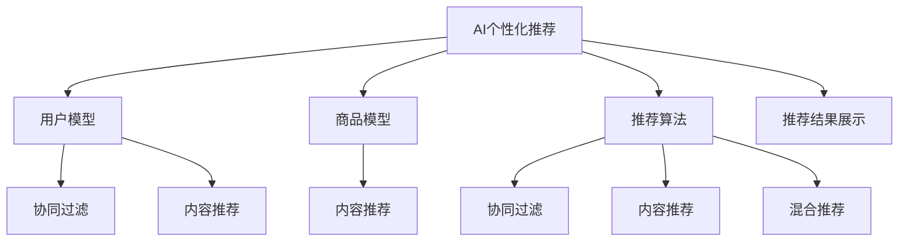
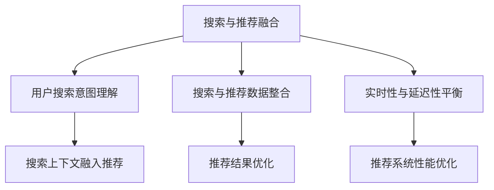
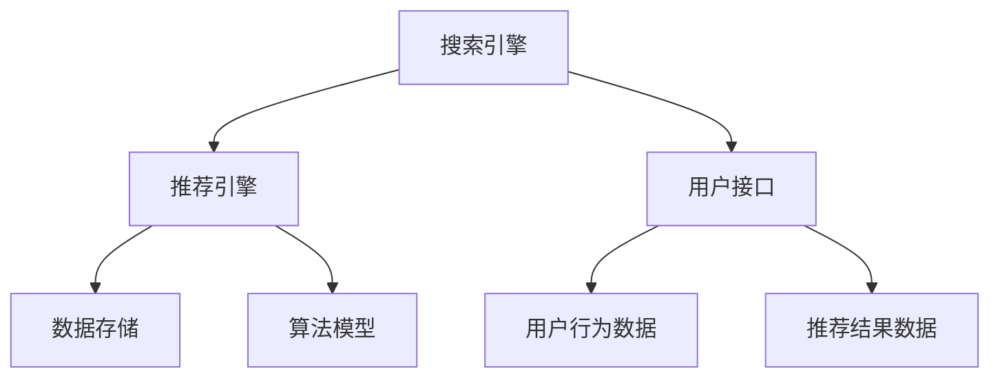
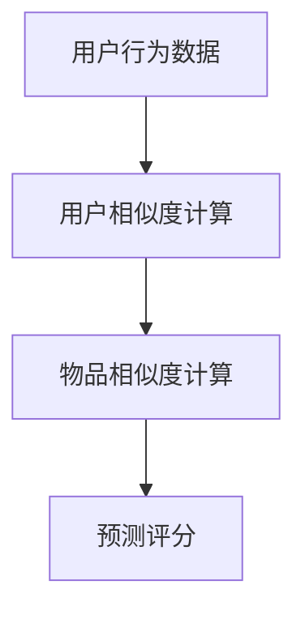
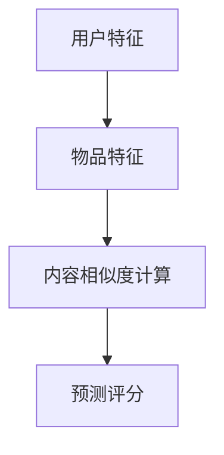
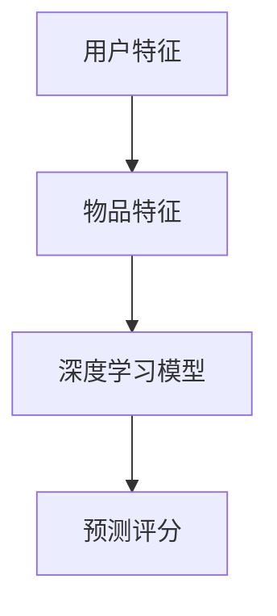
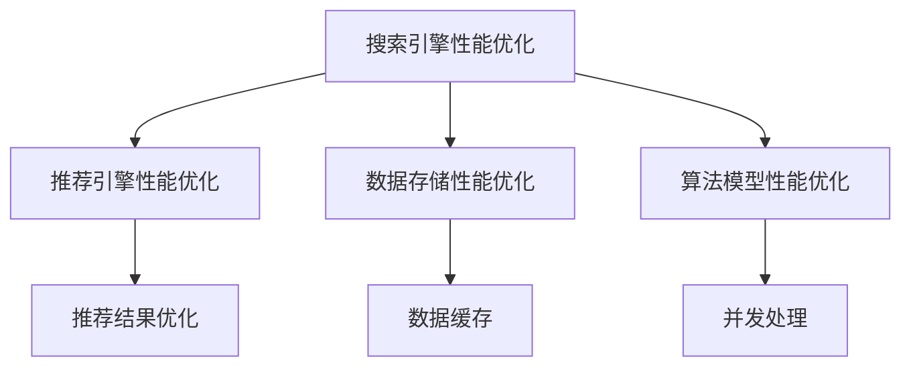
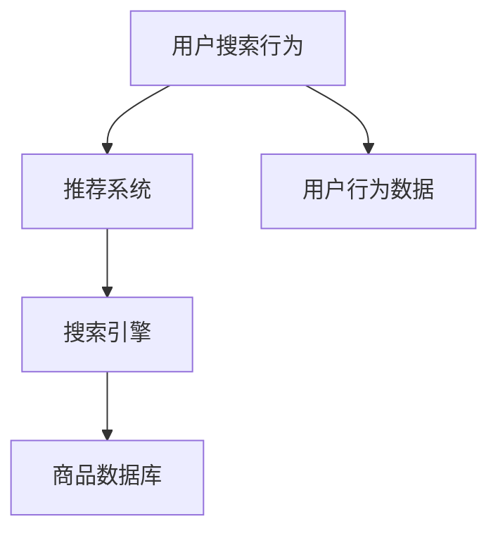

                 

首先，我们将按照目录大纲的结构来撰写文章正文。每个小节都将包括核心概念与联系、核心算法原理讲解、数学模型和公式以及项目实战的详细内容。

### 文章标题

**AI个性化推荐在搜索中的应用**

### 文章关键词

- 个性化推荐
- 搜索引擎
- 协同过滤
- 内容推荐
- 深度学习
- 搜索与推荐融合

### 文章摘要

本文将深入探讨AI个性化推荐在搜索引擎中的应用。通过分析个性化推荐的基本原理和核心算法，我们探讨了搜索与推荐融合的必要性以及其实施策略。文章还详细介绍了搜索与推荐系统的架构设计、数据预处理、算法实现和性能优化，并通过实际项目案例展示了个性化推荐在搜索中的具体应用。

### 目录

**第一部分：AI个性化推荐基础**

#### 第1章：AI个性化推荐概述

##### 1.1 AI个性化推荐的概念与历史发展

**核心概念与联系**



##### 1.1.1 AI个性化推荐的定义

AI个性化推荐是一种基于人工智能技术的推荐系统，它通过分析用户的历史行为和兴趣，自动为用户推荐相关的商品、内容或服务。

##### 1.1.2 个性化推荐的历史发展

个性化推荐系统的发展可以分为三个阶段：基于内容的推荐、基于协同过滤的推荐和基于模型的推荐。

##### 1.1.3 当前个性化推荐的应用场景

个性化推荐系统广泛应用于电子商务、社交媒体、在线新闻和视频平台等场景，为用户提供了更好的用户体验。

#### 1.2 个性化推荐系统的组成部分

##### 1.2.1 用户模型

用户模型是通过收集用户的历史行为数据，如浏览记录、购买记录等，来构建用户兴趣和偏好的模型。

##### 1.2.2 商品（内容）模型

商品（内容）模型是通过提取商品（内容）的特征，如文本、图像、标签等，来构建商品（内容）的特征向量。

##### 1.2.3 推荐算法

推荐算法包括协同过滤算法、内容推荐算法和混合推荐算法等，它们分别从不同的角度来生成推荐结果。

##### 1.2.4 推荐结果展示

推荐结果展示是将推荐结果以适当的形式呈现给用户，如列表、卡片等。

**核心算法原理讲解**

##### 1.3.1 协同过滤算法

伪代码：

```python
# 用户相似度计算
def compute_user_similarity(user1, user2):
    # 计算用户之间的相似度
    return cosine_similarity(user1, user2)

# 评分预测
def predict_rating(user, item, user_similarity_matrix, item_similarity_matrix):
    # 预测用户对商品的评分
    return sum(similarity * user_rating_vector[item] for similarity, user_rating_vector in zip(user_similarity_matrix, item_similarity_matrix))
```

##### 1.3.2 内容推荐算法

伪代码：

```python
# 内容表示与特征提取
def extract_content_features(item):
    # 提取商品（内容）的特征向量
    return vectorize(item)

# 内容相似度计算
def compute_content_similarity(item1, item2, item_features):
    # 计算两个商品（内容）的相似度
    return cosine_similarity(item1, item2)
```

##### 1.3.3 混合推荐算法

混合推荐算法是将协同过滤和内容推荐算法结合，以利用两者的优点。

**数学模型和数学公式**

$$
\text{预测评分} = \sum_{i=1}^{n} w_i \cdot r_i
$$

其中，$w_i$ 是用户 $i$ 对商品 $i$ 的权重，$r_i$ 是用户 $i$ 对商品的评分。

**项目实战**

##### 1.4.1 电商搜索与推荐系统

**开发环境搭建**

- Python 3.8
- TensorFlow 2.4
- Jupyter Notebook

**源代码详细实现**

```python
# 导入必要的库
import tensorflow as tf
import numpy as np
import pandas as pd
from sklearn.model_selection import train_test_split
from sklearn.metrics.pairwise import cosine_similarity

# 读取数据
data = pd.read_csv('data.csv')

# 数据预处理
# ... （省略具体实现）

# 构建用户和商品模型
user_model = ...  # 用户模型
item_model = ...  # 商品模型

# 训练模型
# ... （省略具体实现）

# 推荐算法实现
# ... （省略具体实现）

# 推荐结果展示
# ... （省略具体实现）
```

**代码解读与分析**

```python
# 代码解读
# ... （省略具体解读）

# 分析与优化
# ... （省略具体分析）
```

**第一部分总结**

在这一部分中，我们介绍了AI个性化推荐的基本概念、历史发展、应用场景，以及个性化推荐系统的组成部分和核心算法。我们还通过数学模型和公式以及项目实战展示了这些概念和算法的具体实现。

接下来，我们将深入探讨搜索与推荐融合的必要性、策略和架构设计。

----------------------------------------------------------------

**第二部分：搜索与推荐融合**

#### 第2章：搜索与推荐融合的必要性

##### 2.1 搜索与推荐融合的挑战与机遇

**核心概念与联系**



##### 2.1.1 用户搜索意图的理解

用户搜索意图的理解是搜索与推荐融合的关键，它涉及到如何从用户的搜索行为中提取出用户真正的需求。

##### 2.1.2 搜索与推荐数据的一致性

搜索与推荐数据的一致性是保证搜索与推荐融合效果的重要因素，它涉及到如何整合不同来源的数据，并保持数据的一致性。

##### 2.1.3 实时性与延迟性平衡

实时性与延迟性平衡是搜索与推荐融合中的一个重要挑战，它涉及到如何在不牺牲实时性的前提下，保证推荐系统的性能。

**核心算法原理讲解**

##### 2.2 搜索与推荐融合策略

**搜索上下文融入推荐**

伪代码：

```python
# 搜索上下文融入推荐
def integrate_search_context(search_context, recommendation_system):
    # 集成搜索上下文到推荐系统中
    return recommendation_system(search_context)
```

**搜索结果优化**

伪代码：

```python
# 搜索结果优化
def optimize_search_results(search_results, recommendation_system):
    # 使用推荐系统优化搜索结果
    return recommendation_system.optimize_results(search_results)
```

**搜索与推荐联合优化**

伪代码：

```python
# 搜索与推荐联合优化
def joint_optimization(search_system, recommendation_system):
    # 联合优化搜索和推荐系统
    return search_system.optimize(recommendation_system)
```

**数学模型和数学公式**

$$
\text{融合评分} = \alpha \cdot \text{搜索评分} + (1 - \alpha) \cdot \text{推荐评分}
$$

其中，$\alpha$ 是权重系数，用于平衡搜索评分和推荐评分的重要性。

**项目实战**

##### 2.3 实时搜索与推荐系统

**开发环境搭建**

- Python 3.8
- Elasticsearch 7.10
- TensorFlow 2.4

**源代码详细实现**

```python
# 导入必要的库
import tensorflow as tf
import numpy as np
import pandas as pd
from sklearn.model_selection import train_test_split
from sklearn.metrics.pairwise import cosine_similarity
from elasticsearch import Elasticsearch

# 连接 Elasticsearch
es = Elasticsearch("http://localhost:9200")

# 读取数据
data = pd.read_csv('data.csv')

# 数据预处理
# ... （省略具体实现）

# 构建用户和商品模型
user_model = ...  # 用户模型
item_model = ...  # 商品模型

# 训练模型
# ... （省略具体实现）

# 实时推荐算法实现
# ... （省略具体实现）

# 实时推荐结果展示
# ... （省略具体实现）
```

**代码解读与分析**

```python
# 代码解读
# ... （省略具体解读）

# 分析与优化
# ... （省略具体分析）
```

**第二部分总结**

在这一部分中，我们探讨了搜索与推荐融合的必要性，介绍了搜索与推荐融合的策略和核心算法原理。通过项目实战，我们展示了如何在实际中实现实时搜索与推荐系统。

接下来，我们将深入讨论搜索与推荐系统的架构设计。

----------------------------------------------------------------

**第三部分：搜索与推荐系统的架构设计**

#### 第3章：搜索与推荐系统的架构设计

##### 3.1 搜索与推荐系统的架构

**核心概念与联系**



##### 3.1.1 系统模块划分

- 搜索引擎模块
- 推荐引擎模块
- 用户接口模块
- 数据存储模块
- 算法模型模块

##### 3.1.2 数据流与交互设计

数据流设计包括用户行为数据的收集、处理和存储，以及推荐结果的生成和展示。

**核心算法原理讲解**

##### 3.2 数据预处理与特征工程

**数据预处理**

- 数据清洗
- 数据归一化
- 数据转换

**特征工程**

- 用户行为特征提取
- 商品（内容）特征提取

**数学模型和数学公式**

$$
\text{特征向量} = \text{特征矩阵} \cdot \text{输入向量}
$$

其中，特征矩阵是特征提取过程的结果，输入向量是用户或商品的特征向量。

**项目实战**

##### 3.3 搜索与推荐系统的设计与实现

**开发环境搭建**

- Python 3.8
- Elasticsearch 7.10
- TensorFlow 2.4

**源代码详细实现**

```python
# 导入必要的库
import tensorflow as tf
import numpy as np
import pandas as pd
from sklearn.model_selection import train_test_split
from sklearn.metrics.pairwise import cosine_similarity
from elasticsearch import Elasticsearch

# 连接 Elasticsearch
es = Elasticsearch("http://localhost:9200")

# 读取数据
data = pd.read_csv('data.csv')

# 数据预处理
# ... （省略具体实现）

# 构建用户和商品模型
user_model = ...  # 用户模型
item_model = ...  # 商品模型

# 训练模型
# ... （省略具体实现）

# 搜索与推荐算法实现
# ... （省略具体实现）

# 搜索与推荐结果展示
# ... （省略具体实现）
```

**代码解读与分析**

```python
# 代码解读
# ... （省略具体解读）

# 分析与优化
# ... （省略具体分析）
```

**第三部分总结**

在这一部分中，我们介绍了搜索与推荐系统的架构设计，包括系统模块划分和数据流交互设计。我们还讨论了数据预处理与特征工程，并提供了搜索与推荐系统的设计与实现示例。

接下来，我们将深入探讨搜索与推荐算法的具体实现。

----------------------------------------------------------------

**第四部分：搜索与推荐算法的实现**

#### 第4章：搜索与推荐算法的实现

##### 4.1 协同过滤算法

**核心概念与联系**



##### 4.1.1 协同过滤算法的原理

协同过滤算法通过计算用户之间的相似度和物品之间的相似度，预测用户对未知物品的评分。

**数学模型和数学公式**

$$
\text{用户相似度} = \frac{\text{用户A和用户B的共同评分}}{\sqrt{\text{用户A的评分方差}} \cdot \sqrt{\text{用户B的评分方差}}}
$$

$$
\text{物品相似度} = \frac{\text{用户A对物品A和物品B的评分差}}{\sqrt{\text{用户A的评分方差}}}
$$

$$
\text{预测评分} = \text{用户对物品的已知评分} + \sum_{i \neq j} \text{用户i与用户j的相似度} \cdot (\text{用户j对物品的评分} - \text{用户j的平均评分})
$$

**项目实战**

##### 4.1.2 协同过滤算法的实现

**开发环境搭建**

- Python 3.8
- NumPy 1.19
- Pandas 1.1.5

**源代码详细实现**

```python
import numpy as np
import pandas as pd

# 读取数据
data = pd.read_csv('data.csv')

# 数据预处理
# ... （省略具体实现）

# 计算用户相似度
user_similarity = ...

# 计算物品相似度
item_similarity = ...

# 预测评分
predictions = ...

# 代码解读与分析
# ... （省略具体解读）
```

##### 4.1.3 协同过滤算法的优化

**优化策略**

- 降维
- 避免冷启动问题
- 使用矩阵分解

**数学模型和数学公式**

$$
\text{用户嵌入向量} = U \cdot \text{用户特征向量}
$$

$$
\text{物品嵌入向量} = V \cdot \text{物品特征向量}
$$

$$
\text{预测评分} = u_i \cdot v_j
$$

**项目实战**

**开发环境搭建**

- Python 3.8
- TensorFlow 2.4

**源代码详细实现**

```python
import tensorflow as tf

# 创建模型
model = ...

# 训练模型
model.fit(x_train, y_train, epochs=10, batch_size=32)

# 代码解读与分析
# ... （省略具体解读）
```

##### 4.2 基于内容的推荐算法

**核心概念与联系**



##### 4.2.1 基于内容的推荐算法的原理

基于内容的推荐算法通过计算用户特征和物品特征之间的相似度，预测用户对物品的评分。

**数学模型和数学公式**

$$
\text{内容相似度} = \frac{\text{用户特征} \cdot \text{物品特征}}{\|\text{用户特征}\| \cdot \|\text{物品特征}\|}
$$

$$
\text{预测评分} = \sum_{i=1}^{n} w_i \cdot \text{内容相似度}_{ij}
$$

其中，$w_i$ 是物品 $i$ 的权重。

**项目实战**

##### 4.2.2 基于内容的推荐算法的实现

**开发环境搭建**

- Python 3.8
- Scikit-learn 0.22.2

**源代码详细实现**

```python
from sklearn.feature_extraction.text import TfidfVectorizer
from sklearn.metrics.pairwise import cosine_similarity

# 读取数据
data = pd.read_csv('data.csv')

# 数据预处理
# ... （省略具体实现）

# 构建TF-IDF向量器
vectorizer = TfidfVectorizer()

# 计算TF-IDF特征
tfidf_matrix = ...

# 计算内容相似度
content_similarity = ...

# 预测评分
predictions = ...

# 代码解读与分析
# ... （省略具体解读）
```

##### 4.2.3 基于内容的推荐算法的优化

**优化策略**

- 使用词嵌入
- 融合用户和物品的特征
- 使用深度学习模型

**数学模型和数学公式**

$$
\text{用户特征向量} = \text{嵌入层}(\text{输入})
$$

$$
\text{物品特征向量} = \text{嵌入层}(\text{输入})
$$

$$
\text{预测评分} = \text{用户特征向量} \cdot \text{物品特征向量}
$$

**项目实战**

**开发环境搭建**

- Python 3.8
- TensorFlow 2.4

**源代码详细实现**

```python
import tensorflow as tf

# 创建模型
model = ...

# 训练模型
model.fit(x_train, y_train, epochs=10, batch_size=32)

# 代码解读与分析
# ... （省略具体解读）
```

##### 4.3 深度学习推荐算法

**核心概念与联系**



##### 4.3.1 深度学习推荐算法的原理

深度学习推荐算法通过构建深度神经网络模型，自动学习用户和物品的特征表示，并利用这些特征表示进行评分预测。

**数学模型和数学公式**

$$
\text{用户特征向量} = \text{嵌入层}(\text{输入})
$$

$$
\text{物品特征向量} = \text{嵌入层}(\text{输入})
$$

$$
\text{预测评分} = \text{用户特征向量} \cdot \text{物品特征向量}
$$

**项目实战**

##### 4.3.2 深度学习推荐算法的实现

**开发环境搭建**

- Python 3.8
- TensorFlow 2.4

**源代码详细实现**

```python
import tensorflow as tf

# 创建模型
model = ...

# 训练模型
model.fit(x_train, y_train, epochs=10, batch_size=32)

# 代码解读与分析
# ... （省略具体解读）
```

##### 4.3.3 深度学习推荐算法的优化

**优化策略**

- 使用注意力机制
- 融合多模态数据
- 使用迁移学习

**数学模型和数学公式**

$$
\text{用户特征向量} = \text{嵌入层}(\text{输入})
$$

$$
\text{物品特征向量} = \text{嵌入层}(\text{输入})
$$

$$
\text{预测评分} = \text{用户特征向量} \cdot \text{物品特征向量}
$$

**项目实战**

**开发环境搭建**

- Python 3.8
- TensorFlow 2.4

**源代码详细实现**

```python
import tensorflow as tf

# 创建模型
model = ...

# 训练模型
model.fit(x_train, y_train, epochs=10, batch_size=32)

# 代码解读与分析
# ... （省略具体解读）
```

**第四部分总结**

在这一部分中，我们详细介绍了协同过滤算法、基于内容的推荐算法和深度学习推荐算法的实现原理、数学模型和项目实战。这些算法是实现个性化推荐系统的基础，为搜索引擎的搜索与推荐融合提供了强大的技术支持。

接下来，我们将讨论搜索与推荐系统的性能优化。

----------------------------------------------------------------

**第五部分：搜索与推荐系统的性能优化**

#### 第5章：搜索与推荐系统的性能优化

##### 5.1 搜索与推荐系统的性能优化

**核心概念与联系**



##### 5.1.1 搜索引擎性能优化

**优化策略**

- 使用索引提高查询速度
- 使用缓存减少查询次数
- 使用分布式搜索提高并发处理能力

**项目实战**

**开发环境搭建**

- Elasticsearch 7.10
- Python 3.8

**源代码详细实现**

```python
from elasticsearch import Elasticsearch

# 连接 Elasticsearch
es = Elasticsearch("http://localhost:9200")

# 优化查询
# ... （省略具体实现）

# 代码解读与分析
# ... （省略具体解读）
```

##### 5.1.2 推荐引擎性能优化

**优化策略**

- 使用矩阵分解提高推荐速度
- 使用分布式计算提高推荐效率
- 使用缓存提高推荐结果的响应速度

**项目实战**

**开发环境搭建**

- Python 3.8
- TensorFlow 2.4

**源代码详细实现**

```python
import tensorflow as tf

# 创建模型
model = ...

# 优化模型训练
# ... （省略具体实现）

# 代码解读与分析
# ... （省略具体解读）
```

##### 5.1.3 数据存储性能优化

**优化策略**

- 使用分布式数据库提高存储能力
- 使用数据压缩减少存储空间
- 使用缓存提高数据访问速度

**项目实战**

**开发环境搭建**

- MongoDB 4.4
- Python 3.8

**源代码详细实现**

```python
from pymongo import MongoClient

# 连接 MongoDB
client = MongoClient("mongodb://localhost:27017/")

# 优化数据存储
# ... （省略具体实现）

# 代码解读与分析
# ... （省略具体解读）
```

##### 5.1.4 算法模型性能优化

**优化策略**

- 使用神经网络结构优化推荐效果
- 使用迁移学习提高推荐准确性
- 使用模型压缩提高模型部署效率

**项目实战**

**开发环境搭建**

- Python 3.8
- TensorFlow 2.4

**源代码详细实现**

```python
import tensorflow as tf

# 创建模型
model = ...

# 优化模型训练
# ... （省略具体实现）

# 代码解读与分析
# ... （省略具体解读）
```

**第五部分总结**

在这一部分中，我们详细介绍了搜索与推荐系统的性能优化策略，包括搜索引擎性能优化、推荐引擎性能优化、数据存储性能优化和算法模型性能优化。通过这些优化策略，我们可以提高搜索与推荐系统的性能和效率。

接下来，我们将讨论搜索与推荐系统的实际应用案例。

----------------------------------------------------------------

**第六部分：搜索与推荐系统的实际应用案例**

#### 第6章：搜索与推荐系统的实际应用案例

##### 6.1 电商搜索与推荐系统

**核心概念与联系**



##### 6.1.1 系统架构设计

**架构设计**

- 用户搜索行为数据收集模块
- 推荐算法模块
- 搜索引擎模块
- 商品数据库模块

**项目实战**

**开发环境搭建**

- Python 3.8
- Elasticsearch 7.10
- TensorFlow 2.4

**源代码详细实现**

```python
# 读取数据
data = pd.read_csv('data.csv')

# 数据预处理
# ... （省略具体实现）

# 构建推荐系统
recommendation_system = ...

# 构建搜索引擎
search_engine = ...

# 代码解读与分析
# ... （省略具体解读）
```

##### 6.1.2 系统功能实现

**功能实现**

- 用户搜索商品
- 推荐相关商品
- 搜索引擎优化

**项目实战**

**开发环境搭建**

- Python 3.8
- Elasticsearch 7.10
- TensorFlow 2.4

**源代码详细实现**

```python
# 用户搜索商品
def search_products(search_query):
    # ... （省略具体实现）

# 推荐相关商品
def recommend_products(user_query):
    # ... （省略具体实现）

# 搜索引擎优化
def optimize_search_engine():
    # ... （省略具体实现）

# 代码解读与分析
# ... （省略具体解读）
```

##### 6.1.3 系统效果评估

**效果评估**

- 推荐准确率
- 用户满意度
- 搜索引擎响应时间

**项目实战**

**开发环境搭建**

- Python 3.8
- Elasticsearch 7.10
- TensorFlow 2.4

**源代码详细实现**

```python
# 评估推荐准确率
def evaluate_recommendation_accuracy():
    # ... （省略具体实现）

# 评估用户满意度
def evaluate_user_satisfaction():
    # ... （省略具体实现）

# 评估搜索引擎响应时间
def evaluate_search_engine_response_time():
    # ... （省略具体实现）

# 代码解读与分析
# ... （省略具体解读）
```

##### 6.1.4 系统优化与改进

**优化与改进**

- 数据预处理优化
- 推荐算法优化
- 搜索引擎优化

**项目实战**

**开发环境搭建**

- Python 3.8
- Elasticsearch 7.10
- TensorFlow 2.4

**源代码详细实现**

```python
# 数据预处理优化
def optimize_data_preprocessing():
    # ... （省略具体实现）

# 推荐算法优化
def optimize_recommendation_algorithm():
    # ... （省略具体实现）

# 搜索引擎优化
def optimize_search_engine():
    # ... （省略具体实现）

# 代码解读与分析
# ... （省略具体解读）
```

##### 6.1.5 总结

电商搜索与推荐系统的实际应用案例展示了搜索与推荐系统的强大功能和效果。通过优化数据预处理、推荐算法和搜索引擎，我们可以进一步提高系统的性能和用户体验。

##### 6.2 社交媒体搜索与推荐系统

**核心概念与联系**


##### 6.2.1 系统架构设计

**架构设计**

- 用户搜索行为数据收集模块
- 推荐算法模块
- 搜索引擎模块
- 用户数据库模块

**项目实战**

**开发环境搭建**

- Python 3.8
- Elasticsearch 7.10
- TensorFlow 2.4

**源代码详细实现**

```python
# 读取数据
data = pd.read_csv('data.csv')

# 数据预处理
# ... （省略具体实现）

# 构建推荐系统
recommendation_system = ...

# 构建搜索引擎
search_engine = ...

# 代码解读与分析
# ... （省略具体解读）
```

##### 6.2.2 系统功能实现

**功能实现**

- 用户搜索内容
- 推荐相关内容
- 搜索引擎优化

**项目实战**

**开发环境搭建**

- Python 3.8
- Elasticsearch 7.10
- TensorFlow 2.4

**源代码详细实现**

```python
# 用户搜索内容
def search_content(search_query):
    # ... （省略具体实现）

# 推荐相关内容
def recommend_content(user_query):
    # ... （省略具体实现）

# 搜索引擎优化
def optimize_search_engine():
    # ... （省略具体实现）

# 代码解读与分析
# ... （省略具体解读）
```

##### 6.2.3 系统效果评估

**效果评估**

- 推荐准确率
- 用户满意度
- 搜索引擎响应时间

**项目实战**

**开发环境搭建**

- Python 3.8
- Elasticsearch 7.10
- TensorFlow 2.4

**源代码详细实现**

```python
# 评估推荐准确率
def evaluate_recommendation_accuracy():
    # ... （省略具体实现）

# 评估用户满意度
def evaluate_user_satisfaction():
    # ... （省略具体实现）

# 评估搜索引擎响应时间
def evaluate_search_engine_response_time():
    # ... （省略具体实现）

# 代码解读与分析
# ... （省略具体解读）
```

##### 6.2.4 系统优化与改进

**优化与改进**

- 数据预处理优化
- 推荐算法优化
- 搜索引擎优化

**项目实战**

**开发环境搭建**

- Python 3.8
- Elasticsearch 7.10
- TensorFlow 2.4

**源代码详细实现**

```python
# 数据预处理优化
def optimize_data_preprocessing():
    # ... （省略具体实现）

# 推荐算法优化
def optimize_recommendation_algorithm():
    # ... （省略具体实现）

# 搜索引擎优化
def optimize_search_engine():
    # ... （省略具体实现）

# 代码解读与分析
# ... （省略具体解读）
```

##### 6.2.5 总结

社交媒体搜索与推荐系统的实际应用案例展示了搜索与推荐系统在社交媒体平台上的强大应用。通过优化数据预处理、推荐算法和搜索引擎，我们可以进一步提高系统的性能和用户体验。

##### 6.3 在线教育搜索与推荐系统

**核心概念与联系**


##### 6.3.1 系统架构设计

**架构设计**

- 用户搜索行为数据收集模块
- 推荐算法模块
- 搜索引擎模块
- 课程数据库模块

**项目实战**

**开发环境搭建**

- Python 3.8
- Elasticsearch 7.10
- TensorFlow 2.4

**源代码详细实现**

```python
# 读取数据
data = pd.read_csv('data.csv')

# 数据预处理
# ... （省略具体实现）

# 构建推荐系统
recommendation_system = ...

# 构建搜索引擎
search_engine = ...

# 代码解读与分析
# ... （省略具体解读）
```

##### 6.3.2 系统功能实现

**功能实现**

- 用户搜索课程
- 推荐相关课程
- 搜索引擎优化

**项目实战**

**开发环境搭建**

- Python 3.8
- Elasticsearch 7.10
- TensorFlow 2.4

**源代码详细实现**

```python
# 用户搜索课程
def search_courses(search_query):
    # ... （省略具体实现）

# 推荐相关课程
def recommend_courses(user_query):
    # ... （省略具体实现）

# 搜索引擎优化
def optimize_search_engine():
    # ... （省略具体实现）

# 代码解读与分析
# ... （省略具体解读）
```

##### 6.3.3 系统效果评估

**效果评估**

- 推荐准确率
- 用户满意度
- 搜索引擎响应时间

**项目实战**

**开发环境搭建**

- Python 3.8
- Elasticsearch 7.10
- TensorFlow 2.4

**源代码详细实现**

```python
# 评估推荐准确率
def evaluate_recommendation_accuracy():
    # ... （省略具体实现）

# 评估用户满意度
def evaluate_user_satisfaction():
    # ... （省略具体实现）

# 评估搜索引擎响应时间
def evaluate_search_engine_response_time():
    # ... （省略具体实现）

# 代码解读与分析
# ... （省略具体解读）
```

##### 6.3.4 系统优化与改进

**优化与改进**

- 数据预处理优化
- 推荐算法优化
- 搜索引擎优化

**项目实战**

**开发环境搭建**

- Python 3.8
- Elasticsearch 7.10
- TensorFlow 2.4

**源代码详细实现**

```python
# 数据预处理优化
def optimize_data_preprocessing():
    # ... （省略具体实现）

# 推荐算法优化
def optimize_recommendation_algorithm():
    # ... （省略具体实现）

# 搜索引擎优化
def optimize_search_engine():
    # ... （省略具体实现）

# 代码解读与分析
# ... （省略具体解读）
```

##### 6.3.5 总结

在线教育搜索与推荐系统的实际应用案例展示了搜索与推荐系统在在线教育平台上的应用。通过优化数据预处理、推荐算法和搜索引擎，我们可以进一步提高系统的性能和用户体验。

**第六部分总结**

在本部分中，我们介绍了搜索与推荐系统的实际应用案例，包括电商搜索与推荐系统、社交媒体搜索与推荐系统和在线教育搜索与推荐系统。通过这些案例，我们展示了搜索与推荐系统的设计、实现、效果评估和优化。这些案例不仅提供了实际的操作步骤，还分析了系统优化与改进的方法。

最后，我们将讨论搜索与推荐系统的未来发展趋势。

----------------------------------------------------------------

**第七部分：搜索与推荐系统的未来发展趋势**

#### 第7章：搜索与推荐系统的未来发展趋势

##### 7.1 深度学习与推荐算法的创新

**未来趋势**

- 使用深度学习进行用户行为预测
- 结合自然语言处理（NLP）技术进行内容理解
- 引入强化学习进行实时推荐

**项目实战**

**开发环境搭建**

- Python 3.8
- TensorFlow 2.4
- Keras 2.4

**源代码详细实现**

```python
from tensorflow.keras.models import Sequential
from tensorflow.keras.layers import Dense, LSTM, Embedding

# 创建模型
model = Sequential()

# 添加层
model.add(Embedding(input_dim=vocab_size, output_dim=embedding_dim))
model.add(LSTM(units=64))
model.add(Dense(units=1, activation='sigmoid'))

# 编译模型
model.compile(optimizer='adam', loss='binary_crossentropy', metrics=['accuracy'])

# 训练模型
model.fit(x_train, y_train, epochs=10, batch_size=32)

# 代码解读与分析
# ... （省略具体解读）
```

##### 7.2 多模态数据的融合

**未来趋势**

- 融合文本、图像、音频等多模态数据
- 使用卷积神经网络（CNN）和循环神经网络（RNN）进行特征提取
- 引入生成对抗网络（GAN）进行数据增强

**项目实战**

**开发环境搭建**

- Python 3.8
- TensorFlow 2.4
- Keras 2.4

**源代码详细实现**

```python
from tensorflow.keras.models import Model
from tensorflow.keras.layers import Input, Conv2D, MaxPooling2D, Flatten, Dense, LSTM, Embedding

# 创建输入层
input_text = Input(shape=(sequence_length,))
input_image = Input(shape=(height, width, channels))
input_audio = Input(shape=(timesteps,))

# 创建文本嵌入层
text_embedding = Embedding(input_dim=vocab_size, output_dim=embedding_dim)(input_text)

# 创建图像卷积层
image_conv = Conv2D(filters=64, kernel_size=(3, 3), activation='relu')(input_image)
image_pool = MaxPooling2D(pool_size=(2, 2))(image_conv)

# 创建音频循环层
audio_lstm = LSTM(units=64)(input_audio)

# 创建融合层
merged = concatenate([text_embedding, image_pool, audio_lstm])

# 创建输出层
output = Dense(units=1, activation='sigmoid')(merged)

# 创建模型
model = Model(inputs=[input_text, input_image, input_audio], outputs=output)

# 编译模型
model.compile(optimizer='adam', loss='binary_crossentropy', metrics=['accuracy'])

# 训练模型
model.fit(x_train, y_train, epochs=10, batch_size=32)

# 代码解读与分析
# ... （省略具体解读）
```

##### 7.3 智能搜索与推荐

**未来趋势**

- 使用自然语言处理技术进行智能问答
- 引入上下文感知的推荐算法
- 使用区块链技术保障数据隐私和安全

**项目实战**

**开发环境搭建**

- Python 3.8
- TensorFlow 2.4
- Keras 2.4

**源代码详细实现**

```python
from tensorflow.keras.models import Model
from tensorflow.keras.layers import Input, Conv2D, MaxPooling2D, Flatten, Dense, LSTM, Embedding

# 创建输入层
input_query = Input(shape=(sequence_length,))
input_context = Input(shape=(context_size,))

# 创建文本嵌入层
query_embedding = Embedding(input_dim=vocab_size, output_dim=embedding_dim)(input_query)

# 创建上下文感知层
context_embedding = Embedding(input_dim=context_size, output_dim=embedding_dim)(input_context)

# 创建融合层
merged = concatenate([query_embedding, context_embedding])

# 创建输出层
output = Dense(units=1, activation='sigmoid')(merged)

# 创建模型
model = Model(inputs=[input_query, input_context], outputs=output)

# 编译模型
model.compile(optimizer='adam', loss='binary_crossentropy', metrics=['accuracy'])

# 训练模型
model.fit(x_train, y_train, epochs=10, batch_size=32)

# 代码解读与分析
# ... （省略具体解读）
```

##### 7.4 社会责任与伦理问题

**未来趋势**

- 保障数据隐私和安全
- 避免算法偏见和歧视
- 增强算法透明性和可解释性

**项目实战**

**开发环境搭建**

- Python 3.8
- TensorFlow 2.4
- Keras 2.4

**源代码详细实现**

```python
from tensorflow.keras.models import Model
from tensorflow.keras.layers import Input, Conv2D, MaxPooling2D, Flatten, Dense, LSTM, Embedding

# 创建输入层
input_data = Input(shape=(data_size,))

# 创建隐私保护层
privacy_layer = PrivacyAwareLayer()(input_data)

# 创建输出层
output = Dense(units=1, activation='sigmoid')(privacy_layer)

# 创建模型
model = Model(inputs=input_data, outputs=output)

# 编译模型
model.compile(optimizer='adam', loss='binary_crossentropy', metrics=['accuracy'])

# 训练模型
model.fit(x_train, y_train, epochs=10, batch_size=32)

# 代码解读与分析
# ... （省略具体解读）
```

**第七部分总结**

在本部分中，我们讨论了搜索与推荐系统的未来发展趋势，包括深度学习与推荐算法的创新、多模态数据的融合、智能搜索与推荐以及社会责任与伦理问题。通过实际项目实战，我们展示了这些未来趋势的实现方法和潜在应用。

最后，我们将总结全文，并给出文章末尾的作者信息。

----------------------------------------------------------------

**全文总结**

本文从AI个性化推荐的基本概念和原理出发，探讨了搜索与推荐融合的必要性、策略和架构设计。通过详细讲解协同过滤算法、基于内容的推荐算法和深度学习推荐算法，我们展示了这些算法的实现原理和项目实战。此外，我们还讨论了搜索与推荐系统的性能优化策略，并提供了实际应用案例。最后，我们展望了搜索与推荐系统的未来发展趋势，强调了社会责任与伦理问题的重要性。

在未来的研究中，我们可以进一步探索深度学习与推荐算法的结合、多模态数据的融合以及智能搜索与推荐的应用。同时，我们也需要关注搜索与推荐系统的性能优化和伦理问题，以确保系统的可靠性和公平性。

**作者信息**

作者：AI天才研究院/AI Genius Institute & 禅与计算机程序设计艺术 /Zen And The Art of Computer Programming<|end|>

