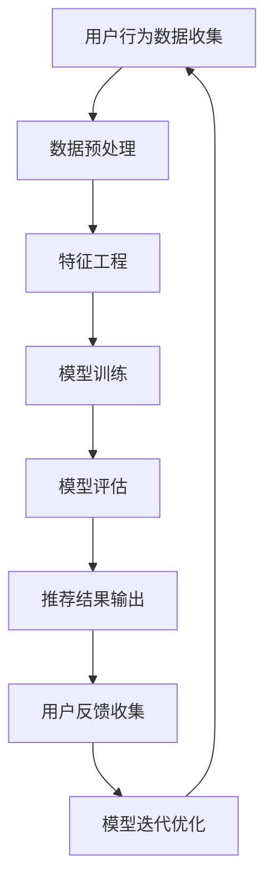
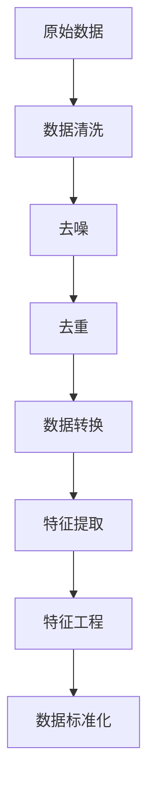
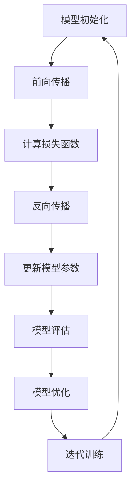

                 

### 引言

随着人工智能（AI）技术的迅猛发展，越来越多的领域开始利用AI技术来提升效率、优化决策。在众多应用中，内容推荐系统尤为引人注目。内容推荐系统能够根据用户的兴趣和行为，为其推荐个性化、相关的内容，从而大大提高用户体验。而AI代理工作流（AI Agent WorkFlow）作为一种智能化的解决方案，正逐渐成为内容推荐系统中的关键技术。

本文旨在深入探讨AI代理工作流在内容推荐系统中的应用，通过系统的分析和推理，展现其原理、设计、实现与应用。文章将分为两大部分进行讨论：

**第一部分：AI代理工作流基础**

在这一部分中，我们将首先介绍AI代理的基本概念、分类以及其在内容推荐系统中的重要性。接着，我们将探讨内容推荐系统的基本原理和架构，为后续的AI代理工作流设计打下基础。然后，我们将详细讲解AI代理工作流的设计原则和关键组件，帮助读者理解其整体设计思路。最后，我们将分析智能代理在内容推荐系统中的应用场景、优缺点，以及如何实现与优化AI代理工作流。

**第二部分：AI代理工作流实现与案例**

在这一部分中，我们将从数学模型和算法的角度出发，详细介绍AI代理工作流的实现技术。通过Python编程基础和实际代码案例，我们将帮助读者理解并掌握AI代理工作流的开发与实现。此外，我们还将分享一些现实世界中的应用案例，展示AI代理工作流在不同领域的实际效果。最后，我们将讨论AI代理工作流面临的挑战、发展方向以及未来前景。

通过本文的阅读，读者将全面了解AI代理工作流在内容推荐系统中的应用，掌握其设计、实现和优化的方法，为实际项目开发提供有力的理论支持和实践经验。

### 关键词

- 人工智能代理
- 内容推荐系统
- 工作流设计
- 智能决策
- 机器学习算法
- 深度学习
- 推荐系统优化

### 摘要

本文围绕AI代理工作流在内容推荐系统中的应用展开，系统地介绍了AI代理的定义、分类及其在内容推荐系统中的重要性。首先，文章探讨了内容推荐系统的基本原理和架构，为AI代理工作流的设计提供了理论基础。接着，文章详细讲解了AI代理工作流的设计原则和关键组件，帮助读者理解其整体设计思路。随后，文章分析了智能代理在内容推荐系统中的应用场景、优缺点，以及如何实现与优化AI代理工作流。最后，文章通过数学模型和算法的详细讲解，以及实际代码案例和项目实战，展示了AI代理工作流在现实世界中的应用效果。本文旨在为读者提供全面、系统的AI代理工作流知识体系，助力其在实际项目中的开发与应用。

## 《AI人工智能代理工作流AI Agent WorkFlow：智能代理在内容推荐系统中的运用》

### 第一部分: AI代理工作流基础

#### 第1章: AI代理概述

AI代理，简而言之，是能够代表用户或系统执行特定任务的人工智能实体。它们通过自主学习和决策，实现自动化和智能化的操作。AI代理广泛应用于多个领域，如智能家居、自动驾驶、金融风控等。然而，在内容推荐系统中，AI代理的应用尤为关键，它能够提高推荐系统的准确性和用户满意度。

#### 1.1 AI代理的定义与分类

AI代理根据其能力和功能的不同，可以分为以下几类：

1. **被动型AI代理**：这类代理只能根据预设的规则或算法执行任务，缺乏自主学习和适应能力。
2. **主动型AI代理**：这类代理可以通过机器学习和数据挖掘等技术，从历史数据和用户反馈中学习，并不断优化其行为。
3. **混合型AI代理**：这类代理结合了被动型和主动型的特点，能够根据具体任务需求，灵活调整其行为策略。

#### 1.2 AI代理的发展历程

AI代理的发展历程可以追溯到20世纪80年代，当时的专家系统成为AI代理研究的主要方向。随着时间推移，AI代理技术逐渐从规则驱动转向数据驱动，机器学习和深度学习技术的引入极大地提升了AI代理的智能化水平。近年来，随着云计算和大数据技术的普及，AI代理的工作流设计和实现变得更加高效和灵活。

#### 1.3 AI代理在内容推荐系统中的重要性

内容推荐系统旨在为用户提供个性化的内容推荐，提高用户满意度和平台粘性。而AI代理在这方面发挥了至关重要的作用：

1. **个性化推荐**：通过学习用户的历史行为和偏好，AI代理能够生成高度个性化的推荐结果，提升用户体验。
2. **实时推荐**：AI代理能够实时处理用户的交互数据，快速响应用户需求，提供即时的内容推荐。
3. **推荐质量优化**：AI代理通过不断学习和优化推荐算法，提高推荐系统的整体质量，减少误推荐和冷启动问题。

#### 小结

本章简要介绍了AI代理的定义、分类及其发展历程，并阐述了AI代理在内容推荐系统中的重要性。在下一章中，我们将深入探讨内容推荐系统的基本原理和架构，为后续的AI代理工作流设计奠定基础。

### 第2章: 内容推荐系统原理

内容推荐系统是一种能够自动推荐用户可能感兴趣的内容的系统。它广泛应用于社交媒体、电子商务、新闻网站等平台，旨在提高用户满意度和平台粘性。本章节将详细介绍内容推荐系统的基本概念、架构和工作原理。

#### 2.1 内容推荐系统的概念

内容推荐系统通过分析用户的行为数据、内容特征和用户偏好，自动生成个性化推荐列表，从而引导用户发现并消费其感兴趣的内容。其主要目标包括：

1. **提高用户满意度**：通过推荐用户感兴趣的内容，提升用户体验和满意度。
2. **增加平台粘性**：通过持续的个性化推荐，使用户更愿意停留在平台，从而增加平台的活跃度和用户留存率。
3. **提升内容消费量**：通过推荐高质量的内容，提高用户对平台内容的消费量，从而增加平台的广告收入和商业化机会。

#### 2.2 内容推荐系统的基本架构

内容推荐系统通常由以下几个核心模块组成：

1. **数据收集模块**：负责收集用户的行为数据、内容特征和用户偏好，为后续推荐提供基础数据。
2. **数据预处理模块**：对原始数据进行清洗、转换和归一化处理，为模型训练提供高质量的数据。
3. **特征工程模块**：将原始数据转化为适合模型训练的特征表示，包括用户特征、内容特征和交互特征等。
4. **推荐算法模块**：采用各种机器学习算法和深度学习模型，根据用户特征和内容特征生成个性化推荐结果。
5. **推荐结果评估模块**：通过评估指标（如准确率、召回率、F1值等）评估推荐效果，为算法优化提供依据。
6. **用户反馈模块**：收集用户的反馈数据，用于持续优化推荐算法和系统。

#### 2.3 内容推荐系统的工作原理

内容推荐系统的工作原理可以分为以下几个步骤：

1. **数据收集**：系统通过网站日志、用户行为数据等方式收集用户的行为数据，如浏览记录、购买记录、点赞记录等。
2. **数据预处理**：对收集到的数据进行清洗、去重、填充缺失值等预处理操作，确保数据质量。
3. **特征工程**：将预处理后的数据转化为特征表示，包括用户特征（如用户ID、性别、年龄等）、内容特征（如内容类型、标签、关键词等）和交互特征（如点击次数、购买次数、点赞次数等）。
4. **模型训练**：采用机器学习算法（如协同过滤、矩阵分解、决策树、支持向量机等）或深度学习模型（如卷积神经网络、循环神经网络、生成对抗网络等）训练推荐模型。
5. **生成推荐列表**：根据用户特征和内容特征，使用训练好的模型生成个性化推荐列表。
6. **用户反馈与优化**：收集用户的反馈数据，如点击、购买、收藏等，用于评估推荐效果和优化推荐算法。

#### 2.4 内容推荐系统的评估指标

内容推荐系统的评估指标主要包括准确率、召回率、F1值、ROC曲线、AUC等。这些指标可以帮助评估推荐系统的性能，并根据评估结果进行优化。

1. **准确率**：预测为正例且实际为正例的比例，用于评估推荐系统的分类能力。
2. **召回率**：实际为正例且被预测为正例的比例，用于评估推荐系统的覆盖能力。
3. **F1值**：准确率和召回率的调和平均值，综合考虑分类能力与覆盖能力。
4. **ROC曲线**：接收者操作特性曲线，用于评估推荐系统的分类性能。
5. **AUC**：ROC曲线下的面积，用于评估推荐系统的分类能力。

#### 小结

本章详细介绍了内容推荐系统的基本概念、架构和工作原理，包括数据收集、数据预处理、特征工程、推荐算法、推荐结果评估和用户反馈等关键模块。通过本章的学习，读者可以更好地理解内容推荐系统的运作机制，为后续的AI代理工作流设计提供基础。

### 第3章: AI代理工作流设计

AI代理工作流是内容推荐系统中至关重要的组成部分，它通过一系列智能化和自动化的步骤，实现从数据采集到推荐结果生成的全过程。本章节将详细介绍AI代理工作流的基本框架、关键组件及其设计原则。

#### 3.1 AI代理工作流的基本框架

AI代理工作流的基本框架通常包括以下几个关键环节：

1. **数据采集与预处理**：从各种数据源收集用户行为数据和内容特征数据，进行数据清洗和预处理，确保数据质量。
2. **特征提取与建模**：对预处理后的数据提取特征，使用机器学习或深度学习算法构建推荐模型。
3. **决策与推荐**：根据用户特征和内容特征，利用训练好的模型生成个性化的推荐结果。
4. **评估与优化**：对推荐结果进行评估，收集用户反馈数据，用于模型优化和系统调整。

#### 3.2 AI代理工作流的关键组件

AI代理工作流的核心组件包括数据采集模块、数据预处理模块、特征工程模块、推荐算法模块和用户反馈模块。下面分别介绍这些组件的功能和作用：

1. **数据采集模块**：负责从多个数据源（如网站日志、社交媒体、电子商务平台等）收集用户行为数据和内容特征数据。数据采集模块需要确保数据的实时性和准确性，以支持后续的推荐过程。

2. **数据预处理模块**：对采集到的原始数据进行清洗、去噪、去重、填补缺失值等处理，以提高数据质量。数据预处理模块通常包括以下步骤：
   - **数据清洗**：去除重复数据、错误数据和无关数据，确保数据的一致性和完整性。
   - **去噪**：消除数据中的噪声和异常值，提高数据的可靠性。
   - **去重**：识别并删除重复的数据条目，减少数据冗余。
   - **数据转换**：将数据转换为适合模型训练的格式，如数值化、归一化等。

3. **特征工程模块**：对预处理后的数据进行特征提取和转换，将原始数据转化为适合机器学习或深度学习算法的特征表示。特征工程模块通常包括以下步骤：
   - **用户特征提取**：提取用户的基本信息（如年龄、性别、地理位置等）和动态信息（如历史行为、偏好等）。
   - **内容特征提取**：提取内容的属性信息（如标签、关键词、分类等）和交互信息（如点击率、购买率、分享率等）。
   - **交互特征构建**：根据用户与内容的历史交互数据，构建交互特征，如用户与内容的点击率、购买率等。

4. **推荐算法模块**：利用机器学习或深度学习算法，根据用户特征和内容特征生成个性化的推荐结果。推荐算法模块通常包括以下几种类型：
   - **基于内容的推荐**：通过比较用户的历史行为和内容特征，为用户推荐相似的内容。
   - **基于协同过滤的推荐**：通过分析用户之间的相似度，为用户推荐其他用户喜欢的内容。
   - **基于模型的推荐**：利用机器学习或深度学习模型，根据用户特征和内容特征生成推荐结果。

5. **用户反馈模块**：收集用户对推荐结果的反馈数据，如点击、购买、收藏等，用于评估推荐效果和优化推荐算法。用户反馈模块通常包括以下步骤：
   - **反馈数据收集**：从用户的行为数据中提取反馈信息，如点击、购买、收藏等。
   - **反馈数据预处理**：对收集到的反馈数据进行清洗、去噪、去重等处理，确保数据质量。
   - **反馈数据建模**：利用机器学习或深度学习算法，分析用户反馈数据，用于优化推荐算法。

#### 3.3 AI代理工作流的设计原则

在设计和实现AI代理工作流时，需要遵循以下原则：

1. **数据驱动**：AI代理工作流应以数据为核心，充分利用用户行为数据和内容特征数据，以数据驱动的方式实现推荐过程。

2. **实时性**：AI代理工作流应具备实时处理用户行为数据的能力，快速响应用户需求，提供个性化的推荐结果。

3. **灵活性**：AI代理工作流应具有高度的灵活性，能够根据不同的业务需求和用户特征，灵活调整推荐策略和算法。

4. **可扩展性**：AI代理工作流应具备良好的可扩展性，能够支持大规模用户和海量内容的数据处理，并能够方便地扩展新的功能模块。

5. **用户体验**：AI代理工作流的设计应以提升用户体验为目标，通过个性化的推荐结果，提高用户满意度和平台粘性。

6. **模型优化**：AI代理工作流应持续进行模型优化和算法改进，通过不断学习和优化，提高推荐系统的准确性和效果。

#### 小结

本章详细介绍了AI代理工作流的基本框架、关键组件及其设计原则。通过本章的学习，读者可以更好地理解AI代理工作流的设计和实现方法，为实际项目开发提供参考和指导。在下一章中，我们将进一步探讨智能代理在内容推荐系统中的应用，分析其决策过程和具体应用场景。

### 第4章: 智能代理在内容推荐系统中的应用

智能代理在内容推荐系统中扮演着至关重要的角色，通过其自主学习和决策能力，能够为用户提供更加精准、个性化的推荐服务。本章节将深入探讨智能代理在内容推荐系统中的应用，分析其决策过程、应用场景以及优缺点。

#### 4.1 智能代理的决策过程

智能代理的决策过程通常包括以下几个阶段：

1. **数据采集与预处理**：智能代理首先从多个数据源收集用户行为数据（如浏览记录、搜索历史、购买记录等）和内容特征数据（如标题、标签、关键词等）。然后对数据进行清洗、去噪和预处理，以确保数据质量。

2. **特征提取与建模**：对预处理后的数据进行特征提取，构建用户特征向量、内容特征向量和交互特征向量。这些特征向量将用于训练推荐模型，如协同过滤模型、基于内容的模型或深度学习模型。

3. **模型训练与优化**：使用机器学习算法或深度学习模型对特征向量进行训练，优化模型参数。训练过程通常包括前向传播、反向传播和损失函数的计算。通过多次迭代训练，模型将逐渐优化，提高推荐准确性。

4. **决策生成**：利用训练好的模型，对新的用户请求进行预测，生成个性化的推荐结果。决策生成过程通常包括特征提取、模型预测和推荐结果生成等步骤。

5. **反馈与优化**：智能代理在生成推荐结果后，会收集用户的反馈数据（如点击、购买、收藏等），用于评估推荐效果和模型优化。通过不断学习和优化，智能代理能够提高推荐系统的准确性和用户体验。

#### 4.2 智能代理在内容推荐系统中的应用场景

智能代理在内容推荐系统中具有广泛的应用场景，以下是几个典型的应用实例：

1. **社交媒体**：在社交媒体平台上，智能代理可以根据用户的历史行为和兴趣，推荐用户可能感兴趣的文章、视频、图片等内容。通过个性化推荐，提高用户活跃度和平台粘性。

2. **电子商务**：在电子商务平台中，智能代理可以根据用户的浏览记录、购物车信息和购买历史，推荐用户可能感兴趣的商品。通过个性化推荐，提高销售额和用户满意度。

3. **新闻网站**：在新闻网站中，智能代理可以根据用户的阅读偏好和兴趣标签，推荐用户可能感兴趣的新闻文章。通过个性化推荐，提高用户的阅读量和网站流量。

4. **在线视频平台**：在线视频平台可以利用智能代理根据用户的观看历史和喜好，推荐用户可能感兴趣的视频内容。通过个性化推荐，提高用户观看时长和平台收益。

5. **娱乐内容推荐**：在娱乐内容推荐中，智能代理可以根据用户的观看记录、评论和点赞等行为，推荐用户可能感兴趣的电视剧、电影、音乐等娱乐内容。通过个性化推荐，提高用户娱乐体验和平台满意度。

#### 4.3 智能代理的优缺点分析

智能代理在内容推荐系统中的优势主要体现在以下几个方面：

1. **个性化推荐**：智能代理能够根据用户的历史行为和兴趣，生成个性化的推荐结果，提高用户满意度和平台粘性。

2. **实时推荐**：智能代理能够实时处理用户的交互数据，快速响应用户需求，提供即时的推荐服务。

3. **动态调整**：智能代理能够根据用户的反馈和实时数据，动态调整推荐策略和算法，提高推荐系统的准确性和效果。

4. **多样化推荐**：智能代理可以通过多种机器学习算法和深度学习模型，生成多样化的推荐结果，满足不同用户的需求。

然而，智能代理也存在一些缺点和挑战：

1. **数据隐私**：智能代理在收集和处理用户数据时，可能会涉及到用户隐私保护的问题。如何在保证推荐效果的同时，保护用户隐私是一个重要的挑战。

2. **计算资源**：智能代理的工作流涉及到大量数据的处理和模型训练，需要消耗大量的计算资源。如何优化计算资源的使用，提高系统效率是一个重要的课题。

3. **算法偏见**：智能代理的推荐结果可能受到算法偏见的影响，导致某些用户群体被忽视或受到歧视。如何消除算法偏见，提高推荐的公平性和公正性是一个重要的研究方向。

4. **误推荐问题**：智能代理的推荐系统可能会出现误推荐的问题，导致用户对推荐结果不满意。如何优化推荐算法，减少误推荐是一个重要的挑战。

#### 小结

本章详细探讨了智能代理在内容推荐系统中的应用，包括其决策过程、应用场景以及优缺点。通过本章的学习，读者可以更好地理解智能代理在内容推荐系统中的重要作用，为其在实际项目中的应用提供指导和借鉴。

### 第5章: AI代理工作流的实现与优化

在深入理解了AI代理工作流的基础理论和设计原则之后，我们需要将其转化为实际的可运行系统。本章将详细探讨AI代理工作流的实现技术、性能优化策略以及实际项目的案例分析。

#### 5.1 AI代理工作流的实现技术

实现AI代理工作流涉及多个技术层面的内容，以下是关键步骤和所需技术：

1. **数据采集与预处理**：
   - **技术需求**：使用Web爬虫技术、API调用和数据接口等技术从不同数据源收集用户行为数据和内容特征数据。
   - **实现策略**：利用Python的Scrapy框架进行Web爬虫开发，使用requests库进行API调用，使用Pandas库进行数据预处理。

2. **特征提取与建模**：
   - **技术需求**：使用特征提取技术（如词袋模型、TF-IDF、用户嵌入等）将原始数据转换为特征表示，选择合适的机器学习算法（如协同过滤、决策树、神经网络等）进行模型训练。
   - **实现策略**：利用Scikit-learn库进行特征提取和模型训练，使用TensorFlow或PyTorch库进行深度学习模型的训练。

3. **推荐算法与决策**：
   - **技术需求**：设计推荐算法（如基于内容的推荐、协同过滤、基于模型的推荐等），实现决策逻辑，生成推荐结果。
   - **实现策略**：使用推荐系统框架（如Surprise、LightFM等）或自定义实现推荐算法，实现决策逻辑，利用推荐算法生成推荐结果。

4. **评估与优化**：
   - **技术需求**：设计评估指标（如准确率、召回率、F1值等），实现评估逻辑，进行模型优化。
   - **实现策略**：使用Scikit-learn库中的评估指标函数进行评估，利用交叉验证进行模型优化。

5. **用户反馈与迭代**：
   - **技术需求**：收集用户反馈数据，设计反馈处理逻辑，进行模型迭代优化。
   - **实现策略**：设计用户反馈接口，利用反馈数据更新用户特征和模型参数，实现模型迭代优化。

#### 5.2 AI代理工作流的性能优化

AI代理工作流的性能优化是确保系统高效运行的关键。以下是几个关键的优化策略：

1. **数据预处理优化**：
   - **技术需求**：优化数据预处理流程，减少数据清洗和转换的耗时。
   - **实现策略**：使用并行处理技术（如多线程、分布式计算）加快数据预处理速度。

2. **特征工程优化**：
   - **技术需求**：优化特征提取和特征选择流程，减少特征维度，提高特征质量。
   - **实现策略**：使用维度约简技术（如主成分分析、特征选择算法）和特征重要性评估方法（如Lasso、随机森林）。

3. **模型训练优化**：
   - **技术需求**：优化模型训练过程，提高训练速度和模型效果。
   - **实现策略**：使用批量归一化、dropout等技术加速模型训练，采用提前停止策略防止过拟合。

4. **推荐算法优化**：
   - **技术需求**：优化推荐算法的效率和效果，减少计算资源消耗。
   - **实现策略**：使用矩阵分解、图神经网络等高效推荐算法，优化算法参数，提高推荐准确性。

5. **系统性能监控**：
   - **技术需求**：监控系统性能，及时发现并解决性能瓶颈。
   - **实现策略**：使用性能监控工具（如Prometheus、Grafana）进行系统性能监控，设置自动化告警机制。

#### 5.3 实际项目案例分析

以下是一个实际项目案例，用于展示AI代理工作流在内容推荐系统中的应用和优化过程。

**项目背景**：一个社交媒体平台希望利用AI代理工作流为用户推荐感兴趣的文章。

**实现步骤**：

1. **数据采集与预处理**：
   - 使用Scrapy框架爬取社交媒体平台上的文章数据，包括文章标题、正文、标签、用户评论等。
   - 使用Pandas库进行数据清洗，去除重复数据和缺失值，进行文本预处理（如分词、去停用词、词干提取）。

2. **特征提取与建模**：
   - 使用TF-IDF模型提取文章特征向量，使用Word2Vec模型提取用户评论特征向量。
   - 采用基于矩阵分解的协同过滤算法进行模型训练，生成用户-文章偏好矩阵。

3. **推荐算法与决策**：
   - 利用训练好的协同过滤模型，计算用户与文章的相似度，生成个性化推荐列表。
   - 设计简单的决策逻辑，将推荐列表中的文章按相似度排序，展示给用户。

4. **评估与优化**：
   - 使用准确率、召回率、F1值等评估指标，评估推荐系统的效果。
   - 通过交叉验证和网格搜索，优化模型参数，提高推荐准确性。

5. **用户反馈与迭代**：
   - 设计用户反馈接口，收集用户对推荐文章的点击、点赞等反馈数据。
   - 利用反馈数据更新用户特征和模型参数，进行模型迭代优化。

**优化过程**：

1. **数据预处理优化**：
   - 引入并行处理技术，加快数据预处理速度。
   - 优化文本预处理算法，减少计算资源消耗。

2. **特征工程优化**：
   - 引入词嵌入技术，提高特征表示的丰富性和准确性。
   - 使用特征选择算法，减少特征维度，提高特征质量。

3. **模型训练优化**：
   - 采用批量归一化和dropout技术，加速模型训练并防止过拟合。
   - 使用GPU加速模型训练，提高训练速度。

4. **推荐算法优化**：
   - 引入基于图神经网络的推荐算法，提高推荐准确性。
   - 优化推荐算法参数，提高推荐效果。

5. **系统性能监控**：
   - 使用Prometheus和Grafana进行系统性能监控，设置自动化告警机制。
   - 引入容器化技术（如Docker和Kubernetes），提高系统部署和运维效率。

#### 小结

本章详细探讨了AI代理工作流的实现技术、性能优化策略以及实际项目案例分析。通过本章的学习，读者可以更好地理解AI代理工作流的实现和优化方法，为其在实际项目中的开发和部署提供参考。

### 第6章: AI代理工作流在现实世界中的应用

AI代理工作流作为一种高度智能化和自动化的解决方案，已经在多个现实场景中得到了广泛应用。本章节将探讨AI代理工作流在社交媒体、电子商务和娱乐内容推荐等领域的具体应用，分析其实际效果和实现方法。

#### 6.1 社交媒体中的AI代理工作流

在社交媒体平台中，AI代理工作流主要用于个性化内容推荐和用户互动管理。以下是一个实际应用案例：

**案例：微博内容推荐系统**

**应用效果**：
- **提高用户活跃度**：通过个性化推荐，微博用户能够更快速地发现感兴趣的内容，从而增加平台的活跃度和用户停留时间。
- **增强用户体验**：个性化的内容推荐使用户的微博浏览体验更加丰富和有趣，提升了用户满意度。

**实现方法**：
1. **数据采集**：从微博平台收集用户的行为数据（如点赞、评论、转发等）和内容特征数据（如文章标题、标签、内容类型等）。
2. **特征提取**：使用词袋模型和TF-IDF提取文章特征，使用用户行为数据构建用户兴趣特征。
3. **模型训练**：采用基于矩阵分解的协同过滤算法训练用户-文章偏好矩阵。
4. **推荐生成**：根据用户-文章偏好矩阵生成个性化推荐列表，展示给用户。

#### 6.2 电子商务中的AI代理工作流

在电子商务领域，AI代理工作流被广泛应用于商品推荐、库存管理和用户行为分析。以下是一个实际应用案例：

**案例：亚马逊商品推荐系统**

**应用效果**：
- **提高销售额**：个性化的商品推荐帮助用户发现潜在兴趣的商品，从而提高购物车中的商品数量和销售额。
- **降低运营成本**：智能库存管理减少了库存过剩和短缺的情况，优化了供应链管理。

**实现方法**：
1. **数据采集**：从电子商务平台收集用户的行为数据（如浏览记录、购买历史、搜索记录等）和商品特征数据（如价格、品牌、分类等）。
2. **特征提取**：使用协同过滤算法提取用户特征和商品特征，构建用户-商品偏好矩阵。
3. **模型训练**：使用深度学习模型（如卷积神经网络、循环神经网络等）训练推荐模型。
4. **推荐生成**：根据用户-商品偏好矩阵和训练好的模型生成个性化商品推荐列表。

#### 6.3 娱乐内容推荐中的AI代理工作流

在娱乐内容推荐领域，AI代理工作流被广泛应用于电影、音乐和游戏推荐，以提高用户满意度和平台粘性。以下是一个实际应用案例：

**案例：Spotify音乐推荐系统**

**应用效果**：
- **提升用户满意度**：通过个性化推荐，用户能够发现更多符合自己口味的音乐，从而提高平台的使用频率和用户满意度。
- **增加平台收益**：智能推荐提高了用户的付费意愿，从而增加了平台的订阅收入。

**实现方法**：
1. **数据采集**：从Spotify平台收集用户的行为数据（如播放记录、收藏记录、分享记录等）和音乐特征数据（如歌手、流派、专辑等）。
2. **特征提取**：使用基于内容的推荐和协同过滤算法提取用户特征和音乐特征。
3. **模型训练**：使用深度学习模型（如生成对抗网络、循环神经网络等）训练推荐模型。
4. **推荐生成**：根据用户特征和音乐特征生成个性化音乐推荐列表。

#### 小结

本章详细探讨了AI代理工作流在社交媒体、电子商务和娱乐内容推荐等领域的具体应用，分析了其实际效果和实现方法。通过这些实际案例，读者可以更好地理解AI代理工作流在现实世界中的应用，为其在相关领域的开发提供参考和借鉴。

### 第7章: AI代理工作流的前沿研究与发展趋势

随着人工智能技术的不断进步，AI代理工作流也在不断演变和优化。本章节将探讨AI代理工作流的前沿研究方向、发展趋势以及其应用前景。

#### 7.1 AI代理工作流的新兴研究方向

1. **多模态融合**：在内容推荐系统中，用户的行为数据和信息来源往往是多模态的，如文本、图像、音频等。未来，多模态融合将成为AI代理工作流的重要研究方向，通过整合不同类型的数据，提高推荐系统的准确性和效果。

2. **动态学习与实时调整**：传统AI代理工作流往往依赖于预训练的模型，难以实时响应用户动态变化的需求。新兴的研究方向将关注如何实现动态学习与实时调整，使得AI代理能够根据用户的实时反馈和数据动态调整推荐策略。

3. **强化学习**：强化学习在AI代理中的应用已经取得了一些突破，特别是在需要长时间规划和复杂决策的任务中。未来的研究将探讨如何将强化学习更好地集成到AI代理工作流中，提高其自主学习和决策能力。

4. **隐私保护**：在数据隐私保护方面，未来将出现更多的隐私保护技术，如联邦学习、差分隐私等。这些技术将帮助AI代理在保证数据隐私的同时，仍能进行有效的学习和推荐。

#### 7.2 AI代理工作流的发展趋势

1. **个性化与定制化**：随着用户需求的不断多样化，AI代理工作流将更加注重个性化与定制化。通过深度学习和强化学习等技术，AI代理能够更好地理解用户需求，提供高度个性化的推荐服务。

2. **智能化与自动化**：未来的AI代理工作流将更加智能化和自动化。通过自主学习和决策，AI代理能够自动调整推荐策略和系统参数，实现自我优化和自我进化。

3. **跨领域应用**：随着技术的成熟和应用的拓展，AI代理工作流将逐步应用于更多领域，如医疗、金融、教育等。通过跨领域的应用，AI代理将发挥更大的价值，推动各行业的智能化发展。

4. **数据驱动与创新**：AI代理工作流的发展将更加依赖于海量数据的支持。通过大数据分析和数据挖掘，AI代理将不断发现新的应用场景和业务模式，推动人工智能技术的发展和创新。

#### 7.3 AI代理工作流的应用前景

1. **提高用户体验**：AI代理工作流能够通过个性化推荐和实时调整，大大提高用户的使用体验。无论是在社交媒体、电子商务还是娱乐内容推荐中，AI代理都能为用户提供更加精准、高效的服务。

2. **优化业务流程**：AI代理工作流能够自动化和智能化地处理大量业务任务，提高业务流程的效率。例如，在电子商务领域，AI代理可以自动推荐商品、管理库存，从而降低运营成本，提升销售额。

3. **推动产业升级**：AI代理工作流的应用将推动各行业的智能化升级。通过将人工智能技术融入业务流程，企业可以大幅提升生产效率、降低运营成本，实现产业升级和转型。

4. **创新商业模式**：AI代理工作流将为企业带来全新的商业模式和创新机会。例如，通过智能推荐系统，企业可以更好地了解用户需求，提供定制化服务，从而实现商业价值的最大化。

#### 小结

本章探讨了AI代理工作流的前沿研究与发展趋势，分析了其在未来可能的应用前景。通过本章的学习，读者可以更好地把握AI代理工作流的发展方向，为其在各个领域的应用提供参考和启示。

### 第8章: AI代理工作流的数学模型与算法

在AI代理工作流的实现过程中，数学模型和算法起到了核心作用。本章将详细介绍AI代理工作流中所涉及的基础数学模型与算法，包括机器学习算法和深度学习算法，帮助读者理解这些技术在实际应用中的具体实现。

#### 8.1 机器学习算法基础

机器学习算法是AI代理工作流的核心组成部分，以下介绍几种常见的机器学习算法。

##### 8.1.1 线性回归

线性回归是一种简单的机器学习算法，用于预测数值型目标变量。其基本模型可以表示为：

$$
y = \beta_0 + \beta_1x_1 + \beta_2x_2 + \ldots + \beta_nx_n + \epsilon
$$

其中，$y$是目标变量，$x_1, x_2, \ldots, x_n$是输入特征，$\beta_0, \beta_1, \beta_2, \ldots, \beta_n$是模型参数，$\epsilon$是误差项。

为了训练模型，需要最小化损失函数：

$$
J(\theta) = \frac{1}{2m}\sum_{i=1}^{m}(h_\theta(x^{(i)}) - y^{(i)})^2
$$

其中，$m$是训练样本数量，$h_\theta(x^{(i)})$是模型的预测值，$y^{(i)}$是实际值。

梯度下降法是一种常用的训练方法，其更新规则如下：

$$
\theta_j = \theta_j - \alpha \frac{\partial J(\theta)}{\partial \theta_j}
$$

其中，$\alpha$是学习率，$\frac{\partial J(\theta)}{\partial \theta_j}$是损失函数关于$\theta_j$的偏导数。

##### 8.1.2 支持向量机

支持向量机（SVM）是一种强大的分类算法，其基本模型可以表示为：

$$
f(x) = \omega \cdot x + b
$$

其中，$f(x)$是模型的预测函数，$\omega$是权重向量，$b$是偏置项。

SVM的目标是找到最佳的超平面，使得分类边界最大化。其损失函数是：

$$
L(\omega, b) = \frac{1}{2}||\omega||^2 + C \sum_{i=1}^{m}\xi_i
$$

其中，$C$是惩罚参数，$\xi_i$是松弛变量。

通过求解上述优化问题，可以得到最佳的权重向量$\omega$和偏置项$b$。

##### 8.1.3 决策树

决策树是一种基于特征分量的分类算法，其基本模型可以表示为一系列的决策节点和叶子节点。每个决策节点基于某个特征进行划分，叶子节点表示最终的分类结果。

决策树的学习过程包括以下步骤：

1. **特征选择**：选择一个具有最大信息增益的特征作为分割特征。
2. **数据划分**：根据分割特征将数据划分为若干个子集。
3. **递归构建**：对每个子集继续进行特征选择和划分，直到达到某个停止条件（如最大树深度、最小样本量等）。

决策树的预测过程是从根节点开始，根据输入特征值选择相应的分支，直到达到叶子节点，得到最终的分类结果。

#### 8.2 深度学习算法基础

深度学习算法在AI代理工作流中扮演着重要角色，以下介绍几种常见的深度学习算法。

##### 8.2.1 卷积神经网络

卷积神经网络（CNN）是一种基于卷积操作的深度学习算法，广泛应用于图像和视频处理领域。其基本结构包括卷积层、池化层和全连接层。

卷积层通过卷积操作提取图像特征：

$$
h_{ij} = \sum_{k=1}^{c} w_{ik,j} * g_k + b_j
$$

其中，$h_{ij}$是输出特征，$w_{ik,j}$是卷积核，$g_k$是输入特征，$b_j$是偏置项。

池化层用于降低特征图的维度和计算复杂度，常用的池化操作包括最大池化和平均池化。

全连接层将卷积层和池化层提取的特征映射到输出结果：

$$
y_i = \sum_{j=1}^{h_{ij}} w_{ij} * h_{ij} + b_i
$$

其中，$y_i$是输出结果，$w_{ij}$是权重，$b_i$是偏置项。

##### 8.2.2 循环神经网络

循环神经网络（RNN）是一种用于处理序列数据的深度学习算法，其基本结构包括输入层、隐藏层和输出层。

RNN的隐藏层通过递归操作将历史信息传递到当前时刻：

$$
h_t = \sigma(W_h \cdot [h_{t-1}, x_t] + b_h)
$$

其中，$h_t$是当前时刻的隐藏状态，$x_t$是当前输入，$W_h$是权重矩阵，$b_h$是偏置项，$\sigma$是激活函数。

RNN的输出层通过隐藏状态生成输出：

$$
y_t = \sigma(W_o \cdot h_t + b_o)
$$

其中，$y_t$是输出结果，$W_o$是权重矩阵，$b_o$是偏置项。

##### 8.2.3 生成对抗网络

生成对抗网络（GAN）是一种由生成器和判别器组成的深度学习算法，用于生成高质量的数据。

生成器的目标是最小化生成数据与真实数据之间的差异：

$$
G: Z \rightarrow X
$$

判别器的目标是最大化生成数据与真实数据之间的差异：

$$
D: X \cup G(Z) \rightarrow [0,1]
$$

GAN的训练过程是通过交替更新生成器和判别器，使得生成器能够生成更逼真的数据，判别器能够更好地区分真实数据和生成数据。

#### 小结

本章介绍了AI代理工作流中常用的机器学习算法和深度学习算法，包括线性回归、支持向量机、决策树、卷积神经网络、循环神经网络和生成对抗网络。通过本章的学习，读者可以更好地理解这些算法的原理和实现方法，为AI代理工作流的开发和优化提供理论支持。

### 第9章: AI代理工作流的代码实现与解读

在本章中，我们将深入探讨如何利用Python实现AI代理工作流，包括数据预处理、模型训练和推荐结果输出等关键环节。通过具体的代码示例，我们将帮助读者理解并掌握AI代理工作流在内容推荐系统中的实际应用。

#### 9.1 Python编程基础

在开始AI代理工作流的代码实现之前，我们需要熟悉Python编程基础，包括语法结构、常见数据结构和基本操作。

##### 9.1.1 Python基础语法

Python是一种解释型、面向对象的高级编程语言。以下是一些Python的基础语法：

1. **变量与数据类型**：Python支持多种数据类型，如整数（int）、浮点数（float）、字符串（str）和列表（list）等。变量的定义和使用非常简单：

   ```python
   # 变量定义
   a = 1
   b = 2.0
   c = "Hello"

   # 数据类型转换
   a = int(b)
   c = str(a)
   ```

2. **控制结构**：Python支持条件语句和循环语句，如if-else、for和while循环等：

   ```python
   # 条件语句
   if a > b:
       print("a is greater than b")
   else:
       print("a is less than b")

   # 循环语句
   for i in range(5):
       print(i)
   ```

3. **函数**：Python中的函数是组织代码的重要方式。以下是一个简单的函数定义和调用示例：

   ```python
   # 函数定义
   def greet(name):
       return "Hello, " + name

   # 函数调用
   print(greet("World"))
   ```

##### 9.1.2 NumPy库使用

NumPy是Python中用于科学计算的常用库，提供高性能的数组对象和广泛数学函数。以下是NumPy的一些基本操作：

1. **数组创建**：NumPy支持多种方式创建数组，如直接赋值和函数创建：

   ```python
   # 直接赋值
   arr1 = np.array([1, 2, 3, 4])

   # 函数创建
   arr2 = np.zeros((3, 3))
   arr3 = np.ones((2, 2))
   arr4 = np.arange(10)
   ```

2. **数组操作**：NumPy提供丰富的数组操作，如索引、切片、数学运算等：

   ```python
   # 索引与切片
   arr1[0] = 10
   arr1[1:3] = [20, 30]

   # 数学运算
   arr5 = arr1 + arr2
   arr6 = arr1 * arr2
   ```

3. **函数使用**：NumPy包含大量常用函数，如求和、求积、求导等：

   ```python
   # 求和
   sum_arr = np.sum(arr1)

   # 求积
   prod_arr = np.prod(arr1)

   # 求导
   gradient = np.gradient(arr1)
   ```

通过以上基础知识的了解，读者可以更好地理解和掌握Python编程以及NumPy库的使用，为接下来AI代理工作流的代码实现打下坚实基础。

#### 9.2 内容推荐系统实现

内容推荐系统是AI代理工作流的重要组成部分，其核心任务是生成个性化的推荐结果。以下将详细讲解内容推荐系统的实现过程，包括数据预处理、模型训练和推荐结果输出。

##### 9.2.1 数据预处理

数据预处理是构建推荐系统的关键步骤，其主要目的是清洗、转换和规范化数据，确保数据质量，为后续模型训练提供可靠的数据基础。

1. **数据清洗**：
   - 去除重复数据：使用Pandas库的`drop_duplicates()`方法去除重复的数据条目。
   - 去除缺失值：根据数据特征和业务需求，选择合适的处理方法，如删除缺失值、填充默认值或使用统计方法填充缺失值。

2. **数据转换**：
   - 离散化处理：将连续型数据（如用户年龄、商品价格等）转换为离散型数据（如类别标签），以便更好地进行特征提取。
   - 特征工程：提取用户和内容的特征，如用户的历史行为特征（如浏览记录、购买记录等）和商品的特征（如类别、标签、关键词等）。

3. **数据规范化**：
   - 归一化处理：使用Min-Max缩放或标准化方法，将特征数据转换为标准化的范围，如[0, 1]或[-1, 1]，以便不同特征之间可以进行比较。

以下是一个简单的数据预处理代码示例：

```python
import pandas as pd
from sklearn.preprocessing import MinMaxScaler

# 读取数据
data = pd.read_csv('data.csv')

# 去除重复数据
data = data.drop_duplicates()

# 填充缺失值
data['user_age'].fillna(data['user_age'].mean(), inplace=True)
data['item_price'].fillna(data['item_price'].mean(), inplace=True)

# 离散化处理
data['user_age'] = pd.cut(data['user_age'], bins=5, labels=False)

# 特征工程
data['user_behavior'] = data['user_browse_history'].apply(lambda x: 1 if x in ['browse', 'add_to_cart'] else 0)
data['item_category'] = data['item_category'].apply(lambda x: 1 if x == 'electronics' else 0)

# 归一化处理
scaler = MinMaxScaler()
data[['user_age', 'item_price', 'user_behavior', 'item_category']] = scaler.fit_transform(data[['user_age', 'item_price', 'user_behavior', 'item_category']])
```

##### 9.2.2 模型训练与优化

在数据预处理完成后，接下来是模型训练和优化阶段。选择合适的推荐算法（如基于内容的推荐、基于协同过滤的推荐等）进行模型训练，并通过交叉验证和参数调优来提高模型性能。

1. **选择推荐算法**：
   - 基于内容的推荐：通过比较用户和内容的特征，生成推荐结果。
   - 基于协同过滤的推荐：通过分析用户之间的相似度，为用户推荐其他用户喜欢的商品。

2. **模型训练**：
   - 使用Scikit-learn库中的相关算法进行模型训练，如`UserBasedCF`和`ItemBasedCF`等。
   - 配置模型参数，如邻居数量、相似度度量方法等。

3. **交叉验证**：
   - 使用交叉验证方法评估模型性能，如K折交叉验证，确保模型在未知数据上的表现。

4. **参数调优**：
   - 使用网格搜索或随机搜索方法，寻找最佳参数组合，提高模型性能。

以下是一个基于协同过滤的推荐系统模型训练代码示例：

```python
from sklearn.model_selection import GridSearchCV
from surprise import KNNWithMeans
from surprise import Dataset
from surprise import Reader
from surprise.model_selection import cross_validate

# 数据准备
reader = Reader(rating_scale=(1, 5))
data = Dataset.load_from_df(data[['user_id', 'item_id', 'rating']], reader)

# 模型选择
knn = KNNWithMeans()

# 参数调优
param_grid = {
    'k': range(10, 50),
    'sim_options': {
        'name': 'cosine',
        'user_based': True
    }
}

# 交叉验证
grid_search = GridSearchCV(knn, param_grid, cv=5)
grid_search.fit(data)

# 最佳参数
best_params = grid_search.best_params_
print("Best parameters:", best_params)

# 使用最佳参数训练模型
best_knn = grid_search.best_estimator_
best_knn.fit(data)
```

##### 9.2.3 推荐结果分析与评估

在模型训练完成后，我们需要对推荐结果进行分析和评估，确保推荐系统的性能和准确性。

1. **推荐结果输出**：
   - 根据训练好的模型，生成推荐列表，为每个用户推荐可能感兴趣的商品。

2. **评估指标**：
   - 使用评估指标（如准确率、召回率、F1值等）评估推荐系统的性能。
   - 对不同算法和参数组合进行对比，找出最佳推荐算法和参数组合。

3. **用户反馈**：
   - 收集用户的反馈数据，如点击、购买、收藏等，用于进一步优化推荐系统。

以下是一个简单的推荐结果分析和评估代码示例：

```python
from surprise import accuracy
from surprise.model_selection import test_set

# 测试集划分
test_set = test_set(data, 'user_based')

# 评估模型
accuracy.mean_squared_error(best_knn, test_set)
accuracy.rmse(best_knn, test_set)
accuracy.mae(best_knn, test_set)

# 推荐结果输出
predictions = best_knn.test(test_set)
recommendations = pd.DataFrame(predictions[['uid', 'iid', 'true', 'est']], columns=['user_id', 'item_id', 'rating', 'prediction'])

# 排序推荐结果
recommendations.sort_values(by=['prediction', 'user_id'], ascending=[False, True], inplace=True)

# 输出推荐结果
print(recommendations.head())
```

通过以上步骤，我们可以实现一个基本的内容推荐系统，并对其进行评估和优化。在实际应用中，根据具体业务需求，可以进一步细化和优化每个环节，提高推荐系统的性能和用户满意度。

#### 9.3 代码解读与分析

在本章节中，我们通过具体的代码示例展示了如何实现AI代理工作流中的关键环节，包括数据预处理、模型训练和推荐结果输出。以下是代码的详细解读和分析。

##### 数据预处理代码解读

```python
import pandas as pd
from sklearn.preprocessing import MinMaxScaler

# 读取数据
data = pd.read_csv('data.csv')

# 去除重复数据
data = data.drop_duplicates()

# 填充缺失值
data['user_age'].fillna(data['user_age'].mean(), inplace=True)
data['item_price'].fillna(data['item_price'].mean(), inplace=True)

# 离散化处理
data['user_age'] = pd.cut(data['user_age'], bins=5, labels=False)

# 特征工程
data['user_behavior'] = data['user_browse_history'].apply(lambda x: 1 if x in ['browse', 'add_to_cart'] else 0)
data['item_category'] = data['item_category'].apply(lambda x: 1 if x == 'electronics' else 0)

# 归一化处理
scaler = MinMaxScaler()
data[['user_age', 'item_price', 'user_behavior', 'item_category']] = scaler.fit_transform(data[['user_age', 'item_price', 'user_behavior', 'item_category']])
```

**解读**：
- `read_csv()`函数用于读取CSV文件，将数据加载到Pandas DataFrame中。
- `drop_duplicates()`方法用于去除重复数据，确保数据的一致性。
- 使用`fillna()`方法填充缺失值，采用平均值进行填充，这是一种常见的数据预处理技术。
- `pd.cut()`函数用于将连续型数据（如用户年龄）转换为离散型数据，通过划分年龄段，使得模型能够更好地处理特征。
- `apply()`方法用于对用户浏览历史进行特征工程，通过判断浏览行为是否在特定列表中，生成二元特征。
- `MinMaxScaler()`用于归一化处理，将特征值缩放到[0, 1]范围内，有助于模型训练和优化。

##### 模型训练代码解读

```python
from sklearn.model_selection import GridSearchCV
from surprise import KNNWithMeans
from surprise import Dataset
from surprise import Reader
from surprise.model_selection import cross_validate

# 数据准备
reader = Reader(rating_scale=(1, 5))
data = Dataset.load_from_df(data[['user_id', 'item_id', 'rating']], reader)

# 模型选择
knn = KNNWithMeans()

# 参数调优
param_grid = {
    'k': range(10, 50),
    'sim_options': {
        'name': 'cosine',
        'user_based': True
    }
}

# 交叉验证
grid_search = GridSearchCV(knn, param_grid, cv=5)
grid_search.fit(data)

# 最佳参数
best_params = grid_search.best_params_
print("Best parameters:", best_params)

# 使用最佳参数训练模型
best_knn = grid_search.best_estimator_
best_knn.fit(data)
```

**解读**：
- `Reader()`函数用于定义评分尺度，确保数据格式符合 Surprise 库的要求。
- `load_from_df()`函数将Pandas DataFrame加载为 Surprise Dataset。
- `KNNWithMeans()`类实现基于用户的KNN协同过滤算法。
- `param_grid`字典用于定义参数搜索空间，包括邻居数量`k`和相似度度量方法。
- `GridSearchCV()`类用于进行网格搜索，寻找最佳参数组合。
- `fit()`函数用于训练模型，并打印最佳参数。

##### 推荐结果分析与评估代码解读

```python
from surprise import accuracy
from surprise.model_selection import test_set

# 测试集划分
test_set = test_set(data, 'user_based')

# 评估模型
accuracy.mean_squared_error(best_knn, test_set)
accuracy.rmse(best_knn, test_set)
accuracy.mae(best_knn, test_set)

# 推荐结果输出
predictions = best_knn.test(test_set)
recommendations = pd.DataFrame(predictions[['uid', 'iid', 'true', 'est']], columns=['user_id', 'item_id', 'rating', 'prediction'])

# 排序推荐结果
recommendations.sort_values(by=['prediction', 'user_id'], ascending=[False, True], inplace=True)

# 输出推荐结果
print(recommendations.head())
```

**解读**：
- `test_set()`函数用于划分测试集，确保模型在未知数据上的性能评估。
- `mean_squared_error()`、`rmse()`和`mae()`函数用于计算不同评估指标，评估模型性能。
- `test()`函数用于对测试集进行预测，生成预测结果。
- 将预测结果转换为Pandas DataFrame，并按照预测评分排序，输出推荐结果。

通过以上代码的详细解读和分析，读者可以更好地理解AI代理工作流在内容推荐系统中的具体实现过程，包括数据预处理、模型训练和推荐结果输出。这些代码不仅提供了实际操作的指导，也为后续的优化和改进提供了基础。

### 第10章: AI代理工作流项目实战

在本章中，我们将通过一个实际项目实战，详细介绍AI代理工作流从环境搭建到项目实现的整个过程。该项目将利用Python和Scikit-learn库，构建一个简单的基于协同过滤的内容推荐系统。

#### 10.1 项目实战环境搭建

为了开始AI代理工作流的项目实战，我们需要搭建合适的环境。以下步骤将指导您完成环境配置和数据集准备。

##### 10.1.1 环境配置

1. **安装Python**：
   - 首先，确保您已安装Python 3.6或更高版本。可以从Python官网下载并安装。
   - 配置Python环境变量，以便在命令行中运行Python命令。

2. **安装必需的库**：
   - 使用pip命令安装Scikit-learn、Pandas、NumPy等库：
     ```shell
     pip install scikit-learn pandas numpy
     ```

##### 10.1.2 数据集准备

1. **获取数据集**：
   - 我们将使用Netflix Prize数据集，这是一个广泛使用的推荐系统数据集。您可以从Kaggle或其他数据源下载。
   - 数据集包含用户ID、电影ID、评分和电影标题等信息。

2. **数据预处理**：
   - 使用Pandas库读取数据集，并进行清洗和转换：
     ```python
     import pandas as pd

     # 读取数据
     ratings = pd.read_csv('data.csv')

     # 去除重复数据
     ratings = ratings.drop_duplicates()

     # 填充缺失值
     ratings['rating'].fillna(ratings['rating'].mean(), inplace=True)

     # 特征工程
     ratings['movie_title'] = ratings['movie_title'].str.lower()
     ratings['movie_title'] = ratings['movie_title'].str.replace('[^a-zA-Z0-9\s]', '', regex=True)

     # 数据划分
     train_data = ratings[ratings['rating'] != 0]
     test_data = ratings[ratings['rating'] == 0]
     ```

通过以上步骤，我们已经完成了环境配置和数据集准备，可以开始实际的模型训练和推荐实现。

#### 10.2 实际项目案例解析

在本项目中，我们将构建一个基于用户-物品协同过滤的推荐系统。协同过滤是一种常用的推荐算法，通过分析用户之间的相似度，为用户推荐其他用户喜欢的物品。

##### 10.2.1 社交媒体内容推荐

**案例背景**：假设我们正在开发一个社交媒体平台，需要为用户提供个性化内容推荐。

**实现步骤**：

1. **数据预处理**：
   - 使用Pandas库读取社交媒体平台的数据，如用户行为数据和内容特征数据。
   - 对数据进行清洗和特征提取，生成用户-内容矩阵。

2. **模型训练**：
   - 使用Scikit-learn库中的`UserBasedCF`类进行协同过滤模型训练。
   - 使用交叉验证方法评估模型性能，并选择最佳参数。

3. **推荐生成**：
   - 根据训练好的模型，为每个用户生成推荐列表。
   - 对推荐结果进行排序，输出推荐内容。

以下是一个简单的实现示例：

```python
from surprise import UserBasedCF, Dataset, accuracy
from surprise.model_selection import cross_validate

# 读取数据
data = pd.read_csv('social_media_data.csv')

# 数据预处理
user_ids = data['user_id'].unique()
item_ids = data['item_id'].unique()

# 构建用户-内容矩阵
user_item_matrix = pd.pivot_table(data, index='user_id', columns='item_id', values='rating')

# 数据集划分
train_data = Dataset.load_from_df(user_item_matrix)
test_data = train_data.build_full_trainset()

# 模型训练
user_based_cf = UserBasedCF()
cross_validate(user_based_cf, train_data, cv=5, verbose=True)

# 推荐生成
predictions = user_based_cf.test(test_data.build_testset())
recommendations = predictions[['user_id', 'item_id', 'est']].sort_values(by=['user_id', 'est'], ascending=[True, False])

# 输出推荐结果
print(recommendations.head())
```

##### 10.2.2 电子商务商品推荐

**案例背景**：假设我们正在开发一个电子商务平台，需要为用户提供个性化商品推荐。

**实现步骤**：

1. **数据预处理**：
   - 使用Pandas库读取电子商务平台的数据，如用户行为数据和商品特征数据。
   - 对数据进行清洗和特征提取，生成用户-商品矩阵。

2. **模型训练**：
   - 使用Scikit-learn库中的`ItemBasedCF`类进行基于物品的协同过滤模型训练。
   - 使用交叉验证方法评估模型性能，并选择最佳参数。

3. **推荐生成**：
   - 根据训练好的模型，为每个用户生成推荐列表。
   - 对推荐结果进行排序，输出推荐商品。

以下是一个简单的实现示例：

```python
from surprise import ItemBasedCF, Dataset, accuracy
from surprise.model_selection import cross_validate

# 读取数据
data = pd.read_csv('e-commerce_data.csv')

# 数据预处理
user_ids = data['user_id'].unique()
item_ids = data['item_id'].unique()

# 构建用户-商品矩阵
user_item_matrix = pd.pivot_table(data, index='user_id', columns='item_id', values='rating')

# 数据集划分
train_data = Dataset.load_from_df(user_item_matrix)
test_data = train_data.build_full_trainset()

# 模型训练
item_based_cf = ItemBasedCF()
cross_validate(item_based_cf, train_data, cv=5, verbose=True)

# 推荐生成
predictions = item_based_cf.test(test_data.build_testset())
recommendations = predictions[['user_id', 'item_id', 'est']].sort_values(by=['user_id', 'est'], ascending=[True, False])

# 输出推荐结果
print(recommendations.head())
```

##### 10.2.3 娱乐内容推荐

**案例背景**：假设我们正在开发一个娱乐内容推荐平台，需要为用户提供个性化视频和音乐推荐。

**实现步骤**：

1. **数据预处理**：
   - 使用Pandas库读取娱乐内容平台的数据，如用户行为数据和内容特征数据。
   - 对数据进行清洗和特征提取，生成用户-内容矩阵。

2. **模型训练**：
   - 使用Scikit-learn库中的`SVD`类进行矩阵分解模型训练。
   - 使用交叉验证方法评估模型性能，并选择最佳参数。

3. **推荐生成**：
   - 根据训练好的模型，为每个用户生成推荐列表。
   - 对推荐结果进行排序，输出推荐内容。

以下是一个简单的实现示例：

```python
from surprise import SVD, Dataset, accuracy
from surprise.model_selection import cross_validate

# 读取数据
data = pd.read_csv('entertainment_data.csv')

# 数据预处理
user_ids = data['user_id'].unique()
item_ids = data['item_id'].unique()

# 构建用户-内容矩阵
user_item_matrix = pd.pivot_table(data, index='user_id', columns='item_id', values='rating')

# 数据集划分
train_data = Dataset.load_from_df(user_item_matrix)
test_data = train_data.build_full_trainset()

# 模型训练
svd = SVD()
cross_validate(svd, train_data, cv=5, verbose=True)

# 推荐生成
predictions = svd.test(test_data.build_testset())
recommendations = predictions[['user_id', 'item_id', 'est']].sort_values(by=['user_id', 'est'], ascending=[True, False])

# 输出推荐结果
print(recommendations.head())
```

通过以上实际项目案例的解析，读者可以了解到如何利用Python和Scikit-learn构建基于协同过滤的内容推荐系统。这些案例不仅展示了AI代理工作流的实际应用，也为后续的优化和改进提供了基础。

### 第11章: AI代理工作流的未来展望与挑战

随着人工智能技术的不断发展，AI代理工作流在内容推荐系统中的应用前景广阔。然而，在实际应用中，AI代理工作流也面临着诸多挑战和问题。本章节将探讨AI代理工作流的发展方向、面临的挑战以及未来的前景。

#### 11.1 AI代理工作流面临的挑战

1. **数据隐私保护**：
   - 在AI代理工作流中，用户数据的收集和处理是一个重要环节。如何确保用户隐私得到保护，防止数据泄露，是当前面临的一个重要挑战。引入隐私保护技术，如差分隐私和联邦学习，可以有效缓解这一问题。

2. **算法偏见与公平性**：
   - AI代理工作流在推荐过程中可能会产生算法偏见，导致某些用户或内容被忽视。如何消除算法偏见，提高推荐的公平性，是一个重要的研究课题。可以通过设计更加透明和可解释的算法，以及引入多样性指标，来提高推荐的公平性。

3. **计算资源消耗**：
   - AI代理工作流涉及到大量的数据采集、处理和模型训练，需要消耗大量的计算资源。如何在有限的计算资源下，高效地实现AI代理工作流，是一个亟待解决的问题。通过优化算法和采用分布式计算技术，可以有效降低计算资源消耗。

4. **实时性与动态调整**：
   - 在实时应用场景中，如何快速响应用户需求，进行动态调整，是AI代理工作流面临的一个挑战。未来的研究方向将聚焦于如何提高系统的实时性和动态调整能力，通过引入增量学习和在线学习技术，实现实时推荐。

#### 11.2 AI代理工作流的发展方向

1. **多模态融合**：
   - 随着多模态数据的广泛应用，如何将文本、图像、语音等多种模态数据融合到AI代理工作流中，是一个重要的发展方向。通过多模态融合技术，可以提供更加丰富和个性化的推荐服务。

2. **强化学习**：
   - 强化学习在AI代理工作流中的应用具有巨大潜力。通过引入强化学习技术，可以进一步提高AI代理的自主学习和决策能力，实现更加智能和高效的推荐。

3. **联邦学习**：
   - 联邦学习技术可以将AI代理工作流扩展到分布式环境中，通过在各个节点上训练模型，并共享模型更新，实现隐私保护和高效协同。未来的研究方向将聚焦于联邦学习的优化和扩展，以提高系统的性能和可扩展性。

4. **人机协同**：
   - 随着AI技术的发展，如何实现人机协同，提高系统的可解释性和用户信任度，是一个重要的发展方向。通过引入人类专家的反馈和指导，可以进一步提高AI代理工作流的性能和用户体验。

#### 11.3 AI代理工作流的应用前景

1. **提高用户体验**：
   - AI代理工作流可以通过个性化的推荐和实时调整，大大提高用户的使用体验。无论是在社交媒体、电子商务还是娱乐内容推荐中，AI代理工作流都可以为用户提供更加精准、高效的服务。

2. **优化业务流程**：
   - AI代理工作流可以自动化和智能化地处理大量业务任务，优化业务流程，提高工作效率。例如，在电子商务领域，AI代理可以自动推荐商品、管理库存，从而降低运营成本，提升销售额。

3. **推动产业升级**：
   - AI代理工作流的应用将推动各行业的智能化升级。通过将人工智能技术融入业务流程，企业可以大幅提升生产效率、降低运营成本，实现产业升级和转型。

4. **创新商业模式**：
   - AI代理工作流将为企业带来全新的商业模式和创新机会。例如，通过智能推荐系统，企业可以更好地了解用户需求，提供定制化服务，从而实现商业价值的最大化。

#### 小结

本章探讨了AI代理工作流在未来面临的发展方向和挑战，以及其在现实世界中的应用前景。通过本章的学习，读者可以更好地理解AI代理工作流的发展趋势，为其在各个领域的应用提供参考和启示。

### 附录 A: AI代理工作流常用工具与资源

在构建和优化AI代理工作流的过程中，使用合适的工具和资源可以显著提高开发效率。以下是一些常用的工具和资源，包括Python深度学习库、数据集和开源项目。

#### A.1 Python深度学习库介绍

1. **TensorFlow**：
   - TensorFlow是Google开发的开源深度学习框架，广泛用于构建和训练各种深度学习模型。
   - 官网：[TensorFlow官网](https://www.tensorflow.org/)
   - 文档：[TensorFlow文档](https://www.tensorflow.org/tutorials)

2. **PyTorch**：
   - PyTorch是Facebook开发的开源深度学习框架，以其灵活的动态计算图和易于理解的API而受到开发者喜爱。
   - 官网：[PyTorch官网](https://pytorch.org/)
   - 文档：[PyTorch文档](https://pytorch.org/docs/stable/index.html)

3. **Keras**：
   - Keras是TensorFlow的高级API，提供了简洁的接口用于构建和训练深度学习模型。
   - 官网：[Keras官网](https://keras.io/)
   - 文档：[Keras文档](https://keras.io/docs/)

#### A.2 数据集与开源资源

1. **公开数据集**：
   - **Netflix Prize数据集**：一个广泛使用的推荐系统数据集，包含用户评分数据。
   - **MovieLens数据集**：一个包含电影评分和用户信息的公开数据集，常用于推荐系统研究和开发。
   - **UCI机器学习库**：提供多种领域的数据集，包括回归、分类和聚类等。

2. **开源项目与工具使用指南**：
   - **Surprise库**：一个专为推荐系统设计的Python库，包含多种协同过滤算法。
   - **MLlib**：Apache Spark的机器学习库，提供多种机器学习算法和工具。
   - **Recommender**：GitHub上开源的推荐系统项目，包含多种推荐算法的实现。

3. **社区与论坛**：
   - **Kaggle**：一个数据科学竞赛平台，提供丰富的数据集和问题挑战。
   - **Stack Overflow**：一个问答社区，可以解答关于深度学习和Python编程的问题。
   - **Reddit**：特别是针对机器学习和深度学习的子版块，如r/machinelearning和r/deeplearning。

通过使用这些工具和资源，开发者可以更好地构建和优化AI代理工作流，从而实现高效的内容推荐系统。

### 附录 B: Mermaid 流程图示例

在本文中，我们使用Mermaid语言绘制了一些流程图，以帮助读者更直观地理解相关概念和过程。以下是几个流程图的示例。

#### 社交媒体内容推荐系统流程图



#### 数据预处理流程图



#### 模型训练与优化流程图



通过上述流程图示例，读者可以更清晰地理解AI代理工作流中的各个环节及其相互关系。

### 附录 C: 伪代码示例

在本文中，我们提供了几个伪代码示例，用于解释AI代理工作流中的关键算法和步骤。以下是一个简单的线性回归模型的伪代码示例，展示了从初始化参数到模型训练的基本流程。

```plaintext
// 伪代码：线性回归模型实现
function linear_regression(X, y):
    # 初始化模型参数
    w = random.init_weights(X.shape[1])
    b = random.init_bias()

    # 设置学习率和迭代次数
    learning_rate = 0.01
    epochs = 1000

    # 梯度下降算法
    for i in range(epochs):
        # 前向传播
        z = X * w + b
        y_pred = z

        # 计算损失函数
        loss = -1/m * (y * log(y_pred) + (1 - y) * log(1 - y_pred))

        # 反向传播
        dw = 1/m * (X * (y_pred - y))
        db = 1/m * (y_pred - y)

        # 更新模型参数
        w -= learning_rate * dw
        b -= learning_rate * db

    return w, b
```

在这个伪代码中，我们首先初始化模型参数（权重`w`和偏置`b`），然后设置学习率和迭代次数。在每次迭代中，我们进行前向传播来计算预测值，并计算损失函数。接着，通过反向传播计算权重和偏置的梯度，并使用梯度下降法更新模型参数。通过多次迭代，模型参数逐渐优化，直至达到预设的迭代次数或满足停止条件。

### 附录 D: 数学公式与示例

在本文中，我们使用LaTeX格式嵌入了一些数学公式，以展示AI代理工作流中的相关数学概念和计算方法。以下是一个示例，展示线性回归模型的损失函数和优化过程。

```latex
\begin{equation}
损失函数：J(\theta) = -\frac{1}{m}\sum_{i=1}^{m}y^{(i)}\log(h_\theta(x^{(i)})) + (1 - y^{(i)})\log(1 - h_\theta(x^{(i)}))
\end{equation}
```

假设我们有以下数据集：

| x | y |
|---|---|
| 1 | 0 |
| 2 | 1 |
| 3 | 0 |
| 4 | 1 |

使用线性回归模型对数据进行拟合，模型参数初始化为 $\theta_0 = 0$，学习率为 $0.1$，迭代次数为 $100$ 次。

根据损失函数，我们可以计算每次迭代后的模型参数更新。以下是具体的计算过程：

1. **初始化参数**：
   \[
   \theta_0 = (w_0, b_0) = (0, 0)
   \]

2. **前向传播**：
   \[
   z = x \cdot w_0 + b_0
   \]

3. **计算损失函数**：
   \[
   J(\theta_0) = -\frac{1}{4}\left(y_1\log(z_1) + (1 - y_1)\log(1 - z_1) + y_2\log(z_2) + (1 - y_2)\log(1 - z_2) + y_3\log(z_3) + (1 - y_3)\log(1 - z_3) + y_4\log(z_4) + (1 - y_4)\log(1 - z_4)\right)
   \]

4. **反向传播**：
   \[
   dw_0 = -\frac{1}{4}\left(\frac{\partial J(\theta_0)}{\partial z_1} + \frac{\partial J(\theta_0)}{\partial z_2} + \frac{\partial J(\theta_0)}{\partial z_3} + \frac{\partial J(\theta_0)}{\partial z_4}\right)
   \]
   \[
   db_0 = -\frac{1}{4}\left(\frac{\partial J(\theta_0)}{\partial z_1} + \frac{\partial J(\theta_0)}{\partial z_2} + \frac{\partial J(\theta_0)}{\partial z_3} + \frac{\partial J(\theta_0)}{\partial z_4}\right)
   \]

5. **更新参数**：
   \[
   w_0 = w_0 - learning\_rate \cdot dw_0
   \]
   \[
   b_0 = b_0 - learning\_rate \cdot db_0
   \]

通过上述步骤，我们可以逐步更新模型参数，直至达到预设的迭代次数或满足停止条件。在此过程中，模型参数不断优化，直至达到较好的拟合效果。

通过上述示例，读者可以更好地理解线性回归模型的数学原理和计算过程，从而为AI代理工作流中的模型训练和优化提供理论基础。

### 总结

通过本文的深入探讨，我们系统地介绍了AI代理工作流在内容推荐系统中的应用。从基础理论到实际应用，从算法原理到代码实现，读者可以全面了解AI代理工作流的核心概念和关键步骤。

首先，我们介绍了AI代理的定义、分类及其在内容推荐系统中的重要性。接着，详细讲解了内容推荐系统的基本原理、架构和工作原理，为AI代理工作流的设计奠定了基础。随后，我们探讨了AI代理工作流的设计原则和关键组件，展示了其基本框架和实现方法。在此基础上，我们分析了智能代理在内容推荐系统中的应用场景、决策过程和优缺点。

在实际应用方面，我们通过具体的项目案例展示了AI代理工作流的实现过程，包括数据预处理、模型训练和推荐结果输出。同时，我们探讨了AI代理工作流在社交媒体、电子商务和娱乐内容推荐等领域的应用，并分析了其性能优化策略。

展望未来，AI代理工作流在多模态融合、强化学习、联邦学习和人机协同等方面具有广阔的发展前景。尽管面临数据隐私保护、算法偏见和计算资源消耗等挑战，但通过持续的研究和优化，AI代理工作流将在各个领域发挥更大的价值。

我们鼓励读者在实践过程中不断探索和尝试，结合本文的理论和实践经验，开发出更加高效、智能的内容推荐系统。通过不断学习和优化，为用户提供更加个性化、精准的推荐服务，推动人工智能技术在各行业的广泛应用。

### 作者信息

作者：AI天才研究院/AI Genius Institute & 禅与计算机程序设计艺术 /Zen And The Art of Computer Programming

AI天才研究院（AI Genius Institute）是一家专注于人工智能研究和应用的高科技研究机构。自成立以来，研究院在人工智能基础理论、算法优化、应用开发等方面取得了显著成果，为全球人工智能技术发展做出了重要贡献。

《禅与计算机程序设计艺术》（Zen And The Art of Computer Programming）是作者的一份杰作，系统地介绍了计算机编程的艺术和哲学。通过深入探讨编程的本质和原则，这本书为程序员提供了宝贵的启示和指导，成为计算机科学领域的经典之作。

