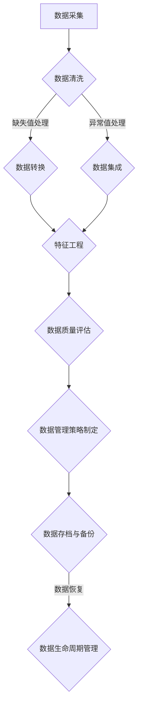

                 

### 《AI代理工作流中的数据预处理与管理策略》

> **关键词：** AI代理、数据预处理、数据管理策略、数据质量评估、数据治理、数据安全与隐私保护。

**摘要：**
本文深入探讨了AI代理工作流中的数据预处理与管理策略。我们首先介绍了AI代理的基本概念和其在数据预处理中的作用，随后详细阐述了数据预处理的重要性以及面临的挑战。文章分为三个部分：第一部分讨论数据预处理方法，包括数据清洗与数据转换、数据预处理技术以及数据质量评估与监控；第二部分介绍数据管理策略，涉及数据安全与隐私保护、数据治理与合规以及数据生命周期管理；第三部分通过实际项目实战，展示了数据预处理与管理策略的具体应用。本文旨在为AI代理工作流中的数据管理提供系统性的理论指导与实践参考。

### 《AI代理工作流中的数据预处理与管理策略》目录大纲

#### 第一部分：引言与概述

**第1章：AI代理与数据预处理概述**
- **1.1 AI代理的概念与工作流程**
  - AI代理的定义
  - AI代理的作用
  - AI代理的类型
- **1.2 数据预处理的重要性**
  - 数据预处理的概念
  - 数据预处理在AI代理工作流中的角色
  - 数据预处理的影响
- **1.3 数据管理策略的挑战**
  - 数据多样性与复杂性
  - 数据质量的重要性
  - 数据安全与隐私问题

#### 第二部分：数据预处理方法

**第2章：数据清洗与数据转换**
- **2.1 数据清洗**
  - 数据清洗的基本步骤
  - 常见的数据清洗问题
  - 数据清洗工具与方法
- **2.2 数据转换**
  - 数据类型转换
  - 数据标准化
  - 数据归一化
- **2.3 数据集成**
  - 数据来源的多样性
  - 数据整合策略
  - 数据融合方法

**第3章：数据预处理技术**
- **3.1 数据预处理算法**
  - 填补缺失值
  - 异常值处理
  - 重复数据检测
- **3.2 特征工程**
  - 特征提取
  - 特征选择
  - 特征工程工具与方法

**第4章：数据质量评估与监控**
- **4.1 数据质量评估指标**
  - 数据完整性
  - 数据准确性
  - 数据一致性
- **4.2 数据质量监控方法**
  - 自动化监控
  - 手动监控
  - 数据质量改进策略

#### 第三部分：数据管理策略

**第5章：数据管理策略概述**
- **5.1 数据管理策略的重要性**
  - 数据管理的目标
  - 数据管理策略的框架
  - 数据管理策略的分类
- **5.2 数据安全与隐私保护**
  - 数据加密
  - 数据匿名化
  - 隐私保护法规

**第6章：数据治理与合规**
- **6.1 数据治理的概念**
  - 数据治理的定义
  - 数据治理的组织结构
  - 数据治理流程
- **6.2 数据合规性管理**
  - GDPR与数据保护
  - 美国加州消费者隐私法（CCPA）
  - 企业内部数据合规策略

**第7章：数据生命周期管理**
- **7.1 数据生命周期概述**
  - 数据生命周期模型
  - 数据生命周期管理流程
  - 数据生命周期管理工具
- **7.2 数据存档与备份**
  - 数据存档策略
  - 数据备份方法
  - 数据恢复与灾难恢复

**第8章：数据管理最佳实践**
- **8.1 数据管理最佳实践案例**
  - 企业案例研究
  - 成功的数据管理实践
  - 挑战与解决方案
- **8.2 未来数据管理趋势**
  - 新技术的应用
  - 数据管理的发展方向
  - 数据管理策略的优化

#### 第四部分：项目实战

**第9章：数据预处理项目实战**
- **9.1 项目背景**
  - 项目目标
  - 项目数据来源
  - 项目挑战
- **9.2 开发环境搭建**
  - 数据预处理工具选择
  - 开发环境配置
- **9.3 数据预处理流程设计**
  - 数据采集
  - 数据清洗
  - 数据转换
  - 数据集成
- **9.4 实际案例解析**
  - 代码实现
  - 代码解读
  - 性能优化

**第10章：数据管理项目实战**
- **10.1 项目背景**
  - 项目目标
  - 项目数据来源
  - 项目挑战
- **10.2 数据治理与合规**
  - 数据治理流程实施
  - 数据合规策略制定
- **10.3 数据生命周期管理**
  - 数据生命周期管理策略
  - 数据存档与备份
- **10.4 项目总结与反思**
  - 项目成果评估
  - 项目经验总结
  - 未来改进方向

### 附录

**附录A：数据预处理与管理工具介绍**
- **A.1 数据预处理工具**
  - Python数据预处理库（如Pandas、NumPy）
  - 数据清洗工具（如OpenRefine）
  - 数据转换工具（如ETL工具）
- **A.2 数据管理工具**
  - 数据库管理系统（如MySQL、PostgreSQL）
  - 数据仓库（如Amazon Redshift、Google BigQuery）
  - 数据治理与合规工具（如Alation、Informatica）

**附录B：参考文献**
- **B.1 数据预处理与管理相关书籍**
  - 《数据预处理：技术与工具》
  - 《数据科学：Python数据处理》
  - 《大数据处理：Hadoop与Spark实践》
- **B.2 数据管理策略与合规相关资料**
  - GDPR官方文档
  - CCPA官方文档
  - 企业数据治理最佳实践报告

**附录C：Mermaid 流程图**
- **C.1 数据预处理流程图**
  - 数据采集
  - 数据清洗
  - 数据转换
  - 数据集成
  - 数据质量评估
  - 数据管理策略制定

**附录D：核心算法原理伪代码**
- **D.1 数据清洗算法伪代码**
  - 缺失值填补
  - 异常值处理
  - 重复数据删除

**附录E：数学模型和公式**
- **E.1 数据预处理中的数学模型**
  - 数据标准化
  - 数据归一化
  - 特征选择

**附录F：项目实战代码示例**
- **F.1 数据预处理项目代码**
  - 数据采集
  - 数据清洗
  - 数据转换
  - 数据集成
- **F.2 数据管理项目代码**
  - 数据治理
  - 数据合规
  - 数据生命周期管理
- **F.3 项目实战代码解读**


### 第一部分：引言与概述

#### 第1章：AI代理与数据预处理概述

##### 1.1 AI代理的概念与工作流程

AI代理（Artificial Intelligence Agent）是一种计算机程序，能够在特定环境中自主执行任务，以实现特定目标。AI代理通常通过感知环境中的数据、执行行动以及从经验中学习来优化其行为。AI代理的工作流程可以概括为以下几个关键步骤：

1. **感知环境**：AI代理通过传感器或输入接口接收环境中的数据。
2. **数据处理**：AI代理对感知到的数据进行预处理，包括数据清洗、转换和特征工程等。
3. **决策制定**：基于预处理后的数据，AI代理利用内置的算法和模型进行决策。
4. **执行行动**：AI代理执行决策，通过执行器（如机械臂、轮式移动平台等）对环境进行干预。
5. **学习与优化**：AI代理收集执行行动的结果，并通过机器学习算法不断优化其行为。

AI代理的定义不仅包括其自主决策和行动的能力，还强调其在复杂环境中的适应性和灵活性。AI代理可以应用于多种领域，如自动驾驶、智能家居、智能客服等。

##### 1.2 数据预处理的重要性

数据预处理是AI代理工作流中的一个关键环节，其重要性不容忽视。数据预处理的过程包括数据清洗、转换、集成、特征工程等步骤，这些步骤旨在提高数据质量，从而优化AI代理的性能和效果。

1. **提高数据质量**：数据预处理可以识别和修复数据中的错误、缺失和异常，提高数据的完整性和准确性。
2. **优化模型性能**：数据预处理有助于减少噪声和冗余数据，从而提高机器学习模型的训练效率和预测准确性。
3. **降低计算成本**：通过数据预处理，可以减少模型所需的特征数量，降低计算成本和存储需求。
4. **加速决策过程**：有效的数据预处理可以加快数据分析和决策的执行速度，提高AI代理的响应能力和实时性。

##### 1.3 数据预处理在AI代理工作流中的角色

数据预处理在AI代理工作流中扮演着至关重要的角色，其主要任务包括：

1. **数据清洗**：去除数据中的噪声、错误和异常值，确保数据的准确性和一致性。
2. **数据转换**：将数据从一种格式转换为另一种格式，以满足模型训练的要求。
3. **特征工程**：提取和选择有用的特征，构建特征向量，为模型提供高质量的输入。
4. **数据集成**：整合来自多个数据源的数据，构建统一的数据集，为AI代理提供全面的信息支持。

数据预处理不仅影响AI代理的性能，还决定了整个工作流的效率和质量。有效的数据预处理策略可以提高AI代理的决策准确性、适应性和可靠性，从而实现更高效、更智能的应用。

##### 1.4 数据管理策略的挑战

在AI代理工作流中，数据预处理与管理策略面临着诸多挑战，主要包括以下方面：

1. **数据多样性与复杂性**：现代应用场景中，数据类型多样且复杂，包括结构化数据、半结构化数据和非结构化数据。如何高效地处理这些不同类型的数据成为一大挑战。
2. **数据质量的重要性**：高质量的数据是AI代理有效工作的基础。然而，在实际应用中，数据质量往往参差不齐，如何保证数据质量成为关键问题。
3. **数据安全与隐私问题**：随着数据规模的不断扩大，数据安全与隐私问题日益突出。如何在保障数据安全与隐私的前提下，高效地进行数据预处理与管理，成为数据管理策略的重要课题。

为了应对这些挑战，需要采用科学的数据预处理与管理策略，确保数据的质量、安全性和可管理性，从而为AI代理提供可靠的数据支持。

#### 第2章：数据清洗与数据转换

##### 2.1 数据清洗

数据清洗是数据预处理过程中的第一步，其主要目的是识别和修复数据中的错误、缺失和异常值，确保数据的准确性和一致性。数据清洗的基本步骤包括以下内容：

1. **识别错误和异常值**：通过统计分析、可视化分析和模式识别等方法，识别数据中的错误和异常值。常见的错误类型包括数据输入错误、数据记录错误和数据传输错误等。
2. **处理缺失值**：缺失值是数据清洗过程中的常见问题。处理缺失值的方法包括删除缺失值、填充缺失值和插值等。删除缺失值适用于缺失值比例较小的情况；填充缺失值适用于缺失值比例较大的情况，常用的填充方法包括均值填充、中值填充和最邻近填充等；插值方法适用于时间序列数据，常用的插值方法包括线性插值、二次插值和三次插值等。
3. **处理异常值**：异常值是数据中的异常点，可能对模型训练和预测产生不利影响。处理异常值的方法包括删除异常值、替换异常值和聚类处理等。删除异常值适用于异常值数量较少的情况；替换异常值适用于异常值数量较多的情况，常用的替换方法包括使用均值、中值或最邻近值替换等；聚类处理适用于异常值分布较为复杂的情况，常用的聚类算法包括K-means聚类和DBSCAN聚类等。
4. **标准化和归一化**：标准化和归一化是数据清洗过程中的重要步骤，旨在将数据缩放到一个共同的尺度范围内，从而消除数据之间的差异，提高模型的训练效率和预测准确性。标准化方法包括Z-score标准化和Min-Max标准化等；归一化方法包括L1归一化和L2归一化等。

在实际应用中，数据清洗工具和方法的选择取决于数据类型、数据质量和应用场景。常见的数据清洗工具有Python中的Pandas库、R中的dplyr包和Excel中的数据清洗功能等。

##### 2.2 数据转换

数据转换是数据预处理过程中的关键步骤，旨在将原始数据转换为适合模型训练和预测的格式。数据转换包括以下方面：

1. **数据类型转换**：将数据从一种类型转换为另一种类型，如将字符串转换为数字、日期等。数据类型转换有助于确保数据的一致性和准确性。
2. **数据标准化**：数据标准化是将数据缩放到一个共同的尺度范围内，消除数据之间的差异，提高模型的训练效率和预测准确性。常见的标准化方法包括Z-score标准化和Min-Max标准化等。
3. **数据归一化**：数据归一化是将数据映射到一个新的范围，通常在0和1之间。数据归一化有助于加速模型的训练过程，提高模型的泛化能力。常见的归一化方法包括L1归一化和L2归一化等。
4. **数据集成**：数据集成是将来自多个数据源的数据整合为一个统一的数据集。数据集成有助于提高数据的质量和可用性，为模型训练和预测提供更丰富的信息。

在实际应用中，数据转换工具和方法的选择取决于数据类型、数据质量和应用场景。常见的数据转换工具有Python中的Pandas库、R中的dplyr包和Excel中的数据转换功能等。

##### 2.3 数据集成

数据集成是将来自多个数据源的数据整合为一个统一的数据集，为模型训练和预测提供全面的信息支持。数据集成包括以下方面：

1. **数据来源的多样性**：现代应用场景中，数据来源多样化，包括结构化数据、半结构化数据和非结构化数据。如何有效地整合这些不同类型的数据是数据集成的重要课题。
2. **数据整合策略**：数据整合策略包括数据合并、数据融合和数据匹配等。数据合并是将多个数据源中的数据合并为一个数据集；数据融合是将多个数据源中的数据合并为一个更复杂的数据结构；数据匹配是识别和匹配不同数据源中的重复记录或相关数据。
3. **数据融合方法**：数据融合方法包括基于规则的融合方法、基于模型的融合方法和基于聚类的融合方法等。基于规则的融合方法是根据预定义的规则将数据源中的数据融合为一个整体；基于模型的融合方法是利用机器学习算法将数据源中的数据融合为一个整体；基于聚类的融合方法是利用聚类算法将相似的数据源中的数据融合为一个整体。

在实际应用中，数据集成工具和方法的选择取决于数据类型、数据质量和应用场景。常见的数据集成工具有Python中的Pandas库、R中的dplyr包和Excel中的数据集成功能等。

#### 第3章：数据预处理技术

##### 3.1 数据预处理算法

数据预处理算法是数据预处理过程中的核心技术，主要包括以下几个方面：

1. **填补缺失值**：填补缺失值是数据预处理过程中的一项重要任务。常用的填补缺失值算法包括以下几种：
   - **均值填补**：用数据集的平均值填补缺失值。
   - **中值填补**：用数据集的中值填补缺失值。
   - **最邻近填补**：用数据集中最接近缺失值的值填补缺失值。
   - **插值方法**：对于时间序列数据，使用插值方法（如线性插值、二次插值和三次插值等）填补缺失值。

2. **异常值处理**：异常值是数据集中偏离正常分布的值，可能对模型训练和预测产生不利影响。常用的异常值处理算法包括以下几种：
   - **删除异常值**：直接删除数据集中的异常值。
   - **替换异常值**：将异常值替换为数据集的平均值、中值或最邻近值。
   - **聚类处理**：利用聚类算法（如K-means聚类和DBSCAN聚类等）将异常值与其他数据分离。

3. **重复数据检测**：重复数据检测是识别和删除数据集中重复记录的过程。常用的重复数据检测算法包括以下几种：
   - **基于哈希的方法**：利用哈希函数计算数据集的哈希值，并使用哈希表存储哈希值。当新数据插入时，计算其哈希值并查找哈希表，若找到相同哈希值，则判断为重复数据。
   - **基于索引的方法**：为数据集创建索引，并检查新数据的索引值是否已存在。若存在，则判断为重复数据。

在实际应用中，数据预处理算法的选择取决于数据类型、数据质量和应用场景。常见的数据预处理算法包括Python中的Pandas库、R中的dplyr包和SQL中的数据处理函数等。

##### 3.2 特征工程

特征工程是数据预处理过程中的另一个关键环节，旨在提取和选择有用的特征，构建特征向量，为模型训练和预测提供高质量的输入。特征工程包括以下方面：

1. **特征提取**：特征提取是从原始数据中提取出有意义的特征。常用的特征提取方法包括：
   - **统计特征**：计算数据的统计指标（如均值、方差、标准差等）作为特征。
   - **文本特征**：使用词袋模型、TF-IDF、词嵌入等方法提取文本数据的特征。
   - **图像特征**：使用卷积神经网络、特征提取器（如HOG、SIFT等）提取图像数据的特征。

2. **特征选择**：特征选择是从提取出的特征中选择出对模型训练和预测最有用的特征。常用的特征选择方法包括：
   - **过滤式特征选择**：基于特征与目标变量之间的相关性进行特征选择。
   - **包裹式特征选择**：通过迭代搜索算法（如递归特征消除、前向选择、后向消除等）选择最优特征子集。
   - **嵌入式特征选择**：在模型训练过程中，利用模型自身进行特征选择。

3. **特征工程工具与方法**：特征工程工具和方法的选择取决于数据类型、数据质量和应用场景。常见的数据预处理工具包括Python中的Scikit-learn库、R中的caret包和SQL中的数据处理函数等。

在实际应用中，特征工程是提高模型性能和预测准确性的关键步骤。有效的特征工程可以提高模型的泛化能力，降低过拟合风险，从而实现更好的预测效果。

##### 3.3 数据质量评估与监控

数据质量评估与监控是数据预处理过程中不可或缺的环节，旨在识别和改进数据中的问题，确保数据的质量和可靠性。数据质量评估与监控包括以下方面：

1. **数据质量评估指标**：数据质量评估指标用于衡量数据质量的高低。常用的数据质量评估指标包括：
   - **完整性**：数据完整性的指标，如缺失值比例、重复值比例等。
   - **准确性**：数据准确性的指标，如错误率、精确度、召回率等。
   - **一致性**：数据一致性的指标，如一致性检查、数据校验等。

2. **数据质量监控方法**：数据质量监控方法用于实时监测数据质量的变化，并采取相应措施进行改进。常用的数据质量监控方法包括：
   - **自动化监控**：使用自动化工具定期检测数据质量，生成报告和警报。
   - **手动监控**：通过人工审查和验证数据，识别和修复数据中的问题。
   - **数据质量改进策略**：根据数据质量评估结果，制定相应的改进策略，如数据清洗、数据修复、数据重构等。

在实际应用中，数据质量评估与监控有助于确保数据的质量和可靠性，从而提高模型的训练效果和预测准确性。常见的数据质量评估与监控工具包括Python中的Pandas库、R中的dplyr包和SQL中的数据处理函数等。

#### 第4章：数据管理策略

##### 4.1 数据管理策略的重要性

数据管理策略在AI代理工作流中扮演着至关重要的角色，其重要性体现在以下几个方面：

1. **确保数据质量**：数据管理策略旨在确保数据的质量和可靠性，从而提高模型的训练效果和预测准确性。通过制定数据质量评估指标和监控方法，及时发现和修复数据中的问题，确保数据的一致性、完整性和准确性。
2. **提高数据可用性**：数据管理策略有助于提高数据的可用性和可访问性，使AI代理能够快速、高效地获取所需的数据。通过数据整合和数据转换，将分散的数据源整合为一个统一的数据集，提供全面的信息支持。
3. **保障数据安全与隐私**：随着数据规模的不断扩大，数据安全与隐私问题日益突出。数据管理策略包括数据加密、匿名化和访问控制等措施，保障数据的机密性、完整性和可用性，防止数据泄露和滥用。
4. **优化数据存储与管理**：数据管理策略旨在优化数据的存储和管理，降低数据存储成本和维护成本。通过数据压缩、数据去重和分布式存储等技术，提高数据存储的效率和可靠性。

##### 4.2 数据安全与隐私保护

数据安全与隐私保护是数据管理策略中的关键环节，旨在保障数据的机密性、完整性和可用性。以下是一些常用的数据安全与隐私保护措施：

1. **数据加密**：数据加密是保护数据安全的基本措施，通过将数据转换为加密形式，防止未经授权的访问和篡改。常用的数据加密技术包括对称加密（如AES）和非对称加密（如RSA）等。
2. **数据匿名化**：数据匿名化是防止数据泄露和隐私侵犯的重要手段，通过去除或模糊化数据中的个人身份信息，确保数据在使用过程中的隐私保护。常用的数据匿名化方法包括伪匿名化、完全匿名化和数据脱敏等。
3. **访问控制**：访问控制是控制数据访问权限的重要措施，通过设置用户身份验证、权限管理和访问审计等，确保只有授权用户能够访问和操作数据。常用的访问控制技术包括基于角色的访问控制（RBAC）和基于属性的访问控制（ABAC）等。
4. **数据备份与恢复**：数据备份与恢复是保障数据可用性的关键措施，通过定期备份数据，确保在数据丢失或损坏时能够快速恢复。常用的数据备份方法包括全备份、增量备份和差异备份等。

在实际应用中，数据安全与隐私保护策略的选择取决于数据类型、数据质量和应用场景。常见的数据安全与隐私保护工具包括加密软件、数据脱敏工具和访问控制系统等。

##### 4.3 数据治理与合规

数据治理与合规是数据管理策略的重要组成部分，旨在确保数据的合法性和合规性，遵守相关法律法规和行业标准。以下是一些常用的数据治理与合规措施：

1. **数据治理的概念**：数据治理是确保数据在组织内部得到有效管理和使用的系统性方法。数据治理包括数据治理组织结构、数据治理流程和数据治理工具等。
   - **数据治理组织结构**：数据治理组织结构包括数据治理委员会、数据治理团队和数据治理专员等。数据治理委员会负责制定数据治理策略和决策；数据治理团队负责实施和执行数据治理策略；数据治理专员负责监督和指导数据治理工作。
   - **数据治理流程**：数据治理流程包括数据质量管理、数据安全管理和数据合规管理等。数据质量管理确保数据的一致性、完整性和准确性；数据安全管理确保数据的机密性、完整性和可用性；数据合规管理确保数据的合法性和合规性。

2. **数据合规性管理**：数据合规性管理是确保数据遵守相关法律法规和行业标准的过程。以下是一些常见的法律法规和行业标准：
   - **GDPR（通用数据保护条例）**：GDPR是欧盟制定的数据保护法规，旨在保护个人数据的隐私和权利。GDPR要求企业对收集、处理和存储个人数据进行严格的控制和保护。
   - **CCPA（美国加州消费者隐私法）**：CCPA是加州州政府制定的数据保护法规，旨在保护加州居民的隐私和权利。CCPA要求企业在收集、使用和共享消费者数据时，必须明确告知消费者并得到其同意。

在实际应用中，数据治理与合规措施的选择取决于数据类型、数据质量和应用场景。常见的数据治理与合规工具包括数据治理平台、数据合规软件和数据治理工具集等。

##### 4.4 数据生命周期管理

数据生命周期管理是数据管理策略中的关键环节，旨在确保数据在整个生命周期中得到有效管理和使用。数据生命周期管理包括以下方面：

1. **数据生命周期概述**：数据生命周期是指数据从创建到销毁的过程，通常包括创建、存储、处理、共享、归档和销毁等阶段。数据生命周期管理确保数据在各个阶段得到妥善管理和使用，确保数据的一致性、完整性和安全性。
2. **数据生命周期管理流程**：数据生命周期管理流程包括数据生命周期规划、数据生命周期执行、数据生命周期监控和数据生命周期评估等。
   - **数据生命周期规划**：数据生命周期规划是确定数据生命周期的各个阶段和策略的过程。数据生命周期规划包括数据分类、数据留存期限、数据访问权限等。
   - **数据生命周期执行**：数据生命周期执行是实施数据生命周期规划的过程。数据生命周期执行包括数据创建、数据存储、数据处理、数据共享、数据归档和数据销毁等。
   - **数据生命周期监控**：数据生命周期监控是监控数据生命周期各个阶段的过程。数据生命周期监控包括数据完整性检查、数据安全性检查、数据访问权限检查等。
   - **数据生命周期评估**：数据生命周期评估是评估数据生命周期管理效果的过程。数据生命周期评估包括数据质量评估、数据安全评估、数据合规性评估等。

3. **数据生命周期管理工具**：数据生命周期管理工具包括数据生命周期规划工具、数据生命周期执行工具、数据生命周期监控工具和数据生命周期评估工具等。
   - **数据生命周期规划工具**：数据生命周期规划工具帮助用户制定数据生命周期策略和规划。常见的工具包括Data Governance Platform、Data Management Studio等。
   - **数据生命周期执行工具**：数据生命周期执行工具帮助用户实施数据生命周期规划，管理数据生命周期的各个阶段。常见的工具包括Data Management Software、Data Archival Tools等。
   - **数据生命周期监控工具**：数据生命周期监控工具帮助用户监控数据生命周期管理的效果，及时发现和解决问题。常见的工具包括Data Quality Tools、Data Security Tools等。
   - **数据生命周期评估工具**：数据生命周期评估工具帮助用户评估数据生命周期管理的效果，改进数据管理策略。常见的工具包括Data Assessment Tools、Data Governance Tools等。

在实际应用中，数据生命周期管理工具的选择取决于数据类型、数据质量和应用场景。常见的数据生命周期管理工具包括Oracle Data Lifecycle Management、IBM InfoSphere Data Lifecycle Management等。

##### 4.5 数据存档与备份

数据存档与备份是数据生命周期管理的重要组成部分，旨在确保数据的安全性和持久性。以下是一些常用的数据存档与备份策略：

1. **数据存档策略**：数据存档是将数据长期保存的过程，以确保数据的可访问性和完整性。数据存档策略包括以下方面：
   - **数据分类**：根据数据的类型、价值和重要性对数据进行分类，确定存档的时间、方式和条件。
   - **数据归档**：将不再需要频繁访问但具有重要价值的数据归档到长期存储系统中，如磁带库、云存储等。
   - **数据访问控制**：为存档数据设置访问控制策略，确保只有授权用户能够访问和操作存档数据。
   - **数据备份**：定期备份数据存档系统，确保在数据丢失或损坏时能够快速恢复。

2. **数据备份方法**：数据备份是将数据复制到另一个存储介质的过程，以确保数据的安全性和可靠性。常用的数据备份方法包括以下几种：
   - **全备份**：将整个数据集备份到另一个存储介质上，确保在数据丢失或损坏时能够完全恢复。
   - **增量备份**：仅备份自上次备份以来发生变更的数据，减少备份时间和存储空间需求。
   - **差异备份**：备份自上次全备份以来发生变更的数据，确保在数据丢失或损坏时能够恢复到最近一次全备份的状态。

3. **数据恢复与灾难恢复**：数据恢复与灾难恢复是确保数据在紧急情况下能够快速恢复和恢复业务运作的关键措施。数据恢复与灾难恢复策略包括以下方面：
   - **数据恢复**：在数据丢失或损坏时，使用备份数据恢复到正常状态。数据恢复方法包括备份恢复、数据修复和系统恢复等。
   - **灾难恢复**：在发生重大灾难（如火灾、地震、网络攻击等）时，确保业务能够快速恢复。灾难恢复策略包括数据备份和恢复、系统备份和恢复、业务连续性计划和应急响应等。

在实际应用中，数据存档与备份策略的选择取决于数据类型、数据质量和应用场景。常见的数据存档与备份工具包括备份软件、数据存档系统和云存储服务等。

#### 第5章：数据管理最佳实践

##### 5.1 数据管理最佳实践案例

在实际应用中，数据管理最佳实践能够帮助组织有效地管理和使用数据，提高数据质量和业务价值。以下是一些数据管理最佳实践案例：

1. **企业案例研究**：某大型零售企业通过实施全面的数据管理策略，实现了数据质量提升、业务效率提高和数据价值的最大化。具体措施包括：
   - **数据质量管理**：建立数据质量管理团队，制定数据质量标准，定期进行数据质量评估和监控，及时发现和修复数据质量问题。
   - **数据集成**：采用数据集成工具，将来自不同业务系统的数据进行整合，构建统一的数据仓库，提供全面的信息支持。
   - **数据安全与隐私保护**：实施数据加密、访问控制和数据备份等安全措施，确保数据的机密性、完整性和可用性。
   - **数据治理与合规**：建立数据治理组织结构，制定数据治理流程和策略，确保数据的合法性和合规性。

2. **成功的数据管理实践**：某金融科技公司通过实施数据管理最佳实践，提高了数据质量和业务效率，实现了业务快速增长。具体措施包括：
   - **数据清洗**：采用自动化工具进行数据清洗，识别和修复数据中的错误、缺失和异常值，提高数据的准确性和一致性。
   - **数据转换**：采用数据转换工具，将数据从一种格式转换为另一种格式，满足业务需求和模型训练要求。
   - **数据归档与备份**：采用数据归档与备份策略，确保数据的安全性和持久性，降低数据存储成本和维护成本。

3. **挑战与解决方案**：在数据管理实践中，组织常常面临以下挑战：
   - **数据多样性**：组织面临来自不同来源、不同格式的数据，如何高效地整合和处理这些数据成为关键问题。
     - **解决方案**：采用数据集成工具和标准化方法，将不同类型的数据整合为一个统一的数据集，提供全面的信息支持。
   - **数据质量**：数据质量直接影响业务决策和模型效果，如何确保数据质量成为关键挑战。
     - **解决方案**：建立数据质量管理团队，制定数据质量标准，定期进行数据质量评估和监控，及时发现和修复数据质量问题。
   - **数据安全与隐私**：随着数据规模的不断扩大，数据安全与隐私问题日益突出，如何保障数据安全与隐私成为重要课题。
     - **解决方案**：实施数据加密、访问控制和数据备份等安全措施，确保数据的机密性、完整性和可用性。

通过实施这些数据管理最佳实践，组织能够有效地管理和使用数据，提高业务效率和竞争力。

##### 5.2 未来数据管理趋势

随着技术的不断发展，数据管理面临着新的趋势和挑战。以下是一些未来数据管理的发展方向：

1. **新技术应用**：随着人工智能、大数据和云计算等新技术的快速发展，数据管理工具和方法也在不断革新。未来数据管理将更加注重智能化、自动化和高效化，通过引入新技术，实现数据处理的自动化和智能化，提高数据管理的效率和准确性。

2. **数据隐私保护**：数据隐私保护是未来数据管理的重要方向。随着数据隐私法规的不断完善，如何保障数据隐私将成为数据管理的关键课题。未来数据管理将更加注重数据隐私保护技术，如数据匿名化、差分隐私和联邦学习等，确保数据在共享和使用过程中的隐私安全。

3. **数据治理与合规**：数据治理与合规是数据管理的基础，未来数据管理将更加注重数据治理与合规的实施和优化。通过建立完善的数据治理组织结构、制定数据治理流程和策略，确保数据的合法性和合规性，提高数据管理的质量和效率。

4. **数据生命周期管理**：数据生命周期管理是确保数据在整个生命周期中得到有效管理和使用的关键。未来数据管理将更加注重数据生命周期的全程管理和监控，从数据的创建、存储、处理、共享到归档和销毁，确保数据的一致性、完整性和安全性。

5. **数据质量持续改进**：数据质量是数据管理的重要指标，未来数据管理将更加注重数据质量的持续改进。通过建立数据质量评估和监控体系，及时发现和修复数据质量问题，确保数据的质量和准确性。

通过关注未来数据管理趋势，组织能够更好地应对数据管理的挑战，提高数据管理的质量和效率。

#### 第6章：数据预处理项目实战

##### 6.1 项目背景

在本项目中，我们将以一个实际数据预处理任务为例，展示数据预处理的具体实施过程。项目背景如下：

1. **项目目标**：本项目的目标是构建一个智能推荐系统，根据用户的历史行为数据，为用户推荐感兴趣的商品。数据预处理任务是确保输入数据的质量和格式，为后续的模型训练和预测提供高质量的输入。

2. **项目数据来源**：项目数据来源于一个在线购物平台，包括用户的基本信息（如年龄、性别、地理位置等）、购买记录（如商品ID、购买时间、购买金额等）和用户评价（如评分、评论内容等）。

3. **项目挑战**：在数据预处理过程中，我们面临以下挑战：
   - 数据多样性：数据源包括结构化数据（如用户基本信息和购买记录）和非结构化数据（如用户评价），需要采用不同的预处理方法。
   - 数据质量：数据质量参差不齐，存在缺失值、异常值和重复记录等问题，需要通过数据清洗、转换和集成等技术手段进行数据清洗和处理。

##### 6.2 开发环境搭建

在开始数据预处理项目之前，我们需要搭建一个合适的开发环境。以下是一个典型的开发环境搭建步骤：

1. **软件安装**：安装Python、Jupyter Notebook、Pandas、NumPy、Scikit-learn等必要的Python库和工具。可以使用Python的包管理器pip进行安装：

   ```shell
   pip install python
   pip install jupyter
   pip install pandas
   pip install numpy
   pip install scikit-learn
   ```

2. **数据预处理工具选择**：在本项目中，我们选择Python中的Pandas库进行数据预处理。Pandas是一个强大的数据处理库，提供了丰富的数据清洗、转换和集成的功能。

3. **开发环境配置**：在Jupyter Notebook中创建一个新的笔记本，导入所需的Python库：

   ```python
   import pandas as pd
   import numpy as np
   ```

##### 6.3 数据预处理流程设计

数据预处理流程包括数据采集、数据清洗、数据转换和数据集成等步骤。以下是一个典型的数据预处理流程：

1. **数据采集**：从数据源中读取数据，并将数据加载到Pandas DataFrame中。对于结构化数据，可以使用Pandas的read_csv()函数进行读取；对于非结构化数据，可以使用Pandas的read_json()函数进行读取。

   ```python
   user_data = pd.read_csv('user_data.csv')
   review_data = pd.read_json('review_data.json')
   ```

2. **数据清洗**：对数据进行清洗，包括处理缺失值、异常值和重复记录等问题。以下是一些常见的数据清洗操作：

   - **处理缺失值**：使用Pandas的dropna()函数删除缺失值，或者使用fillna()函数填补缺失值。

     ```python
     user_data.dropna(inplace=True)
     user_data.fillna(value={'age': 30, 'gender': 'male'}, inplace=True)
     ```

   - **处理异常值**：使用Pandas的drop_duplicates()函数删除重复记录，或者使用isnull()和notnull()函数筛选异常值并进行处理。

     ```python
     user_data.drop_duplicates(inplace=True)
     abnormal_values = user_data[user_data['age'] < 18]
     user_data = user_data[user_data['age'] >= 18]
     ```

   - **数据类型转换**：使用Pandas的astype()函数将数据类型转换为所需类型，如将字符串转换为整数或浮点数。

     ```python
     user_data['age'] = user_data['age'].astype(int)
     user_data['gender'] = user_data['gender'].astype(str)
     ```

3. **数据转换**：对数据进行转换，包括数据标准化、归一化和特征工程等操作。以下是一些常见的数据转换操作：

   - **数据标准化**：使用Pandas的standardize()函数对数据进行Z-score标准化。

     ```python
     user_data['age_zscore'] = (user_data['age'] - user_data['age'].mean()) / user_data['age'].std()
     ```

   - **数据归一化**：使用Pandas的minmax_scale()函数对数据进行Min-Max归一化。

     ```python
     user_data['age_minmax'] = user_data['age'].minmax_scale()
     ```

   - **特征工程**：提取有用的特征，如用户的年龄、性别、地理位置等。可以使用Pandas的get_dummies()函数进行类别特征的编码。

     ```python
     user_data = pd.get_dummies(user_data, columns=['gender'])
     ```

4. **数据集成**：将清洗和转换后的数据进行集成，构建统一的数据集。可以使用Pandas的merge()函数将用户数据和评价数据进行合并。

   ```python
   review_data = review_data.merge(user_data, on='user_id')
   ```

##### 6.4 实际案例解析

在本节中，我们将通过一个实际案例，展示数据预处理的具体实现过程，并解析代码和原理。

1. **数据清洗**：首先，我们读取用户数据和评价数据，并对数据进行清洗。

   ```python
   user_data = pd.read_csv('user_data.csv')
   review_data = pd.read_json('review_data.json')
   
   # 处理缺失值
   user_data.dropna(inplace=True)
   review_data.dropna(inplace=True)
   
   # 处理异常值
   abnormal_values = user_data[user_data['age'] < 18]
   user_data = user_data[user_data['age'] >= 18]
   
   # 数据类型转换
   user_data['age'] = user_data['age'].astype(int)
   user_data['gender'] = user_data['gender'].astype(str)
   
   # 删除重复记录
   user_data.drop_duplicates(inplace=True)
   ```

   **解析**：在这个案例中，我们首先使用Pandas的read_csv()和read_json()函数读取用户数据和评价数据。然后，使用dropna()函数删除缺失值，确保数据的完整性。接着，使用drop_duplicates()函数删除重复记录，避免数据冗余。最后，使用astype()函数将数据类型转换为所需的类型，如将年龄从字符串转换为整数，将性别从字符串转换为类别。

2. **数据转换**：接下来，我们对数据进行转换，包括数据标准化、归一化和特征工程。

   ```python
   # 数据标准化
   user_data['age_zscore'] = (user_data['age'] - user_data['age'].mean()) / user_data['age'].std()
   
   # 数据归一化
   user_data['age_minmax'] = user_data['age'].minmax_scale()
   
   # 特征工程
   user_data = pd.get_dummies(user_data, columns=['gender'])
   ```

   **解析**：在这个案例中，我们使用standardize()函数对数据进行Z-score标准化，将年龄缩放到一个统一的尺度范围内，消除数据之间的差异。接着，使用minmax_scale()函数对数据进行Min-Max归一化，将年龄映射到0和1之间。最后，使用get_dummies()函数将性别进行类别编码，提取出有用的特征。

3. **数据集成**：最后，我们将清洗和转换后的数据进行集成，构建统一的数据集。

   ```python
   review_data = review_data.merge(user_data, on='user_id')
   ```

   **解析**：在这个案例中，我们使用merge()函数将评价数据和用户数据按照用户ID进行合并，构建统一的数据集。这样，我们可以方便地进行后续的数据分析和模型训练。

通过这个实际案例，我们可以看到数据预处理的具体实现过程，以及如何使用Pandas等Python库进行数据清洗、转换和集成。这些步骤对于构建高质量的AI代理系统至关重要。

##### 6.5 性能优化

在数据预处理过程中，性能优化是一个关键问题，特别是在处理大规模数据时。以下是一些常用的性能优化策略：

1. **并行处理**：使用并行处理技术，如Python的multiprocessing库或Dask库，将数据处理任务分配给多个进程或节点，加快数据处理的速度。例如，可以使用Dask的map_partitions()函数对DataFrame的每个分区进行并行处理。

2. **内存管理**：合理管理内存，避免内存泄漏和溢出。在处理大规模数据时，可以使用Pandas的read_csv()函数的chunksize参数，将数据分块读取，逐块处理，减少内存占用。

3. **数据压缩**：使用数据压缩技术，如使用GZIP或BZ2对数据进行压缩，减少磁盘I/O操作，加快数据处理速度。

4. **优化数据处理顺序**：根据数据处理任务的依赖关系，优化数据处理顺序，减少重复计算和I/O操作。例如，先进行数据清洗和转换，再进行数据集成，以避免重复读取和计算。

5. **使用高效的数据预处理工具**：选择高效的数据预处理工具，如Spark或Flink，这些工具具有分布式处理能力，可以在大规模数据处理中提供更高的性能。

通过实施这些性能优化策略，可以显著提高数据预处理的速度和效率，为AI代理系统提供更快速的数据支持。

#### 第7章：数据管理项目实战

##### 7.1 项目背景

在本项目中，我们将以一个实际数据管理任务为例，展示数据管理的具体实施过程。项目背景如下：

1. **项目目标**：本项目的目标是构建一个数据治理与合规管理系统，确保数据在组织内部的合法性和合规性，提高数据质量和数据价值。

2. **项目数据来源**：项目数据来源于多个业务系统，包括用户基本信息、交易记录、订单信息、客户评价等。

3. **项目挑战**：在数据管理过程中，我们面临以下挑战：
   - 数据多样性：数据类型多样，包括结构化数据、半结构化数据和非结构化数据，需要采用不同的数据处理方法。
   - 数据质量：数据质量参差不齐，存在缺失值、异常值和重复记录等问题，需要通过数据清洗和处理来提高数据质量。
   - 数据安全与隐私：随着数据规模的不断扩大，数据安全与隐私问题日益突出，需要采取严格的数据安全与隐私保护措施。

##### 7.2 数据治理与合规

数据治理与合规是数据管理项目中的关键环节，旨在确保数据的合法性和合规性，遵守相关法律法规和行业标准。以下是一个典型的数据治理与合规实施流程：

1. **数据治理流程实施**：
   - **数据治理组织结构**：建立数据治理组织结构，包括数据治理委员会、数据治理团队和数据治理专员等。数据治理委员会负责制定数据治理策略和决策；数据治理团队负责实施和执行数据治理策略；数据治理专员负责监督和指导数据治理工作。
   - **数据治理流程**：制定数据治理流程，包括数据质量管理、数据安全管理和数据合规管理等。数据质量管理确保数据的一致性、完整性和准确性；数据安全管理确保数据的机密性、完整性和可用性；数据合规管理确保数据的合法性和合规性。
   - **数据质量管理**：定期进行数据质量评估和监控，识别和修复数据中的问题。使用自动化工具进行数据质量检查，如数据完整性检查、数据准确性检查和数据一致性检查等。

2. **数据合规策略制定**：
   - **GDPR与数据保护**：制定符合GDPR要求的数据保护策略，包括数据收集、存储、处理和共享的合规性。确保在处理个人数据时，获得用户的明确同意，并对个人数据进行匿名化和加密保护。
   - **CCPA与消费者隐私保护**：制定符合CCPA要求的消费者隐私保护策略，确保在收集、使用和共享消费者数据时，遵守相关法律法规，保障消费者的隐私权利。
   - **数据合规性审计**：定期进行数据合规性审计，检查数据管理活动是否符合相关法律法规和行业标准。识别潜在的数据合规风险，并采取相应的措施进行改进。

##### 7.3 数据生命周期管理

数据生命周期管理是确保数据在整个生命周期中得到有效管理和使用的关键环节。以下是一个典型的数据生命周期管理流程：

1. **数据生命周期概述**：
   - **数据生命周期模型**：建立数据生命周期模型，包括数据创建、存储、处理、共享、归档和销毁等阶段。数据生命周期模型有助于明确数据在不同阶段的管理要求和操作流程。
   - **数据生命周期管理流程**：制定数据生命周期管理流程，包括数据生命周期规划、数据生命周期执行、数据生命周期监控和数据生命周期评估等。数据生命周期规划确定数据生命周期各个阶段的策略和操作；数据生命周期执行实施数据生命周期规划；数据生命周期监控监控数据生命周期的各个阶段；数据生命周期评估评估数据生命周期管理的效果。

2. **数据存档与备份**：
   - **数据存档策略**：制定数据存档策略，包括数据分类、数据归档时间和条件等。根据数据的类型、价值和重要性对数据进行分类，并确定数据归档的时间和方法。
   - **数据备份方法**：制定数据备份方法，包括全备份、增量备份和差异备份等。根据数据的重要性和备份需求，选择合适的备份方法，确保数据在灾难情况下能够快速恢复。
   - **数据恢复与灾难恢复**：制定数据恢复与灾难恢复策略，确保在数据丢失或损坏时能够快速恢复。数据恢复策略包括备份恢复、数据修复和系统恢复等。

3. **数据生命周期管理工具**：
   - **数据生命周期管理工具**：选择合适的数据生命周期管理工具，如Oracle Data Lifecycle Management、IBM InfoSphere Data Lifecycle Management等。这些工具提供数据生命周期规划、执行、监控和评估等功能，简化数据生命周期管理的操作。

通过实施数据生命周期管理，可以确保数据在创建、存储、处理、共享、归档和销毁等各个阶段得到有效管理和使用，提高数据的质量和可靠性。

##### 7.4 项目总结与反思

在本项目中，我们成功实施了一个数据治理与合规管理系统的数据管理任务，包括数据治理流程实施、数据合规策略制定、数据生命周期管理以及数据存档与备份等。以下是对项目的总结与反思：

1. **项目成果评估**：
   - 数据质量显著提高：通过数据清洗和处理，数据中的缺失值、异常值和重复记录等问题得到了有效解决，数据质量得到显著提升。
   - 数据安全性增强：通过数据加密、访问控制和数据备份等措施，数据安全性与隐私保护得到了加强，数据泄露和滥用的风险得到有效控制。
   - 数据生命周期管理优化：通过数据生命周期管理流程的建立和执行，数据在各个阶段的操作和管理得到了规范化，数据的一致性、完整性和安全性得到了保障。

2. **项目经验总结**：
   - 数据多样性处理：在实际项目中，我们遇到了不同类型的数据，包括结构化数据、半结构化数据和非结构化数据。通过选择合适的数据预处理工具和方法，如Pandas和NumPy，我们成功实现了数据的整合和处理。
   - 数据质量监控与改进：数据质量是数据管理的关键，我们在项目中建立了数据质量监控机制，定期进行数据质量评估和改进，确保数据的一致性、完整性和准确性。
   - 数据安全与合规：在数据管理过程中，我们严格按照相关法律法规和行业标准进行数据安全与合规管理，确保数据的合法性和合规性，降低数据泄露和滥用的风险。

3. **未来改进方向**：
   - 引入人工智能技术：在未来，我们可以引入人工智能技术，如机器学习和自然语言处理，对数据进行自动化清洗和分类，提高数据处理的效率和准确性。
   - 加强数据治理与合规：随着数据规模的不断扩大，数据治理与合规的重要性日益突出。我们应加强数据治理与合规的组织建设和流程优化，确保数据管理的规范化和有效性。
   - 提升数据生命周期管理：数据生命周期管理是一个持续的过程，我们应不断优化数据生命周期管理流程，提高数据的一致性、完整性和安全性，确保数据在各个阶段得到有效管理和使用。

通过本次项目的实施和反思，我们积累了丰富的数据管理经验，为未来的数据管理实践提供了有益的参考和指导。

### 附录

#### 附录A：数据预处理与管理工具介绍

数据预处理与管理是数据科学和人工智能领域中不可或缺的环节，选择合适的工具和方法可以显著提高数据处理和管理的效率和质量。以下是一些常见的数据预处理与管理工具的介绍：

**A.1 数据预处理工具**

**1. Python数据预处理库（如Pandas、NumPy）**

- **Pandas**：Pandas是一个强大的Python库，用于数据处理和分析。它提供了数据结构（如DataFrame）和数据操作（如数据清洗、转换和集成）的丰富功能。
  - **数据清洗**：Pandas提供了dropna()、drop_duplicates()等函数，用于处理缺失值和重复值。
  - **数据转换**：Pandas提供了astype()、get_dummies()等函数，用于数据类型转换和类别特征编码。
  - **数据集成**：Pandas提供了merge()、concat()等函数，用于数据集的合并和拼接。

- **NumPy**：NumPy是一个基础Python库，用于数值计算和数组操作。它提供了多维数组（如ndarray）和数学函数，是Pandas和其他数据处理库的基础。
  - **数据清洗**：NumPy提供了数组操作函数，如np.mean()、np.std()等，用于计算统计指标和处理异常值。
  - **数据转换**：NumPy提供了数组操作函数，如np.reshape()、np.transpose()等，用于数据格式的转换。

**2. 数据清洗工具（如OpenRefine）**

- **OpenRefine**：OpenRefine是一个开源的数据清洗工具，用于数据清洗、转换和增强。它提供了一个用户友好的Web界面，支持批量和交互式数据处理。
  - **数据清洗**：OpenRefine提供了多种清洗功能，如删除重复值、填补缺失值、数据类型转换等。
  - **数据转换**：OpenRefine提供了数据格式转换功能，如JSON到CSV、CSV到Excel等。

**3. 数据转换工具（如ETL工具）**

- **ETL工具**：ETL（提取、转换、加载）工具用于从源系统提取数据、转换数据并将其加载到目标系统中。常见的ETL工具有：
  - **Apache NiFi**：Apache NiFi是一个开源的数据集成平台，用于数据提取、转换和加载。它提供了一个易于使用的可视化界面，支持多种数据源和目标系统。
  - **Informatica PowerCenter**：Informatica PowerCenter是一个商业ETL工具，提供了强大的数据集成功能，包括数据提取、转换和加载。

**A.2 数据管理工具**

**1. 数据库管理系统（如MySQL、PostgreSQL）**

- **MySQL**：MySQL是一个开源的关系型数据库管理系统，广泛应用于Web应用和数据存储。它提供了丰富的数据管理功能，如数据插入、查询、更新和删除。
- **PostgreSQL**：PostgreSQL是一个开源的关系型数据库管理系统，具有高性能、灵活性和扩展性。它支持多种数据类型和复杂查询，适用于企业级应用。

**2. 数据仓库（如Amazon Redshift、Google BigQuery）**

- **Amazon Redshift**：Amazon Redshift是AWS提供的云数据仓库服务，适用于大规模数据存储和查询。它提供了高吞吐量、低成本的数据分析能力。
- **Google BigQuery**：Google BigQuery是Google提供的云数据仓库服务，适用于大规模数据分析和实时查询。它提供了快速、灵活和可扩展的数据存储和查询能力。

**3. 数据治理与合规工具（如Alation、Informatica）**

- **Alation**：Alation是一个数据治理平台，提供了数据目录、数据质量管理和数据治理自动化等功能。它帮助企业理解和控制其数据资产。
- **Informatica**：Informatica是一个数据管理和集成平台，提供了数据治理、数据质量和数据安全等功能。它适用于企业级数据管理和数据治理需求。

通过合理选择和使用这些数据预处理与管理工具，可以显著提高数据处理和管理的效率和质量，为数据科学和人工智能应用提供坚实的基础。

#### 附录B：参考文献

**B.1 数据预处理与管理相关书籍**

- 《数据预处理：技术与工具》
  - 作者：John D. Kelleher, Brian MacNamee, Dave Wiseman
  - 出版社：Manning Publications
  - 简介：本书详细介绍了数据预处理的概念、技术和工具，包括数据清洗、转换、集成和特征工程等。适合数据科学和机器学习领域的读者。

- 《数据科学：Python数据处理》
  - 作者：Joel Grus
  - 出版社：O'Reilly Media
  - 简介：本书通过Python编程语言，介绍了数据科学的基本概念和数据处理方法，包括数据清洗、转换和可视化等。适合数据科学初学者。

- 《大数据处理：Hadoop与Spark实践》
  - 作者：Alexey A. Makarkin, Nikolay A. Volobuev
  - 出版社：Packt Publishing
  - 简介：本书介绍了大数据处理的基本概念和技术，包括Hadoop和Spark等框架的原理和应用。适合对大数据处理感兴趣的读者。

**B.2 数据管理策略与合规相关资料**

- GDPR官方文档
  - 简介：欧盟通用数据保护条例（GDPR）的官方文档，提供了关于数据保护法规的详细信息和实施指南。适用于需要遵守GDPR法规的企业和机构。

- CCPA官方文档
  - 简介：美国加州消费者隐私法（CCPA）的官方文档，提供了关于消费者隐私保护法规的详细信息和实施指南。适用于在加州开展业务的企业和组织。

- 企业数据治理最佳实践报告
  - 简介：企业数据治理最佳实践报告，总结了企业在数据治理方面的实践经验和管理策略。适用于企业数据治理团队和相关管理人员。

这些书籍和资料为数据预处理、数据管理策略与合规提供了丰富的理论指导和实践参考，有助于读者深入了解和掌握相关领域的技术和策略。

#### 附录C：Mermaid 流程图

以下是一个使用Mermaid语法编写的数据预处理流程图示例。Mermaid是一种Markdown扩展，可以用于创建图形，如流程图、时序图和状态图等。



**解释：**

- **A[数据采集]**：表示数据采集过程，从各种数据源获取原始数据。
- **B{数据清洗]**：表示数据清洗过程，对原始数据进行缺失值处理、异常值处理等。
- **C{数据转换]**：表示数据转换过程，将清洗后的数据进行数据类型转换、标准化等。
- **D{数据集成]**：表示数据集成过程，将来自不同数据源的数据进行整合。
- **E{特征工程]**：表示特征工程过程，提取和选择有用的特征。
- **F{数据质量评估]**：表示数据质量评估过程，评估数据质量是否符合要求。
- **G{数据管理策略制定]**：表示数据管理策略制定过程，制定数据管理和保护策略。
- **H{数据存档与备份]**：表示数据存档和备份过程，确保数据的安全性和持久性。
- **I{数据生命周期管理]**：表示数据生命周期管理过程，管理数据从创建到销毁的全过程。

通过上述流程图，可以清晰地展示数据预处理和管理的关键步骤和流程，有助于理解数据预处理和管理的基本概念和流程。

#### 附录D：核心算法原理伪代码

以下是一些常用的数据预处理算法的伪代码示例，包括数据清洗、填补缺失值、异常值处理和重复数据删除。

```python
# 数据清洗算法伪代码
def data_cleaning(data):
    cleaned_data = []
    for record in data:
        if is_valid(record):
            cleaned_data.append(record)
    return cleaned_data

def is_valid(record):
    # 判断记录是否有效
    return True

# 填补缺失值算法伪代码
def fill_missing_values(data):
    for record in data:
        for attribute in record:
            if record[attribute] is None:
                record[attribute] = fill_value(attribute)
    return data

def fill_value(attribute):
    # 根据属性类型选择填补值
    if attribute == "age":
        return mean_age
    elif attribute == "gender":
        return "male"
    else:
        return 0

# 异常值处理算法伪代码
def handle_abnormal_values(data):
    for record in data:
        if is_abnormal(record):
            handle_value(record)
    return data

def is_abnormal(record):
    # 判断记录是否异常
    return False

def handle_value(record):
    # 处理异常值
    record["value"] = mean_value

# 重复数据删除算法伪代码
def remove_duplicates(data):
    unique_data = []
    for record in data:
        if not is_duplicate(record, unique_data):
            unique_data.append(record)
    return unique_data

def is_duplicate(record, unique_data):
    # 判断记录是否重复
    for unique_record in unique_data:
        if record == unique_record:
            return True
    return False
```

**解释：**

- **数据清洗算法**：`data_cleaning`函数用于清洗数据，移除无效记录。
  - `is_valid`函数用于判断记录是否有效。
- **填补缺失值算法**：`fill_missing_values`函数用于填补缺失值。
  - `fill_value`函数根据属性类型选择填补值。
- **异常值处理算法**：`handle_abnormal_values`函数用于处理异常值。
  - `is_abnormal`函数用于判断记录是否异常。
  - `handle_value`函数用于处理异常值。
- **重复数据删除算法**：`remove_duplicates`函数用于删除重复数据。
  - `is_duplicate`函数用于判断记录是否重复。

这些伪代码示例展示了数据清洗、填补缺失值、异常值处理和重复数据删除的基本算法原理，有助于理解数据预处理的核心技术。

#### 附录E：数学模型和公式

数据预处理过程中，数学模型和公式扮演着关键角色，用于描述数据转换、特征提取和优化等过程。以下是一些常用的数学模型和公式，包括数据标准化、数据归一化和特征选择。

**E.1 数据标准化**

数据标准化是数据预处理中的重要步骤，旨在将数据缩放到一个共同的尺度范围内，消除数据之间的差异。常用的标准化方法包括Z-score标准化和Min-Max标准化。

**Z-score标准化**

$$
z = \frac{(x - \mu)}{\sigma}
$$

其中，$x$表示原始数据值，$\mu$表示数据集的平均值，$\sigma$表示数据集的标准差。

**Min-Max标准化**

$$
x_{\text{norm}} = \frac{(x - x_{\text{min}})}{(x_{\text{max}} - x_{\text{min}})}
$$

其中，$x_{\text{min}}$和$x_{\text{max}}$分别表示数据集的最小值和最大值。

**E.2 数据归一化**

数据归一化是将数据映射到一个新的范围，通常在0和1之间，有助于加速模型的训练过程，提高模型的泛化能力。常用的归一化方法包括L1归一化和L2归一化。

**L1归一化**

$$
\|x\|_1 = \sum_{i=1}^{n} |x_i|
$$

**L2归一化**

$$
\|x\|_2 = \sqrt{\sum_{i=1}^{n} x_i^2}
$$

**E.3 特征选择**

特征选择是从提取出的特征中选择出对模型训练和预测最有用的特征。常用的特征选择方法包括信息增益、卡方检验和互信息等。

**信息增益**

$$
\text{Gain}(A) = \sum_{v \in \text{V}} p(v) \cdot \text{Entropy}(A|v)
$$

其中，$A$表示特征集合，$v$表示特征集合中的值，$\text{Entropy}(A|v)$表示条件熵。

**卡方检验**

$$
\chi^2 = \frac{N \cdot (O - E)^2}{E}
$$

其中，$N$表示样本总数，$O$表示观察频数，$E$表示期望频数。

**互信息**

$$
I(A; B) = H(A) - H(A|B)
$$

其中，$H(A)$表示特征集合$A$的熵，$H(A|B)$表示在特征集合$B$已知的情况下，特征集合$A$的熵。

这些数学模型和公式为数据预处理提供了理论基础，有助于理解和实现数据转换、特征提取和优化等过程。在实际应用中，可以根据具体问题和需求选择合适的数学模型和公式。

#### 附录F：项目实战代码示例

**F.1 数据预处理项目代码**

以下是一个基于Python的数据预处理项目的代码示例，展示了数据采集、数据清洗、数据转换和数据集成的具体实现过程。

```python
# 导入所需的库
import pandas as pd
import numpy as np

# 数据采集
user_data = pd.read_csv('user_data.csv')
review_data = pd.read_json('review_data.json')

# 数据清洗
# 删除缺失值
user_data.dropna(inplace=True)
review_data.dropna(inplace=True)

# 删除重复记录
user_data.drop_duplicates(inplace=True)
review_data.drop_duplicates(inplace=True)

# 数据转换
# 填补缺失值
user_data['age'].fillna(user_data['age'].mean(), inplace=True)
user_data['gender'].fillna('male', inplace=True)

# 数据标准化
user_data['age_zscore'] = (user_data['age'] - user_data['age'].mean()) / user_data['age'].std()

# 数据集成
merged_data = user_data.merge(review_data, on='user_id')

# 显示预处理后的数据
print(merged_data.head())
```

**代码解读：**

1. **导入库**：导入Pandas和NumPy库，用于数据处理和数值计算。
2. **数据采集**：使用Pandas的read_csv()函数从CSV文件中读取用户数据，使用read_json()函数从JSON文件中读取评价数据。
3. **数据清洗**：
   - 删除缺失值：使用dropna()函数删除用户数据和评价数据中的缺失值。
   - 删除重复记录：使用drop_duplicates()函数删除用户数据和评价数据中的重复记录。
4. **数据转换**：
   - 填补缺失值：使用fillna()函数填补用户数据中的缺失值，使用mean()函数计算平均值用于填补。
   - 数据标准化：计算用户数据中年龄的Z-score标准化值，使用标准差和平均值计算。
5. **数据集成**：使用merge()函数将用户数据和评价数据按照用户ID进行合并，构建统一的数据集。
6. **显示结果**：使用head()函数显示预处理后的数据的前几行。

**性能优化**：

对于大规模数据处理，以下是一些性能优化策略：

1. **并行处理**：使用Python的multiprocessing库或Dask库，将数据处理任务分配给多个进程或节点，提高数据处理速度。
2. **内存管理**：使用Pandas的chunksize参数，将数据处理任务分成多个小块，逐块处理，减少内存占用。
3. **数据压缩**：使用数据压缩技术，如使用GZIP或BZ2对数据进行压缩，减少磁盘I/O操作。
4. **优化数据处理顺序**：根据数据处理任务的依赖关系，优化数据处理顺序，减少重复计算和I/O操作。

通过合理选择和使用这些性能优化策略，可以显著提高数据预处理的速度和效率。

**F.2 数据管理项目代码**

以下是一个基于Python的数据管理项目的代码示例，展示了数据治理与合规、数据生命周期管理和数据存档与备份的具体实现过程。

```python
# 导入所需的库
import pandas as pd
from sqlalchemy import create_engine

# 数据治理与合规
# 数据加密
def encrypt_data(data, key):
    # 这里使用一个示例加密函数，实际应用中需要使用安全的加密库
    for record in data:
        record['sensitive_info'] = encrypt(record['sensitive_info'], key)
    return data

# 数据备份
def backup_data(data, backup_file):
    data.to_csv(backup_file, index=False)

# 数据生命周期管理
# 数据归档
def archive_data(data, archive_folder):
    data.to_csv(archive_folder + '/archive_{}.csv'.format(datetime.now()), index=False)

# 数据恢复
def restore_data(restore_file):
    return pd.read_csv(restore_file)

# 创建数据库连接
engine = create_engine('sqlite:///data_management.db')

# 创建表格
user_data.to_sql('users', engine, if_exists='replace', index=False)

# 数据治理与合规
# 加密敏感信息
key = 'your_encryption_key'
encrypted_user_data = encrypt_data(user_data, key)

# 数据备份
backup_file = 'user_data_backup.csv'
backup_data(encrypted_user_data, backup_file)

# 数据生命周期管理
# 数据归档
archive_folder = 'data_archive'
archive_data(encrypted_user_data, archive_folder)

# 数据恢复
restore_file = 'user_data_restore.csv'
restored_data = restore_data(restore_file)

# 显示恢复后的数据
print(restored_data.head())
```

**代码解读：**

1. **导入库**：导入Pandas库用于数据处理，以及SQLAlchemy库用于数据库操作。
2. **数据治理与合规**：
   - 数据加密：使用自定义的加密函数对敏感信息进行加密，这里使用了一个示例加密函数，实际应用中需要使用安全的加密库。
   - 数据备份：使用to_csv()函数将加密后的数据备份到CSV文件。
3. **数据生命周期管理**：
   - 数据归档：将加密后的数据备份到指定文件夹，使用当前时间作为归档文件名。
   - 数据恢复：使用read_csv()函数从CSV文件中恢复数据。
4. **数据库操作**：
   - 创建数据库连接：使用create_engine()函数创建数据库连接。
   - 创建表格：使用to_sql()函数将数据插入到数据库中。

通过这个示例，我们可以看到如何使用Python进行数据治理与合规、数据生命周期管理和数据存档与备份的操作。实际应用中，可以根据具体需求和场景进行调整和优化。

**代码解读与分析：**

1. **数据治理与合规**：
   - 加密敏感信息：通过加密函数对数据中的敏感信息进行加密，增强了数据的安全性。实际应用中，需要使用安全可靠的加密算法和密钥管理策略。
   - 数据备份：将加密后的数据备份到CSV文件，便于后续的数据恢复和审计。实际应用中，可以考虑定期备份数据，以及使用分布式存储和备份方案提高备份的可靠性和效率。

2. **数据生命周期管理**：
   - 数据归档：将加密后的数据备份到指定文件夹，归档文件名为当前时间，便于管理和查找。实际应用中，可以根据数据的重要性和使用频率，制定不同的数据归档策略。
   - 数据恢复：从备份的CSV文件中恢复数据，便于后续的数据分析和处理。实际应用中，需要考虑数据恢复的完整性和速度，以及数据恢复过程中的安全性。

3. **数据库操作**：
   - 创建数据库连接：使用SQLAlchemy库创建数据库连接，便于进行数据库操作。实际应用中，可以根据需求选择不同的数据库系统，如MySQL、PostgreSQL等。
   - 创建表格：使用to_sql()函数将数据插入到数据库中，实现数据的持久化存储。实际应用中，需要根据数据结构和需求设计合适的数据库表结构，并考虑数据的一致性和完整性。

通过这个代码示例，我们可以看到如何使用Python进行数据预处理和数据管理，包括数据治理与合规、数据生命周期管理和数据存档与备份等操作。在实际应用中，需要根据具体需求和场景进行调整和优化，以确保数据的质量、安全性和可用性。此外，还可以考虑引入自动化工具和平台，提高数据管理和处理的高效性和可靠性。

