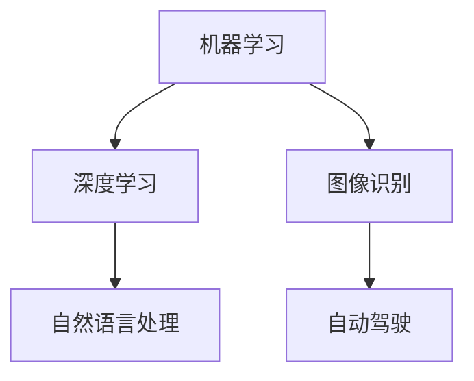
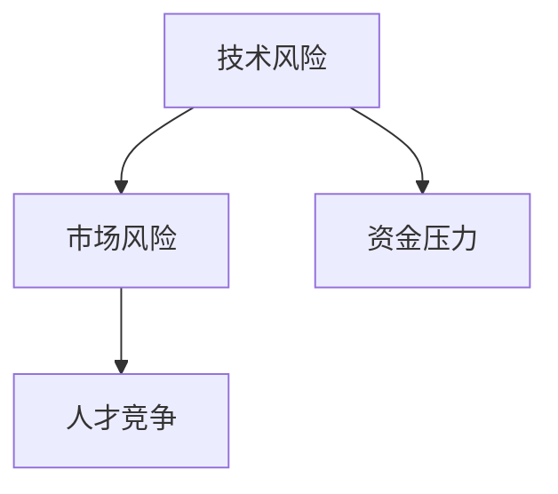
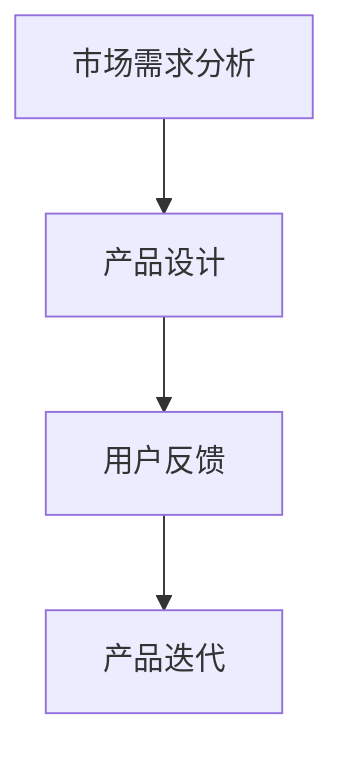
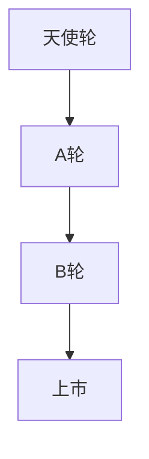
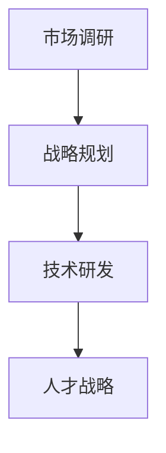
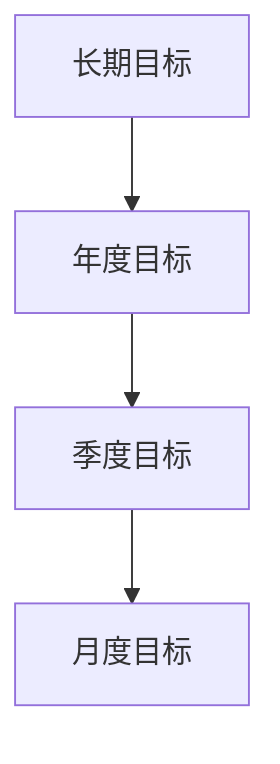
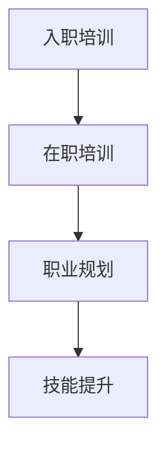
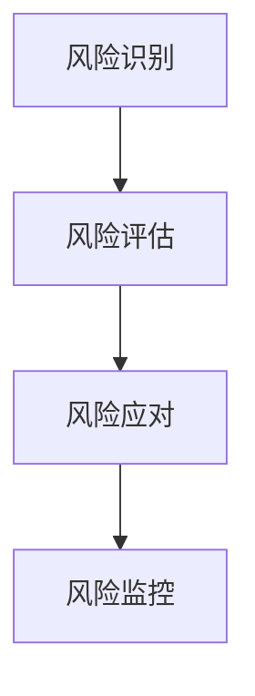

                 

### 第1章: AI创业公司概述

> **核心关键词：** AI创业公司、机遇与挑战、战略规划、短期与长期目标

在当前技术快速发展的背景下，人工智能（AI）行业无疑成为了最具活力和潜力的领域之一。对于许多有志于在这个领域创业的人来说，如何平衡短期与长期目标是至关重要的一环。本文将围绕这一主题，结合AI行业的现状和发展趋势，探讨AI创业公司在平衡短期与长期目标时所需的策略和步骤。

#### 1.1 AI行业的机遇与挑战

##### 1.1.1 AI技术发展趋势

人工智能技术主要包括机器学习、深度学习、自然语言处理等领域。这些技术在图像识别、语音识别、自动驾驶等实际应用中取得了显著的进展。

**核心概念与联系：**
- **机器学习**：通过数据训练模型，使其能够自动识别规律和做出决策。
- **深度学习**：基于多层神经网络，通过大量数据训练，提高模型的准确性和泛化能力。
- **自然语言处理**：利用统计模型或神经网络，实现人机交互、文本分析和语义理解等功能。

**Mermaid流程图：**


##### 1.1.2 创业公司面临的机遇

AI技术为企业提供了智能化的解决方案，有助于提升效率、降低成本和开拓新市场。例如，智能客服系统可以提高客户服务质量，智能安防系统可以提升安全保障水平。

**核心算法原理讲解：**

- **机器学习：** 通过数据训练模型，使其能够自动识别规律和做出决策。常见的算法包括线性回归、决策树、支持向量机等。
- **深度学习：** 基于多层神经网络，通过大量数据训练，提高模型的准确性和泛化能力。典型的深度学习模型包括卷积神经网络（CNN）和循环神经网络（RNN）。
- **自然语言处理：** 利用统计模型或神经网络，实现人机交互、文本分析和语义理解等功能。常见的NLP算法有词袋模型、递归神经网络（RNN）和转换器（Transformer）等。

##### 1.1.3 创业公司面临的挑战

尽管AI行业充满了机遇，但创业公司仍需面对诸多挑战。例如：

- **技术风险**：AI技术更新迅速，创业公司可能面临技术过时的风险。
- **市场风险**：市场需求变化快，创业公司需要不断调整产品策略。
- **人才竞争**：优秀的技术人才稀缺，创业公司需要吸引并留住顶尖人才。

**Mermaid流程图：**


#### 1.2 创业公司的AI战略规划

##### 1.2.1 战略目标

创业公司应根据自身定位和资源，制定清晰的短期和长期战略目标。短期目标通常是指未来一年或两年的目标，而长期目标则可能涉及未来五到十年的发展。

**核心概念：**
- **短期目标**：明确当前阶段的关键任务和目标，如产品研发、市场开拓等。
- **长期目标**：制定具有远见和战略意义的目标，如成为行业领导者、开拓新市场等。

**数学模型和公式讲解：**
$$
\text{短期目标} = \text{当前能力} + \text{努力系数}
$$
$$
\text{长期目标} = \text{愿景} + \text{可行性分析}
$$

**举例说明：** 假设一家初创公司希望在三年内成为行业领导者，其短期目标可以是完成关键技术的研发，长期目标则包括开拓新市场和形成核心竞争力。

##### 1.2.2 资源整合

创业公司需要合理利用外部资源，包括资金、人才、技术等。资源的整合有助于公司实现战略目标。

**核心概念：**
- **资金**：寻找合适的融资渠道，如天使投资、风险投资等。
- **人才**：吸引和培养顶尖技术人才，建立高效团队。
- **技术**：获取和整合先进的AI技术，提升产品竞争力。

**伪代码：**
```python
# 初始化资源
resources = {'资金': 0, '人才': 0, '技术': 0}

# 利用外部资源
resources['资金'] += external_funding()
resources['人才'] += hire_experts()
resources['技术'] += acquire_technologies()

# 资源整合
integrated_resources = integrate_resources(resources)
```

##### 1.2.3 市场定位

创业公司需要根据市场需求，找准自己的市场定位。市场定位有助于公司在竞争激烈的市场中脱颖而出。

**核心概念：**
- **市场定位**：确定公司目标市场和客户群体，制定针对性的市场策略。
- **差异化优势**：明确公司的竞争优势，如技术领先、产品创新等。

**举例说明：** 假设一家AI创业公司定位在智能家居领域，其市场定位可以是提供智能安防解决方案。

### 小结

本章概述了AI创业公司面临的机遇与挑战，以及战略规划的基本要点。在接下来的章节中，我们将进一步探讨短期与长期目标的实现策略，帮助创业公司在快速变化的市场环境中稳步发展。

## AI创业公司如何平衡短期与长期目标？

> **核心关键词：** 短期目标、长期目标、平衡策略、AI战略规划

在AI创业公司的发展过程中，平衡短期与长期目标是确保公司可持续发展的关键。短期目标为公司提供了明确的方向和动力，而长期目标则为公司描绘了未来的蓝图。然而，如何在追求短期利益的同时，不偏离长期目标，成为许多创业公司面临的重要问题。本文将深入探讨AI创业公司如何平衡短期与长期目标，并提供一系列实用的策略和步骤。

### 第2章: 短期目标的实现策略

短期目标是创业公司阶段性的成果体现，是实现长期目标的基础。以下是实现短期目标的一些关键策略：

#### 2.1 产品开发与迭代

产品开发是创业公司最核心的任务之一。为了确保产品能够快速适应市场变化，产品开发需要以迭代的方式进行。

##### 2.1.1 产品设计

产品设计是产品开发的第一步。一个好的产品设计应注重用户体验，确保产品满足市场需求。

**核心概念：**
- **用户体验（UX）设计**：关注用户的使用流程和感受，确保产品易用、直观。
- **需求分析**：通过市场调研和用户反馈，了解用户需求，指导产品设计。

**Mermaid流程图：**


##### 2.1.2 技术实现

技术实现是产品开发的关键环节。为了确保产品的技术可行性，创业公司需要具备强大的技术实力。

**核心概念：**
- **技术选型**：根据产品需求，选择合适的开发框架和工具。
- **技术验证**：通过技术预研和实验，验证技术的可行性。

**伪代码：**
```python
# 初始化技术实现
implementation = initialize_technology()

# 技术选型
selected_technology = select_technology(implementation)

# 技术实现
complete_implementation = implement_technology(selected_technology)
```

##### 2.1.3 团队协作

团队协作是产品开发成功的关键。一个高效的团队需要建立良好的沟通和协作机制。

**核心概念：**
- **敏捷开发**：采用敏捷开发方法，快速响应市场变化。
- **代码审查**：通过代码审查，确保代码质量，提高开发效率。

**举例说明：** 团队成员可以通过定期会议、代码审查和知识分享等方式提高协作效率。

#### 2.2 资本运营

资本运营是创业公司获取资金、管理资金的重要手段。合理的资本运营有助于公司在竞争激烈的市场中立足。

##### 2.2.1 融资策略

创业公司应根据自身发展阶段和需求，选择合适的融资策略。常见的融资策略包括天使轮、A轮、B轮等。

**核心概念：**
- **天使轮**：通常是创始人或早期投资者提供的资金，用于产品的初期研发。
- **A轮**：在产品初步完成后，通过风险投资获得资金，用于市场推广和技术完善。
- **B轮**：在市场初步验证后，通过更多的资金投入，加速产品的市场推广和团队扩展。

**Mermaid流程图：**


##### 2.2.2 资金管理

资金管理是创业公司的一项重要任务。良好的资金管理有助于确保公司的财务健康。

**核心概念：**
- **预算管理**：制定详细的预算计划，确保资金使用的透明和有效。
- **成本控制**：通过精细化成本管理，降低不必要的开支。

**数学模型和公式讲解：**
$$
\text{资金利用率} = \frac{\text{实际支出}}{\text{总资金}}
$$

**举例说明：** 创业公司可以通过精细化预算管理和成本控制，提高资金利用率。

##### 2.2.3 投资者关系

与投资者保持良好的关系对于公司的融资和发展至关重要。定期与投资者沟通，了解他们的需求和期望，有助于公司更好地把握市场机会。

**核心概念：**
- **定期报告**：向投资者提供公司的运营报告，展示公司的业绩和进展。
- **沟通会**：定期组织投资者沟通会，解答投资者的疑问，建立信任。

**举例说明：** 创业公司可以通过定期报告和沟通会与投资者保持紧密联系。

### 第3章: 长期目标的制定与实施

长期目标是创业公司的战略方向，是实现公司愿景的重要保障。制定和实施长期目标需要深入思考和全面规划。

#### 3.1 愿景与使命

愿景和使命是公司的核心价值观和未来发展方向的体现。

##### 3.1.1 愿景

愿景是公司长期发展的方向，应具有远见和战略意义。一个明确的愿景能够激励员工，引领公司前进。

**核心概念：**
- **远见**：展望未来，制定具有前瞻性的发展目标。
- **战略意义**：公司的愿景应与行业趋势和国家战略相契合。

**举例说明：** 创业公司的愿景可以是“成为全球领先的AI解决方案提供商”。

##### 3.1.2 使命

使命是公司存在的价值，应明确公司对社会和客户的贡献。

**核心概念：**
- **社会责任**：关注社会问题和环境问题，承担企业社会责任。
- **客户价值**：提供优质的产品和服务，满足客户需求。

**举例说明：** 创业公司的使命可以是“通过AI技术，提升人类生活质量”。

#### 3.2 长期战略规划

长期战略规划是公司实现愿景和使命的具体行动指南。以下是长期战略规划的一些关键步骤：

##### 3.2.1 短期目标与长期目标的衔接

长期目标和短期目标应相互衔接，形成有机整体。短期目标通常是实现长期目标的关键步骤和阶段性成果。

**核心概念：**
- **阶段性成果**：短期目标是实现长期目标的阶段性成果。
- **持续发展**：长期目标是短期目标的持续发展。

**数学模型和公式讲解：**
$$
\text{长期目标} = \text{短期目标} + \text{持续发展系数}
$$

**举例说明：** 创业公司的长期目标是成为行业领导者，短期目标可以是完成关键技术的研发。

##### 3.2.2 长期战略布局

长期战略布局应考虑市场、技术、人才等多方面因素。以下是长期战略布局的一些关键步骤：

**核心概念：**
- **市场调研**：了解市场需求和竞争态势，制定市场策略。
- **技术研发**：持续投入研发，保持技术领先优势。
- **人才战略**：吸引和培养顶尖人才，建立高效团队。

**Mermaid流程图：**


##### 3.2.3 实施与调整

长期战略的实施需要持续调整，以适应外部环境变化。创业公司应定期评估战略实施情况，及时调整战略方向和资源配置。

**核心概念：**
- **定期评估**：评估战略实施情况，确保战略目标的实现。
- **调整策略**：根据市场反馈和内部情况，调整战略方向和资源配置。

**举例说明：** 创业公司可以根据市场反馈和技术进展，适时调整长期战略。

### 第4章: 短期与长期目标的平衡

短期目标和长期目标的平衡是创业公司面临的重要挑战。以下是一些平衡短期与长期目标的策略：

#### 4.1 短期利益与长期利益的权衡

短期利益和长期利益是相互关联的。在追求短期利益的同时，应考虑长期利益的规划和实现。

##### 4.1.1 短期利益的追求

短期利益的追求是创业公司快速发展的动力。通过快速产品迭代和资本运营，创业公司可以迅速占领市场，获取收益。

**核心概念：**
- **产品迭代**：快速开发产品，不断优化和迭代，以适应市场需求。
- **资本运营**：通过融资和投资，扩大公司规模，提升市场竞争力。

**举例说明：** 创业公司可以通过快速产品迭代和市场推广，迅速占领市场份额。

##### 4.1.2 长期利益的规划

长期利益的规划是确保公司可持续发展的关键。创业公司应重视技术研发投入和人才培养，为长期发展奠定基础。

**核心概念：**
- **技术研发**：持续投入研发，保持技术领先优势。
- **人才培养**：建立人才培养体系，提升团队整体素质。

**数学模型和公式讲解：**
$$
\text{长期利益} = \text{短期利益} + \text{持续发展成本}
$$

**举例说明：** 创业公司应考虑技术研发投入和人才培养成本，确保长期利益。

#### 4.2 短期与长期目标的协调

短期与长期目标的协调是实现公司战略的重要保障。以下是一些协调短期与长期目标的策略：

##### 4.2.1 目标分解

将长期目标分解为短期目标，有助于更好地实施和监控。短期目标应与长期目标相一致，确保公司在实现短期目标的同时，不偏离长期目标。

**核心概念：**
- **目标分解**：将长期目标分解为可操作的具体目标，确保每个短期目标都与长期目标相一致。
- **阶段性成果**：通过阶段性成果的达成，推动长期目标的实现。

**Mermaid流程图：**


##### 4.2.2 资源配置

合理配置资源，确保短期和长期目标的实现。资源包括资金、人才、技术等，应根据目标的重要性和紧急性进行配置。

**核心概念：**
- **资源整合**：整合内外部资源，确保资源的最优配置。
- **优先级管理**：根据目标的重要性和紧急性，合理分配资源。

**伪代码：**
```python
# 初始化资源
resources = {'资金': 0, '人才': 0, '技术': 0}

# 根据目标分配资源
resources['资金'] = allocate_funding(short_term_goals, long_term_goals)
resources['人才'] = allocate_talent(short_term_goals, long_term_goals)
resources['技术'] = allocate_technology(short_term_goals, long_term_goals)
```

##### 4.2.3 持续评估与调整

持续评估和调整短期与长期目标的实现情况，确保公司战略的有效执行。定期评估目标的完成情况，根据实际情况进行调整。

**核心概念：**
- **持续评估**：定期评估目标完成情况，发现问题并及时调整。
- **灵活调整**：根据市场变化和公司内部情况，灵活调整战略和目标。

**举例说明：** 创业公司可以通过定期评估会议，分析目标完成情况，及时调整战略和资源配置。

### 第5章: 人才战略与管理

人才是创业公司最宝贵的资源。制定有效的人才战略，建立高效的人才管理体系，对于公司的发展至关重要。

#### 5.1 人才引进与培养

##### 5.1.1 人才引进

人才引进是创业公司发展的重要保障。创业公司应制定科学的人才引进策略，吸引顶尖人才加入。

**核心概念：**
- **人才标准**：明确人才引进的标准和条件，确保引进的人才符合公司要求。
- **招聘渠道**：通过多种招聘渠道，如校园招聘、猎头服务、行业交流会等，吸引优质人才。

**举例说明：** 创业公司可以通过校园招聘和行业交流会，吸引年轻有为的技术人才。

##### 5.1.2 人才培养

人才培养是创业公司可持续发展的关键。创业公司应建立完善的人才培养体系，提升员工的专业能力和综合素质。

**核心概念：**
- **培训体系**：建立系统的培训体系，包括入职培训、在职培训、技能提升等。
- **职业规划**：为员工提供明确的职业发展路径，激励员工持续学习和成长。

**Mermaid流程图：**


#### 5.2 团队管理与激励

##### 5.2.1 团队管理

团队管理是创业公司高效运作的基础。创业公司应建立高效的团队管理体系，提升团队协作效率。

**核心概念：**
- **目标管理**：明确团队目标，确保团队成员共同努力。
- **绩效评估**：建立科学的绩效评估体系，激励员工积极进取。

**举例说明：** 创业公司可以采用目标管理法，明确团队目标，并通过绩效评估激励团队成员。

##### 5.2.2 激励机制

激励机制是激发员工积极性的关键。创业公司应建立有效的激励机制，激励员工为公司的发展贡献力量。

**核心概念：**
- **绩效奖金**：根据员工绩效，给予相应的奖金激励。
- **股权激励**：通过股权激励，让员工分享公司的发展成果。

**数学模型和公式讲解：**
$$
\text{激励效果} = \text{激励力度} \times \text{员工需求满足度}
$$

**举例说明：** 创业公司可以通过绩效奖金和股权激励，激励员工提高工作效率。

### 第6章: 风险管理与应对策略

风险是创业公司发展过程中不可避免的一部分。有效管理风险，制定应对策略，有助于公司稳健发展。

#### 6.1 技术风险与应对策略

技术风险是创业公司面临的主要风险之一。创业公司应识别技术风险，并制定相应的应对策略。

##### 6.1.1 技术风险识别

技术风险识别是风险管理的重要一步。创业公司应通过技术评审、专家咨询等方式，识别潜在的技术风险。

**核心概念：**
- **技术评审**：对项目进行技术评估，识别潜在的技术问题。
- **专家咨询**：邀请行业专家进行咨询，获取专业的技术建议。

**举例说明：** 创业公司可以通过技术评审和专家咨询，识别技术风险，并制定相应的应对措施。

##### 6.1.2 技术风险应对

技术风险应对需要采取有效的措施，降低风险对公司的负面影响。常见的应对策略包括技术预研、备份方案等。

**核心概念：**
- **技术预研**：提前进行技术预研，确保技术可行性。
- **备份方案**：制定备份方案，确保在技术风险发生时，能够快速切换到备用方案。

**Mermaid流程图：**


#### 6.2 市场风险与应对策略

市场风险包括市场需求变化、竞争压力等。创业公司应识别市场风险，并制定相应的应对策略。

##### 6.2.1 市场风险识别

市场风险识别是风险管理的重要一步。创业公司应通过市场调研、竞争分析等方式，识别潜在的市场风险。

**核心概念：**
- **市场调研**：了解市场需求和竞争对手情况，识别市场风险。
- **竞争分析**：分析竞争对手的产品、策略等，了解竞争态势。

**举例说明：** 创业公司可以通过市场调研和竞争分析，识别市场风险，并制定相应的应对措施。

##### 6.2.2 市场风险应对

市场风险应对需要采取有效的措施，确保公司在市场变化中保持竞争力。常见的应对策略包括产品创新、市场拓展等。

**核心概念：**
- **产品创新**：通过产品创新，满足市场需求，提升竞争力。
- **市场拓展**：开拓新的市场，分散市场风险。

**举例说明：** 创业公司可以通过产品创新和市场拓展，应对市场风险，提升公司竞争力。

### 第7章: 持续创新与公司文化

持续创新是创业公司保持竞争力的重要手段。良好的公司文化有助于激发员工的创新潜力。

#### 7.1 持续创新的重要性

持续创新有助于公司在市场中保持领先地位。创业公司应重视技术创新、产品创新等，不断提升公司的核心竞争力。

**核心概念：**
- **技术创新**：通过技术创新，提升产品的性能和用户体验。
- **产品创新**：通过产品创新，满足市场需求，提升市场份额。

**举例说明：** 创业公司可以通过技术创新和产品创新，提升公司的市场竞争力。

#### 7.2 公司文化建设

公司文化是创业公司的灵魂。创业公司应建立积极向上的公司文化，激发员工的创新潜力。

##### 7.2.1 公司价值观

公司价值观是公司文化的核心。创业公司应明确公司价值观，并使其成为员工行为和决策的指南。

**核心概念：**
- **诚信**：坚守诚信原则，建立良好的企业信誉。
- **创新**：鼓励创新思维，推动公司持续发展。
- **共赢**：与员工、客户和社会共赢，实现共同发展。

**举例说明：** 创业公司的价值观可以是“诚信、创新、共赢、责任”。

##### 7.2.2 企业社会责任

企业社会责任是公司长期发展的重要方面。创业公司应关注社会问题和环境问题，积极履行社会责任。

**核心概念：**
- **环保**：关注环保问题，采取环保措施，减少环境污染。
- **公益**：参与公益事业，为社会做出贡献。

**举例说明：** 创业公司可以通过环保项目和公益捐赠，履行企业社会责任。

### 附录

#### 附录 A: 相关资源与工具

##### A.1 AI技术资源

提供AI技术的相关资源，帮助创业公司了解和应用AI技术。

**核心概念：**
- **机器学习框架**：如TensorFlow、PyTorch等。
- **AI算法教程**：提供详细的算法讲解和实例代码。
- **技术博客**：分享AI领域的研究成果和应用案例。

##### A.2 创业资源

提供创业相关的资源，帮助创业公司了解创业环境和获得支持。

**核心概念：**
- **创业孵化器**：提供创业指导、资源对接等服务。
- **创业培训**：提供创业知识和技能培训。
- **融资渠道**：介绍各种融资途径，如天使投资、风险投资等。

##### A.3 管理工具

提供管理工具，帮助创业公司提高管理效率。

**核心概念：**
- **项目管理工具**：如Trello、Asana等，用于项目规划和管理。
- **协作工具**：如Slack、Microsoft Teams等，用于团队协作和沟通。
- **数据分析工具**：如Google Analytics、Tableau等，用于数据分析和决策支持。

### 总结

本文从短期与长期目标的平衡角度，探讨了AI创业公司的发展策略。创业公司在追求短期利益的同时，应重视长期利益的规划，确保公司可持续发展。通过产品开发与迭代、资本运营、人才战略、风险管理和持续创新，创业公司可以在激烈的市场竞争中脱颖而出。希望本文能为AI创业公司提供有益的参考和启示。

## 作者信息

作者：AI天才研究院/AI Genius Institute & 禅与计算机程序设计艺术 /Zen And The Art of Computer Programming

AI天才研究院致力于推动人工智能技术的发展和创新，为AI创业公司提供全方位的支持和指导。禅与计算机程序设计艺术则强调程序设计的艺术性，倡导通过深度思考和逻辑分析，提升编程能力和技术水平。两位作者均拥有丰富的AI领域经验和深厚的学术造诣，共同为读者带来这篇具有深度和实用性的技术博客文章。

