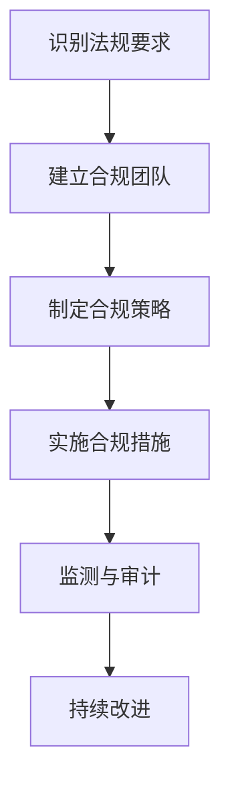

                 

### 引言与背景

#### 1.1 书籍概述

随着人工智能（AI）技术的迅猛发展，AI创业公司如雨后春笋般涌现。然而，这些新兴企业在快速推进技术革新的同时，也面临着一系列监管合规的挑战。本书籍旨在深入探讨AI创业公司如何应对监管合规问题，为创业团队提供实用的指导和建议。

##### 1.1.1 为什么关注AI创业公司的监管合规

AI技术的应用已经深入到各个行业，从医疗诊断到金融分析，从自动驾驶到智能家居，其潜力无可限量。然而，随着AI技术的普及，其带来的监管合规问题也日益凸显。对于AI创业公司来说，合规不仅是遵守法律的要求，更是确保其产品和服务在市场上得以持续发展的重要因素。以下是几个关注AI创业公司监管合规的原因：

1. **避免法律风险**：不合规可能导致企业面临高额罚款、诉讼风险以及市场禁入等严重后果。
2. **保障数据安全**：AI系统通常依赖大量数据，数据隐私和安全问题是监管合规的核心之一。
3. **提升企业信誉**：合规的企业形象有助于吸引投资者和客户，增强市场竞争力。
4. **推动可持续发展**：合规能够帮助企业建立稳健的运营体系，实现长期可持续发展。

##### 1.1.2 监管合规的重要性

监管合规不仅关乎法律和商业风险，更是企业社会责任的体现。以下是监管合规对AI创业公司的重要性：

1. **数据隐私保护**：随着欧盟《通用数据保护条例》（GDPR）等法规的实施，数据隐私保护已成为全球性的关注点。AI创业公司需要确保在数据处理过程中遵循相关法规，防止数据泄露和滥用。
2. **伦理和社会责任**：AI技术的应用需要考虑其对社会的潜在影响，如就业替代、算法偏见等。创业公司应建立伦理委员会，制定社会责任战略，确保其产品和服务符合社会期望。
3. **安全控制**：AI系统在自动化决策过程中可能引发安全风险，如系统故障、数据泄露等。创业公司需要建立完善的安全控制措施，降低潜在风险。
4. **市场竞争**：合规不仅是一种法律义务，也是一种市场竞争力。在合规的前提下，创业公司能够更好地与其他企业竞争，开拓市场。

##### 1.1.3 书籍目标读者

本书籍的目标读者包括AI创业公司的创始人、技术团队、法务团队以及市场部门等。无论您是初创团队还是已经有一定规模的公司，本书都将为您提供以下价值：

1. **全面了解监管合规要求**：通过本书，您将深入了解全球主要监管法规和行业标准，明确合规要求。
2. **制定合规策略**：本书提供了一系列实用的合规策略和实施步骤，帮助您制定切实可行的合规计划。
3. **案例分析和启示**：本书通过案例研究，分析了成功和失败的合规实践，为您提供宝贵的经验和教训。
4. **技术工具推荐**：本书介绍了各种监管合规工具和技术，帮助您提高合规效率。

通过阅读本书，您将能够更好地应对AI创业公司面临的监管合规挑战，确保企业在合规的道路上稳步前行。

#### 1.2 AI创业公司面临的监管挑战

AI创业公司在快速发展的过程中，不可避免地会遇到一系列监管合规的挑战。这些挑战不仅涉及技术层面，还包括法律、伦理和社会等多个方面。以下是AI创业公司面临的主要监管挑战：

##### 1.2.1 AI监管政策的演变

随着AI技术的快速发展，各国政府逐步认识到其重要性和潜在风险，因此纷纷出台相关的监管政策。以下是AI监管政策演变的一些关键阶段：

1. **早期探索阶段**：在此阶段，政府主要关注AI技术的潜在应用和潜在风险，开始进行政策研究和试验。
2. **规范制定阶段**：政府开始制定初步的AI监管政策，明确合规要求和监管范围。例如，欧盟的《通用数据保护条例》（GDPR）和美国的《消费者数据隐私保护法案》（CCPA）。
3. **实施与完善阶段**：监管政策逐步实施，并在实践中不断完善。政府通过监管机构的执法行动，确保政策得到有效执行。

##### 1.2.2 监管合规的影响范围

AI技术的广泛应用使得监管合规的影响范围不断扩大。以下是AI监管合规涉及的主要领域：

1. **数据隐私**：AI系统通常依赖大量数据，如何保护用户隐私成为监管合规的重点。全球各地的数据隐私法规，如GDPR、CCPA等，对企业数据处理提出了严格要求。
2. **算法公平性与透明性**：AI算法的决策过程可能存在偏见和歧视，如何确保算法的公平性和透明性成为监管关注的焦点。各国政府和企业正在探索建立相关的评估标准和监管机制。
3. **安全与可靠性**：AI系统在自动化决策过程中可能引发安全风险，如系统故障、数据泄露等。监管合规要求企业建立完善的安全控制措施，确保系统的高可靠性和安全性。
4. **伦理与社会责任**：AI技术的应用对社会产生深远影响，如就业替代、隐私侵犯等。企业需要建立伦理和社会责任框架，确保其产品和服务符合社会期望。

##### 1.2.3 创业公司面临的特殊挑战

相较于大型企业，AI创业公司在监管合规方面面临一些特殊的挑战：

1. **资源有限**：初创公司通常资源有限，包括资金、人力和技术等。在应对复杂的监管合规要求时，资源不足可能成为制约因素。
2. **合规成本**：监管合规需要投入大量的人力、物力和财力。对于初创公司来说，高额的合规成本可能对其运营产生较大压力。
3. **合规意识不足**：初创公司可能缺乏对监管合规的深入了解和意识，导致合规工作的滞后。
4. **法律环境不确定性**：监管政策不断变化，创业公司需要及时关注政策动态，调整合规策略。法律环境的不确定性增加了合规工作的难度。

##### 1.2.4 应对策略

为了应对这些监管合规挑战，AI创业公司可以采取以下策略：

1. **建立合规团队**：初创公司可以组建专门的合规团队，负责监管合规的日常工作，确保合规工作的顺利开展。
2. **加强合规培训**：通过定期的合规培训，提高全体员工的合规意识和能力，降低合规风险。
3. **借助第三方服务**：初创公司可以借助第三方合规咨询服务，了解最新的监管动态和合规要求，降低合规成本。
4. **建立内部审查机制**：定期进行内部审查，确保合规策略的有效实施，及时发现问题并加以解决。
5. **持续改进**：合规是一个持续的过程，创业公司需要根据政策变化和业务发展，不断优化合规策略。

通过上述策略，AI创业公司可以在复杂多变的监管环境中稳步前行，确保其产品和服务符合法律和社会要求，为企业的可持续发展奠定坚实基础。

#### 1.3 监管合规的定义与原则

监管合规是指企业在运营过程中遵循相关法律法规、行业标准和道德规范，确保其行为合法、透明、负责任。对于AI创业公司而言，监管合规不仅是一项法律义务，更是企业长期发展的基石。以下是监管合规的定义、基本原则及其重要性：

##### 1.3.1 监管合规的定义

监管合规主要涉及以下几个方面：

1. **法律法规**：企业必须遵守国家、地区和国际层面的法律法规，如《通用数据保护条例》（GDPR）、《消费者数据隐私保护法案》（CCPA）等。
2. **行业规范**：企业需要遵循特定行业或领域的标准和指南，如金融行业的《巴塞尔协议》、《医疗行业的隐私保护条例》等。
3. **道德规范**：企业应当遵循行业道德和商业伦理，确保其产品和服务符合社会期望，避免对消费者和社会产生负面影响。

##### 1.3.2 监管合规的基本原则

监管合规遵循以下基本原则：

1. **合法性**：企业必须确保其行为符合相关法律法规，不得从事违法活动。
2. **透明性**：企业应公开透明地处理数据和信息，确保所有利益相关者能够了解企业的运营状况。
3. **负责任**：企业应承担社会责任，关注其对消费者、员工、股东和社会的影响，确保其产品和服务对社会有益。
4. **合规性**：企业应建立内部合规机制，定期进行合规审计和风险评估，确保合规要求得到有效执行。

##### 1.3.3 全球主要监管框架概述

全球范围内的监管合规框架多种多样，以下是几个主要的监管框架：

1. **欧盟《通用数据保护条例》（GDPR）**：GDPR是欧盟出台的一项数据保护法规，对企业的数据处理行为提出了严格的要求。企业必须获得用户的明确同意、保护用户数据安全、提供数据访问和删除权等。
2. **美国《消费者数据隐私保护法案》（CCPA）**：CCPA是美国加州出台的一项数据隐私法案，要求企业披露其收集和使用消费者数据的方式，提供消费者对其数据的控制权。
3. **英国《数据保护法》（DPA）**：DPA是英国的数据保护法规，与GDPR类似，对企业的数据处理行为提出了严格要求。
4. **中国《网络安全法》**：网络安全法是中国的一项重要法规，规定了网络安全的基本要求和网络安全责任，对企业的数据处理和网络安全提出了明确要求。

##### 1.3.4 监管合规对AI创业公司的重要性

对于AI创业公司而言，监管合规具有以下几个方面的关键作用：

1. **法律保障**：遵守监管合规能够确保企业不违反法律法规，避免法律诉讼和罚款等风险。
2. **数据安全**：AI创业公司通常涉及大量用户数据的处理，监管合规有助于保护用户数据的安全和隐私。
3. **社会信誉**：合规的企业形象有助于赢得消费者和投资者的信任，提升市场竞争力。
4. **可持续发展**：合规能够帮助企业建立稳健的运营体系，降低运营风险，实现长期可持续发展。

##### 1.3.5 监管合规实施的步骤

为了确保监管合规的实施，AI创业公司可以采取以下步骤：

1. **了解法规要求**：首先，企业需要深入了解相关法律法规和行业标准，明确合规要求。
2. **建立合规团队**：组建专门的合规团队，负责日常合规工作的实施和管理。
3. **制定合规策略**：根据法规要求和企业实际情况，制定具体的合规策略和措施。
4. **实施合规措施**：将合规策略落实到日常运营中，确保合规要求得到有效执行。
5. **持续改进**：定期评估合规工作的效果，根据政策变化和业务发展，不断优化合规策略。

通过上述步骤，AI创业公司可以确保其运营符合监管要求，降低合规风险，实现可持续发展。

#### 1.4 AI监管合规涉及的AI领域

随着人工智能技术的飞速发展，其在各个领域中的应用愈发广泛，同时也带来了前所未有的监管合规挑战。AI监管合规涉及的AI领域主要包括数据隐私、伦理问题和安全控制。以下是这三个方面的详细探讨。

##### 1.4.1 人工智能与数据隐私

数据隐私是AI监管合规的核心问题之一。AI系统通常依赖于大量数据进行训练和预测，而这些数据往往包含了用户的个人隐私信息。如何保护用户数据隐私成为AI监管合规的重要议题。

1. **数据收集与处理**：企业在收集和处理数据时必须遵循隐私保护原则，如最小化数据收集、去标识化处理等。此外，企业应确保数据收集的透明性，告知用户其数据将被如何使用。
   
2. **用户同意与选择**：企业应在数据收集前获取用户的明确同意，并允许用户选择是否分享其数据。对于未成年用户和敏感数据，企业需要获得法定监护人的同意。

3. **数据存储与传输**：企业应采取必要的安全措施保护数据存储和传输过程中的安全性，防止数据泄露和滥用。全球范围内的数据隐私法规，如GDPR和CCPA，对数据存储和传输提出了严格的要求。

##### 1.4.2 人工智能与伦理问题

AI技术在带来巨大便利和效益的同时，也引发了一系列伦理问题。如何确保AI系统的伦理性和公平性成为监管合规的重要内容。

1. **算法偏见与歧视**：AI算法在训练过程中可能吸收并放大社会中的偏见和歧视，导致系统决策的不公平。企业应采取措施识别和减少算法偏见，确保算法的公平性和透明性。

2. **道德责任归属**：当AI系统出现错误或造成损害时，责任归属问题成为伦理讨论的焦点。企业需要明确AI系统的道德责任归属，制定相应的责任承担机制。

3. **公众信任**：企业应加强与公众的沟通，透明地展示AI系统的运作原理和决策过程，增强公众对AI技术的信任。

##### 1.4.3 人工智能与安全控制

AI系统的安全控制是确保其正常运行和避免潜在风险的关键。AI监管合规要求企业建立全面的安全控制措施，防范系统故障、数据泄露等安全威胁。

1. **系统可靠性**：企业应确保AI系统的可靠性和稳定性，避免因系统故障导致数据丢失或服务中断。

2. **数据安全**：企业需要采取加密、访问控制等技术手段，保护数据存储和传输过程中的安全性。此外，应建立数据备份和恢复机制，以应对可能的灾难事件。

3. **风险管理**：企业应定期进行风险评估，识别潜在的AI安全风险，并制定相应的风险管理策略和应急响应计划。

4. **合规审计**：企业应定期进行内部和外部合规审计，确保AI系统符合相关法规和标准要求，及时发现并纠正合规问题。

##### 1.4.4 综合治理与监管挑战

AI监管合规涉及多个领域，企业需要建立综合的治理体系，确保各领域合规要求的协同与整合。

1. **跨领域协同**：企业应建立跨部门的合规协作机制，确保数据隐私、伦理问题和安全控制等领域的合规要求得到有效执行。

2. **持续更新与改进**：监管合规是一个持续的过程，企业需要根据监管动态和技术发展，不断更新和改进合规策略和措施。

3. **外部合作与监管沟通**：企业应积极与监管机构、行业协会等进行合作与沟通，了解最新的监管政策和行业动态，确保合规工作的及时性。

4. **公众参与与透明度**：企业应加强与公众的互动，提高合规工作的透明度，增强公众对AI技术的理解和信任。

通过全面治理与监管合规，AI创业公司能够在复杂多变的监管环境中稳步前行，确保其技术和社会责任的平衡，实现可持续发展。

### 2.1 监管合规策略制定

为了确保AI创业公司在面对监管合规时能够有序推进，制定一个全面、系统的合规策略至关重要。以下是制定监管合规策略的详细步骤和方法。

#### 3.1.1 确定合规需求

制定合规策略的第一步是明确合规需求。这包括识别和评估企业面临的各项监管要求和法规标准，例如：

1. **识别监管要求**：企业需要首先了解全球范围内相关的监管法规，如GDPR、CCPA、网络安全法等。通过查阅相关法规文本、行业指南和监管机构的公告，明确企业需要遵守的具体要求。

2. **评估合规风险**：企业应对自身业务流程和数据处理活动进行全面评估，识别可能存在的合规风险。例如，涉及敏感数据的处理、算法的透明性和公平性、系统的安全性等。

3. **确定优先级**：根据风险评估的结果，企业应确定各项合规需求的优先级。对于高风险和高影响领域，应优先制定和实施合规措施。

#### 3.1.2 制定合规策略

在明确合规需求后，企业需要制定具体的合规策略。以下是一些关键的策略：

1. **建立合规团队**：企业应组建专门的合规团队，负责合规策略的制定和实施。合规团队应由法律、技术、数据保护、安全和伦理等多个领域的专家组成。

2. **制定合规计划**：合规团队应根据合规需求，制定详细的合规计划。合规计划应包括具体的目标、任务、时间表和责任人。

3. **培训与宣传**：企业应定期进行合规培训，提高全体员工的合规意识和能力。同时，应通过内部宣传和沟通，增强员工对合规工作的重视。

4. **政策与流程**：企业应制定相应的政策与流程，确保合规要求在运营中得到有效执行。例如，数据隐私保护政策、安全控制流程、伦理审查机制等。

#### 3.1.3 实施合规策略

制定合规策略后，关键在于实施。以下是实施合规策略的步骤：

1. **执行与监督**：根据合规计划，企业应逐步执行各项合规措施。同时，建立监督机制，确保合规要求得到有效执行。

2. **监测与审计**：企业应定期监测和审计合规工作的执行情况，发现并纠正潜在问题。审计可以由内部审计团队或第三方机构进行。

3. **更新与改进**：监管合规是一个动态的过程，企业应根据监管变化和技术发展，不断更新和改进合规策略。定期审查合规计划，确保其持续有效。

#### 3.1.4 遵循监管合规原则

在实施合规策略时，企业应遵循以下监管合规原则：

1. **合法性**：确保企业的所有行为符合相关法律法规和标准。

2. **透明性**：企业在处理数据和信息时，应保持透明，确保所有利益相关者能够了解合规要求和工作流程。

3. **负责任**：企业应承担社会责任，关注其对消费者、员工和社会的影响，确保其产品和服务对社会有益。

4. **合规性**：企业应建立内部合规机制，定期进行合规审计和风险评估，确保合规要求得到有效执行。

#### 3.1.5 监管合规的持续改进

合规不是一次性的任务，而是一个持续的过程。企业应不断改进合规策略，以应对新的监管要求和业务发展。

1. **反馈机制**：建立反馈机制，收集员工、客户和监管机构的意见和建议，及时调整合规策略。

2. **技术创新**：利用新技术，如自动化合规工具和AI技术，提高合规效率，降低合规成本。

3. **合规文化建设**：培养员工的合规文化意识，将合规理念融入企业的价值观和日常工作中。

通过以上步骤和方法，AI创业公司可以制定和实施有效的监管合规策略，确保其在快速发展的同时，始终遵循法律和社会规范，实现可持续发展。

### 3.2 数据隐私与保护

在AI创业公司的运营中，数据隐私与保护是监管合规的重要组成部分。确保用户数据隐私不仅是对法律法规的遵守，更是企业赢得用户信任、建立品牌信誉的关键。以下是关于数据隐私与保护的详细解析，包括数据隐私法规的概述、数据收集与存储的合规要求以及数据使用与共享的合规措施。

#### 3.2.1 数据隐私法规概述

数据隐私法规在全球范围内得到了广泛关注和实施。以下是几项重要的数据隐私法规：

1. **欧盟《通用数据保护条例》（GDPR）**：GDPR是迄今为止最全面的数据隐私法规之一，要求企业在处理欧盟居民的数据时，必须获得用户的明确同意、确保数据安全、提供数据访问和删除权等。GDPR对数据泄露事件的通报和处罚也提出了严格要求。

2. **美国《消费者数据隐私保护法案》（CCPA）**：CCPA是加州出台的一项数据隐私法案，要求企业在收集和使用消费者数据时，必须披露其数据处理行为，并给予消费者对其数据的控制权，如数据访问、删除和拒绝销售等。

3. **中国《网络安全法》**：网络安全法是中国的一项重要法规，规定了网络运营者对用户数据的收集、存储、处理和传输的安全保护义务。企业需采取必要措施保护用户个人信息不被泄露或滥用。

4. **其他国家和地区的数据隐私法规**：如英国的《数据保护法》（DPA）、巴西的《通用数据保护法律》（LGPD）等，都对数据隐私保护提出了严格的要求。

#### 3.2.2 数据收集与存储的合规要求

数据收集与存储是数据隐私保护的关键环节。以下是一些合规要求：

1. **最小化数据收集**：企业应遵循“最少化原则”，仅收集实现特定目的所必需的数据。例如，若仅用于用户身份验证，则无需收集额外的个人信息。

2. **数据识别与分类**：企业应对收集的数据进行识别和分类，明确数据的类型、来源和用途。这有助于更好地管理和保护数据。

3. **用户同意与透明度**：在收集数据前，企业必须获得用户的明确同意，并告知用户其数据的用途、存储期限和权利。用户同意应易于理解，避免使用复杂或模糊的语言。

4. **数据存储安全**：企业应采取必要的安全措施保护存储的数据，如加密、访问控制和备份机制等。确保数据在存储和传输过程中不被未授权访问、泄露或篡改。

5. **数据存储期限**：企业应明确数据的存储期限，并在期限结束后及时删除数据。避免长期存储无用的数据，减少隐私泄露的风险。

#### 3.2.3 数据使用与共享的合规措施

数据的使用与共享也是数据隐私保护的重点领域。以下是一些合规措施：

1. **数据使用限制**：企业应严格限制数据的使用范围，确保数据仅用于收集时明确的目的，不得滥用或泄露给第三方。

2. **第三方数据共享**：在需要与第三方共享数据时，企业必须确保第三方遵守相同的数据保护标准，并签订相应的数据保护协议。此外，企业应告知用户其数据将被共享，并获取用户的同意。

3. **数据跨境传输**：当数据需要跨境传输时，企业需遵循相关法律法规的要求，如GDPR中的“充分性决定”和“标准合同条款”等。确保数据传输的安全性和合法性。

4. **数据泄露应对**：企业应制定数据泄露应对计划，包括数据泄露事件的识别、响应、通报和修复等环节。确保在数据泄露事件发生时，能够迅速采取有效措施，减轻损失。

5. **定期审计与培训**：企业应定期进行数据隐私保护审计，确保合规措施的执行效果。同时，定期对员工进行数据隐私保护培训，提高员工的合规意识和能力。

#### 3.2.4 数据隐私保护的最佳实践

为了确保数据隐私保护的有效性，AI创业公司可以借鉴以下最佳实践：

1. **数据匿名化与去标识化**：在可能的情况下，对数据进行匿名化和去标识化处理，降低数据泄露的风险。

2. **隐私影响评估（PIA）**：在进行新的数据处理项目前，进行隐私影响评估，识别潜在隐私风险，并采取相应的防护措施。

3. **加密与安全协议**：使用加密技术保护数据的存储和传输，确保数据在传输过程中不被窃取或篡改。

4. **用户权限管理**：实施严格的用户权限管理，确保只有授权人员才能访问和处理敏感数据。

5. **定期更新与改进**：根据监管动态和技术发展，定期更新数据隐私保护策略和措施，确保其持续有效。

通过遵循上述数据隐私保护的要求和最佳实践，AI创业公司可以更好地保护用户数据隐私，降低合规风险，赢得用户的信任和支持。

### 3.3 伦理与社会责任

在AI创业公司的监管合规框架中，伦理和社会责任是一个不可忽视的重要部分。随着AI技术的广泛应用，其对社会的影响愈发显著，如何平衡技术进步与社会责任成为企业发展的关键议题。以下是关于伦理原则的实践、社会责任的履行以及内部伦理委员会建立的详细讨论。

#### 3.3.1 伦理原则与实践

AI技术的伦理问题主要集中在算法偏见、隐私侵犯和决策透明性等方面。以下是一些核心的伦理原则和实践：

1. **公平性**：AI系统应确保对所有用户公平，避免算法偏见和歧视。企业在算法设计和训练过程中，应采取去偏见措施，如反歧视算法、平衡数据集等。

2. **透明性**：AI系统的决策过程应保持透明，用户有权了解系统是如何做出决策的。企业应公开算法的原理、训练数据和决策逻辑，并提供查询和反馈渠道。

3. **责任归属**：当AI系统出现错误或造成损害时，企业应明确责任归属，确保对受害者的赔偿和补偿。企业应制定AI系统的责任承担机制，避免逃避责任。

4. **隐私保护**：AI系统应尊重用户的隐私权，不得非法收集、使用或泄露用户数据。企业应遵循数据隐私保护法规，采取必要的技术和管理措施，确保用户数据的安全。

5. **社会责任**：企业应关注AI技术对社会的潜在影响，积极参与社会责任项目，推动技术进步与社会发展的和谐共进。

#### 3.3.2 社会责任与公众沟通

企业履行社会责任不仅是对自身发展的负责，也是对社会的贡献。以下是企业如何履行社会责任和与公众沟通的一些方法：

1. **社会责任战略**：企业应制定清晰的社会责任战略，明确其社会责任目标和实施路径。这包括支持公益项目、参与社会议题讨论、促进技术创新等。

2. **透明报告**：企业应定期发布社会责任报告，详细披露其在社会责任方面的行动和成果。报告应包括财务、环境、社会等各个方面的内容，提高透明度和公信力。

3. **公众参与**：企业应积极与公众互动，听取他们的意见和建议。可以通过公开论坛、调研问卷、公众咨询会等方式，了解公众对AI技术的看法和需求。

4. **沟通渠道**：企业应建立多元化的沟通渠道，包括官方网站、社交媒体、线下活动等，方便公众了解企业的社会责任行动和进展。

5. **危机管理**：在应对可能的社会危机时，企业应迅速反应，采取有效的沟通策略，确保信息的准确传递和公众情绪的稳定。

#### 3.3.3 建立内部伦理委员会

为了确保AI创业公司在伦理和社会责任方面的工作有序推进，建立内部伦理委员会是一个有效的举措。以下是建立内部伦理委员会的步骤和职责：

1. **组建委员会**：企业应组建由多领域专家、法律顾问、技术专家、管理层代表和员工代表组成的内部伦理委员会。确保委员会的成员具有广泛的背景和专业知识。

2. **明确职责**：内部伦理委员会的主要职责包括：

   - **评估伦理问题**：对AI项目进行伦理评估，确保项目符合伦理原则和法律法规。
   - **决策咨询**：为管理层提供伦理决策咨询，确保企业在面对复杂伦理问题时能够做出明智的决策。
   - **伦理培训**：定期组织伦理培训，提高员工对伦理问题的认识和处理能力。
   - **案例分析**：收集和分析伦理案例，为委员会提供实践经验和教训。

3. **工作流程**：内部伦理委员会应建立规范的工作流程，包括问题收集、评估、决策、跟踪和反馈等环节。确保伦理问题得到及时、有效处理。

4. **沟通与监督**：内部伦理委员会应定期向企业高层和管理层汇报工作进展，确保其工作得到充分关注和支持。同时，应保持与公众和外部机构的沟通，提高透明度和公信力。

通过建立内部伦理委员会，AI创业公司可以更好地平衡技术进步与社会责任，确保其产品和服务符合伦理和社会期望，为企业的可持续发展奠定坚实基础。

### 3.4 安全控制与风险管理

在AI创业公司中，安全控制与风险管理是确保业务连续性和数据安全的关键环节。有效的安全控制和风险管理策略能够帮助企业预防和应对各种安全威胁，保障业务运营的稳定性和数据隐私。以下是关于安全控制措施、风险评估与应对策略以及安全合规审计的详细探讨。

#### 3.4.1 安全控制措施

安全控制措施是指企业采取的一系列技术和管理手段，用于保护其信息资产免受威胁。以下是几种常见的安全控制措施：

1. **访问控制**：访问控制是确保只有授权用户才能访问特定系统和数据的一种安全措施。企业可以通过身份验证、权限管理和加密技术来实现访问控制。例如，使用强密码策略、双因素认证和多级权限管理。

2. **数据加密**：数据加密是保护数据在存储和传输过程中不被未授权访问的重要手段。企业应采用加密算法对敏感数据进行加密，确保数据在传输过程中不被窃取或篡改。常用的加密技术包括对称加密和非对称加密。

3. **防火墙与入侵检测系统（IDS）**：防火墙是保护网络边界的关键设备，可以阻止未授权的访问和攻击。入侵检测系统（IDS）用于监测网络流量，检测潜在的安全威胁并及时报警。

4. **安全审计与日志管理**：安全审计是定期检查和评估企业安全策略和措施的有效性，发现并纠正潜在的安全漏洞。日志管理是记录和存储安全事件日志，便于后续分析和追踪。

5. **备份与恢复**：定期备份是企业数据安全的重要措施，可以防止数据丢失和灾难恢复。企业应建立完善的备份策略，确保在数据损坏或丢失时能够迅速恢复。

6. **安全培训与意识提升**：定期对员工进行安全培训，提高员工的安全意识和技能，降低因人为因素导致的安全漏洞。

#### 3.4.2 风险评估与应对策略

风险评估是识别和评估企业面临的安全风险的重要步骤，有助于企业制定有效的应对策略。以下是风险评估的步骤和应对策略：

1. **识别风险**：企业应识别可能影响其业务连续性和数据安全的内部和外部风险。这些风险可能包括网络攻击、数据泄露、设备故障、人为错误等。

2. **评估风险**：对识别出的风险进行定性或定量评估，确定其发生的可能性、潜在影响和风险等级。评估可以采用风险矩阵、威胁评估工具等方法。

3. **制定应对策略**：根据风险评估结果，制定相应的应对策略。应对策略包括预防措施、检测和响应措施、应急响应计划等。

   - **预防措施**：通过技术和管理手段降低风险发生的可能性，如安装防火墙、加密数据、定期更新系统等。
   - **检测和响应措施**：建立安全监控和检测系统，及时发现和处理安全事件，如入侵检测系统、安全信息与事件管理（SIEM）系统等。
   - **应急响应计划**：制定详细的应急响应计划，确保在安全事件发生时能够迅速响应和恢复，减少损失。

4. **持续改进**：风险评估是一个动态的过程，企业应根据新的风险信息和技术发展，定期更新和改进风险评估和应对策略。

#### 3.4.3 安全合规审计

安全合规审计是确保企业安全策略和措施得到有效执行的重要手段。以下是安全合规审计的步骤和方法：

1. **制定审计计划**：根据企业的安全策略和合规要求，制定详细的审计计划。审计计划应包括审计范围、审计对象、审计方法和时间表等。

2. **审计实施**：按照审计计划进行审计，包括审查安全策略和措施的执行情况、检测潜在的安全漏洞和风险等。

3. **审计报告**：审计完成后，编写详细的审计报告，包括审计发现、问题和建议等。审计报告应提交给企业管理层和相关部门，以便及时采取措施纠正问题。

4. **跟踪与改进**：根据审计报告中的问题和建议，制定改进措施，并跟踪改进效果的落实情况。定期进行后续审计，确保安全措施持续有效。

通过实施安全控制措施、进行风险评估和审计，AI创业公司可以建立完善的安全管理体系，降低安全风险，保障业务的连续性和数据安全，为企业的长期发展提供坚实保障。

#### 4.1 AI创业公司的成功案例

在众多AI创业公司中，有些企业在应对监管合规方面取得了显著的成功，为我们提供了宝贵的经验和启示。以下将介绍两个具有代表性的成功案例。

##### 4.1.1 案例介绍

**案例1：DeepMind**

DeepMind是一家总部位于英国的AI创业公司，以其在深度学习和强化学习领域的卓越成就而闻名。自成立以来，DeepMind便高度重视监管合规问题，特别是在数据隐私保护和伦理方面取得了显著成果。

**案例2：Clarifai**

Clarifai是一家专注于计算机视觉和深度学习的AI创业公司，其目标是通过AI技术解决实际问题。作为一家快速成长的公司，Clarifai在应对监管合规方面也有许多值得借鉴的经验。

##### 4.1.2 监管合规策略

**DeepMind** 的成功离不开其全面的合规策略：

1. **明确合规要求**：DeepMind在成立之初便明确了其需要遵循的各项监管要求，如GDPR、英国数据保护法等。他们制定了详细的合规计划，确保在数据处理和产品开发过程中遵循相关法规。

2. **数据隐私保护**：DeepMind采用了严格的数据隐私保护措施，如数据匿名化、访问控制和安全加密等。他们确保用户数据在收集、存储、处理和传输过程中得到充分保护，避免数据泄露和滥用。

3. **伦理审查机制**：DeepMind建立了内部伦理委员会，对AI项目进行伦理评估。他们密切关注AI技术可能带来的社会影响，确保其产品和服务符合伦理标准和社会期望。

4. **持续改进**：DeepMind不断更新其合规策略，以应对新的监管动态和技术发展。他们定期进行内部审计，确保合规要求得到有效执行，并及时纠正问题。

**Clarifai** 的合规策略包括：

1. **合规培训**：Clarifai定期组织合规培训，提高员工对监管合规的认识和理解。通过培训，员工能够更好地识别和应对合规风险。

2. **透明沟通**：Clarifai积极与客户、投资者和监管机构沟通，提高合规工作的透明度。他们通过公开披露合规措施和进展，增强利益相关者对公司的信任。

3. **合规工具**：Clarifai利用自动化合规工具，如数据监控和审计软件，提高合规效率。这些工具能够实时监测合规状况，发现潜在问题并及时处理。

4. **持续更新**：Clarifai定期审查和更新其合规策略，确保其与最新的监管法规和技术发展保持同步。他们通过外部咨询和内部讨论，不断优化合规措施。

##### 4.1.3 成功经验与启示

**DeepMind** 和 **Clarifai** 的成功经验为其他AI创业公司提供了以下启示：

1. **重视合规培训**：员工是合规工作的关键，公司应定期进行合规培训，提高员工的合规意识和能力。

2. **建立内部审查机制**：内部审查机制有助于发现和纠正合规问题，确保合规策略得到有效执行。

3. **利用合规工具**：自动化合规工具能够提高合规效率，降低合规成本。公司应积极探索和应用这些工具。

4. **透明沟通**：与利益相关者保持良好的沟通，提高合规工作的透明度，有助于建立信任和降低合规风险。

5. **持续改进**：监管合规是一个动态的过程，公司应不断更新和优化合规策略，以应对新的监管动态和技术发展。

通过借鉴这些成功经验，AI创业公司可以更好地应对监管合规挑战，确保其产品和服务在合规的道路上稳步前行。

#### 4.2 AI创业公司的失败案例

尽管AI创业公司在技术方面有着巨大的潜力，但监管合规问题的处理不当可能导致严重的失败。以下将分析几个AI创业公司的失败案例，探讨其中的监管合规问题，并总结失败的教训，为其他创业公司提供警示。

##### 4.2.1 案例介绍

**案例1：Cambridge Analytica**

Cambridge Analytica是一家在2018年因数据隐私问题而声名狼藉的AI公司。该公司因其涉嫌利用用户数据在2016年美国总统选举中进行操控行为而受到广泛关注。这一事件揭示了数据隐私保护不足和伦理问题导致的严重后果。

**案例2：Buzzfeed**

Buzzfeed是一家知名的内容和AI公司，但其在2018年因未遵守GDPR法规而面临高达7500万美元的罚款。Buzzfeed被指控在用户数据收集和处理过程中存在多项违规行为，如未获得用户明确同意、未告知数据用途等。

**案例3：Zappos**

Zappos是一家以客户服务和用户体验著称的在线鞋类和服装零售商。然而，在2012年，Zappos遭遇了一次大规模数据泄露事件，导致约350万用户的数据被泄露。这一事件导致Zappos的声誉受损，并面临巨大的法律和财务压力。

##### 4.2.2 监管合规问题分析

**Cambridge Analytica** 的主要合规问题包括：

1. **数据隐私侵犯**：Cambridge Analytica未经用户同意，非法收集和使用了大量用户数据。这些数据被用于政治广告和选民分析，严重侵犯了用户的隐私权。

2. **缺乏透明度**：Cambridge Analytica在数据处理过程中缺乏透明度，未能向用户明确说明其数据的用途和共享方式。

3. **算法偏见**：Cambridge Analytica的算法分析存在偏见，可能对特定群体产生歧视性影响，违反了公平性和伦理原则。

**Buzzfeed** 的主要合规问题包括：

1. **未获得用户同意**：Buzzfeed在收集和处理用户数据时，未能获得用户的明确同意，违反了GDPR的规定。

2. **数据处理不透明**：Buzzfeed在用户数据收集和处理过程中，未向用户充分披露其数据的用途和共享方式。

3. **数据存储与安全**：Buzzfeed在数据存储和安全方面存在漏洞，未能采取有效措施保护用户数据免受泄露和滥用。

**Zappos** 的主要合规问题包括：

1. **数据泄露**：Zappos未能有效保护其用户数据，导致大量用户数据在2012年的数据泄露事件中被窃取。

2. **安全控制不足**：Zappos在数据安全和访问控制方面存在明显不足，未能及时发现和阻止潜在的攻击行为。

3. **应急响应不力**：在数据泄露事件发生后，Zappos的应急响应措施不足，未能及时通知受影响的用户和采取有效措施减轻损失。

##### 4.2.3 避免失败的策略

为了避免因监管合规问题而导致失败，AI创业公司可以采取以下策略：

1. **明确合规要求**：在产品开发初期，明确了解和遵守相关监管法规和行业标准，确保数据处理和产品服务符合法律和社会要求。

2. **数据隐私保护**：采取严格的数据隐私保护措施，确保用户数据在收集、存储、处理和传输过程中得到充分保护，避免数据泄露和滥用。

3. **透明沟通**：与用户保持透明沟通，充分告知其数据的用途、存储期限和权利，获得用户的明确同意。

4. **安全控制**：建立完善的安全控制措施，包括数据加密、访问控制、防火墙和入侵检测等，确保系统的高可靠性和安全性。

5. **定期审计**：定期进行内部和外部审计，确保合规策略得到有效执行，及时发现和纠正问题。

6. **持续培训**：定期对员工进行合规培训，提高其合规意识和能力，降低合规风险。

7. **应急响应**：制定详细的应急响应计划，确保在数据泄露或其他安全事件发生时，能够迅速响应和恢复，减轻损失。

通过采取上述策略，AI创业公司可以更好地应对监管合规挑战，降低合规风险，确保其业务在合规的道路上稳步前行。

### 5.1 监管合规工具介绍

在应对监管合规的挑战时，AI创业公司可以借助一系列合规工具来提高合规效率和降低合规成本。以下是几种常见的监管合规工具，包括自动化合规工具、监控与审计工具以及数据治理工具的详细介绍。

#### 5.1.1 自动化合规工具

自动化合规工具通过自动化技术帮助企业在日常运营中实现合规要求。这些工具能够自动执行合规任务、监控合规状态和生成合规报告。以下是几种常见的自动化合规工具：

1. **合规管理系统（GRC）**：合规管理系统是一种综合性的工具，能够帮助企业管理和监控合规风险、合规程序和合规报告。它通常包括合规规则库、合规风险评估、合规事件管理、合规报告生成等功能。

2. **自动化数据隐私工具**：这类工具能够自动识别、分类和保护敏感数据，确保数据隐私保护法规得到有效执行。例如，自动化的数据加密工具、访问控制工具和隐私影响评估（PIA）工具等。

3. **合规监控与报告工具**：这些工具能够实时监控合规状态的变更，自动生成合规报告，并提醒企业采取必要的行动。例如，监控数据泄露事件、监控合规违规行为和生成定期合规报告等。

#### 5.1.2 监控与审计工具

监控与审计工具用于持续监控企业的合规执行情况，并定期进行内部或外部审计。以下是几种常见的监控与审计工具：

1. **安全信息和事件管理（SIEM）系统**：SIEM系统是一种集成了日志管理和事件管理的工具，能够实时监控企业的安全事件和日志，及时发现和响应潜在的安全威胁。它能够自动收集和分析来自不同安全设备和系统的数据，生成综合性的安全报告。

2. **数据审计工具**：数据审计工具能够自动执行数据质量检查和合规性验证，确保企业数据在存储、处理和传输过程中符合相关法规和标准。例如，数据完整性检查、数据一致性检查和数据隐私合规性检查等。

3. **合规审计软件**：合规审计软件用于帮助企业进行内部或外部审计，确保合规策略得到有效执行。这些工具通常包括审计计划管理、审计流程跟踪、审计报告生成和审计结果分析等功能。

#### 5.1.3 数据治理工具

数据治理工具用于管理和控制企业数据，确保数据质量和合规性。以下是几种常见的数据治理工具：

1. **数据质量工具**：数据质量工具能够自动识别和修复数据中的错误、冗余和缺失等问题，确保数据的一致性和准确性。这些工具通常包括数据清洗、数据标准化、数据匹配和数据去重等功能。

2. **数据分类工具**：数据分类工具能够根据数据的重要性和敏感性对数据进行分类，确保敏感数据得到适当的保护。例如，按照数据隐私法规的要求对数据进行标识和分类，以便采取相应的保护措施。

3. **数据访问控制工具**：数据访问控制工具能够控制用户对数据的访问权限，确保只有授权用户才能访问特定数据。这些工具通常包括权限管理、角色分配和访问审计等功能。

通过使用这些监管合规工具，AI创业公司可以更有效地管理和监控合规要求，降低合规风险，确保其在快速发展的同时，始终遵循法律和社会规范。

### 5.2 AI技术应用于监管合规

随着AI技术的不断进步，其在监管合规领域的应用也越来越广泛。AI技术不仅提高了合规监控和审计的效率，还为企业提供了一种新的方法来识别和应对潜在的合规风险。以下是AI技术应用于监管合规的几个关键方面：

#### 5.2.1 使用AI进行合规监测

AI技术可以自动化合规监测过程，实时监控企业的运营行为，及时发现合规风险。以下是AI在合规监测中的一些应用：

1. **异常检测**：AI模型可以分析企业数据流，识别异常交易或行为模式，这些模式可能是合规风险的迹象。例如，使用机器学习算法对网络流量进行分析，检测潜在的DDoS攻击或其他网络入侵行为。

2. **实时监控**：AI技术可以实时监控企业的运营数据，如财务报表、客户信息等，自动检测数据异常和违规行为。这种实时监控有助于企业迅速发现和应对合规问题。

3. **合规事件预测**：通过大数据分析和机器学习算法，AI可以预测未来可能发生的合规事件。这种预测能力使企业能够采取预防措施，降低合规风险。

#### 5.2.2 AI在风险管理中的应用

AI技术在风险管理中也有重要应用，可以帮助企业识别、评估和应对合规风险。以下是AI在风险管理中的几个应用：

1. **风险评估**：AI模型可以分析企业的历史数据和外部信息，评估合规风险的可能性和影响。例如，利用自然语言处理（NLP）技术分析法律法规文本，评估特定业务活动可能涉及的合规风险。

2. **合规建议**：AI可以根据企业的业务数据和合规要求，提供个性化的合规建议。例如，针对特定业务流程，AI可以推荐最佳实践和合规策略，帮助企业降低合规风险。

3. **合规培训**：AI技术可以开发合规培训课程，提高员工对合规要求的认识和应对能力。通过交互式学习平台，AI可以实时评估员工的学习进度和理解程度，确保员工具备必要的合规知识。

#### 5.2.3 AI在合规审计中的作用

AI技术在合规审计中的应用极大地提高了审计效率，并减少了人工错误。以下是AI在合规审计中的几个应用：

1. **自动化审计流程**：AI可以自动化审计流程中的许多步骤，如数据收集、数据分析和报告生成。这种自动化流程不仅提高了审计效率，还确保了审计结果的准确性和一致性。

2. **数据挖掘与分析**：AI模型可以挖掘和分析大量的审计数据，识别潜在的问题和异常。例如，使用深度学习算法对财务报表进行分析，发现可能的财务违规行为。

3. **智能报告生成**：AI技术可以自动生成详细的审计报告，包括数据分析和合规评估结果。这些报告不仅提高了审计的透明度，还为企业提供了宝贵的合规改进建议。

#### 5.2.4 AI在合规监控与审计中的优势

AI技术在合规监控与审计中的应用具有以下优势：

1. **提高效率**：AI可以自动化大量的合规任务，减轻人工负担，提高工作效率。

2. **减少错误**：AI技术减少了人为错误的可能性，确保审计结果的准确性和一致性。

3. **实时监控**：AI技术可以实时监控企业的运营行为，及时发现和应对合规风险。

4. **个性化建议**：AI可以根据企业的具体情况提供个性化的合规建议，帮助企业更好地应对合规挑战。

5. **降低成本**：通过自动化合规监控和审计流程，企业可以降低合规成本，提高资源利用效率。

总之，AI技术在监管合规中的应用为AI创业公司提供了一种全新的方法来应对合规挑战。通过利用AI技术，企业可以更高效、更准确地管理合规风险，确保其运营符合法律和社会要求，实现可持续发展。

### 6.1 监管合规的发展趋势

随着AI技术的不断进步和全球监管政策的持续更新，监管合规领域也在经历着深刻的变化。以下是监管合规的发展趋势，以及这些趋势对AI创业公司的影响和应对策略。

#### 6.1.1 未来监管政策的预期变化

1. **数据隐私保护法规的加强**：随着数据隐私保护意识的提高，全球范围内的数据隐私法规预计将进一步加强。例如，欧盟可能会对GDPR进行修订，以涵盖更多类型的个人数据和更广泛的数据处理场景。其他国家和地区也可能出台类似的数据隐私保护法规。

2. **AI特定监管政策的出台**：随着AI技术的广泛应用，各国政府预计将出台专门的AI监管政策，以规范AI技术的开发和应用。这些政策可能包括AI算法透明性、算法偏见控制、AI系统可靠性等方面的要求。

3. **跨境数据流动的规范**：随着全球化的加深，跨境数据流动将成为监管的重点。各国政府可能加强对跨境数据流动的监管，确保数据在跨境传输过程中的合规性。

4. **合规标准的统一**：全球范围内的合规标准预计将逐渐统一，以减少企业因不同国家和地区监管要求而产生的合规困扰。国际组织如国际标准化组织（ISO）和经合组织（OECD）可能发布更多关于AI和数据隐私的国际标准。

#### 6.1.2 创业公司的应对策略

1. **持续关注监管动态**：创业公司应密切关注全球范围内的监管动态，及时了解最新的监管政策和法规变化。这可以通过参加行业会议、订阅监管机构的公告和咨询专业合规顾问来实现。

2. **建立动态合规机制**：创业公司应建立动态的合规机制，确保其合规策略能够迅速适应监管变化。这包括定期审查和更新合规策略、制定灵活的合规流程和培训计划等。

3. **加强数据隐私保护**：创业公司应加强数据隐私保护措施，确保其数据处理活动符合最新的数据隐私法规。这可以通过实施数据匿名化、加密技术和访问控制等措施来实现。

4. **遵循AI特定监管政策**：对于AI创业公司，应特别关注AI特定监管政策的要求，如算法透明性、偏见控制和系统可靠性等。公司可以开展内部审计，确保其AI系统符合相关监管要求。

5. **推动合规标准统一**：创业公司可以积极参与行业标准和法规的制定，推动全球合规标准的统一。这有助于降低合规成本，提高国际竞争力。

6. **利用技术提高合规效率**：创业公司可以采用自动化合规工具和AI技术，提高合规监控和审计的效率。这包括使用AI进行合规监测、风险评估和合规报告生成等。

通过上述策略，AI创业公司可以更好地应对监管合规的挑战，确保其在快速发展的同时，始终保持合规，实现可持续发展。

### 6.2 总结与建议

#### 6.2.1 监管合规的核心要素

在AI创业公司的监管合规过程中，以下几个核心要素至关重要：

1. **法律法规遵循**：企业必须严格遵守相关法律法规，如GDPR、CCPA、网络安全法等，确保其业务活动合法合规。
2. **数据隐私保护**：确保用户数据在收集、存储、处理和传输过程中的安全性和隐私性，采取必要的数据保护措施。
3. **透明性**：保持数据处理的透明度，确保用户了解其数据的用途、存储期限和权利。
4. **伦理和社会责任**：关注AI技术对社会的影响，建立伦理审查机制，确保产品和服务符合社会期望。
5. **安全控制**：建立全面的安全控制措施，防范系统故障、数据泄露等安全风险。
6. **持续改进**：根据监管变化和技术发展，不断更新和优化合规策略和措施。

#### 6.2.2 创业公司如何持续合规

为了确保AI创业公司能够持续合规，以下是一些建议：

1. **定期合规培训**：定期对员工进行合规培训，提高其合规意识和能力，确保全员了解和遵守合规要求。
2. **内部审计和监控**：建立内部审计和监控机制，定期审查合规执行情况，及时发现和纠正问题。
3. **外部咨询和支持**：借助外部专业合规顾问的支持，确保企业能够及时了解最新的监管动态和政策变化。
4. **合规工具应用**：采用自动化合规工具和AI技术，提高合规监控和审计的效率，降低合规成本。
5. **建立反馈机制**：建立有效的反馈机制，收集员工、客户和监管机构的意见和建议，及时调整合规策略。

#### 6.2.3 对创业公司的建议

对于AI创业公司，以下是一些建议，以帮助其在监管合规方面取得成功：

1. **重视合规文化建设**：将合规理念融入企业的价值观和日常工作中，培养全体员工的合规文化意识。
2. **建立合规团队**：组建专业的合规团队，负责日常合规工作的实施和管理。
3. **透明沟通**：与利益相关者保持透明沟通，提高合规工作的透明度，增强公众对企业的信任。
4. **持续监控和改进**：持续监控合规执行情况，根据新的监管动态和技术发展，不断优化合规策略。
5. **积极参与行业合作**：积极参与行业协会和标准制定，推动合规标准的统一和行业的健康发展。

通过遵循上述建议，AI创业公司可以在复杂多变的监管环境中稳步前行，确保其产品和服务符合法律和社会要求，实现可持续发展。

### 附录 A：监管合规相关法规与政策

#### A.1 全球主要监管法规

1. **欧盟《通用数据保护条例》（GDPR）**：GDPR是欧盟出台的一项数据保护法规，对企业的数据处理行为提出了严格的要求。企业必须获得用户的明确同意、保护用户数据安全、提供数据访问和删除权等。
   
2. **美国《消费者数据隐私保护法案》（CCPA）**：CCPA是美国加州出台的一项数据隐私法案，要求企业披露其收集和使用消费者数据的方式，提供消费者对其数据的控制权。

3. **英国《数据保护法》（DPA）**：DPA是英国的数据保护法规，与GDPR类似，对企业的数据处理行为提出了严格要求。

4. **中国《网络安全法》**：网络安全法是中国的一项重要法规，规定了网络安全的基本要求和网络安全责任，对企业的数据处理和网络安全提出了明确要求。

5. **巴西《通用数据保护法律》（LGPD）**：LGPD是巴西的一项数据保护法律，对企业的数据处理和隐私保护提出了严格的要求。

#### A.2 中国监管政策概述

1. **《网络安全法》**：规定了网络运营者的网络安全义务，包括数据安全保护、网络安全风险评估和事件应对等。
   
2. **《个人信息保护法》（PIPL）**：将于2021年11月1日起施行，对个人信息收集、处理、存储、使用和共享等行为提出了明确要求。

3. **《数据安全法》**：将于2021年9月1日起施行，规定了数据安全保护的基本要求和数据安全风险评估、监测和应急响应等。

4. **《关于进一步加强区块链信息服务管理的通知》**：对区块链信息服务提供商的数据安全、内容管理和合规要求进行了详细规定。

#### A.3 欧盟GDPR详解

1. **适用范围**：GDPR适用于在欧盟境内运营的企业，以及处理欧盟居民个人数据的非欧盟企业。

2. **数据主体权利**：GDPR规定了数据主体的一系列权利，包括知情权、访问权、更正权、删除权、限制处理权和数据可携权。

3. **数据处理原则**：GDPR提出了六大数据处理原则，包括合法性、公平性、透明性、目的明确性、数据最小化和安全性。

4. **数据保护官（DPO）**：企业应指定数据保护官，负责监督和指导企业的数据处理活动，确保GDPR的遵守。

5. **数据泄露通报**：企业必须在发现数据泄露事件后的72小时内向监管机构报告，并采取必要的措施减轻影响。

6. **罚款规定**：GDPR对违反规定的企业可以处以高达2000万欧元或全球营业额4%的罚款。

### 附录 B：监管合规资源推荐

#### B.1 学术研究资源

1. **论文数据库**：如IEEE Xplore、ACM Digital Library、SpringerLink等，提供丰富的监管合规相关学术论文和研究报告。
2. **学术期刊**：如《计算机与法律》、《隐私与数据保护》等，专注于监管合规和技术伦理领域的学术交流。

#### B.2 行业协会与论坛

1. **国际隐私专业协会（IAPP）**：提供全球隐私和监管合规的最新动态、培训和认证服务。
2. **国际数据管理协会（IDMA）**：专注于数据管理和隐私保护的行业组织，提供丰富的资源和专业交流。
3. **中国信息安全测评中心**：提供网络安全和隐私保护的相关培训和咨询服务。

#### B.3 政府监管机构

1. **欧盟数据保护局（EDPB）**：负责监督GDPR的实施和解释，提供法规指南和意见。
2. **美国联邦贸易委员会（FTC）**：负责保护消费者权益，包括数据隐私和网络安全。
3. **中国国家网信办**：负责网络安全和信息安全的监管，发布相关法规和政策。
4. **中国工业和信息化部**：负责电信和互联网行业的监管，涉及数据安全和隐私保护。

### 附录 C：术语表

#### C.1 常用术语解释

- **监管合规**：企业遵循法律法规、行业标准和道德规范的行为。
- **数据隐私**：确保个人数据不被未授权访问、使用或泄露。
- **GDPR**：欧盟《通用数据保护条例》，对数据处理行为提出了严格要求。
- **CCPA**：美国《消费者数据隐私保护法案》，规定数据隐私保护要求。
- **DPO**：数据保护官，负责监督企业的数据处理活动，确保合规。

#### C.2 概念联系与流程图

以下是监管合规流程的Mermaid流程图：

通过该流程图，企业可以清晰地了解从识别法规要求到持续改进的合规流程。每一步都是确保企业合规的重要环节，有助于企业建立全面、系统的合规体系。

