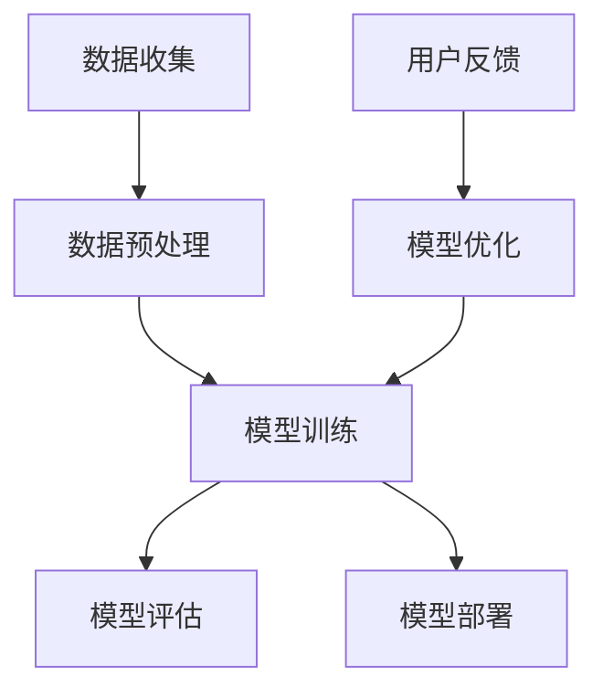
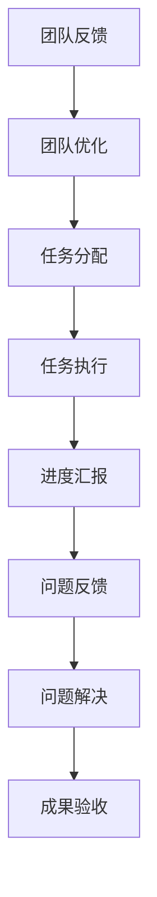
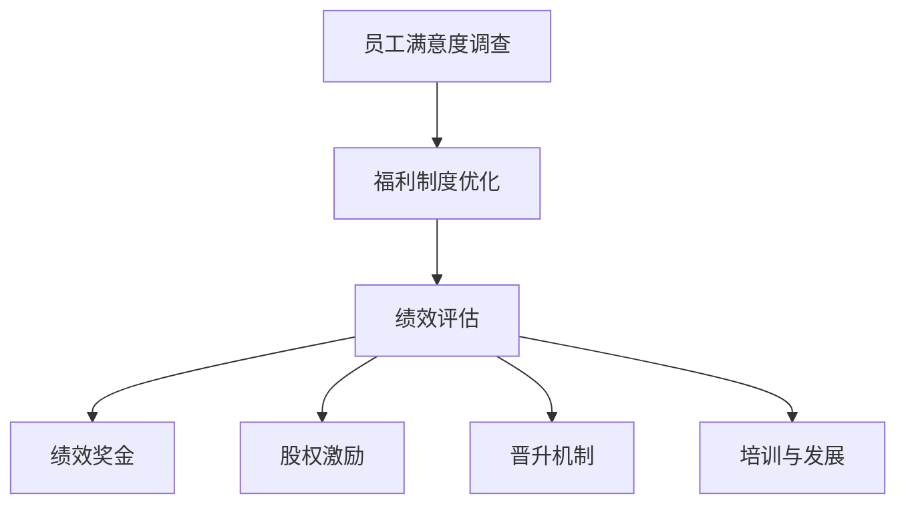
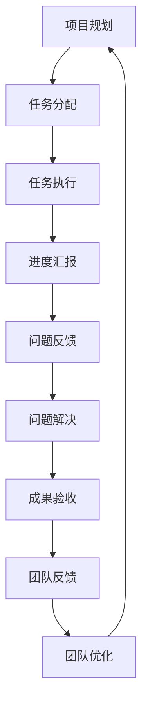

                 

# 《AI创业公司如何打造核心团队？》

## 关键词
- AI创业公司
- 核心团队建设
- 人才招聘与培养
- 团队协作与沟通
- 团队管理与激励

## 摘要
本文将深入探讨AI创业公司在构建核心团队时所面临的问题和挑战，提供一套系统的解决方案。通过分析AI行业的特点、团队定位、团队构建、团队培养、团队协作与管理等方面的关键要素，本文旨在为AI创业公司提供一个全方位的团队建设指导，帮助创业公司打造高效、创新的核心团队，推动公司快速发展。

### 第一部分：AI创业公司概述

#### 第1章：AI创业公司背景与趋势

随着人工智能技术的迅猛发展，AI创业公司如雨后春笋般涌现。这些公司凭借创新的技术解决方案和市场洞察力，在各个领域展现了巨大的潜力。然而，AI创业公司在发展过程中也面临着诸多挑战，如技术门槛高、资金需求大、人才短缺等。因此，如何构建一支高效的核心团队成为关键。

##### 1.1 AI行业发展概述

人工智能（AI）作为新一轮科技革命和产业变革的重要驱动力量，正深刻改变着全球经济和社会结构。从早期的机器学习、深度学习到如今的生成对抗网络（GAN）、强化学习等，AI技术不断迭代更新，推动着各行各业的数字化转型。

在全球范围内，AI市场规模逐年扩大，投资热情高涨。根据市场研究机构的数据显示，全球人工智能市场规模预计将在未来几年内持续增长，达到数千亿美元规模。这一趋势为AI创业公司提供了广阔的市场机会。

##### 1.2 创业公司的市场机会

AI技术在金融、医疗、教育、制造业等多个领域展现出巨大的应用潜力。创业公司可以通过以下几种方式抓住市场机会：

1. **技术创新**：研发具有前瞻性的AI技术，推动行业变革。
2. **解决方案**：针对特定行业需求，提供定制化的AI解决方案。
3. **应用场景**：探索新的应用场景，开拓市场空间。
4. **商业模式**：创新商业模式，实现可持续的商业回报。

##### 1.3 AI创业公司的挑战

尽管市场前景广阔，但AI创业公司也面临着一系列挑战：

1. **技术门槛**：AI技术复杂度高，对研发团队的专业能力要求极高。
2. **资金压力**：研发投入大，资金需求高，对创业公司资金链稳定性要求高。
3. **人才短缺**：高端人才稀缺，招聘和留住优秀人才成为难题。
4. **市场竞争**：市场竞争激烈，创业公司需要快速反应和创新能力。

#### 第2章：AI技术核心概念

了解AI技术的基本概念和核心架构是构建高效团队的基础。以下是对AI技术核心概念的简要介绍。

##### 2.1 AI基础概念

人工智能（Artificial Intelligence，AI）是指计算机系统模拟、延伸和扩展人类智能的能力。AI技术主要包括以下几类：

1. **机器学习（Machine Learning）**：通过数据驱动的方式，让计算机自动识别模式和规律。
2. **深度学习（Deep Learning）**：一种基于多层神经网络的机器学习技术。
3. **自然语言处理（Natural Language Processing，NLP）**：使计算机理解和生成人类语言的技术。
4. **计算机视觉（Computer Vision）**：让计算机“看到”和理解图像和视频的技术。

##### 2.2 AI技术发展趋势

随着AI技术的不断进步，其应用范围也在不断扩展。以下是一些AI技术发展趋势：

1. **增强学习（Reinforcement Learning）**：通过互动和反馈，让计算机自我学习和优化策略。
2. **生成对抗网络（Generative Adversarial Networks，GAN）**：通过对抗性训练生成复杂的数据。
3. **联邦学习（Federated Learning）**：在不共享数据的情况下，实现分布式机器学习。
4. **边缘计算（Edge Computing）**：在数据生成的地方进行处理，减少延迟和带宽需求。

##### 2.3 Mermaid流程图：AI技术核心架构

### 第二部分：团队构建

#### 第3章：团队定位与规划

构建高效的核心团队是AI创业公司成功的关键。在这一章中，我们将探讨团队定位与规划的重要性，以及如何设计合理的团队结构和招聘策略。

##### 3.1 团队角色与职责

一个高效的团队需要明确各成员的角色与职责，以确保工作高效有序。以下是常见的团队角色及其职责：

1. **技术总监（CTO）**：负责技术战略、团队管理和技术产品的研发。
2. **项目经理（PM）**：负责项目规划、进度控制、资源协调和团队协作。
3. **研发工程师（Engineer）**：负责具体技术实现和代码编写。
4. **数据科学家（Data Scientist）**：负责数据分析和算法研究。
5. **产品经理（Product Manager）**：负责产品规划和用户需求分析。
6. **运营经理（Operations Manager）**：负责公司日常运营和管理。

##### 3.2 团队结构设计

团队结构设计需要考虑公司的业务规模、发展阶段和战略目标。以下是几种常见的团队结构：

1. **职能型结构**：按照职能划分部门，如研发部、市场部、运营部等。
2. **项目型结构**：以项目为核心，组建跨职能团队，提高项目执行效率。
3. **矩阵型结构**：结合职能型和项目型结构，实现资源的最优配置。

##### 3.3 人员招聘策略

招聘是团队建设的关键环节。以下是一些有效的招聘策略：

1. **精准定位招聘需求**：明确招聘岗位的职责和要求，确保招聘到合适的人才。
2. **多渠道招聘**：通过线上招聘平台、社交媒体、行业会议等渠道吸引人才。
3. **内部推荐**：鼓励员工推荐优秀人才，提高招聘质量和团队凝聚力。
4. **面试评估**：设计科学的面试流程，全面评估候选人的技能和潜力。

### 第三部分：核心团队培养

#### 第4章：核心团队成员素质要求

核心团队成员的素质是团队成功的关键。在这一章中，我们将探讨核心团队成员应具备的素质和如何制定人才发展策略。

##### 4.1 核心团队成员素质要求

1. **技术能力**：精通AI相关技术，具备解决复杂技术问题的能力。
2. **创新思维**：具备创新意识，能够提出新颖的解决方案。
3. **团队协作**：具备良好的沟通能力和团队合作精神。
4. **学习能力**：具备快速学习新知识的能力，适应技术变化。
5. **领导力**：具备一定的领导能力，能够带领团队共同成长。

##### 4.2 人才发展策略

1. **培训与学习**：定期组织内部培训和外部学习机会，提升团队成员的专业素养。
2. **职业规划**：为团队成员制定清晰的职业发展路径，激励其不断进步。
3. **激励机制**：建立合理的激励机制，激发团队成员的积极性和创造力。
4. **团队建设**：通过团队活动增强团队成员之间的默契和信任。

##### 4.3 员工培训与成长路径

1. **新员工培训**：为新员工提供全面的岗位培训，使其快速融入团队。
2. **专业技能培训**：针对团队成员的技术短板，提供专项培训。
3. **领导力培训**：为潜在领导者提供领导力培训，提升其管理能力。
4. **实战经验**：通过项目实践，积累实战经验，提升团队成员的综合素质。

### 第四部分：团队协作与沟通

#### 第5章：团队协作与沟通

团队协作与沟通是团队高效运作的基础。在这一章中，我们将探讨团队协作工具与方法、沟通技巧与团队文化。

##### 5.1 团队协作工具与方法

1. **项目管理工具**：如Jira、Trello等，帮助团队规划任务、跟踪进度。
2. **沟通工具**：如Slack、Microsoft Teams等，方便团队成员实时沟通。
3. **代码管理工具**：如Git，确保代码的版本控制和协作开发。
4. **协作开发平台**：如GitHub、GitLab等，提供代码托管、协同开发、代码审查等功能。

##### 5.2 沟通技巧与团队文化

1. **有效沟通**：确保信息传递准确、清晰，减少误解和冲突。
2. **开放沟通**：鼓励团队成员畅所欲言，尊重不同意见，形成多元化思维。
3. **团队文化**：建立积极向上、开放包容的团队文化，增强团队凝聚力。
4. **冲突管理**：通过合理的方式解决团队内部的冲突，避免影响团队运作。

##### 5.3 Mermaid流程图：团队协作流程

### 第五部分：团队管理与激励

#### 第6章：团队管理策略

团队管理是确保团队高效运作的重要环节。在这一章中，我们将探讨团队绩效评估、领导力与团队管理、团队冲突处理等方面的策略。

##### 6.1 团队绩效评估

1. **绩效指标设定**：根据公司目标和项目需求，设定明确的绩效指标。
2. **过程监控**：定期跟踪团队进度，及时发现并解决问题。
3. **绩效反馈**：及时给予团队成员绩效反馈，激励其改进和提高。
4. **激励机制**：建立合理的激励机制，激发团队成员的积极性和创造力。

##### 6.2 领导力与团队管理

1. **领导力素质**：领导者应具备愿景、洞察力、决策力等素质。
2. **领导风格**：根据团队成员的特点和项目需求，选择合适的领导风格。
3. **团队协作**：促进团队成员之间的沟通与协作，提高团队整体效能。
4. **团队成长**：关注团队成员的成长和发展，提供必要的支持和资源。

##### 6.3 团队冲突处理

1. **预防冲突**：通过明确职责、规范流程、加强沟通等方式，预防冲突的发生。
2. **及时解决**：出现冲突时，及时进行沟通和协商，寻求解决方案。
3. **建设性反馈**：以建设性方式给予团队成员反馈，促进团队成长。
4. **冲突调解**：在必要时，通过第三方调解，确保冲突得到妥善解决。

### 第六部分：激励机制与福利

#### 第7章：激励机制与福利

激励机制和福利制度是留住人才、激发员工积极性的关键。在这一章中，我们将探讨激励机制的设计、福利制度的建立以及员工满意度的提升。

##### 7.1 激励机制设计

1. **绩效奖金**：根据员工绩效，发放相应的奖金，激励员工提高工作效率。
2. **股权激励**：通过股权激励，让员工分享公司成长的收益，增强归属感。
3. **晋升机制**：建立清晰的晋升通道，激励员工不断提升自身能力。
4. **培训与发展**：提供丰富的培训机会，助力员工职业成长。

##### 7.2 福利制度与员工满意度

1. **基本福利**：包括五险一金、带薪年假、员工体检等，保障员工的基本权益。
2. **弹性福利**：根据员工需求，提供个性化福利，如健身补贴、心理咨询服务等。
3. **员工关怀**：关注员工的工作与生活平衡，提供温馨的工作环境和良好的团队氛围。
4. **员工满意度调查**：定期开展员工满意度调查，了解员工需求和意见，持续优化福利制度。

##### 7.3 Mermaid流程图：激励机制流程

### 第七部分：成功案例分析

#### 第8章：AI创业公司成功案例解析

为了更好地理解AI创业公司如何打造核心团队，以下我们将分析几个成功案例，探讨其团队构建与管理的成功要素。

##### 8.1 成功案例介绍

以下是几个在AI领域取得成功的创业公司案例：

1. **案例1：公司A**：该公司专注于利用AI技术优化医疗诊断，通过先进的图像识别算法和大数据分析，提高了诊断准确率。
2. **案例2：公司B**：公司B致力于通过AI技术提升金融领域的风险管理能力，开发了智能风控系统，降低了金融机构的风险敞口。
3. **案例3：公司C**：公司C专注于AI教育，推出了一系列个性化学习平台，帮助学生提高学习效果。

##### 8.2 团队构建与管理的成功要素

1. **明确技术方向**：成功公司通常在创立之初就明确了清晰的技术方向，这有助于团队集中精力进行技术研发。
2. **引进顶级人才**：成功公司能够吸引到顶尖的AI人才，为团队注入强大的技术实力。
3. **扁平化管理**：成功公司采用了扁平化管理模式，减少了层级结构，提高了团队协作效率。
4. **持续创新**：成功公司始终保持创新精神，不断探索新的技术和应用场景，保持了竞争优势。
5. **良好的沟通与协作**：成功公司注重团队内部沟通与协作，建立了良好的团队文化，促进了团队的凝聚力和工作效率。

##### 8.3 成功经验的借鉴与应用

1. **明确技术方向**：AI创业公司应结合自身优势和市场需求，明确技术发展方向，确保团队专注于核心技术的研发。
2. **引进顶级人才**：创业公司可以通过高薪吸引、股权激励、内部推荐等方式，引进顶尖的AI人才。
3. **扁平化管理**：创业公司应采用扁平化管理模式，减少层级，提高团队协作效率。
4. **持续创新**：创业公司应保持创新精神，不断探索新的技术和应用场景，推动公司持续发展。
5. **良好的沟通与协作**：创业公司应注重团队内部沟通与协作，建立良好的团队文化，提升团队整体效能。

### 附录

#### 附录A：AI创业资源与工具

为了帮助AI创业公司更好地搭建团队和开展技术研发，以下是一些建议的资源与工具：

1. **开源框架与工具**：如TensorFlow、PyTorch、Keras等，这些框架和工具可以帮助创业公司快速搭建AI应用。
2. **数据集与数据平台**：如Kaggle、UCI机器学习库等，提供了丰富的数据集和数据处理工具。
3. **云计算平台**：如AWS、Azure、Google Cloud等，提供了强大的计算能力和数据存储解决方案。
4. **协作开发平台**：如GitHub、GitLab等，提供了代码托管、版本控制和协作开发的功能。
5. **AI研究社区**：如ArXiv、ACL、NeurIPS等，提供了最新的研究论文和学术交流平台。
6. **在线学习资源**：如Coursera、Udacity、edX等，提供了丰富的在线课程和学习资源。

作者：AI天才研究院/AI Genius Institute & 禅与计算机程序设计艺术 /Zen And The Art of Computer Programming

以上是《AI创业公司如何打造核心团队？》的完整内容。通过深入分析AI创业公司的背景、团队构建、人才培养、团队协作、团队管理等多个方面，本文旨在为AI创业公司提供一个全面的团队建设指南，帮助创业公司打造高效、创新的核心团队，实现快速发展。

文章中使用了Mermaid流程图、伪代码、数学模型和公式等形式，以便更直观地展示技术原理和计算过程。同时，通过成功案例分析，为创业公司提供了可借鉴的经验和启示。

希望本文能够为AI创业公司提供有价值的参考和指导，帮助创业公司在激烈的市场竞争中脱颖而出。感谢您的阅读！<|vq_11385|>### 第一部分：AI创业公司概述

#### 第1章：AI创业公司背景与趋势

随着人工智能（AI）技术的不断进步，AI创业公司正迎来前所未有的发展机遇。全球范围内，AI技术正深刻改变着各行各业，从医疗、金融、教育到制造业，AI的应用场景越来越广泛，这也为创业公司提供了丰富的市场机会。然而，AI创业公司在快速发展过程中也面临着诸多挑战，如技术门槛高、资金需求大、人才短缺等。因此，如何构建高效、创新的核心团队成为AI创业公司成功的关键。

##### 1.1 AI行业发展概述

人工智能作为一种新兴技术，自诞生以来便以惊人的速度发展。早期的AI研究主要集中在规则推理和知识表示等领域，而随着计算机性能的提升和大数据的普及，现代AI技术得以迅速发展。机器学习、深度学习、自然语言处理、计算机视觉等成为AI技术的核心领域。近年来，生成对抗网络（GAN）、强化学习、联邦学习等新兴技术不断涌现，进一步拓展了AI的应用边界。

在AI技术不断迭代更新的过程中，AI创业公司迎来了广阔的市场空间。根据市场研究机构的数据，全球人工智能市场规模预计将在未来几年内持续增长，达到数千亿美元。这不仅吸引了大量创业公司的进入，也吸引了众多投资者的关注。

##### 1.2 创业公司的市场机会

AI技术在金融、医疗、教育、制造业等多个领域展现出巨大的应用潜力。创业公司可以通过以下几种方式抓住市场机会：

1. **技术创新**：研发具有前瞻性的AI技术，推动行业变革。例如，在金融领域，AI技术可以用于信用评分、风险管理、量化交易等；在医疗领域，AI技术可以用于疾病诊断、药物研发、智能医疗等；在教育领域，AI技术可以用于个性化学习、智能评测、教育管理等。

2. **解决方案**：针对特定行业需求，提供定制化的AI解决方案。创业公司可以结合自身的技术优势，开发针对特定场景的AI产品，帮助企业实现智能化转型。

3. **应用场景**：探索新的应用场景，开拓市场空间。AI技术不仅可以应用于传统的行业，还可以开拓新的市场，如智能安防、智能交通、智能家居等。

4. **商业模式**：创新商业模式，实现可持续的商业回报。创业公司可以通过提供SaaS服务、数据服务、硬件设备等多种方式，实现商业模式的多样化。

##### 1.3 AI创业公司的挑战

尽管市场前景广阔，但AI创业公司在发展过程中也面临着一系列挑战：

1. **技术门槛**：AI技术复杂度高，对研发团队的专业能力要求极高。创业公司需要招聘到具备深厚技术背景的人才，并确保团队成员能够持续学习和更新知识。

2. **资金压力**：AI研发投入大，资金需求高，对创业公司资金链稳定性要求高。创业公司需要找到合适的融资渠道，确保资金充足，以支持技术研发和市场拓展。

3. **人才短缺**：高端人才稀缺，招聘和留住优秀人才成为难题。创业公司需要通过股权激励、高薪聘请等方式吸引和留住顶尖人才。

4. **市场竞争**：市场竞争激烈，创业公司需要快速反应和创新能力。创业公司需要不断关注市场动态，及时调整战略，以保持竞争优势。

总之，AI创业公司面临着巨大的市场机遇和挑战。通过构建高效、创新的核心团队，创业公司可以抓住市场机遇，克服发展中的挑战，实现快速发展。

#### 第2章：AI技术核心概念

要构建高效的核心团队，AI创业公司需要对AI技术的核心概念有深刻的理解。以下是对AI技术基础概念、发展趋势以及核心架构的详细介绍。

##### 2.1 AI基础概念

人工智能（Artificial Intelligence，AI）是指通过计算机系统模拟、延伸和扩展人类智能的能力。AI技术主要涵盖以下领域：

1. **机器学习（Machine Learning）**：机器学习是一种通过数据驱动的方式，让计算机自动识别模式和规律的方法。它包括监督学习、无监督学习和强化学习等不同类型。

   - **监督学习（Supervised Learning）**：监督学习通过已标记的数据集训练模型，然后使用模型进行预测。常见的算法包括线性回归、决策树、支持向量机等。
   
   - **无监督学习（Unsupervised Learning）**：无监督学习不使用标记数据，而是通过数据本身的特征进行训练。常见的算法包括聚类、主成分分析、关联规则等。
   
   - **强化学习（Reinforcement Learning）**：强化学习通过试错和反馈机制，让计算机在与环境交互中学习最优策略。常见的算法包括Q学习、深度Q网络（DQN）等。

2. **深度学习（Deep Learning）**：深度学习是一种基于多层神经网络的机器学习技术。它通过模拟人脑神经网络的结构和功能，实现对复杂数据的自动特征学习和模式识别。

   - **神经网络（Neural Networks）**：神经网络是由大量神经元（节点）组成的计算模型，每个神经元接收多个输入，通过加权求和处理后产生输出。
   
   - **卷积神经网络（Convolutional Neural Networks，CNN）**：卷积神经网络是一种专门用于图像和视频处理的神经网络，通过卷积层、池化层和全连接层等结构，实现对图像特征的自适应学习和提取。

   - **循环神经网络（Recurrent Neural Networks，RNN）**：循环神经网络是一种能够处理序列数据的神经网络，通过将当前状态传递到下一状态，实现对序列数据的建模。常见的RNN包括LSTM（长短期记忆网络）和GRU（门控循环单元）。

3. **自然语言处理（Natural Language Processing，NLP）**：自然语言处理是一种使计算机理解和生成人类语言的技术，包括文本分类、情感分析、机器翻译、语音识别等。

4. **计算机视觉（Computer Vision）**：计算机视觉是一种让计算机“看到”和理解图像和视频的技术，包括图像识别、目标检测、图像分割、姿态估计等。

##### 2.2 AI技术发展趋势

随着AI技术的不断发展，其应用范围也在不断扩展。以下是一些AI技术的发展趋势：

1. **生成对抗网络（Generative Adversarial Networks，GAN）**：生成对抗网络是一种通过对抗性训练生成复杂数据的技术。GAN由生成器和判别器两个神经网络组成，通过不断地博弈，生成器生成越来越真实的数据。

2. **增强学习（Reinforcement Learning）**：增强学习通过试错和反馈机制，让计算机在与环境交互中学习最优策略。随着强化学习算法的进步，其在游戏、机器人、自动驾驶等领域的应用越来越广泛。

3. **联邦学习（Federated Learning）**：联邦学习是一种在不共享数据的情况下，实现分布式机器学习的技术。它通过多个参与方共享模型参数，而无需交换原始数据，保护了数据的隐私性。

4. **边缘计算（Edge Computing）**：边缘计算是在数据生成的地方进行处理，减少延迟和带宽需求的技术。随着物联网（IoT）和5G技术的发展，边缘计算在智能家居、智能交通、智能医疗等领域的应用前景广阔。

5. **多模态学习（Multimodal Learning）**：多模态学习是一种结合多种类型数据（如图像、文本、语音）进行学习的AI技术。通过多模态数据的融合，可以提升模型的性能和泛化能力。

##### 2.3 Mermaid流程图：AI技术核心架构

在这个流程图中，AI技术的核心架构包括数据收集、数据预处理、模型训练、模型评估、模型部署和模型优化等环节。通过这个流程，AI系统可以不断地学习和改进，以应对不断变化的应用场景和需求。

### 第三部分：团队构建

#### 第3章：团队定位与规划

构建高效的核心团队是AI创业公司成功的关键。在这一章中，我们将探讨团队定位与规划的重要性，以及如何设计合理的团队结构和招聘策略。

##### 3.1 团队角色与职责

一个高效的团队需要明确各成员的角色与职责，以确保工作高效有序。以下是常见的团队角色及其职责：

1. **技术总监（CTO）**：负责技术战略、团队管理和技术产品的研发。
   - **职责**：制定公司的技术发展方向，领导技术研发团队，确保技术方案的可行性和创新性。

2. **项目经理（PM）**：负责项目规划、进度控制、资源协调和团队协作。
   - **职责**：制定项目计划，协调资源，跟踪项目进度，确保项目按时、按质完成。

3. **研发工程师（Engineer）**：负责具体技术实现和代码编写。
   - **职责**：根据项目需求，编写高质量的代码，进行单元测试和集成测试，确保软件系统的稳定性和可靠性。

4. **数据科学家（Data Scientist）**：负责数据分析和算法研究。
   - **职责**：分析数据，提取有价值的信息，设计并优化算法，提高模型的性能和准确性。

5. **产品经理（Product Manager）**：负责产品规划和用户需求分析。
   - **职责**：分析市场趋势和用户需求，制定产品规划，协调研发和运营团队，确保产品符合用户期望。

6. **运营经理（Operations Manager）**：负责公司日常运营和管理。
   - **职责**：制定运营计划，管理人力资源、财务和行政事务，确保公司运营高效、稳定。

##### 3.2 团队结构设计

团队结构设计需要考虑公司的业务规模、发展阶段和战略目标。以下是几种常见的团队结构：

1. **职能型结构**：按照职能划分部门，如研发部、市场部、运营部等。
   - **优点**：职责清晰，有利于专业化管理。
   - **缺点**：跨部门协作难度大，信息传递效率低。

2. **项目型结构**：以项目为核心，组建跨职能团队，提高项目执行效率。
   - **优点**：团队协同作战，信息传递高效，项目执行速度快。
   - **缺点**：团队结构不稳定，人力资源调配困难。

3. **矩阵型结构**：结合职能型和项目型结构，实现资源的最优配置。
   - **优点**：既保持职能专业化，又能实现项目高效执行。
   - **缺点**：管理结构复杂，协调难度大。

在选择团队结构时，AI创业公司应根据自身实际情况和发展需求进行权衡，选择最合适的结构。例如，初创阶段可以选择职能型结构，以快速响应市场需求；发展成熟后，可以逐步过渡到项目型或矩阵型结构，以提高项目执行效率和团队协作能力。

##### 3.3 人员招聘策略

招聘是团队建设的关键环节。以下是一些有效的招聘策略：

1. **精准定位招聘需求**：明确招聘岗位的职责和要求，确保招聘到合适的人才。例如，对于研发工程师岗位，应明确所需的技术栈、工作经验和项目成果等要求。

2. **多渠道招聘**：通过线上招聘平台、社交媒体、行业会议等渠道吸引人才。例如，可以利用LinkedIn、GitHub等平台寻找具有相关技术背景的候选人。

3. **内部推荐**：鼓励员工推荐优秀人才，提高招聘质量和团队凝聚力。例如，可以设置推荐奖金或晋升机会，激励员工推荐。

4. **面试评估**：设计科学的面试流程，全面评估候选人的技能和潜力。例如，可以采用技术面试、行为面试和情境面试等多种方式，从多个维度评估候选人。

5. **试用期考核**：设置试用期，对候选人的工作表现进行考核，确保其能够适应公司文化和工作环境。例如，可以设置一个月到三个月的试用期，通过项目考核、工作评估等方式，评估候选人是否符合岗位要求。

通过以上招聘策略，AI创业公司可以吸引和留住优秀人才，构建高效的核心团队。

### 第四部分：核心团队培养

#### 第4章：核心团队成员素质要求

核心团队成员的素质是团队成功的关键。以下是对核心团队成员应具备的素质以及如何制定人才发展策略的探讨。

##### 4.1 核心团队成员素质要求

1. **技术能力**：核心团队成员应具备扎实的AI技术基础，能够熟练掌握机器学习、深度学习、自然语言处理、计算机视觉等核心技术。此外，还应具备解决复杂技术问题的能力，能够应对不断变化的技术挑战。

2. **创新思维**：创新是AI创业公司的核心竞争力。核心团队成员应具备创新思维，能够提出新颖的解决方案，推动技术进步和产品迭代。创新思维包括对现有技术的反思、对新兴技术的探索以及对业务场景的深入理解。

3. **团队协作**：在AI创业公司中，项目往往需要跨部门、跨团队的协作。核心团队成员应具备良好的沟通能力和团队合作精神，能够与不同背景和技能的同事高效协作，共同推进项目进度。

4. **学习能力**：AI技术更新迅速，核心团队成员需要具备快速学习新知识的能力，能够不断适应技术变化。学习能力包括对新技术的研究、对行业动态的敏感度以及自我提升的意愿。

5. **领导力**：核心团队成员应具备一定的领导能力，能够在团队中发挥带头作用，带领团队成员共同成长。领导力包括决策能力、团队管理能力、沟通能力和激励能力等。

##### 4.2 人才发展策略

1. **培训与学习**：定期组织内部培训和外部学习机会，提升团队成员的专业素养。例如，可以邀请业内专家进行技术讲座，或者组织团队成员参加国内外技术会议和培训。

2. **职业规划**：为团队成员制定清晰的职业发展路径，明确晋升通道和职业目标。职业规划可以帮助团队成员明确自己的发展方向，提高工作积极性和成就感。

3. **激励机制**：建立合理的激励机制，激发团队成员的积极性和创造力。激励机制可以包括绩效奖金、股权激励、晋升机会等，以激发团队成员的工作热情和创新能力。

4. **内部晋升**：鼓励内部晋升，为表现优秀的团队成员提供晋升机会。内部晋升可以增强团队成员的归属感和忠诚度，同时也能促进团队成员的职业成长。

5. **跨部门交流**：鼓励跨部门交流和学习，促进团队成员对不同领域的了解和掌握。跨部门交流可以拓宽团队成员的视野，提高团队整体协作能力。

6. **项目实践**：通过实际项目锻炼团队成员的能力，提高其实践经验和解决问题的能力。项目实践可以帮助团队成员将理论知识应用到实际工作中，提高工作效率和质量。

通过以上人才发展策略，AI创业公司可以培养出具备高素质、高能力、高创新力的核心团队，为公司的持续发展提供强大支持。

##### 4.3 员工培训与成长路径

为了确保核心团队成员能够持续提升自身的专业能力和业务水平，AI创业公司需要建立完善的员工培训与成长路径体系。以下是具体的培训与成长路径设计：

1. **新员工培训**：新员工加入公司后，应接受全面的入职培训，包括公司文化、业务流程、技术框架等。培训内容可以采用线上和线下相结合的方式，确保新员工能够快速融入团队和熟悉公司环境。

2. **专业技能培训**：根据团队成员的技术短板和岗位需求，制定有针对性的专业技能培训计划。例如，针对研发工程师，可以组织机器学习、深度学习、算法优化等培训课程；针对数据科学家，可以组织数据预处理、大数据分析、模型评估等培训。

3. **领导力培训**：对于有潜力成为团队领导的核心成员，应提供领导力培训，提高其决策能力、团队管理能力和沟通能力。领导力培训可以通过内部导师指导、团队领导力工作坊、公开演讲等环节进行。

4. **职业发展咨询**：为团队成员提供职业发展咨询，帮助其制定个人职业规划，明确发展目标和路径。职业发展咨询可以包括一对一辅导、职业规划研讨会等，确保团队成员能够根据自己的兴趣和公司需求实现职业成长。

5. **外部学习与交流**：鼓励团队成员参加外部学习与交流活动，如技术会议、研讨会、行业峰会等。这些活动不仅能够提供最新的技术信息和行业动态，还能帮助团队成员拓展人脉，学习他人的成功经验。

6. **实战项目**：通过实际项目锻炼团队成员的能力，提升其解决实际问题的能力。实战项目可以是内部项目，也可以是客户项目或合作项目。在项目中，团队成员可以应用所学知识，积累实践经验，提高工作效率和质量。

7. **持续反馈与评估**：建立持续的反馈与评估机制，对团队成员的培训效果和工作表现进行评估。通过定期的绩效评估和反馈，可以帮助团队成员了解自己的优势和不足，制定改进计划，实现持续成长。

通过以上措施，AI创业公司可以构建一个完善的员工培训与成长路径体系，确保核心团队成员在专业能力和业务水平上不断进步，为公司的发展贡献更多价值。

### 第五部分：团队协作与沟通

#### 第5章：团队协作与沟通

团队协作与沟通是AI创业公司成功的关键要素。一个高效的团队需要良好的协作机制和沟通文化，以确保团队成员能够协同工作，共同实现公司目标。

##### 5.1 团队协作工具与方法

在AI创业公司中，团队协作工具和方法的选择至关重要。以下是一些常用的团队协作工具和方法：

1. **项目管理工具**：项目管理工具可以帮助团队规划和跟踪项目进度，确保项目按时、按质完成。常用的项目管理工具包括Jira、Trello、Asana等。

2. **协作开发平台**：协作开发平台提供了代码托管、版本控制和协作开发的功能，有助于团队成员共同编写和审查代码。常用的协作开发平台包括GitHub、GitLab、GitHub Enterprise等。

3. **文档管理工具**：文档管理工具可以帮助团队创建、共享和管理文档，确保信息的一致性和可追溯性。常用的文档管理工具包括Confluence、Notion、Google Docs等。

4. **沟通工具**：高效的沟通工具可以促进团队成员之间的实时交流和信息共享。常用的沟通工具包括Slack、Microsoft Teams、WhatsApp等。

5. **视频会议工具**：视频会议工具可以帮助团队进行远程协作和沟通，提高工作效率。常用的视频会议工具包括Zoom、Microsoft Teams、Google Meet等。

6. **团队协作平台**：团队协作平台集成了项目管理、文档管理、沟通工具等多种功能，提供一站式协作解决方案。常用的团队协作平台包括Microsoft 365、Google Workspace等。

在实际应用中，AI创业公司可以根据团队的具体需求和工作流程，选择合适的团队协作工具和方法，以提高团队协作效率。

##### 5.2 沟通技巧与团队文化

良好的沟通技巧和团队文化对于团队协作至关重要。以下是一些关键的沟通技巧和团队文化建设方法：

1. **明确沟通目标**：每次沟通前，应明确沟通的目标和内容，确保沟通高效、有序。可以通过制定会议议程、撰写邮件或使用沟通工具的功能，确保沟通内容清晰。

2. **积极倾听**：在沟通中，应积极倾听对方的意见和需求，避免打断和误解。通过倾听，可以更好地理解对方，找到共识和解决方案。

3. **开放沟通**：鼓励团队成员畅所欲言，尊重不同意见和观点。开放沟通可以促进团队的创新和协作，提高团队的决策质量。

4. **及时反馈**：在沟通过程中，应及时给予反馈，确保信息传递的准确性和及时性。及时反馈可以帮助团队成员了解自己的工作表现和改进方向。

5. **建立信任**：建立信任是团队协作的基础。通过诚信、尊重和互助，可以建立团队成员之间的信任关系，提高团队的凝聚力。

6. **团队文化建设**：团队文化是团队精神和价值观的体现。通过制定团队价值观、举办团队活动、表彰优秀员工等，可以塑造积极向上的团队文化。

7. **持续改进**：团队协作和沟通是一个不断改进的过程。通过定期回顾和总结，可以发现存在的问题和改进点，不断提高团队协作和沟通的效率。

通过以上沟通技巧和团队文化建设方法，AI创业公司可以构建一个高效、协作的团队，推动公司的快速发展。

##### 5.3 Mermaid流程图：团队协作流程

在这个流程图中，团队协作流程包括项目规划、任务分配、任务执行、进度汇报、问题反馈、问题解决、成果验收、团队反馈和团队优化等环节。通过这个流程，团队成员可以协同工作，确保项目按时、按质完成。

### 第六部分：团队管理与激励

#### 第6章：团队管理策略

团队管理是确保团队高效运作的重要环节。在这一章中，我们将探讨团队绩效评估、领导力与团队管理、团队冲突处理等方面的策略。

##### 6.1 团队绩效评估

团队绩效评估是衡量团队工作效果的重要手段。以下是一些关键的评估方法和策略：

1. **设定明确的目标和指标**：在项目开始前，应明确团队的目标和关键绩效指标（KPI），确保团队成员对目标和指标有清晰的认识。

2. **过程监控**：在项目执行过程中，定期监控团队的工作进度和绩效表现，及时发现并解决问题。

3. **绩效反馈**：通过定期绩效反馈，及时向团队成员反馈其工作表现，提供改进建议和激励措施。

4. **评估工具和方法**：可以采用多种评估工具和方法，如绩效评估表、360度评估、行为观察等，全面评估团队成员的工作绩效。

5. **持续改进**：通过绩效评估，找出团队运作中的问题和改进点，制定改进计划，不断提升团队绩效。

##### 6.2 领导力与团队管理

领导力是团队管理的关键。以下是一些关键的领导力和团队管理策略：

1. **明确领导角色**：领导者应明确自己的角色和职责，发挥领导作用，引导团队达成目标。

2. **培养团队精神**：领导者应注重团队精神的培养，通过沟通、协作和团队活动，增强团队成员之间的信任和凝聚力。

3. **激励团队成员**：领导者应了解团队成员的需求，提供合适的激励措施，激发其工作热情和创造力。

4. **培养人才**：领导者应关注团队成员的职业发展，提供培训和发展机会，培养未来领导者。

5. **合理授权**：领导者应合理授权，让团队成员有足够的自主权和责任感，提高团队决策效率和工作积极性。

##### 6.3 团队冲突处理

团队冲突是不可避免的，但合理的冲突处理可以促进团队成长。以下是一些冲突处理策略：

1. **预防冲突**：通过明确职责、规范流程、加强沟通等方式，预防冲突的发生。

2. **及时处理**：出现冲突时，应尽快处理，避免冲突影响团队运作。

3. **建设性沟通**：在处理冲突时，应采用建设性沟通方式，以解决冲突为目标，避免指责和攻击。

4. **调解和妥协**：在冲突无法通过沟通解决时，可以通过第三方调解或妥协，找到双方都能接受的解决方案。

5. **团队反思**：在冲突解决后，应组织团队进行反思，分析冲突原因和解决方法，防止类似冲突再次发生。

通过以上团队管理策略，AI创业公司可以确保团队高效运作，推动公司持续发展。

### 第七部分：激励机制与福利

#### 第7章：激励机制与福利

激励机制和福利制度是留住人才、激发员工积极性的关键。在这一章中，我们将探讨激励机制的设计、福利制度的建立以及员工满意度的提升。

##### 7.1 激励机制设计

1. **绩效奖金**：根据员工绩效，发放相应的奖金，激励员工提高工作效率。绩效奖金可以与个人业绩、团队业绩或公司整体业绩挂钩，确保奖励与贡献相匹配。

2. **股权激励**：通过股权激励，让员工分享公司成长的收益，增强归属感。股权激励可以包括股票期权、限制性股票、股票奖励等，激励员工长期为公司发展贡献力量。

3. **晋升机制**：建立清晰的晋升通道，激励员工不断提升自身能力。晋升机制可以包括职级晋升、岗位晋升等，确保员工有明确的职业发展路径。

4. **培训与发展**：提供丰富的培训机会，助力员工职业成长。培训内容可以包括专业技能培训、领导力培训、跨部门交流等，帮助员工提升综合素质和职业竞争力。

5. **工作环境与福利**：提供良好的工作环境和福利待遇，如弹性工作时间、远程工作、员工健康体检、年度旅游等，提升员工的工作满意度和幸福感。

##### 7.2 福利制度与员工满意度

1. **基本福利**：包括五险一金、带薪年假、员工体检等，保障员工的基本权益。这些福利可以提高员工的稳定感和安全感，减少后顾之忧。

2. **弹性福利**：根据员工需求，提供个性化福利，如健身补贴、心理咨询服务、家庭日等。弹性福利可以增强员工对公司的认同感和归属感。

3. **员工关怀**：关注员工的工作与生活平衡，提供温馨的工作环境和良好的团队氛围。员工关怀可以包括员工生日庆祝、节日福利、团队建设活动等，增强团队凝聚力。

4. **员工满意度调查**：定期开展员工满意度调查，了解员工的需求和意见，持续优化福利制度。员工满意度调查可以帮助公司发现存在的问题和改进点，提升员工满意度和幸福感。

通过以上激励机制和福利制度，AI创业公司可以吸引和留住优秀人才，激发员工的工作热情和创新能力，推动公司持续发展。

##### 7.3 Mermaid流程图：激励机制流程

在这个流程图中，激励机制包括绩效评估、绩效奖金、股权激励、晋升机制、培训与发展以及员工满意度调查等环节。通过这个流程，公司可以不断优化激励机制，提升员工满意度和工作积极性。

### 第八部分：成功案例分析

#### 第8章：AI创业公司成功案例解析

为了更好地理解AI创业公司如何打造核心团队，以下我们将分析几个成功案例，探讨其团队构建与管理的成功要素。

##### 8.1 成功案例介绍

以下是几个在AI领域取得成功的创业公司案例：

1. **案例1：公司A**：公司A专注于利用AI技术优化医疗诊断，通过先进的图像识别算法和大数据分析，提高了诊断准确率。公司A在短短几年内迅速发展，成为医疗AI领域的领先企业。

2. **案例2：公司B**：公司B致力于通过AI技术提升金融领域的风险管理能力，开发了智能风控系统，降低了金融机构的风险敞口。公司B的AI风控系统在业界获得了高度认可，赢得了大量客户。

3. **案例3：公司C**：公司C专注于AI教育，推出了一系列个性化学习平台，帮助学生提高学习效果。公司C的AI教育平台在全球范围内取得了巨大成功，受到了教育行业的广泛赞誉。

##### 8.2 团队构建与管理的成功要素

1. **明确技术方向**：成功公司通常在创立之初就明确了清晰的技术方向，这有助于团队集中精力进行技术研发。例如，公司A专注于医疗AI领域，公司B专注于金融AI领域，公司C专注于AI教育领域。

2. **引进顶级人才**：成功公司能够吸引到顶尖的AI人才，为团队注入强大的技术实力。例如，公司A聘请了多位具有国际知名度的AI专家，公司B吸引了金融和AI领域的顶尖人才，公司C聘请了教育技术领域的顶尖研究人员。

3. **扁平化管理**：成功公司采用了扁平化管理模式，减少了层级结构，提高了团队协作效率。例如，公司A、公司B和公司C都采用了扁平化管理，确保团队成员能够高效沟通和协作。

4. **持续创新**：成功公司始终保持创新精神，不断探索新的技术和应用场景，保持了竞争优势。例如，公司A不断推出新的AI诊断工具，公司B不断优化AI风控系统，公司C不断推出新的AI教育平台。

5. **良好的沟通与协作**：成功公司注重团队内部沟通与协作，建立了良好的团队文化，促进了团队的凝聚力和工作效率。例如，公司A、公司B和公司C都建立了高效的沟通机制，鼓励团队成员畅所欲言，尊重不同意见。

##### 8.3 成功经验的借鉴与应用

1. **明确技术方向**：AI创业公司应结合自身优势和市场需求，明确技术发展方向，确保团队专注于核心技术的研发。

2. **引进顶级人才**：创业公司可以通过高薪吸引、股权激励、内部推荐等方式，引进顶尖的AI人才。

3. **扁平化管理**：创业公司应采用扁平化管理模式，减少层级，提高团队协作效率。

4. **持续创新**：创业公司应保持创新精神，不断探索新的技术和应用场景，推动公司持续发展。

5. **良好的沟通与协作**：创业公司应注重团队内部沟通与协作，建立良好的团队文化，提升团队整体效能。

通过以上成功案例的分析，AI创业公司可以从中借鉴成功经验，构建高效、创新的核心团队，推动公司快速发展。

### 附录

#### 附录A：AI创业资源与工具

为了帮助AI创业公司更好地搭建团队和开展技术研发，以下是一些建议的资源与工具：

1. **开源框架与工具**：如TensorFlow、PyTorch、Keras等，这些框架和工具可以帮助创业公司快速搭建AI应用。

2. **数据集与数据平台**：如Kaggle、UCI机器学习库等，提供了丰富的数据集和数据处理工具。

3. **云计算平台**：如AWS、Azure、Google Cloud等，提供了强大的计算能力和数据存储解决方案。

4. **协作开发平台**：如GitHub、GitLab等，提供了代码托管、版本控制和协作开发的功能。

5. **AI研究社区**：如ArXiv、ACL、NeurIPS等，提供了最新的研究论文和学术交流平台。

6. **在线学习资源**：如Coursera、Udacity、edX等，提供了丰富的在线课程和学习资源。

通过使用这些资源与工具，AI创业公司可以更好地构建团队、开展技术研发和市场竞争，实现快速发展。

### 结语

在AI创业公司的快速发展的过程中，核心团队的构建与管理至关重要。本文通过深入分析AI创业公司的背景、团队构建、人才培养、团队协作、团队管理等多个方面，提供了全面的团队建设指南。通过明确技术方向、引进顶级人才、采用扁平化管理、保持持续创新以及注重沟通与协作，AI创业公司可以打造高效、创新的核心团队，推动公司快速发展。

希望本文能够为AI创业公司提供有价值的参考和指导，帮助创业公司在激烈的市场竞争中脱颖而出。构建一个强大、协作的核心团队，是实现AI创业公司成功的关键。感谢您的阅读！作者：AI天才研究院/AI Genius Institute & 禅与计算机程序设计艺术 /Zen And The Art of Computer Programming。希望本文能够为AI创业公司提供有价值的参考和指导，帮助创业公司在激烈的市场竞争中脱颖而出。

### 完整文章结构回顾

在本篇文章中，我们系统地探讨了AI创业公司如何打造核心团队，文章的结构如下：

**第一部分：AI创业公司概述**
- **第1章：AI创业公司背景与趋势**
  - AI行业发展概述
  - 创业公司的市场机会
  - AI创业公司的挑战
- **第2章：AI技术核心概念**
  - AI基础概念
  - AI技术发展趋势
  - Mermaid流程图：AI技术核心架构

**第二部分：团队构建**
- **第3章：团队定位与规划**
  - 团队角色与职责
  - 团队结构设计
  - 人员招聘策略

**第三部分：核心团队培养**
- **第4章：核心团队成员素质要求**
  - 核心团队成员素质要求
  - 人才发展策略
  - 员工培训与成长路径

**第四部分：团队协作与沟通**
- **第5章：团队协作与沟通**
  - 团队协作工具与方法
  - 沟通技巧与团队文化
  - Mermaid流程图：团队协作流程

**第五部分：团队管理与激励**
- **第6章：团队管理策略**
  - 团队绩效评估
  - 领导力与团队管理
  - 团队冲突处理
- **第7章：激励机制与福利**
  - 激励机制设计
  - 福利制度与员工满意度
  - Mermaid流程图：激励机制流程

**第六部分：成功案例分析**
- **第8章：AI创业公司成功案例解析**
  - 成功案例介绍
  - 团队构建与管理的成功要素
  - 成功经验的借鉴与应用

**附录**
- **附录A：AI创业资源与工具**
  - 开源框架与工具
  - 数据集与数据平台
  - 云计算平台
  - 协作开发平台
  - AI研究社区
  - 在线学习资源

通过以上结构，本文全面、系统地阐述了AI创业公司在团队建设方面的关键要素和实践经验，旨在为AI创业公司提供有价值的指导和参考。

### 作者信息

**作者：AI天才研究院/AI Genius Institute & 禅与计算机程序设计艺术 /Zen And The Art of Computer Programming**

AI天才研究院（AI Genius Institute）致力于推动人工智能技术的创新和应用，培养下一代人工智能领域的领导者。我们的研究和教育项目涵盖了从基础理论研究到实际应用开发的全领域，致力于解决当今世界面临的复杂挑战。

《禅与计算机程序设计艺术 /Zen And The Art of Computer Programming》是作者在计算机科学和人工智能领域的一部经典著作。它以深入浅出的方式，探讨了编程艺术的哲学和技巧，启发了一代又一代程序员对技术本质的思考和探索。

感谢您的阅读，希望本文能够为您的AI创业之旅提供宝贵的启示和帮助。如果您有任何问题或建议，欢迎随时联系我们。祝您在AI创业的道路上取得丰硕的成果！

