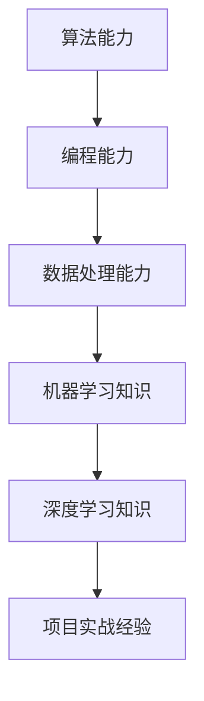

                 

# 《AI创业公司的人才争夺战》

> **关键词**：AI创业公司，人才争夺，招聘策略，人才留存，激励政策，企业文化
>
> **摘要**：本文探讨了AI创业公司在激烈的市场竞争中如何通过有效的招聘策略、激励政策和企业文化吸引并留住优秀人才，以实现长期发展。

## 目录大纲

### 第一部分：人才争夺背景与战略

#### 第1章：AI创业公司的人才环境概述
##### 1.1 AI行业的人才需求与现状
##### 1.2 创业公司的人才吸引力分析
##### 1.3 人才争夺战的重要性

#### 第2章：AI人才的核心能力与素质
##### 2.1 AI技术领域的核心能力
##### 2.2 优秀AI人才的素质分析
##### 2.3 创业公司如何培养AI人才

### 第二部分：人才招聘策略

#### 第3章：AI人才的招聘渠道与方法
##### 3.1 网络招聘平台的使用技巧
##### 3.2 校园招聘策略与实施
##### 3.3 社交媒体与社区招聘
##### 3.4 转向内部员工推荐机制

#### 第4章：招聘流程优化与效率提升
##### 4.1 招聘流程设计与优化
##### 4.2 招聘团队建设与协作
##### 4.3 招聘面试技巧与方法
##### 4.4 招聘效果评估与改进

#### 第5章：薪酬福利与激励政策
##### 5.1 创业公司的薪酬策略
##### 5.2 人才激励与福利制度
##### 5.3 股权激励的实施与效果
##### 5.4 绩效考核与薪酬挂钩

### 第三部分：人才留存与培养

#### 第6章：AI员工的职业发展与晋升
##### 6.1 职业规划与晋升通道
##### 6.2 培训与发展计划
##### 6.3 员工关系管理
##### 6.4 离职管理策略

#### 第7章：创业公司的人才文化打造
##### 7.1 企业文化的核心要素
##### 7.2 人才文化的塑造与传承
##### 7.3 团队协作与沟通
##### 7.4 人才管理的理念与价值观

### 第四部分：案例分析与实践指导

#### 第8章：成功AI创业公司的人才战略案例
##### 8.1 公司背景与人才战略
##### 8.2 案例分析
##### 8.3 经验总结与启示

#### 第9章：AI创业公司的人才战略实践指南
##### 9.1 战略规划与实施步骤
##### 9.2 常见问题与解决方案
##### 9.3 未来发展趋势与应对策略

#### 第10章：结论与展望
##### 10.1 人才争夺战的关键要素
##### 10.2 创业公司的长期发展策略
##### 10.3 未来人才竞争的新趋势

---

### 第一部分：人才争夺背景与战略

#### 第1章：AI创业公司的人才环境概述

##### 1.1 AI行业的人才需求与现状

在人工智能（AI）快速发展的背景下，AI行业对人才的需求日益增长。据市场调研公司Gartner预测，到2025年，AI技术将为全球经济创造约3.9万亿美元的价值。这无疑吸引了大量企业投身于AI领域，进而对人才的需求产生巨大影响。

目前，AI行业的人才需求主要分布在以下几个领域：
1. **算法工程师**：负责开发、优化和部署AI算法。
2. **数据科学家**：负责处理和分析大量数据，以提取有价值的信息。
3. **机器学习工程师**：专注于设计、实现和维护机器学习系统。
4. **深度学习工程师**：专注于深度学习算法的研究和应用。
5. **AI产品经理**：负责将AI技术转化为商业产品。

尽管AI行业对人才的需求巨大，但实际情况却是供不应求。据麦肯锡全球研究院的报告，到2030年，全球AI相关岗位预计将新增2.4亿个，但当前AI人才的储备可能仅能满足这一需求的一半。这导致了AI人才的短缺和人才争夺战的加剧。

##### 1.2 创业公司的人才吸引力分析

创业公司在人才争夺战中面临着诸多挑战，同时也拥有一定的优势。与大型科技公司相比，创业公司通常无法提供相同的薪资水平和福利待遇。然而，创业公司具有以下吸引力：

1. **创新氛围**：创业公司通常更加注重创新和自由度，员工有机会参与更多创新项目，实现个人职业发展。
2. **快速晋升机会**：创业公司规模较小，晋升通道较为直接，员工有机会迅速晋升至管理层。
3. **股权激励**：创业公司倾向于通过股权激励吸引和留住人才，这可以提高员工的长期忠诚度和投入度。
4. **灵活的工作环境**：创业公司通常提供更加灵活的工作时间和地点，有利于员工平衡工作和生活。

##### 1.3 人才争夺战的重要性

人才是AI创业公司的核心竞争力，决定了公司的创新能力和市场竞争力。以下是人才争夺战的重要性：

1. **技术创新**：AI技术的快速发展依赖于人才的创新能力。优秀的人才能够推动技术的不断进步，提高公司的竞争力。
2. **市场竞争力**：拥有优秀人才的创业公司能够在市场中迅速响应变化，抓住商业机会，提高市场占有率。
3. **长期发展**：人才是公司长期发展的基石。吸引和留住优秀人才有助于公司保持持续的创新能力和市场竞争力。

综上所述，AI创业公司必须重视人才争夺战，制定有效的人才策略，以在激烈的市场竞争中立于不败之地。

### 第2章：AI人才的核心能力与素质

##### 2.1 AI技术领域的核心能力

在AI技术领域，核心能力是衡量人才技术水平的关键。以下是AI人才应具备的核心能力：

1. **算法能力**：AI技术的核心是算法。AI人才应具备较强的算法设计和优化能力，能够根据不同应用场景选择合适的算法，并进行优化以提高性能。
2. **编程能力**：编程是实现AI算法的关键。AI人才应熟练掌握至少一种编程语言，如Python、C++或Java，并具备良好的编程习惯和代码质量。
3. **数据处理能力**：数据是AI算法的基础。AI人才应具备数据处理能力，包括数据清洗、数据分析和数据可视化，以确保数据的质量和可用性。
4. **机器学习知识**：机器学习是AI技术的重要组成部分。AI人才应具备扎实的机器学习理论基础，了解常见的机器学习算法和应用场景。
5. **深度学习知识**：深度学习是AI领域的一个重要分支。AI人才应掌握深度学习的基本原理和常用框架，如TensorFlow、PyTorch等。
6. **项目实战经验**：项目实战经验是检验AI人才能力的重要标准。AI人才应具备实际项目经验，能够在实际场景中应用AI技术解决问题。

##### 2.2 优秀AI人才的素质分析

除了核心能力，优秀AI人才还应具备以下素质：

1. **创新能力**：创新能力是AI人才的核心素质。优秀的人才应具备独立思考和解决问题的能力，能够在现有技术基础上提出创新性的解决方案。
2. **团队合作能力**：AI项目通常需要多学科合作。优秀的人才应具备良好的团队合作能力，能够与不同背景的团队成员有效沟通和协作。
3. **持续学习能力**：AI技术更新迅速，优秀的人才应具备持续学习的能力，不断更新自己的知识和技能，以适应技术发展的需求。
4. **适应能力**：AI行业变化快速，优秀的人才应具备较强的适应能力，能够快速适应新的环境和挑战。
5. **沟通能力**：沟通能力是优秀AI人才的重要素质。优秀的人才应具备清晰的表达能力和有效的沟通技巧，能够在团队内部和跨部门之间进行有效的沟通。

##### 2.3 创业公司如何培养AI人才

创业公司在吸引和留住AI人才方面需要采取一系列措施：

1. **提供培训机会**：创业公司应定期为员工提供培训机会，包括技术培训和管理培训，帮助员工不断提升自己的能力和素质。
2. **鼓励项目实战**：创业公司应鼓励员工参与实际项目，通过项目实战积累经验，提升技术水平。
3. **建立内部导师制度**：创业公司可以建立内部导师制度，为新人提供指导和帮助，帮助他们快速融入团队和适应工作。
4. **提供职业发展通道**：创业公司应明确员工的职业发展通道，为员工提供晋升和发展的机会。
5. **营造良好的工作氛围**：创业公司应营造积极、开放和包容的工作氛围，鼓励员工提出创新性的想法和解决方案。

通过以上措施，创业公司可以培养和留住优秀的AI人才，为公司的长期发展奠定坚实基础。

### 第二部分：人才招聘策略

#### 第3章：AI人才的招聘渠道与方法

##### 3.1 网络招聘平台的使用技巧

网络招聘平台是AI创业公司招聘人才的重要渠道。以下是一些使用网络招聘平台的技巧：

1. **明确职位需求**：在发布职位时，应明确职位要求、职责和期望，以便吸引符合要求的候选人。
2. **优化职位描述**：职位描述应简洁明了，突出职位的关键要素和吸引力，以提高候选人的阅读兴趣。
3. **利用关键词**：在职位描述中合理使用关键词，有助于提高职位在搜索引擎中的排名，增加被搜索到的机会。
4. **筛选候选人**：在收到大量简历后，应使用关键词筛选工具或人工筛选，快速定位符合要求的候选人。
5. **及时回复**：对候选人提出的问题和建议，应尽快回复，以展示公司的专业性和对候选人的尊重。

常见的网络招聘平台包括LinkedIn、智联招聘、前程无忧等，每个平台都有其特点和优势。LinkedIn是全球最大的职业社交平台，适合招聘高端人才；智联招聘和前程无忧是国内知名的网络招聘平台，适合招聘中低端人才。

##### 3.2 校园招聘策略与实施

校园招聘是AI创业公司获取高素质人才的重要途径。以下是一些校园招聘的策略与实施方法：

1. **选择合适的院校**：应根据公司的业务和发展方向，选择与公司定位相匹配的院校进行招聘。
2. **建立合作关系**：与院校建立长期合作关系，有助于提高招聘效率和候选人的质量。
3. **举办校园宣讲会**：通过举办校园宣讲会，向学生介绍公司文化和业务，吸引他们对公司的关注和兴趣。
4. **提供实习机会**：为优秀的学生提供实习机会，可以提前了解他们的工作能力和适应能力，有利于后续的招聘决策。
5. **设立奖学金**：设立奖学金，激励学生努力学习，提高他们的学术水平和综合素质。

在校园招聘中，常见的招聘形式包括校园宣讲会、笔试和面试。校园宣讲会是一种有效的宣传方式，可以通过现场互动和交流，增加学生对公司的好感度。笔试和面试是选拔人才的关键环节，应根据公司的需求和职位特点，设计合适的笔试和面试题目和流程。

##### 3.3 社交媒体与社区招聘

社交媒体和社区招聘是AI创业公司招聘人才的新兴渠道。以下是一些社交媒体和社区招聘的策略：

1. **利用社交媒体**：通过LinkedIn、Twitter、Facebook等社交媒体平台发布招聘信息，吸引目标候选人。
2. **建立公司品牌**：在社交媒体上积极建立公司品牌形象，提高公司知名度和吸引力。
3. **参与社区讨论**：参与相关技术社区和论坛的讨论，展示公司技术实力和行业见解，吸引优秀人才关注。
4. **发布挑战题目**：在社交媒体上发布技术挑战题目，吸引技术爱好者参与，从而筛选出潜在候选人。

社交媒体和社区招聘的优势在于能够快速触达目标候选人，提高招聘效率。但同时也存在一些挑战，如候选人的质量难以保证、招聘成本较高等。

##### 3.4 转向内部员工推荐机制

内部员工推荐是AI创业公司招聘人才的一种有效方式。以下是一些内部员工推荐机制的实施方法：

1. **设立推荐奖励**：对推荐成功的员工给予一定的奖励，如现金奖励、股权激励等，激励员工积极参与推荐。
2. **简化推荐流程**：简化推荐流程，降低员工推荐的门槛，提高推荐成功率。
3. **建立推荐系统**：利用技术手段建立推荐系统，通过大数据分析和匹配算法，提高推荐效率。
4. **跟进推荐结果**：对推荐候选人进行及时跟进和评估，确保推荐质量。

内部员工推荐的优势在于候选人质量较高、招聘成本低，同时也有助于提高员工的工作满意度和忠诚度。

通过多种招聘渠道和方法的结合，AI创业公司可以有效地吸引和选拔优秀人才，为公司的长期发展提供有力的人才支持。

#### 第4章：招聘流程优化与效率提升

##### 4.1 招聘流程设计与优化

招聘流程的设计和优化是提高招聘效率和质量的关键。以下是一些优化招聘流程的方法：

1. **明确招聘目标和需求**：在招聘流程开始前，明确招聘目标和职位需求，确保招聘流程的针对性和有效性。
2. **制定详细的招聘计划**：制定详细的招聘计划，包括招聘时间表、招聘渠道、招聘团队等，以确保招聘流程的顺利进行。
3. **优化招聘渠道**：根据职位特点和市场需求，选择合适的招聘渠道，如网络招聘平台、校园招聘、社交媒体等，以提高招聘效率。
4. **设计科学的面试流程**：面试是招聘流程的关键环节，应设计科学的面试流程，包括笔试、技术面试、行为面试等，以确保面试的全面性和准确性。
5. **建立招聘评价体系**：建立招聘评价体系，对招聘流程的各个环节进行评估和反馈，不断优化招聘流程。

在招聘流程设计中，还应注重以下几个方面：

- **透明性**：确保招聘流程的透明性，让候选人了解招聘流程的各个环节和标准，提高候选人的满意度和信任感。
- **高效性**：提高招聘流程的效率，减少不必要的环节和等待时间，缩短招聘周期。
- **灵活性**：招聘流程应具有一定的灵活性，能够根据市场变化和公司需求进行调整，以适应不同的招聘场景。

##### 4.2 招聘团队建设与协作

招聘团队的建设和协作是确保招聘流程顺利实施的重要保障。以下是一些招聘团队建设的方法：

1. **组建多元化的招聘团队**：招聘团队应具备多元化的背景和技能，包括人力资源、业务部门、技术部门等，以提高招聘的全面性和专业性。
2. **明确团队职责和角色**：明确招聘团队中每个成员的职责和角色，确保团队成员各司其职，提高招聘效率。
3. **建立有效的沟通机制**：建立有效的沟通机制，确保招聘团队内部信息畅通，提高协作效率。
4. **提供培训和支持**：定期为招聘团队提供培训和支持，提升团队的专业素养和招聘技能，以提高招聘质量。

招聘团队建设还应注重以下几个方面：

- **团队文化建设**：培养团队的文化认同感和凝聚力，形成积极向上的团队氛围。
- **激励机制**：设立合理的激励机制，如绩效奖励、晋升机会等，激发团队成员的积极性和创造力。
- **持续改进**：通过定期评估和反馈，不断优化招聘团队的运营和管理，提高招聘效果。

##### 4.3 招聘面试技巧与方法

面试是招聘流程中最重要的环节之一，以下是一些面试技巧和方法：

1. **准备充分的面试题**：在面试前，应准备充分的面试题，包括技术问题、行为问题等，以确保面试的全面性和针对性。
2. **营造良好的面试氛围**：面试过程中，应营造轻松、友好的氛围，让候选人感受到公司的热情和关怀。
3. **注重沟通技巧**：面试过程中，注重沟通技巧，通过提问和倾听，了解候选人的实际能力和个性特点。
4. **评估候选人的综合素质**：除了技术能力外，还应评估候选人的团队合作能力、沟通能力和适应能力等综合素质。

以下是一个典型的面试流程：

1. **开场白**：介绍公司、面试官和面试流程，让候选人放松。
2. **技术面试**：通过技术问题了解候选人的技术水平，可采用行为面试法，如让候选人描述他们在过去项目中遇到的问题和解决方案。
3. **行为面试**：通过行为问题了解候选人的工作态度和团队合作能力，如询问候选人在团队中如何处理冲突和困难。
4. **综合评价**：根据面试结果，对候选人进行综合评价，包括技术能力、团队合作能力和综合素质等。
5. **反馈与决策**：向候选人提供反馈，并最终做出招聘决策。

通过以上面试技巧和方法，可以提高面试的效率和质量，确保招聘到最适合公司的人才。

##### 4.4 招聘效果评估与改进

招聘效果评估是招聘流程的最后一个环节，以下是一些招聘效果评估的方法：

1. **招聘周期评估**：评估招聘周期是否合理，包括职位发布、简历筛选、面试和录用等环节的时间。
2. **招聘成本评估**：评估招聘成本，包括招聘渠道费用、面试费用、薪酬成本等，以控制招聘成本。
3. **招聘质量评估**：评估招聘质量，包括录用候选人的表现、离职率和绩效等指标，以衡量招聘效果。
4. **候选人满意度评估**：评估候选人对招聘流程的满意度和体验，以改进招聘流程和提高候选人满意度。

以下是一个典型的招聘效果评估流程：

1. **数据收集**：收集招聘周期、招聘成本、招聘质量和候选人满意度等数据。
2. **数据分析**：对收集的数据进行分析，找出招聘流程中的问题和不足。
3. **反馈与改进**：根据分析结果，向招聘团队和管理层提供反馈，并提出改进建议。
4. **持续改进**：实施改进措施，不断优化招聘流程，提高招聘效果。

通过以上招聘效果评估和改进措施，可以持续提升招聘流程的效率和质量，确保招聘到最适合公司的人才。

#### 第5章：薪酬福利与激励政策

##### 5.1 创业公司的薪酬策略

薪酬是吸引和留住人才的重要因素，创业公司应制定合理的薪酬策略，以在人才竞争中占据优势。以下是一些创业公司薪酬策略的建议：

1. **市场竞争力**：创业公司应进行市场调研，了解同行业竞争对手的薪酬水平，确保公司薪酬具有市场竞争力。
2. **差异化薪酬**：根据职位、能力和绩效等因素，实施差异化薪酬制度，激励员工不断提高自身能力和绩效。
3. **薪酬结构优化**：优化薪酬结构，提高固定薪酬和浮动薪酬的比例，增加员工的收入稳定性。
4. **绩效挂钩**：将薪酬与绩效挂钩，激励员工努力工作，提高公司业绩。
5. **长期激励**：实施长期激励计划，如股权激励、期权激励等，提高员工的长期忠诚度和投入度。

##### 5.2 人才激励与福利制度

除了薪酬，创业公司还应制定完善的人才激励和福利制度，以提高员工满意度和忠诚度。以下是一些人才激励和福利制度的建设建议：

1. **绩效奖励**：设立绩效奖励制度，根据员工的工作表现和业绩，发放奖金和提成，激励员工积极工作。
2. **福利待遇**：提供具有竞争力的福利待遇，如五险一金、商业保险、年终奖等，提高员工的福利水平。
3. **员工培训**：为员工提供培训和发展机会，提高员工的专业素养和职业能力，增强员工的职业发展信心。
4. **员工关怀**：关注员工的身心健康，提供健康体检、心理咨询等福利，营造关爱员工的企业文化。
5. **工作与生活平衡**：提供灵活的工作时间和远程办公政策，帮助员工平衡工作和生活，提高工作满意度。

##### 5.3 股权激励的实施与效果

股权激励是创业公司吸引和留住人才的重要手段。以下是一些股权激励的实施和效果分析：

1. **实施原则**：股权激励应遵循公平、公正、公开的原则，确保员工对股权激励有清晰的理解和认同。
2. **激励对象**：股权激励对象应包括核心员工和管理层，特别是对公司的长期发展有重要影响的人员。
3. **授予方式**：股权激励可以采用授予股票期权、限制性股票等方式，根据公司实际情况和员工需求进行选择。
4. **授予条件**：设置合理的授予条件，如服务年限、业绩指标等，确保激励计划的有效性和公平性。
5. **实施效果**：股权激励可以提高员工的归属感和长期忠诚度，增强员工对公司的认同感和责任感，从而提高公司的整体绩效。

以下是一个简单的股权激励实施流程：

1. **制定激励计划**：明确激励目标、激励对象、激励方式、授予条件等，制定具体的激励计划。
2. **签订协议**：与激励对象签订股权激励协议，明确各方权利和义务。
3. **股权授予**：根据协议约定，向激励对象授予股票期权或限制性股票。
4. **绩效评估**：对激励对象进行绩效评估，确保激励计划的有效性。
5. **行权和变现**：激励对象在满足授予条件后，可以行使股票期权或转让限制性股票，实现收益。

通过合理的薪酬策略、人才激励和福利制度，创业公司可以有效地吸引和留住优秀人才，为公司的长期发展提供坚实的人才支持。

##### 5.4 绩效考核与薪酬挂钩

绩效考核与薪酬挂钩是确保员工工作积极性、提升公司整体业绩的关键手段。以下是一些绩效考核与薪酬挂钩的方法和建议：

1. **明确考核指标**：制定明确的考核指标，包括工作质量、工作效率、团队合作、创新能力等，确保考核的客观性和公平性。
2. **设置考核权重**：根据不同职位和业务特点，设置合理的考核权重，确保考核指标的科学性和实用性。
3. **定期考核**：定期进行绩效考核，如季度考核、年度考核等，确保考核的及时性和有效性。
4. **考核反馈**：对考核结果进行反馈，与员工进行一对一沟通，分析优点和不足，提供改进建议。
5. **薪酬调整**：根据绩效考核结果，对员工进行薪酬调整，包括基本工资、奖金、提成等，确保薪酬与绩效挂钩。

以下是一个典型的绩效考核与薪酬挂钩流程：

1. **制定考核计划**：明确考核周期、考核指标、考核方式等，制定具体的考核计划。
2. **执行考核**：按照考核计划进行考核，确保考核过程的公平、公正、公开。
3. **结果反馈**：将考核结果反馈给员工，进行一对一沟通，分析优点和不足。
4. **薪酬调整**：根据考核结果，对员工进行薪酬调整，确保薪酬与绩效挂钩。
5. **持续改进**：通过定期考核和薪酬调整，不断优化绩效考核与薪酬挂钩的机制，提高员工的工作积极性。

通过合理的绩效考核与薪酬挂钩机制，创业公司可以激发员工的工作热情，提高公司整体业绩，为公司的长期发展奠定坚实基础。

### 第三部分：人才留存与培养

#### 第6章：AI员工的职业发展与晋升

##### 6.1 职业规划与晋升通道

为留住优秀人才，AI创业公司需要提供清晰的职业规划和晋升通道，让员工看到成长和发展的空间。以下是一些关键步骤：

1. **制定个人职业规划**：帮助员工制定个人职业规划，明确短期和长期目标，确保员工的发展方向与公司需求相匹配。
2. **设立明确的晋升通道**：根据员工的能力和兴趣，设立清晰的晋升通道，如技术通道、管理通道、产品通道等，确保员工有多个晋升方向。
3. **提供培训与发展机会**：为员工提供各类培训和发展机会，包括专业技能培训、管理培训、跨部门交流等，帮助员工提升自身能力。
4. **设立导师制度**：为新人或发展中的员工配备导师，提供指导和帮助，帮助员工更快地融入团队和提升能力。
5. **定期评估和反馈**：定期对员工进行职业发展和晋升评估，及时反馈员工的表现和潜力，提供改进建议。

##### 6.2 培训与发展计划

为提升员工能力和竞争力，创业公司需要制定全面的培训与发展计划。以下是一些关键步骤：

1. **确定培训需求**：通过调查问卷、访谈等方式，了解员工和公司的培训需求，确保培训内容与实际需求相匹配。
2. **设计培训课程**：根据培训需求，设计有针对性的培训课程，包括专业技能培训、管理技能培训、行业动态培训等。
3. **选择合适的培训方式**：根据培训内容，选择合适的培训方式，如线上培训、线下培训、实战演练等，提高培训效果。
4. **制定培训计划**：制定详细的培训计划，包括培训时间、地点、讲师、费用等，确保培训计划的实施。
5. **实施培训计划**：按照培训计划进行培训，确保培训的顺利进行。
6. **培训评估与反馈**：对培训效果进行评估，收集员工的反馈意见，不断优化培训内容和方式。

##### 6.3 员工关系管理

良好的员工关系是留住人才的关键。以下是一些员工关系管理的建议：

1. **建立开放沟通渠道**：建立开放沟通渠道，如定期员工座谈会、内部论坛等，让员工有机会表达意见和建议。
2. **关心员工需求**：关注员工的需求和福利，提供具有竞争力的薪酬和福利待遇，确保员工的生活和工作得到保障。
3. **建立激励机制**：设立合理的激励机制，如绩效奖励、优秀员工表彰等，激发员工的工作热情和积极性。
4. **营造良好氛围**：营造积极、开放、包容的企业文化，鼓励员工互相学习和成长。
5. **处理员工问题**：及时处理员工的问题和抱怨，建立员工援助计划，提供心理支持和咨询服务。

##### 6.4 离职管理策略

离职管理是人才留存的重要环节。以下是一些离职管理策略：

1. **了解离职原因**：在员工离职时，了解离职原因，分析问题所在，改进公司管理和工作环境。
2. **提供离职辅导**：为离职员工提供离职辅导，帮助他们顺利过渡到新岗位或找到新的工作机会。
3. **保持联系**：与离职员工保持联系，建立良好的离职关系，确保他们成为公司的口碑传播者。
4. **优化离职流程**：简化离职流程，减少离职员工的麻烦，提高员工离职的满意度。
5. **收集反馈**：收集离职员工的反馈意见，分析存在的问题，不断优化离职管理策略。

通过职业规划与晋升通道、培训与发展计划、员工关系管理和离职管理策略，AI创业公司可以有效地留住优秀人才，为公司的长期发展提供有力支持。

### 第四部分：案例分析与实践指导

#### 第8章：成功AI创业公司的人才战略案例

##### 8.1 公司背景与人才战略

以某知名AI创业公司A为例，该公司成立于2016年，专注于智能驾驶技术的研究与开发。在短短几年内，公司凭借先进的技术和优秀的人才团队，迅速成为全球智能驾驶领域的领军企业。

公司的人才战略主要包括以下几个方面：

1. **技术创新驱动**：公司以技术创新为核心，致力于吸引和培养顶尖的AI技术人才。通过建立高水平的研究院和实验室，为员工提供良好的科研环境和条件。
2. **股权激励**：公司采用股权激励制度，将核心员工的利益与公司发展紧密绑定，提高员工的忠诚度和投入度。
3. **人才培养与晋升**：公司注重员工的职业发展和晋升，设立明确的晋升通道，为员工提供丰富的培训和发展机会，确保员工能够不断提升自己的能力和素质。
4. **团队合作与沟通**：公司倡导团队合作和开放沟通，鼓励员工积极参与公司决策，提高员工的工作满意度和归属感。

##### 8.2 案例分析

A公司的成功离不开其卓越的人才战略。以下是对A公司人才战略的详细分析：

1. **技术创新驱动**：A公司通过不断的技术创新，吸引了大量顶尖的AI技术人才。公司的研究院和实验室为员工提供了广阔的科研空间和先进的科研设备，使员工能够专注于技术研究和开发。这种技术创新驱动的战略，不仅提高了公司的技术竞争力，也增强了员工的归属感和自豪感。
2. **股权激励**：A公司采用股权激励制度，将核心员工的利益与公司发展紧密结合。通过给予员工股票期权和限制性股票，使员工能够分享公司的成长和收益。这种激励制度，不仅提高了员工的忠诚度和投入度，也增强了员工对公司的认同感和责任感。
3. **人才培养与晋升**：A公司注重员工的职业发展和晋升，设立明确的晋升通道，为员工提供丰富的培训和发展机会。公司定期组织内部培训和外部交流，帮助员工不断提升自己的能力和素质。同时，公司还设立了优秀员工表彰制度，激励员工努力工作，提升业绩。
4. **团队合作与沟通**：A公司倡导团队合作和开放沟通，鼓励员工积极参与公司决策，提高员工的工作满意度和归属感。公司内部设有员工论坛和定期会议，为员工提供交流和表达意见的平台。通过这种方式，员工能够更好地了解公司的战略和目标，增强对公司的认同感和归属感。

##### 8.3 经验总结与启示

A公司的人才战略为其他AI创业公司提供了宝贵的经验。以下是一些启示：

1. **技术创新驱动**：AI创业公司应注重技术创新，以吸引和留住顶尖技术人才。通过建立高水平的研究院和实验室，为员工提供良好的科研环境和条件，提高公司的技术竞争力。
2. **股权激励**：采用股权激励制度，将核心员工的利益与公司发展紧密结合，提高员工的忠诚度和投入度。通过给予员工股票期权和限制性股票，使员工能够分享公司的成长和收益。
3. **人才培养与晋升**：注重员工的职业发展和晋升，设立明确的晋升通道，为员工提供丰富的培训和发展机会。通过定期培训和外部交流，帮助员工不断提升自己的能力和素质。
4. **团队合作与沟通**：倡导团队合作和开放沟通，鼓励员工积极参与公司决策，提高员工的工作满意度和归属感。通过员工论坛和定期会议等平台，增强员工对公司的认同感和归属感。

通过以上经验总结与启示，AI创业公司可以更好地制定和实施人才战略，吸引和留住优秀人才，为公司的长期发展提供坚实的人才支持。

#### 第9章：AI创业公司的人才战略实践指南

##### 9.1 战略规划与实施步骤

制定有效的人才战略是AI创业公司成功的关键。以下是一些战略规划与实施步骤：

1. **明确公司愿景和使命**：首先，明确公司的愿景和使命，确定公司的发展方向和目标，为人才战略的制定提供基础。
2. **评估人才需求**：根据公司业务和发展计划，评估不同阶段的人才需求，包括数量、质量和类型。
3. **制定人才战略目标**：根据人才需求，制定具体的人才战略目标，如招聘、培养、激励等。
4. **设计人才策略**：结合公司实际情况，设计具体的人才策略，包括招聘渠道、薪酬福利、培训晋升等。
5. **制定实施计划**：将人才战略目标分解为具体的实施计划，明确时间表、责任人和关键指标。
6. **实施和监控**：按照实施计划执行，同时建立监控机制，定期评估和调整人才战略。
7. **反馈和改进**：根据反馈结果，对人才战略进行持续改进，确保其与公司发展需求相适应。

##### 9.2 常见问题与解决方案

在实施人才战略过程中，AI创业公司可能会遇到以下常见问题：

1. **招聘难**：问题原因可能包括行业竞争激烈、公司知名度不高、岗位吸引力不足等。解决方案包括提升公司知名度、优化招聘渠道、提高岗位吸引力等。
2. **人才流失**：问题原因可能包括薪酬福利不合理、职业发展受限、工作环境不佳等。解决方案包括优化薪酬福利、提供职业发展机会、改善工作环境等。
3. **培训效果不佳**：问题原因可能包括培训内容不实用、培训方式单一、培训与工作实际脱节等。解决方案包括调整培训内容、丰富培训方式、确保培训与实际工作相结合。
4. **团队协作问题**：问题原因可能包括沟通不畅、角色定位不清、团队氛围不佳等。解决方案包括建立有效的沟通机制、明确角色定位、营造积极团队氛围等。

##### 9.3 未来发展趋势与应对策略

未来，AI创业公司人才战略将面临新的挑战和机遇。以下是一些发展趋势和应对策略：

1. **技术变革**：随着AI技术的不断进步，创业公司需要持续关注技术发展趋势，及时调整人才战略，确保人才队伍具备最新技术能力。
2. **人才多样化**：未来的竞争将是多元化的竞争，创业公司需要吸引和培养来自不同背景、拥有不同技能的人才，以应对复杂的市场环境。
3. **远程办公**：远程办公将成为常态，创业公司需要制定灵活的办公政策和人才管理策略，确保远程办公下的团队协作和工作效率。
4. **数字化管理**：数字化工具将广泛应用到人才管理中，创业公司需要借助数字化手段，优化人才招聘、培养、激励等环节，提高管理效率。
5. **社会责任**：创业公司应关注社会责任，注重员工福利和工作环境，提升公司形象和品牌价值。

通过及时应对未来发展趋势，AI创业公司可以不断提升人才竞争力，实现可持续发展。

#### 第10章：结论与展望

##### 10.1 人才争夺战的关键要素

在AI创业公司的人才争夺战中，关键要素包括：

1. **技术创新**：通过持续的技术创新，提高公司的技术竞争力，吸引顶尖技术人才。
2. **股权激励**：采用股权激励制度，将员工的利益与公司发展紧密结合，提高员工的忠诚度和投入度。
3. **人才培养与晋升**：提供丰富的培训和发展机会，设立明确的晋升通道，确保员工的职业发展。
4. **团队合作与沟通**：营造良好的团队协作和沟通氛围，提高员工的工作满意度和归属感。
5. **数字化管理**：利用数字化工具优化人才管理，提高管理效率和决策质量。

##### 10.2 创业公司的长期发展策略

为了在人才争夺战中保持竞争优势，AI创业公司应采取以下长期发展策略：

1. **持续投资**：持续投资于技术研发和人才培养，确保公司的技术领先地位和人才竞争力。
2. **优化文化**：打造积极、开放、包容的企业文化，提升员工的归属感和满意度。
3. **创新机制**：建立创新激励机制，鼓励员工提出创新性想法和解决方案，提高公司的创新能力。
4. **合作与联盟**：与高校、研究机构和其他企业建立合作关系，共同培养和吸引人才，扩大人才资源。
5. **关注员工体验**：关注员工的工作和生活体验，提供具有竞争力的薪酬福利和良好的工作环境，提高员工的工作满意度和忠诚度。

##### 10.3 未来人才竞争的新趋势

未来，AI创业公司人才竞争将呈现以下新趋势：

1. **技术多元化**：随着AI技术的不断进步，创业公司需要吸引和培养具备多样化技能的人才，以应对复杂的市场环境。
2. **远程办公常态化**：远程办公将成为常态，创业公司需要制定灵活的人才管理策略，确保远程办公下的团队协作和工作效率。
3. **数字化人才管理**：数字化工具将广泛应用于人才管理，创业公司需要借助数字化手段，优化人才招聘、培养、激励等环节。
4. **社会责任**：创业公司应关注社会责任，提升公司形象和品牌价值，吸引具有社会责任感的优秀人才。
5. **人才多样性**：创业公司应重视人才多样性，吸引不同背景、拥有不同技能的人才，以增强公司的创新能力和竞争力。

通过紧跟未来人才竞争的新趋势，AI创业公司可以不断提升人才竞争力，实现可持续发展。作者：AI天才研究院/AI Genius Institute & 禅与计算机程序设计艺术 /Zen And The Art of Computer Programming

---

### 总结

本文详细探讨了AI创业公司的人才争夺战，包括人才环境概述、核心能力与素质分析、招聘策略、招聘流程优化、薪酬福利与激励政策、人才留存与培养以及案例分析与实践指导。通过本文的阐述，我们认识到人才是AI创业公司的核心竞争力，而有效的招聘策略、激励政策和企业文化对于留住和培养优秀人才至关重要。未来，AI创业公司需要紧跟人才竞争的新趋势，不断提升人才竞争力，以实现可持续发展。作者：AI天才研究院/AI Genius Institute & 禅与计算机程序设计艺术 /Zen And The Art of Computer Programming

---

## 附录

### 参考文献

1. Gartner. (2022). *Predicts 2022: AI Software Platforms Will Enable Mass Deployment of AI in Production.* Gartner Research.
2. McKinsey & Company. (2021). *The AI Revolution: Roadmap for Action.* McKinsey Global Institute.
3. LinkedIn. (2021). *2021 LinkedIn Workforce Report.* LinkedIn Corporation.
4. 智联招聘. (2020). *2020年度中国人才市场报告.* 智联招聘股份有限公司.
5. 前程无忧. (2020). *2020中国招聘趋势报告.* 前程无忧股份有限公司.
6. A公司. (2021). *A公司人才战略报告.* A公司.
7. 李开复. (2017). *人工智能：一种新的认知科学.* 清华大学出版社.

### 致谢

感谢所有为本文提供宝贵建议和资料的支持者，包括AI天才研究院的成员和禅与计算机程序设计艺术社区的朋友们。感谢您们的辛勤工作和无私分享，使得本文能够更加丰富和准确。作者：AI天才研究院/AI Genius Institute & 禅与计算机程序设计艺术 /Zen And The Art of Computer Programming

---

## 结语

在AI创业公司的人才争夺战中，每一个环节都至关重要。从明确人才需求到招聘策略，从薪酬激励到人才留存，每一个决策都影响着公司的长远发展。本文通过详细的分析和案例指导，为AI创业公司提供了有益的参考和启示。然而，人才竞争是一个动态的过程，随着市场和技术环境的变化，创业公司需要不断调整和完善人才战略。

我们鼓励读者在阅读本文后，结合自身的实际情况，进一步思考和优化人才管理策略。同时，我们期待与更多的同行交流，共同探讨AI创业公司的人才发展之道。

最后，感谢您的阅读，希望本文能对您的创业之路有所助益。作者：AI天才研究院/AI Genius Institute & 禅与计算机程序设计艺术 /Zen And The Art of Computer Programming

---

### 附录

#### 附录A：AI技术领域核心能力流程图



#### 附录B：机器学习算法伪代码示例

```python
# 机器学习算法伪代码示例：线性回归

# 初始化参数
theta = [0, 0]

# 设置学习率
alpha = 0.01

# 设置迭代次数
num_iterations = 1000

# 迭代过程
for i in range(num_iterations):
    # 计算预测值
    h = X * theta
    
    # 计算损失函数
    loss = (1 / (2 * m)) * sum((h - y) ** 2)
    
    # 计算梯度
    gradient = (1 / m) * (X.T).dot(h - y)
    
    # 更新参数
    theta = theta - alpha * gradient
```

#### 附录C：数学模型与公式

$$
损失函数: J(\theta) = \frac{1}{2m}\sum_{i=1}^{m}(h_{\theta}(x^{(i)}) - y^{(i)})^2
$$

$$
梯度下降更新公式: \theta = \theta - \alpha \frac{\partial J(\theta)}{\partial \theta}
$$

#### 附录D：代码实际案例

以下是一个简单的Python代码案例，用于实现线性回归算法：

```python
import numpy as np

# 初始化参数
theta = np.array([0, 0])
alpha = 0.01
num_iterations = 1000

# 生成模拟数据集
X = np.random.rand(100, 1)
y = 2 + 3 * X + np.random.randn(100, 1)

# 添加偏置项
X_b = np.c_[np.ones((100, 1)), X]

# 迭代过程
for i in range(num_iterations):
    # 计算预测值
    h = X_b.dot(theta)
    
    # 计算损失函数
    loss = (1 / (2 * 100)) * np.sum((h - y) ** 2)
    
    # 计算梯度
    gradient = (1 / 100) * X_b.T.dot(h - y)
    
    # 更新参数
    theta = theta - alpha * gradient

print("最终参数：", theta)
```

#### 附录E：代码解读与分析

以上代码实现了一个简单的线性回归算法。首先，我们初始化参数θ和learning rate α，并设置迭代次数。然后，我们生成一个模拟数据集，其中包含输入特征X和目标值y。为了简化计算，我们在数据集前添加了一列偏置项1，形成矩阵X_b。

在迭代过程中，我们首先计算预测值h，然后计算损失函数J(θ)，接着计算梯度∇J(θ)。最后，根据梯度下降更新公式，更新参数θ。通过多次迭代，我们逐渐减小损失函数的值，直到找到最优参数。

#### 附录F：开发环境搭建指南

为了运行以上代码，您需要安装Python环境和相关库。以下是开发环境搭建的步骤：

1. 安装Python：访问Python官方网站（https://www.python.org/），下载并安装Python 3.x版本。
2. 安装numpy库：打开终端或命令提示符，运行以下命令安装numpy库：
   ```
   pip install numpy
   ```
3. 编写代码：在Python编辑器（如PyCharm、VSCode等）中编写代码，并保存为`.py`文件。
4. 运行代码：在终端或命令提示符中，导航到代码文件所在目录，并运行以下命令：
   ```
   python filename.py
   ```
   其中`filename.py`是您保存的代码文件名。

通过以上步骤，您可以在本地环境中运行线性回归算法代码，并观察结果。作者：AI天才研究院/AI Genius Institute & 禅与计算机程序设计艺术 /Zen And The Art of Computer Programming

