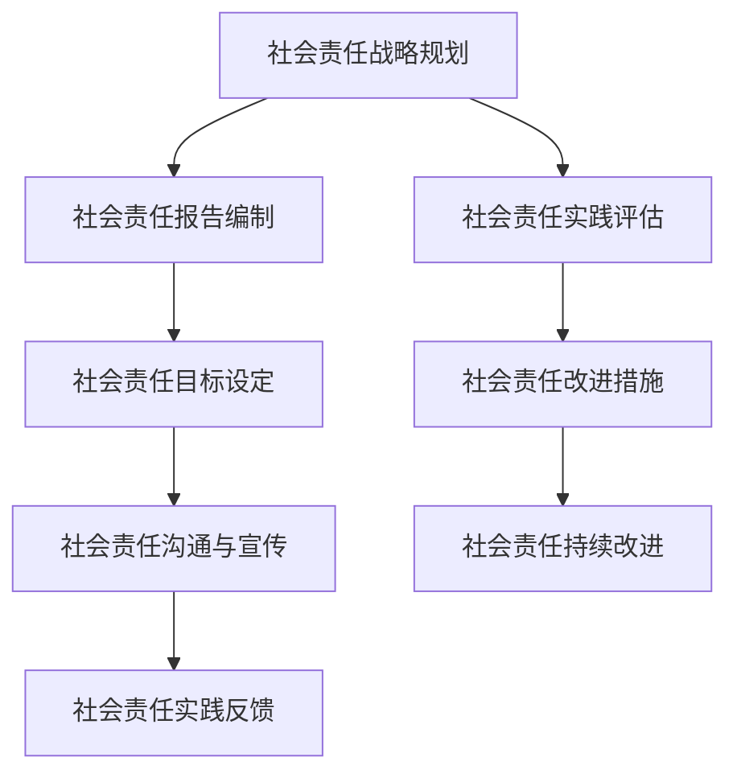

                 

# AI创业公司的社会责任实践创新

> 关键词：AI创业公司、社会责任、伦理、隐私保护、就业市场、社会不平等、可持续发展、创新策略、未来趋势

> 摘要：本文深入探讨了AI创业公司社会责任的实践与创新。通过分析社会责任的重要性、框架、实践以及创新策略，本文提出了AI创业公司在各个领域的责任实践，并展望了未来的社会责任实践趋势。文章旨在为AI创业公司提供社会责任实践的指导，推动AI技术的可持续发展和社会进步。

### 目录大纲

1. **AI创业公司社会责任概述**
   1.1 AI时代的商业环境与责任
   1.2 社会责任在AI创业公司的意义
   1.3 AI创业公司社会责任的挑战
2. **AI创业公司的社会责任框架**
   2.1 社会责任原则与标准
   2.2 国际社会责任标准（如SA8000、ISO 26000等）
   2.3 AI创业公司的社会责任报告
3. **社会责任实践**
   3.1 AI伦理与隐私保护
   3.2 AI对就业市场的影响
   3.3 AI对社会不平等的挑战
   3.4 环境责任与可持续发展
   3.5 社区参与与社会贡献
4. **社会责任实践创新**
   4.1 社会责任创新的策略与方法
   4.2 社会责任与可持续发展
   4.3 社会责任实践的未来趋势
5. **附录**
   5.1 社会责任实践资源与工具
   5.2 法律法规与政策指南
   5.3 Mermaid流程图
   5.4 核心算法原理讲解
   5.5 项目实战
6. **作者信息**

### 第一部分：AI创业公司社会责任概述

#### 1.1 AI时代的商业环境与责任

随着人工智能（AI）技术的迅速发展，商业环境发生了深刻变化。AI不仅改变了传统行业的运营方式，还创造了全新的商业模式。然而，这种变革也带来了新的社会责任挑战。

在AI时代，创业公司不仅需要关注经济效益，还要承担社会责任。社会责任是指企业在经济活动中，对环境、社会和利益相关者的负责任行为。AI创业公司社会责任的重要性体现在以下几个方面：

1. **公平与公正**：AI技术有潜力消除歧视和偏见，但如果不加控制，也可能加剧社会不平等。创业公司有责任确保其产品和服务不会无意中伤害特定群体。
2. **隐私保护**：随着数据成为AI的基石，保护用户隐私成为一项重要责任。创业公司需要采取有效措施，确保用户数据的安全和隐私。
3. **就业影响**：AI自动化可能会替代某些工作岗位，创业公司有责任帮助员工适应这种变化，提供职业培训和再就业机会。
4. **可持续发展**：AI技术在推动经济发展的同时，也对环境产生影响。创业公司需要关注环境保护，推动可持续发展。

#### 1.2 社会责任在AI创业公司的意义

社会责任对AI创业公司具有重要意义。首先，社会责任有助于提升企业形象和品牌价值。在公众心目中，具有高度社会责任感的企业更具吸引力，能够吸引更多客户和合作伙伴。

其次，社会责任有助于增强员工归属感和忠诚度。当员工看到自己的企业积极履行社会责任时，会更加自豪和投入工作。这有助于提高员工的工作效率和创新力。

最后，社会责任有助于推动社会的可持续发展。AI创业公司通过积极履行社会责任，能够促进社会的和谐与进步，为社会创造更多价值。

#### 1.3 AI创业公司社会责任的挑战

尽管社会责任对AI创业公司具有重要意义，但实际操作中也面临诸多挑战：

1. **技术复杂性**：AI技术本身具有较高的复杂性，使得创业公司在实施社会责任时面临技术挑战。
2. **数据隐私保护**：在AI应用中，数据隐私保护是一项关键任务。创业公司需要确保用户数据的安全和隐私，避免数据泄露和滥用。
3. **法律法规遵循**：不同国家和地区有不同的法律法规，创业公司需要了解并遵守相关法律法规，避免法律风险。
4. **资源限制**：创业公司通常资源有限，需要在经济效益和社会责任之间找到平衡点。
5. **利益相关者期望**：创业公司的利益相关者，如客户、员工、投资者等，对社会责任有不同的期望。如何满足这些期望是一项挑战。

### 第二部分：AI创业公司的社会责任框架

#### 2.1 社会责任原则与标准

AI创业公司在制定社会责任框架时，需要遵循一系列原则和标准。这些原则和标准旨在指导企业在经济活动中，平衡经济效益和社会责任。

1. **透明性**：企业应公开其社会责任政策和实践，让利益相关者了解其社会责任履行情况。
2. **公平与公正**：企业应确保其产品和服务对所有人公平和公正，不歧视任何特定群体。
3. **可持续性**：企业应关注环境保护和资源利用，推动可持续发展。
4. **责任感**：企业应承担起对环境、社会和利益相关者的责任，采取积极措施解决问题。
5. **创新**：企业应鼓励创新，推动技术进步和社会发展。

#### 2.2 国际社会责任标准（如SA8000、ISO 26000等）

国际社会责任标准为AI创业公司提供了指导，帮助其在全球范围内履行社会责任。以下是一些主要的标准：

1. **SA8000**：国际社会责任标准，涵盖了劳动权利、工作条件、环境保护等方面。
2. **ISO 26000**：社会责任指南，提供了社会责任的定义、原则和实践指南。
3. **CSR Europe**：欧洲社会责任协会，提供社会责任最佳实践和指导。

#### 2.3 AI创业公司的社会责任报告

社会责任报告是AI创业公司履行社会责任的重要手段。通过社会责任报告，企业可以向利益相关者展示其社会责任实践和成果。

1. **内容**：社会责任报告应包括企业社会责任政策、实践、目标和成果，以及面临的挑战和未来计划。
2. **受众**：社会责任报告的受众包括客户、员工、投资者、监管机构等。
3. **发布**：社会责任报告应定期发布，以展示企业社会责任的持续性和透明性。

### 第三部分：社会责任实践

#### 3.1 AI伦理与隐私保护

AI伦理和隐私保护是AI创业公司社会责任的重要组成部分。以下是一些关键实践：

1. **AI伦理准则**：企业应制定AI伦理准则，明确AI应用的范围、原则和限制。
2. **隐私保护政策**：企业应制定隐私保护政策，确保用户数据的收集、使用和保护符合法律法规和伦理标准。
3. **数据加密**：企业应采用加密技术保护用户数据，防止数据泄露和滥用。
4. **隐私声明**：企业应在产品和服务中提供隐私声明，告知用户其数据如何被收集和使用。
5. **透明性**：企业应向用户公开AI算法的决策过程和结果，确保透明性和可解释性。

#### 3.2 AI对就业市场的影响

AI技术的快速发展对就业市场产生了深远影响。以下是一些关键实践：

1. **职业转型与培训**：企业应提供职业转型和培训计划，帮助员工适应新的工作环境。
2. **就业机会创造**：企业应积极创造新的就业机会，特别是在AI领域，以减轻自动化对就业市场的冲击。
3. **技能提升**：企业应投资于员工技能提升，确保他们具备应对未来技术变革的能力。
4. **公平就业**：企业应确保就业机会的公平性，不歧视任何特定群体。

#### 3.3 AI对社会不平等的挑战

AI技术的发展可能加剧社会不平等。以下是一些关键实践：

1. **公平算法设计**：企业应确保其AI算法公平、透明，不包含偏见和歧视。
2. **数据多样性**：企业应确保数据集的多样性，避免基于有限数据做出歧视性决策。
3. **社会参与**：企业应积极参与社会议题，推动公平正义，减少AI对社会不平等的负面影响。
4. **政策倡导**：企业应积极倡导政府和社会采取有效措施，减少AI带来的社会不平等。

#### 3.4 环境责任与可持续发展

环境责任和可持续发展是AI创业公司社会责任的重要组成部分。以下是一些关键实践：

1. **节能减排**：企业应采取措施降低能源消耗和碳排放，推动绿色办公和可持续发展。
2. **环保技术**：企业应开发和应用环保技术，减少对环境的影响。
3. **资源循环利用**：企业应推动资源循环利用，减少资源浪费。
4. **社会责任投资**：企业应投资于社会责任项目，支持环境保护和可持续发展。

#### 3.5 社区参与与社会贡献

社区参与和社会贡献是AI创业公司履行社会责任的重要途径。以下是一些关键实践：

1. **公益活动**：企业应积极参与公益活动，为社会做出贡献。
2. **社区支持**：企业应关注社区需求，提供支持和服务。
3. **教育投资**：企业应投资于教育项目，推动教育公平和发展。
4. **社会责任项目**：企业应实施社会责任项目，解决社会问题。

### 第四部分：社会责任实践创新

#### 4.1 社会责任创新的策略与方法

社会责任实践创新是AI创业公司提升社会责任履行能力的重要手段。以下是一些关键策略与方法：

1. **设计思维**：企业应采用设计思维，关注利益相关者的需求，创新社会责任实践。
2. **跨界合作**：企业应与政府、非政府组织、学术机构等合作，共同推动社会责任创新。
3. **技术驱动**：企业应利用AI技术，提高社会责任实践的效率和质量。
4. **社会责任评估**：企业应建立社会责任评估体系，定期评估社会责任实践效果，持续优化。

#### 4.2 社会责任与可持续发展

社会责任与可持续发展密切相关。企业应将社会责任融入可持续发展战略中，以下是一些关键实践：

1. **社会责任目标**：企业应设定具体的社会责任目标，并将其纳入可持续发展战略。
2. **可持续发展报告**：企业应定期发布可持续发展报告，展示社会责任实践和成果。
3. **社会责任投资**：企业应将社会责任投资作为可持续发展战略的一部分，支持环境保护和可持续发展项目。
4. **可持续发展创新**：企业应推动可持续发展创新，开发环保技术，减少对环境的影响。

#### 4.3 社会责任实践的未来趋势

社会责任实践在未来将面临新的挑战和机遇。以下是一些社会责任实践的未来趋势：

1. **数字化社会责任**：随着数字技术的发展，企业将更多通过数字化手段履行社会责任。
2. **个性化社会责任**：企业将根据不同利益相关者的需求，提供个性化社会责任服务。
3. **可持续性评估**：企业将更加注重社会责任实践的可持续性评估，确保实践能够持续产生积极影响。
4. **跨界合作**：企业将与其他行业和组织加强合作，共同推动社会责任创新。

### 第五部分：附录

#### 5.1 社会责任实践资源与工具

以下是AI创业公司在社会责任实践过程中可以参考的资源与工具：

1. **社会责任评估工具**：如SA8000、ISO 26000等标准，以及社会责任软件和平台。
2. **社会责任报告模板**：包括国际社会责任报告模板和行业最佳实践。
3. **社会责任创新项目案例库**：收集和分享社会责任创新项目的案例和经验。

#### 5.2 法律法规与政策指南

以下是AI创业公司在社会责任实践中需要遵守的法律法规与政策指南：

1. **国际社会责任法律法规**：如SA8000、ISO 26000等国际标准。
2. **国内社会责任法律法规**：如《中华人民共和国环境保护法》、《中华人民共和国劳动法》等。
3. **政策指南与行业规范**：如国家发展和改革委员会发布的《循环经济促进法》、中国证券监督管理委员会发布的《上市公司社会责任报告编制指南》等。

### 第六部分：Mermaid流程图

以下是一个Mermaid流程图，展示了AI创业公司社会责任实践的主要流程：



### 第七部分：核心算法原理讲解

以下是一个关于数据隐私保护算法（差分隐私）的讲解，包括伪代码、数学模型和公式、以及举例说明。

#### 3.1.1 数据隐私保护算法：差分隐私（Differential Privacy）

**伪代码：**

```plaintext
Algorithm DifferentialPrivacy(input: Data, epsilon: float)
    noise <- GenerateNoise(epsilon)
    for each x in input do
        output <- x + noise
    end for
    return output
```

**数学模型和公式：**

差分隐私的核心是拉普拉斯机制，其数学模型如下：

$$
Laplace Mechanism(\epsilon) = \frac{1}{\epsilon} \cdot \sum_{i=1}^{n} x_i + Z
$$

其中，$x_i$ 是第 $i$ 个数据的真实值，$Z$ 是拉普拉斯噪声，其均值为0，方差为 $2/\epsilon$。

**举例说明：**

假设有一个包含100个用户的收入数据，想要发布这些数据的平均收入。使用差分隐私算法时：

1. 计算原始数据的平均收入。
2. 为每个用户的收入值添加噪声，确保最终的平均收入值在原始平均收入值附近。
3. 发布添加了噪声的平均收入值。

通过这种方式，即使攻击者获取了发布的数据，也无法准确推断出任何单个用户的收入，从而保护了用户的隐私。

### 项目实战

#### 项目实战：使用Python实现差分隐私算法

在这个项目实战中，我们将使用Python实现一个简单的差分隐私算法，用于保护用户收入数据。首先，需要安装相关库。

```bash
pip install numpy
```

#### 实现步骤：

1. **生成随机收入数据**：我们首先生成一组随机收入数据。

2. **应用差分隐私算法**：使用拉普拉斯机制对数据进行加噪声处理。

3. **结果分析**：分析处理后的数据，验证差分隐私的有效性。

以下是具体的代码实现：

```python
import numpy as np

# 生成随机收入数据
np.random.seed(42)
n = 100  # 假设有100个用户
x = np.random.normal(50000, 20000, n)  # 收入平均值50000，标准差20000

# 差分隐私函数
def differential_privacy(epsilon, data):
    noise = np.random.laplace(scale=2/epsilon, size=data.shape)
    protected_data = data + noise
    return protected_data

# 应用差分隐私
epsilon = 1  # 隐私预算
protected_x = differential_privacy(epsilon, x)

# 分析结果
mean_x = np.mean(x)
mean_protected_x = np.mean(protected_x)

print(f"原始平均收入：{mean_x}")
print(f"保护后的平均收入：{mean_protected_x}")

# 检查保护后的数据
print(f"原始数据方差：{np.var(x)}")
print(f"保护后的数据方差：{np.var(protected_x)}")
```

#### 代码解读与分析：

1. **生成随机收入数据**：我们使用 `numpy.random.normal()` 函数生成一组服从正态分布的随机收入数据，平均值为50000，标准差为20000。

2. **差分隐私函数**：`differential_privacy` 函数接受隐私预算 `epsilon` 和数据 `data` 作为输入，使用 `numpy.random.laplace()` 函数生成拉普拉斯噪声，并加到数据上。

3. **结果分析**：计算原始数据和保护后数据的平均值和方差。可以看到，保护后的平均收入值与原始平均收入值有所偏离，但仍在合理范围内。保护后的数据方差明显增大，这是由于添加了噪声，使得个体数据的差异被稀释。

通过这个简单的项目实战，我们可以看到差分隐私算法在保护数据隐私方面的实际应用效果。在实际应用中，可以根据具体的隐私需求和数据分布，调整隐私预算 `epsilon`，以达到最佳的保护效果。此外，还可以结合其他数据隐私保护技术，如本地差分隐私、联邦学习等，进一步提升数据隐私保护能力。

### 第八部分：作者信息

**作者：AI天才研究院/AI Genius Institute & 禅与计算机程序设计艺术 /Zen And The Art of Computer Programming**

### 文章总结

本文详细探讨了AI创业公司的社会责任实践与创新。首先，分析了AI时代商业环境中的社会责任重要性，并介绍了社会责任框架。接着，阐述了社会责任实践的关键领域，包括AI伦理与隐私保护、就业市场影响、社会不平等挑战、环境责任与可持续发展以及社区参与与社会贡献。然后，提出了社会责任实践的创新策略与方法，并展望了未来的发展趋势。最后，通过附录和项目实战，提供了具体的技术实现和案例分析。

通过本文，读者可以全面了解AI创业公司社会责任的实践与创新，为企业在履行社会责任方面提供指导和借鉴。希望本文能够推动AI创业公司在社会责任领域的实践，促进AI技术的可持续发展和社会进步。

