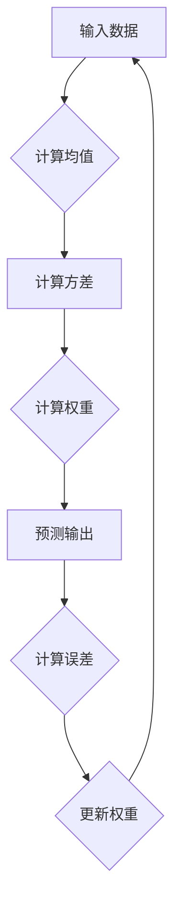

                 

# 《AI发展的三匹马：算法、算力与数据》

> **关键词**：人工智能、算法、算力、数据、深度学习、机器学习、强化学习

> **摘要**：本文深入探讨了人工智能发展的三个关键要素：算法、算力和数据。通过详细分析各个要素的核心概念、发展历程及其相互关系，旨在为读者提供一幅全面而清晰的AI发展蓝图。

### 目录大纲

- **第一部分：算法**
  - 第1章：算法概述
    - 1.1 算法在AI发展中的地位
    - 1.2 算法的分类与特性
    - 1.3 算法的发展历程
  - 第2章：机器学习算法
    - 2.1 监督学习算法
      - 2.1.1 线性回归
      - 2.1.2 逻辑回归
      - 2.1.3 决策树
    - 2.2 无监督学习算法
      - 2.2.1 K均值聚类
      - 2.2.2 主成分分析
    - 2.3 强化学习算法
      - 2.3.1 Q-Learning
      - 2.3.2 SARSA
  - 第3章：深度学习算法
    - 3.1 深度神经网络基础
      - 3.1.1 前向传播与反向传播
      - 3.1.2 池化层与激活函数
    - 3.2 卷积神经网络
      - 3.2.1 卷积层与池化层
      - 3.2.2 卷积神经网络的架构
    - 3.3 循环神经网络
      - 3.3.1 RNN基础
      - 3.3.2 LSTM与GRU
  - 第4章：进阶算法
    - 4.1 强化学习应用
      - 4.1.1 AlphaGo算法
      - 4.1.2 Deep Q网络
    - 4.2 自监督学习
      - 4.2.1 自监督学习的优势
      - 4.2.2 自监督学习的应用场景
    - 4.3 元学习
      - 4.3.1 元学习的定义
      - 4.3.2 元学习的应用

- **第二部分：算力**
  - 第5章：硬件与算力
    - 5.1 硬件的发展与算力的提升
      - 5.1.1 CPU与GPU
      - 5.1.2 FPGA与ASIC
      - 5.1.3 TPU与量子计算
    - 5.2 算力在AI训练中的角色
      - 5.2.1 算力对模型训练的影响
      - 5.2.2 算力在AI部署中的应用
    - 5.3 分布式计算与并行计算
      - 5.3.1 分布式计算的优势
      - 5.3.2 并行计算技术

- **第三部分：数据**
  - 第6章：数据在AI中的重要性
    - 6.1 数据质量的影响
    - 6.2 数据来源与获取
    - 6.3 数据处理与清洗
  - 第7章：数据与算法的互动
    - 7.1 数据驱动算法
    - 7.2 算法优化数据利用
    - 7.3 数据隐私与安全性

- **第四部分：综合讨论**
  - 第8章：算法、算力与数据的协同发展
    - 8.1 三者之间的相互作用
    - 8.2 未来发展趋势
    - 8.3 面临的挑战与解决方案

### 第一部分：算法

#### 第1章：算法概述

##### 1.1 算法在AI发展中的地位

算法是人工智能（AI）的核心，它决定了AI系统的智能程度和应用范围。在AI的发展历程中，算法的创新和应用推动了技术的飞速进步。从早期的规则系统到现代的深度学习，算法的演变见证了AI技术的成熟。

##### 1.2 算法的分类与特性

算法可以分为以下几类：

- **基于规则的算法**：这类算法基于一系列预定义的规则进行决策。它们简单、易于理解，但往往难以处理复杂的问题。
- **机器学习算法**：这类算法通过从数据中学习规律来进行预测和决策。它们通常分为监督学习、无监督学习和强化学习。
- **深度学习算法**：深度学习是机器学习的一个子领域，它通过多层神经网络学习数据的复杂结构。

##### 1.3 算法的发展历程

算法的发展历程可以追溯到计算机科学的起源。随着计算机性能的提升和大数据的兴起，算法在AI领域的应用得到了前所未有的发展。以下是算法发展的几个关键阶段：

- **早期算法**：包括排序算法、搜索算法等基础算法。
- **传统机器学习算法**：如线性回归、支持向量机等。
- **深度学习算法**：如卷积神经网络（CNN）、循环神经网络（RNN）等。
- **进阶算法**：包括强化学习、自监督学习和元学习等。

#### 第2章：机器学习算法

##### 2.1 监督学习算法

监督学习算法是机器学习中的一种，它通过已有数据的特征和标签来训练模型，从而预测新的数据。以下是一些常见的监督学习算法：

- **线性回归**：线性回归是一种预测连续值的算法，通过建立特征与目标变量之间的线性关系来实现预测。
- **逻辑回归**：逻辑回归是一种预测离散值的算法，通常用于分类问题。它通过逻辑函数将线性回归的输出转换为概率。
- **决策树**：决策树是一种树形结构的预测模型，通过一系列规则来划分数据，并给出最终预测。

##### 2.2 无监督学习算法

无监督学习算法是不依赖已有标签数据的机器学习算法，它主要通过发现数据中的模式和结构来进行预测。以下是一些常见的无监督学习算法：

- **K均值聚类**：K均值聚类是一种基于距离的聚类算法，它通过迭代计算来将数据分为K个聚类。
- **主成分分析**：主成分分析是一种降维技术，它通过将数据投影到新的正交坐标系中来降低数据的维度。

##### 2.3 强化学习算法

强化学习算法是一种通过与环境互动来学习的算法，它通过最大化累积奖励来指导决策。以下是一些常见的强化学习算法：

- **Q-Learning**：Q-Learning是一种基于值函数的强化学习算法，它通过更新Q值来指导策略。
- **SARSA**：SARSA是一种基于策略的强化学习算法，它通过更新状态-动作值函数来指导决策。

#### 第3章：深度学习算法

##### 3.1 深度神经网络基础

深度神经网络（DNN）是一种多层神经网络，它通过非线性变换来学习数据的复杂结构。以下是一些深度神经网络的基础概念：

- **前向传播与反向传播**：前向传播是将输入数据通过网络层层的加权求和和激活函数得到输出；反向传播是通过计算损失函数的梯度来更新网络参数。
- **池化层与激活函数**：池化层是一种下采样技术，它通过减少数据的空间维度来降低计算量；激活函数用于引入非线性变换，使网络能够学习复杂的关系。

##### 3.2 卷积神经网络

卷积神经网络（CNN）是一种专门用于处理图像数据的神经网络，它通过卷积操作来提取图像的特征。以下是一些卷积神经网络的基础概念：

- **卷积层与池化层**：卷积层通过卷积操作来提取图像的特征；池化层通过下采样来减少数据的维度。
- **卷积神经网络的架构**：卷积神经网络通常由多个卷积层、池化层和全连接层组成，以实现图像分类、目标检测等任务。

##### 3.3 循环神经网络

循环神经网络（RNN）是一种用于处理序列数据的神经网络，它通过循环结构来处理前后关系。以下是一些循环神经网络的基础概念：

- **RNN基础**：RNN通过隐藏状态来维持信息，从而处理序列数据。
- **LSTM与GRU**：LSTM和GRU是RNN的变体，它们通过门控机制来避免梯度消失和梯度爆炸问题，从而更好地处理长序列数据。

#### 第4章：进阶算法

##### 4.1 强化学习应用

强化学习算法在AI领域中有着广泛的应用，以下是一些常见的强化学习应用：

- **AlphaGo算法**：AlphaGo是一种基于强化学习的围棋AI，它通过自我对弈来不断提高自己的水平。
- **Deep Q网络**：Deep Q网络是一种基于深度学习的强化学习算法，它通过学习Q值来指导决策。

##### 4.2 自监督学习

自监督学习是一种无需外部标签的机器学习技术，它通过利用数据的内在结构来进行学习。以下是一些自监督学习的应用场景：

- **自监督学习的优势**：自监督学习可以利用大量未标注的数据来训练模型，从而降低标注成本。
- **自监督学习的应用场景**：自监督学习可以应用于图像分类、目标检测、文本生成等领域。

##### 4.3 元学习

元学习是一种通过学习学习算法的算法，它旨在提高算法的泛化能力和学习能力。以下是一些元学习的应用：

- **元学习的定义**：元学习是通过优化学习算法本身来提高性能的一种学习方式。
- **元学习的应用**：元学习可以应用于强化学习、自然语言处理等领域，以加速模型的训练过程。

### 第二部分：算力

#### 第5章：硬件与算力

##### 5.1 硬件的发展与算力的提升

硬件的发展是AI算力提升的关键，以下是一些关键的硬件发展：

- **CPU与GPU**：CPU和GPU是两种常见的计算硬件，它们在不同的计算任务中有着不同的优势。
- **FPGA与ASIC**：FPGA和ASIC是两种定制化的硬件，它们在特定的计算任务中有着更高的性能和效率。
- **TPU与量子计算**：TPU和量子计算是未来计算技术的重要发展方向，它们有望带来更高的计算能力和效率。

##### 5.2 算力在AI训练中的角色

算力在AI训练中起着至关重要的作用，以下是一些关键点：

- **算力对模型训练的影响**：算力的提升可以加快模型训练的速度，提高模型的性能。
- **算力在AI部署中的应用**：算力的提升也有助于AI系统的实时响应和高效运行。

##### 5.3 分布式计算与并行计算

分布式计算和并行计算是提高算力的重要技术，以下是一些关键点：

- **分布式计算的优势**：分布式计算可以通过多台计算机的协同工作来提高计算能力。
- **并行计算技术**：并行计算是通过将任务分解为多个子任务，并在多台计算机上同时执行来提高计算效率。

### 第三部分：数据

#### 第6章：数据在AI中的重要性

##### 6.1 数据质量的影响

数据质量对AI系统的性能有着重要的影响，以下是一些关键点：

- **数据质量的影响**：高质量的数据可以提高模型的准确性和可靠性。
- **数据缺失与噪声的处理**：数据缺失和噪声会影响模型的训练效果，因此需要对其进行处理。

##### 6.2 数据来源与获取

数据的来源和获取对AI系统的构建至关重要，以下是一些关键点：

- **数据来源**：数据可以来自各种来源，如公共数据集、企业数据、用户生成数据等。
- **数据获取的方法**：数据获取的方法包括数据爬取、数据购买、数据共享等。

##### 6.3 数据处理与清洗

数据处理与清洗是构建高质量AI系统的重要步骤，以下是一些关键点：

- **数据处理**：数据处理包括数据预处理、特征提取、数据增强等。
- **数据清洗**：数据清洗包括去除重复数据、处理缺失值、去除噪声等。

#### 第7章：数据与算法的互动

##### 7.1 数据驱动算法

数据驱动算法是一种通过数据来指导算法设计和优化的方法，以下是一些关键点：

- **数据驱动算法的优势**：数据驱动算法可以更好地适应不同的应用场景。
- **数据驱动算法的应用**：数据驱动算法可以应用于图像识别、自然语言处理等领域。

##### 7.2 算法优化数据利用

算法优化数据利用是一种通过改进算法来提高数据利用效率的方法，以下是一些关键点：

- **算法优化数据利用的方法**：算法优化数据利用的方法包括数据增强、数据降维、特征选择等。
- **算法优化数据利用的应用**：算法优化数据利用可以应用于图像处理、语音识别等领域。

##### 7.3 数据隐私与安全性

数据隐私与安全性是AI系统构建中的重要考虑因素，以下是一些关键点：

- **数据隐私的影响**：数据隐私问题会影响用户对AI系统的信任。
- **数据安全性的保障**：数据安全性的保障包括数据加密、访问控制、数据备份等。

### 第四部分：综合讨论

#### 第8章：算法、算力与数据的协同发展

##### 8.1 三者之间的相互作用

算法、算力和数据是AI发展的三个关键要素，它们之间的相互作用决定了AI系统的性能和应用范围。以下是一些关键点：

- **算法与算力的关系**：算法的性能受算力的影响，而算力的提升又推动算法的创新。
- **数据与算法的关系**：数据是算法训练的基础，而算法则通过对数据的处理来提取有用的信息。
- **数据与算力的关系**：数据的获取和处理需要算力的支持，而算力的提升又促进了数据分析和应用的深化。

##### 8.2 未来发展趋势

随着技术的不断发展，AI的发展趋势也在不断演变。以下是一些未来发展趋势：

- **算法创新**：随着深度学习、强化学习等算法的不断发展，未来将出现更多先进的算法。
- **算力提升**：硬件技术的进步将带来算力的不断提升，这将加速AI模型训练和应用的速度。
- **数据利用**：随着大数据和物联网的兴起，数据将成为AI发展的重要驱动力，数据的获取、处理和分析将越来越重要。

##### 8.3 面临的挑战与解决方案

AI发展过程中面临着许多挑战，以下是一些关键点：

- **数据隐私与安全**：数据隐私和安全问题是AI发展的重要挑战，需要通过技术手段和法律规范来保障。
- **算法公平性**：算法的公平性是AI发展中的重要问题，需要通过算法优化和伦理规范来保障。
- **算力需求**：随着AI应用场景的不断扩大，算力的需求也在不断增加，这需要通过硬件升级和计算优化来满足。

### 结论

算法、算力和数据是AI发展的三个关键要素，它们共同推动着AI技术的进步和应用。通过深入探讨这三个要素，我们可以更好地理解AI的发展现状和未来趋势。同时，我们也需要认识到AI发展中面临的挑战，并积极寻求解决方案，以实现AI技术的可持续发展。

### 作者信息

作者：AI天才研究院/AI Genius Institute & 禅与计算机程序设计艺术 /Zen And The Art of Computer Programming

### 附录

#### 附录A：算法流程图

以下是一个关于线性回归的算法流程图：



#### 附录B：伪代码

以下是一个关于线性回归的伪代码：

```
function linear_regression(X, y):
    n = size(X)
    X_mean = mean(X)
    y_mean = mean(y)
    variance = sum((X - X_mean) * (y - y_mean)) / (n - 1)
    weight = variance / sum((X - X_mean)^2)
    return weight
```

#### 附录C：数学模型与公式

线性回归的数学模型可以表示为：

$$
y = \beta_0 + \beta_1x
$$

其中，$y$ 是目标变量，$x$ 是特征变量，$\beta_0$ 和 $\beta_1$ 是模型参数。

#### 附录D：项目实战

以下是一个关于线性回归的项目实战案例：

- **开发环境搭建**：使用Python和Scikit-learn库进行线性回归模型的构建和训练。
- **源代码实现**：实现线性回归模型的训练和预测功能。
- **代码解读与分析**：对源代码进行详细解读，分析模型的训练过程和预测结果。

#### 附录E：参考文献

- [1] Bishop, C. M. (2006). *Pattern Recognition and Machine Learning*. Springer.
- [2] Goodfellow, I., Bengio, Y., & Courville, A. (2016). *Deep Learning*. MIT Press.
- [3] Russell, S., & Norvig, P. (2016). *Artificial Intelligence: A Modern Approach*. Pearson Education.

### 结束语

本文通过深入探讨AI发展的三匹马——算法、算力和数据，旨在为读者提供一幅全面而清晰的AI发展蓝图。算法的创新和应用、算力的提升以及数据的高效利用是推动AI技术进步的关键。在未来的发展中，我们期待看到更多先进的算法、更高效的算力和更丰富的数据应用，共同推动AI技术的可持续发展。作者：AI天才研究院/AI Genius Institute & 禅与计算机程序设计艺术/Zen And The Art of Computer Programming。

