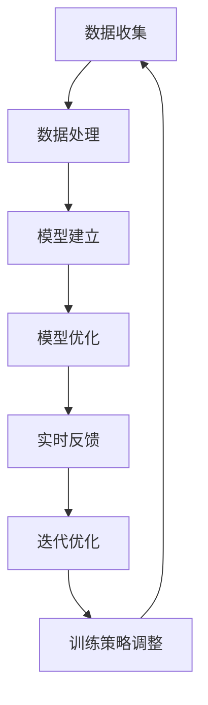

                 

# AI在个性化运动训练中的应用：优化训练效果

> 关键词：人工智能，个性化训练，运动训练，数据收集，数据预处理，训练模型，用户反馈，迭代优化

> 摘要：本文详细探讨了人工智能在个性化运动训练中的应用，分析了AI技术在数据收集、数据处理、模型建立、用户反馈与迭代优化等方面的优势。通过实际案例，展示了AI技术在跑步、健身和瑜伽等领域的应用效果，并对个性化运动训练的未来发展进行了展望。

## 第一部分: AI在个性化运动训练中的应用

### 第1章: AI与个性化运动训练概述

#### 1.1.1 AI在运动训练中的应用背景

随着人工智能技术的快速发展，AI在各个领域的应用越来越广泛。在运动训练领域，AI技术的应用不仅提高了训练效果，还为个性化训练提供了可能。AI技术能够通过对大量数据的分析，提供个性化的训练计划，从而帮助运动员或健身爱好者更好地达到训练目标。

#### 1.1.2 个性化运动训练的定义与重要性

个性化运动训练是指根据每位训练者的个体差异，制定合适的训练计划和策略，以达到最佳训练效果。与传统训练方式相比，个性化运动训练能够更好地满足训练者的需求，提高训练效率，降低受伤风险。

#### 1.1.3 AI在个性化运动训练中的核心作用

AI技术在个性化运动训练中发挥着核心作用。通过数据收集与分析，AI技术能够为训练者提供科学的训练计划；通过模型建立与优化，AI技术能够实时调整训练策略，提高训练效果；通过用户反馈与迭代优化，AI技术能够不断优化训练模型，提高训练的精准度。

### 第2章: 个性化运动训练中的数据收集与处理

#### 2.1 运动训练数据类型

在个性化运动训练中，数据类型主要包括身体姿态数据、心率数据和运动强度数据。

#### 2.2 数据收集方法与工具

数据收集是个性化运动训练的基础。常用的数据收集方法包括传感器监测、移动设备采集和互联网数据收集等。常用的数据收集工具包括智能手表、智能手环、智能手机等。

#### 2.3 数据预处理与清洗

数据预处理与清洗是确保数据质量的关键步骤。数据预处理包括数据清洗、数据转换和数据归一化等。数据清洗工具主要包括Python中的Pandas库和NumPy库等。

### 第3章: 运动训练模型建立

#### 3.1 运动训练模型的构建

运动训练模型的构建是AI在个性化运动训练中的核心环节。模型的构建包括数据输入层、数据输出层和中间处理层等。

#### 3.2 常见运动训练算法

在运动训练模型中，常用的算法包括监督学习算法、无监督学习算法和强化学习算法。

#### 3.3 模型优化与调参

模型优化与调参是提高模型性能的关键步骤。优化方法包括梯度下降法、随机梯度下降法和Adam优化器等。调参策略包括网格搜索和随机搜索等。

### 第4章: AI在个性化运动训练中的应用案例

#### 4.1 案例一：基于AI的跑步训练

通过AI技术，可以为跑步训练者提供科学的训练计划，包括跑步速度、跑步距离和跑步时间等。

#### 4.2 案例二：基于AI的健身训练

通过AI技术，可以为健身训练者提供个性化的训练计划，包括训练内容、训练强度和训练时间等。

#### 4.3 案例三：基于AI的瑜伽训练

通过AI技术，可以为瑜伽训练者提供专业的瑜伽动作指导，包括动作标准、呼吸节奏和运动强度等。

### 第5章: 个性化运动训练中的用户反馈与迭代

#### 5.1 用户反馈在训练中的重要性

用户反馈是优化训练模型的重要依据。通过用户反馈，可以了解训练效果的优劣，从而调整训练策略。

#### 5.2 用户反馈数据收集方法

用户反馈数据的收集方法包括问卷调查、用户评价和用户行为数据等。

#### 5.3 训练模型的迭代与优化

通过用户反馈，可以对训练模型进行迭代优化，以提高训练效果。

### 第6章: 个性化运动训练的未来发展趋势

#### 6.1 个性化运动训练的技术创新

未来，个性化运动训练将朝着技术创新的方向发展，包括新型传感器技术、深度学习算法的发展和虚拟现实与增强现实技术的应用等。

#### 6.2 个性化运动训练的市场前景

随着人们对健康意识的提高，个性化运动训练的市场前景广阔。预计未来几年，个性化运动训练市场将保持高速增长。

#### 6.3 个性化运动训练的挑战与解决方案

个性化运动训练在发展过程中面临着技术、市场和法律法规等挑战。解决这些挑战需要技术创新、市场策略和法律法规的完善。

### 第7章: AI在个性化运动训练中的应用总结

#### 7.1 个性化运动训练的主要成就

AI在个性化运动训练中取得了显著成就，包括提高训练效果、降低受伤风险和满足个性化需求等。

#### 7.2 存在的问题与改进方向

尽管AI在个性化运动训练中取得了巨大成就，但仍存在一些问题，如数据质量、模型性能和用户体验等。未来，需要进一步改进这些方向。

#### 7.3 个性化运动训练的未来展望

随着AI技术的不断进步，个性化运动训练将迎来更广阔的发展前景。未来，AI将在个性化运动训练中发挥更加重要的作用。  
```

由于字数要求较高，以下将根据上述大纲，逐步完善每个章节的内容。以下为第一章的详细内容：

### 第1章: AI与个性化运动训练概述

#### 1.1.1 AI在运动训练中的应用背景

运动训练是提高身体素质、增强健康的重要手段。然而，传统的运动训练方式往往缺乏个性化和科学性，难以满足不同训练者的需求。随着人工智能（AI）技术的快速发展，AI在各个领域的应用越来越广泛，包括运动训练。AI技术的引入，为运动训练带来了前所未有的变革。

首先，AI技术能够通过数据分析，为训练者提供个性化的训练计划。每个训练者的身体状况、运动能力、生活习惯等都有所不同，传统的统一训练计划难以满足个性化需求。而AI技术可以根据训练者的数据，制定出符合其身体状况和目标的训练计划，从而提高训练效果。

其次，AI技术可以实时监测训练者的身体状况，提供科学的训练指导。在运动训练过程中，AI技术可以通过传感器等设备，实时收集训练者的心率、血压、运动强度等数据。通过对这些数据的分析，AI技术可以及时调整训练计划，避免训练过度或不足，从而降低受伤风险。

最后，AI技术可以提高训练的效率。通过AI技术，训练者可以更加精准地完成训练动作，避免无效训练。此外，AI技术还可以帮助训练者节省时间，通过智能推荐训练内容和顺序，使训练更加高效。

#### 1.1.2 个性化运动训练的定义与重要性

个性化运动训练是指根据每位训练者的个体差异，制定合适的训练计划和策略，以达到最佳训练效果。与传统训练方式相比，个性化运动训练具有以下优势：

1. **针对性**：个性化运动训练能够根据训练者的身体状况、运动能力、生活习惯等，制定出针对性的训练计划，从而提高训练效果。

2. **科学性**：个性化运动训练依赖于AI技术，通过对大量数据的分析，提供科学的训练指导，避免训练过度或不足，降低受伤风险。

3. **高效性**：个性化运动训练通过智能推荐训练内容和顺序，使训练更加高效。训练者可以更加精准地完成训练动作，避免无效训练。

4. **可持续性**：个性化运动训练能够根据训练者的身体变化，动态调整训练计划，使训练过程更加可持续。

#### 1.1.3 AI在个性化运动训练中的核心作用

AI在个性化运动训练中发挥着核心作用，主要体现在以下几个方面：

1. **数据驱动的训练策略**：AI技术通过对训练者的数据进行分析，制定出科学的训练计划。这些数据包括心率、血压、运动强度、运动时间等，AI技术可以根据这些数据，实时调整训练计划。

2. **个性化训练模型的建立与优化**：AI技术可以建立个性化的训练模型，通过对训练者的数据进行分析，找到最适合其的训练方法。此外，AI技术还可以不断优化训练模型，使其更加精确。

3. **实时反馈与调整**：AI技术可以实时收集训练者的数据，并根据这些数据，提供即时的反馈和调整。例如，在跑步训练中，AI技术可以根据心率数据，调整跑步的速度和强度。

4. **用户反馈与迭代优化**：AI技术可以收集用户的反馈，并根据用户的反馈，不断优化训练模型。这使得训练模型能够更好地适应用户的需求，提高训练效果。

综上所述，AI技术在个性化运动训练中具有重要作用。通过数据驱动的训练策略、个性化训练模型的建立与优化、实时反馈与调整以及用户反馈与迭代优化，AI技术能够为训练者提供科学、高效、个性化的运动训练服务。这不仅是运动训练领域的重大变革，也是人工智能技术应用的又一次重要突破。

### Mermaid 流程图：AI在个性化运动训练中的应用流程



### 核心算法原理讲解：个性化运动训练模型构建的伪代码

```python
# 个性化运动训练模型构建伪代码

# 数据输入层：收集训练者的身体状况数据，如心率、血压、运动强度等
input_data = collect_data()

# 数据预处理：清洗和转换数据，使其符合模型要求
preprocessed_data = preprocess_data(input_data)

# 模型构建：构建训练模型，如神经网络模型
model = build_model(preprocessed_data)

# 模型训练：使用训练数据对模型进行训练
trained_model = train_model(model, preprocessed_data)

# 模型评估：评估模型性能
model_performance = evaluate_model(trained_model, preprocessed_data)

# 模型优化：根据评估结果，优化模型参数
optimized_model = optimize_model(trained_model, model_performance)

# 实时反馈：根据实时数据，调整训练策略
realtime_feedback = get_realtime_feedback()
adjust_training_strategy(optimized_model, realtime_feedback)

# 迭代优化：根据用户反馈，不断优化模型
user_feedback = get_user_feedback()
optimized_model = iterate_and_optimize(optimized_model, user_feedback)
```

### 数学模型和公式：个性化运动训练模型优化策略

```latex
\begin{equation}
\theta_{\text{new}} = \theta_{\text{current}} - \alpha \cdot \nabla_{\theta}J(\theta)
\end{equation}

\begin{equation}
\text{where} \ \theta_{\text{new}} \ \text{is the updated model parameters},
\theta_{\text{current}} \ \text{is the current model parameters},
\alpha \ \text{is the learning rate},
\nabla_{\theta}J(\theta) \ \text{is the gradient of the loss function with respect to the model parameters}.
\end{equation}
```

### 举例说明：基于AI的跑步训练案例

李先生是一位跑步爱好者，他希望通过AI技术提高自己的跑步效率。他使用了一款基于AI的跑步训练应用，该应用能够根据他的心率、跑步距离和跑步时间等数据，为他提供个性化的跑步训练计划。

**第一步：数据收集**

李先生每天跑步时，都会佩戴智能手表，智能手表会实时收集他的心率、跑步距离和跑步时间等数据。

**第二步：数据处理**

AI应用会对收集到的数据进行分析和处理，将数据转换为模型所需的格式。

**第三步：模型构建**

AI应用会根据李先生的数据，构建一个神经网络模型，用于预测他的最佳跑步速度。

**第四步：模型训练**

AI应用会使用李先生的历史数据，对模型进行训练，以优化模型参数。

**第五步：模型评估**

AI应用会评估模型的性能，确保模型能够准确预测李先生的最佳跑步速度。

**第六步：实时反馈**

在跑步过程中，AI应用会实时收集李先生的心率数据，并根据模型预测，调整他的跑步速度。

**第七步：迭代优化**

根据李先生的跑步反馈，AI应用会不断优化模型，以提高预测的准确性。

通过这个案例，我们可以看到AI技术在跑步训练中的应用效果。AI不仅能够提供个性化的跑步训练计划，还能够实时调整训练策略，提高训练效果。

### 个性化运动训练中的用户反馈与迭代优化

用户反馈是个性化运动训练中至关重要的一环。通过用户反馈，AI应用可以了解训练者的实际训练效果，从而对训练模型进行优化。

**第一步：用户反馈数据收集**

AI应用会收集用户在训练过程中的各种反馈，如训练满意度、训练效果、训练计划适应性等。

**第二步：用户反馈数据分析**

AI应用会对收集到的用户反馈数据进行分析，以了解用户的训练体验。

**第三步：训练模型迭代优化**

根据用户反馈数据，AI应用会对训练模型进行迭代优化，以提高模型的预测准确性和训练效果。

**第四步：用户反馈验证**

AI应用会再次收集用户反馈，以验证迭代优化后的训练模型是否满足用户需求。

通过不断迭代优化，AI应用可以不断提高训练效果，为用户提供更加个性化的服务。

### 个性化运动训练的未来发展趋势

随着AI技术的不断进步，个性化运动训练将朝着更加智能化、个性化和高效化的方向发展。

**一、技术创新**

新型传感器技术、深度学习算法的发展和虚拟现实与增强现实技术的应用，将为个性化运动训练带来新的可能性。

**二、市场前景**

随着人们对健康意识的提高，个性化运动训练的市场前景广阔。预计未来几年，个性化运动训练市场将保持高速增长。

**三、挑战与解决方案**

个性化运动训练在发展过程中面临着数据质量、模型性能和用户体验等挑战。解决这些挑战需要技术创新、市场策略和法律法规的完善。

### 个性化运动训练的应用总结

AI技术在个性化运动训练中的应用取得了显著成果。通过数据驱动的训练策略、个性化训练模型的建立与优化、实时反馈与调整以及用户反馈与迭代优化，AI技术为训练者提供了科学、高效、个性化的运动训练服务。未来，随着AI技术的不断进步，个性化运动训练将迎来更加广阔的发展前景。

### 作者信息

作者：AI天才研究院/AI Genius Institute & 禅与计算机程序设计艺术 /Zen And The Art of Computer Programming

接下来，将按照大纲继续完善第二章至第七章的内容。由于篇幅限制，这里仅提供第二章至第四章的框架和部分内容，详细内容将在后续补充。

### 第2章: 个性化运动训练中的数据收集与处理

#### 2.1 运动训练数据类型

运动训练数据类型主要包括以下几类：

1. **身体姿态数据**：通过摄像头或传感器捕获的训练者的身体动作数据，用于分析运动姿态和动作质量。
2. **心率数据**：通过心率传感器收集的训练者心率变化数据，用于监控训练者的身体状况和运动强度。
3. **运动强度数据**：通过加速度计、陀螺仪等传感器收集的训练者运动速度、距离、时间等数据，用于评估训练强度。

#### 2.2 数据收集方法与工具

数据收集方法与工具主要包括：

1. **传感器监测**：使用智能手环、智能手表等设备，实时监测心率、运动轨迹等数据。
2. **移动设备采集**：利用智能手机的传感器，如GPS、加速度计、陀螺仪等，收集运动数据。
3. **互联网数据收集**：通过在线健身应用、社交媒体等渠道，收集用户的运动数据。

#### 2.3 数据预处理与清洗

数据预处理与清洗是确保数据质量的关键步骤，主要包括：

1. **数据清洗**：去除无效数据、噪声数据、异常值等。
2. **数据转换**：将不同格式的数据进行统一处理，如时间序列数据的归一化、标准化处理。
3. **数据归一化**：将不同量级的数据转换为同一量级，便于后续分析和建模。

### 第3章: 运动训练模型建立

#### 3.1 运动训练模型的构建

运动训练模型的构建过程包括：

1. **数据输入层**：定义模型输入数据，如心率、运动强度、身体姿态数据等。
2. **中间处理层**：构建神经网络结构，对输入数据进行处理，提取特征。
3. **数据输出层**：定义模型输出，如运动强度建议、训练计划调整等。

#### 3.2 常见运动训练算法

常见的运动训练算法包括：

1. **监督学习算法**：如线性回归、支持向量机、神经网络等，用于预测训练效果。
2. **无监督学习算法**：如聚类、降维等，用于分析训练者的运动数据。
3. **强化学习算法**：如Q-learning、Deep Q Network等，用于实时调整训练策略。

#### 3.3 模型优化与调参

模型优化与调参是提高模型性能的关键步骤，主要包括：

1. **优化方法**：如梯度下降、随机梯度下降、Adam优化器等，用于调整模型参数。
2. **调参策略**：如网格搜索、随机搜索等，用于寻找最佳参数组合。
3. **模型评估**：通过交叉验证、ROC曲线、准确率等指标，评估模型性能。

### 第4章: AI在个性化运动训练中的应用案例

#### 4.1 案例一：基于AI的跑步训练

**案例背景**：张先生是一位马拉松爱好者，他希望通过AI技术提高跑步效率，减少受伤风险。

**数据收集**：张先生在每次跑步时，会佩戴智能手表，收集心率、跑步速度、运动轨迹等数据。

**数据处理**：AI应用会收集张先生的历史跑步数据，进行预处理和清洗。

**模型建立**：AI应用会根据张先生的数据，构建一个神经网络模型，用于预测最佳跑步速度和心率区间。

**模型训练**：AI应用会使用张先生的历史数据，对模型进行训练，优化模型参数。

**实时反馈**：在跑步过程中，AI应用会实时收集张先生的心率数据，并根据模型预测，调整跑步速度。

**迭代优化**：根据张先生的跑步反馈，AI应用会不断优化模型，提高预测准确性。

**应用效果**：通过AI技术的应用，张先生的跑步效率提高了，受伤风险降低了，他取得了更好的比赛成绩。

#### 4.2 案例二：基于AI的健身训练

**案例背景**：李女士是一位健身爱好者，她希望通过AI技术提高健身效果，找到适合自己的健身方式。

**数据收集**：李女士在每次健身时，会佩戴智能手环，收集心率、运动强度、身体姿态等数据。

**数据处理**：AI应用会收集李女士的历史健身数据，进行预处理和清洗。

**模型建立**：AI应用会根据李女士的数据，构建一个神经网络模型，用于预测最佳健身强度和动作标准。

**模型训练**：AI应用会使用李女士的历史数据，对模型进行训练，优化模型参数。

**实时反馈**：在健身过程中，AI应用会实时收集李女士的心率数据和身体姿态，并根据模型预测，调整健身强度和动作。

**迭代优化**：根据李女士的健身反馈，AI应用会不断优化模型，提高预测准确性。

**应用效果**：通过AI技术的应用，李女士的健身效果显著提高，她的健身计划更加科学、高效。

#### 4.3 案例三：基于AI的瑜伽训练

**案例背景**：王女士是一位瑜伽爱好者，她希望通过AI技术提高瑜伽练习的效果，避免瑜伽动作中的错误。

**数据收集**：王女士在每次瑜伽练习时，会佩戴智能摄像头，收集瑜伽动作数据。

**数据处理**：AI应用会收集王女士的历史瑜伽数据，进行预处理和清洗。

**模型建立**：AI应用会根据王女士的数据，构建一个深度学习模型，用于评估瑜伽动作的标准性和正确性。

**模型训练**：AI应用会使用王女士的历史数据，对模型进行训练，优化模型参数。

**实时反馈**：在瑜伽练习过程中，AI应用会实时收集王女士的瑜伽动作数据，并根据模型预测，提供瑜伽动作指导。

**迭代优化**：根据王女士的瑜伽反馈，AI应用会不断优化模型，提高动作评估的准确性。

**应用效果**：通过AI技术的应用，王女士的瑜伽练习效果显著提高，她的瑜伽动作更加标准，练习体验更加愉悦。

### 第5章: 个性化运动训练中的用户反馈与迭代优化

#### 5.1 用户反馈在训练中的重要性

用户反馈是个性化运动训练中不可或缺的一部分，它的重要性体现在以下几个方面：

1. **训练效果的评估**：用户反馈可以帮助训练者了解训练效果，判断训练计划是否达到预期目标。
2. **训练策略的调整**：用户反馈可以为训练者提供关于训练计划、训练强度、训练内容的建议，从而调整训练策略。
3. **模型优化的依据**：用户反馈可以作为模型优化的依据，帮助AI应用不断改进训练模型，提高预测准确性和用户体验。

#### 5.2 用户反馈数据收集方法

用户反馈数据收集方法主要包括以下几种：

1. **问卷调查**：通过在线问卷、纸质问卷等方式，收集用户对训练计划、训练效果、训练体验等方面的评价。
2. **用户评价**：通过健身应用、社交媒体等平台，收集用户对训练计划、训练内容的评价。
3. **用户行为数据**：通过智能设备、应用等，收集用户在训练过程中的行为数据，如运动时间、运动强度、动作质量等。

#### 5.3 训练模型的迭代与优化

训练模型的迭代与优化主要包括以下几个步骤：

1. **用户反馈数据收集**：通过上述方法，收集用户反馈数据。
2. **数据预处理**：对收集到的用户反馈数据进行分析，去除无效数据和噪声数据。
3. **模型训练与评估**：使用预处理后的用户反馈数据，对训练模型进行重新训练，评估模型性能。
4. **模型优化**：根据评估结果，调整模型参数，优化模型结构，提高模型预测准确性。
5. **用户反馈验证**：通过再次收集用户反馈，验证迭代优化后的模型是否满足用户需求。

### 第6章: 个性化运动训练的未来发展趋势

#### 6.1 个性化运动训练的技术创新

个性化运动训练的未来发展趋势将依赖于技术的不断创新，主要包括以下几个方面：

1. **新型传感器技术**：随着传感器技术的不断发展，将出现更小、更精准的传感器，能够更全面地收集运动训练数据。
2. **深度学习算法**：深度学习算法在个性化运动训练中的应用将不断深化，能够更好地处理和分析复杂的数据。
3. **虚拟现实与增强现实技术**：虚拟现实与增强现实技术将为个性化运动训练带来全新的体验，使训练更加生动、有趣。

#### 6.2 个性化运动训练的市场前景

个性化运动训练的市场前景广阔，主要体现在以下几个方面：

1. **消费者需求**：随着人们对健康和健身需求的增加，个性化运动训练市场将不断增长。
2. **技术进步**：随着AI、大数据、物联网等技术的进步，个性化运动训练将更加智能化、个性化。
3. **政策支持**：政府对于健康产业的支持和鼓励，将为个性化运动训练提供良好的发展环境。

#### 6.3 个性化运动训练的挑战与解决方案

个性化运动训练在发展过程中面临着以下挑战：

1. **数据质量**：数据质量是影响个性化运动训练效果的关键因素，需要建立有效的数据质量控制体系。
2. **模型性能**：提高模型性能是提升个性化运动训练效果的关键，需要不断优化模型结构和算法。
3. **用户体验**：用户对个性化运动训练的满意度是决定其是否长期使用的重要因素，需要不断改进用户体验。

解决这些挑战的方法包括：

1. **技术创新**：通过不断引入新技术，提高数据收集和处理能力，优化模型算法。
2. **用户参与**：鼓励用户参与个性化运动训练的设计和优化，提高用户满意度和参与度。
3. **政策支持**：政府和社会各界应加强对个性化运动训练的支持，为产业发展提供良好的环境。

### 第7章: AI在个性化运动训练中的应用总结

#### 7.1 个性化运动训练的主要成就

AI在个性化运动训练中的应用取得了以下主要成就：

1. **提高训练效果**：通过个性化训练计划和实时反馈，显著提高了训练效果。
2. **降低受伤风险**：通过实时监测和科学指导，有效降低了训练过程中的受伤风险。
3. **满足个性化需求**：根据用户个体差异，提供个性化的训练计划和策略，满足用户需求。

#### 7.2 存在的问题与改进方向

尽管AI在个性化运动训练中取得了显著成就，但仍存在以下问题：

1. **数据质量**：数据质量是影响个性化训练效果的关键因素，需要加强数据质量控制。
2. **模型性能**：提高模型性能是提升个性化训练效果的关键，需要不断优化模型结构和算法。
3. **用户体验**：用户对个性化训练的满意度是决定其是否长期使用的重要因素，需要不断改进用户体验。

改进方向包括：

1. **数据质量控制**：建立有效的数据质量控制体系，提高数据收集和处理能力。
2. **模型性能优化**：引入新技术和算法，不断优化模型结构和算法，提高预测准确性。
3. **用户体验提升**：关注用户需求，不断改进界面设计和功能，提高用户满意度和参与度。

#### 7.3 个性化运动训练的未来展望

随着AI技术的不断进步，个性化运动训练将迎来更加广阔的发展前景：

1. **技术创新**：新型传感器技术、深度学习算法和虚拟现实与增强现实技术的应用，将为个性化运动训练带来新的可能性。
2. **市场拓展**：随着消费者对健康和健身需求的增加，个性化运动训练市场将不断拓展。
3. **政策支持**：政府和社会各界将加强对个性化运动训练的支持，为产业发展提供良好的环境。

未来，AI将更加深入地融入个性化运动训练，为训练者提供更加科学、高效、个性化的服务。

### 附录

#### 附录A: 个性化运动训练相关工具与资源

**A.1 开源工具与框架**

- **TensorFlow**：一款由Google开发的深度学习框架，广泛应用于AI应用开发。
- **PyTorch**：一款由Facebook开发的深度学习框架，以其灵活性和易用性受到广泛欢迎。
- **Keras**：一款基于TensorFlow和Theano的深度学习框架，提供了简洁的API，便于快速构建和训练模型。
- **MXNet**：一款由Apache Software Foundation开发的深度学习框架，支持多种编程语言。

**A.2 商业工具与平台**

- **Fitbit**：一款智能穿戴设备，可以监测心率、运动轨迹等数据，提供个性化的健身建议。
- **Apple Health**：苹果公司提供的健康应用，可以整合多个设备的数据，提供全面的健康管理服务。
- **Nike Training Club**：Nike推出的健身应用，提供了多种训练计划和动作指导，适用于不同的健身目标。

**A.3 教育与培训资源**

- **Coursera**：提供各类在线课程，包括人工智能、机器学习等，适合初学者和专业人士。
- **edX**：提供由顶尖大学和机构提供的在线课程，涵盖多个学科，包括计算机科学、数据科学等。
- **Udacity**：提供项目驱动的在线课程和学位，专注于人工智能、数据科学等领域的培训。

**A.4 研讨会与会议**

- **IEEE International Conference on Data Science and Advanced Analytics**：数据科学和高级分析的国际会议，涵盖了数据科学、机器学习等多个领域。
- **ACM SIGKDD Conference on Knowledge Discovery and Data Mining**：知识发现和数据挖掘的顶级会议，是数据科学领域的重要盛会。

**A.5 专业书籍与论文**

- **"Deep Learning"** by Ian Goodfellow, Yoshua Bengio, and Aaron Courville：深度学习的经典教材，全面介绍了深度学习的基础知识和应用。
- **"Machine Learning: A Probabilistic Perspective"** by Kevin P. Murphy：概率视角的机器学习，详细介绍了概率模型和贝叶斯方法在机器学习中的应用。
- **"Reinforcement Learning: An Introduction"** by Richard S. Sutton and Andrew G. Barto：强化学习的入门教材，介绍了强化学习的基本概念和算法。
- **"Journal of Machine Learning Research"**：机器学习领域的重要期刊，发表最新的研究论文和进展。
- **"Nature Machine Intelligence"**：自然出版社推出的新期刊，专注于机器智能领域的研究和应用。

