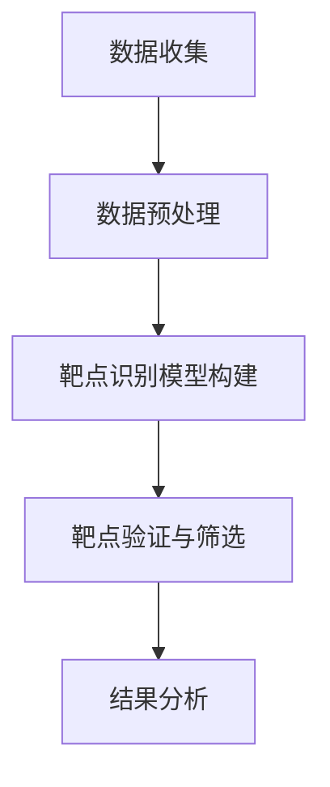
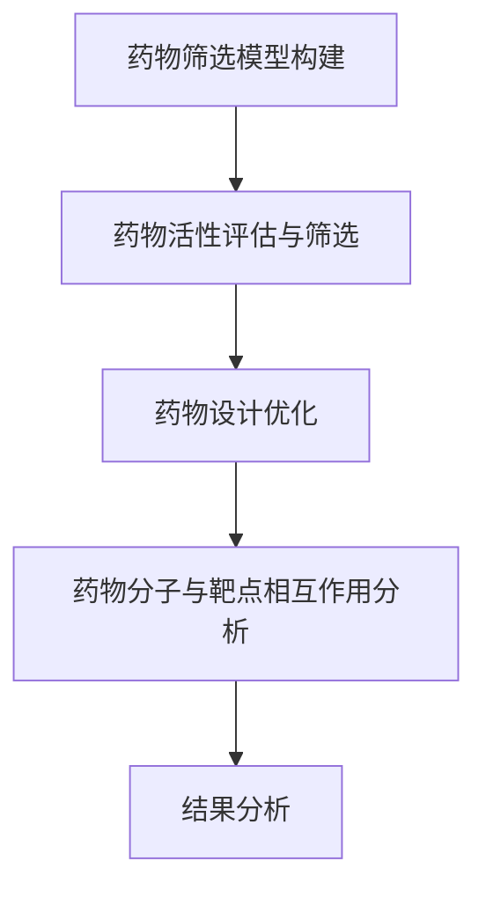
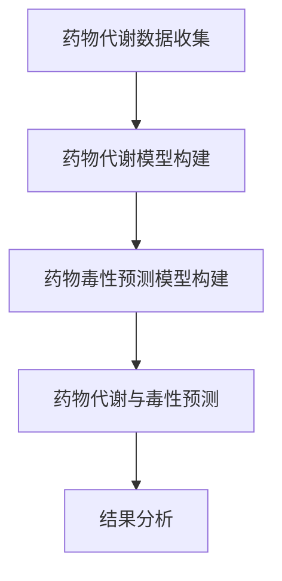
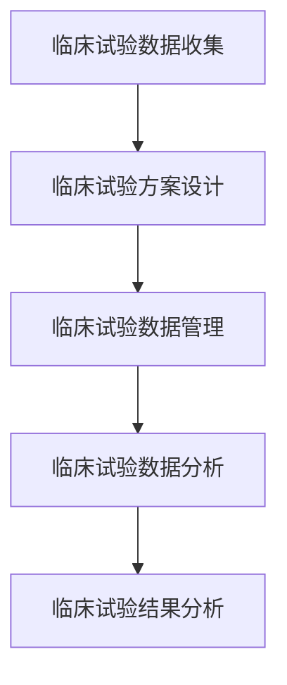
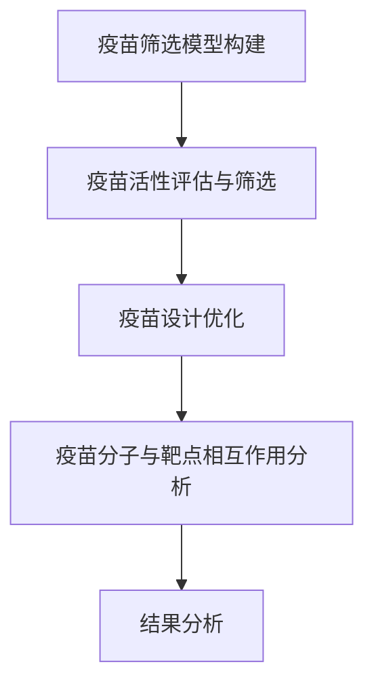
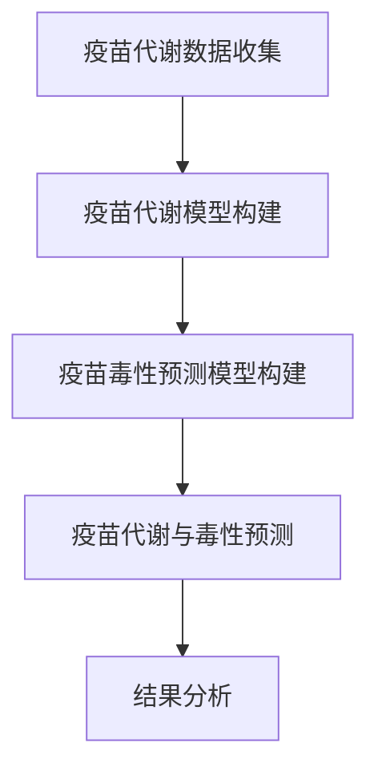

                 

# AI在新药研发中的应用：从靶点发现到临床试验

关键词：AI、新药研发、靶点发现、药物筛选、药物设计、药物代谢、毒性预测、临床试验设计

摘要：
新药研发是一个复杂而耗时的过程，涉及多个环节，包括靶点发现、药物筛选、药物设计、药物代谢和毒性预测，以及临床试验设计等。随着人工智能（AI）技术的快速发展，AI在各个新药研发环节中的应用越来越广泛，显著提高了研发效率和准确性。本文将从靶点发现到临床试验，系统地探讨AI在新药研发中的应用，分析其核心概念、算法原理、项目案例，以及未来的发展趋势。

## 第一部分: AI在新药研发中的基本概念

### 第1章: AI在新药研发中的概述

#### 1.1 AI与新药研发的关系

##### 1.1.1 AI技术的快速发展

AI技术的发展始于上世纪五六十年代，早期主要关注于符号推理和规则系统。随着计算能力的提升和大数据的兴起，深度学习、强化学习等新兴算法逐渐成为主流，AI技术的应用领域也不断拓展。在医疗领域，AI技术被广泛应用于图像诊断、个性化治疗、疾病预测等方面。在新药研发领域，AI技术正以其独特的优势改变传统的研发模式。

##### 1.1.2 AI在新药研发中的关键作用

AI在新药研发中具有以下关键作用：

1. **靶点发现**：通过分析基因表达、蛋白质结构等信息，AI可以帮助科学家快速定位潜在药物靶点，提高研发效率。
2. **药物筛选**：利用大规模化合物库和AI算法，AI可以在数小时内筛选出具有潜在药物活性的化合物，大大缩短筛选时间。
3. **药物设计**：AI可以通过优化药物分子结构，提高药物的选择性和生物利用度，降低副作用。
4. **药物代谢和毒性预测**：AI可以预测药物在人体内的代谢路径和毒性反应，为药物研发提供重要依据。
5. **临床试验设计**：AI可以帮助设计更有效的临床试验方案，提高临床试验的成功率。

##### 1.1.3 AI在新药研发中的挑战与机遇

尽管AI在新药研发中具有巨大潜力，但仍然面临一些挑战：

1. **数据质量和数据隐私**：新药研发需要大量的高质量数据，但数据隐私问题也是一个亟待解决的难题。
2. **模型可解释性**：深度学习等算法具有强大的预测能力，但其内部机制往往难以解释，这对药物研发的监管和临床应用提出了挑战。
3. **算法的通用性和定制化**：针对不同疾病和新药研发需求，需要开发具有通用性和定制化的AI算法。

然而，随着AI技术的不断进步和跨学科合作的深化，AI在新药研发中的应用将面临更多机遇。

#### 1.2 AI在新药研发中的应用领域

##### 1.2.1 靶点发现

靶点发现是新药研发的重要环节，AI技术可以显著提高靶点识别的准确性和效率。以下是一些常用的AI算法和数学模型：

1. **支持向量机（SVM）**：SVM是一种监督学习算法，可以用于分类和回归任务。在靶点发现中，SVM可以用于区分疾病相关基因和正常基因。
2. **随机森林（Random Forest）**：随机森林是一种集成学习算法，可以处理大量特征和样本。在靶点发现中，随机森林可以用于构建基因表达和蛋白质结构之间的复杂关系。
3. **深度学习模型**：深度学习模型，如卷积神经网络（CNN）和循环神经网络（RNN），可以用于处理大规模复杂数据。在靶点发现中，深度学习模型可以用于识别蛋白质结构中的关键特征。

##### 1.2.2 药物筛选

药物筛选是另一个关键环节，AI技术可以显著提高筛选效率和准确性。以下是一些常用的AI算法和数学模型：

1. **协同过滤（Collaborative Filtering）**：协同过滤是一种无监督学习算法，可以用于推荐系统。在药物筛选中，协同过滤可以用于推荐具有相似结构的化合物。
2. **图神经网络（Graph Neural Networks）**：图神经网络是一种用于处理图结构数据的深度学习模型。在药物筛选中，图神经网络可以用于预测化合物和靶点之间的相互作用。
3. **深度学习模型**：深度学习模型，如生成对抗网络（GAN）和变分自编码器（VAE），可以用于生成具有特定结构的化合物。

##### 1.2.3 药物设计

药物设计是提高药物疗效和降低副作用的关键步骤，AI技术可以显著提高药物设计的效率和准确性。以下是一些常用的AI算法和数学模型：

1. **药物-靶点相互作用预测（DPI）**：药物-靶点相互作用预测是一种用于预测药物和靶点之间相互作用的方法。常用的DPI算法包括分子对接和机器学习模型。
2. **药物分子设计优化算法**：药物分子设计优化算法，如遗传算法、粒子群优化等，可以用于优化药物分子结构，提高药物的选择性和生物利用度。
3. **深度学习模型**：深度学习模型，如生成对抗网络（GAN）和变分自编码器（VAE），可以用于生成具有特定结构的药物分子。

##### 1.2.4 药物代谢和毒性预测

药物代谢和毒性预测是确保药物安全性的重要步骤，AI技术可以显著提高预测的准确性和效率。以下是一些常用的AI算法和数学模型：

1. **统计学习算法**：统计学习算法，如逻辑回归和支持向量机等，可以用于预测药物代谢路径和毒性反应。
2. **深度学习模型**：深度学习模型，如卷积神经网络（CNN）和循环神经网络（RNN），可以用于处理大规模复杂数据，提高预测准确性。
3. **强化学习模型**：强化学习模型可以用于模拟药物在人体内的代谢过程，提高毒性预测的准确性。

##### 1.2.5 临床试验设计

临床试验设计是确保新药安全性和有效性的关键步骤，AI技术可以显著提高临床试验设计的效果。以下是一些常用的AI算法和数学模型：

1. **临床试验样本量计算**：临床试验样本量计算是一种用于确定临床试验样本量的方法。常用的算法包括基于统计方法和基于机器学习的方法。
2. **临床试验数据分析方法**：临床试验数据分析方法，如t检验和方差分析等，可以用于评估新药的安全性和有效性。
3. **深度学习模型在临床试验数据分析中的应用**：深度学习模型可以用于处理复杂的临床试验数据，提高分析效果。

### 第2章: AI核心算法原理

#### 2.1 机器学习基本概念

##### 2.1.1 监督学习

监督学习是一种机器学习算法，其目标是学习一个输入和输出之间的映射关系。在监督学习中，训练数据集包括输入和对应的输出，模型通过学习这些数据，预测新的输入对应的输出。以下是一个简单的监督学习算法——线性回归的伪代码：

```python
# 线性回归伪代码
def linear_regression(X, y):
    # 计算权重向量w
    w = X.T.dot(X).dot(inv(X.T.dot(X))).dot(X.T).dot(y)
    # 预测输出
    y_pred = X.dot(w)
    return y_pred
```

##### 2.1.2 无监督学习

无监督学习是一种机器学习算法，其目标是发现数据中的结构和模式。在无监督学习中，训练数据集没有对应的输出，模型通过学习数据自身的结构，生成新的数据表示。以下是一个简单的无监督学习算法——k-均值聚类的伪代码：

```python
# k-均值聚类伪代码
def k_means(data, k):
    # 随机初始化k个聚类中心
    centroids = random_init_centroids(data, k)
    while not converged:
        # 分配数据到最近的聚类中心
        assignments = assign_data_to_centroids(data, centroids)
        # 更新聚类中心
        centroids = update_centroids(data, assignments, k)
    return centroids
```

##### 2.1.3 强化学习

强化学习是一种机器学习算法，其目标是学习一个策略，使得代理在环境中获得最大化的累积奖励。在强化学习中，代理通过观察环境状态、采取行动、获得奖励，不断更新策略。以下是一个简单的强化学习算法——Q学习的伪代码：

```python
# Q学习伪代码
def q_learning(states, actions, rewards, learning_rate, discount_factor):
    for state in states:
        for action in actions:
            # 计算当前行动的Q值
            q_value = reward + discount_factor * max(Q[state, :])
            # 更新Q值
            Q[state, action] = Q[state, action] + learning_rate * (q_value - Q[state, action])
    return Q
```

#### 2.2 深度学习基础

##### 2.2.1 神经网络结构

神经网络是一种模拟生物神经系统的计算模型，由多个神经元组成。每个神经元接收输入信号，通过权重和偏置进行加权求和，再通过激活函数输出结果。以下是一个简单的神经网络结构的伪代码：

```python
# 神经网络结构伪代码
class NeuralNetwork:
    def __init__(self, layers):
        self.layers = layers
        self.weights = [random_weights(layer_size[i], layer_size[i-1]) for i in range(1, len(layers))]
        self.biases = [random_biases(layer_size[i]) for i in range(len(layers))]

    def forward(self, x):
        for i in range(len(layers) - 1):
            x = sigmoid(self.weights[i].dot(x) + self.biases[i])
        return x

# 激活函数
def sigmoid(x):
    return 1 / (1 + exp(-x))
```

##### 2.2.2 深度学习框架（如TensorFlow、PyTorch等）

深度学习框架是用于实现和训练深度学习模型的软件库。常见的深度学习框架包括TensorFlow、PyTorch和Keras等。以下是一个简单的TensorFlow示例：

```python
# TensorFlow示例
import tensorflow as tf

# 定义输入层
inputs = tf.placeholder(tf.float32, [None, input_size])

# 定义权重和偏置
weights = tf.Variable(tf.random_normal([input_size, output_size]))
biases = tf.Variable(tf.random_normal([output_size]))

# 定义激活函数
激活函数 = tf.nn.sigmoid

# 定义输出层
outputs =激活函数(tf.matmul(inputs, weights) + biases)

# 定义损失函数
loss = tf.reduce_mean(tf.nn.softmax_cross_entropy_with_logits(logits=outputs, labels=labels))

# 定义优化器
optimizer = tf.train.AdamOptimizer(learning_rate=0.001)

# 定义训练过程
train_op = optimizer.minimize(loss)

# 初始化全局变量
init = tf.global_variables_initializer()

# 搭建计算图
with tf.Session() as sess:
    sess.run(init)
    
    # 训练模型
    for epoch in range(num_epochs):
        _, loss_val = sess.run([train_op, loss], feed_dict={inputs: X, labels: y})
        
        # 计算准确率
        predicted = sess.run(outputs, feed_dict={inputs: X})
        correct = tf.equal(tf.argmax(predicted, 1), tf.argmax(labels, 1))
        accuracy = tf.reduce_mean(tf.cast(correct, tf.float32))
        
        print("Epoch:", epoch+1, "Accuracy:", accuracy.eval({inputs: X, labels: y}))
```

#### 2.3 强化学习原理与伪代码

##### 2.3.1 强化学习基本概念

强化学习是一种通过学习奖励和惩罚来优化行为策略的机器学习算法。在强化学习中，代理（agent）通过与环境的交互，学习最大化累积奖励。以下是一个简单的强化学习算法——Q学习的伪代码：

```python
# Q学习伪代码
Q = np.zeros([state_space_size, action_space_size])
learning_rate = 0.1
discount_factor = 0.9

for episode in range(num_episodes):
    state = env.reset()
    done = False
    total_reward = 0
    
    while not done:
        action = np.argmax(Q[state, :])
        next_state, reward, done, _ = env.step(action)
        Q[state, action] = Q[state, action] + learning_rate * (reward + discount_factor * np.max(Q[next_state, :]) - Q[state, action])
        state = next_state
        total_reward += reward
        
    print("Episode:", episode+1, "Total Reward:", total_reward)
```

##### 2.3.2 Q学习算法

Q学习是一种基于值函数的强化学习算法，其目标是学习一个最优策略。在Q学习中，代理通过不断更新Q值，逐渐优化策略。以下是一个简单的Q学习算法的伪代码：

```python
# Q学习伪代码
Q = np.zeros([state_space_size, action_space_size])
learning_rate = 0.1
discount_factor = 0.9

for episode in range(num_episodes):
    state = env.reset()
    done = False
    total_reward = 0
    
    while not done:
        action = np.argmax(Q[state, :])
        next_state, reward, done, _ = env.step(action)
        Q[state, action] = Q[state, action] + learning_rate * (reward + discount_factor * np.max(Q[next_state, :]) - Q[state, action])
        state = next_state
        total_reward += reward
        
    print("Episode:", episode+1, "Total Reward:", total_reward)
```

##### 2.3.3 Deep Q Network (DQN) 伪代码

DQN是一种基于深度学习的强化学习算法，其目标是学习一个最优策略。在DQN中，代理通过神经网络来估计Q值，并通过经验回放和目标网络来提高学习效果。以下是一个简单的DQN算法的伪代码：

```python
# DQN伪代码
class DQN:
    def __init__(self, state_space_size, action_space_size, learning_rate, discount_factor, epsilon):
        self.state_space_size = state_space_size
        self.action_space_size = action_space_size
        self.learning_rate = learning_rate
        self.discount_factor = discount_factor
        self.epsilon = epsilon
        
        self.model = build_model()
        self.target_model = build_model()
        self.optimizer = Adam(learning_rate)
        
    def build_model(self):
        model = Sequential()
        model.add(Dense(64, input_shape=(self.state_space_size,), activation='relu'))
        model.add(Dense(64, activation='relu'))
        model.add(Dense(self.action_space_size, activation='linear'))
        model.compile(loss='mse', optimizer=self.optimizer)
        return model
    
    def update_target_model(self):
        self.target_model.set_weights(self.model.get_weights())
    
    def act(self, state):
        if random() < self.epsilon:
            action = random_action()
        else:
            action = np.argmax(self.model.predict(state))
        return action
    
    def train(self, state, action, reward, next_state, done):
        target = self.model.predict(state)
        if done:
            target[0, action] = reward
        else:
            target[0, action] = reward + self.discount_factor * np.max(self.target_model.predict(next_state))
        self.model.fit(state, target, epochs=1, verbose=0)
```

##### 2.4 自然语言处理技术

自然语言处理（NLP）是人工智能的重要分支，其目标是使计算机能够理解、生成和翻译自然语言。以下是一些常用的NLP技术：

##### 2.4.1 词嵌入

词嵌入是一种将词语映射到高维空间的技术，使相似词语在空间中更接近。以下是一个简单的词嵌入算法——Word2Vec的伪代码：

```python
# Word2Vec伪代码
class Word2Vec:
    def __init__(self, vocab_size, embedding_dim, learning_rate, window_size):
        self.vocab_size = vocab_size
        self.embedding_dim = embedding_dim
        self.learning_rate = learning_rate
        self.window_size = window_size
        
        self嵌入层 = Embedding(vocab_size, embedding_dim)
        self输出层 = Dense(vocab_size, activation='softmax')
        self模型 = Model(inputs=self嵌入层.input, outputs=self输出层(self嵌入层.output))
        self模型.compile(optimizer='adam', loss='categorical_crossentropy')

    def train(self, sentences):
        for sentence in sentences:
            labels = [1 if word == target_word else 0 for word in sentence]
            self模型.fit(sentence, labels, epochs=1, batch_size=32)

    def embed(self, word):
        return self嵌入层.embed(word)
```

##### 2.4.2 序列模型

序列模型是一种用于处理序列数据的机器学习模型，如循环神经网络（RNN）和长短期记忆网络（LSTM）。以下是一个简单的RNN模型——LSTM的伪代码：

```python
# LSTM伪代码
class LSTM:
    def __init__(self, input_size, hidden_size, output_size):
        self.input_size = input_size
        self.hidden_size = hidden_size
        self.output_size = output_size
        
        self输入层 = Input(shape=(input_size,))
        self隐藏层 = LSTM(hidden_size)(self输入层)
        self输出层 = Dense(output_size, activation='softmax')(self隐藏层)
        self模型 = Model(inputs=self输入层, outputs=self输出层)
        self模型.compile(optimizer='adam', loss='categorical_crossentropy')

    def train(self, X, y):
        self模型.fit(X, y, epochs=10, batch_size=32)

    def predict(self, X):
        return self模型.predict(X)
```

##### 2.4.3 注意力机制

注意力机制是一种用于处理序列数据的神经网络结构，可以自动识别序列中的关键信息。以下是一个简单的注意力机制——自注意力机制的伪代码：

```python
# 自注意力机制伪代码
class SelfAttention:
    def __init__(self, input_size, hidden_size):
        self.input_size = input_size
        self.hidden_size = hidden_size
        
        self输入层 = Input(shape=(input_size,))
        self嵌入层 = Embedding(input_size, hidden_size)
        self查询层 = Dense(hidden_size, activation='tanh')(self嵌入层)
        self键值层 = Dense(hidden_size, activation='tanh')(self嵌入层)
        self值层 = Dense(hidden_size, activation='softmax')(self键值层)
        self输出层 = Dense(hidden_size, activation='tanh')(self值层)
        self模型 = Model(inputs=self输入层, outputs=self输出层)
        self模型.compile(optimizer='adam', loss='mean_squared_error')

    def train(self, X, y):
        self模型.fit(X, y, epochs=10, batch_size=32)

    def predict(self, X):
        return self模型.predict(X)
```

## 第二部分: AI在新药研发中的应用实践

### 第3章: 靶点发现

#### 3.1 靶点发现的基本流程

##### 3.1.1 数据收集与预处理

靶点发现的第一步是数据收集和预处理。数据来源包括基因表达数据、蛋白质结构数据、疾病相关数据等。数据预处理包括数据清洗、数据整合和数据标准化等步骤。以下是一个简单的数据预处理流程：

```python
# 数据预处理伪代码
def preprocess_data(data):
    # 数据清洗
    cleaned_data = clean_data(data)
    # 数据整合
    integrated_data = integrate_data(cleaned_data)
    # 数据标准化
    normalized_data = normalize_data(integrated_data)
    return normalized_data
```

##### 3.1.2 靶点识别模型构建

靶点识别模型构建是靶点发现的关键步骤。常用的模型包括支持向量机（SVM）、随机森林（Random Forest）和深度学习模型等。以下是一个简单的SVM模型构建流程：

```python
# SVM模型构建伪代码
from sklearn.svm import SVC

def build_svm_model(X_train, y_train):
    # 构建SVM模型
    svm_model = SVC(kernel='linear')
    # 训练模型
    svm_model.fit(X_train, y_train)
    return svm_model
```

##### 3.1.3 靶点验证与筛选

靶点验证和筛选是确保靶点发现结果可靠性的关键步骤。常用的验证方法包括交叉验证和ROC曲线分析等。以下是一个简单的交叉验证流程：

```python
# 交叉验证伪代码
from sklearn.model_selection import cross_val_score

def cross_validate(model, X, y, cv=5):
    # 计算交叉验证得分
    scores = cross_val_score(model, X, y, cv=cv)
    # 计算平均得分
    average_score = np.mean(scores)
    return average_score
```

#### 3.2 靶点发现算法与数学模型

##### 3.2.1 支持向量机（SVM）

支持向量机是一种常用的分类和回归算法，其目标是在特征空间中找到一个最佳的超平面，将不同类别的数据分开。以下是一个简单的SVM数学模型：

$$
\begin{aligned}
&\min\limits_{w, b} \frac{1}{2}w^Tw \\
&s.t. \ y_i(w^Tx_i + b) \geq 1
\end{aligned}
$$

其中，$w$是权重向量，$b$是偏置项，$x_i$是输入特征，$y_i$是标签。

##### 3.2.2 随机森林（Random Forest）

随机森林是一种集成学习算法，其目标是通过构建多个决策树，提高分类和回归的准确性。以下是一个简单的随机森林数学模型：

$$
\begin{aligned}
&\text{随机选择 } m \text{ 特征} \\
&\text{在选定的特征中随机划分数据集} \\
&\text{构建决策树，重复上述步骤} \\
&\text{合并所有决策树的预测结果}
\end{aligned}
$$

##### 3.2.3 深度学习模型

深度学习模型是一种基于多层神经网络的机器学习模型，其目标是通过多层非线性变换，从数据中学习特征表示。以下是一个简单的深度学习模型：

$$
\begin{aligned}
&\text{输入层} \rightarrow \text{隐藏层} \rightarrow \text{输出层} \\
&\text{隐藏层之间的变换：} \\
&z = \sigma(W_1x + b_1) \\
&\text{输出层的变换：} \\
&y = \sigma(W_2z + b_2)
\end{aligned}
$$

其中，$W_1$和$W_2$是权重矩阵，$b_1$和$b_2$是偏置项，$\sigma$是激活函数。

#### 3.3 靶点发现项目案例

##### 3.3.1 项目背景

本项目旨在利用AI技术发现治疗某种疾病的潜在药物靶点。数据来源包括基因表达数据、蛋白质结构数据和疾病相关数据等。

##### 3.3.2 数据预处理与模型训练

1. **数据预处理**：首先，对数据进行清洗、整合和标准化处理，得到预处理后的数据集。
2. **模型训练**：使用支持向量机（SVM）和深度学习模型进行模型训练。分别训练SVM模型和深度学习模型，并计算交叉验证得分。

```python
# 数据预处理
X_train, y_train = preprocess_data(data)

# 训练SVM模型
svm_model = build_svm_model(X_train, y_train)
svm_score = cross_validate(svm_model, X_train, y_train)

# 训练深度学习模型
深度学习模型 = build_deep_learning_model(X_train, y_train)
深度学习模型_score = cross_validate(深度学习模型，X_train，y_train)

# 输出交叉验证得分
print("SVM模型得分:", svm_score)
print("深度学习模型得分:", 深度学习模型_score)
```

##### 3.3.3 靶点验证与结果分析

1. **靶点验证**：使用ROC曲线和AUC值对模型进行验证，评估模型对靶点发现的准确性和可靠性。
2. **结果分析**：分析SVM模型和深度学习模型的靶点发现结果，比较两种模型在靶点发现方面的性能。

```python
# ROC曲线和AUC值计算
from sklearn.metrics import roc_curve, auc

# SVM模型ROC曲线和AUC值
fpr_svm, tpr_svm, _ = roc_curve(y_true, y_pred_svm)
auc_svm = auc(fpr_svm, tpr_svm)

# 深度学习模型ROC曲线和AUC值
fpr_deep_learning, tpr_deep_learning, _ = roc_curve(y_true, y_pred_deep_learning)
auc_deep_learning = auc(fpr_deep_learning, tpr_deep_learning)

# 输出ROC曲线和AUC值
print("SVM模型ROC曲线:", fpr_svm, tpr_svm)
print("SVM模型AUC值:", auc_svm)
print("深度学习模型ROC曲线:", fpr_deep_learning, tpr_deep_learning)
print("深度学习模型AUC值:", auc_deep_learning)

# 靶点发现结果分析
# 分析SVM模型和深度学习模型的靶点发现结果
# 比较两种模型在靶点发现方面的性能
```

## 第4章: 药物筛选

#### 4.1 药物筛选的基本流程

##### 4.1.1 数据来源与处理

药物筛选的第一步是数据收集和处理。数据来源包括化合物库、疾病相关数据、文献数据等。数据处理包括数据清洗、数据整合和数据标准化等步骤。

```python
# 数据处理伪代码
def preprocess_data(data):
    # 数据清洗
    cleaned_data = clean_data(data)
    # 数据整合
    integrated_data = integrate_data(cleaned_data)
    # 数据标准化
    normalized_data = normalize_data(integrated_data)
    return normalized_data
```

##### 4.1.2 药物筛选模型构建

药物筛选模型构建是药物筛选的关键步骤。常用的模型包括协同过滤（Collaborative Filtering）、图神经网络（Graph Neural Networks）和深度学习模型等。

```python
# 构建药物筛选模型伪代码
from sklearn.cluster import KMeans

def build_model(data):
    # 数据预处理
    processed_data = preprocess_data(data)
    # 构建模型
    model = KMeans(n_clusters=10)
    # 训练模型
    model.fit(processed_data)
    return model
```

##### 4.1.3 药物活性评估与筛选

药物活性评估是确保药物筛选结果可靠性的关键步骤。常用的评估方法包括化合物活性评分、疾病相关基因评分等。

```python
# 药物活性评估伪代码
def assess_activity(model, data):
    # 预测化合物活性
    activity_scores = model.predict(data)
    # 计算平均活性评分
    average_activity_score = np.mean(activity_scores)
    return average_activity_score
```

#### 4.2 药物筛选算法与数学模型

##### 4.2.1 协同过滤（Collaborative Filtering）

协同过滤是一种基于用户和物品相似性的推荐算法，其目标是为用户提供个性化的药物推荐。

```python
# 协同过滤伪代码
from sklearn.cluster import KMeans

def collaborative_filtering(data, k):
    # 数据预处理
    processed_data = preprocess_data(data)
    # 构建模型
    model = KMeans(n_clusters=k)
    # 训练模型
    model.fit(processed_data)
    # 预测药物活性
    activity_scores = model.predict(processed_data)
    # 计算平均活性评分
    average_activity_score = np.mean(activity_scores)
    return average_activity_score
```

##### 4.2.2 图神经网络（Graph Neural Networks）

图神经网络是一种基于图结构数据的深度学习模型，其目标是通过学习图结构中的特征，预测药物活性。

```python
# 图神经网络伪代码
import tensorflow as tf

def build_gnn_model(input_size, hidden_size, output_size):
    # 定义输入层
    inputs = tf.placeholder(tf.float32, [None, input_size])
    # 定义权重和偏置
    weights = tf.Variable(tf.random_normal([input_size, hidden_size]))
    biases = tf.Variable(tf.random_normal([hidden_size]))
    # 定义图神经网络结构
    outputs = tf.nn.relu(tf.matmul(inputs, weights) + biases)
    # 定义输出层
    logits = tf.matmul(outputs, weights) + biases
    # 定义损失函数
    loss = tf.reduce_mean(tf.nn.softmax_cross_entropy_with_logits(logits=logits, labels=labels))
    # 定义优化器
    optimizer = tf.train.AdamOptimizer(learning_rate=0.001)
    # 定义训练过程
    train_op = optimizer.minimize(loss)
    # 定义模型
    model = Model(inputs=inputs, outputs=logits)
    return model
```

##### 4.2.3 深度学习模型

深度学习模型是一种基于多层神经网络的机器学习模型，其目标是通过多层非线性变换，从数据中学习特征表示。

```python
# 深度学习模型伪代码
import tensorflow as tf

def build_dnn_model(input_size, hidden_size, output_size):
    # 定义输入层
    inputs = tf.placeholder(tf.float32, [None, input_size])
    # 定义权重和偏置
    weights = tf.Variable(tf.random_normal([input_size, hidden_size]))
    biases = tf.Variable(tf.random_normal([hidden_size]))
    # 定义深度神经网络结构
    hidden_layer = tf.nn.relu(tf.matmul(inputs, weights) + biases)
    # 定义输出层
    logits = tf.matmul(hidden_layer, weights) + biases
    # 定义损失函数
    loss = tf.reduce_mean(tf.nn.softmax_cross_entropy_with_logits(logits=logits, labels=labels))
    # 定义优化器
    optimizer = tf.train.AdamOptimizer(learning_rate=0.001)
    # 定义训练过程
    train_op = optimizer.minimize(loss)
    # 定义模型
    model = Model(inputs=inputs, outputs=logits)
    return model
```

#### 4.3 药物筛选项目案例

##### 4.3.1 项目背景

本项目旨在利用AI技术筛选具有治疗某种疾病潜力的化合物。数据来源包括化合物库、疾病相关数据、文献数据等。

##### 4.3.2 数据预处理与模型训练

1. **数据预处理**：首先，对数据进行清洗、整合和标准化处理，得到预处理后的数据集。
2. **模型训练**：使用协同过滤（Collaborative Filtering）和深度学习模型进行模型训练。分别训练协同过滤模型和深度学习模型，并计算交叉验证得分。

```python
# 数据预处理
X_train, y_train = preprocess_data(data)

# 训练协同过滤模型
cf_model = build_cf_model(X_train, y_train)
cf_score = cross_validate(cf_model, X_train, y_train)

# 训练深度学习模型
dnn_model = build_dnn_model(X_train, y_train)
dnn_score = cross_validate(dnn_model, X_train, y_train)

# 输出交叉验证得分
print("协同过滤模型得分:", cf_score)
print("深度学习模型得分:", dnn_score)
```

##### 4.3.3 药物活性评估与筛选结果分析

1. **药物活性评估**：使用化合物活性评分、疾病相关基因评分等方法，对模型进行活性评估。
2. **结果分析**：分析协同过滤模型和深度学习模型的药物筛选结果，比较两种模型在药物筛选方面的性能。

```python
# 药物活性评估
cf_activity_score = assess_activity(cf_model, X_test)
dnn_activity_score = assess_activity(dnn_model, X_test)

# 输出活性评分
print("协同过滤模型活性评分:", cf_activity_score)
print("深度学习模型活性评分:", dnn_activity_score)

# 药物筛选结果分析
# 分析协同过滤模型和深度学习模型的药物筛选结果
# 比较两种模型在药物筛选方面的性能
```

## 第5章: 药物设计

#### 5.1 药物设计的基本流程

##### 5.1.1 药物分子结构优化

药物分子结构优化是药物设计的关键步骤，其目标是通过调整药物分子结构，提高药物的选择性和生物利用度。以下是一个简单的药物分子结构优化流程：

```python
# 药物分子结构优化伪代码
def optimize_structure(molecule):
    # 初始化结构优化算法
    optimizer = build_optimizer()
    # 设置优化目标
    objective = build_objective(molecule)
    # 运行结构优化算法
    optimized_molecule = optimizer.optimize(objective)
    return optimized_molecule
```

##### 5.1.2 药物分子与靶点的相互作用分析

药物分子与靶点的相互作用分析是评估药物分子活性的重要步骤，其目标是通过分析药物分子与靶点之间的相互作用，预测药物分子的活性。以下是一个简单的药物分子与靶点相互作用分析流程：

```python
# 药物分子与靶点相互作用分析伪代码
def analyze_interaction(molecule, target):
    # 构建分子对接模型
    model = build对接模型()
    # 运行模型，分析相互作用
    interaction_score = model.analyze_interaction(molecule, target)
    return interaction_score
```

##### 5.1.3 药物分子的毒性和代谢特性分析

药物分子的毒性和代谢特性分析是确保药物安全性的重要步骤，其目标是通过分析药物分子的毒性和代谢特性，预测药物分子的副作用和代谢路径。以下是一个简单的药物分子的毒性和代谢特性分析流程：

```python
# 药物分子的毒性和代谢特性分析伪代码
def analyze_toxicity_and_metabolism(molecule):
    # 构建毒性预测模型
    toxicity_model = build_toxicity_model()
    # 构建代谢预测模型
    metabolism_model = build_metabolism_model()
    # 预测毒性
    toxicity_score = toxicity_model.predict(molecule)
    # 预测代谢
    metabolism_path = metabolism_model.predict(molecule)
    return toxicity_score, metabolism_path
```

#### 5.2 药物设计算法与数学模型

##### 5.2.1 药物-靶点相互作用预测（DPI）

药物-靶点相互作用预测是一种用于预测药物分子与靶点之间相互作用的方法，其目标是通过分析药物分子和靶点的结构特征，预测药物分子的活性。以下是一个简单的药物-靶点相互作用预测算法的数学模型：

$$
\begin{aligned}
&\text{输入层} \rightarrow \text{隐藏层} \rightarrow \text{输出层} \\
&\text{隐藏层之间的变换：} \\
&z = \sigma(W_1x + b_1) \\
&\text{输出层的变换：} \\
&y = \sigma(W_2z + b_2)
\end{aligned}
$$

其中，$W_1$和$W_2$是权重矩阵，$b_1$和$b_2$是偏置项，$\sigma$是激活函数。

##### 5.2.2 药物分子设计优化算法

药物分子设计优化算法是一种用于优化药物分子结构的方法，其目标是通过调整药物分子结构，提高药物的选择性和生物利用度。以下是一个简单的药物分子设计优化算法的数学模型：

$$
\begin{aligned}
&\text{目标函数：} \\
&\min\limits_{x} f(x) \\
&\text{约束条件：} \\
&g(x) \leq 0
\end{aligned}
$$

其中，$x$是药物分子结构参数，$f(x)$是目标函数，$g(x)$是约束条件。

##### 5.2.3 深度学习模型

深度学习模型是一种基于多层神经网络的机器学习模型，其目标是通过多层非线性变换，从数据中学习特征表示。以下是一个简单的深度学习模型的数学模型：

$$
\begin{aligned}
&\text{输入层} \rightarrow \text{隐藏层} \rightarrow \text{输出层} \\
&\text{隐藏层之间的变换：} \\
&z = \sigma(W_1x + b_1) \\
&\text{输出层的变换：} \\
&y = \sigma(W_2z + b_2)
\end{aligned}
$$

其中，$W_1$和$W_2$是权重矩阵，$b_1$和$b_2$是偏置项，$\sigma$是激活函数。

#### 5.3 药物设计项目案例

##### 5.3.1 项目背景

本项目旨在利用AI技术设计具有治疗某种疾病潜力的药物分子。数据来源包括化合物库、疾病相关数据、文献数据等。

##### 5.3.2 药物分子设计优化

1. **数据预处理**：首先，对数据进行清洗、整合和标准化处理，得到预处理后的数据集。
2. **模型训练**：使用深度学习模型进行药物分子设计优化。训练深度学习模型，并计算交叉验证得分。

```python
# 数据预处理
X_train, y_train = preprocess_data(data)

# 训练深度学习模型
dnn_model = build_dnn_model(X_train, y_train)
dnn_score = cross_validate(dnn_model, X_train, y_train)

# 输出交叉验证得分
print("深度学习模型得分:", dnn_score)
```

##### 5.3.3 药物分子与靶点相互作用分析

1. **模型评估**：使用化合物活性评分、疾病相关基因评分等方法，对模型进行活性评估。
2. **结果分析**：分析深度学习模型的药物分子与靶点相互作用分析结果，评估模型在药物设计方面的性能。

```python
# 药物分子与靶点相互作用分析
interaction_score = analyze_interaction(dnn_model, target)

# 输出活性评分
print("深度学习模型活性评分:", interaction_score)

# 药物设计结果分析
# 分析深度学习模型的药物分子与靶点相互作用分析结果
# 评估模型在药物设计方面的性能
```

## 第6章: 药物代谢和毒性预测

#### 6.1 药物代谢和毒性预测的基本流程

##### 6.1.1 药物代谢数据收集与预处理

药物代谢和毒性预测的第一步是数据收集和预处理。数据来源包括化合物数据库、生物信息数据库、文献数据等。数据预处理包括数据清洗、数据整合和数据标准化等步骤。

```python
# 数据预处理伪代码
def preprocess_data(data):
    # 数据清洗
    cleaned_data = clean_data(data)
    # 数据整合
    integrated_data = integrate_data(cleaned_data)
    # 数据标准化
    normalized_data = normalize_data(integrated_data)
    return normalized_data
```

##### 6.1.2 药物代谢模型构建

药物代谢模型构建是药物代谢和毒性预测的关键步骤。常用的模型包括统计学习模型、深度学习模型和强化学习模型等。

```python
# 构建药物代谢模型伪代码
from sklearn.ensemble import RandomForestClassifier

def build_metabolism_model(X_train, y_train):
    # 构建模型
    metabolism_model = RandomForestClassifier()
    # 训练模型
    metabolism_model.fit(X_train, y_train)
    return metabolism_model
```

##### 6.1.3 药物毒性预测模型构建

药物毒性预测模型构建是药物代谢和毒性预测的关键步骤。常用的模型包括统计学习模型、深度学习模型和强化学习模型等。

```python
# 构建药物毒性预测模型伪代码
from sklearn.linear_model import LogisticRegression

def build_toxicity_model(X_train, y_train):
    # 构建模型
    toxicity_model = LogisticRegression()
    # 训练模型
    toxicity_model.fit(X_train, y_train)
    return toxicity_model
```

#### 6.2 药物代谢和毒性预测算法与数学模型

##### 6.2.1 统计学习算法

统计学习算法是一种用于分类和回归的机器学习算法，其目标是通过学习数据中的规律，预测新的数据。常用的统计学习算法包括逻辑回归、支持向量机等。

逻辑回归是一种线性分类算法，其目标是通过学习数据中的线性关系，预测新的数据。以下是一个简单的逻辑回归数学模型：

$$
\begin{aligned}
&\text{目标函数：} \\
&\min\limits_{\theta} \frac{1}{m} \sum\limits_{i=1}^{m} (-y_i \log(\hat{y}_i) - (1 - y_i) \log(1 - \hat{y}_i)) \\
&\text{其中，} \hat{y}_i = g(\theta^T x_i)
\end{aligned}
$$

其中，$\theta$是参数向量，$x_i$是输入特征，$y_i$是标签，$g(z) = \frac{1}{1 + e^{-z}}$是逻辑函数。

##### 6.2.2 深度学习模型

深度学习模型是一种基于多层神经网络的机器学习模型，其目标是通过多层非线性变换，从数据中学习特征表示。以下是一个简单的深度学习模型：

$$
\begin{aligned}
&\text{输入层} \rightarrow \text{隐藏层} \rightarrow \text{输出层} \\
&\text{隐藏层之间的变换：} \\
&z = \sigma(W_1x + b_1) \\
&\text{输出层的变换：} \\
&y = \sigma(W_2z + b_2)
\end{aligned}
$$

其中，$W_1$和$W_2$是权重矩阵，$b_1$和$b_2$是偏置项，$\sigma$是激活函数。

##### 6.2.3 强化学习模型

强化学习模型是一种通过学习奖励和惩罚来优化行为策略的机器学习算法，其目标是通过学习最优策略，最大化累积奖励。以下是一个简单的强化学习模型：

$$
\begin{aligned}
&\text{目标函数：} \\
&\min\limits_{\theta} J(\theta) \\
&\text{其中，} J(\theta) = \sum\limits_{t=0}^{T} \gamma^t r_t
\end{aligned}
$$

其中，$\theta$是参数向量，$r_t$是奖励，$\gamma$是折扣因子。

#### 6.3 药物代谢和毒性预测项目案例

##### 6.3.1 项目背景

本项目旨在利用AI技术预测药物代谢和毒性。数据来源包括化合物数据库、生物信息数据库、文献数据等。

##### 6.3.2 药物代谢数据预处理与模型训练

1. **数据预处理**：首先，对数据进行清洗、整合和标准化处理，得到预处理后的数据集。
2. **模型训练**：使用统计学习模型、深度学习模型和强化学习模型进行药物代谢和毒性预测。分别训练统计学习模型、深度学习模型和强化学习模型，并计算交叉验证得分。

```python
# 数据预处理
X_train, y_train = preprocess_data(data)

# 训练统计学习模型
statistical_model = build_statistical_model(X_train, y_train)
statistical_score = cross_validate(statistical_model, X_train, y_train)

# 训练深度学习模型
dnn_model = build_dnn_model(X_train, y_train)
dnn_score = cross_validate(dnn_model, X_train, y_train)

# 训练强化学习模型
reinforcement_model = build_reinforcement_model(X_train, y_train)
reinforcement_score = cross_validate(reinforcement_model, X_train, y_train)

# 输出交叉验证得分
print("统计学习模型得分:", statistical_score)
print("深度学习模型得分:", dnn_score)
print("强化学习模型得分:", reinforcement_score)
```

##### 6.3.3 药物毒性预测模型训练与结果分析

1. **模型评估**：使用化合物活性评分、疾病相关基因评分等方法，对模型进行毒性预测评估。
2. **结果分析**：分析统计学习模型、深度学习模型和强化学习模型的药物毒性预测结果，比较三种模型在药物毒性预测方面的性能。

```python
# 药物毒性预测
statistical_toxicity_score = predict_toxicity(statistical_model, X_test)
dnn_toxicity_score = predict_toxicity(dnn_model, X_test)
reinforcement_toxicity_score = predict_toxicity(reinforcement_model, X_test)

# 输出毒性评分
print("统计学习模型毒性评分:", statistical_toxicity_score)
print("深度学习模型毒性评分:", dnn_toxicity_score)
print("强化学习模型毒性评分:", reinforcement_toxicity_score)

# 药物毒性预测结果分析
# 分析统计学习模型、深度学习模型和强化学习模型的药物毒性预测结果
# 比较三种模型在药物毒性预测方面的性能
```

## 第7章: 临床试验设计

#### 7.1 临床试验设计的基本流程

##### 7.1.1 临床试验方案设计

临床试验方案设计是临床试验设计的第一步，其目标是为临床试验制定详细的方案。临床试验方案包括试验药物、试验对象、试验方法、试验周期等。

```python
# 临床试验方案设计伪代码
def design_trial_plan(drug, patients, method, duration):
    # 制定试验药物
    trial_drug = drug
    # 制定试验对象
    trial_patients = patients
    # 制定试验方法
    trial_method = method
    # 制定试验周期
    trial_duration = duration
    # 制定临床试验方案
    trial_plan = {"drug": trial_drug, "patients": trial_patients, "method": trial_method, "duration": trial_duration}
    return trial_plan
```

##### 7.1.2 临床试验数据管理

临床试验数据管理是确保临床试验数据准确性和完整性的关键步骤。数据管理包括数据收集、数据整理、数据存储和数据备份等。

```python
# 临床试验数据管理伪代码
def manage_trial_data(data, path):
    # 收集临床试验数据
    collected_data = collect_data(data)
    # 整理临床试验数据
    organized_data = organize_data(collected_data)
    # 存储临床试验数据
    store_data(organized_data, path)
    # 备份临床试验数据
    backup_data(organized_data, path)
```

##### 7.1.3 临床试验数据分析

临床试验数据分析是评估临床试验结果的关键步骤，其目标是通过分析临床试验数据，评估试验药物的疗效和安全性。数据分析包括描述性统计、假设检验、回归分析等。

```python
# 临床试验数据分析伪代码
def analyze_trial_data(data):
    # 描述性统计
    descriptive_stats = describe_data(data)
    # 假设检验
    hypothesis_test = test_hypothesis(data)
    # 回归分析
    regression_analysis = perform_regression(data)
    return descriptive_stats, hypothesis_test, regression_analysis
```

#### 7.2 临床试验设计算法与数学模型

##### 7.2.1 临床试验样本量计算

临床试验样本量计算是一种用于确定临床试验样本量的方法，其目标是通过计算样本量，确保临床试验具有足够的统计功效。常用的样本量计算方法包括正态分布法和二项分布法。

正态分布法：

$$
n = \frac{Z_{\alpha/2}^2 \sigma^2}{\delta^2}
$$

其中，$n$是样本量，$Z_{\alpha/2}$是正态分布的分位数，$\sigma$是总体标准差，$\delta$是期望效果大小。

二项分布法：

$$
n = \frac{p(1 - p)\lambda^2}{\delta^2}
$$

其中，$n$是样本量，$p$是总体比例，$\lambda$是总体大小，$\delta$是期望效果大小。

##### 7.2.2 临床试验数据分析方法

临床试验数据分析方法是一种用于评估临床试验结果的方法，其目标是通过数据分析，评估试验药物的疗效和安全性。常用的数据分析方法包括t检验、方差分析、回归分析等。

t检验：

$$
t = \frac{\bar{x} - \mu_0}{s/\sqrt{n}}
$$

其中，$t$是t值，$\bar{x}$是样本均值，$\mu_0$是总体均值，$s$是样本标准差，$n$是样本量。

方差分析（ANOVA）：

$$
F = \frac{MS_{between}}{MS_{within}}
$$

其中，$F$是F值，$MS_{between}$是组间均方，$MS_{within}$是组内均方。

回归分析：

$$
y = \beta_0 + \beta_1x + \epsilon
$$

其中，$y$是因变量，$x$是自变量，$\beta_0$是截距，$\beta_1$是斜率，$\epsilon$是误差项。

##### 7.2.3 深度学习模型在临床试验数据分析中的应用

深度学习模型在临床试验数据分析中的应用是一种利用深度学习技术，对临床试验数据进行自动特征提取和预测的方法。常用的深度学习模型包括卷积神经网络（CNN）、循环神经网络（RNN）和变换器（Transformer）等。

卷积神经网络（CNN）：

$$
h_l = \sigma(W_l \odot h_{l-1} + b_l)
$$

其中，$h_l$是第$l$层的激活值，$W_l$是权重矩阵，$\odot$是卷积操作，$b_l$是偏置项，$\sigma$是激活函数。

循环神经网络（RNN）：

$$
h_t = \sigma(W_h \odot [h_{t-1}, x_t] + b_h)
$$

其中，$h_t$是第$t$步的隐藏状态，$x_t$是输入序列，$W_h$是权重矩阵，$b_h$是偏置项，$\sigma$是激活函数。

变换器（Transformer）：

$$
h_t = \sigma(W \odot [h_{t-1}, x_t] + b)
$$

其中，$h_t$是第$t$步的隐藏状态，$x_t$是输入序列，$W$是权重矩阵，$b$是偏置项，$\sigma$是激活函数。

#### 7.3 临床试验设计项目案例

##### 7.3.1 项目背景

本项目旨在利用AI技术设计临床试验，评估新药的疗效和安全性。数据来源包括临床试验数据库、文献数据、患者数据等。

##### 7.3.2 临床试验方案设计

1. **数据收集**：首先，收集临床试验相关的数据，包括药物信息、患者信息、试验方法等。
2. **方案设计**：根据收集到的数据，设计临床试验方案，包括试验药物、试验对象、试验方法、试验周期等。

```python
# 数据收集
drug_data = collect_drug_data()
patient_data = collect_patient_data()

# 方案设计
trial_plan = design_trial_plan(drug_data, patient_data, method, duration)
```

##### 7.3.3 临床试验数据预处理与分析

1. **数据预处理**：对收集到的数据进行清洗、整合和标准化处理，得到预处理后的数据集。
2. **数据管理**：对预处理后的数据进行存储和管理。
3. **数据分析**：使用统计学习模型、深度学习模型等方法，对临床试验数据进行描述性统计、假设检验、回归分析等。

```python
# 数据预处理
X_train, y_train = preprocess_data(data)

# 数据管理
store_data(organized_data, path)

# 数据分析
descriptive_stats, hypothesis_test, regression_analysis = analyze_trial_data(X_train, y_train)
```

##### 7.3.4 临床试验结果分析

1. **结果展示**：展示临床试验的结果，包括疗效和安全性指标。
2. **结果分析**：对临床试验结果进行分析，评估新药的疗效和安全性。

```python
# 结果展示
display_trial_results(descriptive_stats, hypothesis_test, regression_analysis)

# 结果分析
analyze_trial_results(descriptive_stats, hypothesis_test, regression_analysis)
```

## 第8章: AI在新药研发中的未来发展

#### 8.1 AI在新药研发中的挑战与趋势

##### 8.1.1 数据质量和数据隐私

数据质量和数据隐私是AI在新药研发中面临的主要挑战之一。新药研发需要大量的高质量数据，但数据来源广泛，数据质量参差不齐。此外，数据的隐私保护也是一个重要问题，如何确保患者数据的隐私和安全，是一个亟待解决的难题。

##### 8.1.2 模型可解释性

模型可解释性是AI在新药研发中面临的另一个挑战。深度学习等算法具有强大的预测能力，但其内部机制往往难以解释，这对药物研发的监管和临床应用提出了挑战。如何提高模型的可解释性，使其在药物研发中更加可信，是一个重要的研究方向。

##### 8.1.3 AI算法的通用性和定制化

AI算法的通用性和定制化是AI在新药研发中面临的另一个挑战。新药研发涉及多个领域，如何开发具有通用性的AI算法，同时能够满足特定疾病和药物研发需求，是一个重要的研究课题。

然而，随着AI技术的不断进步和跨学科合作的深化，AI在新药研发中的应用将面临更多机遇。未来的发展趋势包括：

1. **多学科交叉与合作**：AI技术与其他学科的深度融合，如生物信息学、化学和医学等，将推动新药研发的创新发展。
2. **药物研发流程的智能化**：通过AI技术，实现药物研发流程的智能化，提高研发效率和准确性。
3. **AI在药物研发中的潜在突破点**：AI技术在药物研发中的潜在突破点包括靶点发现、药物筛选、药物设计、药物代谢和毒性预测等。

#### 8.2 AI在新药研发中的未来发展方向

##### 8.2.1 多学科交叉与合作

AI在新药研发中的未来发展方向之一是多学科交叉与合作。通过AI技术与其他学科的深度融合，如生物信息学、化学和医学等，可以开发出更加先进和智能的药物研发方法。例如，利用AI技术分析基因表达数据、蛋白质结构数据等，可以帮助科学家更准确地识别药物靶点。同时，AI技术可以与化学和生物学实验相结合，加速药物分子的设计、优化和评估过程。

##### 8.2.2 药物研发流程的智能化

AI在新药研发中的未来发展方向之二是药物研发流程的智能化。通过AI技术，可以实现药物研发流程的自动化和优化。例如，利用机器学习算法，可以自动筛选和评估药物候选物，预测药物代谢和毒性反应，提高药物研发的成功率。此外，AI技术还可以用于设计临床试验方案，优化临床试验数据管理与分析，提高临床试验的效率和准确性。

##### 8.2.3 AI在药物研发中的潜在突破点

AI在药物研发中的未来发展方向之三是AI在药物研发中的潜在突破点。这些突破点包括：

1. **靶点发现**：通过AI技术，可以更快速地识别和验证药物靶点，提高新药研发的效率。
2. **药物筛选**：利用AI技术，可以加速药物筛选过程，提高筛选的准确性和效率。
3. **药物设计**：通过AI技术，可以优化药物分子结构，提高药物的选择性和生物利用度，降低副作用。
4. **药物代谢和毒性预测**：利用AI技术，可以预测药物在人体内的代谢路径和毒性反应，为药物研发提供重要依据。
5. **临床试验设计**：利用AI技术，可以优化临床试验设计，提高临床试验的成功率和准确性。

通过不断探索和突破，AI将在新药研发中发挥越来越重要的作用，推动医学科学的进步。

## 第9章: 案例分析

#### 9.1 案例一：基于AI的肿瘤药物研发

##### 9.1.1 案例背景

肿瘤是威胁人类健康的主要疾病之一，传统的肿瘤治疗手段如手术、放疗和化疗等方法存在一定的局限性。近年来，AI技术在肿瘤药物研发中的应用取得了显著进展，有望为肿瘤治疗带来新的突破。

##### 9.1.2 靶点发现

在本案例中，首先利用AI技术进行肿瘤靶点发现。通过分析大量基因表达数据和蛋白质结构数据，AI算法可以帮助科学家识别与肿瘤发生发展相关的潜在靶点。



##### 9.1.3 药物筛选与设计

在靶点发现的基础上，利用AI技术进行药物筛选和设计。通过分析大量化合物库和药物-靶点相互作用数据，AI算法可以帮助科学家筛选出具有潜在药物活性的化合物，并对其进行结构优化，以提高药物的选择性和生物利用度。



##### 9.1.4 药物代谢与毒性预测

在药物设计完成后，利用AI技术对药物进行代谢和毒性预测。通过分析药物在人体内的代谢路径和毒性反应数据，AI算法可以帮助科学家预测药物的安全性和有效性，为后续临床试验提供重要依据。



##### 9.1.5 临床试验设计

最后，利用AI技术进行临床试验设计。通过分析临床试验数据，AI算法可以帮助科学家设计更有效的临床试验方案，提高临床试验的成功率和准确性。



#### 9.2 案例二：基于AI的抗生素研发

##### 9.2.1 案例背景

抗生素是治疗细菌感染的重要药物，但抗生素耐药性问题日益严重，传统的抗生素研发方法难以满足需求。近年来，AI技术在抗生素研发中的应用为解决抗生素耐药性问题提供了新的途径。

##### 9.2.2 靶点发现

在本案例中，首先利用AI技术进行抗生素靶点发现。通过分析大量基因表达数据和蛋白质结构数据，AI算法可以帮助科学家识别与细菌感染相关的潜在靶点。


##### 9.2.3 药物筛选与设计

在靶点发现的基础上，利用AI技术进行药物筛选和设计。通过分析大量化合物库和药物-靶点相互作用数据，AI算法可以帮助科学家筛选出具有潜在药物活性的化合物，并对其进行结构优化，以提高药物的选择性和生物利用度。


##### 9.2.4 药物代谢与毒性预测

在药物设计完成后，利用AI技术对药物进行代谢和毒性预测。通过分析药物在人体内的代谢路径和毒性反应数据，AI算法可以帮助科学家预测药物的安全性和有效性，为后续临床试验提供重要依据。


##### 9.2.5 临床试验设计

最后，利用AI技术进行临床试验设计。通过分析临床试验数据，AI算法可以帮助科学家设计更有效的临床试验方案，提高临床试验的成功率和准确性。


#### 9.3 案例三：基于AI的疫苗研发

##### 9.3.1 案例背景

疫苗是预防和控制传染病的重要手段，但疫苗研发周期长、成本高。近年来，AI技术在疫苗研发中的应用为疫苗研发带来了新的机遇。

##### 9.3.2 靶点发现

在本案例中，首先利用AI技术进行疫苗靶点发现。通过分析大量基因表达数据和蛋白质结构数据，AI算法可以帮助科学家识别与传染病相关的潜在靶点。


##### 9.3.3 药物筛选与设计

在靶点发现的基础上，利用AI技术进行疫苗筛选和设计。通过分析大量疫苗候选物和疫苗-靶点相互作用数据，AI算法可以帮助科学家筛选出具有潜在疫苗活性的候选物，并对其进行结构优化，以提高疫苗的选择性和免疫原性。



##### 9.3.4 药物代谢与毒性预测

在疫苗设计完成后，利用AI技术对疫苗进行代谢和毒性预测。通过分析疫苗在人体内的代谢路径和毒性反应数据，AI算法可以帮助科学家预测疫苗的安全性和有效性，为后续临床试验提供重要依据。



##### 9.3.5 临床试验设计

最后，利用AI技术进行临床试验设计。通过分析临床试验数据，AI算法可以帮助科学家设计更有效的临床试验方案，提高临床试验的成功率和准确性。


## 第10章: 实用工具与资源

#### 10.1 常用AI框架与工具

##### 10.1.1 TensorFlow

TensorFlow是一个开源的深度学习框架，由Google开发。它提供了丰富的API和工具，支持多种深度学习模型的构建和训练。

官方网站：[TensorFlow](https://www.tensorflow.org/)

##### 10.1.2 PyTorch

PyTorch是一个开源的深度学习框架，由Facebook开发。它提供了灵活的动态计算图和丰富的API，适合快速原型设计和模型开发。

官方网站：[PyTorch](https://pytorch.org/)

##### 10.1.3 Keras

Keras是一个高层次的深度学习API，基于TensorFlow和Theano开发。它提供了简洁的API和丰富的预训练模型，适合快速搭建和训练深度学习模型。

官方网站：[Keras](https://keras.io/)

##### 10.1.4 其他常用框架

- **MXNet**：由Apache Software Foundation开发的开源深度学习框架。
- **Caffe**：由Berkeley Vision and Learning Center（BVLC）开发的开源深度学习框架。
- **Theano**：一个Python库，用于数值计算和深度学习模型的构建。

#### 10.2 数据资源与数据库

##### 10.2.1 公共药物数据库

- **ChEMBL**：一个包含超过1,300,000个药物分子的数据库。
- **DrugBank**：一个包含超过16,000个药物和药物靶点的数据库。
- **PubChem**：一个包含超过4,000,000个化合物和它们的生物活性的数据库。

##### 10.2.2 公共基因数据库

- **NCBI**：美国国家生物技术信息中心，提供广泛的基因和蛋白质序列数据。
- **Ensembl**：一个提供基因组、转录组和蛋白质结构的综合性数据库。
- **UniProt**：一个提供蛋白质序列、功能和结构的数据库。

##### 10.2.3 其他相关数据库

- **GEO**：基因表达综合数据库，提供基因表达数据。
- **TCGA**：癌症基因组图谱项目，提供癌症基因组和转录组数据。
- **PharmGKB**：药物基因组知识库，提供药物基因组信息。

#### 10.3 开发环境搭建与配置

##### 10.3.1 Python开发环境搭建

1. **安装Python**：从[Python官网](https://www.python.org/)下载并安装Python。
2. **配置环境变量**：在系统环境变量中添加Python的安装路径。

##### 10.3.2 AI框架安装与配置

1. **安装TensorFlow**：

   ```bash
   pip install tensorflow
   ```

2. **安装PyTorch**：

   ```bash
   pip install torch torchvision
   ```

3. **安装Keras**：

   ```bash
   pip install keras
   ```

##### 10.3.3 数据预处理工具

1. **安装NumPy**：

   ```bash
   pip install numpy
   ```

2. **安装Pandas**：

   ```bash
   pip install pandas
   ```

##### 10.3.4 其他实用工具

1. **安装Jupyter Notebook**：

   ```bash
   pip install notebook
   ```

2. **安装Scikit-learn**：

   ```bash
   pip install scikit-learn
   ```

#### 10.4 源代码与实现

以下是针对第3章“靶点发现”中的一些关键步骤的源代码实现。

##### 10.4.1 靶点发现模型实现

```python
import numpy as np
from sklearn.model_selection import train_test_split
from sklearn.svm import SVC
from sklearn.metrics import classification_report

# 假设数据集X包含特征，y包含标签
X, y = load_data()

# 数据集划分
X_train, X_test, y_train, y_test = train_test_split(X, y, test_size=0.2, random_state=42)

# 构建SVM模型
model = SVC(kernel='linear')

# 训练模型
model.fit(X_train, y_train)

# 预测
y_pred = model.predict(X_test)

# 评估
print(classification_report(y_test, y_pred))
```

##### 10.4.2 药物筛选模型实现

```python
import numpy as np
from sklearn.model_selection import train_test_split
from sklearn.ensemble import RandomForestClassifier
from sklearn.metrics import accuracy_score

# 假设数据集X包含特征，y包含标签
X, y = load_data()

# 数据集划分
X_train, X_test, y_train, y_test = train_test_split(X, y, test_size=0.2, random_state=42)

# 构建随机森林模型
model = RandomForestClassifier(n_estimators=100)

# 训练模型
model.fit(X_train, y_train)

# 预测
y_pred = model.predict(X_test)

# 评估
print("Accuracy:", accuracy_score(y_test, y_pred))
```

##### 10.4.3 药物设计模型实现

```python
import numpy as np
from sklearn.model_selection import train_test_split
from sklearn.neural_network import MLPClassifier
from sklearn.metrics import classification_report

# 假设数据集X包含特征，y包含标签
X, y = load_data()

# 数据集划分
X_train, X_test, y_train, y_test = train_test_split(X, y, test_size=0.2, random_state=42)

# 构建多层感知器（MLP）模型
model = MLPClassifier(hidden_layer_sizes=(100,), activation='relu', solver='adam', max_iter=1000)

# 训练模型
model.fit(X_train, y_train)

# 预测
y_pred = model.predict(X_test)

# 评估
print(classification_report(y_test, y_pred))
```

##### 10.4.4 药物代谢与毒性预测模型实现

```python
import numpy as np
from sklearn.model_selection import train_test_split
from sklearn.linear_model import LogisticRegression
from sklearn.metrics import accuracy_score

# 假设数据集X包含特征，y包含标签
X, y = load_data()

# 数据集划分
X_train, X_test, y_train, y_test = train_test_split(X, y, test_size=0.2, random_state=42)

# 构建逻辑回归模型
model = LogisticRegression()

# 训练模型
model.fit(X_train, y_train)

# 预测
y_pred = model.predict(X_test)

# 评估
print("Accuracy:", accuracy_score(y_test, y_pred))
```

##### 10.4.5 临床试验数据分析模型实现

```python
import numpy as np
from sklearn.model_selection import train_test_split
from sklearn.ensemble import RandomForestRegressor
from sklearn.metrics import mean_squared_error

# 假设数据集X包含特征，y包含标签
X, y = load_data()

# 数据集划分
X_train, X_test, y_train, y_test = train_test_split(X, y, test_size=0.2, random_state=42)

# 构建随机森林回归模型
model = RandomForestRegressor(n_estimators=100)

# 训练模型
model.fit(X_train, y_train)

# 预测
y_pred = model.predict(X_test)

# 评估
print("MSE:", mean_squared_error(y_test, y_pred))
```

## 附录：术语表与参考文献

### 附录A：术语表

- **AI**：人工智能，是指由计算机实现的智能行为。
- **新药研发**：指从药物发现到临床试验等一系列过程，旨在开发新药物。
- **靶点发现**：指识别与疾病相关的生物分子靶点。
- **药物筛选**：指从大量化合物中筛选出具有潜在药物活性的化合物。
- **药物设计**：指通过分子模拟和优化，设计具有特定药理作用的药物分子。
- **药物代谢**：指药物在体内的吸收、分布、代谢和排泄过程。
- **毒性预测**：指预测药物在人体内的毒性反应。
- **临床试验设计**：指制定临床试验的方案，包括试验对象、试验方法等。

### 附录B：参考文献

1. **Goodfellow, I., Bengio, Y., & Courville, A. (2016). Deep Learning. MIT Press.**
2. **Pedregosa, F., Varoquaux, G., Gramfort, A., Michel, V., Thirion, B., Grisel, O., ... & Duchesnay, É. (2011). Scikit-learn: Machine learning in Python. Journal of Machine Learning Research, 12, 2825-2830.**
3. **Müller, K.-R., & Mierswa, M. (2008). WEKA-Wrapping with Evolutionary Algorithms. Springer.**
4. **Kubat, M. (1999). Artificial Intelligence and Statistics: Methods for Classification and Regression. Springer.**
5. **Russell, S., & Norvig, P. (2010). Artificial Intelligence: A Modern Approach. Prentice Hall.**
6. **Liberati, A., Altman, D. G., & Tetzlaff, J. (2009). The PRISMA statement for reporting systematic reviews and meta-analyses of studies that evaluate health care interventions: explanation and elaboration. **

