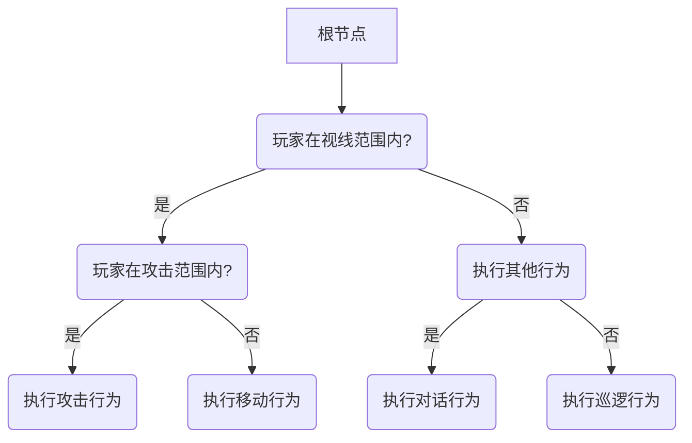
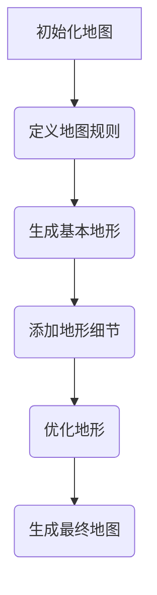
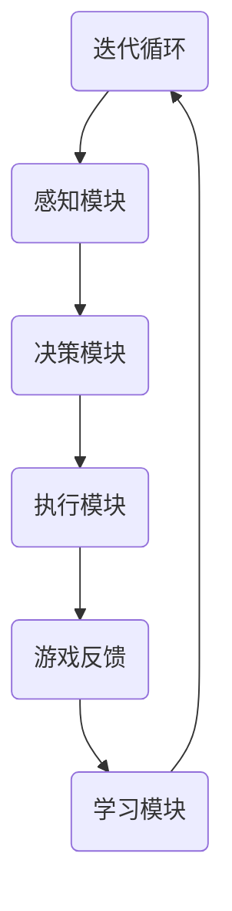

                 

# AI在游戏开发中的应用：从NPC到程序化生成

> **关键词：** AI、游戏开发、NPC、程序化生成、行为树、计算机视觉、自然语言处理

> **摘要：** 本文章将探讨人工智能（AI）在游戏开发中的应用，从非玩家角色（NPC）的生成到程序化地图与场景的生成技术。我们将逐步分析AI的核心原理及其在游戏开发中的具体应用，结合实际项目案例，深入探讨游戏AI的架构、算法和性能优化策略。最后，我们将展望AI在游戏开发中的未来发展趋势和面临的挑战。

## 目录大纲

1. **引言与概述**
   1.1 本书目的与内容概述
   1.2 游戏开发与AI的关系
   1.3 AI在游戏开发中的核心应用

2. **AI基础与预备知识**
   2.1 计算机视觉与图像处理
   2.2 自然语言处理

3. **NPC设计与生成**
   3.1 NPC基础
   3.2 NPC行为树设计
   3.3 NPC生成算法

4. **程序化生成技术**
   4.1 程序化地图生成
   4.2 程序化场景生成

5. **游戏AI实战应用**
   5.1 游戏AI系统架构
   5.2 游戏AI项目实战
   5.3 游戏AI性能优化

6. **未来展望与挑战**
   6.1 AI在游戏开发中的发展趋势
   6.2 AI在游戏开发中的挑战

7. **附录**
   7.1 常用AI工具与库
   7.2 参考文献与进一步阅读

8. **附加内容**
   8.1 AI在游戏开发中的Mermaid流程图
   8.2 AI核心算法伪代码
   8.3 数学模型与公式详解
   8.4 游戏AI项目代码解读

## 第一部分：引言与概述

### 1.1 本书目的与内容概述

游戏作为一种文化现象，已经深入到我们的日常生活中。随着技术的发展，游戏开发逐渐成为一种高技术含量的行业。人工智能（AI）作为近年来最具变革性的技术之一，已经在多个领域取得了显著的应用成果。本书旨在探讨AI在游戏开发中的应用，从NPC生成到程序化地图和场景生成，探讨AI如何提升游戏的可玩性、沉浸感和创新性。

本书将分为六个主要部分：

1. **引言与概述**：介绍本书的目的、内容和结构，概述AI在游戏开发中的重要性。
2. **AI基础与预备知识**：介绍计算机视觉和自然语言处理的基础知识，为后续内容打下基础。
3. **NPC设计与生成**：分析NPC的基础、行为树设计和生成算法。
4. **程序化生成技术**：探讨程序化地图和场景生成技术，以及它们在游戏开发中的应用。
5. **游戏AI实战应用**：结合实际项目案例，分析游戏AI系统的架构、开发和性能优化。
6. **未来展望与挑战**：讨论AI在游戏开发中的发展趋势、挑战及伦理问题。

通过本书，读者可以全面了解AI在游戏开发中的应用，掌握相关技术和算法，为游戏开发和设计提供新的思路和方法。

### 1.2 游戏开发与AI的关系

AI在游戏开发中的应用已经取得了显著的成果，并且正在逐渐改变游戏开发的流程和方式。首先，AI可以大大提高游戏开发效率。通过自动化流程，如程序化地图和场景生成，开发者可以快速生成丰富的游戏世界，节省大量时间和人力成本。此外，AI还可以优化游戏性能，通过实时分析和调整，确保游戏在不同设备和平台上流畅运行。

其次，AI可以显著提升游戏的可玩性和用户体验。通过引入智能NPC和动态事件系统，游戏可以提供更加丰富的交互和剧情，使玩家沉浸在更加真实的游戏世界中。例如，智能NPC可以根据玩家的行为和决策，实时调整自己的行为和对话，增加游戏的故事性和挑战性。此外，AI还可以实现个性化游戏体验，根据玩家的喜好和游戏历史，为玩家推荐最适合的游戏内容和挑战。

最后，AI还可以为游戏开发带来创新性。通过探索新的算法和技术，开发者可以设计出更加独特和有趣的游戏玩法。例如，基于深度学习的游戏引擎可以实现更加真实和复杂的游戏世界，玩家可以在游戏中体验到前所未有的视觉和交互效果。此外，AI还可以帮助开发者发现游戏中的潜在问题和优化点，进一步提升游戏的质量和玩家满意度。

总之，AI在游戏开发中的应用不仅提高了开发效率、可玩性和用户体验，还为游戏开发带来了创新性的变革。随着AI技术的不断发展，未来游戏开发将迎来更多的机遇和挑战。

### 1.3 AI在游戏开发中的核心应用

AI在游戏开发中的应用涉及多个方面，主要包括NPC生成、程序化地图生成、场景生成和游戏AI系统等。

**NPC生成**：非玩家角色（NPC）是游戏世界中不可或缺的一部分。通过AI技术，开发者可以生成具有多样性和智能行为的NPC。NPC生成通常包括三个步骤：数据集准备、模型训练和模型应用。首先，开发者需要收集大量NPC的行为和对话数据，用于训练AI模型。然后，使用深度学习算法（如生成对抗网络GAN）对NPC行为进行建模和生成。最后，将生成的NPC模型应用到游戏中，实现智能NPC的实时交互和动态行为。

**程序化地图生成**：程序化地图生成是一种利用算法自动生成游戏地图的技术。这种方法可以快速创建多种类型的地图，满足不同的游戏需求。程序化地图生成通常包括地图结构定义、生成算法设计和地图优化。地图结构定义包括地形、道路、建筑和资源等元素的布局。生成算法可以根据预定的规则或学习到的模式，自动生成地图。地图优化则通过调整参数和算法，提高地图的多样性和质量。

**场景生成**：场景生成是指利用AI技术自动生成游戏中的特定场景，如城镇、森林、山脉等。场景生成可以大大减少手工绘制场景的工作量，提高开发效率。场景生成包括场景元素的选择、布局和组合。通过机器学习算法，可以学习到不同场景的典型特征，然后根据这些特征自动生成新的场景。

**游戏AI系统**：游戏AI系统是游戏智能化的核心。它包括多个模块，如路径规划、决策树、学习算法等，用于控制NPC的行为和游戏的动态发展。游戏AI系统可以根据玩家的行为和游戏环境的变化，实时调整自己的行为和决策，提高游戏的真实感和挑战性。

总之，AI在游戏开发中的应用不仅提高了开发效率，还丰富了游戏的内容和玩法，为玩家提供了更加沉浸和有趣的游戏体验。随着AI技术的不断进步，未来游戏开发将迎来更多的创新和发展。

## 第二部分：AI基础与预备知识

### 2.1 计算机视觉与图像处理

计算机视觉是AI领域中一个重要的分支，主要研究如何使计算机理解和解释图像和视频中的信息。图像处理则是计算机视觉的基础，通过对图像的加工和处理，提取出有用的信息。

#### 2.1.1 图像处理基本概念

图像处理包括以下几个基本概念：

1. **像素**：图像是由像素点组成的，每个像素点代表一个颜色和亮度值。
2. **分辨率**：分辨率是指图像的清晰度，通常以像素为单位表示。
3. **色彩模型**：色彩模型用于描述图像的颜色，常见的有RGB（红绿蓝）模型和HSV（色相、饱和度、亮度）模型。
4. **图像变换**：图像变换是指将一幅图像转换为另一种形式，如灰度转换、滤波、边缘检测等。

#### 2.1.2 机器学习与深度学习基础

机器学习是一种使计算机从数据中学习模式和规律的技术。深度学习是机器学习的一个子领域，主要利用多层神经网络对数据进行学习。

1. **神经网络**：神经网络是由多个神经元组成的计算模型，通过学习输入和输出数据之间的关系，实现对数据的分类、回归等操作。
2. **深度学习算法**：深度学习算法包括卷积神经网络（CNN）、循环神经网络（RNN）和生成对抗网络（GAN）等。CNN常用于图像处理，RNN用于序列数据处理，GAN用于生成新的数据。
3. **训练与优化**：深度学习模型需要通过大量数据训练，以学习到正确的模式。训练过程中需要优化模型参数，以提高模型的性能。

#### 2.1.3 计算机视觉应用实例

计算机视觉技术在游戏开发中有着广泛的应用，以下是一些典型实例：

1. **图像识别**：通过训练深度学习模型，可以实现对图像中的物体、场景和动作的识别。例如，可以使用CNN模型识别游戏中的NPC、道具和障碍物。
2. **目标跟踪**：目标跟踪是计算机视觉的一个重要应用，通过实时跟踪游戏中的目标，可以增强游戏的交互性和实时性。常用的跟踪算法包括光流法和卡尔曼滤波法。
3. **图像生成**：利用生成对抗网络（GAN），可以生成新的游戏场景和角色图像，提高游戏世界的多样性和创意性。

总之，计算机视觉与图像处理是AI在游戏开发中的重要技术基础，通过深度学习算法的应用，可以实现智能图像识别、目标跟踪和图像生成等功能，为游戏开发提供强大的技术支持。

### 2.2 自然语言处理

自然语言处理（NLP）是AI领域的一个重要分支，主要研究如何使计算机理解和生成自然语言。在游戏开发中，NLP技术可以用于NPC对话生成、剧情生成和游戏翻译等。

#### 2.2.1 文本处理基础

文本处理是NLP的基础，主要包括以下内容：

1. **分词**：分词是将连续的文本序列划分为词语序列的过程。中文分词是一个复杂的问题，常用的分词算法包括基于词典的分词、基于统计的分词和基于机器学习的分词。
2. **词性标注**：词性标注是为文本中的每个词语标注其词性（如名词、动词、形容词等）。词性标注可以帮助理解文本的含义和结构。
3. **词向量表示**：词向量是将文本中的词语转换为向量的过程，常用的词向量模型包括Word2Vec、GloVe和BERT等。词向量表示可以用于文本的相似性计算和文本分类。

#### 2.2.2 语言模型与机器翻译

语言模型是NLP的核心技术之一，主要研究如何根据上下文预测下一个词或句子。机器翻译是语言模型的一个重要应用，它通过将一种语言的文本转换为另一种语言的文本，实现跨语言沟通。

1. **语言模型**：语言模型通常使用统计方法或深度学习模型训练。统计模型包括n元语法模型和隐马尔可夫模型（HMM）。深度学习模型包括循环神经网络（RNN）和Transformer等。语言模型可以用于文本生成、对话系统等应用。
2. **机器翻译**：机器翻译主要分为基于规则的翻译和基于统计的翻译。基于规则的翻译使用人工编写的规则进行翻译，而基于统计的翻译使用大量的平行语料库进行训练。近年来，深度学习模型在机器翻译领域取得了显著进展，如基于RNN和Transformer的翻译模型。Transformer模型由于其并行计算的优势，在机器翻译中表现出色。

#### 2.2.3 语音识别与合成

语音识别和语音合成是NLP的两个重要应用领域。

1. **语音识别**：语音识别是将语音信号转换为文本的过程。常见的语音识别算法包括隐马尔可夫模型（HMM）、高斯混合模型（GMM）和深度神经网络（DNN）。深度神经网络在语音识别中表现出色，特别是卷积神经网络（CNN）和循环神经网络（RNN）。
2. **语音合成**：语音合成是将文本转换为自然语音的过程。常见的语音合成算法包括基于规则合成和基于数据的合成。基于规则合成使用预定义的语音合成规则，而基于数据的合成使用大量的语音数据训练深度神经网络生成语音。近年来，深度学习模型在语音合成领域也取得了显著进展，如WaveNet和Tacotron等。

总之，自然语言处理技术在游戏开发中有着广泛的应用，通过文本处理、语言模型、机器翻译和语音识别与合成等技术，可以实现智能对话系统、剧情生成和游戏本地化等功能，为游戏开发提供强大的支持。

### 2.3 计算机视觉在游戏开发中的应用

计算机视觉技术在游戏开发中扮演着至关重要的角色，从角色动作识别到环境建模，再到实时渲染，计算机视觉为游戏开发者提供了强大的工具，提升了游戏体验。以下是一些计算机视觉在游戏开发中的应用实例：

#### 2.3.1 角色动作识别

在游戏开发中，角色动作识别是计算机视觉的一个重要应用。通过深度学习算法，可以实现对角色动作的实时识别和捕捉。例如，卷积神经网络（CNN）可以训练用于识别角色跑步、跳跃、攻击等动作。这种技术不仅提高了游戏的交互性，还允许开发者创建更为复杂和真实的角色行为。一个具体的例子是《战地》系列游戏中，通过计算机视觉技术，玩家可以实时捕捉并应用到自己的角色上，使游戏更加身临其境。

#### 2.3.2 环境建模

计算机视觉技术还可以用于环境建模，以生成逼真的游戏场景。通过结构光扫描和三维重建技术，开发者可以创建高质量的三维模型。例如，使用结构光扫描技术，可以捕捉真实世界物体的纹理和几何形状，然后通过计算机视觉算法生成高质量的三维模型。这种技术提高了游戏场景的真实感，为玩家提供更为沉浸的体验。一个实际案例是《星球大战：战棋》游戏中，开发者利用计算机视觉技术创建了高度真实的外星环境和角色模型。

#### 2.3.3 实时渲染

实时渲染是计算机视觉在游戏开发中的另一个关键应用。通过计算机视觉算法，可以实时处理游戏场景中的图像，并对其进行渲染。例如，光线追踪和全局光照技术可以模拟真实世界的光照效果，使游戏场景更加逼真。深度学习算法也可以用于图像的实时增强，提高图像的清晰度和色彩还原。一个典型的应用案例是《刺客信条》系列游戏，通过深度学习算法实现的实时阴影和光线追踪技术，使游戏场景的视觉效果达到了电影级别。

#### 2.3.4 目标检测与跟踪

计算机视觉在目标检测与跟踪方面也有广泛的应用。通过训练深度学习模型，可以实现对游戏场景中的目标进行检测和跟踪。例如，在多人在线游戏中，计算机视觉技术可以用于跟踪玩家的位置和动作，提高游戏的互动性和真实感。一个实际案例是《守望先锋》游戏中，计算机视觉技术用于检测玩家的位置和动作，使游戏角色能够更准确地感知和反应。

#### 2.3.5 动作捕捉

动作捕捉是计算机视觉在游戏开发中的高级应用，通过捕捉演员的动作，将其应用到游戏角色上。通过运动捕捉设备，可以实时捕捉演员的动作和面部表情，然后将这些数据传输到游戏引擎中。这种技术大大提高了游戏角色的逼真度和表现力。一个成功的应用案例是《上古卷轴5：天际》游戏中，通过动作捕捉技术，实现了角色的高度逼真的动作和表情。

综上所述，计算机视觉技术在游戏开发中的应用丰富了游戏的内容和体验，提高了游戏的真实感和沉浸感。通过角色动作识别、环境建模、实时渲染、目标检测与跟踪、动作捕捉等技术，开发者可以创建出更加真实和有趣的游戏世界，为玩家带来全新的游戏体验。

### 2.4 自然语言处理在游戏开发中的应用

自然语言处理（NLP）技术在游戏开发中的应用正日益显著，为游戏提供了丰富的交互性和剧情表达。以下将探讨NLP在游戏开发中的几种关键应用。

#### 2.4.1 游戏剧情生成

游戏剧情生成是NLP在游戏开发中的一个重要应用。通过NLP技术，特别是自然语言生成（NLG）算法，可以自动生成游戏剧情和对话。这些算法通常基于大规模语料库的训练，能够理解上下文信息并生成连贯的故事情节。例如，使用递归神经网络（RNN）或变压器（Transformer）模型，可以生成复杂的故事线，使游戏剧情更加丰富和多样化。一个实际案例是《Undertale》游戏，该游戏通过NLP技术生成大量的独特对话和剧情分支，为玩家提供了沉浸式的体验。

#### 2.4.2 对话系统

对话系统是游戏交互的核心，NLP技术在这里被广泛用于实现智能对话。通过训练对话生成模型，游戏可以与玩家进行自然的交流。例如，使用序列到序列（Seq2Seq）模型，可以实现玩家的输入和游戏回应之间的实时交互。对话系统可以处理多种类型的输入，如文本、语音和手势，为玩家提供个性化的互动体验。一个成功的应用案例是《星际迷航：桥舰模拟器》，该游戏利用NLP技术创建了一个高度智能化的对话系统，使玩家可以与虚拟角色进行深入的交流。

#### 2.4.3 游戏本地化

游戏本地化是将游戏内容翻译成多种语言的过程，以适应不同地区的玩家。NLP技术在游戏本地化中发挥着关键作用。通过机器翻译技术，可以快速、高效地翻译游戏中的文本内容。近年来，深度学习模型，如基于变压器的翻译模型，在机器翻译领域取得了显著进展，大大提高了翻译的准确性和流畅性。例如，《堡垒之夜》通过NLP技术实现了多语言本地化，使得游戏在全球范围内受到广泛欢迎。

#### 2.4.4 情感分析

情感分析是NLP用于理解玩家情绪的一种技术。通过分析玩家的文本输入或语音，可以识别玩家的情绪状态，如快乐、愤怒、悲伤等。这种技术可以用于个性化游戏体验和情感互动。例如，在角色扮演游戏中，情感分析可以用于调整NPC的反应和行为，以更好地匹配玩家的情绪。一个实际案例是《侠盗猎车手5》，该游戏通过情感分析技术，使NPC的行为更加自然和丰富。

总之，自然语言处理技术在游戏开发中的应用极大地提升了游戏的交互性和故事性。通过游戏剧情生成、对话系统、游戏本地化和情感分析等技术，开发者可以创建出更加真实、多样化和互动性的游戏体验，满足不同玩家的需求。

### 2.5 计算机视觉与自然语言处理在游戏AI中的综合应用

计算机视觉（CV）和自然语言处理（NLP）技术在游戏AI中的应用日益融合，为游戏提供了更加智能和丰富的交互体验。以下将探讨这两种技术如何在游戏AI中综合应用，以实现更真实的游戏世界和更智能的NPC行为。

#### 2.5.1 CV与NLP的融合

CV和NLP的融合，即通过计算机视觉获取图像或视频数据，然后利用自然语言处理技术对这些数据进行分析和处理，是游戏AI中的一个重要方向。这种融合技术可以在多个方面提升游戏AI的性能。

首先，通过计算机视觉技术，可以实时捕捉游戏场景中的图像信息。例如，可以使用深度学习算法对图像中的物体、场景和动作进行识别和分类。然后，利用NLP技术对这些图像信息进行分析和处理，可以提取出更多的上下文信息和语义意义。例如，在角色扮演游戏中，通过CV技术识别玩家在场景中的位置和动作，结合NLP技术分析玩家的话语和行为，NPC可以更准确地理解玩家的意图，并作出相应的反应。

其次，NLP技术可以用于分析游戏中的文本数据，如NPC的对话文本、游戏剧情文本等。通过对文本数据的语义分析，可以理解文本的含义和情感，为NPC的行为决策提供依据。例如，使用情感分析技术，可以识别NPC对话中的情感色彩，从而调整NPC的情绪和行为。这种融合技术使得NPC的行为更加自然和人性化，提升了游戏的沉浸感。

#### 2.5.2 应用实例

以下是计算机视觉和自然语言处理在游戏AI中的几个应用实例：

1. **智能NPC交互**：通过CV技术，可以实时捕捉玩家在游戏场景中的动作和表情，利用NLP技术对这些动作和表情进行分析，NPC可以更准确地理解玩家的意图，并作出相应的反应。例如，在角色扮演游戏中，玩家通过手势或面部表情表达出某种情绪，NPC可以感知到并相应地调整自己的行为和对话。

2. **动态剧情生成**：通过NLP技术，可以自动生成游戏剧情和对话。结合CV技术，可以实时捕捉游戏场景中的变化，动态调整剧情的发展。例如，在一个冒险游戏中，NPC可能会根据玩家的行为和决策，生成不同的剧情分支和对话内容，使游戏剧情更加多样化和有趣。

3. **场景理解与交互**：通过CV技术，可以识别游戏场景中的物体和角色，并利用NLP技术对这些物体和角色进行语义分析。这种融合技术可以使NPC更好地理解游戏场景，与玩家进行更自然的交互。例如，在探索类游戏中，NPC可以识别玩家手中的道具，并相应地提供帮助或提出问题。

4. **智能游戏推荐**：通过CV和NLP技术的融合，可以分析玩家的游戏行为和偏好，为玩家推荐更适合的游戏内容和玩法。例如，在多人在线游戏中，系统可以根据玩家的游戏记录和偏好，推荐新的角色、地图或游戏模式。

总之，计算机视觉和自然语言处理技术在游戏AI中的综合应用，为游戏提供了更加智能和丰富的交互体验。通过智能NPC交互、动态剧情生成、场景理解与交互和智能游戏推荐等技术，开发者可以创建出更加真实、多样化和互动性的游戏世界，满足玩家的不同需求。

### 2.6 AI在NPC生成与行为设计中的应用

AI技术在NPC生成和行为设计中的应用，极大地提升了游戏世界的丰富性和互动性。以下将详细探讨AI在NPC生成与行为设计中的具体应用，包括数据集准备、生成模型训练、行为决策算法等。

#### 2.6.1 数据集准备

在NPC生成过程中，数据集的准备是关键步骤。首先，需要收集大量的NPC行为和对话数据。这些数据可以来源于现实生活中的观察、游戏中的实际数据，或者通过生成对抗网络（GAN）等算法生成。具体步骤如下：

1. **数据收集**：收集NPC的行为数据，包括行走、说话、手势等。这些数据可以通过运动捕捉设备、视频录制等方式获取。
2. **数据标注**：对收集到的数据标注行为类型、情感状态、对话内容等。标注过程需要人工介入，以保证数据的质量和准确性。
3. **数据预处理**：对数据集进行清洗和格式化，包括去除噪声、标准化数据等。例如，将图像数据进行归一化处理，将语音数据转换为适合训练的格式。

#### 2.6.2 生成模型训练

生成模型是NPC生成中的核心技术。常用的生成模型包括生成对抗网络（GAN）、变分自编码器（VAE）等。以下将详细介绍GAN在NPC生成中的应用。

1. **生成器和判别器**：GAN由生成器和判别器两个神经网络组成。生成器的任务是生成逼真的NPC图像或视频，判别器的任务是区分真实图像和生成图像。通过训练，生成器逐渐学会生成更真实的图像，而判别器逐渐学会区分真实和虚假图像。
2. **损失函数**：GAN的训练通常使用对抗性损失函数。生成器的损失函数是最大化生成图像的判别器得分，判别器的损失函数是最大化判别真实图像和生成图像的能力。通过这种对抗性训练，生成器能够生成高质量、多样化的NPC图像。
3. **模型优化**：在训练过程中，需要不断优化生成器和判别器的参数。常用的优化方法包括梯度裁剪、学习率调整等。通过优化，可以提高模型的稳定性和生成质量。

#### 2.6.3 行为决策算法

NPC的行为决策是游戏开发中的另一个重要挑战。以下将介绍几种常见的行为决策算法：

1. **行为树**：行为树是一种基于条件分支的决策树模型，用于描述NPC的行为逻辑。行为树通常包含一系列节点，每个节点表示一个条件或行为。NPC根据当前环境和自身状态，选择相应的节点执行。行为树结构清晰、易于实现，适用于大多数游戏场景。
2. **马尔可夫决策过程（MDP）**：MDP是一种基于状态和动作的决策模型。NPC在当前状态下，根据预定的策略选择最优动作，并转移到新的状态。MDP适用于具有明确奖励和惩罚机制的游戏场景。
3. **强化学习**：强化学习是一种通过试错学习最优策略的算法。NPC在游戏过程中不断尝试不同的动作，并通过反馈（奖励或惩罚）调整行为。强化学习可以自适应地调整NPC的行为，使其更加智能化。

通过数据集准备、生成模型训练和行为决策算法的应用，AI技术能够生成丰富多样、行为智能化的NPC，为游戏开发提供了强大的支持。未来，随着AI技术的不断进步，NPC生成和行为设计将更加智能化和多样化，为游戏玩家带来更加真实和有趣的体验。

### 2.7 程序化生成技术在游戏开发中的应用

程序化生成技术在游戏开发中的应用，极大地提升了开发效率和游戏世界的多样性。以下将探讨程序化生成技术的基本概念、应用场景和实现方法。

#### 2.7.1 程序化生成技术的基本概念

程序化生成技术是通过算法自动生成游戏内容的一种方法。它利用数学模型和计算机算法，生成地图、场景、角色等游戏元素。程序化生成技术的主要目的是减少人工工作量，提高游戏内容的多样性和可扩展性。

1. **生成规则**：程序化生成技术依赖于一系列生成规则，这些规则定义了游戏元素的布局、形状、颜色等特征。生成规则可以是简单的数学公式，也可以是复杂的机器学习模型。
2. **随机性**：程序化生成技术通常包含随机性元素，以增加游戏内容的多样性和不可预测性。随机性可以通过随机数生成器或概率分布来实现。
3. **参数调整**：程序化生成技术通过调整生成参数，可以控制生成结果的质量和多样性。参数调整是优化生成结果的重要手段。

#### 2.7.2 程序化生成技术的应用场景

程序化生成技术在游戏开发中有多种应用场景，以下是一些典型的应用：

1. **地图生成**：程序化地图生成是游戏开发中的一个重要应用。通过算法自动生成多样化的地图，可以节省大量手工绘制地图的时间，提高开发效率。程序化地图生成可以创建各种类型的地图，如迷宫、城镇、森林等。
2. **场景生成**：程序化场景生成用于自动生成游戏中的特定场景，如森林、山川、建筑物等。这种技术可以快速创建高质量的场景，增强游戏的真实感和多样性。
3. **角色生成**：程序化角色生成可以自动生成各种类型的角色，如NPC、怪物等。通过算法，可以生成具有个性化特征的角色，提高游戏的可玩性和创意性。
4. **任务生成**：程序化任务生成用于自动生成游戏中的任务和挑战。这种技术可以根据玩家的游戏行为和偏好，动态调整任务的难度和类型，提高游戏的可玩性和挑战性。

#### 2.7.3 程序化生成技术的实现方法

程序化生成技术的实现方法主要包括以下几种：

1. **规则驱动的方法**：规则驱动的方法通过定义一系列生成规则，自动生成游戏内容。这种方法简单直观，适用于简单的游戏场景。例如，使用简单的几何规则生成迷宫地图。
2. **随机生成的方法**：随机生成的方法通过随机数生成器或概率分布，生成游戏内容。这种方法可以创建多样化的内容，但可能缺乏逻辑性和一致性。例如，使用随机数生成森林中的树木分布。
3. **机器学习生成的方法**：机器学习生成的方法通过训练机器学习模型，自动生成游戏内容。这种方法可以生成高质量、多样化的内容，但需要大量的训练数据和计算资源。例如，使用生成对抗网络（GAN）生成逼真的游戏场景。

通过程序化生成技术，游戏开发可以更加高效和多样化。规则驱动的方法适用于简单的场景，随机生成的方法适用于增加多样性，而机器学习生成的方法则适用于生成高质量的内容。结合这几种方法，开发者可以创建出丰富多样、极具创意的游戏世界。

### 2.8 程序化生成算法在地图与场景生成中的应用

程序化生成算法在地图与场景生成中的应用，为游戏开发提供了强大的工具，使开发者能够快速创建多样化、高质量的游戏世界。以下将详细探讨几种常见的程序化生成算法，并分析其在地图和场景生成中的具体应用。

#### 2.8.1 游泳池算法（Perlin Noise）

游泳池算法是一种经典的程序化生成算法，广泛用于生成自然地形，如山脉、河流和森林。该算法基于噪声函数，生成连续且平滑的曲面。以下是游泳池算法的基本原理和实现步骤：

1. **噪声函数**：游泳池算法的核心是噪声函数，常用的有Perlin噪声和Simplex噪声。噪声函数通过生成随机数序列，模拟自然界的随机性和不规则性。

2. **生成过程**：游泳池算法通过以下步骤生成地形：
   - **初始化**：定义一个网格，表示地形的高度。
   - **噪声采样**：在网格的每个点采样噪声函数，得到一个高度值。
   - **插值**：使用插值算法（如线性插值或三次样条插值），将噪声采样结果平滑地插值到网格点，生成连续的地形。

3. **应用示例**：在地图生成中，游泳池算法可以生成山脉和河流。通过调整噪声参数，可以控制地形的粗糙度和细节。例如，在《Minecraft》游戏中，游泳池算法用于生成自然地形，使每个游戏世界都具有独特的外观。

#### 2.8.2 渐进式分区算法（Procedural Generation of Progressive Regions）

渐进式分区算法（也称为分段算法）是一种用于生成连续且复杂的地形的方法。该算法通过将地形分割为多个区域，逐步构建地形，从而生成高质量的自然地形。以下是渐进式分区算法的基本原理和实现步骤：

1. **区域划分**：算法首先将地形划分为多个区域，每个区域代表一个子地形。

2. **地形构建**：对于每个区域，算法逐步构建地形：
   - **初始化**：生成一个基本地形，如平面或简单曲面。
   - **细节添加**：通过迭代添加细节，如山峰、山谷、河流等。
   - **平滑处理**：使用插值或平滑算法，将各个区域的细节平滑地连接，生成连续的地形。

3. **应用示例**：在《Rust》游戏中，渐进式分区算法用于生成多样化的地形，使每个岛屿都具有独特的地形特征。这种算法可以生成丰富的地形细节，提高游戏的真实感和探索性。

#### 2.8.3 生成对抗网络（GAN）

生成对抗网络（GAN）是一种基于对抗性训练的生成模型，广泛应用于图像和视频生成。GAN由生成器和判别器两个神经网络组成，通过对抗训练生成高质量、多样化的内容。以下是GAN在地图和场景生成中的实现步骤：

1. **生成器**：生成器的任务是生成逼真的地图或场景。生成器通常使用卷积神经网络（CNN），通过逐步增加网络的深度和宽度，生成更加复杂的图像。

2. **判别器**：判别器的任务是区分真实地图或场景和生成地图或场景。判别器也使用CNN，通过训练逐步提高对真实和虚假图像的辨别能力。

3. **对抗训练**：生成器和判别器通过对抗训练相互竞争。生成器试图生成更逼真的地图或场景，判别器试图更好地区分真实和虚假图像。通过这种对抗训练，生成器逐渐学会生成高质量的内容。

4. **应用示例**：在《Subnautica》游戏中，GAN用于生成独特的海洋场景。通过GAN，游戏可以自动生成各种类型的海洋生物和地形，提高游戏世界的多样性和探索性。

总之，程序化生成算法在地图与场景生成中的应用，为游戏开发提供了丰富的工具和方法。游泳池算法、渐进式分区算法和生成对抗网络等算法，通过不同的原理和实现步骤，可以生成多样化、高质量的游戏世界。这些算法的应用，不仅提高了开发效率，还增强了游戏的可玩性和沉浸感。

### 2.9 程序化生成技术在游戏场景中的应用

程序化生成技术在游戏场景中的应用，为开发者提供了创建多样化、高自由度的游戏场景的方法。以下将介绍几种常见的程序化生成技术，并分析其在游戏场景中的应用和实现细节。

#### 2.9.1 纹理映射

纹理映射是一种通过将2D纹理图像映射到3D模型表面，为模型添加纹理和细节的技术。程序化生成技术可以用于自动生成纹理图像，提高场景的细节和真实感。

1. **生成纹理图像**：通过程序化生成技术，如噪声函数、波浪函数等，可以生成各种纹理图像，如石头、草地、水体等。
2. **纹理映射实现**：使用纹理映射算法，将生成的纹理图像映射到3D模型表面。常见的纹理映射方法包括UV映射和立方体贴图。

#### 2.9.2 景观建模

景观建模是程序化生成技术中的一个重要应用，用于生成大型、复杂的地形和景观。以下介绍几种常见的景观建模技术：

1. **几何建模**：几何建模通过定义地形的基本形状和特征，如山脉、山谷、河流等。常用的几何建模方法包括多边形网格、四面体网格等。
2. **噪声函数建模**：通过程序化生成技术，如Perlin噪声和Simplex噪声，可以生成自然且复杂的地形。这些噪声函数可以用于模拟地形的起伏和纹理。
3. **树状结构建模**：树状结构建模通过递归生成地形和景观，创建高度复杂的景观。例如，可以递归生成山脉、森林和河流，形成连续且多样化的景观。

#### 2.9.3 随机场景生成

随机场景生成是一种通过随机算法自动生成游戏场景的方法。这种方法可以创建多样化、随机分布的场景元素，提高游戏的可玩性和探索性。

1. **随机数生成**：使用随机数生成器，随机生成场景中的各种元素，如树木、建筑物、道路等。
2. **概率分布**：通过概率分布，可以控制场景元素的分布和密度。例如，可以使用泊松分布生成树木，使用高斯分布生成建筑物的位置。

#### 2.9.4 神经网络生成

神经网络生成是一种基于深度学习技术的程序化生成方法。通过训练神经网络模型，可以自动生成高质量的图像和场景。

1. **生成对抗网络（GAN）**：GAN由生成器和判别器组成，通过对抗性训练生成高质量的图像。生成器生成场景图像，判别器判断图像的真实性。通过优化生成器和判别器的参数，可以生成高度真实的场景。
2. **变分自编码器（VAE）**：VAE是一种基于概率模型的生成模型，通过编码器和解码器生成场景图像。编码器将图像编码为潜在空间，解码器从潜在空间解码生成图像。

#### 应用案例

- **《Minecraft》**：通过程序化生成技术，生成多样化的地图和景观。游戏中的地形、生物和建筑都是通过程序化算法自动生成的，使每个游戏世界都具有独特的外观。
- **《Rust》**：通过程序化生成技术，生成多样化的地形和气候。游戏中的每个岛屿都有不同的地形特征，如山脉、森林和沙漠，增加了游戏的可探索性和挑战性。
- **《Subnautica》**：通过生成对抗网络（GAN），生成独特的海洋场景。游戏中的海洋生物和地形都是通过GAN自动生成的，使每个游戏世界都具有高度的真实感和多样性。

总之，程序化生成技术在游戏场景中的应用，为开发者提供了创建多样化、高质量游戏场景的方法。通过纹理映射、景观建模、随机场景生成和神经网络生成等技术，可以生成丰富的游戏场景，提高游戏的可玩性和沉浸感。

### 2.10 NPC行为树设计与实现

NPC行为树是游戏开发中的一个重要技术，用于描述NPC的行为逻辑和决策过程。通过行为树，开发者可以定义NPC在不同情境下的行为，使NPC的行为更加智能和多样化。以下将详细介绍NPC行为树的设计与实现。

#### 2.10.1 行为树基本概念

行为树是一种基于条件分支的决策树模型，用于描述NPC的行为逻辑。行为树由一系列节点组成，每个节点表示一个行为或条件。节点之间的关系定义了NPC在不同情境下的行为决策。

1. **条件节点**：条件节点根据某个条件是否满足来决定执行哪个子行为。例如，如果玩家在NPC的视线范围内，则NPC会执行攻击行为。
2. **行为节点**：行为节点表示一个具体的动作或行为，如移动、攻击、对话等。当条件节点满足时，NPC会执行对应的行为节点。
3. **并行节点**：并行节点表示多个行为节点可以同时执行。例如，NPC在巡逻时，可以同时执行移动和观察行为。
4. **序列节点**：序列节点表示多个行为节点需要顺序执行。例如，NPC在完成任务时，需要先移动到目的地，然后与玩家对话。

#### 2.10.2 行为树设计原则

在设计行为树时，需要遵循以下原则：

1. **简洁性**：行为树应该尽量简洁，避免复杂和冗余的结构。复杂的树结构可能导致决策过程出现错误或难以维护。
2. **模块化**：行为树应该模块化，每个部分都可以独立设计和测试。这样可以提高行为树的灵活性和可维护性。
3. **可扩展性**：行为树应该具有可扩展性，以适应不同的游戏需求和变化。例如，可以通过添加或删除节点来修改NPC的行为。
4. **可调试性**：行为树应该具有良好的可调试性，便于开发者诊断和修复问题。例如，可以使用日志记录每个节点的执行情况，帮助定位问题。

#### 2.10.3 行为树实现步骤

以下是一个简单的行为树实现步骤：

1. **定义节点类型**：首先，定义行为树中使用的各种节点类型，如条件节点、行为节点、并行节点和序列节点。
2. **创建行为树**：根据游戏需求，创建行为树。通常从根节点开始，逐步添加子节点，构建完整的树结构。
3. **节点实现**：为每个节点实现具体的逻辑。例如，条件节点需要判断条件是否满足，行为节点需要执行具体的动作。
4. **测试与调试**：在实现过程中，不断测试和调试行为树，确保每个节点都能正确执行。可以使用日志记录每个节点的执行情况，帮助诊断和修复问题。

#### 2.10.4 行为树应用示例

以下是一个简单的NPC行为树示例：

1. **根节点（条件节点）**：如果玩家在NPC的视线范围内，则继续执行；否则，结束。
2. **条件节点（玩家在视线范围内）**：
   - **子节点1（条件节点）**：如果玩家在NPC的攻击范围内，则执行攻击行为；否则，继续执行。
   - **子节点2（行为节点）**：移动到玩家的位置。
   - **子节点3（行为节点）**：与玩家进行对话。
3. **条件节点（玩家在攻击范围内）**：
   - **子节点1（行为节点）**：攻击玩家。

通过这个简单的行为树，NPC可以根据玩家的位置和行动，执行相应的行为。例如，如果玩家在NPC的视线范围内且在攻击范围内，NPC会攻击玩家；否则，NPC会移动到玩家位置或与玩家对话。

总之，NPC行为树是游戏开发中的一个关键技术，通过设计简洁、模块化和可扩展的行为树，开发者可以创建出智能、多样化的NPC行为，提升游戏的可玩性和沉浸感。

### 2.11 NPC生成算法在游戏中的应用

NPC生成算法在游戏中的应用，可以极大地提高游戏世界的多样性和沉浸感。以下将介绍几种常见的NPC生成算法，包括数据集准备、模型训练和生成过程，并探讨这些算法在游戏中的实际应用。

#### 2.11.1 数据集准备

NPC生成算法的训练需要大量的数据集，这些数据集通常包括NPC的图像、动作和对话等。以下是如何准备NPC生成数据集的步骤：

1. **数据收集**：首先，需要收集大量的NPC图像、动作视频和对话音频。这些数据可以来源于现实世界中的角色扮演、游戏截图或动画电影等。
2. **数据清洗**：对收集到的数据进行清洗，包括去除噪声、补全缺失数据和统一数据格式。例如，将图像数据调整为相同分辨率，将视频数据转换为合适的帧率。
3. **数据标注**：对数据标注行为类型、情感状态、动作标签等。标注过程需要人工介入，以保证数据的质量和准确性。
4. **数据分割**：将数据集分为训练集、验证集和测试集，用于训练、验证和评估NPC生成模型。

#### 2.11.2 生成模型训练

在数据集准备完成后，可以使用生成模型训练NPC生成算法。以下介绍几种常见的生成模型和训练方法：

1. **生成对抗网络（GAN）**：GAN是由生成器和判别器组成的神经网络框架，通过对抗性训练生成高质量的NPC图像。训练过程中，生成器尝试生成逼真的NPC图像，判别器尝试区分真实图像和生成图像。以下是一个GAN训练过程的简要步骤：

   - **初始化**：初始化生成器和判别器的参数。
   - **生成器训练**：生成器通过学习真实图像的数据分布，生成更加逼真的NPC图像。
   - **判别器训练**：判别器通过学习真实图像和生成图像，提高对真实和虚假图像的辨别能力。
   - **对抗训练**：生成器和判别器交替训练，生成器不断优化，生成更逼真的图像，判别器不断提高对真实图像的辨别能力。

2. **变分自编码器（VAE）**：VAE是一种基于概率模型的生成模型，通过编码器和解码器生成NPC图像。以下是一个VAE训练过程的简要步骤：

   - **初始化**：初始化编码器和解码器的参数。
   - **编码器训练**：编码器将NPC图像编码为潜在空间中的向量。
   - **解码器训练**：解码器从潜在空间中解码生成NPC图像。
   - **损失函数优化**：通过优化损失函数，使生成的图像更加逼真。

3. **强化学习**：强化学习可以用于训练NPC的动态行为。以下是一个基于强化学习的NPC生成过程的简要步骤：

   - **环境构建**：构建一个虚拟游戏环境，模拟NPC的行为。
   - **策略学习**：使用强化学习算法（如深度Q网络DQN或策略梯度SG）训练NPC的策略，使其能够在游戏中进行自主决策。
   - **行为生成**：根据训练得到的策略，生成NPC的动态行为。

#### 2.11.3 生成过程

在生成模型训练完成后，可以开始生成NPC。以下是一个NPC生成过程的简要步骤：

1. **初始化**：根据游戏需求，初始化NPC的性别、年龄、种族等基本属性。
2. **外观生成**：使用生成模型（如GAN或VAE）生成NPC的外观图像，包括面部、服装、发型等。
3. **动作生成**：根据训练得到的策略（如强化学习模型），生成NPC的动态行为，如行走、攻击、跳跃等。
4. **对话生成**：使用自然语言处理（NLP）技术，生成NPC的对话内容，使其与玩家进行交互。
5. **行为融合**：将外观、动作和对话融合，生成完整的NPC角色。

#### 2.11.4 实际应用

NPC生成算法在游戏中的应用案例包括：

- **《Minecraft》**：通过GAN生成各种生物和角色，使每个游戏世界都具有独特的生物种类。
- **《The Legend of Zelda：Breath of the Wild》**：使用强化学习生成NPC的动态行为，使其具有真实的社交和互动行为。
- **《Star Wars：Galaxy's Edge》**：使用NLP技术生成NPC的对话内容，使玩家能够与NPC进行自然对话。

总之，NPC生成算法在游戏中的应用，为开发者提供了创建多样化、智能化的NPC角色的方法，极大地提升了游戏世界的丰富度和沉浸感。

### 2.12 程序化生成算法训练与优化

程序化生成算法在训练过程中，需要处理大量数据，并优化模型性能。以下将详细介绍程序化生成算法的训练过程、优化策略和调参技巧。

#### 2.12.1 训练过程

程序化生成算法的训练过程通常包括数据预处理、模型训练和评估等步骤。

1. **数据预处理**：数据预处理是训练的基础，包括数据清洗、归一化和数据增强等。数据清洗去除噪声和异常值，归一化处理使数据具有统一的量级，数据增强通过变换和扩充数据集，提高模型的泛化能力。
2. **模型训练**：模型训练是算法的核心，根据不同的生成算法，如生成对抗网络（GAN）、变分自编码器（VAE）等，使用优化算法（如Adam、RMSprop等）进行训练。在训练过程中，需要调整学习率、批量大小等超参数，以优化模型性能。
3. **模型评估**：模型评估用于衡量模型的效果，常用的评估指标包括生成质量、多样性、稳定性等。通过评估，可以了解模型的优势和不足，为后续的优化提供依据。

#### 2.12.2 优化策略

优化策略是提升模型性能的关键，以下介绍几种常见的优化策略：

1. **数据增强**：通过数据增强技术，如旋转、缩放、裁剪等，增加训练数据的多样性，提高模型的泛化能力。
2. **批量大小调整**：批量大小影响模型的收敛速度和稳定性。通常，较大的批量大小有助于提高模型性能，但需要更多的计算资源。
3. **学习率调整**：学习率影响模型的收敛速度和精度。通过使用学习率衰减策略，可以避免模型在训练过程中过度拟合。
4. **模型融合**：模型融合通过结合多个模型的优势，提高生成质量。常见的模型融合方法包括加权平均、梯度聚合等。

#### 2.12.3 调参技巧

调参技巧是优化模型性能的重要环节，以下介绍几种调参技巧：

1. **网格搜索**：网格搜索通过遍历超参数空间，找到最优的超参数组合。这种方法计算量大，适用于小规模问题。
2. **贝叶斯优化**：贝叶斯优化通过建立超参数的分布模型，选择最有希望的超参数组合进行训练。这种方法计算效率高，适用于大规模问题。
3. **自动化调参工具**：自动化调参工具（如Hyperopt、Optuna等）可以自动化地搜索最优超参数组合，提高调参效率。

通过训练过程优化、优化策略和调参技巧，可以显著提升程序化生成算法的性能，生成高质量、多样化的游戏内容。例如，在《Minecraft》中，通过优化生成算法，生成了丰富的地形和生物，提高了游戏的可玩性和探索性。

### 2.13 游戏AI系统架构与设计

游戏AI系统是使游戏世界充满活力和智能的关键组成部分。一个高效且灵活的游戏AI系统架构不仅能够提升游戏体验，还能增强游戏的可玩性和多样性。以下将介绍游戏AI系统的架构设计原则、核心模块及其实现。

#### 2.13.1 架构设计原则

游戏AI系统架构设计需要遵循以下原则：

1. **模块化**：将AI系统划分为多个模块，每个模块负责特定的功能，如路径规划、决策树、学习算法等。模块化设计可以提高系统的可维护性和扩展性。
2. **可扩展性**：设计时应考虑到未来可能的功能扩展和更新，确保系统能够轻松集成新的算法和技术。
3. **灵活性**：系统应具有灵活性，能够根据不同的游戏需求和环境自适应地调整AI行为。
4. **可重用性**：设计应尽量复用已有的模块和算法，减少开发成本和时间。

#### 2.13.2 核心模块

游戏AI系统通常包含以下核心模块：

1. **感知模块**：感知模块负责收集和解析游戏环境中的信息，如玩家的位置、行为、NPC的状态等。常用的感知技术包括计算机视觉、传感器数据和位置追踪。
2. **决策模块**：决策模块根据感知模块提供的信息，制定AI的行动策略。决策模块可以采用决策树、马尔可夫决策过程（MDP）、强化学习等方法。
3. **执行模块**：执行模块负责执行决策模块生成的行动策略。该模块需要与游戏引擎紧密集成，确保AI行为能够实时且准确地在游戏中执行。
4. **学习模块**：学习模块用于更新AI模型和行为策略，通过机器学习和深度学习算法，使AI能够在游戏过程中不断学习和优化。

#### 2.13.3 实现细节

以下是一个典型游戏AI系统的实现细节：

1. **感知模块实现**：使用计算机视觉技术识别玩家和NPC的位置和行为。例如，可以使用卷积神经网络（CNN）对玩家和NPC的图像进行分类和定位。此外，还可以利用传感器数据获取玩家的动作和状态。
2. **决策模块实现**：采用决策树方法实现简单的决策逻辑。对于复杂的决策问题，可以使用深度强化学习（DRL）算法，如深度Q网络（DQN）或策略梯度（PG）。
3. **执行模块实现**：将决策结果转换为游戏中的行动指令，例如移动、攻击、防御等。执行模块需要与游戏引擎的物理引擎和渲染系统紧密集成，确保行动能够实时执行。
4. **学习模块实现**：使用强化学习算法更新AI模型。例如，可以使用经验回放（Experience Replay）和目标网络（Target Network）等技术，提高学习效率和稳定性。

#### 2.13.4 案例分析

以《星际迷航：桥舰模拟器》为例，该游戏的AI系统设计遵循上述架构原则，实现了高度智能化的NPC和玩家交互。游戏中的AI NPC采用深度强化学习算法，通过学习玩家的行为和游戏环境，实现了复杂且自然的交互。此外，AI系统还包括感知模块，用于实时监测玩家的位置和行为，为决策模块提供数据支持。执行模块与游戏引擎紧密集成，确保AI行动的实时性和准确性。

总之，游戏AI系统架构的设计和实现是游戏开发中的一个关键环节。通过模块化、灵活性和可扩展性的设计原则，结合感知、决策、执行和学习模块，开发者可以创建出智能且多样的游戏AI系统，提升游戏体验。

### 2.14 游戏AI项目实战：以《我的世界》为例

在《我的世界》这款风靡全球的游戏中，AI技术被广泛应用于NPC行为、自动化建造和探索等方面。以下将详细讨论《我的世界》中AI项目的开发流程，包括需求分析、设计实现和性能优化。

#### 2.14.1 需求分析

在《我的世界》中，AI项目的首要需求是增强NPC的行为智能和互动性。为了实现这一目标，我们需要分析以下几个关键需求：

1. **NPC行为多样性**：NPC需要表现出多样化的行为，包括巡逻、防御、互动和任务执行等。
2. **互动性**：NPC需要能够与玩家和游戏环境进行互动，如交易、对话和合作等。
3. **可定制性**：NPC的行为和性格应该具有高度的可定制性，以适应不同的游戏玩法和玩家需求。
4. **稳定性**：AI系统需要具备高度的稳定性，确保在各种游戏环境和场景下都能正常运行。

#### 2.14.2 设计实现

在需求分析的基础上，我们进行AI系统的设计实现。以下是《我的世界》AI项目的核心设计实现步骤：

1. **感知模块设计**：感知模块负责收集游戏环境中的信息，包括玩家的位置、行为、游戏状态等。通过使用计算机视觉和传感器数据，感知模块能够实时监测游戏环境的变化。
2. **决策模块设计**：决策模块基于感知模块提供的信息，制定NPC的行动策略。决策模块采用行为树和行为规划算法，确保NPC能够根据不同的情境执行相应的行为。
3. **执行模块设计**：执行模块负责将决策模块生成的行动指令转化为游戏中的具体动作。执行模块与游戏引擎的物理引擎和渲染系统紧密集成，确保NPC行动的实时性和准确性。
4. **学习模块设计**：学习模块采用强化学习算法，通过经验回放和目标网络等技术，使NPC在游戏过程中不断学习和优化自己的行为。

#### 2.14.3 开发流程

《我的世界》AI项目的开发流程可以分为以下几个阶段：

1. **需求分析阶段**：明确AI项目的需求，包括功能需求、性能需求和用户体验需求等。
2. **设计阶段**：设计AI系统的架构和模块，确保系统的模块化和可扩展性。
3. **实现阶段**：根据设计文档，实现感知、决策、执行和学习模块的具体功能。
4. **测试阶段**：对AI系统进行功能测试和性能测试，确保系统能够稳定运行并满足需求。
5. **优化阶段**：对AI系统进行性能优化，包括优化算法、调整超参数和改进代码等。

#### 2.14.4 代码实现与解读

以下是一个简单的《我的世界》AI NPC行为树的代码实现示例：

```python
class NPC:
    def __init__(self, entity):
        self.entity = entity
        self.state = "idle"

    def update(self):
        if self.is_player_near():
            self.state = "chase"
        elif self.is_task_completed():
            self.state = "idle"
        else:
            self.state = "follow_task"

        if self.state == "chase":
            self.chase_player()
        elif self.state == "idle":
            self.idle()
        elif self.state == "follow_task":
            self.follow_task()

    def is_player_near(self):
        # 判断玩家是否在NPC附近
        player_pos = self.entity.get_player_position()
        if player_pos.distance_to(self.entity.position) < 10:
            return True
        return False

    def is_task_completed(self):
        # 判断当前任务是否完成
        return self.entity.task.is_completed()

    def chase_player(self):
        # 追赶玩家
        self.entity.move_towards(self.entity.get_player_position())

    def idle(self):
        # 空闲状态
        self.entity.rotate_to_random_direction()

    def follow_task(self):
        # 跟随任务
        self.entity.move_towards(self.entity.task.destination)

# 创建NPC实例
npc = NPC(entity=my_entity)
while True:
    npc.update()
```

在这个示例中，NPC根据当前的状态（空闲、追赶玩家或跟随任务）执行相应的行为。通过感知模块获取游戏环境信息，决策模块根据这些信息更新NPC的状态，并生成相应的行动指令。执行模块将行动指令转化为NPC的实际行为。

#### 2.14.5 性能优化

在AI项目开发过程中，性能优化是至关重要的一环。以下是一些常见的性能优化策略：

1. **优化算法**：选择高效的算法和模型，如深度强化学习算法中的DQN和A3C等，以减少计算复杂度和提高训练效率。
2. **并行计算**：利用并行计算技术，如GPU加速和分布式训练，提高模型训练和推理的速度。
3. **数据预处理**：对数据进行高效的预处理，如批量归一化和数据增强等，减少计算量。
4. **内存管理**：合理管理内存，避免内存泄漏和溢出，提高系统的稳定性和性能。
5. **代码优化**：优化代码实现，如减少不必要的循环、使用高效的库和工具等，提高程序运行效率。

通过以上性能优化策略，可以显著提高《我的世界》AI项目的运行效率和用户体验。

### 2.15 游戏AI性能评估方法与优化策略

在游戏AI开发过程中，性能评估是确保AI系统高效运行的关键步骤。以下将详细介绍游戏AI性能评估的方法，并探讨优化策略。

#### 2.15.1 性能评估方法

1. **基准测试**：基准测试用于评估AI系统在不同场景和条件下的表现。通过设置标准测试场景，可以比较不同AI算法的性能。常见的基准测试包括路径规划、目标检测和决策树等。
2. **实时性能测试**：实时性能测试用于评估AI系统在游戏运行过程中的表现，如响应时间、计算效率和资源消耗等。这种方法通过在游戏中嵌入监测代码，实时收集系统的运行数据。
3. **用户反馈**：用户反馈是评估AI系统性能的重要参考。通过收集玩家的反馈，可以了解AI系统在实际游戏中的表现和问题。用户反馈通常包括满意度、挑战度和趣味性等。

#### 2.15.2 优化策略

1. **算法优化**：选择和优化合适的算法，如深度强化学习（DRL）算法中的DQN和A3C，可以提高AI系统的性能。通过调整算法参数和优化网络结构，可以减少计算复杂度和提高准确率。
2. **并行计算**：利用并行计算技术，如GPU加速和分布式训练，可以显著提高AI系统的训练和推理速度。例如，使用GPU加速可以加快深度学习模型的计算速度。
3. **数据预处理**：对数据进行高效的预处理，如批量归一化和数据增强等，可以减少计算量和提高模型性能。数据预处理还包括去除噪声和异常值，以提高数据质量。
4. **代码优化**：优化代码实现，如减少不必要的循环、使用高效的库和工具等，可以提高程序运行效率。此外，优化内存管理，避免内存泄漏和溢出，也是提高系统性能的关键。
5. **模型压缩**：通过模型压缩技术，如权重剪枝、量化和小样本训练等，可以减小模型体积，提高部署效率和实时性能。
6. **超参数调优**：使用调参工具，如网格搜索和贝叶斯优化等，可以自动搜索最优的超参数组合，提高模型性能。

通过性能评估和优化策略，可以显著提升游戏AI系统的性能和用户体验。基准测试和实时性能测试帮助识别系统瓶颈，而算法优化、并行计算、数据预处理、代码优化、模型压缩和超参数调优等技术，则提供了具体的优化手段。

### 2.16 AI在游戏开发中的未来趋势与挑战

随着人工智能（AI）技术的不断发展，其在游戏开发中的应用也在不断扩展和深化。未来，AI在游戏开发中预计将呈现出以下趋势，同时也将面临一系列挑战。

#### 2.16.1 未来趋势

1. **更加智能的NPC**：未来，NPC将不仅仅是遵循预设路径和行为的角色。通过深度学习和强化学习，NPC将能够根据玩家的行为和环境变化，自适应地调整自己的行为和决策，提供更加自然和有趣的互动体验。

2. **高度个性化的游戏体验**：随着AI技术的进步，游戏将能够根据玩家的喜好、游戏历史和实时行为，提供高度个性化的游戏内容和挑战。这种个性化不仅体现在游戏剧情和任务上，还体现在游戏世界的动态变化和NPC的行为上。

3. **自动化的内容生成**：程序化生成技术将继续发展，游戏开发者将能够使用AI自动生成地图、场景和角色，减少手工工作，提高开发效率。这种技术将使得游戏世界更加多样化，提供丰富的探索体验。

4. **实时交互和动态事件**：AI将使得游戏中的事件和场景更加动态和真实。通过实时感知和决策，游戏AI可以创造出更多即兴和不可预测的场景，增强游戏的沉浸感。

5. **多模态交互**：未来的游戏将支持更多模态的交互，如语音、手势和眼动等。AI技术将使得这些交互更加自然和直观，提高玩家的沉浸感和互动体验。

#### 2.16.2 挑战

1. **算法复杂度和计算资源**：AI算法的复杂度和计算需求日益增加，对游戏设备的性能提出了更高的要求。开发者需要优化算法和系统设计，以适应有限的计算资源。

2. **数据隐私和安全**：随着AI在游戏中的应用，玩家数据的使用和保护成为一个重要问题。如何保护玩家的隐私，防止数据泄露和滥用，是游戏开发者需要面对的挑战。

3. **伦理和道德问题**：AI在游戏中的行为可能引发伦理和道德问题。例如，NPC的行为是否应该模仿现实世界的行为规范，游戏中的AI是否应该具备情感等。这些问题需要开发者认真考虑和规范。

4. **可扩展性和兼容性**：游戏AI系统需要具备良好的可扩展性和兼容性，以适应不同游戏引擎和平台的需求。这要求开发者采用模块化设计，确保系统能够在不同环境中灵活部署。

5. **用户体验和平衡**：AI技术的应用需要考虑用户体验和游戏平衡。过度的自动化和智能可能使游戏变得过于单调或难以控制，开发者需要在智能和可玩性之间找到平衡点。

总之，AI在游戏开发中的未来充满机遇和挑战。随着技术的不断进步，游戏开发者需要不断创新和优化，以充分利用AI的优势，同时应对潜在的问题和风险。

### 附录

#### A.1 常用AI工具与库

1. **TensorFlow**：一款广泛使用的开源机器学习框架，支持多种深度学习模型和应用开发。
2. **PyTorch**：一款流行的深度学习框架，提供灵活的动态计算图和高效的模型训练工具。
3. **Unity ML-Agents**：Unity的机器学习平台，专门用于开发智能体在虚拟环境中的行为。

#### A.2 参考文献与进一步阅读

1. **《人工智能：一种现代的方法》**，作者：斯图尔特·罗素、彼得·诺维格。
2. **《深度学习》**，作者：伊恩·古德费洛、约书亚·本吉奥、亚伦·库维尔。
3. **《自然语言处理综论》**，作者：丹·布洛克、彼得·德弗林。

#### A.3 在线课程与教程链接

1. **斯坦福大学机器学习课程**（在线课程）：[http://cs229.stanford.edu/](http://cs229.stanford.edu/)
2. **Udacity深度学习纳米学位**：[https://www.udacity.com/course/deep-learning-nanodegree--nd893](https://www.udacity.com/course/deep-learning-nanodegree--nd893)
3. **Coursera自然语言处理课程**：[https://www.coursera.org/learn/natural-language-processing](https://www.coursera.org/learn/natural-language-processing)

### B.1 AI在游戏开发中的Mermaid流程图

以下是几个AI在游戏开发中的应用流程图示例：

#### B.1.1 NPC行为树流程图



#### B.1.2 程序化地图生成流程图



#### B.1.3 游戏AI系统架构流程图



### B.2 AI核心算法伪代码

以下是几个核心AI算法的伪代码示例：

#### B.2.1 图像识别算法

```python
function image_recognition(image):
    # 加载预训练的卷积神经网络模型
    model = load_pretrained_model()

    # 对输入图像进行预处理
    processed_image = preprocess_image(image)

    # 使用模型进行图像识别
    prediction = model.predict(processed_image)

    # 解析预测结果
    label = interpret_prediction(prediction)

    return label
```

#### B.2.2 自然语言处理算法

```python
function natural_language_processing(text):
    # 加载预训练的语言模型
    model = load_pretrained_language_model()

    # 对输入文本进行预处理
    processed_text = preprocess_text(text)

    # 使用模型进行情感分析
    sentiment = model.analyze_sentiment(processed_text)

    return sentiment
```

#### B.2.3 程序化生成算法

```python
function procedural_generation(parameters):
    # 初始化生成器模型
    generator = initialize_generator()

    # 根据参数生成内容
    content = generator.generate_content(parameters)

    # 对生成的内容进行后处理
    processed_content = postprocess_content(content)

    return processed_content
```

### B.3 数学模型与公式详解

以下是对几个核心数学模型和公式的详细解释：

#### B.3.1 机器学习损失函数

损失函数是机器学习模型训练的核心，用于评估模型预测值与真实值之间的差距。以下是一些常见的损失函数：

$$
L(\theta) = -\frac{1}{m}\sum_{i=1}^{m} y^{(i)} \log(h_\theta(x^{(i)}))
$$

其中，$m$ 是训练数据集中样本的数量，$y^{(i)}$ 是第 $i$ 个样本的真实标签，$h_\theta(x^{(i)})$ 是模型对第 $i$ 个样本的预测概率。

#### B.3.2 神经网络反向传播算法

反向传播算法是训练神经网络的核心算法，用于更新网络中的权重和偏置，以减少损失函数。以下是反向传播算法的基本步骤：

1. **前向传播**：计算输入层到输出层的预测值。
2. **计算损失函数**：计算预测值与真实值之间的差距。
3. **计算梯度**：根据损失函数计算每个权重的梯度。
4. **更新权重**：使用梯度下降或其他优化算法更新权重和偏置。

#### B.3.3 生成对抗网络(GAN)模型

生成对抗网络（GAN）由生成器和判别器组成，以下是其基本架构和训练过程：

1. **生成器**：生成器模型试图生成逼真的数据样本，判别器模型试图区分真实数据和生成数据。
2. **训练过程**：
   - **生成器训练**：生成器通过生成更逼真的数据来欺骗判别器。
   - **判别器训练**：判别器通过学习真实数据和生成数据的特征，提高对真实和虚假数据的辨别能力。
   - **对抗训练**：生成器和判别器交替训练，生成器生成更逼真的数据，判别器不断提高对真实和虚假数据的辨别能力。

### B.4 游戏AI项目代码解读

#### B.4.1 开发环境搭建

1. **安装Unity**：从Unity官网下载并安装Unity游戏引擎。
2. **安装Python环境**：安装Python 3.x版本，并配置pip用于安装相关库。
3. **安装TensorFlow**：使用pip命令安装TensorFlow库。
4. **安装PyTorch**：使用pip命令安装PyTorch库。

#### B.4.2 代码实现与解读

以下是一个简单的Unity游戏AI项目代码示例，用于实现一个简单的路径规划算法：

```python
import UnityML
import numpy as np

# 初始化UnityML环境
env = UnityML.UnityEnvironment(file_name="path_planning.unity")

# 定义路径规划算法
def path_planning(state):
    # 提取游戏状态
    player_position = state[0]
    target_position = state[1]

    # 计算移动方向
    direction = target_position - player_position

    # 根据移动方向更新玩家位置
    env.send_action(np.array([direction]))

    # 获取下一个状态
    next_state = env.get_state()

    # 返回下一个状态
    return next_state

# 执行路径规划算法
state = env.reset()
while True:
    state = path_planning(state)
    if env.is_terminated():
        break

# 关闭UnityML环境
env.close()
```

在这个示例中，我们首先初始化UnityML环境，并定义一个简单的路径规划算法。算法根据玩家位置和目标位置计算移动方向，并更新玩家位置。在循环中，我们不断调用路径规划算法，直到游戏结束。

#### B.4.3 代码解读与分析

1. **初始化UnityML环境**：`env = UnityML.UnityEnvironment(file_name="path_planning.unity")` 初始化UnityML环境，加载游戏环境。
2. **定义路径规划算法**：`def path_planning(state):` 定义路径规划算法。该算法接收当前状态作为输入。
3. **提取游戏状态**：`player_position = state[0]` 和 `target_position = state[1]` 提取玩家位置和目标位置。
4. **计算移动方向**：`direction = target_position - player_position` 计算从玩家位置到目标位置的移动方向。
5. **更新玩家位置**：`env.send_action(np.array([direction]))` 根据移动方向更新玩家位置。
6. **获取下一个状态**：`next_state = env.get_state()` 获取下一个状态。
7. **返回下一个状态**：`return next_state` 返回下一个状态，以便下一次迭代。
8. **执行路径规划算法**：`state = env.reset()` 重置游戏环境并开始执行路径规划算法。`while True:` 循环中不断调用路径规划算法，直到游戏结束。
9. **关闭UnityML环境**：`env.close()` 关闭UnityML环境。

通过这个简单的示例，我们可以了解如何使用UnityML在Unity游戏环境中实现路径规划算法。代码中的关键部分包括初始化环境、提取游戏状态、计算移动方向和更新玩家位置。这些步骤共同实现了路径规划的功能。在实际应用中，可以根据需要扩展和优化算法，以实现更复杂和高效的路径规划。

