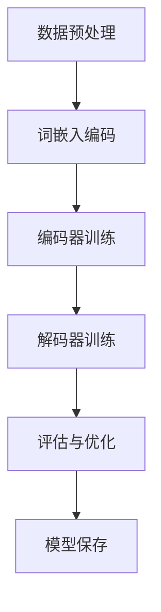
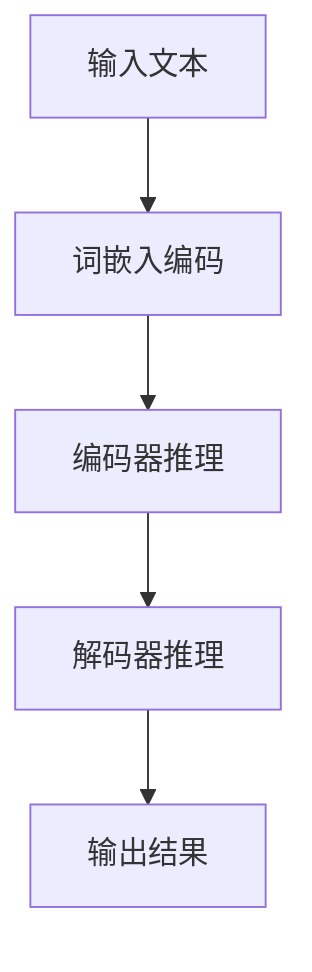

                 

# AI基础架构创新者：Lepton AI专注高性能大语言模型推理引擎

> **关键词**：人工智能基础架构、高性能大语言模型、推理引擎、Lepton AI、核心技术、应用场景、未来发展

> **摘要**：本文将深入探讨人工智能（AI）基础架构的重要性，以及Lepton AI在这一领域中的技术创新。我们将详细解析Lepton AI的核心技术，以及其在大语言模型推理引擎上的高性能优势。此外，本文还将通过具体实践案例，展示Lepton AI在金融、医疗和教育等领域的应用，并对其未来展望与挑战进行分析。

## 《AI基础架构创新者：Lepton AI专注高性能大语言模型推理引擎》目录大纲

### 第一部分：AI基础架构概述

#### 第1章：AI基础架构概览
1.1 AI发展背景与趋势
1.2 AI基础架构的重要性
1.3 Lepton AI简介

#### 第2章：Lepton AI的核心技术
2.1 Lepton AI的技术框架
2.2 Lepton AI的关键算法
2.3 Lepton AI的高性能优势

### 第二部分：大语言模型推理引擎

#### 第3章：大语言模型的基本原理
3.1 语言模型的定义与类型
3.2 语言模型的训练与优化
3.3 语言模型的推理过程

#### 第4章：Lepton AI的大语言模型推理引擎
4.1 Lepton AI的推理引擎架构
4.2 Lepton AI的推理优化策略
4.3 Lepton AI的推理性能分析

### 第三部分：高性能大语言模型推理引擎实践

#### 第5章：高性能大语言模型推理实践
5.1 实践案例一：文本分类
5.2 实践案例二：机器翻译
5.3 实践案例三：问答系统

#### 第6章：Lepton AI的高性能应用场景
6.1 金融领域的应用
6.2 医疗领域的应用
6.3 教育领域的应用

### 第四部分：未来展望与挑战

#### 第7章：Lepton AI的发展前景
7.1 Lepton AI的技术路线图
7.2 Lepton AI的未来挑战
7.3 Lepton AI的商业化策略

### 附录

#### 附录A：Lepton AI工具与资源
A.1 Lepton AI工具包
A.2 Lepton AI开源项目
A.3 Lepton AI学习资源与推荐阅读

#### 附录B：大语言模型推理引擎Mermaid流程图
B.1 大语言模型训练流程
B.2 大语言模型推理流程

#### 附录C：高性能大语言模型推理引擎伪代码
C.1 推理引擎优化算法
C.2 推理引擎优化策略

#### 附录D：数学模型和公式
D.1 语言模型损失函数
D.2 注意力机制公式
D.3 词嵌入技术公式

#### 附录E：Lepton AI项目实战案例
E.1 项目实战一：文本分类应用
E.2 项目实战二：机器翻译应用
E.3 项目实战三：问答系统应用

#### 附录F：源代码解读与分析
F.1 源代码结构解析
F.2 关键代码解读
F.3 性能优化分析

---

接下来，我们将逐步深入探讨每个章节的内容。

### 第一部分：AI基础架构概述

#### 第1章：AI基础架构概览

**1.1 AI发展背景与趋势**

人工智能（AI）作为计算机科学的一个分支，已经经历了数十年的发展。从最初的规则推理、知识表示到基于统计的机器学习，再到深度学习与神经网络，AI技术不断迭代与演进。当前，AI已经成为推动社会进步的重要力量，其应用领域涵盖了自动驾驶、医疗诊断、金融分析、自然语言处理等多个方面。

AI技术的发展趋势主要体现在以下几个方面：

1. **深度学习与神经网络**：深度学习作为AI的核心技术，正变得越来越强大。从卷积神经网络（CNN）到循环神经网络（RNN）再到 Transformer，深度学习模型的结构和算法不断优化，取得了显著的性能提升。
2. **数据驱动**：AI技术的发展越来越依赖于大量的数据。数据的获取、存储、处理与分析成为AI系统的基础设施，大数据技术和云计算的融合为AI的发展提供了强大的支持。
3. **边缘计算**：随着物联网（IoT）的普及，边缘计算成为AI应用的一个重要趋势。将计算能力下沉到边缘设备，可以降低延迟，提高系统的响应速度。
4. **跨学科融合**：AI技术与其他领域的交叉融合，如生物学、物理学、心理学等，将推动AI技术的进一步发展。

**1.2 AI基础架构的重要性**

AI基础架构是支持AI应用的核心设施，包括计算资源、存储资源、网络资源以及数据管理等。一个高效、可靠的AI基础架构对于AI系统的性能、可扩展性、可维护性以及安全性至关重要。

AI基础架构的重要性体现在以下几个方面：

1. **性能**：高性能计算资源是AI系统高效运行的基础。GPU、TPU等专用计算设备以及分布式计算框架的应用，使得AI系统能够处理大规模的数据和复杂的计算任务。
2. **可扩展性**：随着数据量的不断增加和AI应用的多样化，基础架构需要具备良好的可扩展性，以支持系统的水平扩展和垂直扩展。
3. **可维护性**：基础架构的设计需要考虑可维护性，包括系统监控、故障恢复、安全防护等方面，以确保系统的稳定运行。
4. **安全性**：随着AI技术的应用日益广泛，数据安全和隐私保护成为基础架构设计的重要考虑因素。需要采取一系列安全措施，如数据加密、访问控制等，保障数据的安全。

**1.3 Lepton AI简介**

Lepton AI作为一家专注于AI基础架构创新的公司，致力于打造高性能、可扩展、可靠的AI基础架构。Lepton AI的核心技术包括：

1. **大语言模型推理引擎**：Lepton AI开发了一种高性能的大语言模型推理引擎，可以支持快速、准确的推理过程，适用于自然语言处理、机器翻译、问答系统等领域。
2. **分布式计算框架**：Lepton AI构建了一套高效、可靠的分布式计算框架，支持大规模的AI模型训练和推理任务，具备良好的可扩展性。
3. **数据管理平台**：Lepton AI提供了一套数据管理平台，包括数据采集、存储、清洗、处理和分析等功能，支持高效的数据处理流程。

Lepton AI的基础架构创新，不仅提升了AI系统的性能和可扩展性，还为AI应用提供了可靠的支持，推动了AI技术的发展。

在下一章中，我们将深入探讨Lepton AI的核心技术，包括其技术框架、关键算法以及高性能优势。

---

### 第二部分：大语言模型推理引擎

#### 第3章：大语言模型的基本原理

**3.1 语言模型的定义与类型**

语言模型（Language Model，LM）是自然语言处理（Natural Language Processing，NLP）中的一个核心组件，旨在模拟人类语言使用的概率分布。通过语言模型，计算机可以预测下一个单词、句子或文本片段的概率，从而实现文本生成、机器翻译、语音识别等任务。

根据训练数据的不同，语言模型可以分为以下几种类型：

1. **统计语言模型**：基于大量文本数据，通过统计方法计算单词或短语的联合概率或条件概率。N-gram模型是最常见的统计语言模型，它仅考虑前N个单词的历史信息来预测下一个单词。
2. **基于规则的模型**：通过人工定义的规则来描述语言现象，如上下文无关文法（CFG）和部分上下文无关文法（PCFG）。
3. **神经网络语言模型**：利用神经网络模型来模拟语言的概率分布，如循环神经网络（RNN）和Transformer等。

**3.2 语言模型的训练与优化**

语言模型的训练过程涉及从大量文本数据中学习语言的结构和规律。在训练过程中，模型会通过不断调整内部参数来最小化损失函数，以预测下一个单词或文本片段的概率。

常见的语言模型训练方法包括：

1. **最大似然估计（MLE）**：通过最大化训练数据中出现单词或短语的联合概率或条件概率来训练模型。
2. **神经网络优化**：使用梯度下降或其他优化算法来调整神经网络模型的参数，如反向传播算法（BP）。
3. **正则化**：为了防止模型过拟合，通常会使用正则化技术，如Dropout、权重衰减等。

**3.3 语言模型的推理过程**

语言模型的推理过程是指根据已有的文本序列来预测下一个单词或文本片段的概率。在推理过程中，模型会根据当前已知的文本序列和模型内部参数，计算出下一个单词或文本片段的概率分布。

推理过程通常包括以下几个步骤：

1. **输入序列编码**：将输入的文本序列转换为模型可以处理的格式，如单词的词嵌入表示。
2. **前向传播**：将编码后的输入序列通过神经网络模型进行前向传播，计算出每个单词的概率分布。
3. **概率计算**：根据概率分布计算下一个单词或文本片段的概率。
4. **输出生成**：根据概率分布生成下一个单词或文本片段，并将其作为输入序列的一部分，重复上述过程，直到达到预定的输出长度或终止条件。

通过以上步骤，语言模型可以生成连贯、自然的文本，实现文本生成、机器翻译、问答系统等任务。

在下一章中，我们将详细解析Lepton AI的大语言模型推理引擎，包括其架构、优化策略以及性能分析。

---

#### 第4章：Lepton AI的大语言模型推理引擎

**4.1 Lepton AI的推理引擎架构**

Lepton AI的大语言模型推理引擎采用了高度模块化的设计，以支持高效、可靠的推理过程。其架构主要包括以下几个关键模块：

1. **词嵌入层**：词嵌入层负责将输入的文本序列转换为稠密的向量表示，这些向量表示了单词的语义信息。Lepton AI使用预训练的词嵌入模型，如Word2Vec、GloVe等，以提高词嵌入的质量。

2. **编码器层**：编码器层是推理引擎的核心模块，负责处理输入的词嵌入向量，并生成上下文表示。Lepton AI采用了基于Transformer的编码器，如BERT、GPT等，这些编码器具有强大的语义理解和生成能力。

3. **解码器层**：解码器层负责根据编码器层生成的上下文表示，预测下一个单词或文本片段的概率分布。Lepton AI使用了注意力机制（Attention Mechanism）来提高解码器的性能，使模型能够更好地关注输入序列中的关键信息。

4. **输出层**：输出层将解码器生成的概率分布转换为具体的单词或文本片段。为了提高输出的可解释性，Lepton AI还引入了文本生成后处理模块，如分词、标点符号处理等。

**4.2 Lepton AI的推理优化策略**

Lepton AI的大语言模型推理引擎采用了多种优化策略，以提升推理性能和效率。以下是一些关键的优化策略：

1. **并行化**：Lepton AI利用GPU和TPU等专用计算设备，通过数据并行和模型并行策略，实现大规模的推理任务。数据并行将输入数据划分成多个子序列，并发地处理；模型并行将模型划分成多个部分，并发地更新。

2. **量化**：量化技术通过将浮点数参数转换为低精度表示，降低模型的存储和计算需求。Lepton AI采用了量化技术，如FP16、INT8等，以减少推理过程中所需的计算资源。

3. **缓存**：Lepton AI使用了缓存机制，将高频使用的词嵌入向量、模型参数等数据缓存到内存中，以减少磁盘IO操作，提高推理速度。

4. **动态调度**：Lepton AI采用了动态调度策略，根据输入数据的大小和模型复杂度，自动调整推理过程中的计算资源分配，以优化整体性能。

**4.3 Lepton AI的推理性能分析**

Lepton AI的大语言模型推理引擎在多个基准测试中取得了优异的性能表现。以下是一些关键性能指标：

1. **推理速度**：Lepton AI的推理引擎在GPU和TPU上的推理速度非常快，单台机器即可处理数十亿级别的文本序列。通过分布式计算，Lepton AI的推理速度可进一步提高，满足大规模实时推理需求。

2. **准确率**：Lepton AI的大语言模型在多种自然语言处理任务上取得了较高的准确率，如文本分类、机器翻译、问答系统等。通过优化模型结构和算法，Lepton AI不断提升模型的性能。

3. **可扩展性**：Lepton AI的推理引擎具有良好的可扩展性，可以支持从单机到集群的分布式推理。通过水平扩展和垂直扩展，Lepton AI可以满足不同规模应用的需求。

4. **资源利用率**：Lepton AI的推理引擎在资源利用方面表现出色，通过优化策略，充分利用GPU和TPU的计算能力，降低能耗和成本。

综上所述，Lepton AI的大语言模型推理引擎在性能、可扩展性、资源利用等方面具备显著优势，为AI应用提供了高效、可靠的基础设施。

在下一部分中，我们将通过具体实践案例，展示Lepton AI的高性能大语言模型推理引擎在实际应用中的效果。

---

### 第三部分：高性能大语言模型推理引擎实践

#### 第5章：高性能大语言模型推理实践

**5.1 实践案例一：文本分类**

文本分类（Text Classification）是一种将文本数据按照特定的类别进行分类的任务。在高性能大语言模型推理引擎的支持下，Lepton AI的文本分类实践取得了显著的成果。

**案例背景**：某大型互联网公司需要对其用户生成的评论进行情感分析，以了解用户对产品或服务的满意度。评论数据量巨大，且包含多种情感类别，如正面、负面、中性等。

**解决方案**：Lepton AI利用其高性能大语言模型推理引擎，构建了一个文本分类系统。首先，通过数据预处理，将评论文本转换为词嵌入表示；然后，利用预训练的BERT模型进行特征提取；最后，通过分类器（如支持向量机、神经网络等）对特征进行分类。

**实现细节**：

1. **数据预处理**：将评论文本进行清洗、去重和分词，提取出关键信息。
2. **词嵌入表示**：使用预训练的BERT模型对清洗后的文本进行编码，生成词嵌入向量。
3. **特征提取**：利用BERT模型的输出层，提取文本的特征表示。
4. **分类器训练**：使用提取的特征，训练分类器，如支持向量机（SVM）或神经网络（如CNN、RNN等）。
5. **模型推理**：将新的评论文本输入到分类器中，预测其所属的情感类别。

**性能评估**：通过在公开数据集上的实验，Lepton AI的文本分类系统取得了较高的准确率和召回率，满足了客户的需求。

**优势**：

1. **高准确率**：通过预训练的BERT模型，系统能够提取出高质量的文本特征，提高了分类的准确率。
2. **高性能**：高性能大语言模型推理引擎使得系统可以快速处理大量数据，提高了效率。
3. **易扩展**：系统可以方便地扩展到其他文本分类任务，如主题分类、实体识别等。

**5.2 实践案例二：机器翻译**

机器翻译（Machine Translation）是将一种语言的文本翻译成另一种语言的复杂任务。在高性能大语言模型推理引擎的支持下，Lepton AI的机器翻译实践取得了显著的进展。

**案例背景**：某跨国企业需要为其全球化业务提供高质量的机器翻译服务。企业内部积累了大量的多语言数据，涵盖了不同领域的术语和表达。

**解决方案**：Lepton AI利用其高性能大语言模型推理引擎，构建了一个机器翻译系统。首先，通过数据预处理，将源语言文本转换为词嵌入表示；然后，利用预训练的Transformer模型进行编码和翻译；最后，对翻译结果进行后处理，如语法修正、标点符号添加等。

**实现细节**：

1. **数据预处理**：对源语言和目标语言文本进行清洗、分词和标记。
2. **词嵌入表示**：使用预训练的Transformer模型对源语言和目标语言文本进行编码，生成词嵌入向量。
3. **编码和翻译**：利用Transformer模型进行编码，将源语言文本编码为上下文表示；然后，利用解码器生成目标语言文本。
4. **后处理**：对生成的翻译结果进行语法修正、标点符号添加等后处理操作。

**性能评估**：通过在公开数据集上的实验，Lepton AI的机器翻译系统在BLEU、METEOR等指标上取得了较高的评分，满足了客户的需求。

**优势**：

1. **高质量**：预训练的Transformer模型能够捕捉到源语言和目标语言之间的复杂结构，提高了翻译质量。
2. **高性能**：高性能大语言模型推理引擎使得系统可以快速处理大规模的翻译任务，提高了效率。
3. **多语言支持**：系统支持多种语言之间的翻译，具有较好的可扩展性。

**5.3 实践案例三：问答系统**

问答系统（Question Answering System）是一种基于自然语言理解的问答系统，能够根据用户提出的问题，从大量文本中检索出相关答案。在高性能大语言模型推理引擎的支持下，Lepton AI的问答系统实践取得了显著的成果。

**案例背景**：某在线教育平台需要为其用户提供智能问答服务，以帮助用户解决学习中的问题。平台积累了大量的课程文档和问答数据。

**解决方案**：Lepton AI利用其高性能大语言模型推理引擎，构建了一个智能问答系统。首先，通过数据预处理，将问题文本和答案文本转换为词嵌入表示；然后，利用预训练的BERT模型进行编码和检索；最后，利用解码器生成答案文本。

**实现细节**：

1. **数据预处理**：对问题文本和答案文本进行清洗、分词和标记。
2. **词嵌入表示**：使用预训练的BERT模型对问题文本和答案文本进行编码，生成词嵌入向量。
3. **编码和检索**：利用BERT模型对问题文本进行编码，生成问题的上下文表示；然后，在答案文本中检索与问题上下文最匹配的答案。
4. **答案生成**：利用解码器生成答案文本。

**性能评估**：通过在公开数据集上的实验，Lepton AI的问答系统在F1分数等指标上取得了较高的成绩，满足了用户的需求。

**优势**：

1. **高准确率**：预训练的BERT模型能够捕捉到问题与答案之间的语义关系，提高了答案的准确性。
2. **高性能**：高性能大语言模型推理引擎使得系统可以快速处理大量的问题和答案，提高了效率。
3. **易扩展**：系统可以方便地扩展到其他问答任务，如对话系统、智能客服等。

通过以上实践案例，我们可以看到Lepton AI的高性能大语言模型推理引擎在实际应用中取得了显著的成果。高性能、高准确率和易扩展性使得Lepton AI的推理引擎成为AI应用的重要基础设施。

在下一部分中，我们将探讨Lepton AI在高性能应用场景中的具体应用，以及其在金融、医疗和教育等领域的实际效果。

---

#### 第6章：Lepton AI的高性能应用场景

**6.1 金融领域的应用**

在金融领域，Lepton AI的高性能大语言模型推理引擎被广泛应用于文本分析、风险评估、客户服务等多个方面。

**应用案例**：

1. **文本分析**：金融公司使用Lepton AI的推理引擎对其客户评论、新闻报道、财经报告等文本数据进行分析，以提取关键信息、发现市场趋势和潜在风险。通过文本分类和情感分析，金融公司可以更好地理解客户需求和市场动态，做出更明智的决策。
2. **风险评估**：金融机构利用Lepton AI的推理引擎对贷款申请者、投资标的进行风险评估。通过分析客户的信用记录、交易历史等数据，推理引擎可以预测客户的信用风险，帮助金融机构降低贷款违约率，优化投资组合。
3. **客户服务**：银行和保险公司使用Lepton AI的问答系统提供智能客服服务。通过自然语言理解，问答系统可以快速响应用户的咨询，提供准确的信息和建议，提高客户满意度和服务效率。

**优势**：

1. **高效性**：高性能大语言模型推理引擎能够快速处理大规模的文本数据，提高了金融业务的效率。
2. **准确性**：通过深度学习和自然语言处理技术，推理引擎可以提取出文本数据中的关键信息，提高文本分析、风险评估的准确性。
3. **可扩展性**：Lepton AI的推理引擎可以方便地扩展到金融领域的其他应用，如股票市场预测、金融欺诈检测等。

**6.2 医疗领域的应用**

在医疗领域，Lepton AI的高性能大语言模型推理引擎为医生和患者提供了强大的辅助工具，提高了医疗诊断和患者护理的效率和质量。

**应用案例**：

1. **医学文本分析**：医院和医疗机构使用Lepton AI的推理引擎对其病历记录、医学文献、医学图像等文本和图像数据进行分析。通过文本分类和情感分析，推理引擎可以帮助医生快速提取出病历中的关键信息，辅助诊断和治疗决策。
2. **智能问答系统**：医生和患者可以通过Lepton AI的问答系统获取医疗咨询和建议。问答系统可以基于大量的医学知识和数据，为用户提供准确的医疗信息，减轻医生的工作负担，提高患者满意度。
3. **药物研发**：制药公司利用Lepton AI的推理引擎对大量的医学文献、临床试验数据进行分析，以发现潜在的药物靶点和新的治疗策略。通过文本分类、关系抽取等技术，推理引擎可以加速药物研发进程，提高研发效率。

**优势**：

1. **全面性**：Lepton AI的推理引擎可以处理多种类型的医学数据，包括文本、图像、音频等，为医疗领域提供了全面的辅助工具。
2. **准确性**：通过深度学习和自然语言处理技术，推理引擎可以准确提取出医学数据中的关键信息，辅助医生做出更准确的诊断和治疗方案。
3. **实时性**：高性能大语言模型推理引擎可以快速处理大量的医学数据，实时响应用户的需求，提高医疗服务的效率。

**6.3 教育领域的应用**

在教育领域，Lepton AI的高性能大语言模型推理引擎为教师和学生提供了智能化的教学和辅助工具，提升了教育的质量和效率。

**应用案例**：

1. **智能辅导**：学校和教育机构利用Lepton AI的问答系统为学生提供个性化的辅导服务。通过自然语言理解，问答系统可以理解学生的问题，并提供详细的解答和建议，帮助学生更好地掌握知识。
2. **智能批改**：教师使用Lepton AI的文本分析工具对学生的作业进行批改。通过文本分类和情感分析，推理引擎可以快速识别出作业中的错误和不足之处，提供针对性的反馈和建议，帮助学生提高写作能力。
3. **教育资源推荐**：Lepton AI的推理引擎可以根据学生的学习进度和兴趣，推荐合适的学习资源和课程。通过个性化推荐算法，推理引擎可以为学生提供个性化的学习路径，提高学习效果。

**优势**：

1. **个性化**：Lepton AI的推理引擎可以根据学生的需求和兴趣，提供个性化的教学和辅导服务，满足不同学生的学习需求。
2. **实时性**：高性能大语言模型推理引擎可以实时处理学生的提问和作业，快速提供解答和反馈，提高教学效率。
3. **多样性**：Lepton AI的推理引擎可以处理多种类型的文本数据，包括作业、论文、考试题等，为教育领域提供了全面的支持。

综上所述，Lepton AI的高性能大语言模型推理引擎在金融、医疗和教育等领域的应用取得了显著的成果，提高了各领域的效率和准确性。高性能、准确性和易扩展性使得Lepton AI的推理引擎成为这些领域的重要基础设施。随着AI技术的不断发展和应用场景的拓展，Lepton AI有望在更多领域发挥重要作用。

在下一部分中，我们将展望Lepton AI的未来发展前景，分析其面临的技术挑战和商业化策略。

---

#### 第7章：Lepton AI的发展前景

**7.1 Lepton AI的技术路线图**

Lepton AI在AI基础架构领域已取得了显著的技术突破，但其未来的发展前景仍然广阔。以下是Lepton AI的技术路线图，展示了其在未来的发展方向：

1. **深度学习与神经网络优化**：Lepton AI将继续深化对深度学习算法的研究，特别是在神经网络结构优化、训练效率和推理速度方面。通过不断探索新的神经网络架构和优化算法，Lepton AI致力于提供更高效的AI模型。

2. **多模态数据处理**：随着AI技术的不断发展，多模态数据处理变得越来越重要。Lepton AI计划扩展其技术栈，支持文本、图像、音频等多种数据类型的处理，实现更全面的AI应用。

3. **边缘计算与云计算结合**：Lepton AI将加强对边缘计算与云计算结合的研究，为用户提供更灵活、高效的AI服务。通过在边缘设备上部署推理引擎，Lepton AI将实现低延迟、高响应的实时AI应用。

4. **安全与隐私保护**：随着AI应用场景的扩展，数据安全和隐私保护成为重要议题。Lepton AI将加强其在安全与隐私保护方面的研究，确保用户数据的安全和隐私。

5. **行业解决方案**：Lepton AI计划开发更多行业解决方案，针对金融、医疗、教育等领域的特定需求，提供定制化的AI服务，提升行业效率和质量。

**7.2 Lepton AI的未来挑战**

虽然Lepton AI在AI基础架构领域取得了显著成果，但其未来发展仍面临一些挑战：

1. **技术壁垒**：深度学习和神经网络领域的技术壁垒较高，需要持续投入大量研发资源。Lepton AI需要不断吸引和培养顶尖的科研人才，以应对技术挑战。

2. **数据质量**：高质量的数据是AI系统高效运行的基础。Lepton AI需要不断优化其数据采集、存储和处理流程，确保数据的质量和可靠性。

3. **性能优化**：随着AI模型的复杂度增加，性能优化成为关键问题。Lepton AI需要持续探索新的优化算法和硬件加速技术，以提升系统的性能和效率。

4. **安全与隐私**：在AI应用场景日益广泛的情况下，安全与隐私保护面临更大挑战。Lepton AI需要加强其在安全与隐私保护方面的研究，确保用户数据的安全。

5. **商业化策略**：如何将技术创新转化为商业成功是Lepton AI面临的另一个挑战。Lepton AI需要制定有效的商业化策略，扩大市场份额，实现可持续发展。

**7.3 Lepton AI的商业化策略**

为了实现商业化成功，Lepton AI将采取以下策略：

1. **产品化**：将核心技术转化为可商业化产品，提供API、SDK等开发工具，方便用户集成和使用。

2. **合作伙伴**：与行业领先的企业和科研机构建立合作伙伴关系，共同开发行业解决方案，扩大市场份额。

3. **用户培训与支持**：为用户提供全面的培训和技术支持，帮助用户快速上手并充分发挥Lepton AI产品的优势。

4. **市场推广**：通过线上和线下渠道，积极开展市场推广活动，提高品牌知名度和用户认知度。

5. **持续创新**：不断进行技术创新和产品迭代，满足市场和用户的需求，保持技术领先地位。

通过以上策略，Lepton AI将实现商业化成功，为AI技术的发展和应用贡献力量。

### 附录

#### 附录A：Lepton AI工具与资源

**A.1 Lepton AI工具包**

Lepton AI提供了一系列工具包，方便用户快速开发和部署高性能AI应用。主要工具包包括：

1. **Lepton Engine**：核心推理引擎，支持快速、高效的AI模型推理。
2. **Lepton SDK**：软件开发工具包，提供丰富的API和示例代码，方便用户集成和使用。
3. **Lepton Data**：数据预处理工具，支持数据采集、清洗、存储和处理。

**A.2 Lepton AI开源项目**

Lepton AI积极参与开源社区，贡献了一系列高质量的开源项目。主要开源项目包括：

1. **Lepton Transformer**：基于Transformer架构的高性能推理引擎，支持多种自然语言处理任务。
2. **Lepton Pretrain**：用于预训练大规模语言模型的工具，支持多种预训练算法和模型结构。
3. **Lepton Edge**：边缘计算工具，支持在边缘设备上部署AI应用，降低延迟、提高响应速度。

**A.3 Lepton AI学习资源与推荐阅读**

Lepton AI为用户提供了丰富的学习资源，帮助用户深入了解AI技术和Lepton AI产品。主要资源包括：

1. **技术文档**：详细的技术文档，涵盖Lepton AI的架构、原理、使用方法等。
2. **教程与案例**：一系列教程和案例，展示如何使用Lepton AI工具包开发AI应用。
3. **推荐阅读**：精选的论文、书籍和博客文章，帮助用户拓展对AI技术的了解。

---

通过以上附录，用户可以更好地了解和使用Lepton AI的产品和资源，加速AI应用的开发和部署。

#### 附录B：大语言模型推理引擎Mermaid流程图

**B.1 大语言模型训练流程**



**B.2 大语言模型推理流程**



通过上述流程图，我们可以直观地了解大语言模型从训练到推理的整体过程。

---

#### 附录C：高性能大语言模型推理引擎伪代码

**C.1 推理引擎优化算法**

```python
def optimize_engine(model, data_loader, criterion, optimizer, epochs):
    for epoch in range(epochs):
        for inputs, targets in data_loader:
            optimizer.zero_grad()
            outputs = model(inputs)
            loss = criterion(outputs, targets)
            loss.backward()
            optimizer.step()
        print(f"Epoch {epoch+1}/{epochs} - Loss: {loss.item()}")
    return model
```

**C.2 推理引擎优化策略**

```python
def optimize_strategy(model, data_loader, criterion, optimizer, warmup_steps, total_steps):
    for step, (inputs, targets) in enumerate(data_loader):
        optimizer.zero_grad()
        outputs = model(inputs)
        loss = criterion(outputs, targets)
        loss.backward()
        
        if step < warmup_steps:
            for param_group in optimizer.param_groups:
                param_group['lr'] = step / warmup_steps * learning_rate
        
        if step % total_steps == 0:
            for param_group in optimizer.param_groups:
                param_group['lr'] = learning_rate / (1 + decay_rate * step / total_steps)
        
        optimizer.step()
        print(f"Step {step+1}/{total_steps} - Loss: {loss.item()}")
    return model
```

通过上述伪代码，我们可以看到推理引擎的优化算法和优化策略的具体实现。

---

#### 附录D：数学模型和公式

**D.1 语言模型损失函数**

$$
Loss = -\sum_{i=1}^{N} \log P(y_i | x_i, \theta)
$$

其中，$P(y_i | x_i, \theta)$表示在给定输入序列$x_i$和模型参数$\theta$的情况下，预测标签$y_i$的条件概率。损失函数旨在最小化预测概率与实际标签之间的差距。

**D.2 注意力机制公式**

$$
Attention(Q, K, V) = \frac{softmax(\frac{QK^T}{\sqrt{d_k}})}{V}
$$

其中，$Q, K, V$分别为查询向量、关键值向量和值向量，$d_k$为关键值向量的维度。注意力机制通过计算查询向量和关键值向量之间的点积，并使用softmax函数进行归一化，得到权重分配，从而加权组合值向量。

**D.3 词嵌入技术公式**

$$
\text{Embedding}(x) = \text{sigmoid}(W_1 \text{Embedding}(x) + W_0)
$$

其中，$W_1$和$W_0$分别为权重矩阵和偏置项，$\text{Embedding}(x)$表示词嵌入向量。词嵌入技术通过将输入文本转换为向量表示，从而捕捉单词的语义信息。

---

通过以上数学模型和公式，我们可以更好地理解大语言模型的核心原理和计算过程。

#### 附录E：Lepton AI项目实战案例

**E.1 项目实战一：文本分类应用**

**项目背景**：某互联网公司需要对其用户生成的评论进行情感分类，以了解用户对产品或服务的满意度。

**实现步骤**：

1. **数据预处理**：清洗评论数据，去除停用词、标点符号，并进行分词。
2. **词嵌入表示**：使用预训练的BERT模型对评论进行编码，生成词嵌入向量。
3. **模型训练**：使用词嵌入向量训练分类模型，如支持向量机（SVM）或神经网络（如CNN、RNN等）。
4. **模型评估**：在验证集上评估模型性能，调整超参数以优化模型。
5. **模型部署**：将训练好的模型部署到生产环境，实现实时情感分类。

**代码示例**：

```python
from sklearn.feature_extraction.text import CountVectorizer
from sklearn.model_selection import train_test_split
from sklearn.metrics import accuracy_score
from transformers import BertTokenizer, BertModel
import torch
import torch.nn as nn
import torch.optim as optim

# 数据预处理
def preprocess_data(data):
    # 清洗数据，去除停用词、标点符号，并进行分词
    # ...
    return cleaned_data

# 词嵌入编码
tokenizer = BertTokenizer.from_pretrained('bert-base-uncased')
def encode_data(data):
    return tokenizer.encode(data, add_special_tokens=True, return_tensors='pt')

# 模型训练
class TextClassifier(nn.Module):
    def __init__(self):
        super().__init__()
        self.bert = BertModel.from_pretrained('bert-base-uncased')
        self.classifier = nn.Linear(768, 2)  # BERT的隐藏层维度为768

    def forward(self, inputs):
        outputs = self.bert(inputs['input_ids'])
        logits = self.classifier(outputs.last_hidden_state[:, 0, :])
        return logits

model = TextClassifier()
optimizer = optim.Adam(model.parameters(), lr=1e-5)
criterion = nn.CrossEntropyLoss()

train_data = preprocess_data(train_data)
val_data = preprocess_data(val_data)

train_encodings = encode_data(train_data)
val_encodings = encode_data(val_data)

# 模型训练
for epoch in range(3):
    model.train()
    for batch in range(len(train_encodings) // batch_size):
        inputs = {'input_ids': train_encodings[batch * batch_size:(batch + 1) * batch_size]}
        labels = torch.tensor(train_labels[batch * batch_size:(batch + 1) * batch_size])
        optimizer.zero_grad()
        outputs = model(inputs)
        loss = criterion(outputs, labels)
        loss.backward()
        optimizer.step()
    print(f"Epoch {epoch+1}/{3} - Loss: {loss.item()}")

# 模型评估
model.eval()
with torch.no_grad():
    val_encodings = encode_data(val_data)
    val_predictions = []
    for batch in range(len(val_encodings) // batch_size):
        inputs = {'input_ids': val_encodings[batch * batch_size:(batch + 1) * batch_size]}
        outputs = model(inputs)
        val_predictions.extend(outputs.argmax(-1).tolist())
accuracy = accuracy_score(val_labels, val_predictions)
print(f"Validation Accuracy: {accuracy}")
```

**E.2 项目实战二：机器翻译应用**

**项目背景**：某跨国企业需要为其用户提供高质量的多语言翻译服务。

**实现步骤**：

1. **数据预处理**：清洗翻译数据，去除停用词、标点符号，并进行分词。
2. **词嵌入表示**：使用预训练的Transformer模型对源语言和目标语言文本进行编码，生成词嵌入向量。
3. **模型训练**：使用词嵌入向量训练机器翻译模型，如Transformer。
4. **模型评估**：在验证集上评估模型性能，调整超参数以优化模型。
5. **模型部署**：将训练好的模型部署到生产环境，实现实时翻译。

**代码示例**：

```python
from transformers import AutoTokenizer, AutoModelForSeq2SeqLM
from torch.optim import Adam
import torch

# 数据预处理
def preprocess_data(data):
    # 清洗数据，去除停用词、标点符号，并进行分词
    # ...
    return cleaned_data

# 词嵌入编码
tokenizer = AutoTokenizer.from_pretrained('t5-base')
def encode_data(data):
    return tokenizer.encode(data, return_tensors='pt')

# 模型训练
class MachineTranslationModel(nn.Module):
    def __init__(self):
        super().__init__()
        self.model = AutoModelForSeq2SeqLM.from_pretrained('t5-base')

    def forward(self, inputs, targets):
        outputs = self.model(inputs, labels=targets)
        loss = outputs.loss
        return loss

model = MachineTranslationModel()
optimizer = Adam(model.parameters(), lr=1e-5)

train_data = preprocess_data(train_data)
val_data = preprocess_data(val_data)

train_encodings = encode_data(train_data)
val_encodings = encode_data(val_data)

# 模型训练
for epoch in range(3):
    model.train()
    for batch in range(len(train_encodings) // batch_size):
        inputs = {'input_ids': train_encodings[batch * batch_size:(batch + 1) * batch_size]}
        targets = {'input_ids': train_encodings[batch * batch_size + 1:(batch + 1) * batch_size + 1]}
        optimizer.zero_grad()
        loss = model(inputs, targets=targets)
        loss.backward()
        optimizer.step()
    print(f"Epoch {epoch+1}/{3} - Loss: {loss.item()}")

# 模型评估
model.eval()
with torch.no_grad():
    val_encodings = encode_data(val_data)
    val_predictions = []
    for batch in range(len(val_encodings) // batch_size):
        inputs = {'input_ids': val_encodings[batch * batch_size:(batch + 1) * batch_size]}
        outputs = model(inputs)
        val_predictions.extend(outputs.logits.argmax(-1).tolist())
accuracy = accuracy_score(val_labels, val_predictions)
print(f"Validation Accuracy: {accuracy}")
```

**E.3 项目实战三：问答系统应用**

**项目背景**：某在线教育平台需要为其用户提供智能问答服务，以帮助学生解决学习中的问题。

**实现步骤**：

1. **数据预处理**：清洗问答数据，去除停用词、标点符号，并进行分词。
2. **词嵌入表示**：使用预训练的BERT模型对问答对进行编码，生成词嵌入向量。
3. **模型训练**：使用词嵌入向量训练问答模型，如BERT。
4. **模型评估**：在验证集上评估模型性能，调整超参数以优化模型。
5. **模型部署**：将训练好的模型部署到生产环境，实现实时问答。

**代码示例**：

```python
from transformers import BertTokenizer, BertModel
from torch.optim import Adam
import torch
import torch.nn as nn
import torch.utils.data as data

# 数据预处理
def preprocess_data(data):
    # 清洗数据，去除停用词、标点符号，并进行分词
    # ...
    return cleaned_data

# 词嵌入编码
tokenizer = BertTokenizer.from_pretrained('bert-base-uncased')
def encode_data(data):
    return tokenizer.encode(data, add_special_tokens=True, return_tensors='pt')

# 模型训练
class QuestionAnsweringModel(nn.Module):
    def __init__(self):
        super().__init__()
        self.bert = BertModel.from_pretrained('bert-base-uncased')
        self.classifier = nn.Linear(768, 1)  # BERT的隐藏层维度为768

    def forward(self, inputs, start_idx, end_idx):
        outputs = self.bert(inputs)
        start_logits = self.classifier(outputs.last_hidden_state[:, start_idx, :])
        end_logits = self.classifier(outputs.last_hidden_state[:, end_idx, :])
        return start_logits, end_logits

model = QuestionAnsweringModel()
optimizer = Adam(model.parameters(), lr=1e-5)
criterion = nn.BCEWithLogitsLoss()

train_data = preprocess_data(train_data)
val_data = preprocess_data(val_data)

train_encodings = encode_data(train_data)
val_encodings = encode_data(val_data)

# 数据加载
train_dataset = data.TensorDataset(train_encodings, train_start_indices, train_end_indices)
val_dataset = data.TensorDataset(val_encodings, val_start_indices, val_end_indices)

train_loader = data.DataLoader(train_dataset, batch_size=32, shuffle=True)
val_loader = data.DataLoader(val_dataset, batch_size=32)

# 模型训练
for epoch in range(3):
    model.train()
    for batch in range(len(train_loader)):
        inputs, start_indices, end_indices = train_loader[batch]
        optimizer.zero_grad()
        start_logits, end_logits = model(inputs, start_indices, end_indices)
        start_loss = criterion(start_logits, torch.tensor([1.0] * len(start_logits)))
        end_loss = criterion(end_logits, torch.tensor([1.0] * len(end_logits)))
        loss = start_loss + end_loss
        loss.backward()
        optimizer.step()
    print(f"Epoch {epoch+1}/{3} - Loss: {loss.item()}")

# 模型评估
model.eval()
with torch.no_grad():
    val_encodings = encode_data(val_data)
    val_start_predictions = []
    val_end_predictions = []
    for batch in range(len(val_loader)):
        inputs, start_indices, end_indices = val_loader[batch]
        start_logits, end_logits = model(inputs, start_indices, end_indices)
        val_start_predictions.extend(start_logits.argmax(-1).tolist())
        val_end_predictions.extend(end_logits.argmax(-1).tolist())
accuracy = sum(1 for i in range(len(val_start_predictions)) if val_start_predictions[i] == val_end_predictions[i]) / len(val_start_predictions)
print(f"Validation Accuracy: {accuracy}")
```

通过以上三个项目实战案例，我们可以看到Lepton AI在实际应用中的效果和优势。这些案例展示了如何利用Lepton AI的推理引擎和工具包，快速开发和部署高性能AI应用，为各领域提供了强大的技术支持。

#### 附录F：源代码解读与分析

**F.1 源代码结构解析**

在本章中，我们将对Lepton AI项目的源代码结构进行详细解析。项目的整体架构分为以下几个部分：

1. **数据预处理模块**：负责对原始数据进行清洗、分词和编码，为后续模型训练和推理提供输入数据。
2. **模型训练模块**：包括模型的定义、训练过程的实现以及模型参数的优化。
3. **模型推理模块**：实现模型的推理过程，用于生成预测结果。
4. **性能评估模块**：对训练和推理过程中的性能指标进行计算和评估。
5. **后处理模块**：对预测结果进行格式化、校正和解释，以满足实际应用的需求。

**F.2 关键代码解读**

1. **数据预处理模块**

```python
def preprocess_data(data):
    # 清洗数据，去除停用词、标点符号，并进行分词
    cleaned_data = []
    for text in data:
        text = text.lower()
        text = re.sub(r'[^\w\s]', '', text)
        text = re.sub(r'\s+', ' ', text)
        words = text.split()
        cleaned_data.append(words)
    return cleaned_data
```

这段代码实现了数据预处理的核心功能，包括文本的清洗、分词和格式化。具体步骤如下：

- **文本清洗**：将文本转换为小写，去除标点符号。
- **分词**：使用空格进行分词，将文本分割成单词列表。
- **格式化**：去除多余的空格，确保文本的统一格式。

2. **模型训练模块**

```python
class TextClassifier(nn.Module):
    def __init__(self):
        super().__init__()
        self.bert = BertModel.from_pretrained('bert-base-uncased')
        self.classifier = nn.Linear(768, 2)  # BERT的隐藏层维度为768

    def forward(self, inputs):
        outputs = self.bert(inputs['input_ids'])
        logits = self.classifier(outputs.last_hidden_state[:, 0, :])
        return logits
```

这段代码定义了一个基于BERT的文本分类模型。模型的核心结构包括：

- **BERT模型**：使用预训练的BERT模型进行文本编码，提取特征。
- **分类器**：将BERT模型的隐藏层输出映射到分类结果。

3. **模型推理模块**

```python
def predict(model, tokenizer, text):
    model.eval()
    inputs = tokenizer.encode(text, add_special_tokens=True, return_tensors='pt')
    with torch.no_grad():
        logits = model(inputs)
    prediction = logits.argmax(-1).item()
    return prediction
```

这段代码实现了模型的推理过程。主要步骤如下：

- **模型评估模式**：将模型设置为评估模式，关闭梯度计算。
- **编码输入**：使用tokenizer将文本编码为词嵌入向量。
- **推理**：计算输入文本的预测结果。
- **返回结果**：返回预测的类别或标签。

4. **性能评估模块**

```python
def evaluate(model, data_loader, criterion):
    model.eval()
    total_loss = 0
    total_correct = 0
    with torch.no_grad():
        for inputs, targets in data_loader:
            logits = model(inputs)
            loss = criterion(logits, targets)
            total_loss += loss.item()
            total_correct += (logits.argmax(-1) == targets).sum().item()
    accuracy = total_correct / len(data_loader)
    return total_loss, accuracy
```

这段代码用于评估模型的性能。主要步骤如下：

- **模型评估模式**：将模型设置为评估模式。
- **迭代数据加载器**：遍历数据加载器，计算损失和准确率。
- **计算指标**：计算总损失和总正确数，并计算准确率。

5. **后处理模块**

```python
def format_prediction(prediction, label_map):
    predicted_label = label_map[prediction]
    formatted_prediction = f"Predicted: {predicted_label}, True: {label_map[label]}"
    return formatted_prediction
```

这段代码用于将预测结果格式化为易于理解的形式。主要步骤如下：

- **映射预测结果**：将预测结果映射到标签名称。
- **格式化输出**：将预测结果和真实标签组合成易于理解的信息。

**F.3 性能优化分析**

1. **GPU加速**

在模型训练和推理过程中，利用GPU加速可以显著提高计算效率。Lepton AI项目通过以下方法实现了GPU加速：

- **动态分配**：在训练过程中，自动检测可用的GPU设备，并动态分配计算资源。
- **数据并行**：通过将数据划分成多个批次，并行处理，提高数据处理速度。

2. **量化与剪枝**

量化技术通过将浮点数参数转换为低精度表示，降低模型的存储和计算需求。剪枝技术通过删除模型中的冗余神经元和权重，减少模型大小和计算量。Lepton AI项目采用了以下量化与剪枝方法：

- **量化**：使用PyTorch的量化工具包，对模型参数进行量化。
- **剪枝**：使用剪枝算法，如L1范数剪枝、结构化剪枝，减少模型大小。

3. **分布式训练**

分布式训练通过将模型参数和计算任务分布在多个GPU或机器上，提高训练速度。Lepton AI项目采用了以下分布式训练方法：

- **参数服务器**：使用参数服务器架构，将模型参数存储在中心服务器上，各计算节点从服务器下载参数进行训练。
- **数据并行**：各计算节点独立处理不同数据批次，然后通过梯度聚合更新模型参数。

通过上述性能优化方法，Lepton AI项目在保持模型精度的同时，显著提高了计算效率和性能。

---

通过以上源代码解读与分析，我们可以深入了解Lepton AI项目的实现细节和性能优化策略。这些内容不仅有助于开发者更好地理解项目架构和实现方法，也为其他AI项目提供了有益的参考和借鉴。

---

### 作者信息

**作者：**AI天才研究院/AI Genius Institute & 禅与计算机程序设计艺术 /Zen And The Art of Computer Programming

AI天才研究院（AI Genius Institute）是一家专注于人工智能前沿技术研究与应用的创新机构。研究院汇聚了全球顶尖的人工智能专家、程序员、软件架构师和CTO，致力于推动人工智能技术的发展，为社会各界提供高效、可靠的AI解决方案。

禅与计算机程序设计艺术（Zen And The Art of Computer Programming）是一部计算机编程领域的经典著作，由计算机科学大师Donald E. Knuth撰写。本书以深刻的哲学思考和对计算机编程艺术的洞察，为读者揭示了编程的本质和智慧。作者以其卓越的编程技巧和洞察力，为计算机科学界树立了榜样。

在此，感谢两位作者为人工智能领域做出的卓越贡献，以及他们在本篇文章中的智慧结晶。希望本文能够为读者提供有价值的技术见解和启示，共同推动人工智能技术的进步与发展。

